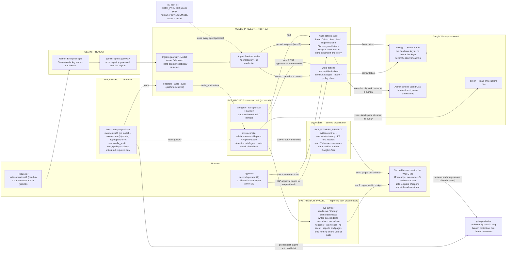

# 1. Platform high-level design

## Status
- Owner: the platform owner
- Last reviewed: 2026-09-13
- Maturity: platform HLD, written 2026-09-13 from the judged winner of three independent
  candidates ("proportionate operator"), with the ideas a majority of the three judges asked to
  graft from the other two ("containment first", "Google-native maximalist") and the factual
  errors any judge proved removed. Nothing is built. This is the page every other page of the
  `platform/agentic-platform/` set and the three agent sets point at.
- Inputs: the objective of 2026-09-13 and the review of the documentation against it
  ([00-objective-review.md](00-objective-review.md), whose §4 gap register and §5 decision list
  this page answers); the nine lens reports it cites; the three candidates and three judgements
  under `.agent-work/hld/` (outside the wiki; copying them into `review/` is *tbd*).
- Angle: designed for the organisation that exists on 2026-09-13 — **one administrator, no SOC,
  no second super admin outside his own line** — with a growth path to hundreds of agents.
  Every control names who runs it. A tier does not open until the people and services it needs
  exist (§0.4). If a control is not operable by the people at the tier where it is required,
  the control is wrong, not the people.
- Standing constraints, unchanged: no domain-wide delegation; the language model holds no
  credential and cannot approve; the action service is the only holder of a Workspace
  credential; humans raise autonomy and machines lower it; no model produces an Eve approval or
  signature (Eve may hold a separate, model-permitted reporting path, never an approval path —
  and, decided on 2026-09-13 in §13.2, that path writes reports and pages only: nothing it
  writes is read by the gate or by any action service);
  Mo holds no credential and reaches production only through a pull request a human merges;
  safety interlocks are plain authenticated REST; no secrets in the wiki.
- Super Admin for Wall-E is the owner's decision and is not re-argued here. "What this reverses
  and what it costs" and §13.1 say what it costs in safety and what compensates.
- Conventions: `Assumption:` marks inferred facts; *tbd* marks values nobody has decided; every
  Google product named carries a source in §19, verified by a lens or a judge on 2026-09-13
  unless the row says otherwise; no gcloud flag, IAM role, constraint, API or product on this
  page is invented — where a name is unverified the row says so and a decision in §17 owns it.
- The two diagrams are in §3.1 (the landing zone) and §13 (the three agents).

---

## What this reverses and what it costs

The documentation this page sits above was designed for a **narrow** Wall-E: a custom admin
role scoped to a pilot organisational unit, a fixed catalogue of about twenty typed operations,
"Never Super Admin" written as design intent on nineteen pages and enforced by a setup script
that fails its own hardening check the moment the robot is a super admin. The objective of
2026-09-13 reverses that: Wall-E holds **a dedicated, licensed user account with Super Admin**
and may perform **any super-admin-level action** of Google Workspace on a human's prompt.

Two Google facts fix the consequences and are not negotiable: a service account can hold any
Workspace admin role **except** Super Admin (so the account is a user account, and decision 26
closes for Wall-E by fact); and Super Admin **cannot be limited to an organisational unit or
subset by privilege**. Everything below follows from those two lines.

**What safety the platform loses, stated without softening.**

| Lost | What it was | What it is now |
|---|---|---|
| The Workspace-side gate | Two enforcement points: the action service and Google refusing an operation outside the pilot OU or outside the role ("even a total failure of every control in the action service leaves Workspace refusing the call at Google's end") | One enforcement point: the action service. The consented OAuth scope set is the only Google-enforced ceiling left. Every control that read "not in the role" — the OU allow-list, N1 and N2, role-grows-with-the-ladder, the credential-leak bound, `SAFE_USER_FIELDS` — is enforced by code in the component under audit. The sentence quoted on the left is deleted from `SETUP.md` §0.2 and `setup/README.md` |
| The blast radius | A leaked token bounded by the role's privileges at the current ladder stage | A leaked token or an interactive login is a **tenant compromise** and, through the console's power to grant Organization Administrator or a `cloud-platform` token, a path into the **GCP organisation** including `EVE_PROJECT`, `MO_PROJECT` and the core projects. Nothing in Workspace or GCP narrows the account; the perimeter is custody, scope split and detection latency |
| Eve's structural independence | Eve's project, credential, key and halt authority were out of Wall-E's reach by construction | The credential can `users.makeAdmin`, suspend `eve@`, revoke Eve's token, remove Eve's role, switch off "Share data with Google Cloud services" and re-filter the organisation sinks. Only code and detection stop it. Inside the tenant's organisation Eve's independence is **detective, not structural**; what leaves the organisation (evidence, incident record, pager) is structural (§13.2) |
| The catalogue as a ceiling | "Nothing executes that is not registered"; a generic Admin SDK proxy rejected (challenge C35) | The catalogue stays the **declared intended purpose** and the only band that can be autonomous; a generic, schema-validated, always human-approved lane (band B) and a console handoff lane (band C) carry the breadth. Decision 27 becomes "which lane", not "whether" |
| Least privilege as a property | TISAX 4.2.1 shown by an enumerated role | A **signed deviation**, row one of the risk register, carried entirely by the bands, the two lists, the ladder, Eve and a split control plane. An assessor may still refuse maturity 3 on it |
| The narrow-task argument under the EU AI Act | Rested on the role and the catalogue | Rests on the declared intended purpose (the catalogue), the hard-denied list enforced in code with CI ownership outside the agent repository, and audit logs showing no out-of-catalogue operation outside band B under approval. The account's privilege is the fact most likely to be held against it (§14.1) |
| Detection as a check on enforcement | Alerts confirmed what the role already refused | **Detection is the primary control** for the super-admin tier, and the page says so instead of pretending the catalogue still is |

**What compensates — preconditions of the grant, none deferred.** In one line each; §13.1 has
the mechanisms and the enforcement grade of each:

1. Three action bands (catalogued autonomous work; a generic, Discovery-validated, permanently
   L3 lane; console-only work handed to a human with a watch for the matching event) and an
   explicit prohibition on automating the Admin console under the robot's session.
2. Two lists: hard-denied in every lane (anything targeting the robot, Eve, the control groups,
   the two OAuth clients, the activity rules, audit-log sharing, the organisation sinks, other
   admins' security settings and backup codes; `users.makeAdmin`; any Super Admin assignment;
   deletion of any admin; DWD) versus reachable only through band B at tier `SUPER` under a
   two-person rule.
3. Two credentials read by two services: a narrow OAuth client for the catalogue (keeping a
   Google-enforced ceiling for anything unattended) and a broad client for band B; decision 18
   (control-plane split) lands now; `cloud-platform` never consented, checked in CI.
4. Detection as the primary control: Eve's minute-latency reconciliation of every
   robot-attributed event in every ingested stream, a daily super-admin roster check from Eve's
   own credential, an evidence heartbeat, and a severity-1 detection set hosted in the SIEM
   outside Wall-E's project.
5. Account hygiene: hardware-key-only 2SV enforced by the tenant on the robot OU (Google's own
   admin-2SV mandate is a gradual, edition-scoped rollout, not a universal rule — §4.6),
   super-admin self-recovery **Off at the top organisational unit** with a drift check that no
   child OU or configuration group re-enables it (the setting is per OU or configuration group,
   not tenant-wide, and defaults to On for Enterprise Standard/Plus — §13.1 item 6), no recovery
   channels, Google's fixed one-hour Admin console session with Google Cloud session control at
   1 h on the OU, never the only or the recovery super admin, at least two human super admins,
   Workspace multi-party approval on (P66), K6 (a human removes Super Admin from the robot).
6. The deferred controls, no longer deferred: a perimeter model for the agents folder, the
   second deploy reviewer, Privileged Access Manager on the deploy grant, Eve's observe-and-report
   layer live and drilled before the grant, a witness organisation the tenant's super admins do
   not administer, and a **second human outside the Wall-E administration line** as Eve's owner.
7. A permanent ceiling: no super-admin-class operation is ever autonomous, stated in the same
   sentence as "`WRITE_HIGH` never reaches L5".
8. A signed record: a dated decision "Wall-E holds Super Admin" — register row **P33**, file
   `decisions/2026-09-13-wall-e-holds-super-admin.md` — superseding decision 26 for Wall-E,
   re-ratifying decision 4 with the two lists, entering the residual in the accepted-risks
   table, as a TISAX deviation signed by the security reviewer, and as row one of the risk
   register.

The other reversals the review found follow from the same objective and are decided on this
page: Eve gains a reporting path that may reason (§13.2; register row **P34**, file
`decisions/2026-09-13-eve-reporting-path-may-reason.md`); Eve detects misbehaviour across every
stream rather than verifying catalogued plans (§13.2); Mo's remit includes Eve (§13.3); "four
projects" becomes a pattern produced by a factory (§3); compliance is two named regimes, not data
protection alone (§14); Eve's observe-and-report layer arrives before the grant, not at Stage 3
(§13.2).

---

## 0. Thesis, primitives, operating model and the tier gate

### 0.1 Thesis

The objective asks for enterprise-class security and monitoring for hundreds of agents, from an
organisation that on 2026-09-13 runs one administrator. The two ways to fail are to design a SOC-shaped
platform nobody can operate, or to declare the pilot's hand-built controls "the platform" and let
the second agent re-implement them. This page does neither. It puts every control that can be
**set once and enforced by Google** (organisation policy, deny policies, Principal Access
Boundaries, Model Armor floors, Binary Authorization, Security Command Center, aggregated log
sinks) at the folder, where one person can own it; it puts every control that needs **a second
person or a 24x7 desk** in the tiers that need it, and refuses to open those tiers until the
person or the service exists. A read-only assistant costs a register row and a factory run. A
super-admin robot costs a witness organisation, a second super admin, a bought detection desk and
a signed deviation. The platform is the folder, the factory, the register, the contract and the
gate — not the three agents, which are its first three tenants.

### 0.2 The six containment primitives, and how each is graded

Every control on this page is either **enforcement-grade** (Google or the platform refuses the
action) or **detection-grade** (the action happens and something independent sees it within a
stated latency). **Nothing detection-grade may stand alone in a safety argument.** The rule is
lifted from [../wall-e/13-agent-interconnection.md](../wall-e/13-agent-interconnection.md) §9
and made a platform rule; every table below that grades a control uses these two words.

Renamed 2026-09-13: the six primitives are **CP1–CP6** so that they are never confused with the
platform decisions P1–P142 of §17 and [12-open-decisions.md](12-open-decisions.md); every page of
the set that cited a primitive as "P5" or "HLD P3" was edited to the CP form.

| # | Primitive | What it promises | Enforced by | Grade | Section |
|---|---|---|---|---|---|
| CP1 | A trust boundary the agent cannot redraw | Principal, project, gateway, floor and deny policy are created by a factory and governed at the folder; the agent's owner cannot loosen them | Resource Manager folders, Organization Policy (built-in and custom constraints), the factory's CI identity, Privileged Access Manager | enforcement | §3, §4, §15 |
| CP2 | Autonomy as data; humans raise, machines lower | One `agent-manifest.yaml`, one `ladder.schema`, one `audit.schema`; promotion is a pull request with evidence a validator recomputes | Validator custodian, branch protection, the action service's ceiling module | enforcement (in the action service) | §12 |
| CP3 | A capability ceiling outside the agent's process | The model holds no credential; the action service is the only credential holder; ceilings are code in the action service and permissions the deny policy refuses | Action service, folder deny policy, PAB, the OAuth scope set | enforcement | §4, §11, §13 |
| CP4 | A fleet kill switch outside any agent project | One organisation-policy flip and one deny rule stop every agent principal; drilled monthly | `gcp.restrictServiceUsage` at the tier folder, IAM deny policy at the folder, Scheduler pause per tier, PAB once its blocked-permission list is verified | enforcement | §11.4 |
| CP5 | A model-free monitor with halt authority | The path that approves, halts, demotes or vetoes contains no model; the reporting path may reason but writes reports and pages only — nothing it writes is an input to a verdict (§13.2) | Eve's control path; CI check forbidding a model client in the image; no `aiplatform.*` in `EVE_PROJECT` by a **project-level** `restrictServiceUsage` denylist on `EVE_PROJECT` itself (not on `fld-controllers`, whose other child, the reporting path, needs the API) | enforcement (by absence) | §13.2 |
| CP6 | Evidence the judged thing cannot forge or silence | Google-written audit streams copied to a store outside the reach of the agent, its owner and — for the super-admin case — the tenant's super admins | Organisation-level sinks into a locked bucket, the SecOps export, the witness organisation, an absence alarm | detection, with an absence alarm | §7, §8, §13.2 |

### 0.3 Who exists on 2026-09-13, and the roles the platform needs

The platform RACI with the minimum staffing per tier and the separation rule per role. Names
are supplied by the ISMS; on 2026-09-13 every role on the left is one person, which is the finding most
likely to stop a TISAX assessment (1.2.2) and the reason the tier gate in §0.4 exists. Tiers are
lettered (§11) so they never collide with the ladder's trigger classes T0–T3. [TIS-03, EVE-06,
TIS-09]

| Role | Duty on the platform | Minimum for C–R | Added for W | Added for P / P-SA | Added for X | Separation rule |
|---|---|---|---|---|---|---|
| Platform owner | Folder, factory, register, floors, baseline modules, this page | the platform owner | — | — | — | not the IT security lead |
| AI compliance owner (added 2026-09-13 on the reconcile pass, P131; [10-eu-ai-act.md](10-eu-ai-act.md) §4.1) | Signs classifications, files Art. 49 registrations, answers an authority, owns the Art. 73 clock and the Art. 4 briefing content | consulted (legal's designate) | consulted | **engaged**, with a named deputy | — | not the platform owner and not an agent owner |
| Agent owner | One per agent: manifest, playbooks, register row, budget | the builder | — | — | — | — |
| Operator / approver | Approves L3 requests, pulls K0/K1, grades | agent owner may double | **second named operator**, not the agent owner (≈2 h/week) | band B approver must be a **human super admin ≠ requester** | — | approver ≠ requester, always |
| Security reviewer (decision 37) | Reviews ladder raises, deny/floor changes, PAM approvals, deviations | platform owner (self-review recorded as such) | **IT security person** (≈2 h/month) | signs the super-admin deviation; owns SIEM content with the MDR partner | AI-safety reviewer (does not exist) | not the platform owner |
| Deployer (CI operator) | Runs the factory and the release pipeline | platform owner | + second reviewer on every credential-holder deploy | — | — | neither is the owner of the agent deployed |
| Eve owner | Owns `eve-owners@`, `eve/config` second review, the witness | — | platform owner | **second human outside the Wall-E line** (IT security) | — | outside the Wall-E administration line; witness administrator |
| Mo owner | Runs Mo's CI, seeds the blind sample | platform owner | blind grader ≠ playbook owner (≈1 h/week per Tier W agent) | — | — | not Eve's second reviewer |
| Detection desk | Acknowledges sev 1/2 within the SLA, runs the catalogue | Google-run (SCC findings via a Pub/Sub notification config to the Terraform-managed channel) | + central logging, absence alerts | **bought**: SecOps + managed detection and response, or the organisation's SOC (P10) | + independent monitor review | — |
| Incident commander | Leads sev 1, talks to the DPO and the works council | platform owner | IT security | IT security, with an on-duty second super admin who can pull K5/K6 | — | — |
| Human super admins | Hold the role on separate admin accounts with hardware keys | ≥ 1 | — | **≥ 2**, the robot never the recovery one | — | separate admin accounts, short session |
| DPO contact | DPIA, records of processing, retention ceiling | consulted | consulted | **engaged**, before Stage 1 | — | — |
| Validator custodian | Runs the recompute Mo cannot reach | platform owner | security reviewer's project | — | — | not Mo's CI operator |

Every role has a training outline and completion record refreshed at each stage transition
(Art. 4; TISAX 2.1.3 — and 9.7.2 only if the Data Protection module ever enters scope, §14.2).

### 0.4 The tier gate: what must exist before a tier opens

| Tier | Opens when | Bought | Hired or assigned |
|---|---|---|---|
| **C classical** | The register and the Gemini Enterprise baseline (§2) exist — the gate closes at runbook step GE-14 of [03-gemini-enterprise-environment.md](03-gemini-enterprise-environment.md) §16 | Gemini Enterprise licences (exist); SCC Premium at organisation level (§7) | nobody new |
| **R read tools** | Factory, folder baseline, central logging, shared registry exist | as C | nobody new |
| **W write agents** | Autonomy contract, platform verifier, validator custodian, nonprod folder, one restore drill done; for any Tier W agent acting on employee accounts, works-council information given before its Stage 1 (moved here from the P line on the reconcile pass of 2026-09-13, P129; it stays a precondition of the grant as well) | Binary Authorization pipeline (no licence cost; build time) | second operator; security reviewer (part-time from IT security); blind grader |
| **P privileged** and the **P-SA super-admin singleton** | Everything in W plus: Eve's observe-and-report layer live and drilled; the witness organisation (§13.2); SIEM with 24x7 acknowledgement; two human super admins with the robot never the recovery one; penetration test done; DPIA started; works-council information given; the signed deviation; the two lists signed; the perimeter decision taken | Google SecOps in the EU (or the organisation's SIEM); a managed detection and response retainer covering the super-admin detection set; PagerDuty or equivalent; hardware keys | a second human super admin **outside the Wall-E administration line** as Eve owner; a DPO engagement; an incident commander from IT security |
| **X AGI-class** | **Not open.** §11.5 lists the conditions; on 2026-09-13 one (the sandbox stage) is met and four are not | GKE Agent Sandbox tier in `europe-west1` (GA per Google's post of 2026-05-21 — [09-supply-chain-secrets-recovery.md](09-supply-chain-secrets-recovery.md) §4.1, P122); a second model family for advisory monitors | an AI-safety reviewer role; a provider capability-evaluation report per model pin |

The super-admin grant is therefore a **gate with its own checklist**, not a runbook phase. The
grant happens on the day the last row of the P line is green, and "the four owner groups are one
person" expires that day.

### 0.5 Cost classes

Prices are not quoted (pricing pages were not read). Each line names the driver and who pays;
amounts are *tbd* for the detailed design. [SCA-10]

| Cost | Driver | Paid by | From tier |
|---|---|---|---|
| SCC Premium | organisation-wide, all projects | organisation IT security (`Assumption:` platform budget line until then) | C |
| Central log ingestion and locked retention | Workspace audit volume (the largest line in the set on 2026-09-13) plus Data Access logs | platform | R |
| Google SecOps + MDR | events per day, retention months, retainer | IT security | P |
| Workspace licence + admin role per Tier P agent | one licensed user each — Tier P stays rare by policy | agent owner's cost centre | P |
| Model Armor | requests sanitised per project (1,200 QPM sanitize per project — one argument for project-per-agent) | agent budget | R |
| Witness organisation | one Cloud Identity tenant, one project, one bucket, one dataset, a few channels, two hardware keys | IT security | P |
| Chrome Enterprise Premium licences (added 2026-09-13 on the reconcile pass, P63) | device-posture access levels on every Tier W+ control surface; one licence per operator and approver; *tbd* (procurement); `al-platform-operator-lite` until then ([04-identity-and-privileged-access.md](04-identity-and-privileged-access.md) §6.3) | platform | W |
| Human hours | §0.3 rows | — | per tier |

### 0.6 Traceability: the objective's sixteen requirements and the register ids not cited elsewhere

The review's §3 numbered the objective R1–R16. Where each is met or explicitly declined:

| R | Requirement (short) | Met by | Declined or qualified |
|---|---|---|---|
| R1 | Secure Gemini Enterprise environment; agent identity, registry, Model Armor | §2, §4.1, §5, §6 | — |
| R2 | Other security elements, with the correct path | §3.3, §4.5, §7, §8, §9, §11.4 | — |
| R3 | Wall-E executes on a human prompt | §13.1 band A, T0 | — |
| R4 | Any super-admin-level action | §13.1 bands A/B/C | the literal reading is declined: band C is instructions to a human and the hard-denied list is refused in every lane (§13.1 item 2, P28) |
| R5 | Dedicated licensed user account with Super Admin | §13.1, P33 | — |
| R6 | Eve controls and reports any misbehaviour | §13.2 detection catalogue, reconciliation over every stream, P34 | "any" ends where enumeration ends; the reporting path is report-only |
| R7 | Eve holds no super admin | §4.6, §13.2 | — |
| R8 | Eve independent and autonomous | §13.2 (detective inside the organisation, structural through the witness) | structural independence inside the tenant's organisation is declined as unachievable; P15 is the end state |
| R9 | Eve reports to the human | §13.2 reporting contract, the second human | — |
| R10 | Mo improves both | §13.3 | — |
| R11 | Hundreds of agents | §3, §5, §11, P25 | the cap is grading capacity, not projects |
| R12 | Future AGI agents | §11.4, §11.5, Tier X | declined for 2026: Tier X is a closed folder until §11.5's conditions hold |
| R13 | Enterprise-class security and monitoring | §7, §0.4 tier gate | below Tier P the detection desk is "next business morning", stated |
| R14 | EU AI Act bulletproof | §14.1 | "bulletproof" declined: what cannot be promised is listed |
| R15 | TISAX compatible | §14.2 | maturity 3 on 4.2.1 may be refused on the super-admin deviation |
| R16 | Review all, focus on the HLD, then the detailed design | [00-objective-review.md](00-objective-review.md); this page; §18 | — |

Register ids of the review's §4 whose substance is answered on this page without being cited
at the answering line: MON-01 and PS-08 (§7.1 central logging and SCC); MON-05 (§7.1 Data
Access config); MON-06 (§7.1 SCC Premium); MON-11 (§7.5, §14.3 evidence register); CON-08
(§14, both regimes named); AIA-03 (§14.1 Art. 14 row); AIA-05 (Art. 11 row); AIA-06 (Art. 50
row); AIA-07 (Art. 26(7) row); AIA-09 (Art. 9 and Art. 10 rows); AIA-12 (Art. 4 and Art. 5
rows); AIA-13 (Art. 27 row); WSA-04, WSA-05, WSA-06, WSA-08, WSA-11 and EVE-07 (§13.1 items 2,
3, 6, 5, 7); MO-07 (§13.3, rule 3 and the `mo-analyst@` read endpoints); CON-06 (§18 preamble,
the dated line per page). Nothing in the register is deferred to the detailed design without a
section here naming the mechanism.

---

## 1. The platform charter

What the platform promises every agent and what it demands of every agent. Lifted, where the
review said "verbatim", from `wall-e/ARCHITECTURE.md` §12, [../project-topology.md](../project-topology.md)
"the one rule", `wall-e/06` blast-radius method, `wall-e/12` §1.4, `wall-e/13` §9, `wall-e/05` §1,
`eve/01` and `mo/01`. [SCA-01, CON-05]

**Promises.**

| # | The platform promises | Mechanism | Who runs it |
|---|---|---|---|
| PR1 | A project of your own, made by the factory in under an hour, with APIs, identity, gateway, sinks, budget, labels and deny policy already in place | §3 factory | platform owner runs the pipeline; the CI identity does the work |
| PR2 | Your identity is issued by Google, has no key, and expires daily | Agent Identity (§4) | Google |
| PR3 | Your egress is default-deny and your ingress is screened, so an injected prompt cannot reach a secret or the internet through you | Agent Gateway + Model Armor (§6) | folder constraint; Google enforces |
| PR4 | Your logs go somewhere you cannot delete, and somebody is paged if they stop | central logging, absence policies (§7) | platform; the detection desk of your tier |
| PR5 | A kill switch exists outside your project, and it is drilled | fleet kill (§11.4) | platform owner + security reviewer |
| PR6 | Your autonomy can rise on evidence and never on the calendar, and only a human raises it | autonomy contract (§12) | agent owner + reviewers |
| PR7 | Your compliance classification is done once, at the gate, not re-argued per auditor | publication gate (§5.3, §14) | platform owner + DPO |
| PR8 | You are never asked to implement a control the tier above you needs | tier model (§11) | this page |
| PR9 | The ladder, the validator and the approval surface are services, not code you rewrite | §12 | platform |

**Demands.**

| # | Every agent must | Enforced by |
|---|---|---|
| D1 | Have a register row (owner, tier, purpose, data classes, EU AI Act class, TISAX class) before it exists in any project | CI: the factory refuses without it; reconciliation flags what exists without one |
| D2 | Run with Agent Identity, bound to a gateway, in a factory-made project — no exceptions below Tier P, and Tier P exceptions are dated | folder custom constraints where supported (spike P4), CI otherwise |
| D3 | Never hold a credential in the reasoning layer; if it writes, it writes through an action service that holds the credential and decides | tier rule (W+); folder deny policy on the agent principal set for `secretmanager` |
| D4 | Never both decide and act; never grade its own work; never loosen its own autonomy | charter rule; contract validator; humans-only raise path |
| D5 | Write its audit rows to the platform schema with the correlation keys, insert-only, write-ahead, into a dataset the platform can read | `audit.schema` (§12); Mo's reader grant recorded in the topology |
| D6 | Treat every peer agent as principal type `agent`, L0 for every write, tainted on receipt | contract; action-service policy chain |
| D7 | Cross a project boundary only through a grant on the resource, never a project-level role; anti-grants asserted by the drift job. The platform's own folder-level principals — the drift job's `roles/iam.securityReviewer`, the K7 job's PAM entitlement, the folder deny policy and the PAB — are the **named exceptions**, listed with their level and maker in §18 item 25 and recorded as a dated exception to topology decision 48 (they are inherited into `EVE_PROJECT`) | the one rule; Policy Analyzer drift job at the folder |
| D8 | Grade every feature it relies on as enforcement or detection, and put nothing detection-grade alone in its safety case | design review at admission |
| D9 | Be re-qualified on every model pin change: a fingerprint tuple change resets any cell above L3 | contract validator (C15 generalised) |
| D10 | Be removable: deleting the project removes the agent and nothing else; its evidence has already left | evidence lake + retention lock (§7, §10) |
| D11 | Hold no write on any repository, Artifact Registry, deploy identity, its own ladder or its own ceilings | folder deny policy, branch protection, Binary Authorization (§9) |
| D12 | Expose its safety interlocks as plain authenticated REST, never over an agent protocol | `/v1/control/*` endpoints; `run.invoker` on named principals |

---

## 2. The secure Gemini Enterprise environment

The objective's first sentence. On 2026-09-13 [../gemini-enterprise.md](../gemini-enterprise.md) is a
skeleton. This section is that page's HLD content; the detailed page is owned jointly by the
platform owner and the Gemini Enterprise administrators (the same person on 2026-09-13). [PS-04, PS-06,
CON-05, AIA-10]

### 2.1 The tenant app and its project

| Item | Decision | Reason |
|---|---|---|
| The app | One Gemini Enterprise app per tenant is the front door for every human-facing agent. Agents no human talks to (Eve's control path, Mo's jobs) are not published in it | One front door, one audit log naming the human |
| Project | `GEMINI_PROJECT` under `fld-gemini-enterprise` (§3.1) so it inherits the folder baseline, floor, deny policy and aggregated sink. The topology records (`Assumption:`) that the app **already exists** in a project of its own, and a live tenant app cannot be re-created by a factory, so the factory's first `tenant-app` run is an **import**, not a create: the existing project is imported into the module's state, moved under `fld-gemini-enterprise` with the Gemini Enterprise administrators' agreement, and reconciled to the module (a move changes inherited policy, so the move is a dated change window with the drift job's zero-diff as the exit). If the administrators do not agree, the project stays where it is as decision 52 allowed — recorded as the one project outside the folder, with the floor, the deny policy, the `discoveryengine` Data Access config and the sink re-applied at project level by the same module — and the exception carries a review date. Topology decision 52 therefore becomes "the app project is a platform project, imported in place"; the reason for departing from 52's "only if they agree, otherwise outside" recommendation is that `gemini-egress` (below) makes the app project a **publication enforcement point**, and a project outside the folder misses the floor, the deny policy and the aggregated sink that make that enforcement auditable | The Discovery Engine service agent is project-wide; the app project hosts nothing of any agent's |
| App location | `eu` | Residency; `global` only if a feature the tenant needs is `eu`-unavailable, recorded as a dated exception |
| Identity provider | **Google Identity** for the `eu` location (decided 2026-09-13 on the reconcile pass, P51; [03-gemini-enterprise-environment.md](03-gemini-enterprise-environment.md) §6): `wall-e/12` §5 case (a); no workforce pool for the tenant app (P24 is "no" for the front door); a later change of provider deletes conversation history and is a decision record, never a console act. Workspace SSO to a SAML IdP, if any, sits upstream of Google Identity and changes nothing here (*tbd* in [../google-workspace.md](../google-workspace.md)) | One identity for people; the human `sub` in the `StreamAssist` Data Access log is the correlation key |
| Administrators | `ge-admins@` holding `roles/discoveryengine.agentspaceAdmin` on `GEMINI_PROJECT` (the role name the set verified, `wall-e/PREREQUISITES.md` §10 item 25) **through Privileged Access Manager for changes**, standing for reads; membership change is a detection | Admission is an IAM decision recorded by PAM, not a console habit |
| Who may build in the console | Feature toggles are set **per Gemini Enterprise app** on its Configurations > Feature Management tab by `roles/discoveryengine.agentspaceAdmin` (with one app per tenant, per-app is tenant-wide in practice; corrected 2026-09-13, §19): "Enable chat agents", "Enable workflows" (Workflow Builder, formerly Agent Designer), "Enable Agent Gallery", "Enable skills", "Enable agent sharing" with optional admin approval — off for the general population, on for `ge-builders@`; Marketplace agents enter through Agent Gallery's request-then-admin-approval flow | A no-code agent is still a Tier C agent and needs a register row |
| Console Model Armor | On from day one — set **per app** (App > Configurations > Assistant, by `roles/discoveryengine.agentspaceAdmin`; with one app per tenant it is tenant-wide in practice), template `ge-console-standard` in `GEMINI_PROJECT` from the Tier C row of the template standard, failure mode **Block**, drift-checked daily (corrected 2026-09-13 on the reconcile pass — P53, P87; [03-gemini-enterprise-environment.md](03-gemini-enterprise-environment.md) §9, [06-gateways-model-armor-perimeter.md](06-gateways-model-armor-perimeter.md) §3.5). Recorded as not covering custom agents (ADK, A2A, Dialogflow — `wall-e/11` §2); those are screened at their own gateway | Covers the no-code and data-store agents that never see a project floor |
| Connectors and actions | Allow-list committed in git and **enforced as organisation policy at `fld-gemini-enterprise`** (`discoveryengine.managed.allowedDataSources`, `discoveryengine.managed.allowedEgressFqdns`, both with `enforcedProjects` = `GEMINI_PROJECT_NUMBER`; the managed custom-MCP block kept enforced — corrected 2026-09-13 on the reconcile pass, P58; [03-gemini-enterprise-environment.md](03-gemini-enterprise-environment.md) §12), not applied by hand; every connector is a supplier row (§14.3); no connector carries a Workspace write credential — Wall-E is the one write path and it runs through an action service | A connector is a credential the tenant holds on users' behalf |
| Data-store residency | EU only; a data store outside the EU is a dated exception | Same rule as the folder |
| Conversation retention | *tbd* by the DPO (P13), recorded in the retention schedule (§7.5). Google's selectable values are 1, 30, 60, 90, 120 or 180 days, default 60, and configuring the assistant requires the Plus edition (tenant edition *tbd*); the interim `Assumption:` recorded on the reconcile pass of 2026-09-13 is **30 days** (P52 and P113 aligned; [08-data-logging-retention-sovereignty.md](08-data-logging-retention-sovereignty.md) §5.2 R8) | The conversation store is a personal-data store the sets forgot |
| App audit logs | `discoveryengine.googleapis.com` Data Access logs (`StreamAssist`, `AnswerQuery`, `GetAgentCard`, `Search`) enabled at folder level, routed to `LOGGING_PROJECT` | The only log that names the human behind a request |
| Egress gateway for the tenant app | **Decided: yes; the binding is documented (GA-labelled page of 2026-09-08) and P57 is its staged protocol** (corrected 2026-09-13 on the reconcile pass; [03-gemini-enterprise-environment.md](03-gemini-enterprise-environment.md) §11). The app is bound by `PATCH …/engines/GE_APP_ID` setting `agentGatewaySetting.defaultEgressAgentGateway.name`, or on the app's Security tab; an `eu` app binds a gateway in **`europe-west1`**; all app traffic including LLM calls is routed; agents are explicitly imported. The egress Agent Gateway `gemini-egress` in `GEMINI_PROJECT` (Agent-to-Anywhere mode) is default deny with an access policy **generated from the register** listing exactly the engines whose row is `prod` and published. Throwaway-app spike, then dry-run 30 days, then enforce. The spike's open questions are whether `DRY_RUN` applies to the app binding and what the LLM-call path costs — not `eu` support. If the spike fails, the connector allow-list plus the per-engine query grant is the compensating control and the gap is recorded as a dated row | "Secure all agents through it" is not true while the front door's own egress is unbound; with the binding, an engine not in the register is unreachable from the front door by network, not only by policy — the register becomes an enforcement point for publication |
| Semantic Governance | **Never on any authority path.** It is an LLM judge whose verdicts "may not be accurate"; it may annotate cards as advisory | The cheapest refusal to write down |

### 2.2 How agents are admitted, shared and revoked

| Step | Tier C (no-code / data-store) | Tier R and above (own project) | Who |
|---|---|---|---|
| Admit | Register row merged (§5) → builder creates the agent in the console → nightly reconciliation matches the console agent to the row; unmatched agents are a finding and are unpublished | Register row → factory → engine registered in the shared Agent Registry by CI → the admission gate (§5.3) passes in one CI run → CI grants `GEMINI_PROJECT`'s Discovery Engine service agent a custom role holding only `aiplatform.reasoningEngines.query` **on the engine resource** (decision 42 generalised: never a project-level role on the agent project) and adds the endpoint to `gemini-egress`; registration into the app is a PAM-elevated act by `ge-admins@`, logged | CI identity; builder; platform owner approves the row |
| Share | To a named group, never "everyone in the organisation", for anything above Tier C; Tier C may be tenant-wide if its data stores are | The audience group named in the register row; for write-capable agents it is also the operator group the action service re-checks live on the write path; the share is made by CI, not by hand | Gemini Enterprise admin approves the group |
| Revoke | Console unpublish; row → `retired` | **One factory operation `revoke`**: removes the engine grant to the service agent, removes the endpoint from `gemini-egress`, sets the register row and the registry card `retired`, calls `halt_all` for a write agent, and schedules project deletion after the evidence export confirms. A pull request merged by two humans and applied by CI | agent owner requests; platform owner approves; a Tier P revoke is also K3 |
| Emergency unpublish — three levers ordered by speed | Console unpublish by `ge-admins@`, any hour | (1) remove the engine from `gemini-egress`'s access policy — seconds, `ge-admins@` through PAM; (2) remove the service agent's query role on the engine — a minute, the agent project's CI; (3) unpublish in the console. All three audited into `LOGGING_PROJECT` and the SIEM; K3 (remove `run.invoker` / the query role) and K7 (§11.4) sit behind them | on-duty admin; recorded as an incident |

Everything a Gemini Enterprise administrator does is administered in the **Google Cloud
console** and logged to **Cloud Audit Logs** under `discoveryengine.googleapis.com` — Admin
Activity (`CreateEngine`, `UpdateEngine`, `DeleteEngine`, `CreateAssistant`, `UpdateAssistant`,
`UpdateAclConfig`, `UpdateCmekConfig`, agent registration) and Data Access (`StreamAssist`,
`AnswerQuery`, `Search`, `GetAgentCard`, `GetEngine`, `ListEngines`) — routed through the
aggregated sinks (§7.1) to `LOGGING_PROJECT` and the SIEM; only the per-OU service toggle is a
Workspace admin-audit event (corrected 2026-09-13 on the reconcile pass;
[03-gemini-enterprise-environment.md](03-gemini-enterprise-environment.md) §1 row 1, §13).

---

## 3. The landing zone

### 3.1 Folder tree

`FOLDER_ID` in the sets becomes `fld-agentic-platform`. Everything below it is made by the
factory; nothing below it is made by hand after Stage 0. Tier folders carry the letters of §11.
[PS-01, SCA-02, PS-05, SCA-03]

```mermaid
flowchart TB
    ORG["GCP organisation of the Workspace tenant"]
    WIT["org-witness — a second organisation on a separate Cloud Identity<br/>administered by two IT-security super admins outside the Wall-E line<br/>(§13.2)"]
    ORG --> FAP["fld-agentic-platform<br/>org-policy baseline · deny policy on agent principals · PAB · Model Armor floor · aggregated sink · Data Access audit config · PAM entitlements"]
    FAP --> CORE["fld-platform-core"]
    CORE --> C1["CORE_PROJECT<br/>register of record (git) · shared Agent Registry · evidence lake · ladder-state page · reconciliation job · drift job"]
    CORE --> C2["LOGGING_PROJECT<br/>aggregated sink · locked EU log buckets · BigQuery log datasets · log views"]
    CORE --> C3["CICD_PROJECT<br/>Cloud Build · shared Artifact Registry · SLSA provenance · Binary Authorization attestor · WIF pool for CI · Terraform state"]
    CORE --> C4["VALIDATOR_PROJECT<br/>validator custodian (security reviewer)"]
    CORE --> C5["KMS_PROJECT<br/>Autokey key project · engine CMEK keys · platform-logs key · keys and nothing else (P118)"]
    FAP --> GE["fld-gemini-enterprise"]
    GE --> G1["GEMINI_PROJECT<br/>the tenant app, eu · gemini-egress gateway · gemini-registry (europe-west1) · console Model Armor template ge-console-standard · connector org policies"]
    FAP --> TR["fld-agents-r / prod · nonprod (optional)<br/>Tier R read-tool agents, one project each (Tier C has no project)"]
    FAP --> TW["fld-agents-w / prod · nonprod<br/>Tier W write agents, one project each"]
    FAP --> TP["fld-agents-p / prod · nonprod (sandbox tenant)<br/>Tier P privileged agents, one project each"]
    TP --> PSA["fld-agents-p-sa / prod · nonprod (sandbox tenant)<br/>the P-SA singleton: stricter policies, own floor, own kill-plane binding"]
    PSA --> W["WALLE_PROJECT<br/>engine · walle-actions (narrow client) · walle-actions-super (broad client) · Firestore · walle_audit"]
    FAP --> TX["fld-agents-x<br/>Tier X: empty; restrictServiceUsage allow-list empty until §11.4 is live"]
    FAP --> CTRL["fld-controllers / prod · nonprod"]
    CTRL --> E["EVE_PROJECT<br/>deterministic control path · eve-approval HSM key · eve.* · locked evidence bucket · aiplatform denied at project level · eve-export@"]
    CTRL --> EA["EVE_ADVISOR_PROJECT<br/>reporting path · no signer · no invoker · no secret · writes reports and pages only"]
    FAP --> IMP["fld-improvers / prod · nonprod"]
    IMP --> M["MO_PROJECT<br/>one Mo per platform, keyed on agent_id"]
    WIT --> V1["EVE_WITNESS_PROJECT<br/>evidence mirror · eve.incidents copy · sev 1/2 paging channels · K5 rota records · absence alarm on Eve and on Google's feed"]
    E -. "eve-export@ pushes the daily export + heartbeat into witness-owned stores (two grants, both on the witness side; no witness principal in the tenant)" .-> V1
    C2 -. "SIEM feed" .-> SIEM["Google SecOps (EU) or the organisation's SIEM<br/>+ SCC Premium at organisation level"]
```

| Folder | Holds | Org-policy additions beyond the baseline | Budget default (`Assumption:`, anchored on the 200 EUR Stage-0 line in the sets) |
|---|---|---|---|
| `fld-platform-core` | the **five** core projects (`CORE_PROJECT`, `LOGGING_PROJECT`, `CICD_PROJECT`, `VALIDATOR_PROJECT` and, added 2026-09-13 on the reconcile pass, `KMS_PROJECT` — the Autokey key project, keys and nothing else, P118); no agent principal exists here | `gcp.restrictServiceUsage` allow-list: logging, bigquery, storage, cloudbuild, artifactregistry, agentregistry, pubsub, iam, monitoring, cloudasset, cloudkms — the full list is [02-landing-zone-and-tiers.md](02-landing-zone-and-tiers.md) §4.2 | 300 EUR/month per project |
| `fld-gemini-enterprise` | `GEMINI_PROJECT` | `discoveryengine` Data Access logs on (inherited from the platform folder's `auditConfigs`, §7.1); `gcp.resourceLocations` gains `eu` for the app's multi-region; `discoveryengine.managed.allowedDataSources` and `discoveryengine.managed.allowedEgressFqdns` (both with `enforcedProjects` = `GEMINI_PROJECT_NUMBER`), the managed custom-MCP block kept enforced, custom constraint `custom.geDataStoreAclRequired` in dry-run (added 2026-09-13 on the reconcile pass, P48; [03-gemini-enterprise-environment.md](03-gemini-enterprise-environment.md) §3, §12) | *tbd* (licence-driven) |
| `fld-agents-r` | Tier R projects | no `secretmanager.googleapis.com` and no `cloudkms` signing in `restrictServiceUsage`; no write-capable Workspace API enabled | 100 EUR/month |
| `fld-agents-w` | Tier W write agents | `run.allowedBinaryAuthorizationPolicies` required; `run.allowedIngress = internal-and-cloud-load-balancing` (held until P3's spike 1, §3.3) | 300 EUR/month |
| `fld-agents-p` | Tier P privileged agents | as W plus the perimeter of §8, Access Approval, HSM keys, PAM on every deploy role | 500 EUR/month |
| `fld-agents-p-sa` | the singleton | as P plus `restrictServiceUsage` to exactly the services the Wall-E set names; own Model Armor floor (folder: template conformance; project: inline enforcement, §6.2) with the hard-denied vocabulary detectors in the P-SA response template; own kill-plane binding | 500 EUR/month |
| `fld-agents-x` | nothing | `restrictServiceUsage` allow-list **empty** until every buildable row of §11.4 is live and drilled | — |
| `fld-controllers` | Eve, eve-advisor | no `secretmanager` for any principal outside Eve's allow-list (deny policy); **the `aiplatform.googleapis.com` denylist is set on `EVE_PROJECT` at project level, not on this folder** — a folder denylist would apply to `EVE_ADVISOR_PROJECT` too, and the reporting path needs the API; CP5's "deterministic by absence" grade is therefore tied to the project-level constraint on `EVE_PROJECT`, drift-checked, and to the CI check on the image | 200 EUR/month |
| `fld-improvers` | Mo | no `secretmanager`; no `run` invoker of any credential holder (denial test MD-9 generalised) | 200 EUR/month |
| `*-nonprod` | a nonprod project per agent — **optional at Tier R, mandatory from Tier W** and for controllers and improvers (`fld-controllers-nonprod`, `fld-improvers-nonprod`, `fld-agents-p-sa-nonprod` added 2026-09-13 on the reconcile pass, P40; [02-landing-zone-and-tiers.md](02-landing-zone-and-tiers.md) §2.1, §3.5); sandbox Workspace tenant for Tier P (decision 29 → yes, before Stage 1: Super Admin cannot be limited to an organisational unit, so decision 29's "second robot scoped to the sandbox OU" of the production tenant contains nothing once the robot is a super admin — only a separate tenant does) | `iam.allowedPolicyMemberDomains` includes the sandbox tenant; the tenant gateway's access policy never lists a nonprod engine | 50 % of prod |

Project-per-agent is forced by Google, not chosen: `roles/discoveryengine.serviceAgent` is
project-wide over every engine, and all Agent Runtime agents in one project-region must bind the
same ingress and egress gateways. Hundreds of agents is hundreds of projects; Resource Manager's
limits (10 folder levels, 300 child folders per parent, adjustable project quota) make that
routine.

### 3.2 The factory

One Terraform pipeline in `CICD_PROJECT`, run by a CI identity through Workload Identity
Federation (no key), driven by one YAML file per agent that is the agent's `agent-manifest.yaml`
(§12.2), with modules whose inputs are [../project-topology.md](../project-topology.md) §3's grant
rows generalised. Cloud Foundation Fabric's FAST project factory (YAML-driven) is the reference
implementation; whether it is adopted or a bespoke module set was P2 — **closed by P35 on 2026-09-13** (Fabric `project-factory` module with thin wrappers; FAST stages not adopted; [02](02-landing-zone-and-tiers.md) §3.2). [PS-01, SCA-02]

| Module | Makes | Inputs from the register row and manifest |
|---|---|---|
| `agent-project` | project under the tier/env folder; APIs per tier; Agent Identity engine skeleton; egress gateway with default-deny access policy; ingress gateway with fail-closed Model Armor for machine-called engines; action service (Tier W+) with IAM-only invoke and, once P3 has passed, internal ingress behind the internal load balancer and PSC endpoint the module emits; regional secrets (W+); Firestore with PITR + scheduled backups + delete protection (W+); insert-only audit dataset on the platform schema; content-log bucket with generated reader IAM; Pub/Sub event topic; log views and absence policy with the organisation channel; budget; labels; Essential Contacts; monitoring baseline (§7.2); registry card; PAB binding for the project's agent identities; the per-project `principalSet://cloudresourcemanager.googleapis.com/projects/N/type/ServiceAccount` entry on the folder deny policy | `agent`, `owner`, `tier`, `env`, `risk_class`, `data_class`, `ai_act_class`, `tisax_class`, `cost_centre`, `recovery_class`, invoker principals, dataset readers, egress hostnames, Model Armor template id |
| `verifier-project` | Eve's shape: KMS key ring with an approval key at HSM level, verifier and gate identities, independent sink copy, evidence bucket with retention lock, `eve.*` datasets, no `aiplatform` | which agents it verifies; which manifests to compile ceilings from |
| `improver-project` | Mo's shape: metrics datasets, drop box (`mo-proposals`), three-tier IAM seam (raw reader, reporter, narrator), no invoker anywhere | which audit datasets it reads; which repositories it may open pull requests against |
| `tenant-app` | §2.1 | — |
| `revoke` | §2.2's one-command retirement | `agent_id` |

Every factory run ends with the drift job (§4.6) reporting zero diff. The runbooks' Phase 6 /
Phase 1 / Mo-0b become one factory call each; `walle_setup.py` keeps only the Workspace-side
phases. Per-project exceptions (the `gmail-api-push@` member; the
`iam.managed.disableAccessPolicyBinding` lift on `GEMINI_PROJECT` for the tenant gateway's
binding) are factory inputs with a named reason and a review date; for the agent and
controller folders that constraint is **not enforced as a folder value** instead of lifted per
project (corrected 2026-09-13 on the reconcile pass, P41;
[02-landing-zone-and-tiers.md](02-landing-zone-and-tiers.md) §4.1 B7).
Standing `roles/owner` is removed from every project after the factory runs; humans get a
predefined-role bundle back through PAM (`ent-project-repair`, §4.4 — PAM does not support the
legacy basic roles, corrected 2026-09-13). Nonprod engines carry the same manifest and ceilings with `env=nonprod`;
promotion from nonprod to prod is a Binary Authorization attestation (§9), not a copy.

### 3.3 Organisation-policy baseline at `fld-agentic-platform`

Set once, by the platform owner, in Terraform, drift-checked. Constraint names as the
platform-security lens verified them (PS-05) and as the candidates re-checked on the
constraints page on 2026-09-13; the two managed key constraints are both real names (legacy and
managed forms exist). [PS-05, SCA-05]

| Constraint | Value | Why |
|---|---|---|
| `gcp.resourceLocations` | `in:eu-locations` | Residency for every resource, no per-project checklist. Google's supported-services page (read 2026-09-13, §19) lists only Model Armor **template** creation as location-enforced and Agent Registry's regional resources; it does not list floor settings, so the `global` floor-setting write should not need an exception. The topology's §5 row and `wall-e/PREREQUISITES.md` §4.2 allow `global` for floor settings; that is verified at the first factory run — if the folder floor write is refused, `global` is added to the allowed set for the floor-setting resource only, as a dated exception in §8.2, and topology §5 is aligned either way (§18 item 25) |
| `iam.managed.disableServiceAccountKeyCreation`, `iam.managed.disableServiceAccountKeyUpload` | enforced | Keyless everywhere (`wall-e/12` §6); exception via PAM, dated |
| `iam.automaticIamGrantsForDefaultServiceAccounts` | enforced | Default SAs get nothing |
| `iam.allowedPolicyMemberDomains` | tenant customer id; + sandbox tenant in nonprod; + `gmail-api-push@system.gserviceaccount.com` exception recorded. **No witness exception**: the evidence mirror is a push by `eve-export@EVE_PROJECT` into witness-owned stores (§13.2), so no witness principal holds any grant in the tenant's organisation; the exception lives on the witness side, where its own `allowedPolicyMemberDomains` lists the tenant's customer id for that one principal | No foreign principals beyond an enumerated list |
| `iam.disableCrossProjectServiceAccountUsage` | enforced | The one rule: bindings, not attachments |
| `storage.uniformBucketLevelAccess` | enforced | No ACLs on evidence buckets |
| `run.allowedIngress` | `internal-and-cloud-load-balancing` on five folders — `fld-agents-w`, `fld-agents-p` (inherited by `fld-agents-p-sa`), `fld-controllers`, `fld-platform-core` (the five folders of [06-gateways-model-armor-perimeter.md](06-gateways-model-armor-perimeter.md) §4.3, P90; aligned 2026-09-13) — **held in Terraform, applied to the folders only after the P3 engine-reach spike passes** (§8.1) | "Credential holders are never internet-reachable" (§8) is the target; it cannot be applied on day one because Agent Runtime traffic arrives from a Google-managed tenant project that Cloud Run treats as external (`wall-e/01` verified row), so the policy would cut the engine off from its own action service until the internal load balancer and PSC path is proven. Until then IAM-only invoke is the enforced boundary and a Security Health Analytics custom module flags any Cloud Run service in W/P/controllers whose ingress is `all` (detection) |
| `run.allowedVPCEgress` | `private-ranges-only` (W+) — the value list (`all-traffic`, `private-ranges-only`) verified on Google's Cloud Run pages on 2026-09-13 ([02-landing-zone-and-tiers.md](02-landing-zone-and-tiers.md) §4.1 B17; the earlier `Assumption:` removed) | No direct egress from credential holders |
| `run.allowedBinaryAuthorizationPolicies` | `default` on `fld-agents-w`, `fld-agents-p` (inherited by `fld-agents-p-sa`), `fld-controllers` and `fld-platform-core` (extended from "W+" on 2026-09-13, P115: Eve's jobs, the K7 job and the drift job are Cloud Run on the authority and kill paths) | §9 |
| `gcp.restrictTLSVersion` | deny TLS 1.0 and 1.1 (added 2026-09-13 on the reconcile pass — the one line of the EU Data Boundary's policy set the baseline lacked; [08-data-logging-retention-sovereignty.md](08-data-logging-retention-sovereignty.md) §7.1) | No legacy TLS anywhere on the platform |
| `compute.vmExternalIpAccess` | deny all | No VMs with public IPs anywhere on the platform |
| `essentialcontacts.managed.allowedContactDomains` | tenant domain | Google's security notices reach the platform owner, not a builder's inbox |
| `gcp.restrictServiceUsage` | per folder (§3.1) | Eve cannot enable `aiplatform`; Tier R cannot enable Secret Manager; Tier X is empty; **also the first fleet-kill lever (§11.4)** |
| Custom constraint `custom.reasoningEngineGatewayRequired` | `aiplatform.googleapis.com/ReasoningEngine` CREATE/UPDATE, CEL: `has(resource.spec.deploymentSpec.agentGatewayConfig.agentToAnywhereConfig.agentGateway) && resource.spec.deploymentSpec.agentGatewayConfig.agentToAnywhereConfig.agentGateway in [allow-list]` — Google's own published constraint `custom.allowlistedEgressAgentGatewaysForAgentEngine` on the runtime deploy page (§19), plus its Client-to-Agent ingress twin (field path corrected 2026-09-13; the earlier shorthand "`agentGatewayConfig` set" was not the field). **Reconcile pass, 2026-09-13:** the custom-constraint supported-services reference does not list `aiplatform.googleapis.com/ReasoningEngine` while the runtime deploy page publishes these two constraints on it; both readings stand (CC-1/CC-2 of [02-landing-zone-and-tiers.md](02-landing-zone-and-tiers.md) §4.3; [09-supply-chain-secrets-recovery.md](09-supply-chain-secrets-recovery.md) §4.1). The constraints are applied in dry-run first; the binding is graded **enforcement only once a throwaway engine has been refused in nonprod**, and until that record exists D2's engine half is the CI check (detection) | Gateway binding at the API, not in CI |
| Custom constraint on `agentidentity.googleapis.com/AuthProvider` — **supported, Preview** (fields `resource.name`, `resource.allowedScopes`, `resource.blockedScopes`, `resource.workloadIds`; §19) | `AuthProvider` creation denied outside `fld-agents-p`; blocked scopes fleet-wide | Adopted under Pre-GA terms with the same nonprod-first rule as §4.1; the CI check stays beside it until GA |
| Custom constraints, support *tbd* (spike P4 — **half closed 2026-09-13**) | `spec.identityType == AGENT_IDENTITY` on `ReasoningEngine` (field unverified; `ReasoningEngine` is absent from the custom-constraint supported-services reference on 2026-09-13 — CC-8 of [02-landing-zone-and-tiers.md](02-landing-zone-and-tiers.md) §4.3 stays a spike re-run at each factory release). **Cloud Run half closed (P42):** Cloud Run custom constraints are written against the Admin API v1 shape and Google's own example uses the annotation `run.googleapis.com/binary-authorization`, so `custom.runBinaryAuthorizationRequired` (CC-3) is verifiable today and is adopted beside `run.allowedBinaryAuthorizationPolicies` | The identity rule becomes Google-enforced instead of CI-checked once CC-8 passes; until the spike, the CI checks of `wall-e/06` "Forbidden configurations" stay and are graded detection |

### 3.4 Labels, budgets, contacts, quotas

- **Labels**, required on every project, validated by the factory:
  `agent`, `owner` (group), `tier` (`C R W P P-SA X`), `env`, `risk_class`, `data_class`,
  `ai_act_class`, `autonomy_ceiling`, `model_pin`, `verifier`, `recovery_class`,
  `cost_centre`. Corrected 2026-09-13 on the reconcile pass: the Agent Registry `Service`
  resource has no labels or annotations, so the "registry card" carries the same metadata as
  the fixed-format first line of its description (`meta: agent_id=… tier=… owner=…
  risk_class=… ai_act_class=… tisax_class=… status=… register_sha=…`, P72,
  [05-registry-and-autonomy-contract.md](05-registry-and-autonomy-contract.md) §3.1); and
  `tisax_scope` is **not** a label — labels do not exist on folders — but the tag
  `agp-tisax-scope` bound at `fld-agentic-platform` (P38,
  [02-landing-zone-and-tiers.md](02-landing-zone-and-tiers.md) §3.6). Register values use
  underscores (`annex_iii_adjacent`); label values are the same values slugged with hyphens.
- **Budgets**: one per project, per-tier defaults (§3.1), alerts to the owner group and
  `platform-owners@`; one billing export in `LOGGING_PROJECT` keyed on the labels.
- **Essential Contacts**: security and technical categories at the folder to
  `platform-security@` and `platform-owners@`; per project to the owner group.
- **Quota register** (P31): first row — `GEMINI_PROJECT`'s Model Armor 1,200 QPM sanitize quota,
  which serves the whole tenant's assistant traffic and scales with headcount (measured at GE-8,
  [03-gemini-enterprise-environment.md](03-gemini-enterprise-environment.md) §9); then Model
  Armor 1,200 QPM sanitize and 600 QPM ExternalProcessor per agent project; Agent Gateway 5,000
  resources; Agent Registry 100 agents / MCP servers / endpoints / bindings / skills per project
  and 1,200 requests per minute per region, increase requested at 60 % occupancy (P71); Agent
  Runtime engines and QPM per project-region *tbd* (the quota page did not render for the
  lens); organisation-sink ingestion (the largest cost line). Reviewed quarterly by the platform
  owner.
- **Tier P is rare by policy**: every Tier P agent is a licensed Workspace user and an
  admin-role holder; the target count of P-SA agents is one, shown as the `privilege` column of
  [../agents.md](../agents.md).

---

## 4. Identity

### 4.1 Agent Identity for every reasoning layer

Every reasoning layer on the platform runs under a Google-issued agent identity: Agent Runtime
engines with `identity_type = AGENT_IDENTITY` (GA; `wall-e/12` §1); Gemini Enterprise agents by
the product; Cloud Run reasoning services with **Agent Identity for Cloud Run, which is Preview**
(Google's page, last updated 2026-09-10, under Pre-GA terms on the beta gcloud track —
`gcloud beta run deploy … --functional-type=agent --identity-type=agent-identity`; the
resulting principal is `principal://agents.global.org-ORG_ID.system.id.goog/resources/run/projects/N/locations/R/services/NAME`;
it also brings automatic Agent Registry registration with `--functional-type=agent|mcp-server`
— [04-identity-and-privileged-access.md](04-identity-and-privileged-access.md) §2.1). Rule: adopt it in nonprod now,
in prod when GA (P5); until then a Cloud Run reasoning service in prod is a Tier R exception with
an attached service account and a dated expiry. Service accounts remain for **non-reasoning**
components only: action services, dispatchers, Eve's limbs, Mo's readers, CI. The trust domain
is organisation-wide, `agents.global.org-ORG_ID.system.id.goog`. The custom constraint enforcing
`identityType` is spike P4; until it lands, CI refuses an engine config without it. [PS-02]

The one line that removes the property —
`GOOGLE_API_PREVENT_AGENT_TOKEN_SHARING_FOR_GCP_SERVICES=False` — is refused by CI fleet-wide.

### 4.2 The three principal populations

| Population | Identity | Where it lives | How it authenticates to the platform |
|---|---|---|---|
| Agents (reasoning layers) | `principal://agents.global.org-ORG_ID.system.id.goog/resources/aiplatform/projects/N/locations/europe-west1/reasoningEngines/ID`; the per-project set has **two documented spellings** (recorded 2026-09-13, [04-identity-and-privileged-access.md](04-identity-and-privileged-access.md) §2.1): `principalSet://agents.global.org-ORG_ID.system.id.goog/attribute.platformContainer/aiplatform/projects/N` on the Agent Runtime and IAM-policy pages, used for allow policies and the deny policy's first attempt, and `//agents.global.org-ORG_ID.system.id.goog/attribute.container/projects/N` ("all agent identities in the specified project's trust domain", Google's PAB page, §19), used for PAB bindings; Google's own deny example uses a third spelling. The factory emits the first two; the fleet-wide `principalSet://agents.global.org-ORG_ID.system.id.goog/*` form that `wall-e/12` §1.4 records and deny-policy acceptance of agent principal sets at all are **`Assumption:` until a throwaway engine proves them** (P8, narrowed by P61 to the spelling) | their project | 24-hour certificates, bound tokens |
| Workforce (humans) | Google identities of the tenant; a **Workforce Identity Federation pool** `wif-agentic-operators` only if a non-Google operator population exists (P24; `wall-e/12` §5 case (b)). Recorded 2026-09-13 (P64): Cloud Run + IAP for workforce users is **Preview**, device-based access levels are **unavailable** to them, so workforce operators get the IP-and-time level only and **never reach a Tier P surface** | tenant | IAP with a Context-Aware Access level: managed device + security key for any control surface of Tier W+ (device attributes need a Chrome Enterprise Premium licence, *tbd* — §0.5; `al-platform-operator-lite` until then; Context-Aware Access needs Frontline Standard/Plus, Enterprise Standard/Plus, Education Standard/Plus, Enterprise Essentials Plus or Cloud Identity Premium; edition *tbd*) [PS-17] |
| Operators of agents (machines) | service accounts per component, keyless, one per duty (`walle-actions@`, `eve-controller@`, `mo-metrics@` …) | their project | ID tokens; IAM on the receiving resource |

Operator groups are created by the factory per agent (`<agent>-owners@`, `-operators@`,
`-readers@`, `-users@`) and reconciled daily against the committed operator list.

### 4.3 Service-account policy

No keys (constraint). No cross-project attachment (constraint). One service account per duty; a
service account never holds both a credential-reading role and a deploy role.
`iam.serviceAccountUser` and `serviceAccountTokenCreator` only to the CI deployer through PAM.
Aligned 2026-09-13 (P142, [12-open-decisions.md](12-open-decisions.md)): the deployer is
`<agent>-deployer@` in each agent's own project, impersonated by the release pipeline's WIF
principal; those two bindings are made in the factory's privileged phase and never by the routine
factory identity `factory-apply@CICD_PROJECT`, whose `projectIamAdmin` is conditioned to
non-credential roles and absent from the P-SA and controller folders ([02](02-landing-zone-and-tiers.md) §3.4).
Every service account's reach is a row in the register's identity table, generated by the
factory; the drift job asserts the anti-grants (`walle-agent@` reads no secret; Mo holds no
invoker on any credential holder; nobody in `MO_PROJECT` appears in `EVE_PROJECT`; an agent's
principal never appears in another agent's project IAM); impersonation chains are asserted
absent by a Security Health Analytics custom module.

### 4.4 Privileged access

No standing `roles/owner` on any platform project once the factory has run. Humans obtain
dangerous roles through **Privileged Access Manager** entitlements at `fld-agentic-platform`
(GA; entitlements at organisation, folder or project; maximum entitlement duration 7 days;
audit-logged). Facts corrected on 2026-09-13: PAM has no "self-approval" — the mechanism is an
entitlement with **"Activate access without approvals"** plus mandatory justification carrying
the ticket reference; and **two-level sequential approval is Preview** (needs SCC Enterprise or
Premium), single-level approval is GA. [PS-14]

Corrected 2026-09-13 on the reconcile pass ([04-identity-and-privileged-access.md](04-identity-and-privileged-access.md)
§5, P62): PAM does not support the legacy basic roles, so `roles/owner` cannot be an
entitlement; `roles/orgpolicy.policyAdmin`, `roles/iam.denyAdmin` and
`roles/iam.principalAccessBoundaryAdmin` can only be granted at the **organisation**, so those
entitlements are organisation-level (`ent-platform-policy`, `ent-k7-*`); and no grant can be
shorter than 30 minutes. The catalogue of record is page 04 §5.2; the table below is the summary.

| Entitlement | Max duration | Approvers | Justification |
|---|---|---|---|
| `ent-project-repair` on one agent project — a predefined-role bundle replacing `roles/owner` (`projectIamAdmin`, `run.admin`, `aiplatform.admin`, `secretmanager.admin`, `datastore.owner`, `bigquery.admin`, `storage.admin`, `pubsub.admin`, `cloudscheduler.admin`, `iam.serviceAccountAdmin`, `serviceusage.serviceUsageAdmin`; `roles/admin` deferred until GA) | 2 h | security reviewer (W+); at Tier R with one person: no-approval activation with mandatory justification, recorded as such | incident or factory failure |
| `roles/run.developer` + `iam.serviceAccountUser` on a credential holder | 1 h | **second reviewer** (single-level GA approval) — weakness 12 closed: the deploy grant is no longer standing; the two-person rule is carried by branch protection plus this approver until two-level approval is GA | release outside CI |
| `roles/secretmanager.secretAccessor` on any secret | 30 min | security reviewer | rotation or incident |
| Folder-level (`ent-folder-admin`): `roles/modelarmor.floorSettingsAdmin`, `roles/agentregistry.admin` (on `CORE_PROJECT`), `roles/logging.configWriter`, `roles/resourcemanager.folderAdmin`, `roles/cloudscheduler.admin`; `roles/resourcemanager.projectMover` as `ent-project-move` on the source parent and `fld-gemini-enterprise` (Google requires it on both; added to page 04 §5.2 on 2026-09-13); `ent-factory-singleton` requested by `factory-apply@` for the P-SA and controller projects (P142) | 1 h | security reviewer; a second approver at Tier P (single-level, two named approvers in the approver set) | floor change, sink change, registry repair, the `GEMINI_PROJECT` import, KF-3 by hand |
| Organisation-level: `roles/orgpolicy.policyAdmin`, `roles/iam.denyAdmin`, `roles/iam.principalAccessBoundaryAdmin` (`ent-platform-policy`) | 1 h | security reviewer **and** a second named approver | org-policy baseline change, deny-policy change, PAB version bump, KF-1/KF-2/KF-4 by hand |
| `roles/discoveryengine.agentspaceAdmin` on `GEMINI_PROJECT` for `ge-admins@` | 1 h | security reviewer (at Tier C with one person: no-approval activation with mandatory justification, recorded as such) | app registration, feature toggles, emergency unpublish |
| `ent-k7-human` / `ent-k7-executor` (the organisation-level roles above plus `roles/cloudscheduler.admin` at the folder) | 1 h / 30 min | **none — "Activate access without approvals"**, mandatory justification with the incident or SIEM case id; every activation pages the second human and the desk | the fleet kill (§11.4) |

Grants are logged to the SIEM; a PAM grant outside a change window is a detection. At Tier R,
with one person, PAM still runs: no-approval activation with a mandatory ticket is worse than a
second person and better than a standing owner, and it produces the access-review evidence
TISAX 4.2.1 asks for. Google-personnel access: Access Transparency confirmed for the tenant and
the organisation (edition-dependent, *tbd*) and for the witness tenant; Access Approval on
`fld-agents-p`, `fld-controllers`, `EVE_WITNESS_PROJECT` and — added 2026-09-13 on the
reconcile pass, P111 — `LOGGING_PROJECT` and `CORE_PROJECT`, the evidence holders, with
`platform-security@` and the platform owner as approvers. The Workspace side mirrors it: human
super admins hold the role on separate admin accounts with hardware keys and Google's fixed
one-hour Admin console session, and every super-admin sign-in is a SIEM case.

### 4.5 Deny policies and Principal Access Boundaries

Lifted from `WALLE_PROJECT` to the folder, one copy for the fleet. [PS-02, SCA-09]

| Policy | Attached at | Principals | Denies | Note |
|---|---|---|---|---|
| `deny-agents-platform` | `fld-agentic-platform` | the per-project agent principal set (§4.2 spelling) and, added per project by the factory, `principalSet://cloudresourcemanager.googleapis.com/projects/N/type/ServiceAccount` (`MO_PROJECT`'s included, 2026-09-13); rule R6 alone names `factory-apply@CICD_PROJECT` (P142) | rules R1–R5 of [04-identity-and-privileged-access.md](04-identity-and-privileged-access.md) §3: `secretmanager.googleapis.com/versions.access`, `cloudkms.googleapis.com/cryptoKeyVersions.useToSign`, `iam.googleapis.com/serviceAccountKeys.create`, `iam.googleapis.com/serviceAccounts.getAccessToken`, `iam.googleapis.com/serviceAccounts.signBlob`, every `*.setIamPolicy` for `run`, `aiplatform`, `storage`, `bigquery`, `cloudkms`; `run.googleapis.com/services.create` and `services.update`; `artifactregistry.googleapis.com/repositories.uploadArtifacts`; `cloudbuild.googleapis.com/builds.create`; `orgpolicy.googleapis.com/*`; `logging.googleapis.com/sinks.*` and `buckets.*` | **`exceptionPrincipals`**: each action service's own attached account is exempted for `versions.access` on its own secrets only (deny rules support exception principals — verified). **Every permission name was verified against Google's deny-supported list on 2026-09-13** (page 04 §3, P61: the list rendered by raw fetch; `cloudscheduler.googleapis.com/*` and `iam.googleapis.com/denypolicies.*` are not deniable and are recorded as such); a name not on the list makes the policy silently narrower. Deny-policy documentation names user, service-account, workforce and workload principals but does not explicitly list agent-identity principal sets — `Assumption:` until proven on a throwaway engine (P8, narrowed to the spelling) |
| `deny-eve-project-foreign` | `EVE_PROJECT` | everything not in Eve's three-principal allow-list | all `secretmanager`, `cloudkms` | Eve's own copy stays (topology decision 48) |
| `pab-agents` | organisation, bound per project by the factory to "all agent identities in the project's trust domain"; a stricter twin `pab-agents-p-sa` for the singleton | agents | eligible resources = `fld-agentic-platform` only, plus the named core resources they need (the approval surface, the aggregated topics) | Limits: 1,000 policies per organisation, 500 rules per policy, 10 policies per principal set (verified). A PAB blocks only the permissions in its **enforcement version**; "if a PAB policy can't block a permission, the policy has no effect on whether principals can use the permission". **P9 answered 2026-09-13** (the blocked-permissions reference rendered; [04-identity-and-privileged-access.md](04-identity-and-privileged-access.md) §4, P60): enforcement version 4 blocks every `aiplatform.googleapis.com/*` permission (so `reasoningEngines.query`), secrets, keys, `serviceAccounts.*`, storage, BigQuery, Pub/Sub — and does **not** block `run.googleapis.com/routes.invoke`. The PAB is therefore **enforcement-grade for engine queries and the listed families** and **no fence for Cloud Run invocation**, which rests on resource-level `run.invoker` plus the deny policy |

The same deny policy, extended to `aiplatform.googleapis.com/reasoningEngines.*` (the wildcard
— `reasoningEngines.streamQuery` is not a deny-supported name, corrected 2026-09-13, P61),
`run.googleapis.com/routes.invoke` (the Cloud Run invoke permission for services),
`run.googleapis.com/jobs.run`, `run.googleapis.com/jobs.runWithOverrides` and
`pubsub.googleapis.com/topics.publish`, is the fourth lever of the fleet kill switch (§11.4): a
pre-written `deny-agents-halt` kept in git and attached by a human with the PAM entitlement, or
by the deterministic kill job on a severity-1 rule.

### 4.6 The robot user accounts and Context-Aware Access

Two user accounts exist on the platform: `walle@` (Super Admin, §13.1) and `eve@` (read-only
custom role, never Super Admin). Both in `/Automation/Service Identities`; hardware-key-only 2SV
enforced by the tenant's own 2SV policy on that OU (two keys in the safe with a witnessed
custody record) — corrected 2026-09-13: Google's mandatory admin 2SV is a **gradual rollout
scoped by edition** (on 2026-09-13: Education, Nonprofits, Cloud Identity, Android Enterprise
and Enterprise editions using third-party SSO, with 90-day notice to super admins and 60-day
notice to other admins), not a universal Google-enforced rule, so where the tenant is not yet
in scope the enforcement is the tenant's policy and a drift check; where it is in scope the
lockout is 15 days for mobile apps and 30 days for web and an admin cannot bypass it; no
recovery channels; super-admin self-recovery Off at the top organisational unit (§13.1 item 6);
session control on the OU (settings can be OU-scoped even though the role cannot) — corrected
2026-09-13: the **Admin console session is one hour, fixed by Google and not a tenant setting**;
what the OU controls are the Google session for other services and Google Cloud session control
(1–24 h, security key; [04-identity-and-privileged-access.md](04-identity-and-privileged-access.md) §8.2);
the Gemini Enterprise service toggle is **OFF** on `/Automation/Service Identities` and an
interactive Gemini session by `walle@` is severity 1 ([03-gemini-enterprise-environment.md](03-gemini-enterprise-environment.md) §7); no
interactive login ever (activity rule, severity 1).

**Context-Aware Access, graded honestly.** An access level on the **Admin console** for the
robot OU that no device satisfies is cheap, Google-native and needs no second person — and it
is adopted — but Google's page on assigning access levels to the Admin console is silent on
whether super admins are subject to it, and the product page says CAA "controls app access only
from end user accounts" and does not restrict API access from service accounts, silent on
user-account API tokens. So the console level is recorded as **detection-plus-friction,
`Assumption:` until its applicability to super admins is verified with Google (P7)**, never as
"impossible by policy"; and there is **no** Admin SDK API access level — Google's app table has
no such entry. "An interactive login is an incident" stays the control that survives Super
Admin. Decision 26 (keyless service account for the admin half) is closed for Wall-E by the
Google fact and stays open for Eve as E-16, where it would remove Eve's password, key and
consent.

### 4.7 The drift job

One platform job in `CORE_PROJECT` replaces the per-agent 18-check jobs: Policy Analyzer with
folder-level `roles/iam.securityReviewer` (closes decision 46), plus a Cloud Asset Inventory
feed at the folder (RESOURCE, IAM_POLICY, ORG_POLICY content types, to Pub/Sub — verified) that
turns IAM and org-policy changes into events within minutes rather than daily. That folder-level
role is inherited into `EVE_PROJECT`, which topology row 17 forbids for Wall-E's job and
decision 48 caps at three foreign carve-outs: it is a **named exception** to the one rule (D7)
and to decision 48, dated 2026-09-13, on the grounds that the principal is the platform's, not
any agent's, holds a read-only role, lives in a folder no agent principal exists in, and is
itself on Eve's anti-grant list (Eve's own drift job asserts that nothing but this one
platform principal and the three carve-outs appears in `EVE_PROJECT`). IAM-shaped checks
(engine principals, `run.invoker` members, keys, token-creator sprawl, dataset readers, baseline
drift, impersonation chains, Cloud Run ingress values, post-deploy image digests) become
**Security Health Analytics custom modules** (SCC Premium; YAML + CEL over about 90 resource
types on 2026-09-13, 14 of them Gemini Enterprise Agent Platform types) so their findings are
SCC findings; the rest go to the SIEM. Owner: platform owner; reviewer of exceptions: security
reviewer.

---

## 5. Registry and governance

### 5.1 The inventory of record is a git file, not a product

Google's Agent Registry has project-level IAM only, registers automatically only in its own
project, and cannot be required by an organisation policy (`wall-e/13` §2, SCA-04). Security
Command Center's AI Protection inventory observes what exists but holds no owner or
classification. So the **inventory of record is the agent register**: one YAML file per agent
under `platform/agentic-platform/register/`, merged under the two-reviewer rule, from which CI
generates the Agent Registry card, the factory inputs, the [../agents.md](../agents.md) table
and the TISAX asset row. The registry is the governed view; the register is the source. [PS-03,
SCA-04, TIS-05, AIA-10]

Mandatory fields (CI schema check; a missing field fails the merge):

| Field | Values | Consumer |
|---|---|---|
| `agent_id`, `display_name`, `purpose` (the declared intended purpose, one paragraph) | — | everyone; EU AI Act Art. 6 |
| `owner_group`, `cost_centre` | tenant groups | factory, budgets, TISAX 1.3.1 |
| `tier` | `C R W P P-SA X` | factory, monitoring baseline |
| `risk_class` (per manifest families), `autonomy_ceiling` per family | contract values | contract validator |
| `data_classes` and TISAX classification (`Assumption:` Confidential default) | organisation scheme (*tbd*) | retention schedule, SDP |
| `ai_act_class` (`not_ai_system`, `minimal`, `limited_art50`, `annex_iii_adjacent`, `high_risk`), `ai_act_role` (provider/deployer entity), `art_49_registration` id or `n/a` | — | publication gate |
| `model_pin`, `framework_version`, `armor_template`, `gateway_id`, `principal`, `env` | — | drift, re-qualification |
| `verifier` (`none`, `platform-verifier`, `eve`), `metric_pack` | — | Eve, Mo |
| `privilege` — tenant-level rights held (`none`, `workspace_role:<name>`, `super_admin`); `factory-groups@` carries `workspace_role:groups_admin` so the column shows every Workspace-privileged machine (P65) | — | the `agents.md` `privilege` column; **CI fails a second `super_admin` row while one is not `retired`** [WSA-12] |
| `supplier_rows` — every external model, MCP server, connector | ids in §14.3 | TISAX 6.1.1 |
| `publish_to_gemini`, `audience_groups` | — | `gemini-egress` access policy, sharing |
| `status`, `review_date` | `idea poc pilot prod retired`, plus `suspended` (reached by the reconciliation job or an incident; left only by a human pull request — P74) | quarterly review |
| Added 2026-09-13 on the reconcile pass (the full per-tier table is [05-registry-and-autonomy-contract.md](05-registry-and-autonomy-contract.md) §3.2): `art_6_4_assessment`, `art_49_registration` (a row with `pending` cannot be `prod` — P75), `verifier_owner` (outside the administration line of any agent the verifier verifies — RP-1, P98), `grader`, `peers[]`, `manifest_sha`, `contract_version`, `capability_eval_ref` per `model_pin` (P124), `tisax_dp_scope` (P134) | — | admission gate |

### 5.2 Shared registry, independent observation, daily reconciliation

- **Shared Agent Registry** in `CORE_PROJECT`, `europe-west1` (manual registration needs a
  `global` or single-region registry — the `eu` and `us` multi-region registries refuse it,
  `wall-e/13` §2.1; `europe-west1` is chosen over `global` for residency): roles are
  `roles/agentregistry.admin`, `.editor`, `.viewer`, `.user`; `agentregistry.admin` to the CI
  identity only; viewer role to `platform-readers@`, `eve-owners@` and the detection desk; every
  write alerted. Cards are generated, never hand-written. Per-agent registries are not created
  (they would fragment the inventory): `agentregistry.googleapis.com` is absent from every tier
  folder's `restrictServiceUsage` allow-list, so automatic same-project registration has
  nowhere to land, and CI registers each engine explicitly after the factory run (P71). **One
  exception, recorded 2026-09-13:** `GEMINI_PROJECT` holds `gemini-registry` (`europe-west1`),
  the tenant gateway's CI-generated working set — a multi-region `eu` registry refuses manual
  registration and cross-project agents must be registered in the gateway project's registry
  ([03-gemini-enterprise-environment.md](03-gemini-enterprise-environment.md) §11.2, P57); it is
  derived from the register, never a second inventory. Cross-project manual registration is
  Google's documented "central governance project" pattern (verified 2026-09-13,
  [05-registry-and-autonomy-contract.md](05-registry-and-autonomy-contract.md) §2.1), which retires
  the earlier `Assumption:`; if the registry ever refuses a cross-project engine, the fallback is
  one registry per tier folder's core project with the reconciliation job reading all of them,
  recorded as a dated change to §5.2. "Registration never authorises" stays (`wall-e/13` §2.5):
  reaching an agent still needs the resource-level grant and the gateway entry.
- **Independent observation**: the Cloud Asset Inventory folder export (daily, to BigQuery in
  `CORE_PROJECT`) of `aiplatform.googleapis.com/ReasoningEngine`, `run.googleapis.com/Service`
  and `discoveryengine.googleapis.com/Engine`, plus SCC AI Protection's organisation-wide AI
  asset inventory (GA in Premium; discovers Gemini Enterprise apps, Agent Platform endpoints,
  data sources, MCP servers; over-privileged-agent findings), plus the Gemini Enterprise agent
  list read by the reconciliation job.
- **Reconciliation** (daily, `CORE_PROJECT`, no model): register ∖ observed = a retired agent
  not cleaned up; observed ∖ register = a **shadow agent**, severity 2, unpublished within one
  business day; card ≠ register row = drift. No organisation policy can require registration,
  so this reconciliation is the shadow-agent control and is **detection-grade, stated as such**.
  Result rows land in the SIEM and on the ladder-state page.

### 5.3 Governance policies and the admission gate

| Policy | Rule | Enforced by |
|---|---|---|
| **Admission gate — one CI run** | An agent reaches its prod folder, the shared registry, a gateway allow-list, a peer's egressor list or the tenant app only when, in one pipeline run: the factory has applied the baseline; the register row validates with `ai_act_class`, `tisax_class` and a `purpose` signed by the owner; the compliance entry exists (§14); the monitoring baseline is applied and **its first heartbeat has landed at the tier's detection desk** (SCC/central logging at C–W; the SIEM at P — "registered ⇒ feeding"); the gateway is bound and the floor conformant; Binary Authorization attests the image or the bundle hash is recorded; the recovery class is set and, for Tier W and above, a restore drill has run in nonprod; for W+ a validator-signed manifest and a drill record younger than 30 days | a pipeline stage in `CICD_PROJECT` whose code owners are the platform owner and IT security; no agent repository can change it; reconciliation catches what bypassed it |
| Quarterly review | Every row's `review_date` ≤ 90 days; expired rows lose their share until reviewed | reconciliation; Gemini Enterprise admin |
| Privilege review | Every `privilege ≠ none` row reviewed by the security reviewer quarterly against the signed super-admin roster (§13.1) | security reviewer |
| Supplier rule | A third-party agent, MCP server, Marketplace app or model enters only with a supplier row; at very high protection need it shows a TISAX label or equivalent (ISA2027) | platform owner + ISMS |
| Retirement | `revoke` (§2.2): share removed → registry deregistered → evidence export confirmed → project deleted; 5.3.3 return-and-removal recorded per row | factory |
| Semantic Governance | never on an authority path; advisory annotation only | this page |

---

## 6. Gateways and Model Armor

### 6.1 The gateway rule

Every engine above Tier C is created with `agent_gateway_config` bound to its project's
**egress gateway** with a default-deny access policy; the allow-list holds its action service,
its Sessions endpoint, the platform's own APIs and the manifest's `egress:` hostnames, nothing
else (`wall-e/13` §7.2). Engines that machines call (A2A peers, MCP consumers, schedulers) sit
behind an **ingress gateway with Model Armor `failOpen: false`**. The factory templates both;
the custom constraint (§3.3) enforces the binding; reconciliation flags an unbound engine as
severity 2. One gateway per project-region is Google's shape, which is one more reason for
project-per-agent. The tenant app's own egress gateway is §2.1. [PS-06, SCA-05]

Gateway versus Agent Platform Threat Detection (Preview; mutually exclusive on a bound engine):

| Tier | Choice | Reason |
|---|---|---|
| C | neither (no engine); console Model Armor + SCC AI Protection inventory | Google-run |
| R | gateway-bound; runtime threat detection forgone | Default-deny egress is enforcement-grade; a Preview detector is not |
| W, P | gateway-bound; Eve or the platform verifier is the runtime monitor; the loss recorded as an accepted residual compensated by the behavioural baselines of §7.1 | Same, plus a model-free monitor a Preview detector cannot replace |
| nonprod | unbound with Agent Platform Threat Detection on, for one agent at a time | Learn what the detectors would say without paying the enforcement loss in prod |

The gateway plus Model Armor is a **platform availability domain**: SLO *tbd* (`Assumption:`
99.5 % monthly), a synthetic probe per region, a runbook. An outage fails every fail-closed agent
closed, by design; the platform never flips `failOpen` to recover; it is a sev 3 page to the
platform owner, not an incident for the agents.

### 6.2 Model Armor: floor, tier floors, templates

| Layer | Set where | Content | Owner | Change control |
|---|---|---|---|---|
| Organisation floor | organisation, by gcloud, REST or SDK with `roles/modelarmor.floorSettingsAdmin` (the console sets floors only at project level) | prompt injection / jailbreak HIGH, malicious URL | IT security (platform owner until IT security takes it) | write = SCC finding + SIEM alert; PAM entitlement |
| Folder floor `fld-agentic-platform` | folder, gcloud or API | organisation floor + responsible-AI filters at MEDIUM | platform owner | same |
| Tier floors (`fld-agents-w`, `fld-agents-p`, `fld-agents-p-sa`, `fld-controllers`) | folder | + Sensitive Data Protection **basic** on (floors do not check SDP conformance — verified — so the template standard carries it) | platform owner | same |
| Template standard per tier | `CORE_PROJECT`, Terraform module copied into each project by the factory | R: floor + SDP basic; W/P: + SDP de-identify template for the sanitize-log copy, decided once for the fleet; **P-SA: + custom detectors for the hard-denied vocabulary** (`makeAdmin`, `roleAssignments`, `eve@`, the control group names) — a second, Google-side screen on the reasoning layer's output for the exact strings the two lists forbid, detection-grade | platform owner; agent owner may only tighten | CI diff against the standard |
| Project floor, every agent project (added 2026-09-13) | project, `Custom`, generated from the tier floor by the factory's privileged phase | the tier floor's filters + inline enforcement for Agent Platform (`INSPECT_ONLY` at R, `INSPECT_AND_BLOCK` at W+ after measurement) | platform owner | project `floorSettingsAdmin` only through PAM; floor writes denied to agent principals (R5); any other write severity-1 drift |
| Console setting | per Gemini Enterprise app (`customerPolicy.modelArmorConfig`; tenant-wide in practice with one app) | on, `ge-console-standard`, failure mode Block; covers Tier C only | Gemini Enterprise admin through PAM | drift check daily (§2.1) |

**Corrected 2026-09-13** ([06-gateways-model-armor-perimeter.md](06-gateways-model-armor-perimeter.md) §3.2, P84): Google defines
floor **template conformance** at organisation and folder level and configures **inline
enforcement** at project level only, and a project floor overrides its folder (a project may even
disable inherited floors). The organisation, folder and tier floors above are therefore
template-conformance controls; inline enforcement on Gemini model calls is the factory-written
project floor, on for W+ in `INSPECT_AND_BLOCK` after measurement (the floor path is
fail-open, detection-grade; the template on the gateway is the enforcement-grade path —
`wall-e/13` §7.3). Model Armor's SCC integration is on so every `MATCH_FOUND` is a finding with
metadata in SCC and the SIEM while payloads stay in the restricted bucket. Floors are owned by
IT security and applied by the platform's Terraform, never by an agent's script; `./walle armor`
keeps only Wall-E's project templates. Per-project quota (1,200 QPM) is in the quota register.
[PS-07, MON-13]

---

## 7. Monitoring and detection

The rule this section rests on: **with a super admin on the platform, detection is the primary
control** for that tier, and the design says so rather than pretending the catalogue still is.
Below Tier P, detection stays what it was — a check on enforcement. [MON-02, WSA-02]

### 7.1 Feeds, SIEM and Security Command Center

| Component | Decision | Owner | Tier |
|---|---|---|---|
| Security Command Center **Premium** at organisation level (the Enterprise tier is deprecated since 2026-05-21 and shuts down 2027-05-21 — not chosen) | Event Threat Detection incl. the Workspace detectors (SSO toggled, 2SV disabled, strong auth disabled, account hijack — these need Workspace log sharing on); Security Health Analytics + custom modules (§4.7); AI Protection (GA; Model Armor findings integrated; AI asset inventory); Sensitive Actions; Agent Platform Threat Detection on nonprod only. **SCC does not page on its own**: findings reach a person through a Pub/Sub notification config to the Terraform-managed channel | organisation IT security; funding P11 | C+ |
| Central logging | `LOGGING_PROJECT`: one filter expressed as **two aggregated sinks** (corrected 2026-09-13 on the reconcile pass, P104; [08-data-logging-retention-sovereignty.md](08-data-logging-retention-sovereignty.md) §3.2) — `S-org` at the organisation without children for the Workspace audit logs (all six Cloud Logging streams, not only `admin`) and the organisation's own Cloud Audit Logs, and `S-folder` at `fld-agentic-platform` with `includeChildren`, **intercepting**, for the five `cloudaudit` families — both into `LOGGING_PROJECT` as a project destination, whose own sinks fan out into a **locked** regional `europe-west1` evidence bucket `platform-evidence-logs`, a separate identity bucket `platform-identity-logs` (login, OAuth-token, SAML) and the BigQuery dataset `platform_logs` (retention per §7.5); per-agent access by log views; login/token/SAML Data Access entries routed here (they live 30 days in `_Default` otherwise; Admin, Groups and OAuth-token Admin Activity entries are in `_Required` at 400 days regardless — verified). The three per-agent organisation sinks become views — except Eve's independent copy, which stays. Behavioural baselines per agent (denial mix, tool-call distribution, target novelty, egress attempts in dry-run logs) are BigQuery scheduled queries over the evidence lake | platform owner | R+ |
| Data Access audit config | one folder-level `auditConfigs` in Terraform: `DATA_READ`/`DATA_WRITE` for `secretmanager`, `iap`, `cloudkms`, `firestore`, `aiplatform`, `discoveryengine` (inherited into `fld-gemini-enterprise`), `sts`, `agentidentity`, `logging` (`DATA_READ`); `iam`/`orgpolicy` at `ADMIN_READ`; `agentregistry` at `ADMIN_READ` in `CORE_PROJECT` (P80); `storage` `DATA_READ`/`DATA_WRITE` at project level on the evidence holders (`LOGGING_PROJECT`, `CORE_PROJECT`, `EVE_PROJECT`, `EVE_WITNESS_PROJECT`); no exemptions for agent principals; a daily Data Access canary and a log view `ge-requests` scoped to `StreamAssist` in `LOGGING_PROJECT` ([08-data-logging-retention-sovereignty.md](08-data-logging-retention-sovereignty.md) §4, P105) | platform owner; cost line in the retention schedule | R+ |
| SIEM | **Decision: the organisation's existing SIEM if IT security runs one (P10); otherwise an own Google SecOps instance in the SecOps "Europe" multi-region (EU member-state data centres) or a single EU region (`europe-west3` Frankfurt, `europe-west9` Paris, `europe-west12` Turin, `europe-central2` Warsaw — Warsaw added 2026-09-13 from the terms page) — SecOps has no `eu` location and no `europe-west1`; retention raised from the 12-month default (extendable to 60 months on the order) to the evidence horizon. Google's SecOps data-residency terms page was read in full by raw fetch on 2026-09-13 (last modified 2026-06-24) — [07](07-monitoring-detection-incident-response.md) §2.2.** Four organisation-owned feeds, none needing domain-wide delegation: (1) the Admin-console **Google Security Operations export** of Workspace events (edition prerequisite Enterprise Standard/Plus — tenant edition *tbd*; also carries Gmail/Drive/Chat/Meet/Devices/Chrome events Cloud Logging never gets), (2) the aggregated Cloud Audit Logs sink, (3) SCC findings (default ingestion), (4) agent-layer events (`halt.set`, `content.flagged`, `override.applied`, `run.verified`, denial rows) as **metadata only** via Pub/Sub. "Registered ⇒ feeding the SIEM" is a platform invariant from Tier P, checked by the admission gate and reconciliation | IT security; detection content owned by the security reviewer with the MDR partner | **Tier P precondition**; optional earlier |
| Detection desk | C–W: SCC findings and absence alerts page the platform owner (Cloud Monitoring → PagerDuty or the organisation's tool; email secondary), acknowledgement best-effort, **"next business morning" written down as the honest number**. P: **bought** 24x7 acknowledgement (MDR on SecOps or the organisation's SOC) for the sev 1 set of §7.3 | as stated | per tier |
| Audit Manager | "ISO 27001:2022", "NIST AI 600-1 Privacy Controls" and "Google Recommended AI Essentials - Gemini Enterprise Agent Platform" assessments (exact names aligned 2026-09-13; organisation-scope assessment is Preview, so the run targets the folder), **monthly**, into the evidence bucket; the evidence register is generated from them where possible. Audit Manager is GA but its scheduled runs are **Preview**: until GA the monthly run is triggered by Cloud Scheduler or by hand and its report copied to the evidence bucket; the three frameworks need SCC Premium or Assured Workloads (SCC Premium is the §7.1 choice) | platform owner | W+ |

### 7.2 The monitoring baseline module

A Terraform module the factory applies to every project and the admission gate requires: Data
Access config by inheritance, regional log bucket with the scheduled retention, standard absence
policy on the agent's audit table (rows per hour) and on its heartbeat, one Terraform-managed
notification channel (organisation PagerDuty service or webhook; verify the GA `gcloud` surface
at build — the sets use retired `alpha`/`beta` tracks), telemetry with span content off,
correlation-contract labels, SCC by inheritance, SIEM feed by inheritance from the aggregated
sink. Baseline drift is a Security Health Analytics custom module. Per-project absence policies
stay with the builder as the liveness layer; the SIEM is the security layer. Tiers map to
baseline variants: `classical` (C: none), `read` (R), `write` (W), `credentialed` (P). [MON-12,
MON-14]

### 7.3 The detection catalogue

One page in the platform set (id, threat-model row, source, rule location, severity, runbook,
owner, test, last fired, last reviewed); detection-as-code in the SIEM (YARA-L if SecOps) under
security-reviewer code-ownership; curated Cloud Threats and Workspace detections on; a CI test
per detection from the seeded-fault and injection fixtures; quarterly review aligned with Eve's
threshold review; coverage stated against the threat table and one public agent-threat
taxonomy (P21). [MON-08]

The super-admin set — hosted in the SIEM, never in `WALLE_PROJECT`, owned by IT security — is
severity 1 and pages the second human (§13.2) in parallel with the on-duty desk:

| Rule | Source |
|---|---|
| Any `admin.googleapis.com` `methodName` by `walle@` outside the committed allow-list derived from the catalogue plus band-B audit rows | Workspace admin stream |
| Any role creation or assignment; any `makeAdmin`; any change to another admin's security settings or backup codes — with Workspace multi-party approval on (P66), a role assignment or DWD change over the robot's credential is also **refused by Google until a second admin approves** (grade "enforcement (Google) + code" for those hard-denied rows) | admin stream |
| Any change to the multi-party approval setting; any MPA approval whose actor is `walle@`; a fourth super admin; a break-glass (`brk-gcp-*@`) sign-in; a control-group membership change without a merge; any K7 lever present outside an incident; a deny-policy or PAB edit outside the pipeline (added 2026-09-13 on the reconcile pass — [04-identity-and-privileged-access.md](04-identity-and-privileged-access.md) §13 item 11) | admin stream; login stream; Cloud Audit Logs |
| `UpdateEngine` unbinding the tenant app's gateway or `UpdateAssistant` flipping console Model Armor; `StreamAssist` by `walle@` or `eve@`; an engine mutated by the Discovery Engine service agent (added 2026-09-13 — [03-gemini-enterprise-environment.md](03-gemini-enterprise-environment.md) §13; severity-2 rows there: a standing app admin, an All-users share, a registry or gateway-policy write outside CI, an org-policy write on the Gemini folder) | Cloud Audit Logs |
| Any change to data sharing with Google Cloud, the SecOps export setting, activity rules, API controls, OAuth trust, DWD, 2SV, SSO, recovery, session settings | admin stream (+ SecOps export) |
| Any `login.googleapis.com` event for `walle@` or `eve@` (an interactive login is by definition an incident) | login stream |
| Any token authorisation on `walle@` from a client id other than the two committed ones | token stream |
| `SetIamPolicy` at organisation, folder or `EVE_PROJECT` by `walle@`; changes to the aggregated sink, locked buckets, `auditConfigs`, org policies, floors, deny policies, PAB policies | Cloud Audit Logs |
| Admin event attributed to `walle@` with no matching `walle_audit` row within 5 minutes (Eve's completeness metric, near-real-time) | join in the SIEM |
| Absence: no `eve_workspace_logs` rows for 60 minutes in business hours; no Eve heartbeat for 15 minutes; Eve's token returning `invalid_grant` — halt reason `log_pipeline_silent` | witness and SIEM |
| Membership change on `ge-admins@`, `ge-builders@`, `eve-owners@`, `walle-operators@`, `platform-approvers@`, the `eve-console` IAP audience; PAM grant outside a window; shadow agent | groups stream, PAM logs, reconciliation |

The catalogue of record — rule ids SA-01…SA-09, SG-01…SG-07, PL-01…PL-15, AG-*, with source,
runbook and test fixture per rule — is [07-monitoring-detection-incident-response.md](07-monitoring-detection-incident-response.md)
§6; this table is the HLD's summary of the super-admin set.

### 7.4 Correlation contract and log scope

Every audit row on the platform carries `agent_id`, `invocation_id`, `run_id`, `trace_id`, the
human `sub` from the Gemini `StreamAssist` Data Access entry, and the Workspace
`insertId`/`uniqueQualifier` of the resulting admin event where one exists; exported to the
SIEM as UDM fields; SIEM entities: agent principal, robot user, OAuth client id, operator. One
log scope and one observability scope span `fld-agentic-platform` and the organisation Workspace
logs. A committed "one request end to end" query set is exercised in every tabletop. [MON-07]

### 7.5 Retention

Floor = max(EU AI Act six months per Art. 26(6), organisation standard); ceiling = DPO
(decision 8 widened, P13). 400 days stays `Assumption:` until the DPO decides. **The schedule of
record is [08-data-logging-retention-sovereignty.md](08-data-logging-retention-sovereignty.md)
§5.2** (same numbers; the identity streams get their own store and line; `content_deid` is
added; locked stores are created unlocked at the floor and locked on the day the DPO's ceiling
is recorded — P106); this table is the HLD's summary. Per store: [MON-04, TIS-06, AIA-04, PS-16]

| Store | Where | Days | Locked | Personal data | Legal basis |
|---|---|---|---|---|---|
| Platform audit tables (`*_audit` on the schema) — the Art. 12 log with the frozen plan | agent project + daily JSONL to the evidence bucket | 400 | export locked | yes (surrogates) | Art. 12/19/26(6); TISAX 5.2.4 |
| `eve.findings`, `eve.verdicts`, `eve.incidents`, `eve.pages`, attestation bundles | `EVE_PROJECT` + evidence bucket + witness | 400 | yes | yes | same |
| Workspace audit (all streams) | `LOGGING_PROJECT` locked bucket; Eve's copy; SIEM | 400 (`_Required` keeps Admin/Groups/OAuth-token Admin Activity entries 400 regardless) | yes | yes | same |
| Login/token/SAML (Data Access entries) | routed to the locked bucket (30 days in `_Default` otherwise) | 400 | yes | yes | same |
| Cloud Audit Logs for the folder, SCC findings, PAM grants | `LOGGING_PROJECT`; SIEM | 400 | yes | low | TISAX 5.2.4 |
| Content logs / Model Armor sanitize payloads (de-identified copy) | agent project, restricted bucket | 30 | no; readers locked to a log view before content exists | yes | minimisation, documented |
| Cloud Trace | agent project | 30 (fixed by Google) | no | low (span content off) | — |
| Operational (`_Default` buckets, metrics) | per project | 30 | no | low | — |
| Gemini Enterprise conversation history | tenant | *tbd* (DPO); interim `Assumption:` 30 days (P52/P113 aligned 2026-09-13; 60 stands where the edition hides the setting) | — | yes | — |
| Alert and incident history | SIEM + monthly export to the evidence bucket | 400 | export locked | — | Art. 73; TISAX 1.6 |
| Decision records, compliance snapshots, drill and tabletop records | git + evidence bucket | 10 years | yes | no | Art. 18 |

Sensitive Data Protection **discovery** runs at the folder over BigQuery and Cloud Storage with
findings into SCC; every register row declares its data classes; one de-identify template for
the sanitize-log copy is decided once; every platform store is classified against the
organisation's scheme with an owner per project (TIS-05, PS-12).

### 7.6 Incident response

A platform incident page (detailed design) with: roles — incident commander (IT security),
on-duty Workspace super admin able to pull K5/K6 within a stated time, agent owner, DPO,
communications; severity-to-response reusing `wall-e/05` §9; per-scenario runbooks (robot
interactive login, token replay, forged approval, CI/deployer compromise, Eve compromised or
silent, Model Armor/gateway outage, log-pipeline outage, out-of-catalogue super-admin action,
Art. 73 serious incident, GDPR 72-hour breach); one organisation-owned PagerDuty (or equivalent)
service as the Terraform-managed channel with L1 desk → L2 platform owner → L3 IT security;
acknowledgement targets *tbd* (`Assumption:` 15 min business hours, 60 min outside — and at
C–W, with no desk, "next business morning" is the honest number and is written down); one
incident record system carrying the correlation keys, copied to the evidence bucket; the GDPR
72-hour path; evidence preservation and Art. 73(6) "do not alter before informing"; the
serious-incident deadlines of **Art. 73 — 15 days as the rule, 10 days where the incident is a
person's death, 2 days for widespread infringement or critical-infrastructure disruption**
(73(3), 73(4)); a post-incident review template recording whether Eve saw it and which
detection fired first. Quarterly tabletop (semi-annual once stable) run by IT security with the
platform owner, the on-duty super admin, the DPO and employee representatives where required;
the first one before Stage 1; the crisis scenario is the abused super-admin robot credential.
SOC metrics (MTTD/MTTA per severity, time-to-K0/K5/K7 from drills, alert precision per rule,
coverage, pipeline availability, seeded-fault catch rate) monthly; Mo produces the Wall-E-scoped
ones, the desk the platform-wide ones, which never depend on `MO_PROJECT`. [MON-03, MON-09,
MON-10, TIS-09, AIA-08]

---

## 8. Perimeter and sovereignty

### 8.1 Network model

The deferral of a perimeter rested on "no writes" and a narrow role; both are gone. Decision 21
and E-19 are re-opened as one platform decision (P3), a precondition of the super-admin grant.
Two models are on the table; the platform **adopts (b) as soon as its one spike passes, and (a)
as the fleet backstop after the second spike**, because (b) is a folder policy Google enforces
and (a) rests on two Google pages that contradict each other. Corrected 2026-09-13: an earlier
draft said "(b) from day one"; that contradicted the Wall-E set's own verified fact that Agent
Runtime egresses from a Google-managed tenant project which Cloud Run treats as **external**, so
internal-only ingress would cut the engine off from its own action service, a PSC *interface*
alone does not help, and IAM is the boundary proven on 2026-09-13 (`wall-e/01` "Cloud Run
ingress" row, decision 9). [PS-09, SCA-11, TIS-15]

- (a) **VPC Service Controls** perimeters per tier folder (Secret Manager, BigQuery, Firestore,
  KMS, Cloud Run, Agent Runtime), ingress rules for the `GEMINI_PROJECT` service agent, egress
  rules to Workspace APIs, gateways created after 2026-09-08 with the agent connectivity
  template. `Assumption:` that binding a gateway to the connectivity template forfeits Unified
  Access Policies, so hostname control would move to VPC firewall and DNS on the template —
  neither Google page states it (the gateway overview says an IAM access policy granting
  `iap.resources.egressViaIAP` is always required for destination resources), so the P3 spike
  settles it. Google's runtime deploy page (2026-09-08: "VPC Service Controls are not supported
  with Agent Gateway") and gateway overview (2026-09-10: perimeter rules applied through the
  agent connectivity template) disagree on support; one spike on a throwaway engine and one
  decision record naming which page was right. Who maintains the perimeter rules at scale: the
  factory, from the manifest.
- (b) Gateway access policies as the agent-side exfiltration bound, plus
  `run.allowedIngress = internal-and-cloud-load-balancing` for every credential holder behind an
  internal load balancer reached through a Private Service Connect **endpoint**, with IAM-only
  invoke and Model Armor on the gateway. **The engine-to-action-service path under (b), stated
  explicitly:** the engine's egress gateway allow-list names the action service's internal
  load-balancer hostname (private DNS on the agent connectivity template, or the gateway's own
  connectivity — which of the two the engine can use is the spike's first question), the
  load balancer fronts the Cloud Run service through a serverless NEG, and the PSC endpoint is
  what the Google-managed tenant project reaches; the `gemini-egress` gateway of the tenant app
  reaches engines, never the action services, so it is unaffected. **The spike is part of P3
  and precedes the folder policy**: on a throwaway engine bound to a gateway, prove that a call
  to an `internal-and-cloud-load-balancing` Cloud Run service through the load balancer and
  PSC endpoint succeeds and that a direct `run.app` call is refused; record the working
  template as the factory module output. Until it passes, `run.allowedIngress` stays in
  Terraform unapplied (§3.3), IAM-only invoke is the enforced boundary, and the ingress value is
  drift-checked (detection). "Credential holders are never internet-reachable" is the folder
  policy of §3.3 **once the spike has passed**, whichever way the VPC-SC spike goes.

| Tier | Perimeter |
|---|---|
| C, R | the gateway default-deny; the folder `run.allowedIngress` once P3's first spike passes |
| W, P, controllers, core | IAM-only invoke on 2026-09-13; (b) after P3's engine-reach spike; (a) per tier folder after P3's VPC-SC spike |
| Robot Workspace accounts | Google's fixed one-hour Admin console session; Google session control and Google Cloud session control on the OU; the Admin console CAA level of §4.6 as detection-plus-friction; CAA on API tokens `Assumption:` pending P7 |

Under (b), `walle-actions`, `walle-actions-super`, Eve's gate and reconciler and the approval
surface are reachable only through the load balancer, the PSC endpoint and IAP; the Gemini
Enterprise app reaches engines through `gemini-egress`, never the action services directly.
The P line of §0.4 says "the perimeter decision taken": that means P3's engine-reach spike has
passed and (b) is applied, not that (a) is live.

### 8.2 Sovereignty

**Assured Workloads EU Data Boundary: not now.** The package covers `aiplatform`, `modelarmor`,
`run`, `firestore`, `bigquery`, `secretmanager`, `cloudkms`, `pubsub`, `cloudtasks`,
`cloudscheduler`, `discoveryengine` (several with "affected features") and **does not list
Agent Gateway or Agent Registry**. A product outside the package is a standing violation in the
Assured Workloads monitoring dashboard, not a configurable exception; putting the folder in a
package that excludes the two products the objective names by function would either force the
gateway out or produce a paper control. Compensating set, recorded as the decision:
`gcp.resourceLocations` EU at the folder; every region choice `europe-west1` / BigQuery `EU`;
the recorded exceptions (Model Armor global floors; Gemini Enterprise `eu`/`global`;
organisation-level Workspace audit logs whose region is not selectable; the Google-managed Agent
Runtime tenant project) kept as dated rows; Access Transparency confirmed and routed; Access
Approval on Tier P, controllers, the witness and — added 2026-09-13, P111 — `LOGGING_PROJECT`
and `CORE_PROJECT`. Revisit when Gateway and Registry appear in the
package or if the TISAX label becomes Strictly confidential (P12); raise the gap with Google.
[PS-13, MON-15]

### 8.3 Key management

| Key or secret class | Mechanism | Tier |
|---|---|---|
| Approval-authority keys (`eve-approval`, any future verifier's) | Cloud KMS, **HSM** protection level, `EVE_PROJECT`, Data Access logs on, no signer outside `eve-controller@`; Key Access Justifications only if Assured Workloads is ever adopted. **HSM is the floor for every key on the platform** (`constraints/cloudkms.allowedProtectionLevels = HSM` at the folder — extended 2026-09-13, P118), not only approval keys | W+ |
| Data at rest | **Cloud KMS Autokey** at the folder (folder-level configuration, inherited; keys are HSM) for the services on its compatible list — BigQuery, Cloud Storage, Cloud Run, Secret Manager, Pub/Sub, Artifact Registry — with the dedicated key project `KMS_PROJECT` under `fld-platform-core` (P118). **Firestore is not on Autokey's compatible list** and is recorded as an exception (Google-managed encryption). **Cloud Logging** is not on the list either: the two central buckets `platform-evidence-logs` and `platform-identity-logs` take an explicit HSM key `platform-logs-europe-west1` in `KMS_PROJECT` at creation (per-bucket CMEK cannot be added later — P112), Eve's evidence bucket an explicit key `eve-evidence` in `EVE_PROJECT`'s ring `eve`, the witness never a tenant key; the organisation `_Default`/`_Required` buckets and Tier R content buckets stay Google-managed as the recorded Logging exception (P119, narrowed 2026-09-13; [09-supply-chain-secrets-recovery.md](09-supply-chain-secrets-recovery.md) §2.2). Agent Runtime is **not** an exception (corrected 2026-09-13; `wall-e/ARCHITECTURE.md` already had it right): an engine in `europe-west1` takes CMEK through `encryption_spec` with a **single-region** Cloud KMS key — CMEK is unavailable only on multi-regional endpoints, which the platform does not use — and Autokey does not cover it, so the factory creates that key in `KMS_PROJECT` (§19) | W+ |
| Secrets | regional (`europe-west1`) only; naming `<agent>-<purpose>`; rotation label; folder-level Data Access logs on `secretmanager` and `cloudkms`; folder-level alert on `versions.access` by any identity not attached as the secret's declared reader | R+ |
| Robot passwords, hardware keys | corporate vault; two keys per robot account with named custodians and a witnessed custody record | P |
| One cryptography table (key, algorithm, location, rotation, owner, log) | compliance mapping page; organisation crypto standard by reference (*tbd*); the CMEK position decided with the TISAX label | — |

[PS-11, TIS-13]

---

## 9. Supply chain

[PS-10, TIS-07]

| Control | Mechanism | Owner |
|---|---|---|
| Build | Cloud Build in `CICD_PROJECT` with SLSA Level 3 provenance generated and verified; builds triggered from protected branches only | platform owner |
| Images | shared Artifact Registry in `CICD_PROJECT` with remote repositories for upstream bases so no build pulls from the public internet; Artifact Analysis scanning; **gate: no CRITICAL, HIGH triaged within 7 days** (`Assumption:` thresholds, ISMS confirms); monthly CVE triage; patch cadence per tier | platform owner |
| Admission | Binary Authorization policy requiring the Cloud Build attestor; `run.allowedBinaryAuthorizationPolicies` at `fld-agents-w`, `fld-agents-p` (inherited by `fld-agents-p-sa`), `fld-controllers` and `fld-platform-core` (extended from "W and P" on 2026-09-13, P115). Binary Authorization **continuous validation exists only for GKE** (corrected 2026-09-13, §19), so post-deploy image drift on Cloud Run is a drift-job / Security Health Analytics custom-module check comparing the running digest with the attested one — detection-grade, stated as such | folder constraint; drift job |
| Agent Runtime bundles | no attestation product exists: the factory records bundle SHA-256 and the hash-pinned lockfile in the register row and `config_versions`; the drift job compares `spec` post-deploy — a detection-grade substitute, stated as such; *tbd* until Google offers engine attestation | CI |
| Dependencies | hash-pinned lockfile, monthly review, no floating minors (`google-adk~=2.9` — 2.9.0 released 2026-09-10 — and `google-auth>=2.45.0`, current 2.58.0, become exact pins); software approval list in the compliance mapping (1.3.4) | agent owner |
| Repositories and deploy identity | git host *tbd* (P22); branch protection, required reviewers outside the agent's reach, admin bypass disabled and audited; the CI through WIF is the only writer to registries, images and engines — `factory-apply@CICD_PROJECT` writes the shared registry and creates projects, `<agent>-deployer@` in each agent project deploys the engine and the action service (P142, 2026-09-13); **no agent principal holds any write on any repository, Artifact Registry or deploy identity**, folder-wide (deny policy + PAB + branch protection); **agent-authored pull requests (Mo's on 2026-09-13, any Tier X agent's later) are labelled `agent-authored`, cannot be merged by the agent, and need two human reviewers, one outside the agent's owner line** | platform owner |
| Environments and release | `nonprod` folder per tier, sandbox Workspace tenant for Tier P (decision 29 → yes, before Stage 1); promotion by attestation, rollback by digest; emergency-change procedure with a post-hoc second reviewer within one business day | platform owner |
| Penetration test | action services, approval page, Gemini Enterprise share — before Stage 1 of any Tier P agent; a scoped test of the approval surface and the action service before Stage 1 of the first Tier W agent (added 2026-09-13, P139); annual thereafter and on any new lane or front door | bought; IT security |

---

## 10. Recovery

[PS-15, TIS-08]

| Class | Assets | RPO | RTO | Mechanism | Drill |
|---|---|---|---|---|---|
| R-A evidence | audit tables, `eve.*`, Workspace logs, incident, drill and decision records | 24 h | 72 h | Eve's mirror; daily JSONL to the locked evidence bucket; BigQuery snapshots; witness copy (P) | restore one day's export quarterly |
| R-B control plane | Firestore ladder config, plans, approvals, halts, counters, `config_versions` | 1 h (PITR, 7 days) | 4 h to `halt_all` posture, 1 business day to service | PITR + daily scheduled backups + delete protection, mandated by the factory; restore boots at `halt_all` **by construction** — the action service pins the Firestore `Database.uid`, a mismatch at start-up forces posture `RESTORED_UNCLEARED` on `/v1/control/status`, the verifier refuses independently on that status, and only a human clears it (P120, [09-supply-chain-secrets-recovery.md](09-supply-chain-secrets-recovery.md) §3.2) | one recorded restore before Stage 1; then in every promotion gate above L3; the validator refuses a raise without a fresh record (RC-4) |
| R-C agent compute | engines, action services, gateways | 0 (git) | 1 business day | rebuild from git through the factory from the attested image and bundle hash | annual, with the tabletop |
| R-D shared services | registry, logging config, CI, Terraform state (versioned bucket) | 24 h | 1 business day | Terraform re-apply; Terraform state in a bucket with object versioning, soft delete, a retention policy and a Storage Transfer Service copy to a second EU region — Backup and DR Service does not protect Cloud Storage buckets (buckets are a backup target, not a protectable workload; corrected 2026-09-13, §19) | annual |
| R-K keys and secrets | approval keys, robot tokens | — | key: never destroyed inside the evidence horizon; token: re-bootstrap per the agent runbook | **disable, never destroy**; witnessed bootstrap | with R-B |
| R-W Workspace state | what the agents changed | per family: the rollback primitive of the manifest | — | **the platform never backs up Workspace**; F10-style rollback per family and Google's own recovery are the continuity plan | — |

Single region (`europe-west1`) is accepted for every tier: agents are not critical IT services
(the manual Admin console is the continuity plan for Wall-E), and evidence is the critical
asset, covered by R-A. A one-page continuity statement and business-impact analysis reference
Google's SLAs in the supplier file. A restore drill is a standing promotion criterion for Tier W
and above.

---

## 11. The tier model

The tier is the unit of everything: folder, factory module, monitoring baseline, metric pack,
staffing, compliance gate. A future AGI agent is a tier, not a new design. Tiers are lettered so
they never collide with the ladder's trigger classes T0–T3 used on every Wall-E page and in
`ladder.schema`. [SCA-07, SCA-01, MON-12]

### 11.1 Tiers and mandatory controls

| | **C classical** | **R read tools** | **W write agents** | **P privileged** (P-SA = the super-admin singleton) | **X AGI-class** |
|---|---|---|---|---|---|
| What it is | Gemini Enterprise no-code / data-store agents; retrieval only; user's own permissions | Agent Runtime agent with read-only tools, MCP/A2A through the gateway | An agent that writes to a system of record through an action service | An agent whose action service holds a tenant-level credential (Workspace admin role; P-SA: Super Admin) | An agent whose capabilities exceed the designers' foresight; code execution; self-directed goals |
| Project | none (tenant app) | own, `fld-agents-r` | own, `fld-agents-w` | own, `fld-agents-p`; P-SA in `fld-agents-p-sa` with its own floor and its own kill-plane binding | own folder; **not open** |
| Identity | product | Agent Identity | Agent Identity + one SA per duty | same + robot user account(s), two hardware keys | same + sandbox identity |
| Egress | console Model Armor; connector allow-list | gateway default-deny | same | same; action service egress only to the tenant's APIs | same + Agent Sandbox egress blocks |
| Ingress | tenant | ingress gateway with fail-closed Model Armor if machine-called | same | same | same |
| Write path | none | **none** (no credential; hostname allow-list read-only APIs; `secretmanager` denied by `restrictServiceUsage`) | action service, catalogue, policy chain, ladder | same + bands A/B/C, split control plane, two clients | same + capability ceiling outside the agent, no self-modification, sandboxed execution |
| Verifier | none | none | platform verifier (Eve generalised, §12.4) | **Eve** (dedicated, deterministic control path + reporting path) | model-free monitor with halt authority + a second model family for advisory monitoring |
| Monitoring baseline | `classical` (SCC inventory, console Model Armor logs) | `read` | `write` + absence + audit schema + behavioural baselines | `credentialed` + SIEM + super-admin detection set + witness | + capability-drift rules |
| Kill switches | unpublish | K3 (invoker), K7 fleet | K0–K4, K7 | K0–K7 | K0–K7 + sandbox teardown |
| Autonomy | n/a | n/a | ladder per (family, trigger); `WRITE_HIGH` never L5 | same; **no super-admin-class operation is ever autonomous** | every cell L0 until re-qualified per model pin; no autonomous write ever |
| Measurement | cost, reliability | + Model Armor `MATCH_FOUND` rate, drift, freshness | + full metric pack, blind grading | + Eve quality pack | + evaluation gates (research-grade) |
| Human cost (steady state) | 0 | ≈ 0.5 h/month (quota, review date) | ≈ 1 h/week blind grading per agent from a named human who is not the playbook owner, + approvals | ≈ 3 h/week + bought desk + a second super admin on the rota | undefined |
| Platform-enforced vs agent code | all platform | all platform | platform: identity, gateway, deny, PAB, baseline, schema check, admission gate; agent: catalogue, policy chain, ladder config, playbooks, prompt | same; plus platform-owned super-admin detections | platform: all containment primitives; agent: nothing trusted |
| Trust boundaries (§15) | B1 | B1, B2, B6, B7 | all | all | all |

**What limits "hundreds of agents"** is not projects or quotas but blind-grading hours: the
platform **caps the number of Tier W agents by named grading capacity**, as a number (P25),
and a Tier W row that has no named grader with capacity does not pass the admission gate.
Organisation policy, custom constraints, deny policy, PAB, gateway binding, floors, Binary
Authorization, Data Access logs, sinks, PAM, the admission gate and the fleet kill switch are
platform-enforced and an agent's owner cannot change them.

### 11.2 Who runs which control, per tier

| Control | C | R | W | P |
|---|---|---|---|---|
| Register row and publication gate | agent owner writes; platform owner approves | same | same + security reviewer | same + DPO |
| Factory run | — | platform owner (30 min) | same | same + PAM second approver |
| Ladder raises | — | — | agent owner PR + second operator; above L3 + security reviewer | same; band B never |
| Approvals (L3) | — | — | second operator | human super admin ≠ requester for band B |
| Detection acknowledgement | owner, best-effort | owner | owner + security reviewer | bought desk, 24x7 |
| Drills | — | K7 monthly (fleet) | K0/K1 monthly, restore quarterly | + K5/K6 quarterly, tabletop quarterly |

### 11.3 P-SA: the super-admin singleton

Exactly one agent on the platform may hold `privilege: super_admin` (on 2026-09-13: Wall-E). A second
P-SA register row fails CI until the first is `retired`. Its controls are §13.1; its folder
policies are stricter than the platform's, never looser; it has no deferred control. The reason
for singleton-by-policy is that each Tier P agent is a licensed Workspace user on the
admin-role review, and the super-admin detection set is written for one actor.

### 11.4 The fleet kill switch (K7) and the containment primitives for the top tier

**K7** lives outside every agent project: pre-written in git, applied at the tier folder by a
human with the PAM entitlement from `CORE_PROJECT`, **or by a deterministic Cloud Run job in
`CORE_PROJECT` invoked by a severity-1 SIEM rule through a plain authenticated REST call — never
by a model** ("machines lower" is a standing constraint; out of hours the fleet stop must not
wait for a person). The job's identity `k7-executor@CORE_PROJECT` — a service account, a
documented PAM requester type — activates its own grant: an **organisation-level** entitlement
for org policy, deny and PAB admin (those roles cannot be granted below the organisation,
corrected 2026-09-13) and a folder-level one for Scheduler, 30 minutes (the PAM floor), no
standing `orgpolicy.policyAdmin` anywhere ([04-identity-and-privileged-access.md](04-identity-and-privileged-access.md)
§9.4, P67); a compromised owner of any agent project cannot undo any lever because none lives
in a project. **Scope** (P70): the tier folders `fld-agents-r/-w/-p/-p-sa` with their `prod`
and `nonprod` children, selectable per folder or all at once — never `fld-controllers` (Eve
must keep watching and paging), `fld-platform-core` or `fld-gemini-enterprise`. Four levers,
applied in the order **KF-1, KF-3, KF-4, KF-2** (fastest and caller-agnostic first; the deny
lever last because its principal form is still a spike):

| Lever | Mechanism | Verified? |
|---|---|---|
| **KF-1** service denial | `gcp.restrictServiceUsage` runs in **allow-list mode** on every folder, and allow and deny modes of the constraint are mutually exclusive, so KF-1 is a **policy replacement**: the pre-written folder policy `k7/restrict-service-usage.yaml`, identical to the tier's allow-list minus `aiplatform.googleapis.com` and `run.googleapis.com`, is applied to the selected tier folders (corrected 2026-09-13 from "denylist … adding", P44) — every engine query and every Cloud Run invocation in the folder is refused at the API | Constraint verified (organisation/folder/project, allow-list and denylist modes, dry-run; "controls the runtime access to all in-scope resources", immediate with eventual consistency). `Assumption:` already-running Cloud Run instances refuse new requests rather than terminate — measured in the monthly drill |
| **KF-3** Scheduler pause | Cloud Scheduler jobs paused per tier folder by the same job; Pub/Sub push subscriptions detached | Buildable; `cloudscheduler.jobs.pause` verified |
| **KF-4** principal ineligibility | The PAB `pab-agents` (and `pab-agents-p-sa`) swapped to an empty rule set by a holder of `iam.principalAccessBoundaryAdmin` at the organisation (PAB policies are organisation-level resources) | **P9 answered 2026-09-13 (P60):** enforcement version 4 blocks every `aiplatform.googleapis.com/*` permission, so KF-4 is **counted for engine queries**; it has no effect on `run.googleapis.com/routes.invoke`, which KF-1 and KF-2 cover |
| **KF-2** deny | `deny-agents-halt` (§4.5) attached at `fld-agentic-platform`: `aiplatform.googleapis.com/reasoningEngines.*`, `run.googleapis.com/routes.invoke`, `run.googleapis.com/jobs.run`, `run.googleapis.com/jobs.runWithOverrides`, `pubsub.googleapis.com/topics.publish` for the per-project agent principal sets and service-account sets the factory emits (the fleet-wide `/*` form only if P8 proves it) | Permission names verified 2026-09-13 (P61); deny-policy acceptance of agent principal sets and their spelling *tbd* (P8); until proven, counted as a second copy of KF-1 |

Drilled **monthly like K0** in nonprod, target under 5 minutes end to end and under 60 seconds
for KF-1, times recorded in the evidence bucket. **Lifting K7 is a two-human change**, never a
button: a pull request reverting the four lever files, applied through `ent-platform-policy`,
which re-asserts K0 `no_writes` on every Tier P agent and K1 on every Tier W cell (P70). In the
P-SA runbook **K4 is pulled before K7**, because KF-1 makes the K4 endpoint unreachable. Per-agent
K0–K5 stay as on 2026-09-13; K6 is §13.1. The one containment table every page cites is
[07-monitoring-detection-incident-response.md](07-monitoring-detection-incident-response.md) §9.2:
K0 < 60 s; K5 ≤ 30 min of a severity-1 acknowledgement (`Assumption:`); K6 ≤ 60 min; K7 KF-1 < 60 s
and < 5 min end to end; the human/manual K7 path under 15 min in the drill.

| Primitive | Mechanism on Google Cloud, 2026-09-13 | Status | Tier |
|---|---|---|---|
| Capability ceiling outside the agent | typed catalogue + ceilings in the action service, never generated by the agent it gates; manifest ceilings validated by the platform validator, which refuses any pull request that widens them | buildable, exists for Wall-E | W+ |
| Default-deny egress | gateway hostname allow-list; VPC-SC backstop (§8) | buildable; residual: hostname granularity, `*.googleapis.com` essentials are wide | R+ |
| No credential reach | deny policy + PAB at folder/organisation (§4.5) | buildable; permission names verified 2026-09-13 (P61); the PAB enforcement-grade for the families version 4 blocks (P60); the agent principal-set spelling in a deny policy is P8's spike | R+ |
| No self-modification | folder rule: no agent principal writes to any repository, Artifact Registry or deploy identity; Binary Authorization; agent-authored PRs labelled and two-human-merged; CI-only deploys with PAM on the human path; validator custodian outside the agent's reach | buildable | W+ (Mo already opens PRs) |
| **Fleet kill switch outside any agent project (K7)** | above | buildable; **absent from the sets on 2026-09-13** | all |
| Sandboxed execution | GKE Agent Sandbox (gVisor; default egress blocks RFC 1918, cluster DNS, the metadata server) in `europe-west1`, **GA** (Google's post of 2026-05-21 — resolved 2026-09-13, P27/P122); Agent Runtime Code Execution stays off fleet-wide — corrected 2026-09-13: it **is** EU-resident (`europe-west1` and the `eu` endpoint on Google's agent-locations page), so the reason is no longer residency but an unverified launch stage, an unnamed isolation technology and an undocumented egress path ([09](09-supply-chain-secrets-recovery.md) §4.1, §4.3). **No organisation-policy constraint for Agent Runtime code execution exists** (verified 2026-09-13, P121): "off" is enforced by the absence of any sandbox-create permission on agent identities, a CI ban on the sandbox SDK and the ADK code-execution tool, a severity-1 log alert and a daily sandbox listing; GKE is refused below Tier X by `restrictServiceUsage` ([09-supply-chain-secrets-recovery.md](09-supply-chain-secrets-recovery.md) §4.2) | buildable; the stage condition of §11.5 is met, the other four are not | X only |
| Model-free monitor with halt authority | Eve's shape: deterministic by absence (no `aiplatform`, no model in the image), halt path contains no model; per tier by the contract | exists; the platform's AI-control primitive | P; X |
| Re-qualification on model change | fingerprint tuple (prompt hash, model id, framework version, filter version) change resets every cell above L3; a pin change demotes to the cell's entry level until the evidence gates pass again (C15 generalised) | buildable | W+ |
| Capability-drift monitoring | behavioural baselines from the audit schema; SCC AI Protection where compatible; Agent Platform Threat Detection where not gateway-bound | partly buildable | W+ |
| Monoculture | Wall-E, Mo's narrator and every future agent run Gemini; Eve is the only component the same failure cannot steer; advisory monitors for X use a second model family (P26) | policy | X |
| Transitive capability through peers | peers are `agent` principals, L0 for writes, tainted on receipt; `iap.egressor` and gateway bindings limited to manifest-named entries | buildable | R+ |
| Capability evaluations before a grant | none on Google Cloud; Semantic Governance is an LLM judge whose verdicts "may not be accurate" | **research-grade, provider-side** | X |
| Deception-robust monitoring | the "trusted monitor watching an untrusted model" shape is a research roadmap, not a product | **research-grade** | X |

### 11.5 The honest line

**Research-grade, not promised:** capability evaluations (cyber, autonomy, deception) are a
model-provider responsibility (Google's Frontier Safety Framework); deception-robust trusted
monitoring is research. What the platform gates on is measured behaviour within a catalogue,
and its AI-control primitive is a model-free monitor with halt authority. Tier X opens only
when: the sandbox tier exists in the EU at a GA stage (met on 2026-09-13 — GKE Agent Sandbox is
GA; the tier stays closed on the other four); a provider capability-evaluation report
exists per model pin; an AI-safety reviewer role exists; K7 has been drilled for six months; an
independent-model advisory monitor is running; and every buildable row above is live. None of
this is in reach in 2026, and the page says so instead of listing Tier X as a folder that
exists with agents in it. [SCA-09]

---

## 12. The autonomy contract

The ladder is the right primitive and is Wall-E's private property on 2026-09-13. It becomes four
platform artefacts any Tier W+ agent adopts by conforming to them. [SCA-06, MO-05, WSA-10]

### 12.1 The ladder — unchanged rules, platform defaults

`wall-e/05` §1's eight rules and §2's six levels are the platform's. Platform defaults agents
may only tighten: ratchet (one notch, one family, evidence), dwell per level, Wilson lower bounds
per promotion, the severity table, `WRITE_HIGH` never L5, **any operation at tier `SUPER` is
permanently L3 with a two-person rule and never appears in a playbook** (code, not config);
`WRITE-generic` rows are `chat` L3, every other trigger L0. Fleet-wide peer rule: a caller of
principal type `agent` is L5 for READ and L0 for every write, tainted on receipt. Humans raise,
machines lower; no silent level; evidence, not calendar.

### 12.2 `agent-manifest.yaml`

One per agent, in its repository, schema-validated in CI, hashed into the register row,
consumed by the factory, Eve and Mo:

| Field | Content |
|---|---|
| `identity` | `agent_id`, tier, owner group, principal form, environment |
| `families[]` | id, description, risk tier (`READ`, `WRITE_LOW`, `WRITE_HIGH`, `SUPER`, `WRITE-generic`), reversibility, inverse operation, pre-state predicate type, taint fields |
| `trigger_classes[]` | the ladder's T0–T3 exactly as `wall-e/05` §3 defines them — **chat, scheduled, event, inbox** (T3 `inbox` is attacker-controlled text, proposals only, permanently) — with per-class ceilings, plus the separate **`agent` ceiling column** of `wall-e/13` §5.4 for callers of principal type `agent` (L5 for READ, L0 for every write); corrected 2026-09-13, an earlier draft wrote "agent" as T3. The trigger vocabulary keeps its numbers; tiers carry letters |
| `ceilings` | the permanent maximum level per (family, trigger); `SUPER` and `WRITE-generic` rows fixed by the schema, marked `code: true` |
| `protected_principals` | ids the agent may never target; the platform appends its own (`eve@`, the control groups, the robot itself) |
| `hard_denied` | operations denied in every lane (§13.1 list 1 for Wall-E) |
| `egress` | hostnames the gateway may allow |
| `stores` | audit dataset, content bucket, data classes, `recovery_class` per store |
| `compliance` | `ai_act_entry`, `tisax_asset_class`, `register_row`, the Art. 10/26(4) input-data relevance statement for each trigger feed |
| `fingerprint` | prompt hash, model pin, framework version, Model Armor template version |
| `verifier`, `metric_pack`, `audit_dataset` | bindings |

### 12.3 `audit.schema` and `ladder.schema`

Contract-versioned. Every action service writes `<agent>_audit` on the schema: `agent_id`,
`run_id`, `invocation_id`, `trace_id`, human `sub` surrogate, family, operation, canonical
request hash, decision, denial reason (platform vocabulary `p:<reason>` — `level_off`,
`level_no_execute`, `actor_not_authorised`, `protected_principal`, `hard_denied`,
`tainted_ceiling`, `halted`, `fingerprint_requalify`, `profiling_boundary_denied` (P126),
`disclosure_missing` (P128) — plus an agent extension `a:<reason>`), level,
`config_version`, `ceilings_sha`, fingerprint tuple, pre-state hash, verification outcome,
approver(s), cost, Model Armor findings, Workspace `insertId`. Write-ahead, insert-only;
dataset-level `READER` to Mo's T0 and the validator custodian recorded by the factory. The
ladder config (`ladder.yaml`) is on `ladder.schema`; CI validates that every cell respects the
manifest ceiling and the platform defaults.

### 12.4 The validator and the platform verifier

- **Validator custodian** in `VALIDATOR_PROJECT`, owned by the security reviewer, run by CI:
  holds dataset-level `READER` on every agent's audit dataset and — if P30 is decided as
  recommended; until then Eve proposals beyond `incident_note` stay advisory — on Eve's quality
  dataset (§13.3), with no binding of any kind in any agent project or in `MO_PROJECT`; re-derives every
  number a promotion or a Mo proposal cites and refuses what it cannot recompute; golden
  fixtures per metric pack. One for the platform.
- **Platform verifier** for Tier W agents: Eve's deterministic shape, generalised — predicates
  compiled from the manifest, ceilings from the agent's CI artefact, verdict a pure function of
  the plan inputs. This **weakens the "second implementation" property**: a predicate generated
  from the same manifest the agent uses is not an independent re-implementation. Written down
  as accepted for Tier W; Tier P keeps a dedicated, hand-written Eve (six engineer-days per
  Tier P agent, one more reason Tier P stays rare). Mo reads the platform audit schema, so any
  agent implementing it gets a scorecard: classical tiers the light pack, autonomous tiers the
  full pack with grading.

---

## 13. The three agents on the platform

### 13.1 Wall-E — the super-admin singleton in Tier P-SA

**What super admin costs** is stated at the top of this page and is not repeated; one line
suffices here: the action service is the only gate, the scope set the only Google-enforced
ceiling, a leaked token is a tenant compromise with a path into the organisation, and
detection is the primary control. [WSA-01, WSA-02, WSA-07, TIS-02, CON-01, MON-02]

**What compensates — preconditions of the grant, not "before S1" items — each graded.**

| # | Compensation | Mechanism | Grade |
|---|---|---|---|
| 1 | **Three bands, not breadth** | the table below | enforcement (code) |
| 2 | **Two lists**, decision 4 re-ratified and owner-signed (P29) [WSA-04] | *Hard-denied in every lane — including the band-C handoff lane, which refuses these rather than returning console steps*: the closed denial vocabulary of `audit.schema` (§12.3) is `self_modification_denied`, `escalation_denied`, `posture_change_denied`, `irreversible_denied`, `money_denied`; breaker trip, severity 1: anything targeting `walle@`, its OU, `eve@`, Eve's role, the control groups (`walle-operators@`, `walle-protected@`, `eve-owners@`, `ge-admins@`, `platform-approvers@`, the `mo-*` groups; added 2026-09-13 on the review-findings pass, for the platform owner's confirmation with the P29 signature: `walle-super-approvers@`, the band-B `SUPER` approval audience, already on Wall-E's hard-denied list and SA-09), the two OAuth clients, the activity rules that alert on the robot, "Share data with Google Cloud services", the SecOps export setting, the organisation sinks; `users.makeAdmin` and any `roleAssignments.insert` of Super Admin or of a role carrying admin-role management; `users.delete` of any admin and deletion of the tenant account; **other admins' security settings and backup codes**; the super-admin self-recovery setting; DWD. The robot is on the committed floor list and a protected principal under its own N7 rule. *Reachable only through band B at tier `SUPER`*: everything else on the old never-list — OU create/rename/move, user delete of non-admins, group delete, admin-role create/assign below Super Admin, domain add, data transfer, licence purchases where an API exists — two-person rule, change-ticket reference mandatory, `hold_minutes` before execution for the veto surface | enforcement (code) |
| 3 | **Two credentials, two services** (decision 18 forced to now) [WSA-05] | Client 1, narrow (the catalogue's scopes), readable only by `walle-actions`; client 2, broad, readable only by `walle-actions-super`, a separate Cloud Run service with its own secret and service account. Both Internal, In production, Trusted, consented in one sitting on the same hardware key; `cloud-platform` in neither, checked in CI against the consent screen; the 100-tokens-per-client rule kept. Scopes are the only Google-enforced ceiling left, so the narrow client keeps one for everything unattended; adding a scope is a re-consent of client 2 only | enforcement (Google, by scope) |
| 4 | **Requester rule for band B**, stated once for both pages | tier `WRITE`: requester a member of `walle-operators@` (re-checked live against the committed operator list), one approver; tier `SUPER`: live, fail-closed check that the requester is a human super admin (`users.get isAdmin` on `walle-actions-super`'s own credential, read-only (corrected 2026-09-13: the band-B lane never holds the narrow token)), approver a **different** human super admin, both on the audit row, approval bound to the canonical request hash on the IAP surface; the live super-admin check runs for `SUPER` only, never for `WRITE`; closes decision 28 for this lane; band A unchanged | enforcement (code) |
| 5 | **Detection as the primary control** [WSA-08] | Eve's minute-latency reconciliation of every robot-attributed event in every ingested stream against `walle_audit` and the band-B audit rows; a daily super-admin roster check from Eve's own credential (`roleAssignments.list`, `users.list isAdmin`) diffed against the committed roster; the evidence heartbeat paging a human when `admin.googleapis.com` events stop or Eve's token returns `invalid_grant`; the SIEM-hosted severity-1 set of §7.3 owned by IT security; the drift row "`walle@` holds no organisation-level IAM role" | detection, minute latency, with absence alarms |
| 6 | **Account hygiene** [WSA-06] | hardware-key-only 2SV enforced by the tenant's 2SV policy on the robot OU (two keys, named custodians, witnessed custody). Google is rolling out mandatory 2SV for admin accounts gradually; on 2026-09-13 it applies to Education, Nonprofits, Cloud Identity, Android Enterprise and Enterprise editions using third-party SSO, with 90-/60-day notice, so where the tenant is not yet in scope admin 2SV is the tenant's own policy, enforced on the robot OU and drift-checked; lockout when subject is 15 days for mobile and 30 days for web, and admins under the Google policy cannot bypass it (the 30-day web lockout is noted so M2A-before-M2B ordering stays). Super-admin self-recovery is set **per organisational unit or configuration group** (top OU = all super admins); it defaults to On for most editions including Enterprise Standard/Plus (Off by default only for Frontline Standard, Business Plus, Education Standard/Plus, Enterprise Essentials Plus, G Suite Basic and Cloud Identity Premium): set **Off at the top OU** and drift-check that no child OU or configuration group re-enables it (both corrected 2026-09-13, §19); no recovery channels; the Admin console session is Google's fixed one hour (not a tenant setting — corrected 2026-09-13), with Google session control and Google Cloud session control at 1 h / security key on the OU; the robot never the only or the recovery super admin; at least two human super admins; **Workspace multi-party approval on for every covered setting before the grant** (P66: role assignment, DWD, 2SV, session control, login challenges, account recovery, SSO, Context-Aware Access become Google-enforced two-person acts over the robot's credential; the robot never an approver; "MPA off" hard-denied and severity 1); the Admin console CAA level of §4.6; a second activity rule on any admin event whose actor is the robot and whose target is another admin; `role_assignment_missing` a paging class in both directions | enforcement (Google) plus detection; the CAA level detection-plus-friction (`Assumption:`, P7) |
| 7 | **Kill switches** [EVE-07, WSA-11] | K0–K5 as in `wall-e/ARCHITECTURE.md` §4.6; **K6**: a human super admin removes Super Admin from the robot (`users.makeAdmin false`) — the switch that survives a token already minted; **K7** the fleet kill (§11.4). K5/K6 are human-only on a two-person rota (the on-duty human super admin and the second human of §13.2), paged from the witness, rota records held in the witness. A machine holder of a Workspace privilege over `walle@` is **not built** now — it is one more credential for one administrator to guard — but the door stays open as P16: a spike on whether disabling the two OAuth clients in `WALLE_PROJECT` invalidates issued refresh tokens, and whether a delegated admin role can suspend a super-admin user (`Assumption:` it cannot; Google's privilege page lists super-admin-only tasks) | enforcement (human) |
| 8 | **The perimeter** | §8.1 (b) once P3's engine-reach spike has passed — a precondition of the grant, so by the grant date `walle-actions` and `walle-actions-super` are never internet-reachable; until then IAM-only invoke, with the ingress value drift-checked; Access Approval on `WALLE_PROJECT`; PAM on the deploy grant with a second reviewer (weakness 12 closed before the role exists) | enforcement (IAM now; ingress policy after P3) |
| 9 | **A permanent ceiling** | no super-admin-class operation is ever autonomous, in the same sentence as `WRITE_HIGH`: `SUPER` rows chat L3 two-person, every other trigger L0, permanent, code not config; `WRITE-generic` rows chat L3, others L0; CI asserts neither appears in any `playbook.uses` | enforcement (code) |
| 10 | **The controls that replace the lost role scoping** | the OU allow-list, N1/N2, the `SAFE_USER_FIELDS` split, the credential-leak bound move into the policy chain as hard invariants carrying the same five-reason vocabulary as item 2 (`self_modification_denied`, `escalation_denied`, `posture_change_denied`, `irreversible_denied`, `money_denied`), tested by the denial suite, whose exit checklist inverts to "`$ROBOT` is a super admin, on the floor list, and every super-admin-class request is denied in the catalogue lane"; the script's `isAdmin` checks invert; denial tests gain "write targeting the robot itself" and "any `makeAdmin`" | enforcement (code) |
| 11 | **Second human outside the Wall-E line** | named before the grant (§13.2); owner of `eve-owners@`; "the four owner groups are one person" expires on the grant date | organisational |
| 12 | **A signed record** | a dated decision "Wall-E holds Super Admin" — register row **P33**, file `decisions/2026-09-13-wall-e-holds-super-admin.md` — superseding decision 26 for Wall-E (E-16 stays open for Eve), re-ratifying decision 4 with the two lists, entering the residual (leaked token or interactive login = tenant compromise and a path to the organisation; perimeter = custody plus scope split plus detection latency) in the accepted-risks table with the owner's signature, as a TISAX deviation signed by the security reviewer, and as row one of the risk register; the threat row becomes "Robot credential leak — tenant compromise; bounded by custody, scope split and detection latency; severity 1; response includes Google support escalation" | organisational |
| 13 | **EU AI Act position** | the catalogue is the declared intended purpose; Super Admin is a credential fact; "never in the catalogue" is the Art. 6(3) boundary enforced in code with CI ownership outside the agent repository; band B is "execution of a fully specified administration request decided and approved by two human super administrators", documented as such; band C is instructions to a human (§14.1, P28) | documentation |

**The three bands.** [WSA-03, CON-02, decision 27 re-cut as "which lane"]

| Band | What | Lane | Autonomy | Approver |
|---|---|---|---|---|
| **A** catalogued autonomous work | the typed catalogue on the ladder (F1–F10 and what grows); the declared intended purpose | `walle-actions` `/v1/execute`, narrow client; policy chain, pre-state predicate, inverse, taint, protected principals, verify-by-re-read, Eve at L4 — unchanged | the only band that can climb; `WRITE_HIGH` never L5 | per ladder |
| **B** uncatalogued super-admin work | a generic Admin SDK lane `/v1/execute-generic` taking `(api, version, resource, method, path_params, body)`, schema-validated (`extra=forbid`) against the **pinned Google Discovery document**, method mapped to `READ`/`WRITE`/`SUPER` by a committed table; pre-state by the matching `get`/`list` or refused `no_pre_state` unless the approver accepts explicitly; no inverse ⇒ treated as irreversible; taint and every hard-denied row apply; never in `playbook.uses` (CI asserts); full canonical request, Discovery revision and both humans on the audit row. Challenge C35's rejection is re-argued: the lane loses inverse, pre-state predicate and taint declaration and needs none because it is never above L3 | `walle-actions-super`, broad client, separate service account, separate secret, own audit rows | **permanently L3**; `SUPER` two-person; `chat` trigger (`principal.type == human`) only | `WRITE`: one operator; `SUPER`: requester a human super admin, approver a **different** human super admin, change-ticket reference and `hold_minutes` mandatory [WSA-09] |
| **C** console-only work | 2SV enforcement and methods, sign-in challenges, password policy, session control, API controls and app trust, Marketplace, data regions, Gmail routing, Drive/Meet/Calendar tenant settings, billing, the Transfer tool — **defined by fact, not by list: the Cloud Identity Policy API mutates only DLP rules and DLP detectors (v1) and, in v1beta1 only, the conflicting-accounts provisioning setting** (verified); everything else the API reads but cannot write is band C. **The hard-denied list applies to this lane too** (corrected 2026-09-13; an earlier draft listed DWD, super-admin self-recovery, other admins' backup codes and account deletion here as well as on the hard-denied list): a handoff request for DWD, for another admin's security settings or backup codes, for the super-admin self-recovery setting, or for deletion of any admin or of the tenant account is refused by `/v1/handoff` with `posture_change_denied` / `escalation_denied` and a severity-1 page, not turned into console steps — a human super admin who wants those does them without asking the robot, and Eve's tenant-integrity rules see it either way | `walle-actions-super` `/v1/handoff`: runs the same hard-denied check as every lane, then returns the exact console steps to the requesting human super admin, opens a watch on `reports.activities.list` for the matching admin event (the Reports application per route is committed beside the "records nothing" list of §13.2), reports `verified` or `not seen within N hours` | none | the human does it. **No browser-driving or computer-use automation of the Admin console under the robot's session, ever** — "an interactive login is an incident" is the one control that survives Super Admin and it must stay an incident |

**Placement.** `WALLE_PROJECT` under `fld-agents-p-sa` with the stricter policies of §3.1; the
two OAuth clients' secrets regional with pinned versions and one reader each; K6 joins the drill
table; `SETUP.md` §0.2's "Google refuses at its end" and `setup/README.md`'s equivalent are
deleted; the Workspace privilege facts stay as footnotes.

### 13.2 Eve — independent controller, two paths, a witness outside the tenant, a second human

**Control path (unchanged, deterministic by absence).** `eve-gate`, `eve-reconciler`,
`eve-console` in `EVE_PROJECT`; approve/veto/halt/demote over plain authenticated REST; the
signing key `eve-approval` (HSM); no `aiplatform` (a **project-level** `restrictServiceUsage`
denylist on `EVE_PROJECT` makes it Google-enforced — project level, not folder, because the
reporting path in the sibling project needs the API, §3.1; no model client in the image,
CI-checked); decision 34 stands for approve,
halt, demote and veto. Recorded as a compliance invariant: a model-free Eve is outside the
AI Act's Art. 3(1) AI-system definition and serves as an Art. 14 oversight measure. [AIA-11,
CON-03]

**Reporting path (new, may reason).** `eve-advisor` in `EVE_ADVISOR_PROJECT` under
`fld-controllers`, identity `eve-advisor@`: reads `eve.*`, `eve_workspace_logs` and the report
tables through authorised views with no free-text columns; writes only `eve.incidents.narrative`
and `eve.advice`; holds no signer, no `run.invoker`, no secret access, no write to `eve/config`;
**report-only, by construction**: nothing it writes is read by `eve-gate`, `eve-reconciler`,
`walle-actions` or `walle-actions-super` — the gate reads `eve.*` control tables and
`eve/config`, never `eve.advice` — so no model output enters a verdict. Corrected 2026-09-13:
an earlier draft said the path "can raise a refusal through the existing wire"; no wire, grant
or reader existed for that, and any one that did would put a model output on the authority
path, which the standing constraint forbids. What the path can do is page at severity 2 only,
inside the page budget, citing the deterministic findings that triggered it; a human who
agrees with a "wrong accept" finding halts or demotes through the existing human path, and
tightens Eve's rules through a human-merged `thresholds.yaml` change (Mo's
`eve_threshold_tighten` type, §13.3). It produces no finding about a named human without the
deterministic rule that triggered it until P19 is answered. The reopening of the settled "no
model anywhere in Eve" row (`eve/09`; `wall-e/14` "An LLM Eve — Rejected") is a dated decision
on the objective's new evidence: register row **P34**, file
`decisions/2026-09-13-eve-reporting-path-may-reason.md`, owner the Eve owner with the
security reviewer, gate: the `eve-advisor` build. "Anything wrong" cannot be enumerated in a
closed vocabulary, and this is where the enumeration ends. `wall-e/08` item 5 ("halting, on its
own judgement") narrows to the reporting path's *reporting*, not to a halt. [EVE-04]

**Evidence perimeter for a super-admin Wall-E** (declared limits carried in every attestation).
[EVE-02, EVE-08, MO-08]

| Route | Content | Independence |
|---|---|---|
| Eve's organisation-level sink, widened to all six Cloud Logging Workspace streams (admin, enterprise groups, login, OAuth token, SAML, access transparency), no actor exclusion, kept independent of the aggregated sink by design | `eve_workspace_logs` (400 days) and the locked bucket | off the sharing switch — hence the absence alarm |
| Eve-owned **Reports API poll by actor** (`walle@`, `eve@`, every super admin) across applications (`admin`, `login`, `token`, `saml`, `groups`, `user_accounts`, `rules`, `context_aware_access`, `gcp`, `drive`, `vault`, `takeout`, `admin_data_action`, `data_studio` …) | `eve_workspace_reports` with per-application lag budgets in `thresholds.yaml` | uses scopes Eve already consents to; independent of the sharing switch |
| Workspace **BigQuery export** (Enterprise Standard/Plus; activity within about 10 minutes) into a dataset in `EVE_WITNESS_PROJECT` | Gmail and other streams Cloud Logging never receives | *tbd* (P17); if used, its "turned off" event is severity 1 |
| The SecOps native export (§7.1) | everything above plus Calendar, Meet, Devices, Chrome | organisation-owned; the desk's copy, not Eve's |
| The **"records nothing" list** | customer Takeout by a super admin; Admin console user-data views; Vault searches without export (`Assumption:`; verify per capability) | declared, not hidden; the input to band C's watch |

Reconciliation (Eve flow 3) extends to every ingested stream: any event by the robot in any
stream with no matching `walle_audit` row is a `reconciliation_gap` and a halt. Eve's read
privilege and scope set are fixed before the one-sitting consent (E-16): domain and customer
settings, security and API-controls state where an API exists, context-aware-access policies,
all Reports applications above; **no content scopes**; resolved with `privileges.list`.

**Detection catalogue in the reconciler limb** (never the gate limb), versioned, human-merged in
`eve/config` beside `reasons.yaml`: tenant-integrity rules (actor = `walle@`; targets `eve@`,
Eve's role, super-admin assignments, DWD, 2SV, audit sharing, API controls, operator groups) at
severity 1; writes in streams outside catalogue families at severity 1; volume, time-of-day and
target-population baselines at severity 2–3, calibrated at S2; prompt-to-action divergence using
the signed human assertion of decision 14 — Eve reports on human prompts as well as robot
actions, because under super admin the operator prompting is the escalation. The misbehaviour
taxonomy and its detector coverage map are Mo's first Eve artefact. [EVE-03, MO-02]

**Trust root — the witness.** [EVE-01] A Workspace super admin can grant itself Organization
Administrator on the tenant's GCP organisation and is its recovery point of contact (Google's
pages say "can grant" and "point of contact in case of recovery issues"; the word "irrevocable"
appears nowhere and is not used here; `Assumption:` the standing recovery right, verified or
refuted before the grant). Nothing inside the organisation is therefore structurally out of a
super admin's reach. Two options were on the table. Same organisation, detective-only, is where
Stages 0–2 live and is written down as such. **The precondition of the super-admin grant is
`org-witness`**: a second organisation on a separate, minimal Cloud Identity tenant
(`Assumption:` Cloud Identity Free on a distinct domain; edition and whether the platform's
billing account may fund a project there are P14), whose two super admins are from IT security
and outside the Wall-E administration line, holding `EVE_WITNESS_PROJECT` with: the daily
append-only export of `eve.findings`, `eve.verdicts`, `eve.incidents`, `eve.pages` and the
evidence bucket copy; a copy of `eve.incidents`; the K5 rota records; the sev 1/2 Cloud
Monitoring notification channels (SMS, mobile app, PagerDuty/webhook) to individuals; the
**absence alarm on Eve's heartbeat and on Google's feed** (no `eve_workspace_logs` rows for
60 minutes in business hours, the same number as §7.3 → page). Nothing in it can approve, halt
or execute. **Direction and grants, fixed 2026-09-13** (an earlier draft described a pull by a
witness identity, contradicting the diagram): the mirror is a **push**. One Eve identity,
`eve-export@EVE_PROJECT`, a Cloud Run job in `EVE_PROJECT` with dataset-level `READER` on
`eve.*` and `storage.objectViewer` on Eve's locked bucket at home, holds **exactly two
resource-level grants in the witness organisation**: `roles/bigquery.dataEditor` on the
witness dataset `eve_mirror` in `EVE_WITNESS_PROJECT` and `roles/storage.objectCreator` on the
witness bucket (create-only; the bucket has a retention lock, so a compromised `eve-export@`
can add rows and objects but cannot delete or rewrite what is already there). Both grants are
made by the witness administrators on witness resources; **no witness principal holds any
grant in the tenant's organisation**, so the tenant's `iam.allowedPolicyMemberDomains` needs no
witness exception (§3.3) and the witness's own constraint lists the tenant's customer id for
`eve-export@` only. The heartbeat is a row the same job writes; the absence alarm is a Cloud
Monitoring policy in the witness on that table. Access Approval and Access Transparency on the
witness project. Cost: one more tenant, two more
hardware keys, a second ENX and supplier line, and an honest statement that **Eve's control
path stays in the tenant's organisation and its independence there is detective, not
structural**: a super admin who reaches Organization Administrator can redeploy `eve-gate`;
the witness sees the deletion of `EVE_PROJECT` within fifteen minutes and the absence of
evidence, not the forgery of an approval. The witness is deliberately one project, one bucket,
one dataset, a few channels, owned by IT security, costing hours rather than a second platform,
so cost can never be the reason to defer it.

**End state, recorded as a dated decision (P15).** When IT security operates the witness, Eve's
**control path** (gate, HSM key, console) relocates there and the cross-organisation grants
become an enumerated list with their stated costs: two SCC Premium activations, two org-policy
sets, an `allowedPolicyMemberDomains` exception each side, `run.invoker` for `walle-actions@` on
`eve-gate` across organisations and Eve's halt calls back, and a spike on whether VPC-SC
ingress/egress rules can name projects and identities in another organisation. That is the only
mechanism that stops a super admin who reaches Organization Administrator from forging an
approval or undoing a kill. It is the destination, not a year-one precondition, and it carries
**no standing cross-organisation `orgpolicy.policyAdmin`** — the kill plane stays in
`CORE_PROJECT` behind PAM.

**Reporting contract** (against decision 14). [EVE-05, EVE-10]

| Severity | Examples | Channel | Recipients | Acknowledge within | Escalate to |
|---|---|---|---|---|---|
| 1 | tenant-integrity rule, robot login, roster change, uncatalogued admin write, evidence absence | witness channels: SMS + mobile app + PagerDuty; email and Chat as secondary copies only | second human (below) **and** the on-duty desk in parallel; the Wall-E owner in copy unless the actor is the owner | 15 min / 60 min (`Assumption:`); "next business morning" below Tier P | incident commander; K5/K6 rota; automatic halt already applied |
| 2 | baseline deviation, wrong accept, eve-advisor finding | PagerDuty (business hours), email | Wall-E owner + second human | 4 business hours (`Assumption:`) | security reviewer; ticket |
| 3 | drift, threshold review due | `eve-console`, weekly digest | operators | next review | — |
| Reports about the administrator | level raises, halt clears, threshold edits, `eve_authority` promotions, any request on a protected principal whose requester is the ladder owner | out-of-band from the witness | **sole recipient: the second human** | as severity | — |

`eve.incidents` (Eve-owned, DAY-partitioned, 400 days: severity, rule, actor, targets as ids,
evidence pointers, narrative, recipients, acknowledgement ts/by, resolution, root-cause link);
`eve.pages` gains recipient, channel, delivery result, acknowledgement; `oncall.yaml` gains a
primary, a secondary outside the Wall-E line and per-severity timeouts; the `eve-console` IAP
audience becomes a group whose membership change is a severity-1 rule.

**The second human.** [EVE-06, TIS-03] A person outside the Wall-E administration line (IT
security) is a prerequisite of the grant: owner of `eve-owners@`, administrator of the witness,
required reviewer on `eve/config`, parallel recipient of every sev 1/2 page, **sole recipient of
reports about the administrator's own actions**. The RACI of §0.3 makes this a platform role,
not a favour.

**Staging re-cut.** [EVE-09] The observe-and-report layer (all-stream sinks, Reports polling,
tenant-integrity rules, witness mirror and paging, `eve.incidents`) is live and drilled
**before** Super Admin is granted; the grant is a gate with its own checklist (§0.4). The gate
layer keeps S3/S4 and the seeded-fault exit.

### 13.3 Mo — improving both, one Mo per platform, without touching Eve's independence

[MO-01, MO-02, MO-03, MO-04, MO-05, MO-06, CON-04, EVE-11, SCA-08]

| Rule | Mechanism |
|---|---|
| Remit includes Eve | `wall-e/08`'s responsibility table and "What Mo must do" gain rows for Eve — measure detection quality and time-to-report, explain Eve regressions keyed on `eve_config_version`, propose threshold and seeded-fault changes (human merge), publish the misbehaviour taxonomy and coverage map as the Eve-improvement backlog. Rule 3 reads "Eve can lower; Mo can only propose"; changes 9 and 10 of Mo's set land in the same edit |
| Data plane | Eve's Mo-readable tables move into their own dataset `eve_quality` (`findings`, `verdicts`, `attestations`, `pages`, `incidents` minus narrative, `seeded_fault_runs`) with dataset-level `READER` to `mo-metrics@` made by Eve's runbook, through authorised views with no free-text columns; never `grades_blind` or `review_queue_blind`; new topology rows. Eve reads nothing Mo writes. Mo is never Eve's grader. No Mo output reaches Eve's control path except a merged pull request |
| Eve quality in Mo's T0 | false-refusal Wilson bounds, wrong-accept count, agreement, pages versus budget, time-to-verdict, time-to-acknowledge, availability from Wall-E's stamp. Eve keeps its own fast drop to advisory on its own number; Mo reports the divergence as an Eve finding. **Source rule, as an assertion query**: numbers about Eve come from `grades_eve`, `seeded_fault_runs`, golden-replay results and Wall-E's passive `eve_last_seen`, never from `eve.verdicts` alone |
| Grades | `walle_audit.grades` for Wall-E's plans; a separate `grades_eve` for Eve's verdicts, written by the platform approval surface, not by `eve-console`; the blind sample drawn by the approval surface. *Located 2026-09-13 (review-findings pass, proposed as Eve's E-21): dataset `eve_grades` in `VALIDATOR_PROJECT` — not in Eve's, Wall-E's or Mo's project — with the grading identity's insert-only write and `mo-metrics@`'s `READER` as topology rows 45–46.* `eve.seeded_fault_runs` monthly and on every `eve_config_version` change |
| Validator | the custodian gets dataset-level `READER` on `eve_quality` (new topology row, made by Eve's runbook, no binding in `MO_PROJECT` — P30); golden fixtures for the Eve metrics; until it lands, Eve-targeting bundles are advisory `incident_note` only, stated in their heading |
| Closed Eve proposal set | `eve_threshold_tighten` (monotone-restrictive, one reviewer); `eve_threshold_loosen` (full evidence, two reviewers including the decision-37 security reviewer, decision record, five-business-day cooling); `seeded_fault_addition`; `eve_incident_note`. Never `predicates/`, `ceilings.py`, `reasons.yaml`, `oncall.yaml`, `eve_authority`. Validator rule: no Eve loosening within 30 days of a Wall-E promote on the same cell, either order. Eve's second reviewer is neither the ladder owner nor Mo's CI operator |
| One Mo per platform | `MO_PROJECT` keyed on `agent_id` over the platform audit schema; per-agent metric packs (Wall-E's ten `wall-e/08` metrics first, Eve's quality pack second); agent-neutral dataset and bucket names (`mo-proposals`) before Stage 0; classical tiers get cost, reliability, Model Armor `MATCH_FOUND` rate, drift, freshness — no grading hour; the per-tier human cost is §11.1's number and the Tier W cap is P25 |
| Eve v0 and Mo T0 | both survive as a differential check: an assertion query diffs `platform_metrics.scorecard` against `eve.findings` and sets `metric_divergence` on the Eve scorecard |
| Compliance artefacts | the Art. 72 post-market monitoring plan is a Mo artefact per high-risk system; audit completeness is the headline Wall-E metric with a separate count of robot admin events with no matching catalogue or band-B operation (target 0, severity 1) |
| Independence | Mo holds no credential, no invoker, no signer; reaches production only through a pull request a human merges (two reviewers, one outside the owner line, §9); agent-authored label |

---

## 14. Compliance frames

### 14.1 EU AI Act

Regulatory state on 2026-09-13 as the eu-ai-act lens verified it and the judges re-confirmed:
Regulation (EU) 2024/1689 in force since 2024-08-01; Art. 4 and Art. 5 since 2025-02-02; GPAI
since 2025-08-02; Art. 50 since 2026-08-02; the Digital Omnibus on AI (Regulation (EU)
2026/1744, in force 2026-07-27) defers Annex III high-risk obligations to **2027-12-02**; the
Commission's classification guidelines are draft; no harmonised standard exists. [AIA-01,
AIA-02, AIA-10]

**Per-system classification** (the register's `ai_act_class`; legal sign-off dated in
[10-eu-ai-act.md](10-eu-ai-act.md), the single authority — anchors `#wall-e`, `#eve`,
`#eve-advisor`, `#mo`, `#gemini`, `#platform`; the earlier name `ai-act.md` resolves to that
page; P23 names the legal entity):

| System | Provider / deployer (`Assumption:` the employing entity; a group entity if several subsidiaries) | Declared intended purpose | Class | Position |
|---|---|---|---|---|
| Wall-E | organisation / organisation | **the catalogue** (band A) — administration of Workspace accounts, groups, licences and mailboxes on operator request or on catalogued triggers; band B is "execution of a fully specified administration request decided and approved by two human super administrators", a narrow procedural execution with no decision influence; band C is instructions to a human | Annex III 4(b)-adjacent; Art. 6(3) derogation claimed with Art. 6(4) documentation and Art. 49(2) registration **before first write**; Art. 9–15 adopted voluntarily | F5 executes a termination decision made elsewhere (Art. 6(3)(b) plausible); **F7 inactivity reclaim stays L3 until the profiling question is answered by the DPO and legal** (P18); F5/F7 capped at L4. The alternative ("any admin action" as purpose, full Chapter III by 2027-12-02) is recorded as rejected with the reason; if legal reads band B as widening the purpose, the fallback is the Annex VI internal-control path by 2027-12-02 |
| Eve control path | — | not an AI system (rules solely defined by humans) | `not_ai_system` | recorded as an oversight measure and CI invariant |
| eve-advisor | organisation / organisation | anomaly narration over administrator-action logs | *tbd* (P19) — it narrates about a robot, but also about human administrators' actions; whether that is "monitoring the behaviour of persons in a work relationship" under Annex III 4(b) is a legal question; it is **not** self-evidently minimal risk and registration under Art. 49 applies only to Annex III systems and Art. 6(3)-derogated ones, so nothing is registered until classified; until answered it pages at sev 2 only and produces no finding about a named human without the deterministic rule that triggered it | — |
| Mo | organisation / organisation | measurement and proposal of configuration changes, human-merged | minimal risk; Art. 50 not triggered (no natural-person interaction) | — |
| Gemini Enterprise app, Gemini models | Google / organisation | as licensed | deployer duties only | GPAI provider documentation on file from Google; Art. 25 written position with the provider (below) |
| Every future agent | per register row | per row | per row | **publication gate**: no row, no publication |

**Obligations, article by article, with what can be promised** (voluntary Art. 9–15 baseline
now; mandatory from 2027-12-02 if any row is high-risk):

| Article | Mechanism on this page | Can be promised |
|---|---|---|
| Art. 4 literacy | one-page operator measure per role with attendance recorded; TISAX 2.1.3 training folded in | yes |
| Art. 5 prohibitions | dated negative determination: no emotion recognition, social scoring, biometric categorisation | yes |
| Art. 9 risk management | the adversarial-review format gains a fundamental-rights column (wrongful suspension, discriminatory inactivity heuristics); the per-stage decision record carries the Art. 9 residual-risk statement fed by Mo's regression explanation | yes |
| Art. 10 / 26(4) input data | an input-data relevance statement for the HR feed and usage reports in each manifest's `compliance` block; for a system the provider does not train, Art. 10(6) applies the data requirements to testing data only (Mo's fixtures and grading sample) | yes |
| Art. 11 Annex IV | crosswalk page with "frozen at stage N" tags; wiki reconciled before Stage 1 | yes, once reconciled |
| Art. 12 / 19 / 26(6) logging | `<agent>_audit` plus the frozen plan designated as the Art. 12 log; retention per §7.5 | yes |
| Art. 13 instructions for use | operator page derived from `wall-e/06`, `eve/06` and the ladder, with declared accuracy levels | yes |
| Art. 14 oversight | named overseers with competence, training and authority (Art. 26(2)); K0 drill as the Art. 14(4)(e) stop test; per-family level cap — F5 and `F7-suspended` at most L4 and only on the T2 HR-system event, with holds that never expire outside business hours; F5 on T0/T1 at most L3; `F7-inactive` L3 (P127, [10-eu-ai-act.md](10-eu-ai-act.md) §4.6); operator self-grading sample as the automation-bias control; the veto window; Eve's pages | yes, with the honest line that oversight above L3 rests on a natural person, not on Eve |
| Art. 15 accuracy, robustness, cybersecurity | Mo metrics, breakers, Model Armor, the injection suite; accuracy declared in the instructions for use | yes |
| Art. 17, 43, 47, 48, 49 | only if high-risk: Annex VI internal control by 2027-12-02, EU declaration, registration; Art. 49(2) registration for the derogation claim before first write | planned, not promised |
| Art. 18 | decision records and compliance snapshots kept ten years (§7.5) | yes |
| Art. 25 | a **written position with the model provider** on file: the platform hosts third-party models and never trains, fine-tunes or substantially modifies them; any change reopens Chapter V and Art. 25 (the GPAI policy in one line) | yes |
| Art. 26(7), 26(11), Art. 86 | worker information and consultation **before Stage 1** under both GDPR and the Act; the Art. 86 explanation path exposes the frozen plan's rationale and pre-state, redacted, through HR | yes |
| Art. 27, 26(8) | `Assumption:` private organisation, no public service, no Annex III 5(b)/(c) system — FRIA and public-authority registration do not apply; entity and date recorded | yes |
| Art. 50 | the action service prepends a fixed disclosure line and appends a signature block to every free-text outbound message (F2b) and sets a fixed custom Gmail header, never the model; F2 templates carry the line; the agent description, the A2A card and the first session reply open with a fixed AI-system statement; `disclosure_missing` is a denial reason; the Art. 50(2) marking position recorded as provider-side (Google SynthID) and documentation-unverified (P128) | yes |
| Art. 72 | Mo's artefacts declared as the post-market monitoring plan per high-risk system | yes |
| Art. 73 | incident taxonomy naming serious incidents (mass wrongful suspension first), reporting owner, deadlines **15 days; 10 days for a death; 2 days for widespread infringement or critical-infrastructure disruption**; no alteration before the authority is informed (73(6)) | yes |

**What cannot be promised**: that an Art. 6(3) claim survives guidelines still in draft; any
presumption of conformity without a harmonised standard; how an authority will read
inactivity-based reclaim before enforcement practice exists; that the Super Admin grant will not
be held against the narrow-task reading unless the logs show the account never acted outside
bands A and B under approval; oversight above L3 resting on a natural person (Eve is not one);
Art. 11 documentation matching the system while the sets carry unapplied edits (reconcile before
Stage 1); "hundreds of agents" without the per-agent gate.

### 14.2 TISAX

Target (P20, ISMS confirms): label **Confidential** (`Assumption:`; Strictly confidential if
`walle_audit`, content logs or conversation history are secret under the organisation's scheme,
which would also reopen §8.2 and the CMEK stance); **no availability label** (agents are not
critical IT services); assessment level AL2; scope location *tbd* (the ISMS of the site that
operates the platform); mapping against **ISA2027** (applicable to assessments ordered from
2027-01-01) with ISA 6.0.3 cross-reference; maturity 3 on every applicable control is the pass
criterion. The Information Security module applies; the Data Protection module (9.x) is not an
assessment objective (controller-side internal platform, not built for the Data label) unless a
hosted agent later processes customer or OEM data as processor, in which case it applies to that
agent's scope and the supplier rule of §5.3 applies; Prototype Protection does not apply. Google
is a TISAX participant (scope SYN0NK, assessments ATTRRN-1/2; `europe-west1` and Workspace data
regions carry the highest labels); its result share is requested and filed; the page is per
region and names no individual service, so per-service coverage is *tbd* per item. The
control-by-control table with mechanism, evidence, owner and status is
[11-tisax.md](11-tisax.md) §5 (the page the HLD had called `0x-compliance-mapping.md`, P135);
its §4 is the supplier file until a separate page exists; the EU AI Act crosswalk is
[10-eu-ai-act.md](10-eu-ai-act.md) §4; the two share the risk register ([11-tisax.md](11-tisax.md)
§10, rows R-01..R-17) and the legal register (§11). [TIS-01, TIS-04, TIS-10]

| ISA control group | Platform mechanism (HLD level) | Evidence | Owner | Status on 2026-09-13 |
|---|---|---|---|---|
| 1.1.1 policies | this page and the compliance mapping reference the organisation's policies by id | mapping page | ISMS | to write |
| 1.2.2 roles, separation of duties | §0.3 RACI with minimum staffing and a separation rule per role; **the tier gate (§0.4) refuses W and P without the roles**; the counted minimum per stage (1 human at Tier R with self-review recorded, 3 at Tier W / Stage 1, 4 at the super-admin grant, 4 plus a bought desk at Stage 3) and a CI separation-of-duties check in `CICD_PROJECT` feeding the admission gate ([11-tisax.md](11-tisax.md) §7, P137) | RACI page, group memberships, gate records, the CI check's output | ISMS names | **the item most likely to stop an assessment**; organisational; the gate is the mechanism |
| 1.2.4 shared responsibility with Google; 1.3.3 / 6.1.1 external services, suppliers | per-control Google / platform / ISMS column in the mapping; supplier file (ENX share, DPAs, sub-processors, SLAs, exit and deletion); the model as a separate item; onboarding rule for any third-party agent, MCP server or Marketplace app (at very high protection need: a TISAX label or equivalent); 5.3.3 return-and-removal at teardown and contract end | supplier page | platform + ISMS | to write; onboarding and exit are controls that do not exist |
| 1.3.1 / 1.3.2 assets, classification | the register (§5) with owner and class per agent; the topology per project; every store classified in §7.5 | register export | platform | to build |
| 1.4.1 risk | risk register page, super-admin deviation row one, one row per weakness and accepted residual with owner and acceptance | register | security reviewer | to write |
| 1.6.x incidents, crisis | §7.6; crisis scenario = abused super-admin credential; tabletop dated; staffed recipient with an acknowledgement SLA | incident records | IT security | to build |
| 2.1.3 training (9.7.2 only if the Data Protection module enters scope) | training outline per role with completion record, refreshed at each stage transition | records | ISMS | to write |
| 4.1 / 4.2 identity, least privilege, reviews | §4; PAM as the access-review evidence; quarterly privilege review against a signed list; super admin as a signed deviation; privileged-account procedure (creation, key custody, no interactive login, login rule, rebuild checklist per decision 39) | PAM logs, drift job | platform | strong; deviation to sign |
| 5.1 cryptography | §8.3 table; organisation standard by reference | mapping page | platform | to consolidate |
| 5.2.1 / 5.2.2 / 5.3.1 change, environments, development | §9; nonprod folder and sandbox tenant; attestation-based promotion; release and emergency-change procedure; git bypass off; first decision files | git, decisions | platform | pre-production is a control that does not exist yet |
| 5.2.3 / 5.2.5 malware, vulnerabilities | Artifact Analysis gate, pinned lockfile, monthly review, patch cadence | scan results | platform | to build |
| 5.2.4 logging | §7; retention decided and enforced; Data Access logs on; SIEM feed | locked buckets, SIEM | platform | to build |
| 5.2.6 / 1.5.x technical audit | denial suite, drift, drills, injection suite; **penetration test before S1**; annual internal-audit slot; management review of the ladder-state page | reports | IT security | penetration test is a control that does not exist yet |
| 5.2.7 network | §8.1 | perimeter config | platform | decision now (P3) |
| 5.2.8 / 5.2.9 continuity, backup | §10 | drill records | platform | to build; restore exercise before S1 |
| 5.3.2 / 5.3.4 SLAs, shared services | provider SLAs in the supplier file; a **segregation note on the Google-managed Agent Runtime tenant project and Gemini Enterprise multi-tenancy** (what the organisation can and cannot see of its own tenant boundary) | supplier page | platform | to write |
| 5.3.3 return and removal | retirement procedure (§5.3, `revoke`) | factory logs | platform | to build |
| 7.1.1 legal register | instrument, why, owner, evidence: GDPR, EU AI Act, works-council rules, Google terms, NIS2 (*tbd*) | mapping page | ISMS | to write |
| 7.1.2 data protection | DPIA, records of processing per agent, transfers incl. the residency exceptions and model location, data-subject-request path across all stores, breach process, deletion tied to 5.3.3, employee notice, works-council track — **started now**, longest lead item | DPO artefacts | DPO | not started |

**What cannot be promised by a document**: a second person in every load-bearing role (the tier
gate makes it a precondition, not a promise); compensating controls carrying a super-admin robot
(an assessor may still refuse maturity 3 on 4.2.1); the controls marked "does not exist" above
until built. [TIS-05, TIS-06, TIS-07, TIS-08, TIS-09, TIS-11, TIS-12, TIS-13, TIS-14, TIS-16]

### 14.3 The supplier file and the compliance mapping page

Both are named pages of this set, owned by the platform with the ISMS: the supplier file
(Google: SYN0NK, ATTRRN-1/2, DPAs, sub-processors, SLAs, exit and deletion, per-service *tbd*
coverage; the model as a separate line; every connector; every external agent or MCP server)
and the compliance mapping (ISA2027 rows, the EU AI Act crosswalk, the cryptography table, the
legal register, the evidence register generated by Audit Manager where possible, the retention
schedule).

---

## 15. Trust boundaries — the template every agent inherits

Wall-E's five boundaries generalised, with two fleet boundaries added and the tier at which
each is mandatory. An agent's design page lists these seven and says, per boundary, which
platform mechanism enforces it, which agent code adds to it, and the grade. [CON-05, SCA-07]

| # | Boundary | Platform mechanism | Agent code | Grade | Mandatory from |
|---|---|---|---|---|---|
| B1 | Human ↔ reasoning layer: the model sees the request, never the credential; the human's identity travels as a surrogate | Gemini Enterprise identity + `StreamAssist` log; `gemini-egress`; Model Armor on the tenant; IAP with Context-Aware Access for control surfaces | prompt security chapter (`wall-e/11`) | enforcement | C |
| B2 | Reasoning layer ↔ action service: the model names an operation and parameters; deterministic code decides | Agent Identity; gateway allow-list to the action service only; deny on secrets; PAB | catalogue, policy chain, ladder | enforcement | W |
| B3 | Action service ↔ system of record: the only credential holder; scopes as the Google-enforced ceiling; every write pre-stated, verified, audited | keyless SA; regional secret; IAM-only invoke, then `run.allowedIngress` internal once P3 passes; perimeter (§8) | operation implementations, inverses | enforcement (scope) plus detection at minute latency for a super admin | W |
| B4 | Agent ↔ verifier: approvals signed by a key the agent cannot reach; halt over plain REST; no model on the authority path | separate project, HSM key, deny policy, project-level `restrictServiceUsage` on `EVE_PROJECT` | predicates from the manifest | enforcement (by absence) | W (platform verifier), P (Eve) |
| B5 | Agent ↔ improver: every number re-derivable by a custodian the proposer cannot reach; changes reach production only by a human-merged PR | validator project; branch protection; agent-authored PR label | metric pack | enforcement | W |
| B6 (fleet) | Agent ↔ peer agents: peers are `agent` principals, L0 for writes, tainted on receipt; egressor bindings limited to the manifest | ingress gateway with Model Armor; registry-based egressor list | taint handling | enforcement | R |
| B7 (fleet) | Agent ↔ platform: the agent cannot reach outside its folder, cannot deploy itself, cannot silence its logs; the fleet kill sits outside its project | PAB (enforcement for `aiplatform`, secrets, keys, storage, BigQuery, Pub/Sub; not for Cloud Run invoke — P60), deny policy, aggregated sinks, K7 | nothing — by design | enforcement (deny, sink, K7, PAB for the families it blocks) | R |

What a compromise of each project reaches is stated once per tier, as a table in the detailed
design in the form of [../project-topology.md](../project-topology.md) §1.2, with the new row
for **Tier P-SA**: "robot account used interactively or consented with `cloud-platform`:
reaches the tenant and the GCP organisation; prevented by no interactive login (severity 1),
witnessed key custody, `cloud-platform` forbidden and CI-checked, the organisation-level
`SetIamPolicy` alert, the Admin console CAA level; not reachable: `org-witness`"
(`Assumption:` on the console mechanism, as the lens marks it).

---

## 16. What the platform does not do

- It does not make Eve's control path structurally unreachable by a super admin **inside** the
  tenant's organisation; it moves the evidence, the incident record and the pager outside (the
  witness), calls the rest detective, and records the control-path relocation as the end state
  (P15).
- It does not narrow a super-admin account; nothing in Workspace or GCP can. The perimeter is
  custody, scope split, a split control plane, detection latency and the witness, and the page
  says so.
- It does not automate the Admin console under any robot session, by browser or computer use.
  Band C is documentation and verification.
- It does not let any model produce an approval, a signature, a halt, a veto or a refusal; a
  model may narrate and may page a human at severity 2, and nothing it writes is read by the
  gate (§13.2, P34).
- It does not evaluate model capabilities, detect deception, or claim AGI containment. Tier X is
  closed until §11.5's conditions hold.
- It does not count the PAB for Cloud Run invocation (P60), the Admin console CAA level (P7) or
  the deny policy's agent principal-set spelling (P8) in any safety case until the open ones
  are answered.
- It does not run a SOC. It buys acknowledgement for Tier P and runs Google's detections for the
  rest; if the organisation has a SOC, it feeds it.
- It does not place the folder in Assured Workloads EU Data Boundary while the two named
  products are outside the package.
- It does not host a second super-admin agent, a third-party agent without a supplier row, or
  an agent without a register row.
- It does not train or modify models.
- It does not grant domain-wide delegation to anything.
- It does not back up Workspace; rollback is per family and Google's own recovery.
- It does not run code execution on Agent Runtime in the EU; the only sandbox tier is GKE Agent
  Sandbox (GA since 2026-05-21), and Tier X stays closed on §11.5's other conditions.
- It does not promise EU AI Act or TISAX outcomes; it promises the mechanisms and the evidence,
  and lists in §14 what the regulator or assessor still decides.
- It does not create per-agent organisation sinks, per-agent registries (the tenant gateway's
  `gemini-registry` in `GEMINI_PROJECT` is a CI-generated working set, not an inventory — §5.2),
  per-agent Mo instances, per-agent workforce pools or hand-made cross-project grants after
  Stage 0.

---

## 17. Open decisions

Platform decisions continue Wall-E's register (which ends at 52) as **P1..**. Each names the
options, the owner and the gate it blocks; a recommendation is given where a lens or a judge
made one. Decisions in the agent sets that this page affects get a dated line pointing at the
section above (§18): 3 (§13.1 item 3), 4 (item 2, P29), 5, 8 (§7.5), 9 (superseded by P3, §8.1),
10, 11, 14 (the IAP surface is the band-B and reporting surface, §13.1 item 4 and §13.2), 18
(item 3), 19, 21 (closed by P3), 26 (closed by fact, P33), 27 (§13.1 bands), 28 (item 4), 29
(a sandbox tenant before Stage 1, §3.1 nonprod row, with its reason), 30 (accepted in §10 R-B),
31 (closed by the daily JSONL export of §7.5 and the witness copy), 34 (§13.2), 37 (§0.3), 39,
41 (accepted in §10), 46 (closed by the drift job of §4.7), 52 (§2.1); E-2, E-6, E-7, E-13,
E-16, E-19; M-4, M-8, M-11. [CON-07]

| Id | Decision | Options / recommendation | Owner | Gate it blocks |
|---|---|---|---|---|
| P1 | Adopt this tier model, the tier gate and the lettered tiers as the platform's | as §0.4 and §11 | the platform owner | everything |
| P2 | Factory tooling | Cloud Foundation Fabric FAST project factory (recommended) vs bespoke modules vs Config Controller — **closed by P35 on 2026-09-13**: Fabric's `project-factory` module with thin wrappers; the FAST stages are not adopted ([02](02-landing-zone-and-tiers.md) §3.2) | platform owner | Tier R |
| P3 | Perimeter model, two spikes on a throwaway engine: (1) the engine-reach spike — an engine bound to its gateway calls an `internal-and-cloud-load-balancing` action service through an internal load balancer and PSC endpoint, direct `run.app` refused — after which (b)'s folder policy is applied; (2) the VPC-SC spike resolving Google's two contradictory pages and the `Assumption:` on Unified Access Policies, after which (a) is the backstop; closes decisions 9, 21 and E-19 | as §8.1 | platform owner, security reviewer | Tier W perimeter; the super-admin grant (spike 1) |
| P4 | Which custom constraints the resource types support — `AuthProvider` is answered (supported, Preview, §3.3); the Cloud Run half is **closed 2026-09-13** (CC-3 by the `run.googleapis.com/binary-authorization` annotation, P42); the `spec.identityType` half on `ReasoningEngine` stays a spike (CC-8; `ReasoningEngine` is absent from the custom-constraint supported-services reference on 2026-09-13, P121) | spike (half closed) | platform owner | D2 enforcement grade |
| P5 | Cloud Run Agent Identity in prod when GA (Preview on 2026-09-10); nonprod now; dated SA exceptions until then | verify GA | platform owner | Tier R prod exceptions |
| P6 | Tenant app bound to `gemini-egress` in `eu` | yes — the binding is documented (an `eu` app binds a `europe-west1` gateway); P57 is the staged protocol (throwaway-app spike → 30-day dry-run → enforce), corrected 2026-09-13 | Gemini Enterprise admin | the register as publication enforcement (§2.1) |
| P7 | Context-Aware Access on the robot account: does the Admin console level apply to super admins; can API tokens be bound | verify with Google; adopt as detection-plus-friction meanwhile | platform owner | grade of §4.6 and §13.1 item 6 |
| P8 | Deny-policy permission names and the `principalSet://agents…/*` form | names verified 2026-09-13 (P61: `streamQuery` dropped for `reasoningEngines.*`); narrowed to the agent principal-set spelling, proven on a throwaway engine | platform owner | §4.5, K7 lever KF-2 |
| P9 | PAB blocked-permissions list: are `reasoningEngines.query` and `routes.invoke` blockable | **closed 2026-09-13 by P60**: the reference rendered; version 4 blocks all `aiplatform.googleapis.com/*` and not `run.routes.invoke` — the PAB counts for engine queries and the listed families, not for Cloud Run invocation | platform owner, security reviewer | K7 lever KF-4; B7 grade |
| P10 | SIEM: the organisation's existing vs an own SecOps instance; MDR partner | IT security | IT security | Tier P |
| P11 | SCC Premium funding and ownership | organisation | organisation IT security (aligned with [12](12-open-decisions.md) and P94 on 2026-09-13) | Tier C |
| P12 | Assured Workloads revisit trigger | when Gateway and Registry join the package, or the label becomes Strictly confidential; raise the gap with Google | platform owner | — |
| P13 | Retention floor and ceiling per store; conversation retention | DPO | DPO | Stage 1 of any Tier W agent |
| P14 | The witness organisation: domain, Cloud Identity edition, billing linkage | IT security | IT security | the super-admin grant |
| P15 | Relocation of Eve's control path to the witness as the end state; the cross-organisation spike (VPC-SC across organisations, `run.invoker` both ways, `allowedPolicyMemberDomains` exceptions); no standing cross-organisation `orgpolicy.policyAdmin` | dated decision now; build when IT security operates the witness | owner, IT security | Tier X; not the grant |
| P16 | A machine-invocable account stop for `walle@` | none now (recommended); spike on OAuth-client disable invalidating refresh tokens and on delegated-admin suspend of a super admin | owner, security reviewer | — (revisit with P15) |
| P17 | Workspace BigQuery export into the witness | yes / no | Eve owner | Eve S2 |
| P18 | Is F7 inactivity reclaim profiling | profiling / not | DPO + legal | F7 above L3 |
| P19 | eve-advisor's AI Act class | legal | legal | eve-advisor paging rights and any registration |
| P20 | TISAX label, assessment level, scope location, NIS2 applicability | Confidential, AL2, no availability label (recommended) | ISMS | assessment order |
| P21 | Which public agent-threat taxonomy the detection catalogue is scored against | OWASP Agentic / MAESTRO / other; verify currency | security reviewer | §7.3 |
| P22 | Git host, admin-bypass audit, CI deployer identity (the deployer half closed by P142 on 2026-09-13; the git host and admin-bypass audit stay open) | — | platform owner | Tier W |
| P23 | Legal entity holding provider and deployer roles | — | legal | [10-eu-ai-act.md](10-eu-ai-act.md) §2 |
| P24 | Whether the operator population needs a workforce pool | only if non-Google operators exist | platform owner | §4.2 |
| P25 | The Tier W cap by named grading capacity, as a number of agents per grader | *tbd* | Mo owner, ISMS | the second Tier W agent |
| P26 | Second model family for advisory monitors | which | platform owner | Tier X |
| P27 | GKE Agent Sandbox as the EU code-execution tier | adopt for Tier X only; the stage condition is met (GA, Google's post of 2026-05-21 — P122), the tier stays closed on §11.5's other conditions | platform owner | Tier X |
| P28 | Wall-E's intended purpose: catalogue plus bands B/C as execution and instructions (recommended) vs "any admin action" with full Chapter III | sign with legal | owner, legal | first write |
| P29 | The two lists, signed as decision 4 re-ratified | as §13.1 | owner | the super-admin grant |
| P30 | Validator custodian's `READER` on `eve_quality` | now (recommended), or Eve proposals stay advisory | Eve owner | Eve proposals beyond `incident_note` |
| P31 | Quota register and per-tier budget numbers | `Assumption:` numbers of §3.1 and §3.4 | platform owner | Tier R |
| P32 | Art. 25 written position with the model provider, and Google's per-service TISAX coverage | request from Google | platform owner, ISMS | Stage 1; assessment order |
| P33 | **"Wall-E holds Super Admin"** — the dated decision superseding decision 26 for Wall-E and re-ratifying decision 4 with the two lists (P29 depends on it); file `decisions/2026-09-13-wall-e-holds-super-admin.md`, entering the residual in the accepted-risks table, signed as a TISAX deviation and as row one of the risk register | decided by the owner on 2026-09-13; the file records it | the platform owner; the security reviewer signs the deviation | the super-admin grant |
| P34 | **Eve's reporting path may reason** — the dated reopening of `eve/09`'s settled "no model anywhere in Eve v1 or v2" row and `wall-e/14`'s "An LLM Eve — Rejected", limited to `eve-advisor` as a report-only path (§13.2; P19 depends on it for the AI Act class); file `decisions/2026-09-13-eve-reporting-path-may-reason.md` | as §13.2 (recommended); or no reporting path and "anything wrong" stays the deterministic catalogue only | Eve owner, security reviewer | the `eve-advisor` build |

P35–P143 — the decisions the detailed pages [02](02-landing-zone-and-tiers.md)–[11](11-tisax.md)
record, and P142–P143 appended by the review-findings pass of 2026-09-13 — are consolidated, grouped by gate and cross-referenced to the agent sets in
[12-open-decisions.md](12-open-decisions.md), which is the register of record for the whole set;
this table stays the HLD's own P1–P34, and page 12 repeats them so a reader has one list.

---

## 18. What this HLD requires of the Wall-E, Eve and Mo sets

Owners and gates for every item below are platform decision **P143** ([12-open-decisions.md](12-open-decisions.md) §4, added 2026-09-13): Wall-E items by the Wall-E agent owner, Eve items by the Eve owner, Mo items by the Mo owner, shared pages by the platform owner; the blocking WSA, EVE and CON items gate the super-admin grant, the rest Wall-E's Stage 1.

The contract changes the propagation stage applies. Pages the review cleared in
[00-objective-review.md](00-objective-review.md) §7 are not touched; every page below gets one
dated line "Objective restated 2026-09-13; see the platform HLD".

**Wall-E set** ([../wall-e/README.md](../wall-e/README.md))

1. `02-identity-and-auth.md` rewritten around a super-admin user account: two OAuth clients, two
   services (`walle-actions`, `walle-actions-super`), the account hygiene set, K6, the roster
   rule, the Admin console CAA level as `Assumption:`; decision 26 closed for Wall-E by fact.
2. `03-lld.md` operation catalogue and protected-principals sections: the three bands, the
   `/v1/execute-generic` and `/v1/handoff` endpoints, the hard-denied list (with other admins'
   security settings and backup codes), the protected-self rule, the Discovery-pinned validation,
   the `chat`-only rule for band B, band-B audit rows with both humans and the Discovery revision.
3. `05-autonomy-ladder.md` §4/§5/§7: `SUPER` and `WRITE-generic` rows in the ceilings table with
   the permanent-ceiling sentence; the staging re-cut (Eve observe-and-report before the grant;
   the grant as a gate); CI assertion that neither row appears in `playbook.uses`.
4. `06-security-guardrails.md`: N1/N2 become hard invariants in the policy chain; the threat row
   "Robot credential leak — tenant compromise"; the two lists; the Monitoring section gains the
   super-admin detection set rows; the Compliance section names both regimes and points at §14.
5. `01-hld.md`, `ARCHITECTURE.md` §0/§1/§2.1/§3/§4.2/§4.5/§4.6 (K6, K7)/§8.5/§9/§10/§11,
   `SETUP.md` §0.1/§0.2/Phase 2/Phase 3/§6.1/§7.1, `PREREQUISITES.md` §3.2, `setup/README.md`,
   `walle_setup.py` (`READ_PRIVILEGE_ALLOWLIST`, `ROLE_READER_NAME`, `phase_2_roles`,
   `check_robot_hardening` `isAdmin` inverted, the manual step): every "never Super Admin" and
   "Google refuses at its end" line rewritten per the consistency lens's Gap 1 inventory; the
   Workspace privilege facts kept as footnotes; Phase 6 becomes a factory call; Phase 12b's deny
   policy and Phase 11's organisation sink become folder-level and a log view.
6. `08-team-eve-mo.md`: Mo rows for Eve in the responsibility table and "What Mo must do"; rule 3
   "Eve can lower; Mo can only propose"; item 5 narrowed to Eve's reporting path.
7. `09-open-decisions.md`: dated lines on 3, 4, 5, 8, 9, 10, 11, 14, 18, 19, 21, 26, 27, 28, 29,
   30, 31, 34, 37, 39, 41, 46, 52 pointing at the section of this page named in §17's preamble;
   26 and 27 rewritten; 29's recommendation replaced ("a separate tenant only if F3/F3b autonomy
   is wanted" → a sandbox tenant before Stage 1, because Super Admin cannot be OU-scoped); the
   Status line "no decision changed" replaced by a dated pointer; the register notes that
   platform decisions continue as P1...
8. `11-prompt-security.md`, `12-agent-identity.md`, `13-agent-interconnection.md`: one framing
   note each that the chapter is a platform page seeded here; the P-SA Model Armor template with
   the hard-denied vocabulary detectors added to `11`.
9. `14-hld-challenge.md`: a pointer that C35 is re-argued as band B and verdict reason 4 no longer
   holds.
10. The audit table adopts `audit.schema` and the correlation contract; the ladder config adopts
    `ladder.schema`; an `agent-manifest.yaml` is written for Wall-E.

**Eve set** ([../eve/README.md](../eve/README.md))

11. `01-hld.md`: structural choice 1 rewritten as detective inside the organisation with the
    witness as the structural part; the two paths; the trust-root paragraph; the model-free
    control path recorded as a compliance invariant; the "second implementation" weakening for
    Tier W verifiers noted as not applying to Eve.
12. `03-lld.md` line 12, `04-flows.md` judgement lines, `06-failure-modes.md` line 21,
    `README.md` "Not a model": narrowed to the authority path; the `eve-advisor` row
    "Never, on current evidence" replaced by the dated decision.
13. Evidence perimeter: all six streams in Eve's sink; the Reports API poll by actor with lag
    budgets; the "records nothing" list; the widened read privilege and scope set fixed before the
    one-sitting consent (E-16); the BigQuery export as P17.
14. The detection catalogue in the reconciler limb; `reconciliation_gap` over every stream as a
    halt; `log_pipeline_silent` as a halt reason; the roster check; the evidence heartbeat.
15. The reporting contract: `eve.incidents`, `eve.pages` columns, `oncall.yaml` secondary and
    timeouts, the severity-to-channel table, the sole-recipient rule, the `eve-console` IAP
    audience as a group with a sev-1 rule on membership.
16. `05-stages.md`: the observe-and-report layer before the grant; the witness as a gate item.
17. `02-identity-and-auth.md` Mo grant row and `07-build-runbook.md`: the `eve_quality` dataset,
    dataset-level `READER` to `mo-metrics@` and to the validator custodian made by Eve's runbook,
    the `grades_eve` table written by the approval surface, `eve.seeded_fault_runs`; the "no
    `userByEmail` entry for `mo-metrics@` on `eve` — ever" line narrowed to the non-quality
    datasets; the HSM protection level on `eve-approval`; the daily export to the witness.
18. `09-open-decisions.md`: E-2, E-6, E-7, E-13, E-16, E-19 and the two settled rows dated to
    this page; E-2 and topology decision 52 reopened as blocking for the grant.

**Mo set** ([../mo/README.md](../mo/README.md))

19. `01-hld.md` "What Mo reads" and `README.md`: Eve added; one Mo per platform keyed on
    `agent_id`; the stale "Eve and Mo do not exist" sentences rewritten.
20. `02-identity-and-access.md` §2.1: the `eve_quality` reader grant (made by Eve's runbook, no
    binding in `MO_PROJECT`); the read (d) in M-11.
21. `03-metrics-contract.md` §7: the Eve quality pack (false-refusal Wilson bounds, wrong-accept
    count, agreement, pages vs budget, time-to-verdict, time-to-acknowledge, availability) with
    the source rule as an assertion query; the metric-pack-per-tier structure; audit completeness
    as the headline Wall-E metric with the uncatalogued-event count.
22. `04-artefacts-and-proposals.md` §3.2 and §3.5: the `eve/config` path allowlist
    (`thresholds.yaml`, `seeded_faults`) and the closed Eve proposal type set with its reviewer
    rules and the 30-day cross rule; Mo change 20; the misbehaviour taxonomy and coverage map as
    the first Eve artefact; the Art. 72 plan as an artefact per high-risk system; agent-neutral
    names (`mo-proposals`).
23. `05-staging.md` S5 pruning text: rewritten for a super-admin robot (privilege pruning is a
    roster check, not a role diff).
24. `08-open-decisions.md`: M-4, M-8, M-11 dated; the nineteen-changes list gains change 20.

**Shared pages**

25. [../project-topology.md](../project-topology.md) §1 wording ("pattern, not count"), §8
    decision 52 (the app project is a platform project, imported in place; Eve's independence
    detective inside the organisation), §5 `gcp.resourceLocations` aligned with §3.3 (the
    `global` floor-setting allowance verified or dropped at the first factory run), the Tier P-SA
    compromise row in §1.2, and **new §3 rows for every cross-project reach this page adds**,
    each with its level and maker:
    - `eve-controller@EVE_PROJECT` → `roles/run.invoker` on Cloud Run service
      `walle-actions-super` in `WALLE_PROJECT`, service-level, halt path only (the in-app control
      list carries no other endpoint for it); made by Wall-E's runbook. **Extended 2026-09-13
      (review-findings pass): `eve-verifier@EVE_PROJECT` holds the same grant, halt path only.**
      §14 of Eve's LLD raises every super-admin-lane halt (`reconciliation_gap`, the
      tenant-integrity rules, `log_pipeline_silent`) in the reconciler limb, which runs as
      `eve-verifier@`; this bullet as first written named only `eve-controller@`, so those halts
      could not reach the lane. Routing them through `eve-gate` was rejected (the log parser
      would sit beside the signer).
    - `mo-metrics@MO_PROJECT` and the validator custodian → dataset-level `READER` on
      `eve_quality` in `EVE_PROJECT`; made by Eve's runbook (P30 for the custodian).
    - `eve-advisor@EVE_ADVISOR_PROJECT` → dataset-level `READER` on the authorised-view dataset
      in `EVE_PROJECT` that fronts `eve.*`, `eve_workspace_logs` and the report tables (never on
      the source datasets); write access to `eve.incidents.narrative` and `eve.advice` through a
      dedicated dataset `eve_advice` in `EVE_PROJECT` with `dataEditor` on that dataset only;
      made by Eve's runbook.
    - `eve-export@EVE_PROJECT` → `roles/bigquery.dataEditor` on `eve_mirror` and
      `roles/storage.objectCreator` on the witness bucket, both in `EVE_WITNESS_PROJECT`, made by
      the witness administrators; the only cross-organisation grants (§13.2).
    - the SIEM's outbound principal (SecOps webhook / the organisation SIEM's service account,
      *tbd* with P10) → `roles/run.invoker` on the K7 Cloud Run job in `CORE_PROJECT`,
      resource-level; made by the platform owner through PAM.
    - the platform drift job `platform-drift@CORE_PROJECT` → `roles/iam.securityReviewer` on
      `fld-agentic-platform`, **folder-level, inherited into `EVE_PROJECT`** — the named
      exception to the one rule (D7) and to decision 48's three-carve-out cap, together with the
      folder deny policy, the PAB and the K7 job's PAM entitlement; recorded as a dated line on
      decision 48 and on topology row 17, and added to Eve's drift job's expected set so that a
      fifth foreign principal still fails. **Extended 2026-09-13 on the reconcile pass (P73):**
      the same principal runs the reconciliation schedule and gains `roles/cloudasset.viewer` on
      the folder, `roles/agentregistry.viewer` on `CORE_PROJECT`, `roles/bigquery.jobUser` and
      dataset-level `WRITER` on `platform_registry`, per-service `run.invoker` on each Tier W+
      `/v1/control/halt`, and `roles/securitycenter.findingsViewer` at the organisation (the last
      two role names unverified — [05-registry-and-autonomy-contract.md](05-registry-and-autonomy-contract.md) §6.3).
    - **Added 2026-09-13 (review-findings pass, proposed with Eve's E-21):** the approval surface's
      grading identity → insert-only, dataset-level, on `eve_grades` in `VALIDATOR_PROJECT`, and
      `mo-metrics@MO_PROJECT` → dataset-level `READER` on it; both made by the validator custodian
      (topology rows 45–46).
    - **Added 2026-09-13 (P142):** `factory-apply@CICD_PROJECT` → no standing role on
      `fld-controllers-*` or `fld-agents-p-sa-*`; it appears in `EVE_PROJECT` and `WALLE_PROJECT`
      only during an approved 1 h `ent-factory-singleton` PAM grant. Recorded as a dated,
      time-boxed exception on decision 48; Eve's drift job accepts it only while a matching
      approved grant is active in the PAM audit log, so a standing binding still fails as a fifth
      foreign principal. Owner: platform owner; gate: before the first controller project is
      applied (Tier W).
    - the CI identity of `CICD_PROJECT` → standing `roles/discoveryengine.editor` on
      `GEMINI_PROJECT`, the one foreign principal in the app project (P49); the platform's
      break-glass accounts `brk-gcp-1@`/`brk-gcp-2@` → standing Organization Administrator and
      PAM admin in `gcp-organization-admins@`, the only standing organisation-level human roles
      (P69); the SDP discovery service agent as a named foreign principal in Eve's drift job's
      expected set (P108).
    The Wall-E HLD's Status sentence "the grant rows themselves are unchanged" is corrected to
    "unchanged except the additions listed in platform HLD §18 item 25".
    **Added 2026-09-13 (review-findings pass): the topology edits the detailed pages require,
    each with owner and gate.** Owner of every edit below: the platform owner (the topology page's
    owner signs for Wall-E's rows); gate: before the factory's first run (Tier R), except where
    stated.
    - §2 and §4: the Agent Registry moves from `WALLE_PROJECT` to the shared registry in
      `CORE_PROJECT` (P71); `WALLE_PROJECT`'s registry is removed and `agentregistry.googleapis.com`
      is absent from the tier folders' allow-lists ([02](02-landing-zone-and-tiers.md) §4.2).
    - §5: `iam.managed.disableAccessPolicyBinding` is lifted as a folder value at `fld-agents-r`,
      `-w`, `-p` and `fld-controllers` (so on `EVE_PROJECT` too) and on `GEMINI_PROJECT`, not on
      `WALLE_PROJECT` only ([02](02-landing-zone-and-tiers.md) B7, P41).
    - §5: Wall-E's project floor stops being "stricter and wins there" by hand; every agent project,
      `WALLE_PROJECT` included, gets a factory-generated `Custom` project floor carrying inline
      enforcement, and any other project floor write is severity-1 drift
      ([06](06-gateways-model-armor-perimeter.md) §3.2, P84 as redesigned 2026-09-13).
    - §5: the key-upload constraint is spelled `iam.managed.disableServiceAccountKeyUpload`, the
      managed form ([02](02-landing-zone-and-tiers.md) B3); the `global` floor-setting allowance
      follows B1.
    - §3 rows 22–23 and §7: the three organisation sinks become P104's two aggregated sinks plus
      Eve's independent sink; Wall-E's two organisation sinks are deleted and re-homed; the daily
      export of P107 is the evidence copy ([08](08-data-logging-retention-sovereignty.md) §3, §5.4).
      Gate: before Wall-E's Stage 1.
    - §2 and §9: two new projects, `KMS_PROJECT` under `fld-platform-core` (P118) and
      `EVE_ADVISOR_PROJECT` under `fld-controllers` (§13.2), with their edges.
    - §3 rows 3 and 8: the invoke grants on `walle-actions` split into `control_invokers[]` and
      `read_invokers[]` ([02](02-landing-zone-and-tiers.md) §3.3), both applied in the factory's
      privileged phase (P142).
    - §8 decision 48: the dated, time-boxed `factory-apply@` exception above (P142). Gate: before
      the first controller project is applied.
26. [../agents.md](../agents.md): generated from the register with the `privilege` column;
    [../overview.md](../overview.md) Architecture and Constraints; [../gemini-enterprise.md](../gemini-enterprise.md)
    filled from §2; [../google-workspace.md](../google-workspace.md) gains the edition and IdP
    questions.

---

## 19. Sources

Facts on this page come from the lens reports' verified tables (URLs in
[00-objective-review.md](00-objective-review.md) §8, read 2026-09-13) and from the pages the
three candidates and three judges read the same day, listed here so nothing above rests on an
uncited product name:

- https://docs.cloud.google.com/run/docs/ai/agent-platform-features — Agent Identity on Cloud Run: **Preview**, page updated 2026-09-10; automatic Agent Registry registration with `--functional-type=agent|mcp-server`
- https://docs.cloud.google.com/kms/docs/autokey-overview — folder or project configuration, inherited; HSM keys; BigQuery, Cloud Storage, Cloud Run, Secret Manager, Pub/Sub, Artifact Registry supported; **Firestore absent**
- https://docs.cloud.google.com/iam/docs/pam-overview and https://docs.cloud.google.com/iam/docs/pam-create-entitlements — "Activate access without approvals"; maximum entitlement duration 7 days; two-level sequential approval is Preview with SCC Enterprise or Premium
- https://docs.cloud.google.com/iam/docs/principal-access-boundary-policies — agent-identity principal sets; limits; blocks only permissions in the enforcement version; https://docs.cloud.google.com/iam/docs/pab-blocked-permissions did not render on 2026-09-13 (P9)
- https://docs.cloud.google.com/iam/docs/deny-overview — deny policies at organisation, folder or project, inherited, checked before allow; exception principals; https://docs.cloud.google.com/iam/help/deny/supported-permissions did not render (P8)
- https://docs.cloud.google.com/run/docs/reference/iam/permissions — `run.routes.invoke`, `run.jobs.run`
- https://docs.cloud.google.com/resource-manager/docs/organization-policy/restricting-resources — `gcp.restrictServiceUsage`: runtime access to all in-scope resources, denylist, dry-run
- https://docs.cloud.google.com/resource-manager/docs/organization-policy/org-policy-constraints — the constraint names of §3.3
- https://docs.cloud.google.com/resource-manager/docs/super-admin-best-practices and https://docs.cloud.google.com/resource-manager/docs/creating-managing-organization — a super admin can grant the Organization Administrator role; the creating super admin holds it; recovery point of contact; no "irrevocable"
- https://knowledge.workspace.google.com/admin/security/assign-context-aware-access-levels-to-the-admin-console and https://knowledge.workspace.google.com/admin/security/assign-context-aware-access-levels-to-apps and https://knowledge.workspace.google.com/admin/security/protect-your-business-with-context-aware-access — Admin console in the app table (block mode); no Admin SDK API entry; end-user accounts only; silent on super admins and on user-account API tokens
- https://docs.cloud.google.com/identity/docs/concepts/supported-policy-api-settings — the Cloud Identity Policy API's mutable settings (band C by fact)
- https://docs.cloud.google.com/gemini/enterprise/docs/manage-web-app-features — per-app Feature Management toggles (chat agents, workflows, Agent Gallery, skills, agent sharing with optional admin approval), role `roles/discoveryengine.agentspaceAdmin`; https://docs.cloud.google.com/gemini/enterprise/docs/agent-designer — "Workflow Builder (formerly known as Agent Designer)"; https://docs.cloud.google.com/gemini/enterprise/docs/agent-gallery — the request-then-admin-approval flow (this page does not describe the toggles; corrected 2026-09-13)
- https://knowledge.workspace.google.com/admin/users/allow-super-administrators-to-recover-their-password — self-recovery is set per organisational unit or configuration group (top OU = all super admins); Off by default only for Frontline Standard, Business Plus, Education Standard/Plus, Enterprise Essentials Plus, G Suite Basic, Cloud Identity Premium; On for all other editions
- https://knowledge.workspace.google.com/admin/security/about-2sv-enforcement-for-admins — gradual, edition-scoped admin 2SV enforcement; 90-day notice to super admins, 60-day to other admins; 15-day mobile and 30-day web lockout
- https://docs.cloud.google.com/binary-authorization/docs/overview-cv — continuous validation: "GKE is the only supported platform"
- https://docs.cloud.google.com/gemini-enterprise-agent-platform/machine-learning/general/cmek — Agent Runtime CMEK through `encryption_spec` with a single-region key; unavailable on multi-regional endpoints
- https://docs.cloud.google.com/backup-disaster-recovery/docs/concepts/backupdr-for-workloads — protected workloads (Compute Engine, Cloud SQL, AlloyDB, disks, VMware, file systems, databases); Cloud Storage only as backup storage
- https://docs.cloud.google.com/audit-manager/docs/overview — scheduled audits are Preview; framework list gated on SCC Premium/Enterprise or Assured Workloads
- https://docs.cloud.google.com/security-command-center/docs/custom-modules-sha-overview — supported resource types (91 on 2026-09-13, 14 of them Gemini Enterprise Agent Platform); Premium tier
- https://docs.cloud.google.com/security-command-center/docs/model_armor_floor_settings — organisation and folder floors by gcloud, REST or SDK; console at project level only; `roles/modelarmor.floorSettingsAdmin`
- https://docs.cloud.google.com/agent-registry/quickstart-register-agent and https://docs.cloud.google.com/agent-registry/setup — manual registration into a `global` registry; project-level registry; roles `agentregistry.viewer/editor/admin/user`
- https://docs.cloud.google.com/gemini-enterprise-agent-platform/scale/runtime/agent-gateway-runtime-deploy — `custom.allowlistedEgressAgentGatewaysForAgentEngine` on `aiplatform.googleapis.com/ReasoningEngine`, field `resource.spec.deploymentSpec.agentGatewayConfig.agentToAnywhereConfig.agentGateway`; "VPC Service Controls are not supported with Agent Gateway"
- https://docs.cloud.google.com/iam/docs/agent-identity-custom-constraints and https://docs.cloud.google.com/organization-policy/reference/custom-constraint-supported-services — `agentidentity.googleapis.com/AuthProvider` custom constraints (Preview; fields `resource.name`, `allowedScopes`, `blockedScopes`, `workloadIds`); `run.googleapis.com/Service` GA
- https://docs.cloud.google.com/gemini-enterprise-agent-platform/govern/gateways/agent-gateway-overview — an IAM access policy granting `iap.resources.egressViaIAP` is always required for destination resources
- https://cloud.google.com/terms/secops/data-residency (rendered partially on 2026-09-13) and https://docs.cloud.google.com/chronicle/docs/about/data-retention — SecOps "Europe" multi-region and single EU regions; 12-month default retention, extendable
- https://docs.cloud.google.com/resource-manager/docs/organization-policy/defining-locations-supported-services — `gcp.resourceLocations` is enforced on Model Armor `template` creation and Agent Registry regional resources; floor settings are not listed
- https://pypi.org/project/google-adk/ (2.9.0, 2026-09-10) and https://pypi.org/project/google-auth/ (2.58.0, 2026-09-09)
- https://docs.cloud.google.com/iam/docs/agent-identity-overview — Agent Runtime, Gemini Enterprise and Cloud Run; trust domain; IAM allow/deny, PAB and VPC-SC integration
- https://docs.cloud.google.com/asset-inventory/docs/monitoring-asset-changes — feeds at organisation, folder or project scope
- https://docs.cloud.google.com/resource-manager/docs/managing-notification-contacts — Essential Contacts
- https://docs.cloud.google.com/kubernetes-engine/docs/how-to/agent-sandbox — gVisor; egress blocks; no launch stage stated
- https://docs.cloud.google.com/assured-workloads/docs/control-packages/eu-data-boundary — product list without Agent Gateway or Agent Registry
- https://artificialintelligenceact.eu/article/26/ , /article/49/ , /article/73/ — Art. 26(2), 26(6), 26(7); Art. 49 registration scope; Art. 73 deadlines 15/10/2 days and 73(6)
- `wall-e/PREREQUISITES.md` §10 item 25 — `roles/discoveryengine.agentspaceAdmin`

Not verified this pass and marked in the text: the Cloud Identity edition and billing linkage
for the witness (P14); Context-Aware Access applicability to super admins and to API tokens
(P7); custom-constraint support for `spec.identityType` on `ReasoningEngine` (P4, CC-8); the
agent principal-set form in a deny policy (P8); the tenant's Workspace edition for the SecOps
export and BigQuery export; whether a delegated admin can suspend a super admin (P16); Google's
per-service TISAX coverage (P32). Closed by the detailed pages on 2026-09-13 and no longer
open here: the deny-supported permission names (P61), the PAB blocked-permissions list (P60),
the GKE Agent Sandbox launch stage (GA, P122), the Cloud Run half of P4 (P42).
