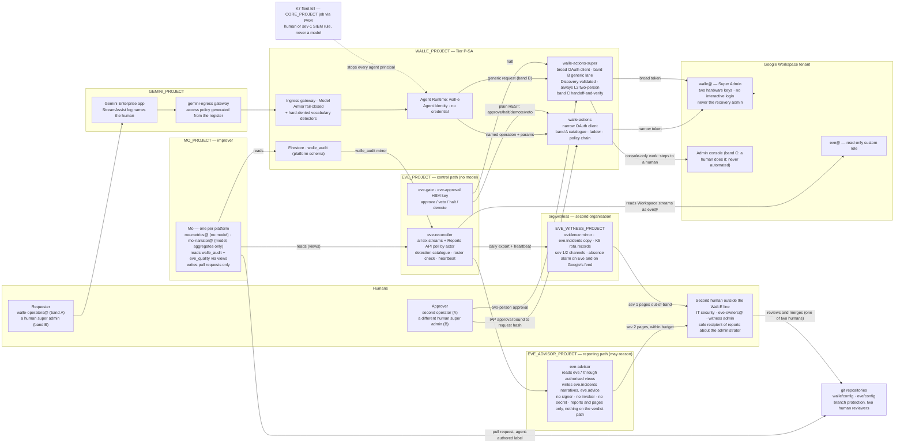

# 1. Platform high-level design

## Status
- Owner: the platform owner
- Last reviewed: 2026-09-14
- Maturity: platform HLD, 2026-09-13. Nothing is built. This is the page every other page of the
  `platform/agentic-platform/` set and the three agent sets point at.
- Inputs: the objective of 2026-09-13 and the review of the documentation against it
  ([00-objective-review.md](00-objective-review.md), whose §4 gap register and §5 decision list
  this page answers); working notes outside the wiki under `.agent-work/hld/` (copying them into
  `review/` is *tbd*).
- Angle: designed for the organisation that exists on 2026-09-13 — **one administrator, no SOC,
  no second super admin outside his own line** — with a growth path to hundreds of agents.
  Every control names who runs it. A tier does not open until the people and services it needs
  exist (§0.4). If a control is not operable by the people at the tier where it is required,
  the control is wrong, not the people.
- Standing constraints, unchanged: no domain-wide delegation; the language model holds no
  credential and cannot approve; the action service is the only holder of a Workspace
  credential; humans raise autonomy and machines lower it; no model produces an Eve approval or
  signature (Eve may hold a separate, model-permitted reporting path, never an approval path —
  and, decided on 2026-09-13 in §13.2, that path writes reports and pages only: nothing it
  writes is read by the gate or by any action service);
  Mo holds no credential and reaches production only through a pull request a human merges;
  safety interlocks are plain authenticated REST; no secrets in the wiki.
- Super Admin for Wall-E is the owner's decision of 2026-09-13 (register row P33) and is not
  re-argued here; the platform is designed around it. "What this reverses
  and what it costs" and §13.1 say what it costs in safety and what compensates.
- Conventions: as the set's [README](README.md#status) — `Assumption:` marks inferred facts,
  *tbd* marks values nobody has decided; every Google product named carries a source in §19,
  verified on 2026-09-13 unless the row says otherwise; where a name is unverified the text says
  so and a decision in [12-open-decisions.md](12-open-decisions.md) owns it.
- The diagram on this page is in §13 (the three agents); the landing-zone tree is
  [02 §2.1](02-landing-zone-and-tiers.md#21-the-tree).

---

## What this reverses and what it costs

The documentation this page sits above was designed for a **narrow** Wall-E: a custom admin
role scoped to a pilot organisational unit, a fixed catalogue of about twenty typed operations,
"Never Super Admin" written as design intent on nineteen pages and enforced by a setup script
that fails its own hardening check the moment the robot is a super admin. The objective of
2026-09-13 reverses that: Wall-E holds **a dedicated, licensed user account with Super Admin**
and may perform **any super-admin-level action** of Google Workspace on a human's prompt.

Two Google facts fix the consequences and are not negotiable: a service account can hold any
Workspace admin role **except** Super Admin (so the account is a user account, and decision 26
closes for Wall-E by fact); and Super Admin **cannot be limited to an organisational unit or
subset by privilege**. Everything below follows from those two lines.

**What safety the platform loses, stated without softening.**

| Lost | What it was | What it is now |
|---|---|---|
| The Workspace-side gate | Two enforcement points: the action service and Google refusing an operation outside the pilot OU or outside the role ("even a total failure of every control in the action service leaves Workspace refusing the call at Google's end") | One enforcement point: the action service. The consented OAuth scope set is the only Google-enforced ceiling left. Every control that read "not in the role" — the OU allow-list, N1 and N2, role-grows-with-the-ladder, the credential-leak bound, `SAFE_USER_FIELDS` — is enforced by code in the component under audit. The sentence quoted on the left is deleted from `SETUP.md` §0.2 and `setup/README.md` |
| The blast radius | A leaked token bounded by the role's privileges at the current ladder stage | A leaked token or an interactive login is a **tenant compromise** and, through the console's power to grant Organization Administrator or a `cloud-platform` token, a path into the **GCP organisation** including `EVE_PROJECT`, `MO_PROJECT` and the core projects. Nothing in Workspace or GCP narrows the account; the perimeter is custody, scope split and detection latency |
| Eve's structural independence | Eve's project, credential, key and halt authority were out of Wall-E's reach by construction | The credential can `users.makeAdmin`, suspend `eve@`, revoke Eve's token, remove Eve's role, switch off "Share data with Google Cloud services" and re-filter the organisation sinks. Only code and detection stop it. Inside the tenant's organisation Eve's independence is **detective, not structural**; what leaves the organisation (evidence, incident record, pager) is structural (§13.2) |
| The catalogue as a ceiling | "Nothing executes that is not registered"; a generic Admin SDK proxy rejected (challenge C35) | The catalogue stays the **declared intended purpose** and the only band that can be autonomous; a generic, schema-validated, always human-approved lane (band B) and a console handoff lane (band C) carry the breadth. Decision 27 becomes "which lane", not "whether" |
| Least privilege as a property | TISAX 4.2.1 shown by an enumerated role | A **signed deviation**, row one of the risk register, carried entirely by the bands, the two lists, the ladder, Eve and a split control plane. An assessor may still refuse maturity 3 on it |
| The narrow-task argument under the EU AI Act | Rested on the role and the catalogue | Rests on the declared intended purpose (the catalogue), the hard-denied list enforced in code with CI ownership outside the agent repository, and audit logs showing no out-of-catalogue operation outside band B under approval. The account's privilege is the fact most likely to be held against it (§14.1) |
| Detection as a check on enforcement | Alerts confirmed what the role already refused | **Detection is the primary control** for the super-admin tier, and the page says so instead of pretending the catalogue still is |

**What compensates — preconditions of the grant, none deferred.** Thirteen graded compensations
are preconditions of the grant; §13.1 summarises them and
[11-tisax.md §6.3](11-tisax.md#63-compensations-as-preconditions--the-checklist-the-gate-reads)
is the checklist the gate reads, row by row with what "green" means and who verifies it.

The other reversals the review found follow from the same objective and are decided on this
page: Eve gains a reporting path that may reason (§13.2; register row **P34**, file
`decisions/2026-09-13-eve-reporting-path-may-reason.md`); Eve detects misbehaviour across every
stream rather than verifying catalogued plans (§13.2); Mo's remit includes Eve (§13.3); "four
projects" becomes a pattern produced by a factory (§3); compliance is two named regimes, not data
protection alone (§14); Eve's observe-and-report layer arrives before the grant, not at Stage 3
(§13.2).

---

## 0. Thesis, primitives, operating model and the tier gate

### 0.1 Thesis

The objective asks for enterprise-class security and monitoring for hundreds of agents, from an
organisation that on 2026-09-13 runs one administrator. The two ways to fail are to design a SOC-shaped
platform nobody can operate, or to declare the pilot's hand-built controls "the platform" and let
the second agent re-implement them. This page does neither. It puts every control that can be
**set once and enforced by Google** (organisation policy, deny policies, Principal Access
Boundaries, Model Armor floors, Binary Authorization, Security Command Center, aggregated log
sinks) at the folder, where one person can own it; it puts every control that needs **a second
person or a 24x7 desk** in the tiers that need it, and refuses to open those tiers until the
person or the service exists. A read-only assistant costs a register row and a factory run. A
super-admin robot costs a witness organisation, a second super admin, a bought detection desk and
a signed deviation. The platform is the folder, the factory, the register, the contract and the
gate — not the three agents, which are its first three tenants.

### 0.2 The six containment primitives, and how each is graded

Every control on this page is either **enforcement-grade** (Google or the platform refuses the
action) or **detection-grade** (the action happens and something independent sees it within a
stated latency). **Nothing detection-grade may stand alone in a safety argument.**

A control is enforcement-grade only when three things hold: the action cannot proceed without a
verdict, the verdict is produced outside the agent's own process (Google, or code in the action
service or gateway, which the agent cannot bypass), and a failure of the control stops the action.
It is detection-grade when it produces evidence but can be skipped by an error (fail-open), removed
by a code change in the agent's own process, or bypassed by an unscreened path. The grade describes
placement and failure mode, not accuracy: a probabilistic content screen (a Model Armor classifier,
an LLM judge) is never a trust boundary, whatever its grade on a given path. A safety case may rest
on an enforcement-grade control; a detection-grade control produces evidence and never a boundary.
The criteria come from [../wall-e/11-prompt-security.md](../wall-e/11-prompt-security.md) ("Two
terms, used precisely throughout") and the rule is lifted from [../wall-e/13-agent-interconnection.md](../wall-e/13-agent-interconnection.md) §9
and made a platform rule; every table below that grades a control uses these two words.

The six primitives are numbered **CP1–CP6** so that they are never confused with the platform
decisions P1–P143 of §17 and [12-open-decisions.md](12-open-decisions.md).

| # | Primitive | What it promises | Enforced by | Grade | Section |
|---|---|---|---|---|---|
| CP1 | A trust boundary the agent cannot redraw | Principal, project, gateway, floor and deny policy are created by a factory and governed at the folder; the agent's owner cannot loosen them | Resource Manager folders, Organization Policy (built-in and custom constraints), the factory's CI identity, Privileged Access Manager | enforcement | §3, §4, §15 |
| CP2 | Autonomy as data; humans raise, machines lower | One `agent-manifest.yaml`, one `ladder.schema`, one `audit.schema`; promotion is a pull request with evidence a validator recomputes | Validator custodian, branch protection, the action service's ceiling module | enforcement (in the action service) | §12 |
| CP3 | A capability ceiling outside the agent's process | The model holds no credential; the action service is the only credential holder; ceilings are code in the action service and permissions the deny policy refuses | Action service, folder deny policy, PAB, the OAuth scope set | enforcement | §4, §11, §13 |
| CP4 | A fleet kill switch outside any agent project | One organisation-policy flip and one deny rule stop every agent principal; drilled monthly | `gcp.restrictServiceUsage` at the tier folder, IAM deny policy at the folder, Scheduler pause per tier, PAB once its blocked-permission list is verified | enforcement | §11.4 |
| CP5 | A model-free monitor with halt authority | The path that approves, halts, demotes or vetoes contains no model; the reporting path may reason but writes reports and pages only — nothing it writes is an input to a verdict (§13.2) | Eve's control path; CI check forbidding a model client in the image; no `aiplatform.*` in `EVE_PROJECT` by a **project-level** `restrictServiceUsage` denylist on `EVE_PROJECT` itself (not on `fld-controllers`, whose other child, the reporting path, needs the API) | enforcement (by absence) | §13.2 |
| CP6 | Evidence the judged thing cannot forge or silence | Google-written audit streams copied to a store outside the reach of the agent, its owner and — for the super-admin case — the tenant's super admins | Organisation-level sinks into a locked bucket, the SecOps export, the witness organisation, an absence alarm | detection, with an absence alarm | §7, §8, §13.2 |

### 0.3 Who exists on 2026-09-13, and the roles the platform needs

The platform RACI with the minimum staffing per tier. Names are supplied by the ISMS; on
2026-09-13 every role on the left is one person, which is the finding most likely to stop a
TISAX assessment (1.2.2) and the reason the tier gate in §0.4 exists. Tiers are lettered (§11)
so they never collide with the ladder's trigger classes T0–T3. Which roles one person may never
combine is [11-tisax.md §7.1](11-tisax.md#71-the-roles); the minimum number of distinct humans
per stage is [§7.2](11-tisax.md#72-the-minimum-per-stage).

| Role | Duty on the platform | Minimum for C–R | Added for W | Added for P / P-SA | Added for X |
|---|---|---|---|---|---|
| Platform owner | Folder, factory, register, floors, baseline modules, this page | the platform owner | — | — | — |
| AI compliance owner (P131; [10-eu-ai-act.md](10-eu-ai-act.md) §4.1) | Signs classifications, files Art. 49 registrations, answers an authority, owns the Art. 73 clock and the Art. 4 briefing content | consulted (legal's designate) | consulted | **engaged**, with a named deputy | — |
| Agent owner | One per agent: manifest, playbooks, register row, budget | the builder | — | — | — |
| Operator / approver | Approves L3 requests, pulls K0/K1, grades | agent owner may double | **second named operator**, not the agent owner (≈2 h/week) | band B approver must be a **human super admin ≠ requester** | — |
| Security reviewer (decision 37) | Reviews ladder raises, deny/floor changes, PAM approvals, deviations | platform owner (self-review recorded as such) | **IT security person** (≈2 h/month) | signs the super-admin deviation; owns SIEM content with the MDR partner | AI-safety reviewer (does not exist) |
| Deployer (CI operator) | Runs the factory and the release pipeline | platform owner | + second reviewer on every credential-holder deploy | — | — |
| Eve owner | Owns `eve-owners@`, `eve/config` second review, the witness | — | platform owner | **second human outside the Wall-E line** (IT security) | — |
| Mo owner | Runs Mo's CI, seeds the blind sample | platform owner | blind grader ≠ playbook owner (≈1 h/week per Tier W agent) | — | — |
| Detection desk | Acknowledges sev 1/2 within the SLA, runs the catalogue | Google-run (SCC findings via a Pub/Sub notification config to the Terraform-managed channel) | + central logging, absence alerts | **bought**: SecOps + managed detection and response, or the organisation's SOC (P10) | + independent monitor review |
| Incident commander | Leads sev 1, talks to the DPO and the works council | platform owner | IT security | IT security, with an on-duty second super admin who can pull K5/K6 | — |
| Human super admins | Hold the role on separate admin accounts with hardware keys | ≥ 1 | — | **≥ 2**, the robot never the recovery one | — |
| DPO contact | DPIA, records of processing, retention ceiling | consulted | consulted | **engaged**, before Stage 1 | — |
| Validator custodian | Runs the recompute Mo cannot reach | platform owner | security reviewer's project | — | — |

Every role has a training outline and completion record refreshed at each stage transition
(Art. 4; TISAX 2.1.3 — and 9.7.2 only if the Data Protection module ever enters scope, §14.2).

### 0.4 The tier gate: what must exist before a tier opens

| Tier | Opens when | Bought | Hired or assigned |
|---|---|---|---|
| **C classical** | The register and the Gemini Enterprise baseline (§2) exist — the gate closes at runbook step GE-14 of [03-gemini-enterprise-environment.md](03-gemini-enterprise-environment.md) §16 | Gemini Enterprise licences (exist); SCC Premium at organisation level (§7) | nobody new |
| **R read tools** | Factory, folder baseline, central logging, shared registry exist | as C | nobody new |
| **W write agents** | Autonomy contract, platform verifier, validator custodian, nonprod folder, one restore drill done; for any Tier W agent acting on employee accounts, works-council information given before its Stage 1 (P129; it stays a precondition of the grant as well) | Binary Authorization pipeline (no licence cost; build time) | second operator; security reviewer (part-time from IT security); blind grader |
| **P privileged** and the **P-SA super-admin singleton** | Everything in W plus every precondition of the super-admin grant green — Eve's observe-and-report layer, the witness, a SIEM with 24x7 acknowledgement, two human super admins, the penetration test, the DPIA, the works-council information, the signed deviation, the two lists and the perimeter decision; the checklist is [11-tisax.md §6.3](11-tisax.md#63-compensations-as-preconditions--the-checklist-the-gate-reads) | Google SecOps in the EU (or the organisation's SIEM); a managed detection and response retainer covering the super-admin detection set; PagerDuty or equivalent; hardware keys | a second human super admin **outside the Wall-E administration line** as Eve owner; a DPO engagement; an incident commander from IT security |
| **X AGI-class** | **Not open.** §11.5 lists the conditions; on 2026-09-13 one (the sandbox stage) is met and four are not | GKE Agent Sandbox tier in `europe-west1` (GA per Google's post of 2026-05-21 — [09-supply-chain-secrets-recovery.md](09-supply-chain-secrets-recovery.md) §4.1, P122); a second model family for advisory monitors | an AI-safety reviewer role; a provider capability-evaluation report per model pin |

The super-admin grant is therefore a **gate with its own checklist**, not a runbook phase. The
grant happens on the day the last row of the P line is green, and "the four owner groups are one
person" expires that day.

### 0.5 Cost classes

Prices are not quoted (pricing pages were not read). Each line names the driver and who pays;
amounts are *tbd* for the detailed design.

| Cost | Driver | Paid by | From tier |
|---|---|---|---|
| SCC Premium | organisation-wide, all projects | organisation IT security (`Assumption:` platform budget line until then) | C |
| Central log ingestion and locked retention | Workspace audit volume (the largest line in the set on 2026-09-13) plus Data Access logs | platform | R |
| Google SecOps + MDR | events per day, retention months, retainer | IT security | P |
| Workspace licence + admin role per Tier P agent | one licensed user each — Tier P stays rare by policy | agent owner's cost centre | P |
| Model Armor | requests sanitised per project (1,200 QPM sanitize per project — one argument for project-per-agent) | agent budget | R |
| Witness organisation | one Cloud Identity tenant, one project, one bucket, one dataset, a few channels, two hardware keys | IT security | P |
| Chrome Enterprise Premium licences (P63) | device-posture access levels on every Tier W+ control surface; one licence per operator and approver; *tbd* (procurement); `al-platform-operator-lite` until then ([04-identity-and-privileged-access.md](04-identity-and-privileged-access.md) §6.3) | platform | W |
| Human hours | §0.3 rows | — | per tier |

### 0.6 Traceability: the objective's sixteen requirements and the register ids not cited elsewhere

The review's §3 numbered the objective R1–R16; the requirement text is
[00-objective-review.md §1](00-objective-review.md#1-the-objective). Where each is met or
explicitly declined:

| R | Requirement (short) | Met by | Declined or qualified |
|---|---|---|---|
| R1 | Secure Gemini Enterprise environment; agent identity, registry, Model Armor | §2, §4.1, §5, §6 | — |
| R2 | Other security elements, with the correct path | §3.3, §4.5, §7, §8, §9, §11.4 | — |
| R3 | Wall-E executes on a human prompt | §13.1 band A, T0 | — |
| R4 | Any super-admin-level action | §13.1 bands A/B/C | the literal reading is declined: band C is instructions to a human and the hard-denied list is refused in every lane (P28) |
| R5 | Dedicated licensed user account with Super Admin | §13.1, P33 | — |
| R6 | Eve controls and reports any misbehaviour | §13.2 detection catalogue, reconciliation over every stream, P34 | "any" ends where enumeration ends; the reporting path is report-only |
| R7 | Eve holds no super admin | §4.6, §13.2 | — |
| R8 | Eve independent and autonomous | §13.2 (detective inside the organisation, structural through the witness) | structural independence inside the tenant's organisation is declined as unachievable; P15 is the end state |
| R9 | Eve reports to the human | §13.2 reporting contract, the second human | — |
| R10 | Mo improves both | §13.3 | — |
| R11 | Hundreds of agents | §3, §5, §11, P25 | the cap is grading capacity, not projects |
| R12 | Future AGI agents | §11.4, §11.5, Tier X | declined for 2026: Tier X is a closed folder until §11.5's conditions hold |
| R13 | Enterprise-class security and monitoring | §7, §0.4 tier gate | below Tier P the detection desk is "next business morning", stated |
| R14 | EU AI Act bulletproof | §14.1 | "bulletproof" declined: what cannot be promised is listed |
| R15 | TISAX compatible | §14.2 | maturity 3 on 4.2.1 may be refused on the super-admin deviation |
| R16 | Review all, focus on the HLD, then the detailed design | [00-objective-review.md](00-objective-review.md); this page; §18 | — |

Register ids of the review's §4 whose substance is answered on this page without being cited
at the answering line: MON-01 and PS-08 (§7.1 central logging and SCC); MON-05 (§7.1 Data
Access config); MON-06 (§7.1 SCC Premium); MON-11 (§7.5, §14.3 evidence register); CON-08
(§14, both regimes named); AIA-03 (the Art. 14 row of [10 §4](10-eu-ai-act.md#4-obligation-crosswalk--every-obligation-its-owner-its-evidence-its-mechanism)); AIA-05 (Art. 11 row); AIA-06 (Art. 50
row); AIA-07 (Art. 26(7) row); AIA-09 (Art. 9 and Art. 10 rows); AIA-12 (Art. 4 and Art. 5
rows); AIA-13 (Art. 27 row); WSA-04, WSA-05, WSA-06, WSA-08, WSA-11 and EVE-07 (§13.1 compensations 2,
3, 6, 5, 7, rows of [11 §6.3](11-tisax.md#63-compensations-as-preconditions--the-checklist-the-gate-reads)); MO-07 (§13.3, rule 3 and the `mo-analyst@` read endpoints); CON-06 (§18 preamble,
the dated line per page). Nothing in the register is deferred to the detailed design without a
section here naming the mechanism.

---

## 1. The platform charter

What the platform promises every agent and what it demands of every agent. Lifted, where the
review said "verbatim", from `wall-e/ARCHITECTURE.md` §12, [../project-topology.md](../project-topology.md)
"the one rule", `wall-e/06` blast-radius method, `wall-e/12` §1.4, `wall-e/13` §9, `wall-e/05` §1,
`eve/01` and `mo/01`.

**Promises.**

| # | The platform promises | Mechanism | Who runs it |
|---|---|---|---|
| PR1 | A project of your own, made by the factory in under an hour, with APIs, identity, gateway, sinks, budget, labels and deny policy already in place | §3 factory | platform owner runs the pipeline; the CI identity does the work |
| PR2 | Your identity is issued by Google, has no key, and expires daily | Agent Identity (§4) | Google |
| PR3 | Your egress is default-deny and your ingress is screened, so an injected prompt cannot reach a secret or the internet through you | Agent Gateway + Model Armor (§6) | folder constraint; Google enforces |
| PR4 | Your logs go somewhere you cannot delete, and somebody is paged if they stop | central logging, absence policies (§7) | platform; the detection desk of your tier |
| PR5 | A kill switch exists outside your project, and it is drilled | fleet kill (§11.4) | platform owner + security reviewer |
| PR6 | Your autonomy can rise on evidence and never on the calendar, and only a human raises it | autonomy contract (§12) | agent owner + reviewers |
| PR7 | Your compliance classification is done once, at the gate, not re-argued per auditor | publication gate (§5.3, §14) | platform owner + DPO |
| PR8 | You are never asked to implement a control the tier above you needs | tier model (§11) | this page |
| PR9 | The ladder, the validator and the approval surface are services, not code you rewrite | §12 | platform |

**Demands.**

| # | Every agent must | Enforced by |
|---|---|---|
| D1 | Have a register row (owner, tier, purpose, data classes, EU AI Act class, TISAX class) before it exists in any project | CI: the factory refuses without it; reconciliation flags what exists without one |
| D2 | Run with Agent Identity, bound to a gateway, in a factory-made project — no exceptions below Tier P, and Tier P exceptions are dated | folder custom constraints where supported (spike P4), CI otherwise |
| D3 | Never hold a credential in the reasoning layer; if it writes, it writes through an action service that holds the credential and decides | tier rule (W+); folder deny policy on the agent principal set for `secretmanager` |
| D4 | Never both decide and act; never grade its own work; never loosen its own autonomy | charter rule; contract validator; humans-only raise path |
| D5 | Write its audit rows to the platform schema with the correlation keys, insert-only, write-ahead, into a dataset the platform can read | `audit.schema` (§12); Mo's reader grant recorded in the topology |
| D6 | Treat every peer agent as principal type `agent`, L0 for every write, tainted on receipt | contract; action-service policy chain |
| D7 | Cross a project boundary only through a grant on the resource, never a project-level role; anti-grants asserted by the drift job. The platform's own folder-level principals are the **named exceptions**, listed with level and maker in [../project-topology.md §3.1](../project-topology.md#31-notes-the-table-cannot-hold) | the one rule; Policy Analyzer drift job at the folder |
| D8 | Grade every feature it relies on as enforcement or detection, and put nothing detection-grade alone in its safety case | design review at admission |
| D9 | Be re-qualified on every model pin change: a fingerprint tuple change resets any cell above L3 | contract validator (C15 generalised) |
| D10 | Be removable: deleting the project removes the agent and nothing else; its evidence has already left | evidence lake + retention lock (§7, §10) |
| D11 | Hold no write on any repository, Artifact Registry, deploy identity, its own ladder or its own ceilings | folder deny policy, branch protection, Binary Authorization (§9) |
| D12 | Expose its safety interlocks as plain authenticated REST, never over an agent protocol | `/v1/control/*` endpoints; `run.invoker` on named principals |

---

## 2. The secure Gemini Enterprise environment

The objective's first sentence. On 2026-09-13 [../gemini-enterprise.md](../gemini-enterprise.md) is a
skeleton. This section is that page's HLD content; the detailed page is owned jointly by the
platform owner and the Gemini Enterprise administrators (the same person on 2026-09-13), and is
[03-gemini-enterprise-environment.md](03-gemini-enterprise-environment.md).

### 2.1 The tenant app and its project

| Item | Decision |
|---|---|
| Project and folder | `GEMINI_PROJECT`, which already exists (`Assumption:`), is **imported** by the factory's `tenant-app` module and moved under `fld-gemini-enterprise` with the administrators' agreement in a dated change window; if they do not agree it stays in place as the one project outside the folder, with floor, deny policy, Data Access config and sink re-applied at project level and a review date ([03 §3](03-gemini-enterprise-environment.md#3-project-and-folder-placement)) |
| Location | `eu`; `global` only for a feature the tenant needs that is `eu`-unavailable, as a dated exception ([03 §5.1](03-gemini-enterprise-environment.md#51-location)) |
| Identity provider | Google Identity (P51); no workforce pool for the tenant app; a later provider change deletes conversation history and is a decision record ([03 §6](03-gemini-enterprise-environment.md#6-identity-provider-and-sso-p51)) |
| Administrators | `ge-admins@` with `roles/discoveryengine.agentspaceAdmin` through PAM for changes, standing for reads; feature toggles off for the general population and on for `ge-builders@`; a no-code agent is still a Tier C agent with a register row ([03 §4](03-gemini-enterprise-environment.md#4-administration-who-holds-what-standing-or-elevated), [§8](03-gemini-enterprise-environment.md#8-feature-management-baseline-p54)) |
| Console Model Armor | on per app with template `ge-console-standard`, failure mode Block, drift-checked daily; covers Tier C only, custom agents are screened at their own gateway ([06 §3.5](06-gateways-model-armor-perimeter.md#35-the-console-setting-tenant-wide-by-rule-per-app-by-mechanism)) |

One Gemini Enterprise app per tenant is the front door for every human-facing agent; agents no
human talks to (Eve's control path, Mo's jobs) are not published in it. The app is bound to the
egress gateway `gemini-egress`, whose access policy is generated from the register so that an
engine not in the register is unreachable from the front door by network
([03 §11](03-gemini-enterprise-environment.md#11-the-tenant-egress-gateway-gemini-egress-p57-detailing-hld-p6), P57);
connectors are an allow-list enforced as organisation policy, with no Workspace write credential
([03 §12](03-gemini-enterprise-environment.md#12-connectors-and-data-sources-p58), P58); data
stores are EU only; conversation retention is *tbd* by the DPO with an interim `Assumption:` of
30 days ([08 §5.2](08-data-logging-retention-sovereignty.md#52-the-schedule) R8); and the app's
`discoveryengine` Data Access logs, the only log that names the human behind a request, go to
`LOGGING_PROJECT`. Semantic Governance is **never on any authority path**.

### 2.2 How agents are admitted, shared and revoked

A Tier C agent is created in the console after its register row merges and is matched nightly
to the row (an unmatched agent is a finding and is unpublished); a Tier R+ agent passes the
factory and the one-run admission gate (§5.3), after which CI binds `GEMINI_PROJECT`'s Discovery
Engine service agent to a query-only custom role **on the engine resource**, never a project-level
role (decision 42 generalised), adds the endpoint to `gemini-egress` and registers the agent in
the app, and `ge-admins@` shares it through PAM to the row's audience groups — named groups only
above Tier C. Retirement is the one factory operation `revoke`, a pull request merged by two
humans; an emergency unpublish pulls three levers in order of speed (the `gemini-egress` entry in
seconds, the engine query grant in a minute, the console) with K3 and K7 behind them. The
lifecycle per tier is [03 §10.1](03-gemini-enterprise-environment.md#101-the-lifecycle-per-tier)
and the admission and revocation mechanics
[05 §7.1–§7.2](05-registry-and-autonomy-contract.md#71-admission-end-to-end); every administrator
action is logged under `discoveryengine.googleapis.com` in Cloud Audit Logs and routed to
`LOGGING_PROJECT` and the SIEM (methods in
[03 §13](03-gemini-enterprise-environment.md#13-audit-logging-of-the-app-itself)); only the per-OU
service toggle is a Workspace admin-audit event.

---

## 3. The landing zone

### 3.1 Folder tree

`FOLDER_ID` in the sets becomes `fld-agentic-platform`. Everything below it is made by the
factory; nothing below it is made by hand after Stage 0. Tier folders carry the letters of §11.
The tree diagram is [02 §2.1](02-landing-zone-and-tiers.md#21-the-tree); what each project
holds and must never hold is [../project-topology.md §2](../project-topology.md#2-the-four-projects).
The witness organisation `org-witness` and its `EVE_WITNESS_PROJECT` sit outside the tenant's
organisation, not under this folder (§13.2).

| Folder | Holds |
|---|---|
| `fld-platform-core` | the five core projects `CORE_PROJECT`, `LOGGING_PROJECT`, `CICD_PROJECT`, `VALIDATOR_PROJECT` and `KMS_PROJECT` (keys and nothing else, P118); no agent principal |
| `fld-gemini-enterprise` | `GEMINI_PROJECT`, imported (§2.1) |
| `fld-agents-r`, `fld-agents-w`, `fld-agents-p` → `fld-agents-p-sa`, each with `-prod` and `-nonprod` children; `fld-agents-x` | one project per agent of the tier; `WALLE_PROJECT` in `fld-agents-p-sa-prod`; Tier X empty |
| `fld-controllers` → `-prod`, `-nonprod` | `EVE_PROJECT` (`aiplatform` denied at project level) and `EVE_ADVISOR_PROJECT` |
| `fld-improvers` → `-prod`, `-nonprod` | `MO_PROJECT` |

Every folder's purpose, policy additions, budget default and who may create below it are
[02 §2.1–§2.2](02-landing-zone-and-tiers.md#21-the-tree), with the per-folder
`gcp.restrictServiceUsage` allow-lists in
[02 §4.2](02-landing-zone-and-tiers.md#42-gcprestrictserviceusage-per-folder--the-allow-lists).
Nonprod is optional at Tier R and mandatory from Tier W, and Tier P nonprod is a sandbox
Workspace tenant (decision 29 → yes, before Stage 1) because Super Admin cannot be limited to an
organisational unit ([02 §3.5](02-landing-zone-and-tiers.md#35-the-non-production-split-p40)).
Project-per-agent is forced by Google, not chosen
([../project-topology.md §1](../project-topology.md#1-why-four-projects)).

### 3.2 The factory

One Terraform pipeline in `CICD_PROJECT`, run by the CI identity `factory-apply@` through
Workload Identity Federation (no key) in a routine and a privileged phase, takes each agent's
register row and `agent-manifest.yaml` (§12.2) as its only inputs and applies Cloud Foundation
Fabric's `project-factory` module with thin wrappers (P2, closed by P35) as five modules —
`agent-project`, `verifier-project`, `improver-project`, `tenant-app` (the §2.1 import) and
`revoke` (the §2.2 retirement) — so that an agent gets a project with APIs, identity, gateways,
sinks, budget, labels and its deny-policy entry in under an hour. Every run ends with the drift
job ([04 §2.6](04-identity-and-privileged-access.md#26-the-identity-drift-job-promotes-wall-e12-10-and-hld-47))
reporting zero diff; standing `roles/owner` is removed after the run and humans get a
predefined-role bundle back only through PAM (`ent-project-repair`, §4.4); per-project exceptions
are factory inputs with a named reason and a review date; promotion from nonprod to prod is a
Binary Authorization attestation (§9), not a copy. The runbooks' Phase 6 / Phase 1 / Mo-0b become
one factory call each and `walle_setup.py` keeps only the Workspace-side phases; what each module
makes per phase, the CI identity and the nonprod split are
[02 §3.3–§3.5](02-landing-zone-and-tiers.md#33-the-three-modules-and-the-topology-rows-they-consume).

### 3.3 Organisation-policy baseline at `fld-agentic-platform`

Set once, by the platform owner, in Terraform, drift-checked: residency by
`gcp.resourceLocations = in:eu-locations` (the `global` floor-setting allowance verified or
dropped at the first factory run, §18 item 25), keyless service accounts, no foreign principals
beyond an enumerated list (and no witness exception, §13.2), bindings rather than cross-project
service-account attachment, uniform bucket-level access, no legacy TLS, no external IPs,
tenant-domain Essential Contacts, VPC egress `private-ranges-only` and Binary Authorization on
`fld-agents-w`, `fld-agents-p`, `fld-controllers` and `fld-platform-core` (P115), and
`gcp.restrictServiceUsage` per folder — **also the first fleet-kill lever (§11.4)**.
`run.allowedIngress = internal-and-cloud-load-balancing` is held in Terraform and applied only
after P3's engine-reach spike passes (§8.1); until then IAM-only invoke is the enforced boundary
and a Security Health Analytics custom module flags any Cloud Run ingress of `all` (detection).
Custom constraints bind every engine to its factory-made gateways and restrict `AuthProvider`
creation (Preview), graded enforcement only once a throwaway engine has been refused in nonprod,
and the `identityType` constraint on `ReasoningEngine` stays a spike (P4, CC-8); every constraint
by exact name is [02 §4.1](02-landing-zone-and-tiers.md#41-the-baseline-every-constraint-by-exact-name)
and the custom constraints with the spike list
[02 §4.3](02-landing-zone-and-tiers.md#43-custom-constraints-what-is-verifiable-today-and-the-spike-list-p42-p4-partly-closed).

### 3.4 Labels, budgets, contacts, quotas

- **Labels**, required on every project and validated by the factory, are the taxonomy of
  [02 §3.6](02-landing-zone-and-tiers.md#36-naming-and-the-label-taxonomy-p37-p38); the Agent
  Registry card carries the same metadata in the fixed-format first line of its description
  ([05 §3.1](05-registry-and-autonomy-contract.md#31-where-the-metadata-lives-p72)).
- **Budgets and Essential Contacts**: one budget per project at the tier default with an
  aggregate per tier, a billing export in `LOGGING_PROJECT` keyed on the labels, and security and
  technical contacts at the folder with the owner group per project —
  [02 §3.7](02-landing-zone-and-tiers.md#37-budgets-per-tier-p39-the-amounts-stay-p31).
- **Quota register** (P31): first row — `GEMINI_PROJECT`'s Model Armor 1,200 QPM sanitize quota,
  which serves the whole tenant's assistant traffic and scales with headcount (measured at GE-8,
  [03-gemini-enterprise-environment.md](03-gemini-enterprise-environment.md) §9); then Model
  Armor 1,200 QPM sanitize and 600 QPM ExternalProcessor per agent project; Agent Gateway 5,000
  resources; Agent Registry 100 agents / MCP servers / endpoints / bindings / skills per project
  and 1,200 requests per minute per region, increase requested at 60 % occupancy (P71); Agent
  Runtime engines and QPM per project-region *tbd* (the quota page did not render on
  2026-09-13); organisation-sink ingestion (the largest cost line). Reviewed quarterly by the platform
  owner. The ExternalProcessor quota is counted in the project that holds the Agent Gateway (one
  more reason for project-per-agent); with the authorization extension's `failOpen: false`, a
  Model Armor quota error stops the agent, so both Model Armor quotas alert at 70 %
  ([06-gateways-model-armor-perimeter.md](06-gateways-model-armor-perimeter.md) §2.5). Model Armor
  also has per-filter token limits (65,536 for prompt injection and jailbreak, RAI and CSAM;
  130,000 for Sensitive Data Protection; 4 MB input): above a limit the filter returns
  `EXECUTION_SKIPPED` silently, and the `EXECUTION_SKIPPED` alert is what makes the skip visible
  ([06-gateways-model-armor-perimeter.md](06-gateways-model-armor-perimeter.md) §3.3, §3.4).
- **Tier P is rare by policy** ([02 §1.3](02-landing-zone-and-tiers.md#13-mandatory-controls-per-tier--what-the-platform-enforces-and-what-the-agents-code-must-carry));
  the target count of P-SA agents is one, shown as the `privilege` column of
  [../agents.md](../agents.md).

---

## 4. Identity

### 4.1 Agent Identity for every reasoning layer

Every reasoning layer on the platform runs under a Google-issued agent identity: Agent Runtime
engines with `identity_type = AGENT_IDENTITY` (GA), Gemini Enterprise agents by the product, and
Cloud Run reasoning services with Agent Identity for Cloud Run, which is **Preview** — adopted in
nonprod now and in prod when GA (P5), a prod Cloud Run reasoning service being a Tier R exception
with an attached service account and a dated expiry until then; service accounts remain for
non-reasoning components only (action services, dispatchers, Eve's limbs, Mo's readers, CI). The
trust domain is organisation-wide, `agents.global.org-ORG_ID.system.id.goog`; CI refuses an engine
config without `identityType` until spike P4's custom constraint lands, and the one line that
removes the property, `GOOGLE_API_PREVENT_AGENT_TOKEN_SHARING_FOR_GCP_SERVICES=False`, is refused
by CI fleet-wide. The rules, principal forms and their verification are
[04 §2.1](04-identity-and-privileged-access.md#21-agent-identity-for-every-reasoning-layer-promotes-wall-e12-1).

### 4.2 The three principal populations

| Population | Identity | How it authenticates to the platform |
|---|---|---|
| Agents (reasoning layers) | `principal://agents.global.org-ORG_ID.system.id.goog/resources/aiplatform/projects/N/locations/europe-west1/reasoningEngines/ID` | 24-hour certificates, bound tokens |
| Workforce (humans) | Google identities of the tenant; a workforce pool `wif-agentic-operators` only if a non-Google operator population exists (P24), whose operators get the IP-and-time level only and never reach a Tier P surface (P64) | IAP with a Context-Aware Access level ([04 §6.3](04-identity-and-privileged-access.md#63-the-access-levels)) |
| Operators of agents (machines) | service accounts per component, keyless, one per duty (`walle-actions@`, `eve-controller@`, `mo-metrics@` …) | ID tokens; IAM on the receiving resource |

The per-project agent principal set has two documented spellings — one for allow and deny
policies, one for PAB bindings — and deny-policy acceptance of agent principal sets is
`Assumption:` until a throwaway engine proves it (P8, narrowed by P61 to the spelling;
[04 §2.1](04-identity-and-privileged-access.md#21-agent-identity-for-every-reasoning-layer-promotes-wall-e12-1)).
What each population may and may never hold is
[04 §2.2](04-identity-and-privileged-access.md#22-the-three-populations-with-what-each-may-hold);
operator groups (`<agent>-owners@`, `-operators@`, `-readers@`, `-users@`) are created by the
factory and reconciled daily ([04 §2.4](04-identity-and-privileged-access.md#24-groups-made-by-the-factory-named-by-convention-reconciled-daily)).

### 4.3 Service-account policy

No keys and no cross-project attachment (both by constraint); one service account per duty, and
never a credential-reading role and a deploy role on the same account; impersonation enumerated,
with the per-agent deployer `<agent>-deployer@` impersonated by the release pipeline's WIF
principal and bound only in the factory's privileged phase, and the routine factory identity
`factory-apply@CICD_PROJECT` holding `projectIamAdmin` conditioned to non-credential roles and
nothing on the P-SA and controller folders (P142). Every service account's reach is a
factory-generated row of the register's identity table; the drift job asserts the anti-grants
(`walle-agent@` reads no secret; Mo holds no invoker on any credential holder; nobody in
`MO_PROJECT` appears in `EVE_PROJECT`; an agent's principal never appears in another agent's
project IAM) and a Security Health Analytics custom module asserts impersonation chains absent.
The rules SA-1..SA-7 are [04 §2.3](04-identity-and-privileged-access.md#23-service-account-policy).

### 4.4 Privileged access

No standing `roles/owner` on any platform project once the factory has run: humans obtain
dangerous roles only through **Privileged Access Manager** entitlements (GA; organisation, folder
or project; maximum entitlement duration 7 days; no grant shorter than 30 minutes;
audit-logged). PAM has no self-approval — one-person operation is an entitlement with "Activate
access without approvals" and a mandatory justification carrying the ticket reference —
two-level sequential approval is Preview, PAM does not support the legacy basic roles, and
org-policy, deny and PAB administration can be granted only at the organisation. The catalogue
of record is [04 §5.2](04-identity-and-privileged-access.md#52-the-catalogue): `ent-project-repair`,
the credential-holder deploy grant with a second reviewer, secret access, `ent-folder-admin`,
`ent-project-move`, `ent-factory-singleton`, the organisation-level `ent-platform-policy`, the
`GEMINI_PROJECT` admin entitlement and `ent-k7-human` / `ent-k7-executor` for the fleet kill.
Grants are logged to the SIEM and a grant outside a change window is a detection; at Tier R
with one person PAM still runs, which produces the access-review evidence TISAX 4.2.1 asks for.
Google-personnel access is Access Transparency plus Access Approval on the privileged folders,
the witness and the evidence holders
([08 §7.2](08-data-logging-retention-sovereignty.md#72-the-compensating-set)); on the Workspace
side human super admins hold the role on separate admin accounts with hardware keys and Google's
fixed one-hour Admin console session, and every super-admin sign-in is a SIEM case
([04 §8](04-identity-and-privileged-access.md#8-the-super-admin-robot-on-the-roster-and-the-privileged-tiers-two-person-rule)).

### 4.5 Deny policies and Principal Access Boundaries

Lifted from `WALLE_PROJECT` to the folder, one copy for the fleet. `deny-agents-platform` at
`fld-agentic-platform` names the per-project agent principal sets and the per-project
service-account sets the factory adds (`MO_PROJECT`'s included) and denies them secret access,
signing, key creation, token minting, `setIamPolicy`, deploy, build, org-policy and sink writes
(rules R1–R5; R6 alone names `factory-apply@`), each action service's own account being exempted
for its own secrets only; every permission name was verified against Google's deny-supported list on 2026-09-13
(P61) — a name not on the list would make the policy silently narrower — and acceptance of the
agent principal-set spelling stays `Assumption:` until a throwaway engine proves it (P8).
`EVE_PROJECT` keeps its own `deny-eve-project-foreign` (topology decision 48); the PAB
`pab-agents` (and a stricter `pab-agents-p-sa`) limits agents to `fld-agentic-platform` and the
named core resources, and its enforcement version 4 makes it **enforcement-grade for engine
queries** and the families it blocks but **no fence for Cloud Run invocation** (P60), which rests
on resource-level `run.invoker` plus the deny policy. The rules and verified names are
[04 §3](04-identity-and-privileged-access.md#3-the-folder-deny-policy-deny-agents-platform-with-verified-permission-names)
and the PAB [04 §4](04-identity-and-privileged-access.md#4-the-principal-access-boundary-pab-agents-and-what-it-can-and-cannot-fence);
the pre-written `deny-agents-halt` — the same policy extended to
`aiplatform.googleapis.com/reasoningEngines.*` (`reasoningEngines.streamQuery` is not a
deny-supported name), Cloud Run invoke and job runs and Pub/Sub publish — is the fleet kill
switch's lever KF-2 ([04 §9.3](04-identity-and-privileged-access.md#93-the-four-levers-verified)).

### 4.6 The robot user accounts and Context-Aware Access

Two user accounts exist on the platform: `walle@` (Super Admin, §13.1) and `eve@` (read-only
custom role, never Super Admin), both in `/Automation/Service Identities` with hardware-key-only
2SV enforced by the tenant's own 2SV policy on that OU (Google's mandatory admin 2SV is a gradual,
edition-scoped rollout, not a universal rule), two keys in the safe with a witnessed custody
record, no recovery channels, super-admin self-recovery Off at the top organisational unit,
Google's fixed one-hour Admin console session with Google Cloud session control on the OU, the
Gemini Enterprise service toggle OFF on the OU, and no interactive login ever (activity rule,
severity 1). The hygiene sets are
[../wall-e/02-identity-and-auth.md "The account hygiene set"](../wall-e/02-identity-and-auth.md#the-account-hygiene-set)
and [../eve/02-identity-and-auth.md "Eve's Workspace robot"](../eve/02-identity-and-auth.md#eves-workspace-robot),
with the session facts in [04 §8.2](04-identity-and-privileged-access.md#82-session-controls-on-the-privileged-tier).
An Admin console Context-Aware Access level that no device satisfies is adopted for the robot OU
but graded **detection-plus-friction, `Assumption:` until its applicability to super admins is
verified with Google (P7)**, and no Admin SDK API access level exists
([04 §6.3](04-identity-and-privileged-access.md#63-the-access-levels)); "an interactive login is an
incident" is the control that survives Super Admin, and decision 26 (keyless service account for
the admin half) is closed for Wall-E by the Google fact and stays open for Eve as E-16.

### 4.7 The drift job

One platform drift job in `CORE_PROJECT` replaces the per-agent 18-check jobs and closes decision
46: Policy Analyzer with folder-level `roles/iam.securityReviewer` plus a Cloud Asset Inventory
folder feed (`RESOURCE`, `IAM_POLICY`, `ORG_POLICY`) that turns IAM and org-policy changes into
events within minutes, with the IAM-shaped checks run as Security Health Analytics custom modules
(SCC Premium) so their findings are SCC findings. That folder-level role, inherited into
`EVE_PROJECT`, is a named exception to the one rule (D7) and to decision 48, dated 2026-09-13
([../project-topology.md §3.1](../project-topology.md#31-notes-the-table-cannot-hold), row 36).
The checks, the per-agent assertions, the owner (platform owner) and the reviewer of exceptions
(security reviewer) are [04 §2.6](04-identity-and-privileged-access.md#26-the-identity-drift-job-promotes-wall-e12-10-and-hld-47).

---

## 5. Registry and governance

### 5.1 The inventory of record is a git file, not a product

Google's Agent Registry has project-level IAM only, registers automatically only in its own
project and cannot be required by an organisation policy, and Security Command Center's AI
Protection inventory holds no owner or classification, so the **inventory of record is the agent
register**: one YAML file per agent under `platform/agentic-platform/register/`, merged under the
two-reviewer rule, from which CI generates the Agent Registry card, the factory inputs, the
[../agents.md](../agents.md) table and the TISAX asset row. A CI schema check fails the merge on a
missing mandatory field — identity and declared intended purpose, owner and cost centre, tier,
risk class and autonomy ceiling, data and EU AI Act classes, model pin, verifier, `privilege`
(where `factory-groups@` carries `workspace_role:groups_admin`, P65, and CI fails a second
`super_admin` row while one is not `retired`), supplier rows, publication, status (`idea poc pilot
prod retired`, plus `suspended`, P74) and review date. The fields per tier and their rules are
[05 §3.2](05-registry-and-autonomy-contract.md#32-mandatory-fields-per-tier).

### 5.2 Shared registry, independent observation, daily reconciliation

A **shared Agent Registry** in `CORE_PROJECT`, `europe-west1`, written only by CI with every write
alerted, is the governed view; per-agent registries are not created
(`agentregistry.googleapis.com` is absent from every tier folder's allow-list), the one other
registry being `gemini-registry` in `GEMINI_PROJECT`, the tenant gateway's CI-generated working
set, never a second inventory; registration never authorises (P71;
[05 §2.2](05-registry-and-autonomy-contract.md#22-options-and-the-decision-p71)). Independent
observation — the Cloud Asset Inventory folder export, SCC AI Protection's organisation-wide AI
asset inventory and the Gemini Enterprise agent list — feeds a daily, model-free
**reconciliation** in `CORE_PROJECT`: observed ∖ register is a **shadow agent** (severity 2,
unpublished within one business day), register ∖ observed a retired agent not cleaned up, card ≠
register row drift. No organisation policy can require registration, so this reconciliation is
the shadow-agent control and is **detection-grade, stated as such**
([05 §6](05-registry-and-autonomy-contract.md#6-reconciliation-against-independent-inventories)).

### 5.3 Governance policies and the admission gate

The **admission gate** is one CI run in `CICD_PROJECT` whose code owners are the platform owner
and IT security: an agent reaches its prod folder, the shared registry, a gateway allow-list, a
peer's egressor list or the tenant app only when the baseline is applied, the register row
validates with its classes and a signed purpose, the compliance entry exists, the monitoring
baseline's first heartbeat has landed at the tier's detection desk ("registered ⇒ feeding"), the
gateway is bound and the floor conformant, the image is attested or the bundle hash recorded, and
for W+ a restore drill, a validator-signed manifest and a drill record younger than 30 days exist
([05 §7.1](05-registry-and-autonomy-contract.md#71-admission-end-to-end),
[§5](05-registry-and-autonomy-contract.md#5-the-invariant-registered--feeding-the-siem)). Every
row's `review_date` is at most 90 days ahead and an expired row loses its share until reviewed;
every `privilege ≠ none` row is reviewed quarterly by the security reviewer against the signed
super-admin roster; a third-party agent, MCP server, Marketplace app or model enters only with a
supplier row ([11 §8](11-tisax.md#8-supplier-onboarding-and-exit--third-party-agents-mcp-servers-marketplace-apps-models-p138));
retirement is `revoke` with the TISAX 5.3.3 return-and-removal recorded
([05 §7.2](05-registry-and-autonomy-contract.md#72-revocation-and-suspension)). The
registry-specific policies are [05 §4](05-registry-and-autonomy-contract.md#4-governance-policies);
Semantic Governance is advisory annotation only, never on an authority path.

---

## 6. Gateways and Model Armor

### 6.1 The gateway rule

Every engine above Tier C is created bound to its project's **egress gateway** with a
default-deny access policy generated from the manifest, and engines that machines call sit behind
an **ingress gateway with Model Armor `failOpen: false`**; the factory templates both, the custom
constraint (§3.3) enforces the binding, reconciliation flags an unbound engine as severity 2, and
one gateway per project-region is one more reason for project-per-agent
([06 §2](06-gateways-model-armor-perimeter.md#2-the-gateway-rule)). A gateway-bound engine forgoes
Agent Platform Threat Detection (Preview), so prod engines are gateway-bound and the detector runs
on one unbound nonprod agent at a time
([06 §2.4](06-gateways-model-armor-perimeter.md#24-gateway-versus-agent-platform-threat-detection-per-tier)).
The gateway plus Model Armor is a **platform availability domain** with an `Assumption:` 99.5 %
monthly SLO and a synthetic probe per region: an outage fails every fail-closed agent closed, by
design, and the platform never flips `failOpen` to recover
([06 §2.5](06-gateways-model-armor-perimeter.md#25-the-gateway-plus-model-armor-as-an-availability-domain)).
The tenant app's own egress gateway is §2.1.

### 6.2 Model Armor: floor, tier floors, templates

The organisation, platform-folder and tier floors are **template-conformance** controls, owned by
IT security (the platform owner until IT security takes it) and applied by the platform's
Terraform, never by an agent's script; inline enforcement on Gemini model calls is a
factory-written `Custom` **project floor** on every agent project — `INSPECT_ONLY` at R,
`INSPECT_AND_BLOCK` at W+ after measurement — whose path is fail-open and detection-grade, the
template on the gateway being the enforcement-grade path (P84;
[06 §3.2](06-gateways-model-armor-perimeter.md#32-the-floor-hierarchy)). The template standard per
tier adds Sensitive Data Protection basic, a de-identify template for the sanitize-log copy at
W/P and, at P-SA, custom detectors for the hard-denied vocabulary
([06 §3.3](06-gateways-model-armor-perimeter.md#33-the-template-standard-per-tier)); the console
setting covers Tier C only (§2.1). Model Armor's SCC integration makes every `MATCH_FOUND` a
finding while payloads stay in the restricted bucket, `./walle armor` keeps only Wall-E's project
templates, and the per-project quota (1,200 QPM) is in the quota register (§3.4).

---

## 7. Monitoring and detection

The rule this section rests on: **with a super admin on the platform, detection is the primary
control** for that tier, and the design says so rather than pretending the catalogue still is.
Below Tier P, detection stays what it was — a check on enforcement.

### 7.1 Feeds, SIEM and Security Command Center

Security Command Center **Premium** at organisation level (the Enterprise tier is deprecated and
not chosen; funding P11) runs Event Threat Detection including the Workspace detectors, Security
Health Analytics with the custom modules of §4.7, AI Protection and Sensitive Actions; SCC does
not page on its own, so findings reach a person through a Pub/Sub notification config, and Audit
Manager runs its three frameworks monthly into the evidence bucket
([07 §3](07-monitoring-detection-incident-response.md#3-security-command-center-premium-at-organisation-level)).
Central logging in `LOGGING_PROJECT` is two aggregated sinks (P104) feeding a locked evidence
bucket, a separate identity bucket and the dataset `platform_logs`, with per-agent access by log
views and Eve's independent copy kept
([08 §3](08-data-logging-retention-sovereignty.md#3-the-central-logging-project-g54)); one
folder-level `auditConfigs` in Terraform turns Data Access logs on with no exemptions for agent
principals and a daily Data Access canary (P105,
[08 §4](08-data-logging-retention-sovereignty.md#4-data-access-audit-logging-g53)). The SIEM is
the organisation's existing one if IT security runs one, otherwise an own Google SecOps instance
in an EU location, fed by four organisation-owned feeds that need no domain-wide delegation, and
"registered ⇒ feeding the SIEM" is a platform invariant from Tier P (P10,
[07 §2](07-monitoring-detection-incident-response.md#2-the-siem-the-contract-the-decision-and-the-default-instance));
below Tier P the detection desk is SCC findings and absence alerts paging the platform owner,
with "next business morning" written down as the honest number.

### 7.2 The monitoring baseline module

A Terraform module the factory applies to every project and the admission gate requires: Data
Access config and SIEM feed by inheritance, scheduled retention, absence policies on the audit
table and the heartbeat, one Terraform-managed notification channel, telemetry with span content
off, correlation-contract labels, and baseline drift as a Security Health Analytics custom module;
per-project absence policies stay with the builder as the liveness layer and the SIEM is the
security layer. Tiers map to four variants: `classical` (C: none), `read` (R), `write` (W) and
`credentialed` (P). The contents per variant are
[07 §4.1](07-monitoring-detection-incident-response.md#41-module-contents-by-baseline-variant).

### 7.3 The detection catalogue

The catalogue is one page with detection-as-code in the SIEM under security-reviewer
code-ownership, a CI test per detection, quarterly review and coverage scored against a public
agent-threat taxonomy (P21); ownership and lifecycle are
[07 §6.1](07-monitoring-detection-incident-response.md#61-ownership-and-lifecycle). The
**super-admin set** — Workspace rules SA-01…SA-09 and organisation rules SG-01…SG-07 — is hosted
in the SIEM, never in `WALLE_PROJECT`, owned by IT security, severity 1, and pages the second
human (§13.2) in parallel with the on-duty desk; with Workspace multi-party approval on (P66) a
role assignment or DWD change over the robot's credential is also refused by Google until a
second admin approves. Every rule with its source, runbook and test fixture, and the platform and
agent sets PL-* and AG-*, are [07 §6](07-monitoring-detection-incident-response.md#6-the-detection-catalogue).

### 7.4 Correlation contract and log scope

Every audit row on the platform carries `agent_id`, `invocation_id`, `run_id`, `trace_id`, the
human `sub` from the Gemini `StreamAssist` Data Access entry and the Workspace `insertId` of the
resulting admin event, exported to the SIEM, with one log scope spanning `fld-agentic-platform`
and the organisation Workspace logs; the contract is
[07 §5](07-monitoring-detection-incident-response.md#5-the-correlation-contract).

### 7.5 Retention

Floor = max(EU AI Act six months per Art. 26(6), organisation standard); ceiling = DPO (decision 8
widened, P13); the 400-day evidence floor stays `Assumption:` until the DPO decides. Decision
records, compliance snapshots and drill and tabletop records are kept 10 years (Art. 18), content
logs and sanitize payloads at most 30 days, and locked stores are created unlocked at the floor
and locked on the day the DPO's ceiling is recorded (P106). The schedule of record, store by
store, is [08 §5.2](08-data-logging-retention-sovereignty.md#52-the-schedule); Sensitive Data
Protection discovery at the folder, the one de-identify template and the classification of every
store are [08 §6.1](08-data-logging-retention-sovereignty.md#61-discovery-at-the-folder) and
[§6.3](08-data-logging-retention-sovereignty.md#63-the-de-identify-standard-for-logs-and-the-content-bucket-readers).

### 7.6 Incident response

Incident response names its roles (incident commander from IT security, an on-duty Workspace
super admin able to pull K5/K6, agent owner, DPO, communications), one organisation-owned paging
service escalating L1 desk → L2 platform owner → L3 IT security, one incident record carrying the
correlation keys, and runbooks per scenario
([07 §9](07-monitoring-detection-incident-response.md#9-incident-response-roles-tool-escalation-targets),
[§11](07-monitoring-detection-incident-response.md#11-runbooks-per-scenario)); acknowledgement and
containment targets are [07 §9.2](07-monitoring-detection-incident-response.md#92-the-on-call-tool-escalation-and-acknowledgement-targets),
with "next business morning" as the honest number at C–W. The regulatory clocks — Art. 73's 15, 10
and 2 days with no alteration before the authority is informed (73(6)) and the GDPR 72-hour path
— are [07 §12](07-monitoring-detection-incident-response.md#12-the-regulatory-clocks); tabletops run
quarterly (semi-annual once stable), the first before Stage 1, with the abused super-admin robot
credential as the crisis scenario ([07 §13](07-monitoring-detection-incident-response.md#13-tabletop-exercises)).
SOC metrics are monthly, Mo producing the Wall-E-scoped ones and the desk the platform-wide ones,
which never depend on `MO_PROJECT` ([07 §14](07-monitoring-detection-incident-response.md#14-soc-metrics)).

---

## 8. Perimeter and sovereignty

### 8.1 Network model

The deferral of a perimeter rested on "no writes" and a narrow role; both are gone, so decision
21 and E-19 are re-opened as one platform decision (P3), a precondition of the super-admin grant.
Model **(b)** — gateway access policies as the agent-side exfiltration bound plus
`run.allowedIngress = internal-and-cloud-load-balancing` for every credential holder behind an
internal load balancer reached through a Private Service Connect endpoint, with IAM-only invoke —
is adopted as soon as P3's engine-reach spike proves that a gateway-bound engine reaches its
action service that way and a direct `run.app` call is refused; because Agent Runtime egresses
from a Google-managed tenant project that Cloud Run treats as external, IAM-only invoke is the
enforced boundary until then, and model **(a)**, VPC Service Controls perimeters per tier folder,
becomes the fleet backstop after a second spike settles Google's two contradictory pages and the
`Assumption:` on Unified Access Policies. The P line of §0.4's "the perimeter decision taken"
means that P3's engine-reach spike has passed and (b) is applied, not that (a) is live; the
models, the spikes, the flows a perimeter must admit and the perimeter per tier are
[06 §4](06-gateways-model-armor-perimeter.md#4-the-perimeter).

### 8.2 Sovereignty

**Assured Workloads EU Data Boundary: not now.** The package does not list Agent Gateway or Agent
Registry, and a product outside it is a standing violation, not a configurable exception, so
placing the folder in it would force the gateway out or produce a paper control (P110). The
compensating set is `gcp.resourceLocations` EU at the folder, EU region choices, the recorded
residency exceptions kept as dated rows, Access Transparency confirmed and routed, and Access
Approval on Tier P, controllers, the witness, `LOGGING_PROJECT` and `CORE_PROJECT` (P111); it is
revisited when Gateway and Registry appear in the package or if the TISAX label becomes Strictly
confidential (P12), and the gap is raised with Google. The decision and the compensating controls
are [08 §7.1](08-data-logging-retention-sovereignty.md#71-assured-workloads-eu-data-boundary-for-the-agents-folder-no-not-now-p110)
and [§7.2](08-data-logging-retention-sovereignty.md#72-the-compensating-set).

### 8.3 Key management

HSM is the floor for every key on the platform (`constraints/cloudkms.allowedProtectionLevels =
HSM` at the folder, P118), approval-authority keys such as `eve-approval` included, with Key
Access Justifications only if Assured Workloads is ever adopted. Data at rest uses Cloud KMS
Autokey at the folder with `KMS_PROJECT` as key project, Firestore and the Google-managed Logging
buckets as recorded exceptions (P119), explicit keys for the central log buckets and Eve's
evidence bucket, and CMEK on Agent Runtime engines through a single-region key; secrets are
regional with folder-level Data Access logs and a `versions.access` alert, and robot passwords and
hardware keys sit in the corporate vault with named custodians. The stance is
[09 §2.2](09-supply-chain-secrets-recovery.md#22-the-cmek-and-autokey-stance-recorded-once) and
the cryptography table [09 §2.4](09-supply-chain-secrets-recovery.md#24-the-cryptography-table--every-key-and-secret-on-the-platform).

---

## 9. Supply chain

Builds run in `CICD_PROJECT` with SLSA Level 3 provenance from protected branches only, images
come from a shared Artifact Registry with remote repositories and a vulnerability gate
(`Assumption:` thresholds: no CRITICAL, HIGH triaged within 7 days), and Binary Authorization
admits images on `fld-agents-w`, `fld-agents-p`, `fld-controllers` and `fld-platform-core` (P115)
— post-deploy drift on Cloud Run and on Agent Runtime bundles being detection-grade substitutes,
because continuous validation exists only for GKE and no engine attestation product exists. No
agent principal holds any write on any repository, Artifact Registry or deploy identity;
agent-authored pull requests are labelled `agent-authored`, cannot be merged by the agent and need
two human reviewers, one outside the agent's owner line; the git host is *tbd* (P22) and the
deployers are `factory-apply@` and `<agent>-deployer@` (P142). The controls are
[09 §1](09-supply-chain-secrets-recovery.md#1-supply-chain); the penetration test — before Stage 1
of any Tier P agent, a scoped test of the approval surface and the action service before Stage 1
of the first Tier W agent (P139), annual thereafter — is
[11 §9](11-tisax.md#9-penetration-test-internal-audit-management-review-p139).

---

## 10. Recovery

Recovery classes — R-A evidence, R-B control plane, R-C agent compute, R-D shared services, R-K
keys and secrets, R-W Workspace state — each carry an RPO, an RTO, a mechanism and a drill
([09 §3.1](09-supply-chain-secrets-recovery.md#31-classes-per-tier)). A Firestore restore boots at
`halt_all` by construction (posture `RESTORED_UNCLEARED` until a human clears it, P120,
[09 §3.2](09-supply-chain-secrets-recovery.md#32-r-b-in-detail-firestore-and-why-a-restore-boots-at-haltall)),
keys are disabled and never destroyed inside the evidence horizon, and the platform never backs up
Workspace: rollback per family and Google's own recovery are the continuity plan. Single region
(`europe-west1`) is accepted for every tier because agents are not critical IT services (the
manual Admin console is the continuity plan for Wall-E) and evidence, the critical asset, is
covered by R-A; a restore drill is a standing promotion criterion for Tier W and above.

---

## 11. The tier model

The tier is the unit of everything: folder, factory module, monitoring baseline, metric pack,
staffing, compliance gate. A future AGI agent is a tier, not a new design. Tiers are letters and
never the ladder's trigger classes; the letters and the brief's T0–TX mapping are
[02 §1.1](02-landing-zone-and-tiers.md#11-letters-not-numbers-and-how-the-briefs-t0tx-map).

### 11.1 Tiers and mandatory controls

| Tier | What it is | Project folder | Verifier |
|---|---|---|---|
| **C classical** | Gemini Enterprise no-code / data-store agents; retrieval only; the user's own permissions | none (the tenant app in `fld-gemini-enterprise`) | none |
| **R read tools** | Agent Runtime agent with read-only tools, MCP/A2A through the gateway | own project in `fld-agents-r-prod` / `-nonprod` | none |
| **W write agents** | writes to a system of record through an action service | own project in `fld-agents-w-prod` / `-nonprod` | platform verifier (§12.4) |
| **P privileged** (P-SA = the super-admin singleton) | its action service holds a tenant-level credential (Workspace admin role; P-SA: Super Admin) | own project in `fld-agents-p-prod` / `-nonprod`; P-SA in `fld-agents-p-sa-prod` / `-nonprod` | **Eve** (dedicated) |
| **X AGI-class** | capabilities beyond the designers' foresight; code execution; self-directed goals | `fld-agents-x`, **not open** | model-free monitor with halt authority + a second model family for advisory monitoring |

The controls each tier mandates — identity, egress, ingress, write path, monitoring baseline, kill
switches, autonomy, measurement, human cost and what is platform-enforced versus agent code — are
[02 §1.3](02-landing-zone-and-tiers.md#13-mandatory-controls-per-tier--what-the-platform-enforces-and-what-the-agents-code-must-carry);
what limits "hundreds of agents" is named blind-grading capacity, not projects (P25).

### 11.2 Who runs which control, per tier

Who writes, approves, runs and acknowledges each control at each tier is
[02 §1.4](02-landing-zone-and-tiers.md#14-who-runs-which-control--the-staffing-view).

### 11.3 P-SA: the super-admin singleton

Exactly one agent on the platform may hold `privilege: super_admin` (on 2026-09-13: Wall-E), and a
second P-SA register row fails CI until the first is `retired`; its folder policies are stricter
than the platform's, never looser, and it has no deferred control. The singleton rule and its
reasons are [02 §1.3](02-landing-zone-and-tiers.md#tier-p--privileged-own-project-under-fld-agents-p--and-p-sa);
its controls are §13.1.

### 11.4 The fleet kill switch (K7) and the containment primitives for the top tier

**K7** lives outside every agent project: pre-written in git and applied to the selected tier
folders (`fld-agents-r/-w/-p/-p-sa` with their `prod` and `nonprod` children, never
`fld-controllers`, `fld-platform-core` or `fld-gemini-enterprise`, P70) by a human with the PAM
entitlement or by the deterministic Cloud Run job `k7-executor@CORE_PROJECT` on a severity-1 SIEM
rule over plain authenticated REST — **never by a model** — through four levers in the order KF-1
(service denial by a `gcp.restrictServiceUsage` policy replacement; `Assumption:` already-running
Cloud Run instances refuse new requests rather than terminate, measured in the monthly drill),
KF-3 (Scheduler pause), KF-4 (PAB, counted for engine queries, P60) and KF-2 (`deny-agents-halt`,
counted as a second copy of KF-1 until P8 proves the spelling). It is drilled monthly in nonprod
with targets under 60 seconds for KF-1 and under 5 minutes end to end, lifting it is a two-human
change, and in the P-SA runbook K4 is pulled before K7; the scope, executor, levers, recovery and
drills are [04 §9](04-identity-and-privileged-access.md#9-the-fleet-kill-switch-k7), and the one
containment-target table every page cites is
[07 §9.2](07-monitoring-detection-incident-response.md#92-the-on-call-tool-escalation-and-acknowledgement-targets).
The containment primitives for the top tier — capability ceiling outside the agent, default-deny
egress, no credential reach, K7, no self-modification, sandboxed execution (GKE Agent Sandbox, GA;
Agent Runtime code execution off fleet-wide with no organisation-policy constraint to enforce it,
P121), a model-free monitor with halt authority, re-qualification on model change,
capability-drift monitoring, monoculture, transitive capability through peers, capability
evaluations and deception-robust monitoring — are graded and labelled buildable, policy or
research-grade in [09 §5.1](09-supply-chain-secrets-recovery.md#51-the-eight-properties-graded-and-labelled).

### 11.5 The honest line

Capability evaluations (cyber, autonomy, deception) are a model-provider responsibility and
deception-robust trusted monitoring is research; what the platform gates on is measured behaviour
within a catalogue, and its AI-control primitive is a model-free monitor with halt authority. Tier
X opens only when the sandbox tier exists in the EU at a GA stage (met on 2026-09-13: GKE Agent
Sandbox), a provider capability-evaluation report exists per model pin, an AI-safety reviewer role
exists, K7 has been drilled for six months, an independent-model advisory monitor is running and
every buildable containment row is live — none of which beyond the first is in reach in 2026. The
conditions and where each stands are
[09 §5.3–§5.4](09-supply-chain-secrets-recovery.md#54-the-honest-line-restated-with-what-changed-on-2026-09-13).

---

## 12. The autonomy contract

The ladder is the right primitive and is Wall-E's private property on 2026-09-13. It becomes four
platform artefacts any Tier W+ agent adopts by conforming to them.

### 12.1 The ladder — unchanged rules, platform defaults

`wall-e/05` §1's eight rules and §2's six levels are the platform's
([../wall-e/05-autonomy-ladder.md §1](../wall-e/05-autonomy-ladder.md#1-the-eight-rules)): humans
raise, machines lower; no silent level; evidence, not calendar. Agents may only tighten the
platform defaults — ratchet, dwell, Wilson lower bounds, the severity table, `WRITE_HIGH` never
L5, any operation at tier `SUPER` permanently L3 with a two-person rule and never in a playbook
(code, not config), `WRITE-generic` rows `chat` L3 and L0 on every other trigger — which are
[05 §9.5](05-registry-and-autonomy-contract.md#95-platform-defaults-an-agent-may-only-tighten-p77).
A caller of principal type `agent` is L5 for READ and L0 for every write, tainted on receipt
([05 §9.7](05-registry-and-autonomy-contract.md#97-the-fleet-wide-peer-rule-p78)).

### 12.2 `agent-manifest.yaml`

One per agent, in its repository, schema-validated in CI, hashed into the register row and consumed
by the factory, Eve and Mo, the manifest declares the agent's identity, its operation families
with their risk tier (`READ`, `WRITE_LOW`, `WRITE_HIGH`, `SUPER`, `WRITE-generic`), the ladder's
trigger classes T0–T3 exactly as `wall-e/05` §3 defines them (chat, scheduled, event, inbox) plus
the separate `agent` ceiling column, the ceilings, protected principals, the hard-denied list,
egress hostnames, stores, compliance statements, the fingerprint, and the verifier and metric-pack
bindings. The schema, as an example that validates, is
[05 §9.2](05-registry-and-autonomy-contract.md#92-agent-manifestyaml--the-schema-as-an-example-that-validates).

### 12.3 `audit.schema` and `ladder.schema`

Every action service writes `<agent>_audit` on the contract-versioned `audit.schema` —
write-ahead, insert-only, carrying the correlation keys, the decision, the platform denial
vocabulary `p:<reason>` with agent extensions `a:<reason>`, the fingerprint tuple and the Workspace
`insertId`s — with dataset-level `READER` to Mo's T0 and the validator custodian recorded by the
factory ([05 §9.4](05-registry-and-autonomy-contract.md#94-auditschema-keyed-on-agentid)). The
ladder config `ladder.yaml` is on `ladder.schema`, and CI validates that every cell respects the
manifest ceiling and the platform defaults
([05 §9.3](05-registry-and-autonomy-contract.md#93-ladderschema-keyed-on-agentid)).

### 12.4 The validator and the platform verifier

The **validator custodian** in `VALIDATOR_PROJECT`, owned by the security reviewer and run by CI,
re-derives every number a promotion or a Mo proposal cites and refuses what it cannot recompute,
from dataset-level reads with no binding of any kind in any agent project or in `MO_PROJECT` — on
Eve's quality dataset only if P30 is decided as recommended, Eve proposals beyond `incident_note`
staying advisory until then ([05 §9.6](05-registry-and-autonomy-contract.md#96-the-one-platform-validator)).
Tier W agents get a **platform verifier** of Eve's deterministic shape with predicates compiled
from the manifest, which weakens the "second implementation" property and is accepted for Tier W,
while Tier P keeps a dedicated, hand-written Eve (P79;
[05 §9.8](05-registry-and-autonomy-contract.md#98-how-eve-and-mo-generalise-to-the-contract--and-what-the-second-implementation-property-loses-p79)).
Mo reads the platform audit schema, so any agent implementing it gets a scorecard: the light pack
for classical tiers, the full pack with grading for autonomous ones.

---

## 13. The three agents on the platform

### 13.1 Wall-E — the super-admin singleton in Tier P-SA

**What super admin costs** is stated at the top of this page and is not repeated; one line
suffices here: the action service is the only gate, the scope set the only Google-enforced
ceiling, a leaked token is a tenant compromise with a path into the organisation, and
detection is the primary control.

**What compensates — preconditions of the grant, each graded.** Thirteen compensations, numbered
1–13 as the rows of the gate checklist in
[11-tisax.md §6.3](11-tisax.md#63-compensations-as-preconditions--the-checklist-the-gate-reads):
(1) three bands, not breadth; (2) two lists signed as decision 4 re-ratified (P29) — hard-denied in
every lane including the band-C handoff
([../wall-e/03-lld.md "The hard-denied list"](../wall-e/03-lld.md#the-hard-denied-list))
versus reachable only through band B at tier `SUPER`; (3) two credentials in two services
(decision 18 forced to now; `cloud-platform` never consented); (4) the band-B requester rule; (5) detection as the primary control;
(6) account hygiene ([../wall-e/02-identity-and-auth.md "The account hygiene set"](../wall-e/02-identity-and-auth.md#the-account-hygiene-set))
with Workspace multi-party approval on (P66); (7) kill switches K0–K7, K6 — a human super admin
removes Super Admin from the robot — being the switch that survives a token already minted
([../wall-e/ARCHITECTURE.md §4.6](../wall-e/ARCHITECTURE.md#46-kill-switches); a machine-invocable
stop is not built, P16), with K7 the fleet stop; (8) the perimeter, with the second deploy
reviewer and Privileged Access Manager on the deploy grant; (9) a permanent ceiling — "no
super-admin-class operation is ever autonomous", written in the same sentence as "`WRITE_HIGH`
never reaches L5"; (10) the controls that replace the lost role scoping; (11) a second human
outside the Wall-E line; (12) the signed record P33
(`decisions/2026-09-13-wall-e-holds-super-admin.md`); (13) the EU AI Act position (P28). Any row red after the grant is a
finding, and row 5, 6 or 11 red, or two rows at once, makes the on-duty human super admin pull K6
until it is green again.

**The three bands** (decision 27 re-cut as "which lane").

| Band | Lane | Autonomy |
|---|---|---|
| **A** catalogued autonomous work — the declared intended purpose | `walle-actions` `/v1/execute`, narrow client | the ladder; the only band that can climb; `WRITE_HIGH` never L5 |
| **B** uncatalogued super-admin work — a generic Admin SDK request validated against the pinned Discovery document | `walle-actions-super` `/v1/execute-generic`, broad client | **permanently L3**, `chat` only; tier `SUPER` two-person |
| **C** console-only work, defined by what the API cannot write | `walle-actions-super` `/v1/handoff`: console steps to a human, then a watch for the matching event | none — a human does it; **no automation of the Admin console under the robot's session, ever** |

How each lane is built, the routing rules and the requester and approver checks are
[../wall-e/03-lld.md "The three bands"](../wall-e/03-lld.md#the-three-bands).

**Placement.** `WALLE_PROJECT` under `fld-agents-p-sa` with the stricter policies of §3.1; the
two OAuth clients' secrets regional with pinned versions and one reader each; K6 joins the drill
table; `SETUP.md` §0.2's "Google refuses at its end" and `setup/README.md`'s equivalent are
deleted; the Workspace privilege facts stay as footnotes.

### 13.2 Eve — independent controller, two paths, a witness outside the tenant, a second human

**Two paths.** The control path — `eve-gate`, `eve-reconciler` and `eve-console` in `EVE_PROJECT`,
approving, vetoing, halting and demoting over plain authenticated REST with the HSM signing key
`eve-approval` — is deterministic by absence: a **project-level** `restrictServiceUsage` denylist
keeps `aiplatform` out of `EVE_PROJECT` (project level, because the reporting path in the sibling
project needs the API, §3.1) and CI forbids a model client in the image, so decision 34 stands for
approve, halt, demote and veto, and a model-free Eve is recorded as outside the AI Act's Art. 3(1)
definition and as an Art. 14 oversight measure
([../eve/01-hld.md §3](../eve/01-hld.md#3-deterministic-by-absence-not-by-discipline),
[10 §3.2](10-eu-ai-act.md#32-eve-control-path--not-an-ai-system-as-an-invariant-eve)). The reporting
path `eve-advisor` in `EVE_ADVISOR_PROJECT` may reason but is **report-only, by construction**: it
reads `eve.*` through authorised views, writes only `eve.incidents.narrative` and `eve.advice`,
holds no signer, `run.invoker` or secret, nothing it writes is read by `eve-gate`,
`eve-reconciler`, `walle-actions` or `walle-actions-super`, and it pages at severity 2 only,
producing no finding about a named human without the deterministic rule that triggered it until
P19 is answered ([10 §3.3](10-eu-ai-act.md#33-eve-advisor--class-tbd-p19-interim-rules-eve-advisor),
[07 §8](07-monitoring-detection-incident-response.md#8-the-platform-reporting-path-every-verifier-reports-to-a-human-outside-the-owners-line)).
Reopening the settled "no model anywhere in Eve" row is the dated decision P34
(`decisions/2026-09-13-eve-reporting-path-may-reason.md`; owner the Eve owner with the security
reviewer; gate: the `eve-advisor` build).

**Evidence, detection and reporting.** For a super-admin Wall-E, Eve's evidence perimeter widens
to all six Cloud Logging Workspace streams, an Eve-owned Reports API poll by actor and a declared
"records nothing" list, and any robot event in any ingested stream with no matching `walle_audit`
row is a `reconciliation_gap` and a halt
([../eve/03-lld.md §13](../eve/03-lld.md#13-the-evidence-perimeter-for-a-super-admin-wall-e)). The
detection catalogue lives in the reconciler limb, never the gate limb, beside the daily super-admin
roster check and the evidence heartbeat
([../eve/03-lld.md §14](../eve/03-lld.md#14-the-detection-catalogue-the-roster-check-and-the-evidence-heartbeat));
the reporting contract — severity to channel, recipients and acknowledgement, the sole-recipient
rule for reports about the administrator, `eve.incidents`, `eve.pages` and `oncall.yaml` — is
[../eve/03-lld.md §15](../eve/03-lld.md#15-the-reporting-contract).

**Trust root — the witness.** A Workspace super admin can grant itself Organization Administrator
on the tenant's GCP organisation, so nothing inside the organisation is structurally out of its
reach: Eve's control path stays there and its independence there is detective, while the evidence,
the incident record and the pager leave. The precondition of the super-admin grant is
`org-witness`, a second organisation on a separate, minimal Cloud Identity tenant (P14) whose two
super admins are from IT security and outside the Wall-E line, holding `EVE_WITNESS_PROJECT`: it
receives a daily push by `eve-export@EVE_PROJECT` through exactly two create-only, resource-level
grants on witness resources (no witness principal holds any grant in the tenant's organisation) and
holds the incident copy, the K5 rota records, the sev 1/2 paging channels and the absence alarm;
relocating Eve's control path there is the dated end state P15, not a year-one precondition. The
witness, its grants, its costs and the end state are
[../eve/01-hld.md §1](../eve/01-hld.md#1-eves-independence-detective-inside-the-organisation-structural-through-the-witness);
its placement is [../project-topology.md §2](../project-topology.md#2-the-four-projects) and
[02 §2.1](02-landing-zone-and-tiers.md#21-the-tree).

**The second human.** A person outside the Wall-E administration line (IT security) is a
prerequisite of the grant: owner of `eve-owners@`, administrator of the witness, required reviewer
on `eve/config`, parallel recipient of every sev 1/2 page and sole recipient of reports about the
administrator's own actions — a platform role, not a favour
([11-tisax.md §7.1](11-tisax.md#71-the-roles)).

**Staging re-cut.** The observe-and-report layer (all-stream sinks, Reports polling,
tenant-integrity rules, witness mirror and paging, `eve.incidents`) is live and drilled
**before** Super Admin is granted; the grant is a gate with its own checklist (§0.4). The gate
layer keeps S3/S4 and the seeded-fault exit.

### 13.3 Mo — improving both, one Mo per platform, without touching Eve's independence

One Mo per platform, keyed on `agent_id` over the platform audit schema, improves both Wall-E and
Eve: its remit gains Eve's detection quality and time-to-report, Eve's Mo-readable tables move into
their own dataset `eve_quality` read through authorised views, and Eve reads nothing Mo writes, Mo
is never Eve's grader, and no Mo output reaches Eve's control path except a merged pull request
([../mo/01-hld.md](../mo/01-hld.md#thesis)). Numbers about Eve come from the Eve quality pack's
sources — `grades_eve` in `eve_grades` in `VALIDATOR_PROJECT` (E-21), seeded-fault runs, golden
replay and Wall-E's `eve_last_seen`, never `eve.verdicts` alone
([../mo/03-metrics-contract.md §7.3](../mo/03-metrics-contract.md#73-the-eve-quality-pack)) — and Mo
proposes Eve changes only from a closed type set with its reviewer rules and a 30-day cross rule
against Wall-E promotions ([../mo/04-artefacts-and-proposals.md §3.5–§3.6](../mo/04-artefacts-and-proposals.md#35-the-closed-proposal-type-set)).
Mo holds no credential, invoker or signer and reaches production only through a pull request two
humans review; audit completeness is the headline Wall-E metric with a separate count of robot admin
events with no matching catalogue or band-B operation (target 0, severity 1), and the Art. 72
post-market monitoring plan is a Mo artefact per high-risk system.

---

## 14. Compliance frames

### 14.1 EU AI Act

The regulatory state on 2026-09-13 — Regulation (EU) 2024/1689 in force, with the Digital Omnibus
on AI deferring Annex III high-risk obligations to **2027-12-02** and no harmonised standard — is
[10 §1](10-eu-ai-act.md#1-the-regulatory-state-on-2026-09-13). Classification per system is
[10 §3](10-eu-ai-act.md#3-classification-per-system), the single authority (anchors `#wall-e`,
`#eve`, `#eve-advisor`, `#mo`, `#gemini`, `#platform`; the earlier name `ai-act.md` resolves to
that page; P23 names the legal entity): Wall-E's declared intended purpose is the catalogue,
Annex III 4(b)-adjacent with the Art. 6(3) derogation documented under Art. 6(4) and registered
under Art. 49(2) before first write, band B being execution of a fully specified request decided
and approved by two human super administrators and band C instructions to a human (P28); Eve's
control path is not an AI system; `eve-advisor`'s class is *tbd* (P19); Mo is minimal risk; the
Gemini Enterprise app and models carry deployer duties only; and every future agent passes the
publication gate. The obligation crosswalk, article by article with owner, evidence and mechanism
(Art. 9–15 adopted voluntarily now, mandatory from 2027-12-02 if any row is high-risk), is
[10 §4](10-eu-ai-act.md#4-obligation-crosswalk--every-obligation-its-owner-its-evidence-its-mechanism),
and what cannot be promised is [10 §6](10-eu-ai-act.md#6-what-bulletproof-can-and-cannot-mean).

### 14.2 TISAX

The target (P20, ISMS confirms) is label **Confidential** (`Assumption:`), no availability label,
assessment level AL2, scope location *tbd*, mapped against ISA2027 with ISA 6.0.3
cross-reference, maturity 3 on every applicable control; the Information Security module applies,
the Data Protection module only for a hosted agent that processes customer or OEM data as
processor, and Prototype Protection not at all
([11 §1–§3](11-tisax.md#2-the-target--label-level-scope-catalogue-p133)). Google is a TISAX
participant whose result is per region and names no individual service, so per-service coverage is
*tbd* and the supplier file carries it ([11 §4](11-tisax.md#4-shared-responsibility-with-google-and-the-supplier-file-p135)).
The control-by-control mapping is [11 §5](11-tisax.md#5-control-by-control-mapping); the item most
likely to stop an assessment is 1.2.2 separation of duties, which the tier gate turns into a
precondition, and an assessor may still refuse maturity 3 on 4.2.1 because of the super-admin
deviation.

### 14.3 The supplier file and the compliance mapping page

The supplier file is [11 §4](11-tisax.md#4-shared-responsibility-with-google-and-the-supplier-file-p135)
until a separate page exists, and the evidence register is
[10 §5](10-eu-ai-act.md#5-evidence-register); the compliance mapping is the ISA2027 mapping of
[11 §5](11-tisax.md#5-control-by-control-mapping), the EU AI Act crosswalk of
[10 §4](10-eu-ai-act.md#4-obligation-crosswalk--every-obligation-its-owner-its-evidence-its-mechanism),
the cryptography table of [09 §2.4](09-supply-chain-secrets-recovery.md#24-the-cryptography-table--every-key-and-secret-on-the-platform),
the legal register of [11 §11](11-tisax.md#11-the-legal-and-contractual-register-p141) and the
retention schedule of [08 §5.2](08-data-logging-retention-sovereignty.md#52-the-schedule).

---

## 15. Trust boundaries — the template every agent inherits

Wall-E's five boundaries generalised, with two fleet boundaries added and the tier at which
each is mandatory. An agent's design page lists these seven and says, per boundary, which
platform mechanism enforces it, which agent code adds to it, and the grade.

| # | Boundary | Platform mechanism | Agent code | Grade | Mandatory from |
|---|---|---|---|---|---|
| B1 | Human ↔ reasoning layer: the model sees the request, never the credential; the human's identity travels as a surrogate | Gemini Enterprise identity + `StreamAssist` log; `gemini-egress`; Model Armor on the tenant; IAP with Context-Aware Access for control surfaces | prompt security chapter (`wall-e/11`) | enforcement | C |
| B2 | Reasoning layer ↔ action service: the model names an operation and parameters; deterministic code decides | Agent Identity; gateway allow-list to the action service only; deny on secrets; PAB | catalogue, policy chain, ladder | enforcement | W |
| B3 | Action service ↔ system of record: the only credential holder; scopes as the Google-enforced ceiling; every write pre-stated, verified, audited | keyless SA; regional secret; IAM-only invoke, then `run.allowedIngress` internal once P3 passes; perimeter (§8) | operation implementations, inverses | enforcement (scope) plus detection at minute latency for a super admin | W |
| B4 | Agent ↔ verifier: approvals signed by a key the agent cannot reach; halt over plain REST; no model on the authority path | separate project, HSM key, deny policy, project-level `restrictServiceUsage` on `EVE_PROJECT` | predicates from the manifest | enforcement (by absence) | W (platform verifier), P (Eve) |
| B5 | Agent ↔ improver: every number re-derivable by a custodian the proposer cannot reach; changes reach production only by a human-merged PR | validator project; branch protection; agent-authored PR label | metric pack | enforcement | W |
| B6 (fleet) | Agent ↔ peer agents: peers are `agent` principals, L0 for writes, tainted on receipt; egressor bindings limited to the manifest | ingress gateway with Model Armor; registry-based egressor list | taint handling | enforcement | R |
| B7 (fleet) | Agent ↔ platform: the agent cannot reach outside its folder, cannot deploy itself, cannot silence its logs; the fleet kill sits outside its project | PAB (enforcement for `aiplatform`, secrets, keys, storage, BigQuery, Pub/Sub; not for Cloud Run invoke — P60), deny policy, aggregated sinks, K7 | nothing — by design | enforcement (deny, sink, K7, PAB for the families it blocks) | R |

What a compromise of each project reaches is stated once per tier, as a table in the detailed
design in the form of [../project-topology.md](../project-topology.md) §1.2, with the new row
for **Tier P-SA**: "robot account used interactively or consented with `cloud-platform`:
reaches the tenant and the GCP organisation; prevented by no interactive login (severity 1),
witnessed key custody, `cloud-platform` forbidden and CI-checked, the organisation-level
`SetIamPolicy` alert, the Admin console CAA level; not reachable: `org-witness`"
(`Assumption:` on the console mechanism).

---

## 16. What the platform does not do

- It does not make Eve's control path structurally unreachable by a super admin **inside** the
  tenant's organisation; it moves the evidence, the incident record and the pager outside (the
  witness), calls the rest detective, and records the control-path relocation as the end state
  (P15).
- It does not narrow a super-admin account; nothing in Workspace or GCP can. The perimeter is
  custody, scope split, a split control plane, detection latency and the witness, and the page
  says so.
- It does not automate the Admin console under any robot session, by browser or computer use.
  Band C is documentation and verification.
- It does not let any model produce an approval, a signature, a halt, a veto or a refusal; a
  model may narrate and may page a human at severity 2, and nothing it writes is read by the
  gate (§13.2, P34).
- It does not evaluate model capabilities, detect deception, or claim AGI containment. Tier X is
  closed until §11.5's conditions hold.
- It does not count the PAB for Cloud Run invocation (P60), the Admin console CAA level (P7) or
  the deny policy's agent principal-set spelling (P8) in any safety case until the open ones
  are answered.
- It does not run a SOC. It buys acknowledgement for Tier P and runs Google's detections for the
  rest; if the organisation has a SOC, it feeds it.
- It does not place the folder in Assured Workloads EU Data Boundary while the two named
  products are outside the package.
- It does not host a second super-admin agent, a third-party agent without a supplier row, or
  an agent without a register row.
- It does not train or modify models.
- It does not grant domain-wide delegation to anything.
- It does not back up Workspace; rollback is per family and Google's own recovery.
- It does not run code execution below Tier X; Agent Runtime Code Execution is off fleet-wide
  (EU-resident but not adopted, P121/P122), and the Tier X sandbox is GKE Agent Sandbox (GA since
  2026-05-21); Tier X stays closed on §11.5's other conditions.
- It does not promise EU AI Act or TISAX outcomes; it promises the mechanisms and the evidence,
  and lists in §14 what the regulator or assessor still decides.
- It does not create per-agent organisation sinks, per-agent registries (the tenant gateway's
  `gemini-registry` in `GEMINI_PROJECT` is a CI-generated working set, not an inventory — §5.2),
  per-agent Mo instances, per-agent workforce pools or hand-made cross-project grants after
  Stage 0.

---

## 17. Open decisions

Platform decisions continue Wall-E's register (which ends at 52) as **P1..**; each names its
options, owner and the gate it blocks. The HLD's own P1–P34 and the detailed pages' P35–P143 are
consolidated, grouped by gate and cross-referenced in
[12-open-decisions.md §0](12-open-decisions.md#0-the-register-in-one-screen), the register of
record, with the rows per gate in [§2](12-open-decisions.md#2-before-the-folder-exists) (before the
folder exists), [§3](12-open-decisions.md#3-before-any-tier-w-agent-writes) (before any Tier W
agent writes), [§4](12-open-decisions.md#4-before-the-super-admin-grant) (before the super-admin
grant), [§5](12-open-decisions.md#5-before-wall-es-stage-1-and-its-later-stages) (before Wall-E's
Stage 1) and [§6](12-open-decisions.md#6-later) (later); the agent-set decisions this page affects
and the platform rows that touch them are
[12 §8](12-open-decisions.md#8-index-agent-set-decisions-and-the-platform-rows-that-touch-them).

---

## 18. What this HLD requires of the Wall-E, Eve and Mo sets

Owners and gates for every item below are platform decision **P143** ([12-open-decisions.md](12-open-decisions.md) §4): Wall-E items by the Wall-E agent owner, Eve items by the Eve owner, Mo items by the Mo owner, shared pages by the platform owner; the blocking WSA, EVE and CON items gate the super-admin grant, the rest Wall-E's Stage 1.

The changes the three sets carry. Pages the review cleared in
[00-objective-review.md](00-objective-review.md) §7 are not touched; every page below gets one
dated line "Objective restated 2026-09-13; see the platform HLD".

**Wall-E set** ([../wall-e/README.md](../wall-e/README.md))

1. `02-identity-and-auth.md` rewritten around a super-admin user account: two OAuth clients, two
   services (`walle-actions`, `walle-actions-super`), the account hygiene set, K6, the roster
   rule, the Admin console CAA level as `Assumption:`; decision 26 closed for Wall-E by fact.
   The rewrite takes from [04](04-identity-and-privileged-access.md): the roster (§8.1), the key custodians (§8.3), the session
   facts (§8.2: the Admin console session is Google's fixed hour, not a tenant setting),
   Workspace multi-party approval (§8.4), K6 and the K4-before-K7 order (§9.7).
2. `03-lld.md` operation catalogue and protected-principals sections: the three bands, the
   `/v1/execute-generic` and `/v1/handoff` endpoints, the hard-denied list (with other admins'
   security settings and backup codes), the protected-self rule, the Discovery-pinned validation,
   the `chat`-only rule for band B, band-B audit rows with both humans and the Discovery revision.
3. `05-autonomy-ladder.md` §4/§5/§7: `SUPER` and `WRITE-generic` rows in the ceilings table with
   the permanent-ceiling sentence; the staging re-cut (Eve observe-and-report before the grant;
   the grant as a gate); CI assertion that neither row appears in `playbook.uses`.
4. `06-security-guardrails.md`: N1/N2 become hard invariants in the policy chain; the threat row
   "Robot credential leak — tenant compromise"; the two lists; the Monitoring section gains the
   super-admin detection set rows; the Compliance section names both regimes and points at §14.
5. `01-hld.md`, `ARCHITECTURE.md` §0/§1/§2.1/§3/§4.2/§4.5/§4.6 (K6, K7)/§8.5/§9/§10/§11,
   `SETUP.md` §0.1/§0.2/Phase 2/Phase 3/§6.1/§7.1, `PREREQUISITES.md` §3.2, `setup/README.md`,
   `walle_setup.py` (`READ_PRIVILEGE_ALLOWLIST`, `ROLE_READER_NAME`, `phase_2_roles`,
   `check_robot_hardening` `isAdmin` inverted, the manual step): every "never Super Admin" and
   "Google refuses at its end" line rewritten per the CON-01 inventory of [00-objective-review.md](00-objective-review.md) §4; the
   Workspace privilege facts kept as footnotes; Phase 6 becomes a factory call; Phase 12b's deny
   policy and Phase 11's organisation sink become folder-level and a log view.
6. `08-team-eve-mo.md`: Mo rows for Eve in the responsibility table and "What Mo must do"; rule 3
   "Eve can lower; Mo can only propose"; item 5 narrowed to Eve's reporting path.
7. `09-open-decisions.md`: dated lines on 3, 4, 5, 8, 9, 10, 11, 14, 18, 19, 21, 26, 27, 28, 29,
   30, 31, 34, 37, 39, 41, 46, 52 pointing at the platform rows and sections
   [12-open-decisions.md §8](12-open-decisions.md#8-index-agent-set-decisions-and-the-platform-rows-that-touch-them) names;
   26 and 27 rewritten; 29's recommendation replaced ("a separate tenant only if F3/F3b autonomy
   is wanted" → a sandbox tenant before Stage 1, because Super Admin cannot be OU-scoped); the
   Status line "no decision changed" replaced by a dated pointer; the register notes that
   platform decisions continue as P1...
8. `11-prompt-security.md`, `12-agent-identity.md`, `13-agent-interconnection.md`: one framing
   note each that the chapter is a platform page seeded here; the P-SA Model Armor template with
   the hard-denied vocabulary detectors added to `11`. In `12-agent-identity.md` also, per
   [04](04-identity-and-privileged-access.md): §1.4's per-project deny policy becomes the folder policy of 04 §3 (one copy for
   the fleet; Wall-E's project copy is deleted); §5.5's table gains the K7 row and the "workforce
   operators never on Tier P surfaces" rule; §6's "exactly three grants" of
   `serviceAccountTokenCreator` becomes SA-5 of 04 §2.3; §10's drift job becomes 04 §2.6; §11's
   "deny-policy permission names not checked" row is closed by 04 §3.
9. `14-hld-challenge.md`: a pointer that C35 is re-argued as band B and verdict reason 4 no longer
   holds.
10. The audit table adopts `audit.schema` and the correlation contract; the ladder config adopts
    `ladder.schema`; an `agent-manifest.yaml` is written for Wall-E.

**Eve set** ([../eve/README.md](../eve/README.md))

11. `01-hld.md`: structural choice 1 rewritten as detective inside the organisation with the
    witness as the structural part; the two paths; the trust-root paragraph; the model-free
    control path recorded as a compliance invariant; the "second implementation" weakening for
    Tier W verifiers noted as not applying to Eve.
12. `03-lld.md` line 12, `04-flows.md` judgement lines, `06-failure-modes.md` line 21,
    `README.md` "Not a model": narrowed to the authority path; the `eve-advisor` row
    "Never, on current evidence" replaced by the dated decision.
13. Evidence perimeter: all six streams in Eve's sink; the Reports API poll by actor with lag
    budgets; the "records nothing" list; the widened read privilege and scope set fixed before the
    one-sitting consent (E-16); the BigQuery export as P17.
14. The detection catalogue in the reconciler limb; `reconciliation_gap` over every stream as a
    halt; `log_pipeline_silent` as a halt reason; the roster check; the evidence heartbeat.
15. The reporting contract: `eve.incidents`, `eve.pages` columns, `oncall.yaml` secondary and
    timeouts, the severity-to-channel table, the sole-recipient rule, the `eve-console` IAP
    audience as a group with a sev-1 rule on membership.
16. `05-stages.md`: the observe-and-report layer before the grant; the witness as a gate item.
17. `02-identity-and-auth.md` Mo grant row and `07-build-runbook.md`: the `eve_quality` dataset,
    dataset-level `READER` to `mo-metrics@` and to the validator custodian made by Eve's runbook,
    the `grades_eve` table written by the approval surface, `eve.seeded_fault_runs`; the "no
    `userByEmail` entry for `mo-metrics@` on `eve` — ever" line narrowed to the non-quality
    datasets; the HSM protection level on `eve-approval`; the daily export to the witness. Per
    [04](04-identity-and-privileged-access.md), Eve's `02-identity-and-auth.md` also records: `eve-controller@` is the exception
    principal of deny rule R2 and one of R1's (04 §3); Eve's roster check gains the four
    accounts of 04 §8.1, the break-glass logins of 04 §7.1, the multi-party approval setting of
    04 §8.4 and `factory-groups@`'s role; Eve records `k7_active` when its `halt_all` calls fail
    under KF-1 and does not count them as agent failures; Eve never invokes K7 (04 §9.2).
18. `09-open-decisions.md`: E-2, E-6, E-7, E-13, E-16, E-19 and the two settled rows dated to
    this page; E-2 and topology decision 52 reopened as blocking for the grant.

**Mo set** ([../mo/README.md](../mo/README.md))

19. `01-hld.md` "What Mo reads" and `README.md`: Eve added; one Mo per platform keyed on
    `agent_id`; the stale "Eve and Mo do not exist" sentences rewritten.
20. `02-identity-and-access.md` §2.1: the `eve_quality` reader grant (made by Eve's runbook, no
    binding in `MO_PROJECT`); the read (d) in M-11. No other change to Mo's grants: Mo's three
    accounts are in the denied set of [04](04-identity-and-privileged-access.md) §3 through their project's service-account
    principal set, which is what MD-9 wanted.
21. `03-metrics-contract.md` §7: the Eve quality pack (false-refusal Wilson bounds, wrong-accept
    count, agreement, pages vs budget, time-to-verdict, time-to-acknowledge, availability) with
    the source rule as an assertion query; the metric-pack-per-tier structure; audit completeness
    as the headline Wall-E metric with the uncatalogued-event count.
22. `04-artefacts-and-proposals.md` §3.2 and §3.5: the `eve/config` path allowlist
    (`thresholds.yaml`, `seeded_faults`) and the closed Eve proposal type set with its reviewer
    rules and the 30-day cross rule; Mo change 20; the misbehaviour taxonomy and coverage map as
    the first Eve artefact; the Art. 72 plan as an artefact per high-risk system; agent-neutral
    names (`mo-proposals`).
23. `05-staging.md` S5 pruning text: rewritten for a super-admin robot (privilege pruning is a
    roster check, not a role diff).
24. `08-open-decisions.md`: M-4, M-8, M-11 dated; the nineteen-changes list gains change 20.

**Shared pages**

25. [../project-topology.md](../project-topology.md) §1 wording ("pattern, not count"), §8
    decision 52 (the app project is a platform project, imported in place; Eve's independence
    detective inside the organisation), §5 `gcp.resourceLocations` aligned with §3.3 (the
    `global` floor-setting allowance verified or dropped at the first factory run), the Tier P-SA
    compromise row in §1.2, and a §3 row, with level and maker, for every cross-project reach this
    page adds ([§3](../project-topology.md#3-cross-project-grants)):
    - row 27: `eve-controller@` and `eve-verifier@` → halt-only `roles/run.invoker` on
      `walle-actions-super`;
    - rows 28–29: `mo-metrics@` and the validator custodian → dataset-level `READER` on
      `eve_quality` (P30 for the custodian);
    - rows 30–31: `eve-advisor@` → `READER` on the authorised-view dataset and `dataEditor` on
      `eve_advice`;
    - rows 32–33: `eve-export@` → the witness dataset `eve_mirror` and the witness bucket, the only
      cross-organisation grants;
    - row 35: the SIEM's outbound principal → `roles/run.invoker` on the K7 job;
    - row 36: `platform-drift@` → folder-level `roles/iam.securityReviewer`, with P73's
      reconciliation roles;
    - row 37: `factory-apply@` in `EVE_PROJECT` and `WALLE_PROJECT` only during an approved
      `ent-factory-singleton` grant (P142);
    - row 38: the CI identity → `roles/discoveryengine.editor` on `GEMINI_PROJECT` (P49); row 44:
      the SDP discovery service agent (P108); the break-glass accounts' standing
      organisation-level roles in the human-grants table (P69);
    - rows 45–46: the grading identity and `mo-metrics@` on `eve_grades` in `VALIDATOR_PROJECT`
      (E-21);
    - the named exceptions of [§3.1](../project-topology.md#31-notes-the-table-cannot-hold) — the
      folder deny policy, the PAB bindings, `platform-drift@`'s folder role and the K7 job's
      entitlements — with §5's note that organisation-policy administration is
      organisation-level only ([04](04-identity-and-privileged-access.md) §5.2,
      `ent-platform-policy`).
    The Wall-E HLD's Status sentence "the grant rows themselves are unchanged" reads "unchanged
    except the additions listed in platform HLD §18 item 25". The topology edits the detailed
    pages require — the shared registry in `CORE_PROJECT` (P71), `disableAccessPolicyBinding`
    lifted as a folder value (P41), a factory-generated `Custom` project floor on every agent
    project (P84), the managed key-upload constraint spelling, P104's two aggregated sinks with
    P107's daily export (gate: before Wall-E's Stage 1), `KMS_PROJECT` and `EVE_ADVISOR_PROJECT`
    with their edges, the split `control_invokers[]` / `read_invokers[]` (P142) and decision 48's
    time-boxed `factory-apply@` exception (gate: before the first controller project is applied)
    — are in topology §2–§9; owner of every edit: the platform owner (the topology page's owner
    signs for Wall-E's rows); gate: before the factory's first run (Tier R) unless stated.
26. [../agents.md](../agents.md): generated from the register with the `privilege` column;
    [../overview.md](../overview.md) Architecture and Constraints; [../gemini-enterprise.md](../gemini-enterprise.md)
    filled from §2; [../google-workspace.md](../google-workspace.md) gains the edition and IdP
    questions. On both pages the super-admin roster row is [04](04-identity-and-privileged-access.md) §8.1 (as roles, not
    names), and the edition questions 04 raises (Context-Aware Access editions, multi-party
    approval editions, Google session control editions) are the same *tbd* edition row.

---

## 19. Sources

Facts on this page come from the verified tables of the objective review (URLs in
[00-objective-review.md](00-objective-review.md) §8, read 2026-09-13) and from the pages below,
read the same day, listed here so nothing above rests on an uncited product name:

- https://docs.cloud.google.com/run/docs/ai/agent-platform-features — Agent Identity on Cloud Run: **Preview**, page updated 2026-09-10; automatic Agent Registry registration with `--functional-type=agent|mcp-server`
- https://docs.cloud.google.com/kms/docs/autokey-overview — folder or project configuration, inherited; HSM keys; BigQuery, Cloud Storage, Cloud Run, Secret Manager, Pub/Sub, Artifact Registry supported; **Firestore absent**
- https://docs.cloud.google.com/iam/docs/pam-overview and https://docs.cloud.google.com/iam/docs/pam-create-entitlements — "Activate access without approvals"; maximum entitlement duration 7 days; two-level sequential approval is Preview with SCC Enterprise or Premium
- https://docs.cloud.google.com/iam/docs/principal-access-boundary-policies — agent-identity principal sets; limits; blocks only permissions in the enforcement version; https://docs.cloud.google.com/iam/docs/pab-blocked-permissions did not render on 2026-09-13 (P9)
- https://docs.cloud.google.com/iam/docs/deny-overview — deny policies at organisation, folder or project, inherited, checked before allow; exception principals; https://docs.cloud.google.com/iam/help/deny/supported-permissions did not render (P8)
- https://docs.cloud.google.com/run/docs/reference/iam/permissions — `run.routes.invoke`, `run.jobs.run`
- https://docs.cloud.google.com/resource-manager/docs/organization-policy/restricting-resources — `gcp.restrictServiceUsage`: runtime access to all in-scope resources, denylist, dry-run
- https://docs.cloud.google.com/resource-manager/docs/organization-policy/org-policy-constraints — the constraint names of §3.3
- https://docs.cloud.google.com/resource-manager/docs/super-admin-best-practices and https://docs.cloud.google.com/resource-manager/docs/creating-managing-organization — a super admin can grant the Organization Administrator role; the creating super admin holds it; recovery point of contact; no "irrevocable"
- https://knowledge.workspace.google.com/admin/security/assign-context-aware-access-levels-to-the-admin-console and https://knowledge.workspace.google.com/admin/security/assign-context-aware-access-levels-to-apps and https://knowledge.workspace.google.com/admin/security/protect-your-business-with-context-aware-access — Admin console in the app table (block mode); no Admin SDK API entry; end-user accounts only; silent on super admins and on user-account API tokens
- https://docs.cloud.google.com/identity/docs/concepts/supported-policy-api-settings — the Cloud Identity Policy API's mutable settings (band C by fact)
- https://docs.cloud.google.com/gemini/enterprise/docs/manage-web-app-features — per-app Feature Management toggles (chat agents, workflows, Agent Gallery, skills, agent sharing with optional admin approval), role `roles/discoveryengine.agentspaceAdmin`; https://docs.cloud.google.com/gemini/enterprise/docs/agent-designer — "Workflow Builder (formerly known as Agent Designer)"; https://docs.cloud.google.com/gemini/enterprise/docs/agent-gallery — the request-then-admin-approval flow (this page does not describe the toggles)
- https://knowledge.workspace.google.com/admin/users/allow-super-administrators-to-recover-their-password — self-recovery is set per organisational unit or configuration group (top OU = all super admins); Off by default only for Frontline Standard, Business Plus, Education Standard/Plus, Enterprise Essentials Plus, G Suite Basic, Cloud Identity Premium; On for all other editions
- https://knowledge.workspace.google.com/admin/security/about-2sv-enforcement-for-admins — gradual, edition-scoped admin 2SV enforcement; 90-day notice to super admins, 60-day to other admins; 15-day mobile and 30-day web lockout
- https://docs.cloud.google.com/binary-authorization/docs/overview-cv — continuous validation: "GKE is the only supported platform"
- https://docs.cloud.google.com/gemini-enterprise-agent-platform/machine-learning/general/cmek — Agent Runtime CMEK through `encryption_spec` with a single-region key; unavailable on multi-regional endpoints
- https://docs.cloud.google.com/backup-disaster-recovery/docs/concepts/backupdr-for-workloads — protected workloads (Compute Engine, Cloud SQL, AlloyDB, disks, VMware, file systems, databases); Cloud Storage only as backup storage
- https://docs.cloud.google.com/audit-manager/docs/overview — scheduled audits are Preview; framework list gated on SCC Premium/Enterprise or Assured Workloads
- https://docs.cloud.google.com/security-command-center/docs/custom-modules-sha-overview — supported resource types (91 on 2026-09-13, 14 of them Gemini Enterprise Agent Platform); Premium tier
- https://docs.cloud.google.com/security-command-center/docs/model_armor_floor_settings — organisation and folder floors by gcloud, REST or SDK; console at project level only; `roles/modelarmor.floorSettingsAdmin`
- https://docs.cloud.google.com/agent-registry/quickstart-register-agent and https://docs.cloud.google.com/agent-registry/setup — manual registration into a `global` registry; project-level registry; roles `agentregistry.viewer/editor/admin/user`
- https://docs.cloud.google.com/gemini-enterprise-agent-platform/scale/runtime/agent-gateway-runtime-deploy — `custom.allowlistedEgressAgentGatewaysForAgentEngine` on `aiplatform.googleapis.com/ReasoningEngine`, field `resource.spec.deploymentSpec.agentGatewayConfig.agentToAnywhereConfig.agentGateway`; "VPC Service Controls are not supported with Agent Gateway"
- https://docs.cloud.google.com/iam/docs/agent-identity-custom-constraints and https://docs.cloud.google.com/organization-policy/reference/custom-constraint-supported-services — `agentidentity.googleapis.com/AuthProvider` custom constraints (Preview; fields `resource.name`, `allowedScopes`, `blockedScopes`, `workloadIds`); `run.googleapis.com/Service` GA
- https://docs.cloud.google.com/gemini-enterprise-agent-platform/govern/gateways/agent-gateway-overview — an IAM access policy granting `iap.resources.egressViaIAP` is always required for destination resources
- https://cloud.google.com/terms/secops/data-residency (rendered partially on 2026-09-13) and https://docs.cloud.google.com/chronicle/docs/about/data-retention — SecOps "Europe" multi-region and single EU regions; 12-month default retention, extendable
- https://docs.cloud.google.com/resource-manager/docs/organization-policy/defining-locations-supported-services — `gcp.resourceLocations` is enforced on Model Armor `template` creation and Agent Registry regional resources; floor settings are not listed
- https://pypi.org/project/google-adk/ (2.9.0, 2026-09-10) and https://pypi.org/project/google-auth/ (2.58.0, 2026-09-09)
- https://docs.cloud.google.com/iam/docs/agent-identity-overview — Agent Runtime, Gemini Enterprise and Cloud Run; trust domain; IAM allow/deny, PAB and VPC-SC integration
- https://docs.cloud.google.com/asset-inventory/docs/monitoring-asset-changes — feeds at organisation, folder or project scope
- https://docs.cloud.google.com/resource-manager/docs/managing-notification-contacts — Essential Contacts
- https://docs.cloud.google.com/kubernetes-engine/docs/how-to/agent-sandbox — gVisor; egress blocks; no launch stage stated
- https://docs.cloud.google.com/assured-workloads/docs/control-packages/eu-data-boundary — product list without Agent Gateway or Agent Registry
- https://artificialintelligenceact.eu/article/26/ , /article/49/ , /article/73/ — Art. 26(2), 26(6), 26(7); Art. 49 registration scope; Art. 73 deadlines 15/10/2 days and 73(6)
- `wall-e/PREREQUISITES.md` §10 item 25 — `roles/discoveryengine.agentspaceAdmin`

Not verified on 2026-09-13 and marked in the text: the Cloud Identity edition and billing linkage
for the witness (P14); Context-Aware Access applicability to super admins and to API tokens
(P7); custom-constraint support for `spec.identityType` on `ReasoningEngine` (P4, CC-8); the
agent principal-set form in a deny policy (P8); the tenant's Workspace edition for the SecOps
export and BigQuery export; whether a delegated admin can suspend a super admin (P16); Google's
per-service TISAX coverage (P32). Closed by the detailed pages on 2026-09-13 and no longer
open here: the deny-supported permission names (P61), the PAB blocked-permissions list (P60),
the GKE Agent Sandbox launch stage (GA, P122), the Cloud Run half of P4 (P42).
