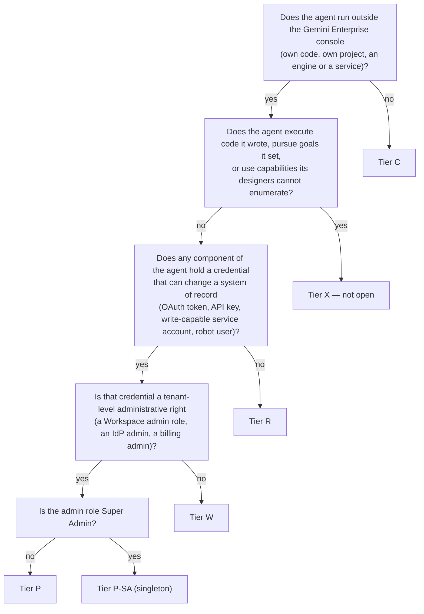
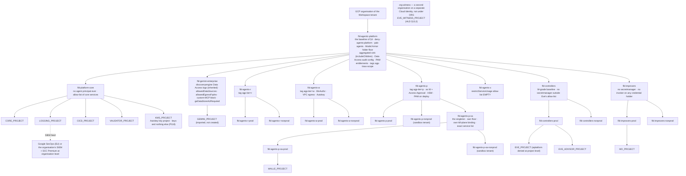
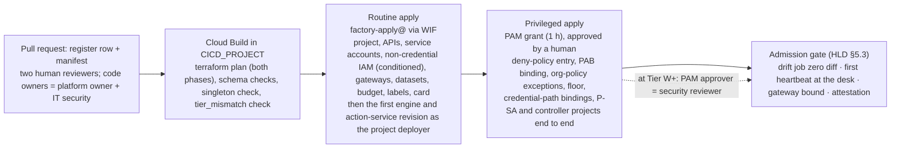

# 2. Landing zone and the tier model

## Status
- Owner: the platform owner
- Last reviewed: 2026-09-14
- Maturity: detailed design, written 2026-09-13 under [01-hld.md](01-hld.md) §0.4 (tier gate),
  §3 (landing zone), §11 (tier model) and §15 (trust boundaries). Nothing is built. This page
  details one part of the platform HLD; where the HLD left a choice open this page proposes
  and records a decision as **P35–P47** (the register of record is
  [12-open-decisions.md](12-open-decisions.md)).
- Scope, from the review's HLD brief ([00-objective-review.md](00-objective-review.md) §5.A):
  items A1 (the tier model), A2 (the landing zone), A3 (`platform-core` versus per agent),
  A5 (the organisation-policy baseline and custom constraints), A9 (what is promoted from
  chapters 11–13 and `project-topology.md`); Agent Identity itself is [04](04-identity-and-privileged-access.md)'s.
- Standing constraints: as stated in [01-hld.md](01-hld.md#status) Status; the tier model is
  designed around Wall-E holding Super Admin (P33).
- Conventions: as stated in [README.md](README.md#status) Status. Every Google product,
  constraint, role, API and limit named here was re-verified on 2026-09-13 against the source
  listed in §9.
- Diagrams: §2.1 (the folder tree, every folder named), §3.4 (the two-phase factory run),
  §1.2 (the tier admission test).

---

## 0. What this page is for, in one paragraph

The HLD says the platform is "the folder, the factory, the register, the contract and the
gate". This page is the folder and the factory: which folder exists, what policy each carries,
what a project is called, what labels it must wear, what it costs by default, who may create it
and with which identity, what the factory refuses, and which controls the platform enforces so
that an agent's builder never re-implements them. It also fixes the tier model in enough detail
that a reviewer can take any agent proposal, run the admission test of §1.2, and read off the
mandatory controls, who runs each, and which are Google-enforced versus code the agent's own
repository must carry. The three existing agents are the first tenants of three tiers
(Wall-E: P-SA; Eve: the controller shape; Mo: the improver shape); nothing on this page is
specific to them except where their pages seeded a platform control, which §8 promotes.

---

## 1. The tier model in full

### 1.1 Letters, not numbers, and how the brief's T0–TX map

The review's brief (A1) named the tiers T0 classical, T1 read tools, T2 write agents, T3
privileged (with the super-admin singleton a T3 sub-class) and TX AGI-class. The HLD adopted
exactly that model and **lettered** it — C, R, W, P (with P-SA), X — because the ladder in every
Wall-E page and in `ladder.schema` already uses T0–T3 for **trigger classes** (`chat`,
`scheduled`, `event`, `inbox`), and two vocabularies sharing four symbols would produce the
wrong ceiling in somebody's code. The mapping is fixed here so the brief and the folders never
drift:

| Brief (A1) | Platform tier | Folder |
|---|---|---|
| T0 classical | **C** | none — the tenant app in `fld-gemini-enterprise` |
| T1 read tools | **R** | `fld-agents-r-prod`, `fld-agents-r-nonprod` |
| T2 write agents | **W** | `fld-agents-w-prod`, `fld-agents-w-nonprod` |
| T3 privileged | **P** | `fld-agents-p-prod`, `fld-agents-p-nonprod` |
| T3 super-admin singleton sub-class | **P-SA** | `fld-agents-p-sa-prod`, `fld-agents-p-sa-nonprod` (children of `fld-agents-p`) |
| TX AGI-class | **X** | `fld-agents-x` — exists, empty, closed |
| (not in the brief) the verifier and improver shapes | **controllers**, **improvers** | `fld-controllers-*`, `fld-improvers-*` — not agent tiers; they hold the platform's control and measurement components and inherit the W-grade baseline |

A page that says "T1 agent" means a trigger class, never a tier; a tier is always written as
its letter.

### 1.2 The admission test: which tier an agent is

The tier is decided once, at the register row (HLD §5.1, field `tier`), by the platform owner,
and re-decided only by a new register row. The test is mechanical so that nobody argues an
agent down a tier:

Three rules the test carries:

- **The credential decides, not the intent.** A "read-only" agent whose action service holds a
  token with any write scope is Tier W. The scope set is what Google enforces; the prompt is not.
- **The highest component decides.** An agent whose reasoning layer is harmless but whose
  action service holds a Workspace admin role is Tier P as a whole. There is no "mostly R".
- **X is answered first** because an agent that meets Q4 is not admitted at all in 2026 (HLD
  §11.5); the register row is refused with reason `tier_x_closed`.

### 1.3 Mandatory controls per tier — what the platform enforces and what the agent's code must carry

This is the control list a builder and a reviewer work from; the tier profile across all
controls (identity, egress, verifier, kill switches, autonomy, measurement, human cost, trust
boundaries) follows the per-tier tables. Every row states the **resource** the control sits on, the **owner** (role), how it is
**verified**, and what happens when it **fails**. "Platform" in the "Where it lives" column
means the control exists before the agent's repository does and the agent's owner cannot change
it; "agent" means the agent's repository must implement it against the platform contract and
CI checks that it did. The grade vocabulary is the HLD's (§0.2): enforcement or detection.

#### Tier C — classical (no project)

| # | Control | Where it lives | Resource | Owner | Verified by | On failure |
|---|---|---|---|---|---|---|
| C1 | Register row before the console agent exists (D1) | platform | `platform/agentic-platform/register/<agent>.yaml` | agent owner writes, platform owner approves | nightly reconciliation matches console agents to rows (HLD §2.2) | unmatched console agent = shadow agent, severity 2, unpublished within one business day |
| C2 | Console Model Armor on — set per app (Configurations > Assistant), template `ge-console-standard`, failure mode Block; tenant-wide in practice with one app ([03](03-gemini-enterprise-environment.md) §9, P53) | platform | the Gemini Enterprise app's Configurations tab | Gemini Enterprise admin (PAM) | daily drift check reads `customerPolicy.modelArmorConfig` | setting off or Allow = severity 2 finding; the admin re-enables; every hour off is recorded on the app's compliance row |
| C3 | Feature toggles off for the general population, on for `ge-builders@` | platform | per-app Feature Management | Gemini Enterprise admin (PAM for changes) | drift check | toggle drift = finding; membership change on `ge-builders@` = SIEM rule (HLD §7.3) |
| C4 | Data stores EU only; connectors from the committed allow-list | platform | `GEMINI_PROJECT` data stores, connector list in git | Gemini Enterprise admin | reconciliation compares deployed connectors to the committed list | foreign connector = finding; unpublish |
| C5 | Share to named groups, or tenant-wide only if every data store is | platform | the console share | Gemini Enterprise admin | reconciliation | over-shared agent = finding; share narrowed |
| — | Agent code | none. A Tier C agent has no code the platform trusts or checks beyond the register row | the register row only | agent owner | C1's reconciliation | as C1 |

#### Tier R — read tools (own project under `fld-agents-r-*`)

| # | Control | Where it lives | Resource | Owner | Verified by | On failure |
|---|---|---|---|---|---|---|
| R1 | Factory-made project, never hand-made (PR1, D2) | platform | project under `fld-agents-r-prod` / `-nonprod` | platform owner runs the factory; `factory-apply@` does the work | the project's `created_by` label and the CI run id in the register row; Cloud Asset Inventory feed alerts on any `CreateProject` in the folder by any other principal | hand-made project = severity 2 finding; the project is deleted or imported into the factory within one business day |
| R2 | Agent Identity on the reasoning layer; no service account for reasoning (D2) | platform (CI check) — Google-enforced once P4's `identityType` constraint is verified | `spec.identityType` on the `ReasoningEngine`; Cloud Run reasoning services only in nonprod (P5) | platform owner | CI refuses an engine config without `AGENT_IDENTITY`; Security Health Analytics custom module lists engines whose identity is a service account | CI fails the deploy; a running engine with a service account is a severity 2 finding and a dated Tier R exception or a `halt` |
| R3 | Egress gateway, default-deny access policy, bound at creation (HLD §6.1) | platform, Google-enforced | `custom.allowlistedEgressAgentGatewaysForAgentEngine` at `fld-agentic-platform`; the gateway in the agent's project | platform owner | the constraint refuses CREATE/UPDATE of an engine bound to a gateway outside the allow-list; reconciliation flags an unbound engine as severity 2 | unbound engine cannot be created; if the constraint is in dry-run, the audit-log violation pages the platform owner |
| R4 | Ingress gateway with Model Armor `failOpen: false` if any machine calls the engine | platform | the ingress gateway; `custom.allowlistedIngressAgentGatewaysForAgentEngine` | platform owner | constraint + the template-standard CI diff | a machine-called engine without an ingress gateway is refused at the API |
| R5 | No credential reach: `secretmanager.googleapis.com` absent from the folder's `gcp.restrictServiceUsage` allow-list; folder deny policy on agent principals (HLD §4.5) | platform, Google-enforced | `fld-agents-r-*` org policy; `deny-agents-platform` | platform owner; security reviewer approves changes | Policy Analyzer drift job; the dry-run audit log | a Tier R project cannot enable Secret Manager at all; a deny violation is an Admin Activity entry and a SIEM rule |
| R6 | Model Armor template standard `read` (floor + SDP basic) applied from the shared module | platform | the project's template, copied by the factory | platform owner; agent owner may only tighten | CI diff against the standard | looser template fails CI; drift = finding |
| R7 | Monitoring baseline `read` (HLD §7.2): Data Access logs by inheritance, aggregated sink by inheritance, absence policy on the heartbeat | platform | folder audit config; the project's alert policies | platform owner | admission gate requires the first heartbeat at the detection desk | no heartbeat within the gate window = the agent is not admitted; heartbeat stops in prod = absence page to the owner, "next business morning" at this tier |
| R8 | Registry card generated by CI, resource-level query grant only (decision 42 generalised) | platform | shared Agent Registry in `CORE_PROJECT` (written by `factory-apply@`, P142); the engine's IAM policy | platform owner | reconciliation: card ≠ register row = drift | drift = finding; a project-level `discoveryengine.serviceAgent` grant on the agent project is a severity 2 finding and is removed |
| R9 | Fleet kill K7 reaches the project (KF-1: the pre-written replacement policy = the folder allow-list minus `aiplatform` and `run`; the four levers and their order are [04](04-identity-and-privileged-access.md) §9.3) | platform | `gcp.restrictServiceUsage` at the tier folder | platform owner (PAM); the K7 job on a severity-1 rule | monthly drill in nonprod, time recorded | a drill over 5 minutes end to end is a finding against the platform, not the agent |
| R10 | Budget, labels, Essential Contacts, PAB binding (§3.6, §3.7) | platform (made by the factory) | the project | platform owner | admission gate; reconciliation | a missing mandatory label fails the factory run before the project is created |
| — | Agent code (CI-checked against the contract) | the agent's repository | `agent-manifest.yaml` with `families[]` all `READ`, `egress:` hostnames (read tools over **MCP through the egress gateway** by platform default so Model Armor screens `tools/call` responses — a REST read API needs a supplier row and a stated reason, [06](06-gateways-model-armor-perimeter.md) §2.6, P88), `fingerprint`; the prompt-security chapter's system-instruction rules; taint handling on peer replies (B6) | agent owner | manifest schema check; the injection regression suite of `wall-e/11` §6 as a fixture | CI fails; a manifest declaring any write family in a Tier R folder fails the factory run with `tier_mismatch` |

#### Tier W — write agents (own project under `fld-agents-w-*`)

Everything in Tier R, plus:

| # | Control | Where it lives | Resource | Owner | Verified by | On failure |
|---|---|---|---|---|---|---|
| W1 | Action service is the only credential holder; reasoning layer holds none (D3, P3) | platform (deny policy, `restrictServiceUsage`) + agent (the action service) | `deny-agents-platform` `exceptionPrincipals`: the action service's own service account for `versions.access` on its own secrets only | platform owner; security reviewer | drift job asserts the exception set equals the register's declared credential holders | a second principal able to read the secret = severity 1 and `halt_all` |
| W2 | One service account per duty, keyless, no cross-project attachment (HLD §4.3) | platform | `iam.managed.disableServiceAccountKeyCreation`, `iam.managed.disableServiceAccountKeyUpload`, `iam.disableCrossProjectServiceAccountUsage` at the folder | platform owner | constraint; drift job lists keys (must be zero) | key creation refused at the API; an existing key is severity 1 |
| W3 | Catalogue, policy chain, ladder on `ladder.schema`, `audit.schema` write-ahead insert-only (HLD §12) | agent code against the platform contract | the action service; `<agent>_audit` dataset | agent owner | contract validator in `VALIDATOR_PROJECT`; CI schema checks; Mo reads the dataset | non-conformant audit rows fail the admission gate; a missing write-ahead row is Eve/verifier `reconciliation_gap` |
| W4 | Platform verifier (Eve generalised, HLD §12.4) holds approval authority; the agent cannot reach its key | platform | `VALIDATOR_PROJECT` / the verifier project made by `verifier-project`; HSM key | security reviewer (custodian) | the verifier's own drift job; denial test "agent principal has no `useToSign`" | a signer outside the verifier's allow-list = severity 1 |
| W5 | Binary Authorization on every Cloud Run service; SLSA 3 provenance from `CICD_PROJECT` (HLD §9) | platform, Google-enforced | `run.allowedBinaryAuthorizationPolicies` at `fld-agents-w-*`; the custom constraint of §4.3 row CC-3 | platform owner | deploy refused without attestation; post-deploy digest compared by the drift job (detection) | unattested image cannot deploy; a digest mismatch after deploy is severity 2 |
| W6 | Credential holders never internet-reachable: IAM-only invoke now; `run.allowedIngress = internal-and-cloud-load-balancing` at the folder after P3's engine-reach spike (HLD §8.1) | platform | the Cloud Run service; the folder policy held in Terraform | platform owner | Security Health Analytics custom module flags `ingress = all` on any service in W/P/controllers (detection until P3) | finding, severity 2; after P3, deploy refused |
| W7 | `run.allowedVPCEgress = private-ranges-only` at the folder | platform, Google-enforced | `fld-agents-w-*` | platform owner | constraint | a revision with `all-traffic` egress is refused |
| W8 | Firestore control plane with PITR, scheduled backups, delete protection; one restore drill before Stage 1 (HLD §10 R-B) | platform (factory mandates) + agent (uses it) | the project's Firestore database | agent owner; platform owner for the drill record | admission gate checks the drill record (< 30 days for the first promotion above L3) | no drill record = gate fails |
| W9 | Nonprod project under `fld-agents-w-nonprod` with the same manifest, `env=nonprod` (§3.5) | platform (made by the factory) | the nonprod project | platform owner | admission gate: prod promotion is an attestation of the nonprod-tested digest | no nonprod = no prod |
| W10 | Blind grader named with capacity (P25) | organisational | the register row `grader` field | Mo owner; ISMS | admission gate refuses a W row without a named grader | row refused |
| W11 | Second operator for L3 approvals ≠ agent owner; security reviewer on ladder raises above L3 (HLD §0.3, §11.2) | organisational | `<agent>-operators@`; branch protection on `ladder.yaml` | agent owner; security reviewer | CI checks the approver identity on every promotion PR | PR cannot merge |
| — | Agent code | the agent's repository | catalogue, policy chain, playbooks, inverse operations, pre-state predicates, `ladder.yaml`, the prompt; `hard_denied` and `protected_principals` in the manifest; `/v1/control/*` REST interlocks (D12) | agent owner | contract validator; denial suite as a CI fixture | CI fails; the verifier refuses plans the manifest does not cover |

#### Tier P — privileged (own project under `fld-agents-p-*`), and P-SA

**The P-SA singleton.** Exactly one agent on the platform may hold `privilege: super_admin` (on
2026-09-13: Wall-E); a second P-SA register row fails CI until the first is `retired` (PSA1).
Its folder policies are stricter than Tier P's, never looser (PSA2), and it has no deferred
control. The singleton is a policy, not a Google limit: each Tier P agent is a licensed
Workspace user on the admin-role review (P7), and the super-admin detection set (PSA4) is
written for one actor.

Everything in Tier W, plus:

| # | Control | Where it lives | Resource | Owner | Verified by | On failure |
|---|---|---|---|---|---|---|
| P1 | The Tier P line of the tier gate ([HLD §0.4](01-hld.md#04-the-tier-gate-what-must-exist-before-a-tier-opens)) is green before the credential is granted; the items and their verification are the gate checklist of [11 §6.3](11-tisax.md#63-compensations-as-preconditions--the-checklist-the-gate-reads) | organisational, checked by CI | the register row's `gate_checklist` sub-document, one line per item with a date and a signer | platform owner; security reviewer signs | the admission gate refuses a `tier: P` row whose checklist has an empty line | the row does not merge; no project is made |
| P2 | A licensed robot user account in `/Automation/Service Identities`, hardware-key-only 2SV, no recovery channels, short session, no interactive login (HLD §4.6) | tenant | the robot OU | human super admins; platform owner drift-checks | daily drift check of the OU settings from `eve@`'s read role; `login.googleapis.com` SIEM rule | interactive login = severity 1 incident and K5 |
| P3 | Dedicated Eve (deterministic control path + reporting path), not the generalised platform verifier (HLD §12.4) | platform | `EVE_PROJECT`, `EVE_ADVISOR_PROJECT` | Eve owner (outside the Wall-E line) | Eve's own drift job; the witness absence alarm | Eve's heartbeat absent 15 min, or `eve_workspace_logs` silent 60 min in business hours = `log_pipeline_silent` halt (H-1, H-4 of [07](07-monitoring-detection-incident-response.md) §7) |
| P4 | Monitoring baseline `credentialed`: SIEM feed, the super-admin detection set (P-SA) or the admin-role detection set (P), the witness mirror | platform | `LOGGING_PROJECT` sink; the SIEM; `EVE_WITNESS_PROJECT` | IT security (detection content); platform owner (feeds) | "registered ⇒ feeding": the admission gate requires the first event at the SIEM | no SIEM event = not admitted; feed stops = witness absence alarm |
| P5 | Perimeter (b) applied: internal ingress behind an internal load balancer and PSC endpoint; Access Approval on the project; PAM with a second approver on every deploy grant (HLD §8.1, §13.1 item 8) | platform | the folder policy; `fld-agents-p*` Access Approval; PAM entitlements | platform owner; security reviewer | the P3 spike record; SHA custom module | the grant is not made until the spike has passed |
| P6 | HSM keys for every approval authority; Autokey at the folder for data at rest; Firestore's Google-managed exception recorded once (HLD §8.3) | platform | folder Autokey config; the verifier's key ring | platform owner | drift job | a non-HSM approval key is severity 1 |
| P7 | Tier P is rare by policy: every P row is a licensed user on the admin-role review; the `privilege` field is reviewed quarterly | organisational | the register | security reviewer | quarterly privilege review | an unreviewed row loses its share |
| PSA1 | **Singleton**: CI fails a second `privilege: super_admin` row while one is not `retired` (HLD §11.3) | platform (CI) | the register | platform owner | the register schema check | merge refused |
| PSA2 | Own folder `fld-agents-p-sa` with policies stricter than P, never looser: `restrictServiceUsage` allow-list holding exactly the services the Wall-E set names; own Model Armor folder floor (template conformance) plus the project's `Custom` floor with inline `INSPECT_AND_BLOCK` — a project floor overrides its folder, so "never looser" for the floor is held by who may write it and the daily compare, not by the hierarchy ([06](06-gateways-model-armor-perimeter.md) §3.2); the hard-denied vocabulary detectors live in the P-SA response template; own kill-plane binding (KF-1 and KF-2 attach to this folder independently of `fld-agents-p`) | platform | the folder; `WALLE_PROJECT`'s floor setting | platform owner; IT security owns the floor content | drift job (folder policies and the project floor compare); the monthly K7 drill exercises the P-SA binding separately | a P-SA policy or project floor looser than generated is a severity 1 finding; writes held at L0 until re-applied |
| PSA3 | Two credentials in two services (`walle-actions`, `walle-actions-super`), `cloud-platform` never consented, checked in CI (HLD §13.1 item 3) | agent code + Google (scope) | the two OAuth clients; the consent screen | agent owner; security reviewer | CI reads the consent screen; token-stream SIEM rule on any third client id | `cloud-platform` present = CI fails; a third client = severity 1 |
| PSA4 | Detection as the primary control: the severity-1 set of HLD §7.3 hosted in the SIEM, never in `WALLE_PROJECT` | platform | the SIEM | IT security | a CI test per rule from the seeded-fault fixtures | a rule with no passing test is not counted in the safety case |
| PSA5 | No super-admin-class operation is ever autonomous; `SUPER` rows chat L3 two-person, every other trigger L0, code not config | agent code, fixed by `ladder.schema` | the action service | agent owner | CI asserts neither `SUPER` nor `WRITE-generic` appears in `playbook.uses` | CI fails |
| PSA6 | Nonprod is a **sandbox Workspace tenant**, not an OU (decision 29 → yes; Super Admin cannot be OU-scoped) | platform | `fld-agents-p-sa-nonprod`; `iam.allowedPolicyMemberDomains` there lists the sandbox customer id | platform owner | the folder policy value; `gemini-egress` never lists a nonprod engine | a prod engine reachable from the sandbox, or vice versa, is severity 1 |

#### Tier X — AGI-class (closed)

| # | Control | Where it lives | Resource | Owner | Verified by | On failure |
|---|---|---|---|---|---|---|
| X1 | `fld-agents-x` exists with `gcp.restrictServiceUsage` allow-list **empty** — nothing can be created in it | platform, Google-enforced | the folder | platform owner | drift job asserts the empty allow-list | any non-empty value without a P-numbered decision is severity 1 |
| X2 | Each opening condition of Tier X becomes a dated line on the folder's decision file before the allow-list gains one service; the conditions and where each stands are [09 §5.4](09-supply-chain-secrets-recovery.md#54-the-honest-line-restated-with-what-changed-on-2026-09-13) | organisational | `decisions/` | platform owner; AI-safety reviewer (role does not exist) | the decision file; the drift job (X1) | the allow-list stays empty; any service added without the dated decision line is severity 1 to `platform-security@` and reverted by the platform owner |
| X3 | Every containment primitive of HLD §11.4 live and drilled for six months before the first X row | platform | K7 drill records | platform owner; security reviewer | drill record dates | a missing month resets the six-month clock; an X row merged without the history is refused by the admission gate, and the allow-list stays empty (X1) |

#### The tier profile across all controls

The same tiers read across, one row per control family. "Same" means as the column to its
left.

| | **C classical** | **R read tools** | **W write agents** | **P privileged** (P-SA = the super-admin singleton) | **X AGI-class** (closed) |
|---|---|---|---|---|---|
| What it is | Gemini Enterprise no-code / data-store agents; retrieval only; the user's own permissions | Agent Runtime agent with read-only tools, MCP/A2A through the gateway | an agent that writes to a system of record through an action service | an agent whose action service holds a tenant-level credential (Workspace admin role; P-SA: Super Admin) | an agent whose capabilities exceed the designers' foresight; code execution; self-directed goals |
| Identity | product | Agent Identity | Agent Identity + one service account per duty | same + robot user account(s), two hardware keys | same + sandbox identity |
| Egress | console Model Armor; connector allow-list | gateway default-deny | same | same; action service egress only to the tenant's APIs | same + Agent Sandbox egress blocks |
| Ingress | tenant | ingress gateway with fail-closed Model Armor if machine-called | same | same | same |
| Write path | none | **none** (no credential; hostname allow-list of read-only APIs; `secretmanager` denied by `restrictServiceUsage`) | action service, catalogue, policy chain, ladder | same + bands A/B/C, split control plane, two clients | same + capability ceiling outside the agent, no self-modification, sandboxed execution |
| Verifier | none | none | platform verifier (Eve generalised, HLD §12.4) | **Eve** (dedicated, deterministic control path + reporting path) | model-free monitor with halt authority + a second model family for advisory monitoring |
| Monitoring baseline | `classical` (SCC inventory, console Model Armor logs) | `read` | `write` + absence + audit schema + behavioural baselines | `credentialed` + SIEM + super-admin detection set + witness | + capability-drift rules |
| Kill switches | unpublish | K3 (invoker), K7 (fleet) | K0–K4, K7 | K0–K7 | K0–K7 + sandbox teardown |
| Autonomy | n/a | n/a | ladder per (family, trigger); `WRITE_HIGH` never L5 | same; **no super-admin-class operation is ever autonomous** | every cell L0 until re-qualified per model pin; no autonomous write ever |
| Measurement | cost, reliability | + Model Armor `MATCH_FOUND` rate, drift, freshness | + full metric pack, blind grading | + Eve quality pack | + evaluation gates (research-grade) |
| Human cost at steady state | 0 | about 0.5 h/month (quota, review date) | about 1 h/week of blind grading per agent from a named human who is not the playbook owner, + approvals | about 3 h/week + bought desk + a second super admin on the rota | undefined |
| Platform-enforced versus agent code | all platform | all platform | platform: identity, gateway, deny, PAB, baseline, schema check, admission gate; agent: catalogue, policy chain, ladder config, playbooks, prompt | same; plus platform-owned super-admin detections | platform: all containment primitives; agent: nothing trusted |
| Trust boundaries (HLD §15) | B1 | B1, B2, B6, B7 | all | all | all |

**What limits "hundreds of agents"** is not projects or quotas but blind-grading hours: the
platform **caps the number of Tier W agents by named grading capacity**, as a number (P25),
and a Tier W row without a named grader with capacity does not pass the admission gate (W10).
Organisation policy, custom constraints, deny policy, PAB, gateway binding, floors, Binary
Authorization, Data Access logs, sinks, PAM, the admission gate and the fleet kill switch are
platform-enforced, and an agent's owner cannot change them.

### 1.4 Who runs which control — the staffing view

| Control | C | R | W | P |
|---|---|---|---|---|
| Register row and publication gate | agent owner writes; platform owner approves | same | same + security reviewer | same + DPO |
| Factory run (§3.4) | — | platform owner (about 30 min), both phases | platform owner; the privileged phase needs a PAM approval by the security reviewer | same as W |
| Ladder raises | — | — | agent owner PR + second operator; above L3 + security reviewer | same; band B never |
| Approvals (L3) | — | — | second operator | human super admin other than the requester for band B |
| Detection acknowledgement | owner, best-effort | owner | owner + security reviewer | bought desk, 24x7 |
| Drills | — | K7 monthly (fleet) | K0/K1 monthly, restore quarterly | + K5/K6 quarterly, tabletop quarterly |

**The factory run itself is a controlled operation** with two phases and two identities
(§3.4): at Tier R the platform owner runs both; at Tier W and above the privileged phase needs
a PAM approval by the security reviewer, so a factory run for a credential holder is a
two-person act from the first day.

### 1.5 Changing tier, and why a project is never moved

A tier is a folder. The HLD's promise that "your compliance classification is done once, at
the gate" (PR7) only holds if the classification and the folder cannot drift apart. So:

- **A tier change is a new register row, a new project in the new tier's folder, and a `revoke`
  of the old one.** Projects are never moved between tier folders. Reason: a moved project
  keeps its resources but changes every inherited policy at once (constraints, deny policy
  principal entries, the PAB binding, the floor, the aggregated sink's scope), which is exactly
  the class of change the drift job is worst at explaining; and a "promoted" Tier R project
  would carry an engine that was created under a looser `restrictServiceUsage` list. The one
  exception is the `tenant-app` import of `GEMINI_PROJECT` (HLD §2.1), which is a one-off with
  its own change window.
- **Demotion is the same operation in the other direction**, and is the only "move" a machine
  may initiate: Eve or the platform verifier can set the register row `status: halted` and
  `halt_all`, never change `tier`. Only a human writes a tier.
- Enforcement: `roles/resourcemanager.projectMover` is granted to nobody standing; it is the PAM
  entitlement `ent-project-move` ([04](04-identity-and-privileged-access.md) §5.2) on the source
  parent and the destination folder — Google requires the role on both, and on the organisation
  when the project sits at the root ([move a project](https://docs.cloud.google.com/resource-manager/docs/moving-projects-folders),
  read 2026-09-13) — with the security reviewer as approver and a justification naming the
  decision file (§3.4). A `MoveProject` event in the folder is a SIEM
  rule.

This is recorded as **P43** (§7).

---

## 2. The folder tree, every folder named

### 2.1 The tree

`FOLDER_ID` in the three agent sets is the numeric id of `fld-agentic-platform`. The `fld-`
names are display names; numeric ids are Terraform outputs published to the register as
`folders.yaml`. Depth is four folders below the organisation at most (`fld-agentic-platform` →
`fld-agents-p` → `fld-agents-p-sa` → `fld-agents-p-sa-prod`), against a limit of ten levels
and 300 child folders per parent (Resource Manager limits page, updated 2026-09-09, §9).

### 2.2 Every folder, its purpose, its policy additions, who may create below it

| Folder | Purpose | Holds | Policy additions beyond the §4 baseline (exact values in §4.2) | Who may create children | Budget default per project (`Assumption:` anchored on the 200 EUR Stage-0 line in the agent sets; numbers are P31) |
|---|---|---|---|---|---|
| `fld-agentic-platform` | The platform boundary. Everything the HLD calls "set once and enforced by Google" attaches here | the eight folders below; **no project directly** (a project parented here is a finding) | the full baseline of §4.1; `deny-agents-platform`; the `pab-agents` binding template; Model Armor folder floor; the aggregated sink; Data Access audit config; PAM entitlements; Essential Contacts | platform owner, through PAM `roles/resourcemanager.folderAdmin` (1 h) — folders are made at Stage 0 from Terraform, never afterwards without a decision | — |
| `fld-platform-core` | Shared services; no agent principal is ever bound here | `CORE_PROJECT`, `LOGGING_PROJECT`, `CICD_PROJECT`, `VALIDATOR_PROJECT`, `KMS_PROJECT` (the Autokey key project — keys and nothing else, [09-supply-chain-secrets-recovery.md](09-supply-chain-secrets-recovery.md) P118) | `gcp.restrictServiceUsage` allow-list of core services (§4.2); `iam.managed.workloadIdentityPoolProviders` limited to the git host's issuer (§3.4); `iam.managed.disableAccessPolicyBinding` enforced (no gateway here); `run.allowedIngress` and `run.allowedBinaryAuthorizationPolicies` as W (the K7, drift, reconciliation and canary jobs are Cloud Run on the kill and evidence paths — [06](06-gateways-model-armor-perimeter.md) §4.3, [09](09-supply-chain-secrets-recovery.md) §1.5) | platform owner via PAM; these five are made once | 300 EUR/month |
| `fld-gemini-enterprise` | The tenant app's project, imported (HLD §2.1) | `GEMINI_PROJECT` | `discoveryengine.googleapis.com` Data Access logs (inherited from the platform folder's `auditConfigs`, [08](08-data-logging-retention-sovereignty.md) §4.1); `gcp.resourceLocations` gains `eu` for the app's multi-region; `discoveryengine.managed.allowedDataSources` and `discoveryengine.managed.allowedEgressFqdns` (both with `enforcedProjects` = `GEMINI_PROJECT_NUMBER`), the managed custom-MCP block kept enforced, custom constraint `custom.geDataStoreAclRequired` in dry-run (CC-12 of §4.3; [03](03-gemini-enterprise-environment.md) §3, §12, P48); `iam.managed.disableAccessPolicyBinding` lifted on `GEMINI_PROJECT` only, as a factory input with reason "gateway binding" and a review date | nobody — the import is a one-off with a change window | *tbd* (licence-driven) |
| `fld-agents-r` → `-prod`, `-nonprod` | Tier R agents, one project each | Tier R projects | allow-list **without** `secretmanager.googleapis.com` and without `cloudkms.googleapis.com` signing use (Autokey's own key use is Google-managed); `iam.managed.disableAccessPolicyBinding` **not enforced** (every agent project binds `roles/iap.egressor` for its gateway) | `factory-apply@` (routine phase) | 100 EUR/month; nonprod 50 % |
| `fld-agents-w` → `-prod`, `-nonprod` | Tier W agents | Tier W projects | as R **plus** `secretmanager` and `cloudkms`, `firestore`, `cloudtasks`; `run.allowedBinaryAuthorizationPolicies = default`; `run.allowedVPCEgress = private-ranges-only`; `run.allowedIngress` held in Terraform until P3; Autokey folder configuration; Model Armor tier floor | `factory-apply@` (routine) + platform owner via PAM (privileged phase) | 300 EUR/month; nonprod 50 % |
| `fld-agents-p` → `-prod`, `-nonprod` | Tier P agents | Tier P projects; the P-SA child folder | as W plus Access Approval on the folder; PAM entitlement on every deploy role with a second approver; HSM-only key rings; tier floor with SDP basic; the `credentialed` baseline | as W; the privileged phase needs the security reviewer's PAM approval | 500 EUR/month; nonprod 50 % |
| `fld-agents-p-sa` → `-prod`, `-nonprod` | The super-admin singleton | `WALLE_PROJECT` (prod); the sandbox-tenant robot's project (nonprod) | as P plus: `restrictServiceUsage` allow-list holding **exactly** the services the Wall-E set enables (§4.2 row 7); own Model Armor floor with the hard-denied vocabulary detectors; own K7 binding (KF-1 and KF-2 attached to this folder, drilled separately); `iam.allowedPolicyMemberDomains` in `-nonprod` lists the sandbox tenant's customer id | as P; **plus** the register's singleton check must pass before the factory runs | 500 EUR/month; nonprod 50 % |
| `fld-agents-x` | Tier X, closed | nothing | `gcp.restrictServiceUsage` allow-list **empty** | nobody until §1.3 X2 | — |
| `fld-controllers` → `-prod`, `-nonprod` | Eve's shape: the control path and the reporting path; any future Tier W platform verifier instance | `EVE_PROJECT`, `EVE_ADVISOR_PROJECT`; nonprod copies against the sandbox tenant | W-grade baseline; `deny-eve-project-foreign` on `EVE_PROJECT` (HLD §4.5): no `secretmanager` for any principal outside Eve's allow-list; **`aiplatform.googleapis.com` is denied on `EVE_PROJECT` at project level, not on the folder** — a folder denylist would apply to `EVE_ADVISOR_PROJECT` too, and the reporting path needs the API; CP5's "deterministic by absence" grade is therefore tied to the project-level constraint on `EVE_PROJECT`, drift-checked, and to the CI check on the image | `verifier-project` module, applied end to end under `ent-factory-singleton` approved by the Eve owner or the security reviewer (P142) | 200 EUR/month |
| `fld-improvers` → `-prod`, `-nonprod` | Mo: one per platform | `MO_PROJECT` | allow-list without `secretmanager`, `cloudkms`, `firestore`; `deny-improvers`: no `run.invoker`-bearing binding on any credential holder from any principal here (denial test MD-9 generalised); `iam.managed.disableAccessPolicyBinding` enforced | `improver-project` module | 200 EUR/month |

Two folders this page adds to the HLD's tree, with the reason: **`fld-controllers-nonprod`**
and **`fld-improvers-nonprod`**. Eve must be drilled against the sandbox tenant before the
super-admin grant (HLD §0.4 P line: "Eve's observe-and-report layer live and drilled"), and a
drill against the production tenant with a robot that already holds Super Admin is the wrong
order. Mo's proposal pipeline must be exercised against nonprod audit datasets before it opens a
pull request against a production ladder. Both are W-grade components and get the W nonprod
rule (§3.5). Recorded as part of **P40**.

### 2.3 What may never sit where

| Rule | Enforced by | Verified by | On failure |
|---|---|---|---|
| No project directly under `fld-agentic-platform` | the factory has no module that targets it; `factory-apply@` holds `projectCreator` on tier folders only | Cloud Asset Inventory feed → Pub/Sub → alert on `CreateProject` with parent = the platform folder | severity 2; the project is moved by the platform owner through PAM within one business day and the maker's grant is reviewed |
| No agent principal bound anywhere in `fld-platform-core` | `deny-core-agents` (a deny policy on the core folder for every permission on every `principalSet://agents…` form, once P8 proves the forms) and the AllowPolicy custom constraint of §4.3 row CC-6 (spike) | drift job | severity 1 |
| No project outside the platform folder carries an agent the register knows | reconciliation over the Cloud Asset Inventory organisation export (HLD §5.2) | daily | shadow agent, severity 2 |
| The witness is never a child of the tenant's organisation | organisational (it is a separate Cloud Identity) | the witness administrators' quarterly attestation | — |

---

## 3. Project-per-agent and the factory

### 3.1 Why project-per-agent is forced

Google's one-gateway-per-project-and-region rule and the project-wide reach of the documented
cross-project grant make one project per agent the only safe shape, and the platform generalises
that rule to every agent from Tier R up: each gets its own factory-made project in its tier
folder. The Google facts, the quota and teardown arguments and the cost at hundreds of projects
are argued once in [project-topology.md §1](../project-topology.md#1-why-four-projects).

### 3.2 Tooling decision (P35, closing HLD P2)

Three options were on the table: Cloud Foundation Fabric's FAST project factory, a bespoke
Terraform module set, or Config Controller. Verified status on 2026-09-13:

| Option | What it is today | Verified | Fit |
|---|---|---|---|
| **Cloud Foundation Fabric** — the `project-factory` module and the FAST `2-project-factory` stage | Google-maintained Terraform; latest release **v58.0.0, published 2026-09-01** (GitHub releases API, §9). The `project-factory` module manages projects from YAML with parent, billing, services, IAM (bindings, additive, by principal), org policies, labels, tag bindings, essential contacts, log buckets and sinks, VPC-SC perimeter membership, service accounts with IAM, buckets, BigQuery datasets, Pub/Sub topics, KMS keys, quotas, and **a billing-budgets factory referenced from project files**. FAST stages on `master`: `0-org-setup`, `1-vpcsc`, `2-networking`, `2-project-factory`, `2-security`, `3-secops-dev`. The module list includes `agent-gateway`, `project`, `folder`, `organization`, `billing-account`, `iam-service-account`, `logging-bucket`; there is **no** agent-engine module | module README, stage README, module index, releases API — all read 2026-09-13 | Covers every input the factory needs except the engine, the registry card and the platform's own policies, all of which are plain provider resources (`google_vertex_ai_reasoning_engine`, verified by `wall-e/12` §1.2) |
| **Bespoke modules only** | Three modules written from scratch | — | Re-implements what Fabric already verifies across releases; the platform owner is one person |
| **Config Controller** | A hosted Config Connector with Config Sync and Policy Controller, on a Google-run cluster; **not deprecated** — release notes carry updates on 2026-08-24 and 2026-08-03 and, since 2025-09-02, it no longer requires GKE Enterprise (release notes and overview, updated 2026-09-09, §9) | yes | A Kubernetes control plane that must run continuously, hold a powerful reconciling identity, and be patched, to do what a CI job does on demand; the KRM resource model would also mean a second definition of every resource the agent sets verified in Terraform form. Not chosen |
| **Infrastructure Manager** (as the runner) | Google-managed Terraform execution over Cloud Build under a service account; version pinning per deployment (overview updated 2026-09-03, §9) | yes; GA (announced 2023-09) | Optional runner; it does not remove the need for the CI identity or the state bucket. Not adopted now (**P35**): the pipeline runs Terraform in Cloud Build in `CICD_PROJECT` directly, where the SLSA provenance already lives; revisit when the team is larger than one |

**Decision P35.** The factory is Cloud Foundation Fabric's `project-factory` module (pinned at
v58.0.0 and re-pinned only by pull request), wrapped by three thin platform modules
(`agent-project`, `verifier-project`, `improver-project`, §3.3) that translate a register row and
manifest into the module's YAML plus the platform-specific resources, run by Cloud Build in
`CICD_PROJECT` under Workload Identity Federation (§3.4). The FAST **stages** are not adopted:
`0-org-setup` assumes it owns the organisation's IAM, sinks and billing, which belong to the
organisation's IT, and the platform is a folder, not an organisation. Fabric's `folder` and
`organization` modules are used for the folder tree and the folder-scoped policies of §4 (the
`organization` module is the one that exposes org-policy and custom-constraint resources; it is
pointed at the folder id). Config Controller and Infrastructure Manager are not chosen, with the
reasons above. Owner: platform owner. Gate: Tier R.

Fallback if Fabric's YAML cannot express a platform input (the first factory run in nonprod
tells): the input is a resource in the wrapper module, not a fork of Fabric.

### 3.3 The three modules, and the topology rows they consume

Every module takes the register row (HLD §5.1) and `agent-manifest.yaml` (HLD §12.2) as its
only inputs; nothing is typed at the command line. The cross-project grant rows of
[../project-topology.md](../project-topology.md) §3 are generalised into inputs as follows —
this is the "topology as a template keyed on `<agent>_PROJECT`" the brief's A9 asked for:

| Topology §3 row(s) | Generalised input | Module that makes the binding | Where the binding sits (always the resource's project) |
|---|---|---|---|
| 1 (engine query by the tenant app's service agent), 2 (fallback) | `publish_to_gemini: true` → custom role `geEngineQuery` (P56) holding `aiplatform.reasoningEngines.query`, defined in the project by `agent-project` and bound on the engine by the agent project's CI as `<agent>-deployer@` (P56, P142) to `service-${GEMINI_PROJECT_NUMBER}@gcp-sa-discoveryengine…`; row 2 never made by the factory (a dated exception if ever) | `agent-project` | the engine |
| 3, control part (`eve-controller@`, `eve-verifier@` on `walle-actions`) | `control_invokers[]`: principals that may call `/v1/control/*` — `roles/run.invoker` service-level; the in-app `CONTROL_CALLER_ALLOWLIST` is generated from the same list and from nothing else | `agent-project` | the action service |
| 4, 5, 6, 18, 21 (dataset readers) | `audit_readers[]` (the verifier's principals, `mo-metrics@`, the validator custodian) → dataset-level `READER` on `<agent>_audit`, `<agent>_workspace_logs`; `roles/bigquery.jobUser` in the reader's own project by its own module | `agent-project` writes the dataset ACL; `verifier-project` / `improver-project` grant `jobUser` at home | the datasets |
| 3, read part (`eve-console@`), 8 (`mo-analyst@`) | `read_invokers[]`: `roles/run.invoker` service-level plus the generated in-app **read-endpoint allow-list** (`GET /v1/plans/{id}`, `GET /v1/runs/{id}`, `GET /v1/ladder` as the row names) — never the control list; the denial suite asserts a `read_invokers[]` principal is refused on `/v1/control/*` | `agent-project` (privileged phase for the invoker binding, P142) | the action service |
| 7 (linked spans dataset) | `spans_readers[]`, S3 only, spike 49 | `agent-project` | the linked dataset |
| 9 (anti-grant: no Mo authorised view on a source dataset), 10 (topics, subscriptions) | row 9 asserted by the drift job, never made; row 10: `event_subscribers[]` → `roles/pubsub.subscriber` on the topic only; the subscription lives in the consumer's project (decision 45) | `agent-project` (topic side); consumer module (subscription) | the topic |
| 11 (registry viewer — dropped, decision 43 / P71), 12 (Firestore read — absent, pending decision 44), 13 (anti-grant: no engine query for `eve-controller@`), 14–16 (Eve's carve-outs in `EVE_PROJECT`: `publicKeyViewer`, `verdict_receipts` reader, CI `objectCreator` on `ladder/`) | rows 11 and 13 asserted absent by the drift job; row 12 made only if decision 44 says so; rows 14–16: `verifier.carve_outs[]`, capped at three per verified agent (decision 48) | `verifier-project` | the key, the view dataset, the bucket prefix |
| 17, 25 (anti-grants in `EVE_PROJECT`) | asserted, not made: `verifier-project` emits the expected principal set; the platform drift job and Eve's own drift job assert nothing else appears (HLD §4.7 names the one folder-level exception) | — | — |
| 19, 20 (CI bot reads in `MO_PROJECT`) | `ci_reader`: the WIF-federated CI identity → bucket-level `objectViewer` on `mo-proposals`, dataset-level `metadataViewer` on the archive (decision 50) | `improver-project` | the bucket, the dataset |
| 22, 23 (organisation sink writer identities) | **retired as per-agent organisation sinks**: the two aggregated sinks of [08](08-data-logging-retention-sovereignty.md) §3.2 — `S-org` at the organisation without children and `S-folder` at `fld-agentic-platform` with children, intercepting — write to `LOGGING_PROJECT`, whose fan-out sinks (`to-evidence-bucket`, `to-identity-bucket`, `to-bigquery`, `to-triggers-<agent>`) replace row 23's per-agent trigger sink; per-agent access is a log view or an authorised view. Eve's independent copy stays as the one organisation-level sink outside the aggregate (HLD §7.1) — `verifier-project` makes its dataset and the writer identity's `dataEditor` | `platform-core` module (`LOGGING_PROJECT`); `verifier-project` | the destination dataset; the trigger topic |
| 24, 26 (anti-grants: nothing of the enforcers in `MO_PROJECT`; no project-level role of Eve/Mo in `WALLE_PROJECT`) | asserted by the platform drift job over the whole folder (HLD §4.7) and by the AllowPolicy custom constraint once CC-6 passes its spike | — | — |
| human rows (`projectCreator` on the folder; `discoveryengine.viewer` for the operator; IAP accessors) | `projectCreator` → `factory-apply@` only (§3.4); `discoveryengine.viewer` → dropped, the factory reads the app location as CI; IAP accessors → `<agent>-operators@` from the register | `agent-project` | the folder, the IAP resource |

What each module makes, beyond the HLD §3.2 list, in the order it applies:

| Module | Routine phase (`factory-apply@`) | Privileged phase (a human through PAM, §3.4) |
|---|---|---|
| `agent-project` | project under the tier/env folder with the id of §3.6; labels; billing link; APIs per tier (the tier's allow-list is the ceiling, the module enables the subset the manifest needs); Essential Contacts (owner group); the budget of §3.7; service accounts per duty (W+), keyless; the deployer `<agent>-deployer@` (P142); the first engine revision with `identity_type = AGENT_IDENTITY` and `encryption_spec` on the engine key in `KMS_PROJECT`, created by the run's last routine step as `<agent>-deployer@`, not as `factory-apply@`; egress gateway with default-deny access policy from `egress:` — at Tier W+ prod created with an `ALL_TRAFFIC` agent connectivity template in the project's own VPC (a `/28` subnet with Private Google Access, a PSC network attachment, DNS peering, Cloud NAT), at Tier R `PRIVATE_RANGES_ONLY` ([06](06-gateways-model-armor-perimeter.md) §4.2, P89; the VPC, subnet, NAT and DNS zone are in the W+ cost class); ingress gateway with `failOpen: false` if `machine_callers` is non-empty; the `iap.egressor` bindings; the action service (W+, first revision deployed as `<agent>-deployer@`) with IAM-only invoke and, after P3, the internal load balancer, serverless NEG and PSC endpoint; regional secrets (W+, empty — values are bootstrapped by the agent's runbook, never by the factory); Firestore with PITR, scheduled backups, delete protection (W+); `<agent>_audit` dataset on `audit.schema`, insert-only writer role, the reader ACL; content-log bucket with generated reader IAM and a log view; Pub/Sub topics; the monitoring baseline module of the tier; Model Armor template from the tier standard; the registry card; the `created_by`/`factory_run` labels | the per-project `principalSet://cloudresourcemanager.googleapis.com/projects/N/type/ServiceAccount` entry on `deny-agents-platform`; the `pab-agents` binding for the project's agent identities; the credential-path bindings (secret-level `secretAccessor` for the action service, `run.invoker` from `control_invokers[]` and `read_invokers[]`, `serviceAccountTokenCreator` on the deployer for the release pipeline's WIF principal, `serviceAccountUser` for the deployer on the attached accounts — P142); for `fld-agents-p-sa-*` the whole project apply under `ent-factory-singleton`; the project's `Custom` Model Armor floor carrying inline enforcement (every agent project; [06](06-gateways-model-armor-perimeter.md) §3.2, P84 as redesigned 2026-09-13); any dated exception (an org-policy override on the project, a `gmail-api-push@` member) |
| `verifier-project` | none — `factory-apply@` holds no standing role on `fld-controllers-*` (P142); the whole apply runs under an approved `ent-factory-singleton` grant: Eve's shape from HLD §3.2: the project(s) under `fld-controllers-*`; KMS key ring with an HSM approval key; verifier, gate, reconciler, export identities; `eve.*` datasets; the locked evidence bucket; the independent sink's destination dataset; the reporting-path project with no signer, no invoker, no secret; `aiplatform` **denied at project level** on the control-path project by a project-level `gcp.restrictServiceUsage` denylist | (applied in the same granted run) the project-level org policy on the control-path project; the deny policy `deny-eve-project-foreign` on `EVE_PROJECT` (HLD §4.5); the PAB binding; the witness-side push grants are made by the witness administrators, not by any module here |
| `improver-project` | Mo's shape: `MO_PROJECT` under `fld-improvers-*`; metric datasets; the `mo-proposals` drop box; the three-tier IAM seam; scheduled queries; `mo-reporter` job; no invoker anywhere; `aiplatform` enabled at S4 only | `deny-improvers` (no invoker on any credential holder); the `MO_PROJECT` entry `principalSet://cloudresourcemanager.googleapis.com/projects/N/type/ServiceAccount` on `deny-agents-platform` rules R1–R5 (so [04](04-identity-and-privileged-access.md) R2's "no Mo identity signs" is enforcement); the PAB binding |
| `tenant-app` | import of `GEMINI_PROJECT` into state; reconciliation to the module (HLD §2.1) | the move under `fld-gemini-enterprise` (`roles/resourcemanager.projectMover` through PAM, one change window) |
| `revoke` | removes the engine grant, the `gemini-egress` entry, sets card and row `retired`, calls `halt_all` (W+), schedules deletion after the evidence export confirms (HLD §2.2) | removal of the deny-policy entry and the PAB binding; project deletion (lien removed by the platform owner through PAM) |

Every run ends with the drift job reporting zero diff for the project and the folder; a
non-zero diff fails the run and the admission gate.

### 3.4 The CI identity, and the two-phase apply (P36)

**Facts verified 2026-09-13.** Workload Identity Federation with deployment pipelines supports
GitHub Actions, GitLab SaaS, Azure DevOps and HCP Terraform; both **direct resource access**
(roles granted to the federated identity itself) and **service-account impersonation** are
supported, except that direct access is not supported for HCP Terraform; Google recommends
attribute conditions on **numeric ids** (`assertion.repository_owner_id`,
`assertion.namespace_id`) rather than names, because names can be re-registered by a squatter
(page updated 2026-09-10, §9). The git host itself is P22 and is not decided here.

**Decision P36.** The factory runs as **one service account, `factory-apply@CICD_PROJECT`,
impersonated through a WIF pool `wif-factory` in `CICD_PROJECT`** with one provider per git
host, and an attribute condition pinning the numeric owner id, the repository id and
`ref == refs/heads/main`. Impersonation is chosen over direct access because (a) every grant
the factory needs then names one auditable principal rather than a federated subject string
that every folder policy would have to repeat, (b) that principal can be bounded by a PAB and
listed in the deny policy's exception set, and (c) it keeps one path if the git host changes.
`iam.managed.workloadIdentityPoolProviders` is set at `fld-platform-core` to the git host's
issuer URI only (constraint name verified on the constraints page, §9), so no other provider
can be created in the core folder.

The factory has **two phases with two identities**, because the folder-level controls the HLD
wants "set once and enforced by Google" must not be changeable by the identity that runs
forty times a month:

| Phase | Identity | Standing roles (level) | Why this and nothing more | Never holds |
|---|---|---|---|---|
| Routine | `factory-apply@CICD_PROJECT` | `roles/resourcemanager.projectCreator`, `roles/serviceusage.serviceUsageAdmin`, `roles/iam.serviceAccountCreator` (create accounts, never set their IAM) and `roles/iam.roleAdmin` (project custom roles such as `geEngineQuery`) on `fld-agents-r-*`, `fld-agents-w-*`, `fld-agents-p-*` and `fld-improvers-*` (folder level) — **nothing at all on `fld-agents-p-sa-*` or `fld-controllers-*`** (P142); `roles/resourcemanager.projectIamAdmin` on the same four folders **only as conditional bindings** whose condition is `api.getAttribute('iam.googleapis.com/modifiedGrantsByRole', []).hasOnly([...])` over the committed list of non-credential roles the factory binds (at most 10 roles per binding, so several bindings; no role that grants secret access, key use, invoke, impersonation, act-as or IAM administration is ever in a list — P142); `roles/billing.user` on the platform billing account (to link projects) and `roles/billing.costsManager` on it (to create budgets); `roles/agentregistry.admin` on the shared registry in `CORE_PROJECT` (the one standing registry writer, P142); `roles/storage.objectAdmin` on the Terraform state bucket; `roles/cloudbuild.builds.builder` in `CICD_PROJECT` | A factory that cannot create projects, enable APIs or bind duties inside them is not a factory. The power is bounded three ways: by *who can make it act* (one repository, one branch, two human reviewers, WIF with numeric-id conditions, no key, the PAB `pab-core-ci` limiting it to `fld-agentic-platform`); by *what it can grant* (the `modifiedGrantsByRole` condition, which Google documents for project-, folder- and organisation-level `setIamPolicy` roles such as `projectIamAdmin`, at most 10 roles per list — [setting limits on granting roles](https://docs.cloud.google.com/iam/docs/setting-limits-on-granting-roles), updated 2026-09-10); and by *what it can touch* (deny rule R6 of `deny-agents-platform`, [04](04-identity-and-privileged-access.md) §3). Credential-path bindings — a secret-level `secretAccessor`, a key-level use role, `run.invoker` on an action service, `serviceAccountTokenCreator`/`serviceAccountUser` on any account — are planned by the routine run and applied only in the privileged phase | `roles/orgpolicy.policyAdmin`, `roles/iam.denyAdmin`, `roles/iam.principalAccessBoundaryAdmin`, `roles/logging.configWriter` above project level, `roles/modelarmor.floorSettingsAdmin`, `roles/resourcemanager.folderAdmin`, `roles/resourcemanager.projectMover`, `roles/secretmanager.*`, `roles/cloudkms.*`, any `run.invoker`, any `iam.serviceAccountTokenCreator` or `iam.serviceAccountUser`, any unconditioned `projectIamAdmin`, any role on `fld-agents-p-sa-*` or `fld-controllers-*` outside an approved `ent-factory-singleton` grant. **Grade:** detection (drift job) until the factory's negative test passes in nonprod — `factory-apply@` attempts to bind `roles/secretmanager.secretAccessor` and to read a canary secret, and both must be refused — then enforcement (condition plus deny rule R6) |
| Privileged | the platform owner (Tier R) / the platform owner with the security reviewer as PAM approver (W+); `factory-apply@` itself as the requester of `ent-factory-singleton` (a human approves) | none standing. PAM entitlements of the catalogue of record, [04 §5.2](04-identity-and-privileged-access.md#52-the-catalogue), where each entitlement's scope (organisation or folder), roles, duration and approvers are defined: `ent-platform-policy` (org policy, deny and PAB administration), `ent-folder-admin` (floor, folder and sink administration), `ent-project-move` (the `GEMINI_PROJECT` import only), `ent-project-repair` (the credential-path bindings of one Tier R–P agent project), `ent-factory-singleton` (the whole apply of the P-SA and controller projects, P142); justification = the pull request URL (HLD §4.4) | The HLD's "no standing `orgpolicy.policyAdmin` anywhere" (§11.4) holds; every folder- or organisation-level change is a PAM grant, which is a SIEM event and TISAX access-review evidence | any standing role |

**Verified by:** the drift job asserts the routine identity's binding set **and the condition
text of every conditional `projectIamAdmin` binding** equal this table, that `factory-apply@`
holds nothing on `fld-agents-p-sa-*` or `fld-controllers-*` outside an active approved
`ent-factory-singleton` grant, and that no other principal holds `projectCreator` under the
platform folder; the factory's negative test (above) runs at every factory release; a Security Health
Analytics custom module flags any impersonation chain onto `factory-apply@` other than the WIF
pool. **On failure:** a routine apply that needs a privileged resource fails with a
permission error (by design) and the run stops before the admission gate; a privileged apply
without a PAM grant in the same hour is a SIEM finding; a negative test that *succeeds* (the
grant or the secret read goes through) is severity 1: the factory trigger is disabled, the
binding removed, and runs resume only after the security reviewer signs the incident note.

`Assumption:` the organisation lets the platform link projects to its own billing account or a
platform sub-account (*tbd* with P31); if billing is administered outside the platform, the
billing link and the budgets move into the privileged phase.

### 3.5 The non-production split (P40)

| Rule | Value | Enforced by | Verified by | On failure |
|---|---|---|---|---|
| Every tier folder except X and the Gemini folder has a `-prod` and a `-nonprod` child | §2.1 | Terraform at Stage 0 | drift job | — |
| Nonprod is **optional at Tier R, mandatory from Tier W**, mandatory for controllers and improvers | register field `env_split` (`required` or `optional`) derived from `tier` | the admission gate refuses a `prod` W+ row without a `nonprod` project id | gate | row not admitted |
| Same manifest, same ceilings, `env=nonprod`; a nonprod engine is never listed in `gemini-egress` nor shared to any group | factory | the `gemini-egress` access policy is generated from `env == prod` rows only | reconciliation | a nonprod engine reachable from the tenant app = severity 1 |
| Nonprod holds **no production credential**: secrets are named `<agent>-<purpose>-nonprod` and bootstrapped against the sandbox tenant (Tier P) or a nonprod system of record (Tier W) | agent runbook | CI asserts the secret names; a P-SA nonprod OAuth client is registered in the sandbox tenant | drift | a prod-tenant client id in a nonprod project = severity 1 |
| Tier P / P-SA nonprod is a **sandbox Workspace tenant** (decision 29 → yes, before Stage 1), never an OU of the production tenant: Super Admin cannot be limited to an organisational unit, so decision 29's "second robot scoped to the sandbox OU" of the production tenant contains nothing once the robot is a super admin — only a separate tenant does | `iam.allowedPolicyMemberDomains` on `fld-agents-p-nonprod` and `fld-agents-p-sa-nonprod` lists the sandbox customer id; the prod folders do not | constraint | drift job reads the folder policy values | a sandbox principal bound in a prod project is refused by the constraint |
| Promotion nonprod → prod is a Binary Authorization attestation of the same digest (HLD §9), or, for an Agent Runtime bundle, the same recorded SHA-256 | the same digest carrying `promoted-to-prod`, or the same recorded bundle SHA-256 | admission gate | attestation check; bundle hash compared | a prod deploy whose digest was never in nonprod is refused (Cloud Run) or a severity 2 finding (Agent Runtime, detection-grade until Google offers attestation) |
| Agent Platform Threat Detection is **on in nonprod, one unbound agent at a time**, to learn its detectors without paying the enforcement loss in prod (HLD §6.1) | nonprod folder | the one unbound engine is a dated row | reconciliation | a second unbound engine = finding |
| Nonprod budgets are 50 % of the tier default; nonprod projects are deleted with the prod project by `revoke` | factory | budget resource; `revoke` | — | — |

### 3.6 Naming and the label taxonomy (P37, P38)

**Facts verified 2026-09-13.** A project id is 6–30 characters, lowercase letters, digits and
hyphens, must start with a letter, no trailing hyphen, immutable; a project can carry at most
64 labels; a label key is 1–63 characters matching `[a-z]([-a-z0-9]*[a-z0-9])?`; a value is
0–63 characters of the same alphabet (Resource Manager REST reference, §9). **Labels apply to
projects only — folders and organisations do not support labels** (labels page, updated
2026-09-09). Tags do attach to folders, are inherited by child projects, and are usable in
organisation-policy conditions and IAM conditions (tags overview, updated 2026-09-09). Custom
constraints on `cloudresourcemanager.googleapis.com/Project` are **Preview** and expose only
`resource.parent` and `resource.projectId` (Resource Manager custom constraints page, updated
2026-09-09) — so a naming rule can be Google-enforced, a label rule cannot.

**Naming (P37).**

| Object | Pattern | Example | Enforced by |
|---|---|---|---|
| Folder display name | `fld-<purpose>[-<tier>][-<env>]` as in §2.1 | `fld-agents-w-nonprod` | Terraform; a custom constraint on `cloudresourcemanager.googleapis.com/Folder` (`resource.displayName.startsWith("fld-")`, Preview) at `fld-agentic-platform`, dry-run first |
| Project id | `agp-<tiercode>-<agent>-<env>[-<4 hex>]`, tier codes `r w p psa x ctl imp core ge`, env `prod nonprod`; the hex suffix only on a global-id collision | `agp-psa-walle-prod`, `agp-ctl-eve-prod`, `agp-ctl-eve-adv-prod`, `agp-imp-mo-prod`, `agp-core-logging` | the factory; **custom constraint `custom.agpProjectIdPrefix`** on `cloudresourcemanager.googleapis.com/Project`, CREATE, `resource.projectId.startsWith("agp-")`, ALLOW, at `fld-agentic-platform` (Preview; dry-run 14 days) — a hand-made project with another prefix is refused at the API once enforced |
| Project display name | `<Agent> (<tier>, <env>)` | `Wall-E (P-SA, prod)` | factory |
| Service accounts | `<agent>-<duty>@` as the sets do (`walle-actions@`, `eve-controller@`, `mo-metrics@`); platform: `factory-apply@`, `platform-drift@`, `k7-kill@`, `reconcile@` | — | factory; drift job |
| Groups | `<agent>-owners@`, `-operators@`, `-readers@`, `-users@`; platform: `platform-owners@`, `platform-security@`, `platform-approvers@`, `platform-readers@` | — | factory creates and reconciles daily (HLD §4.2) |
| Gateways | `<agent>-egress`, `<agent>-ingress`; the tenant's `gemini-egress` | `walle-egress` | factory |
| Datasets | `<agent>_audit`, `<agent>_workspace_logs`, `<agent>_content` | `walle_audit` | factory; `audit.schema` |
| Secrets | `<agent>-<purpose>[-nonprod]`, regional `europe-west1` | `walle-refresh-token` | factory (names), agent runbook (values) |
| Tag keys (organisation-level, bound at folders) | `agp-tier` (`c r w p p-sa x ctl imp core ge`), `agp-env` (`prod nonprod`), `agp-tisax-scope` (`in out`) | — | created once by the platform owner through PAM (`roles/resourcemanager.tagAdmin`); bound by Terraform at Stage 0 |

The existing variable names (`WALLE_PROJECT`, `EVE_PROJECT`, `MO_PROJECT`, `GEMINI_PROJECT`,
`FOLDER_ID`) stay as the sets' handles; the register maps each to the concrete id.

**Labels (P38).** Required on every project and mirrored on the registry card; validated by the
factory before `CreateProject`; a missing or malformed label fails the run. Values are slugs
in the label alphabet; the **register row holds the exact value** (a model pin such as
`gemini-2.5-pro` cannot be a label value because of the dot), the label is an index.

| Key | Values | Source | Consumer |
|---|---|---|---|
| `agent` | the `agent_id` slug | register | billing export, log views, SCC filters |
| `owner` | the owner group's local part (`walle-owners`) | register | budgets, Essential Contacts, TISAX 1.3.1 asset owner |
| `tier` | `c r w p p-sa x ctl imp core ge` | register | monitoring baseline variant, budget default, SIEM entity |
| `env` | `prod nonprod` | register | `gemini-egress` generation, promotion |
| `risk_class` | the highest manifest family risk: `read write-low write-high super` | manifest | verifier, the compromise-reach table |
| `data_class` | the organisation's scheme (*tbd*, `Assumption:` `confidential` default) | register | retention schedule, SDP discovery |
| `ai_act_class` | `not-ai-system minimal limited-art50 annex-iii-adjacent high-risk` — the register's underscore values (`annex_iii_adjacent`, [05](05-registry-and-autonomy-contract.md) §3.2) slugged with hyphens; one vocabulary, two spellings, both generated from the row | register | publication gate |
| `autonomy_ceiling` | the highest permitted level across families, `l0`..`l5` | manifest | ladder-state page |
| `model_pin` | slug of the pin (`gemini-2-5-pro-2026-08`) | manifest `fingerprint` | re-qualification (D9) |
| `verifier` | `none platform-verifier eve` | register | Eve, Mo |
| `recovery_class` | `r-a r-b r-c` per HLD §10 | manifest `stores` | restore drills |
| `cost_centre` | the cost-centre code as a slug | register | billing export |
| `created_by`, `factory_run` | `factory-apply`, the Cloud Build id | factory | the hand-made-project detection of §1.3 R1 |

`tisax_scope` is **not** a label: labels do not exist on folders. It becomes the tag `agp-tisax-scope` bound at `fld-agentic-platform` and
overridden at `fld-agents-x` (out). `tier` and `env`
exist twice on purpose: as labels (billing export, which reads labels) and as inherited tags
(policy conditions, which read tags).

**Verified by:** the factory's schema check before apply; the daily reconciliation compares
every project's labels to its register row and its folder's tags. **On failure:** a label
that disagrees with the register row is drift, severity 3, corrected by the next factory run;
a project whose `tier` label disagrees with its folder's `agp-tier` tag is severity 2 (it
means someone edited a label by hand to change a downstream default).

### 3.7 Budgets per tier (P39; the amounts stay P31)

**Facts verified 2026-09-13.** A budget can be scoped to one or more projects; label filters
are available only on billing-account-level budgets; alerts go by email to billing admins and
users, to Cloud Monitoring notification channels and to Pub/Sub; creating budgets needs
Billing Account Costs Manager or Administrator on the billing account (budgets page, updated
2026-09-03). The Terraform resource `google_billing_budget` is in the GA `google` provider with
`budget_filter.projects`, `labels`, `services`, `threshold_rules` and `all_updates_rule`
(`pubsub_topic`, `monitoring_notification_channels`, `disable_default_iam_recipients`) —
provider documentation, §9.

| Element | Decision | Owner | Resource | Verified by | On failure |
|---|---|---|---|---|---|
| One budget per project | amount = the tier default of §2.2 (P31 numbers) unless the register row sets `budget_eur` higher with a reason; thresholds 50 %, 90 %, 100 % of actual and 100 % of forecast | agent owner (amount); platform owner (the resource, made by the factory) | `google_billing_budget` filtered on the project | drift job; the admission gate requires the budget to exist | no budget = gate fails |
| One aggregate budget per tier | at billing-account level, `budget_filter.labels = {tier: <x>}`, amount = sum of the tier's defaults × 1.2 | platform owner | billing account | quarterly review (P31); drift job asserts one aggregate per tier | an actual-spend threshold crossed pages `platform-budgets`; the platform owner reviews the tier's top projects within one business day; a missing aggregate budget is severity 3 drift, re-created by the pipeline |
| Notification | Monitoring channel `platform-budgets` (Terraform-managed, the same channel family as the absence policies) plus the owner group by email; `disable_default_iam_recipients = false` so billing admins still see it | platform owner | the channel | a test alert at creation; the monthly absence-policy test uses the same channel family | a failed test alert or a channel removed = severity 2 to `platform-security@`; until repaired the owner-group email is the only path and the platform owner reads the `budget-events` topic daily |
| Pub/Sub topic `budget-events` in `LOGGING_PROJECT` | every budget publishes; consumers: the billing export dashboard, Mo's cost metric; **no automation disables billing** — a billing disable would stop the evidence pipeline of the project first, which is the opposite of what a stop needs; the stop levers are K0–K7 | platform owner | the topic | the billing dashboard's freshness check (a budget event within 26 h of any spend) | topic missing or silent = severity 3 finding to the platform owner, re-created by the pipeline; budgets still email the owner group |
| Billing export | one BigQuery export in `LOGGING_PROJECT` keyed on the labels of §3.6 (HLD §3.4) | platform owner | the export | Mo's cost pack reads it; its freshness check flags a partition older than 48 h | a stale or broken export = severity 3 finding to the platform owner; cost metrics are marked `unavailable`, never estimated |
| Nonprod | 50 % of the tier default, same thresholds | platform owner (the factory makes it) | `google_billing_budget` filtered on the nonprod project | drift job; the admission gate for the nonprod project | no budget = the nonprod factory run fails; a crossed 100 % threshold pages the agent owner, who stops the nonprod workload by K0 |

**Essential Contacts**, made beside the budget: the security and technical categories at
`fld-agentic-platform` go to `platform-security@` and `platform-owners@`; each project's
contacts go to its owner group (the `agent-project` module, §3.3); contact domains are limited
to the tenant domain by B14 (§4.1).

---

## 4. The organisation-policy baseline at `fld-agentic-platform`

### 4.1 The baseline, every constraint by exact name

Set at `fld-agentic-platform` in Terraform (Fabric `organization` module pointed at the folder,
or `google_org_policy_policy` directly), applied through the privileged phase, drift-checked
by the Cloud Asset Inventory `ORG_POLICY` feed. **Rule for every new constraint: dry-run first,
14 days minimum, then enforce** — dry-run is supported for custom constraints, managed
constraints and "certain legacy managed constraints", and a dry-run violation is an audit-log
entry with `dryRunResult = DENIED` and `liveResult = ALLOWED` that the SIEM turns into a
finding (dry-run page, updated 2026-09-09, §9). Names below were each re-read on
2026-09-13 on the constraints index or the product page cited; where the index rendered
partially, the product page is the source.

| # | Constraint (exact name) | Value at `fld-agentic-platform` | Resource | Why | Owner | Verified by | On failure |
|---|---|---|---|---|---|---|---|
| B1 | `constraints/gcp.resourceLocations` | allowed: `in:eu-locations`; the Gemini folder adds `eu`; `global` is **not** in the list unless the first factory run proves the folder floor-setting write needs it (HLD §3.3; the supported-services page lists Model Armor template creation and Agent Registry regional resources as enforced, not floor settings) | `fld-agentic-platform` (the Gemini folder adds `eu`) | residency for every resource without a per-project checklist (defining-locations page, updated 2026-09-09) | platform owner | drift; the first factory run in nonprod | a refused floor write → `global` added for that resource type only as a dated exception |
| B2 | `constraints/iam.managed.disableServiceAccountKeyCreation` | enforced | `fld-agentic-platform` | keyless everywhere (`wall-e/12` §6) | platform owner | drift; key count = 0 | exception only through PAM, dated |
| B3 | `constraints/iam.managed.disableServiceAccountKeyUpload` | enforced | `fld-agentic-platform` | same; the **managed** form is chosen; the legacy `iam.disableServiceAccountKeyUpload` also exists and is what topology §5 and `PREREQUISITES.md` name — one spelling fleet-wide (P41) | platform owner | drift | a key upload is refused at the API; constraint drift (Cloud Asset `ORG_POLICY` feed, minutes): severity 1 to `platform-security@`; the platform owner re-applies the committed value through the pipeline after the security reviewer signs the incident note |
| B4 | `constraints/iam.automaticIamGrantsForDefaultServiceAccounts` | enforced | `fld-agentic-platform` | default service accounts get nothing (restricting-service-accounts page, updated 2026-09-09) | platform owner | drift | a default service account gains no automatic role; constraint drift (Cloud Asset `ORG_POLICY` feed, minutes): severity 1 to `platform-security@`; the platform owner re-applies the committed value through the pipeline after the security reviewer signs the incident note |
| B5 | `constraints/iam.allowedPolicyMemberDomains` | allowed: the tenant's customer id; `gmail-api-push@system.gserviceaccount.com` as a named member exception where a Gmail push subscription exists; the `bUNIQUE_ID@gcp-sa-logging` writer identity of the aggregated sink if Google's page proves it needs one (it says BigQuery sink writers may); **no witness exception** (HLD §3.3); nonprod P folders add the sandbox customer id. The managed successor `constraints/iam.managed.allowedPolicyMembers` (`allowedMemberSubjects`, `allowedPrincipalSets`) is verified to exist; the legacy form is kept because the sets, Google's default enforcement for organisations created after 2024-05-03, and the exception syntax all use it — migration is a dated decision when Google announces a legacy retirement | `fld-agentic-platform`; nonprod P folders | no foreign principals beyond an enumerated list (restricting-domains page, updated 2026-09-09) | platform owner | drift | a binding to an unlisted domain is refused at the API |
| B6 | `constraints/iam.disableCrossProjectServiceAccountUsage` | enforced | `fld-agentic-platform` | the one rule: bindings, not attachments (topology §5) | platform owner | drift | a cross-project attachment is refused at the API; constraint drift (Cloud Asset `ORG_POLICY` feed, minutes): severity 1 to `platform-security@`; the platform owner re-applies the committed value through the pipeline after the security reviewer signs the incident note |
| B7 | `constraints/iam.managed.disableAccessPolicyBinding` | **enforced at `fld-agentic-platform`, lifted (not enforced) at `fld-agents-r`, `-w`, `-p`, `fld-controllers`** because every agent project binds `roles/iap.egressor` on its gateway; stays enforced on `fld-platform-core` and `fld-improvers`. The singular spelling is the one on the constraints index on 2026-09-13 and is the fleet spelling; Google's Agent Gateway set-up page, and `wall-e/13` §2.2 and §10(c)-1 after it, write the plural `constraints/iam.managed.disableAccessPolicyBindings` ("Disable binding access policy to resource"); the spelling is confirmed at the first factory run ([06](06-gateways-model-armor-perimeter.md) §8 rows G3, O1) | `fld-agentic-platform` (enforced); `fld-agents-r`, `-w`, `-p`, `fld-controllers` (lifted) | the per-project lift the HLD lists as a factory exception becomes a folder value, removing one privileged step per run | platform owner | drift | a binding in core or improvers is refused |
| B8 | `constraints/storage.uniformBucketLevelAccess` | enforced | `fld-agentic-platform` | no ACLs on evidence buckets (Storage constraints page, updated 2026-09-09) | platform owner | drift | a bucket with fine-grained ACLs cannot be created; constraint drift (Cloud Asset `ORG_POLICY` feed, minutes): severity 1 to `platform-security@`; the platform owner re-applies the committed value through the pipeline after the security reviewer signs the incident note |
| B9 | `constraints/storage.publicAccessPrevention` | enforced — **added by this page** | `fld-agentic-platform` | no bucket on the platform is ever public; the evidence and content buckets are the assets | platform owner | drift | a public binding on any bucket is refused; constraint drift (Cloud Asset `ORG_POLICY` feed, minutes): severity 1 to `platform-security@`; the platform owner re-applies the committed value through the pipeline after the security reviewer signs the incident note |
| B10 | `constraints/gcp.detailedAuditLoggingMode` | enforced — **added** | `fld-agentic-platform` | full request/response detail in Cloud Storage Data Access logs on the evidence buckets, which the retention lock and the witness copy depend on (Storage constraints page) | platform owner | drift | constraint drift (Cloud Asset `ORG_POLICY` feed, minutes): severity 1 to `platform-security@`; the platform owner re-applies the committed value through the pipeline after the security reviewer signs the incident note; the window without detailed Storage Data Access logs is recorded as an evidence gap in the evidence register ([08](08-data-logging-retention-sovereignty.md) §5.5) |
| B11 | `constraints/compute.vmExternalIpAccess` | deny all | `fld-agentic-platform` | no VM with a public IP anywhere (constraints index) | platform owner | drift | a VM with an external IP is refused; constraint drift (Cloud Asset `ORG_POLICY` feed, minutes): severity 1 to `platform-security@`; the platform owner re-applies the committed value through the pipeline after the security reviewer signs the incident note |
| B12 | `constraints/compute.skipDefaultNetworkCreation` | enforced — **added** | `fld-agentic-platform` | no default VPC with its permissive firewall in any project; the only networks are the ones the P3 spike's template creates (constraints index) | platform owner | drift | a new project gets no default network; constraint drift (Cloud Asset `ORG_POLICY` feed, minutes): severity 1 to `platform-security@`; the platform owner re-applies the committed value through the pipeline after the security reviewer signs the incident note |
| B13 | `constraints/sql.restrictPublicIp` | enforced — **added**, cheap | `fld-agentic-platform` | no Cloud SQL is planned; if one appears it is private (constraints index) | platform owner | drift | a public-IP Cloud SQL instance is refused; constraint drift (Cloud Asset `ORG_POLICY` feed, minutes): severity 1 to `platform-security@`; the platform owner re-applies the committed value through the pipeline after the security reviewer signs the incident note |
| B14 | `constraints/essentialcontacts.managed.allowedContactDomains` | the tenant domain | `fld-agentic-platform` | Google's notices reach the platform, not a builder's inbox (constraints index) | platform owner | drift | a contact outside the tenant domain is refused; constraint drift: severity 2 to `platform-security@`, re-applied by the platform owner within one business day |
| B15 | `constraints/gcp.restrictServiceUsage` | per folder, **allow-list mode** everywhere (§4.2) | every folder under `fld-agentic-platform` (§4.2) | Eve cannot enable `aiplatform`; Tier R cannot enable Secret Manager; Tier X is empty; the first fleet-kill lever. Allow-list and deny-list are mutually exclusive modes of one policy (restricting-resources page, updated 2026-09-09), so KF-1 is "replace the tier folder's policy with the pre-written one that lacks `aiplatform` and `run`" (the K7 levers: [04](04-identity-and-privileged-access.md) §9.3) | platform owner; K7 job through PAM | drift; monthly K7 drill | a service outside the folder's list is refused at enable time; constraint drift (Cloud Asset `ORG_POLICY` feed, minutes): severity 1 to `platform-security@`; the platform owner re-applies the committed value through the pipeline after the security reviewer signs the incident note; a monthly K7 drill that fails or exceeds 5 minutes records K7 as unproven for that tier folder and freezes ladder raises there until a passing re-drill ([04](04-identity-and-privileged-access.md) §9.6) |
| B16 | `constraints/run.allowedIngress` | allowed: `internal-and-cloud-load-balancing` on five folders — `fld-agents-w`, `fld-agents-p` (inherited by `fld-agents-p-sa`), `fld-controllers`, `fld-platform-core` ([06](06-gateways-model-armor-perimeter.md) §4.3, P90) — **held in Terraform, applied on the day P3's engine-reach spike passes, not on day one** (HLD §3.3, §8.1); values verified `all`, `internal`, `internal-and-cloud-load-balancing` (ingress page, updated 2026-09-04) | `fld-agents-w`, `fld-agents-p`, `fld-controllers`, `fld-platform-core` | credential holders never internet-reachable | platform owner | SHA custom module until applied; constraint after | until P3: finding; after: refused |
| B17 | `constraints/run.allowedVPCEgress` | allowed: `private-ranges-only` on W, P, controllers | `fld-agents-w`, `fld-agents-p`, `fld-controllers` | no direct egress from credential holders (Google's Cloud Run pages name `run.allowedVPCEgress` as the constraint that restricts the egress settings developers may select, with the Cloud Run egress values `private-ranges-only` and `all-traffic`; for services existing before the policy, traffic can still move to non-compliant revisions until every serving revision complies ([Direct VPC](https://docs.cloud.google.com/run/docs/configuring/vpc-direct-vpc), [VPC Service Controls with Cloud Run](https://docs.cloud.google.com/run/docs/securing/using-vpc-service-controls), read 2026-09-13) — verified) | platform owner | drift | a revision with another egress value is refused; constraint drift (Cloud Asset `ORG_POLICY` feed, minutes): severity 1 to `platform-security@`; the platform owner re-applies the committed value through the pipeline after the security reviewer signs the incident note |
| B18 | `constraints/run.allowedBinaryAuthorizationPolicies` | allowed: `default` on `fld-agents-w`, `fld-agents-p` (inherited by `fld-agents-p-sa`), `fld-controllers` and `fld-platform-core` (the policy in the same project as the service; Binary Authorization page, updated 2026-09-03; the folder set extended from "W and P" by [09](09-supply-chain-secrets-recovery.md) §1.5, P115, on 2026-09-13); `fld-agents-r` exempt (no Cloud Run) | `fld-agents-w`, `fld-agents-p`, `fld-controllers`, `fld-platform-core` | HLD §9 supply chain | platform owner | drift | unattested image refused |
| B19 | `constraints/iam.managed.workloadIdentityPoolProviders` | at `fld-platform-core`: the git host's OIDC issuer URI only (name verified on the constraints index) | `fld-platform-core` | only the factory's pool can federate; §3.4 | platform owner | drift | a second provider is refused |
| B20 | `constraints/gcp.restrictNonCmekServices`, `constraints/gcp.restrictCmekCryptoKeyProjects` | **held, not applied** — *tbd* with the TISAX label (HLD §8.3, P12): Autokey covers the services on its compatible list, Firestore is the recorded exception, and a `restrictNonCmekServices` value that lists Firestore would refuse the control-plane database. Listed so the reviewer sees they were considered (names verified on the Storage constraints page) | none (held) | — | platform owner; ISMS | drift job asserts neither constraint is set anywhere under the folder | a value applied without the dated P12 decision is severity 2 drift to `platform-security@`, removed by the platform owner through the pipeline (it would refuse Firestore) |
| B21 | `constraints/cloudkms.allowedProtectionLevels`, `constraints/cloudkms.disableBeforeDestroy`, `constraints/cloudkms.minimumDestroyScheduledDuration` | `HSM`; enforced; `30d` — at `fld-agentic-platform`, preceding the first factory run ([09](09-supply-chain-secrets-recovery.md) §2.3, P118) | `fld-agentic-platform` | every key on the platform is HSM; no key is destroyed without a disabled window | platform owner | drift; a monthly negative test creates a SOFTWARE key in nonprod and expects refusal | constraint drift: severity 1 |
| B22 | `constraints/gcp.restrictTLSVersion` | deny `TLS_VERSION_1` and `TLS_VERSION_1_1` at `fld-agentic-platform` (the one line of the EU Data Boundary policy set the baseline lacked — [08](08-data-logging-retention-sovereignty.md) §7.1; value syntax confirmed at the first apply) | `fld-agentic-platform` | no legacy TLS on any platform endpoint | platform owner | drift | a legacy-TLS endpoint configuration is refused; constraint drift (Cloud Asset `ORG_POLICY` feed, minutes): severity 1 to `platform-security@`; the platform owner re-applies the committed value through the pipeline after the security reviewer signs the incident note |

Two facts about the baseline's edges: Model Armor floor settings are not organisation-policy
constraints and are set by the floor-settings API at organisation and folder level (HLD §6.2);
and nothing in organisation policy can require an Agent Registry entry or a register row —
that is reconciliation, detection-grade, stated as such (HLD §5.2).

### 4.2 `gcp.restrictServiceUsage` per folder — the allow-lists

All lists are `*.googleapis.com` service names as the Wall-E set enables them
(`wall-e/PREREQUISITES.md` §4 and the 22 Agent Gateway "Required APIs"; `SETUP.md` Phases 6,
12c, 13b), plus the platform's own. **Assumption:** the exact list is confirmed by the first
factory run in nonprod — a service missing from an allow-list fails the run closed with a
`serviceusage` error naming it, and the fix is a pull request against this table, never a
console edit. IAM, Logging and Monitoring cannot be restricted by the constraint and are
always allowed (restricting-resources page).

| Folder | Allow-list |
|---|---|
| `fld-platform-core` | `logging`, `bigquery`, `bigquerydatatransfer`, `storage`, `cloudbuild`, `artifactregistry`, `containeranalysis`, `containerscanning`, `binaryauthorization`, `agentregistry` (the shared registry of record lives in `CORE_PROJECT`; the one other registry is `GEMINI_PROJECT`'s `gemini-registry`, the tenant gateway's CI-generated working set, the exception HLD §5.2 records; App Hub enabled in `CORE_PROJECT`), `apphub`, `pubsub`, `iam`, `iamcredentials`, `sts`, `monitoring`, `cloudasset`, `policyanalyzer`, `cloudresourcemanager`, `serviceusage`, `orgpolicy`, `run` (the K7, reconciliation, drift and Data Access canary jobs are Cloud Run jobs), `cloudscheduler`, `iap` (the ladder-state page), `cloudkms` (Autokey and `KMS_PROJECT`, whose own project-level allow-list is `cloudkms` only), `dlp` (the de-identify templates of [08](08-data-logging-retention-sovereignty.md) §6.3), `essentialcontacts`, `billingbudgets`; `secretmanager` **denied by absence** (the core holds no secret; the CI identity has none to read) — `CORE_PROJECT`'s `platform-pager-key` of [09](09-supply-chain-secrets-recovery.md) §2.4 is the one exception, enabled on that project alone as a dated factory input |
| `fld-gemini-enterprise` | `discoveryengine`, `modelarmor`, `agentregistry` (`gemini-registry`, the gateway's working set — [03](03-gemini-enterprise-environment.md) §11.2), `agentidentity`, `agentidentitycredentials`, `iap`, `networkservices`, `networksecurity`, `dns`, `compute`, `apphub`, `cloudkms` (the `gemini-cmek` key's use), `logging`, `monitoring`, `cloudtrace`, `storage` — the tenant app plus what `gemini-egress` needs; **not `aiplatform`**: no engine may ever be created in the app project, by accident or otherwise ([03](03-gemini-enterprise-environment.md) §3; re-checked at the import if the assistant proves to need it) |
| `fld-agents-r-*` | `aiplatform`, `agentidentity`, `agentidentitycredentials`, `apphub`, `modelarmor`, `iap`, `networkservices`, `networksecurity`, `dns`, `compute`, `discoveryengine`, `storage`, `bigquery`, `logging`, `monitoring`, `cloudtrace`, `observability`, `telemetry`, `apptopology`, `cloudapiregistry`, `notebooks`, `texttospeech`, `dataform` (the last three because Google lists them as gateway requirements, `Assumption:` console-only), `pubsub`, `essentialcontacts`, `billingbudgets`, `run` (nonprod only, for a Cloud Run reasoning service under P5); **not**: `secretmanager`, `cloudkms`, `firestore`, `cloudtasks`, `cloudscheduler`, `admin`, `gmail`, `chat`, `licensing`, `groupssettings`, `agentregistry` (P71: no local registry in any tier folder, so automatic same-project registration has nowhere to land; W and P inherit the absence; [05](05-registry-and-autonomy-contract.md) §9) |
| `fld-agents-w-*` | R's list plus `run`, `secretmanager`, `cloudkms`, `firestore`, `cloudtasks`, `cloudscheduler`, `cloudbuild` (build triggers, no builds — builds run in `CICD_PROJECT`), `artifactregistry` (read-through, the registry is shared), `binaryauthorization`, and the manifest's system-of-record APIs (for a Workspace-writing agent: `admin`, `licensing`, `groupssettings`, `gmail`, `chat`, `calendar` as declared) |
| `fld-agents-p-*` | W's list; the system-of-record set is the manifest's and nothing else |
| `fld-agents-p-sa-*` | **exactly** the services the Wall-E set names, enumerated in the register row of Wall-E and generated into the folder policy from it; the factory refuses a P-SA manifest that needs a service outside the row |
| `fld-agents-x` | **empty** |
| `fld-controllers-*` | `run`, `cloudscheduler`, `bigquery`, `bigquerydatatransfer`, `storage`, `cloudkms`, `secretmanager`, `iap`, `pubsub`, `logging`, `monitoring`, `admin` (Eve's read role), `essentialcontacts`, `billingbudgets`; **plus `aiplatform` and `modelarmor` at the folder** — denied again on `EVE_PROJECT` by a project-level denylist so the reporting path keeps them (HLD §3.1; CP5's "deterministic by absence") |
| `fld-improvers-*` | `bigquery`, `bigquerydatatransfer`, `storage`, `run`, `cloudscheduler`, `artifactregistry`, `logging`, `monitoring`, `pubsub`, `essentialcontacts`, `billingbudgets`; `aiplatform` and `modelarmor` added at S4 by a dated pull request; **not**: `secretmanager`, `cloudkms`, `firestore`, `iap`, `admin` |

### 4.3 Custom constraints: what is verifiable today, and the spike list (P42; P4 partly closed)

Custom constraints attach at organisation, folder or project; conditions are CEL over the
resource, at most 1,000 characters, actions `ALLOW`/`DENY`, methods `CREATE` or `CREATE` and
`UPDATE`; most resource types accept up to 20 custom constraints (Resource Manager custom
constraints page). The supported-services reference (updated 2026-09-09) lists
`run.googleapis.com/Service` and `/Job` GA, `iam.googleapis.com/AllowPolicy` GA,
`iam.googleapis.com/ServiceAccount` GA, `logging.googleapis.com/LogSink` GA,
`storage.googleapis.com/Bucket` GA, `secretmanager.googleapis.com/Secret` GA,
`cloudkms.googleapis.com/CryptoKey` GA, `bigquery.googleapis.com/Dataset` GA,
`cloudresourcemanager.googleapis.com/Project` and `/Folder` Preview,
`agentidentity.googleapis.com/AuthProvider` Preview; it does **not** list
`aiplatform.googleapis.com/ReasoningEngine` — the gateway constraint is nevertheless Google's
own published example on the runtime deploy page (updated 2026-09-08), which is the source the
platform relies on for that one resource type.

| Id | Constraint | Resource / methods / condition | Status on 2026-09-13 | Decision | Verified by | On failure |
|---|---|---|---|---|---|---|
| CC-1 | `custom.allowlistedEgressAgentGatewaysForAgentEngine` | `aiplatform.googleapis.com/ReasoningEngine`, CREATE+UPDATE; `has(resource.spec.deploymentSpec.agentGatewayConfig.agentToAnywhereConfig.agentGateway) && resource.spec.deploymentSpec.agentGatewayConfig.agentToAnywhereConfig.agentGateway in [<the project's egress gateway>]`, ALLOW | **verifiable today** — Google's published constraint on the runtime deploy page; `ReasoningEngine` is nevertheless absent from the custom-constraint supported-services reference (above; [09](09-supply-chain-secrets-recovery.md) §4.1), so the binding is graded enforcement only once a throwaway engine has been refused in nonprod (HLD §3.3) | adopt at `fld-agentic-platform`; the allow-list is generated per project by the factory (one constraint per project would exceed nothing, but a folder-level constraint with a generated list is simpler: *tbd* which, decided at the first factory run — 20-constraint cap per resource type argues for one folder constraint with a generated list) | dry-run audit log for 14 days, then a refused throwaway engine in nonprod | an engine without an allow-listed gateway is refused |
| CC-2 | `custom.allowlistedIngressAgentGatewaysForAgentEngine` | same resource; field `resource.spec.deploymentSpec.agentGatewayConfig.clientToAgentConfig.agentGateway` | **verifiable today** — Google's ingress twin | adopt for machine-called engines (the manifest's `machine_callers` non-empty); other engines are exempted by the condition on a label the factory sets — *tbd* whether labels are in the constrained resource view; if not, a folder-per-kind split is not worth it and CI enforces the ingress binding (detection) | same | same |
| CC-3 | `custom.runBinaryAuthorizationRequired` | `run.googleapis.com/Service`, CREATE+UPDATE; `resource.metadata.annotations['run.googleapis.com/binary-authorization'] == 'default'` (Cloud Run custom constraints are written against the **Admin API v1** shape; Google's own example "Require Binary Authorization to be set to default" uses this annotation — Cloud Run custom constraints page, updated 2026-09-01) | **verifiable today** — this closes the half of P4 that asked whether a `binaryAuthorization` field exists: it does, as the v1 annotation | adopt at `fld-agents-w`, `-p`, `fld-controllers` beside B18: B18 makes Binary Authorization mandatory at deploy, CC-3 refuses a service definition that omits it, so the two fail in different places and neither can be argued around by a launch-stage flag | dry-run; a throwaway service without the annotation refused in nonprod | refused at the API |
| CC-4 | `custom.runInternalIngressRequired` | `run.googleapis.com/Service`; `resource.metadata.annotations['run.googleapis.com/ingress'] in ['internal', 'internal-and-cloud-load-balancing']` (Google's example uses this annotation) | verifiable today | **held with B16** until P3's spike passes; then applied as B16's second lever | same | same |
| CC-5 | `custom.agpProjectIdPrefix` | `cloudresourcemanager.googleapis.com/Project`, CREATE; `resource.projectId.startsWith("agp-")`, ALLOW | **verifiable today, Preview** (Pre-GA terms) | adopt at `fld-agentic-platform` under the same nonprod-first rule as the `AuthProvider` constraint; a project with another prefix under the folder is refused | dry-run 14 days | refused |
| CC-6 | `custom.noBasicRolesInAgentFolders` and `custom.orgMembersOnly` | `iam.googleapis.com/AllowPolicy` (GA); `resource.bindings.all(b, !RoleNameMatches(b.role, 'roles/owner') && !RoleNameMatches(b.role, 'roles/editor'))`; and `resource.bindings.all(b, b.members.all(m, MemberInPrincipalSet(m, ['//cloudresourcemanager.googleapis.com/organizations/ORG_ID'])))` (functions `RoleNameMatches`, `MemberInPrincipalSet`, `MemberTypeMatches` verified on the IAM custom-constraints page, updated 2026-09-10) | **spike** — two open questions: (1) does the constraint fire on PAM's own grant, which would break the `roles/owner` entitlement of HLD §4.4 (if yes: the entitlement moves to a custom role without `resourcemanager.projects.setIamPolicy`, or the constraint excludes the PAM service agent by `MemberTypeMatches`); (2) whether the organisation principal set covers agent identities of the organisation's trust domain (the domain-restricted-sharing page lists organisation principal sets, customer ids and workforce pools; it does not mention agent trust domains — **unverified**) | adopt at the agent and controller folders in dry-run once the spike answers both questions; until then standing-owner and foreign-member detection stay in the drift job | one week; a throwaway project | if (1) fails, CC-6a is dropped and standing-owner detection stays in the drift job; if (2) fails, the member rule lists the trust domain explicitly, *tbd* syntax |
| CC-7 | AuthProvider creation denied outside `fld-agents-p` | `agentidentity.googleapis.com/AuthProvider` (Preview; fields `resource.name`, `allowedScopes`, `blockedScopes`, `workloadIds`) | verifiable, Preview (HLD §3.3) | adopt as the HLD decided; the CI check stays beside it until GA | dry-run | refused |
| CC-8 | `spec.identityType == AGENT_IDENTITY` on `ReasoningEngine` | field path unverified; the REST reference shows `identityType` as an enum on the resource (search result, §9), but no Google page shows it in a custom-constraint condition | **spike (the remaining half of P4)** | until proven: CI refuses an engine config without it (detection); a Security Health Analytics custom module lists engines with a service-account identity | a throwaway engine with `SERVICE_ACCOUNT` under a dry-run constraint | — |
| CC-9 | Folder naming | `cloudresourcemanager.googleapis.com/Folder`, CREATE+UPDATE; `resource.displayName.startsWith("fld-")`; Preview | verifiable today | adopt with CC-5 | dry-run | refused |
| CC-10 | Required labels on projects | — | **impossible**: the Project resource exposes only `resource.parent` and `resource.projectId` to custom constraints | labels are CI-enforced and reconciled (§3.6), stated as detection-grade for a hand-made project (which CC-5 and the `CreateProject` feed catch anyway) | — | — |
| CC-11 | Log sinks that exclude the robot actor | `logging.googleapis.com/LogSink` (GA); a DENY on `resource.filter.contains('walle@')`-style exclusions — CEL field availability *tbd* | spike, low priority | Eve's completeness metric already detects an actor exclusion by data (decision 47); a constraint would make it enforcement-grade | a throwaway sink | — |
| CC-12 | `custom.geDataStoreAclRequired` | `discoveryengine.googleapis.com/DataStore`, CREATE+UPDATE; `resource.aclEnabled == true` — a documented field ([03](03-gemini-enterprise-environment.md) §3) | verifiable today; its semantics for Workspace-native sources are **unverified** | adopt at `fld-gemini-enterprise` in **dry-run** until the first Workspace data store proves the semantics (P48) | dry-run audit entries at GE-4 | a data store with `aclEnabled == false` is a finding; refused once enforced |

Owner of every row: platform owner; the security reviewer approves any change to a constraint
in force. Every constraint lives in Terraform in `CICD_PROJECT`'s repository under code
ownership of the platform owner and IT security; a change outside Terraform is an
`ORG_POLICY` feed event and a SIEM finding within minutes (HLD §4.7).

### 4.4 Deny policy and PAB at the folder — what this page adds

The content of the deny policy `deny-agents-platform` (rules, verified permission names) is
[04 §3](04-identity-and-privileged-access.md#3-the-folder-deny-policy-deny-agents-platform-with-verified-permission-names);
the PAB `pab-agents` (principal-set spelling, limits, enforcement version, rules and grade) is
[04 §4](04-identity-and-privileged-access.md#4-the-principal-access-boundary-pab-agents-and-what-it-can-and-cannot-fence).
This page fixes only their **attachment shape**, because it is a landing-zone property:

- `deny-agents-platform` attaches at `fld-agentic-platform` once; per project, the factory's
  privileged phase adds the project's `principalSet://cloudresourcemanager.googleapis.com/projects/N/type/ServiceAccount`
  and the exception principal(s) for its action service. The PAB `pab-agents` is an
  organisation-level policy, bound per agent project by the factory to that project's agent
  principal set; its grade is [04 §4.3](04-identity-and-privileged-access.md#43-the-policy-and-its-grade--p9-answered).
- A second PAB, `pab-core-ci`, binds `factory-apply@` and `platform-drift@` to
  `fld-agentic-platform` — the factory identity can never act outside the platform folder even
  if a binding elsewhere is ever made by mistake.
- A deny policy `deny-core-agents` on `fld-platform-core` denies every permission to every agent
  principal form once P8 proves the forms; until then the drift job asserts absence.

---

## 5. `platform-core`: what is shared, what stays per agent (P45, P46)

The review's A3 listed candidates; the HLD placed them in four projects. This page fixes the
split and the two candidates the HLD did not decide.

| Shared in `fld-platform-core` | Project | Why shared | Owner | Who reads / writes |
|---|---|---|---|---|
| The register of record (git), `folders.yaml`, the generated `agents.md` | `CORE_PROJECT` (the repository is on the git host, P22; the project holds the reconciliation job that reads it) | one inventory, one schema, one review rule | platform owner | everyone reads; CI writes generated files |
| Shared Agent Registry, `europe-west1` | `CORE_PROJECT` | project-level IAM only makes the shared form the inventory-shaped one (HLD §5.2); `agentregistry.admin` to `factory-apply@` only | platform owner | `platform-readers@`, `eve-owners@`, the desk: viewer |
| Evidence lake: the daily JSONL export of every `<agent>_audit`, `eve.*` copies, drill and decision records, in a locked bucket and a BigQuery dataset on the versioned platform `audit.schema` | `CORE_PROJECT` | D10: evidence leaves the project before the project can be deleted | platform owner | per-agent writer (insert-only) through its export job; readers by authorised view |
| Ladder-state page (IAP) and the reconciliation and drift jobs | `CORE_PROJECT` | one page across agents; one drift job with folder-level `iam.securityReviewer` (HLD §4.7) | platform owner | operators via IAP |
| K7 fleet-kill job | `CORE_PROJECT` | outside every agent project by definition (HLD §11.4) | platform owner; invoked by the SIEM's principal or a human through PAM | — |
| Aggregated sink destination, locked log buckets, log views, billing export, `budget-events` | `LOGGING_PROJECT` | two aggregated sinks (`S-org`, `S-folder` with `includeChildren`, intercepting — [08](08-data-logging-retention-sovereignty.md) §3.2) instead of N organisation sinks (HLD §7.1) | platform owner | log views per agent |
| The essential-endpoint hostname set every egress gateway policy needs (`aiplatform`, `agentregistry`, `logging`, `telemetry`, `cloudtrace`, `monitoring`, `cloudresourcemanager`, `iamcredentials`, the Sessions URI, with regional and mTLS variants) | `CORE_PROJECT` repository, one versioned Terraform local spliced into every policy by the factory ([06](06-gateways-model-armor-perimeter.md) §2.2, P81) | hostname matching is exact and wildcards are unsupported, so one change must fix the fleet | platform owner | the factory reads it |
| Cloud Build, shared Artifact Registry with remote repositories, SLSA provenance, the Binary Authorization attestor, the WIF pool, Terraform state | `CICD_PROJECT` | one supply chain (HLD §9) | platform owner (deployer) | `factory-apply@` writes; agents never |
| Validator custodian; the platform verifier's golden fixtures | `VALIDATOR_PROJECT` | one custodian the proposer cannot reach (HLD §12.4) | security reviewer | dataset-level `READER` on every audit dataset, made by each agent's factory run |
| Model Armor **template standard** per tier (a Terraform module, not a shared template resource) | `CORE_PROJECT` repository; instantiated in every project | floors do not check SDP; the template must exist per project (quota is per project) | platform owner | CI diff |
| Monitoring baseline module, `audit.schema`, `ladder.schema`, the manifest schema, the notification channel | `CORE_PROJECT` repository | PR9: services, not code each agent rewrites | platform owner | — |

| Stays per agent (in the agent's project) | Why |
|---|---|
| The engine, its gateways and their access policies | one gateway per project-region; the allow-list is the agent's |
| The action service(s), its OAuth client(s) and regional secrets | the credential holder is the trust boundary B3; two agents sharing a secret project is two agents sharing a credential |
| Firestore control plane, `ladder.yaml` in the agent's repository | the ladder is the agent's data, on the platform schema |
| `<agent>_audit`, `<agent>_workspace_logs` (a log view now), the content bucket | insert-only per-agent writers; the evidence lake holds the copy |
| Model Armor templates (from the standard) and the project floor where stricter | per-project quota; the P-SA floor is a folder floor |
| The verifier's keys — Eve's HSM key for Tier P; the platform verifier's key per Tier W verifier instance | an approval key shared across agents is one key to steal |
| **The approval surface** (IAP page bound to the action service's request hash) — **P46: not shared** | the review's A3 floated one shared IAP page; it is refused because the page must verify the exact request hash against the action service that will execute, so a shared page is a cross-project write path into every credential holder — the one shape the one rule forbids. The *routing* is shared (one IAP audience group pattern, one JWT verification library from `CORE_PROJECT`'s repository), the surface is not |
| Behavioural baselines (scheduled queries) | per agent, over the evidence lake, defined by the metric pack |

---

## 6. Verification of the landing zone as a whole

| What is verified | How | Frequency | Owner | On failure |
|---|---|---|---|---|
| Every folder and its policies equal Terraform | `terraform plan` in CI against the folder tree; Cloud Asset Inventory feed (`RESOURCE`, `IAM_POLICY`, `ORG_POLICY`) at `fld-agentic-platform` → Pub/Sub → the drift job (HLD §4.7) | continuous (feed) and nightly (plan) | platform owner | a diff is a severity 2 finding; the Terraform state wins, re-applied by the privileged phase within one business day; the maker of the manual change is named in the finding |
| No project outside the pattern (parent, id prefix, labels, budget, contacts) | reconciliation over the daily folder export | daily | platform owner | severity 2; `revoke` or import |
| Every constraint of §4.1 enforced (not dry-run) except B16/CC-4 (held) and B20 (held) | the drift job reads the effective policy per folder | nightly | platform owner | a constraint found in dry-run past its 14-day window is severity 2 |
| Every allow-list of §4.2 equals the table | drift job | nightly | platform owner | severity 2 |
| The factory identity's binding set equals §3.4 | Policy Analyzer with folder-level `iam.securityReviewer` | nightly | platform owner; security reviewer reviews exceptions | severity 1 if a forbidden role appears |
| K7 reaches every tier folder and the P-SA folder separately | monthly drill in nonprod, times recorded in the evidence bucket | monthly | platform owner + security reviewer | a lever over its target is a finding against the platform |
| The tier gate checklist per Tier P row | the register schema | on every PR | platform owner; security reviewer | merge refused |
| The witness is outside the organisation and holds no principal in it | quarterly attestation by the witness administrators; `iam.allowedPolicyMemberDomains` has no witness entry | quarterly | Eve owner | severity 1 |

---

## 7. Decisions this page records

This page records **P35–P47** (factory tooling, the CI identity, naming, labels, budgets, the
non-production split, the baseline additions, custom constraints, tier-as-folder, the service
allow-lists, the shared/per-agent split, the per-agent approval surface and the promotion map);
each row, with its options, owner and gate, is in the register of record,
[12-open-decisions.md](12-open-decisions.md#1-how-this-register-works). The reasoning stays in
the sections above.

---

## 8. What is promoted from chapters 11–13 and `project-topology.md`, and what stays per agent (P47)

The review's verdict: the three chapters and the topology are "platform-grade in substance and
need promotion, not rewriting". Promotion means **the platform page states the rule and points
at the chapter for the mechanism and the verification steps**; the chapter gains one framing
line (HLD §18 item 8) and keeps its Wall-E-specific configuration. Nothing is duplicated.

| Source | What is promoted to platform level | Where it lands in this set | What stays in the agent set |
|---|---|---|---|
| [../wall-e/11-prompt-security.md](../wall-e/11-prompt-security.md) §2 (the layers and what each screens), §4 (template design), §6 (monitoring, the injection regression suite as a permanent gate), §7 (Semantic Governance never on an authority path), §9 | the layer model (console setting / floor / gateway template / in-process plugin) with its grades; the **template standard per tier** (§5 of this page, HLD §6.2) including SDP basic and the P-SA hard-denied vocabulary detectors; the injection regression suite as a **fixture every Tier R+ agent runs in CI**; the rule that the console setting covers Tier C only; "tool results are not screened by the gateway" (§3) as a platform statement every manifest's `taint_fields` answers | [06](06-gateways-model-armor-perimeter.md); [07](07-monitoring-detection-incident-response.md) for the alert list | Wall-E's own templates, its system instruction (§8), its configuration steps (§5), the per-alert thresholds |
| [../wall-e/12-agent-identity.md](../wall-e/12-agent-identity.md) §1 (Agent Identity, the token-sharing line, the automatic roles), §1.4 (deny policy on the agents principal set), §1.9 (grades), §5 (operator identity, cases a/b), §6 (keyless everywhere), §7 (locking `reasoningEngines.query`), §10 (the drift job) | `AGENT_IDENTITY` mandatory (D2); the **folder-level** `deny-agents-platform` replacing the per-project copies (§4.4 here; HLD §4.5); the automatic-roles check ("dump both roles, confirm no `secretmanager.*` or `setIamPolicy`") as a **platform drift row**; the `GOOGLE_API_PREVENT_AGENT_TOKEN_SHARING_FOR_GCP_SERVICES=False` refusal as a fleet-wide CI check; one workforce pool decision (P24); the keyless table as the platform service-account policy (HLD §4.3); the engine-scoped query role as the factory's default (§3.3 row 1) | [04](04-identity-and-privileged-access.md) | `walle-actions@`'s scopes, the approval-surface assertions (§5.3), Wall-E's committed operator list, its ordered configuration steps (§8), its identities table (§9) |
| [../wall-e/13-agent-interconnection.md](../wall-e/13-agent-interconnection.md) §2 (registry facts and "registration never authorises"), §4.3 (safety interlocks are not A2A), §5 (peer trust, tainted input, the `agent` ceiling column), §6.3 (MCP screening), §7 (gateway facts, binding, Model Armor at the gateway, UAP), §9 (enforcement versus detection), §11 | the shared registry topology (HLD §5.2; §5 here); D12 (interlocks as plain REST); the fleet peer rule B6 (HLD §12.1); the gateway rule and the custom constraints CC-1/CC-2 (§4.3); **§9's two-grade vocabulary as the platform's rule** (HLD §0.2); the "Required APIs" list into the `restrictServiceUsage` allow-lists (§4.2); the `iam.managed.disableAccessPolicyBinding` lift as a folder value (B7) | [05](05-registry-and-autonomy-contract.md) and [06](06-gateways-model-armor-perimeter.md); this page for B7 and §4.2 | Wall-E's card (§3), its call topology (§4.4), its egressor bindings, the ADK hardening notes, its configuration steps (§9) |
| [../project-topology.md](../project-topology.md) "the one rule" (resource-level grants only), §1.2 (what a compromise reaches), §1.3 (teardown), §3 (the 26 grant rows), §4 (what crosses nothing), §5 (folder and constraints), §6 (names), §8 decisions 42–52 | D7 (the one rule, with the named folder-level exceptions of HLD §18 item 25); the **per-tier compromise-reach table** in the form of §1.2 (HLD §15, written once per tier in the trust-boundaries page, with the P-SA row); §3's rows as **factory inputs** (§3.3 here); §5's per-project checklist replaced by the folder baseline (§4.1); §6's variable names kept as handles; decision 42 generalised (engine-scoped role by default), 45 (subscriptions in the consumer's project), 48 (three carve-outs per verified agent), 50 (the CI reader), 52 (the app project imported, HLD §2.1) | this page; [04](04-identity-and-privileged-access.md) for the drift assertions | the four concrete projects' "Hosts / Must never host" rows (§2), which become the first four instances; the Wall-E-specific decisions 43, 44, 46 (closed by HLD §4.7), 47, 49, 51 |

What is **not** promoted, deliberately: the Wall-E catalogue, policy chain and playbooks
(agent code by definition, §1.3); Eve's predicates (hand-written per Tier P agent, HLD §12.4);
Mo's metric SQL (the metric pack is per agent, the validator is shared).

---

## 9. Sources

All read on 2026-09-13. Where a page rendered partially, the row says so.

- https://docs.cloud.google.com/resource-manager/docs/organization-policy/org-policy-constraints — constraints index; rendered partially (confirmed there: `iam.managed.disableServiceAccountKeyCreation`, `iam.managed.disableServiceAccountKeyUpload`, `iam.managed.allowedPolicyMembers`, `iam.disableCrossProjectServiceAccountUsage`, `iam.managed.disableAccessPolicyBinding`, `storage.retentionPolicySeconds`, `compute.vmExternalIpAccess`, `compute.skipDefaultNetworkCreation`, `compute.restrictCloudNATUsage`, `essentialcontacts.managed.allowedContactDomains`, `storage.softDeletePolicySeconds`, `sql.restrictPublicIp`, `compute.requireOsLogin`, `iam.managed.workloadIdentityPoolProviders`)
- https://docs.cloud.google.com/resource-manager/docs/organization-policy/defining-locations — `constraints/gcp.resourceLocations`, `in:eu-locations`, folder level; updated 2026-09-09
- https://docs.cloud.google.com/resource-manager/docs/organization-policy/restricting-domains — `iam.allowedPolicyMemberDomains` (legacy) and `iam.managed.allowedPolicyMembers`; eligible principal sets; the `gcp-sa-logging` note; updated 2026-09-09
- https://docs.cloud.google.com/resource-manager/docs/organization-policy/restricting-service-accounts — the service-account constraint names, managed and legacy; updated 2026-09-09
- https://docs.cloud.google.com/storage/docs/org-policy-constraints — `storage.uniformBucketLevelAccess`, `storage.publicAccessPrevention`, `gcp.detailedAuditLoggingMode`, `gcp.restrictNonCmekServices`, `gcp.restrictCmekCryptoKeyProjects`; updated 2026-09-09
- https://docs.cloud.google.com/resource-manager/docs/organization-policy/restricting-resources — `gcp.restrictServiceUsage`: levels, allow/deny modes mutually exclusive, dry-run, always-allowed services, immediate with eventual consistency; updated 2026-09-09
- https://docs.cloud.google.com/resource-manager/docs/organization-policy/dry-run-policy — dry-run for custom, managed and certain legacy constraints; `dryRunResult`/`liveResult`; updated 2026-09-09
- https://docs.cloud.google.com/run/docs/securing/ingress — `run.allowedIngress` values; updated 2026-09-04
- https://docs.cloud.google.com/binary-authorization/docs/run/requiring-binauthz-cloud-run — `run.allowedBinaryAuthorizationPolicies = default`, folder level, dry-run advice; updated 2026-09-03
- https://docs.cloud.google.com/run/docs/securing/custom-constraints — Cloud Run custom constraints against the Admin API v1 shape; examples with `run.googleapis.com/binary-authorization` and `run.googleapis.com/ingress` annotations; updated 2026-09-01
- https://docs.cloud.google.com/organization-policy/reference/custom-constraint-supported-services — supported services and stages (Project/Folder Preview, `AuthProvider` Preview, Cloud Run/IAM/Logging/Storage/Secret Manager/KMS/BigQuery GA; `ReasoningEngine` not listed); updated 2026-09-09
- https://docs.cloud.google.com/resource-manager/docs/custom-constraints — Project (`resource.parent`, `resource.projectId`) and Folder (`resource.displayName`, `resource.parent`) fields, Pre-GA; updated 2026-09-09
- https://docs.cloud.google.com/iam/docs/org-policy-custom-constraints — `iam.googleapis.com/AllowPolicy` fields and functions (`RoleNameMatches`, `MemberInPrincipalSet`, `MemberTypeMatches`); updated 2026-09-10
- https://docs.cloud.google.com/gemini-enterprise-agent-platform/scale/runtime/agent-gateway-runtime-deploy — `custom.allowlistedEgressAgentGatewaysForAgentEngine` and `custom.allowlistedIngressAgentGatewaysForAgentEngine`, field paths, "VPC Service Controls are not supported with Agent Gateway", same-gateway-per-project-region; updated 2026-09-08
- https://docs.cloud.google.com/iam/docs/agent-identity-custom-constraints — `agentidentity.googleapis.com/AuthProvider` custom constraints (per HLD §19; not re-fetched)
- https://docs.cloud.google.com/iam/docs/principal-access-boundary-policies — the `attribute.container/projects/PROJECT_NUMBER` agent principal set; limits 1,000 / 500 / 10; enforcement-version caveat; updated 2026-09-10
- https://docs.cloud.google.com/iam/docs/agent-identity-overview — `principal://TRUST_DOMAIN/resources/...`; trust domains `agents.global.org-ORG_ID.system.id.goog` and `agents.global.proj-PROJECT_NUMBER.system.id.goog`; allow, deny, PAB and VPC-SC integration; updated 2026-09-11
- https://docs.cloud.google.com/iam/docs/workload-identity-federation-with-deployment-pipelines — GitHub Actions, GitLab SaaS, Azure DevOps, HCP Terraform; direct access versus impersonation; numeric-id attribute conditions; updated 2026-09-10
- https://docs.cloud.google.com/resource-manager/docs/limits — 10 folder levels, 300 child folders per parent, CreateProject rate cost, tag limits; updated 2026-09-09
- https://docs.cloud.google.com/resource-manager/reference/rest/v3/projects — project id and label rules (64 labels, 63-character keys and values, the alphabet)
- https://docs.cloud.google.com/resource-manager/docs/creating-managing-labels — labels on projects only, no propagation; updated 2026-09-09
- https://docs.cloud.google.com/resource-manager/docs/tags/tags-overview — tags in organisation-policy and IAM conditions, folder-to-project inheritance; updated 2026-09-09
- https://docs.cloud.google.com/billing/docs/how-to/budgets — project scoping, label filters at billing-account level only, channels, roles; updated 2026-09-03
- https://raw.githubusercontent.com/hashicorp/terraform-provider-google/main/website/docs/r/billing_budget.html.markdown — `google_billing_budget` in the GA provider; `budget_filter`, `threshold_rules`, `all_updates_rule`
- https://api.github.com/repos/GoogleCloudPlatform/cloud-foundation-fabric/releases/latest — v58.0.0 published 2026-09-01T20:05:57Z
- https://github.com/GoogleCloudPlatform/cloud-foundation-fabric/blob/master/modules/project-factory/README.md — the module's YAML surface incl. the billing-budgets factory
- https://github.com/GoogleCloudPlatform/cloud-foundation-fabric/blob/master/fast/stages/2-project-factory/README.md — the stage; folders from `.config.yaml`
- https://github.com/GoogleCloudPlatform/cloud-foundation-fabric/tree/master/fast/stages — `0-org-setup`, `1-vpcsc`, `2-networking`, `2-project-factory`, `2-security`, `3-secops-dev`
- https://github.com/GoogleCloudPlatform/cloud-foundation-fabric/tree/master/modules — `agent-gateway`, `project-factory`, `project`, `folder`, `organization`, `billing-account`, `iam-service-account`, `logging-bucket` exist; no agent-engine module
- https://docs.cloud.google.com/kubernetes-engine/config-controller/docs/release-notes and https://docs.cloud.google.com/kubernetes-engine/config-controller/docs/overview — no deprecation; entries 2026-08-24 and 2026-08-03; standard GKE since 2025-09-02; updated 2026-09-09
- https://docs.cloud.google.com/infrastructure-manager/docs/overview — managed Terraform over Cloud Build; version pinning; updated 2026-09-03; GA per the 2023-09 announcement https://cloud.google.com/blog/products/management-tools/introducing-infrastructure-manager-powered-by-terraform
- https://registry.terraform.io/providers/hashicorp/google/latest/docs/resources/org_policy_custom_constraint , https://registry.terraform.io/providers/hashicorp/google/latest/docs/resources/iam_deny_policy , https://registry.terraform.io/providers/hashicorp/google/latest/docs/resources/iam_principal_access_boundary_policy , https://registry.terraform.io/providers/hashicorp/google/latest/docs/resources/org_policy_policy — resource existence (registry pages did not render fully; names from the search index)
- `wall-e/PREREQUISITES.md` §4 (the 22 Agent Gateway required APIs, checked 2026-09-11), `wall-e/SETUP.md` Phases 6, 12c, 13b (enabled APIs), `wall-e/12` §1.2 (`google_vertex_ai_reasoning_engine` with `identity_type`)

**Unverified on 2026-09-13 and marked in the text:** whether `identityType` is a constrainable field on `ReasoningEngine` (CC-8, P4); whether the organisation principal set of domain-restricted sharing covers agent identities of the organisation's trust domain (CC-6); whether an AllowPolicy custom constraint fires on PAM's own grants (CC-6); whether labels are visible to the `ReasoningEngine` constraint view (CC-2 exemption); whether a folder-level gateway constraint with a generated list is preferable to one per project under the 20-constraint cap (CC-1); the exact `restrictServiceUsage` allow-lists (confirmed by the first nonprod factory run); whether `bUNIQUE_ID@gcp-sa-logging` needs a domain-restricted-sharing exception for the aggregated sink; the billing-account arrangement (P31); the git host (P22); `LogSink` custom-constraint field availability (CC-11).

---

## Related

- [01-hld.md](01-hld.md) — the parent: §0.4 tier gate, §3 landing zone, §4.4 PAM, §4.5 deny and PAB, §5 register, §11 tier model, §15 trust boundaries, §17 decisions P1–P34
- [00-objective-review.md](00-objective-review.md) — brief items A1, A2, A3, A5, A9
- [12-open-decisions.md](12-open-decisions.md) — the register: P35–P47 are this page's rows
- [../project-topology.md](../project-topology.md) — the grant rows this page turns into factory inputs; §5 constraints and §6 names superseded here
- [../wall-e/11-prompt-security.md](../wall-e/11-prompt-security.md), [../wall-e/12-agent-identity.md](../wall-e/12-agent-identity.md), [../wall-e/13-agent-interconnection.md](../wall-e/13-agent-interconnection.md) — the seeds promoted in §8
- [../wall-e/PREREQUISITES.md](../wall-e/PREREQUISITES.md) §4 — the API lists behind §4.2
- [../gcp-projects.md](../gcp-projects.md), [../agents.md](../agents.md), [../gemini-enterprise.md](../gemini-enterprise.md) — generated from the register once the factory exists
- [../eve/README.md](../eve/README.md), [../mo/README.md](../mo/README.md) — the controller and improver shapes that `verifier-project` and `improver-project` produce
