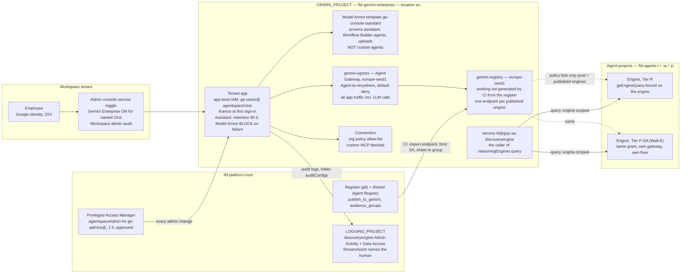

# 3. The Gemini Enterprise environment

## Status
- Owner: the platform owner
- Last reviewed: 2026-09-13
- Maturity: detailed design, written 2026-09-13 against [01-hld.md](01-hld.md) §2 (the tenant app
  and its project; admission, sharing and revocation), §0.4 (the Tier C gate: "the register and
  the Gemini Enterprise baseline (§2) exist"), §3.1 (`fld-gemini-enterprise`), §6.2 (the console
  Model Armor row) and §7.1 (Data Access logs for `discoveryengine`). Nothing is built. Closes gap
  PS-04 and HLD brief item A6 of [00-objective-review.md](00-objective-review.md); closes the
  deferral in [../wall-e/13-agent-interconnection.md](../wall-e/13-agent-interconnection.md) §7.6
  and items 25 and 26 of `wall-e/PREREQUISITES.md` §10.
- Owned jointly by the platform owner and the Gemini Enterprise administrators (one person on
  2026-09-13, HLD §0.3). The page is written for the security reviewer and for whoever runs §16.
- Every Google fact on this page was re-read on 2026-09-13 from the URL given next to it (§19).
  Where a page did not render or is silent, the row says **unverified** and the value stays *tbd*.
  `Assumption:` marks inferred facts. No company names, no secrets.
- Decisions this page makes are P35–P46, **provisional; renumbered in 12-open-decisions.md**.
  Decisions it details without re-deciding: HLD P6 (tenant egress binding — the spike scope
  narrows, §11), P13 (retention — options now known, §5.4), P24 (workforce pool — answered "no"
  for the tenant app by P38, §6).

---

## 1. What this page fixes, and what it corrects in the HLD

The objective's first sentence is "a secure Gemini Enterprise environment" through which every
agent is secured. On 2026-09-13 the environment is a skeleton page, an `Assumption:` that the app
exists in a project of its own, and eleven facts scattered across the Wall-E set. This page is
the baseline: one project, one app, one administration model, one admission path per tier, one
egress gateway, one audit stream, one runbook — so that a no-code agent built on a Tuesday
afternoon and a super-admin agent built over a year inherit the same front-door posture.

Reading Google's pages again on 2026-09-13 changes seven things the HLD wrote in §2; each is a
row for the reconcile pass and is stated once here:

| # | HLD §2 said | What Google's page says on 2026-09-13 | Consequence on this page |
|---|---|---|---|
| 1 | "Everything a Gemini Enterprise administrator does is an Admin console action recorded in the Workspace admin audit stream" (§2.2, last sentence) | Gemini Enterprise is administered in the **Google Cloud console** and logs to **Cloud Audit Logs** under `discoveryengine.googleapis.com`: `CreateEngine`, `UpdateEngine`, `DeleteEngine`, `CreateAssistant`, `UpdateAssistant`, `UpdateAclConfig`, `UpdateCmekConfig` and agent registration are **Admin Activity** entries (on by default); `StreamAssist`, `AnswerQuery`, `Search`, `GetAgentCard`, `GetEngine`, `ListEngines` are **Data Access** entries (off by default) — [audit-logging](https://docs.cloud.google.com/gemini/enterprise/docs/audit-logging). Only the Workspace-side service toggle (§7) is in the Workspace admin stream | §13: two streams, both routed; the HLD sentence is corrected |
| 2 | Tenant egress binding: "spike P6; yes if supported" | Documented and GA-labelled on Google's page of 2026-09-08: the app is bound by `PATCH …/engines/GE_APP_ID` setting `agentGatewaySetting.defaultEgressAgentGateway.name`, or in the console on the app's **Security** tab, "Agent Gateway configuration". An `eu` app binds a gateway in **`europe-west1`** whose registries are `global`, `eu` or `europe-west1`; "enabling Agent Gateway routes **all Gemini Enterprise traffic, including LLM calls**, through the gateway"; the app must "explicitly import the chosen agents, endpoints, and MCP servers" — [agent-gateway-ge-deploy](https://docs.cloud.google.com/gemini-enterprise-agent-platform/govern/gateways/agent-gateway-ge-deploy) | §11: P6's question is no longer "can it be bound in `eu`" (yes); it is whether dry-run applies to the app binding and what the LLM-call path costs. A `europe-west1` registry in `GEMINI_PROJECT` becomes necessary (row 3) |
| 3 | §5.2: "Per-agent registries are not created" | A gateway is created with a `registries` list and "cross-project agents must be registered in the registry associated with the central governance project where the Agent Gateway is deployed" — [set-up-agent-gateway](https://docs.cloud.google.com/gemini-enterprise-agent-platform/govern/gateways/set-up-agent-gateway); multi-region `eu` registries refuse manual registration (row 2 page) | `GEMINI_PROJECT` holds **one** registry, `gemini-registry` in `europe-west1`, which is the gateway's working set generated by CI from the register — not a second inventory. The shared registry in `CORE_PROJECT` stays the governed view (§11.2) |
| 4 | Conversation retention "*tbd* by the DPO (P13)" | The **Assistant** tab of the app's Configurations offers "1, 30, 60, 90, 120, or 180 days (the default is 60 days)", deletion by creation date; "Configuration of the assistant requires the Gemini Enterprise Plus edition" — [configure-assistant](https://docs.cloud.google.com/gemini/enterprise/docs/configure-assistant) | §5.4: the DPO chooses from that list; `Assumption:` 90 days until P13; the tenant edition is *tbd* and gates the setting |
| 5 | Console Model Armor "on, tenant-wide" | Set **per app** in the Assistant settings by `roles/discoveryengine.agentspaceAdmin`; screens the assistant, Workflow Builder agents, Google-made agents and uploads; "Interactions with custom agents from your organization, such as ADK, A2A, and Dialogflow, are not screened"; on screening-service failure the admin chooses **Allow user interactions** or **Block all user interactions**; a template in another project needs `roles/modelarmor.user` for the app's service account — [enable-model-armor](https://docs.cloud.google.com/gemini/enterprise/docs/enable-model-armor) | §9: on, **Block** on failure, template in `GEMINI_PROJECT` (P40) |
| 6 | Connectors: "allow-list committed in git, applied by the admin" | Three **managed organisation-policy constraints** exist, GA since 2026-07-07 per the release notes: `discoveryengine.managed.allowedDataSources` (org/folder/project; a disallowed source fails with "Operation denied by org policy"), `discoveryengine.managed.allowedEgressFqdns` (applies to VPC-SC projects and to `enforcedProjects`), and the constraint that blocks custom MCP data stores by default — [configure-allowed-data-sources](https://docs.cloud.google.com/gemini/enterprise/docs/connectors/configure-allowed-data-sources), [configure-allowed-egress-fqdns](https://docs.cloud.google.com/gemini/enterprise/docs/connectors/configure-allowed-egress-fqdns), [managed-policy-constraints-overview](https://docs.cloud.google.com/gemini/enterprise/docs/connectors/managed-policy-constraints-overview) | §12: the allow-list is an **org policy at `fld-gemini-enterprise`**, enforcement-grade, not a console habit (P45); HLD §3.1's folder row gains three constraints |
| 7 | Users: "Google identities of the tenant" | Access needs **both** `roles/discoveryengine.agentspaceUser` and a licence; licences are "specific to a Google Cloud project and a location", assigned manually by email or automatically at first sign-in; `agentspaceUser` can be bound **at app level** with groups, but "Project-level IAM permissions take precedence over app-level policies" — [access-control](https://docs.cloud.google.com/gemini/enterprise/docs/access-control), [licenses](https://docs.cloud.google.com/gemini/enterprise/docs/licenses), [iam-policy-for-apps](https://docs.cloud.google.com/gemini/enterprise/docs/iam-policy-for-apps). The Workspace Admin console has a per-OU **service toggle** for Gemini Enterprise, needing the Service Settings admin privilege — [turn on or off](https://knowledge.workspace.google.com/admin/gemini/turn-gemini-enterprise-on-or-off-for-users) | §7: three gates on the population, app-level binding only (P42) |

One correction of a name: the constraint lifted for gateway binding is
`constraints/iam.managed.disableAccessPolicyBindings` (plural, "Disable binding access policy to
resource", Google's set-up page); HLD §3.2 writes it in the singular.

---

## 2. The shape

Three facts fix the shape. The Discovery Engine service agent of the **app** project is the
caller of every engine, so a grant must exist in every agent project and the number in it is
`GEMINI_PROJECT_NUMBER` ([configure-cross-project-adk-agents](https://docs.cloud.google.com/gemini/enterprise/docs/configure-cross-project-adk-agents)).
Agent Gateway supports Gemini Enterprise "only in Agent-to-Anywhere (egress) mode; ingress traffic
isn't supported" ([agent-gateway-overview](https://docs.cloud.google.com/gemini-enterprise-agent-platform/govern/gateways/agent-gateway-overview)),
so the front door has an egress fence and no ingress screen — the console Model Armor setting is
the ingress screen for what it covers, and the per-agent gateway is the screen for the rest. And
the app project hosts nothing of any agent's (HLD §2.1), so a compromise of `GEMINI_PROJECT`
reaches the front door and the query grants, never a credential, a key or an audit table.

---

## 3. Project and folder placement

| Item | Value | Reason / source |
|---|---|---|
| Project | `GEMINI_PROJECT` / `GEMINI_PROJECT_NUMBER`, the existing app project **imported in place** by the factory's `tenant-app` module and moved under `fld-gemini-enterprise` in a dated change window (HLD §2.1). If the administrators refuse the move, the project stays outside the folder and every folder control of this page is re-applied at project level by the same module, with a review date | `Assumption:` (topology §2) the app already exists in a project of its own; a live app cannot be re-created without losing chat history and data stores |
| Folder | `fld-gemini-enterprise` under `fld-agentic-platform`; inherits the org-policy baseline (HLD §3.3), the deny policy, the folder Model Armor floor, the aggregated sink and the folder `auditConfigs` | HLD §3.1 |
| Folder additions (P35) | `discoveryengine.managed.allowedDataSources` = the committed allow-list (§12); `discoveryengine.managed.allowedEgressFqdns` with `enforcedProjects` = `GEMINI_PROJECT_NUMBER` (the project has no VPC-SC perimeter on day one, HLD §8.1); the managed constraint blocking custom MCP data stores **left enforced**; custom constraint `custom.geDataStoreAclRequired` on `discoveryengine.googleapis.com/DataStore` CREATE/UPDATE, CEL `resource.aclEnabled == true` — a documented field ([org-policy-custom-constraints](https://docs.cloud.google.com/gemini/enterprise/docs/org-policy-custom-constraints)); its semantics for Workspace-native sources are **unverified** and the constraint starts in dry-run | Every data store enforces the source's ACLs; no connector reaches a host the policy does not name; no MCP data store enters through the console |
| What custom constraints **cannot** do | The documented Engine fields are `solutionType`, `disableAnalytics`, `displayName`, `industryVertical`; neither the gateway binding nor the Model Armor setting is a constrainable field | Gateway binding and Model Armor on the app are **detection-grade** at the org-policy layer: the drift job reads the engine (§13) and a Security Health Analytics custom module flags an app without `agentGatewaySetting` (resource type support *tbd* against the 14 Agent Platform types HLD §4.7 counts) |
| Hosts | the app; `gemini-egress`; `gemini-registry`; the console Model Armor template `ge-console-standard`; the app's CMEK registration (§5.2); the app's own agent identity; `discoveryengine.googleapis.com`, `networkservices`, `networksecurity`, `iap`, `agentregistry`, `modelarmor`, `dns`, `compute`, `logging`, `monitoring`, `cloudtrace` (the gateway's API list, Google's set-up page); the licence subscription | topology §2 row 1, extended: §7.4's "nothing else" is superseded by the gateway, the registry and the template |
| Must never host | any agent's engine, identity, secret, key, dataset, bucket, topic or service; any Workspace credential; any principal from an agent project in its IAM policy (the CI identity of `CICD_PROJECT` is the one exception, §10) | HLD §2.1; topology row 24 |
| `restrictServiceUsage` | allow-list = the "Hosts" row's services plus `cloudkms` (for the CMEK key's use) and `orgpolicy` reads; `aiplatform.googleapis.com` **not** enabled here | An engine can never be created in the app project by accident |
| Labels, budget, contacts | HLD §3.4 label set with `tier=C`, `agent=tenant-app`; budget *tbd* (licence-driven, HLD §3.1); Essential Contacts security + technical → `platform-security@`, `platform-owners@` | — |
| Region facts | App location `eu`; gateway and registry `europe-west1`; CMEK key `europe` multi-region (Google requires a multi-region key, §5.2); BigQuery for the app's own log views in `EU` | [locations](https://docs.cloud.google.com/gemini/enterprise/docs/locations); [agent-gateway-ge-deploy](https://docs.cloud.google.com/gemini-enterprise-agent-platform/govern/gateways/agent-gateway-ge-deploy); [cmek](https://docs.cloud.google.com/gemini/enterprise/docs/cmek) |

---

## 4. Administration: who holds what, standing or elevated

Google documents four roles on the product ([access-control](https://docs.cloud.google.com/gemini/enterprise/docs/access-control)):
`roles/discoveryengine.agentspaceAdmin` (Gemini Enterprise Admin), `roles/discoveryengine.editor`,
`roles/discoveryengine.viewer`, `roles/discoveryengine.agentspaceUser` (Gemini Enterprise User).
The permission lists of the two `agentspace*` roles did not render on 2026-09-13
(`roles-permissions/discoveryengine`) and are **unverified**; what each role *does* is taken from
the product pages that name it.

| Group | Role | Level | Standing or PAM | Duty | Source |
|---|---|---|---|---|---|
| `ge-admins@` (P36) | `roles/discoveryengine.agentspaceAdmin` | `GEMINI_PROJECT` | **PAM entitlement, 1 h, approver = security reviewer** (HLD §4.4 row); no standing member holds it | Feature toggles, Model Armor, Assistant settings, licences ("Manage users"), agent registration and sharing approval, gateway binding on the Security tab, CMEK registration | [manage-web-app-features](https://docs.cloud.google.com/gemini/enterprise/docs/manage-web-app-features), [enable-model-armor](https://docs.cloud.google.com/gemini/enterprise/docs/enable-model-armor), [register-and-manage-an-adk-agent](https://docs.cloud.google.com/gemini/enterprise/docs/register-and-manage-an-adk-agent) |
| `ge-readers@` | `roles/discoveryengine.viewer` | `GEMINI_PROJECT` | standing | Read the app, its agents, its settings; the drift job's principal and `./walle register`'s D8 read (replaces the per-person grant of topology's human-grants table) | access-control |
| `ge-builders@` | `roles/discoveryengine.agentspaceUser` **at app level** + licence | app | standing | Build Workflow Builder agents (toggles on for this group only, §8) | [iam-policy-for-apps](https://docs.cloud.google.com/gemini/enterprise/docs/iam-policy-for-apps) |
| `ge-users@` | `roles/discoveryengine.agentspaceUser` at app level + licence | app | standing | Use the assistant and shared agents | same |
| CI identity (`CICD_PROJECT`, via WIF) | `roles/discoveryengine.editor` | `GEMINI_PROJECT` | standing, **the one foreign principal** | Import endpoints into `gemini-registry`, write the gateway access policy, share agents to the audience group (§10). `Assumption:` `editor` suffices for agent sharing and registration; if a step needs `agentspaceAdmin`, that step is done by `ge-admins@` through PAM instead and CI only verifies | access-control ("read and write access to all discovery engine resources") |
| Platform owner | `roles/orgpolicy.policyAdmin` | organisation | PAM, 1 h (HLD §4.4) | The three managed constraints and the custom constraint of §3 | [configure-allowed-data-sources](https://docs.cloud.google.com/gemini/enterprise/docs/connectors/configure-allowed-data-sources) |
| Workspace: Service Settings admin | Admin console privilege | tenant | the tenant's admin-role model (separate admin accounts, hardware keys, HLD §4.4) | The Gemini Enterprise service toggle per OU or group (§7) | [turn on or off](https://knowledge.workspace.google.com/admin/gemini/turn-gemini-enterprise-on-or-off-for-users) |
| Nobody | `roles/discoveryengine.agentspaceUser` or `editor` **at project level** for any human group | — | forbidden; drift check | Project-level `agentspaceUser` "can access all apps in that project, regardless of any app-level permissions" | iam-policy-for-apps |
| Nobody | `roles/owner`, `roles/editor` (basic) | `GEMINI_PROJECT` | removed after the factory run; PAM 2 h for incidents | HLD §4.4 | — |

Why PAM for the admin role rather than a standing grant to one person: every change to the
front door — a toggle, a share to "All users", a Model Armor flip to "Allow on failure", the
gateway unbound — is then a justified, approved, logged act, and a membership change on
`ge-admins@` is already a detection (HLD §7.3). At Tier C with one person the approver is the
same person and the record says so; the value is the ticket reference and the one-hour window.

**Verified how, fails how.** The drift job (HLD §4.7) reads `GEMINI_PROJECT`'s IAM policy and the
app-level policy daily and asserts exactly the rows above; a standing `agentspaceAdmin`, any
project-level `agentspaceUser`, or a foreign principal other than the CI identity is a severity
2 finding. If the drift job is silent for 48 h the absence alert fires (HLD §7.2).

---

## 5. Location, residency, encryption, retention

### 5.1 Location

`eu`. Google's page ([locations](https://docs.cloud.google.com/gemini/enterprise/docs/locations),
2026-09-03) gives `eu` "at-rest" and "ML processing" residency within the EU multi-region and
lists what `eu` lacks: the newest Gemini model without residency, dynamic facets, Grounding with
Google Search, Web Grounding for Enterprise. Each is a feature the tenant does not need for the
agents this platform publishes; a future need is a dated exception in HLD §8.2's list, never a
move of the app (the page is silent on changing a location; identity-provider and data-store
rules below make a re-creation a chat-history and re-ingestion event).

### 5.2 Encryption (P37)

CMEK is registered **per project and location** through `CmekConfig` with a **multi-region
`europe`** symmetric key; "Apps or data connectors created before a key is registered to the
project can't be protected by the key"; the Discovery Engine service agent and the Cloud Storage
service agent hold `roles/cloudkms.cryptoKeyEncrypterDecrypter` on the key; CMEK and Access
Transparency "aren't supported in the `global` region" ([cmek](https://docs.cloud.google.com/gemini/enterprise/docs/cmek);
[compliance-security-controls](https://docs.cloud.google.com/gemini/enterprise/docs/compliance-security-controls)).
Decision: the platform key ring (HLD §8.3) gains one `europe` multi-region key `gemini-cmek`;
whether Cloud KMS Autokey covers `discoveryengine` is **unverified**, so the registration is an
explicit `CmekConfig` written by the `tenant-app` module. Because the existing app predates any
registration, the app is `Assumption:` **not CMEK-protected** and cannot become so in place; the
CMEK position for the tenant app is therefore "Google-managed encryption for the imported app,
CMEK for every data store and app created after GE-4 of §16", recorded with the TISAX label
decision (P20) — the same shape as HLD §8.3's Firestore exception.

### 5.3 Web grounding, uploads, banned phrases

On the Assistant tab: **Grounding with Google Search off** (Google marks it "not Data Residency
compliant" and states that none of the compliance controls apply while it is on);
**Enterprise web search** off until a register row needs it (then on, as a dated change);
uploads left on because Model Armor screens them (§9); the **banned phrases** list carries the
P-SA hard-denied vocabulary of HLD §6.2 (`makeAdmin`, `roleAssignments`, the control group names)
as a second, cheap, detection-grade screen on the assistant path
([configure-assistant](https://docs.cloud.google.com/gemini/enterprise/docs/configure-assistant)).

### 5.4 Conversation retention (P39, under P13)

The Assistant tab offers 1, 30, 60, 90, 120 or 180 days, default 60, deletion by creation date,
Plus edition required. The conversation store is **not** the platform's Art. 12 log — that is the
agents' audit tables (HLD §7.5) — so the six-month floor does not bind it, and data minimisation
argues for short. Decision: **90 days** as `Assumption:` pending the DPO (P13), on the ground that
an operator's "what did I ask Wall-E last month" is served by the audit table, not by chat
history. Users may delete their own chats sooner; memory/personalisation is off (§8). The
tenant's **edition is *tbd*** ([../google-workspace.md](../google-workspace.md)); if it is not Plus,
the retention stays at Google's default of 60 days and the fact is recorded, since Google's page
ties assistant configuration to Plus.

---

## 6. Identity provider and SSO (P38)

Google's page ([configure-identity-provider](https://docs.cloud.google.com/gemini/enterprise/docs/configure-identity-provider),
2026-09-03) fixes the mechanics: "one identity provider type per location"; Google Identity is
"the recommended identity provider for Gemini Enterprise"; third-party providers (Entra ID, Okta,
AD FS over OIDC or SAML 2.0) go through Workforce Identity Federation; "If you change identity
providers, users lose their existing chat history" and ingestion data stores must be deleted and
recreated.

Decision: **Google Identity** for the `eu` location — `wall-e/12` §5 case (a). Reasons: the human
`sub` in the `StreamAssist` Data Access entry is then a Workspace identity that joins to the
Workspace audit stream and to every agent's audit row (HLD §7.4); the write-path re-check against
a Google Group exists (case (b) has none, `wall-e/12` §5.4); K5 needs a Google-identity super
admin anyway. If the tenant federates Workspace itself to a SAML IdP, that is Workspace SSO
*upstream* of Google Identity and changes nothing here — recorded in
[../google-workspace.md](../google-workspace.md) as the "IdP" question the HLD §18 item 26 asks.
P24 (a workforce pool) is therefore "no" for the tenant app; it stays open only for an
operator population that has no Google account, which on 2026-09-13 does not exist.

Sign-in strength is the tenant's: 2SV enforced, hardware keys for admin accounts (HLD §4.6).
Whether a **Context-Aware Access** level can be assigned to the Gemini Enterprise web app is
**unverified** (Google's app table was read for the Admin console and the Admin SDK, HLD §4.6,
not for this app) — *tbd*, checked at GE-1 of §16. Changing the provider is a decision record
with the chat-history loss stated, never a console act.

---

## 7. The user population: three gates (P42)

| Gate | Where | Value | Owner | Verified | Fails |
|---|---|---|---|---|---|
| Workspace service toggle | Admin console → Generative AI → Gemini Enterprise, per OU or configuration group ("Group settings override organizational units"; up to 24 h to propagate) | ON for the OUs that hold `ge-users@`'s members; **OFF for `/Automation/Service Identities`** (the robot accounts never use the front door) | Service Settings admin | Workspace-audit stream; weekly `workspace-audit` posture check | A robot OU turned ON is severity 1 (an interactive Gemini session by `walle@` is a login event, HLD §7.3) |
| IAM at app level | `setIamPolicy` on the engine resource with `group:ge-users@` → `roles/discoveryengine.agentspaceUser` | one group; `ge-builders@` is a second binding; no project-level `agentspaceUser` for anyone | CI (Terraform) | drift job daily | project-level binding found → severity 2, removed by CI |
| Licence | Cloud console → Gemini Enterprise → Manage users; **automatic assignment** at first sign-in, bounded by the two gates above; manual assignment for named exceptions | subscription count *tbd*; quarterly review against `ge-users@` membership | `ge-admins@` via PAM | `discoveryengine.userStores.listUserLicenses` read by the drift job (`Assumption:` the permission is in `viewer`; unverified) | licences > members + 5 % → finding; a licence on a suspended account → reclaimed |

Reason for automatic assignment: it removes a per-person console step, and the population is
already closed by the OU toggle and the app-level group — a licence can only land on someone the
two prior gates admitted. Sharing an agent with "All users in the organization" (a documented
member type, [share-custom-agents](https://docs.cloud.google.com/gemini/enterprise/docs/share-custom-agents))
is forbidden above Tier C (HLD §2.2) and, for Tier C, is a register-row value, not a click.

---

## 8. Feature Management baseline (P41)

Set per app on **Configurations > Feature Management** by `roles/discoveryengine.agentspaceAdmin`
([manage-web-app-features](https://docs.cloud.google.com/gemini/enterprise/docs/manage-web-app-features), 2026-09-04).
The 23 toggles Google lists, with the platform value and the reason; a toggle not in the
committed file is a drift finding.

| Toggle (Google's exact name) | Value | Reason |
|---|---|---|
| Enable Agent Gallery | on | The one place agents are found; Marketplace agents enter only through its request-then-approval flow ([agent-gallery](https://docs.cloud.google.com/gemini/enterprise/docs/agent-gallery)) |
| Enable chat agents | on for `ge-builders@` only (`Assumption:` the toggle is per app, not per group — if so, on, and the builder population is `ge-builders@` by sharing rules) | Tier C agents exist; each needs a register row (HLD §2.1) |
| Enable workflows | same as above | Workflow Builder (formerly Agent Designer) |
| Enable model selector | off | Model pin is a register field; users do not choose models |
| Enable Gemini Notebook | off until a register row and a data-class review ask for it | A second product surface with its own Model Armor setting |
| Enable session sharing | off | Shared sessions carry another person's prompts and results |
| Enable memory and customization | off | Memory is a personal-data store outside the retention schedule |
| Enable Canvas | off | *tbd* with the DPO; no agent needs it |
| Enable projects | off | same |
| Enable image generation / Enable video generation | off | Not a platform use; Art. 50(2) marking position not yet recorded |
| Enable OneDrive upload | off | No connector row for it |
| Enable talk to content | on | Screened by Model Armor uploads coverage |
| Enable Google Drive upload | on | same; Drive ACLs apply |
| Include cross-domain documents | off | One tenant, one domain |
| Enable welcome emails | off | Rollout is by OU, communicated by the works-council path (HLD §14.1) |
| Enable skills / Enable skill sharing / Enable skill sharing without admin approval | off / off / off | Skill Registry is Preview and deliberately unused (`wall-e/13` §8) |
| Enable agent sharing | on | Builders share to a named group |
| **Enable agent sharing without admin approval** | **off** | "administrators must review and approve pending" requests — the admission step of §10 for Tier C |
| Enable End Users to share with Groups | on | Sharing is to groups, never to individuals (HLD §2.2) |
| Model availability | the pinned model set of the register; the model without `eu` residency excluded | HLD §5.1 `model_pin`; §5.1 above |

---

## 9. The console Model Armor setting (P40)

| Item | Value | Source |
|---|---|---|
| Where | App → Configurations → Assistant → Model Armor; `roles/discoveryengine.agentspaceAdmin` enables it; `roles/modelarmor.admin` creates the template | [enable-model-armor](https://docs.cloud.google.com/gemini/enterprise/docs/enable-model-armor) |
| Covers | the assistant, Workflow Builder agents, Google-made agents, uploaded documents and images | same |
| Does not cover | "Interactions with custom agents from your organization, such as ADK, A2A, and Dialogflow" — every Tier R+ engine is screened at its own gateway and floor (HLD §6) | same; `wall-e/11` §2 |
| Template | `ge-console-standard` in `GEMINI_PROJECT`, `eu` (a template in another project would need `roles/modelarmor.user` on the app's service account — avoided); content = the Tier C row of the platform template standard (folder floor + Sensitive Data Protection basic, HLD §6.2); conformance to the folder floor enforced by the floor's create-time check | HLD §6.2 |
| **Failure mode** | **Block all user interactions** | HLD §6.1: "the platform never flips `failOpen` to recover". The tenant assistant joins the Model Armor availability domain; an outage is a sev 3 page to the platform owner, not an incident. A flip to "Allow" is a PAM-elevated act with an incident reference and is a detection |
| Findings | Model Armor's SCC integration on (HLD §6.2): every `MATCH_FOUND` on the assistant path is an SCC finding and a SIEM event, metadata only | HLD §7.1 |
| Verified | drift job reads the app's assistant configuration daily (`GetAssistant` Data Access entry) and asserts "on, `ge-console-standard`, Block"; the injection regression suite of `wall-e/11` §6 gains three prompts sent through the assistant | — |
| Fails | setting off or Allow → severity 2, restored by `ge-admins@` through PAM within one business day; template weakened below the floor → refused by Google at write time |

Quota: Model Armor's 1,200 QPM per project (HLD §3.4) now serves the whole tenant's assistant
traffic from `GEMINI_PROJECT` — it is the one project whose quota scales with headcount, so it
is the first row of the quota register (P31) and is measured at GE-8 of §16.

---

## 10. Agent admission, sharing, review and revocation

### 10.1 The lifecycle per tier

| Step | Tier C (no-code, Workflow Builder, data-store) | Tier R and above (engine in its own project) | Marketplace / partner agent | Who acts |
|---|---|---|---|---|
| Register row | merged under the two-reviewer rule with `publish_to_gemini: true`, `audience_groups`, `ai_act_class`, `supplier_rows` (HLD §5.1) | same | same, plus a supplier row with TISAX label or equivalent (HLD §5.3) | agent owner writes, platform owner approves |
| Create / import | builder creates the agent in Workflow Builder | factory → engine → CI registers it in the shared registry → admission gate passes (HLD §5.3) → CI: (1) creates custom role `geEngineQuery` (`aiplatform.reasoningEngines.query` only) in the agent project and binds it **on the engine** to `serviceAccount:service-${GEMINI_PROJECT_NUMBER}@gcp-sa-discoveryengine.iam.gserviceaccount.com`; (2) imports the engine's endpoint into `gemini-registry` and adds it to `gemini-egress`'s access policy; (3) registration into the app: **Agents → Add agent → Custom agent via Agent Runtime**, resource path `projects/N/locations/europe-west1/reasoningEngines/ID`, no data store, description written as a routing prompt that states the responder is an AI system (Art. 50) — by `ge-admins@` through PAM, or by CI if `editor` suffices (§4 `Assumption:`) | user clicks **Request access** in Agent Gallery; `ge-admins@` approves only against a merged register row | CI; `ge-admins@` via PAM |
| The grant, generalised (P43) | none (no engine) | The engine-scoped custom role above is the default (decision 42 generalised to every agent project). Google documents only the **project-level** `roles/discoveryengine.serviceAgent` on the agent project for the cross-project case ([configure-cross-project-adk-agents](https://docs.cloud.google.com/gemini/enterprise/docs/configure-cross-project-adk-agents)); that role also carries `reasoningEngines.create/delete/update` (topology row 2). Rule: the factory tries the engine-scoped role; if registration or the first `StreamAssist` fails, the project-level role is applied **for that agent project only**, recorded as a dated exception on the register row with the failing error, and re-tested at every engine redeploy. Since the project holds exactly one engine (HLD §3.1), the project-level fallback reaches nothing more than the engine-scoped grant would — the difference is `create/delete/update`, which is why the detection "engine mutated by the Discovery Engine service agent" (§13) exists | — | agent project's CI |
| Share | to the `audience_groups` of the row, member type **Group**; the group holds app-level `agentspaceUser` (a group "must include the correct IAM role"); tenant-wide only if the row says so and the data stores are | same; the audience group is also the operator group the action service re-checks live on the write path (HLD §2.2); the share is made by CI | to the requesting group | CI or `ge-admins@`; approval by `ge-admins@` when "without admin approval" is off |
| SPIFFE check | — | after registration a human reads the agent's identity on the Agent details page and records that it equals the engine's `spec.effectiveIdentity` (`wall-e/12` §4); the drift job compares daily | — | agent owner |
| Nightly reconciliation | app agent list (Data Access `ListEngines` and the agent list read by `ge-readers@`) ∖ register = shadow agent, severity 2, unshared within one business day; register ∖ app = retired row not cleaned | same, plus `gemini-egress` policy ∖ register and `gemini-registry` ∖ register | same | reconciliation job (HLD §5.2) |
| Review | `review_date` ≤ 90 days or the share is removed (HLD §5.3) | same; `privilege ≠ none` rows reviewed quarterly by the security reviewer | supplier row reviewed annually | Gemini Enterprise admin; security reviewer |
| Revoke | unshare in the console; row → `retired` | factory `revoke` (HLD §2.2): endpoint out of `gemini-egress` and `gemini-registry`, `geEngineQuery` binding removed, DELETE on the app's agent resource (documented: DELETE on the agent path), row and card `retired`, `halt_all` for a write agent | unshare; supplier row closed | agent owner requests; platform owner approves; a Tier P revoke is also K3 |
| Emergency | unshare, any hour, `ge-admins@` via PAM (no-approval activation with justification if the approver is unreachable) | HLD §2.2's three levers in order: gateway policy (seconds), engine grant (a minute), unregister | unshare | on-duty admin; incident record |

### 10.2 What an administrator of the app can and cannot do to an agent

Written down because the objective asks the app to *secure* the agents, and a security reviewer
will ask what the app's admin could do to Wall-E.

| Can | Cannot | Why |
|---|---|---|
| Register, unregister, share, unshare any agent; approve or deny sharing requests; edit the routing description; attach a data store to a registered agent | Change the engine, its code, its identity type, its gateway, its floor or its templates | The admin role is on `GEMINI_PROJECT`; the engine and its policy live in the agent project, where the only Gemini principal is the service agent with `query` (or, on the fallback, `serviceAgent` — hence §13's mutation detection) |
| Turn Model Armor off or to Allow on failure; change retention; flip feature toggles; unbind the gateway on the Security tab | Do any of that silently | Every one is an Admin Activity entry (`UpdateAssistant`, `UpdateEngine`) routed to `LOGGING_PROJECT` and the SIEM, and the role is held through PAM with a justification |
| See the human `sub` of every request in the Data Access log | Read an agent's audit tables, content logs, secrets or Firestore | No Gemini principal holds anything in an agent project beyond the query grant (topology row 24, generalised) |
| Register a **new** engine into the app | Make it reachable | Reachability needs the engine-scoped grant made by the *agent* project's CI **and** the `gemini-egress` policy entry generated from the register: a registration without a merged row is a shadow agent by nightly reconciliation and unreachable by gateway policy once enforcement is on (§11) |
| Cause an interactive login by the robot account | Nothing — the robot OU has the service toggle OFF (§7) and an interactive login is severity 1 | HLD §4.6 |

---

## 11. The tenant egress gateway `gemini-egress` (P44, detailing HLD P6)

### 11.1 What is verified

| Fact | Source (2026-09-08 / 2026-09-10 pages) |
|---|---|
| Gemini Enterprise is supported in Agent-to-Anywhere (egress) mode only; ingress is not supported | [agent-gateway-overview](https://docs.cloud.google.com/gemini-enterprise-agent-platform/govern/gateways/agent-gateway-overview) |
| Binding: `PATCH https://discoveryengine.googleapis.com/v1/projects/PROJECT_NUMBER/locations/eu/collections/default_collection/engines/GE_APP_ID` with `agentGatewaySetting.defaultEgressAgentGateway.name`; or console → app → Security → "Agent Gateway configuration" | [agent-gateway-ge-deploy](https://docs.cloud.google.com/gemini-enterprise-agent-platform/govern/gateways/agent-gateway-ge-deploy) |
| Region: an `eu` app → gateway in `europe-west1` → registries `global`, `eu` or `europe-west1`; multi-region `eu`/`us` registries "don't support manual registration of agents, endpoints, and MCP servers" | same |
| "Enabling Agent Gateway routes all Gemini Enterprise traffic, including LLM calls, through the gateway"; apps "explicitly import the chosen agents, endpoints, and MCP servers" | same |
| Gateway creation: `gcloud network-services agent-gateways import NAME --source=<yaml> --location=europe-west1`, the YAML's `registries` listing `//agentregistry.googleapis.com/projects/GEMINI_PROJECT/locations/europe-west1`; "cross-project agents must be registered in the registry associated with the central governance project where the Agent Gateway is deployed"; the org-policy constraint `constraints/iam.managed.disableAccessPolicyBindings` must be lifted on the project; destinations need `iap.resources.egressViaIAP` through an IAM access policy; `iamEnforcementMode: "DRY_RUN"` on the authorization extension audits without enforcing | [set-up-agent-gateway](https://docs.cloud.google.com/gemini-enterprise-agent-platform/govern/gateways/set-up-agent-gateway) |
| 5,000 registered resources per gateway; VPC Service Controls apply only through an agent connectivity template | overview page; HLD P3 |

### 11.2 The decision, and the shape

**Bind, in three stages, and keep `gemini-registry` as a generated working set.**

| Element | Value | Reason |
|---|---|---|
| Gateway | `gemini-egress`, `europe-west1`, `GEMINI_PROJECT`, Agent-to-Anywhere, default deny | The only mode Google supports for the app; the region Google requires for an `eu` app |
| Registry | `gemini-registry`, `europe-west1`, `GEMINI_PROJECT`; entries = one endpoint per register row with `status: prod` and `publish_to_gemini: true`, written by CI from the register; `roles/agentregistry.admin` to the CI identity only; viewer to `ge-readers@`; every write alerted | A multi-region registry refuses manual registration; a foreign-project engine must be registered in the gateway's project; the registry is *derived*, so HLD §5.1's "the register is the source" holds and §5.2's inventory stays in `CORE_PROJECT` |
| Access policy | generated from the register: a binding per destination for the app's principal (`Assumption:` the egressor member is the app's own agent identity `principal://agents.global.org-ORG_ID.system.id.goog/resources/discoveryengine/projects/N/locations/eu/collections/default_collection/engines/APP` — the format [agent-identity-overview](https://docs.cloud.google.com/iam/docs/agent-identity-overview) shows; **which principal the app presents to the gateway is unverified**, read from the dry-run log at GE-9) | Unreachable by network, not only by policy, for any engine not in the register (HLD §2.1) |
| Stage 1 — spike | a throwaway app in `GEMINI_PROJECT`, `eu`, shared with `ge-admins@` only, bound to a throwaway gateway with `DRY_RUN`; questions: does `DRY_RUN` apply to an app binding; which principal appears; do LLM calls of the assistant appear as destinations and which hostnames; is an Agent Runtime engine's `StreamAssist` routed (Google's page says all traffic but does not name ADK engines); the p99 latency added. App deleted at the end | Google documents no dry-run and no unbind for the app specifically — both **unverified** |
| Stage 2 — production, dry-run | bind the tenant app with `DRY_RUN` for 30 days; the dry-run log is the first honest inventory of what the front door reaches | `wall-e/13` §7.2's argument, now for the tenant |
| Stage 3 — enforce | `iamEnforcementMode` to enforced; from then on "registered ⇒ reachable" and "not registered ⇒ unreachable" are both network facts | The register becomes the publication enforcement point |
| Availability | the assistant's LLM calls now traverse the gateway: the tenant front door joins HLD §6.1's gateway plus Model Armor availability domain (SLO `Assumption:` 99.5 %); a synthetic probe asks the assistant one question every 5 minutes; an outage is sev 3 to the platform owner, and the platform never unbinds to recover | HLD §6.1 |
| Rollback | remove `agentGatewaySetting.defaultEgressAgentGateway` by the same PATCH (`Assumption:` an empty value unbinds; unverified — asked at Stage 1); the query grants and the register rows are untouched, so unbinding loses the network fence and nothing else | — |
| If Stage 1 fails | HLD §2.1's compensating control stands: the connector allow-list (§12) plus the per-engine query grant, recorded as a dated row with a re-test at each Agent Gateway release note | — |

Nonprod: HLD §3.1 says the tenant gateway's policy never lists a nonprod engine; nonprod engines
are exercised by their dispatcher and test harness over `streamQuery`, never through the tenant
app; a Gemini Enterprise app in the sandbox Workspace tenant (decision 29) is *tbd* with that
tenant's build and is outside this page (P46).

### 11.3 What it does not give

No ingress screen (Google: not supported); no per-operation gating on plain REST (`wall-e/13`
§7.4); no screening of custom-agent payloads (Model Armor on the gateway sees MCP and A2A, not
`StreamAssist` to an engine — `wall-e/11` §2). It gives one thing, and it is the thing the
objective's first sentence needs: the set of engines the front door can reach is exactly the set
the register says, enforced by a Google-managed proxy the app's administrators cannot bypass
without an audited `UpdateEngine`.

---

## 12. Connectors and data sources (P45)

| Control | Value | Owner | Resource | Verified | Fails |
|---|---|---|---|---|---|
| `discoveryengine.managed.allowedDataSources` | the committed allow-list `platform/agentic-platform/register/gemini-connectors.yaml`; initial content = the tenant's first-party Google Workspace sources only (source ids *tbd* from Google's "Connect a third-party data source" list — not invented here); every addition is a pull request with a supplier row (HLD §14.3) and a data-class declaration | platform owner (`orgpolicy.policyAdmin` via PAM); IT security reviews | `fld-gemini-enterprise` | Cloud Asset Inventory `ORG_POLICY` feed (HLD §4.7); the console refuses a disallowed source with "Operation denied by org policy" | policy removed or widened → severity 2, org-policy write alert (HLD §7.3) |
| `discoveryengine.managed.allowedEgressFqdns` | the well-known FQDNs Google auto-allows per allowed source, nothing else; `enforcedProjects` = `GEMINI_PROJECT_NUMBER` because the project has no VPC-SC perimeter on day one | same | same | same | same |
| Custom MCP data stores | the managed constraint that blocks them stays **enforced**; an MCP server reaches the front door only as a registered, gateway-governed endpoint of a Tier R+ agent, never as a data store | same | same | same | constraint lifted → severity 2 |
| Data-store ACLs | `custom.geDataStoreAclRequired` (§3), dry-run until semantics are verified on the first Workspace source | same | same | org-policy dry-run audit entries | a data store with `aclEnabled == false` is a finding |
| Credentials | no connector carries a Workspace **write** credential; connectors read with the user's own permissions or a read-only service identity declared on the supplier row; Wall-E is the one write path (HLD §2.1) | Gemini Enterprise admin; security reviewer | the connector's OAuth grant, reviewed in the Workspace API-controls list | quarterly review of OAuth clients (HLD §7.3 token stream) | a write scope on a connector's client → revoked, incident |
| Residency | data stores in `eu` only; a data store outside the EU is a dated exception (HLD §2.1) | Gemini Enterprise admin | data store | `gcp.resourceLocations` (folder) plus the drift job's data-store list | refused at creation |
| Supplier rule | every connector, Marketplace agent and MCP server is a supplier row; at very high protection need it shows a TISAX label or equivalent (HLD §5.3) | platform owner + ISMS | register | reconciliation: allow-list ∖ supplier rows = finding | — |

---

## 13. Audit logging of the app itself

| Stream | What | Configured where | Routed to | Retention (HLD §7.5) |
|---|---|---|---|---|
| Cloud Audit Logs, **Admin Activity**, `discoveryengine.googleapis.com` | `CreateEngine`, `UpdateEngine` (feature toggles, Security tab, gateway binding), `DeleteEngine`, `CreateAssistant`, `UpdateAssistant` (Model Armor, retention, grounding), `UpdateAclConfig`, `UpdateCmekConfig`, agent registration and sharing | on by default, cannot be disabled | the aggregated sink with `includeChildren` over `fld-agentic-platform` (HLD §7.1) → locked bucket in `LOGGING_PROJECT` → SIEM | 400 |
| Cloud Audit Logs, **Data Access**, `discoveryengine.googleapis.com` | `StreamAssist`, `AnswerQuery`, `Search`, `GetAgentCard` (the entries that name the human); `GetEngine`, `ListEngines`, `GetAssistant` (what the drift job and reconciliation read) | folder-level `auditConfigs` on `fld-agentic-platform`, `DATA_READ` and `DATA_WRITE`, no exemptions (Google: an organisation or folder configuration "applies to all the existing and new Google Cloud projects" below it — [configure-data-access](https://docs.cloud.google.com/logging/docs/audit/configure-data-access)) | same route; a log view `ge-requests` scoped to `StreamAssist` for the correlation query of HLD §7.4 | 400; cost line in the retention schedule |
| Cloud Audit Logs, IAM and org policy | `SetIamPolicy` on the project and on the app; `orgpolicy` writes on the folder; PAM grants of `agentspaceAdmin` | inherited | same | 400 |
| Agent Gateway logs | dry-run and enforced decisions of `gemini-egress`; authorization-extension errors | gateway (Cloud Logging) | same; the dry-run log is the Stage 2 inventory (§11) | 400 |
| Model Armor sanitize logs | findings on the assistant path, metadata to SCC and the SIEM; payloads in the restricted bucket of `GEMINI_PROJECT` with a generated log view | template | `GEMINI_PROJECT` restricted bucket | 30 |
| Workspace admin audit | the service toggle per OU; admin-role changes on the Service Settings privilege | tenant | the organisation-level Workspace sink (HLD §7.1) and the SecOps export | 400 |

Detections this page adds to the catalogue (HLD §7.3), all owned by the security reviewer,
severity 2 unless stated:

| Rule | Source | Severity |
|---|---|---|
| `UpdateEngine` on the tenant app changing `agentGatewaySetting`, or `UpdateAssistant` changing the Model Armor setting or failure mode, outside a change window | Admin Activity | 1 (it removes a fence) |
| Any `discoveryengine` Admin Activity entry by a principal without an active PAM grant (a standing admin exists) | Admin Activity + PAM logs | 2 |
| A share to "All users in the organization" by anyone; a share of a Tier R+ agent to a group not in its register row | Admin Activity + register | 2 |
| Engine mutated (`UpdateReasoningEngine`, `DeleteReasoningEngine`) by `service-${GEMINI_PROJECT_NUMBER}@gcp-sa-discoveryengine…` in any agent project | Cloud Audit Logs in the agent project | 1 (only possible on the project-level fallback; proves the fallback is dangerous) |
| `StreamAssist` by `walle@` or `eve@` | Data Access | 1 (the robot used the front door) |
| Registry write on `gemini-registry` by anyone but the CI identity; gateway policy write outside a CI run | Admin Activity | 2 |
| Org-policy write on `fld-gemini-enterprise` | Cloud Asset Inventory feed | 2 |
| Absence: no `StreamAssist` entries for 4 business hours; no drift-job heartbeat for 48 h | absence policies | 3 |

---

## 14. Retention and personal data of the front door

Three stores of personal data exist in `GEMINI_PROJECT`: chat history (§5.4; users' prompts and
answers, keyed on the user), the `StreamAssist` Data Access entries (who asked what agent when,
400 days, locked, HLD §7.5), and the Model Armor sanitize payloads (30 days, restricted bucket).
Each is a row of the retention schedule and of the TISAX asset classification (`Assumption:`
Confidential, HLD §5.1). Chat history is not exported to the evidence lake — the audit table is
the evidence, and copying prompts would defeat the 90-day choice. The DPO's DPIA for the first
Tier W agent (HLD §0.4) covers these three stores once; later agents inherit the entry.

---

## 15. Every control on this page

| Control | Owner (role) | Resource | Verified how | Fails how |
|---|---|---|---|---|
| Project under `fld-gemini-enterprise`, imported by the factory | platform owner | `GEMINI_PROJECT` | drift job zero-diff after the move window | outside the folder → folder controls re-applied at project level, dated exception |
| Admin role only through PAM | platform owner; approver security reviewer | project IAM | drift job; PAM logs | standing grant → sev 2, removed |
| App-level `agentspaceUser` to groups; no project-level user role | CI | the app's IAM policy | drift job | sev 2, removed by CI |
| Service toggle per OU; robot OU off | Service Settings admin | tenant | weekly posture check; Workspace stream | sev 1 if the robot OU is on |
| Licence assignment automatic within the gates; quarterly review | Gemini Enterprise admin | subscription | licence count vs group | reclaim |
| Location `eu`; CMEK for new stores | Gemini Enterprise admin | app, data stores | `gcp.resourceLocations`; `UpdateCmekConfig` entry | refused at creation |
| Identity provider Google Identity | Gemini Enterprise admin | location | console read at GE-1; decision record on change | change without record → sev 1 |
| Retention 90 days (`Assumption:` until P13) | DPO decides; admin sets | assistant config | drift job (`GetAssistant`) | drift → restored within a day |
| Feature toggles per §8 | Gemini Enterprise admin | app | drift job vs committed file | drift → sev 2 |
| Console Model Armor on, `ge-console-standard`, Block | Gemini Enterprise admin; template by platform owner | assistant config; template | drift job; injection suite; floor conformance | off/Allow → sev 2; below floor → refused |
| Sharing needs admin approval; groups only; audience from the register | Gemini Enterprise admin | app | reconciliation | sev 2 |
| Engine-scoped `geEngineQuery` to the app's service agent; project-level fallback dated | agent project's CI | engine in the agent project | denial suite per agent; mutation detection | fallback undocumented → sev 2 |
| `gemini-egress` bound, default deny, policy generated from the register | platform owner; `ge-admins@` for emergency removal | app, gateway | dry-run log; enforced decisions; reconciliation | unbound → sev 1 |
| `gemini-registry` written by CI only | platform owner | registry | write alert | sev 2 |
| Three managed constraints + `geDataStoreAclRequired` | platform owner; IT security review | folder | asset feed; console refusal | sev 2 |
| No write credential on any connector | security reviewer | OAuth clients | quarterly review | revoke, incident |
| Admin Activity and Data Access routed; log view for `StreamAssist` | platform owner | folder `auditConfigs`, sink | absence alert; tabletop query | sev 3 absence |
| Detections of §13 | security reviewer | SIEM | CI test per rule (HLD §7.3) | rule silent → catalogue review |

---

## 16. Runbook: bringing the environment to baseline

Owner per step in brackets; every step ends with a verification and is done in order. Nothing
here is run before HLD Stage 0's folder and `CORE_PROJECT` exist (HLD §0.4, Tier C gate).
Commands are given only where Google's page shows them; the rest is console or Terraform.

| # | Step | Verify | Rollback |
|---|---|---|---|
| GE-0 | [Gemini Enterprise admin] Record `GEMINI_PROJECT`, `GEMINI_PROJECT_NUMBER` (`gcloud projects describe "$GEMINI_PROJECT" --format="value(projectNumber)"`), the app id, its **location**, the identity provider shown in the console, the edition (Standard/Plus), the licence count, whether a `CmekConfig` exists, and whether the app is already bound to a gateway. Write them into [../gemini-enterprise.md](../gemini-enterprise.md) | all nine values present; location is `eu` — if `global` or `us`, stop: a new `eu` app is a decision record (chat history and data stores do not move) | — |
| GE-1 | [Gemini Enterprise admin] Read the Workspace side: the service toggle per OU; whether a Context-Aware Access level can be assigned to the Gemini Enterprise app (record the answer for §6) | robot OU is OFF | — |
| GE-2 | [platform owner] Factory `tenant-app` **import**: `terraform import` of the project, the app, its IAM policy; plan shows only the changes of this page | zero unexpected diff | state removed, nothing changed |
| GE-3 | [platform owner + Gemini Enterprise admin] Move the project under `fld-gemini-enterprise` in a dated window; the folder's inherited policies apply | drift job zero-diff; the app answers a test question | move back (Resource Manager allows a second move); dated exception |
| GE-4 | [platform owner] Folder additions: the three managed constraints, `geDataStoreAclRequired` in dry-run, folder `auditConfigs` for `discoveryengine` `DATA_READ`/`DATA_WRITE` (`gcloud resource-manager folders get-iam-policy` → edit `auditConfigs` → `set-iam-policy`, per Google's page), `restrictServiceUsage` allow-list, `iam.managed.disableAccessPolicyBindings` lifted on `GEMINI_PROJECT` as a factory input with reason "gateway binding" and a review date; the `europe` multi-region key `gemini-cmek` and the `CmekConfig` registration | a `StreamAssist` entry appears in `LOGGING_PROJECT` within 10 minutes of a test question; adding a disallowed source is refused | policies removed by Terraform |
| GE-5 | [platform owner] Groups `ge-admins@`, `ge-readers@`, `ge-builders@`, `ge-users@` created by the factory; PAM entitlement for `agentspaceAdmin`; app-level `agentspaceUser` bindings; `roles/discoveryengine.viewer` to `ge-readers@`; `editor` to the CI identity; every basic role removed | drift job asserts §4 exactly; PAM activation works end to end | — |
| GE-6 | [Gemini Enterprise admin, PAM] Feature toggles per §8 from the committed file; identity provider confirmed Google Identity (no change made); Assistant tab: retention, grounding off, banned phrases, uploads | drift job reads back the committed values | previous values, in the same window |
| GE-7 | [platform owner] Template `ge-console-standard` from the platform standard's Tier C row; [Gemini Enterprise admin, PAM] Model Armor on, template selected, **Block** on failure | the three assistant prompts of the injection suite produce `MATCH_FOUND` findings in SCC; a test with the template temporarily unreachable blocks | Allow, with an incident reference |
| GE-8 | [platform owner] Measure: assistant QPM against the 1,200 QPM Model Armor quota; p99 latency with Model Armor on; write both into the quota register (P31) | numbers recorded | — |
| GE-9 | [platform owner] `gemini-registry` (`europe-west1`) and `gemini-egress` (`gcloud network-services agent-gateways import gemini-egress --source=gemini-egress.yaml --location=europe-west1`, registries = the project's `europe-west1` registry); Stage 1 spike on a throwaway app (§11.2): answer the five questions, record the app's principal as seen by the gateway | answers written into §11 and §18 | throwaway app and gateway deleted |
| GE-10 | [Gemini Enterprise admin, PAM] Stage 2: bind the tenant app (`PATCH …/engines/GE_APP_ID`, `agentGatewaySetting.defaultEgressAgentGateway.name`) with `DRY_RUN`; 30 days | the dry-run log lists exactly the LLM hostnames and the registered engines; no unexpected destination for 30 days | unbind by the same PATCH (`Assumption:`) |
| GE-11 | [platform owner] Generate the access policy from the register; enforce (Stage 3) | a register-less test engine is refused (498/denied) while a registered one answers | back to `DRY_RUN` |
| GE-12 | [agent project's CI, per agent] For each `publish_to_gemini: true` row: `geEngineQuery` bound on the engine; endpoint imported into `gemini-registry`; registration in the app; share to the audience group; SPIFFE check recorded; denial suite: a colleague outside the group does not see the agent; the audit row names the human | HLD §2.2 admission passes in one CI run | `revoke` |
| GE-13 | [security reviewer] Detections of §13 in the SIEM with a CI test each; the "one request end to end" query includes `StreamAssist` | each rule fires on its fixture | — |
| GE-14 | [platform owner] Reconciliation and drift job extended to the app: agent list, gateway policy, registry, toggles, Model Armor, IAM; penetration test of the front door and the share before S1 (HLD TIS-12); [Gemini Enterprise admin] write the values into [../gemini-enterprise.md](../gemini-enterprise.md) and close the Tier C gate | first nightly run zero findings; gate row green in HLD §0.4 | — |

---

## 17. Decisions recorded (provisional; renumbered in 12-open-decisions.md)

| Id | Decision | Options considered | Owner | Gate it blocks |
|---|---|---|---|---|
| P35 | `GEMINI_PROJECT` imported in place under `fld-gemini-enterprise`; the folder gains `discoveryengine.managed.allowedDataSources`, `allowedEgressFqdns` (with `enforcedProjects`), the custom-MCP block kept enforced, and `custom.geDataStoreAclRequired` (dry-run first); the project hosts the app, `gemini-egress`, `gemini-registry`, `ge-console-standard`, the CMEK registration and nothing of any agent's | leave outside the folder with project-level re-application (fallback, dated) | platform owner + Gemini Enterprise admin | Tier C |
| P36 | Administration model: `ge-admins@` holds `agentspaceAdmin` only through PAM (1 h, security-reviewer approval); `ge-readers@` standing `viewer`; the CI identity standing `editor` as the one foreign principal; no basic roles; no project-level `agentspaceUser` | standing admin for one person (rejected: no record, no window) | platform owner | Tier C |
| P37 | Location `eu`; CMEK with a `europe` multi-region key registered by explicit `CmekConfig` for everything created after GE-4; the imported app recorded as Google-managed encryption (cannot be protected in place); Google Search grounding off; Enterprise web search off until a row needs it | recreate the app to get CMEK (rejected: loses history and data stores; revisit with P20) | platform owner; ISMS for the CMEK position | TISAX assessment order |
| P38 | Identity provider **Google Identity** for the `eu` location (case (a)); any change is a decision record stating the chat-history loss; P24 answered "no" for the tenant app | Workforce Identity Federation (rejected: no live group re-check on the write path, two-step removal, K5 needs a Google identity anyway) | Gemini Enterprise admin | Tier C |
| P39 | Conversation retention **90 days** as `Assumption:` until the DPO decides under P13, from Google's 1–180-day list; not the Art. 12 log; memory off | 60 (default), 180 | DPO | Stage 1 of the first Tier W agent |
| P40 | Console Model Armor **on**, per app, template `ge-console-standard` in `GEMINI_PROJECT` from the Tier C row of the template standard, failure mode **Block**; a flip to Allow is a PAM act with an incident reference | Allow on failure (rejected: HLD §6.1's rule) | Gemini Enterprise admin; template by platform owner | Tier C |
| P41 | Feature Management baseline of §8 as a committed file; sharing requires admin approval; sharing to groups; skills, memory, session sharing, model selector, image and video generation off | — | Gemini Enterprise admin | Tier C |
| P42 | Population = three gates: OU service toggle (robot OU off), app-level `agentspaceUser` to `ge-users@`/`ge-builders@`, automatic licence assignment within those gates with a quarterly review | manual licences per person (rejected: a console habit without a record) | Gemini Enterprise admin; Service Settings admin | Tier C |
| P43 | The cross-project grant generalised: custom role `geEngineQuery` in every agent project bound on the engine to the app's Discovery Engine service agent, made by the agent project's CI; the documented project-level `roles/discoveryengine.serviceAgent` is a per-agent dated fallback with a mutation detection; registration by `ge-admins@` via PAM (or CI if `editor` suffices) | project-level role everywhere (rejected: carries create/delete/update) | platform owner | every publication |
| P44 | `gemini-egress` bound to the tenant app in three stages (throwaway-app spike → 30-day `DRY_RUN` → enforce); `gemini-registry` in `europe-west1` as a CI-generated working set; the assistant joins the gateway availability domain; rollback by unbinding | not binding (rejected: "secure all agents through it" is untrue without it); binding without dry-run (rejected) | platform owner; Gemini Enterprise admin | the register as publication enforcement (HLD P6) |
| P45 | Connector allow-list as org policy: first-party Workspace sources only at first; custom MCP data stores blocked; egress FQDNs restricted; no connector holds a write credential; every connector a supplier row | console-only allow-list (rejected: not enforced) | platform owner; IT security | Tier C |
| P46 | No second production app; one throwaway app per spike, deleted at the end; a sandbox-tenant app is decided with decision 29's sandbox tenant | a permanent nonprod app in the production tenant (rejected: a second front door with the same licences and audience) | platform owner | — |

---

## 18. Unverified, and what closes each

| Item | Status | Closed by |
|---|---|---|
| Permission lists of `roles/discoveryengine.agentspaceAdmin`, `agentspaceUser`, `editor`, `serviceAgent` | the IAM reference page did not render on 2026-09-13 | read at GE-5; confirm `editor` can register and share (else P43's CI step moves to `ge-admins@`) and whether `viewer` carries `userStores.listUserLicenses` |
| Whether `iamEnforcementMode: DRY_RUN` applies to the app binding; whether an empty `defaultEgressAgentGateway` unbinds | Google documents both only for the gateway in general | GE-9 spike |
| Which principal the app presents to the gateway's access policy (its agent identity, or the service agent) | unverified | GE-9 spike, from the dry-run log |
| Whether `StreamAssist` to an Agent Runtime engine traverses `gemini-egress` | Google: "all Gemini Enterprise traffic, including LLM calls"; ADK engines not named | GE-9 spike |
| Whether Gemini Enterprise invokes engines with `streamQuery` (A-OQ1 of `wall-e/11`) | open since 2026-09-12 | Agent Runtime request logs at GE-12 |
| Semantics of `resource.aclEnabled` for Workspace-native data stores | field documented; behaviour not | first data store at GE-4, constraint in dry-run |
| Whether Cloud KMS Autokey covers `discoveryengine` | unverified | explicit `CmekConfig` regardless |
| Whether the existing app is CMEK-protected or predates any registration | `Assumption:` predates | GE-0 |
| The tenant's Gemini Enterprise edition (Plus needed for assistant configuration) and Workspace edition | *tbd* | GE-0; [../google-workspace.md](../google-workspace.md) |
| Whether Context-Aware Access can be assigned to the Gemini Enterprise web app | not read | GE-1 |
| Whether the Security Health Analytics custom-module resource types include the Gemini Enterprise `Engine` | HLD §4.7 counts 14 Agent Platform types; not itemised | build of the module |
| Data-source ids for the `allowedDataSources` value | Google's list not transcribed | GE-4 pull request |
| Whether the feature toggles "Enable chat agents" and "Enable workflows" can be scoped to a group, or are app-wide | page says per app | GE-6; if app-wide, the builder population is governed by sharing approval only |
| Google's TISAX coverage of Gemini Enterprise as a service | the compliance page lists ISO 27001/17/18/701, SOC 1/2/3, BSI C5 and not TISAX; Google's TISAX page is per region | P32 with Google |
| Agent Gateway availability in `europe-west1` | Google's deploy page names `europe-west1` as the region for an `eu` app, which settles the region; the `tbd` in `wall-e/12` §11 is closed by that page | — |

---

## 19. Sources

Read on 2026-09-13.

- https://docs.cloud.google.com/gemini/enterprise/docs/manage-web-app-features — the 23 Feature Management toggles, per app, `roles/discoveryengine.agentspaceAdmin`; page 2026-09-04
- https://docs.cloud.google.com/gemini/enterprise/docs/configure-cross-project-adk-agents — `service-PROJECT_NUMBER@gcp-sa-discoveryengine.iam.gserviceaccount.com`, `roles/discoveryengine.serviceAgent`, project-level, in the agent project; page 2026-09-03
- https://docs.cloud.google.com/gemini/enterprise/docs/audit-logging — Admin Activity vs Data Access methods under `discoveryengine.googleapis.com`
- https://docs.cloud.google.com/gemini/enterprise/docs/enable-model-armor — per-app setting, coverage, custom agents not screened, Allow/Block on failure, cross-project template role; page 2026-09-03
- https://docs.cloud.google.com/gemini/enterprise/docs/configure-identity-provider — one provider type per location; Google Identity recommended; chat-history loss on change; page 2026-09-03
- https://docs.cloud.google.com/gemini/enterprise/docs/locations — `global`/`us`/`eu`, residency, `eu` limitations; page 2026-09-03
- https://docs.cloud.google.com/gemini/enterprise/docs/access-control — the four roles; role + licence; page 2026-09-03
- https://docs.cloud.google.com/gemini/enterprise/docs/iam-policy-for-apps — app-level `agentspaceUser`, groups, project-level precedence; page 2026-09-03
- https://docs.cloud.google.com/gemini/enterprise/docs/licenses — project- and location-specific licences, manual or automatic; page 2026-09-10
- https://docs.cloud.google.com/gemini/enterprise/docs/share-custom-agents — member types incl. "All users"; page 2026-09-04
- https://docs.cloud.google.com/gemini/enterprise/docs/register-and-manage-an-adk-agent — console path, REST fields, DELETE, not auto-shared; page 2026-09-03
- https://docs.cloud.google.com/gemini/enterprise/docs/import-govern-agent-registry — import from Agent Registry, regional alignment, gateway mandatory; page 2026-09-03
- https://docs.cloud.google.com/gemini/enterprise/docs/agent-gallery — Marketplace request-then-approval; page 2026-09-04
- https://docs.cloud.google.com/gemini/enterprise/docs/configure-assistant — retention 1–180 days default 60, Plus edition, grounding, banned phrases; page 2026-09-03
- https://docs.cloud.google.com/gemini/enterprise/docs/assistant-organize — deletion after the administrator's retention period; page 2026-09-03
- https://docs.cloud.google.com/gemini/enterprise/docs/connectors/configure-allowed-data-sources ; https://docs.cloud.google.com/gemini/enterprise/docs/connectors/configure-allowed-egress-fqdns ; https://docs.cloud.google.com/gemini/enterprise/docs/connectors/managed-policy-constraints-overview — the three managed constraints; pages 2026-09-03
- https://docs.cloud.google.com/gemini/enterprise/docs/org-policy-custom-constraints — `Engine`, `DataStore`, `DataConnector` fields; page 2026-09-03
- https://docs.cloud.google.com/gemini/enterprise/docs/cmek — multi-region key, `CmekConfig`, not retroactive, not in `global`; page 2026-09-03
- https://docs.cloud.google.com/gemini/enterprise/docs/compliance-security-controls — certifications, CMEK/AXT/VPC-SC table; page 2026-09-03
- https://docs.cloud.google.com/gemini/enterprise/docs/security-overview — VPC-SC integration, CMEK, AXT; page 2026-09-03
- https://docs.cloud.google.com/gemini/enterprise/docs/release-notes — 2026-06-25 gateway governance; 2026-06-16 group sharing; 2026-06-24 agent identity on Agent details; 2026-07-07 org-policy constraints GA; 2026-08-18 Google Identity recommendation
- https://docs.cloud.google.com/gemini-enterprise-agent-platform/govern/gateways/agent-gateway-overview — egress-only for Gemini Enterprise; 5,000 resources; VPC-SC via connectivity template; page 2026-09-10
- https://docs.cloud.google.com/gemini-enterprise-agent-platform/govern/gateways/agent-gateway-ge-deploy — `agentGatewaySetting.defaultEgressAgentGateway.name`, Security tab, region table, "all traffic including LLM calls"; page 2026-09-08
- https://docs.cloud.google.com/gemini-enterprise-agent-platform/govern/gateways/set-up-agent-gateway — `gcloud network-services agent-gateways import`, `registries`, cross-project rule, `iam.managed.disableAccessPolicyBindings`, `iap.resources.egressViaIAP`, `DRY_RUN`; page 2026-09-10
- https://docs.cloud.google.com/iam/docs/agent-identity-overview — the Gemini Enterprise app's principal format; page 2026-09-11
- https://docs.cloud.google.com/logging/docs/audit/configure-data-access — folder and organisation `auditConfigs` inheritance; page 2026-09-09
- https://knowledge.workspace.google.com/admin/gemini/turn-gemini-enterprise-on-or-off-for-users — the per-OU service toggle, Service Settings privilege; page 2026-09-10
- Did not render: https://docs.cloud.google.com/iam/docs/roles-permissions/discoveryengine (permission lists); Agent Registry set-up page (404 at the guessed path)

---

## Related

- [01-hld.md](01-hld.md) — the parent: §2 (this page's brief), §0.4, §3.1–§3.4, §4.4, §4.7, §5, §6, §7.1–§7.5, §8.2–§8.3, §11.1, §14, §15 B1, §17 (P6, P13, P24, P31)
- [00-objective-review.md](00-objective-review.md) — PS-04, PS-06, SCA-03, AIA-10, TIS-04; HLD brief A6
- [../gemini-enterprise.md](../gemini-enterprise.md) — the tenant facts this page's GE-0 fills in
- [../google-workspace.md](../google-workspace.md) — edition, IdP, OU layout, service toggles
- [../project-topology.md](../project-topology.md) — §2 row 1, §3 rows 1–2 and 24, §7.4 (superseded by §3 here), decisions 42 and 52
- [../agents.md](../agents.md) — generated from the register; the `Surface` column is this page
- [../wall-e/11-prompt-security.md](../wall-e/11-prompt-security.md) — §2 the console Model Armor row; §6 the injection suite
- [../wall-e/12-agent-identity.md](../wall-e/12-agent-identity.md) — §4 the SPIFFE check; §5 operator cases (a)/(b); §7 locking `reasoningEngines.query`; §11 items closed here
- [../wall-e/13-agent-interconnection.md](../wall-e/13-agent-interconnection.md) — §2 registry facts; §7 gateway facts; §7.6 deferral closed by §11
- [../wall-e/SETUP.md](../wall-e/SETUP.md) — D8, Phase 12 (engine lock-down), Phase 13 (registration and share), Phase 13b
- [../wall-e/PREREQUISITES.md](../wall-e/PREREQUISITES.md) — §3.1, §6.2, §10 items 25 and 26
- 12-open-decisions.md — where P35–P46 are renumbered (to be written)
