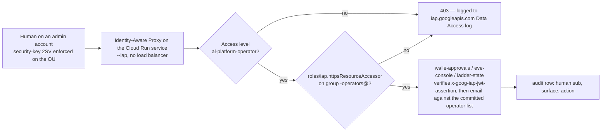
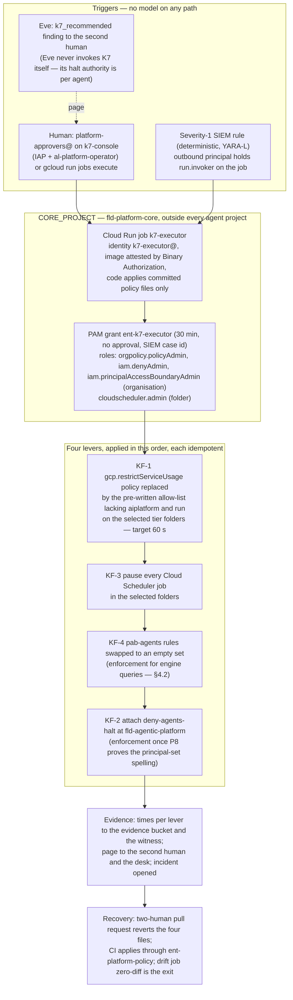

# 4. Identity, privileged access and the fleet kill switch

## Status
- Owner: the platform owner
- Last reviewed: 2026-09-18
- 2026-09-18: K6 stated as a two-person act under multi-party approval in §9.7 and §8.4, with
  the one-person fallback if the sandbox tenant shows `users.makeAdmin` is not covered.
- Maturity: detailed design, written 2026-09-13 under [01-hld.md](01-hld.md) §4 (identity), §4.4
  (privileged access), §4.5 (deny policies and Principal Access Boundaries), §4.6 (the robot
  accounts), §11.4 (the fleet kill switch K7) and §13.1 items 6 and 7 (account hygiene, kill
  switches). Answers the identity and privileged-access findings of
  [00-objective-review.md](00-objective-review.md), including the compensating set for
  Google-personnel access (Access Transparency and Access Approval) in §6.6; the residency
  decision itself is not this page's. Nothing is built.
- What this page promotes: [../wall-e/12-agent-identity.md](../wall-e/12-agent-identity.md)
  §1 (Agent Identity), §5 (operator identity), §6 (keyless everywhere) and §10 (the drift job)
  from one agent's chapter to platform rules. It references them; it does not repeat them.
- Standing constraints: as stated once in [01-hld.md § Status](01-hld.md#status).
- Every Google product, role, permission, constraint, limit and launch stage below was
  re-verified on 2026-09-13 against the page cited beside it (§15). Where a fact could not be
  verified the row says **unverified** and the value stays *tbd*; set-wide conventions are in
  [README.md § Status](README.md#status).
- Decisions this page makes are numbered **P60–P70**; the rows of record are in
  [12-open-decisions.md](12-open-decisions.md).
- Diagrams: §9.2 (the fleet kill switch), §6.2 (the human access path).

---

## 0. What this page covers, and the one rule every section applies

The HLD's §4 fixed the shape: three principal populations, Agent Identity for every reasoning
layer, one folder-level deny policy and one Principal Access Boundary for the fleet, Privileged
Access Manager for every standing-dangerous role, Identity-Aware Proxy with a Context-Aware
Access level for every human control surface, two human super admins with the robot never the
recovery one, and a fleet kill switch outside every agent project. This page gives each of
those its exact principals, permission names, roles, durations, approvers, custodians, drill
cadence and failure behaviour.

**The one rule.** Every control on this page fills the four cells owner, resource, verified and
fails, as the set's conventions require ([README.md § Status](README.md#status)), and is graded
enforcement or detection by the rule of
[01-hld.md §0.2](01-hld.md#02-the-six-containment-primitives-and-how-each-is-graded): nothing
detection-grade stands alone in a safety case.

**Grade summary of this page**, so a reviewer sees the shape before the detail:

| Control | Grade on 2026-09-13 | What would raise it |
|---|---|---|
| Agent Identity mandatory (§2.1) | enforcement for Agent Runtime engines by CI refusal; **detection** until the `identityType` custom constraint is proven (P4) | P4 spike |
| Folder deny policy `deny-agents-platform` (§3) | **enforcement** — every permission name on the deny-supported list (verified 2026-09-13); the agent principal-set spelling still needs one throwaway engine (P8, narrowed) | P8 spike |
| Principal Access Boundary `pab-agents` (§4) | **enforcement** for `aiplatform`, `secretmanager`, `cloudkms`, `iam.serviceAccounts`, `storage`, `bigquery`, `pubsub`, `orgpolicy`, `artifactregistry`, `cloudbuild` (enforcement version 4); **no effect** on `run.routes.invoke` — P9 answered (§4.2, P60) | nothing; the Cloud Run gap is the deny policy's job |
| Privileged Access Manager entitlements (§5) | **enforcement** (no standing dangerous role; approver ≠ requester is Google-enforced) | two-level approval when GA |
| IAP + Context-Aware Access on control surfaces (§6) | **enforcement** for identity and IP; device posture enforcement needs the Chrome Enterprise Premium licence (*tbd*, P63) | the licence |
| Break-glass custody (§7) | organisational + **detection** (a break-glass sign-in is severity 1) | — |
| Super-admin roster and Workspace multi-party approval (§8) | roster: detection (daily); **multi-party approval: enforcement by Google** on role assignment, DWD, 2SV, session control, CAA, SSO (P66) | — |
| Fleet kill switch K7 (§9) | **enforcement** (KF-1 `restrictServiceUsage`, KF-3 Scheduler pause, KF-4 PAB for engine queries); KF-2 deny enforcement once P8's spelling is proven | P8 |

---

## 1. Principles inherited, stated once

1. **Identity is issued by Google or it does not exist on the platform.** Agent identities,
   attached service accounts, Google identities of the tenant, and (only if P24 says yes) a
   workforce pool. No keys, no passwords in code, no shared accounts. The two robot user accounts
   `walle@` and `eve@` are the only user accounts a machine drives, and each has exactly one
   consented OAuth path per client (HLD §13.1 item 3; `wall-e/02`).
2. **Dangerous rights are never standing.** Anything that can redraw a trust boundary — org
   policy, deny policy, PAB, floors, sinks, folder IAM, registry admin, app admin, deploy of a
   credential holder, reading a secret — is a Privileged Access Manager entitlement with a
   duration, a justification and, from Tier W, an approver who is not the requester.
3. **Two independent fences for every agent principal.** A deny policy (checked before allow,
   inherited from the folder) and a Principal Access Boundary (bounding eligible resources).
   They fail differently: the deny policy is exact but only as wide as the permissions it names;
   the PAB is broad but only as strong as its enforcement version. Neither alone is the
   safety case.
4. **Humans reach control surfaces through one door.** Identity-Aware Proxy, with a
   Context-Aware Access level, on Cloud Run, with the group the factory made. No control endpoint
   is reachable with a bare Google identity from an unmanaged device; none is public.
5. **A kill switch nobody inside an agent project can undo.** K7 is pre-written, lives in
   `CORE_PROJECT`, is applied at the tier folder or the organisation, and is drilled monthly.
6. **The robot is a super admin, so Workspace's own two-person mechanisms are turned on
   against it.** Multi-party approval (§8.4) puts a second admin between the robot's credential
   and the settings the hard-denied list forbids; the roster (§8.1) keeps two humans who can
   pull K6.
7. **No domain-wide delegation, for any agent, at any stage.** Not for Wall-E, not for Eve, not
   for Mo, and not for any agent the factory admits later. Each robot account (`walle@`, `eve@`)
   holds its own consented refresh token and is never impersonated by anything; Mo and every
   other agent hold no Workspace credential at all. The reason: DWD is a tenant-wide capability
   scoped only by OAuth scopes, so a compromised delegate can act as anyone, including a super
   admin; and a delegated verifier (Eve) could impersonate the robot it verifies, which would
   make it no verifier (`eve/02` "There is no domain-wide delegation anywhere"). Granting DWD is
   a super-admin-only task [S35] covered by Workspace multi-party approval (§8.4) and on the
   hard-denied list.

---

## 2. The principal set of the fleet

### 2.1 Agent Identity for every reasoning layer (promotes `wall-e/12` §1)

| Rule | Mechanism | Owner | Resource | Verified by | Fails |
|---|---|---|---|---|---|
| Every Agent Runtime engine is created with `identity_type = AGENT_IDENTITY` (GA — `wall-e/12` §1.1) and the `serviceAccount` field unset (`wall-e/12` §1.5: "the serviceAccount field must not be set") | factory `agent-project` module emits the engine skeleton with the field; CI refuses an engine config without it | platform owner | every `aiplatform.googleapis.com/ReasoningEngine` under `fld-agentic-platform` | CI check per pull request; daily drift job (§2.6) comparing every engine's `spec.identityType` from the Cloud Asset export; the P4 custom constraint when proven | CI: merge refused. Drift: severity 2 finding, engine unpublished from `gemini-egress` within one business day |
| Every Cloud Run **reasoning** service uses Agent Identity for Cloud Run — **Pre-GA, beta gcloud track** (`gcloud beta run deploy … --functional-type=agent --identity-type=agent-identity`; Google's page, last updated 2026-09-10, §15 [S1]) — in **nonprod now, prod when GA** (HLD P5) | factory flag per manifest `runtime: cloud-run`; the switch "assigns a new principal that doesn't inherit permissions from your previous service account" [S1], so every binding is re-made on the new principal | platform owner | Cloud Run services labelled `reasoning=true` | CI; drift job on `functional-type` | a prod reasoning service on an attached service account is a **dated Tier R exception** in the register (`exception_expiry`), refused for Tier W and above |
| Gemini Enterprise no-code agents carry the product's own agent identity (`principal://…/resources/discoveryengine/…`, §15 [S2]) | product | Gemini Enterprise admin | `GEMINI_PROJECT` | reconciliation (HLD §5.2) | n/a |
| The line that removes the property — `GOOGLE_API_PREVENT_AGENT_TOKEN_SHARING_FOR_GCP_SERVICES=False` (the Agent Runtime page names it as the opt-out of the default Context-Aware Access policy on agent tokens, §15 [S3]) — is refused fleet-wide | CI grep over every deploy manifest and container env; Security Health Analytics custom module over engine and service env vars | platform owner | every engine and reasoning service | CI + SHA module daily | CI: refused. SHA: severity 1 finding, K3 on the agent |
| The two automatic roles `roles/aiplatform.agentDefaultAccess` and `roles/aiplatform.agentContextEditor` [S3] — attached by Google to every agent identity, giving it "access to its own logging, metrics, model access, sessions, memories, and sandboxes (Preview)"; the resource they are bound on is also unverified (`wall-e/12` §1.4) — are **dumped and diffed** before the first prod engine and on every platform release: neither may contain `secretmanager.*`, any `*.setIamPolicy`, `iam.serviceAccounts.*` or `run.services.update` (`wall-e/12` §1.4 left their permission lists unverified; still unverified on 2026-09-13) | `gcloud iam roles describe` in the platform release pipeline; output committed to `platform/agentic-platform/evidence/roles/` | platform owner | the two roles | pipeline stage; diff alert | a diff that adds a forbidden permission blocks the release and opens a security-reviewer ticket; the deny policy (§3) already refuses those permissions to agent principals, which is why this is a check and not the fence |
| `roles/aiplatform.expressUser` is **not** granted to agent principals, although Google recommends adding it with `roles/serviceusage.serviceUsageConsumer` and `roles/browser` (the last two are granted, §2.2): bound at project level it carries `reasoningEngines.query` on every engine in the project, which would make the agent a caller of its own engine able to assert any operator's `user_id` (`wall-e/12` §1.4); if it proves unavoidable at build it is a named, recorded exception, never a silent grant | factory never emits it; drift job | platform owner | agent projects | drift job | severity 2; removed by CI |

The trust domain is organisation-wide, `agents.global.org-ORG_ID.system.id.goog` (§15 [S2]).
A single agent is `principal://agents.global.org-ORG_ID.system.id.goog/resources/aiplatform/projects/N/locations/europe-west1/reasoningEngines/ID`;
a Cloud Run agent is `principal://agents.global.org-ORG_ID.system.id.goog/resources/run/projects/N/locations/europe-west1/services/NAME` [S1].

**The per-project principal set, and why this page names two spellings.** Two Google pages,
both last updated within the week, spell "all agents in a project" differently:

| Spelling | Where Google shows it | Used on this page for |
|---|---|---|
| `principalSet://agents.global.org-ORG_ID.system.id.goog/attribute.platformContainer/aiplatform/projects/N` | the Agent Runtime Agent Identity page, IAM allow-policy examples (§15 [S3]); the "Configure IAM agent policies" page [S4] | allow policies (the query grant, `run.invoker`), and the deny policy's first attempt |
| `//agents.global.org-ORG_ID.system.id.goog/attribute.container/projects/N` | the Principal Access Boundary page, "Agent identities" principal-set row (§15 [S5]) | PAB policy bindings |
| `principalSet://<org.id>.global.agent.id.goog/*` | the Agent Runtime page's **deny-policy example** ("deny all agents across the org") [S3] — a trust-domain spelling that matches neither of the above and that `wall-e/12` §1.4 already flagged | nothing until P8's spike says which spelling IAM accepts in a deny policy |
| `principalSet://agents.global.org-ORG_ID.system.id.goog/*` | every agent identity in the trust domain, which is the organisation; the form `wall-e/12` §1.4 took from the principal-identifiers reference (read 2026-09-09; the page did not render its content on 2026-09-14, so **not re-verified**) and which matches the Agent Runtime page's allow examples | nothing until P8's spike; `Assumption:` a deny policy accepts it |

The PAB page (re-read 2026-09-14) also documents a project-scoped trust-domain variant for PAB
bindings, `//agents.global.proj-PROJECT_NUMBER.system.id.goog/attribute.container/projects/PROJECT_NUMBER`,
and confirms that the PAB binding form carries **no** `principalSet://` prefix: a PAB binding
is written as in this table, never as `principalSet://agents…/attribute.container/projects/N`
(§4.1).

The factory emits the first form for allow and deny and the second for PAB bindings; the
throwaway-engine spike of P8 (§12) records which forms IAM accepts where, and the factory
template is corrected from the spike's evidence, never from a page.

### 2.2 The three populations, with what each may hold

| Population | Identity | Holds | Never holds | Lifetime of a credential | Named in policy as |
|---|---|---|---|---|---|
| Agents (reasoning layers) | Agent Identity (§2.1) | `run.invoker` on its own action service (resource-level); the two automatic roles; `roles/serviceusage.serviceUsageConsumer`, `roles/browser`, `roles/logging.logWriter` in its project; `iap.egressor` where the manifest names a peer | any secret read, any `setIamPolicy`, any deploy permission, any key, any token-creator, anything outside `fld-agentic-platform` (§3, §4) | 24-hour certificates, bound tokens (`wall-e/12` §1.3) | `principal://…/reasoningEngines/ID`; per-project sets of §2.1 |
| Machines that are not agents | attached service accounts, one per duty, keyless (`wall-e/12` §6): `<agent>-actions@`, `-actions-super@`, `-dispatcher@`, `-tasks@`, `-approvals@`, `-deployer@`; `eve-controller@`, `eve-verifier@`, `eve-console@`, `eve-export@`, `eve-advisor@`; `mo-metrics@`, `mo-analyst@`, `mo-narrator@`; `platform-drift@`, `k7-executor@`, `factory-groups@` (§2.4) in the core projects | exactly the rows of the register's identity table generated by the factory (§2.3) | keys (org policy); cross-project attachment (org policy); a credential-reading role **and** a deploy role on the same account (§2.3) | ID tokens per call; secrets read at pinned version | `serviceAccount:…`; per project `principalSet://cloudresourcemanager.googleapis.com/projects/N/type/ServiceAccount` (GA — `wall-e/12` §6) |
| Humans | Google identities of the tenant on **admin accounts separate from daily accounts** for anything above Tier R (§6, §8); a workforce pool only if P24 says yes (§2.5) | group memberships made by the factory (§2.4); PAM eligibility (§5); IAP access (§6) | standing `roles/owner`, `roles/editor` or any role in §5's catalogue; any impersonation grant on a credential holder (`wall-e/12` §6: "Never") | Admin console: 1 h fixed by Google [S6]; Google Cloud tools: 1 h re-authentication with security key on the operator OUs (§6.4) | `user:`, `group:`; workforce forms of §2.5 |

### 2.3 Service-account policy

Set once at `fld-agentic-platform`; the factory implements it; the drift job asserts it.

| # | Rule | Enforced by | Grade | Fails |
|---|---|---|---|---|
| SA-1 | **No keys.** `iam.managed.disableServiceAccountKeyCreation` and `iam.managed.disableServiceAccountKeyUpload` enforced at the folder (HLD §3.3); `iam.googleapis.com/serviceAccountKeys.create` also in the deny policy (§3) for belt and braces | org policy; deny policy | enforcement | a key request is refused at the API; an existing key anywhere under the folder is a severity 1 SHA finding (none should exist) |
| SA-2 | **No cross-project attachment.** `iam.disableCrossProjectServiceAccountUsage` enforced; every crossing is a binding of a foreign member on a resource (topology §5) | org policy | enforcement | refused |
| SA-3 | **One account per duty.** An account that reads a credential (`secretmanager.secretAccessor` on a secret, `cloudkms.signerVerifier` on a key) never holds a deploy permission (`run.services.update`, `run.services.create`, `artifactregistry.repositories.uploadArtifacts`, `cloudbuild.builds.create`), and the reverse | factory generates both lists from the manifest; drift job asserts the intersection is empty | enforcement (factory) + detection (daily) | drift: severity 1, the offending binding removed by CI within one business day |
| SA-4 | **No standing `roles/owner`, `roles/editor` on any platform project after the factory has run**; the factory's own CI identity `factory-apply@` holds `roles/resourcemanager.projectIamAdmin` **only as bindings conditioned on `iam.googleapis.com/modifiedGrantsByRole`** to non-credential roles, on the agent tier folders other than P-SA and on `fld-improvers-*`, nothing standing on `fld-agents-p-sa-*` or `fld-controllers-*`, never a basic role (P142, [02](02-landing-zone-and-tiers.md) §3.4) | factory's last step removes basic roles from the creator; drift job | enforcement + detection | severity 1 finding; PAM is the only way back (§5) |
| SA-5 | **Impersonation is enumerated.** `roles/iam.serviceAccountTokenCreator` exists on exactly: `<agent>-operators-caller@` for Google-identity operators of that agent (the CLI K0/K1 path, `wall-e/12` §5.1), and `<agent>-deployer@` for the CI's Workload Identity Federation principal. `roles/iam.serviceAccountUser` exists on exactly: `<agent>-deployer@` → the agent's attached accounts, and through PAM to a human for one hour (§5). **Never** any human or workforce principal on `<agent>-actions@`, `-actions-super@` or `eve-controller@` | factory; SHA custom module "impersonation chain" (HLD §4.7); the deny policy refuses `getAccessToken`/`signBlob`/`signJwt`/`actAs` to agent principals and to the project SA set except the deployer (§3) | enforcement (deny for machines) + detection (humans, daily) | severity 1; removed by CI |
| SA-6 | **Every account's reach is a generated row** of the register's identity table (`platform/agentic-platform/register/<agent>.yaml` → `identities:`), with the anti-grants (`walle-agent@`/the agent principal reads no secret; no Mo identity invokes a credential holder; no `MO_PROJECT` principal in `EVE_PROJECT`; no agent principal in another agent's project IAM) asserted by the drift job | factory + drift job | detection (daily, minutes for IAM changes via the Cloud Asset feed) | severity 1 |
| SA-7 | **Default service accounts get nothing.** `iam.automaticIamGrantsForDefaultServiceAccounts` enforced | org policy | enforcement | — |

Owner of SA-1..7: platform owner; reviewer of exceptions: security reviewer; resource:
`fld-agentic-platform` and every project under it.

### 2.4 Groups: made by the factory, named by convention, reconciled daily

Groups are the unit of human access everywhere on the platform. A human is never bound
directly to a resource; a group is. Rules:

| Rule | Detail | Owner | Verified | Fails |
|---|---|---|---|---|
| Naming | Platform: `platform-owners@`, `platform-security@`, `platform-approvers@`, `platform-readers@`, `platform-graders@`. Gemini Enterprise: `ge-admins@`, `ge-builders@`. Per agent: `<agent>-owners@`, `<agent>-operators@`, `<agent>-readers@`, `<agent>-users@`; the singleton's protected set adds `walle-protected@` (HLD §13.1 item 2). Controllers: `eve-owners@`. Improvers: `mo-owners@`, `mo-graders@` | platform owner | factory refuses a manifest whose group names do not match the pattern | CI: refused |
| Security groups | Every platform group carries the label `cloudidentity.googleapis.com/groups.security` — irreversible, and a security group "can only contain" users, service accounts and other security groups of the domain (§15 [S7]); no external members (also refused by `iam.allowedPolicyMemberDomains`) | platform owner | reconciliation reads the label daily | a group without the label is re-created; membership from outside the domain is severity 1 |
| Who makes them | The factory emits a `groups:` block per agent; a separate `group-factory` job in `CICD_PROJECT` (identity `factory-groups@`, holding the Workspace **Groups Admin** pre-built role — a service account can hold any Workspace admin role except Super Admin, HLD "What this reverses"; `Assumption:` the role is assignable to that account through the Admin console's role assignment, the mechanism `wall-e/PREREQUISITES.md` uses for `eve@`) creates and updates **agent** groups only. The **control groups** — `platform-owners@`, `platform-security@`, `platform-approvers@`, `ge-admins@`, `eve-owners@`, `walle-operators@`, `walle-protected@`, the `eve-console` IAP audience — are on a committed **hand-managed list** that `factory-groups@` refuses in code and that Eve's tenant-integrity rules watch: any membership change on them is severity 1 (HLD §7.3) | platform owner; the control-group list is two-human-merged | reconciliation diff of every group against the committed `operators.yaml`; membership drift alerts | agent group drift: corrected by the job next run; control-group drift: severity 1 page, never auto-corrected |
| Membership source | one `operators.yaml` per agent in the register, two-reviewer merge; the action service's committed operator list is generated from the same file (`wall-e/ARCHITECTURE.md` §7.5; `wall-e/12` §5.4) so the group and the list cannot diverge silently | agent owner; platform owner approves | daily reconciliation | divergence alerts; the write path fails closed on the live group, the control endpoints keep working on the committed list — deliberately (`wall-e/ARCHITECTURE.md` §7.5) |
| Group settings | join by invitation only; no external posting; owners = `platform-owners@` for platform and controller groups, the agent's owner group for agent groups | Gemini Enterprise admin applies; `Assumption:` settable through the Groups Settings API by `factory-groups@` | reconciliation reads settings weekly | reset by the job |

`factory-groups@` is the one machine on the platform holding a Workspace admin role other than
`walle@` and `eve@`. It is a Tier-P-class credential by the tier rule, so: it runs only from the
CI job, its role is in the register's `privilege` column as `workspace_role:groups_admin`, it is
on Eve's roster check, and it may not touch the control groups. This is decision **P65**.

### 2.5 Workforce identity for non-Google operators (only if P24 says yes)

`wall-e/12` §5.2 designed case (b) for one agent; the platform decides it once.

| Item | Decision | Source |
|---|---|---|
| Whether | **No pool is created until an operator population without Google identities exists** (HLD P24). The pilot and every Tier P surface use Google identities | HLD §4.2 |
| Shape, when needed | One organisation-level pool `wif-agentic-operators` (pools are "configured at the Google Cloud organization level", §15 [S8]); one provider per identity provider (OIDC or SAML); attribute mapping fixed in Terraform; principals named `principalSet://iam.googleapis.com/locations/global/workforcePools/wif-agentic-operators/group/<idp-group>` | [S8] |
| Session | `sessionDuration` = 3600 s (the documented default; the field "must be greater than 15 minutes (900s) and less than 12 hours (43200s)", §15 [S9]); IAP sign-in sessions for workforce users run "between 15 minutes and 12 hours" [S10] — set 1 h | [S9], [S10] |
| Programmatic sign-in | `accessRestrictions.disableProgrammaticSignin = true` ("disabling token issue via the Security Token API endpoint", [S9]) — a workforce operator reaches the platform through IAP pages only, never `gcloud`. Consequence recorded from `wall-e/12` §5.5: such an operator can pull K0, K1 and K4 from the page, never K2/K3 (no `gcloud`) and **never K5** (a Workspace operation) | [S9] |
| Allowed services | `accessRestrictions.allowedServices` (immutable) limited to the IAP-fronted control surfaces' domains | [S9] |
| Context-Aware Access | "Access levels based on device information are not available when using Workforce Identity Federation" [S10] — so a workforce operator gets the **IP-and-time** access level only, which is why workforce operators are admitted to Tier R and W surfaces and **never to Tier P surfaces** (band-B approval, Eve's console, the roster) | [S10] |
| One pool per surface | IAP accepts "only one workforce pool" per application [S10]; whether a Google identity source and a workforce source can coexist on one Cloud Run service is **unverified** (`wall-e/12` §11) — until tested, a workforce population gets its own IAP-fronted surface (`<agent>-approvals-ext`), not the Google-identity one | [S10]; `wall-e/12` §11 |
| Cloud Run + IAP + workforce | Preview on 2026-09-13 [S10]; Tier W prod use waits for GA, recorded as a dated exception otherwise | [S10] |
| Removal | IdP group removal stops the next IAP sign-in within the session length; a config deploy drops the subject from the committed list (`wall-e/12` §5.4) — two steps, stated | `wall-e/12` §5.4 |

This is decision **P64**.

### 2.6 The identity drift job (promotes `wall-e/12` §10 and HLD §4.7)

One job, `platform-drift@CORE_PROJECT`, `roles/iam.securityReviewer` at
`fld-agentic-platform` (the named exception to the one rule, HLD §18 item 25), Policy Analyzer
plus the Cloud Asset Inventory folder feed (`IAM_POLICY`, `ORG_POLICY`, `RESOURCE`) to Pub/Sub.
Checks it owns from this page: SA-3..SA-6, the group label and membership (§2.4), engine
`identityType` and Cloud Run `functional-type` (§2.1), every rule of the deny policy and every
PAB binding present and unchanged against the committed copy (§3, §4), no standing role from
§5's catalogue anywhere under the folder, every IAP-fronted surface carrying the access-level
condition (§6), the break-glass accounts' roles unchanged (§7), and K7's four levers **absent**
in normal state (§9). Findings are SCC findings (Security Health Analytics custom modules) where
the check is IAM-shaped and SIEM rows otherwise. Owner: platform owner; reviewer of exceptions:
security reviewer; latency: minutes for IAM and org-policy changes, daily for the rest; fails:
an absent drift report for 26 hours is itself an absence alarm to `platform-security@`.

**Per-agent assertions.** For every agent project the job also runs the checks below,
generalised from Wall-E's set (`wall-e/12` §10, where the Wall-E-specific values — the seven
invokers of `walle-actions`, `walle_audit`'s readers, the pinned Eve PEM set — stay as that
agent's input). A per-agent value comes from the register's `identities:` rows (SA-6).

| Check | Fails when |
|---|---|
| The engine's `spec.effectiveIdentity` | it does not start with `agents.global.org-`, or differs from the principal recorded in the register |
| The SPIFFE id on the Gemini Enterprise agent details page | it differs from the recorded principal — a human check until an API exposes the field |
| Policy Analyzer for the agent principal | any Secret Manager, Firestore write, BigQuery or KMS access |
| Engines in an agent project | more than one |
| Project-level and inherited bindings of the roles carrying `reasoningEngines.query` | any principal other than the app project's Discovery Engine service agent where the agent's recorded fallback allows it; the agent principal here means `expressUser` was granted (§2.1) — a recorded exception, or drift |
| The engine's own IAM policy | any member other than the app project's Discovery Engine service agent and the agent's `-dispatcher@`, or any role other than the agent's engine-query custom role |
| `run.invoker` on the action service | any member outside the agent's committed invoker list |
| Dataset-level access on the agent's audit and log datasets | any reader other than those named in [../project-topology.md](../project-topology.md) §3; any authorised view outside the agent project; any writer beyond the action service's custom role and the sink writer |
| Project-level bindings to a principal of `EVE_PROJECT`, `MO_PROJECT` or another agent project | any (SA-6) |
| KMS roles on any agent principal, and the pinned Eve public-key set | any `cloudkms.*` role, or the pinned keys differing from Eve's published versions (the Eve-side rows are Eve's own drift job in `EVE_PROJECT`) |
| `serviceAccountTokenCreator` and `serviceAccountUser` in the project | any grant outside SA-5, or any grant to a human or a workforce principal |
| `run.admin` or `run.developer` on the action service or at project level | held by any human or workforce principal |
| The agent's deploy config | `GOOGLE_API_PREVENT_AGENT_TOKEN_SHARING_FOR_GCP_SERVICES` present (§2.1), or `google-auth` below 2.45.0 (the bound-token path, `bindCertificateFingerprint`, arrived in 2.45.0 on 2025-12-15; an older library takes the unbound path silently — `wall-e/12` §1.3) |
| `agentidentitycredentials.googleapis.com` | enabled in an agent project |
| Service-account keys | any key on any account in the project (SA-1) |
| The committed operator list | diverges from `<agent>-operators@` (§2.4) |

---

## 3. The folder deny policy `deny-agents-platform`, with verified permission names

**Verified on 2026-09-13.** Google's "Permissions supported in deny policies" reference
(§15 [S11], last updated 2026-09-10) rendered on 2026-09-13. Every permission name below is on
it. `aiplatform.googleapis.com/reasoningEngines.streamQuery` is **not** on it — the list carries
`reasoningEngines.query` and the wildcard `reasoningEngines.*` — so the rules use the wildcard
for every query form. Also verified: `cloudscheduler.googleapis.com/*` is **not** deniable, and
`iam.googleapis.com/denypolicies.*` is **not** deniable — no deny policy can protect deny
policies, which is why `roles/iam.denyAdmin` is PAM-only (§5) and every deny-policy write is a
severity-1 detection (§2.6). Deny policies attach at organisation, folder or project, are
inherited, are evaluated before allow policies, support `exceptionPrincipals`, and "in general,
policy changes take effect within 2 minutes" but "can take 7 minutes or more" (§15 [S12], [S13]).
Limits: 500 deny policies and 500 deny rules per resource [S12].

**Attachment point** `cloudresourcemanager.googleapis.com/folders/<fld-agentic-platform>`
(URL-encoded in the API, [S13]); Terraform `google_iam_deny_policy` (§15 [S14]); managed only
through the platform pipeline by a human holding the `ent-platform-policy` grant (§5).

**Denied principals**, one entry pair per agent project, emitted by the factory:
`principalSet://agents.global.org-ORG_ID.system.id.goog/attribute.platformContainer/aiplatform/projects/N`
(spelling per §2.1, proven by P8's spike) and
`principalSet://cloudresourcemanager.googleapis.com/projects/N/type/ServiceAccount`; plus
the service-account entry of `MO_PROJECT`, emitted by the `improver-project`
module's privileged phase ([02](02-landing-zone-and-tiers.md) §3.3), so that R1–R5 fence Mo's
identities by enforcement rather than by the absence of an allow grant.
No principal from `fld-platform-core`, `fld-controllers` or `fld-gemini-enterprise` is ever in
the denied set of R1–R5: those projects hold no agent principal, and their machines (`k7-executor@`,
`platform-drift@`, `eve-controller@`, the Discovery Engine service agent) must keep working
under every lever of §9. **The one named exception is rule R6** (P142, 2026-09-13), which denies a
single core principal, `factory-apply@CICD_PROJECT`, the credential permissions it must never
use; no lever of §9 needs that principal, so the exception costs K7 nothing. A single service
account is written `principal://iam.googleapis.com/projects/-/serviceAccounts/EMAIL` in a deny
policy ([principal identifiers](https://docs.cloud.google.com/iam/docs/principal-identifiers); Google's
[deny-policy sample](https://docs.cloud.google.com/iam/docs/samples/iam-create-deny-policy) uses that
form, read 2026-09-13).

| Rule | Denied permissions (all verified on [S11]) | Exception principals | What it fences | Fails |
|---|---|---|---|---|
| R1 secrets | `secretmanager.googleapis.com/versions.access`, `secretmanager.googleapis.com/versions.add`, `secretmanager.googleapis.com/secrets.setIamPolicy` | each action service's attached account (`<agent>-actions@`, `<agent>-actions-super@`) and `eve-controller@` — the exception lifts R1 as a whole for them, which is why R1 holds nothing but secret permissions; **their** secret scope is then the ordinary allow policy on the one secret each reads | the reasoning layer, the dispatcher, the deployer and every other project account can never read a credential, whatever allow grant a mistake adds | a mistaken grant does nothing; the drift job still reports it |
| R2 signing | `cloudkms.googleapis.com/cryptoKeyVersions.useToSign`, `cloudkms.googleapis.com/cryptoKeyVersions.useToDecrypt`, `cloudkms.googleapis.com/cryptoKeys.setIamPolicy` | `eve-controller@` only (the approval signer, HLD §8.3) | no agent, no Mo identity (the `MO_PROJECT` entry above), no deployer can ever sign an approval | as R1 |
| R3 impersonation and keys | `iam.googleapis.com/serviceAccountKeys.create`, `iam.googleapis.com/serviceAccounts.getAccessToken`, `iam.googleapis.com/serviceAccounts.getOpenIdToken`, `iam.googleapis.com/serviceAccounts.signBlob`, `iam.googleapis.com/serviceAccounts.signJwt`, `iam.googleapis.com/serviceAccounts.implicitDelegation`, `iam.googleapis.com/serviceAccounts.actAs`, `iam.googleapis.com/serviceAccounts.setIamPolicy` | `<agent>-deployer@<agent project>` — the per-project deploy identity of P142, the release pipeline's impersonation target, never a CI-project account — for `actAs` only, in its own rule R3b (it must act as the attached accounts to deploy); `<agent>-operators-caller@` is not a denied principal's target — the human callers who impersonate it are not in the denied set | the "impersonator becomes the service account" path `wall-e/12` §6 calls the one that makes deny-by-principal moot | refused at the API |
| R4 self-modification | `run.googleapis.com/services.create`, `run.googleapis.com/services.update`, `run.googleapis.com/services.delete`, `run.googleapis.com/services.setIamPolicy`, `run.googleapis.com/jobs.create`, `run.googleapis.com/jobs.update`, `run.googleapis.com/jobs.setIamPolicy`, `aiplatform.googleapis.com/reasoningEngines.create`, `aiplatform.googleapis.com/reasoningEngines.update`, `aiplatform.googleapis.com/reasoningEngines.delete`, `aiplatform.googleapis.com/reasoningEngines.setIamPolicy`, `artifactregistry.googleapis.com/repositories.uploadArtifacts`, `cloudbuild.googleapis.com/builds.create` | `<agent>-deployer@<agent project>` (P142: the CI's impersonation target and the only principal that creates or updates the engine and the action service; no CI-project deployer account exists) — and **only** while the P4 spike has not made Binary Authorization plus CI-only deploy Google-enforced; even then the deployer keeps `services.update` because something must deploy | D11 of the charter: no agent deploys itself, its peers, or its ceilings | refused |
| R5 governance and evidence | `orgpolicy.googleapis.com/policy.set`, `orgpolicy.googleapis.com/policies.create`, `orgpolicy.googleapis.com/policies.update`, `orgpolicy.googleapis.com/policies.delete`, `orgpolicy.googleapis.com/customConstraints.*`, `logging.googleapis.com/sinks.create`, `logging.googleapis.com/sinks.update`, `logging.googleapis.com/sinks.delete`, `logging.googleapis.com/buckets.update`, `logging.googleapis.com/buckets.delete`, `storage.googleapis.com/buckets.setIamPolicy`, `bigquery.googleapis.com/datasets.setIamPolicy`, `resourcemanager.googleapis.com/projects.setIamPolicy`, `resourcemanager.googleapis.com/folders.setIamPolicy`, `iam.googleapis.com/principalaccessboundarypolicies.*`, `iam.googleapis.com/roles.create`, `iam.googleapis.com/roles.update`, `iam.googleapis.com/roles.delete`, `modelarmor.googleapis.com/floorSettings.update`, `modelarmor.googleapis.com/templates.update`, `modelarmor.googleapis.com/templates.delete`, `agentregistry.googleapis.com/services.create`, `agentregistry.googleapis.com/services.update`, `agentregistry.googleapis.com/services.delete`, `agentidentity.googleapis.com/authProviders.create`, `agentidentity.googleapis.com/authProviders.update`, `agentidentity.googleapis.com/authProviders.delete`, `agentidentity.googleapis.com/authProviders.setIamPolicy`, `privilegedaccessmanager.googleapis.com/entitlements.*`, `privilegedaccessmanager.googleapis.com/grants.*`, `discoveryengine.googleapis.com/engines.setIamPolicy` | none | no agent or agent-project machine can loosen a floor, silence a sink, rewrite IAM, register itself, mint an auth provider, or touch PAM | refused |
| R6 factory credential fence (P142) | `secretmanager.googleapis.com/versions.access`, `secretmanager.googleapis.com/versions.add`, `secretmanager.googleapis.com/secrets.setIamPolicy`, `cloudkms.googleapis.com/cryptoKeyVersions.useToSign`, `cloudkms.googleapis.com/cryptoKeyVersions.useToDecrypt`, `cloudkms.googleapis.com/cryptoKeys.setIamPolicy`, `iam.googleapis.com/serviceAccounts.getAccessToken`, `iam.googleapis.com/serviceAccounts.signBlob`, `iam.googleapis.com/serviceAccounts.signJwt`, `iam.googleapis.com/serviceAccounts.implicitDelegation`, `iam.googleapis.com/serviceAccounts.actAs`, `iam.googleapis.com/serviceAccounts.setIamPolicy` (all from R1–R3's verified set); denied principal `principal://iam.googleapis.com/projects/-/serviceAccounts/factory-apply@CICD_PROJECT.iam.gserviceaccount.com` | none | the routine factory identity, which holds a conditioned `projectIamAdmin` on the agent tier folders, can never read `walle-refresh-token` or any other secret, use a key, impersonate a credential holder or re-point a secret's IAM, whatever a condition mistake allows — it creates empty secrets and accounts; the bindings that open them are the privileged phase's ([02](02-landing-zone-and-tiers.md) §3.4) | refused at the API; the factory's negative test reads a canary secret at every release and a success is severity 1 |

Rules R1–R6 are one policy; R3b is a second rule inside it so that the `actAs` exception does
not lift the rest of R3. Owner: platform owner; resource: `fld-agentic-platform`; verified:
daily drift diff against the committed JSON plus the P8 spike's evidence file; fails: a removed
or edited rule is a severity-1 finding within minutes (Cloud Asset feed) and pages
`platform-security@`; the policy is re-applied by the pipeline after the security reviewer
signs the incident note.

**`deny-eve-project-foreign`** stays on `EVE_PROJECT` as topology decision 48 records (HLD §4.5);
this page adds nothing to it.

**Landing-zone additions, defined on [02](02-landing-zone-and-tiers.md) §4.4.** Two more
fences sit beside this page's policies: `pab-core-ci`, a second PAB binding `factory-apply@`
and `platform-drift@` to `fld-agentic-platform`, so the factory identity cannot act outside the
platform folder even through a mistaken binding elsewhere; and `deny-core-agents` on
`fld-platform-core`, denying every permission to every agent principal form once P8 proves the
forms (until then the drift job asserts absence). 02 §4.4 also fixes the attachment shape
used here: the factory's privileged phase adds each project's service-account principal set and
its action service's exception principals to `deny-agents-platform`. The PAB's grade is the
one §4.3 records (P9 answered by P60).

**`deny-agents-halt`** — the second lever of K7 (KF-2), kept in git, never attached in normal
state — is specified with its verified permission list in
[§9.3](#93-the-four-levers-verified).

This section is decision **P61**: the deny rule set as verified, `streamQuery` dropped, P8
narrowed to the principal-set spelling.

---

## 4. The Principal Access Boundary `pab-agents`, and what it can and cannot fence

### 4.1 Facts verified on 2026-09-13

PAB policies are organisation-level resources
(`organizations/ORG_ID/locations/global/principalAccessBoundaryPolicies/pab-agents`), bound to
principal sets; the "Agent identities" principal-set row on Google's page is
`//agents.global.org-ORG_ID.system.id.goog/attribute.container/projects/N` (§15 [S5]; re-read
2026-09-14, page last updated 2026-09-14: the row reads "All agent identities in the specified
project's trust domain", with the alternative format
`//agents.global.proj-PROJECT_NUMBER.system.id.goog/attribute.container/projects/PROJECT_NUMBER`,
and no `principalSet://` prefix on either). Limits:
1,000 policies per organisation, 500 rules per policy, 10 policies bound per principal set, 500
resources per policy [S5]. "Principal Access Boundary policies can block all permissions that are
included in the policy's enforcement version"; if a policy cannot block a permission, "the
policy has no effect on whether principals can use the permission" [S5]. The **blocked-permissions
reference rendered on 2026-09-13** (§15 [S16], last updated 2026-09-10): the current default enforcement
version is **4**; each version blocks everything the previous one did.

Roles (verified on the IAM roles reference [S17]): `roles/iam.principalAccessBoundaryAdmin`,
`roles/iam.principalAccessBoundaryUser`, `roles/iam.principalAccessBoundaryViewer`. Terraform:
`google_iam_principal_access_boundary_policy` and the bindings `google_iam_folders_policy_binding`
/ `google_iam_organizations_policy_binding` / `google_iam_projects_policy_binding` (§15 [S14]).

### 4.2 What enforcement version 4 blocks, against what the platform needs fenced

| Permission the safety case cares about | On the blocked list? (version) | Consequence |
|---|---|---|
| `aiplatform.googleapis.com/*` — every Vertex AI permission, so `reasoningEngines.query` | **yes** (version 1) [S16] | an agent's PAB fences it to engines **inside** the boundary: it cannot query an engine outside `fld-agentic-platform` even with a stray grant; and KF-4 (§9.3) swapped to an empty rule set stops every engine query by every bound agent principal — **enforcement-grade** |
| `secretmanager.googleapis.com/*.*` | **yes** (version 3) | a secret outside the boundary is unreadable regardless of grant |
| `cloudkms.googleapis.com/*.*`, `cryptoKeyVersions.useToSign` | **yes** (versions 2/3) | a key outside the boundary cannot sign for an agent principal |
| `iam.googleapis.com/serviceAccounts.*` | **yes** (version 2) | no impersonation of an account outside the boundary |
| `storage.googleapis.com/objects.*`, `buckets.*` | **yes** (version 1) | evidence buckets outside the boundary (the witness) are unreachable to agents — as designed |
| `bigquery.googleapis.com/datasets.*`, `tables.*`, `jobs.*` | **yes** (version 1) | as above |
| `pubsub.googleapis.com/*` | **yes** (version 1) | no publishing outside the boundary |
| `orgpolicy.googleapis.com/*.*`, `artifactregistry.googleapis.com/*.*`, `cloudbuild.googleapis.com/*` | **yes** (versions 2/1) | belt to the deny policy's braces |
| `run.googleapis.com/services.create/update/delete`, `run.googleapis.com/jobs.run` | **yes** (version 1) | deploy and job execution fenced |
| **`run.googleapis.com/routes.invoke`** | **no** — the `run.googleapis.com` block lists `routes.get` and `routes.list` and not `routes.invoke` [S16] | **a PAB does not stop an agent invoking a Cloud Run service outside its boundary.** The only fence for Cloud Run invocation is IAM (resource-level `run.invoker` on named principals — the existing rule) plus the deny policy (`run.googleapis.com/routes.invoke` is deny-supported, §3) |
| `logging.googleapis.com/logEntries.create` | **yes** (version 1) | an agent writes logs only inside the boundary — fine, its project is inside; recorded so nobody puts a log destination outside |

### 4.3 The policy and its grade — P9 answered

| Item | Decision |
|---|---|
| Policy | `pab-agents`, enforcement version pinned to **4** in Terraform (never `latest`, so a version bump is a reviewed change); rules: `//cloudresourcemanager.googleapis.com/folders/<fld-agentic-platform>` plus the named core resources agents legitimately reach — the aggregated Pub/Sub topics in `CORE_PROJECT` and the approval surface — each listed as a resource, never a whole core project |
| Bindings | one `google_iam_folders_policy_binding`-class binding per agent project, made by the factory, on `//agents.global.org-ORG_ID.system.id.goog/attribute.container/projects/N`; the `-p-sa` singleton binds a stricter twin `pab-agents-p-sa` whose only resource is `WALLE_PROJECT` and the approval surface |
| Grade | **enforcement-grade** for everything in §4.2 marked yes — which includes the engine-query path (`reasoningEngines.query` is blockable); **no effect** on `run.routes.invoke`, so the PAB is **not** in the safety case for "an agent cannot invoke a foreign action service": that sentence rests on resource-level IAM and the deny policy. Trust boundary B7's grade line in HLD §15 reads "PAB (enforcement for aiplatform, secrets, keys, storage, BigQuery, Pub/Sub; not for Cloud Run invoke)" |
| K7 | KF-4 is **counted for engine queries** (§9.3) |
| Owner / resource / verified / fails | platform owner through PAM (§5); the organisation (policy) and each project (binding); drift job compares policy JSON and binding list daily and reacts to the Cloud Asset feed in minutes; an edit or unbinding is severity 1; a version bump is a reviewed pull request whose evidence is the re-read blocked list |

This is decision **P60**.

---

## 5. Privileged Access Manager: the entitlement catalogue

### 5.1 Facts verified on 2026-09-13

| Fact | Source | Consequence |
|---|---|---|
| PAM is GA; entitlements at organisation, folder or project; grants and entitlement changes are Admin Activity audit logs (always on) under `privilegedaccessmanager.googleapis.com` — `CreateGrant`, `ApproveGrant`, `DenyGrant`, `RevokeGrant`, `CreateEntitlement`, `UpdateEntitlement`, `DeleteEntitlement` | §15 [S18], [S19] | every grant is a SIEM row by inheritance from the aggregated sink |
| Maximum entitlement duration **7 days**; a grant's requested duration runs "between 30 minutes (`1800s`) and 168 hours (`604800s`)" | [S20] | the catalogue's durations are far below the ceiling; **30 minutes is the floor**, which is why no entitlement below is shorter |
| "You can't approve your own request" | [S21] | approver ≠ requester is **Google-enforced**, not a rota rule |
| Approvers may be groups; "up to two levels of sequential approvals", "up to five approvals per level"; multi-level is **Preview** and needs SCC Premium or Enterprise; "Activate access without approvals" exists | [S18], [S20] | single-level GA now; two named approvers in one approver set until multi-level is GA |
| **PAM "doesn't support legacy basic roles (Owner, Editor, and Viewer)"**; it supports predefined roles, custom roles and the **new basic roles Admin (`roles/admin`), Writer (`roles/writer`), Reader (`roles/reader`)**, which are themselves **Preview** on the IAM roles page | [S18], [S20], [S22] | **`roles/owner` on an agent project cannot be a PAM entitlement.** `ent-project-repair` below replaces it |
| **`roles/orgpolicy.policyAdmin`: "Lowest-level resources where you can grant this role: Organization"** | [S23] | **No folder-level org-policy entitlement exists.** The org-policy and PAB-admin entitlements live at the **organisation**; folder-scoped ones stay at the folder |
| **`roles/iam.denyAdmin`: "Lowest-level resources where you can grant this role: Organization"** (read 2026-09-13 on the IAM roles reference) | [S17] | `roles/iam.denyAdmin` cannot be a folder-level entitlement either: it moves from `ent-folder-admin` to `ent-platform-policy`. Deny **policies** still attach at the folder (§3) — the role that edits them is granted at the organisation |
| IAM conditions can be set on entitlement roles "in the same way that you add conditions to allow policy role bindings"; "Don't include service agent roles in entitlements" | [S20] | the deploy entitlement's `serviceAccountUser` is conditioned to one account (`Assumption:` a `resource.name` condition on a service-account binding is honoured for `actAs` — verify at build) |
| PAM "supports all types of identities, including Cloud Identity, Workforce Identity Federation, Workload Identity Federation, and agent identities"; service accounts and agent identities as **approvers** are Preview | [S18], [S20] | requesters: "All principal types are supported except `allUsers` and `allAuthenticatedUsers`", up to 20 requesting principals per entitlement, more through a group [S20] — so `k7-executor@`, a service account, **may request** the K7 grant, and so may the CI's WIF principal; approvers stay human until the service-account-approver Preview clears |
| Setup needs `roles/privilegedaccessmanager.admin` plus, per scope, `roles/iam.securityAdmin` (organisation), `roles/resourcemanager.folderAdmin` (folder) or `roles/resourcemanager.projectIamAdmin` (project); the organisation-level service agent `service-org-ORG_NUMBER@gcp-sa-pam.iam.gserviceaccount.com` gets the PAM service agent role whatever the scope | [S24] | the PAM admin role itself is held by `platform-owners@` **standing** — it is the one standing administrative role on the platform, because PAM cannot bootstrap itself; its use is a severity-2 detection outside a change window and `roles/privilegedaccessmanager.admin` is on the roster review (§8) |
| gcloud: `gcloud pam grants create --entitlement … --requested-duration … --justification …` (the page read on 2026-09-13 shows the `alpha` track — verify the GA track at build); `gcloud pam grants approve` / `deny` | [S25], [S21] | the runbook commands |

### 5.2 The catalogue

All entitlements are Terraform (`google_privileged_access_manager_entitlement`, §15 [S14]),
require a justification carrying a ticket or incident id, notify `platform-security@` on
every grant, and are reviewed quarterly by the security reviewer against the access-review
evidence TISAX 4.2.1 asks for (HLD §14.2). "Tier R with one person" means the entitlement is
created with "Activate access without approvals" and mandatory justification, **recorded as
such** in the register, and switched to an approver the day the security reviewer exists.

| Id | Scope | Role(s) | Max | Requesters | Approvers (single level, GA) | Why it exists |
|---|---|---|---|---|---|---|
| `ent-project-repair` | one agent project (an entitlement per project, generated by the factory) | the predefined bundle that replaces `roles/owner`: `roles/resourcemanager.projectIamAdmin`, `roles/run.admin`, `roles/aiplatform.admin`, `roles/secretmanager.admin`, `roles/datastore.owner`, `roles/bigquery.admin`, `roles/storage.admin`, `roles/pubsub.admin`, `roles/cloudscheduler.admin`, `roles/iam.serviceAccountAdmin`, `roles/serviceusage.serviceUsageAdmin`; **not** `roles/admin` (Preview) until GA, then reconsidered as one role | 2 h | `platform-owners@`, `<agent>-owners@` | security reviewer (Tier W+); Tier R: no approval, mandatory justification | incident, factory failure, restore drill |
| `ent-deploy-credential-holder` | one agent project | `roles/run.developer` on the project + `roles/iam.serviceAccountUser` conditioned to the agent's attached accounts | 1 h | `<agent>-owners@`, `platform-owners@` | the **second reviewer** (deployer role, HLD §0.3) — never the agent's owner | a release outside CI; closes `wall-e/ARCHITECTURE.md` weakness 12: the deploy grant is never standing |
| `ent-secret-read` | one secret (resource-scoped by condition) | `roles/secretmanager.secretAccessor` | 30 min | `platform-owners@` | security reviewer | rotation, incident forensics |
| `ent-folder-admin` | `fld-agentic-platform` and, separately, each tier folder | `roles/resourcemanager.folderAdmin`, `roles/logging.configWriter`, `roles/modelarmor.floorSettingsAdmin`, `roles/agentregistry.admin` (on `CORE_PROJECT`), `roles/cloudscheduler.admin` | 1 h | `platform-owners@` | security reviewer; at Tier P two named approvers in the approver set | floor change, sink change, registry repair, KF-3 pulled or reverted by hand |
| `ent-platform-policy` | **the organisation** (forced by the lowest grant level of org-policy admin and of deny admin) | `roles/orgpolicy.policyAdmin`, `roles/iam.denyAdmin`, `roles/iam.principalAccessBoundaryAdmin` (PAB policies are organisation resources) | 1 h | `platform-owners@` | security reviewer **and** a second named approver (two approvers in the set; two-level when GA) | org-policy baseline change, deny-policy change, KF-1/KF-2/KF-4 by hand, PAB version bump — the highest entitlement on the platform, and the reason the organisation-level SetIamPolicy alert exists |
| `ent-ge-admin` | `GEMINI_PROJECT` | `roles/discoveryengine.agentspaceAdmin` | 1 h | `ge-admins@` | security reviewer (HLD §4.4 row; at Tier C with one person: no-approval activation with mandatory justification, recorded as such — [03](03-gemini-enterprise-environment.md) §4, P49) | app registration, feature toggles, emergency unpublish (HLD §2.2); reads stay standing through the viewer role |
| `ent-k7-human` | the organisation (org policy, deny, PAB) + `fld-agentic-platform` (Scheduler) — two entitlements activated together | `roles/orgpolicy.policyAdmin`, `roles/iam.denyAdmin`, `roles/iam.principalAccessBoundaryAdmin`, `roles/cloudscheduler.admin` | 1 h | `platform-approvers@` (the platform owner, the security reviewer, the second human) | **none — "Activate access without approvals"**, mandatory justification with the incident id; every activation pages the second human and the on-duty desk | a fleet stop must not wait for an approver at 03:00; the two-person property is carried by the page-on-activation and by the recovery path (§9.5), which is two-human |
| `ent-k7-executor` | as `ent-k7-human` | as `ent-k7-human` | 30 min | `k7-executor@CORE_PROJECT` (a service account is a documented requester — verified [S20], §5.1; contingency §9.4) | none; justification = the SIEM case id passed by the caller | the machine path of K7 (HLD §11.4: "never by a model") |
| `ent-project-move` | the source parent of `GEMINI_PROJECT` (the organisation if the project sits at the root, else its current folder — *tbd* at the import) **and** `fld-gemini-enterprise`: two entitlements activated together; verified at build that the move succeeds with exactly these two | `roles/resourcemanager.projectMover` — Google requires it on both the source and the destination, and on the organisation when the project is not in a folder ([move a project](https://docs.cloud.google.com/resource-manager/docs/moving-projects-folders), read 2026-09-13) | 1 h | `platform-owners@` | security reviewer | the `GEMINI_PROJECT` import change window (P43, P48) and nothing else; any other `MoveProject` under the folder is a SIEM rule; the entitlement is deleted after the import |
| `ent-factory-singleton` (P142) | `fld-agents-p-sa-*` and `fld-controllers-*` (one entitlement per folder) | `roles/resourcemanager.projectCreator`, `roles/serviceusage.serviceUsageAdmin`, `roles/iam.serviceAccountCreator`, `roles/resourcemanager.projectIamAdmin` (unconditioned, for these projects' duty bindings; secret-level and key-level IAM such as `eve-controller@`'s signer and `walle-actions-super@`'s accessor is still refused to `factory-apply@` by R6 and is made by the approving human's own `ent-project-repair` grant in the same window) | 1 h | `factory-apply@CICD_PROJECT` (a service account is a documented requester, §5.1) | security reviewer; for `fld-agents-p-sa-*` two named approvers; for `fld-controllers-*` the Eve owner or the security reviewer, never the Wall-E owner | the Wall-E and Eve projects are applied rarely and only with a human watching; outside a grant `factory-apply@` is not a principal in `WALLE_PROJECT` or `EVE_PROJECT` at all, which keeps Eve's decision-48 foreign-principal count exact (HLD §18 item 25). Deny rule R6 still applies during the grant |
| `ent-witness-export-repair` | `EVE_PROJECT` | `roles/iam.serviceAccountAdmin` on `eve-export@` | 1 h | `eve-owners@` | the second human | the one cross-organisation push identity (HLD §13.2) |

Owner of the catalogue: platform owner; reviewer: security reviewer; resource: as the Scope
column; verified: drift job asserts **no** role from the Role column is bound standing anywhere
under the folder or at the organisation to any human or group (the PAM service agent's bindings
excepted), and the quarterly review reads every grant from the SIEM; fails: a standing binding
is severity 1 and is removed by the pipeline; a grant outside a change window without an
incident id is severity 2 to the security reviewer.

Google-personnel access is not a PAM entitlement; its compensating set is §6.6.

This section is decision **P62**.

---

## 6. Human access to every control surface

### 6.1 The rule

**All human access to any agent control surface — approval pages, consoles, the ladder-state
page, the registry viewer, the K7 job's page — passes through Identity-Aware Proxy on Cloud Run
with an access-level condition, to a factory-made group.** No control surface is reachable
with a bare Google identity, from an unmanaged device, or from the internet without IAP. IAP is
enabled **directly on the Cloud Run service** (`gcloud run deploy … --no-allow-unauthenticated
--iap`; the IAP service agent `service-PROJECT_NUMBER@gcp-sa-iap.iam.gserviceaccount.com`
holds `roles/run.invoker` on the service; "you cannot configure IAP on both the load balancer
and the Cloud Run service"; §15 [S26]).

The access level is bound with the IAM condition
`"accessPolicies/ORG_NUMBER/accessLevels/al-platform-operator" in request.auth.access_levels`
on the role `roles/iap.httpsResourceAccessor` granted to the group [S27]. Access levels live in
the **organisation's** access policy ("The use of scoped policies is not supported by IAP.
Access levels must be set in the organizational access policy", [S27]), managed by
`roles/accesscontextmanager.policyAdmin` [S17] through the platform pipeline.

### 6.2 The path

### 6.3 The access levels

| Access level | Requires | Licence | Who gets it | Status |
|---|---|---|---|---|
| `al-platform-operator` | corporate-managed device with Endpoint Verification: screen lock, storage encryption, approved OS version ("Screen lock is enabled, Storage encryption is enabled, Device is running a specified operating system kind and version" are the documented device attributes, §15 [S28]); **plus** the tenant's IP ranges or the corporate VPN | device attributes "require a Chrome Enterprise Premium license" for IAP access levels [S27]; "You must have a paid subscription to use device attributes in custom access level expressions" [S28] — **licence *tbd***, cost line to be added to HLD §0.5 | every Tier W and Tier P surface | target; bound only when the licence exists |
| `al-platform-operator-lite` | tenant IP ranges or corporate VPN + business-hours window (request-context attributes, no licence) | none | Tier R surfaces; every surface until the licence exists, recorded as a dated exception | day one |
| `al-workforce` | IP ranges + time window (device attributes are unavailable to workforce users [S10]) | none | workforce surfaces only (§2.5) | only if P24 says yes |

**Security key.** An access level cannot express "signed in with a security key" (the
documented attributes are IP, region, principal and device policy [S28]). The security-key
property comes from **two Workspace settings on the operator and admin OUs**, both verified:
2-Step Verification enforced in **"Only security key"** mode per OU or configuration group
(in that mode "users cannot generate their own backup verification codes. An admin must
provide these codes", §15 [S29]); and **Google Cloud session control** with re-authentication
every 1 h and method **Security key** ("The minimum frequency allowed is 1 hour, and the
maximum is 24 hours"; "select Password or Security key", [S30]) — which covers "the Google
Cloud console, the gcloud command-line tool (Cloud SDK), any applications … that require user
authorization for Google Cloud scopes". The IAP sign-in is a Google sign-in and inherits the
OU's 2SV enforcement.

**The Admin console access level on the robot OU (Workspace Context-Aware Access, P7).** The
levels above are Access Context Manager levels for IAP. The robot accounts get a separate,
Workspace-side level: an access level on the **Admin console** for `/Automation/Service
Identities` that no device satisfies. It is cheap, Google-native and needs no second person, and
it is adopted, but it is graded **detection-plus-friction, `Assumption:` until its applicability
to super admins is verified with Google (P7)**, never "impossible by policy": Google's page on
assigning access levels to the Admin console is silent on whether super admins are subject to
it, and the product page says Context-Aware Access "controls app access only from end user
accounts" [S37] and does not restrict API access from service accounts, silent on user-account
API tokens. There is **no** Admin SDK API access level — Google's app table has no such entry.
So "an interactive login is an incident" (severity 1) stays the control that survives Super
Admin (HLD §4.6). The setting is read daily in §8.2.

### 6.4 The surfaces

| Surface | Project | Audience group | Access level (target) | What it can do | K-switch reach |
|---|---|---|---|---|---|
| `<agent>-approvals` (band A L3 approvals; band B `WRITE`) | agent project | `<agent>-operators@` | `al-platform-operator` | approve, veto, halt (K0), demote (K1), revoke credential (K4) as buttons (`wall-e/12` §5.1: workforce operators have no CLI, so the page must expose halt and demote) | K0, K1, K4 |
| `walle-approvals-super` (band B `SUPER`, HLD §13.1 item 4) | `WALLE_PROJECT` | `walle-super-approvers@` — a control group whose members are the human super admins' **admin accounts** only | `al-platform-operator` (never lite) | approve a `SUPER` request as a **different** human super admin than the requester, bound to the canonical request hash | — |
| `eve-console` | `EVE_PROJECT` | the `eve-console` IAP audience group (membership change severity 1, HLD §13.2) | `al-platform-operator` | read verdicts, findings, incidents; acknowledge pages | none (Eve halts through its own path) |
| `ladder-state` page | `CORE_PROJECT` | `platform-readers@` | lite acceptable | read | none |
| Registry viewer | `CORE_PROJECT` | `platform-readers@`, `eve-owners@`, detection desk | lite acceptable | read | none |
| `k7-console` (a minimal page that executes the K7 job and shows drill history) | `CORE_PROJECT` | `platform-approvers@` | `al-platform-operator` | pull K7 (one button, with mandatory incident id); read the last drill | K7 |
| GCP console and `gcloud` | any | per PAM grant | Google Cloud session control 1 h / security key | K2, K3 (per `wall-e/12` §5.5), factory runs, PAM activations | K2, K3, K7 by hand |
| Admin console | Workspace | the two human super admins; delegated admins | Google's fixed **1 h** admin-console session ("set to one hour and can't be modified", §15 [S6]); the OU's 2SV; the Admin console Context-Aware Access level of HLD §4.6 (`Assumption:` on super admins, P7) | K5, K6, roster, MPA approvals | K5, K6 |

Owner: each surface's project owner; access levels and the OU settings: platform owner
(Workspace side applied by the Gemini Enterprise administrator role, the same person on 2026-09-13);
resource: the IAP-enabled Cloud Run services; verified: drift job asserts every service labelled
`control-surface=true` has `--iap`, `--no-allow-unauthenticated`, the access-level condition
and only the named group; `iap.googleapis.com` Data Access logs on at the folder (HLD §7.1);
fails: a surface missing any of the four is severity 1 and its `run.invoker` binding for the
IAP service agent is removed by the pipeline (the surface goes dark rather than open).

This section is decision **P63**.

### 6.5 What a human never does

No human holds `run.invoker` on an action service directly (the CLI path impersonates
`<agent>-operators-caller@`, `wall-e/12` §5.1). No human holds `serviceAccountTokenCreator` or
`serviceAccountUser` on a credential holder (§2.3 SA-5). No human signs in to `walle@` or
`eve@` — ever — after bootstrap (HLD §4.6: severity 1). No human drives the Admin console under
the robot's session (HLD §13.1 band C).

### 6.6 Google-personnel access

Access Transparency (DL-7.4) and Access Approval (DL-7.5, P111) — their scope, approvers,
SIEM routing and severities — are defined once in
[08 §7.2](08-data-logging-retention-sovereignty.md#72-the-compensating-set). One rule this page
adds to that set: an Access Approval request outside a Google support case the platform opened
is severity 2.

---

## 7. Break-glass accounts and their custody

Break-glass exists for the two failures PAM and IAP cannot help with: PAM itself is
unavailable or misconfigured, or every human on the approver set is unreachable. Two sides, two
mechanisms.

### 7.1 Google Cloud break-glass

| Item | Decision |
|---|---|
| Accounts | two Cloud Identity accounts, `brk-gcp-1@` and `brk-gcp-2@`, in `/Automation/Break-Glass` (own OU: 2SV "Only security key", no recovery options, Google Cloud session control 1 h / security key, super-admin self-recovery not applicable — they are **not** Workspace super admins), no Workspace licence, no mailbox use |
| Standing roles | `roles/resourcemanager.organizationAdmin` and `roles/privilegedaccessmanager.admin` at the organisation — **standing, deliberately**: break-glass is for when PAM cannot be used. Nothing else. Google's guidance is a private Organization Administrator group separate from super-admin accounts (§15 [S31]); here the group is `gcp-organization-admins@` with exactly these two members |
| Custody | one hardware key per account, sealed in a tamper-evident envelope in the corporate safe, with the account password in the corporate vault under a separate custodian; custodians: **key 1 — the platform owner; key 2 — the second human (IT security)**; opening an envelope needs a witness from the other line and a dated custody record in the witness organisation's `EVE_WITNESS_PROJECT` bucket (so the record survives a tenant compromise) |
| Detection | any `login.googleapis.com` event for `brk-gcp-*@` is severity 1 to the witness channels (the same rule class as the robot login, HLD §7.3); any IAM change by them is a SIEM case; the drift job asserts their role set is exactly the two roles above (a third is severity 1, a missing one is severity 1) |
| Drill | quarterly: open one envelope, sign in, activate nothing, sign out, re-seal with a new envelope, record the time; alternate accounts each quarter so both keys are proven yearly |
| Rotation | password rotated after every use and at every drill; the key re-enrolled if an envelope is found opened |
| Never | never used for routine work; never members of any group but `gcp-organization-admins@`; never Workspace admins; never a PAM approver |

### 7.2 Workspace break-glass: the two human super admins are the break-glass

Workspace has no PAM. The break-glass for the tenant is the roster of §8.1 itself: two human
super admins on **separate admin accounts** ("Give each super administrator 2 accounts",
§15 [S32]; "Give super admins a separate account that requires a separate login", [S31]),
each with **two security keys** ("Admins should enroll more than one security key" and store
extras "in a safe place", [S32]), admin-generated backup codes sealed with the spare key, and
super-admin self-recovery **Off** at the top OU so recovery is "contact another super admin or
Google Support" ([S33]) — the process every super admin rehearses ("ensure that all super
admins are familiar with the process for support-assisted recovery", [S34]). Custody of each
human's spare key: the corporate safe, custodian the other human, witnessed record as §7.1.

A third super admin exists only as a **dated exception** during a hand-over between humans;
its removal is on the exit checklist and the roster check (§8.2) fails while it exists beyond
the date.

This section is decision **P69**.

---

## 8. The super-admin robot on the roster, and the privileged tier's two-person rule

### 8.1 The roster

Google's guidance is "more than one super administrator account, each managed by a separate
individual" ([S32]) and "at least two" so a password can be recovered ([S35]). With the robot
counting as one account, the platform's steady-state roster is exactly three:

| Account | Kind | Person or custodians | 2SV | Session | Self-recovery | Recovery for this account | Pulls |
|---|---|---|---|---|---|---|---|
| `sa-1-admin@` | human super admin, admin account separate from the daily account | platform owner | "Only security key", two keys | Admin console 1 h (Google); Google Cloud session control 1 h / key | Off (top OU) | `sa-2-admin@` resets it; support-assisted recovery last | K5, K6, MPA approvals, band-B `SUPER` requests |
| `sa-2-admin@` | human super admin, **outside the Wall-E administration line** (IT security; the second human of HLD §13.2) | second human | same | same | Off | `sa-1-admin@` resets it | K5, K6, MPA approvals, band-B `SUPER` approvals; sole recipient of reports about the administrator |
| `walle@` | robot, licensed user, Super Admin (P33) | key A custodian: platform owner; key B custodian: second human; witnessed custody records in the witness bucket | "Only security key", two keys in the safe | short session on `/Automation/Service Identities` where OU-scoped settings apply; **no interactive login ever** (severity 1) | Off (top OU, drift-checked on every child OU and configuration group — HLD §13.1 item 6) | **never** the recovery of anyone; its own recovery is a human super admin re-running the consent phase with a key from the safe | nothing by hand — its credential is driven by `walle-actions`/`walle-actions-super` only |
| `eve@` | robot, licensed user, read-only custom role, **never** Super Admin | as `walle@` | same | same | n/a | as `walle@` | — |

Rules on the roster, every one owned by the platform owner and verified daily by Eve's
roster check (`roleAssignments.list`, `users.list isAdmin` from Eve's own credential, diffed
against the committed roster — HLD §13.1 item 5) and by the SecOps super-admin detection set:

1. The robot is **never the only** super admin and **never a recovery** super admin; at least
   two human super admins hold the role at all times; the committed roster lists exactly the
   accounts above.
2. A fourth super admin, a role change on any of the four accounts, a new admin role holder
   anywhere, or a change to any admin's security settings, backup codes or recovery options is
   severity 1 to the second human and the desk in parallel — **in both directions**
   (`role_assignment_missing` and `role_assignment_added` are both paging classes).
3. The robot's account is the target of the tenant's own controls, not Google's universal
   ones: admin 2SV enforcement by Google is a gradual, edition-scoped rollout ("Enforcement is
   now being implemented for organizations with Workspace for Education, Workspace for
   Nonprofits, Cloud Identity, Android Enterprise, and organizations using a Workspace
   Enterprise edition with a third-party single sign-on (SSO) provider"; 90-day notice to super
   admins and 60-day notice to other admins; a 15-day lockout for mobile apps and "After 30
   days, they will not be able to access web apps until they enroll" (§8.2);
   "Admins subject to the Google-set 2SV enforcement policy cannot bypass it", §15 [S36]), so
   the platform enforces "Only security key" on the OU itself and drift-checks it, and notes
   that if the tenant enters Google's scope the 30-day web lockout applies to an unenrolled
   robot as to anyone.
4. `roles/privilegedaccessmanager.admin`, `roles/resourcemanager.organizationAdmin`, the
   Groups Admin role of `factory-groups@` and every Workspace admin role holder are on the same
   quarterly roster review as the super admins (HLD §5.3 privilege review).
5. A third human super admin exists only as a **dated hand-over exception** (§7.2); the roster
   check fails while it exists beyond its date.
6. The robot is on the committed **floor list** of protected principals and is a protected
   principal under its own N7 rule (`wall-e/03` "Protected principals"). It appears in
   `directory.admins.list` because it is a super admin, and the floor assertion requires it
   there.

`eve@` is on the committed roster file as a **non-admin**: any role on it beyond its read-only
custom role is severity 1. The committed roster is signed by the security reviewer, and the
SIEM's super-admin detection set includes rule SA-06 ([07](07-monitoring-detection-incident-response.md)).

This is decision **P68**.

### 8.2 Session controls on the privileged tier

| Setting | Value | Applies to | Verified | Source |
|---|---|---|---|---|
| Admin console session | **1 hour, fixed by Google, cannot be changed** | every admin | the fact, not a setting | [S6] |
| Google session control (web, other Google services) | the shortest option offered, applied to the admin OUs and `/Automation/*`; "remember this device" off | admin accounts, robots | Cloud Identity Policy API read in the drift job | [S6] |
| Google Cloud session control | re-authentication every 1 h, method Security key | admin OUs, operator OUs, `/Automation/Break-Glass` | Policy API read | [S30] |
| 2-Step Verification | enforced, "Only security key"; new-user enrollment period the shortest offered; backup codes admin-generated and sealed | admin OUs, robot OU, break-glass OU | Policy API read; Eve's roster check reads `isEnrolledIn2Sv` | [S29] |
| Login challenges, recovery options | on; **no** recovery phone or email on the robots and the break-glass accounts (the general admin advice to "add recovery options" [S32] is deliberately not followed for machine and break-glass accounts — a recovery channel is a takeover channel that nobody monitors) | robots, break-glass | Policy API read; Directory API `users.get` fields | [S32] |
| Context-Aware Access on the Admin console | an access level no device satisfies, on the robot OU (§6.3; HLD §4.6) — detection-plus-friction, `Assumption:` on super admins (P7) | robot OU | Policy API read | [S37] |
| Super-admin self-recovery | **Off at the top OU** (top OU = all super admins); the setting is per organisational unit or configuration group, so the drift job asserts no child OU or configuration group re-enables it. Google's default is On for most editions including Enterprise Standard and Plus, and Off by default only for Frontline Standard, Business Plus, Education Standard and Plus, Enterprise Essentials Plus, G Suite Basic and Cloud Identity Premium (verified 2026-09-13) | every super admin, robots included | Policy API read on every OU and configuration group | [S33] |
| Google-set admin 2SV enforcement | not a universal rule: a gradual, edition-scoped rollout, on 2026-09-13 applying to Workspace for Education, Nonprofits, Cloud Identity, Android Enterprise and Enterprise editions using a third-party SSO provider; notice 90 days to super admins, 60 days to other admins; once subject, lockout after 15 days for mobile apps and 30 days for web, with no bypass for admins under the Google policy. Where the tenant is not in scope, admin 2SV is the tenant's own "Only security key" policy above, drift-checked; the 30-day web lockout is why the robot's key enrolment (`./walle workspace` M2A) runs before the enforcement step (M2B) (verified 2026-09-13) | every admin, robots included | edition read (*tbd*, §14); Eve's `isEnrolledIn2Sv` read | [S36] |

### 8.3 Key custodians

| Key | Custodian | Spare | Where | Leaves the safe for | Record |
|---|---|---|---|---|---|
| `walle@` key A | platform owner | key B is the spare | corporate safe, sealed envelope | the consent phases (`wall-e/SETUP.md` Phase 3 and Phase 9; band-B client re-consent), K5 recovery | witnessed custody record, copied to the witness bucket same day |
| `walle@` key B | second human | — | as above | as above, only if key A is lost or compromised | same |
| `eve@` keys | as `walle@`, custodians swapped (A: second human, B: platform owner) | | | Eve's consent phase | same |
| `sa-1-admin@` spare key | second human | primary on the person | safe | recovery of `sa-1-admin@` | same |
| `sa-2-admin@` spare key | platform owner | primary on the person | safe | recovery of `sa-2-admin@` | same |
| `brk-gcp-1@`, `brk-gcp-2@` | §7.1 | | | | |

Two people can always reconstruct any account; no single person holds both keys of any robot or
break-glass account; every envelope opening is witnessed by someone from the other
administration line.

**The key count, stated once.** Robot keys: **four** — two for `walle@` (key A, key B) and two
for `eve@` — all in the safe; a runbook scoped to one robot (`wall-e/SETUP.md` asks for the two
keys of `$ROBOT`) counts only its own two, and `wall-e/PREREQUISITES.md` counts all four
because M2A checks enrolment on both robots by Phase 3. Human super-admin keys: two per human
admin account (§7.2), one carried and one spare in the safe — **two spares** in the safe.
Break-glass: **two**, one per `brk-gcp-*@` account (§7.1). In the safe: eight keys; in total,
with the two carried human keys, ten.

### 8.4 Workspace multi-party approval: the two-person rule Google enforces

Verified on 2026-09-13 (§15 [S38], last updated 2026-09-10): "When multi-party approval is on,
a second administrator must approve changes to sensitive settings." Covered settings: 2-Step
Verification, Account recovery, Google session control, Advanced Protection Program, Login
challenges, Passwordless, **Domain-wide delegation**, SSO with third-party IdP, **Context-Aware
Access**, Domains API, Calendar sharing and settings, Groups sharing, Vault exports, and
**"Role assignment and custom role privilege updates (Admin console and API)"**. "Separate
multi-party approvals protect sensitive actions performed through public API calls." Editions:
Enterprise Standard, Enterprise Plus, Education Standard, Education Plus, Enterprise Essentials
Plus (and Cloud Identity Premium per the 2025-06-27 update note, [S39]); "available for
eligible Workspace customers with two or more super admin accounts" [S39]. A super admin turns
it on; per-setting selection and a delegated "multi-party approval" admin role exist [S39].

**Decision P66: multi-party approval is ON for every covered setting, console and API, before
the super-admin grant.** What it buys, graded:

| Hard-denied item (the list: [wall-e/03 § The hard-denied list](../wall-e/03-lld.md#the-hard-denied-list)) | Before | With MPA on |
|---|---|---|
| `roleAssignments.insert` of Super Admin or any role; custom role privilege changes | refused in code by the action service; detected by Eve and the SIEM | **refused by Google until a second admin approves** — the robot's credential alone cannot complete it, in the console or through the API |
| Domain-wide delegation | code + detection | Google-enforced second approver |
| 2SV settings, session control, login challenges, account recovery, SSO, Context-Aware Access | band C (console-only) + hard-denied handoff | Google-enforced second approver on the human who does them, and on anyone holding the robot's session |

What it does not buy, stated: MPA does not cover `users.makeAdmin` as such (it covers role
assignment — `Assumption:` `makeAdmin` is a Super Admin role assignment and therefore covered;
verify at build with a nonprod tenant), `users.delete`, OU moves, sink or "Share data with
Google Cloud" settings, or activity rules — those stay code-refused and detected. The
consequence for K6 (§9.7) is stated once here: the on-duty human super admin requests; the
other approves under multi-party approval — two people, and the rota file `oncall.yaml` names
the second; if the sandbox tenant shows `makeAdmin` is not covered, K6 is one person and the
first row of the table above is re-graded to code plus detection for that method. The robot
must never be an MPA approver: the action services never call the approval surface (hard-denied
class `escalation_denied`), the approver set is the two human admin accounts plus the delegated
MPA role held by nobody else, and an approval event whose actor is `walle@` is severity 1.
"Turn Multi-party approval settings on or off" is a super-admin-only task ([S35]) — `Assumption:`
that turning it off is not itself MPA-protected — so it is on the
[hard-denied list](../wall-e/03-lld.md#the-hard-denied-list), on Eve's
tenant-integrity rules and in the SIEM's severity-1 set (a change to the setting is treated
like a change to audit-log sharing). Owner: platform owner (applied by the Gemini Enterprise
administrator role); verified: the Policy API read in the drift job daily plus the admin audit
stream; fails: MPA found off is severity 1 and K0 `no_writes` on `walle-actions-super` until a
human turns it back on.

### 8.5 The two-person rule for the privileged tier, in one table

| Act | Requester | Second person | Mechanism | Grade |
|---|---|---|---|---|
| Band B `SUPER` request | a human super admin, live-checked | a **different** human super admin approves on `walle-approvals-super`, bound to the request hash | action-service code; IAP surface; MPA behind it for role and DWD changes | enforcement (code) + enforcement (Google) for the MPA-covered subset |
| Any admin role assignment, DWD, 2SV/session/CAA/SSO change by anyone | any super admin | a second super admin or MPA-role holder approves | Workspace multi-party approval | enforcement (Google) |
| Org policy, PAB, deny policy, floor, sink, folder IAM change | platform owner | security reviewer (+ second named approver at the organisation) | PAM `ent-platform-policy` / `ent-folder-admin`; "You can't approve your own request" | enforcement (Google) |
| Deploy of a credential holder outside CI | agent owner | second reviewer | PAM `ent-deploy-credential-holder`; branch protection for the CI path | enforcement |
| Register row, ladder raise above L3, `revoke`, K7 revert | author | two-reviewer merge (security reviewer for raises) | branch protection; validator custodian recompute | enforcement (git) |
| K5, K6 | the on-duty human super admin | the second human paged and on the call; rota records in the witness | organisational; paging from the witness | organisational + detection |
| Break-glass envelope | one custodian | a witness from the other line | custody record in the witness bucket; sign-in is severity 1 | organisational + detection |
| Eve `eve/config`, `thresholds.yaml` | Eve owner | second human required reviewer | branch protection | enforcement (git) |
| Control-group membership | platform owner | two-human merge of the hand-managed list; any live change without a merge is severity 1 | reconciliation | detection (minutes) |

---

## 9. The fleet kill switch K7

### 9.1 What K7 is, and what it is not

K7 stops **every agent in a tier folder, or the whole fleet, at Google's API layer**, from
outside every agent project, in under five minutes, by a human or by a deterministic job that a
severity-1 SIEM rule invokes — never by a model. It is the platform's answer to "one agent is
compromised and we do not know which", "the platform itself is suspect" and "it is 03:00 and
nobody is answering" (HLD §11.4, CP4 primitive).

K7 is **not** a credential revocation. It stops compute and invocation; it does not invalidate
Wall-E's refresh tokens (K4/K5), does not remove Super Admin (K6), and does not touch Eve, Mo,
the core projects or the tenant app. A Workspace API call already in flight completes. After
K7, the Tier P credential still exists and is still dangerous in the hands of anyone who
already holds an access token for up to 60 minutes (`wall-e/ARCHITECTURE.md` §4.6); that is
why the P-SA runbook pulls K7 **and** K4 together for a suspected credential compromise, and K6
if the compromise is the account.

**Scope.** The four tier folders — `fld-agents-r`, `fld-agents-w`, `fld-agents-p`,
`fld-agents-p-sa` — each with its `prod` and `nonprod` children, selectable per folder or all
at once. **Never** `fld-controllers` (Eve must keep watching and paging), `fld-platform-core`
(the drift job, the evidence lake, the K7 job itself), or `fld-gemini-enterprise` (the tenant
app keeps serving Tier C; its `gemini-egress` gateway finds every Tier R+ engine refused and the
users see the platform's "agents paused" message).

### 9.2 The shape

### 9.3 The four levers, verified

| Lever | Mechanism | Verified on 2026-09-13 | Grade | Target time | What it does not stop |
|---|---|---|---|---|---|
| **KF-1** service denial | `constraints/gcp.restrictServiceUsage` runs in **allow-list mode** on every folder and allow and deny modes are mutually exclusive ([02](02-landing-zone-and-tiers.md) §4.1 B15, P44), so the lever is a **policy replacement**: the committed file `k7/restrict-service-usage.yaml` — the tier's allow-list minus `aiplatform.googleapis.com` and `run.googleapis.com` (both on Google's supported-services list for the constraint, §15 [S40]) — replaces the policy on the selected tier folders; the constraint "controls the runtime access to all in-scope resources" and "immediately applies to all access to all resources within the scope of the policy, with eventual consistency" [S41]; dry-run mode exists and is used in the drill's first pass; the constraint "excludes … Identity and Access Management (IAM), Cloud Logging, and Cloud Monitoring" so logs keep flowing [S41] | constraint, semantics, modes, services, dry-run: verified | **enforcement** | 60 s | `Assumption:` a Cloud Run instance already processing a request finishes it rather than being killed — measured in every drill; Workspace API calls already issued |
| **KF-3** Scheduler pause | `cloudscheduler.jobs.pause` on every job under the selected folders (`roles/cloudscheduler.admin`, permission and role verified on the roles reference [S17]); the job re-lists after 60 s to catch a job created during the pause | verified | enforcement | 2 min | Pub/Sub push subscriptions — detached by the same job (`pubsub.subscriptions.update`) |
| **KF-4** principal ineligibility | `pab-agents` (and `pab-agents-p-sa`) updated to a rule set with **no resources**: every bound agent principal loses eligibility for every `aiplatform.googleapis.com/*` permission and everything else in §4.2 — engine queries by agents stop; the Discovery Engine service agent's queries are not agent principals and are stopped by KF-1 instead | blocked list read: `aiplatform.googleapis.com/*` in version 1 [S16] | **enforcement for engine queries and everything in §4.2**; no effect on `run.routes.invoke` (the deny policy's job) | 2 min (PAB propagation: "a principal's details are still propagating through the system" is the documented error mode [S5]) | Cloud Run invocation |
| **KF-2** deny | attach `deny-agents-halt` at `fld-agentic-platform`: rule denying `aiplatform.googleapis.com/reasoningEngines.*`, `run.googleapis.com/routes.invoke`, `run.googleapis.com/jobs.run`, `run.googleapis.com/jobs.runWithOverrides`, `pubsub.googleapis.com/topics.publish` (all on the deny-supported list [S11]) to the per-project agent sets and the per-project service-account sets of the selected folders; **no exception principals** | permission names verified; the agent principal-set spelling in a deny policy is P8's spike | enforcement once P8 is proven; until then counted as a second copy of KF-1 | 2–7 min ([S13]) | nothing KF-1 does not already stop; it exists so that a KF-1 revert by mistake does not silently restart the fleet |

Order and reasons: KF-1 first because it is caller-agnostic and fastest; KF-3 second because a
paused Scheduler cannot re-queue work when KF-1 is lifted; KF-4 third because it survives an
org-policy revert; KF-2 last because it is the slowest to propagate and is the one lever whose
principal form is still a spike.

### 9.4 The executor job

| Item | Decision |
|---|---|
| Job | Cloud Run job `k7-executor` in `CORE_PROJECT`, `europe-west1`; image built and attested through the platform's Binary Authorization pipeline (HLD §9); the code reads four committed files (`k7/restrict-service-usage.yaml`, `k7/scheduler-pause.txt`, `k7/pab-empty.json`, `k7/deny-agents-halt.json`) from the image, never from a bucket or a request; input is `{scope: [folders], case_id, dry_run}` and nothing else |
| Identity | `k7-executor@CORE_PROJECT`, keyless; holds standing **nothing** beyond `run.jobs.run` self-invocation; obtains its rights by activating `ent-k7-executor` (§5.2) with `case_id` as the justification, then applies the levers, then ends its own grant ("Requesters can also end their active grants" is Preview [S18] — `Assumption:` until GA, the 30-minute expiry is the end) |
| Who may execute it | `roles/run.invoker` on the **job** (resource-level) for: `platform-approvers@`; the SIEM's outbound principal (`roles/run.invoker` carries exactly `run.instances.invoke`, `run.jobs.run` and `run.routes.invoke` — verified on the Cloud Run roles reference, §15 [S43]). Nobody in any agent project; no agent principal (R4 of the deny policy refuses `run.jobs.*` for them anyway, and the PAB puts `CORE_PROJECT` outside their boundary) |
| The SIEM path | only the **auto-K7 subset** of [07](07-monitoring-detection-incident-response.md) §6.5 calls the job: SG-01 (organisation, folder or core-project IAM by `walle@` or an agent principal), SG-02 (sink, bucket or `auditConfigs` change), SG-03 (deny-policy, PAB, floor or org-policy change outside a PAM window), SG-04 (core-project deletion or `restrictServiceUsage` change) and PL-02 (a foreign principal in another agent's project or in `EVE_PROJECT`) — over plain authenticated REST (`run.googleapis.com` jobs `run` method with the principal's ID token); SA-* rules never fleet-kill (they halt the named agent, K0, and page); evidence silence is not a K7 trigger but the `log_pipeline_silent` halt of 07 §7; the rule's YARA-L is security-reviewer code-owned; the desk is paged in parallel; the subset is dry-run until the SIEM's outbound identity exists (P10); **no model anywhere on this path** |
| Contingency if the first drill shows the job cannot activate its grant (a service account is a documented PAM requester [S20], so this is a drill contingency, not an open question) | (a) the job runs under a **Workload Identity Federation** principal instead — a WIF identity is explicitly a supported PAM identity type [S18] — through a small OIDC issuer the pipeline already trusts; or (b) as a last resort a **standing custom role** `k7Executor` at the organisation holding only `orgpolicy.policy.set`, `orgpolicy.policies.create`, `orgpolicy.policies.update`, `iam.denypolicies.create`, `iam.denypolicies.update`, `iam.principalAccessBoundaryPolicies.update`, `cloudscheduler.jobs.pause`, `cloudscheduler.jobs.list`, `pubsub.subscriptions.update` — accepted as a **dated residual** because the job's code is attested and fixed, its only writable inputs are the four files in the image, and its two invokers are enumerated. The spike deciding (a) or (b) is part of the first K7 drill; owner platform owner, reviewer security reviewer |
| Human path | the same job, executed from `k7-console` or `gcloud run jobs execute k7-executor --args=...`; the **manual** path when the job itself is suspect: activate `ent-k7-human`, run the pipeline's `k7 apply` stage by hand from a managed device (the four files, Terraform), time recorded by hand |
| Logging | every lever writes an Admin Activity audit log by construction (org policy, deny, PAB, Scheduler); the job writes a structured `k7.applied` row per lever with the measured time into `CORE_PROJECT`'s evidence table and the witness; the PAM grant is an Admin Activity log [S19] |

### 9.5 Recovery

Lifting K7 is a **change**, never a button: a pull request reverting the four files, opened by
the platform owner with the incident note, reviewed by the security reviewer (and by the second
human when the P-SA folder is in scope), applied by CI through `ent-platform-policy` with the
two approvers; the drift job's zero-diff and Eve's `k7_cleared` finding are the exit; every
Tier P agent returns at `no_writes` (K0 set by the pipeline as part of the lift) until its
owner clears it on the approval page; every Tier W agent returns with every cell demoted one
level (K1 by the pipeline) pending the incident review's decision. The reason the lift is slow
by design: the fleet stop is the moment the platform is least sure of itself, and "machines
lower, humans raise" applies to the fleet as to one cell.

### 9.6 Drills

| Drill | Where | Cadence | Measures | Pass |
|---|---|---|---|---|
| K7 full, job path | every `*/nonprod` tier folder with at least one live engine (a canary engine `canary-r` is kept in `fld-agents-r/nonprod` for this) | **monthly, like K0** (HLD §11.4) | time from trigger to first refused engine query (KF-1), to first refused invocation, to Scheduler paused, to PAB and deny applied; whether a running instance finished or died; the lift's zero-diff time | KF-1 under 60 s; all four under 5 min; evidence row written to the bucket and the witness |
| K7 human/manual path | as above | quarterly | as above, by hand from a managed device | under 15 min (the one containment table every page cites is [07](07-monitoring-detection-incident-response.md) §9.2: K0 < 60 s, K5 ≤ 30 min of acknowledgement, K6 ≤ 60 min, K7 KF-1 < 60 s and < 5 min end to end) |
| K7 SIEM path | nonprod, with a synthetic severity-1 event | quarterly (with the tabletop) | detection-to-trigger, trigger-to-KF-1 | under 10 min end to end |
| KF-3 alone in production | `fld-agents-r/prod` | quarterly, in a change window | Scheduler pause and resume with no lost runs | no run lost |
| KF-1 in production | `fld-agents-r/prod` only (the lowest tier), dry-run first, then enforce for five minutes | **semi-annually**, in a change window announced to the agent owners | as the monthly drill | as the monthly drill; a production P-SA drill is **not** done — the singleton's K7 is proven in the sandbox tenant's nonprod folder |
| Break-glass (§7.1) | organisation | quarterly | envelope opening to sign-in | under 30 min |

CI refuses any Tier X discussion and any P-SA promotion citing a K7 drill older than 30 days
(the same rule as K0, `wall-e/ARCHITECTURE.md` §4.6). Owner: platform owner runs, security
reviewer witnesses and signs; fails: a missed drill is a severity-2 finding on the ladder-state
page and freezes every raise until it is run.

This section is decision **P67**.

### 9.7 How K7 sits with each agent's K0–K6

| Switch | Scope | Who pulls | Time | K7 relation |
|---|---|---|---|---|
| K0 halt writes | one agent's action service (`/v1/control/halt`) | any operator, Eve, a breaker | < 5 s from the call (agent design target); < 60 s from the decision (platform target) | the first thing pulled, always; K7 does not replace it — under KF-1 the halt endpoint itself is refused (it is Cloud Run in the folder), so the agent's halt state as recorded in Firestore stays whatever it was; the lift re-asserts `no_writes` (§9.5) |
| K1 demote | one cell | any operator, Eve | < 5 s | as K0; the lift demotes every Tier W cell one level |
| K2 stop new runs | one agent's Scheduler jobs and push subscriptions | an operator with the rights | seconds | KF-3 is K2 for every job in the folder at once |
| K3 cut the agent off | remove `run.invoker` from the agent principal | a project IAM admin | ~1 min | KF-2 is K3 for every agent at once, by deny instead of by unbinding; KF-4 is the same for engine queries |
| K4 kill the credential | the action service revokes its own refresh token | one operator call | seconds | **independent of K7**; pulled with K7 whenever the credential is suspect; K7 makes the K4 endpoint unreachable under KF-1, so **K4 is called before K7** in the P-SA runbook, or through the Admin console (K5) after |
| K5 revoke the grant / suspend the robot | the robot account `walle@` in the tenant (`tokens.delete`, `users.update` `suspended: true`) | Admin console, a human super admin | seconds to pull; pulled within 30 min of a severity-1 acknowledgement | independent; the two-person rota (§8.5) |
| K6 remove Super Admin from the robot | the robot's role in the tenant | Admin console (`users.makeAdmin false`): the on-duty human super admin requests; the other approves under multi-party approval (§8.4) — two people, and the rota file `oncall.yaml` names the second; if the sandbox tenant shows `makeAdmin` is not covered, K6 is one person and §8.4's first row is re-graded to code plus detection for that method | within 60 min | independent; the switch that survives a token already minted (HLD §13.1 item 7) |
| **K7** fleet stop | tier folders or the fleet | `platform-approvers@`, the SIEM rule, the job | KF-1 < 60 s; < 5 min end to end | above |

The Time column states the containment targets of
[07 §9.2](07-monitoring-detection-incident-response.md#92-the-on-call-tool-escalation-and-acknowledgement-targets).

Order for the P-SA crisis scenario (the tabletop's default, HLD §7.6): K0 `halt_all` → K4 →
K7 (P-SA folder) → K5 → K6 if the account itself is suspect → evidence preservation → the
incident commander. For a Tier W or R suspicion with an unknown agent: K7 on the tier folder
first, then per-agent forensics.

---

## 10. The controls register of this page

| Id | Control | Owner | Resource | Verified by | Fails |
|---|---|---|---|---|---|
| ID-01 | Agent Identity mandatory (§2.1) | platform owner | every engine and reasoning service | CI + drift daily; P4 constraint when proven | CI refusal; severity 2 unpublish |
| ID-02 | Token-sharing opt-out refused (§2.1) | platform owner | every engine/service env | CI + SHA daily | severity 1, K3 |
| ID-03 | Automatic roles dumped and diffed (§2.1) | platform owner | two roles | release pipeline | release blocked |
| ID-04 | Service-account policy SA-1..7 (§2.3) | platform owner | folder and projects | org policy; drift daily/minutes | refused; severity 1 |
| ID-05 | Groups: naming, label, hand-managed control list (§2.4) | platform owner | Cloud Identity groups | reconciliation daily | severity 1 on control groups |
| ID-06 | Workforce pool shape (§2.5) | platform owner | the pool | Terraform diff | not created until P24 |
| ID-07 | Deny policy `deny-agents-platform` R1–R6 (§3) | platform owner | `fld-agentic-platform` | drift minutes/daily; P8 spike evidence | severity 1; re-applied after sign-off |
| ID-08 | PAB `pab-agents`, version 4, bindings per project (§4) | platform owner | organisation + projects | drift minutes/daily | severity 1 |
| ID-09 | PAM catalogue, no standing dangerous role (§5) | platform owner; security reviewer | folder, organisation, projects | drift; quarterly grant review | severity 1 binding removed |
| ID-10 | IAP + access level on every control surface (§6) | surface owner; platform owner | IAP-enabled Cloud Run services; ACM levels | drift daily | surface goes dark |
| ID-11 | Security-key 2SV and Google Cloud session control on operator/admin/robot/break-glass OUs (§6.3, §8.2) | platform owner (applied by the Gemini Enterprise administrator role) | Workspace OUs | Policy API read daily; Eve's roster check | severity 1 |
| ID-12 | Break-glass accounts, custody, drill (§7) | platform owner; second human | two accounts, two envelopes | quarterly drill; login = severity 1 | severity 1 |
| ID-13 | Roster of exactly three super admins, robot never recovery (§8.1) | platform owner | Workspace roles | Eve daily; SIEM | severity 1 both directions |
| ID-14 | Multi-party approval on, robot never approver (§8.4) | platform owner | Workspace setting | Policy API read daily; admin stream | severity 1; K0 on `walle-actions-super` |
| ID-15 | K7 job, entitlements, four levers absent in normal state (§9) | platform owner | `CORE_PROJECT`, organisation, tier folders | monthly drill; drift | drill miss freezes raises; lever present outside an incident is severity 1 |
| ID-16 | K7 recovery is a two-human change (§9.5) | platform owner; security reviewer | the four files | branch protection; drift zero-diff | cannot lift without two humans |

---

## 11. What this page requires of other pages

The edits this page requires of the Wall-E, Eve and Mo sets and of the shared pages
(`wall-e/12`, `wall-e/02`, `eve/02`, `mo/02`, `project-topology.md`, `gemini-enterprise.md`,
`google-workspace.md`) are listed, with owners and gates, in
[01-hld.md §18](01-hld.md#18-what-this-hld-requires-of-the-wall-e-eve-and-mo-sets) items 1, 8,
17, 20 and 25 and its shared-pages list.

---

## 12. Decisions recorded on this page (P60–P70 in [12-open-decisions.md](12-open-decisions.md))

This page records P60–P70, each where its section decides it: P60 §4.3, P61 §3, P62 §5.2, P63
§6.4, P64 §2.5, P65 §2.4, P66 §8.4, P67 §9.6, P68 §8.1, P69 §7.2, P70 §9.1, §9.5 and §9.7.
Options considered, owners, gates and state are held once in the register,
[12-open-decisions.md](12-open-decisions.md#1-how-this-register-works).

---

## 14. Unverified on 2026-09-13, and what closes each

| Item | Status | Closed by |
|---|---|---|
| Whether IAM deny policies accept agent principal sets, and in which spelling (`attribute.platformContainer/aiplatform/projects/N`, `attribute.container/projects/N`, or the deny example's `<org.id>.global.agent.id.goog/*`) | the deny overview names user, service-account, workforce and workload principals; Google's own deny example uses a spelling that matches no other page | P8 spike on a throwaway engine, before the folder baseline is applied; evidence file committed |
| Whether an IAM condition on `roles/iam.serviceAccountUser` inside a PAM entitlement scopes `actAs` to one service account | PAM says conditions work "in the same way" as allow-policy conditions; the `resource.name` form for service accounts is not shown | first `ent-deploy-credential-holder` activation in nonprod |
| Whether `users.makeAdmin` is covered by multi-party approval as a role assignment; whether turning MPA off is itself MPA-protected; whether the robot counts toward "two or more super admin accounts" | the MPA page lists "Role assignment and custom role privilege updates (Admin console and API)" and does not mention `makeAdmin`; "Turn Multi-party approval settings on or off" is listed as a super-admin-only task without an MPA mark | sandbox tenant test before the grant |
| The tenant's Workspace edition (Context-Aware Access, MPA, Google session control, SecOps export all edition-scoped) | *tbd* in `google-workspace.md` | the platform owner reads it in the Admin console |
| Whether Context-Aware Access on the Admin console applies to super admins | Google's pages are silent (HLD P7) | verify with Google |
| Whether the Groups Settings API can be driven by `factory-groups@` and whether the Groups Admin role may be assigned to a service account through the console | `Assumption:` on both | first factory run |
| Whether a Cloud Run instance mid-request finishes or dies under `restrictServiceUsage` | `Assumption:` finishes | first K7 drill, measured |
| Whether a Google identity source and a workforce pool can coexist on one IAP-protected Cloud Run service | `wall-e/12` §11 | a test, or one identity source per surface permanently |
| `gcloud pam grants create` GA track (the page read shows `alpha`) | — | build |
| Chrome Enterprise Premium licence and cost for device-posture access levels | *tbd* | procurement; until then `al-platform-operator-lite` |
| The "Only security key" 2SV mode's interaction with IAP sign-in for workforce users | not applicable until P24 | — |

Verified on 2026-09-13 and therefore not in the table: a service account is a documented PAM
requester [S20]; `roles/run.invoker` carries `run.jobs.run` [S43]; `roles/iam.denyAdmin` is
organisation-level only [S17] (§5.1, §5.2).

---

## 15. Sources (all read 2026-09-13)

- [S1] https://docs.cloud.google.com/run/docs/ai/agent-platform-features — Agent Identity for Cloud Run: Pre-GA terms; `gcloud beta run deploy … --functional-type=agent --identity-type=agent-identity`; "assigns a new principal that doesn't inherit permissions from your previous service account"; principal form `…/resources/run/projects/N/locations/R/services/NAME`; last updated 2026-09-10
- [S2] https://docs.cloud.google.com/iam/docs/agent-identity-overview — trust domain `agents.global.org-ORG_ID.system.id.goog`; principal forms for Agent Runtime and Gemini Enterprise; IAM, PAB and VPC-SC integration; last updated 2026-09-11
- [S3] https://docs.cloud.google.com/gemini-enterprise-agent-platform/scale/runtime/agent-identity — principal sets `attribute.platformContainer/aiplatform/projects/N`, `attribute.platform/aiplatform`; the deny-policy example with `principalSet://<org.id>.global.agent.id.goog/*`; `GOOGLE_API_PREVENT_AGENT_TOKEN_SHARING_FOR_GCP_SERVICES`; automatic roles `roles/aiplatform.agentDefaultAccess`, `roles/aiplatform.agentContextEditor`; last updated 2026-09-11
- [S4] https://docs.cloud.google.com/gemini-enterprise-agent-platform/govern/policies/configure-iam-policies — `principalSet://agents.global.org-ORG_ID.system.id.goog/attribute.platformContainer/aiplatform/projects/N`; last updated 2026-09-08
- [S5] https://docs.cloud.google.com/iam/docs/principal-access-boundary-policies — organisation-level policies; principal-set types incl. agent identities `//agents.global.org-ORG_ID.system.id.goog/attribute.container/projects/N`; enforcement-version caveat; limits 1,000 / 500 / 10 / 500; propagation error mode; last updated 2026-09-10
- [S6] https://knowledge.workspace.google.com/admin/security/set-session-length-for-google-services — "The session length for admins using the Google Admin console is set to one hour and can't be modified"; web session per OU; editions; last updated 2026-09-10
- [S7] https://docs.cloud.google.com/identity/docs/how-to/update-group-to-security-group — label `cloudidentity.googleapis.com/groups.security`; irreversible; allowed members; last updated 2026-09-03
- [S8] https://docs.cloud.google.com/iam/docs/workforce-identity-federation — pools at the organisation; principal forms; last updated 2026-09-10
- [S9] https://docs.cloud.google.com/iam/docs/reference/rest/v1/locations.workforcePools — `sessionDuration` "must be greater than 15 minutes (900s) and less than 12 hours (43200s)", default 3600 s; `accessRestrictions.allowedServices` (immutable), `disableProgrammaticSignin`
- [S10] https://docs.cloud.google.com/iap/docs/use-workforce-identity-federation — Cloud Run support Preview; "Access levels based on device information are not available when using Workforce Identity Federation"; sessions 15 min–12 h; one workforce pool per application; last updated 2026-09-10
- [S11] https://docs.cloud.google.com/iam/docs/deny-permissions-support — permissions supported in deny policies (rendered via raw fetch; the browser-rendered page shows only navigation); every name in §3 and §9.3 present; `reasoningEngines.streamQuery`, `cloudscheduler.googleapis.com/*`, `iam.googleapis.com/denypolicies.*` absent; last updated 2026-09-10
- [S12] https://docs.cloud.google.com/iam/docs/deny-overview — attachment levels, inheritance, exception principals, 500/500 limits, eventual consistency; last updated 2026-09-10
- [S13] https://docs.cloud.google.com/iam/docs/deny-access — `roles/iam.denyAdmin`, `roles/iam.denyReviewer`; attachment-point formats; "within 2 minutes … 7 minutes or more"
- [S14] Terraform google provider resource docs (hashicorp/terraform-provider-google, `website/docs/r/`): `iam_deny_policy`, `iam_principal_access_boundary_policy`, `iam_folders_policy_binding`, `iam_organizations_policy_binding`, `iam_projects_policy_binding`, `privileged_access_manager_entitlement`, `org_policy_policy` — existence and argument names (`max_request_duration`, `eligible_users`, `manual_approvals`, `approvals_needed`, `requester_justification_config`, `role_bindings`; `denied_principals`, `denied_permissions`, `exception_principals`; `enforcement_version`)
- [S16] https://docs.cloud.google.com/iam/docs/pab-blocked-permissions — default enforcement version 4; version 1 includes `aiplatform.googleapis.com/*`, `run.googleapis.com/services.create|update|delete`, `run.googleapis.com/jobs.run`, `run.googleapis.com/routes.get|list` (no `routes.invoke`), `storage.*`, `bigquery.*`, `pubsub.googleapis.com/*`, `cloudbuild.googleapis.com/*`, `iap.googleapis.com/*`, `logging.googleapis.com/logEntries.create`; version 2 adds `iam.googleapis.com/serviceAccounts.*`, `cloudkms cryptoKeyVersions.*` incl. `useToSign`, `orgpolicy.googleapis.com/*.*`, `artifactregistry.googleapis.com/*.*`; version 3 adds `secretmanager.googleapis.com/*.*`, `cloudkms.googleapis.com/*.*`; last updated 2026-09-10
- [S17] https://docs.cloud.google.com/iam/docs/roles-permissions/{iam,cloudscheduler,orgpolicy,accesscontextmanager,iap} — role ids `iam.denyAdmin`, `iam.denyReviewer`, `iam.principalAccessBoundaryAdmin|User|Viewer`, `iam.securityReviewer`, `iam.securityAdmin`, `iam.workforcePoolAdmin`, `iam.serviceAccountTokenCreator`, `iam.serviceAccountUser`, `cloudscheduler.admin`, `cloudscheduler.jobs.pause`, `orgpolicy.policyAdmin`, `orgpolicy.policyViewer`, `accesscontextmanager.policyAdmin`, `iap.httpsResourceAccessor`, `iap.egressor`; **`iam.denyAdmin`: "Lowest-level resources where you can grant this role: Organization"**; last updated 2026-09-10
- [S18] https://docs.cloud.google.com/iam/docs/pam-overview — GA; org/folder/project; predefined, custom and Admin/Writer/Reader basic roles, "doesn't support legacy basic roles (Owner, Editor, and Viewer)"; two sequential levels, five approvals per level, Preview with SCC Premium/Enterprise; identity types supported; service-account and agent-identity approvers Preview; grant withdrawal Preview; last updated 2026-09-10
- [S19] https://docs.cloud.google.com/iam/docs/audit-logging/audit-logging-pam — Admin Activity logs for `CreateGrant`, `ApproveGrant`, `DenyGrant`, `RevokeGrant`, `CreateEntitlement`, `UpdateEntitlement`, `DeleteEntitlement`; service `privilegedaccessmanager.googleapis.com`; last updated 2026-09-10
- [S20] https://docs.cloud.google.com/iam/docs/pam-create-entitlements — "The maximum duration you can set for an entitlement is 7 days"; grant duration "between 30 minutes (1800s) and 168 hours (604800s)"; requesters: "All principal types are supported except allUsers and allAuthenticatedUsers", up to 20 per entitlement; approvers: Google accounts, groups, domains, workforce and workload pool identifiers, service accounts and agent identities (the last three Preview); "Activate access without approvals"; IAM conditions on roles; "Don't include service agent roles"; last updated 2026-09-10
- [S21] https://docs.cloud.google.com/iam/docs/pam-approve-deny-grants — "You can't approve your own request"; `gcloud pam grants approve|deny`; last updated 2026-09-10
- [S22] https://docs.cloud.google.com/iam/docs/roles-overview — basic roles Admin (`roles/admin`), Writer (`roles/writer`), Reader (`roles/reader`) **Preview**; legacy basic roles Owner/Editor/Viewer; last updated 2026-09-10
- [S23] https://docs.cloud.google.com/iam/docs/roles-permissions/orgpolicy — Organization Policy Administrator: "Lowest-level resources where you can grant this role: Organization"; last updated 2026-09-10
- [S24] https://docs.cloud.google.com/iam/docs/pam-permissions-and-setup — `roles/privilegedaccessmanager.admin|viewer`; per-scope `iam.securityAdmin` / `resourcemanager.folderAdmin` / `resourcemanager.projectIamAdmin`; the organisation-level service agent `service-org-ORG_NUMBER@gcp-sa-pam.iam.gserviceaccount.com`; last updated 2026-09-10
- [S25] https://docs.cloud.google.com/iam/docs/pam-request-temporary-elevated-access — `gcloud alpha pam grants create --entitlement --requested-duration --justification`; duration "up to the maximum duration set on the entitlement"; last updated 2026-09-10
- [S26] https://docs.cloud.google.com/run/docs/securing/identity-aware-proxy-cloud-run — `--iap`; IAP service agent needs `roles/run.invoker`; "You cannot configure IAP on both the load balancer and the Cloud Run service"; last updated 2026-09-04
- [S27] https://docs.cloud.google.com/iap/docs/cloud-iap-context-aware-access-howto — `request.auth.access_levels` condition on `roles/iap.httpsResourceAccessor`; "Some attributes, such as device attributes, require a Chrome Enterprise Premium license"; "The use of scoped policies is not supported by IAP"; last updated 2026-09-10
- [S28] https://docs.cloud.google.com/access-context-manager/docs/create-access-level — IP subnetworks, members, device policy (screen lock, storage encryption, OS kind/version); "You must have a paid subscription to use device attributes in custom access level expressions"; `gcloud access-context-manager levels create`; last updated 2026-09-03
- [S29] https://knowledge.workspace.google.com/admin/security/deploy-2-step-verification — enforcement per OU or configuration group; "Only security key"; admin-provided backup codes in that mode; new-user enrollment period; last updated 2026-09-10
- [S30] https://knowledge.workspace.google.com/admin/security/set-session-length-for-google-cloud-services — Google Cloud session control: console, gcloud, apps with Google Cloud scopes; 1–24 h; method Password or Security key; per OU; last updated 2026-09-10
- [S31] https://docs.cloud.google.com/resource-manager/docs/super-admin-best-practices — private Organization Administrator group; separate super-admin accounts; security keys; short sign-in period; self-recovery disabled by default for new customers; last updated 2026-09-09
- [S32] https://knowledge.workspace.google.com/admin/users/security-best-practices-for-administrator-accounts — multiple super admins each managed by a separate individual; two accounts per super admin; spare security keys; backup codes; recovery options for admins; last updated 2026-09-10
- [S33] https://knowledge.workspace.google.com/admin/users/allow-super-administrators-to-recover-their-password — per OU or configuration group; defaults per edition; "must contact another super admin or Google Support"; last updated 2026-09-10
- [S34] https://docs.cloud.google.com/architecture/security-foundations/authentication-authorization — security keys for super admins; re-authentication policy with security key; account recovery off; support-assisted recovery process; last updated 2025-05-15
- [S35] https://knowledge.workspace.google.com/admin/users/prebuilt-administrator-roles — super-admin-only tasks incl. "Create and assign administrator roles", "Manage other admins", "Turn Multi-party approval settings on or off", "Grant domain-wide delegation"; "at least two" recommended; last updated 2026-09-10
- [S36] https://knowledge.workspace.google.com/admin/security/about-2sv-enforcement-for-admins — edition-scoped gradual enforcement; 90/60-day notice; 15/30-day lockouts; cannot bypass; last updated 2026-09-10
- [S37] https://knowledge.workspace.google.com/admin/security/protect-your-business-with-context-aware-access — editions; "control app access only from end user accounts"; Admin console in the app table; last updated 2026-09-10
- [S38] https://knowledge.workspace.google.com/admin/security/multi-party-approval-for-sensitive-actions — covered settings incl. role assignment (console and API), DWD, 2SV, session control, CAA, SSO; separate API approvals; editions; last updated 2026-09-10
- [S39] https://workspaceupdates.googleblog.com/2025/06/more-granular-controls-for-multi-party-approvals-for-sensitive-admin-actions.html — per-setting selection; separate console/API settings; the multi-party approval admin role; "two or more super admin accounts"; Cloud Identity Premium
- [S40] https://docs.cloud.google.com/organization-policy/reference/restrict-services-supported-services — `run.googleapis.com`, `aiplatform.googleapis.com`, `cloudscheduler.googleapis.com`, `secretmanager.googleapis.com`, `cloudkms.googleapis.com`, `discoveryengine.googleapis.com`, `pubsub.googleapis.com`, `bigquery.googleapis.com`, `storage.googleapis.com`, `iap.googleapis.com`, `modelarmor.googleapis.com` supported; `agentregistry.googleapis.com` not listed; last updated 2026-09-09
- [S41] https://docs.cloud.google.com/resource-manager/docs/organization-policy/restricting-resources — denylist/allowlist; "controls the runtime access to all in-scope resources"; "immediately applies … with eventual consistency"; dry-run; excludes IAM, Logging, Monitoring; last updated 2026-09-09
- [S42] https://docs.cloud.google.com/run/docs/reference/iam/permissions — `run.routes.invoke`, `run.jobs.run`, `run.jobs.runWithOverrides`, `run.services.update`, `run.services.setIamPolicy`; last updated 2026-09-09
- [S43] https://docs.cloud.google.com/run/docs/reference/iam/roles — `roles/run.invoker` = `run.instances.invoke`, `run.jobs.run`, `run.routes.invoke` ("Can invoke Cloud Run services, instances and execute Cloud Run jobs"); `roles/run.developer` carries the deploy permissions; last updated 2026-09-09

---

## Related

- [01-hld.md](01-hld.md) — the parent: §4, §4.4–4.7, §11.4, §13.1 items 6–7, §15, §17 (P4, P5, P7, P8, P9, P16, P24, P33), §18 item 25
- [00-objective-review.md](00-objective-review.md) — the review findings this page answers
- [../wall-e/12-agent-identity.md](../wall-e/12-agent-identity.md) — the promoted seed: Agent Identity, operator identity, keyless everywhere, the drift job
- [../wall-e/02-identity-and-auth.md](../wall-e/02-identity-and-auth.md) — the robot account, the OAuth clients, K5
- [../wall-e/ARCHITECTURE.md](../wall-e/ARCHITECTURE.md) — §4.6 K0–K5, §7.5 the committed operator list, weakness 12
- [../wall-e/13-agent-interconnection.md](../wall-e/13-agent-interconnection.md) — §9 the enforcement/detection rule
- [../eve/02-identity-and-auth.md](../eve/02-identity-and-auth.md) — Eve's identities, the signing key, the roster check
- [../mo/02-identity-and-access.md](../mo/02-identity-and-access.md) — Mo's three identities and MD-9
- [../project-topology.md](../project-topology.md) — cross-project grants, folder constraints
- [../gemini-enterprise.md](../gemini-enterprise.md), [../google-workspace.md](../google-workspace.md) — the edition row and the roster row this page fills
- [12-open-decisions.md](12-open-decisions.md) — the register: P60–P70 are this page's rows
