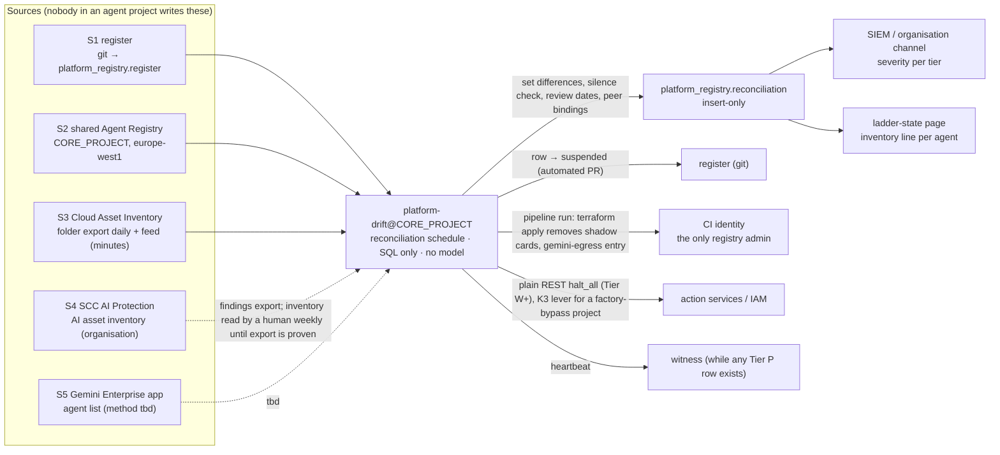
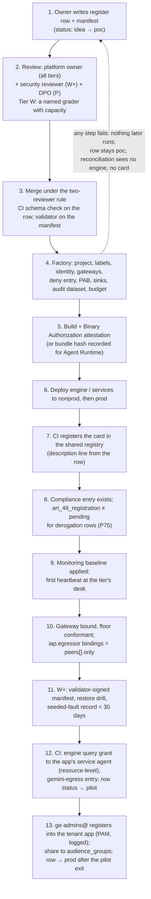

# 5. Agent Registry, governance and the autonomy contract

## Status
- Owner: the platform owner
- Last reviewed: 2026-09-14
- Maturity: detailed design, written 2026-09-13. Nothing is built. Parent:
  [01-hld.md](01-hld.md) §5 (registry and governance), §12 (the autonomy contract), §1 demands
  D1, D4, D5, D6, D9, D11, §11.4 rows "capability ceiling", "re-qualification", "transitive
  capability through peers", §15 boundary B6. Answers the registry, governance and scale findings of
  [00-objective-review.md](00-objective-review.md).
- Promotes [../wall-e/13-agent-interconnection.md](../wall-e/13-agent-interconnection.md) §2
  (the registry), §5.4 and §5.5 (the `agent` principal and taint on receipt) and §9 (the
  enforcement/detection grading) from Wall-E's chapter to platform rules. It references them
  and does not repeat their product research; where a fact was re-verified on 2026-09-13 the
  URL sits next to the claim in §11.
- Standing constraints: as stated once in [01-hld.md § Status](01-hld.md#status).
- Conventions: as stated once in [README.md § Status](README.md#status); this page's controls
  are in §10. Decisions this page makes are numbered P71–P80; the rows of record are in
  [12-open-decisions.md](12-open-decisions.md). The two diagrams are in §6.3 and §7.1.

---

## 0. What this page decides, in one screen

The HLD fixed three sentences and left the mechanisms to this page: the inventory of record
is a git file, not a product (§5.1); the shared Agent Registry is the governed view, reconciled
daily against independent observation (§5.2); and the autonomy ladder becomes four platform
artefacts every Tier W+ agent conforms to (§12). This page turns each sentence into a
mechanism a security reviewer can test and a builder can build, and records the decisions the
HLD left open. They are P71–P80; options, owners, gates and state are held once in
[12-open-decisions.md](12-open-decisions.md#1-how-this-register-works). In digest:

| Area | Decisions | Where |
|---|---|---|
| One shared Agent Registry in `CORE_PROJECT`, no local registries; card metadata carried by the register row, projected into labels and the description's first line | P71, P72 | §2, §3 |
| Reconciliation against independent inventories, and "registered ⇒ feeding the SIEM" as a continuous invariant with the `suspended` status | P73, P74 | §5, §6 |
| The TISAX and EU AI Act registers as CI exports; no `prod` for a derogation row without its Art. 49(2) registration id | P75 | §8 |
| The autonomy contract: versioning, tighten-only defaults, the fleet peer rule, the Tier W verifier and its L4 cap | P76–P79 | §9 |
| Registry read audit (`ADMIN_READ` in `CORE_PROJECT`; configuration in [08 §4.1](08-data-logging-retention-sovereignty.md#41-the-configuration)) | P80 | §4 |

The rule under all of it, lifted from `wall-e/13` §2.5 and unchanged: **registration never
authorises.** A card in the registry lets a peer *find* an agent; reaching it still needs the
resource-level grant, the gateway entry and the access-policy binding.

---

## 1. Vocabulary: four things that are not each other

| Term | What it is | Who writes it | Grade as a control |
|---|---|---|---|
| **The register** | One YAML file per agent under `platform/agentic-platform/register/<agent_id>.yaml`, merged under the two-reviewer rule. The inventory of record (HLD §5.1) | the agent owner proposes; the platform owner approves (plus the security reviewer at Tier W+, the DPO at Tier P) | enforcement at the admission gate (CI refuses what has no row) |
| **The registry** | Google's Agent Registry: one `Service` resource per agent, MCP server or endpoint in a project-level, location-scoped registry; a "central hub for governance and inventory" in Google's words (§11) | the CI identity only, from the register | the governed view; also the *discovery* surface peers resolve through, which is why writes to it are treated like deploys (`wall-e/13` §2.5) |
| **Independent observation** | What Google says exists, gathered by services no agent owner writes: Cloud Asset Inventory over the folder, Security Command Center AI Protection's AI asset inventory over the organisation, the Gemini Enterprise app's agent list | Google | detection; the input to reconciliation |
| **The manifest** | `agent-manifest.yaml` in the agent's repository: what the agent *is allowed to be* — families, ceilings, egress, peers, stores, fingerprint | the agent owner; validated by the platform validator; hashed into the register row | enforcement in the action service and the factory |

A register row without a manifest is a Tier C or Tier R agent (nothing to ceiling). A manifest
without a register row fails CI. A registry entry without either is a shadow agent (§6).

---

## 2. Registry topology

### 2.1 The Google facts the topology rests on (re-verified 2026-09-13, §11)

| Fact | Consequence |
|---|---|
| IAM on Agent Registry is **project-level only**: `roles/agentregistry.admin`, `.editor`, `.viewer`, `.user`; no `getIamPolicy`/`setIamPolicy` on any entry; Google's roles page warns that admin and editor can change tool annotations such as `readOnlyHint` and `destructiveHint` with "unintended and destructive consequences" | A viewer of one registry sees every entry in it; an editor can redirect every consumer of it. The registry must therefore live where **no agent principal and no agent owner holds any role**: `CORE_PROJECT` |
| `roles/agentregistry.viewer` is required to search; `roles/agentregistry.user` creates, updates and deletes skills and skill revisions (`wall-e/13` §2.2 [R5], read 2026-09-09) | Neither is granted to an agent principal (§2.2) |
| What replaces per-entry IAM is a different product: IAM access policies (Unified Access Policies) bind `roles/iap.egressor`, permission `iap.googleapis.com/resources.egressViaIAP`, to an agent principal on a target that is a whole registry, one agent, one MCP server, one endpoint or one skill; allow and deny rules with CEL conditions, `DRY_RUN` and `ENFORCE` modes; enforced by Agent Gateway through IAP, so they govern **only traffic that traverses a gateway** (GA 2026-08-31 per `wall-e/13` [R6], launch stage not re-verified on 2026-09-13). The organisation-policy constraint `constraints/iam.managed.disableAccessPolicyBinding` (singular; "prevents binding V3 access policies to resources" — name re-verified 2026-09-14; `wall-e/13` §2.2 spells it with a trailing `s`) must not be enforced on a project before a binding is created there; `Assumption:` it is enforced by default in the organisation | The registry answers "what exists", the access policy answers "who may reach it": **registered is never authorised**. `iap.egressor` bindings are generated from `peers[]` only (§9.7) |
| Discovery: `gcloud agent-registry agents search --search-string=…` (keyword, prefix and `skillId:` wildcards) or the `agents:search` API; semantic search documented for skills; `gcloud agent-registry agents describe` returns endpoint, skills and metadata. Resolution from ADK: `AgentRegistry(project_id, location).get_remote_a2a_agent(agent_name, auth_scheme=None, auth_credential=None, *, httpx_client=None, continue_uri=None)` builds the `AgentCard` from the stored card for an `A2A_AGENT_CARD` entry and synthesises one from the connection URI otherwise (`get_mcp_toolset`, `get_endpoint` for the other types); with `auth_scheme` omitted it resolves auth from registry bindings and applies default Google credentials only to Google API endpoints — "Calls to a remote A2A agent are not authenticated for you"; Google's guidance is to resolve once at startup (GA; ADK 2.8.0; `wall-e/13` §2.3 [R7] [R23], read 2026-09-09) | Consumers resolve through a committed value and compare against the registry once at startup (§2.2); a card obtained from the registry is treated by ADK as trusted configuration and skips the same-origin check (`wall-e/13` §2.5), which is why registry writes are treated like deploys |
| The registry **stores** the card and serves it to registry consumers through the API and `get_remote_a2a_agent`; it does **not** host a public `/.well-known/agent-card.json` for the agent (GA, verified, `wall-e/13` §2.3 [R3], read 2026-09-09). The public well-known path exists only where the agent itself serves A2A (an ADK `to_a2a` app, [R20]); Agent Runtime serves no public card ([R17], rated likely) | The registry is the only place an Agent Runtime agent's card is published, and only to principals that can search the registry, never to the internet |
| Manual registration is refused in the `eu` and `us` multi-regions; it needs `global` or a single region (`europe-west1` is listed) | The shared registry is regional, `europe-west1`, for residency; `global` is not used (HLD §5.2) |
| Google's own guidance for a governance project: "you must manually register the remote agents in the central governance project's registry", and "automatic registration only discovers resources in the local project" | Cross-project manual registration is the documented pattern, which retires the HLD's `Assumption:` that the registry accepts an engine from another project. The card is a URL and a JSON document; the registry does not check the runtime's project |
| Automatic registration exists for Agent Runtime, Cloud Run (`--functional-type=agent`), GKE (label `registry.gke.io/functional-type: "AGENT"`) and Google's built-in agents, **into the local project only** | Every agent project that has the API enabled would grow its own registry with an uncurated entry — exactly the fragmentation the HLD rejected. See P71 |
| Default quotas: 100 agents, 100 MCP servers, 100 endpoints, 100 bindings, 100 skills **per project** (global and per region); 20 QPS regional; 10 KB per spec | "Hundreds of agents" in one registry project exceeds the default. The quota register (HLD §3.4, P31) gains these rows; a quota increase is requested at 60 % occupancy and sharding is the fallback (P71) |
| The `Service` resource carries `name`, `display_name` (63 chars), `description` (2,048 chars), one of `agent_spec` / `endpoint_spec` / `mcp_server_spec`, `interfaces[]`, output-only `registry_resource`, timestamps — **no `labels`, no `annotations`**; `gcloud agent-registry services create` (GA) has no `--labels` flag | The mandatory metadata cannot be labels on the card. P72 |
| Audit logging: service `agentregistry.googleapis.com`; `CreateService`, `UpdateService`, `DeleteService`, `Create/Update/DeleteBinding`, `Create/Update/DeleteSkill`, `CreateSkillRevision`, `DeleteSkillRevision` are `ADMIN_WRITE` (Admin Activity, always on; each long-running operation writes two entries); `Get*`, `List*`, `Search*`, `FetchAvailableBindings` are `ADMIN_READ` (Data Access, must be enabled) | Every write is alertable without configuration; reads need P80 |
| Terraform: `google_agent_registry_service` and `google_agent_registry_binding` exist; Google's module needs `agentregistry.googleapis.com`, `apphub.googleapis.com` and `storage-api.googleapis.com` enabled and `roles/agentregistry.admin` | The factory registers cards through Terraform state in `CICD_PROJECT`; App Hub is enabled in `CORE_PROJECT` (SCC's MCP-server discovery also requires it, §6.1) |

### 2.2 Options and the decision (P71)

| Option | For | Against |
|---|---|---|
| **(a) One shared registry in `CORE_PROJECT`, `europe-west1`** (the HLD's choice) | One inventory, one viewer grant, one alert query, one Terraform state; the only project where "no agent principal exists" is already a folder rule (HLD §3.1); Google's documented "central governance project" pattern | Per-project quota of 100 per type; every consumer that resolves through the registry needs `roles/agentregistry.viewer` on `CORE_PROJECT` — a project-level role in a core project, which topology decision 48 tolerates only for platform principals |
| (b) One registry per agent project (what `wall-e/13` §2 built for Wall-E) | Matches "no foreign project-level role"; automatic registration works | Hundreds of registries; no cross-project search; a viewer in one sees one; the inventory is a fan-in job over N projects; each agent owner is an editor of their own discovery record, which is the deploy-grant-by-another-name `wall-e/13` §2.5 warns about |
| (c) One registry per tier folder, in a per-tier core project | Bounds the quota; keeps the "no agent principal" property per tier | Five registries to reconcile; the tenant app's `gemini-egress` policy reads five sources |

**Decision P71.** Option (a). Two consequences the HLD did not state:

1. **Agent projects never enable `agentregistry.googleapis.com`.** The tier folders' `gcp.restrictServiceUsage` allow-lists (HLD §3.1) exclude it, so no local registry can exist and automatic same-project registration has nowhere to land. `Assumption:` automatic registration requires the API enabled in the runtime's project — Google's page does not say either way. **Spike at the first factory run in nonprod**: deploy a throwaway engine with the API disabled and assert that no `Service` appears anywhere. If registration lands regardless, the fallback is to read those local entries as a sixth observation source in §6, never as a governed view, and to alert on any local entry that carries a card. **The same spike asserts two more things:** (i) the throwaway engine starts, answers, writes its telemetry and passes through its bound egress gateway with no `498` while `agentregistry.googleapis.com` is disabled in its own project — the `agentregistry` hostnames on [06](06-gateways-model-armor-perimeter.md) §2.2's essential-endpoint list are egress destinations the SDK calls, and the spike proves that calling them does not require the API enabled in the caller's project; (ii) the agent project's egress gateway can evaluate its access policy against destinations registered in `CORE_PROJECT`'s registry. If either fails, P71's consequence 1 cannot be built as written: the fallback is the `GEMINI_PROJECT` pattern — a CI-generated working-set registry in each agent project, derived from the register and never an inventory, with `agentregistry` added to the tier allow-list by a dated row in [12](12-open-decisions.md) that overturns this consequence — and not a silent console enablement.
2. **Quota.** A quota increase for `agentregistry.googleapis.com` in `CORE_PROJECT` is requested when any type reaches 60 % of its limit; Google's quotas page says the allocation quotas "have default values, but you can typically request adjustments" through the console (re-verified 2026-09-13, §11), so the increase is a request, not a certainty. If an increase is refused, option (c) is the recorded fallback, applied per tier folder in the order the tiers fill, with the reconciliation job reading every registry and `gemini-egress`'s policy generated from the register rather than from any registry.

Consumers of the registry: `platform-readers@` (humans), `eve-owners@`, the detection desk's
principal, and the `gemini-egress` policy generator — all `roles/agentregistry.viewer` on
`CORE_PROJECT`, none an agent principal. Agents that need to resolve a peer do it through a
value committed in their own configuration and asserted against the registry at startup
(`wall-e/13` §2.5's "resolve once and compare"), never through a viewer role of their own:
an agent principal with `agentregistry.viewer` on `CORE_PROJECT` is a drift-job finding.

---

## 3. The card: mandatory metadata per tier

### 3.1 Where the metadata lives (P72)

The HLD (§3.4) required the label set "on every project and every registry card". A registry
entry has no labels field (§2.1), so the rule is restated:

| Carrier | What it carries | Who writes it | Who reads it |
|---|---|---|---|
| The register row | everything (§3.2) | owner via pull request | CI, the factory, the reconciliation job, the exports of §8 |
| Project labels — the P38 key set and value alphabet of [02 §3.6](02-landing-zone-and-tiers.md#36-naming-and-the-label-taxonomy-p37-p38) | the projection the HLD already requires; this page writes the `autonomy_ceiling` label as the highest cell, `family-trigger-level` | the factory | Cloud Asset Inventory search, billing export, SCC |
| The registry entry's `description`, **first line** | fixed format: `meta: agent_id=<id> tier=<tier> owner=<group> risk_class=<…> ai_act_class=<…> tisax_class=<…> status=<…> register_sha=<12 hex>` (tier one of `C R W P P-SA X`) — then a blank line, then the human description | the CI identity from the row; `register_sha` is the SHA-256 of the merged row, so "card ≠ row" is one string comparison | the reconciliation job; humans searching the console |
| The A2A card (`agent_spec`, ≤ 10 KB) for agents that serve A2A | what the agent *does* and, in prose, what it does not do (`wall-e/13` §3.2); the exclusions paragraph repeats `ai_act_class` and the Art. 50 disclosure line where the class is `limited_art50` or above | the CI identity from `agent-card.json` in the agent's repository, reviewed like a ceiling | peers, the Gemini Enterprise app |

The registry stays the governed *view*: if the description line and the row disagree, the
row wins and the entry is rewritten by the next CI run; if the entry was rewritten by anyone
but CI, that is a severity-2 write alert (§4) before it is a drift row.

### 3.2 Mandatory fields per tier

`M` mandatory, `O` optional, `—` not applicable, `code` fixed by the schema and not
settable. The CI schema check fails the merge on a missing `M`. Values come from the HLD §5.1
table; this page adds the per-tier column, the `suspended` status (P74), `peers`,
`contract_version` and the registration fields.

| Field | C | R | W | P / P-SA | X | Values / rule |
|---|---|---|---|---|---|---|
| `agent_id` | M | M | M | M | M | `^[a-z][a-z0-9-]{2,30}$`; immutable; the key of every audit row, ladder file, dataset and metric pack |
| `display_name`, `purpose` | M | M | M | M | M | `purpose` is the declared intended purpose, one paragraph, signed (the owner's name in the merge commit) — the EU AI Act Art. 6 anchor |
| `owner_group`, `cost_centre` | M | M | M | M | M | tenant groups; `owner_group` is one of the factory-made `<agent>-owners@` |
| `tier` | M | M | M | M | M | `C R W P P-SA X`; a second row with `tier: P-SA` fails CI while one is not `retired` (HLD §11.3) |
| `env` | — | M | M | M | M | `prod` / `nonprod`; one row per env, same `agent_id`, `nonprod` rows are never published |
| `risk_class` | M | M | M | M | M | the highest `risk_tier` of any family: `READ`, `WRITE_LOW`, `WRITE_HIGH`, `SUPER`; Tier C and R rows are `READ` by construction |
| `autonomy_ceiling` | — | — | M | M | `code: L0` | the highest (family, trigger) ceiling in the manifest, as `family-trigger-level`; must equal what the manifest's `ceilings` block yields |
| `data_classes[]`, `tisax_class` | M | M | M | M | M | organisation scheme (*tbd*, ISMS); `Assumption:` `confidential` default; a `strictly_confidential` row reopens HLD §8.2 and the CMEK stance |
| `ai_act_class`, `ai_act_role` | M | M | M | M | M | `not_ai_system`, `minimal`, `limited_art50`, `annex_iii_adjacent`, `high_risk` (the project label `ai_act_class` carries the same value slugged with hyphens, `annex-iii-adjacent` — [02](02-landing-zone-and-tiers.md) §3.6; one vocabulary, two spellings, both generated); role `provider`, `deployer`, `both`; the legal entity per P23 |
| `art_6_4_assessment` | — | — | O | M if `annex_iii_adjacent` | M | path to the dated Art. 6(4) assessment in [10-eu-ai-act.md](10-eu-ai-act.md) (the anchor per system: `#wall-e`, `#eve`, `#eve-advisor`, `#mo`, `#gemini`, `#platform`); required whenever the row claims the Art. 6(3) derogation |
| `art_49_registration` | — | — | O | M if `annex_iii_adjacent` or `high_risk` | M | the EU database identifier, or `pending` — a row with `pending` cannot carry `status: prod` (P75, §8.2) |
| `model_pin`, `framework_version`, `armor_template`, `gateway_id`, `principal` | `model_pin` only | M | M | M | M | `principal` is the `principal://agents.global.org-ORG_ID.system.id.goog/...` string (HLD §4.2); Tier C has no engine and no gateway |
| `verifier` | `none` | `none` | `platform-verifier` | `eve` | M | Tier W may not name `eve`; Tier P may not name `platform-verifier` (P79) |
| `verifier_owner` | — | — | M | M | M | a group (`eve-owners@` for Eve) whose owner is **outside the administration line of every agent the verifier verifies**; the admission gate refuses a row whose `verifier_owner` equals its `owner_group` or that group's owner (RP-1 of [07](07-monitoring-detection-incident-response.md) §8, P98) |
| `capability_eval_ref` | — | O | O | O | M | a pointer to the model provider's capability-evaluation artefact for the pinned `model_pin` (FSF-derived report or model card); optional below Tier X, required for Tier X ([09](09-supply-chain-secrets-recovery.md) §5.3, P124) |
| `tisax_dp_scope` | O | O | O | O | O | boolean, default `false`; `true` when the row's `purpose` names a customer's or an OEM's data processed on that customer's behalf — the row then cannot reach `status: prod` without a dated DPO entry, and the Data Protection module becomes an assessment objective for that agent's scope ([11](11-tisax.md) §3, P134) |
| `metric_pack` | `light` | `light` | `full` | `full` + `eve-quality` | M | Mo's pack (HLD §13.3) |
| `privilege` | `none` | `none` | `none` | M | `none` | `workspace_role:<name>` or `super_admin`; the `agents.md` `privilege` column; CI fails a second `super_admin` |
| `supplier_rows[]` | M | M | M | M | M | ids in the supplier file (HLD §14.3); the model is always one row |
| `publish_to_gemini`, `audience_groups[]` | M | M | M | M | `code: false` | drives the `gemini-egress` policy and sharing; above Tier C `audience_groups` may not contain the tenant-wide group |
| `peers[]` | — | O | O | O | — | registry entry ids this agent may be bound to as an egressor (§9.7); the only source of `iap.egressor` bindings |
| `grader` | — | — | M | M | — | a named human ≠ playbook owner with declared hours; a Tier W row with no grader with capacity fails the gate (HLD §11.1, P25) |
| `recovery_class` | — | M | M | M | M | HLD §10 |
| `manifest_sha`, `contract_version` | — | — | M | M | M | SHA-256 of the validated manifest; the contract semver it conforms to (§9.1) |
| `review_date` | M | M | M | M | M | ≤ 90 days ahead; expiry removes the share (HLD §5.3) |
| `status` | M | M | M | M | M | `idea` → `poc` → `pilot` → `prod` → `retired`, plus **`suspended`** (reachable from `pilot` or `prod` by the reconciliation job or an incident; leaves only to `prod` by a human pull request or to `retired`) — P74 |

Tier X rows exist only to be refused: the schema pins `autonomy_ceiling: L0` and
`publish_to_gemini: false`, and the folder is empty until HLD §11.5's conditions hold.

---

## 4. Governance policies

Everything in HLD §5.3 stands. The rows below are the registry-specific policies the HLD
named in one line each, now with mechanism, owner and failure mode.

| Policy | Rule | Mechanism | Owner | Verified by | On failure |
|---|---|---|---|---|---|
| **Only CI writes** | `roles/agentregistry.admin` on `CORE_PROJECT` is held by the routine factory identity `factory-apply@CICD_PROJECT` (WIF, no key; P142) and by nobody else standing; the per-agent `<agent>-deployer@` accounts hold no registry role; `roles/agentregistry.editor` is granted to nobody, ever; `roles/agentregistry.user` (skills) to nobody — the platform registers no standalone skills (`wall-e/13` §8 position, unchanged; skills are Preview) | IAM in Terraform; PAM entitlement `roles/agentregistry.admin`, 1 h, security reviewer approves, for "registry repair" only (HLD §4.4) | platform owner | drift job asserts the binding set equals `{factory-apply@CICD_PROJECT}`; SHA custom module flags any other member | any other admin/editor member: severity 2, binding removed by the drift job's remediation PR, incident opened |
| **Every write is seen** | a log-based alert on `protoPayload.serviceName="agentregistry.googleapis.com"` and `methodName` in the `ADMIN_WRITE` set, where the principal is not the CI identity **or** the request carries no `pipeline_run_id` in the CI identity's justification label | Cloud Logging alert in `LOGGING_PROJECT` on the aggregated sink, routed to the organisation channel and the SIEM; query committed in git | platform owner | monthly: a deliberate console edit in nonprod must page within 5 minutes | alert missing in the drill: severity 2 on the monitoring baseline, not on the agent |
| **Reads are logged (P80)** | `ADMIN_READ` Data Access logs for `agentregistry.googleapis.com`, scoped to `CORE_PROJECT` — documented on the product's audit-logging page though absent from Google's general audit-log services list, so unverified until the canary's first run | the `agentregistry` row of the Data Access configuration, [08 §4.1](08-data-logging-retention-sovereignty.md#41-the-configuration) | platform owner | Terraform; drift job; the daily Data Access canary ([08 §4.3](08-data-logging-retention-sovereignty.md#43-the-canary)) reads the registry once and expects its `ADMIN_READ` row | config drift or a missing canary row: severity 3 to the platform owner, re-applied by the pipeline within one business day; the gap window is recorded in the evidence register as "registry reads unlogged" |
| **Cards are generated, never hand-written** | the `Service` content is rendered from the register row and, for A2A agents, from `agent-card.json` in the agent's repository; CI validates the card against the A2A schema and asserts that no skill id names a write, an approval or a control operation (`wall-e/13` §2.5) | CI check owned by the platform repository, not the agent's | platform owner; security reviewer on the check's code | a fixture card with a `suspend` skill must fail CI | a card that passes with a write skill: the check is wrong; block all registrations until fixed |
| **Annotations are ceilings, not hints** | `readOnlyHint`, `destructiveHint` and any tool annotation in an MCP entry are rendered from the manifest's family `risk_tier`; a gateway CEL rule that reads them is redundant with the action service's ceiling, never a substitute | CI renders; the action service does not read the registry at all | platform owner | the action service's policy chain has no registry client (denial-suite row) | a registry client or an annotation read found in an action service: CI fails the deploy; in a running service it is severity 2, the agent's ladder is capped at L3 until a release removes it |
| **Bindings** | registry auth `bindings` and IAM access-policy `iap.egressor` bindings are created only from `peers[]` (§9.7) by CI | Terraform; validator | platform owner | drift job compares live bindings to the union of every manifest's `peers[]` | extra binding: severity 2, removed |
| **Semantic Governance** | never on an authority path. It is Preview and Google's page says "LLMs are probabilistic and can make mistakes. Verdicts may not be accurate." It blocks by removing a proposed tool call from the model response — a *reasoning-layer* control. It may be enabled per gateway as an additional refusal (a `DENY` there is a free refusal, never an approval), and its verdict is never recorded as evidence of anything | gateway policy in Terraform; the audit schema has no column for it by design | platform owner | review of the gateway policy at admission; the audit-schema check refuses a Semantic Governance column | a Semantic Governance verdict cited as evidence or wired into an approval path: the admission gate refuses the row; found after admission it is severity 2 and the gateway policy reverts to the committed one |
| **Quarterly review, privilege review, supplier rule, retirement** | as HLD §5.3 | reconciliation job (review dates), security reviewer, ISMS, the `revoke` factory operation | as named | the ladder-state page lists overdue rows | overdue row: share removed (`gemini-egress` entry dropped, audience groups emptied) until reviewed |

---

## 5. The invariant: registered ⇒ feeding the SIEM

Admission proves the feed once: step 9 of §7.1 refuses an agent whose first heartbeat has not
reached the tier's detection desk within 30 minutes of the baseline apply. After admission the
invariant is continuous (P74): a `pilot` or `prod` row whose heartbeat and, from Tier W, audit
rows fall silent past its tier's silence budget is set `suspended` by the reconciliation job
(§6), loses its share (the `gemini-egress` entry; a console unpublish at Tier C) and, from
Tier W, is halted — and only a human pull
request returns it to `prod`. The statement, the per-tier silence budgets, desks and
severities, the absence policies that fire first, the `source_unavailable` rule and the drill
are defined once in
[07 §4](07-monitoring-detection-incident-response.md#4-registered--feeding-the-siem-the-monitoring-baseline-module-and-admission).

---

## 6. Reconciliation against independent inventories

### 6.1 The sources, and what each is verified to provide

| # | Source | Scope | What it lists | Verified on 2026-09-13 | Read by the job as |
|---|---|---|---|---|---|
| S1 | The register | git | every row | — | a BigQuery table `platform_registry.register` in `CORE_PROJECT`, rewritten by CI on every merge; the merge commit hash is a column |
| S2 | The shared Agent Registry | `CORE_PROJECT`, `europe-west1` | every `Service` with its description line and `registry_resource` | roles, quotas, audit methods (§11) | `ListServices` / `ListAgents` under `roles/agentregistry.viewer`; the `ADMIN_READ` log then shows the job's reads (P80) |
| S3 | Cloud Asset Inventory | folder `fld-agentic-platform` | `aiplatform.googleapis.com/ReasoningEngine` (public in ExportAssets, ListAssets, BatchGetAssetsHistory, QueryAssets, Feed and Search since 2025-11-20, release notes), `run.googleapis.com/Service`, `run.googleapis.com/Job`, `discoveryengine.googleapis.com/Engine`, `discoveryengine.googleapis.com/Assistant`, `discoveryengine.googleapis.com/DataStore` (all on the asset-types page); a folder-scoped BigQuery export exists (content types `RESOURCE`, `IAM_POLICY`, `ORG_POLICY`, `ACCESS_POLICY`, `OS_INVENTORY`, `RELATIONSHIP`; destination dataset may sit in another project via `--billing-project`; **no native schedule**); folder-scoped feeds with an `--asset-types` filter (RE2) and an optional condition publish to Pub/Sub | asset types, export, feeds (§11); **no `agentregistry.googleapis.com` asset type was found on the rendered page** — the registry is not observed through CAI | a daily `gcloud asset export --folder … --content-type=resource --asset-types=…` run by the job into `platform_registry.cai_resources`, plus a feed on the same types into the job's Pub/Sub subscription |
| S4 | SCC AI Protection AI asset inventory | organisation | models, endpoints, data sources, pipelines, **agents**, MCP servers (those "cataloged in Agent Registry", App Hub required), notebooks; Gemini Enterprise and agent search apps; Agent Platform endpoints; findings for over-privileged and inactive Agent Runtime agents; GA; available in SCC Standard, Premium and Enterprise (deprecated) | overview and "Review AI security" pages, both updated 2026-09-09 (§11) | **as a human cross-check, weekly, until export is proven**: whether the AI asset inventory is queryable by API or exportable to BigQuery is *unverified* — neither page says. Findings (over-privileged agent, inactive agent) reach the job through the SCC findings export to BigQuery that HLD §7.1 already sets up |
| S5 | The Gemini Enterprise app's agent list | `GEMINI_PROJECT` | agents registered into the tenant app, no-code agents included | the HLD assumes the job reads it; the Discovery Engine API method that lists an app's agents is *tbd* (not verified on 2026-09-13) | *tbd*; until verified, the nightly export the Gemini Enterprise administrator produces from the console, filed as a CSV in `CORE_PROJECT`'s bucket, with the gap recorded |

### 6.2 The set differences, severities and the action per difference

Run daily at 06:00 Europe/Paris as a full computation, and within 15 minutes of any
S3 feed event as an incremental one. All in SQL over `platform_registry.*`, no model, one
Cloud Run job.

| Difference | Meaning | Severity (C–W / P) | Action, automatic | Action, human |
|---|---|---|---|---|
| S3 ∖ S1 — a `ReasoningEngine`, an agent-shaped Cloud Run service (`--functional-type=agent`, or any service in a tier folder that is not the project's action service or a factory-known component), an `Engine` or an `Assistant` in the folder with no register row | **shadow agent** | 2 / 1 | Tier R+: the engine's project is looked up; if the project has no `agent` label the project is a factory-bypass and the K3 lever for that project (remove `run.invoker` / the query grant) is applied by the job; if it has one, the row is created as `suspended` by an automated pull request | unpublished within one business day (HLD §5.2); root cause on how the factory or the admission gate was bypassed |
| S1 ∖ S3 — a `prod` row with no engine, service or app behind it | retired agent not cleaned up, or a factory failure | 3 / 2 | row `suspended` | `revoke` completed, or the factory re-run |
| S2 ∖ S1 — a registry entry with no row | shadow **card**: someone registered by hand | 2 / 1 | entry deleted by CI (it is not in Terraform state, so `terraform apply` removes it) | the write alert of §4 has already paged; incident |
| S1 ∖ S2 — a `prod` row with no entry | CI failed after the row merged, or someone deleted the entry | 3 / 2 | CI re-registers | — |
| S2 ≠ S1 — description line ≠ row (`register_sha` mismatch), card ≠ `agent-card.json`, `registry_resource` ≠ the row's `principal` project | drift | 3 / 2 | CI rewrites | if the writer was not CI, §4's alert owns it |
| S4 ∖ (S1 ∪ S3) — SCC lists an agent, endpoint or MCP server the folder export does not | an AI asset **outside the folder** (another folder of the organisation, or a project moved), or an MCP server nobody registered | 2 / 2 | none (outside the platform's reach) | platform owner raises with the owning project; the organisation's rule that agents live under `fld-agentic-platform` is policy, not constraint, so this is the row that finds the exception |
| S5 ∖ S1 — a console agent with no row | shadow Tier C agent | 2 | console unpublish requested | builder is asked for a row; second occurrence removes the builder from `ge-builders@` |
| S1 project labels ≠ row | label drift | 3 | factory re-applies | — |
| Row `prod` and silent past the tier's budget (§5) | evidence stopped | per §5 | per §5 | per §5 |
| Row `review_date` < today | overdue | 3 | share removed | owner reviews |
| Row `verifier: platform-verifier` with no seeded-fault run younger than 30 days | verifier unproven | 3 | every L4 cell of that agent demoted to L3 by the ladder API (machines lower) | Mo owner schedules the run |
| Live `iap.egressor` bindings ≠ ∪ `peers[]` | peer-rule drift | 2 / 1 | binding removed by CI | incident |
| A prod engine whose `agentGatewayConfig` names no gateway (the custom constraint should have refused it; this is the check that the constraint is still there) | unbound engine | 2 | `gemini-egress` entry removed; row `suspended` | unpublished within one business day ([06](06-gateways-model-armor-perimeter.md) §2.1) |
| More than one gateway-unbound engine in a nonprod tier folder, or one unbound for more than 30 days (the Agent Platform Threat Detection rotation of [06](06-gateways-model-armor-perimeter.md) §2.4, P82) | rotation rule breached | 2 | page the platform owner | the factory input that opened the window is closed or re-dated |
| A `query` or `asyncQuery` call to an engine by a machine caller in the Agent Runtime request log (the `streamQuery`-only rule of [06](06-gateways-model-armor-perimeter.md) §2.3) | the only enforcement-grade prompt screen bypassed | 3 | — | the caller's CI rule fixed |

Result rows land in `platform_registry.reconciliation` (insert-only, 400-day expiry like the
audit datasets), in the SIEM (all severities), and on the ladder-state page (a per-agent
"inventory" line). The job's own heartbeat goes to the organisation channel and, for as long
as any Tier P row exists, to the witness (HLD §13.2) so that "the reconciliation stopped" is
seen by someone the tenant's super admins do not administer.

**Grade.** No organisation policy can require registration, so this is the shadow-agent
control and it is **detection-grade, stated as such** (HLD §5.2). What makes it enforcement
*adjacent* is that the two things an unregistered engine needs to be useful — an entry in
`gemini-egress`'s access policy and a resource-level query grant — are both generated from the
register, so an unregistered engine is unreachable from the front door by construction, and
`custom.reasoningEngineGatewayRequired` (HLD §3.3) refuses an engine with no gateway at the
API. The shadow agent can exist; it cannot be published or called through the platform.

### 6.3 Who runs it (P73) and the diagram

The job is a second schedule of the **drift job's** Cloud Run job family in `CORE_PROJECT`
(HLD §4.7), under the same principal — `platform-drift@CORE_PROJECT`. Reasons: the drift job
already holds the one folder-level read role the platform tolerates (`roles/iam.securityReviewer`,
the named exception of HLD §18 item 25) and already consumes the folder CAI feed; adding a
second folder-level principal for inventory would be a second exception to D7 for the same
duty ("what exists and who may reach it"). The role set grows by: `roles/cloudasset.viewer`
on the folder (*unverified* name on 2026-09-13 — the CAI export page says only "the correct
role"; verify before the factory run and correct here), `roles/agentregistry.viewer` on
`CORE_PROJECT`, `roles/bigquery.jobUser` and dataset-level `WRITER` on `platform_registry` in
`CORE_PROJECT`, `run.invoker` on each Tier W+ action service's `/v1/control/halt` (a
resource-level binding per project, generated by the factory from the manifest's invoker set —
never a project-level role), and `roles/securitycenter.findingsViewer` at the organisation for
the SCC export it reads (*unverified* role name; *tbd*). It holds no write on any registry
(deletion of a shadow card is done by CI's Terraform apply, triggered by the job through a
pipeline run, so the only registry admin stays CI). The exception record of §18 item 25 is
extended with these roles, dated 2026-09-13.



---

## 7. Admission and revocation

### 7.1 Admission, end to end

The HLD's admission gate (§5.3) is "one CI run". This is the run, with the registry and
contract steps made explicit. Steps 1–3 are human; 4–12 are one pipeline in `CICD_PROJECT`
whose code owners are the platform owner and IT security; 13 is a PAM-elevated human act.



What each step refuses, and who owns the refusal:

| Step | Refuses when | Owner of the check |
|---|---|---|
| 3 | any `M` field of §3.2 missing; a second `P-SA`; `tier: W` with no `grader`; `verifier` wrong for the tier; `autonomy_ceiling` ≠ manifest; `contract_version` unsupported (§9.1) | platform owner (schema in the platform repository) |
| 4 | the project would land outside its tier folder; a label value is missing | factory module |
| 7 | the card names a write, approval or control skill; the card's `supportedInterfaces[].url` is not the engine's or the A2A app's URL; the spec exceeds 10 KB | platform owner (CI check) |
| 8 | `ai_act_class = annex_iii_adjacent` with no `art_6_4_assessment`; `art_49_registration: pending` and the target status is `prod` | DPO / legal (the entry), CI (the check) |
| 9 | no heartbeat within 30 minutes of the baseline apply | platform owner |
| 10 | the engine's `agentGatewayConfig` is absent (the custom constraint refuses at the API first); a binding names a target not in `peers[]` | Google (constraint); validator |
| 11 | the manifest's signature (validator's KMS signature over `manifest_sha`, key in `VALIDATOR_PROJECT`) is missing or stale; no restore drill record; no seeded-fault run | validator custodian |
| 12 | the grant would be project-level (the module only emits resource-level bindings) | factory module |

A pilot exit (`pilot → prod`) is a human pull request with the pilot's scorecard attached
(Mo's light pack for Tier C/R, the full pack for W+); the validator recomputes the numbers.

### 7.2 Revocation and suspension

| Path | Trigger | Steps, in order | Who |
|---|---|---|---|
| **Planned retirement** | owner's pull request `status: retired` | the factory's `revoke` (HLD §2.2): share removed → `gemini-egress` entry removed → engine query grant removed → `halt_all` (W+) → registry entry deleted → evidence export confirmed (audit dataset snapshot to the evidence lake, content bucket lifecycle) → project deletion scheduled (30 days, delete protection lifted by the same run) → TISAX 5.3.3 return-and-removal row written (§8.1) | owner requests; platform owner approves; Tier P is also K3 and needs the security reviewer |
| **Suspension** | reconciliation (§5, §6), an incident, or any operator ("anyone may pull the andon cord", ladder rule R2) | `gemini-egress` entry removed; audience groups emptied; W+: `halt_all`; entry description line `status=suspended`; row `suspended` by automated PR; nothing deleted | machine or any operator; leaving suspension is a human PR |
| **Emergency unpublish** | on-duty admin | HLD §2.2's three levers in speed order: `gemini-egress` policy (seconds, PAM), engine query grant (a minute, CI), console unpublish; then K3, K7 | on-duty admin; recorded as an incident |
| **Fleet** | K7 | HLD §11.4 — the registry is untouched by K7 (it is inventory, not reach), so the inventory survives a fleet stop and tells the recovery what to bring back, in which order (`recovery_class`) | CORE_PROJECT job or a human with the PAM entitlement |

Deleting an agent's project removes the agent and nothing else (D10): the row stays in git as
`retired` with its retirement date, the audit snapshot is in the evidence lake, the registry
entry is gone. The register is therefore also the platform's history of agents — the
"records of processing" and the Art. 18 ten-year record start from it.

---

## 8. Two compliance registers derived from the register

Both are exports CI regenerates on every merge; neither is edited by hand; both are what the
assessor and the authority are shown. The register is the single source so the two never
disagree with each other or with what runs.

### 8.1 The TISAX agent register (ISA 1.3.1, 1.3.2, 5.3.3)

What the ISA asks for (ENX: ISA 6.0.3 applies to assessments ordered after 2024-04-01 and
before 2027-01-01; ISA2027 to assessments ordered in 2027 onward — §11): an asset inventory
with assigned ownership and review records (1.3.1); a classification scheme with
confidentiality as the minimum axis, applied to each asset, with handling rules per level
(1.3.2); return and removal of assets at the end of use (5.3.3, HLD §14.2).

Export `register/export/tisax-asset-register.md` and BigQuery view
`platform_registry.tisax_assets`, one row per register row per environment:

| Column | From | ISA use |
|---|---|---|
| asset id, name, description | `agent_id`, `display_name`, `purpose` | 1.3.1 |
| asset owner, custodian | `owner_group`; the platform owner as custodian of the folder baseline | 1.3.1 |
| classification, protection need | `tisax_class`, `data_classes[]`; `Assumption:` protection need derived by the ISMS's mapping from class | 1.3.2 |
| location | `europe-west1`, the app location `eu`, the folder; the residency exceptions of HLD §8.2 by id | 1.3.2 handling; 7.1.2 transfers |
| suppliers | `supplier_rows[]` → supplier file rows | 1.3.3 / 6.1.1 |
| privilege | `privilege` (the super-admin deviation row points here) | 4.2.1 |
| evidence stores | manifest `stores` → the retention schedule rows (HLD §7.5) | 5.2.4 |
| last review, next review, reviewer | merge history of the row, `review_date` | 1.3.1 review record |
| retirement date, removal record | the `revoke` run id and the evidence-export confirmation | 5.3.3 |

Owner: platform owner produces; ISMS owns the scheme and signs the mapping page. Verified by:
the assessor reads the export against a sample of live projects — which is exactly what the
reconciliation job does every day, so its zero-difference report of the day is attached.
Fails: an assessor who finds an asset not in the export has found a shadow agent; the finding
is the platform's, not the ISMS's.

### 8.2 EU AI Act registration (Art. 6(4), Art. 49, Art. 71) — P75

The gate rests on two articles: a provider that concludes under Art. 6(3) that an Annex III
system is not high-risk documents that assessment under Art. 6(4) (profiling of natural persons
removes the derogation) and, under Art. 49(2), registers itself and the system in the
Commission's Art. 71 EU database — public for Art. 49 entries — before putting it into service.
Art. 49(3) deployer registration binds public authorities only (`Assumption:` private
organisation, HLD §14.1 Art. 27 row). The dates, the Digital Omnibus deferral of Annex III
obligations to 2027-12-02 and what remains unverified are held in
[10 §1](10-eu-ai-act.md#1-the-regulatory-state-on-2026-09-13).

The rule, enforced at step 8 of admission and by the reconciliation job afterwards:

| `ai_act_class` | Before `status: prod` the row must carry | Who supplies it | CI refuses when |
|---|---|---|---|
| `not_ai_system` | the dated determination in [10-eu-ai-act.md](10-eu-ai-act.md) (rules solely defined by humans; e.g. Eve's control path, `#eve`) | legal, DPO | no entry |
| `minimal` | the entry | legal | no entry |
| `limited_art50` | the entry, and the manifest's Art. 50 disclosure block (fixed line injected by the action service, never by the model — HLD §14.1) | legal; the agent owner for the block | no block |
| `annex_iii_adjacent` (derogation claimed) | `art_6_4_assessment` (dated, signed, the four-condition reasoning, the profiling negative), **`art_49_registration` = the EU database id** | legal writes; the provider entity of P23 registers | `pending` |
| `high_risk` | the Annex VI internal-control record, the EU declaration, `art_49_registration`; mandatory from 2027-12-02, adopted voluntarily before | legal, ISMS, the provider entity | `pending`, or missing records after 2027-12-02 |

Export `register/export/ai-act-register.md`: one row per agent with class, role, entity,
purpose and `purpose_sha256`, the Art. 6(3) condition relied on (`art_6_3_condition`),
registration id, the log store designated as the Art. 12 log (`<agent_id>_audit`),
the oversight owner (`owner_group`'s operator role) and the oversight level cap
(`oversight_cap`), the Art. 50 position, the review date — the columns
[10-eu-ai-act.md](10-eu-ai-act.md) requires. This is the registry export listing every agent
with its classification id. For Wall-E on 2026-09-13 the row reads
`annex_iii_adjacent`, derogation claimed, `art_49_registration: pending`, which is why Wall-E
cannot reach `prod` — and therefore cannot write — before the registration exists (HLD §14.1:
"Art. 49(2) registration before first write"). Owner: legal for the classification, the
platform owner for the export, the DPO for the record of processing that references it.
Fails: a class change on a `prod` row (legal reclassifies) sets the row `suspended` until the
new class's requirements are met; a registration id that stops resolving is a quarterly
review item, not an automated check (the EU database has no API the platform reads;
*unverified*).

---

## 9. The autonomy contract as a platform primitive

### 9.1 Four artefacts, one version (P76)

| Artefact | Lives in | Written by | Validated by | Consumed by |
|---|---|---|---|---|
| `agent-manifest.yaml` | the agent's repository, `contract/` | the agent owner | the platform validator (schema, monotonicity, cross-checks) | the factory, the action service's ceiling module (compiled), the verifier, Mo, the register (hash) |
| `ladder.yaml` on `ladder.schema` | the agent's repository, `config/` | the agent owner; Mo proposes; Eve or a breaker lowers through the ladder API, paperwork follows | the validator: every cell ≤ the manifest ceiling ≤ the platform default; dwell, ratchet, evidence | the action service at deploy of a config version |
| `<agent_id>_audit` on `audit.schema` | BigQuery, the agent's project, EU | the action service, write-ahead, insert-only | the schema check at factory time; Mo's assertion queries; Eve's reconciliation | Eve, Mo, the validator, the reconciliation job |
| the platform validator | `VALIDATOR_PROJECT`, one for the platform, image by digest | the platform (security reviewer owns; CI runs) | golden fixtures per contract version | every promotion, every manifest change, every Mo proposal |

`contract_version` is a semantic version carried in every one of the four: `major` changes a
required field or a column's meaning, `minor` adds optional fields or columns, `patch` fixes
wording. The validator, the audit schema check and the factory accept **N and N−1 major** for
90 days after N ships; a manifest on N−2 fails the gate and its `prod` row is `suspended` at
the end of the window. A contract change is a pull request to the platform repository with the
platform owner and the security reviewer as required reviewers, a migration note per agent,
and — because the audit schema is insert-only — additive column changes only; a removed column
is deprecated for one major and never dropped from existing tables. Schema files:
`platform/agentic-platform/contract/<version>/{manifest.schema.json, ladder.schema.json,
audit.schema.json}`.

### 9.2 `agent-manifest.yaml` — the schema, as an example that validates

The HLD §12.2 field list, made concrete. Comments state the validation rule. Values are a
read-then-write agent at Tier W, not Wall-E; Wall-E's manifest is written in its own set
(HLD §18 item 10).

```yaml
contract_version: "1.0.0"          # must be a version the validator supports (N or N-1 major)
identity:
  agent_id: mailbox-steward        # ^[a-z][a-z0-9-]{2,30}$ ; equals the register row's agent_id
  tier: W                          # C R W P P-SA X ; equals the row ; W+ requires families with a write
  owner_group: mailbox-steward-owners@   # a factory-made group of the tenant
  env: prod                        # one manifest per env ; nonprod carries the same ceilings
  principal: "principal://agents.global.org-ORG_ID.system.id.goog/resources/aiplatform/projects/N/locations/europe-west1/reasoningEngines/ID"
families:
  - id: F1
    description: reads of directory and mailbox settings
    risk_tier: READ                # READ | WRITE_LOW | WRITE_HIGH | SUPER | WRITE_GENERIC
    reversible: true
    inverse: none
    pre_state: none                # none | snapshot | predicate:<type> ; a write needs snapshot or predicate
    taint_fields: []
  - id: F3
    description: group membership add/remove, class low
    risk_tier: WRITE_LOW
    reversible: true               # a write with reversible:false is capped by the platform default table
    inverse: group.member.remove   # required when reversible:true ; must be an operation of the same family
    pre_state: predicate:membership_absent
    taint_fields: [member_email, group_email]   # fields that mark the run tainted when attacker-writable
trigger_classes:                   # exactly T0..T3 ; names and numbers fixed by the schema
  - {id: T0, name: chat}
  - {id: T1, name: scheduled}
  - {id: T2, name: event}
  - {id: T3, name: inbox}          # proposals only, permanently ; code: true
ceilings:                          # permanent maxima per (family, trigger) ; config may only sit at or below
  F1: {T0: L5, T1: L5, T2: L5, T3: L5, agent: L5}
  F3: {T0: L4, T1: L4, T2: L3, T3: L2, agent: L0}   # each cell <= the platform default for the tier/reversibility
  # rows the schema fixes and the validator refuses to see edited (code: true):
  #   any family with risk_tier SUPER:         T0 (chat) L3 two-person, every other trigger L0,
  #                                            the agent column L0; never in a playbook (HLD §12.1, §13.1 item 9)
  #   any family with risk_tier WRITE_GENERIC: T0 L3, every other trigger L0
  #   the agent column:                        L5 for READ families, L0 for every other family
protected_principals:              # ids the agent may never target ; the platform appends its own
  - mailbox-steward-owners@
  - mailbox-steward-operators@
  # platform-appended at validation, not editable: eve@, the control groups, the robot accounts, every *-owners@
hard_denied:                       # operations refused in every lane, before the ladder is consulted
  - users.makeAdmin
  - any operation whose target is a super admin
egress:                            # the only hostnames the egress gateway may allow ; Tier R read tools go over MCP through
  - admin.googleapis.com           # the egress gateway by default (P88) — a REST read API here needs a supplier row and a reason
  - gmail.googleapis.com
capabilities:
  code_execution: false            # the only value the validator accepts outside Tier X (P121) ; true fails the admission gate
peers: []                          # registry entry ids this agent may be bound to as an egressor (iap.egressor) ; empty = none
invokers:                          # principals allowed on /v1/control/* ; plain REST ; never an agent principal
  halt: [eve-controller@EVE_PROJECT, platform-drift@CORE_PROJECT]
  approve: [platform-verifier@VERIFIER_PROJECT]
stores:                            # one entry per store ; class from the five platform data classes of 08 §2.1
  - {name: mailbox_steward_audit, kind: bigquery, class: evidence, retention_row: R1}   # on audit.schema ; insert-only ; READER to Mo T0 and the validator, recorded by the factory
  - {name: mailbox-steward-content-logs, kind: log_bucket, class: content, retention_row: R6}
  - {name: mailbox-steward-firestore, kind: firestore, class: control, retention_row: R10}
data_classes: [evidence, content, control]   # the classes the stores above use (08 §2.1) ; the project label data_class carries the highest
recovery_class: R-B                # HLD §10 ; the factory refuses a stores[] entry without a class
compliance:
  ai_act_entry: 10-eu-ai-act.md#mailbox-steward
  ai_act_class: minimal
  purpose_sha256: "…"              # SHA-256 of the intended-purpose paragraph ; CI compares it to the register row, the card and the description (P125)
  art_50:                          # required for limited_art50 and above (P128)
    template_ids: [notify-v3]
    header_value: "…"              # the fixed custom mail header value, committed beside the templates
    text_sha256: "…"               # hash of the committed disclosure text
  tisax_class: confidential        # the organisation-scheme mapping (08 §2.1) ; not one of the five platform classes
  register_row: register/mailbox-steward.yaml
  input_data_relevance:            # Art. 10 / 26(4) statement per trigger feed
    T1: "directory reads of the agent's own scope; no HR feed"
    T2: "Workspace admin audit events; no natural-person profiling"
fingerprint:                       # any change resets every cell above L3 (D9)
  prompt_sha256: "…"
  model_pin: gemini-x.y-…          # the exact pinned model id
  framework_version: adk-2.8.0
  armor_template_version: "3"
verifier: platform-verifier        # none | platform-verifier | eve ; must match the tier (P79)
metric_pack: full
```

Validation rules beyond the schema, all in the one validator:

| Rule | Refuses |
|---|---|
| Ceilings ≤ platform defaults for (risk tier, reversibility, trigger) — the table in §9.5 | any cell above the default; any `code: true` row present with a different value |
| `agent` column exactly L5 for READ, L0 otherwise | any other value |
| A family with `reversible: true` names an `inverse` in the same family; `reversible: false` families cannot exceed the irreversible row of the default table | — |
| `pre_state ≠ none` for every write family | a write family with no pre-state capture |
| `protected_principals` ⊇ the platform's appended set; `hard_denied` ⊇ the platform's fleet list (self-targeting, the control groups, `users.makeAdmin`, any Super Admin assignment, DWD) | a manifest that removes a platform entry |
| `egress` ⊆ the tier's allowed API set (Tier R: read-only APIs only) | a Tier R manifest naming a write-capable API |
| `peers[]` ⊆ registry entries whose row is `prod` and whose tier ≤ this agent's tier + 1 | a Tier R agent peering to a Tier P agent's endpoint |
| `invokers.*` contain no agent principal, no group, only service accounts of `EVE_PROJECT`, `VERIFIER_PROJECT`, `CORE_PROJECT` or the agent's own operators' surface | an agent principal on any control endpoint (D12) |
| `verifier` per tier: R → `none`; W → `platform-verifier`; P → `eve`; X → refused | mismatch |
| `fingerprint` complete; a change versus the last validated manifest emits `requalify: true` for every cell above L3 | missing tuple member |
| `manifest_sha` in the register row equals this file's hash after validation | stale row |

The validator signs the validated manifest's hash with a KMS key in `VALIDATOR_PROJECT`; the
action service's ceiling module is compiled from that signed artefact by CI and refuses to
start on a signature mismatch (the existing `ceilings_sha` mechanism of
`wall-e/ARCHITECTURE.md` §8.3, generalised).

### 9.3 `ladder.schema`, keyed on `agent_id`

```yaml
contract_version: "1.0.0"
agent_id: mailbox-steward
config_version: 17                 # monotone ; stamped on every audit row
ceilings_sha: "…"                  # the compiled ceiling artefact this config was validated against
cells:
  - {family: F3, trigger: T1, level: L3, hold_minutes: null, notify: per_run}
  - {family: F3, trigger: T2, level: L2, hold_minutes: null, notify: per_step}
  # a cell absent from the file is L0 ; a cell above its ceiling fails CI ; no cell for trigger `agent` may exist (code)
overrides: []                      # incident-scoped lowerings written by the ladder API, never by a PR
decision_record: decisions/2026-10-01-mailbox-steward-F3-T1-L3.md   # required for any raise
evidence:                          # required for any raise above L2 ; recomputed by the validator
  graded_items: 41
  wilson_lower_95: 0.912
  window: {from: 2026-09-01, to: 2026-09-28}
  dwell_days_at_previous_level: 15
```

Two API surfaces exist per action service and are not in the file: `POST /v1/ladder/lower`
(any operator, Eve, a breaker, the reconciliation job — one call, paperwork follows) and the
deploy tool that applies a merged `ladder.yaml` (CI only). There is no raise API.

### 9.4 `audit.schema`, keyed on `agent_id`

Tables, all insert-only, partitioned by day, in `<agent_id>_audit`: `actions`, `runs`,
`plans`, `approvals`, `verifications`, `config_versions`, `ladder_events`, `grades`. The
`actions` columns the contract owns (the `p_` namespace; an agent extends with `a_` columns
and never redefines a `p_` one):

| Column | Type | Rule |
|---|---|---|
| `contract_version`, `agent_id`, `env` | string | constant per table |
| `ts`, `run_id`, `invocation_id`, `trace_id`, `plan_id` | timestamp, string | the correlation contract (HLD §7.4); `trace_id` is the Cloud Trace id |
| `principal_type` | enum `human job event inbox agent eve breaker platform` | `agent` is set from the verified caller identity, never from the request body |
| `principal_surrogate`, `on_behalf_of_surrogate` | string | HMAC surrogates; the mapping lives in one private table with one writer (Mo's `walle_metrics_private` pattern) |
| `trigger_class` | enum `T0 T1 T2 T3` | plus the `agent` ceiling column applies when `principal_type = agent` |
| `family`, `operation`, `risk_tier` | string, enum | from the manifest |
| `request_hash` | string | RFC 8785 canonical JSON, SHA-256 |
| `decision` | enum `ok shadow proposal approval_required pending_eve denied drift skipped heartbeat` | `heartbeat` rows carry no operation and feed §5 |
| `denial_reason` | string | platform vocabulary `p:<reason>` (`level_off`, `level_no_execute`, `actor_not_authorised`, `protected_principal`, `hard_denied`, `tainted_ceiling`, `halted`, `fingerprint_requalify`, `profiling_boundary_denied` (P126), `disclosure_missing` (P128), …) or agent extension `a:<reason>` |
| `level`, `config_version`, `ceilings_sha` | string, int, string | what governed the decision |
| `fp_prompt_sha256`, `fp_model_pin`, `fp_framework_version`, `fp_armor_template_version` | string | the fingerprint tuple |
| `pre_state_hash`, `post_state_hash`, `verification` | string, enum `verified verified_partial drift not_verified` | rule R6 of the ladder |
| `approval_id`, `approver_surrogates` | string, array | two entries for a two-person decision |
| `tainted`, `halt_epoch`, `override_epoch` | bool, int, int | the taint bit; the epochs the action service was in |
| `armor_findings` | record | Model Armor result summary |
| `ws_insert_ids` | array | the Workspace audit `insertId`s the write produced, for Eve's reconciliation |
| `cost_micros`, `latency_ms`, `error_class` | int, int, string | Mo's light pack |

Dataset-level `READER` to `mo-metrics@MO_PROJECT` and to the validator custodian, and to the
agent's verifier, are made by the factory and recorded in the topology; no authorised view is
ever authorised outside the agent's project on these tables (`wall-e/ARCHITECTURE.md` §9
rule, generalised).

### 9.5 Platform defaults an agent may only tighten (P77)

"Tighten" has one meaning per parameter, and the validator checks it as a monotone comparison:
a lower level, a longer dwell, a higher lower bound, a larger sample, a more severe response,
a shorter TTL. Loosening below a default is not a manifest change; it is a change to this
table, a platform decision with the security reviewer's signature. The numbers are the Wall-E
set's, adopted fleet-wide without change (`wall-e/05` §1, §4, §6; decision 33 and challenge
C18 for the interval gate):

| Parameter | Platform default | Tighten means | Source |
|---|---|---|---|
| Ceilings by (risk tier, reversibility, trigger) | `wall-e/05` §4's table: READ L5 everywhere; WRITE_LOW reversible L5/L5/L4/L2; WRITE_LOW irreversible L5 templated or L3 free text / L4 templated / L4 templated / L2; WRITE_HIGH reversible L3/L4/L4/L0; WRITE_HIGH irreversible L3/L2/L2/L0; external recipients L3/L2/L2/L0 | lower | `wall-e/05` §4 |
| Permanent statements | `WRITE_HIGH` never L5; T3 never produces a write; free-text outbound never autonomous; `SUPER` L3 two-person on `chat`, L0 elsewhere, never in a playbook; `WRITE_GENERIC` L3 on `chat`, L0 elsewhere — the rows and statements of [wall-e/05 §4](../wall-e/05-autonomy-ladder.md#4-ceilings-that-are-code-not-config) | — (code) | HLD §12.1, §13.1 item 9 |
| The `agent` column | READ L5, every write L0 | — (code) | `wall-e/13` §5.4, HLD §12.1 |
| One notch, one family, on evidence; no skipping above L3 | R3 | — | `wall-e/05` §1 |
| Dwell | L1→L2 2 weeks, L2→L3 2 weeks, L3→L4 4 weeks, L4→L5 6 weeks; the clock restarts after a demotion | longer | `wall-e/05` §6 |
| Ratchet | after an automatic demotion: ≥ 5 business days at the lower level, a written root cause, a fresh decision record | longer / more | `wall-e/05` §6 |
| Interval gate | default: promote at a Wilson 95 % lower bound ≥ 0.90 over ≥ 35 graded items per (family, trigger); demote one level at a 95 % upper bound < 0.95; `unsure` excluded from the ratio and reported separately. The gate's full form (blocks, conservative ratio, `unsure` cap) is [mo/03 §4](../mo/03-metrics-contract.md#4-the-gates) | higher bound, larger n | `wall-e/09` decision 33; `wall-e/14` C18; mo/03 §4 |
| Blind sample | `max(10 %, 5/week)` per family; 20 % double-graded for `WRITE_HIGH`; grader ≠ playbook owner | larger | `wall-e/14` C16–C18; HLD §11.1 |
| Severity table | the table of [wall-e/05 §9](../wall-e/05-autonomy-ladder.md#9-severity-and-automatic-response) (a wrong autonomous write: family → L0, zero error budget; an overturned verifier approval: severity 2, the verifier's authority for the family drops to advisory), with the platform's detection severities in [07 §6](07-monitoring-detection-incident-response.md#6-the-detection-catalogue) | more severe | `wall-e/05` §9; `wall-e/04`; 07 §6 |
| Approval TTL (L3) | 4 business hours, then `skipped` | shorter | `wall-e/05` §2 |
| L4 hold window | *tbd* minutes, ≥ the operator veto latency measured in the drill | longer | `wall-e/05` §2 |
| Fingerprint change | every cell above L3 resets to L3 | lower reset level | HLD D9 |
| Two named humans for any L4/L5 raise; the second not the agent owner | — | more reviewers | `wall-e/05` §6 |

### 9.6 The one platform validator

Where: `VALIDATOR_PROJECT` under `fld-platform-core`, owned by the security reviewer, run by
CI as a required check, deployed by image digest (Mo's set already fixes this shape;
`mo/01` "The validator's recompute check"). What it holds: dataset-level `READER` on every
agent's audit dataset and on `eve_quality` (P30 as recommended), `roles/bigquery.jobUser` in
its own project, a KMS signing key for validated manifests — and **no binding of any kind in
any agent project, in `MO_PROJECT` or in `EVE_PROJECT`** beyond those readers. What it does,
and refuses by default:

| Input | Checks | Refuses when |
|---|---|---|
| a manifest | §9.2's rules; `contract_version`; the fingerprint diff | any rule fails; a `code: true` row differs; a ceiling widened without a platform decision id in the commit trailer |
| a `ladder.yaml` change | every cell ≤ ceiling; dwell and ratchet against `ladder_events`; the decision record exists and names the cell; two distinct authenticated reviewers; the evidence block re-executed at its pinned commit against `<agent_id>_audit` (never against anything Mo wrote); the blind sample re-drawn from the published seed; the ≤ 24 h metrics watermark; no Eve loosening within 30 days of a promote on the same cell (HLD §13.3); for any raise above L3, a restore-drill record younger than one quarter with no open reconcile discrepancy (RC-4 of [09](09-supply-chain-secrets-recovery.md) §3.8, P120) | any number differs; any gate unmet |
| a Mo proposal bundle | path allow-list (`config/ladder.yaml`, playbooks, prompts, catalogue rows, the ladder-state page); the narrative stripped before validation; the recompute | a diff outside the allow-list — rejected at ingestion, before CI |
| a `peers[]` or `invokers` change | §9.7 | — |
| a register row | `manifest_sha` matches; `autonomy_ceiling` matches; per-tier fields | mismatch |

Owner: security reviewer (the validator custodian role, HLD §0.3 — not Mo's CI operator).
Verified by: golden fixtures per metric pack and per contract version, run on every validator
build; a monthly "poisoned bundle" drill in which a proposal with a forged number must be
refused, recorded in the evidence bucket. Fails: the validator is **fail-closed for raises
and irrelevant for lowering** — an outage blocks every promotion and every manifest merge
platform-wide, and blocks nothing on the lower path, which is an API call with no validator in
it. A validator that starts *agreeing* with Mo (the pressure `mo/01` names) is caught by the
fixtures and by the rule that its code owners are outside `MO_PROJECT`'s owner line.

### 9.7 The fleet-wide peer rule (P78)

The rule, from `wall-e/13` §5.4–5.5 and HLD §12.1, now a schema fact and a generated binding:

| Element | Mechanism | Grade |
|---|---|---|
| Any caller over an agent protocol (A2A, MCP, a `RemoteA2aAgent`, an ingress-gateway route from another engine) is **principal type `agent`** in the execute request, with `id` equal to the verified caller identity from the gateway's authenticated context — never from the request body | the action service's principal block; the ingress gateway asserts the caller's agent identity; the ceiling module's `agent` column | enforcement |
| **L5 for READ, L0 for every write**, stamped into `ceilings_sha` like every other column; policy step "actor authorisation" denies any write from an `agent` principal with `p:actor_not_authorised` before the ladder is consulted | schema row `code: true`; the validator refuses any manifest that sets it otherwise; there is no `ladder.yaml` cell for the `agent` trigger | enforcement |
| **Tainted on receipt**: a run opened by an `agent` principal is `tainted = true` from its first token; a reply received from a peer is data — never evidence, never an input to a signature, never a reason to raise anything | `tainted` set at run open; the verifier's approval path reads plans from `GET /v1/plans/{id}` and its own reads, never from any A2A reply; ADK's fencing of `RemoteA2aAgent` replies is a courtesy, the taint bit is the control | enforcement |
| **Egressor bindings limited to manifest-named entries**: every `roles/iap.egressor` binding (permission `iap.googleapis.com/resources.egressViaIAP`) on a registry target — a whole registry, one agent, one MCP server, one endpoint or one skill — is generated from `peers[]`; a whole-registry target is refused (it would be "any peer"); bindings are created in `DRY_RUN` first (decisions logged to Cloud Audit Logs without blocking) and switched to `ENFORCE` after 30 days with zero unexpected denials | Terraform from the manifests; the validator refuses a binding not in the union of `peers[]`; the drift job compares live policy to that union daily (§6.2) | enforcement for reach (the gateway refuses), detection for drift |
| The constraint `constraints/iam.managed.disableAccessPolicyBinding` must be *not enforced* on a project before a binding can be made (Google's constraints page, verified; `wall-e/13` §2.2 writes the name in the plural — the singular is the documented one) | a factory input per project with a named reason (HLD §3.2 already lists it) | — |
| Transitive reach: an agent's reach is the union of what its peers do for it | because every peer applies the same L0-for-writes rule, no chain of agents can turn a read agent into a writer; the only write path is a human principal at the head of the chain, on the writer's own T0 ceiling | enforcement, by induction over the fleet |

Owner: platform owner (schema, generator); the security reviewer reviews every `peers[]`
change. Verified: a denial-suite row per Tier W+ agent — a synthetic peer call requesting a
write must return `p:actor_not_authorised` with `tainted = true` in the audit row; a
synthetic binding to an unlisted target must fail CI. Fails: an agent found holding an
egressor binding to an unlisted target is `suspended` (§7.2) and the binding removed.

### 9.8 How Eve and Mo generalise to the contract — and what the second-implementation property loses (P79)

Eve, as designed for Wall-E, is a **hand-written second implementation** of the typed
predicates and an independently compiled ceiling table, at six engineer-days
(`eve/01` §Cost, structural choice 4: "a second implementation, not a second author"). Its
value is that a bug in Wall-E's predicate code does not reproduce in Eve's. Its limit,
already written in `eve/01`, is that both were written from the same specification by the
same person, so a wrong specification is wrong twice.

The **platform verifier** for Tier W (HLD §12.4) compiles its predicates *from the manifest*
— the same manifest the agent's action service is compiled from. What this keeps and what it
loses, stated without softening:

| Property | Hand-written Eve (Tier P) | Platform verifier (Tier W) |
|---|---|---|
| Catches a code bug in the action service's predicate, ceiling module, hash computation or level logic | yes — independent code | yes — the verifier's code is the platform's, not the agent's |
| Catches config tampering, a forged approval, replay, a widened ceiling, a stale `ceilings_sha` | yes | yes |
| Catches a wrong **specification** — a family mis-tiered, a wrong inverse, a `pre_state: none` on a write, a missing taint field, a wrong trigger class | only through the blind human sample (`eve/01` choice 4) | **no** — the verifier believes the manifest; the manifest is the spec |
| Catches a wrong operation *implementation* whose post-state matches its own wrong plan | verification by re-reading with Eve's own credential catches state drift; not a consistently wrong plan | the same, with the verifier's own read credential (Tier W verifiers read with a read-only service account per agent, made by the factory) |
| Independence from the agent owner | structural (own project, own key, own credential; the owner cannot edit `eve/config` alone) | structural for code and key (the verifier is platform code in `VERIFIER_PROJECT`); **not** for the spec (the agent owner writes the manifest) |
| Cost per agent | six engineer-days of predicates plus the rest of Eve | zero marginal predicate work |

So the weakening is precise: **for Tier W, the verifier is a second implementation of the
platform's code around the agent's spec, not a second author of the spec.** It is accepted for
Tier W with four mandatory compensations and one cap, all checked at admission (§7.1 step 11)
and by the reconciliation job (§6.2):

1. **Manifest review as a spec review.** The security reviewer signs a per-family checklist at
   admission and on every family change: risk tier justified, reversibility and inverse
   correct, pre-state type adequate, taint fields complete, trigger classes complete. The
   signature is a commit trailer the validator requires on any change under `families[]`.
2. **The blind human sample**, by a named grader who is not the playbook owner, at the
   platform default rate — the one check that catches a wrong spec, as `eve/01` already says.
   No grader with capacity, no Tier W agent (P25).
3. **Seeded faults.** Monthly and on every manifest change, the platform runs a seeded-fault
   suite through the verifier (a mis-tiered family, a missing inverse, a tainted run asking for
   a write, a forged approval) and records the verdicts; a verifier that passes a seeded fault
   demotes every L4 cell of that agent to L3 until fixed.
4. **Differential test in the agent's own CI**: the action service's compiled predicate and
   the verifier's compiled predicate are run on the same fixture set; divergence fails the
   build. This catches compiler and platform bugs, not spec errors, and is named as such.

**The cap.** A Tier W cell may sit at **L4 only while a seeded-fault record younger than 30
days exists** for that agent (§6.2's row). Without it the verifier's approval is not accepted
and the cell is effectively L3 — a human. Tier P keeps the hand-written Eve, the reason Tier P
stays rare (HLD §12.4); Tier X has no verifier at any level and every cell at L0.

**Mo generalises without loss.** Mo reads `audit.schema`, so every conforming agent gets a
scorecard keyed on `agent_id`, in the pack its tier names
([mo/03 §7.1](../mo/03-metrics-contract.md#71-the-metric-pack-per-tier)): light for Tier C/R with
no grading hour, full with blind grading for W+, plus the Eve-quality pack for P. Mo's outputs stay proposals in a drop box, ingested by a CI
bot that is not Mo, validated by the custodian, merged by two humans. One `MO_PROJECT` per
platform; per-agent metric packs; the Tier W cap by grading capacity (P25) is the only
scaling limit this page adds nothing to.

---

## 10. Every control on this page

| Control | Owner (role) | Resource | Verified by | On failure | Grade |
|---|---|---|---|---|---|
| Register row before existence (D1) | platform owner | CI schema check, factory precondition | fixture without a row must fail the factory | factory refuses; reconciliation flags | enforcement |
| Shared registry, CI-only admin (P71) | platform owner | IAM on `CORE_PROJECT` | drift job; SHA custom module | binding removed; severity 2 | enforcement |
| No local registries (`agentregistry` API disabled in tier folders) | platform owner | `gcp.restrictServiceUsage` per tier folder | nonprod spike; drift job | local entry read as observation, alerted | enforcement (constraint) — pending the spike |
| Registry write alert | platform owner | Cloud Logging alert on the aggregated sink | monthly console-edit drill | severity 2 on the baseline | detection |
| Registry `ADMIN_READ` logs (P80) | platform owner | folder Data Access config | Terraform drift; daily Data Access canary | severity 3; pipeline re-applies; gap recorded in the evidence register | detection |
| Card generated, write-skill check | platform owner; security reviewer on the check | platform-repo CI | fixture with a write skill fails | registrations blocked | enforcement |
| Metadata carrier: row → labels + description line (P72) | platform owner | factory, CI | reconciliation `register_sha` compare | CI rewrites; severity 3 | detection |
| Registered ⇒ feeding, continuous (P73/P74) | platform owner; MDR partner for Tier P content | reconciliation schedule; absence policies | monthly sink-break drill | row `suspended`, egress removed, halt (W+), severity per tier | detection with an absence alarm |
| Reconciliation over S1–S5 | platform owner | `platform-drift@CORE_PROJECT`, `platform_registry.*` | daily zero-difference report; witness heartbeat at Tier P | severity per §6.2; job silence severity 2, severity 1 at the witness | detection |
| Unregistered ⇒ unreachable from the front door | platform owner | `gemini-egress` policy generated from the register; resource-level query grants; `custom.reasoningEngineGatewayRequired` | a nonprod engine with no row must be unreachable from the app (monthly, and at every `gemini-egress` policy change) | an unregistered engine that answers through `gemini-egress`: severity 1 to `platform-security@`; the gateway binding goes back to `ENFORCE` from the committed policy, the app's agent entry is unpublished by `ge-admins@` through PAM, and the policy generator is frozen until the security reviewer signs the fix | enforcement |
| Admission gate, one CI run | platform owner + IT security (code owners) | `CICD_PROJECT` pipeline | every step has a failing fixture | nothing later runs | enforcement |
| `revoke`, suspension, emergency levers | platform owner; on-duty admin | factory; PAM | quarterly retire-a-nonprod-agent drill; every production `revoke` ends with a reachability probe and a `halt_all` confirmation read | a `revoke` or suspension that does not take effect (the engine still answers, the grant or `gemini-egress` entry remains, or `halt_all` is not confirmed within 15 min): severity 1; the on-duty admin cuts the project off by hand through `ent-project-repair` (disables the engine's and the action service's invoke bindings and pauses the project's Scheduler jobs), and if that does not stop it within 30 min pulls K7 on the tier folder ([04](04-identity-and-privileged-access.md) §9; K7's levers are folder-scoped, so this stops the tier), the row stays `suspended`, and the drill is re-run before any further `revoke` is trusted | enforcement |
| TISAX asset register export | platform owner; ISMS for the scheme | CI export | assessor sample = reconciliation's daily report | shadow finding is the platform's | evidence |
| Art. 49 / 6(4) gate (P75) | legal, DPO; CI for the check | register schema, admission step 8 | a derogation row with `pending` cannot merge as `prod` | row `suspended` on reclassification | enforcement (of the platform's own rule) |
| Contract versioning N / N−1 (P76) | platform owner; security reviewer | validator, schema check | fixtures per version | N−2 row `suspended` at window end | enforcement |
| Tighten-only defaults (P77) | security reviewer | validator | monotone fixtures | manifest refused | enforcement |
| The one validator | security reviewer (custodian) | `VALIDATOR_PROJECT`, image by digest | golden fixtures; monthly poisoned-bundle drill | fail-closed for raises; nothing for lowering | enforcement |
| Peer rule: `agent` column, taint, `peers[]`-only bindings (P78) | platform owner; security reviewer reviews `peers[]` | schema `code: true`; action service; Terraform; drift job | denial-suite row per agent; CI fixture | `suspended`; binding removed | enforcement (reach), detection (drift) |
| Tier W verifier compensations and the L4 cap (P79) | security reviewer; Mo owner for seeded faults; the grader | validator; reconciliation row | seeded-fault suite monthly | L4 → L3 automatically | enforcement (the cap), detection (the suite) |
| Semantic Governance never on an authority path | platform owner | gateway policy | admission review; audit-schema check | wired into an authority path: admission refused, or severity 2 and policy reverted | policy |

---

## 11. Sources, verified on 2026-09-13

Google product pages, read on 2026-09-13; the "updated" date is the page's own.

- https://docs.cloud.google.com/gemini-enterprise-agent-platform/govern/agent-registry — Agent Registry as "the central hub for governance and inventory"; agents, MCP servers, endpoints, skills (Preview), bindings; updated 2026-09-11.
- https://docs.cloud.google.com/agent-registry/setup — `agentregistry.googleapis.com`, optional `iap.googleapis.com`; project-level; roles `roles/agentregistry.admin`, `.editor`, `.viewer`, `.user`; updated 2026-09-03.
- https://docs.cloud.google.com/agent-registry/roles-permissions — the four roles, project-level only, the annotation warning ("malicious changes to metadata and annotations can cause unintended and destructive consequences"); access to registered resources governed by IAP egress policies, not entry-level IAM; updated 2026-09-08.
- https://docs.cloud.google.com/agent-registry/locations — `us` and `eu` multi-regions refuse manual registration of agents, MCP servers, endpoints and binding creation; `global` and regions including `europe-west1` accept it.
- https://docs.cloud.google.com/agent-registry/register-agents — "you must manually register the remote agents in the central governance project's registry"; "automatic registration only discovers resources in the local project"; A2A agents' cards scanned for skills, REST agents `NO_SPEC`; updated 2026-09-11.
- https://docs.cloud.google.com/agent-registry/automatic-registration — Agent Runtime, Cloud Run `--functional-type=agent`, GKE label `registry.gke.io/functional-type: "AGENT"`, built-in Google agents; same-project only; updated 2026-09-11.
- https://docs.cloud.google.com/sdk/gcloud/reference/agent-registry/services/create — GA command; flags `--location`, `--display-name`, `--description`, `--interfaces`, `--agent-spec-type/-content`, `--endpoint-spec-type/-content`, `--mcp-server-spec-type/-content`; no `--labels`.
- https://docs.cloud.google.com/ruby/docs/reference/google-cloud-agent_registry-v1/latest/Google-Cloud-AgentRegistry-V1-Service — `Service` fields: `name`, `display_name` (63), `description` (2,048), `agent_spec` / `endpoint_spec` / `mcp_server_spec`, `interfaces`, `registry_resource`, timestamps; no `labels`, no `annotations`.
- https://docs.cloud.google.com/agent-registry/quotas — 100 agents / MCP servers / endpoints / bindings / skills per project (global and per region); 1,200 requests per minute per project per region (12,000 per minute aggregate); 10 KB specs; 63-character display name, 2,048-character description; "Quotas have default values, but you can typically request adjustments" through the console.
- https://docs.cloud.google.com/agent-registry/audit-logging — service `agentregistry.googleapis.com`; `ADMIN_WRITE` methods (Admin Activity, always on; two entries per long-running operation); `ADMIN_READ` methods (Data Access, must be enabled).
- https://github.com/GoogleCloudPlatform/terraform-google-agent-registry — module requires `agentregistry`, `apphub`, `storage-api` APIs and `roles/agentregistry.admin`.
- https://docs.cloud.google.com/gemini-enterprise-agent-platform/govern/policies/iam-overview-uap — `roles/iap.egressor`, permission `iap.googleapis.com/resources.egressViaIAP`; targets: registries, agents, MCP servers, endpoints, skills; agent identities as principals; `DRY_RUN` logs to Cloud Audit Logs, `ENFORCE` blocks; enforced by Agent Gateway through IAP; updated 2026-09-10. Launch stage not stated on the page; the GA date 2026-08-31 is carried from `wall-e/13` [R6], not re-verified.
- https://docs.cloud.google.com/resource-manager/docs/organization-policy/org-policy-constraints — `constraints/iam.managed.disableAccessPolicyBinding`: "when enforced, prevents binding V3 access policies to resources".
- https://docs.cloud.google.com/gemini-enterprise-agent-platform/govern/policies/semantic-governance-overview — Preview; "LLMs are probabilistic and can make mistakes. Verdicts may not be accurate."; evaluates each proposed tool call, `DENY` removes it; updated 2026-09-03.
- https://docs.cloud.google.com/security-command-center/docs/ai-protection-overview — GA; Standard, Premium, Enterprise (deprecated); inventory of Gemini Enterprise and agent search apps, Agent Platform endpoints, data sources, models, pipelines, MCP servers cataloged in Agent Registry (App Hub required); over-privileged Agent Runtime agent findings; AI Security dashboard; updated 2026-09-09.
- https://docs.cloud.google.com/security-command-center/docs/review-ai-security — Assets page, AI resources tab: models, endpoints, data sources, pipelines, agents, MCP servers, notebooks; organisation-level aggregation; updated 2026-09-09.
- https://docs.cloud.google.com/asset-inventory/docs/release-notes — 2025-11-20: `aiplatform.googleapis.com/ReasoningEngine` public in ExportAssets, ListAssets, BatchGetAssetsHistory, QueryAssets, Feed and Search.
- https://docs.cloud.google.com/asset-inventory/docs/asset-types — `discoveryengine.googleapis.com/Engine`, `/Assistant`, `/DataStore`, `run.googleapis.com/Service`, `/Job` present; no `agentregistry.googleapis.com` type found on the rendered page.
- https://docs.cloud.google.com/asset-inventory/docs/exporting-to-bigquery — folder scope; content types `RESOURCE`, `IAM_POLICY`, `ORG_POLICY`, `ACCESS_POLICY`, `OS_INVENTORY`, `RELATIONSHIP`; cross-project destination via `--billing-project`; no native schedule.
- https://docs.cloud.google.com/asset-inventory/docs/monitoring-asset-changes — folder-scoped feeds, `--asset-types` with RE2, optional condition, Pub/Sub.
- https://artificialintelligenceact.eu/article/49/ , https://artificialintelligenceact.eu/article/6/ , https://artificialintelligenceact.eu/article/71/ — Art. 49(2), Art. 6(3)–(4), Art. 71 as summarised in §8.2.
- https://eur-lex.europa.eu/eli/reg/2026/1744/oj/eng (the act) and https://www.cyberlawwatch.com/2026/07/31/eu-digital-omnibus-on-ai-enters-into-force/ (read 2026-09-13) — Regulation (EU) 2026/1744: OJ 2026-07-24, in force 2026-07-27, stand-alone Annex III systems to 2027-12-02 (embedded systems in regulated products to 2028-08-02), Art. 50 unchanged at 2026-08-02. The White & Case alert cited by the review returned HTTP 403 on 2026-09-13 and is not relied on.
- https://enx.com/en-US/TISAX/downloads/ — ISA 6.0.3 for assessments ordered after 2024-04-01; ISA2027 for assessments ordered in 2027; "assessments ordered before 2027-01-01 can still be performed with ISA6".
- https://www.itis-secure.com/blog/iso-27001-tisax-control-mapping — ISA 1.3.1 (inventory, ownership, review) and 1.3.2 (classification scheme, confidentiality minimum, handling) as paraphrased; secondary source, the ISA catalogue itself is the authority.

Not verified on 2026-09-13, kept as *tbd* or `Assumption:` in the text: whether automatic
registration needs the API enabled in the runtime's project (P71 spike); whether a quota
increase for the registry is granted in practice (the page only says adjustments can
"typically" be requested); whether the SCC AI asset inventory is exportable
to BigQuery or readable by API; the Discovery Engine method that lists a Gemini Enterprise
app's agents; the role names `roles/cloudasset.viewer` and `roles/securitycenter.findingsViewer`
(carried from general knowledge, to be verified before the factory run); the Terraform
resource `google_agent_registry_service`'s full argument list (the registry page did not
render; the module README lists `location`, `service_id`, `interfaces`, `endpoint_spec`);
the launch stage of IAM access policies on 2026-09-13; whether the Omnibus changed the Art. 71
database timeline; whether the EU database exposes an API; the Cloud Run `--functional-type`
flag's stage (Preview per HLD §4.1, not re-fetched).

---

## 12. Decisions recorded on this page (P71–P80 in [12-open-decisions.md](12-open-decisions.md))

This page records P71–P80, each where its section decides it: P71 §2.2, P72 §3.1, P73 §6.3,
P74 §5, P75 §8.2, P76 §9.1, P77 §9.5, P78 §9.7, P79 §9.8, P80 §4. Options considered, owners,
gates and state are held once in the register,
[12-open-decisions.md](12-open-decisions.md#1-how-this-register-works); the agent-set decisions
these rows date or extend (`wall-e/13` decision 43 and §2.4, `wall-e/09` decision 33) are
indexed in [12 §8](12-open-decisions.md#8-index-agent-set-decisions-and-the-platform-rows-that-touch-them).

---

## Related

- [01-hld.md](01-hld.md) — the parent: §5, §12, §1 (D1, D5, D6, D9, D11, D12), §3.4 labels, §4.4 PAM, §4.7 drift job, §7 monitoring, §11.4 primitives, §13.2 Eve, §13.3 Mo, §14 compliance, §15 B6, §17 P25, P30, P31, P33.
- [00-objective-review.md](00-objective-review.md) — the review findings this page answers.
- [../wall-e/13-agent-interconnection.md](../wall-e/13-agent-interconnection.md) — the seed: §2 registry facts and the four controls of §2.5, §5.4 the `agent` principal, §5.5 taint, §7 the gateway, §9 grading.
- [../wall-e/05-autonomy-ladder.md](../wall-e/05-autonomy-ladder.md) — the eight rules, six levels, trigger classes, ceilings, dwell and ratchet that are now platform defaults.
- [../wall-e/12-agent-identity.md](../wall-e/12-agent-identity.md) — the principal forms the register row and the peer rule use.
- [../wall-e/11-prompt-security.md](../wall-e/11-prompt-security.md) — the taint bit and fencing the peer rule relies on.
- [../wall-e/ARCHITECTURE.md](../wall-e/ARCHITECTURE.md) §8.3, §9 — `ceilings_sha`, the audit tables the platform schema generalises.
- [../eve/01-hld.md](../eve/01-hld.md) — structural choice 4 and the six-day predicate line the Tier W weakening is measured against.
- [../mo/01-hld.md](../mo/01-hld.md), [../mo/03-metrics-contract.md](../mo/03-metrics-contract.md) — the validator's recompute check, the drop box, the metric packs.
- [../project-topology.md](../project-topology.md) — decisions 42, 43, 46, 48, 52 and the grant shapes the factory generalises.
- [../gemini-enterprise.md](../gemini-enterprise.md) — the tenant app whose `gemini-egress` policy is generated from the register.
- [../agents.md](../agents.md) — the human-readable table generated from the register (gains `tier`, `privilege`, `ai_act_class`, `tisax_class`).
- [10-eu-ai-act.md](10-eu-ai-act.md) (the page the HLD called `ai-act.md`), [11-tisax.md](11-tisax.md) §5 (the compliance mapping) and §4 (the supplier file, until a separate page exists) — the entries the register rows point at.
- [12-open-decisions.md](12-open-decisions.md) — the register: P71–P80 are this page's rows.
