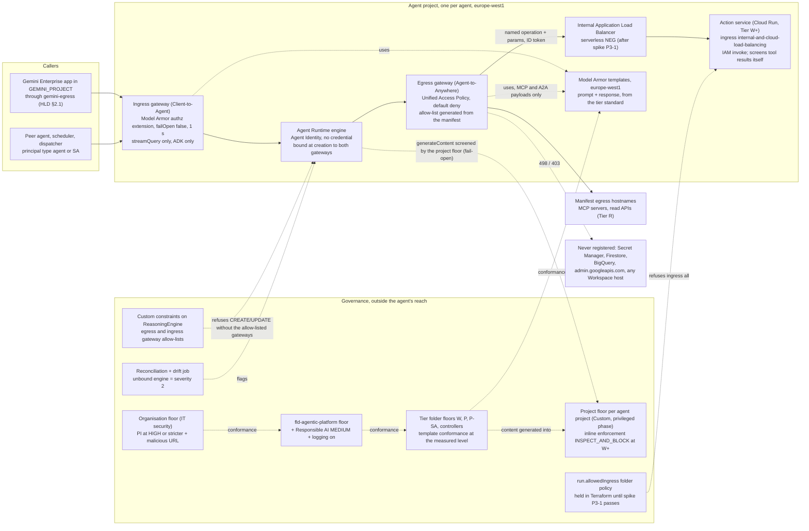

# 6. Agent Gateway, Model Armor and the perimeter

## Status
- Owner: the platform owner
- Last reviewed: 2026-09-18
- 2026-09-18: §4.3 rewritten for the pre-spike state — ingress `all` with IAM-only invoke and the
  audience check is the expected state for engine-called services, recorded as a dated deviation
  (the full build's `BD-33-2`); the custom module flags it as informational and severity 2 applies
  only to an invoker set beyond named service accounts. §4.6 summary row aligned.
- Parent: [01-hld.md](01-hld.md) §6 (gateways and Model Armor), §8.1 (network model), §3.3
  (the gateway custom constraint and `run.allowedIngress`), §15 boundaries B1, B2, B3 and B6.
  This page details those sections and does not contradict them; where the HLD left a value
  open, this page proposes one, registered as P81–P91 (and the refined P3) in
  [12-open-decisions.md](12-open-decisions.md).
- Scope: HLD brief items E41, E42, E43 of [00-objective-review.md](00-objective-review.md) §5
  and register rows PS-05, PS-06, PS-08, SCA-05, SCA-11 (with PS-07, PS-09, TIS-15 and MON-13,
  which the same mechanisms answer).
- Seeds promoted, not re-derived: [../wall-e/11-prompt-security.md](../wall-e/11-prompt-security.md)
  (the layer table, the tool-result finding, the template design, the sanitize-log alerts) and
  [../wall-e/13-agent-interconnection.md](../wall-e/13-agent-interconnection.md) §7 and §9 (the
  gateway facts, default deny, the enforcement/detection grading). §5 says line by line what
  becomes a platform rule and what stays Wall-E's.
- Verification: every Google fact below was re-read on 2026-09-13 and carries its URL and the
  page's own "last updated" date in §8. Where a page did not render or two pages disagree, the
  text says "unverified" and keeps *tbd*. No gcloud flag, role, constraint or product on this
  page is invented.
- Conventions as the HLD: `Assumption:` marks inferred facts; every control names its owner (a
  role), the resource it sits on, how it is verified and what happens when it fails; grades are
  **enforcement** and **detection** as [HLD §0.2](01-hld.md#02-the-six-containment-primitives-and-how-each-is-graded)
  defines them.

---

## 0. The three rules in one paragraph

Every engine above Tier C is created bound to its project's **egress gateway**, whose access
policy is default-deny and generated from the agent's manifest; every engine that a machine
calls sits behind an **ingress gateway** whose Model Armor extension is fail-closed. Model Armor
is governed as a **floor hierarchy** — an organisation floor IT security owns, a platform-folder
floor and tier-folder floors that govern template conformance, and a factory-written project
floor in every agent project that carries inline enforcement (Google configures inline
enforcement at project level only, and a project floor overrides its parents, §3.2) — and as a **template standard per tier** that
carries what floors cannot check (Sensitive Data Protection), with every floor and template write
alerted. The **perimeter** is two decisions taken in order: "credential holders are never
internet-reachable" is a folder organisation policy applied the day the engine-reach spike passes
(model (b) of HLD §8.1), and VPC Service Controls per tier folder is the fleet backstop applied
only after the second spike settles which of Google's two contradictory pages is right (model
(a)). Nothing on this page waits for a person who does not exist: the platform owner can run all
of it at Tier R and W; Tier P adds the security reviewer's signature on the floor and the
perimeter, which HLD §0.3 already requires.

---

## 1. The shape

One Tier W agent project as the factory makes it, with the platform pieces that govern it. Tier
R has no action service; Tier P adds the robot account on the far side of the action service;
P-SA adds its own folder floor. Solid arrows are traffic; dotted arrows are governance.

Read it for what is enforcement and what is not. The egress gateway's hostname policy and the
ingress gateway's fail-closed extension are enforcement-grade. The floor path on
`generateContent` is fail-open and therefore detection-grade whatever mode it is in. The action
service's own screen on tool results is where the platform's enforcement on attacker-writable
content finally lands for a REST tool set (§2.6), exactly as `wall-e/11` §3 found for Wall-E.

---

## 2. The gateway rule

### 2.1 The rule, as the factory and the folder enforce it

| Rule | Mechanism | Grade | Owner | Verified by | On failure |
|---|---|---|---|---|---|
| Every Agent Runtime engine above Tier C is created with `agent_gateway_config` naming its project's egress gateway (`agentToAnywhereConfig.agentGateway`) and, if machine-called, its ingress gateway (`clientToAgentConfig.agentGateway`), together with `identity_type = AGENT_IDENTITY` | The factory's `agent-project` module creates both gateways and passes both names to the engine; the folder custom constraints `custom.allowlistedEgressAgentGatewaysForAgentEngine` and `custom.allowlistedIngressAgentGatewaysForAgentEngine` on `aiplatform.googleapis.com/ReasoningEngine` (CREATE, UPDATE) refuse any engine whose gateway is not in the allow-list the factory maintains (§8 row G1). The allow-list is the set of factory-made gateways, regenerated per run. `ReasoningEngine` is absent from the custom-constraint supported-services reference while the runtime page publishes the two constraints (§8 rows G1, O2) | enforcement (Google refuses the API call) — graded so once a throwaway engine has been refused in nonprod after the dry-run window; until that record exists, the CI check is the control and the grade is detection (HLD §3.3, [02](02-landing-zone-and-tiers.md) §4.3 CC-1) | platform owner (constraint), CI identity (factory) | the daily reconciliation job lists engines and compares `agentGatewayConfig` to the register; the drift job diffs the constraint | an engine without a binding is a **severity 2** finding, unpublished within one business day (HLD §5.2); a constraint write outside a change window is a detection (§4.4 of the HLD) |
| One egress gateway and one ingress gateway per project-region; all engines in a project-region share them | Google's rule (§8 row G1); the platform's project-per-agent rule (HLD §3.1) makes the shared gateway an agent-private gateway | enforcement (by construction) | platform owner | the factory refuses a second engine in a project unless the manifest declares a multi-engine agent with one policy | a second engine in a project inherits the first's policy — which is why the factory refuses it |
| The engine is created after 2026-04-29 and without revisions | Google refuses binding to older engines and does not support revisions on bound engines (§8 row G1) | enforcement | platform owner (the factory and CI apply it) | the factory never creates revisions; promotion is a Binary Authorization attestation, not a revision (HLD §3.2) | not applicable — a bound engine has no revisions |
| `GOOGLE_API_PREVENT_AGENT_TOKEN_SHARING_FOR_GCP_SERVICES=False` is never set | CI check fleet-wide (HLD §4.1; `wall-e/13` §7.2) | detection (CI) | platform owner | CI on every deploy config | the deploy is refused |

The tenant app's own egress gateway (`gemini-egress`, Agent-to-Anywhere, in `GEMINI_PROJECT`)
is HLD §2.1 and P6; this page adds only that Gemini Enterprise has **no ingress mode** (§8 row
G2), so the front door is screened by the engine's ingress gateway, if the front door calls
`streamQuery` (§2.3).

### 2.2 The egress allow-list is generated, never hand-written

The access policy on every egress gateway is a JSON document the factory generates from the
register row and the manifest's `egress:` list (HLD §12.2), applied as a Unified Access Policy
(`roles/iap.egressor` bound to the engine's Agent Identity principal per destination; `wall-e/13`
§7.4 has the shape). It holds, and holds only:

| Destination class | Entries | Why |
|---|---|---|
| The action service (Tier W+) | the internal load-balancer hostname of the action service after spike P3-1; the `run.app` hostname until then, registered explicitly as an endpoint in the shared Agent Registry in `CORE_PROJECT` (P71; agent projects hold no registry — whether the gateway resolves a cross-project registration is part of P71's nonprod spike, [05](05-registry-and-autonomy-contract.md) §2.2) so that the "unregistered host" contradiction (`wall-e/13` §7.4, R38) never applies | the one write path |
| Essential platform endpoints | `aiplatform`, `agentregistry`, `logging`, `telemetry`, `cloudtrace`, `monitoring`, `cloudresourcemanager`, `iamcredentials`, the Sessions URI — each with the regional and mTLS variants the SDK resolves to (`wall-e/13` §7.6, verified against Google's 498 rule in §8 row G1) | without them every invocation fails with `498` |
| Manifest `egress:` hostnames | MCP servers and read APIs the register row names, each with a supplier row (HLD §14.3); exact hostnames, no wildcards | the agent's declared tool surface |
| **Never** | Secret Manager, Firestore, BigQuery, `admin.googleapis.com`, any Workspace API host, any other agent's action service | "the agent can read no secret" gains its second enforcement point here (`wall-e/13` §7.2); the absence is the control |

Traffic that is not agent egress never goes through a gateway: Cloud Tasks to an action
service's worker endpoint, a dispatcher's halt read, a reconciler, the log sinks, and every kill
switch an operator or verifier calls (§2.5). `wall-e/13` §7.6 is the worked instance of these
classes for one agent.

Rules that follow, each with its mechanism:

- **Hostname matching is exact and wildcards are unsupported** (§8 row G1), so the list is
  maintained by the platform, not the agent: the essential-endpoint set is one Terraform local
  in `CORE_PROJECT`, versioned, and the factory splices it into every policy. When Google adds
  an essential endpoint, one change fixes the fleet. Owner: platform owner. Verified: the monthly
  synthetic invocation per project (§2.5) fails with `498` if the set is stale. Failure: the agent
  cannot run, which is the correct failure.
- **Dry-run then enforce, per environment.** Nonprod gateways are created in dry-run
  (`iamEnforcementMode: DRY_RUN` on the authorization extension, §8 row G3) so the dry-run logs
  produce the first honest inventory of what an ADK agent calls (`wall-e/13` §7.2). Prod gateways
  are created **enforcing from the first deploy**: the manifest is the source of the list, and a
  destination that appears in the nonprod dry-run log and not in the manifest is a finding
  against the manifest, never a reason to widen prod. The one standing exception is the tenant
  app's `gemini-egress` (30 days dry-run, HLD §2.1), because it fronts agents that already exist.
  Decision P81.
- **5,000 registered resources per gateway** (§8 row G2) is far above any single agent; the quota
  register (HLD §3.4) tracks it anyway.
- **Every policy change is a pull request** to the agent's manifest under the two-reviewer rule;
  the factory applies it. A policy written by hand (`gcloud iap web set-iam-policy` outside CI)
  is a drift finding from the Cloud Asset Inventory feed (HLD §4.7). The
  `iam.managed.disableAccessPolicyBinding` lift the binding needs is a folder value (not
  enforced at the agent and controller folders — [02](02-landing-zone-and-tiers.md) §4.1 B7)
  and a per-project factory input with a named reason only for `GEMINI_PROJECT` (HLD §3.2);
  the set-up page spells the constraint
  `constraints/iam.managed.disableAccessPolicyBindings` and the constraints reference spells it
  `iam.managed.disableAccessPolicyBinding` — the reference is authoritative and the spelling is
  confirmed at the first factory run (§8 rows G3, O1).

### 2.3 The ingress gateway: who is "machine-called", and the `streamQuery` rule

An engine is **machine-called** when any principal that is not a human in the tenant app can
invoke it: a peer agent over A2A, an MCP consumer, a dispatcher, a scheduler, Eve's verification
caller. The register row's invoker list decides it, and the factory creates the ingress gateway
whenever that list is non-empty. Tier R read agents published only in the tenant app are
therefore egress-bound only; Tier W and above are always both, because a dispatcher exists.

What the ingress gateway's Model Armor screens, verified on 2026-09-13 (§8 rows G1, M3):
`reasoningEngines.streamQuery` requests and responses, for ADK agents only; the gateway in
Client-to-Agent mode governs only `query` and `streamQuery`; IAP is not supported during
ingress. Three platform rules follow, all promoted from `wall-e/11` §2:

| Rule | Mechanism | Grade | Owner | Verified by | On failure |
|---|---|---|---|---|---|
| Every machine caller uses `streamQuery`, never `query` or `asyncQuery` | CI greps every caller repository for the forbidden calls (already a rule for Wall-E's dispatcher and Eve's caller); the platform's dispatcher library exposes only `stream_query` | detection (CI) | agent owner; platform owner for the library | CI; the Agent Runtime request log is queried monthly for `query` calls per engine | a `query` call is a severity 3 finding — it removed the only enforcement-grade prompt screen silently |
| `failOpen` stays `false`; timeout 1 s | The authorization extension's default is `false` (§8 row S1); the factory sets it explicitly and CI diffs the extension YAML against the standard | enforcement (fail-closed by Google) | platform owner | drift job on the extension resource | a Model Armor error or timeout stops the request — an outage, not a screening gap (§2.5) |
| The human front door's method is measured, not assumed | Whether Gemini Enterprise calls a registered engine with `streamQuery` is **unverified** (`wall-e/13` A-OQ1; nothing on the pages read on 2026-09-13 says). The first machine-called engine in nonprod reads it from the Agent Runtime request log | detection | platform owner | one log query, recorded in the decision file of P81 | if the front door uses `query`, the tenant app's traffic is unscreened at the engine and the console Model Armor setting (§3.5) plus `gemini-egress` are the front-door screens — recorded as a dated residual, and raised with Google |

Caller authentication does not come from the ingress gateway (IAP is unsupported there): it is
the custom role holding only `aiplatform.reasoningEngines.query` and `.streamQuery` bound **on
the engine resource** to the named callers (HLD §2.2, `wall-e/12`), plus the action service's own
per-endpoint caller list. The gateway screens content; IAM decides who.

### 2.4 Gateway versus Agent Platform Threat Detection, per tier

Verified on 2026-09-13: the runtime deploy page (2026-09-08) says the Security Command Center
"Agent Engine Threat Detection" service is not available when Agent Gateway is enabled for an
agent; the detector's own page (2026-09-09) calls it Agent Platform Threat Detection, **Preview**,
Premium tier, Agent Runtime only, with runtime detectors (malicious binaries, container escape,
reverse shell, privilege escalation, exfiltration tools, crypto-mining, command injection in
scripts) and control-plane detectors over audit and `stdout`/`stderr` logs (§8 rows G1, S2). The
HLD §6.1 table is adopted unchanged and given its reasons per row:

| Tier | Choice | What is lost | What compensates | Grade of the compensation |
|---|---|---|---|---|
| C | neither (no engine) | — | console Model Armor (§3.5); SCC AI Protection inventory | detection |
| R | gateway-bound | the Preview detectors | default-deny egress is enforcement-grade; a read-only agent has no credential to escalate; SCC AI Protection over-privileged-agent findings still apply (§8 row S3) | enforcement (egress) |
| W, P, P-SA | gateway-bound | the Preview detectors | the platform verifier or Eve as the model-free runtime monitor; the behavioural baselines of HLD §7.1 (denial mix, tool-call distribution, target novelty, egress attempts in dry-run logs); the super-admin detection set at P | enforcement (verifier) plus detection (baselines) |
| nonprod, one agent at a time | **unbound**, Agent Platform Threat Detection on | the gateway, for that one nonprod engine, for a bounded window | the agent is in a sandbox tenant with no production credential | not a safety case — a learning window |

The rotation rule for nonprod: at most one unbound engine per tier folder at any time, for at
most 30 days, opened and closed by a factory input with a review date; the reconciliation job
counts unbound engines and pages the platform owner at two. Revisit when Google makes the two
compatible or the detector reaches GA. Decision P82.

### 2.5 The gateway plus Model Armor as an availability domain

Fail-closed screening of hundreds of agents shares one Google-managed dependency, so the pair is
operated as a platform service with its own numbers. Verified inputs: 1,200 sanitize QPM per
project and 600 `ExternalProcessor` QPM per project (§8 row M4); Model Armor and the services it
integrates with must be in the same region (§8 row M3); `europe-west1` is a Model Armor region and
`eu` a multi-region (§8 row M5).

| Item | Value | Owner | Verified by | On failure |
|---|---|---|---|---|
| SLO | `Assumption:` 99.5 % monthly successful screened invocations per region, measured by the probe below; the number is P83 | platform owner | monthly SLO report from the probe's metrics | a breach is a sev 3 review with Google support, never a `failOpen` flip |
| Synthetic probe | one nonprod engine per region, invoked every 5 minutes through its ingress gateway with a benign prompt and a known-hostile prompt from the regression corpus; expects `200` and a `MATCH_FOUND` respectively | platform owner | Cloud Monitoring uptime-style alert on two consecutive failures | page the platform owner (sev 3); the agents fail closed by design |
| Quota | ExternalProcessor QPM is consumed in the **gateway's** project — one more reason for project-per-agent; alert at 70 % of either quota (`wall-e/11` §6, promoted) | agent owner | Cloud Monitoring on `modelarmor.googleapis.com/template/request_count` and quota metrics | raise the quota by ticket before enforcement bites |
| Runbook | "Model Armor or gateway outage": confirm with the probe, open a Google case, tell agent owners the agents are stopped by design, never edit `failOpen`, record the window in the evidence bucket | platform owner | tabletop quarterly (HLD §7.6) | a tabletop missed or a real outage without the window recorded: severity 3 finding against the platform owner; the tabletop is re-run within the month and the missing window is reconstructed from the probe's metrics and recorded as such in the evidence register |
| The kill switches never depend on the gateway | K0–K7 are plain authenticated REST or folder policies (HLD §11.4; `wall-e/13` §7.6) | platform owner | monthly K7 drill | not applicable |

An outage fails every fail-closed agent closed; HLD §6.1 already says so and this page only adds
the numbers and the probe.

### 2.6 What the gateway does not screen, and the platform pattern per tier

Promoted from `wall-e/11` §3 and verified again on 2026-09-13 (§8 row M3): the egress gateway's
Model Armor sanitises MCP `tools/call` and `prompts/get` requests and responses and MCP tool
execution errors, A2A `SendMessage`, `AgentCard` and `GetExtendedAgentCard`, and OpenAI-format
model calls; "payloads that aren't listed here are allowed without sanitization". Plain REST is
not screened. So the attacker-writable content that reaches a model through a REST tool — a
display name, a group description, a mail body — crosses no gateway screen.

| Tier | Tool protocol | Where tool results are screened | Grade |
|---|---|---|---|
| R | **MCP through the egress gateway** — the platform's default for read tools (HLD §11.1 "MCP/A2A through the gateway"); a REST read API is allowed only with a supplier row and a stated reason | the egress gateway's Model Armor on `tools/call` responses, fail-closed; CEL on `iap.googleapis.com/mcp.toolName` and `mcp.tool.isReadOnly` (§8 row G4) gates tool names and read-only hints | **enforcement** on tool results; the residual is a probabilistic classifier, so the model's output at Tier R still moves nothing |
| W, P, P-SA | REST to the agent's own action service (`wall-e/03`'s shape) | **inside the action service** — option B of `wall-e/11` §3: `sanitizeUserPrompt` on every attacker-writable field before it returns, inspect-only for reads, `MA-Client-Correlation-Id` = the audit id, `MATCH_FOUND` sets the taint bit and publishes `content.flagged`; fencing with ADK's markers; URL removal | **detection by placement, with the taint bit as the enforcement** — the platform ceiling module caps a tainted run at proposals or human approval (HLD §12) |
| W+ option A, per agent | the action service exposed as an MCP server so the gateway screens `tools/call` | the egress gateway | enforcement on tool results if the two open questions of `wall-e/11` §3 close (bearer token through the gateway; the 5-minute `sse_read_timeout` hang); decided per agent at Stage 3, never a platform default |

Decision P88 records the pattern; `wall-e/11` §3 keeps its Wall-E reasoning as the worked example.

### 2.7 Controls of this section

| Control | Resource | Owner | Verified | On failure | Grade |
|---|---|---|---|---|---|
| Gateway binding at creation | `aiplatform.googleapis.com/ReasoningEngine` under `fld-agents-*` | platform owner | custom constraints (dry-run first, then enforced) + daily reconciliation | severity 2, unpublish | enforcement |
| Default-deny egress with a generated allow-list | Unified Access Policy on the egress gateway | platform owner (standard and the generator; the factory identity writes it) | dry-run logs in nonprod; asset feed in prod; monthly synthetic invocation | drift finding; a stale essential-endpoint set fails the agent with `498` | enforcement |
| Fail-closed ingress screening | authorization extension on the ingress gateway | platform owner | drift job on `failOpen` and timeout; the probe | outage, sev 3 | enforcement |
| `streamQuery` only | caller repositories; Agent Runtime request log | agent owner | CI; monthly log query | severity 3 finding | detection |
| Threat-detection rotation in nonprod | nonprod tier folders | platform owner | reconciliation count of unbound engines | page at two | detection |
| Availability domain | one probe engine per region | platform owner | SLO report | sev 3 review | detection |

---

## 3. Model Armor

### 3.1 The layers and their grades, made platform-wide

The `wall-e/11` §2 table is the platform's, with the agent-specific column removed and the grade
stated for any agent. Every row re-verified on 2026-09-13 unless marked; the Agent Gateway GA
date (2026-06-18), the console setting's GA date (2025-09-16), the per-request form's
`safety_settings` exclusivity, and the ADK plugin, `quote_untrusted` and Semantic Governance
details are as `wall-e/11` §2 records them and were not re-read on 2026-09-13.

| Layer | Screens | Does not screen | Failure mode | Stage | Platform grade |
|---|---|---|---|---|---|
| Model Armor on the ingress gateway | `reasoningEngines.streamQuery` requests and responses of ADK engines on Agent Runtime — the human or dispatcher prompt, the job envelope, the final visible answer | `query`, `asyncQuery`, every other ReasoningEngine payload, ReasoningEngine error responses, non-ADK payloads; nothing between the agent and its tools or its model; no caller gate (IAP is not supported during ingress, §2.3) | fail-closed (`failOpen` default `false`, §8 row S1; Google's sample sets `false` with a 1 s timeout — the p99 of screened streaming responses is measured in nonprod and the timeout is raised only with a recorded reason); a Model Armor error or timeout stops the request | GA (2026-06-24, §8 row M6); Agent Gateway itself GA 2026-06-18 | **enforcement** on the prompt channel, provided every caller uses `streamQuery` |
| Model Armor on the egress gateway | MCP `tools/call` and `prompts/get` requests and responses, and MCP tool execution errors; A2A v1 `SendMessage`, `AgentCard`, `GetExtendedAgentCard` over JSON-RPC and HTTP+JSON; OpenAI-format model calls, non-streaming | plain HTTPS and REST; MCP `tools/list`, `resources/*`, `notifications/*`, Streamable HTTP and SSE, MCP protocol errors; A2A `SendStreamingMessage`, tasks, gRPC, errors; Gemini `generateContent` (not OpenAI format); file uploads — "payloads that aren't listed here are allowed without sanitization" | fail-closed, same authorization-extension mechanism | GA (2026-06-24) | **enforcement** on the payloads it sees — which is Tier R's whole tool surface and none of a REST action service's |
| Floor settings, inline enforcement on Agent Platform | the engine's own `generateContent` prompts and responses; applies even when `modelArmorConfig` is omitted; `europe-west1` listed. ADK's default `streaming_mode` is `NONE`, so an ADK agent's model calls are `generateContent` and fall under it | whether the whole `contents` array — history, function responses, the system instruction — or only the latest user text is inspected is **unverified** (`wall-e/11` A-OQ3; the page read on 2026-09-13 speaks only of "prompts and responses"); `streamGenerateContent` not mentioned: **unverified** | **fail-open**: when Model Armor is unavailable in the region, unreachable or errors, the platform "skips the Model Armor sanitization step and continues processing the request", which Google says can occasionally expose unscreened prompts or responses (§8 row M2) | GA (§8 row M1 lists "Agent Platform" as a GA enforcement point); Google MCP server inline enforcement is Preview | **detection** in every mode, including `INSPECT_AND_BLOCK`; its value is the sanitize log, and it is the only platform screen positioned to see a REST tool result at all, if it inspects function responses |
| Floor settings, conformance | no traffic: template creation and update below the floor | traffic | create-time refusal | GA | **enforcement** of one governance property: nobody, including a deployer, can weaken a template below the floor — **except** on Sensitive Data Protection, which floors do not check (§8 row M1) |
| Per-request `modelArmorConfig` on `generateContent` | the request that carries it | as the floor; mutually exclusive with `safety_settings` | not separately described (the skip-and-continue note covers the integration as a whole): treated as fail-open | GA on Vertex AI, not on the Gemini API | detection, and configured in the agent's own code, so weaker than the floor; only for running a template stricter than the floor |
| ADK `ModelArmorPlugin` (`google-adk` 2.8.0, module `google.adk.integrations.model_armor`) | the text parts of the most recent user-role content before each model call; the model's visible output text after it | `function_call` arguments, `function_response` bodies, thoughts, inline and file data, the system instruction, earlier history; on a tool-result turn it re-screens the previous human text and never the tool result | fail-closed by default (`block_on_screening_failure=True` blocks on any exception or non-success invocation), in-process | open source, shipped in 2.8.0 on 2026-08-25; not documented on adk.dev | detection — it is inside the process it protects and a code change removes it; never counted |
| Semantic Governance Policies | proposed tool calls at the egress gateway, judged by an LLM against natural-language constraints with the prompt, history and tool manifest | conversational reasoning; anything not a tool call; it reads the same injected context that steered the model | fail-closed (authorization extension `failOpen: false`, so an engine outage stops model calls) | Preview (2026-06-29; metrics Preview 2026-08-31) | detection; **never on an authority path** (HLD §2.1, §16) |
| ADK 2.8.0 `quote_untrusted` fencing | other agents' relayed events and `RemoteA2aAgent` replies, wrapped between `<<<BEGIN_QUOTED_AGENT_CONTENT>>>` and `<<<END_QUOTED_AGENT_CONTENT>>>` markers with a "data, never instructions" preamble | the agent's own tool results, which reach the model unfenced — so an action service fences its own attacker-writable fields with the same markers (§2.6) | not applicable | open source, 2.8.0 | not a screen; ADK's own docstring says fencing raises the bar rather than closing the class — the taint bit closes it (§2.6) |
| Gemini Enterprise console setting | the assistant, Agent Designer and Workflow Builder agents, Google-made agents, uploads to the assistant | "custom agents from your organization, such as ADK, A2A, and Dialogflow" (§8 row M7) | `failureMode` `FAIL_CLOSED` default, `FAIL_OPEN` selectable, per app | GA (2025-09-16) | covers Tier C only; §3.5 |

### 3.2 The floor hierarchy

A lower floor does not only tighten, and inline enforcement is not set at the organisation or
folder level. Google's floor-settings page (§8 row M1, re-read in full on 2026-09-13, updated
2026-09-10) says so in three sentences that shape the design:

- "**Template conformance** … is defined at the organization and folder levels. **Inline
  enforcement** … is configured at the project level." Data inspection is "enforced only at the
  project level using the inspect and block mode."
- "If floor settings conflict, the settings lower in the resource hierarchy take precedence.
  Similarly, project-level floor settings override conflicting folder-level floor settings."
- A project may **Inherit** its parent's floor, define a **Custom** floor that "override[s] any
  inherited floor settings", or **Disable** — "no detection rules apply to the Model Armor
  templates and Agent Platform for your Gemini workloads."

So the organisation and folder floors are **template-conformance controls only** (a new template
below them is refused); the protection on the `generateContent` hop is a **project-level floor**;
and whoever holds `roles/modelarmor.floorSettingsAdmin` on a project can loosen or disable that
project's floor whatever the folders say. "Never looser" is therefore not a property of the
hierarchy; it is a property of *who can write a project floor* and *how fast a write is seen*.

Also verified on the page: the console sets floors at project level only, gcloud and REST at all
three; floors do not check Sensitive Data Protection conformance; "Agent Platform" (GA) and the
Google MCP server (Preview) are the inline enforcement points; `enableCloudLogging` and
`enableMultiLanguageDetection` are floor flags; floor settings are `global` resources. The
endpoint override `gcloud config set api_endpoint_overrides/modelarmor "https://modelarmor.googleapis.com/"`
that `wall-e/11` §5 records is on the page.

| Level | Set on | Content | What it does | Owner | Change control |
|---|---|---|---|---|---|
| Organisation | the organisation, by gcloud or REST | prompt-injection and jailbreak filter **enabled at `HIGH` or stricter**; malicious URL filter enabled; `enableCloudLogging` on; `enableMultiLanguageDetection` on | **template conformance** across the organisation; no inline enforcement (a project-level setting) | **IT security** (the platform owner holds the role until IT security takes it; recorded as such, review date *tbd*) | `roles/modelarmor.floorSettingsAdmin` only through a PAM entitlement (HLD §4.4); every write alerted (§3.4) |
| `fld-agentic-platform` | the folder | organisation floor + Responsible AI (hate, harassment, dangerous, sexually explicit) at `MEDIUM_AND_ABOVE` | template conformance | platform owner | same |
| Tier floors `fld-agents-w`, `fld-agents-p`, `fld-agents-p-sa`, `fld-controllers` | the tier folder | platform floor + prompt-injection at the **measured** confidence level once the tier's benign corpus has been run (§3.3) + Sensitive Data Protection basic *requested* in the template standard (floors cannot require it) | template conformance at the tier's level | platform owner; for P-SA the security reviewer signs | same, plus the second approver of HLD §4.4 at P-SA |
| `fld-agents-r`, `fld-agents-x`, `fld-improvers`, `fld-platform-core`, `fld-gemini-enterprise` | inherit the platform floor | — | template conformance by inheritance | platform owner | — |
| **Project floors — every agent project** | the project, written by the factory's **privileged phase** ([02](02-landing-zone-and-tiers.md) §3.3; the P-SA and controller projects under `ent-factory-singleton`) | a **Custom** floor generated from the tier floor's content (never `Inherit`, so the content is explicit in Terraform and diffable; never `Disable`) with inline enforcement for Agent Platform: `INSPECT_ONLY` at Tier R and before a tier's benign-corpus measurement; `INSPECT_AND_BLOCK` at W, P and controllers after it; `INSPECT_AND_BLOCK` always at P-SA | **inline enforcement** on the engine's Gemini calls (detection-grade whatever the mode, because the floor path is fail-open) and template conformance inside the project | platform owner | written only by the privileged phase; `roles/modelarmor.floorSettingsAdmin` at project level held by nobody standing and granted only through PAM; `modelarmor.googleapis.com/floorSettings.update` denied to every agent-project principal by rule R5 of `deny-agents-platform` ([04](04-identity-and-privileged-access.md) §3) |

**Verified by:** the drift job reads every agent project's floor setting daily and compares it
to the generated one (mode, filters, levels, `Custom`), and the floor-write alert of §3.4 reacts
in minutes. **On failure:** a project floor whose content differs from the generated one, set to
`Inherit` or `Disable`, or written by any principal other than a privileged-phase grant, is
**severity 1 drift** to `platform-security@`; the privileged phase re-applies the generated floor
after the security reviewer signs the incident note; at P-SA the agent's ladder is held at L0 for
writes until it is re-applied. **Grade:** the organisation, platform and tier floors are
enforcement of template conformance only; the project floors' content is detection-grade
(fail-open path) and its *integrity* is enforcement for agent principals (deny rule R5) and
detection for humans (PAM plus the alert).

Why the organisation floor says "at `HIGH` or stricter" and not a level: `wall-e/11` §4's
reading of conformance — `LOW_AND_ABOVE` is the most restrictive setting and `HIGH` the least —
means a floor at `MEDIUM_AND_ABOVE` would forbid a later, measured choice of `HIGH`. The
organisation floor therefore guarantees only that nobody can create a template without the two
filters; the tier floor tightens to the measured level. The ordering is confirmed at build by
creating a `HIGH` template under a `MEDIUM_AND_ABOVE` floor in a nonprod project and recording
the refusal.

Why inline enforcement starts inspect-only: the floor path is fail-open, so blocking buys no
safety case and costs benign-prompt refusals; its first purpose is the sanitize log, which is the
only platform evidence of what a model was shown on the `generateContent` hop. Blocking in a
tier's projects is a measured change, per tier, taken by the same rule as a template flip
(§3.3), and applied by regenerating the project floors. The residency question — the `global`
floor-setting write under `gcp.resourceLocations` — is HLD §3.3's row; Google's supported-services
page constrains Model Armor at template creation only ([08](08-data-logging-retention-sovereignty.md)
§13), so the write is expected to pass and is confirmed at the first factory run. Decision P84.

### 3.3 The template standard per tier

Templates are regional (`europe-west1`, the same region as the gateway and the engine — §8 row
M3), two per engine (prompt and response), created by the factory from one Terraform module in
`CORE_PROJECT`, and diffed by CI against the tier standard on every change: an agent owner may
only tighten. The standard, extending `wall-e/11` §4:

| Filter or setting | R | W and P | P-SA | Verified basis |
|---|---|---|---|---|
| Prompt injection and jailbreak | on, `MEDIUM_AND_ABOVE` until measured | same | same | §8 row M8 (overview) |
| Malicious URL | on | on | on | same; first 256 URLs (§8 row M9) |
| Responsible AI, four categories | on, `MEDIUM_AND_ABOVE` | same | same | same |
| CSAM | applied by default | same | same | same |
| Sensitive Data Protection, **basic** | on (credit cards, government ids, financial accounts, **Google Cloud credentials and API keys**) | on | on | §8 row M10 |
| Sensitive Data Protection, **advanced**: an SDP inspect template plus a **de-identify template** | off | **on** — the de-identify template is applied so the sanitize-**log** copy carries masked names; decided once for the fleet (the `wall-e/11` §4 *tbd*, closed here); the SDP templates live in `CORE_PROJECT`, same location as the Model Armor template, with the Model Armor service agent granted the DLP user and reader roles there (§8 row M10) | on | §8 row M10; the inline path blocks rather than de-identifies in any case |
| **Custom detectors for the hard-denied vocabulary** | — | — | **on**: custom infoTypes (dictionary and regex) in the P-SA inspect template — `makeAdmin`, `roleAssignments`, `eve@`, the control-group names, the two OAuth client ids' display names — on the **response** template, so the model's output is screened for the exact strings the two lists forbid | §8 row M10: advanced mode "uses an inspection template … including what predefined or custom detectors to use"; custom infoTypes are an SDP feature. **Detection-grade**: a second, Google-side screen behind the action service's hard-denied list, which is the enforcement (HLD §13.1 item 2) |
| Image screening | off | off | off | Preview, `us`/`eu` multi-region only (§8 row M6) |
| `enforcementType` | `INSPECT_ONLY` in nonprod; `INSPECT_AND_BLOCK` in prod after the flip rule | same | same | §8 row M10: both values exist; the GA `gcloud` track creates `INSPECT_AND_BLOCK` only, `INSPECT_ONLY` needs `gcloud beta` or the REST field `templateMetadata.enforcementType` (`wall-e/11` §4; not re-verified on 2026-09-13 — *tbd* at build) |
| Filter version | `STABLE` alias; **v3 becomes Stable on or before 2026-09-25; v1 and v2 retire 2026-11-29** | same | same | §8 row M6 |
| Multi-language detection | on | on | on | §8 row M1 (floor flag), M10 (template flag) |
| `logSanitizeOperations` | on, **after** the project's content-log bucket and sink exist (the logs carry raw prompts and personal data) | same | same | §8 row M11; `wall-e/11` §4, §5 |
| Custom error message | code 400, a service-authored sentence with nothing interpolated | same | same | `wall-e/11` §4 |
| Token limits | 65,536 tokens for PI/jailbreak, RAI, CSAM; 130,000 for SDP; 4 MB input; above a limit the filter returns `EXECUTION_SKIPPED` silently | same | same | §8 row M4 — the `EXECUTION_SKIPPED` alert (§3.4) is what turns a silent skip into a row |
| Partial invocation failures | `ignore-partial-invocation-failures` left at its default `false`, so a partial failure surfaces as `invocationResult` `PARTIAL` rather than passing | same | same | `wall-e/11` §4; not re-verified on 2026-09-13 |

**Basic and advanced Sensitive Data Protection are mutually exclusive** (fields of
`SdpFilterSettings`; `wall-e/11` §4, read 2026-09-13). A template that switches to advanced mode
— every W, P and P-SA template above, and the P-SA response template's custom detectors — must
re-list in its inspect template the six infoTypes basic mode covers (`CREDIT_CARD_NUMBER`,
`US_SOCIAL_SECURITY_NUMBER`, `FINANCIAL_ACCOUNT_NUMBER`,
`US_INDIVIDUAL_TAXPAYER_IDENTIFICATION_NUMBER`, `GCP_CREDENTIALS`, `GCP_API_KEY`), or the
credential screen is silently dropped; every infoType the de-identify template names must also be
in the inspect template. A regression-suite case with a credential string proves the screen
still fires after the switch. On the response template the prompt-injection filter catches the
model echoing injected text, the visible symptom of a steered turn. In Wall-E's design the
dispatcher recognises the custom error code 400 as a gateway block and publishes
`content.flagged` with `source: gateway` (`wall-e/11` §4).

**The flip rule, per tier.** A template moves from `INSPECT_ONLY` to `INSPECT_AND_BLOCK` when the
tier's injection regression suite (`wall-e/11` §6, promoted as the platform's suite with the
manifest's `fingerprint` tuple recorded per run) has produced a false-block rate on the tier's
benign corpus below the threshold the tier's first decision record fixes (`Assumption:` below
1 % — measured, not assumed). The flip is a pull request under the two-reviewer rule; a block
that fires on a legitimate operator prompt is a finding against the template. Decision P85.

### 3.4 Alerting on floor and template writes

The floor is a platform control; a write to it is either a change window or an incident.

| Signal | Mechanism | Owner | Threshold and response | Grade |
|---|---|---|---|---|
| Floor write at organisation, folder or project | Cloud Audit Logs Admin Activity entries for `modelarmor.googleapis.com` floor-setting updates, in the aggregated sink (HLD §7.1); log-based alert in `LOGGING_PROJECT`; SIEM rule from Tier P. The exact `methodName` (`Assumption:` `UpdateFloorSetting` in the `google.cloud.modelarmor.v1` service) is confirmed against a real entry at the first factory run, as `wall-e/11` §6 does for every field path | platform owner (alert); security reviewer (content) | any write outside a PAM grant with a matching ticket: severity 2; any write by a principal other than the platform Terraform identity: severity 1 at Tier P | detection |
| Template create, update, delete | the same stream for template methods; CI diff against the standard | agent owner; platform owner | a template outside CI is a drift finding; a template weaker than the standard fails CI | detection (CI), enforcement (the floor refuses what it can check) |
| PAM grant of `roles/modelarmor.floorSettingsAdmin` | PAM audit logs (HLD §4.4) | security reviewer | any grant outside a change window: detection | detection |
| Security Command Center | Model Armor findings are surfaced in SCC once Model Armor is enabled and integrated (§8 rows S3, S4); whether **floor writes** produce an SCC finding is **unverified** — Model Armor resources did not appear in the Security Health Analytics custom-module resource list read on 2026-09-13 (§8 row S5), so the SCC path for floor writes is *tbd* and the log-based alert is the control | platform owner | — | detection |
| `MATCH_FOUND`, `EXECUTION_SKIPPED`, `invocationResult != SUCCESS`, filter-version drift, quota approach | the `wall-e/11` §6 alert set, promoted into the monitoring baseline module (HLD §7.2) for every project with a template | agent owner | as `wall-e/11` §6; never an automatic demotion — a probabilistic verdict does not move the ladder | detection |

Decision P86.

### 3.5 The console setting, tenant-wide by rule, per app by mechanism

Verified on 2026-09-13 (§8 row M7): Model Armor for Gemini Enterprise is configured **per app**
(console: Configurations > Assistant > Enable Model Armor; API: `customerPolicy.modelArmorConfig`
patched on the assistant resource), by `roles/discoveryengine.agentspaceAdmin`; it takes a
prompt template and a response template whose region must match the app's; `failureMode`
defaults to `FAIL_CLOSED`; custom agents (ADK, A2A, Dialogflow) are not screened; the Data Access
logs record verdicts without the query text. `roles/modelarmor.admin` creates the template
([03](03-gemini-enterprise-environment.md) §9).

The setting as the platform fixes it (P53, refined by P87):

| Item | Value |
|---|---|
| Console path | App → Configurations → Assistant → Model Armor, by the Gemini Enterprise admin through PAM; the administrator's runbook is [03](03-gemini-enterprise-environment.md) §9 and §16 |
| Covers | the assistant, Agent Designer and Workflow Builder agents, Google-made agents, uploaded documents and images; not custom agents — every Tier R+ engine is screened at its own gateway and floor (§2, §3.2) |
| Template | `ge-console-standard` in `GEMINI_PROJECT`, `eu` (the app's region); a template in another project would need `roles/modelarmor.user` on the app's service account, which is avoided. Content: the Tier C row of the standard — the folder floor plus prompt injection, malicious URL, RAI and SDP basic, no custom detectors; conformance to the folder floor is enforced by the floor's create-time check. The app takes a prompt and a response template; whether both fields name `ge-console-standard` or a second template of the pair is created is *tbd* at build |
| Failure mode | **Block all user interactions** (`FAIL_CLOSED`). The platform never flips `failOpen` to recover (§2.5): the tenant assistant joins the Model Armor availability domain, and an outage is a sev 3 page to the platform owner, not an incident. A flip to Allow (`FAIL_OPEN`) is a PAM-elevated act with an incident reference, and is a detection (PL-10, [07](07-monitoring-detection-incident-response.md) §6.4) |
| Findings | Model Armor's SCC integration on (§3.6): every `MATCH_FOUND` on the assistant path is an SCC finding and a SIEM event, metadata only |
| Quota | Model Armor's 1,200 sanitize QPM per project (§2.5) serves the whole tenant's assistant traffic from `GEMINI_PROJECT` — the one project whose quota scales with headcount, so it is the first row of the quota register (P31); assistant QPM and p99 latency with Model Armor on are measured at step GE-8 of [03](03-gemini-enterprise-environment.md) §16 |

| Rule | Mechanism | Owner | Verified by | On failure |
|---|---|---|---|---|
| Every Gemini Enterprise app in the tenant has Model Armor on, `FAIL_CLOSED`, with the two platform templates | Applied by the Gemini Enterprise admin through PAM; the templates are a **second template pair in the `eu` multi-region** (the app is in `eu`, HLD §2.1; Model Armor lists `eu`, §8 row M5), generated from the same Tier C standard (prompt injection, malicious URL, RAI, SDP basic; no custom detectors) | Gemini Enterprise admin; platform owner for the templates | a daily drift check enumerates the tenant's apps and reads `customerPolicy.modelArmorConfig` on each (the `GetAssistant` Data Access entry) and asserts "on, `ge-console-standard`, Block"; any app without it, or with `FAIL_OPEN`, is a finding; the injection regression suite (§3.3) gains three prompts sent through the assistant | severity 2: the app is unpublished for external sharing until fixed, and the setting is restored by `ge-admins@` through PAM within one business day; a template weakened below the floor is refused by Google at write time |
| The setting is recorded as covering Tier C only | HLD §2.1 row "Console Model Armor"; `wall-e/11` §2 | platform owner | the admission gate refuses a Tier R+ register row whose safety case cites the console setting as its screen; the annual safety-case review re-reads Google's scope sentence (§8 row M7) | a safety case that relies on it: the row is refused or, if already admitted, capped at L3 until it names its gateway screen; a change in Google's scope sentence is a P84/P87 review opened by the platform owner |
| No second app is created without the setting | the app inventory in the register (HLD §5); a new app is a register row | Gemini Enterprise admin | the same drift check | a second app without the setting: severity 2, unpublished for sharing until set, and a register row is back-filled or the app deleted |

Decision P87. With one app per tenant the per-app setting is tenant-wide in practice, exactly as
HLD §2.1 says of the feature toggles; the drift check is what keeps that true when a second app
appears.

### 3.6 Security Command Center and the evidence path

Model Armor findings reach SCC with metadata (§8 rows S3, S4); payloads stay in the sanitize logs,
which are routed to each project's restricted content bucket before the template exists
(`wall-e/11` §5 step 1, promoted into the factory: the bucket, its generated reader IAM and the
sink precede the template in the module's dependency order). The de-identified copy of §3.3 is
what the evidence lake keeps (HLD §7.5, 30 days). AI Protection's asset inventory does not list
Agent Gateway (§8 row S3); the gateways are inventoried by the reconciliation job's asset export
instead (HLD §5.2).

### 3.7 Controls of this section

| Control | Resource | Owner | Verified | On failure | Grade |
|---|---|---|---|---|---|
| Organisation floor | the organisation's floor setting | IT security | drift job; write alert | severity 1/2 | enforcement (template conformance only) |
| Folder floors | `fld-agentic-platform` and the tier folders | platform owner | same | same | same |
| Project floors (inline enforcement) | every agent project's floor setting, `Custom`, generated | platform owner | daily drift compare; write alert | severity 1; privileged phase re-applies after security-reviewer sign-off; P-SA writes held at L0 until re-applied | detection (fail-open content); enforcement of integrity against agent principals (R5) |
| Template standard | every project's two templates | platform owner (standard), agent owner (tightening) | CI diff | CI refuses | enforcement (floor) plus CI |
| SDP advanced with de-identify at W+ | templates + SDP templates in `CORE_PROJECT` | platform owner | CI; a sanitize-log sample audited monthly for raw names | finding against the module | detection |
| P-SA vocabulary detectors | the P-SA response template | platform owner; security reviewer signs | regression suite case per string | finding | detection |
| Console setting | every Gemini Enterprise app | Gemini Enterprise admin | daily drift check | severity 2 | enforcement for Tier C traffic (fail-closed), detection for its presence |
| Sanitize logs routed first | content bucket + sink per project | platform owner (the factory applies it) | module dependency order; the drift job asserts the sink exists before the template | the template is not created and the factory run fails | enforcement (ordering) |

---

## 4. The perimeter

### 4.1 The facts on 2026-09-13, and the contradiction stated exactly

| Fact | Source, page date | What it means for the decision |
|---|---|---|
| "VPC Service Controls are not supported with Agent Gateway." | runtime deploy page, 2026-09-08 (§8 row G1) | the engine-side page still says no |
| "VPC Service Controls is only supported for Agent Gateway deployments created after September 8, 2026 that use the agent connectivity template to configure VPC connectivity." | set-up page, 2026-09-10 (§8 row G3) | the gateway-side page says yes, with two conditions |
| "To support VPC Service Controls, egress must be set to `ALL_TRAFFIC` in your agent connectivity template"; Google API calls must then resolve to `restricted.googleapis.com` (`199.36.153.4/30`) or PSC endpoints through a private Cloud DNS zone and DNS peering for `googleapis.com.` | VPC connectivity page, 2026-09-11 (§8 row G5) | under (a) **all** of the agent's egress leaves through the customer VPC; the essential endpoints must all be VPC-SC-supported services reachable through the restricted VIP |
| A template's egress settings cannot be updated in place: a new template is required, and "if you have an existing Agent Gateway that was created without a connectivity template, you must delete the gateway and recreate it" | same | a gateway created without a template today must be **recreated** to join a perimeter later |
| "agent traffic is routed through your private VPC network attachment, ensuring that your organization's VPC Service Controls perimeter rules are applied to all agent traffic as well" | overview, 2026-09-10 (§8 row G2) | the mechanism is a PSC **interface** (network attachment) from the Google-managed gateway into the customer VPC |
| An IAM access policy granting the egress permission to the agent identity is always required for destination resources | overview, 2026-09-10 | Google does not say the access policy is lost under a template; the `Assumption:` in HLD §8.1 that Unified Access Policies are forfeited stays an assumption. The permission is spelled `iap.resources.egressViaIAP` on the overview and `iap.webServiceVersions.egressViaIAP` in Google's IAM blog (§8 row G6) — the current name is confirmed at the spike |
| "This feature does not support VPC Service Controls" on the Unified Access Policies page | quoted by `wall-e/PREREQUISITES.md` §10 item 24 from a page read before 2026-09-13; the IAP URL returned 404 on 2026-09-13 and the agent-policies page (2026-09-08, §8 row G4) carries no VPC-SC statement | **unverified** on 2026-09-13; the spike tests the behaviour instead of the sentence |
| Agent identities as principals in VPC-SC ingress and egress rules: "generally available" per the VPC-SC release notes entry of 2026-06-29; the supported-identities page still says Preview | §8 rows V1, V2 | the ingress rule for `GEMINI_PROJECT`'s service agent and the egress rules for peers can name `principal://agents…` and `principalSet://agents…` forms — GA by release note, page text lagging; recorded as GA with the conflict noted |
| Model Armor: GA in VPC Service Controls since 2026-01-09; Agent Registry: GA, "make sure that your project for Agent Registry and the enabled APIs are included in your … perimeter"; Cloud Run: GA; Vertex AI: GA with limitations on the Agent Platform page (which did not render) | §8 rows V1, V3 | every service the perimeter would restrict is supported; the Agent Platform limitations page is *tbd* |
| Cloud Run `internal` ingress admits: internal Application Load Balancer traffic, projects in the same VPC-SC perimeter with Cloud Run restricted, same-project VPC networks, Shared VPC; `run.allowedIngress` values `all`, `internal`, `internal-and-cloud-load-balancing` | Cloud Run ingress page, 2026-09-04 (§8 row R1) | the two routes an engine could take to an internal-ingress action service: through an internal load balancer, or as a member of the same perimeter — which is why spike 1 (load balancer) is independent of spike 2 (perimeter) |
| Agent Runtime egresses from a Google-managed tenant project that Cloud Run treats as external | `wall-e/01` "Cloud Run ingress" row, verified by the Wall-E set; not re-tested on 2026-09-13 | why `run.allowedIngress` cannot be applied before spike 1 |
| Serverless NEGs back Cloud Run behind the regional internal Application Load Balancer; a regional internal Application Load Balancer can be published through a PSC service attachment | §8 rows R2, R3 | both candidate routes of spike 1 are documented pieces; their combination with a gateway-bound engine is not, hence the spike |

The reading this page records: the two pages are **both** right about different objects. The
runtime page describes an engine bound to a gateway with no connectivity template — no
perimeter applies to it, because its egress leaves from Google's tenant project. The set-up page
describes a gateway with a template in `ALL_TRAFFIC` mode — its egress enters the customer VPC
and the perimeter sees it. Until a throwaway engine shows that a bound engine with such a
template still obeys its Unified Access Policy, that reading is a hypothesis and P3's second
spike is what tests it.

### 4.2 The decision, restated with what this page adds

HLD §8.1 adopts **(b)** as soon as its spike passes and **(a)** as the fleet backstop after the
second spike. This page does not reopen that; it specifies the spikes, decides what the factory
does *today* so that (a) stays reachable without rebuilding the fleet, and turns "credential
holders are never internet-reachable" into a folder rule with an owner.

**What the factory does from the first prod gateway, decided here (P89).** Every gateway the
factory creates for Tier W and above is created **with an agent connectivity template in
`ALL_TRAFFIC` mode** from the first prod deploy, in the agent project's own VPC (a `/28` subnet
with Private Google Access, a PSC network attachment, DNS peering for the internal load-balancer
zone), provided spike 1 passes on that configuration. Reasons: a gateway created without a
template cannot join a perimeter later without deletion and recreation (§4.1); `ALL_TRAFFIC`
gives the agent's internet egress a fixed path through Cloud NAT with firewall logs, which the
manifest's `egress:` hostnames deserve anyway; and it is the only configuration under which the
(a) spike is even possible. The cost is one VPC, one subnet, one Cloud NAT and one DNS zone per
Tier W+ project — a factory module, not a person. Tier R gateways use the default
`PRIVATE_RANGES_ONLY` (no action service to reach privately; the read-tool hosts are public) and
are recreated by the factory if Tier R ever joins a perimeter. If spike 1 fails on the
`ALL_TRAFFIC` configuration but passes on `PRIVATE_RANGES_ONLY`, the factory uses the passing one
and the (a) backstop is recorded as unreachable for that tier until Google changes the rule.

### 4.3 "Credential holders are never internet-reachable" as a folder rule

| Item | Value |
|---|---|
| Rule | No Cloud Run service that holds a credential (every action service, Eve's gate and reconciler, the approval surface) accepts ingress from the internet |
| Mechanism (target) | `constraints/run.allowedIngress` = `internal-and-cloud-load-balancing` on `fld-agents-w`, `fld-agents-p`, `fld-agents-p-sa`, `fld-controllers` and `fld-platform-core` (values verified, §8 row R1), held in Terraform on 2026-09-13 and **applied on the day spike 1 passes** (HLD §3.3) |
| Mechanism (until then) | IAM-only invoke (`run.invoker` on named service accounts only; no `allUsers`, no `allAuthenticatedUsers`) plus the service's check of the ID token's audience is the enforced boundary. Ingress `all` is the **expected** pre-spike state for every service the engine calls: Agent Runtime egresses from a Google-managed project that Cloud Run treats as external, so `internal` ingress blocks the engine (the symptom is a timeout, not an error — [setup/33](setup/33-wall-e-action-services-and-approval-surfaces.md) WS-3.2). Each project records it as a dated deviation with spike 1 as the closing condition (the full build's `BD-33-2`). A Security Health Analytics custom module over `run.googleapis.com/Service` (a supported type, §8 row S5) flags any service in those folders whose ingress is `all` as **informational** until the constraint is applied — detection |
| Owner | platform owner; the security reviewer signs the day-one application at Tier P |
| Verified by | the drift job on the constraint; the custom module; the monthly synthetic invocation that calls each action service's `run.app` URL directly from outside and expects a refusal |
| On failure | a service with ingress `all` after the policy is applied cannot exist (Google refuses the deploy); before the policy, ingress `all` alone is not a failure — severity 2, with the deploy rolled back by CI, applies only to a service whose `run.invoker` set holds anything but named service accounts, or whose ingress `all` has no dated deviation record |
| Grade | enforcement after spike 1; detection before |
| Scope note | the constraint governs Cloud Run **services**; Cloud Run **jobs** (Eve's export, the K7 job, Mo's readers) have no ingress and are outside it — they are reached by nobody, which is the point |

Decision P90.

**Spike 1 — engine reach (P3, first spike; protocol recorded here).** On a throwaway Tier W
nonprod project made by the factory:

1. Deploy an action-service stand-in on Cloud Run with ingress `internal-and-cloud-load-balancing`
   and IAM-only invoke.
2. Front it with a regional internal Application Load Balancer through a serverless NEG (§8 row
   R2), with a private DNS name in the project VPC.
3. Create the egress gateway with an `ALL_TRAFFIC` connectivity template attached to that VPC,
   DNS peering for the load-balancer zone; register the load-balancer hostname as a `NO_SPEC`
   endpoint; bind `roles/iap.egressor` for the engine's principal on it.
4. Create an engine bound to that gateway; have it call the stand-in.
5. Pass criteria, all three: the call through the load balancer succeeds with the agent's
   ID-token claims (`sub`, `email`, `aud`) arriving intact at the stand-in (closing `wall-e/13`
   gap 4 at the same time); a direct call to the stand-in's `run.app` URL from the engine and
   from outside is refused; the gateway's dry-run log shows only the registered destination.
6. If step 5 fails on the load-balancer route, repeat with a PSC **endpoint** to a service
   attachment published from the load balancer (§8 row R3) — the HLD's alternative route — and
   record which of the two the factory module emits.
7. Artefacts: the working Terraform as the `agent-project` module's output; the spike log in
   the evidence bucket; the decision file for P3 naming the route.

**Spike 2 — VPC Service Controls (P3, second spike; protocol recorded here).** On the same
project, after spike 1:

1. Create a perimeter in dry-run mode over the nonprod project with `aiplatform`, `run`,
   `secretmanager`, `bigquery`, `firestore`, `cloudkms`, `agentregistry`, `modelarmor` and
   `networkservices` restricted; an ingress rule for the nonprod `GEMINI_PROJECT` service agent's
   `reasoningEngines.query` and `streamQuery`; the engine's `principal://agents…` identity in the
   rules where a peer would be.
2. Prove, with the perimeter enforced: the bound engine still reaches its registered
   destinations; an unregistered hostname is still refused by the **access policy** (the
   Unified Access Policy question — the pass condition is a `498`/`403` from the gateway, not a
   perimeter violation); a deliberate egress from the engine to a bucket outside the perimeter
   produces a VPC-SC violation log; the tenant app's query through the ingress rule succeeds;
   the essential endpoints resolve through `restricted.googleapis.com`.
3. Outcomes: if the access policy holds under the template, (a) is adopted per tier folder as
   the backstop with hostname control unchanged; if it does not hold, hostname control under (a)
   moves to VPC firewall and Cloud DNS on the template as HLD §8.1 anticipated, and the page
   records that under (a) the gateway is the perimeter's carrier, not the hostname control; if
   the engine cannot function inside the perimeter at all, (a) is recorded as unavailable and the
   runtime page was right.
4. Artefact: one decision record under P3 naming which Google page was right, with the dates of
   both pages, and the `PREREQUISITES.md` §10 item 24 and decision 21 lines closed by it.

### 4.4 Under (a): what a tier perimeter holds and the flows it must admit

The HLD's model (a) is a perimeter **per tier folder** (prod and nonprod separately; nonprod
perimeters may include the sandbox tenant's projects). Perimeter membership is by project, so the
factory adds each project to its tier's perimeter as a module output; FAST's project factory
supports VPC-SC membership (HLD §3.2). The flows that cross a perimeter on this platform are
finite and are listed once, so the rules are generated, not hand-written:

| Flow | Direction | Rule | Principal form |
|---|---|---|---|
| `GEMINI_PROJECT`'s Discovery Engine service agent queries a published engine | ingress into the tier perimeter | `aiplatform` `reasoningEngines.query`/`streamQuery` from the `fld-gemini-enterprise` perimeter (or project) | service agent |
| A peer agent calls a machine-called engine | ingress | the same methods, from the peer's perimeter | `principal://agents…` (§4.1, V1/V2) |
| Eve's reconciler reads `*_audit` datasets and calls `/v1/control/*` | ingress into agent tiers from `fld-controllers`; egress from controllers | `bigquery` read on the named datasets; `run` invoke on the named services | `eve-controller@`, `eve-reconciler@` |
| Mo reads audit views | ingress into agent tiers from `fld-improvers` | `bigquery` on the views only | `mo-metrics@` |
| The aggregated sink writes to `LOGGING_PROJECT` | egress from every tier to core | `logging`, `storage`, `bigquery` writer identities of the sink | the sink's service account |
| `eve-export@` pushes the evidence mirror to the witness organisation | egress from `fld-controllers` to another organisation | `storage`, `bigquery` to the witness project and bucket | `eve-export@` (HLD §13.2; P15 owns the cross-organisation spike) |
| CI deploys | ingress from `CICD_PROJECT` | `run`, `aiplatform`, `artifactregistry`, `iam` | the CI identity through WIF |
| Humans on IAP surfaces | ingress | access level: managed device + security key (HLD §4.2) | workforce |
| Action services call Workspace APIs | egress to non-VPC-SC services | Cloud Run egress `private-ranges-only` sends Google API calls directly, not through the VPC (HLD §3.3), so Workspace calls are outside the perimeter's reach by design; the OAuth scope set is the ceiling | `walle-actions@` etc. |

Anything not in this table is refused by the perimeter, which is the fleet backstop the HLD
wants: an agent principal that somehow obtained a grant on a resource in another tier still
cannot reach it. Decision P91 records the table as the source the factory generates from.

### 4.5 Per tier, on 2026-09-13

The perimeter each tier has, and the controls this page adds to it (this is the canonical
per-tier table; HLD §8.1 summarises it):

| Tier | Perimeter | Added on this page |
|---|---|---|
| C | the tenant app; console Model Armor; `gemini-egress` | the per-app drift check (§3.5) |
| R | gateway default-deny; `PRIVATE_RANGES_ONLY` template | the essential-endpoint set as a platform local; MCP as the tool protocol (§2.6) |
| W, P, P-SA, controllers, core | IAM-only invoke on 2026-09-13; `run.allowedIngress` behind the internal load balancer after spike 1; (a) per tier folder after spike 2 | `ALL_TRAFFIC` templates from the first prod gateway (§4.2); the SHA custom module on ingress (§4.3); the flow table (§4.4) |
| Robot Workspace accounts | Google's fixed one-hour Admin console session; Google session control and Google Cloud session control on the OU; the Admin console CAA level of HLD §4.6 as detection-plus-friction; CAA on API tokens `Assumption:` pending P7 ([04](04-identity-and-privileged-access.md) §6.3 and §8.2) | nothing — not a network control |

### 4.6 Controls of this section

| Control | Resource | Owner | Verified | On failure | Grade |
|---|---|---|---|---|---|
| Never internet-reachable | `run.allowedIngress` on five folders | platform owner | drift job; SHA module; monthly direct-call probe | Google refuses (after spike 1); before it, ingress `all` is a recorded deviation and severity 2 applies only to an invoker set beyond named service accounts (§4.3) | enforcement / detection |
| Gateways born perimeter-ready (P89) | connectivity template `ALL_TRAFFIC` on every W+ prod gateway | platform owner (the factory applies it) | asset feed; module output | a gateway without a template is a drift finding and is recreated by the factory | enforcement (the module cannot emit a W+ prod gateway without it) |
| Tier perimeters (after spike 2) | VPC-SC perimeters per tier folder, prod and nonprod | platform owner; security reviewer signs | dry-run violation logs for 30 days before enforcement; the flow table as the rule source | a violation is a SIEM case; an enforcement mistake fails closed and is a sev 3 page | enforcement |
| The two spikes | one throwaway project | platform owner | the artefacts of §4.3 | the super-admin grant waits (HLD §0.4, P line) | gate (a precondition, not a runtime control) |

---

## 5. How `wall-e/11` and `wall-e/13` are promoted

The two chapters stay where they are and keep Wall-E's reasoning; each gets a framing note (HLD
§18 item 8) that says "platform page: 06-gateways-model-armor-perimeter.md". Line by line:

| Chapter section | Becomes platform rule | Stays Wall-E's |
|---|---|---|
| `11` §1 injection surface | the channel list is the template every Tier W+ threat model fills in | Wall-E's Workspace-specific channels |
| `11` §2 layer table | §3.1 here, one column dropped | "grade for Wall-E" column |
| `11` §2 "every caller uses `streamQuery`" | §2.3 rule, CI in every caller | the dispatcher's own CI line |
| `11` §3 tool results are not screened | §2.6 — Tier R screens through MCP at the gateway; W+ screens in the action service (option B) with the taint bit as enforcement; option A per agent at Stage 3 | the Wall-E reasoning about proportion at S0 |
| `11` §4 template design, floor-ordering caveat, filter versions, token limits, custom error, logging first | §3.2 (floor wording), §3.3 (the standard) | the two Wall-E template names |
| `11` §5 configuration steps | the factory's `agent-project` module (roles verified: `roles/modelarmor.calloutUser` and `roles/modelarmor.user` for the Reasoning Engine service agent on ingress; `roles/modelarmor.calloutUser`, `roles/serviceusage.serviceUsageConsumer` and `roles/modelarmor.user` for the Service Extensions service agent on egress — §8 row M3) | `./walle armor` for Wall-E's templates only (HLD §6.2) |
| `11` §6 sanitize logs and alerts | §3.4 and the monitoring baseline module | the two Wall-E SQL queries, as examples |
| `11` §6 injection regression suite | the platform suite; a case per hard-denied string is added for P-SA | Wall-E's corpus |
| `11` §7 Semantic Governance | never on an authority path (HLD §2.1) | — |
| `13` §7.1 facts | §2.1, §8 rows G1–G3 re-verified | — |
| `13` §7.2 binding, default deny, dry-run inventory | §2.2 | the Wall-E policy JSON as the example |
| `13` §7.3 one enforcement-grade path | §3.1 | — |
| `13` §7.4 Unified Access Policies with CEL | §2.6 (MCP attributes verified, §8 row G4); the `NO_SPEC` contradiction avoided by registering every destination | the candidate deny on `/v1/control/*` |
| `13` §7.5 the three unsettled questions | spike 1 closes the header question and the private-backend question; the ID-token question is `wall-e/12`'s spike, run in the same throwaway project | — |
| `13` §7.6 what to route | §2.2's destination classes; the tenant app row is closed by HLD §2.1 | the Eve-into-`walle-actions` row, closed by §4.4's flow table under (a) and by IAM under (b) |
| `13` §9 grading table | HLD §0.2's rule; §3.1 here | — |
| `13` §11 controls | the controls tables of §2.7, §3.7, §4.6 | the registry and card rows (page 05 of this set) |
| `13` gaps 4, 5, 6, 8, 9 | 4 and 9 close in the spikes; 5 is `wall-e/12`'s; 6 stays a candidate; 8 is §2.3's measured question | — |
| `PREREQUISITES.md` §10 item 24; `09` decisions 9 and 21; `eve/09` E-19; topology §5 VPC-SC row | all closed by P3's second spike record; E-19's "VPC Service Controls plus a host allowlist" for Eve becomes: Eve's limbs are Cloud Run in `fld-controllers`, covered by §4.3 and, under (a), by the controllers' perimeter; Eve has no engine and needs no gateway | — |

---

## 6. What this page does not do

The platform-wide non-goals are [HLD §16](01-hld.md#16-what-the-platform-does-not-do); this page
adds the gateway, Model Armor and perimeter ones:

- It does not make the floor path enforcement-grade; Google's fail-open statement stands and
  the taint bit, the ceiling module and the action service's hard-denied list remain the
  enforcement on tool content.
- It does not count the gateway's Model Armor as a screen on REST tool traffic, for any tier.
- It does not apply `run.allowedIngress` before spike 1, and it does not create a perimeter
  before spike 2; it makes every W+ gateway born ready for one.
- It does not promise that Unified Access Policies survive a connectivity template; it tests it.
- It does not let an agent owner loosen a floor, a template below the standard, an egress list
  beyond the manifest, or `failOpen`.
- It does not put Semantic Governance, the ADK plugin, or any Preview detector in a safety case.

---

## 7. Decisions recorded on this page

This page's decisions are P81–P91 and the refinement of P3 (the two spike protocols of §4.3),
each cited by id in the section that argues it; their state, options, owner and gate
are held in [12-open-decisions.md](12-open-decisions.md#1-how-this-register-works).

---

## 8. Sources, read 2026-09-13, and what could not be verified

| Row | Fact | URL | Page date |
|---|---|---|---|
| G1 | "VPC Service Controls are not supported with Agent Gateway"; SCC Agent Engine Threat Detection unavailable on a gateway-enabled agent; no revisions; all engines in a project-region bind the same gateways; `custom.allowlistedEgressAgentGatewaysForAgentEngine` and `custom.allowlistedIngressAgentGatewaysForAgentEngine` on `resource.spec.deploymentSpec.agentGatewayConfig.{agentToAnywhereConfig,clientToAgentConfig}.agentGateway`, CREATE and UPDATE; ingress governs `query` and `streamQuery` only; no binding to engines created before 2026-04-29; `498` without essential endpoints | https://docs.cloud.google.com/gemini-enterprise-agent-platform/scale/runtime/agent-gateway-runtime-deploy | 2026-09-08 |
| G2 | perimeter rules applied through the connectivity template's network attachment; an IAM access policy granting `iap.resources.egressViaIAP` always required; Agent-to-Anywhere for Agent Runtime and Gemini Enterprise, Client-to-Agent for Agent Runtime only; 5,000 resources per gateway | https://docs.cloud.google.com/gemini-enterprise-agent-platform/govern/gateways/agent-gateway-overview | 2026-09-10 |
| G3 | "VPC Service Controls is only supported for Agent Gateway deployments created after September 8, 2026 that use the agent connectivity template"; `ALL_TRAFFIC` required; `gcloud network-services agent-gateways import`; audit-only / `iamEnforcementMode: DRY_RUN`; the `constraints/iam.managed.disableAccessPolicyBindings` lift (spelling as on the page); required APIs | https://docs.cloud.google.com/gemini-enterprise-agent-platform/govern/gateways/set-up-agent-gateway | 2026-09-10 |
| G4 | `roles/iap.egressor`; CEL attributes `iap.googleapis.com/mcp.toolName`, `mcp.tool.isReadOnly`, `request.auth.type`; policies bind to registered agents, MCP servers and endpoints — "You cannot bind a policy to an unregistered resource"; dry-run recommended; no VPC-SC statement | https://docs.cloud.google.com/gemini-enterprise-agent-platform/govern/policies/configure-iam-policies | 2026-09-08 |
| G5 | `AgentConnectivityTemplate`: PSC network attachment, `/28` subnet with Private Google Access, DNS peering, `PRIVATE_RANGES_ONLY` (default) or `ALL_TRAFFIC`; VPC-SC needs `ALL_TRAFFIC` and `restricted.googleapis.com` (`199.36.153.4/30`) via a private zone; templates and template-less gateways must be recreated to change | https://docs.cloud.google.com/gemini-enterprise-agent-platform/govern/gateways/set-up-vpc-connectivity | 2026-09-11 |
| G6 | the egress permission spelled `iap.webServiceVersions.egressViaIAP` (blog) versus `iap.resources.egressViaIAP` (overview) | https://cloud.google.com/blog/products/identity-security/whats-new-in-iam-security-governance-and-runtime-defense | undated in the search result |
| M1 | floors at organisation, folder, project; **template conformance at organisation and folder, inline enforcement configured at project level; lower levels take precedence and a project floor overrides its folder; a project may Inherit, set Custom or Disable** (re-read in full 2026-09-13); console project-only; `roles/modelarmor.floorSettingsAdmin`; SDP not floor-checked; inspect-only / inspect-and-block; enforcement points "Model Armor template creation and update" GA, "Google MCP Server" Preview, "Agent Platform" GA; `enableCloudLogging`, `enableMultiLanguageDetection`; floors are `global`; the endpoint override | https://docs.cloud.google.com/model-armor/configure-floor-settings | 2026-09-10 |
| M2 | fail-open: "skips the Model Armor sanitization step and continues processing the request"; `generateContent`; `europe-west1` listed; `modelArmorConfig` per request; function-response inspection not stated | https://docs.cloud.google.com/model-armor/model-armor-vertex-integration | 2026-09-10 |
| M3 | egress scope (MCP `tools/call`, `prompts/get`, tool errors; A2A `SendMessage`, cards; OpenAI-format) and "payloads that aren't listed here are allowed without sanitization"; ingress `streamQuery` for ADK only; "Model Armor and the services it integrates with must be deployed within the same Google Cloud region"; the service-agent roles for ingress and egress | https://docs.cloud.google.com/model-armor/model-armor-agent-gateway-integration and https://docs.cloud.google.com/gemini-enterprise-agent-platform/govern/configure-model-armor | 2026-09-10; 2026-09-04 |
| M4 | 1,200 QPM sanitize per project; 600 QPM `ExternalProcessor` per project; token limits 65,536 / 130,000; 4 MB | https://docs.cloud.google.com/model-armor/quotas | 2026-09-10 |
| M5 | `europe-west1` (Belgium) regional; `eu` and `us` multi-regions | https://docs.cloud.google.com/model-armor/locations | 2026-09-10 |
| M6 | Agent Gateway integration GA 2026-06-24; image screening Preview 2026-06-25 (`us`/`eu`); v3 Stable by 2026-09-25, v1/v2 retire 2026-11-29; 65,536-token screening 2026-08-25 | https://docs.cloud.google.com/model-armor/release-notes | entries as dated |
| M7 | per-app enablement (Configurations > Assistant; `customerPolicy.modelArmorConfig`); `roles/discoveryengine.agentspaceAdmin`; template region must match the app; `failureMode` `FAIL_CLOSED` default; custom agents (ADK, A2A, Dialogflow) not screened; Data Access logs without query text | https://docs.cloud.google.com/gemini/enterprise/docs/enable-model-armor and https://docs.cloud.google.com/model-armor/model-armor-agentspace-integration | 2026-09-03; 2026-09-10 |
| M8 | filters, confidence levels, multi-language | https://docs.cloud.google.com/model-armor/overview | read via `wall-e/11` (2026-09-03); not re-fetched |
| M9 | first 256 URLs | release note 2026-08-25 (M6) | — |
| M10 | SDP basic and advanced; advanced references an SDP inspect template (predefined or custom detectors) and an optional de-identify template; SDP templates in the same location; cross-project needs DLP user and reader roles for the service agent; `INSPECT_ONLY` / `INSPECT_AND_BLOCK`; filter version selector; `logSanitizeOperations`; multi-language flag | https://docs.cloud.google.com/model-armor/manage-templates (and search snippets of the same page) | 2026-09-10 |
| M11 | sanitize-log entry shape and warnings | https://docs.cloud.google.com/model-armor/configure-logging | via `wall-e/11` (2026-08-27); not re-fetched |
| S1 | authorization extension: "By default, `failOpen` is set to `false`. If the extension times out or fails, request processing stops." | https://docs.cloud.google.com/service-extensions/docs/configure-authorization-extensions | 2026-09-09 |
| S2 | Agent Platform Threat Detection: Preview; Premium (and deprecated Enterprise); Agent Runtime only; runtime and control-plane detectors; findings in SCC near-real time | https://docs.cloud.google.com/security-command-center/docs/agent-platform-threat-detection-overview | 2026-09-09 |
| S3 | AI Protection: Model Armor findings investigable in SCC after integration; asset inventory (Gemini Enterprise apps, Agent Platform endpoints, data sources, models, MCP servers via Agent Registry with App Hub) — Agent Gateway not listed; over-privileged Agent Runtime agents | https://docs.cloud.google.com/security-command-center/docs/ai-protection-overview | 2026-09-09 |
| S4 | Model Armor in SCC: templates and floors as the configuration surfaces; finding categories on a linked page not read | https://docs.cloud.google.com/security-command-center/docs/model-armor | 2026-09-09 |
| S5 | SHA custom modules: Premium; `run.googleapis.com/Service` supported; Model Armor, Agent Gateway and (per this read) `aiplatform.googleapis.com/ReasoningEngine` not returned by the reader | https://docs.cloud.google.com/security-command-center/docs/custom-modules-sha-overview | 2026-09-09 |
| V1 | VPC-SC release notes: agent identities in ingress/egress rules GA 2026-06-29; Agent Identity API and Credentials API GA 2026-08-14; Model Armor GA 2026-01-09 | https://docs.cloud.google.com/vpc-service-controls/docs/release-notes | entries as dated |
| V2 | supported identities page: "You can only specify workforce identity pools, workload identity pools, agentic identities, and service agents in service perimeter ingress and egress rules"; agent identity `principal://TRUST_DOMAIN/…`, `principalSet://TRUST_DOMAIN/attribute.…`, `principalSet://TRUST_DOMAIN/*`, **no Preview label** (only deleted principals carry one); GA per the release notes of 2026-06-29 | https://docs.cloud.google.com/vpc-service-controls/docs/supported-identities | 2026-09-09, read by raw fetch 2026-09-13 |
| V3 | supported products: Vertex AI GA with Agent Platform limitations; Agent Registry GA with the project-inclusion note; Cloud Run GA; BigQuery GA; Model Armor, Secret Manager, Firestore, IAP not returned by the reader on this page | https://docs.cloud.google.com/vpc-service-controls/docs/supported-products | undated in the read |
| R1 | Cloud Run ingress values and what `internal` admits; `run.allowedIngress` values `all`, `internal`, `internal-and-cloud-load-balancing` | https://docs.cloud.google.com/run/docs/securing/ingress | 2026-09-04 |
| R2 | serverless NEGs: Cloud Run behind global external, regional external, regional internal and cross-region internal Application Load Balancers | https://docs.cloud.google.com/load-balancing/docs/negs/serverless-neg-concepts | 2026-09-09 |
| R3 | PSC published services: producer load balancers include the regional internal Application Load Balancer and the cross-region internal Application Load Balancer, with serverless NEG backends listed; endpoint (consumer-initiated) versus interface (producer-initiated, via network attachment) | https://docs.cloud.google.com/vpc/docs/about-vpc-hosted-services and https://docs.cloud.google.com/vpc/docs/private-service-connect | 2026-09-10; 2026-09-09 |
| O1 | `constraints/iam.managed.disableAccessPolicyBinding` — "prevents binding V3 access policies to resources"; `run.allowedVPCEgress` values | https://docs.cloud.google.com/resource-manager/docs/organization-policy/org-policy-constraints | undated in the read |
| O2 | custom-constraint supported services: `run.googleapis.com/Service` GA, `secretmanager.googleapis.com/Secret` GA; `aiplatform.googleapis.com/ReasoningEngine` **not returned by the reader** although G1 publishes constraints on it | https://docs.cloud.google.com/organization-policy/reference/custom-constraint-supported-services | 2026-09-09 |

**Not verified on 2026-09-13, kept as *tbd* or `Assumption:` in the text:**

1. The Unified Access Policies page's "does not support VPC Service Controls" sentence (the IAP
   URL returned 404; the agent-policies page is silent) — spike 2 tests the behaviour.
2. Whether a Unified Access Policy still governs hostnames when the gateway carries an
   `ALL_TRAFFIC` connectivity template — spike 2.
3. Whether Gemini Enterprise invokes a registered engine with `streamQuery` — measured in
   nonprod (§2.3).
4. Whether the floor path inspects function responses and history inside `contents` — no page
   says; the action service's own screen is the platform's answer regardless.
5. The exact Cloud Audit Logs `methodName` values for floor and template administration —
   confirmed against a real entry at the first factory run.
6. Whether Model Armor floor or template resources are Security Health Analytics custom-module
   types (not returned by the reader) — the SCC path for floor writes is *tbd*; the log-based
   alert is the control.
7. Whether `aiplatform.googleapis.com/ReasoningEngine` appears on the custom-constraint
   supported-services reference (not returned by the reader; the runtime page publishes the two
   constraints) — folded into P4; the constraints are applied in dry-run first.
8. The current spelling of the egress permission (`iap.resources.egressViaIAP` versus
   `iap.webServiceVersions.egressViaIAP`) and of the binding constraint
   (`disableAccessPolicyBinding` versus `…Bindings`) — the reference spellings are used; confirmed
   at the first factory run.
9. The Gemini Enterprise Agent Platform release-notes page and the Agent Platform VPC-SC page
   rendered as navigation only; the 2026-09-08 connectivity-template entry is taken from the
   set-up and VPC-connectivity pages instead.
10. *(Closed 2026-09-13: agent identities in VPC-SC ingress and egress rules are GA — the
    supported-identities page carries no Preview label and the release notes record GA on
    2026-06-29; row V2.)*
11. The GA `gcloud` track creating `INSPECT_AND_BLOCK` templates only (`wall-e/11` §4) — not
    re-checked; the factory uses the REST field through Terraform in any case.
12. The SLO value (P83), the false-block threshold (P85) and the IT-security handover date for the
    organisation floor (P84) — numbers nobody has decided.
13. The `wall-e/01` fact that Agent Runtime's tenant-project egress is external to Cloud Run —
    relied on as the Wall-E set verified it; spike 1 re-tests it in passing.

---

## Related

- [01-hld.md](01-hld.md) — the parent: §2.1 (`gemini-egress`, console Model Armor), §3.1–§3.3
  (folders, factory, the constraints and `run.allowedIngress`), §4.5 (deny policies and PAB),
  §6 (gateways and Model Armor), §7 (monitoring, SCC, the SIEM), §8.1 (network model, P3), §11
  (tiers), §13 (the three agents), §15 (boundaries), §17 (P1–P34)
- [00-objective-review.md](00-objective-review.md) — E41–E43; PS-05, PS-06, PS-07, PS-08,
  PS-09, SCA-05, SCA-11, TIS-15, MON-13
- [12-open-decisions.md](12-open-decisions.md) — the register: P81–P91 are this page's rows
- [../wall-e/11-prompt-security.md](../wall-e/11-prompt-security.md) — the seed for §3 and §2.6
- [../wall-e/13-agent-interconnection.md](../wall-e/13-agent-interconnection.md) — the seed for
  §2 and §4.1
- [../wall-e/12-agent-identity.md](../wall-e/12-agent-identity.md) — the ID-token spike run in
  the same throwaway project as spike 1
- [../wall-e/PREREQUISITES.md](../wall-e/PREREQUISITES.md) §10 item 24 and
  [../wall-e/09-open-decisions.md](../wall-e/09-open-decisions.md) decisions 9 and 21 — closed
  by P3's second spike record
- [../eve/09-open-decisions.md](../eve/09-open-decisions.md) E-19 — closed the same way
- [../project-topology.md](../project-topology.md) §5 — the folder floor and the VPC-SC row this
  page supersedes
- [../gemini-enterprise.md](../gemini-enterprise.md) — the per-app Model Armor setting (§3.5)
  belongs on that page's baseline once it is written
