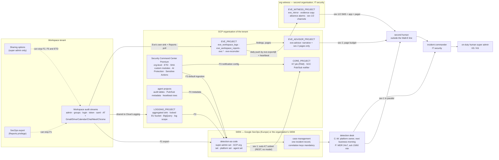

# 7. Monitoring, detection and incident response

## Status
- Owner: the platform owner
- Last reviewed: 2026-09-14
- Maturity: detailed design, written 2026-09-13 under [01-hld.md](01-hld.md) §7 (monitoring and
  detection), §13.2 (Eve's reporting contract, the witness, the second human), §0.3 (roles),
  §0.4 (the tier gate) and §14.1 (Art. 73). Nothing is built. This page answers HLD brief items
  F44–F51 and gap-register rows MON-01, MON-02, MON-03 and PS-07 of
  [00-objective-review.md](00-objective-review.md) §4–§5, and MON-06 (§3, SCC Premium), MON-07
  (§5, the correlation contract), MON-08 and the platform half of EVE-03 (§6, the detection
  catalogue), MON-09 (§14, SOC metrics), MON-10 (§13, tabletops) and MON-11 (the evidence register, held in
  [10](10-eu-ai-act.md) §5 with the exports of [08](08-data-logging-retention-sovereignty.md) §5.5).
- What this page decides: the SIEM contract and the default instance; the Security Command
  Center scope; the detection catalogue and who owns it; the super-admin detection set hosted
  outside `WALLE_PROJECT`; the pipeline heartbeats and the `log_pipeline_silent` halt; the
  correlation contract on every audit row; the "registered ⇒ feeding the SIEM" module; the
  incident-response organisation, its tool, its runbooks, its regulatory clocks, its exercises
  and its metrics; and the platform reporting path every verifier uses. Its decisions are
  **P92–P103** in [12-open-decisions.md](12-open-decisions.md).
- What this page does not do: it does not re-decide the retention schedule (HLD §7.5, P13), the
  perimeter (HLD §8, P3), the kill-plane mechanics of K7 (HLD §11.4) or Eve's control path
  (HLD §13.2). Where it touches them it cites the section and says what it adds.
- Standing constraints: as the [HLD Status](01-hld.md#status) states them; this page designs
  around Wall-E's Super Admin (P33).
- Conventions: `Assumption:` marks inferred facts; *tbd* marks values nobody has decided;
  every Google product, tier, region, API and article named here carries a source in §18,
  re-verified on 2026-09-13 unless the row says "unverified"; no gcloud flag, role, constraint
  or product on this page is invented. Every control names its owner (a role), the resource it
  sits on, how it is verified and what happens when it fails (§15 consolidates them).
- Diagrams: §1.2 (the evidence and paging topology) and §9.3 (the incident chain).

---

## 0. The rule this page rests on, and what it is for

The HLD's §7 opens with one sentence and this page is its consequence: **with a super admin on
the platform, detection is the primary control for that tier**. Below Tier P detection stays a
check on enforcement — Google or the platform refuses the action, and a detection confirms the
refusal happened. In Tier P-SA nothing at Google's end refuses `walle@`; the consented OAuth
scope set is the only Google-enforced ceiling, and every other ceiling is code in a component
that could be the thing under investigation. So the questions this page answers are not "which
alerts" but: **where does the evidence go that the judged thing cannot silence, who is paged
within how many minutes, who can pull which lever at 03:00, what is the record, and what are
the legal clocks that start ticking.**

Three properties are held throughout, and the reader should check each section against them:

1. **Independence of the store from the actor.** Every severity-1 detection about `walle@` is
   hosted in the SIEM and in `EVE_PROJECT`/`EVE_WITNESS_PROJECT`, never in `WALLE_PROJECT`;
   every severity-1 detection about a platform principal is hosted outside that principal's
   project. A rule that lives where its subject holds owner is not a detection (HLD CP6).
2. **Absence is a signal.** Every feed has a heartbeat and every heartbeat has an absence alarm
   whose channel does not share the feed's failure domain (§7).
3. **Nothing detection-grade stands alone** (the grades are defined in
   [HLD §0.2](01-hld.md#02-the-six-containment-primitives-and-how-each-is-graded)). Each rule in
   the catalogue names the enforcement control it backs or the reason it is the last line. Where it is the last line —
   the super-admin set — the page says so, and the residual sits in the signed deviation (P33).

---

## 1. The shape: feeds, stores, desks, humans

### 1.1 The four organisation-owned feeds and where each lands

The HLD names four feeds (§7.1). This page fixes their mechanism, owner, lag budget and the
detection that fires when each stops. None uses domain-wide delegation; none needs a service
account inside the tenant.

| # | Feed | Mechanism (verified 2026-09-13, §18) | Carries | Owner | Lag budget | Absence detection |
|---|---|---|---|---|---|---|
| F1 | Workspace events → SIEM | Admin console, Menu → Reporting → Data integrations → **Google Security Operations export**; configured with the SecOps customer id, token and instance id; needs the **Reports** administrator privilege; editions Enterprise Standard/Plus, Frontline Plus, Education Standard/Plus (tenant edition *tbd*, [../google-workspace.md](../google-workspace.md)); exports **all** supported event types (Admins, Users, Groups, OAuth, SAML, Login, Rules, Gmail, Drive, Chat, Calendar, Meet, Devices, Chrome, Takeout, Data Studio, Vault… — no selective export); only events after connection; up to 24 h before the first data | the desk's copy of everything, including the Gmail/Drive/Calendar/Chat/Meet/Chrome streams Cloud Logging never receives | a **human** Workspace administrator holding the Reports privilege configures it (never `walle@` — the export setting is on the hard-denied list, HLD §13.1 item 2); IT security owns | `Assumption:` 15 min steady-state (verify at build) | SIEM heartbeat rule H-2 (§7) |
| F2 | Cloud Audit Logs and Workspace-in-Cloud-Logging → `LOGGING_PROJECT` → SIEM | the two aggregated sinks of [08-data-logging-retention-sovereignty.md](08-data-logging-retention-sovereignty.md) §3.2 — `S-org` at the organisation for the Workspace audit streams (admin, groups and login on every edition; OAuth token and SAML only on Enterprise Standard/Plus, Education Standard/Plus, Voice Premier or Cloud Identity Premium; Access Transparency only on Enterprise Plus and Education — [share data with Google Cloud services](https://knowledge.workspace.google.com/admin/getting-started/share-data-with-google-cloud-services), updated 2026-09-10; the tenant edition is *tbd* and a Stage 0 precondition of this feed's completeness check) and `S-folder` over `fld-agentic-platform` with `includeChildren`, intercepting, for the five audit families — into `LOGGING_PROJECT`, then the locked `europe-west1` evidence bucket, the identity bucket and the BigQuery dataset (HLD §7.1); the SIEM reads the `siem` log view of `platform-evidence-logs` (the `identity` view only on IT security's request); SecOps ingests Cloud Logging directly (the ingest page rendered as an index only on 2026-09-13; the mechanism — direct ingestion configured from SecOps, or a Pub/Sub sink — is **unverified on 2026-09-13** and fixed at build) | every Admin Activity and Data Access entry the folder produces; the Workspace entries Google shares with Cloud Logging | platform owner | sink: seconds; SIEM: `Assumption:` 5 min | H-1 (Eve's independent copy) and H-2 |
| F3 | SCC findings → SIEM and → pager | SecOps ingests SCC findings by default (§18); independently, one **notification config** at the organisation (`gcloud scc notifications create … --pubsub-topic … --filter …`, filters as in `findings.list`) to a Pub/Sub topic in `CORE_PROJECT` whose subscriber posts to the Terraform-managed channel — **SCC does not page on its own** | ETD (incl. the eight Workspace findings), SHA + custom modules, AI Protection, Sensitive Actions, Agent Platform Threat Detection (nonprod) | organisation IT security (P11) | near-real time (Google) | H-3: a synthetic SHA custom-module finding raised weekly by the drift job and expected at the desk |
| F4 | Agent-layer events → SIEM, **metadata only** | each action service publishes `halt.set`, `content.flagged`, `override.applied`, `run.verified`, `reconciliation_gap`, denial rows and the heartbeat row to the project's Pub/Sub topic (factory-made, HLD §3.2); ids, reason codes and hashes only — never prompt or payload; the platform's SIEM feed subscribes to every topic labelled `tier ∈ {W,P,P-SA}` | the correlation keys of §5 and the closed denial vocabulary | agent owner emits; platform owner owns the subscription | seconds | the per-agent heartbeat (§4, §7) |
| F5 | Eve's independent copies (not a SIEM feed; the verifier's own evidence) | Eve's organisation-level sink over all six Workspace streams → `eve_workspace_logs`; Eve's Reports API poll by actor → `eve_workspace_reports`; the daily push to the witness by `eve-export@` (HLD §13.2) | what Eve reconciles against `walle_audit` | Eve owner | sink: seconds; Reports API: per-application lag budgets in `thresholds.yaml` | H-1 (in `EVE_PROJECT` and in the witness) |

Two switches can stop most of the above with one click, and both are super-admin-class: **Sharing
options** (Admin console, Menu → Account → Account settings → Legal and compliance → Sharing
options; super administrator only; turning it off means "no new data is shared with Google Cloud
services" — F2's Workspace half, F5's sink half, ETD's Workspace findings and Eve's copy all go
dark together) and the **SecOps export** setting (Reports privilege — a *delegated* admin can
switch F1 off, which is why the rule set of §6.3 watches the delegated-admin roster too). This is
the reason §7 exists.

### 1.2 The evidence and paging topology



What the diagram shows that prose hides: the SIEM and the witness are **two** stores outside
`WALLE_PROJECT`, fed by **different** paths (F1 through the export setting; F5 through the
sharing switch and the Reports API), so a single switch never darkens both; and the second
human is reached from the witness, whose channels are not the tenant's.

---

## 2. The SIEM: the contract, the decision and the default instance

### 2.1 Why the decision is a contract first

HLD P10 gives IT security the choice between the organisation's existing SIEM and an own Google
SecOps instance. What this page adds is the **contract any SIEM must meet** to open Tier P, so
that P10 is a choice between two things that both work, and a **default** that the platform
provisions itself if P10 is unanswered on the day the last other row of the tier gate is green
— the grant cannot wait for a procurement thread.

| Clause | Requirement | Why | How verified at the gate |
|---|---|---|---|
| S1 residency | Storage and processing in the EU (member-state data centres) | HLD §8.2; TISAX scope; the streams contain employee identities | contract or console location shown |
| S2 retention | Hot, searchable retention ≥ the retention schedule's alert-and-incident line (HLD §7.5: 400 days, `Assumption:` until the DPO decides) | the 12-month SecOps default is shorter than 400 days; an incident found on day 380 must be investigable | retention setting or order line shown |
| S3 feeds | Ingests F1–F4 with no domain-wide delegation and no service-account key; F1's native export or an equivalent that carries the non-Cloud-Logging Workspace streams | the blind spots of Eve's Cloud Logging copy (Calendar, Drive, Gmail…) are closed by F1 alone | a test event from each feed observed |
| S4 detection-as-code | Rules held in git, deployed by CI, versioned, with a test harness that replays fixtures | §6 | a rule merged and deployed by the pipeline, its test green |
| S5 cases | A case object with mandatory fields for the correlation keys of §5, an audit trail of acknowledgements, and a monthly export | §10 | schema shown; export job run |
| S6 desk | 24x7 acknowledgement of the severity-1 set within the targets of §9.2 | Tier P gate row (HLD §0.4) | retainer signed; a paged drill |
| S7 outbound | Can call an authenticated REST endpoint (the K7 job in `CORE_PROJECT`) from a rule, with an identity the platform can bind `roles/run.invoker` to on that one resource | HLD §11.4, §18 item 25 | a drill call to the nonprod K7 job |
| S8 entities | Can key on the four entity types of HLD §7.4: agent principal, robot user, OAuth client id, operator | correlation across a tenant and an organisation | an entity search for `walle@` returns rows from F1, F2 and F4 |
| S9 access | Reader access for the second human and IT security through a group the platform does not administer; no reader for any agent principal or `mo-*` group; the SIEM itself is never given a reader on any agent's content logs or on `eve.advice` or other narrative (F4 is metadata only) | independence | group memberships listed |

**Decision P92.** The nine clauses above are
the SIEM contract; P10 is decided by IT security against it; the platform's factory provisions
the default of §2.2 if P10 has no answer when the rest of the Tier P checklist is green.
Owner: IT security (decision), platform owner (the contract and the default). Gate: Tier P.

### 2.2 The default: an own Google SecOps instance

Verified on 2026-09-13 (§18): SecOps has a **Europe multi-region** ("data resides in data centers
within the member states of the European Union", named as Belgium, Netherlands and Finland) and
single regions **`europe-west2` London, `europe-west3` Frankfurt, `europe-west6` Zurich,
`europe-west9` Paris, `europe-west12` Turin, `europe-central2` Warsaw** (London and Zurich
are outside the EU); there is **no `eu` location and no
`europe-west1`** for SecOps; data residency is "always enabled" for SecOps; default retention
**12 months**, extendable **to 60 months** on the purchase order (the licence defines the
maximum; extension through SecOps support). The region list is verified on Google's SecOps
data-residency terms page, fully readable by raw fetch on 2026-09-13 (last modified 2026-06-24;
applies to SecOps SIEM and SOAR).

| Item | Decision | Reason |
|---|---|---|
| Location | **Europe multi-region** | The platform's home is `europe-west1` (Belgium), which the multi-region includes; London and Zurich are outside the EU and are excluded by S1; a single region would make the SIEM the one platform store with a different residency shape from the log bucket. If the ISMS requires a nameable single site for the TISAX scope statement (P20), `europe-west3` is the fallback (`europe-west9`, `europe-west12` and `europe-central2` are the other EU single regions), recorded as a dated change |
| Retention | Ordered at **the smallest term the order form allows that is ≥ 400 days** (`Assumption:` 24 months if terms are annual, 14 if monthly — granularity unverified; the number follows P13 if the DPO sets a different ceiling) | S2 |
| Feeds | F1 native export; F2 direct Cloud Logging ingestion (mechanism fixed at build, §1.1); F3 default; F4 Pub/Sub | S3 |
| Curated content | Cloud Threats and Workspace curated detections on (categories verified 2026-09-13, §18) | free coverage the catalogue does not have to write |
| Case management | SecOps cases (SOAR case management is part of SecOps — verified via the documentation index and case pages, §18); playbooks used for enrichment and paging only, **never** for any action on an agent, a Workspace object or a kill lever other than the K7 REST call of §6.5 | S5; the standing constraint that safety interlocks are plain REST |
| Outbound identity | the SecOps outbound principal for the K7 webhook is *tbd* (HLD §18 item 25 leaves it with P10); until it is known, K7 is human-pulled and the auto-K7 subset of §6.5 is dry-run | S7 |
| Access | `siem-readers@` (IT security, the second human), `siem-content@` (security reviewer + MDR partner) — groups administered by IT security, not by the platform | S9 |
| Cost | events per day (F1 is the largest line: Workspace edition-wide activity, not only the agents' — `Assumption:`), retention months, MDR retainer; paid by IT security from Tier P (HLD §0.5) | — |

**Decision P93.** The default instance's location is the Europe multi-region and
its retention is ordered at or above the schedule's 400 days, with `europe-west3` as the
single-site fallback. Owner: IT security. Gate: Tier P.

If the organisation's SIEM is chosen instead, S1–S9 are evidenced the same way and the rule
files of §6 are written in that product's language; the catalogue's ids, tests and runbooks do
not change.

---

## 3. Security Command Center Premium at organisation level

Verified on 2026-09-13 (§18): SCC has three tiers, Standard, Premium and Enterprise; **the
Enterprise tier is deprecated since 2026-05-21 and shuts down on 2027-05-21**, after which
Enterprise organisations move to Premium automatically — so Enterprise is not chosen. Premium includes Event Threat Detection (Cloud Logging and Google
Workspace), Security Health Analytics with custom modules, AI Protection, Sensitive Actions
Service, Agent Platform Threat Detection and the Model Armor findings integration. AI Protection
went GA in Enterprise on 2025-12-12 and **GA in Premium on 2026-03-05**. Agent Platform Threat
Detection (formerly Agent Engine Threat Detection) is **Preview** (from 2025-11-17) and detects
runtime and control-plane threats on agents deployed to Agent Runtime. Google states the
incompatibility outright on the Agent Runtime gateway page: "The Security Command Center Agent
Engine Threat Detection service isn't available when Agent Gateway is enabled for an agent"
([deploy with Agent Gateway](https://docs.cloud.google.com/gemini-enterprise-agent-platform/scale/runtime/agent-gateway-runtime-deploy),
updated 2026-09-08; the same fact as [06](06-gateways-model-armor-perimeter.md) row G1 and
§2.4, P82). ETD's Workspace findings need
**Premium activated at the organisation level** and Workspace logs shared with Cloud Logging.
Premium at organisation level is sold as a subscription or pay-as-you-go.

| Item | Decision | Owner | Verified by | On failure |
|---|---|---|---|---|
| Tier and level | **Premium, organisation-level activation** (Tier C precondition, HLD §0.4); subscription vs pay-as-you-go is P11's funding question | organisation IT security (P11) | the activation shown in the console; a Workspace ETD finding observed in a drill (a 2SV toggle on a nonprod test account) | no Workspace findings, no SHA custom modules: Tier C stays closed |
| Data residency of SCC itself | **Part of P94.** SCC offers `eu`, `us` and `sa` residency locations. The data-residency page (updated 2026-09-09) restricts AI Discovery, the Gemini inventory and Model Armor **only in KSA (`sa`)**; in `eu` they are available. The one location-independent loss on Premium is the SHA **"Resources scanned" counts on the Compliance page**. Two real caveats: "Some detectors in Cloud Run Threat Detection and Container Threat Detection can't be enabled when you enable data residency", and "the Data Location terms do not apply to pre-General Availability (GA) features and services" — which covers Agent Platform Threat Detection (Preview) in nonprod. Recommendation: **`eu`**, because findings carry resource names and Workspace user identities | IT security with the platform owner | the activation location; a Model Armor `MATCH_FOUND` in nonprod appears in SCC; the enabled Cloud Run Threat Detection detector list is diffed against the expected list after activation | a detector the catalogue relies on that cannot be enabled under residency: its rule moves to the SIEM over Cloud Audit Logs and is recorded as a dated row in the compliance mapping; the Preview ATD findings are recorded in the supplier file as outside the Data Location terms |
| Services on for `fld-agentic-platform` | ETD (all curated Cloud Threats and the eight Workspace findings: SSO Enablement Toggle, SSO Settings Changed, Strong Authentication Disabled, Two Step Verification Disabled, Account Disabled Hijacked, Disabled Password Leak, Government Based Attack, Suspicious Login Blocked); SHA plus the custom modules of HLD §4.7 (baseline drift, Cloud Run ingress, impersonation chains, keys, token-creator sprawl, dataset readers, image digests, `walle@` org-level role); AI Protection (asset inventory incl. MCP servers; Model Armor findings; Google Recommended AI Essentials posture); Sensitive Actions Service (Add Sensitive Role at the organisation, Organization Policy Changed, Remove Billing Admin — all relevant to a super admin reaching Organization Administrator); Agent Platform Threat Detection **on nonprod only** (Preview; prod engines are gateway-bound) | platform owner configures; IT security owns | a weekly synthetic SHA finding (H-3); the custom-module list diffed against git by the drift job | a missing module is a drift finding; the synthetic finding not arriving is H-3 |
| Sensitive Actions constraint | The `_Required` and `_Default` organisation buckets stay where Google keeps them; the platform **copies** with the aggregated sink and never redirects `_Required`. Reason, verified: Sensitive Actions cannot detect if logs use CMEK or if log-bucket storage is configured outside the `global` location | platform owner | the sink configuration in Terraform | redirecting `_Required` silently blinds Sensitive Actions — refused in code review |
| Paging | SCC does not page. One organisation-level notification config, filter `state="ACTIVE" AND severity="CRITICAL" OR severity="HIGH"` (exact filter committed), to `projects/CORE_PROJECT/topics/scc-findings`; a Cloud Run job subscribes and posts to the Terraform-managed channel (§9.2). Everything else reaches the desk through the SIEM | platform owner | the notifier's own heartbeat (a weekly synthetic finding must produce a page at the desk) | no page for a CRITICAL finding is itself a severity-2 incident |
| Audit Manager | as HLD §7.1, with the exact framework names of the overview page (updated 2026-09-03): "ISO 27001:2022", "NIST AI 600-1 Privacy Controls" and "Google Recommended AI Essentials - Gemini Enterprise Agent Platform" monthly — all three available only with SCC Premium or Enterprise or Assured Workloads (P94 supplies Premium). **Scheduled audits and organisation-level assessments are Preview**; folder- and project-scope assessments are not, so the monthly run targets `fld-agentic-platform` and is triggered by Cloud Scheduler or by hand until GA. Frameworks used before 2026-06-30 can no longer be run; historical reports stay readable | platform owner | the report object in the evidence bucket, dated | a missing monthly report is a drift finding |

**Decision P94.** SCC Premium at organisation level with the service set above
(Enterprise is not chosen because it is deprecated), and SCC's data-residency location —
recommendation `eu` (in `eu` only the Compliance page's resources-scanned counts are lost); before
activation, confirm which Cloud Run Threat Detection detectors residency disables, because the
location is chosen at activation. Owner: organisation IT security with
the platform owner. Gate: Tier C.

---

## 4. "Registered ⇒ feeding the SIEM": the monitoring baseline module and admission

The HLD makes it an invariant from Tier P (§7.1) and a step of the admission gate (§5.3: "the
monitoring baseline is applied and its first heartbeat has landed at the tier's detection
desk"). This section fixes what the module contains, what "landed" means, and what happens to
an agent that stops feeding.

### 4.1 Module contents by baseline variant

| Component | `read` (R) | `write` (W) | `credentialed` (P, P-SA) | Mechanism |
|---|---|---|---|---|
| Data Access audit config | inherited from the folder | inherited | inherited | HLD §7.1; no exemptions for agent principals |
| Regional log bucket, retention from the schedule | yes (30 d ops; audit via sink) | yes | yes, locked | Cloud Logging bucket, `europe-west1`, 1–3,650 days, lock irreversible (verified) |
| Audit table on `audit.schema` with the §5 keys | — | yes | yes | factory; insert-only IAM |
| Heartbeat row | daily | hourly | **every 5 minutes** from the action service, written to the audit dataset **and** published on the Pub/Sub topic | a row `{agent_id, ts, config_version, ceilings_sha}` with no payload |
| Absence policy on the heartbeat | — | 2 h | 15 min | Cloud Monitoring metric-absence condition (verified: absence conditions fire when no data arrives; threshold conditions do not unless missing data is configured as violating) |
| Absence policy on the audit table (rows per hour, business hours) | — | 4 h | 60 min | BigQuery scheduled assertion → log-based metric → absence policy |
| Notification channel | one Terraform-managed channel per project: the organisation pager service (§9.2); email secondary | same | same plus SMS to the witness rota for P-SA | Cloud Monitoring channel types verified: PagerDuty, webhook, Pub/Sub, Slack, email, SMS, mobile app |
| Pub/Sub event topic + SIEM subscription | — | yes | yes | F4 |
| Telemetry, span content off, correlation labels | yes | yes | yes | `ADK_CAPTURE_MESSAGE_CONTENT_IN_SPANS` false, CI-checked |
| SCC and SIEM feed | by inheritance | by inheritance | by inheritance | F2, F3 |
| SIEM entity registration | the agent's principal, service accounts and (P) robot user and OAuth client ids written to the SIEM's entity/reference list by CI | same | same | the register row is the source |
| Baseline drift | SHA custom module `agent-monitoring-baseline` | same | same | HLD §7.2 |

`classical` (Tier C) has no project and no module; its evidence is the tenant app's
`discoveryengine` Data Access log routed to `LOGGING_PROJECT` and the console's own audit
(HLD §2.1).

### 4.2 Admission: what "the first heartbeat landed" means

| Step in the admission pipeline | Check | Evidence written |
|---|---|---|
| A1 | The module's Terraform apply for the project is clean and the drift job reports zero diff | pipeline log |
| A2 | The action service (W+) or the engine (R) has emitted one heartbeat row, and the SIEM (Tier P) or `LOGGING_PROJECT` (R, W) shows it under the agent's `agent_id` within the lag budget | the SIEM search result or BigQuery row, hashed into the admission record |
| A3 | The SIEM's entity list holds the agent's principal, service accounts and, for Tier P, the robot user and client ids from the register row | the entity export |
| A4 | The catalogue rules tagged `scope: platform` compile against the new entity (no per-agent rule is needed for admission; per-agent rules are the agent set's) | rule test run |
| A5 | The absence policies exist and a forced absence in nonprod paged the desk within the target | the drill record |
| A6 | Only then: registry card `prod`, `gemini-egress` entry, share | HLD §5.3 |

**The continuous invariant (P74).** Admission proves the feed once; the failure that matters —
an agent that keeps acting while its evidence has stopped — happens after admission. So for every
register row with `status ∈ {pilot, prod}` and `env = prod`, within the last *silence budget* of
its tier: (a) the project's monitoring-baseline heartbeat (§4.1) has been received at the tier's
detection desk, and (b) for Tier W and above, at least one row has landed in
`<agent_id>_audit.runs` or the action service has written its idle heartbeat row
(`decision = heartbeat`, one per hour, part of `audit.schema` §9.4). The two sets of numbers on
this page are two observers, not a disagreement: the **absence policies** of §4.1 (heartbeat 2 h
at W, 15 min at P; audit rows 4 h at W, 60 min at P) are per project and fire first; the
**silence budgets** below are evaluated by the reconciliation job in `CORE_PROJECT` (HLD §5.2) on
every run — the daily full run at 06:00 Europe/Paris and the feed-driven incremental runs of
[05-registry-and-autonomy-contract.md](05-registry-and-autonomy-contract.md) §6.2 (P73) — as the
second observer, and are the budgets of P74.

| Tier | Detection desk | Silence budget | Finding | On breach |
|---|---|---|---|---|
| C | SCC AI asset inventory + console Model Armor logs in `LOGGING_PROJECT` | 24 h — the console agent has no heartbeat; the check is that the app's `discoveryengine` Data Access log still names the agent | severity 3 | row `suspended`; console unpublish requested from `ge-admins@` |
| R | central logging (`LOGGING_PROJECT`) | 24 h | `shadow_or_silent_agent`, severity 3 | row `suspended`; `gemini-egress` entry removed by CI |
| W | central logging + SCC | 4 h | `shadow_or_silent_agent`, severity 2 | as R, plus `halt_all` on the action service over plain REST from the reconciliation job's principal, which holds `run.invoker` on `/v1/control/halt` only, listed in the manifest's invoker set |
| P, P-SA | SIEM, 24x7 | 15 min (`Assumption:`, the same number as Eve's `log_pipeline_silent` heartbeat, §7) | `shadow_or_silent_agent`, **severity 1** through the witness channel; also the H-4 heartbeat rule of §7 | Eve already halts on `log_pipeline_silent`; the job's action is the row and the egress entry; the absence of the *reconciliation job's own* heartbeat at the witness is itself severity 1 |

The response is not "fix the monitoring": the agent's share is removed until the heartbeat
returns — the reconciliation job sets the row `suspended` by an automated pull request and
triggers the CI pipeline run whose `terraform apply` removes the `gemini-egress` policy entry;
the job itself holds no write on the gateway policy or any registry, so CI stays the only writer
([05-registry-and-autonomy-contract.md](05-registry-and-autonomy-contract.md) §5–§6, P73). If the job cannot reach a
source it reports `source_unavailable` for that source and does **not** suspend rows on missing
data — suspension needs positive evidence of silence from at least one source that *is*
reachable; a job that cannot reach any source pages severity 2 on itself. Leaving `suspended` is
a human act: a pull request setting `status: prod` again, referencing the incident, merged under
the tier's reviewer rule — machines lower, humans raise. Owner: platform owner; the SIEM content
for Tier P is owned with the MDR partner (HLD §0.3). Verified: a monthly drill in nonprod breaks
one agent's log sink and measures time-to-`suspended`; the times go to the evidence bucket. An
agent that cannot be seen is not published — that is what "registered ⇒ feeding" enforces.

**Decision P95.** The baseline variants, heartbeat cadences, absence windows and
the unpublish-on-silence response above. Owner: platform owner; the P-SA windows are reviewed
with the Eve owner because they equal Eve's own (§7). Gate: Tier R for the module, Tier P for the
SIEM invariant.

---

## 5. The correlation contract

Every audit row on the platform carries the keys below (HLD §7.4 and §12.3). This section says
where each key originates, who writes it, how it reaches the SIEM and how an investigator joins
across a tenant and an organisation. It is a contract because Mo's metrics, Eve's
reconciliation, the SIEM's join rules and the incident record all read the same columns.

| Key | Originates | Written to the audit row by | Reaches the SIEM as | Joins to |
|---|---|---|---|---|
| `agent_id` | the register row | the action service from its deployed config | the entity | everything |
| `invocation_id` | the engine's invocation (ADK) or the dispatcher | the engine passes it on every `/v1/*` call; the action service stamps it | a UDM field mapped in the parser (exact UDM path *tbd* at build; "custom/additional" fields are the fallback) | Agent Observability traces, Model Armor sanitize log (`MA-Client-Correlation-Id`), content logs |
| `run_id` | the dispatcher for T1–T3; the engine for T0 | the action service | as above | the frozen plan, approvals, Eve's verdict |
| `trace_id` | the `traceparent` header the dispatcher issues; for T0 the engine's own trace | the action service | as above | Cloud Trace spans across engine → action service |
| human `sub` (surrogate) | the Gemini Enterprise `StreamAssist` Data Access entry's authenticated principal (HLD §2.1); the IAP-asserted identity on the approval surface | the engine forwards the surrogate; the action service records the surrogate and the approver's identity separately | the operator entity | the person who prompted; the person who approved |
| `audit_id` / `plan_id` (agent extension) | the action service | itself | as above | Model Armor logs, Eve's `walle_audit_mirror`, incident record |
| Workspace `insertId` and `uniqueQualifier` | Google, on the resulting admin event (both fields verified present on Workspace audit entries in Cloud Logging) | the action service on verify-by-re-read, matching by actor, method, target and a ±120 s window (Eve's tolerance, [../eve/06-failure-modes.md](../eve/06-failure-modes.md)); `null` with reason `not_seen` if none | the F1/F2 event id | the Google-written event; Eve's reconciliation |
| `config_version`, `ceilings_sha`, fingerprint tuple | the deployed config | the action service | as above | which ladder and which model pin were live |
| `case_id` (back-reference, written later) | the incident record | the desk, on the case; the audit row is insert-only so the link is held in the case, not in the row | — | the incident |

**One request end to end** — the committed query set, exercised in every tabletop (§13):

1. From a human's complaint: `StreamAssist` entry (who, when) → `invocation_id` → audit rows →
   Workspace `insertId` → Eve's verdict for that `run_id` → the case, if any.
2. From a Workspace event: F1/F2 event by `walle@` → `insertId` → the audit row that claims it
   (or none: `reconciliation_gap`) → `invocation_id` → the human `sub`.
3. From an SCC finding: resource → project → `agent_id` → the heartbeat, last deploy digest,
   last PAM grant on that project.
4. From a page: `eve.pages` row → `eve.incidents` → rule id → the audit rows and events cited.

Each query is a saved search in the SIEM and a SQL view in `LOGGING_PROJECT`; the tabletop
records the wall-clock time each took. **One log scope and one observability scope** span
`fld-agentic-platform` and the organisation's Workspace logs (HLD §7.4; log scopes verified
2026-09-13, §18), granted to `siem-readers@` and the second human without any project-level role.

Owner: platform owner (the contract as `audit.schema` fields); every agent owner (compliance,
CI-checked by the schema validator); the security reviewer (the query set). Verified: the
schema validator refuses a deploy whose audit writer omits a key; the tabletop timings. On
failure: a row without `invocation_id` or `run_id` is a severity-3 `audit_gap`; a robot-attributed
Workspace event with no row is Eve's `reconciliation_gap` and a halt (HLD §13.2).

---

## 6. The detection catalogue

### 6.1 Ownership and lifecycle

| Aspect | Rule |
|---|---|
| Where the catalogue lives | one page in this set (the catalogue page is generated from `detections/*.yaml` in the platform repository; its columns: id, threat-model row, source feed, rule file, severity, runbook id, owner, test fixture, last fired, last reviewed, coverage tag) |
| Who owns content | the **security reviewer** (HLD decision 37 role, IT security from Tier W) with the MDR partner from Tier P; code owners on `detections/` are IT security — **no agent repository and no agent owner can change a platform or super-admin rule** |
| Detection-as-code | SecOps rules in YARA-L 2.0 held as files, deployed by the CI pipeline with the Terraform resource `google_chronicle_rule` (verified: required `instance`, `location`; `text` holds the YARA-L; a `scope` may bind a data-access scope) — a separate deployment/enabling resource is **unverified on 2026-09-13** and is fixed at build; if the organisation's SIEM is chosen, its own API, same pipeline shape |
| Tests | every rule has a fixture: a synthetic event set replayed in nonprod (the seeded-fault protocol of Eve's S3 gate and the injection suite of `wall-e/11` §6 supply most), plus **Test Rule / retrohunt against historical data** in SecOps (verified: Test Rule in the Rules Editor; YARA-L Retrohunt over a chosen window, default one week) run before enabling; a rule with no fixture cannot merge |
| Review | quarterly, in the same sitting as Eve's threshold review; last-fired older than 180 days with no fixture change is a finding ("dead rule"); precision per rule from the SOC metrics (§14) |
| Coverage | stated against the platform threat table (HLD §15 boundaries) and one public agent-threat taxonomy — P21 picks it (OWASP Agentic or MAESTRO; currency verified before citing); each rule carries a `coverage:` tag |
| Curated content | SecOps Cloud Threats and Workspace curated detections enabled; ETD's own findings arrive by F3; curated rules are not in git but are listed in the catalogue with `owner: google` |
| Severity vocabulary | the platform reuses the severity table of [../wall-e/05-autonomy-ladder.md](../wall-e/05-autonomy-ladder.md#9-severity-and-automatic-response) §9 and extends it platform-wide: severity 1 also covers any tampering with an evidence store, a sink, an audit config, a floor, a deny policy, a PAB or the K7 plane, and any evidence absence beyond its window |

### 6.2 The super-admin set (Workspace side) — SIEM-hosted, severity 1, owned by IT security

The HLD's §7.3 table, made buildable: each rule gets an id, a precise source, the join it needs,
its runbook and its test. Every rule keys on the actor `walle@` **and** on the two committed
OAuth client ids (a token minted to the robot from another client is rule SA-05 itself). Every
rule is severity 1 and pages the second human outside the Wall-E line in parallel with the
on-duty desk (§1.2).
Hosting: the SIEM, mirrored as Eve's tenant-integrity rules in the reconciler limb
([01-hld.md](01-hld.md) §13.2) so that two independent evaluators exist — the desk's and the
verifier's — and the page compares their firing in the metrics (§14). Eve's paging conditions 5
and 6 ([../eve/06-failure-modes.md](../eve/06-failure-modes.md#the-page-budget-and-the-paging-conditions))
are SA-03 and SA-04 mirrored into Eve's `thresholds.yaml`; the page budget number stays *tbd*.

| Id | Rule | Why | Source | Join / logic | Runbook | Test fixture |
|---|---|---|---|---|---|---|
| SA-01 | Any `admin.googleapis.com` `methodName` by `walle@` **not** in the committed allow-list derived from the catalogue's Workspace-method map **and** not claimed by a band-B audit row within 5 min | the credential acted outside both lanes | F1 admin events; F2 `admin.googleapis.com`; F4 band-B rows | allow-list file `detections/walle-allowlist.yaml`, regenerated by CI from the catalogue and the band-B method table, reviewed with the ceiling module | RB-06 out-of-catalogue action | a nonprod band-B call without its audit row |
| SA-02 | Any admin-role creation or assignment by `walle@`; any `users.makeAdmin` by anyone (the method is `POST …/users/{userKey}/makeAdmin`, scope `admin.directory.user`, verified); any change to another admin's security settings, backup codes or recovery options by `walle@` | hard-denied escalation attempted or succeeded | F1, F2 admin | none needed | RB-06; if the target is a human super admin, RB-01 | nonprod sandbox tenant: `makeAdmin` on a test user |
| SA-03 | Any change to Sharing options, the SecOps export configuration, the Admin console activity rules, API controls, OAuth app trust, domain-wide delegation, 2SV policy, SSO, super-admin self-recovery, session settings — by **any** actor (these are posture changes; the actor tells the desk which runbook) | posture change, including self-silencing of monitoring | F1 (the export carries Admin events even when Sharing is off); F2; ETD Workspace findings (SSO/2SV/strong-auth toggles) | the specific `eventName` values per setting are committed after a nonprod observation — the event names for the Sharing options and export settings are **unverified** and, until observed, the absence alarms H-1/H-2 are the detector | RB-04 self-silencing; RB-01 if actor is `walle@` | toggle each setting on the sandbox tenant, record the event names |
| SA-04 | Any `login.googleapis.com` event for `walle@` or `eve@` — an interactive login is by definition an incident (the robot never logs in; K-class evidence) | an interactive login is by definition an incident, and the one control that survives Super Admin | F2 login (Data Access, routed to the locked bucket); F1 Login events | none | RB-02 interactive login | sandbox tenant login on the robot's twin |
| SA-05 | Any OAuth token authorisation on `walle@` from a client id outside the two committed ones; any consent change on the two clients; any `tokens.delete` on `walle@` not attributed to K4/K5 | leaked-token signature | F2 `oauth2.googleapis.com` (Admin Activity + Data Access); F1 OAuth | committed client-id list | RB-01 leaked token | authorise a third client on the sandbox twin |
| SA-06 | Daily roster diff: super admins and delegated admins from Eve's own `users.list` (`isAdmin`) and `roleAssignments.list` versus the committed roster; also the Reports-privilege holders (who can switch F1 off) | a fourth super admin, or the robot's own role removed — `role_assignment_added` / `role_assignment_missing`, severity 1, paging in both directions (P68; [../eve/03-lld.md](../eve/03-lld.md) §14) | Eve's credential (HLD §13.1 item 5); the SIEM re-checks from F1 Users/Admin events | roster file signed by the security reviewer | RB-06; RB-04 | add a delegated admin on the sandbox |
| SA-07 | Robot-attributed admin event with no matching `walle_audit` or band-B row within 5 min (Eve's completeness metric, near-real-time) | Eve's completeness metric in near real time; a row-less action means the credential acted outside the service | F1/F2 join F4 | window ±5 min on actor/method/target | RB-01 (a row-less action means the credential acted outside the service) | replay an event without its row |
| SA-08 | Any event by `walle@` in an application outside the catalogue's families (Drive, Gmail, Calendar, Vault, Takeout, Data Studio…) | reach into the families the robot never needs | F1 (the streams Cloud Logging lacks); Eve's Reports poll | application allow-list | RB-01 / RB-06 | sandbox Drive action as the twin |
| SA-09 | Membership change on `ge-admins@`, `ge-builders@`, `eve-owners@`, `walle-operators@`, `walle-protected@`, `platform-approvers@`, the `mo-*` groups, the `eve-console` IAP audience group, `walle-super-approvers@`, the audience of the band-B `SUPER` approval surface, which Wall-E's hard-denied list and manifest already treat as a control group; any change to the two OAuth clients' consent or scopes | control-plane tampering | F1 Groups; F2 `cloudidentity.googleapis.com`; reconciliation | committed operator list | RB-06; RB-04 | group edit on nonprod |

### 6.3 The super-admin set (GCP organisation side) — the reach into the organisation

These rules watch the robot's path into the GCP organisation: a super admin can reach
Organization Administrator, and from there the sinks, buckets, audit configs, policies and floors
every other detection depends on.

| Id | Rule | Source | Runbook | Test |
|---|---|---|---|---|
| SG-01 | `SetIamPolicy` at the organisation, any folder, `EVE_PROJECT`, `EVE_ADVISOR_PROJECT`, `LOGGING_PROJECT`, `CORE_PROJECT`, `CICD_PROJECT`, `VALIDATOR_PROJECT` or `KMS_PROJECT` by `walle@`, by any agent principal, or by any identity outside `platform-approvers@` and the CI deployer; any organisation-level role granted to `walle@` at all (drift row, HLD §13.1 item 5); a fourth super admin; a `brk-gcp-*@` sign-in (severity 1, [04-identity-and-privileged-access.md](04-identity-and-privileged-access.md) §7); Sensitive Actions "Add Sensitive Role" at the organisation | F2 Admin Activity; F2 login; F3 | RB-01, RB-04 | nonprod: grant a viewer role on a nonprod project as a test identity |
| SG-02 | Any `logging.sinks.*`, `logging.buckets.*` or `logging.views.*` change on the aggregated sink, Eve's sink, the locked buckets; any `auditConfigs` change at folder or organisation | F2 | RB-04 | edit a nonprod sink |
| SG-03 | Any `orgpolicy` change on `fld-agentic-platform` or its children outside a PAM-granted window; any deny-policy, PAB, Model Armor floor (`modelarmor.floorsettings.update` — the write is Admin Activity; exact method name committed after observation) or Binary Authorization policy change; any K7 lever present outside an incident; the Workspace multi-party approval setting changed or an MPA approval whose actor is `walle@` ([04-identity-and-privileged-access.md](04-identity-and-privileged-access.md) §8.4); Sensitive Actions "Organization Policy Changed" | F2; F3; F1 admin | RB-04 | nonprod floor edit under PAM |
| SG-04 | Project deletion or `restrictServiceUsage` change touching `EVE_PROJECT`, `EVE_ADVISOR_PROJECT`, `LOGGING_PROJECT`, `CORE_PROJECT`, `KMS_PROJECT` | F2 | RB-03 Eve silent / RB-04 | nonprod project delete |
| SG-05 | Any PAM grant outside a change window, or any PAM activation whose justification lacks a ticket reference; any `serviceAccountTokenCreator`/`serviceAccountUser` binding change | F2 PAM logs | RB-06 | nonprod PAM activation |
| SG-06 | Any Access Approval request on `fld-agents-p`, `fld-controllers`, `EVE_WITNESS_PROJECT` (informational, severity 2: Google personnel access) | Access Approval / Access Transparency logs (`_Required`) | RB-08 provider incident | — (Google-initiated) |
| SG-07 | Any `run.services.setIamPolicy` or deploy on `walle-actions`, `walle-actions-super`, `eve-gate`, `eve-reconciler` outside the CI identity; any image digest change without a Binary Authorization attestation | F2; F3 SHA custom module | RB-07 CI/deployer compromise | nonprod deploy by a human under PAM |

### 6.4 The platform set and the agent set

| Id | Rule (platform-wide, all tiers) | Source | Severity | Runbook |
|---|---|---|---|---|
| PL-01 | Heartbeat absence per tier windows (§4, §7) | F4, witness | 3/2/1 by tier | RB-03, RB-05 |
| PL-02 | Any agent principal appearing in another agent's project IAM; any `mo-*` principal in `EVE_PROJECT`; any foreign principal in `EVE_PROJECT` beyond the named exceptions (HLD §4.7) | F2; drift job | 1 | RB-04 |
| PL-03 | `secretmanager` `AccessSecretVersion` by a non-service identity or by any agent principal | F2 Data Access | 1 | RB-01 |
| PL-04 | Model Armor `MATCH_FOUND` rate per agent above its baseline; any floor or template write outside CI — a floor write outside a PAM grant with a matching ticket is severity 2, any write by a principal other than the platform Terraform identity is severity 1 at Tier P ([06-gateways-model-armor-perimeter.md](06-gateways-model-armor-perimeter.md) §3.4, P86) | F2 sanitize logs / F3 AI Protection | 2 / 1 | RB-09 injection reaching a write (if paired with a write) |
| PL-05 | Gateway access-policy change on `gemini-egress` or any egress gateway outside CI; an engine deployed without a gateway binding (custom constraint deny is enforcement; this is the check that the constraint is still there) | F2 | 1 | RB-04 |
| PL-06 | Binary Authorization policy violation or `breakglass` use | F2 | 1 | RB-07 |
| PL-07 | Budget alert at 90 % on any P-SA or controllers project (a burst of activity is a signal, not only a cost) | Billing budgets | 3 | ticket |
| PL-08 | Registry card write outside CI (`agentregistry` Admin Activity) | F2 | 2 | RB-06 |
| PL-09 | SCC CRITICAL/HIGH finding on any platform project | F3 | 2 | per finding |
| PL-10 | Tenant-app posture ([03-gemini-enterprise-environment.md](03-gemini-enterprise-environment.md) §13): `UpdateEngine` unbinding `gemini-egress` or `UpdateAssistant` changing the console Model Armor setting or failure mode outside a change window (it removes a fence); `StreamAssist` by `walle@` or `eve@`; an engine mutated (`UpdateReasoningEngine`, `DeleteReasoningEngine`) by the Discovery Engine service agent `service-${GEMINI_PROJECT_NUMBER}@gcp-sa-discoveryengine.iam.gserviceaccount.com` in any agent project (only possible on the project-level fallback; proves the fallback is dangerous) — severity 1; a `discoveryengine` Admin Activity entry by a principal without an active PAM grant, a share to "All users in the organization" or of a Tier R+ agent to a group not in its row, a `gemini-registry` or gateway-policy write outside CI, an org-policy write on `fld-gemini-enterprise` — severity 2; no `StreamAssist` for 4 business hours or no drift-job report for 26 h — severity 3 | F2 Admin Activity and Data Access; Cloud Audit Logs in the agent project (engine mutations); Cloud Asset Inventory `ORG_POLICY` feed (org-policy writes on `fld-gemini-enterprise`); PAM logs; register | 1 / 2 / 3 as listed | RB-04; RB-06 |
| PL-11 | Evidence-store state ([08-data-logging-retention-sovereignty.md](08-data-logging-retention-sovereignty.md) §5.1, §9): any `UpdateBucket`, `DeleteBucket`, retention-policy or lock change, or any KMS key state change (disable, destroy, IAM) on the evidence keys, in `LOGGING_PROJECT`, `CORE_PROJECT`, `EVE_PROJECT` or `KMS_PROJECT` | F2 | 1 | RB-04 |
| PL-12 | Access Approval disabled on any enrolled folder or project — severity 1; an auto-approved Access Approval request — severity 2 ([08-data-logging-retention-sovereignty.md](08-data-logging-retention-sovereignty.md) §7.2 DL-7.5) | F2; Access Approval Pub/Sub | 1 / 2 | RB-08 |
| PL-13 | Declared-versus-discovered classification finding from Sensitive Data Protection discovery: severity 3, severity 2 when the store is class `evidence` and the infoType is a credential pattern ([08-data-logging-retention-sovereignty.md](08-data-logging-retention-sovereignty.md) §6.1) | `platform_logs.classification_findings` | 3 / 2 | ticket; the register row corrected |
| PL-14 | The Data Access canary DL-4.3 ([08-data-logging-retention-sovereignty.md](08-data-logging-retention-sovereignty.md) §4.3) missing its daily heartbeat — a second canary beside H-2, proving the Data Access families reach the locked bucket; severity 1 for Tier P (halt reason `log_pipeline_silent`) | `platform_logs.canary` | 1 (P) / 2 | RB-04, RB-05 |
| PL-15 | Any Agent Runtime sandbox creation or `container.googleapis.com/Cluster` outside `fld-agents-x`; a running Cloud Run or engine digest without its attestations (SC-7, SC-8); a missed daily evidence export (RC-3: one miss severity 2, two misses severity 1) ([09-supply-chain-secrets-recovery.md](09-supply-chain-secrets-recovery.md) §4.2, §1.9, §3.8) | F2; drift job; export heartbeat | 1 / 2 | RB-07; RB-04 |
| AG-* | The agent set's own rules ([../wall-e/06-security-guardrails.md](../wall-e/06-security-guardrails.md) "Monitoring", [../wall-e/11-prompt-security.md](../wall-e/11-prompt-security.md) §6 "What to alert on", [../wall-e/13-agent-interconnection.md](../wall-e/13-agent-interconnection.md) §11) stay in the agent's project as the builder-owned liveness and behaviour layer, and are **listed** in the catalogue with `owner: agent` so coverage is complete; those graded severity 1 by the agent set are duplicated into the SIEM as `scope: agent` rules | per rule | per rule | per rule |

### 6.5 Which rules may pull K7 automatically

HLD §11.4 lets a severity-1 SIEM rule invoke the K7 job over plain authenticated REST, never a
model. Not every severity-1 rule should stop the fleet: an interactive login on `walle@` is a
Wall-E incident, not a platform one. **The auto-K7 subset** is the set whose firing means the
control plane itself is being altered by a principal that should not be able to:

| Auto-K7 | Rule ids | Lever | Reason |
|---|---|---|---|
| yes | SG-01 (org/folder/core-project IAM by `walle@` or an agent principal), SG-02, SG-03 (deny/PAB/floor/org-policy outside PAM), SG-04, PL-02 | **KF-1** (the pre-written `restrictServiceUsage` replacement policy — the tier allow-list minus `aiplatform` and `run` — on `fld-agents-p` and `fld-agents-w`; [04-identity-and-privileged-access.md](04-identity-and-privileged-access.md) §9.3) + **KF-3**; KF-4 counted for engine queries (P60); KF-2 when P8 proves the principal-set spelling | a tampered control plane may already be lying about everything else; stopping the fleet costs availability only, and every agent's evidence has already left |
| no — K0 `halt_all` for the named agent by Eve or the breaker, page in parallel | SA-01…SA-09, PL-01 at P, PL-03, PL-04+write, PL-05, PL-06, PL-10 (severity-1 rows), PL-11, PL-14, PL-15, SG-05, SG-07 | K0 via `/v1/control/halt`; K5/K6 by the on-duty human | agent-scoped; the human decides whether it is wider |
| no — page only | SG-06, PL-07, PL-08, PL-09, PL-10 (severity-2/3 rows), PL-12, PL-13 | — | informational or posture |

Until the SIEM's outbound identity (§2.2) holds `roles/run.invoker` on the K7 job, the subset is
**dry-run**: the rule writes a `k7_would_fire` case and pages; the monthly K7 drill (HLD §11.4)
exercises the real call from nonprod. "Machines lower": the job can apply KF-1; only a human
with the PAM entitlement can remove it.

**Decision P96.** Catalogue ownership with IT security as code owner, YARA-L
detection-as-code through `google_chronicle_rule` deployed by CI, a fixture per rule as a merge
condition, the rule ids SA-01…SA-09, SG-01…SG-07, PL-01…PL-15, AG-* above (PL-10…PL-15 carry the rules
pages 03, 08 and 09 require), and the auto-K7 subset. Owner: security reviewer;
platform owner for the pipeline. Gate: Tier W for PL-*, the super-admin grant for SA-*/SG-*.

---

## 7. Pipeline heartbeats and the `log_pipeline_silent` halt

The super-admin robot can, in one console visit, stop the stream every detection above reads.
The only defence that does not depend on the stream is a **heartbeat with an absence alarm on a
channel the stream's owner does not control**. Four heartbeats and one credential check, three failure domains.

| Id | What is expected | Window | Where the alarm lives | Channel | Response |
|---|---|---|---|---|---|
| H-1 | Rows in `eve_workspace_logs` (Eve's own sink over all six streams) — the tenant produces admin/login/token events continuously in business hours | **no rows for 60 min in business hours** (HLD §7.3 and §13.2 use the same number); 240 min outside | (a) Cloud Monitoring absence policy in `EVE_PROJECT`; (b) **the witness**: the absence alarm on the mirrored heartbeat table in `EVE_WITNESS_PROJECT` (HLD §13.2) | (a) the platform channel; (b) the witness's SMS + mobile app + pager to the second human — channels the tenant's super admins do not administer | **halt reason `log_pipeline_silent`**: `eve-reconciler` sets `no_autonomous` and, for P-SA, `halt_all` on `walle-actions` and `walle-actions-super` through `/v1/control/halt` (machines lower); page severity 1; RB-04 |
| H-2 | The SIEM sees F1 (a Workspace event) and F2 (a Cloud Audit Logs entry from `LOGGING_PROJECT`) — the platform emits a synthetic pair every 15 min: a harmless Admin-console-free event (`Assumption:` a `groups` membership no-op on a canary group by the reconciliation job's own identity, observed in F1 Groups and F2 `cloudidentity.googleapis.com`) | no canary in the SIEM for **45 min** | a SIEM absence rule **and** a Cloud Monitoring absence policy in `CORE_PROJECT` on the canary's acknowledgement (the SIEM posts back a receipt to a Pub/Sub topic; missing receipts fire the policy) — so the SIEM's own outage is seen from outside the SIEM | the platform channel; at Tier P also the MDR desk's own monitoring | severity 1 for P (the primary control is blind), 2 otherwise; RB-05 |
| H-3 | A weekly synthetic SHA custom-module finding reaches the desk | 8 days | Cloud Monitoring in `CORE_PROJECT` | platform channel | severity 2: SCC notification path broken |
| Eve credential | Eve's own token keeps working — `invalid_grant` from Google means Eve's credential is gone and Eve can no longer read the streams it reconciles | on the first failure | `eve-reconciler` | a severity 1 page through Eve's reporting contract ([../eve/03-lld.md](../eve/03-lld.md) §15) | **halt reason `log_pipeline_silent`**, as H-1; only a human re-bootstrap of Eve's credential restores it ([../eve/03-lld.md](../eve/03-lld.md) §14) |
| H-4 | Every P-tier action service's 5-min heartbeat (F4) and, specifically, Eve's `eve_last_seen` stamp in `walle-actions` (Eve's condition 1, [../eve/06-failure-modes.md](../eve/06-failure-modes.md)) and `eve-export@`'s daily push to the witness | 15 min (heartbeat); 26 h (witness push) | the agent project (liveness); the **witness** for the push | agent channel; witness channels | agent silent → `shadow_or_silent_agent` (§4.2); Eve silent → RB-03 (Wall-E's `eve_last_seen` absence already drops Eve-gated cells to advisory-or-halt per the Eve set); witness push missing → severity 1, RB-03 |

The Eve-side checks (H-1, the Eve credential, H-4's Eve rows) run in Eve's **reconciler limb**
(`eve-reconciler`, identity `eve-verifier@`) and never in the gate limb; every halt they cause
goes through `POST /v1/control/halt` with a code from Eve's `reasons.yaml` or a catalogue rule id,
and nothing they do raises anything. `log_pipeline_silent` sets `no_autonomous` for **every agent
Eve verifies** and `halt_all` on `walle-actions` and `walle-actions-super`: silence is what a super
admin can manufacture, so the default state of silence is a halt, not an alert about it.

Two heartbeats that are often read as one, stated apart: H-1 is the **Workspace stream** into
`eve_workspace_logs`, 60 minutes in business hours; the Data Access canary DL-4.3 of
[08-data-logging-retention-sovereignty.md](08-data-logging-retention-sovereignty.md) §4.3 (PL-14)
is a **daily** proof that the Data Access families reach the locked bucket, its entries expected
within 15 minutes.
Both end in the halt reason `log_pipeline_silent`; they are two rules on two objects, not one
number.

Two design points the reader should test:

- **Why halt, not only page.** With `walle@` able to act while the desk is blind, the safe state
  is "no autonomous writes and no super-admin lane" until a human confirms the pipeline. Chat
  work at L3 with a human present may continue for band A only if the operator group is
  re-checked live (HLD §13.1 item 4) — `Assumption:` allowed; the Eve owner may set
  `halt_all` instead in `thresholds.yaml`. Clearing the halt is one authenticated human call
  (halt clear is not a level raise). Every clear is a report about the administrator (§8).
- **Why the witness holds the alarm.** An absence policy in `EVE_PROJECT` pages through a channel
  the tenant's organisation owns; a super admin who reaches Organization Administrator can
  delete the policy before it fires. The witness's copy of the heartbeat is pushed by
  `eve-export@` under grants the witness administrators made; deleting `EVE_PROJECT` stops the
  push and fires the alarm within the window, in a tenant nobody in the Wall-E line administers.

**Decision P97.** The four heartbeats, their windows and the `log_pipeline_silent`
halt semantics (no autonomous writes; `halt_all` on the super-admin lane; human clear). Owner:
Eve owner (H-1, H-4), platform owner (H-2, H-3). Gate: the super-admin grant (H-1 in the witness
is a gate row of HLD §0.4).

---

## 8. The platform reporting path: every verifier reports to a human outside the owner's line

The HLD gives Eve a reporting contract (§13.2): severities, channels, recipients, acknowledgement
targets, and a **sole recipient** — the second human, outside the Wall-E administration line —
for reports about the administrator's own actions. This page lifts it from an Eve rule to a
**platform rule for every verifier**, because a verifier that reports only to the person it
verifies is not a control, and because hundreds of agents will have dozens of verifiers.

| Rule | Statement | Enforced by |
|---|---|---|
| RP-1 | Every verifier (Eve's control path, the platform verifier of HLD §12.4, any future agent-specific verifier) has a **verifier owner** recorded in the register who is **not** in the administration line of any agent it verifies, and a `oncall.yaml` naming a primary and a secondary outside that line | register schema; the admission gate refuses a Tier W+ agent whose verifier owner equals its owner or its operator group's owner |
| RP-2 | Severity 1 and 2 pages go to the verifier owner **in parallel** with the detection desk; the agent owner is in copy unless the actor is the agent owner | `eve.pages`-style tables per verifier with recipient, channel, delivery result, acknowledgement; CI assertion on the recipient set |
| RP-3 | Reports whose subject is a **human** with authority over the agent (level raises, halt clears, threshold edits, `eve_authority` promotions, any request on a protected principal by the ladder owner, any PAM grant on the agent's project by its owner) go **out of band from the witness** to the verifier owner as **sole recipient** | the witness channels; for Eve, the second human; for other verifiers, their owner through the same witness project (one witness serves the platform) |
| RP-4 | The reporting path may reason (P34) but is **report-only**: it writes reports and pages; nothing it writes is read by any gate or action service; it pages at severity 2 only, within a page budget, citing the deterministic finding that triggered it | no grant, no reader (HLD §13.2); CI check; Eve's instance is [../eve/01-hld.md](../eve/01-hld.md#3-deterministic-by-absence-not-by-discipline) §3 |
| RP-5 | The witness holds every verifier's incidents copy and its acknowledgement records; a page unacknowledged past its target is re-paged to the secondary and, past twice the target, to the incident commander | the witness's Cloud Monitoring policies on the acknowledgement table |
| RP-6 | Page budget: more than three pages a week from one reason code raises a `threshold suspect` ticket (Eve's rule, made platform-wide); a verifier that exceeds its budget for two weeks has its severity-2 rules reviewed, never silenced | `eve.pages` and equivalents; the metrics of §14; Eve's budget is [../eve/06-failure-modes.md](../eve/06-failure-modes.md#the-page-budget-and-the-paging-conditions) |

The reporting contract table of the HLD (§13.2) stands as the P-SA instance of this rule; for
Tier W agents the desk row reads "next business morning" and the verifier owner is the platform
owner until a second person exists (HLD §0.3) — recorded as such.

**Decision P98.** RP-1…RP-6 as the platform reporting path; Eve's contract is its
first instance. Owner: Eve owner and security reviewer. Gate: Tier W (RP-1, RP-2, RP-6), the
super-admin grant (RP-3, RP-5 in the witness).

---

## 9. Incident response: roles, tool, escalation, targets

### 9.1 Roles and RACI

Roles are those of HLD §0.3; on 2026-09-13 most are one person, and the tier gate refuses Tier P
until they are not. R = does the work, A = accountable (one per row), C = consulted, I = informed.

| Activity | Incident commander (IT security) | On-duty human super admin | Second human / Eve owner | Platform owner | Agent owner (Wall-E owner) | Detection desk (MDR) | Security reviewer | DPO | Communications / HR | Legal |
|---|---|---|---|---|---|---|---|---|---|---|
| Acknowledge a severity-1 page | I | I | R (parallel) | I | I | **R/A** | I | — | — | — |
| Declare an incident, set severity | **A/R** | C | C | C | C | R (proposes) | C | I | I | I |
| Pull K0/K1 (halt, demote) | I | — | R (may) | R (may) | R (may) | R (may, for P: via runbook) | I | — | — | — |
| Pull K2/K3/K4 | I | — | C | **R/A** | R | C | I | — | — | — |
| Pull K5 (revoke grant / suspend `walle@`) or K6 (remove Super Admin) | A (orders) | **R** (the only role that can; two-person rota with the second human) | R (second on the rota) | I | I (never the puller when the actor is the owner) | I | I | — | — | — |
| Pull K7 (fleet) by hand | **A** | — | C | **R** (PAM entitlement) | I | C (may have auto-fired) | R (second approver) | — | — | — |
| Preserve evidence, freeze the system (Art. 73(6)) | **A** | R | R (witness export) | R | I | R | C | C | — | C |
| Investigate, write the timeline | R | C | R (Eve's evidence) | R | C | **R/A** | C | — | — | — |
| Decide GDPR notification | C | — | — | C | C | — | C | **A/R** | I | C |
| Decide Art. 73 serious-incident classification and report | C | — | C | C | C | — | C | C | I | **A/R** (with the AI compliance owner of [10-eu-ai-act.md](10-eu-ai-act.md) §4.1, P23) |
| Notify employees / works council / customers | C | — | — | C | C | — | — | C | **R/A** | C |
| Escalate to Google support | R | — | — | **A** | — | R | — | — | — | — |
| Post-incident review and decision record to resume | **A** | C | R | R | R | R | R (signs) | C | I | I |
| Update detections and runbooks | I | — | C | R | C | R | **A** | — | — | — |

Separation rules that hold in every incident: the person who prompted the robot is never the
incident commander of an incident about that prompt; the agent owner never pulls K5/K6 on an
incident where the actor is the owner; approver ≠ requester in any band-B action taken during
containment; a page about the administrator's own action is acknowledged by the second human.

### 9.2 The on-call tool, escalation and acknowledgement targets

| Item | Decision | Verified fact it rests on |
|---|---|---|
| Tool | **The organisation's incident/on-call tool if IT security operates one with 24x7 paging; otherwise PagerDuty** — one organisation-owned service `agentic-platform` as the Terraform-managed Cloud Monitoring channel in every platform project (replacing every "paste yours" line) and as the SIEM's paging target; email as the secondary channel; **SMS and mobile app to individuals in the witness** for severity 1 (Cloud Monitoring's mobile app, PagerDuty, webhooks and Slack "share a single point of failure" per Google; SMS and email do not) | Cloud Monitoring channel types incl. PagerDuty two-way (Monitoring incidents open PagerDuty incidents; a PagerDuty close does not close Monitoring) |
| Escalation | L1 detection desk (MDR at P; the platform owner at C–W) → L2 platform owner → L3 IT security (incident commander). Severity 1 pages L1 and the second human in parallel and auto-escalates to L3 at twice the target | — |
| Acknowledgement targets | **Tier P / P-SA severity 1: 15 min in business hours, 60 min outside (`Assumption:` until the MDR contract fixes them); severity 2: 4 business hours (`Assumption:`); severity 3: next review.** Tiers C–W: "next business morning" for everything, written down as the honest number (HLD §7.1) | — |
| Containment targets (from drills, HLD §11.4 and the K table) | K0 < 60 s from the decision; K5 within **30 min of a severity-1 acknowledgement** (`Assumption:`; the rota's promise, measured in the tabletop); K6 within 60 min; K7 KF-1 < 60 s, end to end < 5 min | [../wall-e/ARCHITECTURE.md](../wall-e/ARCHITECTURE.md) §4.6 targets; K4/K5 leave an access token valid up to 60 min — every runbook below says so |
| Who is on the rota | `oncall.yaml` in Eve's repository (primary, secondary outside the Wall-E line, per-severity timeouts, HLD §13.2) is **the platform rota file**; the K5/K6 rota of human super admins is a second section of it, with records held in the witness | — |
| No-operator window | Eve's `no_operator_window` mechanism ([../eve/06-failure-modes.md](../eve/06-failure-modes.md)) generalises: an uncovered rota period halts autonomous writes for every Tier W+ agent whose verifier the uncovered person owns | contract |

**Decision P99.** The tool rule, the escalation ladder and the targets above.
Owner: incident commander role (IT security) with the platform owner. Gate: Tier P for the 24x7
line; Tier W for the channel resource.

### 9.3 The incident chain

```mermaid
sequenceDiagram
    participant R as "SIEM rule / witness alarm"
    participant D as "detection desk (L1)"
    participant H as "second human (parallel)"
    participant IC as "incident commander (L3)"
    participant SA as "on-duty super admin"
    participant K as "levers: K0..K7"
    participant C as "incident record (case)"
    R->>C: "open case with rule id + correlation keys"
    R->>D: "page sev 1"
    R->>H: "page sev 1 (witness channels)"
    R-->>K: "auto-K7 subset only: KF-1 via REST"
    D->>C: "acknowledge (target 15/60 min)"
    D->>K: "K0 halt_all per runbook (any operator may)"
    D->>IC: "declare incident, hand over"
    IC->>SA: "order K5 / K6 (two-person rota)"
    SA->>K: "suspend walle@ / makeAdmin false"
    SA->>C: "record lever, time, residual (token up to 60 min)"
    IC->>C: "freeze evidence; start Art. 73 / GDPR clocks if applicable"
    IC->>H: "post-incident review; decision record to resume"
```

---

## 10. One incident record

| Item | Decision |
|---|---|
| System | **The SIEM's case management** (SecOps cases if SecOps; the organisation's ITSM if the organisation's SIEM is chosen and its cases cannot carry the mandatory fields — P100). One system, not one per agent |
| Mandatory fields | `case_id`; severity; rule id(s); `agent_id`; the correlation keys of §5 present on the triggering event (`invocation_id`, `run_id`, `trace_id`, human `sub` surrogate, Workspace `insertId`); actor entity; targets as ids (never names in free text — the record is exported); levers pulled with timestamps; acknowledgement ts/by; whether Eve saw it and which detection fired first; regulatory flags (`gdpr_breach_assessed`, `art73_assessed`, `works_council_informed`); resolution; root-cause link; the decision record to resume |
| Who writes | the desk opens and updates; the incident commander owns; Eve's `eve.incidents` row links to the case and the case links back — two records, one truth, reconciled nightly |
| Export | monthly export of closed and open cases as JSONL to the evidence bucket (locked, 400 days, HLD §7.5), and a copy of every severity-1 case to the witness within 24 h of opening |
| Evidence preservation | on severity 1: the desk snapshots the SIEM search results, the audit rows, `eve.findings`/`eve.verdicts` for the run ids, the Cloud Trace spans and the content-log entries (30-day store) into `evidence/incidents/<case_id>/` in the locked bucket **before** any remediation that alters the system; Art. 73(6) is quoted in the runbook header |
| Access | `siem-readers@`, the incident commander, the DPO (for cases flagged GDPR), legal (for Art. 73 cases); never an agent principal; never Mo (Mo reads `eve_quality.incidents` minus narrative, HLD §13.3) |

**Decision P100.** One incident record in the SIEM's case system with the mandatory
fields, the witness copy and the monthly locked export. Owner: incident commander role. Gate:
Tier W (record exists), Tier P (witness copy).

---

## 11. Runbooks per scenario

Each runbook follows one shape: **trigger → first 15 minutes → contain → investigate →
eradicate and recover → notify → exit**. Owner of every runbook: the incident commander role;
maintainer: the security reviewer; tested: in the tabletop of §13, and the technical steps in
the monthly drills. The scenarios the HLD lists (§7.6) that are not named in the brief are
folded in as RB-06…RB-10.

### RB-01 Leaked robot token (`walle@` refresh or access token used outside the action service)

- **Trigger.** SA-05 (token from a foreign client), SA-07 (robot event with no audit row), SA-08,
  SG-01, or Google's ETD account-hijack finding; or a report.
- **First 15 minutes.** Desk acknowledges; pulls **K0 `halt_all`** on both `walle-actions`
  services (any operator may); confirms from the SIEM whether the events came through the two
  committed client ids (service compromise, RB-07 as well) or a third client (token exfiltrated).
- **Contain.** **K4** (the service revokes its own refresh token) then **K5** by the on-duty
  super admin: revoke the OAuth grant for both client ids on `walle@` (`tokens.delete`,
  scope `admin.directory.user.security`, verified) and **suspend** `walle@` (`users.update` with
  `suspended: true`, verified field, scope `admin.directory.user`) — an access token already issued lives **up to 60 minutes**,
  so the desk watches SA-01/SA-07/SA-08 for that hour and pre-stages **K6** (`users.makeAdmin` with `status: false`)
  if any post-suspension event appears. If SG-01…SG-04 fired, **K7** (auto or by hand) and RB-04.
- **Investigate.** Every event by `walle@` since the last known-good heartbeat, joined to audit
  rows (§5 query 2); the target list (users, groups, roles, settings) becomes the recovery
  scope; Eve's `reconciliation_gap` findings are the authoritative list of row-less actions.
- **Eradicate and recover.** Rotate both OAuth clients (new client ids ⇒ SA-05's committed list
  changes by pull request); re-bootstrap the robot per the rebuild checklist (decision 39);
  reverse every out-of-plan effect with the inverse where one exists, by band B under the
  two-person rule otherwise; re-run the denial suite; Eve's seeded-fault run before any level
  above L1 returns.
- **Notify.** Google support escalation (the deviation's threat row says so); DPO assessment
  within 24 h (§12.2); works council per §12.3 if employee data was touched; Art. 73 assessment
  (§12.1) if any effect on a person.
- **Exit.** Root cause in 5 working days; promotions frozen 30 days; decision record to resume
  ([../wall-e/05-autonomy-ladder.md](../wall-e/05-autonomy-ladder.md) §9).

### RB-02 Interactive login on the robot (`walle@` or `eve@` in the login stream)

- **Trigger.** SA-04. By definition severity 1; no triage question is asked first.
- **First 15 minutes.** K0 `halt_all`; the on-duty super admin ends all sessions for the account
  and resets the sign-in cookies (Admin console; band C by fact — a human does it), then **K5**
  suspend. For `eve@`: `eve-gate` is set to refuse (`halt` on Eve's own control endpoint) and
  every Eve-gated cell drops to L3 (the Eve set's rule), RB-03 in parallel.
- **Contain.** As RB-01 for tokens; additionally the two hardware keys are physically accounted
  for by their named custodians (HLD §13.1 item 6) and the answer is recorded in the case.
- **Investigate.** Login metadata (IP, device, CAA level outcome) from F1 Login and the routed
  `login.googleapis.com` entries; every admin event in the session; whether the Admin console
  was used (band C's prohibition on automating the console under the robot's session is the
  control that makes this an incident and not an operating mode).
- **Recover.** New keys, new session settings check, the rebuild checklist; `eve@` re-consented
  in one sitting (E-16) if its grant was touched.
- **Notify and exit.** As RB-01; the post-incident review names who held the keys.

### RB-03 Eve silent (heartbeat, witness push or `eve_workspace_logs` absent)

- **Trigger.** H-1, H-4 (`eve_last_seen`, the witness push), SG-04 on `EVE_PROJECT`.
- **First 15 minutes.** `walle-actions` has already dropped Eve-gated cells to advisory-or-halt
  on `eve_last_seen` absence (the Eve set); the desk confirms `halt_all` on P-SA is set (the
  `log_pipeline_silent` semantics of §7 apply when H-1 fired); the second human is paged from
  the witness.
- **Contain.** Determine which of three things happened: (a) Eve's runtime failed (Cloud Run,
  Firestore, BigQuery — an outage; SG-04 silent); (b) Eve's credential was revoked or `eve@`
  suspended (`invalid_grant`, or an SA-02/SA-09 event with target `eve@`); (c) `EVE_PROJECT` was
  altered or deleted (SG-01/SG-04 fired). (b) and (c) are RB-01/RB-04 with the actor traced;
  K5/K6 on `walle@` are pre-staged and pulled if the actor is the robot.
- **Recover.** (a) restore Eve from the factory's `verifier-project` module and the witness
  mirror (`eve.*` daily export; the HSM key is not restorable — a new `eve-approval` key means
  every attestation bundle is re-signed by the new key and the old key's public half stays in
  the evidence bucket for verification of history); (b) re-consent; (c) as (a) plus RB-04.
- **Exit.** Eve's seeded-fault run passes; the witness push resumes; a decision record to resume
  any level above L3.

### RB-04 Self-silencing of monitoring (sharing switch, export, sinks, audit configs, policies, alarms)

- **Trigger.** H-1/H-2 absence; SA-03; SG-02/SG-03/SG-04; PL-02/PL-05; ETD Workspace posture
  findings.
- **First 15 minutes.** `log_pipeline_silent` has halted the P-SA lanes; the auto-K7 subset may
  have applied KF-1. The desk confirms from **F1** (which the sharing switch does not stop) or
  from **Eve's Reports API poll** (independent of the sharing switch) what was changed and by whom
  — the two paths that survive the switch are the reason they exist.
- **Contain.** If the actor is `walle@` or an agent principal: RB-01 plus K7 by hand if it did
  not auto-fire. If the actor is a human super admin: the incident commander orders the change
  reverted by a **different** super admin and the actor's session ended; the second human is the
  sole recipient of the report if the actor is the Wall-E administrator (RP-3).
- **Recover.** Re-enable Sharing options and the SecOps export (super admin / Reports privilege
  respectively); re-apply sinks, audit configs, org policies, deny and PAB from Terraform (the
  drift job's zero-diff is the exit); replay the gap: F1 and Eve's Reports poll cover the
  Workspace side of the silent window; Cloud Audit Logs Admin Activity entries were still written
  to `_Required` and are re-read; the SIEM retrohunt re-runs the SA/SG rules over the window.
- **Notify and exit.** Any silent window longer than the H-1 window is a severity-1 incident with
  a decision record even if nothing else happened; an unexplained one freezes promotions 30 days.

### RB-05 Log-pipeline or SIEM outage (Google-side or feed-side, no hostile actor found)

- **Trigger.** H-2 (canary missing) with H-1 healthy — Eve sees the tenant, the desk does not.
- **Response.** Severity 1 at Tier P because the primary control is blind: `no_autonomous` for
  every Tier P agent through their control endpoints (machines lower); band A chat work at L3
  may continue with the live operator re-check; band B is closed until the desk sees again. Google
  support case; the MDR partner's status; the F2 direct-ingestion path checked against the
  Pub/Sub fallback (§1.1). Exit: canary restored, retrohunt over the window, decision record.

### RB-06 Out-of-catalogue super-admin action, or any human authority anomaly

- **Trigger.** SA-01, SA-02 (by a human), SA-06 roster diff, SA-09, SG-05, PL-08; band C's watch
  reporting `not seen within N hours` for a handoff.
- **Response.** Determine the lane: a band-B row exists (verify both humans, the ticket, the
  hold) — then it is an audit finding, not an incident, unless the target is on the hard-denied
  list, which cannot have a band-B row and is RB-01; no row — RB-01 (row-less means the
  credential acted outside the service). A human actor outside the roster or a roster change
  outside a signed pull request — the incident commander with the second human; the actor's
  admin role is suspended by a different super admin pending review.

### RB-07 CI/deployer compromise, forged approval, image drift

- **Trigger.** SG-07, PL-06, Eve's `bad_approval`/`approver_is_agent` (condition 2 of the Eve
  set), a Binary Authorization violation.
- **Response.** K3 (remove `run.invoker` from the engine) and K0; freeze the CI pipeline
  (the deployer's PAM entitlement suspended by the security reviewer); verify the running digests
  against the attestor; redeploy from the last attested digest; rotate the CI WIF pool
  configuration; a forged approval with a valid Eve signature means the HSM key path is in
  question — RB-03 recovery for the key. Exit: SLSA provenance re-verified for every platform
  image; the two-person merge rule audited over the window.

### RB-08 Model provider incident (Gemini, Model Armor, Agent Runtime, Gemini Enterprise)

- **Trigger.** A Google incident notice (Essential Contacts security category), an SCC finding
  about a Google-side issue, an Access Approval request (SG-06), Model Armor or the gateway
  failing (fail-closed: every screened agent stops — an availability incident, severity 2), or a
  model behaviour change (fingerprint tuple drift, D9).
- **Response.** For an outage: nothing to contain; the fail-closed state **is** the safe state
  — confirm it with the synthetic probe of [06-gateways-model-armor-perimeter.md](06-gateways-model-armor-perimeter.md)
  §2.5 (one nonprod engine per region every 5 minutes; the probe alert is a severity-3 page to
  the platform owner; quota alerts at 70 % of the 1,200 sanitize QPM and 600 ExternalProcessor
  QPM), open a Google case, record the window in the evidence bucket, do not bypass the gateway
  or lower the floor to restore service (PL-04/PL-05 fire if anyone does; `failOpen` is never
  flipped); communications to operators. For a provider-side security incident: the
  DPO's processor-breach path (Art. 33(2): the processor notifies the controller without undue
  delay — the DPA's clause is cited in the supplier file), the Art. 25 written position with the
  provider (HLD §14.1) says who documents what, and a model pin change triggers the D9
  re-qualification (every cell above L3 resets). Google support and the account team; the
  supplier file gains a dated row.

### RB-09 Prompt injection reaching a write

- **Trigger.** A `MATCH_FOUND` (PL-04) or a `content.flagged` event **joined within the same
  `invocation_id`** to a write that executed (audit `decision = executed`), or Eve's
  prompt-to-action divergence finding (HLD §13.2) — a write whose canonical request does not
  follow from the signed human assertion of decision 14.
- **First 15 minutes.** K1 demote the affected (family, trigger) cell to L0 (any operator or Eve;
  Eve's breaker likely already did); K0 `no_autonomous` for the agent; the desk pulls the trace
  (`trace_id`) and the content-log entry for the invocation (30-day store — snapshot it now).
- **Contain.** Identify the injection source (a tool result — the gateway does not screen tool
  results, [../wall-e/11-prompt-security.md](../wall-e/11-prompt-security.md) §3 — a peer agent's
  output, a document, a user prompt); if a peer, remove it from the caller allow-list (K3-shaped,
  on the peer); if a data source, quarantine it in the connector allow-list.
- **Investigate.** Whether the pre-state predicate, the taint bit and the protected-principal
  check behaved (they are the enforcement layer; the injection reaching a write means one of them
  did not fire or the write was inside the catalogue's allowed effect); the inverse applied.
- **Recover.** The injection string becomes a permanent fixture in the injection regression
  suite and a Model Armor template test; the family stays at L0 until the suite passes with it;
  Mo's regression explanation feeds the Art. 9 residual-risk statement.
- **Notify.** The affected person(s) if an effect on an employee occurred (Art. 86 path through
  HR; GDPR if personal data); Art. 73 assessment if the effect was on a person's rights.

### RB-10 EU AI Act serious incident, and RB-11 GDPR personal-data breach

These are not scenarios but **clocks** that any runbook above may start; §12 defines them. The
desk's checklist ends every severity-1 case with the two questions "assessed under Art. 3(49)?"
and "assessed under Art. 4(12)/Art. 33?" with the assessor's name and time.

---

## 12. The regulatory clocks

### 12.1 EU AI Act serious incidents — taxonomy, owner, deadlines

Verified on 2026-09-13 (§18): Art. 3(49) defines a serious incident as an incident or
malfunctioning of an AI system that directly or indirectly leads to (a) the death of a person or
serious harm to a person's health, (b) a serious and irreversible disruption of the management
or operation of critical infrastructure, (c) the infringement of obligations under Union law
intended to protect fundamental rights, or (d) serious harm to property or the environment.
Art. 73: providers of high-risk systems report to the market surveillance authority of the
Member State where the incident occurred, **not later than 15 days** after establishing a causal
link or its reasonable likelihood, **not later than 10 days** for a death, **not later than 2 days**
for a widespread infringement (Art. 3(61)) or a serious and irreversible critical-infrastructure
disruption; an initial incomplete report may precede a complete one; the provider investigates
without delay and **does not alter the system in a way that may affect the evaluation before
informing the authorities** (73(6)). Timing: Art. 73 binds providers of high-risk systems; under
the Digital Omnibus (HLD §14.1) Annex III obligations apply from **2027-12-02**, and Wall-E claims
the Art. 6(3) derogation — so on 2026-09-13 the taxonomy is operated **voluntarily and as the
fallback's readiness**, and becomes mandatory the day any register row is high-risk. The
organisation is both provider and deployer of Wall-E (`Assumption:` the entity named by P23), so
the deployer's duty to inform the provider first (Art. 26(5); text not re-fetched on 2026-09-13) is
internal, and one owner reports.

| Platform event class | Art. 3(49) limb | Examples on this platform | Assessor | Report owner | Deadline |
|---|---|---|---|---|---|
| Mass wrongful suspension or deletion of accounts (F5 family or band B) locking employees out of their work tools; wrongful licence reclaim at scale (F7) | (c) fundamental rights (right to work, non-discrimination if the selection heuristic disadvantaged a group); possibly (d) | ≥ 10 accounts, or any account where the effect cannot be reversed within one business day (`Assumption:` thresholds; legal sets them) | incident commander + legal within 24 h of the case | the AI compliance owner of [10-eu-ai-act.md](10-eu-ai-act.md) §4.1 (P23), with legal | 15 days from the causal link |
| Effect on a person's health traced to the system (e.g. loss of access to a safety-relevant tool) | (a) | none foreseen; the class exists so that the question is asked | same | same | 10 days if death; 15 otherwise |
| An out-of-catalogue super-admin action affecting employees in at least three Member States concurrently (Art. 3(61)) | widespread infringement | a band-B action applied tenant-wide by error | same | same | **2 days** |
| Disruption of critical infrastructure | (b) | `Assumption:` not applicable — the platform administers an office tenant; recorded as a negative determination reviewed annually | — | — | 2 days if ever applicable |
| Everything else severity 1 | none | a leaked token with no effect on any person | assessed and closed as "not serious" with reasons in the case | — | — |

Mechanics: the case carries `art73_assessed` with the assessor, time and outcome; the evidence
freeze of §10 is the 73(6) rule; the initial-incomplete-report option is used whenever the
deadline would otherwise be missed; every report is filed in the evidence bucket ten years
(HLD §7.5). The market surveillance authority for the Member State is *tbd* (legal; depends on
P23's entity and on national designation). Mo's Art. 72 post-market monitoring artefact receives
every assessment outcome (HLD §13.3).

### 12.2 GDPR — the 72-hour path

Verified (§18): Art. 33 — the controller notifies the competent supervisory authority **without
undue delay and, where feasible, not later than 72 hours after having become aware**, unless the
breach is unlikely to result in a risk to natural persons; late notification carries reasons;
phased information is allowed; the processor notifies the controller without undue delay;
Art. 33(5) documentation of every breach. Art. 34 — communication to the data subjects without
undue delay where the breach is likely to result in a **high** risk, with the encryption /
mitigated / disproportionate-effort exemptions.

| Step | Who | When |
|---|---|---|
| The desk flags any severity-1 case touching a store with personal data (every audit table, `eve_workspace_logs`, the content logs, the conversation store, F1 in the SIEM) as `gdpr_breach_assessed: pending` | desk | at case open |
| The DPO is paged (severity-1 channel, DPO row) and assesses "awareness" — the clock starts when the organisation is aware, which for a SIEM detection is the acknowledgement time; recorded | DPO | within 4 business hours (`Assumption:`) |
| Decision: no risk (documented under 33(5)) / notify authority (72 h) / also inform data subjects (34) | DPO, accountable; incident commander and legal consulted | within 48 h of awareness, leaving 24 h for the filing |
| The filing uses the case's facts: categories and approximate numbers of data subjects and records, consequences, measures — all derivable from the targets-as-ids and the correlation keys | DPO with the desk | ≤ 72 h |
| Provider-side breach (RB-08): the processor's notification to the controller is the trigger for awareness | DPO | per the DPA |

The DPIA (HLD §14.2, 7.1.2) names the personal-data stores; this page's contribution is that
every one of them is enumerated in the retention schedule with a personal-data flag, so the
desk's flagging step is a lookup, not a judgement.

### 12.3 TISAX 1.6 and the works council

ISA 1.6.1 (event reporting), 1.6.2 (incident handling) and 1.6.3 (crisis management) are met by:
this page as the process; the severity table and the RACI; the reporting channel for operators
and employees (`platform-security@`, Essential Contacts security category, HLD §3.4 — a human
reporting a suspected agent misbehaviour opens a case the same way a rule does); the crisis
scenario (§13, the abused super-admin credential) with a dated tabletop; the incident notes in
the case system and the locked export. Employee representatives are informed before Stage 1
(HLD §14.1, Art. 26(7)) and, `Assumption:` where national law requires, take part in the
monitoring aspects of the tabletop and receive the post-incident review of any incident that
affected employees; the communications/HR row of the RACI owns that path.

**Decision P101.** The Art. 73 taxonomy, assessor, report owner and deadlines; the
GDPR path with the DPO as accountable; the negative determination on critical infrastructure.
Owner: legal and the DPO; the incident commander operates it. Gate: Stage 1 of any Tier W agent
(the DPO path), the super-admin grant (the Art. 73 taxonomy live in the case system).

---

## 13. Tabletop exercises

| Item | Decision |
|---|---|
| Cadence | **Quarterly** until the platform has run Tier P for four consecutive quarters without a severity-1 incident caused by a control gap; **semi-annual** after that; and one **before Stage 1 of the first Tier W agent** and one **before the super-admin grant** (both gate rows) |
| Run by | IT security (the incident commander role) — never the platform owner, who is a participant |
| Participants | incident commander; the on-duty human super admin and the second human (the K5/K6 rota, both); the platform owner; the Wall-E owner; the detection desk (MDR representative from Tier P); the security reviewer; the DPO; legal for Art. 73 scenarios; communications/HR; employee representatives where required (§12.3); the Gemini Enterprise administrator when the scenario touches the tenant app |
| Scenarios | rotate through RB-01…RB-09; **the crisis scenario is RB-01/RB-02 combined — the abused super-admin robot credential — and is run at least once a year and as the pre-grant exercise**; RB-04 self-silencing is run in the first year; RB-10/RB-11 clocks are exercised inside another scenario |
| What is exercised | the human chain (page → acknowledge → declare → contain → notify → resume), the "one request end to end" queries with wall-clock timings (§5), the K5/K6 rota reachability out of hours, the regulatory assessments with the actual forms, the decision record to resume |
| Evidence | a dated record in the locked evidence bucket (`evidence/tabletops/<date>/`): scenario, participants, timings against the targets of §9.2, findings, actions with owners and dates; actions promoted to `backlog.md`; a decision record if a target or a runbook changes |
| Pass criteria | every acknowledgement and containment target met or a dated action to meet it; no participant discovered a lever they could not pull; the queries completed under the tabletop's time budget (`Assumption:` 30 min for all four) |

**Decision P102.** Cadence, participants, scenarios and evidence as above. Owner:
IT security. Gate: Stage 1 (first tabletop), the super-admin grant (the crisis scenario).

---

## 14. SOC metrics

Produced **monthly**; the platform-wide ones by the detection desk from the SIEM and the case
system, **never** from `MO_PROJECT`; the Wall-E-scoped ones by Mo as a metric pack over
`walle_audit`, the traces and `eve_quality` (HLD §13.3, §7.6). Targets are *tbd* until three
months of data exist; the `Assumption:` column is the starting proposal.

| Metric | Definition | Source | Producer | Target (`Assumption:`) |
|---|---|---|---|---|
| MTTD per severity | rule fire time − event time, median and p95 | SIEM | desk | sev 1 ≤ 5 min at P (F1/F2 lag budgets bound it) |
| MTTA per severity | acknowledgement − page | pager, cases | desk | §9.2 targets |
| Time to K0 / K5 / K6 / K7 | from the drills and from real incidents | drill records, cases | desk (platform), Mo (Wall-E K0) | K0 < 60 s; K5 ≤ 30 min; K7 KF-1 < 60 s |
| Alert volume and precision per rule and per agent | true positives / fired (from case outcomes) | cases, SIEM rule statistics (SecOps rule-performance views exist; exact metrics *tbd*) | desk | precision ≥ 0.5 for sev 1 rules, else the rule is reviewed |
| Page budget adherence per verifier | pages per week per reason code vs budget | `eve.pages` and equivalents | Mo (Eve pack) | ≤ 3 per code per week |
| Detection coverage | catalogue rows with a live rule and a green fixture / threat-table rows; and against the P21 taxonomy | catalogue | security reviewer | 100 % of severity-1 threat rows |
| Dead rules | rules not fired in 180 days with no fixture change | SIEM | desk | reviewed quarterly |
| Pipeline availability | H-1…H-4 uptime; minutes of `log_pipeline_silent` per month | witness, `CORE_PROJECT` | desk | 0 min unexplained |
| Seeded-fault catch rate | Eve's monthly seeded faults caught / seeded; the SIEM's fixture replays caught / replayed | `eve.seeded_fault_runs`, CI | Mo (Eve), desk (SIEM) | 100 %, each miss a finding |
| Audit completeness | robot-attributed Workspace events with a matching row / all | Eve | Mo | 100 %, headline Wall-E metric (HLD §13.3) |
| Two-evaluator agreement | SA-* rules firing in the SIEM vs the same tenant-integrity rule in Eve's reconciler, per event | SIEM, `eve.findings` | desk | every divergence explained |
| Regulatory clocks | assessments completed within the §12 windows / cases requiring one | cases | incident commander | 100 % |

The monthly pack is a page in the evidence bucket and a line in the management review of the
ladder-state page (HLD §14.2, 5.2.6).

**Decision P103.** The metric set and the producer split (desk platform-wide, Mo for
Wall-E and Eve packs). Owner: security reviewer. Gate: Tier W (first pack), Tier P (desk-produced).

---

## 15. Every control on this page: owner, resource, verification, failure

| Control | Owner (role) | Resource | Verified by | When it fails |
|---|---|---|---|---|
| F1 SecOps export | a human Workspace administrator with the Reports privilege configures; IT security owns | Admin console Data integrations | a Workspace event visible in the SIEM daily (H-2 canary) | H-2 fires; RB-05 or RB-04 |
| F2 aggregated sinks + direct SIEM ingestion | platform owner | the `S-org` and `S-folder` sinks, `LOGGING_PROJECT` buckets and the `siem` view, SIEM feed | H-2 canary; PL-14 canary; drift job zero-diff | H-2; SG-02 if changed |
| F3 SCC notification config | platform owner | organisation notification config, `CORE_PROJECT` topic and notifier job | H-3 weekly synthetic finding | severity 2, notifier rebuilt from Terraform |
| F4 agent metadata topics | agent owner (emit), platform owner (subscription) | per-project Pub/Sub topic | admission A2; H-4 | `shadow_or_silent_agent`; share removed |
| F5 Eve's copies and the witness push | Eve owner | Eve's sink, Reports poll, `eve-export@` job, witness dataset/bucket | H-1, H-4 (push) | `log_pipeline_silent`; RB-03 |
| SIEM contract S1–S9 | IT security (P10), platform owner (default) | the SIEM instance | gate evidence per clause | Tier P does not open |
| SCC Premium, org-level, services | organisation IT security | organisation activation | ETD Workspace finding in a drill; module list diff | Tier C does not open; drift finding |
| Monitoring baseline module | platform owner | every agent project | admission A1–A5; SHA custom module | admission refused; drift finding |
| Registered ⇒ feeding | platform owner | registry cards, `gemini-egress` policy | the reconciliation job's daily and feed-driven runs (§4.2) | share removed until heartbeat returns |
| Correlation contract | platform owner (schema), agent owner (rows), security reviewer (queries) | `audit.schema`, SIEM parsers | schema validator in CI; tabletop query timings | `audit_gap` sev 3; `reconciliation_gap` halt |
| Detection catalogue and rules | security reviewer (content), IT security code owners | `detections/` in git, SIEM rules | fixture per rule in CI; retrohunt before enable; quarterly review | rule cannot merge; dead-rule finding |
| Super-admin set SA/SG | IT security | SIEM (never `WALLE_PROJECT`); mirrored in Eve's reconciler | fixtures on the sandbox tenant; two-evaluator agreement metric | a divergence is a finding; a missing rule blocks the grant |
| Auto-K7 subset | security reviewer (which rules), platform owner (the job) | SIEM outbound → K7 job in `CORE_PROJECT` | monthly K7 drill from nonprod; dry-run cases | dry-run until the outbound identity exists; human K7 |
| Heartbeats H-1…H-4 | Eve owner (H-1, H-4), platform owner (H-2, H-3) | absence policies in `EVE_PROJECT`, `CORE_PROJECT`, the witness | forced-absence drills monthly | halt (`log_pipeline_silent`), page, RB-03/04/05 |
| Reporting path RP-1…RP-6 | Eve owner, security reviewer | register schema, `oncall.yaml`, witness channels, `eve.pages` | admission refuses a self-owned verifier; page-budget metric | a self-owned verifier is refused; over-budget verifier reviewed |
| Roles and RACI | ISMS names people; incident commander operates | `oncall.yaml`, group memberships | the tier gate (HLD §0.4); the tabletop | Tier P does not open; tabletop finding |
| On-call tool and channel | incident commander role; platform owner (Terraform) | the pager service; Cloud Monitoring channels per project | a paged drill monthly; the SIEM's test page | channel drift is a SHA custom-module finding |
| Incident record | incident commander | SIEM cases; evidence bucket export; witness copy | monthly export present; nightly reconciliation with `eve.incidents` | a missing export is a drift finding |
| Runbooks | incident commander (owner), security reviewer (maintainer) | this page and the case templates | tabletop; drills | a runbook step that could not be performed is a finding with an owner |
| Regulatory clocks | DPO (GDPR), legal + AI compliance owner (Art. 73) | case flags; forms; evidence bucket | the regulatory-clock metric | missed window is a severity-1 finding in its own right |
| Tabletops | IT security | evidence bucket record | the record itself; actions in `backlog.md` | the gate row stays red |
| SOC metrics | security reviewer; desk and Mo produce | monthly pack in the evidence bucket | management review | missing pack is a drift finding |

---

## 16. Decisions recorded on this page

This page's decisions are P92–P103, each stated as "Decision Pnn" at the end of the section that
argues it; their state, owner and gate are held in
[12-open-decisions.md](12-open-decisions.md#1-how-this-register-works), and the agent-set
decisions they touch (Wall-E 11, 14, 37, 39; Eve E-2, E-13, E-14, E-18; Mo M-5, M-8) are indexed in
[12-open-decisions.md §8](12-open-decisions.md#8-index-agent-set-decisions-and-the-platform-rows-that-touch-them).

---

## 18. Sources (read 2026-09-13 unless stated)

Verified on 2026-09-13:

- https://docs.cloud.google.com/security-command-center/docs/release-notes — Enterprise tier deprecated 2026-05-21, shutdown 2027-05-21, automatic move to Premium; AI Protection GA in Enterprise 2025-12-12 and in Premium 2026-03-05; Agent Engine Threat Detection Preview from 2025-11-17
- https://docs.cloud.google.com/security-command-center/docs/service-tiers — Standard, Premium, Enterprise (deprecated); Premium includes ETD (Cloud Logging and Workspace), SHA custom modules, AI Protection, Sensitive Actions, Agent Platform Threat Detection, Model Armor findings
- https://docs.cloud.google.com/security-command-center/docs/google-workspace-threats — the eight Workspace findings named in §3
- https://docs.cloud.google.com/security-command-center/docs/concepts-event-threat-detection-overview — ETD in Premium/Enterprise; Workspace logs monitored when Premium is activated at organisation level
- https://docs.cloud.google.com/security-command-center/docs/how-to-notifications — `gcloud scc notifications create` with `--pubsub-topic` and `--filter` (findings.list syntax) at organisation, folder or project; the `service-org-…@gcp-sa-scc-notification` publisher
- https://docs.cloud.google.com/security-command-center/docs/ai-protection-overview — GA overall; asset inventory incl. MCP servers; Model Armor findings; Google Recommended AI Essentials; Agent Platform Threat Detection Preview
- https://docs.cloud.google.com/security-command-center/docs/concepts-sensitive-actions-overview — the seven categories; not detectable with CMEK logs or log-bucket storage outside `global`
- https://docs.cloud.google.com/security-command-center/docs/agent-engine-threat-detection-overview — Preview; Premium/Enterprise; runtime and control-plane detectors on Agent Runtime
- https://docs.cloud.google.com/security-command-center/docs/data-residency-support — SCC `eu`/`us`/`sa` locations; AI Discovery, Gemini inventory and Model Armor restricted in KSA only; "Resources scanned" compliance counts restricted; some Cloud Run and Container Threat Detection detectors unavailable under residency; Data Location terms do not apply to pre-GA features (updated 2026-09-09, re-read 2026-09-13); "for Google SecOps data residency is always enabled"
- https://docs.cloud.google.com/security-command-center/docs/activate-scc-overview — Premium at organisation level: subscription or pay-as-you-go
- https://cloud.google.com/terms/secops/data-residency — verified by raw fetch on 2026-09-13 (last modified 2026-06-24): Europe multi-region (EU member states) and single regions including `europe-central2` Warsaw; applies to SecOps SIEM and SOAR; earlier also confirmed by https://security.googlecloudcommunity.com/news-announcements-9/expanding-google-secops-data-residency-5276 (Google's own announcement: Europe multi-region in EU member states — Belgium, Netherlands, Finland; `europe-west2`, `europe-west3`, `europe-west6`, `europe-west9`, `europe-west12`) and by the SecOps paragraph of https://docs.cloud.google.com/security-command-center/docs/data-residency-support — **re-verify on the order form**
- https://docs.cloud.google.com/chronicle/docs/about/data-retention (rendered as an index when read; the linked "Configure SIEM data retention" page returned 404): 12-month default; maximum raised to 60 months; extension on the purchase order through SecOps support — figures from the monitoring review's facts table, **unverified from the primary page**
- https://knowledge.workspace.google.com/admin/reports/export-log-events-to-google-security-operations-to-monitor-insider-risk — the SecOps export: editions, console path, all event types, customer id/token/instance id, up to 24 h initial delay, Reports privilege
- https://knowledge.workspace.google.com/admin/getting-started/share-data-with-google-cloud-services — Sharing options: Menu → Account → Account settings → Legal and compliance; super administrator; Groups Enterprise, Admin, User, OAuth, SAML, Access Transparency logs; "no new data is shared" when off
- https://docs.cloud.google.com/logging/docs/audit/gsuite-audit-logging — the shared log types; `admin.googleapis.com`, `cloudidentity.googleapis.com`, `login.googleapis.com`, `oauth2.googleapis.com`; `insertId` and `uniqueQualifier` present; Admin Activity in `_Required` (400 days), Data Access in `_Default`
- https://docs.cloud.google.com/logging/docs/buckets — 1–3,650 days; locking irreversible, no deletion until every entry expires; region immutable
- https://docs.cloud.google.com/monitoring/support/notification-options — channel types; PagerDuty two-way with the close limitation; mobile app/PagerDuty/webhooks/Slack share one internal service
- https://docs.cloud.google.com/monitoring/alerts/concepts-indepth — metric-absence conditions; threshold conditions and missing data
- https://registry.terraform.io/providers/hashicorp/google/latest/docs/resources/chronicle_rule — `google_chronicle_rule` (`instance`, `location`, `text`, `scope`)
- https://docs.cloud.google.com/chronicle/docs/detection/run-rule-historical-data and https://docs.cloud.google.com/chronicle/docs/yara-l/getting-started — Test Rule in the Rules Editor; YARA-L Retrohunt over a chosen window
- https://docs.cloud.google.com/chronicle/docs/soar/investigate/working-with-cases/what-actions-can-you-take-on-a-case and https://docs.cloud.google.com/chronicle/docs/investigation/investigate-alert — SecOps cases group alerts; case management is part of SecOps
- https://developers.google.com/workspace/admin/directory/reference/rest/v1/users/makeAdmin — `POST …/users/{userKey}/makeAdmin`, body `status`, scope `admin.directory.user`
- https://developers.google.com/workspace/admin/directory/reference/rest/v1/tokens/delete — `DELETE …/users/{userKey}/tokens/{clientId}`, scope `admin.directory.user.security`
- https://developers.google.com/workspace/admin/directory/reference/rest/v1/users — `suspended`, `suspensionReason`, `isAdmin`, `isDelegatedAdmin`, `isEnforcedIn2Sv`, `isEnrolledIn2Sv`
- https://developers.google.com/workspace/admin/reports/reference/rest/v1/activities/list — `applicationName` values incl. `admin`, `login`, `token`, `saml`, `groups`, `user_accounts`, `rules`, `context_aware_access`, `gcp`, `drive`, `vault`, `takeout`, `data_studio`, `calendar`, `chat`, `gmail`, `meet`, `chrome`
- https://artificialintelligenceact.eu/article/73/ — deadlines 15 / 10 / 2 days; initial incomplete report; 73(6)
- https://artificialintelligenceact.eu/article/3/ — definitions (49) serious incident and (61) widespread infringement
- https://gdpr-info.eu/art-33-gdpr/ and https://gdpr-info.eu/art-34-gdpr/ — 72 hours; processor duty; phased information; 33(5); Art. 34 high-risk communication and exemptions
- The monitoring review report `.agent-work/review/monitoring.md` (outside the wiki; facts table, read 2026-09-13): SecOps ingests SCC findings by default and Cloud Logging directly; log scopes; Audit Manager frameworks

Not verified on 2026-09-13 and marked in the text: the mechanism of F2's SecOps ingestion (direct vs
Pub/Sub — the ingest page rendered as an index); the SecOps 12-month default and 60-month
maximum retention (primary page not reachable; the review's figures carried); the SecOps retention term
granularity; the
exact SCC `eu`-location restriction on Model Armor findings; a Terraform rule-deployment
resource beside `google_chronicle_rule`; the UDM field paths for the correlation keys; the
Workspace admin `eventName` values for the Sharing options and SecOps export changes and the
Model Armor floor-write method name (observed on the sandbox tenant before the rules are
enabled); F1's steady-state lag; Art. 26(5)'s text (cited from the HLD and the monitoring review); the market
surveillance authority for the entity; the SecOps outbound identity for the K7 webhook (P10); the
tenant's Workspace edition (F1's prerequisite); SecOps rule-performance metric names.

---

## Related

- [01-hld.md](01-hld.md) — the parent: §0.2 primitives (CP5, CP6), §0.3 roles, §0.4 the tier gate,
  §4.7 the drift job, §5.3 the admission gate, §7 monitoring and detection (§7.1 feeds, §7.2
  baseline, §7.3 catalogue, §7.4 correlation, §7.5 retention, §7.6 incident response), §11.4 K7,
  §12.3 `audit.schema`, §13.1 Wall-E's compensations, §13.2 Eve's reporting contract and the
  witness, §13.3 Mo's metric packs, §14.1 Art. 73, §14.2 TISAX 1.6, §17 P10–P21, P33, P34
- [00-objective-review.md](00-objective-review.md) — gap rows MON-01…MON-12, PS-07, TIS-09,
  AIA-08; HLD brief F44–F51
- [12-open-decisions.md](12-open-decisions.md) — the register: P92–P103 are this page's rows
- [../wall-e/05-autonomy-ladder.md](../wall-e/05-autonomy-ladder.md) §9 — the severity table
  reused platform-wide
- [../wall-e/ARCHITECTURE.md](../wall-e/ARCHITECTURE.md) §4.6 — K0–K5, the 60-minute token
  residual
- [../wall-e/06-security-guardrails.md](../wall-e/06-security-guardrails.md) "Monitoring" — the
  agent-set rules listed as AG-*
- [../wall-e/11-prompt-security.md](../wall-e/11-prompt-security.md) §3, §6 — tool results
  unscreened; sanitize logs; "What to alert on"; the injection regression suite
- [../wall-e/12-agent-identity.md](../wall-e/12-agent-identity.md) §10 — what is logged; the
  drift job this page's SHA modules replace
- [../wall-e/13-agent-interconnection.md](../wall-e/13-agent-interconnection.md) §9, §11 — the
  enforcement/detection grading rule; the registry-write alert
- [../eve/04-flows.md](../eve/04-flows.md) flow 3 and flow 5 — reconciliation and the halt reasons
  this page extends with `log_pipeline_silent`
- [../eve/06-failure-modes.md](../eve/06-failure-modes.md) — the page budget, paging conditions
  1–6, `oncall.yaml`, the no-operator window
- [../project-topology.md](../project-topology.md) §3 — the grant row this page adds (SIEM
  outbound → K7); the reconciliation job's rows are those of
  [05-registry-and-autonomy-contract.md](05-registry-and-autonomy-contract.md) §6.3 (it holds no
  write on `gemini-egress`)
- [../gemini-enterprise.md](../gemini-enterprise.md) — the tenant app whose `StreamAssist` log
  supplies the human `sub`
- [../google-workspace.md](../google-workspace.md) — the tenant edition F1 depends on
