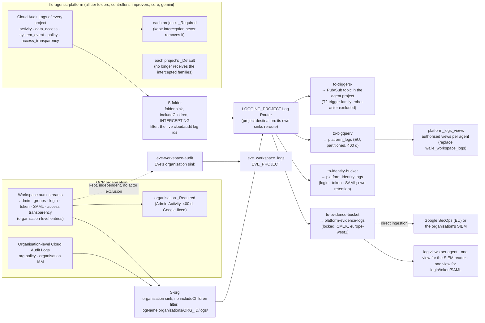
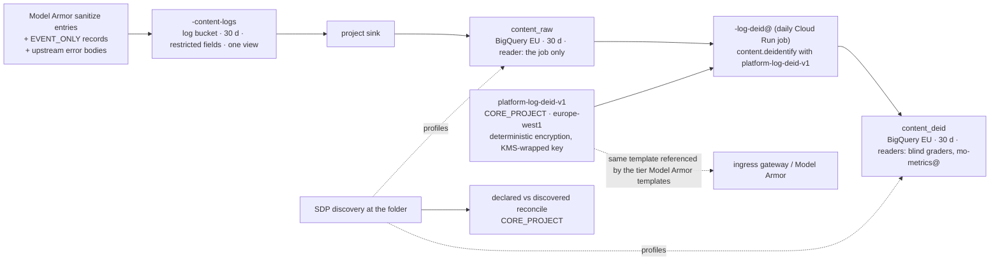

# 8. Data, logging, retention and sovereignty

## Status
- Owner: the platform owner
- Last reviewed: 2026-09-14
- Maturity: detailed design, written 2026-09-13 under [01-hld.md](01-hld.md). Nothing is built.
  This page details the HLD's §3.1 `LOGGING_PROJECT`, §7.1 "Central logging" and "Data Access
  audit config" rows, §7.5 "Retention", §8.2 "Sovereignty", the data-at-rest lines of §8.3, the
  R-A evidence class of §10 and the evidence perimeter of §13.2. It answers the brief items of
  [00-objective-review.md](00-objective-review.md) §5 G (logging, retention, data), which list
  the gap ids they close; page 09 owns the secrets and key conventions, and the recovery classes
  stay in the HLD §10.
- What this page is: the schedule every store on the platform is created against, the sink
  topology of the central logging project, the Data Access audit configuration and who pays for
  it, the Sensitive Data Protection standard, the classification of every store with an owner
  per project, and the sovereignty decision with its compensating set. Every control names its
  owner (a role), the resource it sits on, how it is verified and what happens when it fails.
- What this page is not: the SIEM content (HLD §7.3; the rules are
  [07 §6](07-monitoring-detection-incident-response.md#6-the-detection-catalogue)), the incident process (HLD §7.6), the
  recovery drills (HLD §10), the key conventions table (page 09), the compliance mapping rows
  (the compliance mapping page of HLD §14.3).
- Standing constraints: as stated in the [HLD Status](01-hld.md#status). On this page they mean
  that every feed is organisation-owned or reads through a consented scope, no store is written
  by a model, and a model reads a store only through the authorised views its agent's page names.
- Conventions: `Assumption:` marks inferred facts; *tbd* marks values nobody has decided; every
  Google product, launch stage, region, role, constraint and article named here was re-verified
  on 2026-09-13 against the URL in §12 unless the row says "unverified". Decisions this page
  records are **P104–P114** in [12-open-decisions.md](12-open-decisions.md). Store names in
  `code` are proposals for the factory's variables, not created resources.

---

## 1. The rule this page rests on

Three sentences carry everything below.

1. **Every store is created by the factory from four inputs — data class, owner, retention and
   readers — and a store the schedule does not know is a drift finding.** The register row's
   `data_class` label (HLD §3.4) is not documentation; it is the variable the factory module
   reads to pick the retention, the lock state, the reader pattern and whether Sensitive Data
   Protection profiles the store. An agent owner who wants a different number changes the
   register row through a pull request, never the bucket.
2. **Evidence exists three times, and each copy has a different failure.** The agent's own
   store fails when the agent's project is torn down or its owner rewrites it; the central copy
   in `LOGGING_PROJECT` fails when an organisation administrator re-filters the sink; the
   verifier's locked bucket and the witness fail only when Google's retention lock fails. Only
   the third copy is preventive; the first two are detective with an absence alarm, and this
   page says so in every integrity column instead of calling "append-only by IAM" immutable.
3. **Retention is decided once, per data class, with a floor the platform sets and a ceiling
   the data protection officer sets, and a locked store is locked only after the ceiling is
   recorded** — because a locked retention period can be lengthened later and never shortened
   (Cloud Logging buckets and Cloud Storage retention policies alike, §12), so locking on an
   `Assumption:` would take the DPO's decision away from them in one direction.

Grades use the HLD's two words: **enforcement** (Google or the platform refuses the action) or
**detection** (it happens and something independent sees it within a stated latency). Nothing
detection-grade stands alone in a safety argument (HLD §0.2).

---

## 2. Every platform store, classified (G56)

### 2.1 The five data classes

The organisation's classification scheme is *tbd* (the ISMS owns it; HLD P20 sets the TISAX
target at Confidential, `Assumption:`). Until the mapping is signed, the platform uses five
classes of its own, chosen so that each implies one retention line, one reader pattern and one
integrity mechanism. The register's `data_class` label takes exactly one of these values, and
the factory refuses a manifest without it.

| Class | What it holds | Personal data | Default retention (§5) | Integrity mechanism | Reader pattern | `Assumption:` mapping to the organisation's scheme |
|---|---|---|---|---|---|---|
| `evidence` | Audit rows on the platform schema, Google-written audit streams, verifier findings and verdicts, attestation bundles, SCC findings, PAM grants, alert and incident history | yes — actor and target ids, surrogates, IP addresses in Google's streams | **400 days**, floor and ceiling, locked where the store can be locked | locked bucket (preventive) for the anchored copy; IAM + daily export + snapshot (detective) for BigQuery | verifier identities, the security reviewer, the SIEM's reader; agent owners through views; never a model | Confidential |
| `content` | Raw prompts, model responses, tool arguments and responses, Model Armor sanitize payloads, upstream error bodies, `EVENT_ONLY` telemetry records | yes — names, addresses, group memberships, the operator's address | **30 days**, ceiling, not locked | none beyond retention; the store is deliberately short-lived | the agent's operators group and `platform-security@` through one log view; a de-identified copy for graders and Mo | Confidential (Strictly confidential if the organisation's scheme so classes tenant content — P20 reopens) |
| `control` | Firestore live state: ladder config, plans, approvals, holds, halts, counters, `config_versions` | ids only | life of the agent; PITR 7 days + daily backups (HLD §10 R-B) | PITR, delete protection, scheduled backups; `config_versions` hashes | the action service and the verifier; humans through the approval surface | Confidential |
| `record` | Decision records, compliance snapshots, drill and tabletop records, Audit Manager reports, the frozen Annex IV set | no (names of role holders only) | **10 years** (Art. 18), locked | locked bucket + git branch protection | everyone with the wiki; the ISMS; the assessor | Internal |
| `secret` | OAuth clients, refresh tokens, HMAC keys, signing keys, robot passwords, the surrogate-key mapping | the mapping is personal data; the rest are credentials | no retention: rotation per page 09; disable-never-destroy inside the evidence horizon (HLD §10 R-K) | Secret Manager versions, Cloud KMS key states, Data Access logs on every access | the one attached identity per secret; no human in steady state | Strictly confidential |
| `ops` | `_Default` project logs, Cloud Trace spans with content off, metrics, build logs, billing export | low — principal ids | **30 days** (Google's default; Cloud Trace fixed) | none | project owners through PAM; builders | Internal |

`walle_metrics_private` is class `secret` on purpose: it is the one table that makes every
surrogate in Mo's views reversible, and Mo's set already gives it one writer and no reader
([../mo/02-identity-and-access.md](../mo/02-identity-and-access.md) §4). Classing it `secret`
carries that rule into the platform: no discovery scan profiles it (§6.2), no export copies it,
no view fronts it.

### 2.2 The store inventory

One row per store the four projects and the core hold on 2026-09-13, plus the stores this page
adds. "Owner" is the asset owner role of §8; "Producer" is the only writer. The retention column
points at §5, where the number, the lock state and the legal basis live.

| # | Store | Project | Kind and location | Class | Producer | Readers | Owner (role) | Retention row |
|---|---|---|---|---|---|---|---|---|
| S1 | `<agent>_audit` (`walle_audit` today: `actions`, `runs`, `plans`, `approvals`, `verifications`, `config_versions`, `ladder_events`, `playbook_declarations`) | agent project | BigQuery, `EU` | `evidence` | the action service (`walleAuditWriter`, insert-only) | verifier identities, `mo-metrics@`, the validator custodian — dataset-level `READER` | agent owner | R1 |
| S2 | `walle_workspace_logs` | `WALLE_PROJECT` | BigQuery, `EU` — **becomes an authorised view over the central copy (S12), P107** | `evidence` | today: the org sink `walle-audit-bq`; after P107: none (a view) | `mo-metrics@`, `eve-verifier@` (decision 47) | agent owner | R3 |
| S3 | `eve_workspace_logs` | `EVE_PROJECT` | BigQuery, `EU`, DAY-partitioned, 400-day partition expiry | `evidence` | Eve's **independent** org sink `eve-workspace-audit`, no actor exclusion — **kept** (HLD §7.1) | `eve-verifier@`, `eve-advisor@` through views | Eve owner | R3 |
| S4 | `eve.*` (`findings`, `verdicts`, `incidents`, `pages`, `seeded_fault_runs`), `eve_quality`, `eve_receipts` (view dataset), `eve_advice`, `eve_audit_mirror` (the `walle_audit` mirror, decision 51; distinct from `eve_mirror`, which is only the witness dataset of S6) | `EVE_PROJECT` | BigQuery, `EU` | `evidence` | `eve-controller@`, `eve-verifier@`; `eve-advisor@` on `eve_advice` only | per [../eve/03-lld.md](../eve/03-lld.md) §8–§9 | Eve owner | R2 |
| S5 | Eve's locked evidence bucket `gs://${EVE_PROJECT}-eve-evidence` (`keys/`, `ladder/`, attestation bundles, and from this page `exports/`) | `EVE_PROJECT` | Cloud Storage, `europe-west1`, **retention policy locked** | `evidence` (`keys/` is public-key material, not secret) | `eve-verifier@`, `CI_DEPLOYER` on `ladder/`, `eve-export@` on `exports/` | Eve identities, `eve-export@` | Eve owner | R2 |
| S6 | Witness stores: dataset `eve_mirror` and the witness bucket | `EVE_WITNESS_PROJECT` (`org-witness`) | BigQuery + Cloud Storage, EU; bucket retention locked; **Google-managed encryption, never a tenant key (P112)** | `evidence` | `eve-export@` (push; two create-only grants, HLD §13.2) | the two witness administrators; the SIEM | Eve owner (witness administrators as custodians) | R2 |
| S7 | Firestore `(default)` per agent | agent project | Firestore, `europe-west1`, PITR, delete protection, daily backups | `control` | the action service | the verifier by the decision-44 path | agent owner | R10 |
| S8 | `<agent>-content-logs` (`walle-content-logs`): Model Armor sanitize entries, `EVENT_ONLY` records, upstream error bodies | agent project | Cloud Logging bucket, `europe-west1`, `_Default` exclusion, **restricted fields on the content paths** | `content` | Model Armor, Agent Observability, the action service | one log view; readers generated by the factory (§6.3) | agent owner | R6 |
| S9 | `content_raw` and `content_deid` | agent project | BigQuery, `EU` — the sink copy of S8 and its de-identified twin (§6.3) | `content` | the S8 sink; the de-identify job | `content_raw`: nobody but the job; `content_deid`: blind graders, `mo-metrics@` | agent owner | R6, R7 |
| S10 | Cloud Trace `_Trace` and the linked Spans dataset `walle_spans` | agent project | Cloud Trace (30 days, fixed) + Observability Analytics linked dataset | `ops` (span content **off**, `ADK_CAPTURE_MESSAGE_CONTENT_IN_SPANS=false`, drift-checked — [../wall-e/11-prompt-security.md](../wall-e/11-prompt-security.md) §6) | Agent Runtime | builders, `mo-metrics@` at S3 | agent owner | R9 |
| S11 | `_Required` and `_Default` per project; the organisation `_Required` and `_Default` | every project; the organisation | Cloud Logging, region not selectable for the organisation buckets | `evidence` (`_Required`), `ops` (`_Default`) | Google | project viewers; organisation viewers | platform owner | R4, R9 |
| S12 | **`platform-evidence-logs`** — the locked central log bucket | `LOGGING_PROJECT` | Cloud Logging bucket, `europe-west1`, CMEK (§9), Observability Analytics on, **locked after P106's lock trigger** | `evidence` | the sinks of §3 | log views per agent; the SIEM reader; `platform-security@` | platform owner | R3, R4 |
| S13 | **`platform-identity-logs`** — login, OAuth-token Data Access and SAML entries of every account in the tenant | `LOGGING_PROJECT` | Cloud Logging bucket, `europe-west1`, CMEK, own retention line, locked on the same trigger | `evidence` — **the densest personal-data store on the platform** (every employee's sign-ins) | the org sink (§3) | one view; readers: the security reviewer, Eve's reconciler, the SIEM; **no agent owner** | platform owner (DPO as ceiling owner) | R5 |
| S14 | **`platform_logs`** dataset and **`platform_logs_views`** | `LOGGING_PROJECT` | BigQuery, `EU`, DAY-partitioned, 400-day default partition expiry set before the sink writes | `evidence` | the `to-bigquery` sink (§3) | authorised views per agent; the SIEM if it reads BigQuery | platform owner | R3 |
| S15 | **`platform-evidence`** and **`platform-records`** — the platform evidence lake | `CORE_PROJECT` | Cloud Storage, `europe-west1`, retention policies locked (400 days / 10 years), CMEK | `evidence` / `record` | the daily export jobs of §5.4; Audit Manager; the incident system's monthly export; CI for decision records | the security reviewer, the ISMS, the assessor; agent owners through prefixes | platform owner | R2, R11, R12 |
| S16 | Regional secrets `<agent>-<purpose>`; KMS rings and keys | secrets: the agent, controller and core projects; keys: `KMS_PROJECT` (Autokey and engine keys — page 09 P118's fifth core project), ring `eve` in `EVE_PROJECT` (approval), ring `supply-chain` in `CICD_PROJECT` (attestors) | Secret Manager `europe-west1`; Cloud KMS `europe-west1`, **HSM for every key by `cloudkms.allowedProtectionLevels` at the folder (page 09 §2.3)** | `secret` | the runbooks' bootstrap; Autokey | the one attached identity each | agent owner; Eve owner for `eve-approval`; platform owner for `KMS_PROJECT` | page 09 |
| S17 | Gemini Enterprise conversation history (assistant chat sessions) | `GEMINI_PROJECT` — the tenant app in `eu` | Google-managed store inside the app | `content` | the app | the signed-in user; Google's own retention setting | Gemini Enterprise admin | R8 |
| S18 | `discoveryengine.googleapis.com` Data Access entries (`StreamAssist`, `AnswerQuery`, `GetAgentCard`) — the human's actual requests | `GEMINI_PROJECT` → S12 by the folder sink | Cloud Logging | `evidence` | Google | as S12 | Gemini Enterprise admin | R4 |
| S19 | Mo: `walle_metrics`, `walle_metrics_archive` (daily snapshots), `walle_metrics_views`; the drop box `mo-proposals` | `MO_PROJECT` | BigQuery `EU`; Cloud Storage `europe-west1` | `evidence` (archive: a promotion cites it), `ops` (working tables) | `mo-metrics@`; `mo-analyst@` on the drop box | per [../mo/02-identity-and-access.md](../mo/02-identity-and-access.md) | Mo owner | R13 |
| S20 | `walle_metrics_private` (`principal_surrogates`) | `MO_PROJECT` | BigQuery `EU` | **`secret`** | `mo-metrics@` — the only binding | nobody, ever (MD-13) | Mo owner | R13 |
| S21 | Register of record (git), `agent-manifest.yaml`s, decision files, Agent Registry cards, `config_versions` | git host (P22); `CORE_PROJECT` registry | git + Agent Registry `europe-west1` | `record` | humans by pull request; the factory for cards | everyone with the wiki | platform owner | R11 |
| S22 | CI: Artifact Registry images, SLSA provenance, build logs, Terraform state (versioned bucket with a retention policy and a second-region copy, HLD §10 R-D) | `CICD_PROJECT` | Artifact Registry + Cloud Storage `europe-west1` | `ops` (state: `control`) | the CI identity | deployers through PAM | platform owner | R9, R10 |
| S23 | SCC findings; Sensitive Data Protection data profiles (`sensitive_data_protection_discovery`) | organisation; `LOGGING_PROJECT` | SCC; BigQuery `EU` | `evidence` | Google; the discovery service agent | IT security; the platform owner | IT security | R4, R14 |
| S24 | SIEM store (SecOps or the organisation's) | outside the folder | per P10 | `evidence` | the four feeds of HLD §7.1 | the detection desk | IT security | R15 |
| S25 | Incident records | SecOps case management or the organisation's ITSM (HLD §7.6) | outside the folder | `evidence` → monthly export to S15 | the incident commander | IT security, the DPO | IT security | R16 (cases), R11 (reports) |
| S26 | Billing export keyed on labels | `LOGGING_PROJECT` | BigQuery `EU` | `ops` | Google Billing | the platform owner | platform owner | R9 |
| S27 | Access Transparency and Access Approval history | organisation `_Required`; Access Approval API | Cloud Logging; Google-managed | `evidence` | Google | as S12; the approvers | IT security | R4 |

What is deliberately not a store: Memory Bank (off by choice, [../wall-e/ARCHITECTURE.md](../wall-e/ARCHITECTURE.md)
§9); Workspace tenant data (the platform never backs up Workspace, HLD §10 R-W); the model's
own prompt retention (a supplier-file line, HLD §14.3: no training, no retention beyond abuse
monitoring, confirmed per pinned model).

---

## 3. The central logging project (G54)

### 3.1 What one sink can and cannot do, and the topology that follows

The HLD says "one organisation-level aggregated sink with `includeChildren` over
`fld-agentic-platform` plus the Workspace audit logs, into a locked bucket and a BigQuery
dataset" (§7.1). Three verified facts shape the build of that sentence:

- A sink has **one** destination. "Locked bucket and BigQuery dataset" is therefore either two
  sinks with the same filter or one sink into a **Google Cloud project destination**, whose own
  sinks then fan the entries out — Google documents the second form as the recommended central
  pattern ("an aggregated sink that routes your organization's audit logs to a Google Cloud
  project, which then routes the aggregated audit logs to a log bucket"; §12), with a one-hop
  limit: the destination project's sinks cannot route to yet another project.
- Workspace audit logs are **organisation-level** log entries (`logName` under
  `organizations/ORG_ID/logs/…`); a folder sink never sees them, and an organisation sink
  without `includeChildren` sees only them plus the organisation's own Cloud Audit Logs
  (org-policy and organisation IAM changes — exactly the `SetIamPolicy`-at-organisation rule
  SG-01 of [07 §6.3](07-monitoring-detection-incident-response.md#63-the-super-admin-set-gcp-organisation-side--the-reach-into-the-organisation)).
- An **intercepting** aggregated sink at a folder "prevents log entries from being routed to
  sinks in child resources, except for the `_Required` sinks in the resources where the log
  entries originate", and its destination must be a project (§12). For Data Access logs that is
  the difference between one stored copy (the central one) and N+1 copies (one per agent
  project's `_Default`, each billed, each shortenable by that project's owner). It is also what
  makes trust boundary B7's "the agent cannot silence its logs" (HLD §15) a folder property: a
  project owner deleting their `_Default` bucket removes nothing the platform keeps.

So "one sink" becomes **one filter, expressed as two aggregated sinks with the same
destination project**, plus fan-out sinks inside that project. All are Terraform in the factory's
`platform-core` module, owned by the platform owner, drift-checked.

### 3.2 The sinks

| Sink | Level and flags | Inclusion filter | Destination | Writer identity grant (made by the factory) | Verified by | When it fails |
|---|---|---|---|---|---|---|
| `S-org` | organisation; **no** `--include-children` (organisation-level entries only, so no other folder of the organisation is swept into the platform's store) | `logName:"organizations/ORG_ID/logs/"` — all six Workspace streams (Admin, Enterprise Groups, Login, OAuth Token, SAML, Access Transparency) and the organisation's own Cloud Audit Logs | `logging.googleapis.com/projects/LOGGING_PROJECT` | `roles/logging.logWriter` on `LOGGING_PROJECT` for the sink's writer identity | the daily drift job compares the sink's `filter`, `destination` and `disabled` against Terraform; the SIEM rule on any `logging.sinks.*` change (SG-02, [07 §6.3](07-monitoring-detection-incident-response.md#63-the-super-admin-set-gcp-organisation-side--the-reach-into-the-organisation)) | Workspace rows stop arriving → the absence alarm on `eve_workspace_logs` (60 min in business hours, H-1 of [07 §7](07-monitoring-detection-incident-response.md#7-pipeline-heartbeats-and-the-logpipelinesilent-halt)) fires from Eve's **independent** sink, which is the reason Eve's sink is kept rather than merged; halt reason `log_pipeline_silent` |
| `S-folder` | `fld-agentic-platform`; `--include-children`; **`--intercept-children`** | `LOG_ID("cloudaudit.googleapis.com/activity") OR LOG_ID("cloudaudit.googleapis.com/data_access") OR LOG_ID("cloudaudit.googleapis.com/system_event") OR LOG_ID("cloudaudit.googleapis.com/policy") OR LOG_ID("cloudaudit.googleapis.com/access_transparency")` — audit families only, so content logs, sanitize logs, telemetry and `_Default` operational logs stay in the agent project's own buckets and are **not** intercepted | `logging.googleapis.com/projects/LOGGING_PROJECT` | as above | drift job; a **Data Access canary** (§4.3) proves the path end to end daily | an agent project stops appearing → the canary and the per-agent absence policy of the monitoring baseline (HLD §7.2) |
| `to-evidence-bucket` | `LOGGING_PROJECT`, project sink | the `S-folder` families **plus** `S-org` entries **minus** `LOG_ID("cloudaudit.googleapis.com/data_access") AND protoPayload.serviceName=("login.googleapis.com" OR "token.googleapis.com" OR "saml.googleapis.com")` | log bucket `platform-evidence-logs` | the project's own bucket: `logging.bucketWriter` by the Log Router | drift job; bucket `locked=true` and `retentionDays` read daily (§5.2) | the bucket refuses writes only if its CMEK key is disabled (§9) → severity 1, the key state alert |
| `to-identity-bucket` | project sink | exactly the three services excluded above (Login, OAuth-token Data Access, SAML) | log bucket `platform-identity-logs` | as above | as above | as above |
| `to-bigquery` | project sink, `--use-partitioned-tables` | the `S-folder` families plus `S-org` entries, **excluding** the three identity services (BigQuery holds no copy of every employee's sign-ins; the SIEM and the identity bucket do) | BigQuery dataset `platform_logs` in `EU` — created first, `default_partition_expiration = 400 days` set **before** the sink writes (Eve's runbook proved the order matters; [../eve/07-build-runbook.md](../eve/07-build-runbook.md) Phase 7) | `roles/bigquery.dataEditor` **dataset-level** on `platform_logs` for the sink's writer identity, nothing at project level | drift job; a daily row-count reconciliation between `platform_logs` and the evidence bucket's Observability Analytics view | rows missing in one copy → finding; the bucket copy is the anchor |
| `to-triggers-<agent>` | project sink, one per Tier W+ agent whose manifest declares a T2 trigger family | `protoPayload.serviceName="admin.googleapis.com" AND NOT protoPayload.authenticationInfo.principalEmail="<robot>@<domain>" AND (<the family's event filter from the manifest>)` | Pub/Sub topic `<agent>-triggers` in the agent project | `roles/pubsub.publisher` on that topic for the writer identity — made by the factory's `agent-project` module, which replaces topology row 23 | drift job; the agent's own absence policy on the trigger topic | the trigger stream dies → the agent's "missing two consecutive windows" alert ([../wall-e/ARCHITECTURE.md](../wall-e/ARCHITECTURE.md) §11 weakness 9); no evidence is lost, only a trigger |

**The actor exclusion is on the trigger sinks only.** The same Workspace admin-activity entries
reach two kinds of destination with two different filters: a `to-triggers-<agent>` sink
**excludes the agent's robot as actor**, otherwise every write the agent makes produces an event
that starts another run that writes again; the evidence copies (`S-org` → `to-evidence-bucket`
and `to-bigquery`, and Eve's independent `eve-workspace-audit`) carry **no principal filter,
deliberately**, because they exist to reconcile what the robot actually did against what the
agent says it did. Applying the exclusion to the evidence copies would leave the
audit-completeness metric and Eve's independent record with zero rows about the robot — the
very control being claimed. The build test: the BigQuery copy (`platform_logs`, and the
`walle_workspace_logs` view over it) contains the robot's own writes. The second hop the
exclusion leaves open (Google's own engines reacting to the robot's write, attributed to the
system) is the agent's dispatcher's problem, not the sink's
([../wall-e/ARCHITECTURE.md](../wall-e/ARCHITECTURE.md) §2.2).

What this replaces, per agent set (HLD §18 items 5, 13, 25 and the "existing agent sinks become
views" line):

| Today | After this page |
|---|---|
| Wall-E's organisation sink `walle-audit-bq` → `walle_workspace_logs` | deleted; `walle_workspace_logs` becomes the authorised view `platform_logs_views.walle_workspace_logs` over `platform_logs`, filtered to `admin.googleapis.com`, with `mo-metrics@` and `eve-verifier@` holding dataset-level `READER` on `platform_logs_views` (decision 47's data-level check reads the same view). The view's dataset is in `LOGGING_PROJECT`, so the two cross-project grants move from `WALLE_PROJECT` to `LOGGING_PROJECT` ([../project-topology.md](../project-topology.md) §3 row 40) |
| Wall-E's organisation sink `walle-workspace-audit` → topic `walle-triggers` (robot excluded) | replaced by `to-triggers-walle` in `LOGGING_PROJECT` — same filter, same exclusion, same topic; the organisation-level `logging.configWriter` grant Wall-E's runbook needed (PREREQUISITES §4.1) disappears from every agent runbook |
| Eve's organisation sink `eve-workspace-audit` → `eve_workspace_logs` | **kept unchanged**, with its filter widened to the six streams as HLD §13.2 requires; it is the independent copy that P6 needs, and it is the one sink outside `LOGGING_PROJECT` |
| Per-project Data Access logs stored in each `_Default` | intercepted; stored once in `platform-evidence-logs`; each project keeps only its `_Required` |
| `walle-content-logs` and its project sink | unchanged (not intercepted); gains restricted fields and generated readers (§6.3) |

### 3.3 Log views, and who reads what

Cloud Logging has no bucket-level IAM; access is by **log view**, at most 30 per bucket, with
`roles/logging.viewAccessor` bound on the view (verified, §12). Any principal holding
`logging.views.access` at project level (`roles/logging.viewer`, `logging.privateLogViewer`,
`logging.admin`, basic `owner`/`editor`/`viewer`) reads every view regardless — which is why
`LOGGING_PROJECT` carries **no standing project-level logging reader**: the factory removes
`roles/owner` after its run (HLD §3.2), humans get project-level roles back only through PAM
(HLD §4.4), and the drift job lists every project-level binding in `LOGGING_PROJECT` daily and
expects exactly the sink writer identities and the Terraform CI identity.

| View (bucket) | Filter | Readers | Grade |
|---|---|---|---|
| `agent-<agent>` (`platform-evidence-logs`) | `source("projects/<agent project>")` OR `protoPayload.authenticationInfo.principalEmail` in the agent's principal set (engine identity, action-service SA, robot account) | `<agent>-owners@`, `<agent>-operators@` | enforcement (view filter), 30-view cap → **a bucket per tier folder when an agents folder passes ~25 agents** (`platform-evidence-logs-w`, `-p`, …), which the factory handles by tier variable |
| `verifier-<agent>` | as above plus the `S-org` Workspace entries where the actor or a target is the agent's robot | the agent's verifier identities (Eve's for Wall-E) | enforcement |
| `siem` | everything | the SIEM's ingestion identity (P10) | enforcement |
| `security` | everything | `platform-security@` (the security reviewer, IT security) | enforcement |
| `ge-requests` (`platform-evidence-logs`) | `protoPayload.serviceName="discoveryengine.googleapis.com"` AND `methodName` in (`StreamAssist`, `AnswerQuery`, `Search`, `GetAgentCard`) — the human's requests, the source of the `sub` in the correlation contract; the view [03-gemini-enterprise-environment.md](03-gemini-enterprise-environment.md) §13 names | the Gemini Enterprise admin, the security reviewer, the SIEM | enforcement |
| `identity` (`platform-identity-logs`) | everything in that bucket | the security reviewer, `eve-verifier@` (reconciliation of `login`/`token` events for the robots), the SIEM — **no agent owner, no operator** | enforcement |
| `_AllLogs` | Google's default view | nobody bound | — |

Log scope: one log scope and one observability scope across the folder and the organisation's
Workspace logs (HLD §7.4) are created here, in `LOGGING_PROJECT`, for the "one request end to
end" query set.

### 3.4 Cost and its owner

The largest cost line in the set on 2026-09-13 is central log ingestion and locked retention
(HLD §0.5), paid by the **platform** from Tier R. This page makes the driver visible instead of
quoting prices (pricing pages are not quoted on this set; Google's pricing page rendered
truncated on 2026-09-13, and the only verified statement is the buckets page's "retention costs
apply to logs data retained longer than the default retention period", §12):

| Driver | Where it lands | Reduced by |
|---|---|---|
| Workspace audit volume (six streams, every user's logins) | `LOGGING_PROJECT` | nothing — this is the evidence; the identity bucket's separate retention line is the only lever, and it is the DPO's |
| Data Access logs of §4 | `LOGGING_PROJECT` (`Assumption:` ingestion is billed to the project whose bucket stores the entry, so interception moves the whole Data Access bill onto the platform line; verified on the first invoice, P105) | the service list of §4 (no `allServices`), `storage` only at project level on evidence holders, no Firestore `DATA_READ` on Tier R projects (they hold no control plane) |
| 400-day retention beyond Google's 30-day default | `LOGGING_PROJECT` | nothing; the number is the schedule's |
| BigQuery storage of `platform_logs` | `LOGGING_PROJECT` | partition expiry; identity services excluded |
| SIEM events per day | IT security (P10) | the SIEM feed reads the `siem` view, not the identity bucket, unless IT security asks |

A budget alert on `LOGGING_PROJECT` at 80 % and 100 % of its line pages `platform-owners@`; the
quarterly quota review (HLD §3.4, P31) records the volume per family so that the second Tier W
agent's cost is a number, not a surprise.

---

## 4. Data Access audit logging (G53)

### 4.1 The configuration

One `auditConfigs` block on the IAM policy of `fld-agentic-platform`, held in Terraform, applied
by the factory's `platform-core` module. Google's semantics make the folder the right place:
"the resulting configuration for the service is the union of the two configurations" and a
folder or project "cannot disable logs enabled at organization level" — so nothing below the
folder can switch these logs off, and the only way to silence them is a folder-level policy
write, which is itself an Admin Activity entry the SIEM rule on `auditConfigs` changes catches
(SG-02, [07 §6.3](07-monitoring-detection-incident-response.md#63-the-super-admin-set-gcp-organisation-side--the-reach-into-the-organisation)). `exemptedMembers` is empty for every service: no agent principal, no robot, no
deployer is exempt.

| Service (`auditConfigs.service`) | Log types | Why this service, which operations matter | Volume driver |
|---|---|---|---|
| `secretmanager.googleapis.com` | `DATA_READ`, `DATA_WRITE` | `AccessSecretVersion` is `DATA_READ`; without it the secret access alert (HLD §8.3; the rule is "The access alert" of [09 §2.1](09-supply-chain-secrets-recovery.md#21-secret-conventions): caller ≠ the secret's declared `reader`) has no source | one entry per token refresh — low |
| `cloudkms.googleapis.com` | `DATA_READ`, `DATA_WRITE` | `AsymmetricSign` needs `useToSign`, typed `DATA_READ` — the only independent record that an Eve approval signature was produced, and by whom ([../eve/02-identity-and-auth.md](../eve/02-identity-and-auth.md) "The signing key"); today enabled only by Eve's runbook, now by the folder | one per approval — low |
| `iap.googleapis.com` | `DATA_READ`, `DATA_WRITE` | every authorisation decision on the approval surface, `eve-console` and any control surface behind IAP with Context-Aware Access (HLD §4.6) | one per request — low |
| `firestore.googleapis.com` | `DATA_READ`, `DATA_WRITE` | who read and wrote the control plane (plans, approvals, halts) beside the action service; the read half is what shows a human or a foreign identity browsing the ladder | **the highest-volume line**: the action service's own reads are logged too. Applied at the folder as the HLD says; if the first invoice shows it dominating, the dated exception is `DATA_WRITE` only on Tier W (not P) projects, recorded in §11, never a removal on Tier P or the controllers |
| `aiplatform.googleapis.com` | `DATA_READ`, `DATA_WRITE` | `reasoningEngines.query`/`streamQuery` calls — the record that the tenant app (or something else) invoked the engine; joins to `invocation_id` | one per invocation — low |
| `discoveryengine.googleapis.com` | `DATA_READ`, `DATA_WRITE` | `StreamAssist`, `AnswerQuery`, `GetAgentCard` — **the human's actual requests**, off unless enabled (verified in §12); the source of the human `sub` in the correlation contract (HLD §7.4). Inherited into `fld-gemini-enterprise` from the platform folder, as the `fld-gemini-enterprise` row of [02 §2.2](02-landing-zone-and-tiers.md#22-every-folder-its-purpose-its-policy-additions-who-may-create-below-it) records | one per assistant turn — moderate |
| `sts.googleapis.com` | `DATA_READ`, `DATA_WRITE` | token exchanges: Workload Identity Federation for the CI deployer, and any credential exchange an intruder attempts | low |
| `logging.googleapis.com` | `DATA_READ` | `ListLogEntries` and bucket/sink/view reads — **who read the evidence**; the Admin Activity half (sink, bucket, view, exclusion changes) is always on (verified list in §12) | low |
| `agentidentity.googleapis.com` | `DATA_READ`, `DATA_WRITE` | the service is on the audit-log services list (verified, §12); which of its operations are typed Data Access is **unverified** (`Assumption:` credential issuance for an agent identity is `DATA_READ`) — enabled so that every credential minted for a reasoning layer (HLD §4.1) has an independent record beside the identity drift job; reviewed after the first month's volume | one per credential issuance — low (`Assumption:`) |
| `agentregistry.googleapis.com` | `ADMIN_READ` — scoped to `CORE_PROJECT`, the one project holding the shared Agent Registry (P80) | who read the fleet inventory — an evidence question after any incident. `Get*`, `List*`, `Search*` and `FetchAvailableBindings` are `ADMIN_READ` and write Data Access entries only when enabled; `CreateService`, `UpdateService`, `DeleteService`, `Create/Update/DeleteBinding` (and the v1alpha skill methods) are `ADMIN_WRITE`, Admin Activity, always on — what the registry-write alert of [../wall-e/13-agent-interconnection.md](../wall-e/13-agent-interconnection.md) §11 reads. Verified 2026-09-14: the product's [audit-logging page](https://docs.cloud.google.com/agent-registry/audit-logging) (updated 2026-09-03) documents `agentregistry.googleapis.com` and its `ADMIN_READ` Data Access entries, while the general [audit-log services list](https://docs.cloud.google.com/logging/docs/audit/services) (updated 2026-09-09) still does not name the service. The two Google pages disagree; this page follows the product page, and the canary (§4.3) proves on its first run that the entries arrive — **unverified until then** | the registry is small — negligible |
| `iam.googleapis.com`, `orgpolicy.googleapis.com` | `ADMIN_READ` | policy *reads* (`GetIamPolicy`, `GetPolicy`) — reconnaissance before an escalation; a cheap addition this page makes to the HLD's list, stated as such | low |
| `storage.googleapis.com` | `DATA_READ`, `DATA_WRITE` — **project level**, not folder | on the evidence holders only: `LOGGING_PROJECT`, `CORE_PROJECT`, `EVE_PROJECT` and, on its own side, `EVE_WITNESS_PROJECT`. A folder-wide `storage` `DATA_READ` would log every CI staging read and every Terraform state read; the HLD's "storage on evidence buckets" is an audit config per service, not per bucket, so project scope is the narrowest form Google offers | moderate on `CICD_PROJECT` if it were included — it is not |
| `bigquery.googleapis.com` | — | BigQuery Data Access logs "can't be disabled" (verified): every read of `walle_audit`, `eve.*`, `platform_logs` is already recorded; nothing to configure, and the fact is recorded so nobody adds it and doubles nothing | already paid |

Not included, with the reason: `allServices` (cost without a detection that reads it);
`run.googleapis.com` (invocations are in the action service's own audit rows and IAP; Cloud Run
Data Access logs add volume the catalogue does not use); `pubsub.googleapis.com` (the events are
metadata; the subscriptions are IAM-bound and drift-checked); `agentgateway` and Agent Runtime — **not on the audit-log services list** (re-read 2026-09-14, §12; `agentidentity.googleapis.com` **is** on it and has its own row above) and with no product audit-logging page read that types their operations, so no Data Access family is enabled for them; their Admin Activity entries are on by default. `agentregistry` is absent from the same list but has its own row above, on the strength of its product page.

### 4.2 Owner, verification, failure

| Control | Owner | Resource | Verified by | When it fails |
|---|---|---|---|---|
| DL-4.1 folder `auditConfigs` as in §4.1, no exemptions | platform owner | IAM policy of `fld-agentic-platform` (+ the four project-level `storage` configs) | the drift job (HLD §4.7) reads `folders.getIamPolicy` daily and compares the `auditConfigs` block byte for byte with Terraform; a Security Health Analytics custom module flags any project in the folder whose effective config for the folder-level services of §4.1 is narrower than the folder's (should be impossible by union semantics; the module proves the semantics still hold) | a diff is a severity-2 finding; a removal at folder level is the SIEM's severity-1 `auditConfigs` rule; **an agent cannot cause this failure** — only a folder or organisation policy admin can, and both are behind PAM |
| DL-4.2 cost line | platform owner (payer); the DPO for the identity bucket's ceiling | `LOGGING_PROJECT` budget | budget alerts; the quarterly quota review records GiB/day per family | over-budget pages `platform-owners@`; the response is never "disable a service" without a dated exception in §11 |
| DL-4.3 the Data Access canary (§4.3) | platform owner | Cloud Run job `platform-logging-canary@CORE_PROJECT` | its own absence alert | absence → severity 1 to the detection desk; halt reason `log_pipeline_silent` for Tier P agents (PL-14, [07 §6.4](07-monitoring-detection-incident-response.md#64-the-platform-set-and-the-agent-set)) |

### 4.3 The canary

Union semantics prove the *configuration*; they do not prove that entries *arrive*. A daily
Cloud Run job in `CORE_PROJECT` (`platform-logging-canary@`, no other grant) performs one
`AccessSecretVersion` on a canary secret `platform-canary` in a canary project under each tier
folder (a factory output), one `GetIamPolicy` on the folder, and one read of a canary Firestore
document, plus one registry read (`ListServices` on the shared Agent Registry in `CORE_PROJECT`,
under `roles/agentregistry.viewer`), then queries `platform-evidence-logs` through the `security`
view for the four entries with its own `insertId`-independent marker (the canary secret's
version label carries a nonce). A missing registry `ADMIN_READ` row is severity 3 to the platform
owner, re-applied by the pipeline within one business day, and the gap window is recorded in the
evidence register as "registry reads unlogged" (P80, [05](05-registry-and-autonomy-contract.md)
§4). All four present within 15 minutes → a heartbeat row in `platform_logs.canary`; any of the
other three missing → alert (DL-4.3). This is the platform-level twin of Eve's evidence heartbeat (HLD §13.2) and
gives "Data Access logs are on" a *last fired* column instead of a checkbox. It is complementary
to the SIEM canary H-2 of [07-monitoring-detection-incident-response.md](07-monitoring-detection-incident-response.md)
§4 (a synthetic Workspace event every 15 minutes proving F1 and F2 reach the SIEM): H-2 proves the
Admin Activity path to the desk, DL-4.3 proves the Data Access families reach the locked bucket;
neither replaces the other.

---

## 5. The retention schedule (G52)

### 5.1 Floor, ceiling and the lock trigger

- **Floor.** For class `evidence`: **400 days**, the number every set already uses
  (`walle_audit` table expiry, Eve's bucket and mirror, `eve.*` partitions, `_Required`). It
  exceeds the AI Act minimum — Art. 26(6) for deployers and Art. 19 for providers both say
  "at least six months" (verified, §12; they apply from 2027-12-02 for Annex III systems, but
  the platform adopts Art. 9–15 voluntarily now, HLD §14.1) — by enough to hold one full annual
  cycle plus the 35-day investigation window the incident process needs, and it matches
  Google's fixed `_Required` retention so that the platform copy and Google's copy expire
  together. Organisation standard: *tbd* (ISMS); if it is longer than 400 days it becomes the
  floor (HLD §7.5: floor = max(six months, organisation standard)). For class `record`:
  **10 years** (Art. 18, HLD §14.1). For class `content`: **30 days is a ceiling, not a floor**
  — data minimisation is the legal basis, and the number can go down but not up without a
  DPIA line.
- **Ceiling.** The DPO's (HLD P13, widening decision 8). The DPO decides one number per
  class, not per store; a store that needs a different number is a dated exception in §11.
  The DPO's decision is due **before Stage 1 of any Tier W agent**, which is what E-14 and M-5
  already require of the Eve and Mo sets, and it is the lock trigger below.
- **The lock trigger (P106).** Every store marked "locked" in §5.2 is created **unlocked** with
  the floor as its retention, and is **locked on the day the DPO's ceiling is recorded** as a
  decision file, at whichever of floor and ceiling is larger — never before, because a locked
  period cannot be shortened (Cloud Logging: "irreversible … you can't delete the bucket until
  every log entry … has fulfilled the bucket's retention period"; Cloud Storage: "the policy
  cannot be removed, and the retention period cannot be reduced", §12). Between creation and
  the lock, the compensating controls are: no `logging.buckets.update` / `storage.buckets.update`
  outside PAM in the evidence projects, and a severity-1 SIEM rule on any `UpdateBucket`,
  `DeleteBucket` or retention-policy change in `LOGGING_PROJECT`, `CORE_PROJECT`, `EVE_PROJECT`
  (rule PL-11 of [07 §6.4](07-monitoring-detection-incident-response.md#64-the-platform-set-and-the-agent-set);
  SG-02 of [07 §6.3](07-monitoring-detection-incident-response.md#63-the-super-admin-set-gcp-organisation-side--the-reach-into-the-organisation)
  covers sink, bucket and view changes on the locked buckets). Eve's bucket is the exception that
  is designed locked at 400 days from Phase 9 of its runbook
  ([../eve/07-build-runbook.md](../eve/07-build-runbook.md)); its lock follows the same trigger
  (the runbook change is open, [12-open-decisions.md](12-open-decisions.md) §7 row 13).
- **Personal data in a locked store.** Locking does not make a retention lawful; the records of
  processing (HLD §14.2, 7.1.2) carry the reasoning per store: the evidence class holds the
  minimum identifiers the Art. 12 purposes need (who requested, who approved, what changed, on
  which principal), and the raw content that would make it a profile is in the `content` class
  at 30 days, never in a locked store. A data-subject request against a locked store is
  answered by disclosure, not deletion, and the DPO's ceiling decision says so in writing.

### 5.2 The schedule

| Row | Store(s) | Region | Days | Locked | Integrity per store (grade) | Personal data | Legal basis | Readers | Owner | Verified by | When it fails |
|---|---|---|---|---|---|---|---|---|---|---|---|
| R1 | S1 `<agent>_audit` — **designated with the frozen plan as the Art. 12 log** (HLD §14.1) | BigQuery `EU` | 400 (table expiry; partition expiry on partitioned tables) | no (BigQuery cannot lock) — **export locked** (R2) | insert-only writer role; no `dataEditor`/`dataOwner` outside PAM; daily JSONL export to the verifier's locked bucket with a manifest; weekly BigQuery table snapshots into a snapshot dataset in `LOGGING_PROJECT` with a 400-day expiry ([09](09-supply-chain-secrets-recovery.md) §3.3, RC-3); BigQuery time travel 7 days (detection + recoverable) | yes — ids, surrogates, `params_redacted` | Art. 12/19/26(6); TISAX 5.2.4 | verifier, Mo, custodian (dataset-level) | agent owner | export manifest row counts = partition counts, daily; the drift job's dataset IAM check | count mismatch → severity 2 finding; a deleted table is recoverable from the export and Eve's mirror; the deletion itself is the SIEM's BigQuery Admin Activity rule |
| R2 | S4 `eve.*`; S5 Eve's bucket (`keys/`, `ladder/`, bundles, `exports/`); S6 witness; S15 `platform-evidence` | `EU` / `europe-west1` | 400 | **yes** (S5, S6, S15 bucket retention policies) | Bucket Lock — **enforcement**: objects cannot be deleted or overwritten inside the period, the policy cannot be shortened, the bucket cannot be deleted (a lien blocks project deletion, [../project-topology.md](../project-topology.md) §1.3); the witness copy on Google-managed encryption so a tenant key cannot brick it | yes | same | Eve identities; the witness administrators; the security reviewer | Eve owner; platform owner for S15 | `retentionPolicy.isLocked=true` read daily by the drift job and by the witness's own check | a write refused by the lock is the design working; the store cannot fail closed on reads |
| R3 | S12 `platform-evidence-logs`; S14 `platform_logs`; S3 `eve_workspace_logs`; the S2 view | `europe-west1` / `EU` | 400 | **yes** for S12 on the trigger; S14 and S3: partition expiry, IAM | S12 Bucket lock (enforcement); S14/S3 dataset-level writer = sink identity only (detection: the SIEM's BigQuery `DeleteTable`/`SetIamPolicy` rules) | yes — every admin's actor and every target in the tenant | TISAX 5.2.4; Art. 12/26(6); the residency exception row (§7.2) | views of §3.3 | platform owner; Eve owner for S3 | bucket `locked`, `retentionDays`; partition expiry read daily; row-count reconciliation S12↔S14 | Eve's absence alarm; the reconciliation finding |
| R4 | S11 organisation and project `_Required` (Admin Activity, System Event, Access Transparency — including the Workspace Admin, Enterprise Groups and OAuth-token Admin Activity entries, which the organisation `_Required` keeps 400 days regardless of routing); S18 Gemini Data Access entries; S23 SCC findings; PAM grants; S27 | Google-fixed for `_Required`; `europe-west1` for the copies | 400 (`_Required`, Google-fixed, not configurable — verified); 400 in S12 for the rest | Google's | Google's for `_Required`; S12's lock for the copy | low to moderate | TISAX 5.2.4 | as S12 | platform owner | the row-count reconciliation S11↔S12 of R3 for Admin Activity and PAM grants (daily); the Data Access canary for S18 | a copy gap in S12: severity 2 to the platform owner, the sink is repaired and the missing window re-exported from `_Required` while it still holds it (400 days); the copy in S12 outlives a project deletion; `_Required` does not (a deleted project's logs go with it) — which is why S12 exists |
| R5 | S13 `platform-identity-logs` — Login, OAuth-token Data Access, SAML entries of **every** tenant account (**edition-conditional**: Google shares Groups Enterprise, Admin and User (login) events with Google Cloud on every edition, but OAuth and SAML events only on Enterprise Standard/Plus, Education Standard/Plus, Voice Premier or Cloud Identity Premium, and Access Transparency events only on Enterprise Plus and Education — [share data with Google Cloud services](https://knowledge.workspace.google.com/admin/getting-started/share-data-with-google-cloud-services), updated 2026-09-10; the tenant's edition is *tbd* per [../google-workspace.md](../google-workspace.md), and the edition is a Stage 0 precondition of this store and of the SIEM completeness check). Unrouted, these Data Access entries live only 30 days in the organisation `_Default` (§5.3) | `europe-west1` | **400, `Assumption:`** — this is the row where the DPO's ceiling most plausibly differs from the floor, because the store is every employee's sign-in history, not the robots' | **yes**, on the trigger, at the DPO's number | Bucket lock | yes — every user | TISAX 5.2.4 (privileged-account monitoring: the robots' logins are severity 1); Art. 6(1)(f) balancing, `Assumption:`, DPO | `identity` view only | platform owner; the DPO for the number | as R3 | as R3 |
| R6 | S8 `<agent>-content-logs` + S9 `content_raw` | `europe-west1` / `EU` | **30** (ceiling) | no | none — short-lived by design; restricted fields + one view (enforcement on readers), the readers bound to the view before any content exists | yes — names, addresses, memberships, the operator's address, full prompt text | minimisation, documented; the S0→S1 decision on `EVENT_ONLY` vs `NO_CONTENT` ([../wall-e/11-prompt-security.md](../wall-e/11-prompt-security.md) §6) | generated view: `<agent>-operators@`, `platform-security@`; `content_raw`: the de-identify job only | agent owner | drift job: bucket `retentionDays=30`, restricted fields present, no project-level logs reader | a longer retention is a drift finding and a DPIA line |
| R7 | S9 `content_deid` — the de-identified copy (§6.3) | `EU` | **30** (`Assumption:` 90 if the DPO approves it for grading and the injection suite's explanations; the request is recorded, not assumed) | no | dataset IAM | reduced — deterministic tokens in place of identifiers; free text kept | same | blind graders, `mo-metrics@` | agent owner | drift job | as R6 |
| R8 | S17 Gemini Enterprise conversation history | tenant app in `eu` | **30**, `Assumption:` — Google's selectable values are 1, 30, 60, 90, 120 or 180 days, default 60, deleted automatically by creation date (verified, §12). 30 is chosen because the audit of what the operator asked is in S1 and S18, not in the chat, and the chat is tenant content about named employees. The conversation store is **not** the platform's Art. 12 log (S1 is), so the six-month floor does not bind it and minimisation argues for short; users may delete their own chats sooner; memory and personalisation are off ([03-gemini-enterprise-environment.md](03-gemini-enterprise-environment.md) §8). [03-gemini-enterprise-environment.md](03-gemini-enterprise-environment.md) §5.4 (its P52) first proposed 90; **30 is the one interim number** both pages and runbook step GE-6 use, and the DPO settles it under HLD P13 before Stage 1 ([12-open-decisions.md](12-open-decisions.md) §7 row 1). **Configuring the assistant "requires the Gemini Enterprise Plus edition"** (verified); the tenant's edition is *tbd*, so on another edition the default 60 stands and is recorded as the number | Google's | Google's | yes | minimisation | the signed-in user; the Gemini Enterprise admin | Gemini Enterprise admin | the drift job cannot read this setting (no API surface verified) — **quarterly manual check**, recorded | drift → the admin corrects it; no evidence depends on it |
| R9 | S10 Cloud Trace (`_Trace`); `_Default` project logs; metrics; S22 build logs; S26 billing export; the agent's Pub/Sub topics (`walle-triggers`, `walle-inbox`, `walle-events` today) and their dead-letter topics | `europe-west1`; Pub/Sub EU (message storage policy confirmed at build) | 30 (Cloud Trace: 30 days, Google-fixed, verified); Pub/Sub message retention **7**, dead-letter topics included | no | none | low with span content off — **`ADK_CAPTURE_MESSAGE_CONTENT_IN_SPANS=false` is the control**, drift-checked | — | builders through PAM | agent owner; platform owner | drift job on the span knob | a `true` on the knob is a severity-2 finding and a DPIA line (traces would then hold content 30 days outside any control) |
| R10 | S7 Firestore; S22 Terraform state | `europe-west1` | life of the agent (plans, approvals and grades kept for the audit window; counters and dedup documents expire on their own windows); PITR 7 days; daily backups kept 35 days (`Assumption:`) | delete protection (not a lock) | PITR + scheduled backups + delete protection (HLD §10 R-B); state bucket versioning + retention policy + second-region copy (R-D) | ids | — | the action service; the verifier | agent owner | the restore drill (HLD §10) | restore boots at `halt_all` |
| R11 | S15 `platform-records`; S21 git decision records; from S25, the Art. 73 reports filed and the post-incident reviews (the **reports**; the incident cases themselves are R16) | `europe-west1`; git | **10 years** | **yes** | Bucket Lock; branch protection | no | Art. 18; TISAX 1.6; Art. 73 | everyone with the wiki; the assessor | platform owner | drift job (`retentionPolicy.isLocked`, `retentionPeriod`); branch-protection check on the wiki repository | lock missing or retention short: severity 1 to `platform-security@`; objects are re-written to a new locked bucket and the gap recorded in the evidence register (§5.5); branch protection off: severity 1, restored by the platform owner, the unprotected window's commits reviewed |
| R12 | Audit Manager reports; tabletop and drill records; the evidence register's artefacts | `platform-evidence` (400) or `platform-records` (10 years) per the evidence register's row | as the row | yes | Bucket Lock | no | HLD §14.3 | as R11 | platform owner | the evidence register's monthly completeness query: every tabletop, drill and Audit Manager run in the calendar has an object under its path (§5.5) | a missing record: severity 2 to the platform owner; the drill or tabletop counts as not held (the ladder freeze and the tabletop cadence of [07](07-monitoring-detection-incident-response.md) §13 apply) until the record is produced |
| R13 | S19 `walle_metrics` (partitioned on `as_of`), `walle_metrics_archive` (daily snapshots with `expiration_timestamp`), S20 `walle_metrics_private` | `EU` | `walle_metrics`: 400 (matches the floor, [../mo/01-hld.md](../mo/01-hld.md)); archive snapshots: 400; `walle_metrics_private`: life of the agent, then deleted at teardown | no | dataset IAM; MD-13 | surrogates; the mapping | — | per Mo's set | Mo owner | Mo's verify steps; drift job reads partition and snapshot expiry | expiry drift: severity 3 to the Mo owner, corrected by Mo's pipeline; `walle_metrics_private` surviving teardown is severity 2 and deleted by the `revoke` operation |
| R14 | S23 SDP data profiles | `EU` | 400 | no | dataset IAM | no (metadata about tables) | — | platform owner, IT security | platform owner | drift job reads the profile dataset's table expiry and IAM daily | expiry or IAM drift: severity 3 to the platform owner, corrected by the pipeline |
| R15 | S24 SIEM | per P10 | **≥ 400 days** — SecOps's default is 12 months (365), extendable to 60 months (HLD §7.1); the order must raise it, or the SIEM is a 365-day window over a 400-day evidence horizon and the Art. 26(6) argument rests on S12 alone (it does anyway; the SIEM is the desk's copy) | the SIEM's | the SIEM's | yes | TISAX 5.2.4 | the detection desk | IT security | the order form, then a quarterly query for the oldest searchable event (must be ≥ 400 days old once the SIEM is that old) | SIEM retention below 400 days: severity 2 to IT security; the fallback is the monthly alert-history and incident export to `platform-evidence` (§5.5), which carries the desk's record for the evidence horizon, and S12 remains the Art. 26(6) store |
| R16 | S25 incident cases (closed records, including the `art73_assessed` flag) and the SIEM's alert history for the platform's rules — the monthly exports of §5.5 to `platform-evidence/incidents/YYYY-MM/` and `platform-evidence/alerts/YYYY-MM/` | `europe-west1` | **400** — cases and alert history on the evidence floor; the Art. 73 reports and post-incident reviews those cases produce are R11 (10 years), the same split as [10-eu-ai-act.md](10-eu-ai-act.md) §5 E-10 | export locked (S15 `platform-evidence` retention policy) | Bucket Lock on the export; manifest per month | yes — actors and targets of the cases | Art. 73; TISAX 1.6 | IT security, the DPO, the security reviewer; the assessor | IT security | the evidence register's monthly completeness query (§5.5 paths present) | a missing month: severity 2 to IT security, re-exported from the case system and the SIEM while they still hold it (R15) |

Not yet a row: **Agent Runtime Sessions** on an agent's engine (Wall-E's are on, Memory Bank off
and holding nothing, [../wall-e/ARCHITECTURE.md](../wall-e/ARCHITECTURE.md) §9). Their retention
is *tbd* pending the DPO's ceiling; a session holds conversation content, so `Assumption:` it is
class `content` and takes R6's 30-day ceiling once the store is added to §2.2.

### 5.3 The three identity streams

Login, OAuth-token Data Access and SAML entries live in the organisation's `_Default` bucket
for 30 days unless routed (verified: Login and SAML are Data Access entries; OAuth Token has
both halves; §12). No sink in the Wall-E set routes `login.googleapis.com`, and the robot's
interactive login is a severity-1 event (SA-04,
[07 §6.2](07-monitoring-detection-incident-response.md#62-the-super-admin-set-workspace-side--siem-hosted-severity-1-owned-by-it-security)). The `S-org` sink carries them into
`LOGGING_PROJECT`, where `to-identity-bucket` stores them **apart from the audit bucket** so
that the DPO can set a different ceiling on the densest personal-data store without touching
the audit store's lock, and so that the `identity` view has readers the `agent-*` views do not.
Eve's independent sink carries the same three streams (HLD §13.2 widened it to all six) into
`eve_workspace_logs` — two copies, two owners, one absence alarm.

### 5.4 The daily export to the evidence bucket (closes decision 31)

| Item | Decision |
|---|---|
| What | Yesterday's partitions of `<agent>_audit.*` and of `eve.findings`, `eve.verdicts`, `eve.incidents`, `eve.pages` (and, for a Tier W agent verified by the platform verifier, that verifier's `verdicts`) |
| Format | newline-delimited JSON per table per day: `exports/<project>/<dataset>/<table>/dt=YYYY-MM-DD/part-NNNNN.jsonl`, plus `exports/<project>/<dataset>/<table>/dt=YYYY-MM-DD/MANIFEST.json` carrying row count, SHA-256 per part, the query's `job_id`, the source table's `last_modified_time`, the exporter's identity and the `config_version` in force — the manifest is what a reviewer verifies against BigQuery without trusting the exporter |
| Where | the **verifier's** locked bucket: Eve's `gs://${EVE_PROJECT}-eve-evidence/exports/` for Wall-E and for Eve's own tables; `gs://${CORE_PROJECT}-platform-evidence/exports/` for agents verified by the platform verifier (HLD §12.4). Never the agent's own project |
| Who | **`eve-export@EVE_PROJECT`** for Wall-E and Eve — the identity HLD §13.2 already defines for the witness push, extended by one read (dataset-level `READER` on `walle_audit`, made by Wall-E's runbook — [../project-topology.md](../project-topology.md) §3 row 34) and one write (`roles/storage.objectCreator` on Eve's bucket under an IAM condition `resource.name.startsWith(".../objects/exports/")`, create-only, the same form as topology row 16). For the platform verifier: `platform-export@VALIDATOR_PROJECT`, same shape. The exporter holds no delete and no overwrite anywhere; the lock makes that redundant, which is the point |
| Then | the same job pushes the day's export and its heartbeat into the witness (HLD §13.2, unchanged) |
| Verified by | the manifest: `COUNT(*)` on the source partition recomputed by `eve-verifier@` (which cannot write the bucket) and compared to the manifest; the witness's absence alarm on the heartbeat; the quarterly R-A restore drill (HLD §10) restores one day from `exports/` into a scratch dataset and re-runs one Eve recomputation on it |
| When it fails | no export for a day → witness alarm within the day (severity 1 for Tier P); manifest mismatch → severity 2 finding and a hold on any promotion citing that day; the source stays readable and the mirror (`eve_mirror`) is the second copy |

Decision 31 of the Wall-E register ("off-project copy of `walle_audit` at Stage 1") and
topology decision 51 ("the mirror is the copy") are both satisfied: the mirror is the queryable
copy, the export is the immutable one, the witness is the out-of-organisation one.

### 5.5 Alert, incident and evidence-register exports

Monthly, the incident system's closed records and the SIEM's alert history for the platform's
rules are exported to `platform-evidence/incidents/YYYY-MM/` and `platform-evidence/alerts/YYYY-MM/`
by the detection desk's identity (P10) with the same manifest form, kept 400 days (R16); the Art. 73
reports filed and the post-incident reviews go to `platform-records` for 10 years (R11); Audit Manager reports go to
`platform-evidence/audit-manager/YYYY-MM/` (HLD §7.1 — monthly by Scheduler or by hand until
scheduled audits leave Preview). The evidence register (HLD §14.3) cites these paths.

---

## 6. Sensitive Data Protection (G55)

### 6.1 Discovery at the folder

Sensitive Data Protection's discovery service profiles data continuously at organisation,
folder or project scope over BigQuery, Cloud SQL, Cloud Storage, Vertex AI datasets and Cloud
Run environment variables (secrets only), publishes to Security Command Center, BigQuery, Pub/Sub
and Dataplex tags, and scans data "in the same region where that data is stored"; it does **not**
profile Cloud Logging buckets or Firestore (verified, §12). Two scan configurations, both at
`fld-agentic-platform`, both in the factory's `platform-core` module:

| Item | Decision |
|---|---|
| Configurations | one BigQuery discovery config and one Cloud Storage discovery config at `fld-agentic-platform`, location `europe-west1` (`Assumption:` on the location list; "all scan configurations are stored in the same location" — verified) |
| Service agent container | `LOGGING_PROJECT` — the project already trusted to hold every log; the discovery service agent's read grants (made by the platform owner through PAM, `roles/iam.securityAdmin` or organisation admin is what Google requires to create the config — verified) are the one identity outside Eve's carve-out list that reads Eve's datasets, so it is **added to Eve's drift job's expected foreign-principal set** ([../project-topology.md](../project-topology.md) §3 row 44) |
| Filters | include every dataset and bucket in the folder **except** class `secret` stores (`walle_metrics_private`; the `keys/` prefix of Eve's bucket; Terraform state) and `_Required`-fed buckets; the exclusion list is generated from the register's `data_class` labels, so a new `secret` store is excluded by construction |
| Publish | to SCC (organisation-level activation, HLD §7.1); profiles to `LOGGING_PROJECT.sensitive_data_protection_discovery` (Google's default dataset name); Pub/Sub on profile change → a Cloud Run job `platform-class-reconcile@CORE_PROJECT` |
| The control that reads it: **declared versus discovered** | daily, the reconcile job joins each profile's sensitivity and infoTypes to the register row's `data_class` of the store's owner project. A store declared `ops` whose profile shows `EMAIL_ADDRESS` or `PERSON_NAME` at HIGH sensitivity is a finding against the register, not against SDP; a `content` store whose profile is empty is a finding that the de-identify job (§6.3) or the sink is broken. Findings are `eve`-shaped rows in `platform_logs.classification_findings` and page at severity 3 (severity 2 when the store is class `evidence` and the infoType is a credential pattern) |
| Owner / resource / verified / fails | platform owner; the two discovery configs; the reconcile job's own absence alert plus the drift job's check that the configs exist and are not paused; failure = profiles stop → absence alert; a paused config is a severity-2 finding |

### 6.2 Data classes as registry input

Every register row carries `data_class` and a `data_touched` list (the Workspace objects and
fields the agent reads and writes — already the shape of the manifest's `compliance` block, HLD
§12.2). The Agent Registry card's description carries the class id like the AI Act class (HLD
§5.3 publication gate), validated in CI. The factory reads `data_class` to choose the retention
row of §5.2, the reader pattern of §3.3, and whether §6.1 profiles the store.

### 6.3 The de-identify standard for logs, and the content-bucket readers

The Wall-E set left one thing *tbd*: the advanced Sensitive Data Protection de-identification
for the sanitize-log copy ([../wall-e/11-prompt-security.md](../wall-e/11-prompt-security.md)
§4). It is decided once here, for every agent:

| Item | Decision |
|---|---|
| Template | one de-identification template, `projects/CORE_PROJECT/locations/europe-west1/deidentifyTemplates/platform-log-deid-v1` (templates are location-bound resources with exactly this name form — verified), paired with one inspection template `platform-log-inspect-v1` listing the infoTypes below; versioned by suffix; changed by pull request with the security reviewer as required reviewer |
| Transformations | `EMAIL_ADDRESS`, `PERSON_NAME`, `PHONE_NUMBER`, `STREET_ADDRESS`, `IP_ADDRESS`, `CREDIT_CARD_NUMBER`, `IBAN_CODE`, plus a custom infoType for the tenant's employee-id pattern (*tbd* from HR) → **deterministic encryption** (`CryptoDeterministicConfig` with a Cloud KMS-wrapped key in `CORE_PROJECT`'s ring, surrogate infoType `TOK`) so that the same address maps to the same token across rows and days — graders and Mo can still count "how many distinct people did this prompt name" without seeing one; `AUTH_TOKEN`, `GCP_CREDENTIALS`, `OAUTH_CLIENT_SECRET`, `PASSWORD` → **redact**. Free text outside the infoTypes is kept: a grader needs to read the prompt |
| Where it is applied | (a) the daily de-identify job `<agent>-log-deid@` in the agent project reads `content_raw` (the BigQuery sink copy of S8) for day D-1, calls `projects.locations.content.deidentify` with the template, and writes `content_deid` — a **Cloud Run job**, not a query, because the API is what applies the template; (b) the same template is the `deidentify_template` the Model Armor tier templates reference in their advanced SDP setting, so in-flight de-identification and at-rest de-identification agree (the Model Armor template standard is owned by [06-gateways-model-armor-perimeter.md](06-gateways-model-armor-perimeter.md), which does not yet name these templates — [12-open-decisions.md](12-open-decisions.md) §7 row 13) |
| Why not on the log bucket itself | Cloud Logging cannot run a de-identify transform on ingestion, and Sensitive Data Protection does not profile log buckets; the BigQuery sink copy is where the transform can run and be profiled |
| Content-bucket readers, generated by the factory (closes PREREQUISITES §10 item 21 for every agent) | the `agent-project` module creates bucket `<agent>-content-logs` with **restricted fields** on the content paths (`jsonPayload.gen_ai.input.messages`, `jsonPayload.gen_ai.output.messages`, `jsonPayload.gen_ai.system_instructions`, `jsonPayload.sanitizationResult.*` payload fields — the exact paths confirmed against a real entry at the first run, at most 20 per bucket), one view `content`, `roles/logging.viewAccessor` on that view for `<agent>-operators@` and `platform-security@`, and `roles/logging.fieldAccessor` for the same two groups **only** — so a principal who somehow reaches the view without the field role still sees metadata, not prompts. **No linked BigQuery dataset is ever created on a content bucket**, because BigQuery does not honour field-level access (verified); the BigQuery copy is the sink into `content_raw` with its own dataset IAM (the de-identify job as the only reader) |
| Owner / resource / verified / fails | agent owner for the bucket and job; platform owner for the template; the drift job checks the view bindings, the restricted-field list, the absence of any project-level `logging.views.access` holder, and the job's last success; failure = the job's absence alert (content is not graded that day; nothing is exposed); a project-level logs reader is a severity-2 finding and is removed by the factory's next run |

---

## 7. Sovereignty (G57)

### 7.1 Assured Workloads EU Data Boundary for the agents folder: no, not now (P110)

The HLD decided "not now" (§8.2) on the product list; this page re-verified the list and the
package's mechanics on 2026-09-13 and records the decision with the reasons a security reviewer
will ask for.

| Verified on 2026-09-13 (§12) | Consequence |
|---|---|
| The EU Data Boundary package's supported-products list (130+ services) includes Vertex AI, Cloud Run, BigQuery (with affected features: no policy-tag data masking, no notebooks, no Gemini in BigQuery, among others), Firestore, Secret Manager, Cloud KMS, Pub/Sub, Cloud Tasks, Cloud Scheduler, Gemini Enterprise, Cloud Logging, Cloud Storage, Model Armor, Security Command Center, Cloud Trace, Cloud Monitoring, IAP, Access Approval, Access Transparency, Binary Authorization, Artifact-adjacent build services — and **does not list Agent Gateway, Agent Registry or Agent Identity**; Agent Runtime is not named as such either — whether the Vertex AI row covers it is **unverified** (§11) | the three products the objective names by function ("agent identity, agent registry") and the one every engine is bound to are outside the boundary; the engine itself is at best covered by inheritance from the Vertex AI row |
| The package **sets `gcp.restrictServiceUsage` to "allow all supported products"** on the folder, together with `gcp.resourceLocations` (EU regions), `gcp.restrictTLSVersion` (deny 1.0/1.1) and `compute.disableGlobalCloudArmorPolicy` | on a new Assured Workloads folder the `agentgateway`, `agentregistry` and `agentidentity` APIs would be **refused by organisation policy**, not merely flagged; allow-listing them is "choosing to accept the associated risks", and "Assured Workloads monitoring will report compliance violations" until an exception is granted per violation — a standing paper exception on the three products the platform is built around |
| "Google Cloud MCP servers aren't supported for any EU Data Boundary products" | Tier R read-tool agents built on Google's MCP servers would be outside the boundary too |
| Cloud Logging under the package: live tailing and log sinks "shouldn't contain customer data"; SQL-based alerting policies are disabled | the central topology of §3 routes Workspace audit entries (customer data) through sinks — allowed but explicitly outside the package's residency promise for that data; BigQuery scheduled queries would replace SQL alerting |
| Existing projects can be migrated into an Assured Workloads folder after a move analysis; unsupported services "will be ignored by background compliance checks" rather than blocked; a new Assured Workloads folder is created by Assured Workloads, so `fld-agentic-platform` itself cannot be converted in place | adoption later = a new folder + project moves, not a flag; the factory can do it, which is why revisiting is cheap enough to schedule (P12) |
| The package is in Assured Workloads' **Free tier** | cost is not the reason for "no" and is never cited as one |
| Key Access Justifications "requires Assured Workloads" and "cannot be enabled on standalone Cloud KMS or Cloud EKM keys" | KAJ on the approval keys is unavailable under this decision; page 09 records "no KAJ" beside the HSM level, as the HLD §8.3 row already conditions it |
| Access Transparency and Access Approval are listed as package components but are **also available outside it** (Access Transparency "is a default security control for every Google Cloud organization"; Access Approval is enabled per project, folder or organisation — verified) | the two controls the HLD names as compensation are real without the package |

**Decision P110 — No.** The agents folder is not placed in the EU Data Boundary package while
Agent Gateway, Agent Registry and Agent Identity are outside it. Placing it there would either
force the gateway and registry out of the design or produce a folder whose compliance dashboard
shows three permanent violations with acknowledged exceptions — a paper control that a TISAX
assessor would read as exactly that. The compensating set is §7.2. Revisit triggers (HLD P12,
unchanged): the three products join the package; the TISAX label becomes Strictly confidential;
or the organisation adopts the "EU Data Boundary and Support" package tenant-wide for other
workloads, in which case the platform folder is moved by the factory with a move analysis first.
The gap is raised with Google in writing (P32's supplier request carries it).

**What the platform gives up by saying no, stated plainly:** Key Access Justifications; the
package's automatic org-policy set (replaced by HLD §3.3, which is stricter on every line but
`gcp.restrictTLSVersion`, which the HLD §3.3 baseline now carries); the package's violation
monitoring (replaced by the drift job and Security Health Analytics custom modules — detection,
owned by the platform rather than Google); the "supported by Google as in-boundary" statement
per product for the supplier file (replaced by the per-service coverage request of P32).

### 7.2 The compensating set

| Control | Mechanism | Owner | Resource | Verified by | When it fails | Grade |
|---|---|---|---|---|---|---|
| DL-7.1 residency by policy | `gcp.resourceLocations = in:eu-locations` at `fld-agentic-platform` (HLD §3.3). The constraint is enforced at creation for Cloud Logging buckets, BigQuery datasets, Cloud Storage buckets, Cloud KMS, Secret Manager, Sensitive Data Protection resources, Agent Registry regional resources, Agent Identity, "all Gemini Enterprise Agent Platform resources" (the Discovery Engine row — the tenant app and its data stores), Cloud Run, Pub/Sub message storage (verified per service, §12). **Agent Gateway is covered through the Network Services API row** (gateways are `gcloud network-services agent-gateways` resources, and the page enforces the constraint on the region in a Network Services create request; global resources are exempt; Model Armor enforcement applies at template creation only, so a floor-setting resource is not constrained); **Agent Runtime is not named as such** — `Assumption:` an engine is a Gemini Enterprise Agent Platform resource and that row covers it, unverified — so for the gateway (enforcement for regional gateways at creation) and the engine (assumed), residency also rests on the region chosen at creation (`europe-west1`) and on the drift job reading the resource's location daily | platform owner | the folder policy | drift job; SHA custom module on any resource in the folder whose `location` is outside the EU set | a resource outside the EU set is created only where the constraint does not reach; the drift job reports it as severity 2 and the factory's next run deletes a non-conforming resource it created | enforcement where listed, including regional Agent Gateways; **detection** for Agent Runtime until the `Assumption:` is verified, and for any global resource |
| DL-7.2 the dated exception rows | (1) Model Armor floor settings at `global` (HLD §3.3: verified or dropped at the first factory run); (2) the Gemini Enterprise app in `eu` — with the rule below on model pins; (3) organisation-level Workspace audit logs: "Google Workspace logs aren't covered by the Google Workspace Data Region Policy" and "you can't choose a region where your Google Workspace logs are stored" (verified) — the central copy in `europe-west1` is the resident copy; the organisation `_Required`/`_Default` originals are not; (4) the Google-managed Agent Runtime tenant project; (5) the SIEM region per P10 (SecOps "Europe" multi-region or a single EU region); (6) the model's own processing location per pinned model | platform owner; DPO for the records-of-processing entry | this table and the supplier file | reviewed at every stage transition | a new exception without a row is a drift finding against this page | organisational |
| DL-7.3 **the EU-DRZ model-pin rule** | Gemini Enterprise's locations page (verified): an `eu` app gives at-rest data residency and ML processing in the EU **for the models that support it**; on 2026-09-13 several current Gemini Flash models are "only available in the `global` region" and Gemini 3.1 Pro's DRZ/MLP is US-only. Therefore: **a model may be pinned in `config_versions` only if the locations page lists EU at-rest DRZ and MLP for it on the pin date**, recorded with the URL and date in the decision record of the pin; a model without it is not pinnable for a Tier W+ agent, and for a Tier C/R agent it is a dated exception with the DPO's line. `wall-e/ARCHITECTURE.md` §9 already says "not every current model has EU residency, so check the per-model table before pinning"; this makes it a CI check on `model_pin` against a committed allow-list the platform owner maintains from that page | platform owner; agent owner for the pin | the `model_pin` allow-list in the platform repository; CI | CI refuses a pin outside the list; the quarterly review re-reads the page | a model leaves the EU list → the allow-list PR removes it and every agent pinned to it gets a 30-day re-pin window (`Assumption:` on the window) | enforcement (CI) |
| DL-7.4 Access Transparency | GCP: on by default for every organisation (verified); **verified enabled** at Stage 0 with `roles/axt.admin` on IAM → Settings, recorded; its entries land in `_Required` and in the organisation-level `S-org` copy → S12 → the SIEM. Coverage on 2026-09-13 (verified): BigQuery, Cloud Storage, Cloud Logging, Cloud KMS, Secret Manager, Cloud Run, Firestore, Pub/Sub, Cloud Monitoring, Cloud Trace, Model Armor, Sensitive Data Protection, IAP, SCC Premium, **Agent Identity (GA), Agent Runtime on Gemini Enterprise Agent Platform (GA)**; "Gemini Enterprise Agent Platform — access to your data … by Google personnel isn't always logged"; Agent Gateway and Agent Registry not listed. Workspace: editions Frontline Plus, Enterprise Plus, Education Standard/Plus, Enterprise Essentials Plus (verified); the tenant's edition is *tbd* (HLD §19); if supported, events are viewed in the investigation tool and shared to Cloud Logging by the same sharing switch, and Eve's sink already lists the stream | IT security (organisation); Gemini Enterprise admin (Workspace) | the organisation setting; the Workspace edition | the drift job cannot read the setting through an API this page verified — **quarterly manual check**, recorded; the SIEM has a "no Access Transparency entry in 90 days" is-it-still-on query (`Assumption:` on the cadence) | Google's access to the evidence stores goes unlogged → the supplier file's risk row; nothing on the platform fails | detection |
| DL-7.5 Access Approval | prerequisite: Access Transparency enabled (verified). Enabled on: `fld-agents-p` ([02 §2.2](02-landing-zone-and-tiers.md#22-every-folder-its-purpose-its-policy-additions-who-may-create-below-it) `fld-agents-p` row), `fld-controllers`, `EVE_WITNESS_PROJECT` (on the witness side), and — this page's addition — **`LOGGING_PROJECT` and `CORE_PROJECT`**, the evidence holders. Approvers: `platform-security@` with the platform owner as second; notifications by Pub/Sub to the SIEM and by email to the security reviewer; a request auto-approved "to address time-sensitive outages" is logged `auto approved` and is a SIEM rule at severity 2. Coverage (verified): BigQuery, Cloud Storage, Cloud Logging, Cloud KMS, Secret Manager, Cloud Run, Firestore, Pub/Sub, Model Armor, and **Agent Identity, Agent Runtime on Gemini Enterprise Agent Platform, Gemini Enterprise and Gemini Enterprise Agent Platform, all GA** ([supported services](https://docs.cloud.google.com/assured-workloads/access-approval/docs/supported-services), updated 2026-09-07); **not** Agent Gateway or Agent Registry. Google-personnel access to an engine is therefore gated where the project is enrolled; `fld-agents-w` is enrolled as well as `fld-agents-p` (so every engine that writes is gated), and the supplier file carries no limit row for engines; the gateway and registry remain transparent-only where Access Transparency covers them. Signing key: Google-managed at Stage 0 (`Assumption:`; an own KMS key is the option if the ISMS asks) | IT security; the platform owner as second approver | the folders and projects above, plus `fld-agents-w` | the drift job reads the Access Approval settings resource per folder and project daily | "the support response time increases by the duration that Customer Care spends waiting for your approval" (verified) — accepted, and the on-call rota of HLD §7.6 is the approver rota; a disabled setting is a severity-1 SIEM rule (an organisation administrator disabling it is exactly the super-admin scenario) | enforcement for the listed services |
| DL-7.6 the witness is EU too | `org-witness` (HLD §13.2) applies the same `gcp.resourceLocations` on its own organisation; its bucket is `europe-west1` and its dataset `EU`; Access Approval and Access Transparency on the witness project | IT security (witness administrators, HLD P14); the Eve owner for the content | the witness organisation's policy | the witness's own drift check, reported monthly to the security reviewer | a witness resource outside the EU set or Access Approval off: severity 1 to the witness administrators, who correct it; until corrected the witness copy is recorded as non-resident in the supplier file | enforcement |

### 7.3 TISAX and the AI Act, in one line each

TISAX 5.2.4 asks that events needed to determine causes be recorded and stored in line with
data-protection law; 1.3.1/1.3.2 ask for an asset inventory with classification; 5.1 asks for a
cryptography position; 7.1.2 asks for the data-protection artefacts — §2, §5, §9 and the
records-of-processing inputs of §5.1 are the platform's inputs to those rows of the compliance
mapping page. The AI Act's Art. 12 purposes (risk situations, post-market monitoring, Art. 26(5)
monitoring) are each served by S1 plus the frozen plan, designated in R1; Art. 26(6)'s six months
is exceeded by the 400-day floor; Art. 18's ten years is R11.

---

## 8. Asset owners per project (G56)

TISAX 1.3.1 wants an owner per asset; the review found "no owner per asset" and "four owner
groups, one person" (topology decision 52). Owners are **roles**; the ISMS supplies
names; on 2026-09-13 most roles are one person, and the tier gate (HLD §0.4) is what changes
that. The classification reviewer signs the `data_class` of every store in the project at each
stage transition.

| Project | Asset owner | Data owner (classification) | Custodian (operates) | Classification reviewer | Review cadence |
|---|---|---|---|---|---|
| `CORE_PROJECT` | platform owner | platform owner | platform owner | security reviewer | quarterly |
| `LOGGING_PROJECT` | platform owner | platform owner; **the DPO for `platform-identity-logs`** | platform owner; the detection desk reads | security reviewer | quarterly |
| `CICD_PROJECT` | platform owner | platform owner | deployer (CI operator) | security reviewer | quarterly |
| `KMS_PROJECT` (page 09 P118: the fifth core project, keys and nothing else) | platform owner | platform owner (class `secret`) | platform owner through PAM; Autokey | security reviewer | quarterly |
| `VALIDATOR_PROJECT` | security reviewer | security reviewer | validator custodian | platform owner | quarterly |
| `GEMINI_PROJECT` | Gemini Enterprise admin | Gemini Enterprise admin; the DPO for conversation history | Gemini Enterprise admin | security reviewer | quarterly |
| `WALLE_PROJECT` (pattern for every agent project) | agent owner | agent owner | agent owner; operators | security reviewer | at every stage transition and quarterly |
| `EVE_PROJECT`, `EVE_ADVISOR_PROJECT` | Eve owner (the second human, HLD §13.2) | Eve owner | Eve owner | security reviewer (≠ Eve owner where the same person holds both — the separation rule of HLD §0.3) | quarterly |
| `MO_PROJECT` | Mo owner | Mo owner | Mo owner | security reviewer | quarterly |
| `EVE_WITNESS_PROJECT` | Eve owner | Eve owner | the two witness administrators (IT security) | security reviewer | quarterly |
| organisation-level stores (`_Required`, Access Transparency, SCC) | IT security | IT security | IT security | platform owner | annually |
| the SIEM and incident system | IT security | IT security | the detection desk | platform owner | annually |

Every project's `owner` label (HLD §3.4) is the asset owner's group; the register export is the
1.3.1 inventory; this page's §2.2 is the 1.3.2 classification until the register generates it.

---

## 9. Key management stance for the stores of this page (coordinated with page 09)

The encryption of every store on this page is decided in
[09-supply-chain-secrets-recovery.md](09-supply-chain-secrets-recovery.md) §2.2 (the CMEK and
Autokey stance, P112 and P119) and keyed in its cryptography table §2.4. In short: the central
log buckets S12 and S13 take the explicit HSM key `platform-logs-europe-west1` in `KMS_PROJECT`
because Cloud Logging is not on Autokey's list and CMEK cannot be added to a bucket after
creation; S14, S15 and every other BigQuery dataset and Cloud Storage bucket take Autokey keys;
Eve's copy (S4, S5) is on the explicit key `eve-evidence` in `EVE_PROJECT`, the witness (S6) is
never on a tenant key, content buckets (S8) are Google-managed at Tier R and CMEK from Tier W,
Firestore (S7) and conversation history (S17) are Google-managed, and no Key Access
Justifications are available (§7.1). The one-line cryptography position for the compliance
mapping (TISAX 5.1) is the sentence closing
[09-supply-chain-secrets-recovery.md](09-supply-chain-secrets-recovery.md) §2.4.

---

## 10. Decisions recorded on this page (P104–P114 in [12-open-decisions.md](12-open-decisions.md))

This page's decisions are **P104–P114**, recorded with their options, owners and gates in
[12-open-decisions.md](12-open-decisions.md) §2, §3 and §5; the agent-set decisions they touch
(Wall-E 17, 25, 31; E-14; M-5; topology 47, 51, 52; HLD P13) are indexed in
[12-open-decisions.md](12-open-decisions.md) §8.

---

## 11. Exceptions, and what could not be verified

**Dated exceptions this page opens** (each with a review date at the next stage transition):
none yet. The possible exceptions it names, each opened only with a decision file: Firestore
`DATA_READ` narrowed to `DATA_WRITE` on Tier W projects if the first invoice shows it dominating
(§4.1); `content_deid` at 90 days for grading (§5.2 R7); a model pin outside the EU-DRZ list for
a Tier C/R agent (§7.2 DL-7.3).

**Not verified on 2026-09-13, marked in the text:**

| Item | Where | Status |
|---|---|---|
| Cloud Logging prices (ingestion allotment, retention per GiB-month) | §3.4 | the official pricing page rendered truncated; only "retention costs apply to logs data retained longer than the default retention period" is verified; no number is quoted |
| Which project is billed for an entry intercepted at the folder and stored only in `LOGGING_PROJECT` | §3.4 | `Assumption:` the storing project; verified on the first invoice (P105) |
| Terraform provider support for `--intercept-children` on folder sinks | §3.2 | a provider issue requesting it exists (§12); if unsupported at build, the two aggregated sinks are created by `gcloud` in the same pipeline, drift-checked like everything else |
| The location of a linked BigQuery dataset on a `europe-west1` log bucket, and whether it can be joined with `EU` multi-region datasets | §3 | not stated by Google's pages read; **this page does not rely on a linked dataset for joins** — the `to-bigquery` sink into an `EU` dataset is the joinable copy; the bucket's Observability Analytics view is for reconciliation counts only |
| `bq extract` from an `EU` dataset into a `europe-west1` bucket | §5.4 | `Assumption:` allowed (EU multi-region → EU region); if refused, the export job writes through a Cloud Run job reading query results, or the evidence buckets move to the `eu` multi-region — decided at the first export |
| The exact restricted-field paths of the `EVENT_ONLY` records and sanitize entries | §6.3 | confirmed against a real entry at the first factory run, as Wall-E's `11` §6 already does for the alert paths |
| The Sensitive Data Protection location list for scan configurations (`europe-west1`) | §6.1 | `Assumption:` |
| An API surface to read the Gemini Enterprise chat-retention setting and the Access Transparency organisation setting from the drift job | §5.2 R8, §7.2 DL-7.4 | none found on 2026-09-13; quarterly manual checks are written down instead |
| Whether the Gemini Enterprise Standard edition exposes the assistant retention setting at all | §5.2 R8 | Google's page says configuration "requires the Gemini Enterprise Plus edition"; the tenant edition is *tbd* |
| Agent Runtime on the `gcp.resourceLocations` supported-services list | §7.2 DL-7.1 | not named; Discovery Engine's row ("all Gemini Enterprise Agent Platform resources") is `Assumption:` taken to cover engines; graded detection until Google confirms |
| Whether the EU Data Boundary's Vertex AI row covers Agent Runtime | §7.1 | not named on the list as read; irrelevant to P110 (the gateway and registry are absent regardless) but relevant to a later adoption's move analysis |
| Which `agentidentity.googleapis.com` operations are typed Data Access | §4.1 | on the services list; operation typing unverified; enabled and reviewed after one month |
| Whether `ADMIN_READ` Data Access entries for `agentregistry.googleapis.com` arrive when enabled (P80) | §4.1, §4.3 | Google's two pages disagree on 2026-09-14: the product audit-logging page documents them, the audit-log services list omits the service; closed by the canary's first registry row |
| Access Transparency as a prerequisite of Access Approval, and Access Approval enrolment at folder level | §7.2 DL-7.5 | stated on the Access Approval overview page (§12); the supported-services page re-read on 2026-09-13 does not repeat it — kept, not re-verified on 2026-09-13 |
| CMEK for the Gemini Enterprise app's own stores | §9; [09](09-supply-chain-secrets-recovery.md) §2.2 | not verified |
| The organisation's retention standard and classification scheme | §5.1, §2.1 | *tbd*, ISMS |
| The tenant's Workspace edition (Access Transparency; SecOps export) | §7.2 | *tbd*, [../google-workspace.md](../google-workspace.md) |
| Google's per-service TISAX coverage for Cloud Logging, Cloud Storage, BigQuery in `europe-west1` | §7.3 | P32 |

---

## 12. Sources

Read on 2026-09-13; every product fact above cites one of these.

- https://docs.cloud.google.com/logging/docs/export/aggregated_sinks and https://docs.cloud.google.com/logging/docs/export/aggregated_sinks_overview — organisation and folder sinks; `includeChildren`; "An intercepting aggregated sink prevents log entries from being routed to sinks in child resources, except for the `_Required` sinks in the resources where the log entries originate"; "The destination of an intercepting aggregated sink must be a Google Cloud project"; "The log sinks in the destination project reroute the log entries to their destinations"; roles `logging.configWriter`/`logging.admin`/owner
- https://docs.cloud.google.com/logging/docs/central-log-storage — Google's recommended pattern: organisation sink → central project → project sink → log bucket; `viewAccessor` for team access
- https://docs.cloud.google.com/logging/docs/export/configure_export_v2 — project destination `logging.googleapis.com/projects/PROJECT_ID`; writer identity needs `roles/logging.logWriter`; one-hop limit
- https://docs.cloud.google.com/logging/docs/routing/overview — the `_Required` sink (`activity`, `system_event`, `access_transparency`) cannot be modified or deleted; sinks are not retroactive
- https://docs.cloud.google.com/logging/docs/buckets — 1 to 3,650 days; `_Required` retention not changeable; region immutable after creation; locking irreversible; CMEK; Observability Analytics and linked datasets; "retention costs apply to logs data retained longer than the default retention period"
- https://docs.cloud.google.com/logging/docs/region-support — `eu` multi-region and `europe-west1` supported; colocate with BigQuery multi-region advice
- https://docs.cloud.google.com/logging/docs/logs-views — `_AllLogs`; `roles/logging.viewAccessor`; 30 views per bucket
- https://docs.cloud.google.com/logging/docs/field-level-acl — restricted fields; `roles/logging.fieldAccessor`; 20 fields per bucket; BigQuery does not honour field-level controls
- https://docs.cloud.google.com/logging/docs/analyze/query-linked-dataset — linked dataset is a read-only pointer; "you can't restrict a principal to a specific virtual view within a linked dataset"
- https://docs.cloud.google.com/logging/docs/routing/managed-encryption-storage — "enable CMEK for an individual log bucket"; "you must use a key whose region matches the regional scope of your data"; "After a log bucket is created, you can't reconfigure the log bucket to change or remove CMEK" (the key itself can be changed by update); `kmsServiceAccountId` needs Encrypter/Decrypter; three-hour buffer and queries unavailable while the key is unreachable (re-read 2026-09-13)
- https://docs.cloud.google.com/logging/docs/audit/gsuite-audit-logging — the six Workspace streams; Login and SAML are Data Access, OAuth Token both, Admin and Groups Admin Activity; "Google Workspace logs aren't covered by the Google Workspace Data Region Policy"; "You can't choose a region where your Google Workspace logs are stored"
- https://docs.cloud.google.com/logging/docs/audit/configure-data-access — organisation, folder, project levels; union semantics; children cannot disable; `DATA_READ`/`DATA_WRITE`/`ADMIN_READ`; `exemptedMembers`; BigQuery Data Access logs "can't be disabled"; billing note
- https://docs.cloud.google.com/logging/docs/audit/services — service names used in §4.1; `agentidentity.googleapis.com`, `discoveryengine.googleapis.com`, `modelarmor.googleapis.com`, `dlp.googleapis.com` on the list; Agent Registry, Agent Gateway and Agent Runtime not on the list (re-read 2026-09-13 and 2026-09-14; page updated 2026-09-09)
- https://docs.cloud.google.com/agent-registry/audit-logging — service `agentregistry.googleapis.com`; `Get*`, `List*`, `Search*`, `FetchAvailableBindings` are `ADMIN_READ` (Data Access); `Create/Update/Delete` of services and bindings, and the v1alpha skill methods, are `ADMIN_WRITE` (read 2026-09-14; page updated 2026-09-03)
- https://docs.cloud.google.com/logging/docs/audit-logging — Cloud Logging's own audit logs: sinks/buckets/views/exclusions CRUD as Admin Activity; `ListLogEntries` and reads as Data Access
- https://cloud.google.com/stackdriver/pricing and https://cloud.google.com/products/observability/pricing — rendered truncated on 2026-09-13; no number quoted
- https://docs.cloud.google.com/storage/docs/bucket-lock — retention policy up to 100 years; locking irreversible, period cannot be reduced, bucket cannot be deleted while objects are retained; Object Retention Lock exists
- https://docs.cloud.google.com/bigquery/docs/table-snapshots-intro — read-only snapshots; seven-day time travel; snapshots via a scheduled query
- https://docs.cloud.google.com/trace/docs/quotas — `_Trace` retention 30 days, not configurable
- https://docs.cloud.google.com/sensitive-data-protection/docs/data-profiles — discovery at organisation/folder/project; BigQuery, Cloud SQL, Cloud Storage, Vertex AI, S3, Azure, Cloud Run env vars; SCC, Data Catalog/Dataplex, BigQuery, Pub/Sub publishing; no Cloud Logging or Firestore
- https://docs.cloud.google.com/sensitive-data-protection/docs/profile-org-folder — required roles; service agent container project; "all scan configurations are stored in the same location"; data scanned in its own region; SCC needs organisation-level activation; default dataset `sensitive_data_protection_discovery`
- https://docs.cloud.google.com/sensitive-data-protection/docs/creating-templates-deid — templates as location-bound resources `projects/PROJECT/locations/LOCATION/deidentifyTemplates/ID`; redaction, replacement, masking, deterministic/format-preserving encryption with KMS-wrapped keys, date shift
- https://docs.cloud.google.com/assured-workloads/docs/control-packages/eu-data-boundary — the supported-products list (Gemini Enterprise, Vertex AI, Cloud Logging, Model Armor, Cloud Run, BigQuery, Firestore, Discovery Engine present); Agent Gateway, Agent Registry, Agent Identity absent, Agent Runtime not named (re-read 2026-09-13); `gcp.restrictServiceUsage` allow all supported products; `gcp.resourceLocations`; `gcp.restrictTLSVersion`; `compute.disableGlobalCloudArmorPolicy`; "Google Cloud MCP servers aren't supported"; Cloud Logging affected features; Free tier
- https://docs.cloud.google.com/assured-workloads/docs/monitor-folder — detective monitoring; org-policy and resource violations; exceptions with justification and audit log; Legal-contact notifications
- https://docs.cloud.google.com/assured-workloads/docs/migrate-workload — move analysis (unsupported services, disallowed locations, incompatible policies); unsupported services "ignored by background compliance checks"
- https://docs.cloud.google.com/assured-workloads/docs/restrict-resource-usage — allow-listing additional services: "Assured Workloads monitoring will report compliance violations"; exceptions per violation
- https://docs.cloud.google.com/assured-workloads/key-access-justifications/docs/overview — "requires Assured Workloads"; not on standalone Cloud KMS/EKM keys; HSM, software and EKM keys
- https://docs.cloud.google.com/assured-workloads/access-transparency/docs/overview and https://docs.cloud.google.com/assured-workloads/access-transparency/docs/enable — "Access Transparency is a default security control for every Google Cloud organization"; `roles/axt.admin`, `roles/accessapproval.viewer`
- https://docs.cloud.google.com/assured-workloads/access-transparency/docs/supported-services — the GA rows cited in DL-7.4, including Agent Identity, Agent Runtime, Model Armor, Sensitive Data Protection, IAP, SCC Premium; the Gemini Enterprise Agent Platform "isn't always logged" note
- https://docs.cloud.google.com/assured-workloads/access-approval/docs/overview and https://docs.cloud.google.com/assured-workloads/access-approval/docs/supported-services — Access Transparency prerequisite; project/folder/organisation enrolment; email and Pub/Sub; auto-approval for outages; own or Google-managed signing key; the GA services cited in DL-7.5
- https://knowledge.workspace.google.com/admin/reports/access-transparency-log-events — Workspace editions Frontline Plus, Enterprise Plus, Education Standard/Plus, Enterprise Essentials Plus; investigation tool; sharing to Cloud Logging
- https://docs.cloud.google.com/resource-manager/docs/organization-policy/defining-locations-supported-services — per-service enforcement rows for Cloud Logging, BigQuery, Cloud Storage, Cloud KMS, Secret Manager, Sensitive Data Protection, Agent Registry ("regional resources"), Agent Identity, Gemini Enterprise Agent Platform ("all … resources"), Cloud Run, Firestore, Pub/Sub; Network Services API ("enforced based on the region you specify in the creation request … Global resources are not subject"), which covers Agent Gateway ([set up Agent Gateway](https://docs.cloud.google.com/gemini-enterprise-agent-platform/govern/gateways/set-up-agent-gateway), `gcloud network-services agent-gateways`); Model Armor enforced on template creation only; Agent Runtime not named (re-read 2026-09-13, page updated 2026-09-10)
- https://docs.cloud.google.com/gemini/enterprise/docs/locations — `global`, `us`, `eu` and in-country locations; at-rest DRZ and MLP per model; several Gemini Flash models "only available in the `global` region"; Gemini 3.1 Pro DRZ US-only
- https://docs.cloud.google.com/gemini/enterprise/docs/configure-assistant — chat history 1, 30, 60, 90, 120 or 180 days, default 60, deleted by creation date; "requires the Gemini Enterprise Plus edition"
- https://docs.cloud.google.com/kms/docs/autokey-overview — compatible services (28 on 2026-09-13; BigQuery, Cloud Storage, Cloud Run, Secret Manager, Pub/Sub, Artifact Registry present); Cloud Logging, Firestore and Agent Runtime absent; keys are HSM; the `autokey` ring lives in the designated key project (re-read 2026-09-13)
- https://artificialintelligenceact.eu/article/12/ , /article/19/ , /article/26/ — Art. 12 purposes; Art. 19 and Art. 26(6) "at least six months"; application 2027-12-02 (Annex III)
- https://github.com/hashicorp/terraform-provider-google/issues/17948 — provider support for intercepting sinks requested (status at build *tbd*)
- Wiki pages relied on for existing store facts: [../wall-e/ARCHITECTURE.md](../wall-e/ARCHITECTURE.md) §9, [../wall-e/11-prompt-security.md](../wall-e/11-prompt-security.md) §6, [../wall-e/PREREQUISITES.md](../wall-e/PREREQUISITES.md) §10 item 21, [../eve/02-identity-and-auth.md](../eve/02-identity-and-auth.md), [../eve/03-lld.md](../eve/03-lld.md) §8–§11, [../eve/07-build-runbook.md](../eve/07-build-runbook.md) Phases 7, 9, 11, [../mo/01-hld.md](../mo/01-hld.md), [../mo/02-identity-and-access.md](../mo/02-identity-and-access.md) §3–§4, [../project-topology.md](../project-topology.md) §1–§3, §8

---

## Related

- [01-hld.md](01-hld.md) — the parent: §3.1 (`LOGGING_PROJECT`), §7.1, §7.5, §8.2, §8.3, §10, §13.2, §14, P12, P13
- [00-objective-review.md](00-objective-review.md) — G52–G57; PS-11, PS-12, PS-13, PS-15, PS-16, MON-04, MON-05, MON-15, TIS-05, TIS-06, TIS-13, AIA-04
- [12-open-decisions.md](12-open-decisions.md) — the register: P104–P114 are this page's rows
- [09-supply-chain-secrets-recovery.md](09-supply-chain-secrets-recovery.md) — owns the CMEK stance (§2.2) and the key table (§2.4) this page's §9 points at; `KMS_PROJECT` and HSM-everywhere (its P118); its P119 exception 2 agrees with P112 here
- [02-landing-zone-and-tiers.md](02-landing-zone-and-tiers.md) — the folder tree and factory modules the sinks, buckets and audit config live in
- [03-gemini-enterprise-environment.md](03-gemini-enterprise-environment.md) — the front door's `discoveryengine` Data Access log, `ge-requests` view, chat retention and residency
- [05-registry-and-autonomy-contract.md](05-registry-and-autonomy-contract.md) — the manifest's `data_classes[]` field this page's classes populate
- [07-monitoring-detection-incident-response.md](07-monitoring-detection-incident-response.md) — the SIEM feed F2, canary H-2 and the rules this page adds
- [../wall-e/11-prompt-security.md](../wall-e/11-prompt-security.md), [../wall-e/12-agent-identity.md](../wall-e/12-agent-identity.md), [../wall-e/13-agent-interconnection.md](../wall-e/13-agent-interconnection.md) — the platform-grade seeds this page promotes (content logs and sanitize logs; identity drift; registry-write alert)
- [../wall-e/ARCHITECTURE.md](../wall-e/ARCHITECTURE.md) §9 — the residency table every retention *tbd* of which is answered in §5.2
- [../eve/03-lld.md](../eve/03-lld.md), [../eve/07-build-runbook.md](../eve/07-build-runbook.md) — Eve's stores, the locked bucket, the independent sink
- [../mo/02-identity-and-access.md](../mo/02-identity-and-access.md) — the surrogate-key store and the three-tier seam
- [../project-topology.md](../project-topology.md) — the cross-project grants this page adds and removes
- [../gemini-enterprise.md](../gemini-enterprise.md) — the tenant app's location, retention and edition
