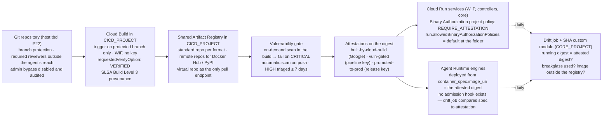
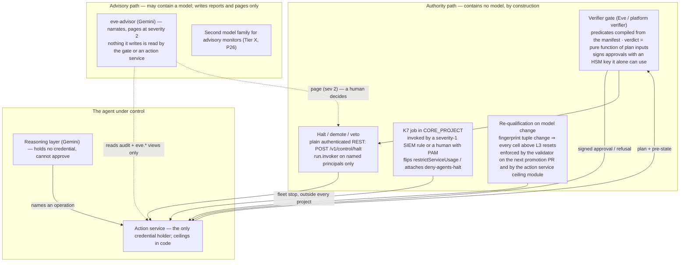

# 9. Supply chain, secrets and keys, recovery, and AGI-class containment

## Status
- Owner: the platform owner
- Last reviewed: 2026-09-13
- Maturity: detailed design, written 2026-09-13 under [01-hld.md](01-hld.md) §8.3 (key
  management), §9 (supply chain), §10 (recovery), §11.4–§11.5 (the containment primitives and
  the honest line) and the factory module inputs of §3.2. Nothing is built. This page answers
  HLD brief items H58, H59, H61, H64 and H65 of [00-objective-review.md](00-objective-review.md)
  §5 and the gap rows PS-09 (only where it touches the deploy path), PS-10, PS-14 (only the
  supply-chain half — the entitlement table itself is HLD §4.4) and SCA-09.
- What it does not re-argue: Wall-E holds Super Admin (P33); the tier model (P1); the perimeter
  spikes (P3); the PAM entitlements (§4.4). Where this page needs one of those, it points.
- Conventions: as the HLD. Every Google product, launch stage, constraint, role, field and
  limit below was re-read on Google's own page on 2026-09-13; the URL sits next to the claim.
  Where a page did not render or does not say, the text says "unverified" and the value stays
  *tbd*. `Assumption:` marks an inference. Decisions this page makes are numbered **P115–P124**,
  final ids in [12-open-decisions.md](12-open-decisions.md).
- Every control in the four control tables (§1.9, §2.6, §3.8, §5.5) names its **owner** (a
  role), the **resource** it sits on, how it is **verified**, and what happens when it
  **fails** — the reviewer's four questions, answered once per control instead of in prose.
- Diagrams: §1.1 (the supply-chain path from commit to running digest), §3.2 (the restore
  sequence and why it boots at `halt_all`), §5.2 (the model-free monitor and where a model may
  and may not sit).

---

## 0. What this page is for, in five lines

1. **Supply chain (§1).** Nothing runs on the platform that the platform did not build,
   scan and attest: Cloud Build in `CICD_PROJECT` with SLSA Build Level 3 provenance, a shared
   Artifact Registry whose upstreams are remote repositories, a vulnerability gate, Binary
   Authorization on every Cloud Run service from Tier W up, and — because Binary Authorization
   has no admission hook on Agent Runtime — engines deployed **from a container image the same
   pipeline built**, with the running digest compared to the attested one by the drift job.
2. **Secrets and keys (§2).** Regional secrets, HSM keys everywhere by organisation policy, one
   cryptography table for the whole platform, rotation that is a Pub/Sub-driven runbook rather
   than a calendar promise, and approval keys that are disabled but never destroyed inside the
   evidence horizon.
3. **Recovery (§3).** Six recovery classes mapped to tiers, Firestore PITR and scheduled
   backups the factory turns on and the agent owner cannot turn off, evidence that has already
   left the project before anyone needs a backup, and a restore that **boots at `halt_all` by
   construction** — the restored database carries a new identity and the action service refuses
   to execute until a human clears it.
4. **Code execution (§4).** Below Tier X there is none, and the page says how "none" is
   enforced per runtime. Both GKE Agent Sandbox and Agent Runtime sandboxes are available in
   `europe-west1` (corrected 2026-09-13); the Tier X choice of GKE Agent Sandbox now rests on
   isolation, egress, identity and launch stage, not residency. GKE Agent Sandbox is GA per
   Google's own announcement, which moves P27's stage condition to "met" but opens nothing — §4.4.
5. **AGI-class containment (§5).** The eight properties the review named, each graded
   enforcement or detection, each labelled *exists*, *buildable*, or *research-grade and
   provider-side*; the platform's own AI-control primitive (a model-free monitor with halt
   authority, re-qualified on every model change) stated as what it is and not as more.

---

## 1. Supply chain

HLD §9 fixed the shape; this section is the mechanism, verified product by product. The
principle, lifted from HLD D11 and §11.4 "no self-modification": **the agent never writes to a
repository, a registry, a deploy identity, its own ladder or its own ceilings** — and the
pipeline that does write is a keyless CI identity whose every output is signed, scanned and
admitted by a policy the agent's owner cannot edit.

### 1.1 The path from commit to running digest



Two enforcement points and one detection point. Binary Authorization on Cloud Run is
enforcement-grade (Google refuses the revision); the registry allow-list in the policy's
`admissionWhitelistPatterns` is enforcement-grade (only `europe-west1-docker.pkg.dev/CICD_PROJECT/…`
may deploy at all); everything about Agent Runtime and about post-deploy drift is
detection-grade and is written as such — HLD §0.2's rule that nothing detection-grade stands
alone in a safety argument applies, and the compensating enforcement for Agent Runtime is
the folder deny policy of HLD §4.5 (`run.services.create/update`,
`artifactregistry.repositories.uploadArtifacts`, `cloudbuild.builds.create` denied to every
agent principal) plus the CI identity being the only principal with `aiplatform.reasoningEngines.create/update`
outside PAM.

### 1.2 Build and provenance

| Item | Decision | Verified 2026-09-13 |
|---|---|---|
| Builder | Cloud Build in `CICD_PROJECT`, triggered only from protected branches, running as a per-agent build service account (`<agent>-build@CICD_PROJECT`, keyless; the WIF principal of the git host impersonates it — `wall-e/12` §6 pattern) with `roles/artifactregistry.writer` on that agent's repositories only | Cloud Build provenance "meets Supply-chain Levels for Software Artifacts (SLSA) level 3 assurance based on the specifications for SLSA version 0.1 and 1.0" — https://docs.cloud.google.com/build/docs/securing-builds/generate-validate-build-provenance (2026-09-03). SLSA Build L3 means "forging the provenance or evading verification requires exploiting a vulnerability that is beyond the capabilities of most adversaries" — https://slsa.dev/spec/v1.0/levels |
| Provenance conditions | The build config lists the image in `images`, pushes to Artifact Registry (never an explicit `docker push` step), and sets `requestedVerifyOption: VERIFIED`; CI lints every `cloudbuild.yaml` for all three | Same page: provenance requires images in Artifact Registry, the `images` field, and `requestedVerifyOption: VERIFIED`; provenance is read with `gcloud artifacts docker images describe … --show-provenance` |
| The Google attestor | `projects/CICD_PROJECT/attestors/built-by-cloud-build`, created by Cloud Build itself in the project where builds run; every agent project's policy references it cross-project | "Cloud Build automatically creates the `built-by-cloud-build` attestor in your project when you run a build that generates images"; "After images are successfully built, Cloud Build automatically signs and creates attestations for them"; when a build specifies a location "an attestation is created only if you explicitly set `requestedVerifyOption` to `VERIFIED`" — https://docs.cloud.google.com/binary-authorization/docs/deploy-cloud-build (2026-09-03). The attestor key is Google-managed (`Assumption:`; the page does not say whose key signs) |
| Cross-project verification | Each agent project's Binary Authorization service agent `service-<AGENT_PROJECT_NUMBER>@gcp-sa-binaryauthorization.iam.gserviceaccount.com` holds `roles/binaryauthorization.attestorsVerifier` on the three attestors in `CICD_PROJECT` and `roles/containeranalysis.notes.occurrences.viewer` on their notes — **made by the factory, resource-level, recorded as topology rows** (HLD D7) | https://docs.cloud.google.com/binary-authorization/docs/multi-project-setup-cli (2026-09-03) names exactly those two roles and that service-agent form |
| Deploy by digest | Every deploy manifest and every Terraform `image` argument is a digest, never a tag; CI refuses a tag | Policy pattern; no product fact needed |

### 1.3 The shared registry

| Item | Decision | Verified 2026-09-13 |
|---|---|---|
| Location | One Artifact Registry per format in `CICD_PROJECT`, region `europe-west1` (HLD `gcp.resourceLocations`); the per-agent registries of the sets (`walle`, `EVE_AR`, `mo`) become **repositories** `agents/<agent>` in it, not projects' own registries — the sets' Phase 10 `gcloud builds submit` into a per-project registry is retired (PS-10) | Product placement; the sets are the source of the old names |
| Upstreams | **Remote repositories** for Docker Hub (base images) and PyPI (`google-adk`, `google-auth`, everything in the lockfile); a **virtual repository** per format is the only endpoint any build may pull from, so no build reaches the public internet and a dependency-confusion attack has one fewer path | Remote repositories cache "the first time that you request a version of a package … the next time … Artifact Registry serves the cached copy"; presets for Docker Hub, Maven Central, npm, PyPI, plus custom URLs; virtual repositories "act as a single access point for multiple upstream repositories" to mitigate dependency confusion; OS packages (Apt/Yum) remote is **Preview** and is not used — https://docs.cloud.google.com/artifact-registry/docs/repositories/remote-overview (2026-09-03) |
| Build egress | Cloud Build private pool with no public egress (`Assumption:` the pool's egress setting is the mechanism — verify at build); the only reachable registry hostnames are the virtual repositories | *tbd* at build; graded detection until proven |
| Writers | The per-agent build account writes `agents/<agent>` only; humans write nothing (`artifactregistry.writer` is not in any standing grant and not in a PAM entitlement — a human fix goes through a pull request); **no agent principal holds any write** (HLD deny policy row `artifactregistry.googleapis.com/repositories.uploadArtifacts`) | HLD §4.5; the permission name is on P8's verification list like every other deny name |
| Immutability and cleanup | Immutable tags on every `agents/*` repository; a cleanup policy deletes untagged digests older than 90 days **except digests referenced by a `promoted-to-prod` attestation** — the exception is a CI job that re-tags, not a registry feature (`Assumption:`) | Cleanup policies and immutable tags exist as repository settings; the exception mechanism is ours |

### 1.4 The vulnerability gate

| Step | Mechanism | Threshold | Verified 2026-09-13 |
|---|---|---|---|
| In the build, before push | A Cloud Build step runs `gcloud artifacts docker images scan IMAGE_URI --location=europe` on the local image, then `gcloud artifacts docker images list-vulnerabilities SCAN_NAME` and fails the build if any finding has `vulnerability.effectiveSeverity` = `CRITICAL` or is a malicious package | **no CRITICAL** (`Assumption:` thresholds; ISMS confirms — HLD §9) | On-Demand Scanning: "You can use On-Demand Scanning to scan images in your CI/CD pipeline before deciding whether to store them in a registry"; commands and the `vulnerability.effectiveSeverity` field — https://docs.cloud.google.com/artifact-analysis/docs/os-scanning-on-demand (2026-09-03); malicious packages carry CRITICAL — https://docs.cloud.google.com/artifact-analysis/docs/container-scanning-overview (2026-09-03) |
| After push | Automatic scanning on upload; Artifact Analysis keeps re-evaluating images pulled within the last 30 days, so every running digest stays scanned as long as it is deployed | HIGH: triage within 7 business days, recorded in the CVE register (evidence bucket); MEDIUM and below: monthly batch | "Artifact Analysis scans new images when they're uploaded to Artifact Registry" (once per digest, tags do not retrigger); "continues to scan images and packages as long as they have been pulled within the last 30 days" — same overview page |
| The attestation | The pipeline signs a **`vuln-gated`** attestation on the digest with the KMS key `binauthz-vuln-gated` (§2.4) only when the in-build scan passed; the policy requires it alongside `built-by-cloud-build` | — | Artifact Analysis "can integrate … with Binary Authorization to create attestations, which can prevent container images with known security issues from running" — same overview page. **Google's own Kritis Signer guide page returned 404 on 2026-09-13**; Kritis Signer and Voucher remain open-source tools (github.com/grafeas/kritis), so the platform implements the gate as a build step and a signing step of its own rather than adopting an unmaintained tool |
| Re-scan and revoke | The drift job reads current findings for every running digest daily; a new CRITICAL on a running digest opens a severity-2 finding (severity 1 for a credential holder) with a 24-hour rebuild target; the `vuln-gated` attestation is **not** revoked automatically (revocation would block the rollback digest too) | — | Policy choice, stated |
| Patch cadence per tier | R: monthly rebuild; W: fortnightly; P and controllers: weekly base-image rebuild, plus on any CRITICAL | `Assumption:`; ISMS confirms | — |

### 1.5 Admission on Cloud Run

| Item | Decision | Verified 2026-09-13 |
|---|---|---|
| Policy shape | Binary Authorization on Cloud Run evaluates the **project-singleton policy** of the project the service is in — so the factory generates one policy per agent project from the tier: `defaultAdmissionRule` `evaluationMode: REQUIRE_ATTESTATION`, `enforcementMode: ENFORCED_BLOCK_AND_AUDIT_LOG`, `requireAttestationsBy` = `built-by-cloud-build` + `vuln-gated` (+ `promoted-to-prod` for `env=prod`), all three in `CICD_PROJECT`; `admissionWhitelistPatterns` names only `europe-west1-docker.pkg.dev/CICD_PROJECT/agents/<agent>/*` — nothing else may even be evaluated. The policy is Terraform in the factory; the agent owner has no `binaryauthorization.policyEditor` | The org constraint "must be set to `default`", which "configures Binary Authorization to use the policy in the same project as your Cloud Run services", and can be set with `--folder` — https://docs.cloud.google.com/binary-authorization/docs/run/requiring-binauthz-cloud-run (2026-09-03). Evaluation and enforcement mode values, `requireAttestationsBy: projects/PROJECT_ID/attestors/ATTESTOR_NAME`, `admissionWhitelistPatterns` — https://docs.cloud.google.com/binary-authorization/docs/configuring-policy-cli (2026-09-03) |
| Folder constraint | `constraints/run.allowedBinaryAuthorizationPolicies` = `default` at **`fld-agents-w`, `fld-agents-p` (inherited by `fld-agents-p-sa`), `fld-controllers` and `fld-platform-core`** — the HLD wrote "the W and P folders"; this page **extends it to controllers and core** (P115) because Eve's gate and reconciler, the K7 job, the drift job and the reconciliation job are Cloud Run workloads on the authority or kill path and an unattested image there is a worse failure than an unattested agent. `fld-agents-r` is exempt (no credential holder; Agent Runtime only) and `fld-gemini-enterprise` hosts no Cloud Run | Constraint name and folder scope: same page. Cloud Run's per-service flag is `--binary-authorization=default` — https://docs.cloud.google.com/binary-authorization/docs/run/enabling-binauthz-cloud-run (2026-09-03) |
| Rollout | `DRYRUN_AUDIT_LOG_ONLY` for the first 30 days per folder, then `ENFORCED_BLOCK_AND_AUDIT_LOG`; the switch is a dated change with the drift job's zero-diff as exit | Mode values verified above |
| What a block looks like | "Revision REVISION_NAME uses an unauthorized container image … is not authorized by policy"; "the service continues to serve the previously serving healthy revision" — a blocked deploy is not an outage | Same enabling page |
| Breakglass | `gcloud run deploy --breakglass=JUSTIFICATION` is the only bypass; it is **audit-logged regardless of policy outcome**; a SIEM rule turns every breakglass event in W/P/controllers/core into a severity-1 case; the YAML annotation `run.googleapis.com/binary-authorization-breakglass` is forbidden in every committed manifest (CI grep) because editing it in YAML "can cause all subsequent deployments to bypass Binary Authorization enforcement" | https://docs.cloud.google.com/binary-authorization/docs/run/using-breakglass-cloud-run (2026-09-03) |
| Post-deploy drift | **Continuous validation is GKE-only** ("GKE is the only supported platform", and it is Preview), so on Cloud Run the running revision's digest is compared with the attested set daily by the drift job and a Security Health Analytics custom module (`run.googleapis.com/Service` is a supported resource type for custom modules — HLD §19) — detection-grade, stated | https://docs.cloud.google.com/binary-authorization/docs/overview-cv (2026-09-03) |
| Custom constraint on `binaryAuthorization` | The Cloud Run half of P4 is **closed** (aligned 2026-09-13): Cloud Run custom constraints are written against the Admin API v1 shape and Google's own example requires the annotation `run.googleapis.com/binary-authorization` to be `default`, so `custom.runBinaryAuthorizationRequired` (CC-3 of [02](02-landing-zone-and-tiers.md) §4.3, P42) is a second lever beside the folder constraint above: B18 makes Binary Authorization mandatory at deploy, CC-3 refuses a service definition that omits it | https://docs.cloud.google.com/run/docs/securing/custom-constraints (2026-09-01, read by page 02); https://docs.cloud.google.com/organization-policy/reference/custom-constraint-supported-services (`run.googleapis.com/Service` GA) |

### 1.6 Agent Runtime: deploy from the attested image, and the bundle-hash fallback

HLD §9 recorded "no attestation product exists" for Agent Runtime bundles and adopted the
bundle SHA-256 as a detection-grade substitute. Verified on 2026-09-13: Agent Runtime **deploys
from a container image in Artifact Registry** — "To deploy from a container image, first follow
the setup instructions for Bring your own container", SDK config
`{"container_spec": {"image_uri": "CONTAINER_IMAGE_URI"}}` where the URI is "the URI of the
container image in Artifact Registry" and the image "must adhere to the runtime contract"
(https://docs.cloud.google.com/gemini-enterprise-agent-platform/scale/runtime/deploy-an-agent,
2026-09-03; the runtime contract at
https://docs.cloud.google.com/gemini-enterprise-agent-platform/scale/runtime/runtime-contract).
That does not add an admission hook — Binary Authorization still has no Agent Runtime
platform — but it changes what the drift job can compare and what the supply chain covers:

| Tier | Deploy path | What is recorded | Grade | Decision |
|---|---|---|---|---|
| W, P, controllers (any engine whose action service holds a credential, and Eve's reporting path) | **Image-based, mandatory**: `container_spec.image_uri` = a digest carrying `built-by-cloud-build` + `vuln-gated` (+ `promoted-to-prod`), built by the same pipeline as the action service, from a Dockerfile in the agent repository | the digest in the register row, `config_versions` and the registry card; the drift job reads `spec` after every deploy and daily, and fails on any digest without the three attestations or outside `agents/<agent>` | detection (drift job) on top of enforcement at build and at the registry; the deploy permission is held only by the CI identity | **P116** |
| R | image-based preferred; **source-based allowed** (the SDK's pickled `*.pkl` + requirements bundle staged to Cloud Storage — the documented alternative on the same page) | the bundle SHA-256 and the hash-pinned lockfile in the register row and `config_versions` (HLD §9's substitute, unchanged) | detection | P116 |
| X | image-based only, and the image runs inside the sandbox tier of §4.3 | as W | — | — |

The one grant this adds: Agent Runtime's project service agent needs to read the image from
`CICD_PROJECT`. Google's page names an "Artifact Registry Reader" grant to the "Agent Runtime
default service agent" for the bring-your-own-container path; the exact service-agent form and
whether a cross-project repository is accepted are **unverified** on 2026-09-13 (the page
rendered without that section) — recorded as a topology row *tbd*, made by the factory
resource-level on `agents/<agent>` only, never project-wide (HLD D7). Until the read is
proven cross-project, the fallback is a per-agent-project **remote repository** whose upstream is
the `CICD_PROJECT` repository — still no public pull, still one build.

### 1.7 Dependencies, repositories, deploy identity, agent-authored changes

| Rule | Mechanism | Verified / source |
|---|---|---|
| Hash-pinned lockfile; no floating minors | `google-adk==2.9.0` and `google-auth==2.58.0` as exact pins (2.9.0 released 2026-09-10; 2.58.0 on 2026-09-09 — HLD §19); `pip-compile --generate-hashes` output committed; `pip install --require-hashes` in the Dockerfile; monthly dependency review by the agent owner; the software approval list in the compliance mapping (TISAX 1.3.4) is generated from the union of lockfiles | HLD §9 |
| Git host, branch protection, admin bypass | P22 stays open on the host; whatever it is: protected default branch, two required reviewers on credential-holder repositories, `CODEOWNERS` naming the owner group and, for `eve/config` and `ceilings`, the security reviewer; **admin bypass disabled and its audit log exported monthly to the evidence bucket** | HLD §9 |
| The deployer | Aligned 2026-09-13 to P142 (this row named one `platform-deployer@CICD_PROJECT`, which is retired): **per agent project, `<agent>-deployer@<agent project>`**, impersonated per release run by the pipeline's WIF principal (repository id + `main`) through a resource-level `serviceAccountTokenCreator`; it is the only principal with `run.services.create/update` and `aiplatform.reasoningEngines.create/update` in its project outside PAM, and holds `iam.serviceAccountUser` on that project's attached accounts and nothing else — the exception principal of [04](04-identity-and-privileged-access.md) §3 R3b/R4, so a compromised release of one agent cannot deploy another. **Registry write** belongs to the routine factory identity `factory-apply@CICD_PROJECT` alone ([05](05-registry-and-autonomy-contract.md) §4). Core and controller projects follow the same pattern with a deployer in their own project (names per [02](02-landing-zone-and-tiers.md) §3.6; `Assumption:` `core-deployer@`, `eve-deployer@`) (`wall-e/12` §6 pattern, generalised) | [../wall-e/12-agent-identity.md](../wall-e/12-agent-identity.md) §6 |
| No agent writes anything in this section | Folder deny policy (`run.services.create/update`, `artifactregistry…uploadArtifacts`, `cloudbuild.builds.create` denied to every agent principal set) + PAB + branch protection; the drift job asserts no agent principal appears in any repository's or registry's IAM | HLD §4.5, §11.4 |
| Agent-authored pull requests | Label `agent-authored` applied by the bot that opens them (Mo today; any Tier X agent later); the agent cannot merge (no write, no review right); **two human reviewers, one outside the agent's owner line**; the validator custodian recomputes every number the PR cites; a `CODEOWNERS` rule that no path under `contracts/`, `ceilings/`, `eve/config/predicates` or `.github/` may be touched by an agent-authored PR at all | HLD §9, §13.3; [../mo/04-artefacts-and-proposals.md](../mo/04-artefacts-and-proposals.md) |

### 1.8 Environments, promotion and emergency change (decision 29 generalised)

Wall-E's decision 29 asked where a change to the gate first executes; the HLD answered "a
sandbox tenant before Stage 1, because Super Admin cannot be OU-scoped". Generalised to the
platform (part of **P115**):

| Tier | Pre-production | What must pass there before `promoted-to-prod` is signed |
|---|---|---|
| R | `<tier>/nonprod` project with the same manifest, `env=nonprod`; no tenant needed (read-only tools against nonprod data stores) | build, scan, denial tests of the gateway allow-list, the admission gate's schema checks |
| W | nonprod project + a nonprod instance of the system of record it writes to (per manifest; a sandbox Workspace tenant if the system of record is Workspace) | as R + the action-service denial tests (`wall-e/06` "Forbidden configurations" generalised), one replay of the golden plan set through the platform verifier, the K0/K1 drill, **the restore drill of §3.6** |
| P, P-SA | nonprod project **and the sandbox Workspace tenant** (HLD §3.1 nonprod row); the nonprod robot account holds the same role in the sandbox tenant | as W + the two-lists denial test (every hard-denied operation refused in every lane), Eve's seeded-fault run against the nonprod engine, K5/K6 drill in the sandbox tenant |
| controllers, core | nonprod projects under `fld-controllers`/`fld-platform-core` (`Assumption:` one each, not per component) | as W + the K7 drill in nonprod (HLD §11.4) |

- **Promotion is an attestation, not a copy.** The release pipeline signs `promoted-to-prod`
  on the *same digest* that passed nonprod, with the KMS key `binauthz-promoted` (§2.4), after
  a human approval recorded in the pipeline (the second reviewer of HLD §0.3 for credential
  holders). The prod project's policy requires that attestation; the nonprod policy does not.
  One digest, two policies, no rebuild between environments.
- **Rollback is by digest**: redeploy the previous attested digest (it keeps its attestations;
  the cleanup exception of §1.3 keeps it in the registry); `config_versions` records the
  rollback with the reason; a rollback of a credential holder is also an incident record.
- **Emergency change**: `--breakglass` with a ticket in the justification, a severity-1 SIEM
  case opened by the breakglass log entry, and a post-hoc second reviewer within one business
  day who either signs `promoted-to-prod` retroactively or forces a rollback. No emergency
  path exists for an Agent Runtime engine: the engine is redeployed from an attested digest or
  halted (K1/K3).

### 1.9 Supply-chain controls — owner, resource, verification, failure

| # | Control | Grade | Owner (role) | Resource | Verified by | When it fails |
|---|---|---|---|---|---|---|
| SC-1 | Builds only from protected branches, keyless, `requestedVerifyOption: VERIFIED` | enforcement (git host + Cloud Build trigger) | platform owner | Cloud Build triggers in `CICD_PROJECT` | CI lint on every `cloudbuild.yaml`; drift job compares trigger config to Terraform | an unverified build produces no `built-by-cloud-build` attestation → SC-5 blocks it |
| SC-2 | All pulls through the virtual repository; remote repositories are the only upstreams | enforcement (private pool egress, `Assumption:`) / detection until proven | platform owner | Artifact Registry in `CICD_PROJECT`; the build private pool | pool egress test in the monthly drill; registry access logs show no foreign registry | a build reaches the internet: severity 2, pool config reverted, image discarded |
| SC-3 | In-build on-demand scan fails on CRITICAL; `vuln-gated` signed only on pass | enforcement (pipeline) | platform owner; thresholds by ISMS | the build step; KMS key `binauthz-vuln-gated` | attestation absent for any digest without a passing scan record; the signing key's Data Access log shows one `useToSign` per attestation | a digest without `vuln-gated` cannot deploy (SC-5); a signing outside a build is severity 1 |
| SC-4 | Running digests re-scanned; HIGH triaged ≤ 7 days | detection | agent owner; security reviewer reviews the register monthly | Artifact Analysis occurrences; the CVE register | drift job lists digests with untriaged HIGH > 7 days | finding on the register row; a Tier W promotion is refused while an untriaged HIGH exists on the agent's digest |
| SC-5 | Binary Authorization `REQUIRE_ATTESTATION` on every Cloud Run service in W/P/controllers/core; folder constraint `= default` | enforcement (Google) | platform owner; the agent owner cannot edit the policy | project policy per agent project; `constraints/run.allowedBinaryAuthorizationPolicies` on the four folders | policy and constraint in Terraform; drift job zero-diff; a monthly negative test deploys an unattested image to nonprod and expects the block message | an unattested revision is refused; the previous revision keeps serving |
| SC-6 | Breakglass is audited and severity 1 | detection | detection desk of the tier | Cloud Audit Logs → SIEM rule | the monthly drill uses breakglass once in nonprod and expects the case | a breakglass with no ticket: incident; post-hoc reviewer within one business day |
| SC-7 | Post-deploy digest drift on Cloud Run | detection | platform owner | drift job in `CORE_PROJECT`; SHA custom module | daily run; the negative test in SC-5 also plants a drift | running digest ≠ attested: K1 on the service, severity 1 for a credential holder |
| SC-8 | Agent Runtime engines from the attested image; spec digest compared | detection | platform owner; agent owner for R source deploys | engine `spec` via the drift job; register row; `config_versions` | daily; after every deploy | digest without attestations or outside the registry: K1 (engine halted through the action service), severity 1 |
| SC-9 | No agent principal writes to repository, registry, deploy identity | enforcement (deny policy, branch protection) + detection (drift job on IAM) | platform owner | folder deny policy; git host; registry IAM | drift job asserts absence daily, and that the registry writer set is exactly `{factory-apply@CICD_PROJECT}` and each project's deploy set exactly `{<agent>-deployer@}` (P142, 2026-09-13); P8 verifies the permission names | any such grant: severity 1, removed by the drift job's remediation PR |
| SC-10 | Agent-authored PRs labelled, two humans, protected paths | enforcement (branch protection + CODEOWNERS) | Mo owner; security reviewer for protected paths | the repositories | CI refuses a merge without the label's reviewer count; monthly sample by the security reviewer | an agent-authored change merged by one human: incident; revert; the reviewer set is re-checked |
| SC-11 | Promotion by attestation; rollback by digest | enforcement (prod policy requires `promoted-to-prod`) | deployer; second reviewer signs | KMS key `binauthz-promoted`; the prod policies | the key's Data Access log matches the release records one-to-one | a prod deploy of a digest that never passed nonprod is refused |

---

## 2. Secrets and keys

HLD §8.3 fixed five classes. This section turns them into conventions the factory applies,
one cryptography table for the platform, and a rotation runbook per class.

### 2.1 Secret conventions

| Convention | Rule | Verified 2026-09-13 / source |
|---|---|---|
| Regional only | Every secret is a **regional secret** in `europe-west1` (`projects/P/locations/europe-west1/secrets/S`, regional endpoint); the factory never creates a global secret; a Security Health Analytics custom module flags any `secretmanager.googleapis.com/Secret` without a location (detection, until a custom constraint on `secretmanager.googleapis.com/Secret` — supported, GA — refuses creation without `location`; the CEL expression is a spike item under P4) | Regional secrets overview (2026-09-09) at https://docs.cloud.google.com/secret-manager/regional-secrets/overview-rs lists rotation, expiration, CMEK, notifications, labels and annotations for regional secrets; **launch stage not stated on the page read** (the sets already build on regional secrets; `Assumption:` GA). Custom-constraint support for `secretmanager.googleapis.com/Secret`: GA — https://docs.cloud.google.com/organization-policy/reference/custom-constraint-supported-services |
| Naming | `<agent>-<purpose>`; purposes from a closed list: `oauth-client`, `refresh-token`, `confirm-hmac`, `pager-key`, `webhook`; anything else is a factory input with a reason | Convention |
| Labels | `agent`, `tier`, `rotation_period` (days), `reader` (the one attached account allowed to read), `class` (from the cryptography table) — validated by the factory, read by the alert below | Convention |
| Readers | Exactly one attached service account per secret with `roles/secretmanager.secretAccessor` on that secret (never project-level); humans read secrets only through the PAM entitlement of HLD §4.4 (30 minutes, security reviewer approves) | HLD §4.4 |
| Data Access logs | Folder-level `auditConfigs` with `DATA_READ`/`DATA_WRITE` on `secretmanager.googleapis.com` and `cloudkms.googleapis.com`, no exemptions (HLD §7.1) | HLD §7.1 |
| The access alert | One folder-scoped log-based alert: `protoPayload.methodName = "google.cloud.secretmanager.v1.SecretManagerService.AccessSecretVersion"` where the caller ≠ the secret's `reader` label — severity 1 for any secret of a credential holder, severity 2 otherwise; Wall-E's per-project alert generalised | Method name `Assumption:` from the v1 API surface; verified at build against the first log entry |
| Rotation as a runbook, not a promise | Every secret carries a `rotation_period` and a Pub/Sub topic; Secret Manager "triggers a `SECRET_ROTATE` message to the designated Pub/Sub topics at the secret's `next_rotation_time`" and **does not rotate the payload itself**; the subscriber is a Cloud Run job in the agent project that opens the rotation runbook ticket and pages the owner — never a job that mints a Workspace credential, because minting one is a witnessed human act (`wall-e/02`, `eve/02`) | https://docs.cloud.google.com/secret-manager/docs/secret-rotation (2026-09-09): `rotation_period` ≥ 1 hour; rotation schedules exist for regional secrets — https://docs.cloud.google.com/secret-manager/regional-secrets/rotate-regional-secrets |
| Expiry | Every OAuth-client and webhook secret carries an `expire-time` one year out; a refresh token none (its lifetime is governed by consent and revocation, not by Secret Manager) | Expiration on regional secrets — https://docs.cloud.google.com/secret-manager/regional-secrets/set-expiration-regional-secrets |
| Versions | The previous version is **disabled** at rotation and **destroyed** 30 days later by the rotation job, except any version cited by an open incident (hold label) | `ARCHITECTURE.md` §9 "disabled and destroyed on the rotation runbook", with the 30-day figure added here |

### 2.2 The CMEK and Autokey stance, recorded once

| Store | Encryption | Reason / verified |
|---|---|---|
| BigQuery datasets, Cloud Storage buckets, Cloud Run, Secret Manager, Pub/Sub, Artifact Registry | **Cloud KMS Autokey**, configured at `fld-agentic-platform` and inherited; keys are HSM; granularity per Google: one key per bucket/dataset, one key per project-location for Cloud Run and Secret Manager | "Autokey configurations are inherited by child resources"; "Protection level: HSM"; per-service granularity — https://docs.cloud.google.com/kms/docs/autokey-overview (2026-09-03) |
| Autokey key project | A **dedicated key project `KMS_PROJECT` under `fld-platform-core`** — the fifth core project (P118). Google: "keys created by Autokey are created in the designated key project for that folder". It holds keys and nothing else, `restrictServiceUsage` allow-list = `cloudkms` only, no agent principal ever bound | Same page; the HLD's four-core-project list gains one (cross-page claim) |
| Agent Runtime engines | CMEK through `encryption_spec` with a **single-region** key `<agent>-engine-cmek` in `KMS_PROJECT`, created by the factory (Autokey does not cover Agent Runtime) | HLD §8.3, §19 |
| Firestore | **Google-managed encryption, recorded as exception 1.** Firestore CMEK exists but "You can choose an encryption type and key only when you create a CMEK-enabled database", the key must be in the database's location, and the page gates access on "the access request form" — a feature behind an access request is not a platform default (P119; revisit when the gate is gone) | https://docs.cloud.google.com/firestore/native/docs/use-cmek (2026-09-08) |
| Cloud Logging log buckets | Logging is not on Autokey's list, so no bucket gets a key by inheritance. **Narrowed on the reconcile pass of 2026-09-13 (P119, exception 2):** the organisation `_Default`/`_Required` buckets and the Tier R content buckets stay **Google-managed**; the two central buckets `platform-evidence-logs` and `platform-identity-logs` take an **explicit HSM key** `platform-logs-europe-west1` in `KMS_PROJECT` (ring `logging`) at creation, and Tier W+ content buckets a per-agent key `<agent>-content-logs` — because Google documents CMEK **per individual log bucket**, set at creation and never addable later, distinct from the organisation-level Log Router CMEK the earlier draft cited ([08](08-data-logging-retention-sovereignty.md) §9, P112) | https://docs.cloud.google.com/logging/docs/routing/managed-encryption-storage (re-read by page 08 on 2026-09-13); Autokey list (above) |
| Cloud Trace, Cloud Monitoring, Cloud Scheduler, Cloud Tasks, Firestore backups | Google-managed (no CMEK offered on the platform's path, or covered by the store's own key) | — |

The CMEK position is confirmed with the TISAX label (P20): at `Confidential` the table above
stands; at `Strictly confidential` exceptions 1 and 2 are re-opened and Key Access
Justifications (with Assured Workloads, P12) is revisited.

### 2.3 Keys: HSM everywhere by policy, and the three KMS constraints

| Rule | Mechanism | Verified 2026-09-13 |
|---|---|---|
| Every key on the platform is HSM | `constraints/cloudkms.allowedProtectionLevels` = `HSM` at `fld-agentic-platform` (P118); Autokey keys are HSM already; the factory creates the approval, attestor and engine keys with `--protection-level=hsm`. The HLD required HSM for approval keys only; this page makes it the floor so that no key class has to be argued individually. Cost: HSM key versions are priced per version — accepted (amount *tbd*, §0.5 of the HLD) | Constraint "Restrict which KMS CryptoKey types may be created" — https://docs.cloud.google.com/resource-manager/docs/organization-policy/org-policy-constraints; HSM = "FIPS 140-2 Level 3 validated HSMs" — https://docs.cloud.google.com/kms/docs/protection-levels (2026-09-03) |
| Disable before destroy | `constraints/cloudkms.disableBeforeDestroy` enforced at the folder | "Restrict key destruction to disabled key versions" — same constraints page |
| Destruction window | `constraints/cloudkms.minimumDestroyScheduledDuration` at the folder, value `30d` (Google's default is 30 days; the constraint makes it a floor rather than a default; the constraints page lists the accepted values `1d`, `7d`, `15d`, `30d`, `60d`, `90d`, `120d` — re-read 2026-09-13) | "The default scheduled for destruction duration is 30 days"; restore during the window returns the version to **disabled** — https://docs.cloud.google.com/kms/docs/destroy-restore (2026-09-01) |
| Approval keys never destroyed inside the evidence horizon | `eve-approval` and every verifier key: manual, dated rotation with a 30-day overlap; old versions **disabled, never destroyed** for 400 days (the horizon of HLD §7.5); the PEM of every version archived in the evidence bucket and pinned in the agent repository before first use | [../eve/02-identity-and-auth.md](../eve/02-identity-and-auth.md) "Rotation is manual, dated, and never destructive"; Cloud KMS "does not support automatic rotation of asymmetric keys" — https://docs.cloud.google.com/kms/docs/key-rotation (2026-09-03) |
| Signers | `cloudkms.signer` on an approval key: exactly one service account (`eve-controller@` for `eve-approval`); on an attestor key: exactly the pipeline's release account; `cryptoKeyVersions.useToSign` Data Access-logged at the folder; the folder deny policy already refuses `useToSign` to every agent principal (HLD §4.5) | HLD §4.5, §8.3 |
| Key Access Justifications | Only with Assured Workloads (P12) — not now | HLD §8.3 |

### 2.4 The cryptography table — every key and secret on the platform

The single table HLD §8.3 asked for. Class letters map to the rotation table in §2.5. `Agent`
rows are generated by the factory per agent from the manifest; the concrete rows are Wall-E's,
Eve's and Mo's on 2026-09-13.

| Class | Key or secret | Type / algorithm | Where (project, ring, location) | Protection | Made by | Holder of the private / read side | Verify / public side | Rotation | Audit log | Owner |
|---|---|---|---|---|---|---|---|---|---|---|
| A | `eve-approval` | KMS `ASYMMETRIC_SIGN` / `EC_SIGN_P256_SHA256` | `EVE_PROJECT`, ring `eve`, `europe-west1` | HSM | Eve's runbook (factory `verifier-project` module) | `eve-controller@` (`cloudkms.signer`) | PEM pinned in Wall-E's repository per version + `publicKeyViewer` fallback on the one key (topology row 14) | manual, dated, 30-day overlap, disable-never-destroy | `useToSign` Data Access | Eve owner |
| A | `<verifier>-approval` (one per Tier W platform verifier) | as above | the verifier's project, ring `<verifier>`, `europe-west1` | HSM | factory | the verifier's gate identity | PEM pinned in the agent repository | as above | as above | security reviewer (validator custodian's line) |
| B | `binauthz-vuln-gated`, `binauthz-promoted` | KMS `ASYMMETRIC_SIGN` / `EC_SIGN_P256_SHA256` | `CICD_PROJECT`, ring `supply-chain`, `europe-west1` | HSM | factory | the pipeline's scan step account; the release account (two accounts, two keys) | the attestors' public keys in Binary Authorization | annual, overlap 30 days; old version disabled, kept 400 days | `useToSign` Data Access | platform owner |
| B | `built-by-cloud-build` attestor key | Google-managed | `CICD_PROJECT` | Google | Cloud Build | Cloud Build | the attestor | Google's | attestation occurrences | Google (supplier row) |
| C | Autokey CMEK keys (one per bucket, dataset, project-location for Run and Secret Manager, Pub/Sub topic, registry) | KMS symmetric `GOOGLE_SYMMETRIC_ENCRYPTION` (AES-256-GCM) | `KMS_PROJECT`, Autokey-managed rings, `europe-west1` (BigQuery `EU` datasets: `europe` multi-region key, per Firestore/BigQuery location rules) | HSM | Autokey | the service agents Autokey binds | — | **automatic, one year — Autokey's verified default** ("Rotation period: One year … a Cloud KMS administrator can edit the rotation period from the default", [Autokey overview](https://docs.cloud.google.com/kms/docs/autokey-overview), updated 2026-09-03; corrected 2026-09-13, this row said 90 days). If the organisation's crypto standard requires 90 days (*tbd*), the factory's post-Autokey step `kms-rotation-set` sets it on every key in the Autokey rings, owned by the platform owner, and the drift job raises a severity-3 finding on any Autokey key still showing 365 days | `cloudkms` Data Access | platform owner |
| C | `<agent>-engine-cmek` | KMS symmetric | `KMS_PROJECT`, ring `engines`, `europe-west1` (single-region) | HSM | factory | the Agent Runtime service agent of the agent project | — | automatic, 90 days | as above | platform owner |
| C | `gemini-cmek` (the tenant app's `CmekConfig` for data stores and apps created after GE-4 — [03](03-gemini-enterprise-environment.md) §5.2, P50; added 2026-09-13) | KMS symmetric | `KMS_PROJECT`, ring `gemini`, location **`europe` multi-region** (Gemini Enterprise requires a multi-region `europe` key for an `eu` app; HSM availability in `europe` and its acceptance under `gcp.resourceLocations` are **unverified** and confirmed at the first factory run) | HSM | factory (`tenant-app` module writes the key; the `CmekConfig` registration is the Gemini Enterprise admin's act through PAM) | the Discovery Engine service agent and the Cloud Storage service agent of `GEMINI_PROJECT` (`roles/cloudkms.cryptoKeyEncrypterDecrypter` on the key only) | — | automatic, 90 days set explicitly by the factory (`Assumption:` the crypto standard) | `cloudkms` Data Access; a key state change is severity 1 (every post-GE-4 data store becomes unreadable) | platform owner (key); Gemini Enterprise admin (registration) |
| C | `platform-logs-europe-west1` (the two central log buckets `platform-evidence-logs`, `platform-identity-logs`; added 2026-09-13 — [08](08-data-logging-retention-sovereignty.md) §9, P112) | KMS symmetric | `KMS_PROJECT`, ring `logging`, `europe-west1` | HSM | factory, before Stage 0 creates the buckets (CMEK cannot be added later) | Logging's `kmsServiceAccountId` as the sole Encrypter/Decrypter | — | automatic, 90 days (`Assumption:`) | `cloudkms` Data Access; a key state change is severity 1 (PL-11) — disable-never-destroy, since a disabled key makes the evidence unreadable | platform owner |
| C | `eve-evidence` (Eve's locked bucket S5 and `eve.*` datasets S4; added 2026-09-13) | KMS symmetric | `EVE_PROJECT`, ring `eve`, `europe-west1` — **explicit, not Autokey**, so that a platform-line key administrator in `KMS_PROJECT` cannot brick Eve's copy | HSM | Eve's runbook (`verifier-project` module) | the bucket's and datasets' service agents | — | automatic, 90 days | as above | Eve owner |
| C | `<agent>-content-logs` (Tier W+ content log buckets; Tier R stays Google-managed — exception 2) | KMS symmetric | `KMS_PROJECT`, ring `logging`, `europe-west1` | HSM | factory | the bucket's `kmsServiceAccountId` | — | automatic, 90 days | as above | agent owner |
| D | `<agent>-oauth-client` (Wall-E: two — the narrow client and the broad `walle-actions-super` client; Eve: one) | regional secret (client id + secret) | agent project, `europe-west1` | Secret Manager + Autokey | witnessed bootstrap (agent runbook) | the action service's attached account only | — | annual; on any suspected leak | `AccessSecretVersion` Data Access + the §2.1 alert | agent owner |
| D | `<agent>-refresh-token` (Wall-E: two, one per client; Eve: one, read-only scopes) | regional secret | agent project | as above | witnessed bootstrap, two custodians (`wall-e/02`, `eve/02`) | the action service only | — | on revocation, on custody change, on the six-month clock where the consent mode imposes one (`eve/02`); never automatic | as above; token revocation is the credential kill switch K4 ([04](04-identity-and-privileged-access.md) §9.7 — K2 is "stop new runs"; corrected 2026-09-13) | agent owner; Eve owner |
| D | `walle-confirm-hmac` (and any agent's `-confirm-hmac`) | regional secret, 256-bit | agent project | as above | factory | action service | — | 90 days, Pub/Sub-triggered runbook | as above | agent owner |
| E | `platform-pager-key` (PagerDuty or equivalent integration key) | regional secret | `CORE_PROJECT` | as above | platform owner | the notification-channel job | — | annual | as above | platform owner |
| E | witness paging keys | regional secret in `EVE_WITNESS_PROJECT` | witness organisation | witness's own | witness administrators | witness channels | — | annual | witness's logs | IT security |
| F | robot account passwords and the **two hardware keys per robot account** (`walle@`, `eve@`, the nonprod robots) | FIDO2 keys; password in the corporate vault | corporate vault; key custodians named in the custody record | physical | witnessed bootstrap | custodians | — | on custody change; keys re-enrolled annually | Workspace login audit | agent owner; security reviewer holds the custody record |
| G | CI deployer, agent identities, service accounts | **no key**: WIF federation, Agent Identity 24-hour certificates, attached accounts | — | — | — | — | — | — | `sts` Data Access (HLD §7.1) | platform owner |
| H | Terraform state | Cloud Storage with Autokey (class C); no secret inside the state by convention (CI fails on a `sensitive` output written to state) | `CICD_PROJECT` | HSM (Autokey) | factory | the deployer | — | with class C | storage Data Access | platform owner |

Nothing in this table is a value; the table records *where* each secret lives, as the wiki's
hard rule requires. The one-line cryptography position for the compliance mapping (5.1),
shared with [08](08-data-logging-retention-sovereignty.md) §9: every platform store is
encrypted at rest with Google-managed keys at minimum; evidence and control stores from Tier W
use customer-managed HSM-backed keys held in the dedicated key project `KMS_PROJECT` (P118),
except Eve's keys (`eve-approval`, `eve-evidence`), which stay in `EVE_PROJECT` so that a
`KMS_PROJECT` administrator cannot brick Eve's copy; no store's key is held by a principal the
store is meant to survive (sentence corrected 2026-09-13 to match the table, and aligned with
[08](08-data-logging-retention-sovereignty.md) §9); no Key Access Justifications (they require
Assured Workloads, P110).

### 2.5 Rotation and custody, per class

| Class | Trigger | Who acts | Overlap | Old version | Evidence |
|---|---|---|---|---|---|
| A approval keys | calendar (annual, `Assumption:`), key custodian change, any signer-binding drift | Eve owner (or the verifier's owner) with the security reviewer witnessing; the PEM archive updated **before** the new version signs | 30 days, both versions accepted by the consuming action service keyed on `key_version` in the envelope | disabled at overlap end; never destroyed inside 400 days | the rotation record in the evidence bucket; `useToSign` log shows the switch |
| B attestor keys | annual; compromise of the pipeline | platform owner + second reviewer | 30 days: new attestations with the new version, old digests keep verifying | disabled; kept 400 days | release records |
| C CMEK | Autokey keys: automatic, one year (Autokey's default), or 90 days if the factory's `kms-rotation-set` step is adopted; explicit keys: automatic 90 days set by the factory | Autokey / KMS; the platform owner for the rotation-set step | Google's (old versions decrypt; re-encryption not required — "Rotating keys … doesn't re-encrypt your data") | active until destroyed after the retention of the data they protect | KMS Data Access |
| D Workspace credentials | revocation, custody change, leak suspicion, consent clock | two custodians, witnessed, per the agent runbook; the `SECRET_ROTATE` message opens the ticket | none (a refresh token is replaced, not overlapped); the confirm HMAC overlaps 24 hours | disabled at cut-over, destroyed after 30 days unless held | bootstrap record; the K4 drill log |
| E integration keys | annual | platform owner | 24 hours | destroyed after 30 days | change record |
| F hardware keys, passwords | custody change; annual re-enrolment | custodians + security reviewer | — | — | custody record, witnessed |

### 2.6 Secrets-and-keys controls — owner, resource, verification, failure

| # | Control | Grade | Owner (role) | Resource | Verified by | When it fails |
|---|---|---|---|---|---|---|
| SK-1 | Regional secrets only | detection (SHA custom module) → enforcement once the custom constraint CEL is proven (P4) | platform owner | every `secretmanager.googleapis.com/Secret` under the folder | custom module daily; factory refuses a non-regional input | a global secret: severity 2; recreated regional; the value re-bootstrapped (a global secret's payload may have replicated outside the EU — recorded as a residency incident) |
| SK-2 | One reader per secret, resource-level | enforcement (IAM) + detection (drift job) | agent owner; platform owner | secret IAM | drift job compares IAM to the `reader` label daily | a second reader: severity 1 for a credential holder; removed by the remediation PR; the secret rotated |
| SK-3 | Access by a non-reader alerts | detection | detection desk of the tier | folder log-based alert | monthly negative test: a PAM-elevated human reads a nonprod secret and expects the page | a read with no page: log-pipeline incident (absence rule of HLD §7 also fires) |
| SK-4 | HSM everywhere; disable-before-destroy; 30-day destruction floor | enforcement (three org constraints) | platform owner | `fld-agentic-platform` | Terraform + drift job; a monthly negative test creates a SOFTWARE key in nonprod and expects refusal | constraint drift: severity 1; the key created under the drift is disabled and rotated out |
| SK-5 | Approval keys: one signer, never destroyed in horizon, PEM archived before use | enforcement (IAM, `disableBeforeDestroy`) + detection (Eve's drift job; teardown guard) | Eve owner | `eve-approval` and each verifier key | Eve's daily drift job (topology decision 46); the teardown guard refuses `--destroy-key-versions` without a PEM | a second signer: severity 1, halt (`eve/06`); a destroyed version: incident, approvals stay verifiable against the pinned PEM |
| SK-6 | Rotation runbooks triggered by `SECRET_ROTATE`; no automatic minting of Workspace credentials | enforcement (there is no minting code) + detection (ticket ageing) | agent owner | Pub/Sub topic per secret; the rotation job | a rotation ticket older than 14 days is a finding; the quarterly access review reads the rotation records | an un-rotated class-D secret past its period: the ladder's promotion gate refuses any raise on that agent until rotated |
| SK-7 | Autokey at the folder, key project isolated | enforcement | platform owner | Autokey config on `fld-agentic-platform`; `KMS_PROJECT` | drift job; SHA finding on any bucket/dataset without CMEK in W+ — an explicit key (`eve-evidence`, `platform-logs-europe-west1`, `<agent>-content-logs`) is conforming, not a finding (aligned 2026-09-13) | a store without CMEK in W+: severity 2; recreated through the factory |
| SK-8 | Robot hardware-key custody witnessed; two custodians | procedural (TISAX 4.2.1 evidence) | security reviewer | custody record in the evidence bucket | quarterly access review | a missing custody record blocks the super-admin grant gate (HLD §0.4) |

---

## 3. Recovery

HLD §10 fixed six classes. This section says which class applies at which tier, what the
factory turns on, why a restore is safe, and what "drill" means.

### 3.1 Classes per tier

| Class | Assets | RPO | RTO | Mechanism (who turns it on) | C | R | W | P / P-SA | controllers, core |
|---|---|---|---|---|---|---|---|---|---|
| R-A evidence | audit tables, `eve.*`, Workspace logs, incident, drill and decision records | 24 h | 72 h | daily JSONL export to the locked evidence bucket (factory); BigQuery table snapshots weekly (factory); Eve's mirror; witness copy at P | console logs only (tenant) | export | export + snapshots | + mirror + witness | + witness for `eve.*` |
| R-B control plane | Firestore: ladder config, plans, approvals, halts, counters, `config_versions` | 1 h | 4 h to `halt_all` posture; 1 business day to service | **PITR + daily and weekly scheduled backups + delete protection, all set by the factory; no agent owner permission can disable them** | — | — (no control plane) | mandatory | mandatory | mandatory (Eve's state) |
| R-C agent compute | engines, action services, gateways | 0 (git) | 1 business day | rebuild through the factory from the attested digest (§1) | n/a | yes | yes | yes | yes |
| R-D shared services | registry, logging config, CI, Terraform state | 24 h | 1 business day | Terraform re-apply; state bucket with versioning, soft delete, retention policy, and a Storage Transfer Service copy to a second EU region | — | — | — | — | yes |
| R-K keys and secrets | approval keys, robot tokens, attestor keys | — | key: never destroyed inside the horizon; token: re-bootstrap per runbook | disable-never-destroy (§2.3); witnessed bootstrap | — | — | verifier key | Eve's key; robot tokens | attestor keys |
| R-W Workspace state | what the agents changed | per family: the manifest's inverse operation | — | **the platform never backs up Workspace**; rollback per family; Google's own recovery | — | — | yes | yes | — |

The `recovery_class` label on every project and register row (HLD §3.4) is the set of classes
above that apply; the factory derives it from the tier and refuses a manifest that declares a
`stores[]` entry without a class.

### 3.2 R-B in detail: Firestore, and why a restore boots at `halt_all`

Verified on 2026-09-13:

- PITR: "PITR data is retained for 7 days in the PITR window"; "A single version per minute
  is retained"; recovery is a clone or an export-at-timestamp into a **new** database, or a
  stale read written back for partial recovery; disabled by default, so the factory enables it
  — https://docs.cloud.google.com/firestore/native/docs/pitr (2026-09-08).
- Scheduled backups: "up to one daily backup schedule and up to one weekly backup schedule"
  per database, retention up to **14 weeks**; "A restore operation writes the data from a
  backup to a new Firestore database"; roles `roles/datastore.backupsAdmin`,
  `backupSchedulesAdmin`, `restoreAdmin` — https://docs.cloud.google.com/firestore/native/docs/backups
  (2026-09-08).
- In-place restore: "A restore operation must use a destination database that doesn't already
  exist" — the existing database is **deleted first**, then "Wait at least 5 minutes after you
  delete the database for the database ID to become available again", then
  `gcloud firestore databases restore --source-backup=… --destination-database=…`; "Once you
  start the in-place restore process, the original database is permanently lost, and you
  can't undo this operation"; it cannot be cancelled —
  https://docs.cloud.google.com/firestore/native/docs/restore-in-place (2026-09-08).
- Delete protection: `--delete-protection`, off by default, "You cannot delete a database with
  delete protection enabled until you disable delete protection", and it can be toggled after
  creation — https://docs.cloud.google.com/firestore/native/docs/manage-databases (2026-09-08).
- The `Database` resource carries `uid` ("The system-generated UUID4 for this Database"),
  `earliestVersionTime`, `deleteProtectionState`, `sourceInfo` ("Information about the
  provenance of this database") and `previousId` —
  https://docs.cloud.google.com/firestore/docs/reference/rest/v1/projects.databases.

Decision 30 said "a restored control plane starts at `halt_all` and is reconciled against
BigQuery before it resumes". The mechanism that makes it true by construction rather than by
remembering (**P120**):

```mermaid
sequenceDiagram
    participant H as "Human operator (PAM: datastore.restoreAdmin, 2 h)"
    participant FS as "Firestore (default) in the agent project"
    participant AS as "Action service (credential holder)"
    participant BQ as "<agent>_audit (BigQuery, insert-only)"
    participant E as "Verifier (Eve / platform verifier)"
    H->>AS: "POST /v1/control/halt reason=restore (records the halt in BigQuery, not only Firestore)"
    H->>FS: "disable delete protection (PAM), delete database"
    Note over FS: "wait ≥ 5 min for the id to free"
    H->>FS: "gcloud firestore databases restore --source-backup … --destination-database (default)"
    FS-->>AS: "new Database.uid ≠ EXPECTED_DB_UID (env, set by CI)"
    AS->>AS: "start-up check fails → posture halt_all, /v1/control/status = RESTORED_UNCLEARED"
    AS->>BQ: "reconcile: every plan with state in {approved, executing} in BigQuery after restore point → mark stale"
    AS->>BQ: "replay halts and overrides from the audit log written after the restore point"
    E->>AS: "GET /v1/control/status — verifier refuses every plan while RESTORED_UNCLEARED"
    H->>FS: "re-enable delete protection; verify PITR and schedules present (factory re-apply)"
    H->>AS: "clear: a human with the operator role writes restore_cleared with the new uid; CI updates EXPECTED_DB_UID"
    AS-->>H: "posture returns to the ladder's current levels; the restore is a config_versions row and an incident record"
```

Why it holds: the action service pins the expected `Database.uid` in its deployed
configuration; a restored or recreated database has a new `uid`, so the service cannot start
in an executing posture after any restore, including one nobody announced. The write-ahead
audit log in BigQuery (HLD §12.3) is the source for what the restore rolled back — halts,
overrides, nonces, dedup records and counters (the four things decision 30 named as silently
lost) — and the reconciliation is a replay from that log, not a guess. The verifier sees
`RESTORED_UNCLEARED` on its own read and refuses independently (HLD CP5: the halt path contains
no model and no shared state with the thing it halts). `Assumption:` `Database.uid` changes on
in-place restore as it does on creation — verified in the first restore drill; if it does not,
the pin moves to `createTime`, which the same drill records.

### 3.3 R-A: evidence has already left

Generalising Eve's mirror and HLD §13.2: for every agent the factory sets (a) a daily export of
`<agent>_audit` as JSONL to the locked evidence bucket in `CORE_PROJECT` (retention policy
locked at 400 days; "you cannot remove it or the retention period from ever being reduced" and
"You cannot delete a bucket with a locked policy unless every object in the bucket has met
the retention period" — https://docs.cloud.google.com/storage/docs/bucket-lock, 2026-09-09);
(b) a weekly BigQuery **table snapshot** of every audit table into a snapshot dataset in
`LOGGING_PROJECT` with a 400-day expiry ("Table snapshots are read-only"; same region as the
base table, so `EU` — https://docs.cloud.google.com/bigquery/docs/table-snapshots-intro,
2026-09-03; time travel covers only the last seven days, which is why the weekly snapshot
exists); (c) for Tier P, Eve's mirror and the witness copy as HLD §13.2. The agent's project
can be deleted after the export confirms (HLD D10): the `revoke` factory operation checks the
last export's row count against the table before it schedules deletion.

### 3.4 R-D: the shared services

Terraform state and the register of record are the two files whose loss would stop the
factory. State: Cloud Storage bucket in `CICD_PROJECT` with object versioning, soft delete,
a retention policy (unlocked, 30 days — locking would block state rewrites), and a Storage
Transfer Service job copying to a bucket in a second EU region (`europe-west4`, `Assumption:`).
Backup and DR Service does not protect buckets (HLD §19), so the copy is the backup. The
register of record is git (HLD §5.1) — its host's own durability plus a nightly bundle to the
evidence bucket. The shared Agent Registry, the log sinks and the Binary Authorization policies
are Terraform-reproducible from state; the drift job proves it monthly by planning against a
clean state copy in nonprod.

### 3.5 R-K: keys and secrets

Keys are never a recovery problem by design (§2.3: disable, never destroy; Autokey keys
persist with the data). Secrets of class D are **not backed up** — a backed-up refresh token
is a second copy of a tenant credential — and are re-bootstrapped per runbook; the recovery
time of a credential holder is therefore the bootstrap time (two custodians in one sitting,
`wall-e/02`), and the continuity plan while it runs is the manual Admin console.

### 3.6 Drills, and the restore drill in the promotion gate

| Drill | Cadence | Tier | Who | Recorded where | Exit |
|---|---|---|---|---|---|
| Restore R-B in nonprod: delete, restore from yesterday's backup, observe `RESTORED_UNCLEARED`, reconcile, clear | **one recorded restore before Stage 1**; then **in every promotion gate above L3** (part of the evidence bundle the validator recomputes, HLD §12.4); quarterly regardless | W+ | agent owner runs; second operator witnesses; the validator reads the record | evidence bucket `drills/restore/<agent>/<date>.json`: RPO achieved, minutes to `halt_all` posture, minutes to service, discrepancies found by the reconcile | the ladder's promotion PR is refused by the validator if the latest restore record is older than one quarter or reports a reconcile discrepancy not closed |
| Restore R-A: re-import one day's JSONL export and one table snapshot, diff against the live table | quarterly | W+ | platform owner | `drills/evidence/<date>` | any row difference is an incident (evidence tampering or export bug) |
| Terraform re-apply from the copied state in nonprod (R-D) | annual, with the tabletop | core | platform owner | `drills/factory/<date>` | zero diff |
| Rebuild one agent from git + attested digest (R-C) | annual, with the tabletop | W+ | deployer | same | service healthy, drift job zero diff |
| Key rotation rehearsal (A, B) | annual, in nonprod | P, core | Eve owner; platform owner | `drills/keys/<date>` | both versions verified during overlap; old version disabled, not destroyed |
| Hardware-key loss: one custodian's key revoked and re-enrolled | annual | P | security reviewer | custody record | login with the remaining key succeeds; the revoked key fails |

### 3.7 Continuity statement (one page, referenced from the supplier file)

- **Agents are not critical IT services.** Every Tier W and P agent's manifest names its
  manual continuity: for Wall-E, the Admin console operated by a human super admin; for a read
  assistant, "no service". Single region `europe-west1` is accepted for every tier (decision
  41 restated once, HLD §10).
- **Evidence is the critical asset**, covered by R-A with the witness at Tier P; the RPO of 24
  hours is the daily export, and the absence alarm on the heartbeat (HLD §13.2) is how a
  missed export is noticed within a day.
- **Google's SLAs** for Cloud Run, Agent Runtime, Firestore, BigQuery, Cloud Storage and Cloud
  KMS are referenced in the supplier file (HLD §14.3) — not restated here, because the platform
  makes no availability promise above them.
- **BIA input for the ISMS (TISAX 5.2.8/5.2.9)**: the classes and RTOs of §3.1, the drill
  records of §3.6, and the statement that a total loss of `WALLE_PROJECT` costs the tenant
  nothing but the robot's convenience — the tenant's state is Google's and is not the
  platform's to back up.

### 3.8 Recovery controls — owner, resource, verification, failure

| # | Control | Grade | Owner (role) | Resource | Verified by | When it fails |
|---|---|---|---|---|---|---|
| RC-1 | PITR on, daily + weekly schedules, delete protection on — set by the factory | enforcement (factory) + detection (drift job; the owner has no `backupSchedulesAdmin`) | platform owner | every Firestore database in W+ | drift job reads `pointInTimeRecoveryEnablement`, the schedules and `deleteProtectionState` daily | drift: severity 2, factory re-apply the same day; a promotion is refused while it stands |
| RC-2 | Restore boots at `halt_all` (`uid` pin) | enforcement (in the action service) | agent owner (code); platform verifier / Eve refuse independently | the action service's start-up check; `/v1/control/status` | the restore drill; a CI unit test that starts the service against a database with a foreign `uid` and expects `RESTORED_UNCLEARED` | a service that executes after a restore without a clearance: severity 1, K1, the code change is a hard-invariant defect |
| RC-3 | Daily evidence export + weekly snapshots; locked bucket | enforcement (retention lock) + detection (absence alarm) | platform owner | evidence bucket in `CORE_PROJECT`; snapshot dataset in `LOGGING_PROJECT` | absence alarm on the export heartbeat; the quarterly R-A drill | a missed export: severity 2 same day; two missed: severity 1 (HLD `log_pipeline_silent` halt reason for Tier P) |
| RC-4 | Restore drill in the promotion gate | enforcement (validator refuses) | validator custodian | the promotion PR's evidence bundle | the validator recomputes the drill record's freshness and outcome | no fresh record: the raise is refused — no exception path |
| RC-5 | Terraform state copied to a second EU region | detection | platform owner | Storage Transfer Service job | the annual R-D drill; the job's own run log alert | a failed copy for 7 days: severity 2 |
| RC-6 | Class-D secrets never backed up; bootstrap runbook rehearsed | procedural | agent owner | the runbook; the custody record | the K4 drill (token revocation and re-bootstrap) | a copy of a refresh token found anywhere but its secret: severity 1, token revoked |
| RC-7 | Continuity statement current | procedural | platform owner; ISMS | the statement page | reviewed at every stage transition | stale statement blocks the TISAX evidence register row |

---

## 4. The code-execution tier

### 4.1 What Google offers on 2026-09-13, verified

| Product | What it is | Launch stage | EU residency | Source |
|---|---|---|---|---|
| **Agent Runtime Code Execution** (Agent Platform sandboxes: `client.agent_engines.sandboxes.create/list/get/execute_code`) | a managed sandbox resource per agent project; `execute_code` "resets the sandbox's time to live (TTL)"; Python and JavaScript | **unverified** — the Sandboxes overview (updated 2026-09-09) states no launch stage; no Pre-GA notice on the quickstart read | **EU-resident — corrected 2026-09-13.** Google's locations page lists "Runtime, Sessions, Agent Platform Memory Bank, Sandboxes (Code Execution, shell execution, Computer Use, and custom container images), and Agent Gateway" in regions including `europe-west1` Belgium, and says Code Execution supports multi-regional endpoints (`eu`) ([agent locations](https://docs.cloud.google.com/gemini-enterprise-agent-platform/resources/agent-locations), updated 2026-09-09, read by raw fetch 2026-09-13). The Sandboxes overview lists VPC Service Controls and CMEK among the features and names the isolation only as "secure container sandboxing". The earlier "`us-central1` only" came from a search snippet of the old Agent Builder page, which now redirects | https://docs.cloud.google.com/gemini-enterprise-agent-platform/scale/sandbox (2026-09-09); https://docs.cloud.google.com/gemini-enterprise-agent-platform/scale/sandbox/code-execution-quickstart (2026-09-03); https://docs.cloud.google.com/gemini-enterprise-agent-platform/resources/agent-locations (2026-09-09) |
| **Cloud Run sandboxes** ("Code execution in Cloud Run": a `sandbox` CLI inside the container running untrusted code "isolated from the rest of your container") | per-request ephemeral sandboxes inside a Cloud Run service | **Pre-GA** ("subject to the 'Pre-GA Offerings Terms'") | **regions not stated** on the page; isolation technology not named | https://docs.cloud.google.com/run/docs/code-execution (2026-09-09) |
| **GKE Agent Sandbox** (gVisor `RuntimeClass`; `SandboxTemplate`, `SandboxWarmPool`, `SandboxClaim`; Autopilot and Standard) | Kubernetes-native isolated sandboxes; default egress policy blocks RFC 1918, cluster DNS and the metadata server `169.254.0.0/16`; add-on "based on the open-source Agent Sandbox controller project" | **GA** — "GKE Agent Sandbox is now generally available" (Google Cloud blog, 2026-05-21); the two docs pages carry no Pre-GA notice, consistent with GA; underlying features such as Pod snapshots "might be in Preview or have specific regional availability" | any GKE region, so `europe-west1` — no regional restriction stated on either page or the post | https://docs.cloud.google.com/kubernetes-engine/docs/how-to/agent-sandbox (2026-09-10); https://docs.cloud.google.com/kubernetes-engine/docs/concepts/machine-learning/agent-sandbox (2026-09-09); https://cloud.google.com/blog/products/containers-kubernetes/bringing-you-agent-sandbox-on-gke-and-agent-substrate |
| An organisation-policy constraint that disables code execution on Agent Runtime | — | **does not exist**: the constraints page lists `vertexai.allowedModels`, `allowedGenAIModels`, `allowedPartnerModelFeatures`, `disableGenAIGoogleSearchGrounding`, `genAIGroundingSources` and the three compliance-API constraints, nothing about sandboxes; and `aiplatform.googleapis.com/ReasoningEngine` is **not listed** among custom-constraint resource types (only `Endpoint`, `CustomJob`, `PipelineJob`, `Index`, notebooks and others) — so the `spec.identityType` half of P4 (CC-8 of [02](02-landing-zone-and-tiers.md) §4.3) cannot be proven as a resource-type constraint on 2026-09-13 and stays a spike re-run at each factory release; the two gateway constraints Google publishes on the same resource type are applied in dry-run first and graded enforcement only after a throwaway engine is refused (HLD §3.3, reconcile pass) | — | https://docs.cloud.google.com/resource-manager/docs/organization-policy/org-policy-constraints; https://docs.cloud.google.com/organization-policy/reference/custom-constraint-supported-services |

Consequences, stated plainly: the HLD's "Agent Runtime code execution stays off fleet-wide (by
organisation constraint if one exists — verify)" resolves to **no constraint exists**. "Off"
is therefore enforced by absence of the permission on every principal that could create a
sandbox, and detected by log; and HLD §11.4's "GKE Agent Sandbox launch stage *tbd*" resolves
to **GA**, which satisfies P27's stage condition and none of §11.5's other four.

### 4.2 The rule below Tier X, and how "none" is enforced per runtime (P121)

| Runtime | Rule | Enforcement | Detection | Grade |
|---|---|---|---|---|
| Agent Runtime sandboxes | no agent project below `fld-agents-x` creates a sandbox | the only principals with `aiplatform.*` create permissions in an agent project are the CI deployer (PAM-scoped for humans) — an agent identity holds none (deny policy + PAB, HLD §4.5); CI refuses any import of the ADK code-execution tool or any call to `agent_engines.sandboxes` in an agent package (`wall-e/06` "Forbidden configurations" gains the row) | folder-scoped log-based alert on any `aiplatform.googleapis.com` sandbox-creation method under `fld-agents-r/w/p` (method name *tbd* — the API surface for sandboxes was not readable on 2026-09-13; the alert is written against the first nonprod attempt's log entry); the drift job lists sandboxes per project daily and expects zero; both severity 1 | enforcement by absence of permission; detection for the residual (a PAM-elevated human) |
| Cloud Run sandboxes | no Cloud Run service on the platform enables the sandbox feature | the enabling mechanism is Pre-GA and its service-level field is **unverified**; CI forbids the `sandbox` binary in any image and any service annotation that enables it once the field is known (*tbd*) | SHA custom module on `run.googleapis.com/Service` for the field once known; until then the image scan flags the `sandbox` binary | detection until the field is verified |
| GKE | no GKE cluster exists outside `fld-agents-x` | **`container.googleapis.com` is absent from every tier folder's `gcp.restrictServiceUsage` allow-list except `fld-agents-x`** (HLD §3.1 lists the core allow-list; the tier folders' lists are per-tier and none names `container`) — a cluster cannot be created | SHA finding on any `container.googleapis.com/Cluster` outside `fld-agents-x` | **enforcement** (the strongest of the three) |
| Any other executor (Cloud Functions, Compute Engine, Batch, Dataflow) | not on any tier folder allow-list | `gcp.restrictServiceUsage` | SCC inventory | enforcement |

The rule is a manifest field too: `capabilities.code_execution: false` is the schema default
and the only value the validator accepts outside Tier X; a manifest that sets it `true` fails
the admission gate with a pointer to §11.5.

### 4.3 The Tier X sandbox design, recorded now so it is not designed in a hurry

Nothing below is built; Tier X is closed. When it opens, the sandbox tier is (P122):

| Element | Design | Reason |
|---|---|---|
| Cluster | one GKE **Autopilot** cluster per Tier X agent project, `europe-west1`, private nodes, no public endpoint, Workload Identity Federation for GKE on but **no Kubernetes service account bound to any Google identity** in the sandbox namespace; Binary Authorization on the cluster (GKE is the one platform where **continuous validation** also runs, Preview) | one project per agent (HLD §3.1); Autopilot removes node management from a one-person team; CV closes the post-deploy drift gap that Cloud Run leaves open |
| Sandbox | Agent Sandbox add-on; `SandboxTemplate` with `runtimeClassName: gvisor`, a `SandboxWarmPool` sized by the manifest, one `SandboxClaim` per tool call, TTL minutes not days | gVisor kernel isolation is the product's property; per-call claims mean no state survives a call unless the agent's owner argues for it in the manifest |
| Network | the add-on's default egress policy (RFC 1918, cluster DNS, metadata server blocked) **plus** a namespace NetworkPolicy allowing egress only to the agent's egress gateway; no direct `*.googleapis.com` | the sandbox is inside the same default-deny model as the reasoning layer (HLD §6) |
| Identity | none: no service account token mounted (`automountServiceAccountToken: false`), no Google identity, no secret volume; results leave the sandbox only as files the agent's reasoning layer reads through the claim's API | "the model holds no credential" extended to the code the model writes |
| Image | the sandbox base image is built, scanned and attested like every other (§1); the code executed inside it is untrusted by definition and is logged in full to the content bucket (30-day class, HLD §7.5) | supply chain covers the container; nothing covers the code, which is why it runs where it can reach nothing |
| Kill | K7 lever KF-1 already denies `container.googleapis.com` at the folder — a sandbox tier is stopped by the same flip as everything else; plus `kubectl delete sandboxclaim --all` as the tier's own K0 | fleet kill outside the project (HLD §11.4) |
| Residency | `europe-west1` nodes; Pod snapshots (Preview, regional availability caveat) **off** until GA in the region | residency is no longer the differentiator (Agent Runtime sandboxes are in `europe-west1` too, §4.1); GKE is chosen for the reasons in the rows above: a named kernel isolation (gVisor), a documented default egress block the platform can extend to its gateway, no identity in the sandbox by configuration, and GA |

If GKE proves unoperable for the organisation at the time, the alternative is "**no code
execution in the EU**" — the objective's AGI agent then has no code tool on this platform,
stated in the register row. Agent Runtime Code Execution (EU-resident since this page's
correction of 2026-09-13) is the recorded second candidate, not adopted today because its
launch stage is unverified, its isolation is described only as "secure container sandboxing",
and whether a sandbox's egress passes through the agent's gateway or can be held to the
gateway's destinations is not documented on the pages read; it is re-evaluated when those three
are verified.

---

## 5. AGI-class containment

### 5.1 The eight properties, graded and labelled

The review's eight (SCA-09; scale-and-agi lens §1 and Gap 9): three the sets already had,
five they lacked. Each row: the mechanism on Google Cloud on 2026-09-13, its grade in the
HLD's vocabulary, its status, and the tier from which it is mandatory. Status vocabulary:
**exists** (built for Wall-E, generalised by the factory), **buildable** (every product named
is GA unless the row says otherwise and nothing is invented), **research-grade** (no product;
provider-side or academic).

| # | Property | Mechanism | Grade | Status | Tier | Owner |
|---|---|---|---|---|---|---|
| 1 | Capability ceiling enforced outside the agent | typed catalogue and ceilings in the action service; ceilings in the manifest validated by the platform validator, which refuses any PR that widens them; `SUPER` permanently L3; never generated by the agent it gates | enforcement (in the action service) | exists | W+ | agent owner (catalogue); validator custodian (ceilings) |
| 2 | Default-deny egress | gateway hostname allow-list from the manifest; VPC-SC backstop after P3; for Tier X, the sandbox egress blocks of §4.3 | enforcement; residual: hostname granularity | exists (R+); sandbox part buildable | R+ | platform owner |
| 3 | No credential in the model's process | credential only in the action service; folder deny policy on `versions.access`, `useToSign`, `getAccessToken`, `signBlob` for every agent principal; PAB; Agent Identity certificates | enforcement (deny) + enforcement-grade PAB for secrets, keys and `aiplatform` (P60 answered P9 on 2026-09-13; no effect on Cloud Run invoke) | exists | R+ | platform owner |
| 4 | Fleet kill switch outside any agent project (K7) | KF-1 `restrictServiceUsage` policy replaced by the pre-written allow-list lacking `aiplatform` and `run` at the tier folder; KF-3 Scheduler pause; KF-4 PAB (counted for engine queries, P60); KF-2 `deny-agents-halt` (names verified, principal-set spelling pending P8) — in that order ([04](04-identity-and-privileged-access.md) §9.3); a deterministic Cloud Run job in `CORE_PROJECT` on a severity-1 SIEM rule, or a human with PAM; monthly drill | enforcement (KF-1, KF-3, KF-4 verified; KF-2 pending P8) | buildable; absent from the sets | all | platform owner; security reviewer |
| 5 | Evaluation gates before a capability grant | the ladder (evidence, dwell, Wilson bounds, blind human grading) gates **operational** capability, not dangerous capability; **no Google Cloud product performs capability evaluations**; Semantic Governance is an LLM judge whose verdicts "may not be accurate" and is never on an authority path | — | **research-grade, provider-side** (§5.3) | X | AI-safety reviewer (does not exist) |
| 6 | EU-resident sandboxing of tool execution | GKE Agent Sandbox in `europe-west1`, GA (§4.1); Agent Runtime Code Execution EU-resident but not adopted (launch stage, isolation and egress model unverified — §4.3); Cloud Run sandboxes Pre-GA, regions unstated | enforcement (gVisor + network policy) once built | buildable (stage condition now met); not built | X | platform owner |
| 7 | Capability-drift monitoring | behavioural baselines per agent from `audit.schema` (denial mix, tool-call distribution, target novelty, egress attempts in gateway dry-run logs) as BigQuery scheduled queries; the fingerprint tuple (prompt hash, model id, framework version, filter version); SCC AI Protection (GA) where compatible; Agent Platform Threat Detection where no gateway is bound (Preview) — which on this platform means nonprod only | detection | partly buildable; the baselines are queries the platform writes, not a product | W+ | Mo owner (metrics); security reviewer (rules) |
| 8 | No self-modification | §1.7 and §1.9 SC-9/SC-10: no agent principal writes to repository, registry, deploy identity, ladder or ceilings; Binary Authorization; agent-authored PRs labelled and two-human-merged with protected paths; validator custodian outside the agent's reach; CI-only deploys with PAM on the human path | enforcement (deny, branch protection, Binary Authorization) | buildable; Mo already opens PRs under this rule | W+ | platform owner |

**What is buildable on Google Cloud today**: 1, 2, 3, 4, 6, 8 in full and 7 in part — seven
of eight have a mechanism whose every product is named and verified above. **What the platform
cannot buy**: 5, and the deception-robust half of 7 (a monitor that a capable model cannot
learn to satisfy while misbehaving). Nothing in this table is counted twice: a property with a
detection-grade mechanism is not in any safety case on its own (HLD §0.2).

### 5.2 The platform's AI-control primitive: a model-free monitor with halt authority



What this primitive **is**: the only control on the platform that a compromised, deceptive or
simply more capable model cannot argue with, because there is nothing on the authority path
that reads its arguments — the gate evaluates typed predicates over pre-stated plan inputs, the
halt is a REST call a human or a deterministic job makes, and the fleet stop is an
organisation policy. Its properties, each enforced by absence:

| Property | Enforced by | Verified by |
|---|---|---|
| No model on the authority path | project-level `restrictServiceUsage` denylist of `aiplatform.googleapis.com` on `EVE_PROJECT` and on every verifier project (HLD CP5); CI check forbidding any model client in the gate's image (the supply chain of §1 makes that image the only one that can run) | drift job daily; the CI check; the attested digest |
| The halt path contains no model and no shared mutable state with the halted thing | `/v1/control/*` are plain REST; halts are written to the audit log (BigQuery, insert-only) as well as Firestore, so a restore cannot lose one (§3.2) | the K0/K1 drills; RC-2 |
| Humans raise, machines lower | the validator refuses any promotion PR not authored and approved by the named humans; the verifier, Eve, the SIEM and the K7 job can only lower | validator rules; branch protection |
| **Re-qualification on every model change** (HLD D9, C15 generalised) | the fingerprint tuple in the manifest and in every audit row; a tuple change demotes every cell above L3 to its entry level in the action service's ceiling module at the next deploy (the deploy carries the new tuple), and the validator refuses any promotion PR whose evidence rows carry a different tuple from the manifest's. **Extended here (P123): the reporting path is re-qualified too** — a change of `eve-advisor`'s model pin resets its paging thresholds to the conservative defaults and re-runs the seeded-fault set before it may page at severity 2 again | validator; `eve.seeded_fault_runs` |
| Monoculture acknowledged | every agent and Mo's narrator run Gemini; the gate runs nothing; advisory monitors for Tier X use a second model family (P26 — which family is that decision's, not this page's) | register `model_pin` column |
| Peers are untrusted | principal type `agent` is L0 for every write, tainted on receipt; egressor bindings limited to manifest-named registry entries | HLD B6 |

What it **is not**: it does not detect a capable model behaving well under observation and
badly otherwise; it bounds what any behaviour can reach (properties 1–4, 8) and it stops the
fleet on a signal a human or a rule chose. That is control, not evaluation.

### 5.3 Research-grade and provider-side, stated honestly

| Claim the objective implies | Where it stands on 2026-09-13 | Source | What the platform does instead |
|---|---|---|---|
| Dangerous-capability evaluation before a capability grant (cyber, autonomy, CBRN, manipulation, ML R&D) | A **model-provider** responsibility. Google DeepMind's Frontier Safety Framework (v3.0 published 2025-09-22; v3.1 additions 2026-04-17) defines Critical Capability Levels — "capability levels at which, absent mitigation measures, frontier AI models or systems may pose heightened risk of severe harm" — across CBRN, cyber, machine learning R&D, harmful manipulation and misalignment / instrumental reasoning, with safety-case reviews "prior to external launches when relevant CCLs are reached". It governs Google's launches; it is not a deployer-side control and no Google Cloud product exposes an evaluation result per model | https://deepmind.google/blog/strengthening-our-frontier-safety-framework/ | **P124**: the register row gains `capability_eval_ref` per `model_pin` — a pointer to the provider's model card or FSF-derived report for that model; empty is allowed below Tier X and **required for Tier X** (HLD §11.5 "a provider capability-evaluation report exists per model pin"). The platform gates on measured behaviour inside a catalogue, and says so in the Art. 9 risk file |
| Deception-robust monitoring ("a trusted monitor watching an untrusted model") | Research. The shape in the AI-control literature assumes a weaker trusted model auditing a stronger untrusted one plus human audit of a sample; nothing on Google Cloud packages it; Semantic Governance's own page says its verdicts "may not be accurate" (HLD §2.1) | HLD §11.4 last row; no product to cite | The model-free monitor of §5.2 plus blind human grading of a sample (the ladder's evidence rule) — an honest subset: it catches what the catalogue and the predicates can express and what a human grader reads |
| Interpretability-based assurance, alignment guarantees | Research; provider-side | — | Not claimed anywhere in the compliance file |
| "AGI containment" as a property of the platform | Not claimed. Tier X is a closed folder with an empty `restrictServiceUsage` allow-list (HLD §3.1) | HLD §16 | The five conditions of HLD §11.5; on 2026-09-13 one (the sandbox stage) is met and four are not |

### 5.4 The honest line, restated with what changed on 2026-09-13

HLD §11.5: Tier X opens when (1) the sandbox tier exists in the EU at GA — **now met** (§4.1),
(2) a provider capability-evaluation report exists per model pin — **not met** (P124 creates
the field; nothing fills it), (3) an AI-safety reviewer role exists — not met, (4) K7 has been
drilled for six months — not met (K7 is not built), (5) an independent-model advisory monitor
is running — not met (P26 open), and every buildable row of §5.1 is live — 4, 6, 7, 8 are not.
None of this is in reach in 2026. The platform hosts an AGI-class agent the day those hold and
not a day earlier; until then the objective's "future AGI agent" is a folder that refuses every
API.

### 5.5 Containment controls — owner, resource, verification, failure

| # | Control | Grade | Owner (role) | Resource | Verified by | When it fails |
|---|---|---|---|---|---|---|
| CT-1 | No model on any authority path (gate, halt, kill) | enforcement by absence | Eve owner; security reviewer | `restrictServiceUsage` on `EVE_PROJECT` and verifier projects; the gate images | drift job daily; CI model-client check; attested digest | `aiplatform` enabled or a model client in the image: severity 1, the gate's approvals since the change are void (K1 on every agent it gates) |
| CT-2 | Re-qualification on fingerprint change, agent and advisor | enforcement (validator + ceiling module) | validator custodian | manifest `fingerprint`; audit rows; `eve.seeded_fault_runs` | a nonprod deploy with a changed pin must show every cell above L3 at entry level (quarterly negative test) | a cell above L3 surviving a pin change: severity 1, halt, hard-invariant defect |
| CT-3 | Behavioural baselines and drift rules per agent | detection | Mo owner (queries); security reviewer (thresholds) | scheduled queries over the evidence lake; SIEM rules | seeded-drift test monthly (a planted tool-call distribution shift must alert) | no alert on a seeded drift: detection-coverage finding; the agent's promotion gate is refused until fixed |
| CT-4 | No code execution below Tier X (§4.2) | enforcement (`restrictServiceUsage` for GKE; permission absence for Agent Runtime) + detection (logs, drift job) | platform owner | tier folders; agent packages; Cloud Run services | negative tests monthly in nonprod (cluster create refused; sandbox create refused for an agent identity) | any sandbox or cluster outside `fld-agents-x`: severity 1, K1, `restrictServiceUsage` re-asserted |
| CT-5 | `capability_eval_ref` required for Tier X | enforcement (admission gate) | platform owner; AI-safety reviewer when the role exists | register row schema | CI schema check | a Tier X row without it fails CI |
| CT-6 | K7 outside every project, drilled monthly | enforcement (KF-1) | platform owner; security reviewer | tier-folder policies; the K7 job in `CORE_PROJECT` | the monthly drill (under 60 s for KF-1) with times in the evidence bucket | a drill over target or a lever that fails: Tier P promotion freeze until the next green drill |
| CT-7 | Peers L0 for writes, tainted | enforcement (action-service policy chain) | agent owner | the policy chain; ingress gateway | denial test MD-9 generalised in every nonprod gate | a peer write above L0: severity 1, hard-invariant defect |

---

## 6. Decisions recorded on this page (P115–P124 in [12-open-decisions.md](12-open-decisions.md))

| Id | Decision | Options considered | Owner | Gate it blocks |
|---|---|---|---|---|
| **P115** | **Admission model**: per-agent-project Binary Authorization project-singleton policy generated by the factory (`REQUIRE_ATTESTATION` by `built-by-cloud-build` + `vuln-gated`, plus `promoted-to-prod` in prod; `admissionWhitelistPatterns` = the agent's repository only); `constraints/run.allowedBinaryAuthorizationPolicies = default` at `fld-agents-w`, `fld-agents-p`, **`fld-controllers` and `fld-platform-core`** (extending HLD §9's "W and P"); 30-day dry-run per folder; promotion is an attestation on the same digest after the tier's nonprod gate (decision 29 generalised, §1.8); rollback by digest; emergency change by `--breakglass` with severity-1 case and a post-hoc reviewer | (a) W and P only as the HLD wrote; (b) as decided — because Eve's jobs and the K7 job are Cloud Run on the authority and kill paths; (c) also `fld-agents-r` — rejected, no Cloud Run there | platform owner; security reviewer | Tier W (the constraint must be live before the first Tier W prod deploy) |
| **P116** | **Agent Runtime deploys from the attested container image** (`container_spec.image_uri` = digest) for every engine from Tier W up and for controllers; source-based (pickled bundle) deploys allowed at Tier R only, with the bundle SHA-256 and lockfile recorded as before; the drift job compares `spec` to the attestation set — detection-grade, stated; the service-agent read grant on `CICD_PROJECT`'s repository is a topology row, *tbd* until the cross-project read is proven, with a per-project remote repository as the fallback | (a) bundle hash only (HLD §9); (b) as decided | platform owner | Tier W |
| **P117** | **Vulnerability gate**: in-build on-demand scan, fail on CRITICAL or malicious package; `vuln-gated` attestation signed by a pipeline-only HSM key; automatic scanning on push with HIGH triaged within 7 business days; running-digest re-scan daily by the drift job; patch cadence R monthly / W fortnightly / P and controllers weekly; the gate is a build step of the platform's own because Google's Kritis Signer guide is gone (404) and the tool is unmaintained | thresholds `Assumption:`; ISMS confirms | platform owner; ISMS | Tier W |
| **P118** | **HSM everywhere and a key project**: `constraints/cloudkms.allowedProtectionLevels = HSM`, `cloudkms.disableBeforeDestroy` enforced, `cloudkms.minimumDestroyScheduledDuration` ≥ 30 days, all at `fld-agentic-platform`; Autokey configured at the folder with a **dedicated key project `KMS_PROJECT` under `fld-platform-core`** — a fifth core project holding keys and nothing else | (a) HSM for approval keys only (HLD §8.3) with SOFTWARE elsewhere; (b) as decided — one rule instead of a per-class argument; the cost is per key version and small at this fleet size (amount *tbd*) | platform owner | Tier R (Autokey and the constraints precede the first factory run) |
| **P119** | **CMEK exceptions recorded once**: Firestore stays Google-managed (its CMEK is behind an access request on 2026-09-13 and is creation-time only); of the Cloud Logging buckets, the organisation `_Default`/`_Required` buckets and the Tier R content buckets stay Google-managed — **narrowed on the reconcile pass of 2026-09-13**: the two central buckets and Tier W+ content buckets take explicit HSM keys per §2.2 and §2.4, because per-bucket CMEK is documented and cannot be added after creation ([08](08-data-logging-retention-sovereignty.md) P112); both exceptions re-opened if the TISAX label becomes Strictly confidential (P20) | as stated; the earlier "organisation-level setting outside the platform's remit" reason withdrawn | platform owner; ISMS | TISAX assessment order |
| **P120** | **Restore boots at `halt_all` by construction**: the action service pins the Firestore `Database.uid`; a mismatch at start-up forces posture `RESTORED_UNCLEARED`, the verifier refuses independently on the same status, reconciliation replays halts and overrides from the insert-only audit log, and only a human operator clears it (writing the new uid; CI updates the pin). Restore drill: one recorded before Stage 1, then in every promotion gate above L3 and quarterly regardless; the validator refuses a raise without a fresh, clean record. `Assumption:` `uid` changes on in-place restore — the first drill proves it, else the pin is `createTime` | (a) decision 30's prose ("starts at halt_all") as a runbook step; (b) as decided — a runbook step is forgotten, a uid is not | agent owner (code); validator custodian (gate) | Stage 1 of any Tier W agent |
| **P121** | **No code execution below Tier X, enforced per runtime**: GKE by `restrictServiceUsage` (no `container.googleapis.com` outside `fld-agents-x`); Agent Runtime sandboxes by absence of any create permission on agent identities plus a CI ban on the sandbox SDK and the ADK code-execution tool, with a severity-1 log alert and a daily sandbox listing; Cloud Run sandboxes by image scan for the `sandbox` binary until the Pre-GA enabling field is verified; `capabilities.code_execution: false` as the manifest default the validator enforces. Records that **no organisation-policy constraint for Agent Runtime code execution exists** and that `ReasoningEngine` is not a custom-constraint resource type on 2026-09-13 | as stated | platform owner | Tier R (the folder allow-lists) |
| **P122** | **The Tier X sandbox design** (§4.3): GKE Autopilot in `europe-west1` per Tier X project, Agent Sandbox add-on with gVisor, per-call claims, namespace egress to the agent's gateway only, no identity in the sandbox, attested base image, KF-1 as the kill; otherwise "no code execution in the EU". Agent Runtime Code Execution is EU-resident (`europe-west1`, `eu` endpoint — corrected 2026-09-13) and is the recorded second candidate, re-evaluated once its launch stage, isolation and egress model are verified. Records that GKE Agent Sandbox is **GA** (Google's post of 2026-05-21), which meets P27's stage condition and none of §11.5's other conditions; **Tier X stays closed** | (a) GKE as decided; (b) Cloud Run sandboxes — Pre-GA, regions unstated, rejected for now; (c) Agent Runtime Code Execution — not adopted now on isolation, egress-model and launch-stage grounds (residency no longer applies, 2026-09-13) | platform owner | Tier X (not before every other §11.5 condition) |
| **P123** | **Re-qualification extends to the reporting path**: a model-pin change on `eve-advisor` (or any advisory monitor) resets its paging thresholds to defaults and re-runs the seeded-fault set before it pages at severity 2 again | as stated | Eve owner | `eve-advisor` build |
| **P124** | **`capability_eval_ref` per `model_pin`** in the register row: a pointer to the provider's evaluation artefact for that model; optional below Tier X, required for Tier X; the platform records that capability evaluation is provider-side (Frontier Safety Framework) and gates on measured behaviour within a catalogue | as stated | platform owner; AI-safety reviewer when the role exists | Tier X; the Art. 9 risk file's honesty line now |

Decisions in the HLD this page touches, with a dated line to add there: **P4** (the
custom-constraint spike — `ReasoningEngine` absent from the supported list on 2026-09-13,
`secretmanager.googleapis.com/Secret` present and GA for SK-1), **P27** (stage condition met;
Tier X still closed), **§9's "W and P folders"** (extended, P115), **§8.3's Firestore
exception** (kept, plus a Logging exception, P119), **§3.1's four core projects** (five, P118),
**§10 R-B** (mechanism, P120), **§11.4's "by organisation constraint if one exists — verify"**
(none exists, P121).

---

## 7. Unverified on 2026-09-13, and what closes each

| Item | Why it matters | Closes when |
|---|---|---|
| Agent Runtime Code Execution launch stage, isolation technology and sandbox egress path | whether it can replace or complement GKE Agent Sandbox at Tier X (§4.3). The earlier "us-central1 only" item is **closed**: the locations page, read in full on 2026-09-13, lists Sandboxes in `europe-west1` and the `eu` multi-region | the Sandboxes pages state a stage and an egress model, or a nonprod sandbox's egress is observed in the gateway's logs |
| Cloud Run sandboxes: regions, enabling field, isolation technology | §4.2's Cloud Run row is detection-grade until the field is known | the Pre-GA page states them, or the feature reaches GA |
| The Agent Runtime service agent's exact form and whether it reads a cross-project Artifact Registry repository | P116's one new grant | a throwaway engine deployed from an image in `CICD_PROJECT` (part of the P3 spike week) |
| Whether `Database.uid` changes on in-place restore | P120's pin | the first restore drill |
| The `aiplatform` method name for sandbox creation | the severity-1 alert of §4.2 | the first nonprod attempt's audit-log entry |
| Cloud Build private-pool egress as the mechanism that stops public pulls | SC-2's grade | the monthly drill's egress test |
| The `AccessSecretVersion` method name as logged | SK-3's alert | the first log entry at build |
| Regional secrets' launch stage | the overview page read does not state it | Google's page; `Assumption:` GA (the sets already build on it) |
| Whose key signs `built-by-cloud-build` attestations | class B row of §2.4 | Google's page or the attestor resource read at build |
| Cloud Logging CMEK mechanism and remit | P119's exception 2 | closed 2026-09-13 by page 08's read of the per-bucket CMEK page: per-bucket at creation, region-matched key, `kmsServiceAccountId` as Encrypter/Decrypter, a three-hour buffer then unwritable when the key is unreachable |
| The Autokey key-project rules beyond "designated key project for that folder" (one per folder? may it be under a sub-folder?) | P118's `KMS_PROJECT` placement | the first Autokey configuration in nonprod |
| Thresholds (no CRITICAL; HIGH 7 days; patch cadences), rotation periods, the second EU region | `Assumption:` throughout | ISMS confirms; organisation crypto standard (*tbd*) |
| Every deny-policy permission name used in §1 and §4 | as HLD P8 | P8 |

---

## Related

- [01-hld.md](01-hld.md) — the parent: §0.2 primitives, §3.1–§3.3 landing zone and constraints, §4.4–§4.5 PAM, deny and PAB, §7.5 retention, §8.3 keys, §9 supply chain, §10 recovery, §11.4–§11.5 containment and the honest line, §12 the contract, §13.2 Eve and the witness, §17 decisions P1–P34.
- [00-objective-review.md](00-objective-review.md) — brief items H58, H59, H61, H64, H65; gaps PS-10, PS-11, PS-14, PS-15, SCA-09, TIS-07, TIS-08, TIS-13.
- [../wall-e/12-agent-identity.md](../wall-e/12-agent-identity.md) — keyless everywhere, the CI deployer through WIF, the impersonation lists (promoted, not duplicated).
- [../wall-e/13-agent-interconnection.md](../wall-e/13-agent-interconnection.md) — §9 enforcement-versus-detection grading; §5.4 the `agent` principal ceiling.
- [../wall-e/06-security-guardrails.md](../wall-e/06-security-guardrails.md) — "Forbidden configurations" (gains the code-execution rows of §4.2).
- [../wall-e/09-open-decisions.md](../wall-e/09-open-decisions.md) — decisions 29, 30, 41, generalised here.
- [../wall-e/ARCHITECTURE.md](../wall-e/ARCHITECTURE.md) §9 — the sets' residency and secret rows this page consolidates.
- [../eve/02-identity-and-auth.md](../eve/02-identity-and-auth.md) — the signing key, the PEM archive, "rotation is manual, dated, and never destructive".
- [../mo/04-artefacts-and-proposals.md](../mo/04-artefacts-and-proposals.md) — agent-authored pull requests.
- [../project-topology.md](../project-topology.md) — the one rule; rows 14 and 17; the new rows this page adds (attestor verifier grants; the Agent Runtime registry read; `KMS_PROJECT`).
- [12-open-decisions.md](12-open-decisions.md) — the register: P115–P124 are this page's rows.
- The lens reports under `.agent-work/review/` (outside the wiki): `platform-security.md` gaps 8, 9, 12, 14; `scale-and-agi.md` Gap 9; `tisax.md` §4.7, §4.8.
