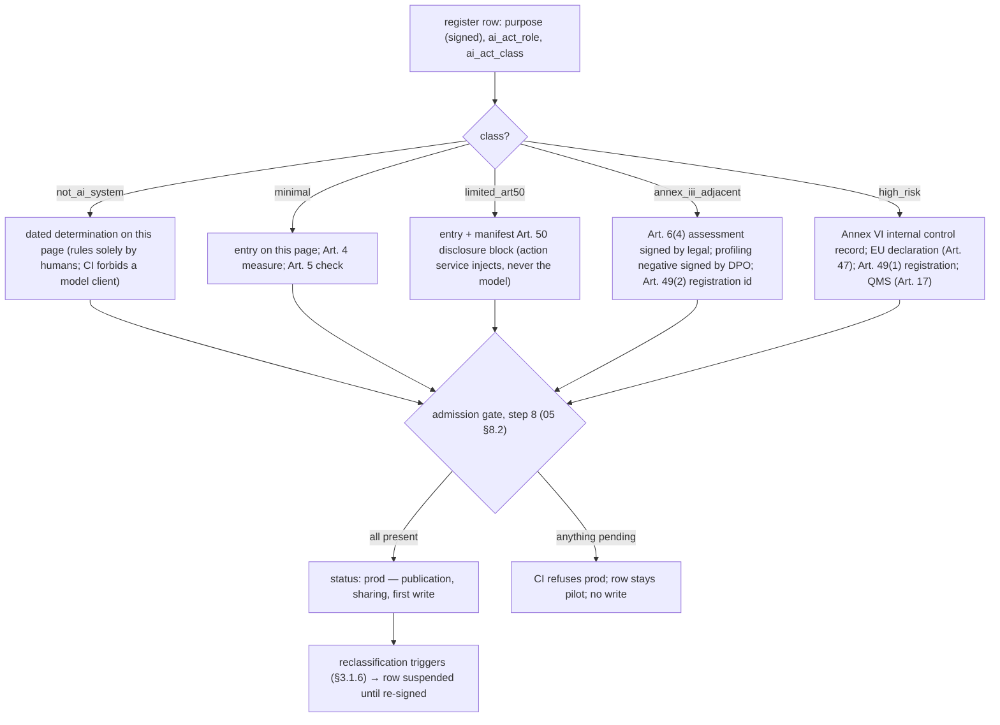
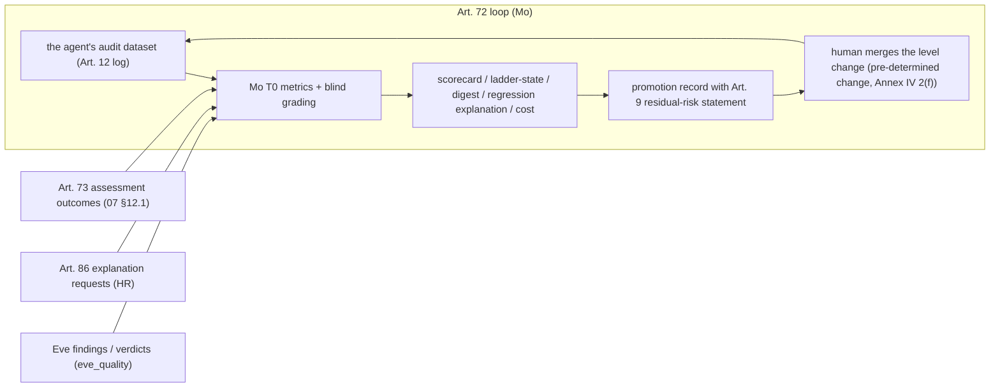

# 10. EU AI Act

## Status
- Owner: the platform owner
- Last reviewed: 2026-09-13
- Maturity: detailed design, written 2026-09-13 under [01-hld.md](01-hld.md). Nothing is built;
  nothing is registered; no legal entity has signed anything. This page details the HLD's §14.1
  "EU AI Act" (the per-system classification table, the article-by-article table and the
  "what cannot be promised" list), the `ai_act_*` fields of §5.1, the `compliance` block of
  §12.2, item 13 of §13.1 and the compliance sentences of §13.2 and §13.3. It answers the HLD
  brief items I66–I73 of [00-objective-review.md](00-objective-review.md) §5 and the register
  gaps AIA-01 and AIA-02 (blocking), and it carries the platform's answer to AIA-03 to AIA-13
  where the mechanism lives on another page (pointed at, not repeated).
- What this page is: the single authority the HLD calls `ai-act.md` — the file
  `register/export/ai-act-register.md` of [05-registry-and-autonomy-contract.md](05-registry-and-autonomy-contract.md)
  §8.2, the "AI compliance owner named in `ai-act.md`" of
  [07-monitoring-detection-incident-response.md](07-monitoring-detection-incident-response.md)
  §12.1 and the `ai_act_entry: ai-act.md#<agent>` anchors of the manifest all resolve to this
  page (the reconcile pass renames the links; the anchors are §3.1–§3.6 below). It records,
  per AI system: the legal roles, the declared intended purpose, the Art. 5 check, the Art. 6
  analysis with the Art. 6(3) condition relied on and the profiling question answered, the
  Art. 50 position, the registration status; then the obligation crosswalk to platform
  mechanisms, the Annex IV crosswalk, the evidence register, and the honest list of what
  "bulletproof" cannot mean.
- What this page is not: legal advice, a signed assessment, or a substitute for the DPIA. Every
  legal determination below is the *design's position*, written so that legal and the DPO can
  sign or strike it; where it waits on them the row says so. The mechanisms it relies on live on
  the pages named in each row; this page adds only what no other page owns (the disclosure
  text, the level caps per family, the overseer roster, the reclassification triggers, the
  evidence register).
- Standing constraints, unchanged and relied on: no domain-wide delegation; the language model
  holds no credential and cannot approve; humans raise autonomy and machines lower it; no model
  produces an Eve approval; Mo reaches production only through a merged pull request; safety
  interlocks are plain authenticated REST; Wall-E holds Super Admin by the owner's decision
  (P33) and this page designs around it — the privilege is a *credential fact*, the catalogue
  is the *intended purpose* (§3.1).
- Conventions: `Assumption:` marks inferred facts; *tbd* marks values nobody has decided; every
  article, annex, date and product named here was re-verified on 2026-09-13 against the URL in
  §10 unless the row says "unverified". Regulation (EU) 2024/1689 is "the Act"; Regulation (EU)
  2026/1744 is "the Omnibus". Article numbers are the Act's as amended by the Omnibus. Decisions
  this page records are numbered **P125–P132**, final ids in
  [12-open-decisions.md](12-open-decisions.md). The two diagrams are in §3.7 and §4.4.
- No company names, no secrets, no person named for a role.

---

## 0. The position in one paragraph

Classification is per AI system and follows the intended purpose the provider declares, not
the privileges an account holds. The organisation is provider and deployer of Wall-E and Mo;
Google is provider of the Gemini models and of the Gemini Enterprise application and the
organisation is their deployer; Eve's control path is not an AI system. Wall-E's declared
intended purpose is **the catalogue**: administration of Workspace accounts, groups, licences
and mailboxes on operator request or on catalogued triggers, within the hard-denied list. On
that purpose Wall-E is Annex III 4(b)-adjacent and the provider claims the Art. 6(3) derogation
— condition (a) for the catalogue's procedural families and condition (b) for the suspension
family, which executes a decision taken elsewhere — documents it under Art. 6(4), registers
under Art. 49(2) **before the first write**, and adopts Art. 9–15 voluntarily as the
engineering baseline. The one family that could carry profiling — licence reclaim by
inactivity — is redesigned so that **no AI output selects a person by behaviour** (§3.1.4, P126);
until the DPO and legal sign that reading, that family stays human-approved. On 2026-09-13 the
obligations that already bite are Art. 4 (literacy), Art. 5 (prohibitions) and Art. 50
(transparency, since 2026-08-02); Annex III obligations bite on 2027-12-02, inside the ladder's
own plan. "Bulletproof" is declined as a promise and replaced by §6: the mechanisms, the
evidence, and the seven things the regulator or the guidelines still decide.

---

## 1. The regulatory state on 2026-09-13

Re-verified this pass against the Official Journal texts and Commission pages (§10). Where the
Omnibus changed something the row says so; where a date depends on a text this pass did not
read, the row says "unverified".

| Item | State on 2026-09-13 | Source |
|---|---|---|
| Regulation (EU) 2024/1689 (the Act) | In force 2024-08-01; general application 2026-08-02 (Art. 113). Chapters I–II (definitions, Art. 4 literacy, Art. 5 prohibitions) since 2025-02-02; Chapter V (GPAI), governance and penalties since 2025-08-02. | https://artificialintelligenceact.eu/article/113/ ; https://eur-lex.europa.eu/eli/reg/2024/1689/oj |
| Regulation (EU) 2026/1744 (Digital Omnibus on AI) | Adopted 2026-07-08, published OJ 2026-07-24, in force 2026-07-27. **Annex III high-risk obligations apply from 2027-12-02** (was 2026-08-02); Annex I product-embedded systems from 2028-08-02. The deferral is a fixed date, not conditional on harmonised standards. | https://eur-lex.europa.eu/eli/reg/2026/1744/oj/eng ; https://digital-strategy.ec.europa.eu/en/news/ai-omnibus-enters-force ; https://artificialintelligenceact.eu/ai-act-explorer/digital-omnibus/ |
| Art. 4 AI literacy | Rewritten by the Omnibus: providers and deployers "shall take measures to support the development of AI literacy" of staff and persons operating AI systems on their behalf; no guaranteed level per person; new paragraphs 2–3 (Commission examples, Board recommendations). Still an obligation since 2025-02-02. | https://artificialintelligenceact.eu/article/4/ |
| Art. 5 prohibitions | Since 2025-02-02. The Omnibus adds a prohibition on systems generating non-consensual intimate material and child sexual abuse material, applicable **2026-12-02**. | https://artificialintelligenceact.eu/article/5/ ; https://artificialintelligenceact.eu/ai-act-explorer/digital-omnibus/ |
| Art. 50 transparency | Applies since **2026-08-02**, unchanged by the Omnibus except a four-month transitional period, to **2026-12-02**, for the Art. 50(2) machine-readable marking of systems already on the market before 2026-08-02. Commission **final guidelines on Art. 50 published 2026-07-20**; the Code of Practice on Transparency of AI-generated Content (Art. 50(2), (4), (5)) was published 2026-06-10 and found adequate by the Commission and the AI Board on 2026-07-08/09; about 190 signatories by end July 2026; Google signed on 2026-07-24. | https://artificialintelligenceact.eu/article/50/ ; https://eur-lex.europa.eu/eli/reg/2026/1744/oj/eng ; https://digital-strategy.ec.europa.eu/en/library/guidelines-transparency-obligations-providers-and-deployers-ai-systems ; https://digital-strategy.ec.europa.eu/en/policies/code-practice-ai-generated-content ; https://www.reedsmith.com/our-insights/blogs/viewpoints/102nbz0/transparency-obligations-for-ai-generated-content-the-code-of-practice-adequacy/ ; https://blog.google/company-news/outreach-and-initiatives/public-policy/eu-ai-act-transparency-code-of-practice/ |
| Art. 6(3) derogation, Art. 6(4) documentation, Art. 49(2) registration | Unchanged in substance: the four conditions stand; profiling of natural persons removes the derogation; the provider documents the assessment before putting into service and registers in the EU database (Art. 71, applicable since 2026-08-02). The Omnibus deleted points 7 and 9 of Annex VIII Section B (summary of grounds; Member States of availability), so the registration carries less, not nothing. | https://artificialintelligenceact.eu/article/6/ ; https://artificialintelligenceact.eu/article/49/ ; https://artificialintelligenceact.eu/article/71/ ; https://artificialintelligenceact.eu/annex/8/ |
| Commission guidelines on Art. 6 classification | **Draft**, published 2026-05-19; targeted consultation closed 2026-07-23; final expected by end 2026 (secondary sources). Not final on 2026-09-13. Draft paragraph 12: asserting in terms of service that high-risk uses are excluded is insufficient when the positioning says otherwise; the intended purpose must be described "clearly, concretely, and coherently across all materials". | https://digital-strategy.ec.europa.eu/en/library/draft-commission-guidelines-classification-high-risk-ai-systems ; https://www.dlapiper.com/en/insights/publications/2026/06/eu-commission-draft-guidelines-on-classification-of-high-risk-ai-systems-key-points |
| Commission guidelines on the AI-system definition | Published 2025-02-06. Outside the definition: systems "based on the rules defined solely by natural persons to automatically execute operations", basic data processing, classical heuristics, simple prediction. Non-binding. | https://digital-strategy.ec.europa.eu/en/library/commission-publishes-guidelines-ai-system-definition-facilitate-first-ai-acts-rules-application ; https://cms.law/en/gbr/legal-updates/eu-commission-issues-guidelines-on-the-definition-of-ai-systems |
| Harmonised standards (CEN-CENELEC JTC 21) | **None cited in the OJ** on 2026-09-13; no presumption of conformity exists. EN 18286 (quality management for AI Act purposes) is the first to reach final approval; CEN-CENELEC targets the prioritised deliverables by Q4 2026; the amended standardisation request M/613 expires 2027-02-28. | https://artificialintelligenceact.eu/standard-setting/ ; https://jtc21.eu/ ; https://www.cencenelec.eu/areas-of-work/cen-cenelec-topics/artificial-intelligence/ |
| GPAI Code of Practice; GPAI guidelines | Final Code 2025-07-10 (transparency, copyright, safety and security chapters); Google is a signatory. Commission GPAI guidelines page updated 2026-04-28. Art. 53(1)(b): the model provider gives downstream providers the documentation of Annex XII. | https://digital-strategy.ec.europa.eu/en/policies/contents-code-gpai ; https://digital-strategy.ec.europa.eu/en/policies/guidelines-gpai-providers ; https://artificialintelligenceact.eu/article/53/ |
| Penalties (Art. 99) | Art. 5: up to EUR 35 M or 7 % of worldwide turnover; other operator obligations including Art. 16, 25, 26 and 50: up to EUR 15 M or 3 %; incorrect information to authorities: up to EUR 7.5 M or 1 %. | https://artificialintelligenceact.eu/article/99/ |
| GDPR interplay | Art. 4(4) profiling: "any form of automated processing of personal data … to evaluate certain personal aspects … in particular to analyse or predict aspects concerning that natural person's performance at work, … reliability, behaviour"; Art. 22 solely-automated decisions; Art. 88 employment context and "monitoring systems at the work place". | https://gdpr-info.eu/art-4-gdpr/ ; https://gdpr-info.eu/art-22-gdpr/ ; https://gdpr-info.eu/art-88-gdpr/ |

**Consequence.** On 2026-09-13 the obligations that bite on this platform are Art. 4, Art. 5 and
Art. 50 — and Art. 50 has bitten for six weeks. The classification question does not wait for
2027-12-02: Art. 6(4) documentation and Art. 49(2) registration are due **before putting into
service**, which for Wall-E is the first write (Stage 1 of [../wall-e/05-autonomy-ladder.md](../wall-e/05-autonomy-ladder.md)).
The ladder's own plan reaches Stage 5 inside the 2027-12-02 horizon, so the voluntary Art. 9–15
baseline is not a courtesy; it is the only way to be ready if the classification flips (§3.1.6).

---

## 2. Roles — which legal entity is provider and which is deployer

Art. 3(3): the provider develops an AI system, or has it developed, and places it on the market
or puts it into service under its own name. Art. 3(4): the deployer uses an AI system under its
authority. Art. 2(1): the Act applies to providers putting systems into service in the Union and
to deployers established in the Union (https://artificialintelligenceact.eu/article/3/ ,
https://artificialintelligenceact.eu/article/2/). Art. 25(1)(b)–(c): a deployer becomes a
provider by substantially modifying a system or by changing the intended purpose of a system,
including a general-purpose AI system, so that it becomes high-risk
(https://artificialintelligenceact.eu/article/25/).

| System | Provider | Deployer | Basis | Legal entity | Status |
|---|---|---|---|---|---|
| Wall-E (ADK code, catalogue, playbooks, prompts, the two action services) | the organisation | the organisation | developed and put into service under its own name for its own use — Art. 3(3), 3(4) | **P23** (*tbd*, legal): `Assumption:` the employing entity; a group-level entity if the platform serves several subsidiaries; the entity that signs the Art. 6(4) assessment is the one that registers | provider **and** deployer; one owner reports (Art. 26(5) is internal) |
| Mo (metrics, proposals, pull requests) | the organisation | the organisation | same | P23 | minimal risk (§3.4); no registration |
| Eve control path (gate, reconciler, console) | — | — | not an AI system (§3.2) | — | outside the Act; recorded as an oversight measure |
| `eve-advisor` (report-only narration, P34) | the organisation | the organisation | developed in-house if built | P23 | class *tbd* (P19; §3.3) |
| Gemini models (the pinned model ids) | Google, as GPAI model provider (Chapter V) | the organisation, as user of the model inside its own systems | Art. 3(63); the organisation integrates, does not train or modify (§3.5, the GPAI one-liner) | P23 (deployer side) | provider documentation from Google on file (Art. 53(1)(b)); Art. 25(4) written position (P32) |
| Gemini Enterprise application (the tenant app, chat surface, Agent Gallery) | Google, as provider of a general-purpose AI system | the organisation | Art. 3(66); used as licensed | P23 | deployer duties only; Art. 50(1) on the surface is Google's design plus the organisation's agent descriptions (§4.7) |
| Every future agent on the platform | per register row (`ai_act_role`) | per row | the admission gate refuses a row without it | P23 or the subsidiary named in the row | per row (§3.6) |

Two role traps the design records so nobody falls into them:

1. **Becoming a GPAI provider.** The platform hosts third-party models and never trains,
   fine-tunes or substantially modifies them (HLD §16, §14.1 Art. 25 row). Any change to that
   line reopens Chapter V (Art. 53, and Art. 55 if systemic risk) and Art. 25. The Commission's
   GPAI guidelines say only significant modifications make a downstream actor a model provider;
   the platform does not test the threshold because it makes no modification at all. Recorded as
   P131 item (c).
2. **Becoming the provider of Google's system.** Publishing an agent through Gemini Enterprise
   does not make the organisation the provider of Gemini Enterprise; giving the tenant app a new
   high-risk purpose would (Art. 25(1)(c)). The register's `purpose` field is per agent, never
   for the app; the app's own configuration ([03-gemini-enterprise-environment.md](03-gemini-enterprise-environment.md))
   changes no intended purpose.

Owner of this section: **legal** (the entity, P23) with the **AI compliance owner** (§4.1) keeping
the table current. Resource: this page and the register's `ai_act_role` field. Verified: the
register export's entity column matches this table (quarterly review, HLD §5.3). Fails: a row
whose entity differs from P23's answer is a merge failure once P23 is decided.

---

## 3. Classification, per system

The class vocabulary is the register's (HLD §5.1): `not_ai_system`, `minimal`, `limited_art50`,
`annex_iii_adjacent`, `high_risk`. Project labels carry the same values with hyphens
(`annex-iii-adjacent`, [02-landing-zone-and-tiers.md](02-landing-zone-and-tiers.md) §labels) —
one vocabulary, two spellings, both generated from the register row; §8 asks the reconcile pass
to say so on both pages.

### 3.1 Wall-E {#wall-e}

**Art. 5 check (negative determination, dated 2026-09-13, to be re-signed by legal).** Wall-E
performs none of Art. 5(1)(a)–(h): no subliminal or manipulative techniques, no exploitation of
vulnerabilities, **no social scoring**, no criminal-risk profiling, no facial-image scraping,
**no emotion recognition in the workplace**, no biometric categorisation, no remote biometric
identification; nor the Omnibus's new prohibition (NCII/CSAM generation) — the catalogue
generates no images, video or audio at all, and the Gemini Enterprise app's image and video
generation toggles are off ([03-gemini-enterprise-environment.md](03-gemini-enterprise-environment.md)).
Model Armor's Responsible AI filters are a content control, not the basis of this determination.
Re-run whenever a family is added (§3.1.6).

**Is Wall-E an AI system?** Yes. It contains a language model that infers a plan from a prompt
and tool results — the Commission's definition guidelines exclude only rule-only systems, and
Wall-E is not one. The *action services* are rule-only (policy chain, catalogue, ceilings), but
they are components of the system whose purpose the model serves, so the system is classified as
a whole. This is why Eve's design differs (§3.2).

#### 3.1.1 The declared intended purpose (the sentence the assessment rests on)

> Wall-E is an administration assistant for the organisation's Google Workspace tenant. On the
> request of a named operator, or on a catalogued scheduled or event trigger, it observes
> directory, licence, group and audit data and executes catalogued, explicitly-targeted
> administration operations — group membership, profile and organisational-unit fields,
> licence assignment, mailbox labels on its own mailbox, templated notifications, and the
> suspension or restoration of an account **when a decision to that effect has already been
> taken by the organisation's HR process or by a named operator**. It executes uncatalogued
> administration requests only when a human super administrator has fully specified them and a
> second human super administrator has approved them. It never decides who leaves, who is
> promoted, who is monitored or how anyone performs; it never selects persons by their
> behaviour; it never changes the tenant's security posture, deletes data, assigns
> administrator roles or spends money. It does not interact with employees other than its
> operators except by sending notifications that state they come from an AI system.

This is the HLD's band A as purpose, band B as "execution of a fully specified administration
request decided and approved by two human super administrators", band C as instructions to a
human (HLD §13.1 item 13, P28). Super Admin is the credential the account holds; it appears in
the technical documentation as a fact and in the risk register as row one (P33); it appears in
the intended purpose nowhere, and the draft guidelines' paragraph 12 is the reason the purpose
must be stated identically in the register row, the manifest, the agent card, the Gemini
Enterprise description and the operator instructions — one paragraph, one hash (P125).

**The alternative, recorded as rejected.** "Any super-admin action on a human's prompt" as the
purpose would put user deletion, admin-role assignment, security-posture changes and Vault
operations inside the purpose; the narrow-task reading of Art. 6(3)(a) would collapse; the
system would be high-risk under Annex III 4(b) with the full Chapter III programme (Art. 9–15,
17, 43 with Annex VI, 47, 48, 49(1), 72, 73) by 2027-12-02 and an EU declaration of conformity
signed by an entity that has no harmonised standard to lean on. It is rejected because the
objective's sentence describes the *credential*, not the *use*: the hard-denied list and the
band structure already make "any action" false in code, and the AI Act rewards saying so.

#### 3.1.2 Annex III 4(b), family by family

Annex III 4(b): systems "intended to be used to make decisions affecting terms of work-related
relationships, the promotion or termination of work-related contractual relationships, to
allocate tasks based on individual behaviour or personal traits or characteristics or to
monitor and evaluate the performance and behaviour of persons in such relationships"
(https://artificialintelligenceact.eu/annex/3/). Families are [../wall-e/05-autonomy-ladder.md](../wall-e/05-autonomy-ladder.md) §5.

| Family | Touches 4(b)? | Art. 6(3) condition relied on | Why it holds on this design | Level cap this page sets (§4.6) |
|---|---|---|---|---|
| F1 Observe (READ) | only the usage and last-sign-in reports, which are Google's own admin reports read back to a human | (a) narrow procedural task; for the inactivity report, (d) preparatory task subject to human assessment | the system retrieves an administrator metric and formats it; it evaluates nobody; the report reaches a human and **never a write plan** (§3.1.4) | L5 (unchanged) |
| F2 Notify (templated, fixed recipients) | no | (a) | fixed template ids, fixed recipient group; Art. 50 only (§4.7) | L4 |
| F2b Free notify (`gmail.send`, `chat.message.send`, calendar) | no decision about a person; Art. 50 | (a) | free text is the model's; the disclosure line is the action service's (§4.7) | L2 (unchanged) |
| F3 / F3b Membership, access groups | "allocate tasks" is not touched: membership follows an operator's request, not a trait or behaviour | (a) | explicit targets, class check, security groups blocked (N3) | L4 / L3 (unchanged) |
| F4 / F4b Profile fields, OU move | no; a profile field or OU is an administrative attribute, not a term of employment | (a) | `SAFE_USER_FIELDS`, OU allowlist | L4 / L3 (unchanged) |
| **F5 Suspend** | **yes — it executes the technical consequence of a termination or leave decision** | **(b) improves the result of a previously completed human activity** — the human activity is the HR decision, the "result" is the tenant state; secondary (a) | the decision is taken elsewhere (HR system of record or a named operator), the plan carries the decision reference (`decision_ref`, P125), pre-state is shown before approval, the inverse (F6) is human-only. The draft guidelines' test is that the system must not "materially influence the outcome"; a suspension that follows a recorded decision influences nothing | **L4, and only on a T2 event from the HR system of record; T1 scheduled and T0 chat never above L3**; holds never expire outside business hours |
| F6 Restore | reverses F5 | (a) | permanently L3 | L3 (unchanged) |
| **F7 Licences** | **potentially — if the target set is chosen by inactivity, the system "evaluates behaviour"** | split (§3.1.4): F7-suspended follows F5's reasoning; F7-inactive is (a) only because the *human* chooses the targets | see §3.1.4 | F7-suspended L4; **F7-inactive L3 until P18 is answered, and the selection never automated at any level** |
| F9 Own mailbox, F10 Rollback | no | (a) | robot's own resources | unchanged |
| F8 Later (data transfer, archive, group create) | per operation | per operation, assessed on entry (§3.1.6) | enters at L0 with its own mini-ladder | L0 until assessed |
| Band B (`/v1/execute-generic`) | any Admin SDK method reachable at `WRITE`/`SUPER`, so 4(b) territory is reachable in principle | (a): execution of a fully specified request, two humans, no decision influence | permanently L3, `chat` trigger only, two-person rule at `SUPER`; **for any method whose target is a natural-person account and whose committed tier is `WRITE` or `SUPER`, the change-ticket reference must cite the decision record (`decision_ref`) or the lane refuses** (P125) — the audit row then shows, per action, that the decision was human | L3 permanently (HLD) |
| Band C (`/v1/handoff`) | no — output is console steps for a human super admin who then acts | not an output acting on a person | the hard-denied check runs first (HLD §13.1) | none |

**Result.** Annex III 4(b)-adjacent; the derogation is claimed under Art. 6(3)(a) for the
catalogue and band B and under Art. 6(3)(b) for F5, with the profiling exclusion answered by
design in §3.1.4. Register row: `ai_act_class: annex_iii_adjacent`, `ai_act_role: both`,
`art_6_4_assessment: 10-eu-ai-act.md#wall-e` (this section, dated and signed at P28),
`art_49_registration: pending` until the EU database id exists — and
[05-registry-and-autonomy-contract.md](05-registry-and-autonomy-contract.md) §8.2 refuses
`status: prod` while it is `pending`, which is the mechanism behind "registration before first
write".

#### 3.1.3 Art. 6(4) assessment — the document, its content, its owner

| Element | Content | Owner | Evidence |
|---|---|---|---|
| The assessment | this §3.1 frozen as a dated file `register/assessments/wall-e-art6-<date>.md` (git, then the evidence bucket): the intended-purpose paragraph and its hash, the family table, the condition per family, the profiling analysis of §3.1.4, the Art. 5 determination, the reclassification triggers of §3.1.6, legal's signature line, the DPO's signature line for §3.1.4 | legal writes and signs; the AI compliance owner keeps it current; the platform owner supplies the technical facts | E-01 (§5) |
| Timing | before Stage 1 (first write); re-run against the final Art. 6 guidelines within 90 days of their adoption (§3.1.6) | legal | E-01 versions |
| Registration | Art. 49(2) in the EU database (Art. 71): Annex VIII Section B as amended — provider identity, system name and reference, intended purpose (the paragraph above), the Art. 6(3) condition(s) relied on, status; points 7 and 9 no longer required | the provider entity of P23 registers; the platform owner supplies the fields from the register row | E-02: the database id in `art_49_registration` |
| Handing over | the assessment and the technical documentation (§4.3) are handed to a competent authority on request; the AI compliance owner is the contact | AI compliance owner | E-01, E-05 |

Fails: no signed assessment ⇒ the register row cannot leave `pending` ⇒ CI refuses `prod` ⇒ no
write. A registration id that stops resolving is a quarterly review item (the EU database has
no API the platform reads — 05 §8.2).

#### 3.1.4 The profiling question, answered by design (P126)

The question (P18, HLD §17): is selecting accounts for licence reclaim by last sign-in and usage
"profiling of natural persons", which under Art. 6(3) last subparagraph makes an Annex III
system high-risk regardless of the four conditions? GDPR Art. 4(4) defines profiling as
automated processing "to evaluate certain personal aspects relating to a natural person, in
particular to analyse or predict aspects concerning that natural person's performance at work
… reliability, behaviour". A threshold on a single sign-in timestamp is a weak candidate for
"evaluating personal aspects", and there is an argument that it is administration of a company
asset rather than evaluation of a person. The design **does not rely on that argument**,
because (i) the draft guidelines say profiling is always high-risk, (ii) enforcement practice
does not exist, and (iii) inactivity heuristics have a foreseeable discriminatory effect on
part-time, leave, sick and disabled staff — which is an Art. 9 risk whether or not it is
profiling.

The decision, recorded as **P126**:

1. **F7 is split** in the manifest into `F7-suspended` (licence removal from an account already
   suspended by F5 or by a human; the target set is defined by a state Wall-E did not choose)
   and `F7-inactive` (licence removal from an active account).
2. **No AI output selects a person by behaviour.** The inactivity report stays an F1 READ
   artefact delivered to a human. An `F7-inactive` plan takes its targets **only** from
   explicit ids supplied by the requesting human; CI asserts that no playbook's `uses` binds an
   F1 usage or sign-in report as the target source of any write family (the same validator that
   asserts `SUPER` never appears in `playbook.uses`, HLD §12.1). The action service refuses an
   `F7-inactive` plan whose targets were not explicitly enumerated by a human principal
   (`principal.type == human`) with `profiling_boundary_denied` — a new value of the denial
   vocabulary, and a cross-page claim for [05-registry-and-autonomy-contract.md](05-registry-and-autonomy-contract.md)
   §audit.schema.
3. **Level cap**: `F7-inactive` is L3 at every trigger until the DPO and legal answer P18 in
   writing; `F7-suspended` follows F5 (L4 on the HR event only). If P18's answer is
   "profiling", `F7-inactive` is removed from the catalogue (L0, and the report stays F1) or
   Wall-E is reclassified `high_risk` — the owner chooses; the design recommends removal.
4. **Fundamental-rights row** in the risk register (§4.2): "wrongful or discriminatory licence
   reclaim" with the mitigations above and the residual stated.

Owner: DPO and legal (the answer), platform owner (the mechanism), security reviewer (the CI
rule). Resource: the manifest's `families[]`, the playbook validator, the action service policy
chain. Verified: the CI assertion in every pipeline run; Mo's audit-completeness metric counts
`profiling_boundary_denied` (target: never at L4/L5 because such a plan cannot exist there).
Fails: a plan that reaches the action service with report-derived targets is refused and paged
at severity 2 — a refused plan is the control working, not an incident.

#### 3.1.5 Two things Super Admin does and does not change

It does not change the classification: intended purpose is declared by the provider (Art.
3(12)). It does change the *evidence burden*: the draft guidelines refuse a purpose that the
positioning contradicts, and an account that can do everything is a positioning fact. The
evidence that answers it is on other pages — the hard-denied list in code with CI ownership
outside the agent repository (HLD §13.1 item 2), the band structure, the Workspace admin audit
reconciled against `walle_audit` with "robot admin events with no matching catalogue or band-B
operation" as a headline metric with target 0 (HLD §13.3) — and this page adds only the rule
that the reconciled count is part of the Art. 6(4) file's annual refresh (E-01, E-09).

#### 3.1.6 Reclassification triggers (P132)

Classification is re-run, and the register row set `suspended` until re-signed, when any of
these happens. The AI compliance owner keeps the list; CI enforces the ones with a machine
signal.

| Trigger | Signal | Who re-runs |
|---|---|---|
| A family is added, or a family's ceiling, trigger class or target rule changes | manifest diff in CI (`families[]`, `ceilings`) | legal + platform owner |
| The intended-purpose paragraph changes (any of its five copies) | hash mismatch in CI | legal |
| P18 answered "profiling" | decision record | legal, DPO |
| A model client enters Eve's control path, or `eve-advisor` gains any input to the gate | Eve's CI invariant (§3.2) | Eve owner, legal |
| Any training, fine-tuning or modification of a model | none — a policy line; the register has no such field because the answer is "never" | platform owner, legal (Chapter V reopens) |
| The Commission adopts the final Art. 6 guidelines | calendar (expected end 2026) | legal, within 90 days |
| A harmonised standard for Art. 9–15 or Art. 17 is cited in the OJ | calendar | ISMS, legal (presumption of conformity becomes available; §6) |
| 2027-12-02 | calendar | AI compliance owner: the voluntary baseline becomes the mandatory one for any `high_risk` row |
| A serious incident assessed under Art. 3(49) (07 §12.1) | case flag `art73_assessed` | legal |
| A substantial modification in the Art. 3(23) sense — a change not foreseen in the technical documentation that affects compliance or purpose | the ladder's pre-determined changes (§4.3, Annex IV 2(f)) are foreseen; anything else is a decision record | legal, security reviewer |

### 3.2 Eve control path — not an AI system, as an invariant {#eve}

`eve-gate`, `eve-reconciler` and `eve-console` are deterministic SQL and predicates, no model
client, no `aiplatform` (a project-level `restrictServiceUsage` denylist on `EVE_PROJECT`, HLD
§13.2). Under the Commission's definition guidelines a system "based on the rules defined
solely by natural persons to automatically execute operations" is outside Art. 3(1). Eve's
control path is therefore **not an AI system** and needs no classification, no registration and
no Art. 50 position; it *is* an Art. 14(3)(a) oversight measure "built into the high-risk AI
system by the provider" — the design's cheapest compliance property, recorded here as an
invariant rather than left to safety discipline ([../eve/01-hld.md](../eve/01-hld.md)
"Deterministic by absence, not by discipline").

Register row: `ai_act_class: not_ai_system`, dated determination = this section. Owner: Eve
owner (the property), legal (the determination). Resource: Eve's image and project. Verified:
the CI check that forbids a model client in Eve's image, the `restrictServiceUsage` denylist
drift row, and the reconciliation job's "no `aiplatform` API enabled in `EVE_PROJECT`" line.
Fails: a model client in Eve's control path is a merge failure; if it ever lands, the
determination is void, the row goes `suspended`, and Eve's approvals stop counting as a
human-designed oversight measure — which is also the safety reason the invariant exists.

### 3.3 eve-advisor — class *tbd* (P19), interim rules {#eve-advisor}

Not built (P34 allows a report-only reasoning path). If built it narrates anomalies over
administrator-action logs — about the robot, but also about human administrators. Whether that
is "monitoring the behaviour of persons in a work relationship" under Annex III 4(b) is a legal
question this page does not answer for legal; it records what holds until it is answered: no
registration (nothing is registered until classified), pages at severity 2 only, produces no
finding about a named human without the deterministic rule that triggered it (HLD §14.1), and
nothing it writes is read by the gate. The likely outcome is `annex_iii_adjacent` under
Art. 6(3)(c) — detecting deviations from prior decision-making patterns without replacing the
human assessment — but that is legal's call. Owner: legal (P19), Eve owner. Fails: a build
without a class is refused by the admission gate.

### 3.4 Mo — minimal risk {#mo}

Mo measures Wall-E's and Eve's outcomes and proposes configuration changes as pull requests a
human merges (HLD §13.3). Its outputs are numbers and diffs about *systems*; it grades plans,
not people (the blind sample is of Wall-E's plans; graders are humans grading a machine, not
the reverse). It interacts with no natural person other than its reviewers reading a pull
request, so Art. 50(1) is not triggered; it generates text (digests, regression explanations)
that is internal and reviewed, so Art. 50(2) marking applies only to the extent a model wrote
it — Mo's digests are rendered from templates over metrics; where a model drafts prose the pull
request label "agent-authored" and the file header are the disclosure (§4.7). Register row:
`ai_act_class: minimal`, `ai_act_role: both`. Owner: Mo owner, legal. Fails: a Mo proposal
that would touch a person (none exists in the closed proposal set) is a design change.

### 3.5 Gemini Enterprise app and the Gemini models — deployer duties, and the GPAI one-liner {#gemini}

- **Models.** Google is the GPAI model provider (Art. 3(63)); Google signed the GPAI Code of
  Practice (2025-07-10) and, per its 2025-08-01 statement, publishes EU AI Act documentation
  for its models through its compliance centre (the specific page did not render this pass;
  §9). The platform's duty is to hold, per `model_pin`, the Art. 53(1)(b)/Annex XII
  documentation Google supplies (a supplier row, E-11), and to keep the **GPAI one-liner**: *the
  platform hosts third-party models and never trains, fine-tunes or substantially modifies
  them; any change reopens Chapter V and Art. 25* (HLD §14.1, §16; P131(c)).
- **Art. 25(4) written position** with Google (P32): what information, technical access and
  assistance the model provider gives so that the organisation can meet its own obligations;
  requested from Google, on file in the supplier file (HLD §14.3). Until it exists the row says
  *tbd* and the residual is in §6.
- **The app.** Google is the provider of a general-purpose AI system; the organisation is its
  deployer. Art. 50(1) on the chat surface: a user opening Gemini Enterprise knows they are
  using an AI application — the "obvious to a reasonably well-informed, observant and
  circumspect person" exception plausibly holds for the surface; the platform does not rely on
  it alone for its own agents (§4.7).
- **Art. 26 as deployer of the app**: use per Google's documentation; the conversation store
  is not the platform's Art. 12 log (03 §P129); retention is the DPO's (P13).

Register rows: the app and each model pin are supplier rows, not agent rows (HLD §5.1
`supplier_rows`); their `ai_act_role` is `deployer`. Owner: Gemini Enterprise administrator
(the app), platform owner (the model pins), legal (Art. 25(4)).

### 3.6 The platform and every future agent — the gate, not a page {#platform}

The platform itself is not an AI system; it is infrastructure. Every agent published on it is
its own Art. 6 question, its own role determination, its own Art. 50 position and its own
register row — and "hundreds of agents" is only bulletproof if that is a gate, not a page.
The gate exists in [05-registry-and-autonomy-contract.md](05-registry-and-autonomy-contract.md)
§8.2 (P75 there): before `status: prod` the row carries `ai_act_class`, `ai_act_role`, a signed
`purpose`, and per class the entry on this page, the Art. 50 block, the Art. 6(4) assessment
and the Art. 49 registration id. This page adds the **entry template** every agent's anchor
must fill (§3.7) and the rule that the AI compliance owner reviews every new entry before legal
signs it. The Wall-E/Eve/Mo sections above are the first three entries.

### 3.7 The classification gate, as a shape

**Entry template** (what each anchor on this page carries): system; provider/deployer and
entity; the intended-purpose paragraph and its hash; Art. 5 determination and date; Art. 3(1)
determination if `not_ai_system`; Annex III analysis and the Art. 6(3) condition per family;
profiling answer; class; Art. 50 position; Art. 12 log store (`<agent>_audit`); oversight roles;
registration id; review date; signatures (legal; DPO where personal data of employees is
processed).

---

## 4. Obligation crosswalk — every obligation, its owner, its evidence, its mechanism

Voluntary Art. 9–15 baseline now for every `annex_iii_adjacent` row; mandatory from 2027-12-02
for any `high_risk` row; Art. 4, 5, 50 mandatory now. "Page" is where the mechanism lives;
"Evidence" is the id in §5. Owners are roles (HLD §0.3 plus the AI compliance owner of §4.1).

| Article | Obligation | Mechanism and page | Owner | Evidence | Verified by | Fails |
|---|---|---|---|---|---|---|
| Art. 4 | AI literacy measures for staff operating AI systems | §4.8: a one-page briefing per role (capabilities, limits, automation bias, the ladder, the kill switches), attendance recorded, refreshed at each stage transition; folded into TISAX 2.1.3 training | AI compliance owner (content), ISMS (records) | E-13 | training record ≤ stage transition date; the stage-transition checklist refuses without it | a promotion without the record is refused by the ladder owner's checklist |
| Art. 5 | No prohibited practice | §3.1 negative determination, dated; re-run per family addition | legal | E-01 | part of the Art. 6(4) file | — |
| Art. 6(3)–(4), Art. 49(2) | Classification, documentation before service, registration | §3.1.2–3.1.3; 05 §8.2 gate | legal (assessment), provider entity (registration), platform owner (row) | E-01, E-02 | CI: `art_49_registration` ≠ `pending` before `prod` | no write |
| Art. 9 | Risk management as a continuous, iterative lifecycle process; risks to health, safety, fundamental rights; residual risk acceptable; testing against defined metrics; vulnerable groups | §4.2: the adversarial-review format ([../wall-e/10-adversarial-review.md](../wall-e/10-adversarial-review.md), [../wall-e/14-hld-challenge.md](../wall-e/14-hld-challenge.md)) gains a **fundamental-rights column**; the per-stage decision record ([../wall-e/05-autonomy-ladder.md](../wall-e/05-autonomy-ladder.md) §10) carries the Art. 9 residual-risk statement; Mo's regression explanation feeds it; promotion is testing against metrics with Wilson bounds | agent owner (the record), security reviewer (sign-off), Mo owner (metrics) | E-03 | every promotion record has the statement; the ladder validator refuses a promotion without it | no promotion |
| Art. 10 / Art. 26(4) | Data governance — for a system not trained by the provider, **Art. 10(6) applies the requirements to testing data only**; the deployer ensures input data is relevant and representative | Mo's golden fixtures and grading sample ([../mo/03-metrics-contract.md](../mo/03-metrics-contract.md), [../mo/04-artefacts-and-proposals.md](../mo/04-artefacts-and-proposals.md) §2) as testing data with a bias examination note (§4.2); the manifest's `compliance.input_data_relevance` statement per trigger feed (HR system of record, usage reports) — 05 §manifest | Mo owner (fixtures), agent owner (statement), DPO (review) | E-04 | manifest schema check; fixtures versioned | a trigger feed without a statement fails the manifest |
| Art. 11 / Annex IV | Technical documentation before putting into service, kept current | §4.3 crosswalk; the documentation freeze per stage (P130) | AI compliance owner (index), platform owner (freeze), every page owner | E-05 | the stage-N snapshot tag exists before the stage opens; the crosswalk's "frozen at" column | a stage does not open |
| Art. 12 / Art. 19 / Art. 26(6) | Automatic logging over the lifetime; retention ≥ six months | `<agent>_audit` plus the frozen plan **designated the Art. 12 log** ([08-data-logging-retention-sovereignty.md](08-data-logging-retention-sovereignty.md) R1, HLD §7.5); 400 days, export locked; the Art. 12(2) purposes each served: (a) risk situations — denial reasons, taint, breaker trips; (b) post-market monitoring — Mo reads the schema; (c) operation monitoring — Eve reconciles every row | platform owner (schema), agent owner (dataset), DPO (ceiling) | E-06 | the daily JSONL export heartbeat; the quarterly R-A restore drill | writes refused when the audit sink is down (N8) |
| Art. 13 / Art. 15(3) | Instructions for use with capabilities, limits, accuracy metrics, oversight measures, log mechanisms | §4.5: an operator-facing instructions page per agent derived from [../wall-e/06-security-guardrails.md](../wall-e/06-security-guardrails.md), [../eve/06-failure-modes.md](../eve/06-failure-modes.md) and the ladder, with the declared accuracy levels from Mo | agent owner, Mo owner (numbers) | E-07 | part of the stage snapshot; Art. 13(3)(a)–(f) checklist | Stage 1 does not open without it |
| Art. 14 / Art. 26(2) | Human oversight designed in; overseers with competence, training and authority; automation-bias measure; stop | §4.6: the ladder as the oversight design; named overseer roles; level caps per family; the K0 drill as the Art. 14(4)(e) test; operator self-grading as the automation-bias control | agent owner, Eve owner, ISMS (roster) | E-08 | drill records; roster review quarterly | — |
| Art. 15 | Accuracy, robustness, cybersecurity; resilience to manipulation (adversarial inputs, data and model poisoning) | Mo's metrics (≥ 95 % graded correct as the promotion floor, precision per cell); breakers, budgets, fail-closed; Model Armor, the injection regression suite ([../wall-e/11-prompt-security.md](../wall-e/11-prompt-security.md)), Agent Identity ([../wall-e/12-agent-identity.md](../wall-e/12-agent-identity.md)), gateways ([06-gateways-model-armor-perimeter.md](06-gateways-model-armor-perimeter.md)), supply chain ([09-supply-chain-secrets-recovery.md](09-supply-chain-secrets-recovery.md)) | Mo owner, security reviewer, platform owner | E-07, E-09 | the scorecard; the injection suite in CI; re-qualification on every model pin | a failed suite blocks the deploy |
| Art. 16 | Provider obligations list | this table is the map; (b) identity on the system = the agent card and the Gemini Enterprise description; (l) accessibility of the operator surface *tbd* | AI compliance owner | — | — | — |
| Art. 17 | Quality management system, proportionate to the organisation's size | §4.9: the ISMS as the QMS host; the wiki's decision records, CI gates, the ladder, Mo and the incident process mapped to Art. 17(1)(a)–(m); **built only if a row is `high_risk`**, kept ready otherwise | ISMS, platform owner | E-14 | annual internal audit slot (HLD brief 79) | — |
| Art. 18 / Art. 47 | Keep technical documentation, QMS documentation and the declaration ten years | 08 R11: decision records, compliance snapshots, drill records — **10 years**, locked | platform owner | E-05 | bucket lock; drift job | — |
| Art. 25 | Value chain; written agreement with the model supplier | §3.5; P32 | platform owner, legal | E-11 | supplier file review | residual (§6) |
| Art. 26(1) | Use per instructions | the instructions page is the operators' page; band B and C exist so that out-of-catalogue use is *documented* use | agent owner | E-07 | — | — |
| Art. 26(5) | Monitor; inform the provider of risks and serious incidents | provider = deployer, so internal; the desk's checklist ends every severity-1 case with the Art. 3(49) question (07 RB-10) | incident commander | E-10 | case flags | — |
| Art. 26(7) / Art. 26(11) / Art. 86 | Inform workers' representatives and affected workers before putting into service at the workplace; inform persons subject to decisions; explain on request | §4.10 (P129): before Stage 1, under GDPR Art. 88 and national law now, Art. 26(7) voluntarily now; the Art. 86 explanation path through HR | HR/communications (the path), DPO, legal | E-12 | the dated information record before Stage 1; the explanation-request log | Stage 1 does not open |
| Art. 27 / Art. 26(8) | FRIA; public-authority registration | `Assumption:` private organisation, not providing a public service, no Annex III 5(b)/(c) system — **do not apply**; entity and date recorded at P23; revisited if a subsidiary in scope is a public-service provider | legal | E-01 | annual review | — |
| Art. 43 / Annex VI / Art. 47 / Art. 48 / Art. 49(1) | Conformity assessment by internal control, declaration, CE marking, registration | **only if `high_risk`** — the fallback path of §3.1.1: Annex VI points 2–4 (QMS check, technical-documentation examination, design and post-market alignment), an EU declaration per Annex V kept ten years, a digital CE marking accessible from the operator surface, Art. 49(1) registration; timeline 2027-12-02 | legal, ISMS, provider entity | E-14 | — | planned, not promised (§6) |
| Art. 50 | Disclosure of interaction; machine-readable marking of generated content | §4.7 (P128) | agent owner (block), platform owner (injection), legal (position) | E-15 | CI: `limited_art50`+ rows carry the block; a content test sends one F2b message and asserts the line | a message without the line is refused by the action service |
| Art. 72 | Post-market monitoring system and plan, part of the technical documentation | Mo's five artefacts ([../mo/04-artefacts-and-proposals.md](../mo/04-artefacts-and-proposals.md) §1) **declared as the plan** per system; the plan text is §4.4; the Commission's template (Art. 72(3), implementing act) adopted when published | Mo owner | E-09 | the weekly digest exists; the scorecard's freshness | a silent Mo is a severity-2 finding (HLD §13.3 divergence check) |
| Art. 73 | Serious-incident reporting: 15 days; 10 for death; 2 for widespread infringement or critical-infrastructure disruption; initial incomplete report; no alteration before informing | 07 §12.1 (P101 there): the taxonomy, assessor, report owner (the AI compliance owner with legal), deadlines, the evidence freeze as the 73(6) rule | AI compliance owner, legal, incident commander | E-10 | case flag `art73_assessed`; the regulatory-clock metric | a missed window is a severity-1 finding in its own right |
| Chapter V | GPAI | §3.5 one-liner; supplier rows | platform owner, legal | E-11 | supplier file | — |

### 4.1 The AI compliance owner (P131)

The HLD's RACI (§0.3) has no row for the person who signs classifications, files registrations,
answers an authority and owns the Art. 73 clock; [07-monitoring-detection-incident-response.md](07-monitoring-detection-incident-response.md)
§12.1 already refers to "the AI compliance owner named in `ai-act.md`". This page names the
**role**: legal's designate (or the DPO where legal delegates), accountable for §2, §3, the
register export's classification column, the Art. 6(4) files, registrations, Art. 73 reports,
the Art. 4 briefing content and the annual refresh of this page; **not** the platform owner and
not the agent owner (separation: the person who builds does not classify). Minimum for Tier W:
consulted; for Tier P and P-SA: engaged, with a named deputy. Names come from the ISMS. Verified:
the RACI row exists before the super-admin grant (HLD §0.4). Fails: no owner ⇒ no signature ⇒
no `prod` for any `annex_iii_adjacent` row.

### 4.2 Art. 9 — the fundamental-rights column and the residual-risk statement

The security risk work is done ([../wall-e/06-security-guardrails.md](../wall-e/06-security-guardrails.md)
threat model, the 17 attacks, the 54 challenges); what Art. 9 adds is risks *to persons*. The
adversarial-review format gains one column, "fundamental-rights effect", and the risk register
gains these rows, each with its mitigation and the residual the owner accepts:

| Risk to persons | Family | Mitigation on the platform | Residual, stated |
|---|---|---|---|
| Wrongful suspension (wrong homonym, stale HR feed, injected instruction) | F5 | explicit targets, pre-state shown before approval, HR event as the only L4 trigger, `decision_ref`, F6 human-only, Eve's reconciliation, the veto window | a wrongful suspension can last up to the hold window plus the restore's L3 latency (≤ 4 business hours TTL) |
| Loss of access to work tools by licence reclaim | F7 | §3.1.4: humans choose targets; same-SKU re-insert as the inverse | an inactive-but-employed person loses access until they ask |
| Discriminatory effect of inactivity heuristics (part-time, leave, sickness, disability) | F1 report, F7-inactive | the report is advisory; the human selecting targets is briefed on the bias (Art. 4 material); the DPO reviews the selection rule in the DPIA | the heuristic's bias exists in the report even if no action follows |
| Chilling effect of monitoring administrators' actions | eve-advisor | class *tbd*; no finding about a named human without a deterministic rule | — until P19 |
| Phishing-grade harm from outbound mail by a trusted account | F2b | L2, recipient domain check, the disclosure line | a model-chosen text still reaches a human once an operator approves it |
| Automation bias in approvers | all L3/L4 | the self-grading sample (§4.6) | measured, not eliminated |

Owner: agent owner writes, security reviewer signs, DPO reviews the rows touching employees.
Resource: the risk register (HLD brief 79) and each promotion record. Verified: the ladder's
promotion template refuses a record without the residual-risk statement. Fails: no promotion.

### 4.3 Art. 11 — the Annex IV crosswalk and the documentation freeze (P130)

Annex IV headings (https://artificialintelligenceact.eu/annex/4/) mapped to the pages that
satisfy them for Wall-E. "Frozen at" is the stage whose snapshot must contain the page in its
reconciled form; on 2026-09-13 the three agent sets carry unapplied edits (HLD §18), so the
column is a promise the reconcile pass fulfils, and Art. 11 is **not met until it does** — a
documentation set that diverges from the system is a finding in itself.

| Annex IV | Content required | Page(s) | Frozen at |
|---|---|---|---|
| 1(a) intended purpose, provider, version | §3.1.1; the register row; `fingerprint` | S1 |
| 1(b) interaction with other systems | [../wall-e/13-agent-interconnection.md](../wall-e/13-agent-interconnection.md); [06-gateways-model-armor-perimeter.md](06-gateways-model-armor-perimeter.md); [../project-topology.md](../project-topology.md) | S1 |
| 1(c) software versions | manifest `fingerprint` (prompt hash, model pin, framework, Model Armor template) | every stage |
| 1(d) how it is provided (API, app) | [03-gemini-enterprise-environment.md](03-gemini-enterprise-environment.md); [../wall-e/12-agent-identity.md](../wall-e/12-agent-identity.md) | S1 |
| 1(g) user interface for the deployer | 03; the IAP approval surface ([../wall-e/03-lld.md](../wall-e/03-lld.md)) | S1 |
| 1(h) instructions for use | §4.5 | S1 |
| 2(a) development methods, third-party pre-trained components | [../wall-e/03-lld.md](../wall-e/03-lld.md); the model pin's supplier row and Google's Annex XII documentation | S1 |
| 2(b) design specification, logic, key design choices, optimisation targets | [../wall-e/01-hld.md](../wall-e/01-hld.md), [../wall-e/ARCHITECTURE.md](../wall-e/ARCHITECTURE.md), the system instruction ([../wall-e/11-prompt-security.md](../wall-e/11-prompt-security.md) §8) | S1 |
| 2(c) architecture, compute | [../wall-e/03-lld.md](../wall-e/03-lld.md); [02-landing-zone-and-tiers.md](02-landing-zone-and-tiers.md) | S1 |
| 2(d) data requirements (testing data, per Art. 10(6)) | [../mo/03-metrics-contract.md](../mo/03-metrics-contract.md), [../mo/04-artefacts-and-proposals.md](../mo/04-artefacts-and-proposals.md) §2 | S2 |
| 2(e) human oversight assessment (Art. 14) | §4.6; [../wall-e/05-autonomy-ladder.md](../wall-e/05-autonomy-ladder.md); [../eve/01-hld.md](../eve/01-hld.md) | S1 |
| 2(f) pre-determined changes; continuous compliance | **the ladder**: every level move is a pre-determined change declared in `ladder.yaml` within manifest ceilings, so a promotion is not a substantial modification (Art. 43(4)); the fingerprint rule resets cells on any real change | S1 |
| 2(g) validation and testing, metrics, accuracy, test reports | Mo's scorecard and metric pack; the injection regression suite; Eve's twelve seeded faults ([../eve/05-stages.md](../eve/05-stages.md)) | S2 |
| 2(h) cybersecurity measures | [04-identity-and-privileged-access.md](04-identity-and-privileged-access.md), 06, 09, [../wall-e/11-prompt-security.md](../wall-e/11-prompt-security.md), [../wall-e/12-agent-identity.md](../wall-e/12-agent-identity.md) | S1 |
| 3 monitoring, functioning, control; limits; foreseeable risks; accuracy per group; input data | [07-monitoring-detection-incident-response.md](07-monitoring-detection-incident-response.md); §4.2; §4.5 | S1 |
| 4 appropriateness of the performance metrics | [../mo/03-metrics-contract.md](../mo/03-metrics-contract.md) §8 metrics and their rationale | S2 |
| 5 risk management system (Art. 9) | §4.2; [../wall-e/06-security-guardrails.md](../wall-e/06-security-guardrails.md), [../wall-e/10-adversarial-review.md](../wall-e/10-adversarial-review.md), [../wall-e/14-hld-challenge.md](../wall-e/14-hld-challenge.md) | S1 |
| 6 lifecycle changes | decision records (`decisions/`), `ladder-state.md`, the register's history | continuous |
| 7 standards applied, or the solutions adopted instead | none cited in the OJ; **this page** is the record of the solutions adopted per article | S1 |
| 8 EU declaration of conformity | only if `high_risk` | — |
| 9 post-market monitoring system (Art. 72) | §4.4; [../mo/04-artefacts-and-proposals.md](../mo/04-artefacts-and-proposals.md) | S2 |

**The freeze (P130).** Before a stage opens, CI tags the wiki (`compliance/<agent>/S<n>/<date>`)
and copies the tagged tree as a bundle to the evidence bucket's `records/` class (08 R11, ten
years, locked). The tag is the "documentation as put into service"; the crosswalk above is its
index. Owner: platform owner (the tag), AI compliance owner (the index). Verified: the ladder's
stage-transition checklist requires the tag id; the R-A restore drill re-reads one bundle a
year. Fails: no tag ⇒ the stage does not open.

### 4.4 Art. 72 — Mo's artefacts as the post-market monitoring plan

The plan, in the words Art. 72(1)–(2) uses: the provider *actively and systematically collects,
documents and analyses* data on performance throughout the lifetime and evaluates continuous
compliance with Chapter III Section 2. On this platform that is Mo, by construction: the
scorecard (accuracy, precision per cell, audit completeness), `ladder-state.md`, the weekly
digest, the regression explanation on every change point, the monthly cost report — plus, for
Eve, the detection-quality pack (HLD §13.3). The plan's text per system is one paragraph in the
agent's entry naming the artefacts, the cadence, the reader, and the two feeds the artefacts
receive from outside Mo: every Art. 73 assessment outcome (07 §12.1) and every Art. 86
explanation request (§4.10), so the plan sees the incidents and the complaints. When the
Commission's Art. 72(3) template is adopted (implementing act; date unverified), the paragraph
is re-cut into it. Owner: Mo owner. Verified: the digest lands weekly; `metric_divergence`
between Mo and Eve is watched. Fails: a silent Mo is severity 2.

### 4.5 Art. 13 — instructions for use, per agent

One operator-facing page per agent (location: the agent's own set, `instructions-for-use.md`;
filename fixed at reconcile), derived from pages that exist, structured by Art. 13(3):

| Art. 13(3) | Content | Source |
|---|---|---|
| (a) provider identity and contact | P23's entity; the AI compliance owner's role mailbox | §2 |
| (b) characteristics, capabilities, limits; **accuracy metrics (Art. 15(3))**; known circumstances affecting performance; input data specification | the catalogue and bands; the blast-radius ceiling and "what prompt-based defence cannot do" ([../wall-e/06-security-guardrails.md](../wall-e/06-security-guardrails.md)); the accuracy floor (≥ 95 % graded correct) and the current scorecard numbers per family; the taint rule; the trigger feeds | wall-e/06, mo/03, the manifest |
| (c) pre-determined changes | the ladder's levels and ceilings; what a promotion changes | wall-e/05 |
| (d) human oversight measures, interpretation tools | the pre-state view, the plan rationale, the hold window, K0–K7, the veto | §4.6 |
| (e) resources, expected lifetime, maintenance | the model pin and re-qualification rule; the quarterly review | HLD §5.3 |
| (f) log collection and interpretation | the audit schema, the digest, how to read a denial reason | 08, HLD §12.3 |

Owner: agent owner; Mo owner supplies the numbers. Resource: the page. Verified: part of the
stage snapshot; the Art. 4 briefing uses it as its text. Fails: Stage 1 does not open.

### 4.6 Art. 14 and Art. 26(2) — oversight designed in, overseers named, caps per family (P127)

The ladder is the oversight design: Art. 14(4)(a) capacities and limits — the instructions page
and the per-family ceilings; (b) automation bias — the measure below; (c) interpretation — the
pre-state and rationale shown before approval; (d) disregard, override, reverse — the veto
window, L3 refusal, F6/F10; (e) stop — K0–K7. Art. 14(3)(a) measures built in by the provider:
Eve's gate (not an AI system, §3.2), breakers, the taint bit. Art. 14(3)(b) measures the deployer
implements: the roster, the rota, the drills.

**The honest line the HLD already draws:** Eve is not a natural person. At L4 the human
oversight is the veto window; at L5 it is post-hoc (digest, Eve's verification within 60
minutes, K0). Art. 14 requires that natural persons *can* intervene, not that they approve
every action — but for the Annex III-relevant families the design keeps a human before the
effect.

| Overseer role (Art. 26(2)) | Authority | Competence and training record | Duty window |
|---|---|---|---|
| Operator / approver (`walle-operators@`) | approves L3, vetoes L4, pulls K0/K1, grades the blind sample | Art. 4 briefing + the instructions page; attendance recorded; refreshed per stage | business hours; TTL 4 business hours on L3 |
| Second operator (Tier W+) | same; approver ≠ requester | same | same |
| Band-B approver (human super admin ≠ requester) | approves `SUPER` | same + super-admin custody briefing | as requested |
| On-duty human super admin (Tier P) | K5/K6 within the stated time | same + drill participation | 24x7 rota with the second human |
| Eve owner (second human outside the Wall-E line) | halts, receives reports about the administrator | same + witness administration | per severity table |
| Incident commander (IT security) | freezes evidence, runs the Art. 73 question | same + tabletop | per severity |

**Level caps for Annex III-relevant families** (this page's decision, consistent with wall-e/05
§5 and HLD §14.1): F5 at most L4 and only on the T2 HR-system event, with `hold_minutes` such
that a hold started outside business hours does not expire before the next business morning
(the existing "expire, never defer" rule applies to the approval TTL, not to the hold); F5 on
T0 chat or T1 schedule at most L3; F7-suspended as F5; F7-inactive L3 (§3.1.4); F6 and band B
L3 permanently (HLD). CI validates `ladder.yaml` against these caps as manifest ceilings.

**The automation-bias control.** Each operator grades, blind, a monthly sample of **their own**
approvals (drawn by the approval surface like Mo's blind sample, never by Mo, HLD §13.3) and
the agreement between their original decision and their blind grade is a metric on the
scorecard; a fall below the threshold (*tbd*, Mo owner) is a severity-3 review item, never an
automatic demotion of the operator — humans raise, machines lower applies to agents, not to
people. The K0 drill record is the Art. 14(4)(e) evidence (E-08).

Owner: agent owner (caps), ISMS (roster and records), Mo owner (the metric). Verified: CI on the
caps; quarterly roster review. Fails: a `ladder.yaml` above a cap fails validation; an overseer
without a training record is removed from the operator group at the stage transition.

### 4.7 Art. 50 — disclosure on outbound messages, on the surface, and the marking position (P128)

Applies since 2026-08-02. Two paragraphs matter: Art. 50(1), persons interacting with an AI
system are informed unless it is obvious; Art. 50(2), generated text is marked in a
machine-readable format and detectable as artificially generated, "to the extent technically
feasible". The Commission's final guidelines (2026-07-20) read AI *agents* as owing both
disclosures — the artificial nature and **whom the agent acts for** — at first interaction
(secondary sources: Reed Smith, Mayer Brown; the guideline text itself was not read this pass,
§9). Art. 50(4) (public-interest text) does not apply: nothing here is published to the public.

| Surface | Position | Mechanism | Owner |
|---|---|---|---|
| Gemini Enterprise chat with an operator | obvious that it is AI, and disclosed anyway | the agent's Gemini Enterprise description and the A2A card (05 §registry entry) open with a fixed first line: *"Wall-E is an AI system operated by <entity>'s Digital Workplace team; it acts on your request and executes nothing without the policy checks described in its instructions for use."* The agent's first reply in a session repeats it (system instruction, [../wall-e/11-prompt-security.md](../wall-e/11-prompt-security.md) §8) — belt and braces, because the system instruction is not enforcement | agent owner; Gemini Enterprise administrator |
| F2 templated notifications | disclosed in the template | every template ends with the disclosure line below | agent owner |
| **F2b free text (`gmail.send`, `chat.message.send`, calendar)** | **disclosed by the action service, never by the model** | the action service prepends a fixed line and appends a fixed signature block to every F2b body, and sets a fixed custom mail header on Gmail sends (header name *tbd*, one value, committed beside the templates); the model cannot omit or alter it (the body the model produced is stored separately in the content log); the recipient-domain check stays. Disclosure text (English; localised copies committed): *"This message was generated by Wall-E, an AI system operated by <entity>, on behalf of <requesting operator or 'a scheduled administration task'>. Reply to <operators mailbox> to reach a person."* | platform owner (injection code, owned outside the agent repository like the ceilings); legal (text) |
| Mo's prose (digests, explanations) | internal, reviewed | the "agent-authored" pull-request label and a file header | Mo owner |
| Art. 50(2) marking of model-generated text | **provider-side**: Google states that text generated through the Gemini API is SynthID-watermarked (Google staff on the developer forum, corrected answer 2026-08-19); Google's SynthID documentation (updated 2025-04-09) does not state it for API output, and no detector is exposed to API customers — **recorded as provider-side, documentation-unverified** (§9). The platform's own text outputs are either templated (not "generated" in the Art. 50(2) sense) or carry the human-readable disclosure above; the machine-readable header on F2b is the platform's feasible contribution. Whether the organisation signs the Transparency Code of Practice as a *deployer* is legal's call (*tbd*); the design does not depend on it | platform owner, legal |
| Chat interaction between agents (A2A) | machine-to-machine; no natural person | none required; the card states the AI nature anyway | — |

Register rule (05 §8.2): a `limited_art50` or higher row cannot reach `prod` without the
manifest's Art. 50 block naming template ids, the header value and the disclosure text hash.
Verified: a CI content test sends one F2b message to a test recipient and asserts the line and
the header; the content-log copy shows the model's body without them. Fails: the action
service refuses to send an F2b body it could not wrap (`disclosure_missing`, a denial reason to
add to the platform vocabulary — cross-page claim, §8).

### 4.8 Art. 4 — the literacy measure

One page per role, from material that exists: what the agent can and cannot do (the catalogue,
the bands, the never-list), what a level means, what the taint bit is, why an approver sees the
pre-state, automation bias and the self-grading sample, the kill switches and who pulls which,
how to report a suspected misbehaviour (`platform-security@`, 07 §12.3). Delivered before the
person joins an operator or approver group; attendance recorded by the ISMS; refreshed at each
stage transition (HLD §0.3). For persons *on whom* the system is used (employees), the measure
is the worker information of §4.10, which is the Art. 4 "considering the persons … on whom the
AI systems are to be used" half. Owner: AI compliance owner (content), ISMS (record). Verified:
group membership ⊆ trained roster (the drift job compares the two). Fails: membership removed.

### 4.9 Art. 17 — the quality management system, held ready

Only a `high_risk` row makes Art. 17 mandatory, and Art. 17(2) makes it proportionate to the
organisation's size. Rather than build a second management system, the design maps Art.
17(1)(a)–(m) onto what the ISMS and the platform already run, so that the fallback path of
§3.1.1 costs a document, not a programme: (a) compliance strategy — this page; (b)–(d) design,
development, verification and testing — the CI gates, the injection suite, Eve's seeded
faults, Mo's grading; (e) standards — §4.3 row 7; (f) data management — 08; (g) risk management
— §4.2; (h) post-market monitoring — §4.4; (i) serious incidents — 07 §12.1; (j) authority
communication — the AI compliance owner; (k) record-keeping — 08 R11; (l) resources and
suppliers — HLD §14.3, 09; (m) accountability — the RACI. EN 18286, once cited in the OJ, is the
standard to map against. Owner: ISMS. Verified: the annual internal audit slot. Fails: —.

### 4.10 Art. 26(7), 26(11), Art. 86 — workers, and the explanation path (P129)

**Timing moves to before Stage 1.** The existing sets asked the representative-body question
"before Stage 3" ([../wall-e/09-open-decisions.md](../wall-e/09-open-decisions.md) decision 8,
[../wall-e/PREREQUISITES.md](../wall-e/PREREQUISITES.md) D7) as a data-protection item. Three
reasons to move it: Art. 26(7) requires information of workers' representatives and affected
workers *before putting into service* at the workplace (mandatory 2027-12-02 for high-risk;
adopted now); GDPR Art. 88 and national information-and-consultation rules on new technologies
and "monitoring systems at the work place" apply regardless of the Act's dates; and it is the
longest-lead item in the plan (HLD brief 81). The HLD's tier gate already lists "works-council
information given" among the preconditions of the super-admin grant (§0.4); this page moves it
to the Stage 1 gate of any Tier W agent that acts on employee accounts.

| Duty | Mechanism | Owner | Evidence |
|---|---|---|---|
| Inform workers' representatives (Art. 26(7); national law) | a dated information pack: the intended-purpose paragraph, the family table with level caps, the never-list, the monitoring that exists (Eve, reconciliation), what is logged about whom and for how long (08), the explanation path below; `Assumption:` where national law requires consultation rather than information, the consultation record | HR/communications with the DPO; legal | E-12 |
| Inform affected employees (Art. 26(11); GDPR Art. 13/14) | the employee notice (HLD brief 81) names Wall-E as an AI system acting on accounts, the decisions it executes and does not take, and the contact | DPO | E-12 |
| Explain on request (Art. 86; GDPR Art. 22(3) where a decision is solely automated — none is, by design: F5/F7 follow a human decision or a human target list) | an employee subject to an executed action asks HR; HR obtains, from the operator surface, the frozen plan's rationale, the pre-state, the trigger and the decision reference, **redacted of other persons and of the raw prompt**, and answers within *tbd* business days; every request is logged (`explanation_requests`, counted in Mo's Art. 72 loop) | HR (the path), agent owner (the export), DPO | E-12 |
| Employee representatives in the tabletop and post-incident review where an incident affected employees | 07 §12.3 | incident commander | E-10 |

Verified: the Stage 1 checklist requires E-12's date; the explanation log exists before Stage 1.
Fails: Stage 1 does not open; an unanswered explanation request past the deadline is a
severity-3 finding.

---

## 5. Evidence register

What an authority, an assessor or the works council is shown, where it lives, who produces it,
how often, and how long it is kept (retention classes from [08-data-logging-retention-sovereignty.md](08-data-logging-retention-sovereignty.md)).

| Id | Evidence | Where | Produced by | Cadence | Kept |
|---|---|---|---|---|---|
| E-01 | Art. 6(4) assessment per `annex_iii_adjacent` system (with the Art. 5 and Art. 27/26(8) determinations and the profiling answer) | `register/assessments/<agent>-art6-<date>.md`; evidence bucket `records/` | legal, DPO, AI compliance owner | before Stage 1; on every §3.1.6 trigger; annual refresh | 10 years |
| E-02 | Art. 49 registration id and the submitted Annex VIII fields | register row `art_49_registration`; `register/export/ai-act-register.md` | provider entity; platform owner | before Stage 1; quarterly check | 10 years |
| E-03 | Promotion records with the Art. 9 residual-risk statement; the risk register with the fundamental-rights rows | `decisions/`; the risk register | agent owner, security reviewer | per promotion | 10 years |
| E-04 | Testing data and fixtures with the bias note; `input_data_relevance` per trigger feed | Mo's fixtures; the manifest | Mo owner, agent owner | per metric-pack version | 400 days (fixtures), 10 years (manifest in the snapshot) |
| E-05 | Technical documentation: the stage snapshot tag and bundle, the Annex IV index (§4.3) | git tag `compliance/<agent>/S<n>/<date>`; evidence bucket `records/` | platform owner | per stage | 10 years |
| E-06 | The Art. 12 log: `<agent>_audit` + frozen plans; daily JSONL export with manifest; witness copy | agent project; `platform-evidence-logs`; witness | action service; `eve-export@` | continuous; daily | 400 days |
| E-07 | Instructions for use with declared accuracy; the scorecard history | agent set; `walle_metrics_archive` | agent owner; Mo | per stage; daily snapshot | 10 years (page), 400 days (snapshots) |
| E-08 | Oversight roster with competence and training records; K0–K7 drill records; veto-window statistics; the self-grading agreement metric | ISMS; `drills/`; the scorecard | ISMS; platform owner; Mo | quarterly; per drill; monthly | 10 years (drills), 400 days (metrics) |
| E-09 | Post-market monitoring artefacts (Mo's five); the audit-completeness metric and the count of robot admin events without a matching operation | `platform/wall-e/mo/`; the scorecard | Mo | weekly; monthly; on change points | 10 years (artefacts in git) |
| E-10 | Incident cases with `art73_assessed`, Art. 73 reports filed, post-incident reviews, tabletop records | the case system; evidence bucket `evidence/incidents/` | incident commander; AI compliance owner | per case; quarterly tabletop | 10 years (reports), 400 days (cases) |
| E-11 | Supplier file: Google's GPAI model documentation per `model_pin` (Annex XII), the Art. 25(4) written position, the Code of Practice signatory status | supplier file (HLD §14.3) | platform owner, legal | per model pin; annual | 10 years |
| E-12 | Worker information pack and its date; employee notice; explanation-request log | HR; DPO records; `explanation_requests` | HR, DPO | before Stage 1; per request | 10 years (packs), 400 days (log) |
| E-13 | Art. 4 briefing content per role and attendance records | ISMS training records | AI compliance owner, ISMS | per stage transition | 10 years |
| E-14 | (only if `high_risk`) Annex VI internal-control record, EU declaration of conformity, QMS mapping (§4.9) | evidence bucket `records/` | legal, ISMS | once; on substantial modification | 10 years |
| E-15 | Art. 50 block per agent; the CI content-test result; the committed disclosure texts and header value | manifest; CI artefacts; the templates repository | agent owner; platform owner | per deploy | 400 days (CI), 10 years (manifest in the snapshot) |

Owner of the register: AI compliance owner. Verified: the quarterly review walks the table and
opens one item per missing artefact. Fails: a missing E-01, E-02, E-05, E-07, E-12 or E-13
blocks the stage it belongs to; the rest are findings.

---

## 6. What "bulletproof" can and cannot mean

**Can be said.** The design contains most of the engineering an Art. 9–15 programme needs,
often to a higher standard than the Act asks for a system the provider claims is not high-risk:
a write-ahead audit at 400 days with an independent copy outside the tenant, a model-free
verifier with halt authority, an autonomy ladder whose every move is a pre-determined change
with evidence, adversarial reviews, a measurement loop that is a post-market monitoring plan by
construction, and a publication gate that makes classification a precondition of existence.
Once the documentation is reconciled and frozen (P130) and the four legal signatures exist
(P23, P28, P18, P19), the set will exceed the Act's engineering expectations for the pilot and
meet its legal ones as they stand on 2026-09-13.

**Cannot be promised — the residual list, each with the evidence that would close it.**

| # | Residual | Why it is open | Evidence that closes or narrows it | Owner |
|---|---|---|---|---|
| R1 | An Art. 6(3) claim made today is made against **draft** guidelines | final guidelines expected end 2026 | the Art. 6(4) file re-run and re-signed within 90 days of adoption (§3.1.6) | legal |
| R2 | **No presumption of conformity** exists | no harmonised standard cited in the OJ; EN 18286 the first candidate | an Annex VI-shaped internal assessment against the articles themselves (§4.9), revisited when a standard is cited | ISMS, legal |
| R3 | How an authority reads **licence reclaim by inactivity** before enforcement practice exists | no Annex III enforcement before 2027-12-02 | P18 answered in writing by the DPO and legal; §3.1.4's mechanism keeps the selection human either way | DPO, legal |
| R4 | The **Super Admin grant** is the fact most likely to be held against the narrow-task reading | draft guidelines paragraph 12 | the purpose paragraph identical in five places (P125); the hard-denied list in code; the reconciled count of robot admin events outside the catalogue and band B, target 0, attached to the Art. 6(4) file annually | platform owner, Eve owner |
| R5 | Oversight above L3 rests on **Eve, not a natural person** | Art. 14 wants natural persons able to intervene | K0 drill records, veto-window statistics, the per-family caps (§4.6) | agent owner, ISMS |
| R6 | Art. 11 documentation **does not yet match** the system: the sets carry unapplied edits | reconcile pass pending | the S1 snapshot tag (P130) | platform owner |
| R7 | **Hundreds of agents** multiply every row | — | the register export listing every agent with its class, produced by CI, and the reconciliation job's shadow-agent line (05 §8.2) | platform owner |
| R8 | The **Art. 25(4) written position** and Google's Annex XII documentation are not yet on file | P32 pending | the supplier file (E-11) | platform owner, legal |
| R9 | Art. 50(2) marking of model text is **provider-side and documentation-unverified** | Google's statement is a forum answer, not a document | Google's written confirmation per model pin in the supplier file; until then the platform's disclosure line and header are its feasible contribution | platform owner |
| R10 | `eve-advisor`'s class | P19 | legal's determination before any build | legal |
| R11 | Penalty exposure is real now for Art. 4, 5 and 50 (Art. 99: up to 3 % of turnover for Art. 50; 7 % for Art. 5) and the platform's first Art. 50 evidence does not exist until the first F2b message is sent under the mechanism | — | E-15 at Stage 1 | agent owner |

The phrase the platform uses instead of "bulletproof": *it promises the mechanisms and the
evidence, and lists what the regulator or the guidelines still decide* (HLD §16).

---

## 7. Decisions recorded on this page (P125–P132 in [12-open-decisions.md](12-open-decisions.md))

| Id | Decision | Options considered | Owner | Gate it blocks |
|---|---|---|---|---|
| P125 | **Wall-E's Art. 6 path.** The catalogue is the declared intended purpose (the §3.1.1 paragraph, one hash, identical in the register row, the manifest, the A2A card, the Gemini Enterprise description and the instructions for use — CI compares); Super Admin is a credential fact recorded in the technical documentation and the risk register, never in the purpose; the hard-denied list and the band structure are the Art. 6(3) boundary enforced in code with CI ownership outside the agent repository; the derogation is claimed under Art. 6(3)(a) for the catalogue and band B and 6(3)(b) for F5; Art. 6(4) assessment and Art. 49(2) registration before the first write; Art. 9–15 adopted voluntarily; band-B writes targeting a natural-person account carry a mandatory `decision_ref`; the fallback if legal reads band B as widening the purpose is `high_risk` with Annex VI internal control by 2027-12-02, held ready by §4.9 | "any admin action" as purpose with full Chapter III (rejected, §3.1.1); high-risk from the start (rejected: no standard to conform to, and the design's facts support the derogation) | owner and legal sign (this is P28's content, decided by design here; P28 remains the signature) | first write |
| P126 | **F7 split and the profiling boundary.** `F7-suspended` and `F7-inactive`; no AI output selects a person by behaviour: the inactivity report is F1 to a human, `F7-inactive` targets are explicit human-supplied ids, CI forbids a usage or sign-in report as a write family's target source, the action service refuses report-derived targets with `profiling_boundary_denied`; `F7-inactive` L3 until P18 is answered; if the answer is "profiling", removal from the catalogue (recommended) or reclassification `high_risk` | rely on the "single timestamp is not profiling" argument (rejected: untested, and the discriminatory effect is an Art. 9 risk regardless) | DPO and legal (P18); platform owner (mechanism) | F7 above L3; the Art. 6(4) signature |
| P127 | **Art. 14 caps and overseers.** F5 at most L4 and only on the T2 HR-system event with holds that do not expire outside business hours; F5 on T0/T1 at most L3; F7-suspended as F5; F7-inactive L3; overseer roles with competence and training records as §4.6; the operator self-grading sample as the automation-bias control, review-only, never an automatic consequence for a person; the K0 drill as the Art. 14(4)(e) evidence | F5 L4 on any trigger (rejected: a scheduled suspension has no human decision fresh enough) | agent owner, ISMS, Mo owner | Stage 4 of Wall-E (first L4 on F5) |
| P128 | **Art. 50 mechanics.** The disclosure line and signature block injected by the action service on every F2b body, a fixed custom header on Gmail sends, template-level disclosure on F2, the first-line statement in the agent description and card and the first reply, the "agent-authored" label for Mo; `disclosure_missing` as a denial reason; Art. 50(2) recorded as provider-side (Google SynthID) and documentation-unverified; signing the Transparency Code as a deployer is legal's *tbd* | disclosure by system instruction only (rejected: not enforcement) | platform owner (injection), agent owner (block), legal (text) | Stage 1 of any `limited_art50`+ agent; **already due since 2026-08-02 for anything that sends** |
| P129 | **Worker information and consultation before Stage 1**, under GDPR Art. 88 and national law now and Art. 26(7) voluntarily now; the employee notice; the Art. 86 explanation path through HR with the redacted frozen plan and a logged request; decision 8 and D7 of the Wall-E set re-dated accordingly | keep "before Stage 3" (rejected: Art. 26(7) says before putting into service; lead time) | HR/communications, DPO, legal | Stage 1 of any Tier W agent acting on employee accounts |
| P130 | **Documentation freeze and the Annex IV index.** A git tag and evidence-bucket bundle per stage as the "documentation as put into service", 10 years, locked; §4.3 as the Annex IV index with "frozen at" tags; the reconcile pass is a precondition of the S1 tag; the ladder declared as the Annex IV 2(f) pre-determined-changes record so that promotions are not substantial modifications | no freeze, live wiki as documentation (rejected: Art. 11 needs the version put into service) | platform owner, AI compliance owner | Stage 1 |
| P131 | **The AI compliance owner role**, legal's designate, separate from the platform and agent owners, added to the RACI; (b) the Art. 4 measure per role with records; (c) the GPAI one-liner and the Art. 27/26(8) negative determination recorded with the entity and date at P23; (d) the Art. 5 negative determination dated and re-run per family | fold into the platform owner (rejected: the builder does not classify) | ISMS (names), legal | the super-admin grant (engaged); any `annex_iii_adjacent` `prod` row |
| P132 | **The reclassification trigger list** (§3.1.6) with its machine signals in CI and its calendar items owned by the AI compliance owner; a triggered row is `suspended` until re-signed | annual review only (rejected: the guidelines and the deferral date are dated events) | AI compliance owner, platform owner | — (continuous) |

Decisions elsewhere this page depends on and does not re-argue: P18 (profiling), P19
(`eve-advisor`), P23 (entity), P28 (purpose signature), P32 (Art. 25(4)), P33 (Super Admin),
P34 (`eve-advisor` may reason), P13 (retention ceiling), 05's P75 (the registration gate), 07's
P101 (Art. 73 taxonomy), 08's P107 (the Art. 12 designation).

---

## 8. Claims other pages must match (for the reconcile pass)

1. **Links.** Every `ai-act.md` reference (HLD §14.1, §17 P23; 05 §8.2 and the manifest's
   `ai_act_entry`; 07 §12.1 and its RACI) resolves to `10-eu-ai-act.md`; anchors `#wall-e`,
   `#eve`, `#eve-advisor`, `#mo`, `#gemini`, `#platform` are the entries.
2. **Class vocabulary.** Register values use underscores (`annex_iii_adjacent`); project labels
   use hyphens (`annex-iii-adjacent`); 02 and 05 should each say the other spelling is the same
   value, generated.
3. **Denial vocabulary** (HLD §12.3, 05 `audit.schema`): add `profiling_boundary_denied` (P126)
   and `disclosure_missing` (P128).
4. **Manifest** (05 §12.2 `families[]`, `compliance`): F7 becomes `F7-suspended` and
   `F7-inactive`; the `compliance` block gains an `art_50` sub-block (template ids, header
   value, text hash) and `purpose_sha256`; `input_data_relevance` stays.
5. **Wall-E ladder** ([../wall-e/05-autonomy-ladder.md](../wall-e/05-autonomy-ladder.md) §5):
   F5's "L4, and not before Stage 5" gains "T2 HR event only; T0/T1 at most L3"; F7's row splits;
   holds for F5/F7 do not expire outside business hours; the playbook validator gains the
   report-as-target assertion.
6. **Wall-E guardrails and decisions** ([../wall-e/06-security-guardrails.md](../wall-e/06-security-guardrails.md)
   §Compliance, [../wall-e/09-open-decisions.md](../wall-e/09-open-decisions.md) decision 8,
   [../wall-e/PREREQUISITES.md](../wall-e/PREREQUISITES.md) D7): the AI Act named beside data
   protection; the works-council timing "before Stage 1"; a `decision_ref` on F5 plans and on
   band-B writes targeting a person.
7. **Wall-E action service** ([../wall-e/03-lld.md](../wall-e/03-lld.md)): the F2b wrapper
   (line, block, header), stored separately from the model's body in the content log; the
   `disclosure_missing` refusal; `explanation_requests` export for HR.
8. **HLD §0.3 RACI**: an "AI compliance owner" row (P131). **HLD §0.4**: "works-council
   information given" moves from the P line to the Stage 1 gate of any Tier W agent acting on
   employee accounts (it stays a precondition of the grant as well).
9. **HLD §14.1 table**: the Art. 14 row's "F5/F7 at L4" reads "F5 and F7-suspended at most L4
   on the HR event; F7-inactive L3"; the Art. 50 row names the header and the first-line rule;
   the Art. 10 row cites Art. 10(6) (testing data only).
10. **05 §8.2 export** `ai-act-register.md`: gains columns `purpose_sha256`,
    `art_6_3_condition`, `oversight_cap`, `review_date` from this page's entries.
11. **07 §12.1**: the report owner is the AI compliance owner of §4.1; every Art. 73 outcome and
    every Art. 86 request feeds Mo's Art. 72 loop (§4.4).
12. **08 R11 / retention**: the evidence classes of §5 map onto R11 (10 years) and R1/R3 (400
    days) exactly as listed; `explanation_requests` is a new 400-day store with personal data.
13. **Mo** ([../mo/04-artefacts-and-proposals.md](../mo/04-artefacts-and-proposals.md)): the
    five artefacts are the Art. 72 plan; the operator self-grading sample is drawn by the
    approval surface, not by Mo; the self-grading agreement metric joins the scorecard.
14. **Eve** ([../eve/01-hld.md](../eve/01-hld.md), [../eve/07-build-runbook.md](../eve/07-build-runbook.md)):
    the "no model client" CI check is named as the Art. 3(1) invariant; `eve-advisor` carries
    the §3.3 interim rules.
15. **03** (Gemini Enterprise): the agent description's fixed first line; image and video
    generation off is cited by the Art. 5 determination.
16. **Dates every page must agree on**: Annex III obligations 2027-12-02; Art. 50 since
    2026-08-02 with the marking transition to 2026-12-02 for legacy systems; Omnibus in force
    2026-07-27; final Art. 50 guidelines 2026-07-20; Art. 6 guidelines draft (2026-05-19); the
    new Art. 5 prohibition from 2026-12-02.

---

## 9. Unverified on 2026-09-13, and what closes each item

| Item | State | Closes it |
|---|---|---|
| The Commission's final Art. 50 guidelines' exact wording on AI agents (disclosure of the principal) | the library page (2026-07-20) rendered without the PDF; two law-firm summaries agree | legal reads the guideline PDF; §4.7's disclosure text adjusted if needed |
| Whether Gemini text output through the Gemini API / Vertex AI / Gemini Enterprise is SynthID-watermarked, per model pin | a Google staff forum answer (2026-08-19) says yes for the API; Google's SynthID documentation (2025-04-09) is silent; Gemini Enterprise not addressed | Google's written statement per model pin in the supplier file (E-11); until then "provider-side, unverified" |
| Google Cloud's EU AI Act compliance page content (what documentation it publishes, where) | the page did not render this pass; the 2025-08-01 blog post is the source used | fetch the compliance page; file the Annex XII documentation per pin |
| Whether the Omnibus changed the Art. 71 database timeline or the Art. 49(2) registration timing | the Art. 71 page shows no amendment; the Omnibus text was read only in summary | legal reads Regulation (EU) 2026/1744 Art. 1 amendments to Art. 49 and 71 |
| The Commission's Art. 72(3) post-market-monitoring template (implementing act) | date and adoption status not verified | AI compliance owner tracks; §4.4 re-cut when adopted |
| The adoption date of the final Art. 6 classification guidelines | "end 2026" from secondary sources | calendar trigger in §3.1.6 |
| The draft Art. 6 guidelines' treatment of systems that execute a decision already taken | the lens's reading; DLA Piper confirms "must not materially influence the outcome"; the draft text itself not read | legal reads the draft; the F5 condition in §3.1.2 confirmed (b) or moved to (a) only |
| The market surveillance authority competent for P23's entity | depends on the entity and national designation | legal, after P23 |
| National information-and-consultation rules applicable to the entity (information vs consultation; timing) | `Assumption:` information before putting into service; consultation where required | HR and legal, before Stage 1 |
| Whether the organisation is an SME or small mid-cap for the Art. 11 simplified documentation form and Art. 99 reduced penalties | not assessed | legal (likely not, for the organisation as a whole) |
| The Gmail custom header name for the F2b disclosure and its survival through recipients' mail systems | not designed | platform owner at build; a CI content test |
| Accessibility of the operator surface (Art. 16(l), Directives 2016/2102 and 2019/882) | not assessed | agent owner with the ISMS |

---

## 10. Sources

Read on 2026-09-13 unless noted.

- https://eur-lex.europa.eu/eli/reg/2024/1689/oj — Regulation (EU) 2024/1689 (the Act)
- https://eur-lex.europa.eu/eli/reg/2026/1744/oj/eng — Regulation (EU) 2026/1744 of 2026-07-08 (Digital Omnibus on AI): OJ 2026-07-24, in force 2026-07-27; Annex III systems 2027-12-02, Annex I 2028-08-02; four-month Art. 50(2) transition for legacy systems; Art. 4 rewritten; Art. 11 simplified form; Annex VIII slimmed
- https://digital-strategy.ec.europa.eu/en/news/ai-omnibus-enters-force — Commission, "AI Omnibus enters into force" (2026-07-27)
- https://artificialintelligenceact.eu/ai-act-explorer/digital-omnibus/ — the Omnibus's changes, including the new Art. 5 prohibition from 2026-12-02 and Art. 75a–75d
- https://www.mayerbrown.com/en/insights/publications/2026/07/eu-ai-act-news-digital-omnibus-on-ai-new-guidance-on-risk-classification-gpai-and-transparency-obligations — Omnibus dates; final Art. 50 guidelines 2026-07-20 (agents disclose their nature and whom they represent); GPAI guidelines
- https://artificialintelligenceact.eu/article/113/ — entry into force and application dates as amended
- https://artificialintelligenceact.eu/article/2/ , /article/3/ — scope; definitions 3(1), 3(3), 3(4), 3(12), 3(23), 3(49), 3(61), 3(63), 3(66)
- https://artificialintelligenceact.eu/article/4/ — Art. 4 as rewritten
- https://artificialintelligenceact.eu/article/5/ — Art. 5(1)(a)–(h)
- https://artificialintelligenceact.eu/article/6/ — Art. 6(3) four conditions and the profiling subparagraph; Art. 6(4)
- https://artificialintelligenceact.eu/annex/3/ — Annex III 4(a), 4(b), 5(b), 5(c)
- https://artificialintelligenceact.eu/article/9/ , /article/10/ , /article/11/ , /article/12/ , /article/13/ , /article/14/ , /article/15/ , /article/16/ , /article/17/ , /article/18/ , /article/19/ — Chapter III Section 2 and provider obligations; Art. 10(6) testing-data-only rule; Art. 15(3) declared accuracy; Art. 18 ten years; Art. 19 six months
- https://artificialintelligenceact.eu/annex/4/ — Annex IV headings 1–9
- https://artificialintelligenceact.eu/article/25/ — Art. 25(1)(a)–(c), 25(2), 25(4)
- https://artificialintelligenceact.eu/article/26/ — Art. 26(1), (2), (4), (5), (6), (7), (8), (9), (11)
- https://artificialintelligenceact.eu/article/27/ — Art. 27(1) scope of the FRIA duty
- https://artificialintelligenceact.eu/article/43/ , /annex/6/ , /article/47/ , /article/48/ — internal-control conformity; declaration; digital CE marking
- https://artificialintelligenceact.eu/article/49/ , /article/71/ , /annex/8/ — registration; the EU database; Annex VIII Section B with points 7 and 9 deleted
- https://artificialintelligenceact.eu/article/50/ — Art. 50(1), (2), (4), (5); application 2026-08-02
- https://artificialintelligenceact.eu/article/53/ — Art. 53(1)(a)–(b), Annex XII
- https://artificialintelligenceact.eu/article/72/ , /article/73/ , /article/86/ , /article/99/ — post-market monitoring; serious incidents 15/10/2 days and 73(6); right to explanation; penalties
- https://digital-strategy.ec.europa.eu/en/library/draft-commission-guidelines-classification-high-risk-ai-systems — draft Art. 6 guidelines, 2026-05-19
- https://www.dlapiper.com/en/insights/publications/2026/06/eu-commission-draft-guidelines-on-classification-of-high-risk-ai-systems-key-points — the draft's paragraph 12, the four conditions, profiling always high-risk, employment examples; consultation closed 2026-07-23
- https://digital-strategy.ec.europa.eu/en/library/commission-publishes-guidelines-ai-system-definition-facilitate-first-ai-acts-rules-application and https://cms.law/en/gbr/legal-updates/eu-commission-issues-guidelines-on-the-definition-of-ai-systems — definition guidelines, 2025-02-06; rule-only systems excluded
- https://digital-strategy.ec.europa.eu/en/library/guidelines-transparency-obligations-providers-and-deployers-ai-systems — final Art. 50 guidelines, published 2026-07-20, applying from 2026-08-02
- https://digital-strategy.ec.europa.eu/en/policies/code-practice-ai-generated-content — Code of Practice on Transparency of AI-generated Content: final 2026-06-10; Art. 50(2), (4), (5); about 190 signatories by end July 2026
- https://www.reedsmith.com/our-insights/blogs/viewpoints/102nbz0/transparency-obligations-for-ai-generated-content-the-code-of-practice-adequacy/ — adequacy 2026-07-08/09; agents disclose nature and principal; exclusions from text marking; 2026-12-02
- https://artificialintelligenceact.eu/transparency-rules-article-50/ — the "reasonably well-informed, observant and circumspect" test; 2026-12-02 transition
- https://blog.google/company-news/outreach-and-initiatives/public-policy/eu-ai-act-transparency-code-of-practice/ — Google signs the transparency Code, 2026-07-24; SynthID, C2PA
- https://cloud.google.com/blog/products/identity-security/google-clouds-commitment-to-eu-ai-act-support — Google Cloud, 2025-08-01: GPAI Code signatory intent; Google as GPAI model provider, customers as providers/deployers; compliance documentation
- https://digital-strategy.ec.europa.eu/en/policies/contents-code-gpai — GPAI Code of Practice, 2025-07-10; Google among the signatories
- https://digital-strategy.ec.europa.eu/en/policies/guidelines-gpai-providers — GPAI guidelines page, updated 2026-04-28; only significant modifications make a downstream actor a model provider
- https://discuss.ai.google.dev/t/does-gemini-api-text-output-carry-synthid-watermarking-gemini-2-5-flash-lite-gemini-3-1-flash-lite-eu-ai-act-art-50-2/177241 — Google staff: API text is SynthID-watermarked (corrected answer 2026-08-19); no detector for API users; documentation silent
- https://ai.google.dev/responsible/docs/safeguards/synthid — SynthID modalities and detection; page updated 2025-04-09; no statement on default API watermarking
- https://artificialintelligenceact.eu/standard-setting/ , https://jtc21.eu/ , https://www.cencenelec.eu/areas-of-work/cen-cenelec-topics/artificial-intelligence/ — harmonised-standards status; EN 18286; M/613 expiry 2027-02-28
- https://gdpr-info.eu/art-4-gdpr/ , /art-22-gdpr/ , /art-88-gdpr/ — profiling; automated decisions; employment context
- Lens report `.agent-work/review/eu-ai-act.md` (2026-09-13) — the base of §1–§4; its §4 list is §6 here
- Wiki pages relied on: [01-hld.md](01-hld.md) §0.3, §0.4, §5.1, §5.3, §7.5, §7.6, §12, §13, §14.1, §16, §17; [05-registry-and-autonomy-contract.md](05-registry-and-autonomy-contract.md) §8.2 and the manifest; [07-monitoring-detection-incident-response.md](07-monitoring-detection-incident-response.md) §12; [08-data-logging-retention-sovereignty.md](08-data-logging-retention-sovereignty.md) R1, R11, §7.3; [../wall-e/05-autonomy-ladder.md](../wall-e/05-autonomy-ladder.md) §2, §5; [../wall-e/06-security-guardrails.md](../wall-e/06-security-guardrails.md); [../wall-e/03-lld.md](../wall-e/03-lld.md) §Storage; [../eve/01-hld.md](../eve/01-hld.md); [../mo/04-artefacts-and-proposals.md](../mo/04-artefacts-and-proposals.md) §1

---

## Related

- [01-hld.md](01-hld.md) — the parent: §14.1 (this page details it), §5.1 `ai_act_*` fields, §12.2 `compliance` block, §13.1 item 13, §13.2 (Eve outside the Act), §13.3 (Mo's Art. 72 artefact), §16, P18, P19, P23, P28, P32, P33, P34
- [00-objective-review.md](00-objective-review.md) — I66–I73; AIA-01 to AIA-13; §6.1
- [12-open-decisions.md](12-open-decisions.md) — the register: P125–P132 are this page's rows
- [05-registry-and-autonomy-contract.md](05-registry-and-autonomy-contract.md) — the register, the admission gate step 8, the Art. 49 rule, the manifest, the A2A card and registry description
- [07-monitoring-detection-incident-response.md](07-monitoring-detection-incident-response.md) — Art. 73 taxonomy and clocks, GDPR 72-hour path, the works-council rows of the RACI
- [08-data-logging-retention-sovereignty.md](08-data-logging-retention-sovereignty.md) — the Art. 12 designation (R1), ten-year records (R11), the personal-data flags the DPIA uses
- [03-gemini-enterprise-environment.md](03-gemini-enterprise-environment.md) — the surface, agent descriptions, generation toggles, conversation retention
- [04-identity-and-privileged-access.md](04-identity-and-privileged-access.md), [06-gateways-model-armor-perimeter.md](06-gateways-model-armor-perimeter.md), [09-supply-chain-secrets-recovery.md](09-supply-chain-secrets-recovery.md) — the Art. 15 cybersecurity substance
- [02-landing-zone-and-tiers.md](02-landing-zone-and-tiers.md) — the `ai_act_class` label
- [../wall-e/05-autonomy-ladder.md](../wall-e/05-autonomy-ladder.md), [../wall-e/06-security-guardrails.md](../wall-e/06-security-guardrails.md), [../wall-e/03-lld.md](../wall-e/03-lld.md), [../wall-e/09-open-decisions.md](../wall-e/09-open-decisions.md), [../wall-e/PREREQUISITES.md](../wall-e/PREREQUISITES.md) — the families, the never-list, the audit schema, decision 8 and D7
- [../wall-e/11-prompt-security.md](../wall-e/11-prompt-security.md), [../wall-e/12-agent-identity.md](../wall-e/12-agent-identity.md), [../wall-e/13-agent-interconnection.md](../wall-e/13-agent-interconnection.md) — the platform-grade seeds this page cites for Art. 15 and for the card
- [../eve/01-hld.md](../eve/01-hld.md), [../eve/05-stages.md](../eve/05-stages.md), [../eve/06-failure-modes.md](../eve/06-failure-modes.md) — deterministic by absence; seeded faults; paging
- [../mo/03-metrics-contract.md](../mo/03-metrics-contract.md), [../mo/04-artefacts-and-proposals.md](../mo/04-artefacts-and-proposals.md) — the accuracy numbers, the testing data, the Art. 72 artefacts
- [../project-topology.md](../project-topology.md), [../gemini-enterprise.md](../gemini-enterprise.md) — placement and the tenant app
