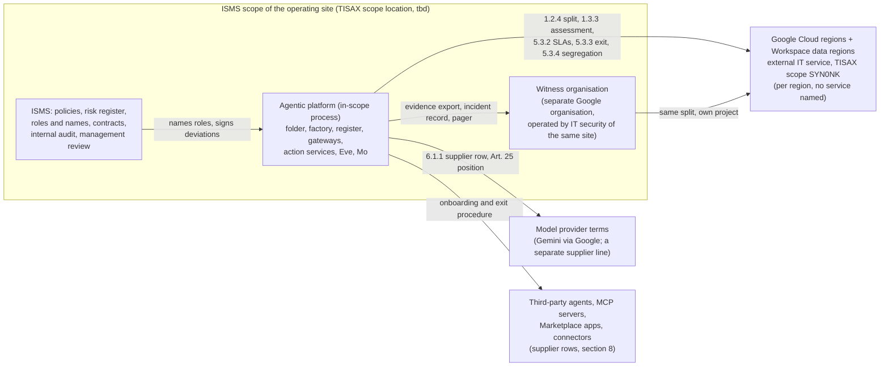
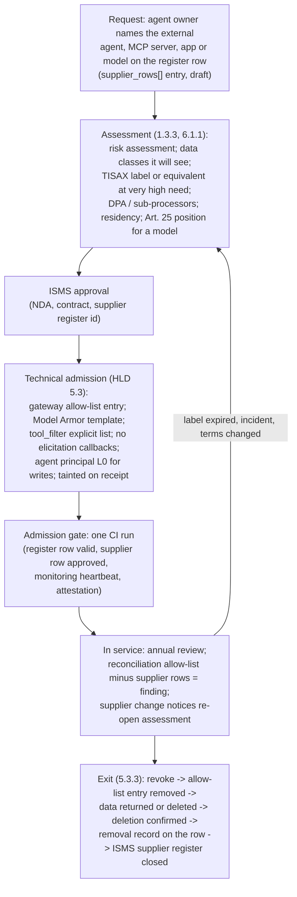

# 11. TISAX

## Status
- Owner: the platform owner
- Last reviewed: 2026-09-13
- Maturity: detailed design of the TISAX frame of [01-hld.md](01-hld.md) §14.2 and §14.3
  (parent sections; also §0.3 RACI, §0.4 tier gate, §5.3 supplier rule, §9 penetration test,
  §13.1 item 12 and P33 the deviation, §17 P20 and P32). Answers brief items I74–I82 and gaps
  TIS-01, TIS-02, TIS-03 of [00-objective-review.md](00-objective-review.md); the base is the
  `tisax` lens report of 2026-09-13. Nothing here is built; every ENX and Google fact was
  re-verified on 2026-09-13 against the URLs in §16.
- What this page is: **the compliance-mapping page for the TISAX rows** that the HLD called
  `0x-compliance-mapping.md` (§14.2, §14.3) — the control-by-control table with mechanism,
  evidence, owner, split and status — and, until a separate page exists, **the supplier file**
  (§4). The EU AI Act crosswalk lives on the EU AI Act page of this set, not here; the two share
  the risk register (§10) and the legal register (§11).
- Decisions this page makes are numbered **P133–P141**, final ids in
  [12-open-decisions.md](12-open-decisions.md).
- Standing constraints, unchanged: no domain-wide delegation; the language model holds no
  credential and cannot approve; humans raise autonomy, machines lower it; no model produces an
  Eve approval; Mo reaches production only through a merged pull request; safety interlocks are
  plain authenticated REST; Wall-E holds Super Admin by the owner's decision (P33) and this page
  designs the deviation record around it, not against it.
- Conventions: `Assumption:` marks inferred facts; *tbd* marks values nobody has decided; ISA
  control numbers are given once as **ISA2027 (= ISA 6.0.3)** because ISA2027 keeps the
  information-security control set and, `Assumption:`, its numbering (§1); control titles are
  paraphrased unless quoted. Every control names its owner as a role, the resource it sits on,
  how it is verified and what happens when it fails. No company names; the organisation is "the
  organisation", its security function "IT security", its information-security management
  system "the ISMS".
- The two diagrams are in §4.1 (scope and shared responsibility) and §8.2 (supplier lifecycle).

---

## 0. What this page decides, in one paragraph

"TISAX compatible" becomes five recorded facts and one honest sentence. The facts: the platform
targets the **Confidential** label at assessment level **AL2**, no availability label, inside
the ISMS scope of the site that operates it (*tbd* which site), mapped against **ISA2027** with
an ISA 6.0.3 cross-reference (§2, P133); the Information Security module applies, the Data
Protection module is not an assessment objective and Prototype Protection does not apply (§3,
P134); Google is an external IT service with a per-control responsibility split and a supplier
file, and every third-party agent, MCP server, Marketplace app and model enters and leaves
through one supplier procedure (§4, §8, P135, P138); the super-admin robot is a **signed
deviation** from 4.2.1 whose compensating controls are preconditions of the grant, row one of
the risk register (§6, §10, P136, P140); separation of duties is a **staffing minimum per stage
that the tier gate enforces**, not a promise (§7, P137). The honest sentence: about half of this
page is documentation the platform writes now, the other half is controls that do not exist on
2026-09-13 and cannot be claimed by writing (§12), and an assessor may still refuse maturity 3
on 4.2.1 for a super-admin robot however good the compensation is.

---

## 1. TISAX on 2026-09-13, verified

| Item | Fact | Source (§16) |
|---|---|---|
| Operator and catalogue | TISAX is governed by the ENX Association on behalf of the VDA; the questionnaire is the VDA ISA | [S1], [S4] |
| Catalogue in force | **VDA ISA 6.0.3**, published 2024-04-25, "basis of TISAX Assessments starting later than 2024-04-01"; assessments ordered before 2024-04-01 could still run on ISA 5 | [S1] |
| Successor | **VDA ISA2027**, published 2026-07-01, "the basis of TISAX Assessments ordered from 2027"; "assessments ordered before 2027-01-01 can still be performed with ISA6"; the last day to order an ISA 6 assessment is 2026-12-31; redline ISA2027 versus 6.0.1 published 2026-08-07 "for your information only" | [S1], [S2] |
| What ISA2027 changes | Supplier management: organisations with high protection needs must document, review and monitor supplier compliance and verify suppliers "through TISAX labels or equivalent assessments"; every "aspects considered" item must be consciously considered with a rationale "explainable during an assessment"; mappings updated to ISO/IEC 27001:2022 and NIST CSF 2.0; Prototype Protection consolidated into two domains; future versions named for the year they take effect, published each summer, mandatory the following 1 January. `Assumption:` the information-security control numbering is unchanged — the lens read "same 46 controls, 44 edited"; the ISMS confirms on the redline when it orders | [S2] |
| Modules | Information Security (chapters 1–7); Prototype Protection; Data Protection (ISA 6.0.3: 9.1.1–9.8.1, written for an Art. 28 GDPR processor). Whether ISA2027 renumbers the Data Protection module is *unverified* | [S3], lens §1 |
| Assessment objectives (labels) | The handbook lists twelve: Info high, Info very high, **Confidential**, **Strictly confidential**, High availability, Very high availability, Proto parts, Proto vehicles, Test vehicles, Proto events, Data, Special data. Confidential / High availability replaced "Info high" and Strictly confidential / Very high availability replaced "Info very high" for assessments ordered from 2024-04-01; older labels stay valid and received the new ones automatically | [S3], [S5] |
| Objective → level | Confidential, High availability, Test vehicles, Data → **AL2**; Strictly confidential, Very high availability, Proto parts/vehicles/events, Special data → **AL3** | [S3] |
| Assessment levels | AL1 self-assessment, existence checked only, "not used in TISAX"; AL2 plausibility check of the self-assessment with evidence review and web-conference interview; AL2.5 full remote verification, methodically compatible with a later AL3 upgrade; AL3 document examination, planned interviews, on-site observation, unplanned interviews | [S3] |
| Pass criterion | Maturity scale 0–5; the target for most controls is **maturity 3** ("established": defined, documented, followed); some questions carry a target of 2 or 4; the ISA result sheet marks the target line per chapter. The handbook itself does not state a single number — it is the ISA's per-question target | [S3], [S6] |
| Validity | "Your assessment result is valid for three years" | [S3] |
| Scope | Standard scope (version 2.0): "all processes, procedures and resources under responsibility of the assessed organization that are relevant to the security of the protection objects", at named locations. A cloud platform is not a scope of its own; it is inside the ISMS of the site that operates it, and whatever is processed outside that scope is an external IT service under 1.2.4, 1.3.3, 5.3.3, 5.3.4 | [S3], [S7] |
| 1.2.4 wording | responsibilities with service providers: identify the services used, determine the security requirements per service, define which organisation implements each, specify the mechanism for shared responsibilities, verify the responsible organisation fulfils them; "a common understanding of the division of responsibilities exists" and is "verifiably documented" | [S8] |
| 1.3.3 wording | "External IT services are not used without explicit assessment and implementation of the information security requirements: A risk assessment of the external IT services is available, Legal, regulatory, and contractual requirements are considered" | [S7] |
| Google's status | "Google LLC is a TISAX participant, Google Cloud regions and Google Workspace's Data regions were assessed against the assessment objectives and issued 'Strictly Confidential' and 'Very High Availability' and 'Information with Very High Protection Needs' labels under the definition of TISAX, for data classified as secret." Scope ID **SYN0NK**, assessment IDs **ATTRRN-1** and **ATTRRN-2**; "The result is exclusively retrievable over the ENX Portal." Europe regions listed include **`europe-west1`, Belgium**. **No individual Google Cloud or Workspace service is named** — the page is per region | [S9] |
| Related ENX documents | TISAX Participant Handbook 2023-12-07; "Fulfillment NIS2 through TISAX" 2025-06-29; TISAX Participation General Terms and Conditions 2023-07-16 | [S1] |

Three consequences the rest of this page rests on: any assessment covering this platform will
be ordered in 2027 or later (nothing is built in 2026, §0.4 of the HLD), so the mapping is
written against ISA2027; the platform is an asset inside a site's ISMS, so half the evidence is
the ISMS's and this page must say which half; Google's label is per region, so per-service
coverage of everything the platform uses is a *tbd* to be closed from the ENX result share, not
from the public page.

---

## 2. The target — label, level, scope, catalogue (P133)

| Element | Decision | Reason | Owner | Verified by | Fails when |
|---|---|---|---|---|---|
| Confidentiality label | **Confidential** (`Assumption:` — HLD P20 recommendation adopted). Strictly confidential only if the ISMS's scheme classes `walle_audit`, the content logs, `platform-identity-logs` or Gemini Enterprise conversation history as **secret**; that flip also reopens the CMEK stance ([09-supply-chain-secrets-recovery.md](09-supply-chain-secrets-recovery.md) P119), the Assured Workloads position ([08-data-logging-retention-sovereignty.md](08-data-logging-retention-sovereignty.md) P110, HLD P12) and raises the level to AL3 | The platform's five data classes map to Confidential for `evidence`, `content` and `control` and to Strictly confidential only for `secret` (credentials, the surrogate-key mapping — [08](08-data-logging-retention-sovereignty.md) §2.1). Credentials are secret under any scheme; that alone does not make the site's assessment objective Strictly confidential, because the objective is set by the protection need of the information handled for partners, not by the presence of a secret store. The ISMS decides; this page carries both outcomes | ISMS (label); platform owner (the data-class mapping that feeds it) | the signed mapping of the five classes to the organisation's scheme ([08](08-data-logging-retention-sovereignty.md) P109) attached to the assessment order | no signed mapping by the assessment order → the order is not placed; the `Assumption:` stays and the page says so |
| Availability label | **none** | Wall-E, Eve and Mo are not critical IT services (HLD §10: the manual Admin console is Wall-E's continuity plan; evidence is the critical asset and has its own RPO). An availability label would put Google's regional SLA under the organisation's own assessment for no partner's benefit | ISMS | the continuity statement ([09](09-supply-chain-secrets-recovery.md) §3.7, RC-7) says "not a critical IT service" | a partner contract demanding High availability for an agent → that agent's scope is re-labelled and the statement rewritten |
| Assessment level | **AL2** working level | Follows from the label ([S3]). AL2.5 (full remote) is accepted if the audit provider proposes it, because it keeps the AL3 upgrade path open at no design cost | ISMS | assessment order | the label rises to Strictly confidential → AL3, on-site, and the witness organisation and the safe custody record become on-site observation items |
| Scope location | ***tbd*** — the ISMS of the site that operates the platform (`Assumption:` the site where the platform owner and IT security sit). Google Cloud, the witness organisation and every third-party service are **external IT services** of that scope, never scope locations | Scope is site-based ([S3]); a cloud platform cannot be its own scope. The witness organisation (HLD §13.2) is operated by IT security of the same organisation but as a **separate Google organisation** — it is an asset of the same site scope, recorded as such, not a second location | ISMS | the scope statement in the assessment order names the site and lists this platform as an in-scope process with Google as external IT service | the platform is operated by a site with no TISAX scope → an assessment is ordered for that site first; nothing on this page changes |
| Catalogue | **ISA2027**, 6.0.3 cross-reference, mandatory column for Confidential (high protection need); "should" items answered anyway because most already are | Assessments for this platform will be ordered in 2027 or later ([S1], [S2]) | ISMS (catalogue); platform owner (this page) | the ISMS's copy of the ISA2027 workbook cites this page per control | the ISMS orders on ISA 6 before 2026-12-31 for other reasons → the numbering is the same (`Assumption:` above) and this page still applies; the ISA2027 supplier and rationale rules are then good practice, not requirements |
| NIS2 | ***tbd*** — applicability is the ISMS's determination; ENX's "Fulfillment NIS2 through TISAX" (2025-06-29) is the crosswalk to use if it applies | Outside the platform's authority; recorded in the legal register (§11) so that it is not forgotten | ISMS, legal | legal register row | — |

**The one thing this page will not do** is claim a label. A label is earned by a site's
assessment; this page makes the platform assessable inside that site at maturity 3 on every
applicable control, and says (§12) which controls do not exist yet.

---

## 3. Module scope — Data Protection and Prototype Protection (P134)

**Information Security module: applies in full** at the "high protection need" column, every
chapter, mapped in §5.

**Data Protection module (9.x): not an assessment objective.** The Data and Special data labels
are Art. 28 GDPR processor objectives ([S3]). The platform administers the organisation's own
tenant on its own employees' accounts; the organisation is the **controller** and the platform
is its internal processing, so 7.1.2 (data protection identified and implemented inside the
ISMS) and the organisation's own GDPR programme are the frame, not 9.x. The rule for the future:

| Case | Data Protection module | Who decides | Enforced where |
|---|---|---|---|
| Wall-E, Eve, Mo, any agent on employee or organisational data as controller | not an objective; 9.x used as the DPO's checklist (below) | DPO | register row `tisax_class` + `data_classes` |
| A hosted agent that processes **a customer's or an OEM's data on that customer's behalf** (processor) | **becomes an assessment objective for that agent's scope**; the Data label (Special data if Art. 9 categories) is ordered for the site with that agent's processing in scope; the supplier rule of §8 applies to every model and service in its path | DPO + ISMS, at the register-row review | the register's admission gate (HLD §5.3): a row whose `purpose` names third-party-controller data cannot reach `status: prod` without a `tisax_dp_scope: true` flag and a dated DPO entry — **an added field**, recorded as P134 and to be adopted by [05-registry-and-autonomy-contract.md](05-registry-and-autonomy-contract.md) |

The 9.x checklist the DPO works from now, as inputs the platform owes (ISA 6.0.3 numbering; the
ISA2027 numbering of the module is *unverified*):

| 9.x | Platform input | Where it comes from | Status |
|---|---|---|---|
| 9.3.1 records of processing | one entry per agent: reads at Stage 0, writes at Stage 1+, band B, Mo's metrics, the content logs, `platform-identity-logs` | [08](08-data-logging-retention-sovereignty.md) §5.1 inputs; the register export | not started |
| 9.4.1 DPIA | the DPIA started now (HLD §14.2 "longest lead item"); the platform supplies the residency table, the store inventory, the ladder, the Art. 26 worker-consultation record | DPO; platform owner supplies | not started |
| 9.5.x transfers | the two residency exceptions of HLD §8.2, the model's processing location, Google sub-processors from the supplier file (§4) | this page §4; [08](08-data-logging-retention-sovereignty.md) §7 | inputs exist |
| 9.6.1 data-subject requests | answerable across every store of [08](08-data-logging-retention-sovereignty.md) §2.2 — the list of stores and the query per store is the deliverable | [08](08-data-logging-retention-sovereignty.md) | list exists; procedure not written |
| 9.6.2 breach process | [07-monitoring-detection-incident-response.md](07-monitoring-detection-incident-response.md) §12 (GDPR 72-hour path, P101 there) | 07 | designed |
| 9.7.2 training | operator training outline per role (§7.4) | this page | to write |
| 9.8.1 deletion capability | the `revoke` operation and the 5.3.3 return-and-removal record (§8) | HLD §2.2, §5.3 | to build |

**Prototype Protection: not applicable.** No agent touches prototype parts, vehicles, test
vehicles or events; the register has no data class for it. The admission gate refuses a
`purpose` mentioning prototype data unless the ISMS opens that module for the site (a text
check on the row is detection-grade; the real control is the DPO/ISMS review of every new row).
Recorded as a negative determination dated 2026-09-13 in P134.

---

## 4. Shared responsibility with Google, and the supplier file (P135)

### 4.1 The shape

Google is one external IT service with two contractual halves (Google Cloud; Google Workspace),
one TISAX result (SYN0NK) and, for this platform, one open question per service. The witness
organisation is not a supplier: it is the organisation's own second Google organisation,
covered by the same Google result and the same split.

### 4.2 The responsibility split, per control group

"G" = Google holds it and evidences it through its TISAX result and its compliance reports;
"P" = the platform configures, operates and evidences it; "I" = the ISMS owns the policy, the
contract or the people. Most rows are shared; the column says who the assessor asks first.

| ISA2027 (= 6.0.3) | Google (G) | Platform (P) | ISMS (I) | Verified by | Fails when |
|---|---|---|---|---|---|
| 1.1.1 policies | — | implementing statements per policy id (§5.1) | the policy set | policy ids cited on this page resolve in the ISMS's register | a cited policy does not exist → the row is "P only" and the ISMS writes it |
| 1.2.2 roles, separation of duties | — | the RACI and the tier gate (§7) | the names | gate records | one person in two separated roles → the tier does not open |
| **1.2.4 responsibilities with service providers** | Google's shared-responsibility statements and its TISAX result | **this table**, kept per control, dated | the contract that makes the split binding | the ISMS's supplier record cites this page's revision | Google changes a service's model (e.g. a Preview product goes GA with new terms) → the row is re-dated within 30 days of the change notice |
| 1.3.1 / 1.3.2 assets | — | register and store inventory, classified | the scheme | daily reconciliation report; signed mapping | shadow agent → platform finding (05 §8.1) |
| 1.3.3 approved external IT services | Google's result share on the ENX portal | the risk assessment of Google Cloud, Workspace, Gemini Enterprise and the model as external IT services (§4.3) | approval of each service | a dated approval per service in the supplier file | a service used without a supplier row → the reconciliation job's allow-list ∖ supplier-rows finding ([03](03-gemini-enterprise-environment.md) §12) |
| 1.3.4 approved software | Google-managed runtimes (Cloud Run base images, Agent Runtime) | the hash-pinned lockfile and the software approval list ([09](09-supply-chain-secrets-recovery.md) §2) | the software policy | CI refuses an unpinned dependency | — |
| 2.1.x personnel | Google's personnel controls (its result) | role training (§7.4) | HR, NDAs, awareness | training records | — |
| 3.1.x physical | **G** for every region and data centre | the safe and the hardware-key custody record only ([09](09-supply-chain-secrets-recovery.md) SK-8) | site physical security | custody record in the witness bucket | a missing custody record blocks the super-admin grant |
| 4.1.x / 4.2.1 identity, access | Google's IAM, PAM, Agent Identity as services | every binding, entitlement, deny policy, PAB and the roster ([04-identity-and-privileged-access.md](04-identity-and-privileged-access.md)) | the access policy; naming the reviewers | drift job; quarterly roster review | drift → severity per 04 |
| 5.1.x cryptography | encryption at rest and in transit by default; Cloud KMS and HSM as services | key inventory, Autokey, HSM approval keys, rotation ([09](09-supply-chain-secrets-recovery.md) §2.4, HLD §8.3) | the cryptography standard (*tbd*) | `gcloud kms keys describe` output per key; the cryptography table | a key outside the table → drift finding |
| 5.2.1 / 5.2.2 / 5.3.1 change, environments, development | Google's own change management (its result) | factory, CI, Binary Authorization, nonprod folder, sandbox tenant ([09](09-supply-chain-secrets-recovery.md), [02-landing-zone-and-tiers.md](02-landing-zone-and-tiers.md)) | the change policy | pull-request and attestation records | pre-production absent → not maturity 3 (§12) |
| 5.2.3 / 5.2.5 malware, vulnerabilities | patching of managed services and base images | Artifact Analysis gate, monthly CVE triage, patch cadence ([09](09-supply-chain-secrets-recovery.md) §2) | the patch policy | scan reports | CRITICAL unresolved → deploy refused |
| 5.2.4 logging | Cloud Audit Logs and Workspace audit as services; `_Required` retention | sinks, locked buckets, Data Access logs, retention, SIEM ([08](08-data-logging-retention-sovereignty.md), [07](07-monitoring-detection-incident-response.md)) | the logging policy and the retention ceiling (DPO) | absence alarms; retention settings | retention undecided → `Assumption:` 400 stays and is written as such |
| 5.2.6 / 1.5.x technical checks, compliance | Google's own audits | denial suite, drift, drills, injection suite, penetration test (§9) | internal audit, management review (§9) | reports in the evidence bucket | no penetration test before the grant → gate closed |
| 5.2.7 network | the underlying network, DDoS, PSC as services | ingress policy, gateway allow-lists, VPC-SC ([06-gateways-model-armor-perimeter.md](06-gateways-model-armor-perimeter.md)) | the network policy | perimeter config export | P3 undecided → the super-admin grant waits |
| 5.2.8 / 5.2.9 continuity, backup | regional availability per SLA; Firestore PITR and scheduled backups as services | the recovery classes and drills ([09](09-supply-chain-secrets-recovery.md) §3) | BCM, the BIA | drill records | RC-7 stale → the evidence-register row is blocked |
| 5.3.2 requirements for network services | Google's SLAs | referencing them; declaring no promise above them | contract | SLA references in §4.3 | — |
| **5.3.3 return and removal** | Google's deletion commitments in its data-processing terms | the `revoke` operation with evidence export confirmed before project deletion (HLD §2.2, §5.3); the contract-end procedure (§8.4) | contract end | the removal record per row (05 §8.1) | a project deleted before its export is confirmed → severity 1, R-A restore from the witness copy |
| **5.3.4 shared external IT services (segregation)** | multi-tenant isolation of Agent Runtime's Google-managed tenant project, Gemini Enterprise, BigQuery, Model Armor | the **segregation note** (§4.4) stating what the organisation can and cannot see of its own tenant boundary | acceptance of the residual | the note, dated, in the supplier file | Google publishes a tenancy change → the note is re-dated |
| 6.1.1 / 6.1.2 suppliers, NDAs | Google's sub-processor list | the supplier file and the onboarding rule (§8) | NDAs, contracts | supplier rows; ENX share filed | a supplier without a TISAX label or equivalent at very high protection need → not admitted (ISA2027) |
| 7.1.1 legal and contractual | Google's terms | the legal register (§11) | the register's owner | — | — |
| 7.1.2 data protection | Google's DPA and sub-processors | records of processing, DPIA inputs, DSR path, deletion (§3) | DPO | DPO artefacts | not started → written as not started |

### 4.3 The supplier file — Google

One record, held by the platform owner with the ISMS, revised at every contract or product
change. Fields with today's value:

| Field | Value on 2026-09-13 | Verified? |
|---|---|---|
| Supplier | Google LLC and its contracting affiliate for the organisation (*tbd* which entity signs the organisation's agreements) | entity *tbd* |
| TISAX | participant; scope **SYN0NK**; assessments **ATTRRN-1**, **ATTRRN-2**; labels Strictly Confidential, Very High Availability, Information with Very High Protection Needs "for data classified as secret"; Google Cloud regions incl. `europe-west1` and Google Workspace data regions | [S9], verified |
| Result share | **requested on the ENX portal and filed** in the evidence bucket (`evidence/suppliers/google/`) — a control that does not exist until the ISMS's ENX participant account requests it; the public page is not evidence | to do (I) |
| Per-service coverage | The result is per region and names no service. Coverage of each item below is ***tbd*** and is closed from the ENX result share or Google's Compliance Reports Manager, never assumed: Agent Runtime and its Google-managed tenant project; Gemini Enterprise (its compliance page lists ISO 27001/17/18/701, SOC 1/2/3 and BSI C5, not TISAX — [03](03-gemini-enterprise-environment.md) §18); Model Armor `global` floor settings; Agent Gateway; Agent Registry; BigQuery `EU` multi-region; Cloud Logging organisation-level `_Required` buckets (region not selectable); Google SecOps in the EU; the Gemini models themselves | *tbd* per item (P32 with Google) |
| Data-processing terms | the Google Cloud data-processing terms and the Google Workspace data-processing terms as incorporated in the organisation's agreements (exact document names and versions *tbd* at contract review — not verified this session); sub-processor list and change-notification subscription filed | *tbd* (I) |
| Model terms | a separate supplier line: no-training and prompt-retention terms confirmed **per model pin** at build; the Art. 25 written position with the provider (HLD §14.1, P32) | *tbd* (P32) |
| SLAs | Cloud Run, Agent Runtime, Firestore, BigQuery, Cloud Storage, Cloud KMS, Cloud Logging, Google Workspace — referenced, not restated; the platform promises nothing above them ([09](09-supply-chain-secrets-recovery.md) §3.7) | references *tbd* (URLs filed at contract review) |
| Google-personnel access | Access Transparency on; Access Approval on the folders and projects of [08](08-data-logging-retention-sovereignty.md) P111 and on the witness | designed |
| Exit and deletion | Google's deletion-on-termination commitments per its terms; the platform side is §8.4 (export, verify, delete, record) | terms *tbd*; platform side designed |
| Risk assessment (1.3.3) | this page §5 and §10 rows R-05, R-06; residency exceptions of HLD §8.2 accepted in writing | to sign (I) |
| Segregation note (5.3.4) | §4.4 | to write (P) |
| Review | annually and at every product-stage change (Preview → GA) of a service the platform depends on | — |

### 4.4 The segregation note (5.3.4), what it will say

Written once, dated, in the supplier file; the content is fixed by facts already on this set:
Agent Runtime engines run in a **Google-managed tenant project** the organisation cannot
inspect (the platform sees only its own project's API surface and audit entries); Gemini
Enterprise is a multi-tenant service whose isolation the organisation evidences only through
Google's reports; BigQuery `EU` and Model Armor `global` floor settings are shared
infrastructure with per-project logical isolation. What the organisation **can** see: its own
Cloud Audit Logs, Access Transparency entries for Google-personnel access, Access Approval
requests, its own IAM and organisation-policy state. What it **cannot** see: the tenant
project's internals, other tenants, Google's internal segregation controls — those are Google's
rows ("G" in §4.2) evidenced by SYN0NK and the ISO/SOC reports. The residual (a tenancy failure
at Google would be invisible to the platform until Google discloses it) is risk-register row
R-06 and is accepted by the ISMS or it is not; there is no platform control that changes it.

---

## 5. Control-by-control mapping

One table per ISA chapter. Columns: the control; what the platform does; the artefact the
assessor is handed; the owner (role); the responsibility split of §4.2; the status word from
§12's vocabulary — **doc** (documentation the platform can finish now), **built-by-design**
(the mechanism is in the sets and the pages of this set; evidence exists once built), **missing
control** (no mechanism exists on 2026-09-13; a document cannot supply it), **ISMS**
(organisational, outside the platform's authority).

### 5.1 Chapter 1 — policies and organisation

| Control | Platform mechanism | Evidence artefact | Owner | Split | Status |
|---|---|---|---|---|---|
| 1.1.1 policies | This page cites the organisation's policies **by id** (information security, access, cryptography, logging, change, supplier, incident, classification — ids *tbd*) and states per policy the implementing section of this set | the id table below §5.7 | ISMS (policies); platform owner (statements) | I / P | doc |
| 1.2.1 ISMS | The platform is an asset of the site's ISMS; the ISMS's scope statement lists it | scope statement | ISMS | I | ISMS |
| **1.2.2 responsibilities, separation of duties** (explicit at high protection need) | §7: the RACI, the incompatibility matrix, the staffing minimum per stage, **enforced by the tier gate** (HLD §0.4) and by CI checks that separated roles resolve to different principals | RACI page; group memberships export; gate records; the CI check's output | ISMS (names); platform owner (the gate) | I / P | **missing control** until the second, third and fourth persons are named — the item most likely to stop an assessment |
| 1.2.3 projects classified for security | Every register row carries `tisax_class`, `data_classes`, `tier`, `risk_class`; the row is the project's classification | register export | platform owner | P | built-by-design |
| **1.2.4 responsibilities with service providers** | §4.2 kept per control and dated | §4.2; the supplier file | platform owner + ISMS | P / I | doc |
| 1.3.1 asset inventory | The register as inventory of record with owner and review record; the store inventory of [08](08-data-logging-retention-sovereignty.md) §2.2 with asset, data, custodian and reviewer roles per project (§8 there); Agent Registry and SCC AI Protection as the independent observations reconciled daily (HLD §5.2) | `register/export/tisax-asset-register.md`; `platform_registry.tisax_assets`; the day's zero-difference reconciliation report ([05](05-registry-and-autonomy-contract.md) §8.1) | platform owner | P | built-by-design |
| 1.3.2 classification | Five platform data classes with handling rules, mapped to the organisation's scheme by a signed mapping ([08](08-data-logging-retention-sovereignty.md) P109) | the signed mapping; `data_class` labels on every store | platform owner; ISMS signs | P / I | doc (mapping) + built-by-design (labels) |
| 1.3.3 approved external IT services | The supplier file (§4.3) with a dated risk assessment and approval per service; the reconciliation finding for any service without a row | supplier file; reconciliation reports | platform owner; ISMS approves | P / I | doc + **missing control** (the ENX result share and the per-service coverage answers) |
| 1.3.4 approved software | Hash-pinned lockfile, exact pins, monthly review; software approval list ([09](09-supply-chain-secrets-recovery.md) §2) | lockfile in git; the list | agent owner | P | built-by-design |
| 1.4.1 risk management | §10: the risk register with likelihood, impact, owner, treatment, acceptance; fed by the threat model, adversarial reviews, challenges, weaknesses and failure-mode pages of the sets; refreshed at every stage decision | §10; the signed acceptances as decision files | security reviewer | P / I | doc |
| 1.5.1 compliance checks; 1.5.2 independent review | §9: denial suite, drift, drills, injection suite (self-run) plus the internal-audit slot and management review (independent) | audit report; review minutes | IT security; ISMS | P / I | doc (scheduling) |
| 1.6.1 event reporting; 1.6.2 incident management; 1.6.3 crisis | [07](07-monitoring-detection-incident-response.md) §12 and §13: channel, roles, severities, the GDPR and Art. 73 paths, the crisis scenario (abused super-admin credential) with a dated tabletop | incident records; tabletop record `evidence/tabletops/<date>/` | incident commander (IT security) | P / I | built-by-design; **missing control**: a staffed human recipient of Eve's reports with an acknowledgement SLA (HLD §7.6 targets *tbd*) |

### 5.2 Chapter 2 — human resources

| Control | Platform mechanism | Evidence artefact | Owner | Split | Status |
|---|---|---|---|---|---|
| 2.1.1 qualification, 2.1.2 contractual, 2.1.4 remote work | ISMS's HR controls; the platform adds nothing beyond its access rules (every operator from a corporate device through Context-Aware Access, [04](04-identity-and-privileged-access.md) §6) | HR records; CAA level export | ISMS | I | ISMS |
| 2.1.3 awareness and training | §7.4: a training outline per role (operator, approver, blind grader, key custodian, incident commander, Eve owner), completion recorded, refreshed at each stage transition; folded with EU AI Act Art. 4 literacy | completion record in the evidence bucket | ISMS (delivery); platform owner (content) | I / P | doc + record |

### 5.3 Chapter 3 — physical

| Control | Platform mechanism | Evidence artefact | Owner | Split | Status |
|---|---|---|---|---|---|
| 3.1.1–3.1.4 | Google's, evidenced by SYN0NK for the regions used; the platform owns one physical asset class: the safe holding the robots' hardware keys, two keys per robot, named custodians, witnessed custody ([09](09-supply-chain-secrets-recovery.md) SK-8; [04](04-identity-and-privileged-access.md) §8.3) | ENX result share; custody record in the witness bucket | G; security reviewer for the safe | G / P | built-by-design |

### 5.4 Chapter 4 — identity and access

| Control | Platform mechanism | Evidence artefact | Owner | Split | Status |
|---|---|---|---|---|---|
| 4.1.1 identity management | Agent Identity for every reasoning layer; keyless everywhere; the three principal populations; groups made by the factory and reconciled daily ([04](04-identity-and-privileged-access.md) §2, promoting [../wall-e/12-agent-identity.md](../wall-e/12-agent-identity.md) §1, §6) | IAM policy exports per project; drift-job output | platform owner | P | built-by-design |
| 4.1.2 secure authentication of privileged users | Hardware-key-only 2SV on the robot OU and on human super-admin accounts; no interactive login for robots (severity 1); short session; Context-Aware Access on the Admin console ([04](04-identity-and-privileged-access.md) §8) | 2SV policy export; activity-rule config; SIEM cases | platform owner | P | built-by-design |
| 4.1.3 access to information and services (approval, revocation) | PAM entitlements with justification and approver; the register's `audience_groups`; `revoke` | PAM grant logs | platform owner | P | built-by-design |
| **4.2.1 access rights — need-to-know, least privilege, approval, review** | Resource-level grants only, every crossing enumerated ([../project-topology.md](../project-topology.md) §3, §9); deny policies and PAB; PAM as the access-review evidence; **quarterly roster review** of every super admin, every Workspace admin-role holder, `roles/privilegedaccessmanager.admin` and `roles/resourcemanager.organizationAdmin` against the signed roster ([04](04-identity-and-privileged-access.md) §8.1 rule 4; HLD §5.3); and **the super-admin robot as a signed deviation (§6)** | IAM exports; PAM logs; the quarterly review record; the deviation record | platform owner; security reviewer (review) | P | built-by-design, **with a signed deviation** an assessor may still refuse |

### 5.5 Chapter 5 — IT security

| Control | Platform mechanism | Evidence artefact | Owner | Split | Status |
|---|---|---|---|---|---|
| 5.1.1 cryptographic procedures; 5.1.2 information in transit | One cryptography table (key, algorithm, location, rotation, owner, audit log): the `eve-approval` HSM key `EC_SIGN_P256_SHA256`, Autokey at the folder, the Agent Runtime CMEK key, regional secrets, the HMAC confirmation key, robot passwords in the corporate vault ([09](09-supply-chain-secrets-recovery.md) §2.4; HLD §8.3); TLS everywhere by Google; the organisation's cryptography standard by reference (*tbd*) | the table; `gcloud kms keys describe` per key; rotation records | platform owner | P / G / I | doc (consolidation) + built-by-design |
| 5.2.1 change management | Autonomy as versioned data; promotion by pull request with validator recomputation; CI-only deploys; attestation-based promotion; emergency-change procedure with a post-hoc second reviewer within one business day (HLD §9) | PRs with CODEOWNERS approvals; decision files; `config_versions` rows | platform owner | P | built-by-design; the first decision files are a **doc** task |
| 5.2.2 separation of environments | `nonprod` folder per tier; sandbox Workspace tenant for Tier P before Stage 1 (decision 29 closed, HLD §9; [02](02-landing-zone-and-tiers.md)) | folder tree export; the sandbox tenant's existence | platform owner | P | **missing control** until the nonprod folder and sandbox tenant exist |
| 5.2.3 malware protection | Google-managed runtimes; Artifact Analysis on every image; remote repositories so no build pulls from the public internet | scan reports | platform owner | G / P | built-by-design |
| 5.2.4 event logging | Insert-only audit tables; organisation-level sinks into locked buckets; Data Access logs on `iap`, IAM Credentials, Secret Manager, KMS; SIEM feed; retention per store ([08](08-data-logging-retention-sovereignty.md) §3–§5; [07](07-monitoring-detection-incident-response.md) §2) | bucket lock state; sink configs; SIEM ingestion evidence; the retention schedule | platform owner | P / G | built-by-design; retention **ceiling** is a DPO decision (P13) — 400 days stays `Assumption:` |
| 5.2.5 vulnerability management | Scan gate "no CRITICAL, HIGH triaged within 7 days" (`Assumption:` thresholds); monthly CVE triage; patch cadence per tier (HLD §9) | triage log | platform owner | P | **missing control** until the gate runs |
| 5.2.6 technical checks (audits) | Denial suite per trust boundary; identity drift job; monthly kill-switch drills with recorded times; injection regression suite; seeded-fault runs; **penetration test** (§9) | reports in the evidence bucket | IT security | P | built-by-design; penetration test **missing control** |
| 5.2.7 network security | Ingress policy, gateway allow-lists, VPC-SC backstop per P3 ([06](06-gateways-model-armor-perimeter.md)) | perimeter config export; gateway dry-run evidence | platform owner | P / G | decision now (P3) |
| 5.2.8 IT service continuity; 5.2.9 backup and restore | Recovery classes R-A..R-W with RPO/RTO; PITR, scheduled backups, delete protection by the factory; restore boots at `halt_all`; drills; the continuity statement and BIA input ([09](09-supply-chain-secrets-recovery.md) §3) | drill records; RC-1..RC-7 outputs; the statement | platform owner; ISMS (BCM) | P / G / I | built-by-design; **one recorded restore before Stage 1** is a missing control until run |
| 5.3.1 secure development | Validator owned outside the repository; CI ownership by platform owner and IT security; branch protection; no agent principal writes to any repository (HLD §9) | branch-protection export; CODEOWNERS | platform owner | P | built-by-design; git host and admin-bypass audit *tbd* (P22) |
| 5.3.2 requirements for network services | SLA references in the supplier file; no promise above them | supplier file | platform owner | G / P | doc |
| **5.3.3 return and removal from external IT services** | §8.4: `revoke` (export confirmed → deregister → delete) per agent; the contract-end procedure for the five core projects, the tenant app and the witness | removal record per register row; the procedure | platform owner | P / G | **missing control** (the procedure and its first execution) |
| **5.3.4 shared external IT services** | the segregation note (§4.4) | supplier file | platform owner | G / P | doc |

### 5.6 Chapter 6 — supplier relationships

| Control | Platform mechanism | Evidence artefact | Owner | Split | Status |
|---|---|---|---|---|---|
| **6.1.1 partner information security** | §8: one supplier procedure for Google, the model, and every third-party agent, MCP server, Marketplace app and connector; a `supplier_rows[]` entry per external dependency on the register row; at very high protection need a TISAX label or equivalent (ISA2027); annual review | supplier file; register rows; the ENX share | platform owner + ISMS | P / I | doc (file) + **missing control** (the onboarding and exit procedure until first run) |
| 6.1.2 non-disclosure | ISMS's NDA process; the platform records the NDA reference on the supplier row | supplier row | ISMS | I | ISMS |

### 5.7 Chapter 7 — compliance

| Control | Platform mechanism | Evidence artefact | Owner | Split | Status |
|---|---|---|---|---|---|
| 7.1.1 legal, regulatory, contractual | §11: the legal register | §11 | ISMS, legal | I / P | doc |
| **7.1.2 data protection** | §3's checklist; DPIA started now; records of processing per agent; transfers; DSR path; breach process; deletion; the works-council track and employee notice before Stage 1 (HLD §14.1, §14.2) | DPO artefacts | DPO | P / I | **missing control** (not started) |

**Policy-id table (1.1.1)**, to be filled by the ISMS — the platform's implementing statement per
policy is the section named:

| Organisation policy (id *tbd*) | Implemented by |
|---|---|
| Information security policy | HLD §1 charter; this page |
| Access control policy | [04](04-identity-and-privileged-access.md); §5.4 |
| Cryptography standard | [09](09-supply-chain-secrets-recovery.md) §2.4; §5.5 |
| Logging and monitoring policy | [07](07-monitoring-detection-incident-response.md); [08](08-data-logging-retention-sovereignty.md) |
| Change management policy | HLD §9, §12; [05](05-registry-and-autonomy-contract.md) |
| Supplier security policy | §4, §8 |
| Incident management policy | [07](07-monitoring-detection-incident-response.md) §12–§13 |
| Classification scheme | [08](08-data-logging-retention-sovereignty.md) §2; §2 above |
| Business continuity policy | [09](09-supply-chain-secrets-recovery.md) §3 |
| Data protection policy | §3; the DPO's artefacts |

---

## 6. The super-admin deviation record (P136)

The HLD decided the fact (P33) and listed thirteen compensations (§13.1). This section fixes
the **record** an assessor reads, the **precondition rule** that turns compensations into a gate,
and how the record is verified and fails. It does not re-argue the grant.

### 6.1 What the deviation is, in ISA terms

| ISA control | What it asks | Where the platform deviates | What carries the control instead |
|---|---|---|---|
| 4.2.1 least privilege | rights limited to what the task needs, approved, reviewed, revoked | A machine account holds Super Admin, which cannot be scoped to an OU or a privilege subset; the Workspace-side refusal that bounded the old custom role is gone (HLD "What this reverses") | the typed catalogue (band A), the Discovery-validated permanently-L3 lane (band B), the console handoff (band C); the two lists in code with CI ownership outside the agent repository; the OAuth scope split as the only Google-enforced ceiling; the ladder; Eve; the quarterly roster review; K6 |
| 4.1.2 privileged authentication | strong authentication for privileged users | met, not deviated: hardware-key-only 2SV, no interactive login, short session, CAA | — |
| 5.2.4 privileged-activity logging | administrator and privileged-user activity logged and protected | met, not deviated: every robot action on its own audit row plus Google's admin audit stream copied outside the robot's reach and the tenant's super admins' reach (witness) | — |
| Google's own guidance (not an ISA control; the assessor will cite it) | super admins few, human, hardware-keyed, not for daily use | a robot uses the role daily by design | "daily use" is bounded to bands A and B, every action attributable to a human prompt or a catalogued trigger, none autonomous at super-admin class |

### 6.2 The record — `decisions/2026-09-13-wall-e-holds-super-admin.md`

One file (P33 names it), with these sections in this order; the assessor is handed the file and
the evidence it points at, nothing else:

| Section | Content | Evidence pointer |
|---|---|---|
| Decision | "Wall-E holds Super Admin", dated 2026-09-13, decided by the platform owner, superseding decision 26 for Wall-E; decision 4 re-ratified with the two lists (P29) | the two lists as committed in the action-service repository, with the CI check's hash |
| Deviation statement | from 4.2.1 as §6.1; the honest loss table of the HLD reproduced | HLD "What this reverses" |
| Residual risk | leaked token or interactive login = tenant compromise with a path into the GCP organisation including `EVE_PROJECT`; perimeter = custody, scope split, detection latency; severity 1; response includes Google support escalation | risk register row R-01 (§10) |
| Compensating controls | the thirteen items of HLD §13.1 as a checklist, each with its enforcement grade, its verification and its status **on the day of signing** | §6.3 |
| Precondition rule | "The role is granted only when every item marked *precondition* is green; the grant day is the day 'the four owner groups are one person' expires" (HLD §0.4) | the gate record |
| Review | quarterly with the roster review; re-signed at every stage transition of Wall-E and whenever a compensation's grade changes; expires with the assessment result (three years) or earlier on any severity-1 incident involving the credential | review log |
| Signatures | platform owner (decides); **security reviewer (signs the deviation — a person not the platform owner)**; ISMS (enters it in the site's risk register) | the file's signature block; the ISMS register id |

### 6.3 Compensations as preconditions — the checklist the gate reads

Every row is an item of HLD §13.1, restated as a gate condition with its verification. "Green"
is a machine-readable state where one exists; where not, it is a dated record in the evidence
bucket. The super-admin grant runbook step refuses to proceed while any row is not green.

| # | Precondition (HLD §13.1 item) | Green means | Verified by | Owner |
|---|---|---|---|---|
| 1 | Three bands in code (item 1) | `walle-actions` exposes `/v1/execute` only; `walle-actions-super` exposes `/v1/execute-generic` and `/v1/handoff`; CI asserts neither `SUPER` nor `WRITE-generic` appears in any `playbook.uses` | CI job output attached | Wall-E owner |
| 2 | The two lists signed (item 2, P29) | the hard-denied and band-B-only lists committed, hash recorded in the deviation file, denial suite green on "write targeting the robot itself" and "any `makeAdmin`" | denial-suite report | Wall-E owner; security reviewer |
| 3 | Two credentials, two services (item 3) | two OAuth clients, one reader each, `cloud-platform` in neither, checked in CI against the consent screen | CI check; Secret Manager IAM export | Wall-E owner |
| 4 | Band-B requester rule (item 4) | live fail-closed `isAdmin` check for `SUPER`, approver ≠ requester, canonical request hash bound on the IAP surface | unit tests + one dry-run band-B request in the sandbox tenant | Wall-E owner |
| 5 | Detection as the primary control (item 5) | Eve's reconciliation live with minute latency; daily roster check from Eve's credential; evidence heartbeat paging; SIEM severity-1 set deployed and drilled | a seeded-fault run caught within target; SIEM rule export | Eve owner; IT security |
| 6 | Account hygiene (item 6) | 2SV "Only security key" on the robot OU; self-recovery Off at the top OU with the child-OU drift check green; no recovery channels; two human super admins on the roster; robot never the recovery one | drift-job report; roster diff | platform owner |
| 7 | Kill switches K0–K6 drilled (item 7) | K6 (`users.makeAdmin false` by a human) rehearsed in the sandbox tenant; K5/K6 rota of two humans recorded in the witness | drill record younger than 30 days | platform owner; second human |
| 8 | Perimeter (item 8) | P3 spike 1 passed; ingress value drift-checked; Access Approval on `WALLE_PROJECT`; PAM on the deploy grant with a second reviewer | ingress export; PAM entitlement export | platform owner |
| 9 | Permanent ceiling (item 9) | `SUPER` rows L3 two-person, other triggers L0, in code; CI assertion green | CI job output | Wall-E owner |
| 10 | Lost role scoping replaced (item 10) | the denial suite's inverted exit checklist ("`$ROBOT` is a super admin, on the floor list, and every super-admin-class request is denied in the catalogue lane") green | denial-suite report | Wall-E owner |
| 11 | Second human outside the Wall-E line (item 11) | named; owner of `eve-owners@`; holds `sa-2-admin@`; not in any Wall-E group | group-membership export; §7's CI separation check | ISMS |
| 12 | The signed record (item 12) | this file signed by all three signatories; R-01 accepted | the file | security reviewer |
| 13 | EU AI Act position (item 13, P28) | the intended-purpose statement signed with legal | the [10-eu-ai-act.md](10-eu-ai-act.md) `#wall-e` entry (the page the HLD called `ai-act.md`) | legal |
| + | Penetration test done (HLD §0.4, §9) | report filed; no open critical or high finding | the report | IT security |
| + | Tabletop of the crisis scenario run ([07](07-monitoring-detection-incident-response.md) §13) | dated record | `evidence/tabletops/<date>/` | incident commander |
| + | Hardware-key custody witnessed (SK-8) | custody record in the witness bucket | the record | security reviewer |

**How it fails.** Any row turning red after the grant is a severity-2 finding with a 30-day
window to restore it; two rows red at once, or row 5, 6 or 11 red at all, is severity 1 and the
on-duty human super admin pulls **K6** (removes Super Admin from the robot) until the row is
green again — the deviation's own text says the role exists only while its compensations do.
That rule is what makes the record a control rather than a confession.

---

## 7. Separation of duties and the staffing minimum per stage (P137)

### 7.1 The roles

The platform RACI is HLD §0.3 and is not restated; this section adds what 1.2.2 asks and the
HLD left open: the **incompatibility matrix** (which pairs of roles one person may never hold at
the same stage) and the **minimum number of distinct humans** per stage, so that the gate can
count. Roles, not names; the ISMS supplies names and records them against the role in the
site's ISMS role register.

| Role (HLD §0.3) | Short id | Must not also be |
|---|---|---|
| Platform owner | PO | security reviewer; Eve owner (at P); second human; incident commander at P |
| Agent owner (per agent; Wall-E owner today) | AO | approver of its own requests; blind grader of its own playbooks; deployer's second reviewer for its own agent |
| Operator / approver | OP | requester of what it approves (always); at P-SA the band-B approver must be a human super admin who is not the requester |
| Security reviewer (decision 37) | SR | platform owner; Mo's CI operator; validator custodian is in SR's project but may be SR |
| Deployer (CI operator) / second reviewer | DE | owner of the agent being deployed |
| Eve owner | EO | in the Wall-E administration line; Mo's blind grader for Wall-E |
| Mo owner | MO | Eve's second reviewer |
| Blind grader | BG | owner of the playbooks graded |
| Detection desk | DD | — (bought at P) |
| Incident commander | IC | platform owner at P |
| Human super admin (two) | SA1, SA2 | SA2 is outside the Wall-E line; neither is the robot's key custodian alone (two custodians, one each) |
| DPO contact | DPO | — |
| Validator custodian | VC | Mo's CI operator |

### 7.2 The minimum per stage

Stages are Wall-E's ladder stages as the HLD uses them (Stage 0 read-only, Stage 1 first
writes, the super-admin grant as its own gate, Stage 3 autonomous band-A work at L4) crossed
with the tier the stage requires. The count is the smallest number of distinct humans that
satisfies §7.1; the assignment shown is one legal assignment, not the only one.

| Stage / gate | Tier required | Distinct humans (minimum) | One legal assignment | Bought | What the gate checks |
|---|---|---|---|---|---|
| Stage 0 — read-only, Tier R | R | **1** (+ ISMS consulted) | PO = AO = OP = DE = VC; SR = PO with self-review **recorded as such** (HLD §0.3) | SCC Premium; Gemini Enterprise licences | register row; PAM "activate without approvals, justification mandatory" recorded as the one-person mode ([04](04-identity-and-privileged-access.md) §5.2) |
| Stage 1 — first write, Tier W | W | **3** | PO = AO = DE(primary); OP2 = second operator = BG (not the playbook owner); SR = IT security = DE(second reviewer) = VC | Binary Authorization pipeline (no licence) | CI check: `walle-operators@` contains a member ≠ AO; `platform-security@` contains SR ≠ PO; the second-reviewer set on the deploy entitlement excludes AO; a restore drill record; the validator custodian's project is SR's |
| The super-admin grant — Tier P-SA | P-SA | **4** | as Stage 1 plus **SA2 = EO = second human outside the Wall-E line** (IT security); IC = SR or SA2 (both IT security); DPO engaged; SA1 = PO on a separate admin account | Google SecOps in the EU or the organisation's SIEM; MDR retainer; PagerDuty or equivalent; hardware keys; the witness organisation | §6.3 rows 11–12; `eve-owners@` owner ∉ any `walle-*` group; roster = exactly `sa-1-admin@`, `sa-2-admin@`, `walle@`, `eve@` ([04](04-identity-and-privileged-access.md) §8.1); K5/K6 rota of two names in the witness |
| Stage 3 — autonomous band A at L4 | P-SA | **4**, plus a **detection desk with 24x7 acknowledgement** (bought) | as the grant; the desk acknowledges sev 1/2 within the SLA | as the grant | the desk's first heartbeat acknowledged ("registered ⇒ feeding", HLD §5.3); MTTA evidence for one quarter |
| The second Tier W agent | W | 3 + grading capacity | per P25 (agents per grader) | — | P25's number |
| Tier X | X | not open | an AI-safety reviewer role that does not exist | — | HLD §11.5 |

`Assumption:` SR and EO may be the same IT-security person at the first grant only if the ISMS
records it as a temporary exception with an end date, because the reviewer who signs the
deviation then also operates the control the deviation relies on; the clean state is five
humans. On 2026-09-13 every role is one person; the count is the gate, not a promise.

### 7.3 Verification and failure

| Control | Owner | Resource | Verified by | Fails when |
|---|---|---|---|---|
| Separation resolved to principals | platform owner | the factory-made groups ([04](04-identity-and-privileged-access.md) §2.4) | a CI job in `CICD_PROJECT` that evaluates §7.1's pairs against group memberships and the roster on every merge and daily; output to the evidence bucket | a pair collides → the admission gate refuses promotions above the stage that pair is legal at; the collision is a severity-2 finding to the ISMS |
| Names recorded | ISMS | the site's role register | the assessor reads names against the RACI | a role without a name → the tier does not open |
| Approver ≠ requester | Wall-E owner (code) | the action service; the IAP approval surface | unit test; audit rows carry both | a row with the same principal in both fields → severity 1, the approval is void |

### 7.4 Training (2.1.3), the outline

Per role, one page, completion recorded in the evidence bucket, refreshed at each stage
transition; delivered with the EU AI Act Art. 4 measure so there is one record. Content:
OP — the taint bit, approval-card canonicalisation, what a severity-1 looks like, K0/K1; BG —
the blind sample, what not to see; SA1/SA2 — K5/K6, MPA approvals, band-B `SUPER` approval
duties, the roster rules; key custodians — custody and witnessing; IC — the runbooks RB-01..RB-11
and the Art. 73 / GDPR clocks; EO — Eve's paging classes and the witness. Owner: platform
owner writes, ISMS delivers and records. Fails: a role holder without a completion record for
the current stage → the role is not counted in §7.2.

---

## 8. Supplier onboarding and exit — third-party agents, MCP servers, Marketplace apps, models (P138)

### 8.1 The rule

Wall-E "consumes no MCP server, exposes no MCP server, and loads no skill at runtime"
([../wall-e/13-agent-interconnection.md](../wall-e/13-agent-interconnection.md) §6, promoted
here as the platform default for every Tier P agent). The platform nevertheless expects
hundreds of agents, some external. The HLD's supplier rule (§5.3, and
[03](03-gemini-enterprise-environment.md) §12 for connectors and Marketplace agents) says *that*
a supplier row is required; this section says *what happens* between "someone wants it" and
"it is gone".

### 8.2 The lifecycle

### 8.3 The onboarding procedure, as controls

| Step | Control | Owner | Resource | Verified by | Fails when |
|---|---|---|---|---|---|
| 1 Request | the external dependency is declared on the agent's register row before any technical binding | agent owner | register row `supplier_rows[]` | CI schema check | a gateway allow-list entry, Marketplace install or MCP endpoint with no supplier row → reconciliation finding, entry removed |
| 2 Assessment | supplier record with: what it is; who operates it; data classes it will receive (from the row); its residency; its security evidence — **at very high protection need a TISAX label (shared on the ENX portal) or an equivalent independent assessment (ISO/IEC 27001 certificate with scope statement, SOC 2 Type II)**; at high protection need the same evidence or a documented risk assessment accepted by the ISMS; DPA and sub-processor list where personal data flows; for a model: no-training and retention terms, the Art. 25 position, the capability-evaluation report if Tier X | platform owner (assessment); ISMS (acceptance) | supplier file row | the ISMS's dated acceptance | no acceptance → step 4 refused |
| 3 Contract | NDA, terms, exit clause, deletion commitment, notification of sub-processor changes, incident notification duty | ISMS, legal | contract | supplier row cites the contract id | — |
| 4 Technical admission | MCP server: only as a registered, gateway-governed endpoint of a Tier R+ agent, never a Gemini Enterprise data store (managed constraint enforced, [03](03-gemini-enterprise-environment.md) §12); `tool_filter` is an explicit list, `require_confirmation` where it applies, no elicitation callback; external agent: an `agent` principal, L0 for writes, tainted on receipt, `iap.egressor` and gateway bindings limited to manifest-named entries (HLD §11.4); Marketplace app: OAuth scopes reviewed in the Workspace API-controls list, no Workspace write scope on a connector; model: the pin recorded, re-qualification on change | platform owner; Gemini Enterprise admin | gateway allow-list; Model Armor template; API-controls list | admission gate; drift job | a write scope on a connector's client → revoked, incident |
| 5 Admission | the HLD §5.3 one-run gate, with "supplier row approved" as a condition | CI | the pipeline stage | pipeline log | — |
| 6 In service | annual review; label expiry tracked (three years); supplier change notices and incidents re-open step 2; reconciliation daily | platform owner | supplier file | review log | expired label at very high need → the dependency is disabled at the gateway until renewed |

### 8.4 The exit procedure (5.3.3)

Applies to every supplier row and, at the end, to Google itself.

| Case | Steps | Record |
|---|---|---|
| A third-party agent, MCP server or app | `revoke` for the consuming agent's binding (allow-list entry removed, `iap.egressor` binding removed, Marketplace app uninstalled, OAuth client revoked); data the supplier holds returned or deleted per contract; deletion confirmation filed; the register row's `supplier_rows[]` entry set `retired` with the confirmation id | removal record on the row (05 §8.1) |
| An agent of the platform (any tier) | HLD §2.2 `revoke`: share removed → registry deregistered → `halt_all` for a write agent → **evidence export confirmed** → project deleted; the row `retired` with the run id | same |
| Google Cloud project at teardown | export of every `evidence`-class store to the witness and the locked bucket, verified by row count and hash; then deletion; the 30-day project-deletion window noted; the record lists what was exported and what was deliberately not (`content` class expires on its own; `secret` class is destroyed, never exported) | teardown record |
| Contract end with Google (the whole platform) | the five core projects (incl. `KMS_PROJECT`, P118), every agent project, the tenant app and the witness in that order last-to-first: export → verify → delete → Google's deletion commitment invoked per its terms → the ISMS closes the supplier record; **the Workspace tenant is not the platform's to delete** and is out of scope | the procedure, rehearsed on a throwaway project annually with the R-C drill |

Owner: platform owner; ISMS for the contractual half. Verified by: one rehearsal per year on a
nonprod project, recorded. Fails when: a deletion precedes its export confirmation → severity
1, restore from the witness copy; a supplier that cannot confirm deletion → the ISMS records the
residual on the row.

---

## 9. Penetration test, internal audit, management review (P139)

| Activity | Scope | When | Who | Evidence | Fails when |
|---|---|---|---|---|---|
| **Penetration test** | `walle-actions` and `walle-actions-super` (every route, the policy chain, the canonical-request binding, the taint path, tool-result injection through Workspace-controlled strings); the IAP approval surface (`walle-approvals`: JWT verification, audience, replay); the Gemini Enterprise share and the gateway (per-agent sharing, `gemini-egress`, Model Armor bypass attempts); Eve's control surfaces (`eve-gate` REST, the signing path); the K-switch REST endpoints; the witness push path. Grey-box, with the source. Out of scope: Google's own infrastructure (covered by SYN0NK) | **before Stage 1 of any Tier P agent** — for Wall-E, before the super-admin grant (HLD §9, §0.4); a **scoped test of the approval surface and the action service before Stage 1 of the first Tier W agent** (this page's addition, so the first write does not wait for the P-tier engagement); **annually**; re-test on a new lane or a new front door | bought; IT security owns the engagement; the platform owner and the agent owner are not the testers | report with severity, closure evidence per finding, filed in `evidence/pentest/<date>/`; open critical or high findings block the gate | no report → the gate stays closed; an open critical after the grant → severity 2 with 30 days, then K6 |
| **Internal audit (1.5.2)** | this page's mapping against a sample of live evidence: IAM exports, PAM logs, the roster review, drill records, the reconciliation report, the deviation record's checklist | **annually**, in the ISMS's audit calendar, first slot before the assessment order; plus after any severity-1 incident | the ISMS's internal auditor — not the platform owner, not the security reviewer who signed the deviation | audit report; findings into `backlog.md` with owners | a finding on 1.2.2 or 4.2.1 open at the assessment order → the order waits |
| **Management review** | the ladder-state page of Wall-E (every cell's level, the demotions, the breaker trips), the risk register (§10), the deviation record, the SOC metrics of [07](07-monitoring-detection-incident-response.md) §14 (MTTD/MTTA, time-to-K-switch, precision), the supplier file's *tbd* items, the training records | **quarterly** with the roster review; **annually** as the ISMS's management review input | the platform owner presents; IT security and the ISMS chair; the DPO attends the annual one | minutes in the evidence bucket, class `record` (10 years) | a quarter without a review → RC-7-style stale finding; two quarters → the ladder does not raise |
| Self-run technical checks (5.2.6) | denial suite per trust boundary; identity drift daily; kill-switch drills monthly (K0–K7); injection regression suite as a permanent CI gate; seeded-fault runs; restore drills per [09](09-supply-chain-secrets-recovery.md) | as each page says | as each page says | as each page says | as each page says |

---

## 10. The risk register (P140)

Format: id; risk; source page; likelihood (L) and impact (I) on 1–3 (`Assumption:` the
organisation's scale is mapped by the ISMS — a three-point scale is used here so the register
is legible before that mapping exists); treatment (accept / mitigate / transfer / avoid);
owner; acceptance (who signs, where). The register is a page of this set kept by the security
reviewer, refreshed at every stage decision and at every management review; the ISMS mirrors it
in the site register under its own ids. **Row one is the super-admin deviation.**

| Id | Risk | Source | L | I | Treatment and controls | Owner | Acceptance |
|---|---|---|---|---|---|---|---|
| **R-01** | **Super-admin robot: a leaked token or an interactive login is a tenant compromise with a path into the GCP organisation (`EVE_PROJECT`, `MO_PROJECT`, core)** | HLD "What this reverses", §13.1; §6 here | 1 | 3 | **accept with compensation**: the thirteen preconditions (§6.3); K6; detection as the primary control; the witness outside the tenant; three-year re-signature | platform owner | **security reviewer signs the deviation; ISMS enters it** — `decisions/2026-09-13-wall-e-holds-super-admin.md` |
| R-02 | One person holds every load-bearing role; separation of duties is notional | HLD §0.3; §7 | 3 (today) | 3 | **mitigate by gate**: no tier above R opens without the humans of §7.2; recorded self-review at Tier R | ISMS | ISMS accepts the Tier R self-review mode in writing |
| R-03 | No pre-production environment; a change to the gate first executes in production | HLD §9 decision 29; [09](09-supply-chain-secrets-recovery.md) | 2 | 2 | mitigate: nonprod folder and sandbox tenant before Stage 1 | platform owner | — (closes when built) |
| R-04 | Retention ceiling undecided; 400 days is an assumption; conversation-history retention *tbd* | HLD §7.5, P13 | 2 | 2 | mitigate: DPO decision before Stage 1 of any Tier W agent | DPO | DPO |
| R-05 | Google's per-service TISAX coverage unconfirmed for Agent Runtime, Gemini Enterprise, Model Armor `global`, Gateway, Registry, BigQuery `EU`, organisation `_Required` buckets, SecOps | §4.3; P32 | 2 | 2 | mitigate: ENX result share requested; Compliance Reports Manager read; residual accepted per item | platform owner; ISMS | ISMS per item |
| R-06 | Tenancy segregation at Google is invisible to the platform (5.3.4) | §4.4 | 1 | 3 | **accept**: the segregation note; Google's reports; Access Transparency | ISMS | ISMS |
| R-07 | Assured Workloads EU Data Boundary not adopted; Gateway and Registry outside the package | [08](08-data-logging-retention-sovereignty.md) P110; HLD P12 | 2 | 1 | accept with the compensating set (`resourceLocations`, Access Transparency, Access Approval); revisit trigger recorded | platform owner | security reviewer |
| R-08 | Firestore, the organisation `_Default`/`_Required` log buckets and the Tier R content buckets on Google-managed keys (no CMEK); the central evidence and identity buckets and Tier W+ content buckets are on explicit HSM keys (P112; wording narrowed 2026-09-13) | [09](09-supply-chain-secrets-recovery.md) P119; [08](08-data-logging-retention-sovereignty.md) P112 | 1 | 1 | accept at Confidential; reopen at Strictly confidential | platform owner | security reviewer |
| R-09 | Prompt injection through Workspace-controlled strings in tool results; screening is detection-grade | [../wall-e/11-prompt-security.md](../wall-e/11-prompt-security.md); [06](06-gateways-model-armor-perimeter.md) | 2 | 2 | mitigate: taint bit and inbox ceiling (enforcement); Model Armor and the injection suite (detection) | Wall-E owner | security reviewer |
| R-10 | Model monoculture: Wall-E, Mo's narrator and every agent run Gemini; a model failure steers all but Eve | HLD §11.4 | 1 | 2 | accept until Tier X; second family for advisory monitors (P26) | platform owner | security reviewer |
| R-11 | eve-advisor's AI Act class and its effect on TISAX evidence (a model narrating administrators' actions) | HLD P19, P34 | 2 | 2 | mitigate: report-only by construction; pages at sev 2 only until classified | Eve owner; legal | legal |
| R-12 | Single region (`europe-west1`); regional outage stops every agent | HLD §10 | 1 | 1 | accept: not critical IT services; manual console is the continuity plan | platform owner | ISMS (BCM) |
| R-13 | The witness organisation does not exist yet; until it does, Eve's independence inside the tenant is detective only | HLD §13.2, P14 | 3 (today) | 3 | mitigate by gate: the witness is a precondition of the grant | IT security | — (closes when built) |
| R-14 | Model-provider terms (training, retention, location) unconfirmed per pin | HLD §14.1 Art. 25; P32 | 2 | 2 | mitigate: confirm per pin at build; supplier line | platform owner | ISMS |
| R-15 | No recorded restore, no penetration test, no internal audit yet — the controls of §12's second half | §12 | 3 (today) | 2 | mitigate by gate | as §12 | — |
| R-16 | Data protection artefacts not started (DPIA, records of processing, DSR path, employee notice, works council) | §3; HLD §14.2 | 3 (today) | 3 | mitigate: started now; Stage 1 gate | DPO | DPO |
| R-17 | The organisation's classification scheme and policy ids are *tbd*; the five platform classes may not map cleanly | [08](08-data-logging-retention-sovereignty.md) P109; §5.1 | 2 | 1 | mitigate: signed mapping before the assessment order | ISMS | ISMS |

Owner of the register: security reviewer. Resource: `platform/agentic-platform/risk-register.md`
(*tbd* whether the ISMS's tool replaces the page; if so the page becomes an export). Verified
by: every accepted row has a signed acceptance file; the internal audit samples them. Fails
when: a row with treatment "accept" and no acceptance at the assessment order → the order waits.

---

## 11. The legal and contractual register (P141)

| Instrument | Why it applies | Owner | Evidence | Status |
|---|---|---|---|---|
| Regulation (EU) 2016/679 (GDPR) | the platform processes every employee's account data and sign-ins; the organisation is controller | DPO | records of processing; DPIA; the retention schedule; the DSR path | artefacts not started (§3) |
| Regulation (EU) 2024/1689 (EU AI Act) as amended by Regulation (EU) 2026/1744 (Digital Omnibus on AI; Annex III high-risk obligations deferred to 2027-12-02) | Wall-E's classification and the deployer duties per HLD §14.1; Art. 26(7) worker information | legal | [10-eu-ai-act.md](10-eu-ai-act.md) (the page the HLD called `ai-act.md`) | classification in progress (P28, P19) |
| National labour and works-council law of the operating site's country (*tbd* which) | monitoring of employees' actions by Eve and the identity logs; information and consultation before Stage 1 | HR, legal | consultation record | not started |
| Directive (EU) 2022/2555 (NIS2) as transposed in the operating site's member state (*tbd*) | **applicability *tbd*** — an automotive supplier may be an important or essential entity; ENX's "Fulfillment NIS2 through TISAX" (2025-06-29) is the crosswalk if so | ISMS, legal | the determination | *tbd* |
| Google Cloud agreement and data-processing terms; Google Workspace agreement and data-processing terms (exact titles and versions *tbd*) | the external IT service of §4 | ISMS, procurement | contract ids on the supplier row | *tbd* |
| Google's product-specific terms for Preview products used (Cloud Run Agent Identity, PAM two-level approval, others per page) | Preview products carry different support and SLA terms | platform owner | supplier file | to list at build |
| TISAX Participation General Terms and Conditions (ENX, 2023-07-16) | the site's participation; result sharing | ISMS | ENX participant record | held by the ISMS (`Assumption:`) |
| Customer and OEM contractual security requirements (*tbd* which) | they set the label and, under ISA2027, the supplier-verification bar the organisation itself must meet | ISMS, sales/legal | contract clauses | *tbd* |
| Internal policies (§5.7 table) | the ISMS | ISMS | policy ids | ids *tbd* |

Owner: ISMS with legal; the platform owner keeps the platform-specific rows current. Verified
by: the internal audit reads the register against the supplier file and the register rows.
Fails when: an instrument applies and is absent → finding on 7.1.1.

---

## 12. Documentation task versus control that does not exist

The split the objective's "TISAX compatible" needs, with the gate each item blocks. A document
finishes the left column; only building, hiring or buying finishes the right one.

| Documentation the platform writes now | Owner | Gate | Where |
|---|---|---|---|
| The target, scope and catalogue statement | platform owner; ISMS confirms | assessment order | §2 |
| Module scope negative determinations (Data Protection, Prototype) | platform owner; DPO | assessment order | §3 |
| The control mapping with owners and evidence | platform owner | assessment order | §5 |
| The responsibility split and the supplier file for Google and the model | platform owner; ISMS | assessment order | §4 |
| The segregation note | platform owner | assessment order | §4.4 |
| The deviation record's text | platform owner; security reviewer signs | the super-admin grant | §6.2 |
| The RACI incompatibility matrix and staffing minimum | platform owner | Tier W | §7 |
| The training outline | platform owner | Stage 1 | §7.4 |
| The supplier onboarding and exit procedures as text | platform owner | first external dependency | §8 |
| The risk register and acceptance files | security reviewer | assessment order | §10 |
| The legal register | ISMS | assessment order | §11 |
| The cryptography table (consolidation) | platform owner | assessment order | [09](09-supply-chain-secrets-recovery.md) §2.4 |
| The continuity statement and BIA input | platform owner | Stage 1 | [09](09-supply-chain-secrets-recovery.md) §3.7 |
| The incident process page | incident commander | Stage 1 | [07](07-monitoring-detection-incident-response.md) §12 |
| The first decision files (P33 super admin; P13 retention; single region) | owners per decision | Stage 1 | `decisions/` |
| The policy-id table | ISMS | assessment order | §5.7 |

| Controls that do not exist on 2026-09-13 | What creates it | Owner | Gate |
|---|---|---|---|
| A second, third and fourth human in the roles of §7.2 | hiring or assignment by the ISMS | ISMS | Tier W (3), the grant (4) |
| The compensating controls of §6.3 in their built state | the Wall-E, Eve and platform builds | Wall-E owner; Eve owner; platform owner | the grant |
| The ENX result share for SYN0NK, filed; per-service coverage answers | the ISMS's ENX account; P32 request to Google | ISMS; platform owner | assessment order |
| The agent register with CI enforcement and daily reconciliation | build ([05](05-registry-and-autonomy-contract.md)) | platform owner | Tier C |
| Data Access audit logs on, retention decided and enforced, the SIEM feed | build ([08](08-data-logging-retention-sovereignty.md), [07](07-monitoring-detection-incident-response.md)); DPO decision | platform owner; DPO | Tier R; Stage 1; Tier P |
| Nonprod folder, sandbox tenant, image scanning gate, pinned lockfile, git admin-bypass off | build ([09](09-supply-chain-secrets-recovery.md), [02](02-landing-zone-and-tiers.md)); P22 | platform owner | Tier W |
| Firestore PITR and backups by the factory; one recorded restore | build; drill | platform owner | Stage 1 |
| A staffed recipient of Eve's reports with an acknowledgement SLA | the detection desk (bought at P); the second human | IT security | the grant |
| DPIA, records of processing, DSR path, employee notice, works-council consultation | the DPO's programme | DPO | Stage 1 |
| The penetration test | bought engagement | IT security | Stage 1 (scoped); the grant (full) |
| The internal audit and the management review, first occurrences | ISMS calendar | ISMS | assessment order |
| The supplier onboarding and exit procedures, first executed and rehearsed | first external dependency; annual rehearsal | platform owner | first external dependency |
| The witness organisation | IT security builds it (P14) | IT security | the grant |
| The separation-of-duties CI check | build | platform owner | Tier W |
| The `tisax_dp_scope` register field and gate condition (the field is in [05](05-registry-and-autonomy-contract.md) §3.2 since the reconcile pass of 2026-09-13; the gate check is a build item) | build ([05](05-registry-and-autonomy-contract.md)) | platform owner | the first processor-role agent |

---

## 13. The evidence pack, per control group

What the assessor is handed at AL2 (evidence review and interviews), assembled from the
evidence bucket and git by one export job the platform owner runs before the assessment and
after every internal audit. Class `record`, ten years, per [08](08-data-logging-retention-sovereignty.md) R11.

| Group | Artefacts | Produced by |
|---|---|---|
| 1.1–1.2 | this page; the policy-id table; the RACI with names (ISMS copy); gate records per tier; the CI separation check's latest output; the decision files | platform owner; ISMS |
| 1.3 | `register/export/tisax-asset-register.md`; `platform_registry.tisax_assets`; the store inventory with owners; the signed classification mapping; the day's reconciliation report; the supplier file | CI; ISMS |
| 1.4 | the risk register with acceptance files; the deviation record | security reviewer |
| 1.5 | denial-suite results; drift-job reports; drill records; the internal-audit report; management-review minutes | as each |
| 1.6 | the incident process page; incident records; the tabletop record; the breach path | incident commander |
| 2.1 | training completion records; NDA references (ISMS) | ISMS |
| 3.1 | the ENX result share for SYN0NK; the hardware-key custody record | ISMS; security reviewer |
| 4.1–4.2 | `gcloud … get-iam-policy` exports per project and folder; engine IAM; dataset access arrays; deny-policy and PAB exports; PAM entitlement and grant logs; the committed roster and Eve's daily roster diff; the quarterly review record; the robot-login activity rule; the deviation record | drift job; security reviewer |
| 5.1 | the cryptography table; `gcloud kms keys describe` per key; Secret Manager regional configuration; rotation records | platform owner |
| 5.2 | pull requests with approvals; decision files; `config_versions` rows; CI and Binary Authorization logs; scan reports and CVE triage; audit-log samples and retention settings; bucket lock states; backup schedules and the restore record; perimeter exports and gateway dry-run evidence; the penetration-test report | as each |
| 5.3 | the secure-development statement (HLD §9); SLA references; the exit procedure and its rehearsal record; the segregation note | platform owner |
| 6.1 | the supplier file; supplier rows on every register row; the ENX share; DPA references; sub-processor list | platform owner; ISMS |
| 7.1 | the legal register; the DPIA; records of processing; the residency table with its two exceptions accepted in writing | ISMS; DPO |

---

## 14. Decisions recorded (P133–P141 in [12-open-decisions.md](12-open-decisions.md))

| Id | Decision | Options considered | Owner | Gate it blocks |
|---|---|---|---|---|
| **P133** | The TISAX target: label **Confidential** (`Assumption:`; Strictly confidential only if the ISMS classes the named stores secret, which also raises AL3 and reopens P12, P119, P110); **no availability label**; **AL2** (AL2.5 accepted if proposed); scope location *tbd* from the ISMS, with Google, the witness's Google organisation and every third party as external IT services of that scope; mapping against **ISA2027** with 6.0.3 cross-reference, mandatory column for high protection need; NIS2 applicability delegated to the legal register. Closes HLD P20's recommendation into a page decision pending the ISMS's confirmation | Strictly confidential + AL3 now (rejected: no partner requirement known; the on-site level would gate the whole platform on a physical assessment of a site not yet named); an availability label (rejected: not critical IT services) | ISMS (confirms); platform owner | assessment order |
| **P134** | Module scope: Information Security in full; **Data Protection module not an assessment objective** (controller-side internal platform), with the 9.x list as the DPO's checklist; it becomes an objective for the scope of any hosted agent that processes a customer's or an OEM's data as processor — enforced by a new register field `tisax_dp_scope` and a DPO entry at the admission gate; **Prototype Protection not applicable**, dated negative determination | treat 9.x as applicable now (rejected: wrong role, wrong label); no rule for future processor-role agents (rejected: "hundreds of agents" makes it likely) | DPO; ISMS; platform owner (the field) | assessment order; the first processor-role agent |
| **P135** | This page is the TISAX compliance-mapping page the HLD named `0x-compliance-mapping.md`, and its §4 is the supplier file until a separate page exists; the responsibility split is kept per control and re-dated on every product-stage change; the ENX result share for SYN0NK is requested by the ISMS and filed; per-service coverage stays *tbd* per item until closed from the share or Compliance Reports Manager, never assumed; the 5.3.4 segregation note is written as §4.4 | a separate mapping page per regime (deferred: reconcile may split it); treating the public Google page as evidence (rejected: it is not) | platform owner; ISMS | assessment order |
| **P136** | The super-admin deviation record: one file (P33's), the sections of §6.2, three signatories (platform owner decides, security reviewer signs, ISMS enters); the thirteen HLD compensations plus the penetration test, the tabletop and the custody record are **gate conditions** the grant runbook refuses to pass without; after the grant, any row red is severity 2 with 30 days, rows 5/6/11 or two rows red is severity 1 and **K6** until green; re-signed quarterly, at every Wall-E stage transition, and on any severity-1 credential incident | "before S1" items instead of gate conditions (rejected by the HLD); self-signature by the platform owner (rejected: 1.2.2) | platform owner; security reviewer | the super-admin grant |
| **P137** | Separation of duties as a counted minimum: the incompatibility matrix of §7.1; **1 human at Stage 0 / Tier R (self-review recorded), 3 at Stage 1 / Tier W, 4 at the super-admin grant, 4 plus a bought 24x7 desk at Stage 3**; a CI separation check in `CICD_PROJECT` evaluating the matrix against group memberships and the roster daily and on every merge, feeding the admission gate; SR = EO at the first grant only as a dated ISMS exception; one training outline per role with completion records counted by the gate | a promise of staffing without a count (rejected: unassessable); five humans at the grant as the hard minimum (kept as the clean state; four with a dated exception is the floor) | ISMS (names); platform owner (the check) | Tier W; the grant |
| **P138** | One supplier procedure for every external agent, MCP server, Marketplace app, connector and model: declared on the register row first; assessed (TISAX label shared on the ENX portal or an equivalent independent assessment at very high protection need; the same or an accepted risk assessment at high); ISMS acceptance and contract; technical admission under the HLD's rules (MCP only as a gateway-governed endpoint of a Tier R+ agent, explicit `tool_filter`, no elicitation callbacks; external agents L0 for writes and tainted; no write scope on connectors); the one-run admission gate; annual review with label-expiry tracking; the exit procedure of §8.4 with export-before-delete and a removal record per row; rehearsed annually on a throwaway project; Wall-E's "no MCP either way" promoted to the Tier P default | admitting MCP servers as Gemini Enterprise data stores (rejected: the managed constraint stays enforced); accepting vendor questionnaires alone at very high need (rejected: ISA2027) | platform owner; ISMS | the first external dependency |
| **P139** | Assurance cadence: penetration test before Stage 1 of any Tier P agent (for Wall-E, before the grant) with the scope of §9, a scoped test of the approval surface and the action service before Stage 1 of the first Tier W agent, annually and on any new lane or front door, grey-box, bought, owned by IT security; internal audit annually by the ISMS's auditor (never the platform owner or the deviation's signatory), first before the assessment order and after any severity-1; management review quarterly (ladder state, risk register, deviation, SOC metrics, supplier *tbd* items, training) and annually into the ISMS's review, minutes kept ten years | penetration test only at the grant (rejected: the first write is the first exposure); self-audit counted as internal audit (rejected: 1.5.2 wants independence) | IT security; ISMS; platform owner | Stage 1; the grant; assessment order |
| **P140** | The platform risk register as a page kept by the security reviewer (or an export of the ISMS's tool), three-point L/I until the ISMS maps its scale, treatment and a signed acceptance file per accepted row, **row one R-01 the super-admin deviation**, rows R-02..R-17 as §10, refreshed at every stage decision and management review; an accepted row without its acceptance at the assessment order blocks the order | keeping risks inside each page's residual tables only (rejected: 1.4.1 wants a register with owners and acceptance) | security reviewer; ISMS | assessment order |
| **P141** | The legal and contractual register of §11 with GDPR, the EU AI Act as amended by Regulation (EU) 2026/1744, national labour and works-council law (*tbd* country), NIS2 (applicability *tbd*, ENX crosswalk of 2025-06-29 if it applies), the Google agreements and data-processing terms (titles *tbd*), Preview-product terms, the TISAX participation terms, customer/OEM security clauses, the internal policy ids; owned by the ISMS with legal, platform rows kept by the platform owner, audited annually | — | ISMS; legal; platform owner | assessment order |

---

## 15. Unverified, and what closes each item

| Item | Why it matters | Closes when |
|---|---|---|
| That ISA2027 keeps the ISA 6.0.3 numbering of the information-security controls (this page cites one number per control on that basis) | every row of §4.2 and §5 | the ISMS downloads the ISA2027 workbook and the redline of 2026-08-07; a renumbering becomes a cross-reference column here |
| The exact ISA titles of 5.3.3 and 5.3.4 (paraphrased "return and removal from external IT services", "shared external IT services"); the 6.0.3 chapter-5 and chapter-6 title pages the lens used returned 404 on 2026-09-13 | wording only; the requirements are as the lens recorded | same |
| Whether ISA2027 renumbers or restructures the Data Protection module (9.x) | §3's checklist numbering | same |
| The ENX label-renaming news page (behind the participant sign-in); the rename and its 2024-04-01 date were confirmed from the handbook's objective list and secondary sources | §1 | the ISMS's ENX account reads the news item |
| Google's per-service TISAX coverage (Agent Runtime and its tenant project, Gemini Enterprise, Model Armor `global`, Agent Gateway, Agent Registry, BigQuery `EU`, organisation `_Required` buckets, SecOps) | R-05; §4.3 | the ENX result share; Compliance Reports Manager; P32 |
| The exact titles, versions and contracting entities of the organisation's Google Cloud and Google Workspace agreements and data-processing terms | §4.3, §11 | contract review by the ISMS and procurement |
| Which site's ISMS the platform enters; whether that site holds a TISAX label today; the organisation's classification scheme, policy ids and risk scale | §2, §5.1, §10 | the ISMS |
| NIS2 applicability | §11 | legal |
| The organisation's cryptography standard | §5.5 | the ISMS |
| Whether an assessor accepts maturity 3 on 4.2.1 with the deviation of §6 | the honest sentence of §0 | the assessment itself; nothing on this page can settle it |

---

## 16. Sources consulted on 2026-09-13

- [S1] ENX TISAX downloads — ISA 6.0.3 (2024-04-25, "basis of TISAX Assessments starting later than 2024-04-01"); ISA2027 (2026-07-01, "assessments ordered in 2027"; "assessments ordered before 2027-01-01 can still be performed with ISA6"); ISA2027 redline versus 6.0.1 (2026-08-07); Participant Handbook 2023-12-07; "Fulfillment NIS2 through TISAX" 2025-06-29; Participation General Terms and Conditions 2023-07-16: https://enx.com/en-US/TISAX/downloads/
- [S2] ENX "10 Years of TISAX – VDA ISA2027 Released" — supplier verification "through TISAX labels or equivalent assessments"; "aspects considered" rationale "explainable during an assessment"; ISO/IEC 27001:2022 and NIST CSF 2.0 mappings; Prototype Protection consolidated into two domains; year-named annual versions: https://enx.com/en-US/news/isa2027/
- [S3] TISAX Participant Handbook — twelve assessment objectives; AL1/AL2/AL2.5/AL3 and their methods; objective-to-level mapping; "Your assessment result is valid for three years"; standard scope version 2.0 text: https://portal.enx.com/handbook/tisax-participant-handbook.html
- [S4] Google Cloud TISAX compliance page (governance sentence, ENX/VDA): https://cloud.google.com/security/compliance/tisax
- [S5] Label renaming effective 2024-04-01 (Confidential / High availability for "Info high"; Strictly confidential / Very high availability for "Info very high"; automatic assignment to existing labels) — ENX portal news items (sign-in required: https://portal.enx.com/en-US/news/Changes-to-TISAX-Labels-ISA-six-Release/ and https://enx.com/en-US/news/Automatic-Assignment-of-New-Confidentiality-TISAX-Labels/) as summarised by https://www.dqsglobal.com/en/explore/blog/new-tisax-labels and https://www.docusnap.com/en/it-documentation/tisax-label-level
- [S6] Maturity target 3 for most controls, 2 or 4 for some; scale 0–5: https://www.schellman.com/blog/cybersecurity/how-to-complete-your-tisax-self-assessment ; https://goleadingit.com/blog/tisax-assessment-levels/
- [S7] ISA 1.3.3 requirement text: https://www.cyberday.ai/requirement/tisax-1-3-3-use-of-approved-external-it-services
- [S8] ISA 1.2.4 requirement text: https://www.cyberday.ai/requirement/tisax-1-2-4-definition-of-responsibilities-with-service-providers
- [S9] Google Cloud TISAX page — participant statement, labels, "for data classified as secret", scope ID SYN0NK, assessment IDs ATTRRN-1 and ATTRRN-2, "exclusively retrievable over the ENX Portal", Europe regions including `europe-west1` Belgium, Google Workspace data regions, no service named: https://cloud.google.com/security/compliance/tisax (fetched raw on 2026-09-13)
- [S10] ISA 6 change summary (1.6.x, 5.2.8, 5.2.9 titles): https://vda-isa-berater.com/en/vda-isa-catalog-6/
- Lens report: `.agent-work/review/tisax.md` (2026-09-13), whose §3 applicability map, §5 split and §6 evidence list this page turns into controls.

---

## Related

- [01-hld.md](01-hld.md) — parent: §0.3 RACI, §0.4 tier gate, §5.3 supplier rule and privilege review, §7.5 retention, §7.6 incidents, §8.3 keys, §9 supply chain and penetration test, §10 recovery, §13.1 the thirteen compensations and P33, §14.2 the TISAX frame, §14.3 the supplier file and mapping page, §17 P12, P13, P20, P22, P32.
- [00-objective-review.md](00-objective-review.md) — gap register TIS-01..TIS-16; brief items I74–I82; §6.2.
- [02-landing-zone-and-tiers.md](02-landing-zone-and-tiers.md) — nonprod folders, the `owner` label as the 1.3.1 asset owner, CMEK constraints held for the label.
- [03-gemini-enterprise-environment.md](03-gemini-enterprise-environment.md) — connector and Marketplace supplier rule; Gemini Enterprise's own compliance listing.
- [04-identity-and-privileged-access.md](04-identity-and-privileged-access.md) — the roster, PAM as access-review evidence, the two-person rule, key custodians.
- [05-registry-and-autonomy-contract.md](05-registry-and-autonomy-contract.md) — the TISAX asset register export (§8.1); the `tisax_dp_scope` field this page adds.
- [06-gateways-model-armor-perimeter.md](06-gateways-model-armor-perimeter.md) — 5.2.7 network posture (P3).
- [07-monitoring-detection-incident-response.md](07-monitoring-detection-incident-response.md) — 1.6.x process, tabletop, SOC metrics for the management review.
- [08-data-logging-retention-sovereignty.md](08-data-logging-retention-sovereignty.md) — the five data classes, store inventory, asset owners per project, retention schedule, Assured Workloads position.
- [09-supply-chain-secrets-recovery.md](09-supply-chain-secrets-recovery.md) — cryptography table, CMEK exceptions, key custody SK-8, recovery classes, continuity statement RC-7.
- [12-open-decisions.md](12-open-decisions.md) — the register: P133–P141 are this page's rows.
- [../wall-e/11-prompt-security.md](../wall-e/11-prompt-security.md), [../wall-e/12-agent-identity.md](../wall-e/12-agent-identity.md), [../wall-e/13-agent-interconnection.md](../wall-e/13-agent-interconnection.md) — the platform-grade seeds promoted here (injection posture, keyless identity and operator lists, the no-MCP position and Agent Registry as a catalogue).
- [../project-topology.md](../project-topology.md) — the enumerated cross-project grants that evidence 4.2.1.
- [../eve/01-hld.md](../eve/01-hld.md), [../mo/01-hld.md](../mo/01-hld.md) — the failure-mode pages feeding the risk register.
- `.agent-work/review/tisax.md` — the lens report this page is built on.
