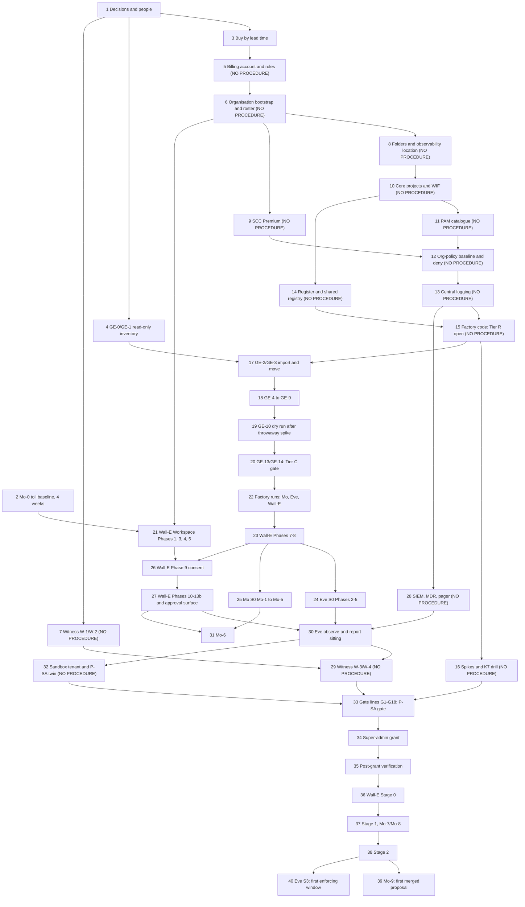

# 13. Setup procedure review

## Status
- Owner: the platform owner
- Last reviewed: 2026-09-15
- Maturity: review, complete 2026-09-15. It records the review of the manual setup procedures
  for the agentic platform and its three agents, held on 2026-09-15. It asked one question:
  what goes wrong if the platform owner builds everything by hand, alone at first, following
  the written procedures. It changes no procedure. Every fix below is still to be made in the
  page it names.
- Procedures reviewed:
  - Platform: the ten design pages [01](01-hld.md) to [12](12-open-decisions.md),
    [../project-topology.md](../project-topology.md) §7, and the one step list that exists,
    [03 §16](03-gemini-enterprise-environment.md#16-runbook-bringing-the-environment-to-baseline)
    GE-0 to GE-14.
  - Wall-E: [../wall-e/PREREQUISITES.md](../wall-e/PREREQUISITES.md) (460 lines),
    [../wall-e/SETUP.md](../wall-e/SETUP.md) (3,014 lines, 21 phases),
    [../wall-e/setup/README.md](../wall-e/setup/README.md),
    [../wall-e/setup/walle.env.example](../wall-e/setup/walle.env.example) and
    [../wall-e/setup/walle_setup.py](../wall-e/setup/walle_setup.py) (10,013 lines; its offline
    self-test passes 220 of 220 against stubs).
  - Eve: [../eve/07-build-runbook.md](../eve/07-build-runbook.md) (2,182 lines).
  - Mo: [../mo/07-build-runbook.md](../mo/07-build-runbook.md) (1,744 lines).
- How the review was run:
  - Nine finders read the procedures against the design and Google's documentation. Their
    findings were merged into one register of 213 findings, S001 to S213.
  - Each of the 155 blocking and major findings then went to two adversarial lenses. The facts
    lens re-checked the text and Google's pages. The context lens looked for places where the
    procedures already handle the problem.
  - Outcome rules:
    - **refuted**: both lenses refuted the finding.
    - **stands**: neither lens refuted it.
    - **partially stands**: one lens refuted it. The claim is narrowed to what survived.
    - Where the lenses corrected the severity differently, the higher of the two severities
      that did not refute the finding is kept.
  - The 58 register minor findings were not adversarially verified.
  - A completeness critic then found three areas that had only been recorded as "no
    procedure". A second round examined them: the sandbox tenant and the witness organisation,
    the Gemini Enterprise app side, and region, quota and billing. All 46 of its findings,
    minor ones included, then went to the same two lenses under the same outcome rules on
    2026-09-15. None was refuted. 45 stand and one stands partially (X-GE-14). They are in
    §4.6 and counted on their own row below.
  - Working files are outside the wiki, under `.agent-work/setup-review/` relative to the
    working directory: `register.json`, `verdicts-facts-*.json`, `verdicts-context-*.json`,
    `find-extra-*.json`, `verdicts-extra-facts-*.json`, `verdicts-extra-context-*.json`,
    `master-order.md` and `completeness-gaps.json`.
- Severity:
  - **blocking**: following the procedure as written fails, cannot be done by the stated
    person, or produces an unsafe or irreversible outcome.
  - **major**: the procedure completes but builds something wrong, insecure, or out of order
    with another procedure.
  - **minor**: clarity, a missing verify, or an avoidable trap.
  - **nit**: a wording or cross-reference fix with no effect on what gets built. Used only
    where both lenses rated a second-round finding so.
- Counts on 2026-09-15:

  | Set | Findings | Blocking | Major | Minor | Nit | Refuted |
  |---|---|---|---|---|---|---|
  | Register, verified, standing or partially standing | 155 | **43** | **99** | 12 (downgraded by the lenses) | — | 1 |
  | Register minor findings, not verified | 58 | — | — | 58 | — | — |
  | Second round, verified, standing or partially standing | 46 | **10** | **23** | 12 | 1 | 0 |
  | **All** | **259** | **53** | **122** | 82 | 1 | 1 |

  - Register: all 43 blocking findings stand in full. Of the 99 major findings, 2 stand only
    partially (S072, S089). Of the 12 downgraded minor findings, 4 stand only partially
    (S023, S060, S068, S129).
  - Second round: every finding stands in full except X-GE-14, which stands partially as a
    nit. Against the finders' grades, three moved: X-RQB-05 from blocking to major, X-RQB-07
    from major to minor, X-GE-14 from minor to nit. The standing total is 53 blocking and
    122 major findings.
- Closure: the procedures this review asked for now exist. See
  [Status of the findings on 2026-09-15](#status-of-the-findings-on-2026-09-15) below. The
  sentence "every fix below is still to be made in the page it names" is kept as the review's
  own record of 2026-09-15; the section below says where each fix landed.

## Status of the findings on 2026-09-15

The human-executed setup procedures now exist, in [setup/](setup/README.md): one entry point,
[setup/README.md](setup/README.md), and files [01](setup/01-prerequisites-and-conventions.md)
to [42](setup/42-gates-drills-and-evidence.md), in the owner's order (platform, then Mo and Eve,
then Wall-E). They supersede the four procedures reviewed above (§Status, "Procedures
reviewed"); [setup/README.md §1](setup/README.md#1-what-the-set-builds-and-what-it-replaces)
says what was salvaged from each. The set was completed with revision 3 of the README on
2026-09-16. Nothing in it has been executed.

Counts, read from `.agent-work/setup-procedures/closure.json` (the working file that maps each
standing finding to the step ids that close it) against the 175 standing blocking and major
findings of §4.1 to §4.6:

| State | Findings | Meaning |
|---|---|---|
| Closed | **169** | Every closing step id is in a file of the set, and the file's own "Findings closed" table names the finding |
| Deferred, with a reason and an owner | **6** | Closed in part; one named half waits on a person, a signature or code that is not committed. Listed below |
| Still open | **0** | No standing blocking or major finding lacks a closing or deferring step |
| **Total** | **175** | 53 blocking and 122 major, as counted in the Status block |

Checks made on 2026-09-16 when these counts were written: the 175 ids in `closure.json` are
exactly the ids rated blocking or major in §4.1 to §4.6 (X-RQB-07, downgraded to minor, is not
among them); the step ids named for each closure were spot-checked to exist in the file named;
and the 82 minor findings and the one nit (§4.6 to §4.8) are each cited by at least one file
of the set, although `closure.json` does not track them because the procedures were only
required to close blocking and major findings. The per-file closing rows are the authority
where this table and a file disagree
([setup/README.md §11](setup/README.md#11-review-findings)).

**Deferred, with the file that closes the deferred half:**

| Id | Severity | The half that is deferred | Why, and who | File that closes it |
|---|---|---|---|---|
| S011 | blocking | The **production** P-SA singleton entitlement `ent-factory-singleton-psa-prod`. The nonprod half (PA-4.5) is closed | It cannot be created until the production P-SA lane reviewer is appointed and signed. ISMS appoints; the platform owner runs the step | [12](setup/12-privileged-access-catalogue.md) PA-4.7; [31](setup/31-wall-e-project-and-data-plane.md) is ordered after it |
| S048 | major | Row 44, the Sensitive Data Protection discovery configurations at `fld-agentic-platform`. Rows 36, 40 and 41 are closed | No PAM entitlement carries the Organization Administrator or Security Admin role Google requires, the SDP pricing mode is unsigned and the reconcile job has no code. Platform owner, with IT security and finance for the pricing decision and the second human for the entitlement amendment | [16](setup/16-register-and-shared-registry.md) RG-7.6; [17](setup/17-factory-module-equivalents-and-tier-r-gate.md) FM-8.6, before the Tier R record or listed there as a BLOCKED Tier R item |
| S052 | major | The CI refusal of a P-SA promotion that cites a K7 drill older than 30 days. The K7 build, entitlements, drills and the gate line are closed | The refusal is register CI code (README B-03), which does not exist. Until it runs, G20 is read by the signed manual parse (SD-36) at every promotion sitting. Platform owner with the security reviewer | [42](setup/42-gates-drills-and-evidence.md) §"Deferred, with a reason and an owner", made mechanical by GD-1.3; the rule itself in the register CI of [16](setup/16-register-and-shared-registry.md) |
| S067 | major | The automatic stage snapshot tag and the frozen Annex IV bundle. The snapshot and the bundle are produced | A tag made by a workflow cannot be written before the workflow is committed (README B-03). The tag is made by hand and a `DEV` row recorded, so no stage opens without one. Platform owner, through the CI of 16 | [42](setup/42-gates-drills-and-evidence.md) GD-4.4 |
| S100 | major | The production behavioural half of the actor exclusion: an event generated by the production robot, observed not to loop. The structural half is closed | It cannot be produced at Stage 0 without a write, and SD-35 forbids production mutating fixtures. Wall-E owner, after the first real band-B write | [39](setup/39-wall-e-stage-0.md) §"Findings deferred"; the standing proof is [37](setup/37-wall-e-sandbox-rehearsal.md)'s twin `check48` record |
| X-GE-10 | major | Conditionally: the third-party egress refusal, if GE-4.7 records "not provable". The `enforcedProjects` forms and the refused provisions are closed | Proving the refusal needs a third-party form that reaches the create call without a supplier credential. Platform owner | [19](setup/19-gemini-enterprise-import-and-baseline.md) GE-4.7; re-tested in the first pull request that adds a third-party source, which must show a refusal before the allowance |

**Still open, with the file that should close them:**

| Id | Severity | What is open | File that should close it |
|---|---|---|---|
| *none* | — | No standing blocking or major finding is open on 2026-09-16. A finding becomes open again if a file's "Findings closed" row is removed or its step id no longer exists; [setup/README.md §12](setup/README.md#12-amending-this-page) is the amendment rule that keeps this table and the files aligned | — |

Two things this section does not change. Code the design specifies but that is not committed
(Eve's, Mo's and Wall-E's services, schemas and SQL, and the register CI) is not "deferred":
its steps are marked BLOCKED in the files and indexed in
[setup/README.md §8](setup/README.md#8-blocked-index). And the one design item deferred on
purpose, the Eve advisor path (M10, waiting on P34 and P19), is recorded in
[setup/README.md §11](setup/README.md#11-review-findings), not here.

## 1. Verdict

**The owner can start today, but not by building anything.**

**What to start today.** These are the items that have no dependency and long lead times:
- stage 1, decisions: close the decisions in §2 stage 1 and send the data-protection question
  (D7);
- stage 2, the toil baseline: start [Mo-0](../mo/07-build-runbook.md)'s four-week
  measurement, which cannot be taken later;
- stage 3, purchases: start them in lead-time order;
- stage 4, the Gemini Enterprise inventory: run
  [03 §16](03-gemini-enterprise-environment.md#16-runbook-bringing-the-environment-to-baseline)
  GE-0 and GE-1 read-only, extended as X-GE-01 to X-GE-03 ask.

**Do not create a folder, project, policy or account in any procedure yet.** There is no
executable platform procedure (S001, verified on 2026-09-15). Across the eleven platform pages
and the topology, every code fence is a mermaid diagram except two illustrative YAML schemas
in 05. No bash, gcloud or HCL block exists, and no `.tf` file exists. 03 §16 is a table of
steps. Topology §7.4 to §7.6 name only who makes what.

The consequences:
- No procedure makes the organisation bootstrap, the folder tree, the factory, PAM, the
  organisation-policy baseline, central logging, the shared registry, SCC, the SIEM, K7, the
  witness or the sandbox tenant.
- Every agent procedure assumes they exist. Its "manual fallbacks" would build projects under
  the wrong parent, with standing Owner, no PAM, no drift job, no deny policy and no central
  logging.
- The Tier R gate therefore cannot open. The super-admin grant can never be made in the way
  the design requires.

**What must be fixed or written before each stage:**

| Before | What must exist | Findings |
|---|---|---|
| Stage 5 (the first GCP resource) | A platform bootstrap runbook (§3, M1), with a named billing account and its roles, the observability storage location set on the folder before the first project, and each project's `_Default` logs routed to a regional bucket (never a folder Logging default, which blinds Sensitive Actions) | S001, S002, S019, S051, X-RQB-03, X-RQB-05 |
| Stage 17 (the first change to the live Gemini Enterprise app) | 03 §16 rewritten as a live-app-safe procedure. As written, GE-3 to GE-10 can delete chat history with no documented recovery, remove today's users' access, cut services the app uses, and route all app traffic through a gateway whose dry-run extension no step creates and whose unbind Google does not document | S047, S049, S053, X-GE-01 to X-GE-04 |
| Stage 21 (Wall-E on production) | The 13 blocking Wall-E defects fixed in SETUP.md and walle_setup.py, a model pinned on the eu endpoint, and the gate split so that a project can be created before the grant | S008, S009, S011, S015 to S026, S105, X-RQB-01 |
| Stage 24 (Eve v0) and stage 30 (Eve's observe-and-report sitting) | Eve's schemas, SQL and service code committed. Eve Phases 1 and 7 to 10b corrected | S027 to S041 |
| Stage 25 (Mo) | Mo's inputs committed, the dataset names made agent-neutral, and Mo-1 rewritten as a factory call | S042 to S046, S144 |
| Stage 32 and stage 33 (the gate) | The sandbox-twin and witness procedures written, after their design contradictions are resolved | S004, S005, S039, X-ORG-01, X-ORG-02, X-ORG-05 to X-ORG-07 |

**The five most consequential problems:**
1. **No platform bootstrap procedure exists** (S001, S002, S003). Every agent runbook stops at
   its first project (SETUP Phase 6, Eve Phase 1, Mo-1). The only way forward is a fallback
   that builds exactly what the tier model forbids.
2. **The super-admin gate cannot go green as designed.**
   - The gate refuses the register row that creates the project whose services the gate lines
     test (S008).
   - Eve's G-4 needs robot activity that only exists after the grant (S039).
   - No procedure builds the sandbox twin or the witness (S004, S005).
   - The second round, now verified, finds the design itself unbuildable in five places:
     - an Internal OAuth client in the organisation's project refuses a sandbox robot
       (org_internal, X-ORG-01);
     - the sandbox tenant's audit logs never reach the organisation's sinks (X-ORG-02);
     - the witness excludes tenant super admins, yet names the second human, a tenant super
       admin, as its administrator (X-ORG-05);
     - a 26-hour absence alarm exceeds Cloud Monitoring's 23.5-hour maximum, and no absence
       alarm fires before its first data point (X-ORG-06);
     - Eve's severity 1 pages go "through the witness channels", which nothing in the tenant
       can reach (X-ORG-07).
3. **The Gemini Enterprise baseline would damage the live, tenant-wide app** (verified; the
   chat deletion cannot be undone):
   - GE-6 sets 30-day retention, and Google deletes older chats with no documented recovery
     (X-GE-01);
   - GE-5 removes today's access grants before anyone is in `ge-users@` (X-GE-02);
   - GE-4's service allow-list refuses, at runtime, services the app may use (X-GE-03);
   - GE-10's binding immediately routes all app traffic through the gateway, while no step
     creates the authorisation extension that carries DRY_RUN, imports the live app's agents,
     or proves an unbind, which Google does not document (X-GE-04).
4. **Wall-E's security-critical steps do not run, or build the wrong thing:**
   - the engine IAM lock uses a gcloud group that does not exist (S024);
   - the script's baseline role breaks the two-principal engine lock while verify still
     passes (S105);
   - `walle-actions-super` has no deploy commands and its secrets are never created (S020,
     S021);
   - no phase builds the approval surface G14 needs (S009);
   - on the Agent Identity path, the agent is refused by its own action service (S016).
5. **Eve and Mo are specifications of code and inputs that do not exist yet**, and no model is
   pinned.
   - Eve's schemas, twelve SQL files and all service code are missing (S028, S029, S030).
     Mo's 20 schemas, 19 SQL files and two images are missing (S043).
   - No procedure names a Gemini model. The `europe-west1` endpoint serves only the Gemini 2.5
     family, retiring 2026-10-20 by the model pages and 2026-10-16 by the Vertex AI release note of 2026-04-02
     ([release notes](https://docs.cloud.google.com/vertex-ai/generative-ai/docs/release-notes)); plan for the earlier date. Every GA successor is served on `global` and the `eu` and
     `us` multi-regions, not on `europe-west1`. Agent Runtime reserves
     `GOOGLE_CLOUD_LOCATION`, so the agent code must set the model client to `eu` itself
     (X-RQB-01).

## 2. The master setup order

The sequence runs from an empty Cloud organisation to Mo's first merged proposal.
- It corrects `.agent-work/setup-review/master-order.md` with the verified findings of both
  rounds (second-round ids start with X-).
- **NO PROCEDURE** means that no executable steps exist today.
- "Gate" is the tier gate of [01-hld.md](01-hld.md) §0.4, or the milestone the stage makes
  true.

Two reminders on the order:
- The grant comes before Wall-E Stage 0 ([11-tisax.md](11-tisax.md) §6.3).
- Tier C opens before Tier R in the HLD. In practice, however, GE-2 needs the factory's
  `tenant-app` module, so the Gemini Enterprise baseline cannot run before the factory exists
  (S047, S050).

### Part A — Before anything is built (can start on 2026-09-15)

| # | Stage | Procedure and phase | Preconditions | Gate opened |
|---|---|---|---|---|
| 1 | Decisions and people. Wall-E D1–D8 and D10–D12; Eve E-1, E-14, E-16 and decision 44 or CC-33 (S035); Mo M-1, M-5 and the agent-neutral dataset names (S144); P13 retention ceiling; P14 closed on domain, edition, billing and the two witness administrators (X-ORG-05, X-ORG-08, X-ORG-09); P10 SIEM; P11 SCC payer (X-RQB-04); P22 moved to before Tier R (S051); P31 billing account (X-RQB-05); decision 6 model pin (X-RQB-01); decision 29 moved to before the grant (X-ORG-14). Send D7 in week one | PREREQUISITES §1; eve/07 Prerequisites; mo/07 Prerequisites; 12-open-decisions. **No single platform checklist** (S083) | none | written, dated answers |
| 2 | Toil baseline, four consecutive weeks | mo/07 Mo-0 (= PREREQUISITES D12) | the top three admin tasks picked | Wall-E Phase 1 may start. Mo-0 cannot be redone later (S084) |
| 3 | Buy and collect, longest lead time first: SecOps and MDR; penetration test; SCC Premium contract or payer; sandbox Workspace tenant (edition Enterprise Standard or higher, domain, seats, two super admins); witness Cloud Identity tenant with its own domain, a billing account whose parent is the witness organisation (self-serve or invoiced) and a Customer Care subscription; Chrome Enterprise Premium; a dedicated platform billing account (not a sub-account, which is for resellers), its roles and project quota; Gemini Enterprise licences and Gmail-bearing seats; hardware keys (robot twins add four if hardware-key 2SV is decided for them) | PREREQUISITES §3.1 and §9 (an unsorted list). **NO PROCEDURE** for the sorted list (X-RQB-09, X-ORG-04) | 1, budget | items in hand |
| 4 | Gemini Enterprise inventory, read-only: edition (five possible; stop on Business), licences (seats, distributed, assigned), location (stop unless `eu`), CMEK, current retention, project and app IAM policies and the "Manage users" export, enabled services, assets, inherited roles, data stores and connectors, per-OU and per-group service status and Workspace data access | 03 §16 GE-0, GE-1 (steps without commands; extend as X-GE-01, X-GE-02, X-GE-03, X-GE-10, X-GE-18, X-GE-19) | D8 | facts recorded before any GE write |

### Part B — Platform bootstrap to Tier R

| # | Stage | Procedure and phase | Preconditions | Gate opened |
|---|---|---|---|---|
| 5 | Billing: account and its administrator named, Billing Account User and Costs Manager granted on that account only to the bootstrap operator (with an expiry) and later to `factory-apply@`, currency checked, project creation and linking tested for about 20 projects and the quota request filed early | **NO PROCEDURE** (X-RQB-05) | 1, 3 | projects can be linked |
| 6 | Organisation bootstrap: Organization Administrator and Folder Creator to `sa-1-admin@` under a dated exception; break-glass `brk-gcp-1@` and `brk-gcp-2@`; security groups `platform-owners@`, `platform-security@`, `platform-approvers@`, `ge-admins@`, `eve-owners@`; `factory-groups@` with Groups Admin; human super-admin roster `sa-1-admin@`/`sa-2-admin@` with keys | **NO PROCEDURE** (S002, S049, S079). Design: 04 §2.4, §5.1, §7.1, §8.2 | 1, 3, 5 | first privileged principals exist |
| 7 | Witness W-1 and W-2: tenant, two IT security super admins who are not tenant super admins, billing account and support subscription, project, `eve_mirror`, retention bucket with Cloud Storage DATA_WRITE audit logs, and the records step, as early as P14's lead times allow. Records made before W-2 (break-glass enrolment at stage 6) stay on paper in the safe, with a same-day scan in the interim evidence location, and are uploaded by the witness administrators at W-2 | **NO PROCEDURE** (S005; X-ORG-05, X-ORG-11). Owner: IT security | P14, 3 | custody records have a home |
| 8 | Folder tree of 02 §2.1, numeric ids recorded. Observability default storage location (`europe-west1`) set on `fld-agentic-platform` **before the first project**. No Cloud Logging folder default: it would move `_Required` and blind Sensitive Actions; each project instead routes `_Default` to a regional bucket and creates `_Trace` (stage 10 and the factory modules) | **NO PROCEDURE** (S001; X-RQB-03) | 6 | tier folder ids exist |
| 9 | SCC Premium activated with EU residency, before any location policy. Whether a folder-scoped location policy can deactivate SCC is not documented, so check it on the nonprod folder | **NO PROCEDURE** (S003; X-RQB-04) | P11, 6 | Tier C detection desk |
| 10 | Core projects `CICD_PROJECT`, `CORE_PROJECT`, `LOGGING_PROJECT`, `KMS_PROJECT`, `VALIDATOR_PROJECT`: state bucket, WIF pool and `factory-apply@`, Artifact Registry, Cloud Build, Binary Authorization attestor, `platform-drift@`, validator custodian; in every project a `europe-west1` bucket receiving `_Default` and an explicit `_Trace` bucket (X-RQB-03) | **NO PROCEDURE** (S001, S051). Design: 02 §3.4, §5; 09 §1–§2 | 8, P22 | factory identities exist |
| 11 | PAM catalogue: `ent-platform-policy`, `ent-folder-admin`, `ent-project-repair`, `ent-factory-singleton`, `ent-ge-admin` (no-approval at Tier C, X-GE-12), `ent-project-move`, `ent-k7-*`, and an organisation-scoped sink entitlement (S142) | **NO PROCEDURE** (S002). Design: 04 §5.2 | 6, 8, 10 | every later privileged step has a lawful path |
| 12 | Organisation-policy baseline B1–B22 and the allow-lists. Dry run only where Google supports it (custom and managed constraints, `gcp.restrictServiceUsage`, `gcp.restrictEndpointUsage`, the two TLS constraints); legacy constraints applied first on a nonprod folder. Deny policies with the documented principal form (S072); PAB | **NO PROCEDURE** (S001 as corrected by the facts lens). Design: 02 §4; 04 §3–§4 | 8, 9, 11 | folder baseline (Tier R item) |
| 13 | Central logging: Workspace "Share data with Google Cloud services" (today only in SETUP Phase 5, S159); S-org, S-folder, fan-out sinks; locked buckets after P13; `platform_logs_views`; Data Access audit config; billing export enabled by the billing administrator | **NO PROCEDURE** except the Workspace toggle. Design: 08 §3–§5 | 10, 12, P13 | central logging (Tier R item) |
| 14 | Register repository and CI checks, shared Agent Registry in `CORE_PROJECT`, drift and reconciliation jobs | **NO PROCEDURE** (S001, S048). Design: 05 §2–§7 | 10, P22 | shared registry (Tier R item) |
| 15 | Factory code: `agent-project`, `verifier-project`, `improver-project`, `tenant-app`, `revoke`, and the undefined `platform-core` (S048); negative test | **NO PROCEDURE**. Design: 01 §3.2; 02 §3.2–§3.4 | 10–14 | **Tier R open**. No page records or checks this gate (S085) |
| 16 | Nonprod spikes (perimeter, principal-set spelling, cross-project registry) and K7: `k7-executor` built, `canary-r`, first drill per nonprod tier folder | **NO PROCEDURE** (S052). Design: 04 §9; 06 §4.3 | 12, 15 | K7 proven |

### Part C — Gemini Enterprise baseline (Tier C)

| # | Stage | Procedure and phase | Preconditions | Gate opened |
|---|---|---|---|---|
| 17 | GE-2 `tenant-app` import. GE-3 move, only after the allow-list is the union of enabled services and the design list (keeping only services the constraint governs) and has run in dry run against this project, as a project-level dry run before the move or a folder dry run held 14 days after it (X-GE-03), and after inherited roles are re-granted | 03 §16 GE-2, GE-3 (no commands) | 4, 11, 12, 15 | `GEMINI_PROJECT` in `fld-gemini-enterprise` |
| 18 | GE-4 to GE-9: constraints with each page's `enforcedProjects` form, proven by a refused provision (X-GE-10); discoveryengine ADMIN_READ audit config (X-GE-11); CMEK as its own decided step by `ge-admins@` through PAM (X-GE-05); `ent-ge-admin` created without approval at Tier C and a grant obtained before standing access goes (X-GE-12); groups filled and app-level policy written by `ge-admins@` **before** grants are removed (X-GE-02, X-GE-06); no retention reduction (X-GE-01); Model Armor template in `eu` with sanitize logging, verified on the sanitize log, not SCC (X-GE-07, X-GE-14); the unreachable-template test moved to GE-9's throwaway app (X-GE-08); registry and gateway import | 03 §16 GE-4 to GE-9 (rewrite first) | 13, 17 | front door configured |
| 19 | GE-10 binding on the `eu-discoveryengine` host (X-GE-20), only after the authz extension in DRY_RUN and its authorisation policy, the import of every existing agent, endpoint and MCP server, and a proven unbind on the throwaway app (X-GE-04). GE-11 enforce not before the first agent row is admitted | 03 §16 GE-10, GE-11 | 18 | — |
| 20 | GE-13, GE-14: detections re-scoped to SCC at Tier C (S050), penetration test moved to Tier P | 03 §16 GE-13, GE-14 | 9, 19 | **Tier C gate** |

### Part D — Agent infrastructure, before the grant

| # | Stage | Procedure and phase | Preconditions | Gate opened |
|---|---|---|---|---|
| 21 | Wall-E Workspace side: Phase 1; Phase 3 without the tenant-wide self-recovery and multi-party-approval rows (S012) and without creating `eve@` (S088); Phase 4; Phase 5 as a verify | SETUP Phases 1, 3, 4, 5; `./walle workspace` | 2, 3, 6, `WALLE_REPO` initialised (S163) | robot exists, hardened, no role |
| 22 | Register rows and factory runs: Mo (`improver-project`), Eve (`verifier-project`), Wall-E (`agent-project` under `ent-factory-singleton`, two named approvers, S011). The P-SA row merges with `gate_checklist` pending (S008); its `env=nonprod` row is not a second P-SA row (X-ORG-13) | SETUP Phase 6. Eve Phase 1 and Mo-1 step 0 must first be rewritten as factory calls (S027, S042) | Tier R, 11, 20 | `WALLE_PROJECT`, `EVE_PROJECT`, `MO_PROJECT` |
| 23 | Wall-E Phases 7 and 8 (nine audit tables, S093; both writer entries, S109) | SETUP Phases 7–8; `./walle gcp` | 22, schemas | Wall-E data plane |
| 24 | Eve S0: Phase 2, then a `walle gcp` re-run, then Phases 3, 4, 5 | eve/07 Phases 2–5 (need committed schemas and SQL, S028, S029) | 23 | Eve v0 queries |
| 25 | Mo S0: Mo-1 to Mo-5, with a `walle gcp` re-run after Mo-2 | mo/07 Mo-1 to Mo-5 (need inputs, S043; fixes S044, S045) | 23, 13 | Mo metrics |
| 26 | Wall-E Phase 9: both clients, one consent sitting. Tenant reads return 403 until stage 34 | SETUP Phase 9; `./walle consent`, `consent --super` (secrets S020) | 21, 23 | tokens stored |
| 27 | Wall-E 12b spike, then 12c, then Phase 10 (both services, S021; built in CICD with Binary Authorization, S006, S022), then Phase 11 (platform sink, S094), then Phase 12 (engine created once, with identity type and gateways, and the model client set to `eu` in the agent code, not through `GOOGLE_CLOUD_LOCATION`: S025, S075, X-RQB-01), then 12b step 7, then 13b. Approval surfaces | SETUP Phases 10–13b; `./walle armor`, `spike`, `deploy`, `registry`. Approval surface **NO PROCEDURE** (S009) | 26, 12, 13, 14, service code | Wall-E services deployed, fail-closed |
| 28 | SIEM, MDR, pager; SA-01 to SA-09 and SG-01 to SG-07 with fixtures | **NO PROCEDURE** (S003) | 13, P10 | G2 (Tier P) |
| 29 | Witness W-3 (managed member constraint listing `eve-export@` and the witness humans, then legacy reset, then negative tests: X-ORG-10) after `eve-export@` exists; W-4 alarms after the first heartbeat, with a billing-status check (X-ORG-06, X-RQB-06) | **NO PROCEDURE** (S005, S061) | 7, 30 (step 4) | witness live |
| 30 | Eve's observe-and-report sitting: Phase 7 (organisation sink via PAM, S142), then Phase 8 (`eve@` created outside the enforced OU, S038; consent command, S040), then Phase 9 (grants S032, S033; bucket gated, S041), then a `walle deploy` re-run, then Phase 10 and Phase 10b (export job with an hourly heartbeat and a sub-daily export, S037, X-ORG-06; severity 1 paged through the organisation's paging service, the witness as backstop, X-ORG-07) | eve/07 Phases 7–10b; SETUP Phase 10 re-run | 24, 27, 28, decision 44 or CC-33, Eve code (S030) | Eve observe-and-report live |
| 31 | Mo-6, then a `walle deploy` re-run | mo/07 Mo-6 (harness S007) | 25, 27 | Mo read endpoints |
| 32 | Sandbox tenant and P-SA twin: sandbox Workspace side; sandbox-organisation sinks (X-ORG-02); twin clients External, In production and Trusted (X-ORG-01); every nonprod folder admitting the sandbox customer id, sandbox requesters and approvers, custom IAP client on the twin (X-ORG-03); nonprod factory runs; denial suite G10, K6 drill G11 (under 30 days old at the grant), band-B dry run G14; Eve drill G-5 and G-7 in its sandbox part only, the witness part being G-2's (X-ORG-12) | **NO PROCEDURE** (S004). SETUP l.383: "how that copy is built is *tbd*" | 3, 22, 27, 30 patterns | G10, G11, G14 evidence |
| 33 | Human and organisational gate lines G3 to G18, plus the Tier W rows and a K7 P-SA drill younger than 30 days (S085) | SETUP Phase 2 gate table (a checklist); 11 §6.3 | 16, 28, 29, 32; five named humans, or four with a dated exception (X-ORG-05) | **P-SA tier gate** |

### Part E — The grant, Stage 0, and after

| # | Stage | Procedure and phase | Preconditions | Gate opened |
|---|---|---|---|---|
| 34 | Super-admin grant: roster committed, G1–G18 signed and parsed (S092), Super Admin assigned under multi-party approval | SETUP Phase 2 step 5; `./walle workspace` M2C (split into its own subcommand, S014) | 33 | **the grant** |
| 35 | Post-grant verification (S122); Phases 12 to 17 on production, non-mutating tests only (S091); interim sinks deleted; GE-11 enforced once Wall-E's row is admitted | SETUP Phases 9 (verify), 12–17 | 34, 19 | Stage 0 checklist green |
| 36 | Stage 0 record, schedules resumed, verify strict (S101) | SETUP Phase 18; `./walle stage0` | 35 | **Wall-E Stage 0** |
| 37 | Stage 1: approval surface, works council, Mo-7 (watermark writer, S152) and Mo-8 | wall-e/05 §7; mo/07 Mo-7, Mo-8. Approval surface **NO PROCEDURE** | 36 | Stage 1 |
| 38 | Stage 2: threshold calibration (E-18) | eve/05 S2 (no runbook phase) | 37 | S2 |
| 39 | Mo-9 at S2 exit: drop box, CI ingestion identity from the `CICD_PROJECT` pool, validator recompute, branch protection on both repositories; then the first real bundle, pull request, validator, two reviewers, merge | mo/07 Mo-9 (S046); first merge **NO PROCEDURE** | 10, 30, 37 | **Mo's first merged proposal** |
| 40 | Eve S3 entry: invariant-class halt and demote live | eve/07 Phases 8–12 (verify) | 38 | Eve's first enforcing window |

**Cross-runbook re-run points.** Each is missing from the runbook that needs it (S070, S107).
- `walle gcp` after:
  - Eve Phase 2 (`eve-v0@`);
  - Mo-2 (`mo-metrics@`);
  - Eve 10b step 4 (`eve-export@`, whose `walle_audit` READER has no maker, S054);
  - creation of the validator custodian identity (S055).
- `walle deploy` after Eve Phase 9 (`eve-controller@`, `eve-verifier@`, `eve-console@`) and
  after Mo-6 (`mo-analyst@`).
- Eve Phase 9's `ladder/` binding: after the ladder publisher is named (S130) and before the
  retention lock.

## 3. What is missing entirely

| # | Missing procedure | What it must contain | Design that already specifies it | Findings |
|---|---|---|---|---|
| M1 | **Platform bootstrap runbook** (to be written as a new page, for example `14-platform-bootstrap-runbook.md`, and listed in [../../runbooks/README.md](../../runbooks/README.md) and [README.md](README.md) "Reading order for a builder") | Phases B0 to B12 in the order of §2 stages 5–16. Each phase needs commands or a Terraform module path, a verify, a rollback or an "irreversible" banner, an owner, hands-on and elapsed time, and a resume checkpoint. Contents: billing account and roles; organisation roles under a dated exception; break-glass; control groups and `factory-groups@`; folder tree and observability default location (no Cloud Logging folder default); core projects, WIF and state, each routing `_Default` to a regional bucket with an explicit `_Trace`; PAM catalogue including an organisation sink entitlement; B1–B22 with dry run only where supported; deny policies and PAB; central logging and the billing export; register repository and shared registry; factory modules including `platform-core`; negative test; a Tier R gate record | [01-hld.md](01-hld.md) §0.4, §3.2; [02-landing-zone-and-tiers.md](02-landing-zone-and-tiers.md) §2–§4; [04-identity-and-privileged-access.md](04-identity-and-privileged-access.md) §2.4, §3–§5, §7.1; [05-registry-and-autonomy-contract.md](05-registry-and-autonomy-contract.md) §2–§7; [08-data-logging-retention-sovereignty.md](08-data-logging-retention-sovereignty.md) §3–§5; [09-supply-chain-secrets-recovery.md](09-supply-chain-secrets-recovery.md) §1–§2 | S001, S002, S019, S048, S049, S051, S083, S085, S142, S159, X-RQB-03, X-RQB-05 |
| M2 | **Platform prerequisites and build order**: one entry page | A PREREQUISITES-shaped table for the platform (requirement, why, verify, needed by, holder, lead time). One ordered table of sittings across platform, GE, Wall-E, Eve and Mo (§2 of this page). "Who must be present" per phase. One build-log and evidence location mapped to E-xx and TISAX ids | [01-hld.md](01-hld.md) §0.3–§0.5; [11-tisax.md](11-tisax.md) §6.3; `.agent-work/setup-review/master-order.md` | S066, S067, S068, S069, S083, S084, X-RQB-09 |
| M3 | **SCC Premium activation and SIEM, MDR and pager onboarding** | Tier C: SCC Premium activation with EU residency and a notification config, with the payer decided (the organisation-level pay-as-you-go option bills every project in the organisation). Tier P: SIEM feed from `LOGGING_PROJECT`, SA-01 to SA-09 and SG-01 to SG-07 with CI fixtures, a 24x7 acknowledgement test, pager routing, and the SIEM principal allowed to run `k7-executor` | [07-monitoring-detection-incident-response.md](07-monitoring-detection-incident-response.md) §2–§4, §6; [01-hld.md](01-hld.md) §0.3, §0.5 | S003, S050, X-RQB-04, X-ORG-15 |
| M4 | **K7 fleet kill switch build and drill** | Build and attest `k7-executor`; commit `k7/*`; both entitlements; `canary-r`; a dry-run drill, then an enforced drill, on each nonprod tier folder including `fld-agents-p-sa-nonprod`; times recorded; a gate line for a drill younger than 30 days | [04-identity-and-privileged-access.md](04-identity-and-privileged-access.md) §9; [01-hld.md](01-hld.md) §11.4 | S052, S085 |
| M5 | **Witness organisation runbook** (owner IT security) | W-1: separately registered domain, registrar and DNS outside the organisation, tenant, two super admins who are not tenant super admins, self-recovery off and the recovery design recorded, a billing account whose parent is the witness organisation, a Customer Care subscription. W-2: project, `eve_mirror`, locked bucket with DATA_WRITE audit logs, Access Transparency and Access Approval. W-3: managed member constraint admitting `eve-export@` and the witness humans, then legacy reset, then rows 32–33 and negative tests. W-4: log-based metrics on the witness tables; absence windows of about 90 minutes for the hourly heartbeat and at most 23.5 hours for the sub-daily export, created after the first heartbeat; email and SMS as well as pager channels; billing-status check, with a tenant-side push-failure alert. A records step for custody, rota and drill records, including those made before W-2 | [../project-topology.md](../project-topology.md) §7.5; [01-hld.md](01-hld.md) §13.2; [../eve/07-build-runbook.md](../eve/07-build-runbook.md) Phase 10b; [12-open-decisions.md](12-open-decisions.md) P14 | S005, S061, X-ORG-05 to X-ORG-12, X-RQB-06 |
| M6 | **Sandbox tenant and P-SA nonprod twin runbook** | Purchase: edition (minimum Enterprise Standard), domain, seats, two sandbox super admins, twin robot keys if decided. Sandbox Workspace side (SETUP Phases 1, 3, 4, 5 against the sandbox). Sandbox-organisation sinks to nonprod destinations, and the sandbox SecOps export if live fixtures are wanted. Twin OAuth clients External, In production and Trusted in the sandbox. Sandbox customer id on every nonprod folder holding a twin component; sandbox requesters and approvers; custom IAP client. Nonprod factory runs under the rule that `env=nonprod` rows merge without the checklist. Wall-E Phases 10–17 and Eve Phases 7–10b against the twin. Drills G10, G11, G14, G-5 and G-7, re-run so they are under 30 days old at the grant | [02-landing-zone-and-tiers.md](02-landing-zone-and-tiers.md) §1.3, §3.5; [../wall-e/SETUP.md](../wall-e/SETUP.md) Phase 2; [../eve/05-stages.md](../eve/05-stages.md) G-4 to G-7 | S004, S039, X-ORG-01 to X-ORG-04, X-ORG-13, X-ORG-15 |
| M7 | **Wall-E approval surfaces** (band A and `walle-approvals-super`) | IAP-fronted Cloud Run services, their service accounts, audiences, canonical-request-hash binding, invoker on the action services, and their email addresses in the generated allowlists | `wall-e/03-lld.md` approval surfaces; SETUP §7.10; PREREQUISITES §10 item 17 | S009, S076 |
| M8 | **Validator custodian** | `VALIDATOR_PROJECT` identity; `grades_eve` with an insert-only grader role; READER on `walle_audit` (row 21) and for `mo-metrics@` (rows 45–46) | [../project-topology.md](../project-topology.md) rows 21, 45–46; [01-hld.md](01-hld.md) §0.3 | S055 |
| M9 | **Mo's first merged proposal** | CI ingestion identity from the `CICD_PROJECT` pool; ingestion workflow; branch protection on the Wall-E and `eve/config` repositories; the first passing bundle through the validator to merge | [../mo/04-artefacts-and-proposals.md](../mo/04-artefacts-and-proposals.md); [12-open-decisions.md](12-open-decisions.md) P22 | S046, S153, S206 |
| M10 | **Eve advisor path** (deferred on purpose until P34 and P19) | Factory `verifier-project` run for `EVE_ADVISOR_PROJECT`, `eve-advisor@`, a project Model Armor floor, authorised views, rows 30–31 | [../project-topology.md](../project-topology.md) §2 rows 30–31 | S129 (minor), X-RQB-08 |
| M11 | **Inputs the runbooks execute but nobody has written** | The Terraform factory repository; Wall-E service code and images; Eve schemas (9), SQL (12), `thresholds.yaml`, reconciler and console code, CI gates; Mo schemas (20), SQL (19), reporter and narrator images, `gates.yaml` | the LLD pages of each agent; brief `29-roadmap-and-cost.md` (engineer-day estimates) | S001, S028, S029, S030, S043 |

## 4. Findings that stand

The findings are grouped by the procedure the register assigned. Within each group, blocking
findings come first. "Stands" means both lenses upheld the finding. "Partial" gives the claim
as narrowed by the lens that refuted part of it. Line numbers are those of the files on
2026-09-15.

### 4.1 Platform

| Id | Severity | Location | What goes wrong | Fix |
|---|---|---|---|---|
| S001 | blocking | agentic-platform 00–12, README l.6–12 and l.108–139; project-topology §7.4–§7.6; 03 §16 | No executable platform procedure exists (no bash, gcloud or HCL block, no `.tf`). No page makes the factory, folder tree, B1–B22, core projects, sinks, shared registry, deny policy, PAB, PAM, K7, drift job, SCC, SIEM, break-glass or witness. SETUP Phase 6, Eve Phase 1 and Mo-1 stop, or take fallbacks that keep Tier R red for good | Write M1 before any agent runbook runs, and mark SETUP Phase 6, Eve Phase 1 and Mo-1 step 0 not runnable until it exists. Correction from the facts lens: dry run is supported only for custom constraints, managed constraints, `gcp.restrictServiceUsage`, `gcp.restrictEndpointUsage` and the two TLS constraints. Legacy constraints such as `gcp.resourceLocations` and `iam.allowedPolicyMemberDomains` cannot be dry-run, so apply them on a nonprod folder first |
| S002 | blocking | 02 §3.4 l.462, §2.2 l.321–322; 04 §5.1 l.377, §5.2 l.389–401, §2.4 l.166; P69 | No procedure performs the first privileged acts: Organization Administrator, Folder Creator, PAM admin, the control groups that PAM entitlements name, the break-glass accounts, the first folder. A folder-scoped entitlement cannot exist before its folder, so "through PAM" is impossible for the first step | Bootstrap phase B0 under a dated standing exception: organisation roles to `sa-1-admin@` and break-glass accounts; control groups as security groups; PAM admin to `platform-owners@`; exception withdrawn once PAM exists |
| S003 | blocking | 01 §0.4 P row l.160, §0.3; 07 §2–§3, §6.2–§6.3; P10; SETUP G2 l.394, §6.1 | Nothing buys, provisions or connects the SIEM, MDR, pager or `LOGGING_PROJECT` feed, and nothing activates SCC Premium and its notification config. G2 cannot go green, so the grant is blocked, and auto-K7 has no caller | Close P10. Write M3: SCC activation and notification config at Tier C; SIEM feed, rule deployment with fixtures, acknowledgement test and pager routing at Tier P |
| S047 | major | 03 §16 l.445–470; README l.126–127 | The one existing platform procedure needs the factory from GE-2 onward, contrary to its own index. Its console steps give no path, no values and no place to record the GE-0 facts, so Tier C cannot be opened from the text | Correct README step 7. Expand each GE row into a sub-procedure with console path, exact values, command, PAM holder, time and evidence id. See also X-GE-01 to X-GE-22 |
| S048 | major | topology §7.6 l.543–546 rows 36, 40, 41, 44; Mo-2 l.492–496; 01 §3.2; 02 §3.3 | `platform-core` is not one of the five factory modules. `platform_logs_views` readers, the drift job's securityReviewer role and the SDP row are made by nobody, so Mo metric 9/9b and the drift job have no working grant | Add `platform-core` to 01 §3.2 and 02 §3.3 with its resources, or assign rows 36, 40, 41, 44 to named M1 phases with command and verify |
| S049 | major | 03 §16 GE-5 l.458; 04 §2.4 l.166, l.170–173 | `ge-admins@`, the requester group of `ent-ge-admin`, and `factory-groups@` have no maker. GE-5's PAM check fails, so GE-6, GE-7 and GE-10 cannot run | GE-5: `ge-admins@` created by hand by a super admin. Other `ge-*` groups by `factory-groups@`. A bootstrap step creates `factory-groups@` with Groups Admin |
| S050 | major | 03 §16 header l.447–449, GE-2 l.455, GE-7 l.460, GE-13 l.466, GE-14 l.467; 01 §0.4 C, §0.3; P10 | The Tier C gate needs a SIEM, a security reviewer and SCC Premium, which arrive only at Tier P/W or have no procedure. Tier C cannot close before Tier P. README tells the builder §16 needs no factory | Re-scope GE-13 at Tier C to SCC findings routed with a test finding. Move SIEM rules and the penetration test to Tier P. Add SCC activation. Correct README l.127 |
| S051 | major | P22 l.184 (gate Tier W); 02 P35, P36 l.383, l.433–442; B19 l.616 | The factory WIF provider needs the git host's issuer and repository ids, but P22 (git host) is due only at Tier W. Tier R cannot open on schedule | Move P22's gate to before Tier R |
| S052 | major | 04 §9.2–§9.6 l.730–811; 01 §11.4; SETUP §5 K7 l.2645, l.2661, §6.1 | Nothing builds `k7-executor`, its files, `canary-r`, the entitlements or the first drill, and no gate list checks K7. The fleet kill switch is silently absent at the grant | Write M4 and a gate line "K7 drill on the P-SA folder younger than 30 days" |
| S053 | major | 03 §16 GE-3, GE-4 | The live tenant-wide app inherits the baseline, deny policy, floor and `restrictServiceUsage` in one move with no dry run. A hand edit of a folder IAM policy can drop folder bindings for every child project | Before GE-3, list effective constraints and run the folder policy as dryRunSpec where supported. For GE-4, save the policy, merge only auditConfigs keeping etag and bindings, show the diff, apply under PAM, keep the file as rollback |

### 4.2 Cross-procedure

| Id | Severity | Location | What goes wrong | Fix |
|---|---|---|---|---|
| S004 | blocking | SETUP Phase 2 l.383, G1, G10, G11, G14 l.393–406; eve/05 G-5, G-7; Eve 10b drill l.1598 | No procedure creates the sandbox tenant, the robot twin, the `fld-agents-p-sa-nonprod` Wall-E build or the `fld-controllers-nonprod` Eve build. Four gate lines and two Eve rows can never go green. Substituting the production sandbox OU gives records the gate refuses, or drills K6 on the production robot | Write M6 (with the design corrections of X-ORG-01 to X-ORG-04) |
| S005 | blocking | topology §7.5 W-1..W-4; Eve 10b l.1426–1430, l.1466–1470, l.1508–1518; P14; SETUP G1, G11, G18 | No procedure creates `org-witness`, its project, `eve_mirror`, the locked bucket, rows 32–33, the domain restriction, channels, absence alarm, export job or heartbeat. G1 and 11 §6.3 row 5 stay red | Close P14. Write M5 (with X-ORG-05 to X-ORG-12) |
| S006 | blocking | Eve Phase 9 l.911–915, Phase 10 l.1246, l.1303–1312; SETUP Phase 10 l.1225–1239, 11.2 l.1370–1379; 02 B18 l.615, §4.2 l.645, CC-3 l.668 | Under the folder baseline, Eve Phase 9's API enablement (`cloudbuild`, `artifactregistry`) is refused by `restrictServiceUsage`. Every `gcloud run deploy` without `--binary-authorization=default` is refused. Builds in agent projects contradict "builds run in `CICD_PROJECT`" | Remove `cloudbuild` and `artifactregistry` from Eve Phase 9. Build and attest in `CICD_PROJECT` and deploy by digest. Add `--binary-authorization=default` and the Direct VPC flags to every deploy |
| S007 | blocking | Mo l.1102 (Mo-6 verify), l.1630–1652 `as_sa`, l.1666–1677 `call_actions`, l.1614 MD-9 | The negative tests impersonate `walle-actions@`, `eve-controller@` and other accounts. No runbook grants token-creator, and the platform forbids it on those accounts. Calls fail at `getAccessToken`, curl sends an empty bearer and gets 401, which is neither the expected 200 nor 403 | Run negative BigQuery tests as jobs executing as each identity, or use a time-boxed PAM token-creator on `mo-*` accounts only. For forbidden accounts use Policy Troubleshooter or testIamPermissions |
| S008 | blocking | 02 §1.3 P1 l.174, P4; SETUP Phase 2 l.389, Phase 6 step 1 l.567; 11 §6.3 l.371–373 | Circular: `WALLE_PROJECT` cannot be created until every gate line is green, and G10, G12, G13 and G14 need `WALLE_PROJECT`'s services deployed. The Phase 6 pull request never merges | Split the gate. The register row merges with `gate_checklist` pending and privilege `super_admin_pending`. The gate refuses only the Super Admin assignment and the Stage 0 record. X-ORG-13: the alternative "twin first" fix loops, so do not use it |
| S054 | major | SETUP Phase 7 l.846–860; `CROSS_PROJECT_DATASET_READERS` l.~324–330; SETUP §1.7; Eve 10b step 4 l.1508–1509 | Topology row 34 (READER for `eve-export@` on `walle_audit`) is made by nobody. The daily export and the witness push of Wall-E's audit fail with accessDenied | Add `SA_EVE_EXPORT` to §1.7, the reader line to Phase 7, the row to the script table and to Phase 15 verify 1 |
| S055 | major | SETUP Phase 7 l.859–860; `walle_setup.py` l.324; Mo-9 l.1426–1431; Mo-1, Mo-4 | Row 21 (validator READER) and rows 45–46 (`grades_eve`) have no maker. The validator recompute cannot read `walle_audit`, and Mo computes Eve's numbers without the source rule | Write M8. Replace the comment in Phase 7 with a gated reader line. Add the `grades_eve` source and assertion to Mo-4 |
| S056 | major | SETUP l.2004–2020 (Phase 13); topology l.503–521; 03 §16 GE-5, GE-12 | Registration is a hand-made console object that reconciliation treats as unmatched. The share uses standing rights. Wall-E's endpoint is absent from `gemini-registry` and `gemini-egress`, so after GE-11 the verify fails or the gateway is left in dry run | Rewrite Phase 13 as GE-12 for Wall-E: register row `publish_to_gemini`, CI import and registration, share by `ge-admins@` via PAM. Keep the console path only as a dated fallback |
| S057 | major | SETUP 13b step 5 l.2104, step 4 l.2078–2089; Eve and Mo runbooks | The gateway command resolves a per-project registry that cannot exist (`agentregistry` is not allowed in the tier). Wall-E's card meta line is never written. Eve, eve-advisor and Mo have no register row before they exist in a project | Use `$CORE_PROJECT` in 13b and move the local registry to a fallback. Verify the entry's meta line. Add "merge the register row and manifest" as the first step of Eve 07 and Mo 07 |
| S058 | major | Eve Phase 3 l.403–418; SETUP Phase 7 l.781, l.793; Eve Phase 11 step 4 l.1843–1847 | Eve mirrors at most six `walle_audit` tables and never names `generic_requests`, so the off-project copy lacks the super-admin generic lane and EVE-20 cannot tell a missing band-B row from a gap | One mirror table per source table (nine), one transfer each, and a verify that the counts match |
| S059 | major | PREREQUISITES §4.1 l.138–150, §11 l.450; Eve l.80, l.642–645; Mo l.100; 04 §5.2 l.404–408 | The prerequisites leave the builder with standing organisation-level policy, deny and sink administration, the levers of K7 and evidence silencing, with no approval or expiry. This is a TISAX privilege-review finding on day one | Name the PAM entitlement per phase. Keep standing roles only for the pre-bootstrap fallback, as a dated exception removed before the drift job runs |
| S061 | major | Eve 10b step 4 l.1508–1514, l.2093 | A customer id in `iam.allowedPolicyMemberDomains` admits every identity and service account of the tenant, so the witness admits the whole tenant | Use `iam.managed.allowedPolicyMembers` with `eve-export@` only. X-ORG-10 adds that the legacy default on a new organisation must also be reset, and that the managed policy must list the witness humans too |
| S062 | major | Mo l.491–496, l.542–553, l.786–797, l.809–810, env l.120–146 | Metrics 9 and 9b read `walle_workspace_logs`, an interim dataset deleted before Wall-E Stage 1. From then on their transfers fail hourly, and `${LOGGING_PROJECT}` expands empty | Export `LOGGING_PROJECT`. Read `platform_logs_views.walle_workspace_logs` from the start. Add a hand-off verify for row 40 |
| S063 | major | Mo-6 l.988–1003, Mo-7 l.1184–1188; 02 l.330, l.416 | `deny-improvers` forbids run.invoker for improver principals on credential holders, but Mo-6 grants `mo-analyst@` invoker on `walle-actions`. Once the factory applies the deny, MD-3 and plan-hash recompute get 403. The two pages cannot both be executed | Decide in the register: read plan hashes from `walle_audit.plans` and drop the binding, or record a named exception on decision 48 |
| S064 | major | Mo-8 step 2 l.1296–1304, l.1316, l.1702; `wiki/_sync/wiki_sync.py` l.62, l.168–179 | Artefacts committed under `platform/wall-e/mo/` and `platform/eve/mo/` are pushed to Google Drive on the next `wiki push`, widening readers of personal-data-derived content. The runbook says this step has no rollback | Use underscore-prefixed directories, or add an exclusion list with a self-test. Verify with a dry-run push |
| S065 | major | Mo-11 l.1527–1528 | `aiplatform` and `modelarmor` are added to the `fld-improvers` allow-list only at S4 by a dated PR. Run before it, the enable is refused, and the runbook neither names nor gates on the PR | Precondition: the PR is merged. Verify the effective `restrictServiceUsage` |
| S066 | major | runbooks/README l.5–7; agentic-platform README l.108–139; wall-e README l.65–66; SETUP l.20; Eve l.21–27; Mo l.29–35 | There is no single entry point and no master sequence across four interleaved procedures. Starting at SETUP Phase 1 misses the baseline, the factory and the cross-runbook re-runs | Write M2 (build-order page, from §2 of this page). Replace SETUP l.20 "standalone" with a link to it |
| S067 | major | SETUP l.348, l.518, l.604, l.1154, l.409, l.450, l.2726, l.2472, l.2623, l.2500; PREREQUISITES l.16; Eve; Mo | Evidence (decisions, stage snapshot tag, drill and custody records, tabletop) has no defined home and no mapping to E-xx or TISAX ids. The witness and evidence buckets do not exist during the build | One build-log location per runbook, an interim custody location, and a "Record" line per phase with E-xx, control id and path |
| S069 | major | SETUP l.450, l.1101, l.569, l.418, l.2659–2660; setup/README l.246–248; Eve l.2071–2090 | Steps the owner cannot do alone are not marked: key B custodian, envelope witness, two singleton approvers, multi-party approval, K5 and K6 rota, M2A in one sitting, IT security's witness steps | Add "Who must be present" to every phase and a Who column to the M-step and Eve manual tables |
| S070 | major | SETUP Phase 7 l.829–861, Phase 10 l.1266–1271, Phase 6 l.570; Eve Phase 2, Phase 9; Mo | The three runbooks depend on each other. The manual bash has no PENDING handling, so foreign grants error. A factory apply that includes Eve and Mo principals fails its bindings. The context lens notes that SETUP l.829 and Phase 15 do state a PENDING re-run for the script path, so the gap is the manual path and the other two runbooks | State the interleaving (§2 stages 22–31) in each runbook. Wrap each foreign grant in an existence check that prints PENDING |
| S071 | major | SETUP l.581 and every later command without `--project` (Phases 7, 8.2, 10, 11) | `gcloud config set project` is global to the machine. After an Eve session that set `EVE_PROJECT`, Wall-E's Firestore, topics, queue, secrets and services are created in `EVE_PROJECT`, silently | Export `CLOUDSDK_CORE_PROJECT` in §1.7 and add `--project="$PROJECT"` to every command |
| S072 | major (partial) | SETUP 12b step 7 l.1804–1832; §6.1 l.2752 | Narrowed claim: with no platform deny policy, the fallback is the only path. It still uses three permission names the text itself calls unchecked, and a principal string `principalSet://agents.global.org-${ORG_ID}.system.id.goog/*` documented nowhere. Google's IAM principals page says deny policies do not support agent identity sets. A rejected or empty deny policy leaves the invariants unenforced, and the §6.1 box demands folder policy entries. Refuted by the context lens: the denyAdmin contradiction (PREREQUISITES l.145 covers it) and the §6.1 wording | Copy R1–R6 from 04 §3. Use the deny form `principal://agents.global.org-${ORG_ID}.system.id.goog/resources/aiplatform/projects/${PROJECT_NUMBER}`. Prove it with a denied call and Policy Troubleshooter. Apply the same spelling correction to 04 §3 and the factory. Let §6.1 accept a proven fallback with a dated exception |
| S073 | major | SETUP 12c step 7 l.1977–1990 | Google says a project floor overrides a conflicting folder floor. "A stricter project floor wins" is false, so any project floor written by Eve or Mo replaces the folder floor. Wall-E's manual project floor sets no filters and no enforcement | State Google's rule. Give the full project floor command with filters, enforcement and `--vertex-ai-enforcement-type` |
| S074 | major | SETUP Phase 13b l.2048–2139 | Neither 13b path runs for one person with no factory, no `CORE_PROJECT` and no CI identity. The two IAP YAML files are never written on the manual path, and `AGENT_PRINCIPAL` is unset on the service-account branch. The context lens notes that `walle_setup.py` generates the YAML files, so the manual path is what fails | Mark 13b not executable until the platform exists and outside Stage 0, or make the fallback runnable by the operator under PAM with inline YAML |

### 4.3 Wall-E

| Id | Severity | Location | What goes wrong | Fix |
|---|---|---|---|---|
| S009 | blocking | SETUP G14 l.406 vs §7.10 l.2983–2993; `walle_setup.py` `SUPER_ENV_NAMES`, `phase_10_super` | `/v1/generic/{id}/approve` accepts only the `walle-approvals-super` IAP surface, which no phase builds. No band-B request can be approved or dry-run, G14 cannot go green, and operator halts on the super lane have no carrier | Write M7 as a SETUP phase between Phase 10 and the gate |
| S010 | blocking | SETUP l.3, l.383, l.387–410, l.2713; Eve l.968–985 | The Stage 0 that SETUP promises is unreachable from any written procedure: no sandbox twin, no approval surface, no SIEM, witness or penetration test procedure, and Eve's G1 sitting stops at Phase 9. One lens rated it major because SETUP says the build stops at the gate; the misleading end state and the missing twin procedure remain | Restate SETUP as two milestones, "Stage 0-pre" (reachable by the owner and the key B custodian) and "Stage 0" (after the gate). Add a gate tracker per G line with owner, procedure link or "no procedure yet", lead time and evidence |
| S011 | blocking | SETUP Phase 6 steps 3–4 l.569–570; 04 §5.2 l.400; 01 §0.3 | The owner cannot approve the `ent-factory-singleton` grant alone: it needs two approvers, one a security reviewer who does not exist before Tier W. The fallback is allowed only while the factory does not exist, so once it exists the build is stuck | State the two approvers in Phase 6 and PREREQUISITES §2 and order Phase 6 after their appointment, or define a dated no-approval variant for `fld-agents-p-sa-nonprod` only |
| S015 | blocking | setup/README l.47–50; `cmd_spike` l.5340–5344; `cmd_deploy` l.5628–5634; `phase_12_agent` | `walle spike` needs `walle-actions` deployed, which only `walle deploy` does, and that also creates the production engine with an immutable identity type before any spike result. A failed spike forces an engine recreate and rebinding | Add `walle deploy --phase 10` (or `walle actions`). Order: deploy phase 10, spike, rollback 12b, deploy. Refuse `AGENT_IDENTITY` without a passing spike file |
| S016 | blocking | `actions_env_pairs` l.4006–4069; `phase_12b_identity` l.5236–5240; `super_env_pairs` l.4071–4100 | Under the default Agent Identity mode, the engine's token carries the agent principal, not `walle-agent@`, so `/v1/execute` refuses the agent as `foreign_actor`. Phases 12, 13, 14 and 17 fail as if the application were broken | After binding, read the spike claim and update `EXEC_CALLER_ALLOWLIST` on both services. Refuse to continue without claims. Add as 12b step 6b with a verify |
| S017 | blocking | `phase_12b_identity` before `lock_engine_iam` l.4734–4735, l.5242–5247; `ensure_deny_policy` l.5146–5188 | The deny policy needs `roles/iam.denyAdmin` at the organisation, which preflight does not test. When the create fails, the subcommand stops after the engine exists and the agent holds `expressUser` and invoker, but before the two-principal lock. The context lens refuted the "unsupported permission names" part | Call `lock_engine_iam` right after engine creation. Create the project deny policy only with an explicit flag and only when the folder policy is absent |
| S018 | blocking | `check_engine_principals` l.7356–7390; `cmd_verify` l.8890–8944; `cmd_stage0` l.9737–9741; `ensure_project` l.2875–2885 | On the manual path the creator holds `roles/owner`, so `walle verify` reports the engine lock broken forever and `walle stage0` refuses. Removing Owner breaks the script's own later reads, since no PAM entitlement replaces it | Replace the creator's Owner with a narrow custom bundle without `reasoningEngines.query`, or accept a recorded Owner exception in the check on the fallback path only |
| S019 | blocking | SETUP l.580, §1.7 l.247, l.561–573, §6.1 l.2753 | Nothing creates `fld-agentic-platform`, `fld-agents-p-sa-prod`, `CICD_PROJECT`, `factory-apply@` or the PAM entitlements, so the factory path cannot be followed. §1.7's comment says all projects sit under `FOLDER_ID`. The context lens notes that PREREQUISITES §7.2 gives the `WALLE_FOLDER_ID` lookup, but the folder it looks up does not exist | Make M1 a stated precondition of Phase 6. Add `WALLE_FOLDER_ID` to SETUP §1.6 and §1.7 and correct the `FOLDER_ID` comment |
| S020 | blocking | SETUP 8.2 l.948–971, Phase 9 step 3 l.1118–1121, l.1134–1141, Phase 10 l.1296 | `walle-super-oauth-client` and `walle-super-refresh-token` are never created or granted by the manual path. Phase 9 step 3 fails with NOT_FOUND mid-consent, with the robot signed in and the key out of the safe | Create all five secrets in 8.2. Grant the two super secrets to `walle-actions-super@` only |
| S021 | blocking | SETUP Phase 10 l.1296 | `walle-actions-super` has no build, deploy, environment list or invoker loop in SETUP. G10, G12 and G13 can never go green by hand, and Phase 10 verify and rollback cover one service only | Add the full block: build, `gcloud run deploy walle-actions-super` with the 13 variables of `super_env_pairs`, invokers per 03-lld, `SUPER_ACTIONS_URL` export, verify and rollback |
| S022 | blocking | SETUP Phase 10 l.1225–1227, Phase 11 l.1370 | `gcloud builds submit` without flags stages source in a US multi-region bucket, which B1 (`in:eu-locations`) refuses. New projects' default build identity is the Compute default service account, which does not exist while Compute is disabled | Build in `CICD_PROJECT` (S006), or add a build service account, `--region`, `--default-buckets-behavior=regional-user-owned-bucket` and `--service-account` |
| S024 | blocking | SETUP l.1650–1653, l.1701–1702, l.1727, l.1785, l.1836 | `gcloud … reasoning-engines` does not exist in GA, beta or alpha. The engine two-principal lock, the "exactly one engine" check and the rollback cannot run. The script already uses REST | Replace the four forms with the REST `setIamPolicy`, `getIamPolicy`, list and delete calls the script uses |
| S026 | blocking | SETUP l.1536–1546, l.1573, l.1710–1711, l.709–710, l.1773 | On the service-account path the agent needs model-invoke rights. `roles/aiplatform.user` at project level would grant `reasoningEngines.query` on every engine and break the lock; without it every model turn returns 403 | Custom role `walleAgentInference` with only the model-call permissions, bound to `walle-agent@`, never `aiplatform.user`. Verify both effects |
| S105 | blocking (raised by the facts lens) | `AGENT_BASELINE_ROLES` l.445–450; l.5227–5228; `check_engine_principals` l.7359–7362; setup/README l.505–510 | `roles/aiplatform.expressUser` in the baseline confers `reasoningEngines.query`, so the agent can query itself and any engine. `engine_two_principals` still passes, because its conferring list omits that role. The lock is lost silently | Remove `expressUser` from the baseline. Detect conferring roles by included permissions. Add a self-test |
| S012 | major (from blocking) | SETUP Phase 3 l.465 (self-recovery off at top OU), l.468 (multi-party approval on); Phase 2 l.383; M2B | Both settings apply to every super admin, including the owner. With one person, a lost key is recoverable only through Google Support, and every covered change waits for a second super admin who does not exist. The context lens notes that the script applies MPA only at M2C | Move both rows into Phase 2 as gate-day steps after a "roster ready" check (two admin accounts with two keys each, sealed backup codes, the second human present, a rehearsed recovery) |
| S025 | major (from blocking) | SETUP Phase 12 l.1534–1589 before 12b l.1734, l.1759, l.1773 and 12c l.1934–1973 | In document order the production engine is created first, with a service-account identity and no gateway. 12b and 12c then need a recreate: new id, new principal, bindings lost, an orphan engine. PREREQUISITES does require the spike first, so the problem is the missing instruction at Phase 12 | State at the top of Phase 12 one sequence: 12b steps 1–3, then 12c steps 1–4, then Phase 12 with final config in one create |
| S075 | major | SETUP 13b step 5 l.2101–2128, 12c step 5 l.1973; script registry l.~6509, l.~6612 | The engine's outbound traffic never traverses `walle-egress`, so the dry-run to enforced flip governs nothing and PR3 (default-deny egress) is not delivered. The binding must exist at create time | Import `walle-egress` and its dry-run policy before the engine. Add `agent_to_anywhere_config` to the deploy. Verify `spec.agentGatewayConfig` |
| S076 | major | `phase_10_super`; SETUP l.1296; §5 K4 l.2658 | `walle-actions-super` admits neither `platform-drift@` nor the approval surface on `/v1/control/halt`, and `walle-operators-caller@` has no invoker. K4 on the broad client cannot be pulled by a human | Generate invokers and the CONTROL list from `control_invokers[]`. Make K4 reachable through the approval surface or a halt-only invoker, and write it into §5 |
| S077 | major | SETUP l.1239, l.1266–1271; script actions env | `platform-drift@` has no invoker and is not on the halt row, so reconciliation cannot halt Wall-E. The allowlists are hand-typed, not generated from the manifest. The context lens assigns the IAM half to row 36 (see S048) | Add `platform-drift@` to the loop and the halt entry. Generate env lists from `agent-manifest.yaml`. Add a Phase 15 verify |
| S078 | major | `HARD_DENIED` l.~627–744; SETUP 12c step 2b l.1897–1902 | The denial suite tests a list that differs from the signed one. `walle-owners@`, Eve client trust and spend are untested. HD-15 and HD-18 reasons are wrong. HD-10 protects sinks the platform no longer builds | Generate `HARD_DENIED` from one committed file the service also loads, align to 03-lld, retarget HD-10 |
| S079 | major | SETUP Phase 1 step 4 l.334, G3 l.395, Phase 2 step 1 l.414, Phase 3 l.446–468 | No procedure creates `sa-1-admin@` and `sa-2-admin@`, removes Super Admin from daily accounts, hardens an admin OU or commits the roster. G3 and EVE-21 fail on day one | Add Phase 1b "Privileged roster" (or M1 B0) with verify |
| S080 | major | SETUP 12c step 1 l.1851; Phase 12 l.1561–1578 | The content-log bucket (raw prompts) is created with Google-managed encryption, and CMEK can be set only at bucket creation. The engine has no CMEK key. SK-7 raises severity 2 | Create the HSM key first, grant the bucket's KMS account, create with `--cmek-kms-key-name`, add `encryption_spec` to the engine |
| S081 | major | SETUP 12c step 2 l.1864–1873, step 2b l.1886–1917 | The P-SA prompt template lacks advanced SDP with the fleet de-identify template, so the sanitize-log copy stores unmasked employee names and CI's tier diff fails | Create both templates with inspect and de-identify templates. Grant DLP roles to the Model Armor agent. Add a verify case |
| S082 | major | SETUP l.20, l.1650–1727, l.2048, l.2059, l.3; setup/README l.9–12, l.38–61, l.384–470 | Nothing says which of SETUP or the script to follow per phase. The literal path fails at Phase 12 and 13b, and mixing paths creates Eve's account twice and a different floor list and order | Add a "How to execute" table (phase, path, M-steps, who). Replace the Phase 12 gcloud forms with REST. Collapse the 13b fallback |
| S083 | major | PREREQUISITES l.1–12, l.111, l.404–413; Eve l.70–84; Mo l.96–108; 03 §16 | Prerequisites are complete only for Wall-E. No verified list exists for organisation roles, SCC, SIEM, witness tenant, sandbox tenant, break-glass or keys. The key count is wrong | Write M2 platform prerequisites. Give Eve and Mo the same table. Correct the key count |
| S085 | major | SETUP G1–G18 l.391–410, §6.1; 01 §0.4 R, W, P; 04 §9.6 l.806; Eve, Mo | Nothing checks the Tier R gate before Phase 6, Eve Phase 1 or Mo-1, nor the Tier W rows or a recent K7 drill before the grant. G1–G18 can be green while the HLD P line is not | Add G19 (Tier W rows) and G20 (K7 drill under 30 days) to SETUP and 11 §6.3. Add a "Tier R record exists" precondition to the three first phases |
| S087 | major | `walle.env.example` l.142; `operator_credentials` l.2075–2114 | A human super admin's refresh token (users, groups, roles) persists in plaintext on the laptop for the months-long build, outside key sign-in and robot detection | Default the cache to empty. If set, delete and revoke it at the end of `walle workspace`. Make verify and stage0 fail while it exists |
| S088 | major | `phase_1_accounts` l.2524–2529, `phase_2_roles` l.2788–2807, M1/M2A/M3; SETUP Phase 1 rollback l.371 | The script creates a licensed `eve@` with a tenant-wide custom admin role months before Eve's runbook fixes its privileges and hardening. Eve Phase 8 then collides with the existing account | Remove `EVE_ROBOT` from `walle workspace`. Make Eve Phase 8 the single creator, with Wall-E only reading its state |
| S089 | major (partial) | SETUP Phase 7 rollback l.898–903; `cmd_teardown` l.9458–9460; Phase 6 rollback l.735 | Narrowed claim: Phase 7 rollback and teardown delete `walle_audit` with no row check, no export check and no evidence warning. Eve's daily mirror copies only the `actions` table, not runs, plans, approvals, verifications, grades or `generic_requests`. BigQuery can undelete within the time-travel window only if no dataset of the same id was recreated, which the normal rollback-then-rebuild does. Refuted by the context lens: that Eve's mirror leaves no evidence copy at all | Refuse delete when tables have rows unless exports are confirmed and a decision record is supplied. Print "irreversible after time travel". Warn not to re-run Phase 7 until recovery is ruled out |
| S090 | major | SETUP 12b step 1 l.1742–1749, step 7 l.1821–1832, 12c step 7 l.1979–1987 | Folder policy, project deny and folder floor changes that affect other projects, possibly the live GE app, are made by one person with no PAM, approver, dry run or saved state. The persistent endpoint override redirects later regional calls | Mark these steps "platform owner under `ent-platform-policy`". On the fallback, save state, dry-run where supported, give the exact restore, unset the override |
| S091 | major | SETUP §4 l.2517–2526, l.2626; Phase 17 l.2472; G10 l.402 | The mutating fixtures in production assign admin roles, which fires SA-06 and breaks G3. A failing control turns a test into a real Super Admin write. Phase 17 names no tenant | Mutating tests only on the sandbox twin. Production runs only non-mutating tests with `no_writes` halt and an audit re-read |
| S092 | major | PREREQUISITES D13 l.60; `super_admin_grant_on_file` l.2729–2738; `cmd_workspace` l.2837–2847 | The grant is gated by the existence of a file, not by 18 dated, signed lines. D13 says G1–G11, skipping G12–G18 | D13 to G1–G18. The script parses the checklist and refuses M2C while any line is empty |
| S093 | major | `AUDIT_TABLES` l.349–356; `ensure_audit_tables` l.3292–3319; `check_audit_tables` l.7836–7862 | `walle gcp` creates six tables, not nine: `ladder_events`, `grades` and `generic_requests` are missing. Demotes and every band-B request fail their audit write, which is a hard invariant. Verify is green | `AUDIT_TABLES` to nine, with a self-test against SETUP's list |
| S094 | major | `phase_11_dispatcher` l.4342–4392 calling `phase_11_sinks` l.4395–4420; `cmd_deploy`; SETUP 11.3 l.1403–1409, §6.1 | Once `to-triggers-walle` exists, `walle deploy` adds a second organisation sink. Every trigger starts two runs (dedup keys on message id), and the sink is one HD-10 names | Add `LOGGING_PROJECT`. Detect the platform sink and create nothing. Create interim sinks only by explicit flag |
| S095 | major | `phase_10_actions` l.4250–4256; `check_run_invoker_handles` l.7731–7738; selftest l.620–630 | The script gives `group:OPERATORS` invoker on `walle-actions`, bypassing the impersonation path and its audit. Hand-built projects fail the check. The two procedures build different IAM | Remove the group invoker. Fail on any `group:` or `user:` invoker. Fix the fixture |
| S096 | major | `apply_floor_settings` l.6053–6088, called by `cmd_armor` l.6187; `armor_enforce` l.6091–6120 | `walle armor` writes the platform-owned folder floor with a role only PAM should hold, and can loosen PI confidence to HIGH for Eve, Mo and the GE app. On a factory project it overrides the project floor | Make floor writes opt-in and refused when a custom floor exists. By default read both floors and fail when either is looser |
| S097 | major | `armor_template_create_argv`, `ensure_armor_template` l.5899–5927; `ARMOR_TEMPLATES` l.486; setup/README l.473–475 | Wall-E ends Stage 0 on the generic response template without its SDP detectors, and get-or-create never replaces it. Blocked callers get Google's default error | Add the SDP keys to the env example, implement step 2b, add custom-error flags, replace a non-conforming template |
| S098 | major | `run_consent` l.3777–3800; google_auth_oauthlib 1.3.1 helpers l.147–148 | The missing and extra scope checks compare the requested list with itself, so they always pass. Granular consent can untick scopes, and a narrowed robot token is stored and pinned. Recovery is another robot sign-in with the safe keys | Compare `granted_scopes`. Refuse when absent. Add a self-test with a narrowed token response |
| S099 | major | `phase_14_forced_shadow_run` l.5541–5547; `phase_16_verification` l.6710–6716; `cmd_register` l.5758; `phase_17_actor_exclusion` l.9047; `confirm()` l.1561–1581 | With `--yes`, Phase 14's mail check is recorded as passed unread, the 90-minute absence drill resumes in one second but prints success, and check 48 proceeds with no event. Stage 0 evidence is recorded for work not done | Use `confirm_manual` (typed id, refused by `--yes`). Poll for the real incident up to 90 minutes and record its id |
| S100 | major | `phase_17_actor_exclusion` l.9034–9076; `_assert_no_robot_admin_events` l.8384–8425; SETUP Phase 17 l.2474–2490, §0.2, §6.1 | At Phase 17 no admin event can be produced through the service, so the behavioural half of actor exclusion is recorded as held with nothing seen. If an event is produced, stage0 fails for 24 hours | Specify how the event is produced (a recorded sandbox write). Return failure when nothing is seen. Accept exactly the recorded event |
| S101 | major | `cmd_stage0` l.9737–9753; `cmd_verify` l.8890–8944; `super_admin_grant_on_file` | Stage 0 opens with invariants that skipped (delete probe, invokers, log sharing) and without checking that the grant is real, so scheduled reads get 403 | In `cmd_stage0` require the grant and verify it. Treat SKIP as FAIL, listing the command that makes each check runnable |
| S103 | major | M2B l.1765–1812; M3 l.1843–1860 | The script's printed blocks omit the Admin console CAA level and the Gemini Enterprise service-off setting for the service OU, and the second activity rule (SA-02 mirror). All are G6 preconditions, and none is machine-verified | Add both settings to M2B and the second rule to M3 |
| S104 | major | `robot_credential_fields` l.8121–8143; `check_robot_credentials_scoped` l.8192–8259 | Every verify pulls the super-admin robot's refresh tokens and client secrets to the laptop and produces robot token events from a non-Cloud Run IP. It needs the human to hold secretAccessor | Expose the granted scopes on an authenticated service endpoint and compare there. Keep the laptop path behind an explicit flag in a change window |
| S106 | major | SETUP l.1239 vs Phase 10 verify l.1329–1345 | The operator token's email is `walle-operators-caller@`, which is not on the control list (only the group is). The halt smoke test gets 403 and every §5 timing is unmeasurable | Add `SA_OPS_CALLER` to `CONTROL_CALLER_ALLOWLIST` in SETUP and the script, record it in 03-lld, add a negative test |
| S107 | major | SETUP l.832–857, l.1266–1271 | Run before Eve and Mo exist, each foreign grant is refused and the bash has no PENDING handling. Run after Eve, it grants S3 identities READER at S0 | Grant only S0 principals at Phase 7, with an existence check printing PENDING. Move S3 and invoker lines to a Phase 15 re-run |
| S108 | major | SETUP Phase 8 verify 4 l.1069–1070 | The `DELETE` test runs as the operator, not `walle-actions@`. It succeeds, suggesting the control is missing, or fails for the wrong reason. The script impersonates correctly | Replace with testIamPermissions on the table as `walle-actions@`, expecting only `updateData` |
| S109 | major | `ensure_audit_writer_role` l.3497–3506; SETUP 8.4 l.1004–1016, verify 4 l.1065–1066, 8.5 l.1025, Phase 15 l.2320–2322 | By hand, `walle-actions-super@` gets no `walleAuditWriter` entry. Every band-B audit write fails, so the super service refuses all work and G10 cannot pass. The script grants both | Add the second writer entry in 8.4 and expect exactly two in verify |
| S111 | major | SETUP Phase 9 step 5 l.1133–1141, l.1099 | The bootstrap interface has no scope-list flag. Repeating it for the broad client consents to the wrong list, and scopes freeze at consent | Add `--scopes-file` with committed, hashed narrow and super lists and a typed confirmation. Write out the second invocation |
| S112 | major | SETUP Phase 11 l.1394–1398 | Token Creator is granted to the Pub/Sub service agent at project level, not on the push identity only. The context lens notes that the agent's own role already carries these permissions, so the gap is conformance with Google's narrower instruction and a flag in review | Grant on `walle-dispatcher@` only. Verify that no project-level token-creator binding exists |
| S113 | major | SETUP Phase 1 step 3 l.324, Phase 4 step 4 l.497, verify l.512 | The group's posting setting rejects or moderates Google's alert sender, so the second operator never receives the login alert. Verify passes because the alert reaches the owner directly | List individual recipients, or allow the alert sender. Require the second operator's confirmation in verify |
| S115 | major | SETUP l.1550–1589, l.1594 | `extra_packages` and the import path disagree when run from `~/Claude/wall-e`, and the printed value is the full resource name, not the id. The context lens refuted the AdkApp half: the SDK wraps a raw ADK agent itself | Align `extra_packages` with the import path. Export the id from `api_resource.name` |
| S116 | major | SETUP 12b step 3 l.1759–1771, rollback l.1838 | The spike is not executable by hand: no engine-create config, `SPIKE_PRINCIPAL` defined nowhere, no ID-token code. If completed, its invoker binding on production `walle-actions` is never removed. setup/README says step 3 is `walle spike` only | Add `deploy_spike.py` and the principal export, or make `walle spike` the only path. Remove the spike binding as a normal step |
| S117 | major | SETUP 12b verify l.1834, step 6 l.1800–1801, l.1239, tests 4, 5, 51 l.2534–2539, K3 l.2657 | Same defect as S016 on the manual path. With `walle-agent@` still bound, K3 removes a binding the agent does not use, and tests 4, 5 and 51 test the wrong identity | Update the allowlist in 12b step 6. K3 and the tests use `AGENT_PRINCIPAL` |
| S118 | major | SETUP 12c step 2 l.1859–1884, 2b l.1906–1916, step 7 l.1979–1988, l.1996 | Regional template creates need the regional endpoint override. Step 7 then writes the global override permanently, redirecting later regional calls | Per-command endpoint override variables. Delete or unset the persistent setting |
| S119 | major | SETUP 12c l.1849, 13b l.2059, Phase 6 l.604 | Google's Agent Gateway page lists 22 required APIs; nine are enabled by no phase, and the P-SA allow-list may refuse them. PREREQUISITES l.255 does warn with a check loop | Enable the full list in 12c step 1. Resolve the conflict with Phase 6's omission of discoveryengine. Add the names to the P-SA allow-list |
| S120 | major | SETUP 12b "Failed" l.1773; 12c l.1842, l.1932, l.1973 | Gateway-mediated Model Armor needs Agent Identity. On the service-account fallback the engine binds but the fail-closed screen does not apply, and the runbook does not say so. Lens correction: the binding is not refused | State in the Failed branch: ingress Model Armor floor-only, fail-open, recorded in decision 24, in-process plugin mandatory at S0 |
| S122 | major | SETUP l.36, l.80, l.1678, l.2026, l.2268–2286, l.2447, l.2474–2482, §4 tests 12–18; 11 §6.3; Phase 9 verify l.1177, l.1198 | Phases 11–14 and 16 sit after Phase 10 but their verifies need the grant. A follower in document order hits "stop and fix" failures, or grants early. Phase 2 l.383 states the order in prose | Tag each verify "pre-grant: expect 403" or "post-grant". Add a post-grant verification section after Phase 2 step 5 |
| S123 | major | SETUP Phase 16 l.2392–2443, verify 3 l.2449–2456 | A metric written once a day fires the 90-minute absence alert daily on a healthy system. Before the first run the absence never triggers, so the break test shows nothing | Emit the metric every 10 minutes from a probe. Keep the absence condition. Set the threshold condition's missing-data behaviour to inactive |
| S124 | major | SETUP §4 l.2521–2525, tests 2–9, 51 l.2532–2549; Phase 6 l.668–670 | The tester can impersonate only `walle-operators-caller@`. Tests 4, 5, 6b, 6c, 7, 9 and 51 cannot run, or pass because impersonation fails. The script's remedy gives a human a path to a Super Admin token | A `walle-denialtest@` fixture account. Time-boxed PAM on `walle-agent@` only. testIamPermissions or Policy Analyzer instead of impersonating credential holders |
| S125 | major | SETUP §4 l.2521–2525 vs §6.1 l.2761, tests 17b–17e l.2562–2565 | `walle-actions-super` is never scaled to two instances nor tested. Tests 17b–17d have no URL. The box is ticked on half the system | Duplicate the block for the super service. List test ids per service |
| S126 | major | SETUP §5 K2 l.2656, restore l.2690 | K2 detaches the push subscriptions. A detached subscription cannot be reattached, so after the first monthly drill the triggers are permanently dead and restore does not recreate them | Drill with `modify-push-config --push-endpoint=""`. Restore the endpoint. Add the create commands to restore |
| S127 | major | SETUP §5 K4 l.2658, restore l.2690–2698 | After K4 the broad client's new token version is never exported or deployed, so band B/C and the super halt stay pinned to a destroyed version | Add `SUPER_REFRESH_TOKEN_VERSION` export and the `walle-actions-super` update to restore, §7.1 and §7.4 |

### 4.4 Eve

| Id | Severity | Location | What goes wrong | Fix |
|---|---|---|---|---|
| S027 | blocking | Eve l.78, l.91, l.183–199, l.219–246 (Phase 1) | `EVE_PROJECT` belongs under `fld-controllers-prod`, made by the factory's `verifier-project` module with its deny, PAB, datasets, locked bucket and key ring. Phase 1 creates it by hand under `FOLDER_ID`, and there is no factory | Rewrite Phase 1 as "the `verifier-project` run has completed". Eve's runbook records the ids and verifies the parent (`CONTROLLERS_FOLDER_ID`), the policies and the datasets |
| S028 | blocking | Eve Phase 3 l.367–376 | No `schemas/eve_*.json` exists anywhere and 03-lld leaves columns *tbd*. `bq` reads the missing path as an inline schema and fails, so no Eve table is created | Commit the nine schema files with typed columns before Phase 3. Add a presence pre-check |
| S029 | blocking | Eve Phase 4 l.444–492, l.1200 | None of the twelve SQL files nor `thresholds.yaml` exists, and only m01's command is shown. Metric 10 cannot be a BigQuery query (Firestore). Metrics 9 and 11 have no source Eve can read before Phase 7 | Commit the files and one command per file. Redefine metric 10 over `walle_audit.config_versions` or move it to S3. Mark 9 and 11 as starting at Phase 7 |
| S030 | blocking | Eve Phase 10 l.1215–1229, l.1246, l.1303; Phase 11 verify 7 l.1951 | No Eve source, Dockerfile, CI script or test exists. `gcloud builds submit` from the current directory builds nothing or the wrong thing. Phases 10–11 specify code still to be written | Precondition: the Eve repository at a named commit with green CI. Name the source path in each build. Mark Phases 10–11 not executable until then |
| S031 | blocking | Eve Phase 1 l.192–195, Phase 9 l.910–915, Phase 8 verify l.882–892, 10b step 1 l.1450–1458 | `admin.googleapis.com` is never enabled in `EVE_PROJECT`, which owns Eve's client, so every Directory and Reports call returns SERVICE_DISABLED. Phase 8's verify reads a secret before Phase 9 enables Secret Manager | Enable `admin.googleapis.com` before Phase 8 step 6. Move Phase 8's verify after Phase 9's secret versions |
| S032 | blocking | Eve Phase 9 l.945–951, l.1013–1018, l.1043–1052; Phase 10 l.1299–1336; Phase 11 l.1737–1747 | No step grants `eve-verifier@` or `eve-controller@` WRITER on `eve`, READER on the log datasets, objectViewer on `ladder/`, nor `eve-console@` any dataset role or jobUser. Reconciler, gate and console fail on first access | Add the dataset, table, bucket and jobUser grants to Phase 9 with verify |
| S033 | blocking | Eve Phase 10 l.1266–1291; Phase 11 l.1749–1760 | Scheduler's token identity needs `run.jobs.run` (with overrides). Neither Eve account gets a Cloud Run role, so all five reconciler schedules and `eve-gate-poll` get 403. Verify 3 hides this by running as the owner | Add `roles/run.jobsExecutorWithOverrides` on each job. Change verify 3 to `gcloud scheduler jobs run` |
| S034 | blocking | Eve Phase 10 l.1305 | `gcloud services identity create` exists only in beta. The IAP service agent is not created, so the invoker binding fails and `eve-console` is unreachable | Use `gcloud beta services identity create --service=iap.googleapis.com` |
| S035 | blocking | Eve Phase 9 l.963–981, Phase 11 l.1766–1769, l.794–799 | The consent (Phase 8) happens before a mid-Phase-9 stop on decision 44 or CC-33, so the sitting ends with a live Eve credential and no working Eve. Phase 11's Firestore read has no grant | Make decision 44 or CC-33 a prerequisite gating Phase 8. Rewrite Phase 11's discovery sentence to the closed option |
| S036 | blocking | Eve Phase 11 l.1787–1789, verify 5 l.1935–1939 | The receipt view selects `verdict_ts`, but the verdicts table has `ts`. View creation fails, and the authorised view and Wall-E's staleness sweeper have no source | `ts AS verdict_ts`, and fix the committed schema |
| S037 | blocking | Eve 10b steps 1, 4, 5 l.1432–1453, l.1479–1518, l.1520–1557 | The phase that gates the grant has no command for the export job (image, deploy, scheduler, grants), no DDL for `eve_workspace_reports`, one of six views, and a literal placeholder principal that makes `bq update` fail | Write step 4 in full. Add the table DDL, all six views with access entries, and gate step 5 on its identities |
| S038 | blocking | Eve Phase 8 l.819–835, l.2084; SETUP Phase 3 l.446–453; `walle_setup.py` l.2527, l.8294–8319 | `eve@` is created in an OU that already enforces security-key-only 2SV with no enrolment period, so it cannot sign in to register its key. On the script path, `walle workspace` blocks at M2A waiting on Eve's key | Create `eve@` in a staging OU (or with a one-day enrolment period), register both keys with custodians, verify, then move it. Remove `eve@` from the script (S088) |
| S039 | blocking | eve/05 G-4 l.310; Eve 10b verify 1 l.1570–1574; SETUP l.383, §0.2 | Circular: the grant needs G-4, G-4 needs robot shadow runs, and shadow runs need the grant and Stage 0. The admin audit log also records changes only, so a shadow run leaves no row | Rewrite G-4's evidence: a seeded admin change by the sandbox twin in both Eve datasets within the lag budget, plus the production robot's consent login event. Move "walle@ rows" to post-grant |
| S040 | blocking | Eve Phase 8 l.845–892, l.150, Phase 9 l.936–946; `cmd_consent` l.3851–3858 | No executable consent step exists for Eve. The obvious improvisation opens the owner's own super-admin browser (SETUP §7.1 failure), nothing checks the signed-in account, and the token of a tenant-wide reader is left in a local file | Add an Eve consent command: prints the URL, never opens a browser, refuses unless userinfo is `eve@`, refuses a scope mismatch, writes straight to the secret |
| S041 | blocking | Eve Phase 9 bucket l.1042–1048; half-fail row l.2111; Phase 11 key ring l.1623–1631 | An irreversible retention lock with a permanent lien is applied with no gate, preview or second person, on a bucket in the EU multi-region with Google-managed encryption, while the design needs the HSM key `eve-evidence`. None of it can be corrected afterwards | Refuse unless the signed E-14 file exists. Create the key first. Create the bucket with location, CMEK, uniform access and public-access prevention. Set retention, verify, then lock as a separate step with a second person |
| S128 | major | Eve Phase 10 l.1253, Phase 11 l.1747 | The reconciler has no address for `walle-actions-super`, so super-lane halts reach only `walle-actions`. EVE-19 and the 10b drill fail, and band B/C keeps running during an incident | Add `SUPER_ACTIONS_URL` to both environments and a verify 6b |
| S130 | major | Eve l.107–110, l.236–243, l.1110, l.1054–1061; PREREQUISITES l.95, l.346 | On the default path `SA_WALLE_CI` is empty. The Phase 1 filter matches everything, the `ladder/` grant goes to `serviceAccount:` and fails, and a literal `<walle-deployer-group>` proves nothing | Name the ladder publisher (`walle-deployer@`) in topology, PREREQUISITES and Eve. Guard against empty variables |
| S131 | major | Eve Phase 4 verify 1–2 l.496–513 | TransferConfig has no `serviceAccountName` field (only `ownerInfo`, on get), so every row prints "human credentials". Check 2 matches a string no schedule contains | Use `bq show` per config and assert `ownerInfo.email`. Test schedule strings in Python |
| S132 | major | Eve Phase 5 l.537–584 | The absence alert counts every DTS log entry including errors, so a query failing hourly keeps the series alive while `eve.findings` stops | Alert on data freshness (`MAX(ts)`) or on success entries per config, plus an alert on errors |
| S133 | major | Eve Phase 5 verify l.574–581 | `bq update` has no `--disable_auto_scheduling`, so the pause command errors and the one v0 detection is never observed firing | Pause and resume via the console or a REST `PATCH` of `disabled` |
| S134 | major | Eve Phase 12 l.1980–2030 | The guarded key-destroy subcommand and `_pem_archive_present` no longer exist in `walle_setup.py`. Destroying an Eve key version is an unguarded manual command | Restore the guarded command with a self-test, or add an Eve-side tool that refuses without the archived public key |
| S135 | major | Eve Phase 9 l.1043–1048 | The locked bucket is created in the EU multi-region while 08 S5 says `europe-west1`. Location is immutable and the lock irreversible. The facts lens notes Eve's own HLD says EU, so the conflict is between design pages | Decide one location across 08 and eve/01. Add a pre-lock location check |
| S136 | major | Eve Phase 10 l.1252, l.1256–1263 | The Scheduler header goes to the Run Admin API, not the container, so the reconciler has no idempotency key. A retried task writes verdicts, findings or halts twice | Derive the key from the execution and the schedule window. `MERGE` on it. `--max-retries=0` for halting passes |
| S137 | major | Eve Phase 11 verify 3 l.1913–1918 | The negative KMS test impersonates `eve-verifier@` without token-creator, so it fails at impersonation and reads as the expected denial: a false pass | Use Policy Troubleshooter for `useToSign`, expecting not granted |
| S138 | major | Eve Phase 3 l.384–402; Phase 11 l.1871–1877 | WRITER maps to `dataEditor`, which can delete and rewrite the mirror, findings and `grades_blind`; nothing is append-only. Tables expire at 400 days with no locked export until 10b. The grant follows Eve's design pages | Custom insert-only role per table, and an earlier locked export. Otherwise record the gap as an accepted S0–S2 limit |
| S139 | major | Eve Phase 9 l.936–943 | `shred` does not exist on macOS. The plaintext refresh token and client secret stay in the working directory | Pipe straight into `gcloud secrets versions add --data-file=-`, or use `rm -P` on a temporary file outside synced folders. Check the file is gone |
| S140 | major | Eve l.27, l.39–41, E-18 l.56, Phase 9 l.973–980, 10b l.1450–1451; eve/05 S2 l.46 | The page says both to hold Phases 8–11 until L3 to L4 and to run them before the grant. Decisions 44 and CC-33 are missing from its decision table | Supersede l.40–41. Add decision 44, CC-33 and CC-25 rows. Add a stop check at the top of Phase 8 |
| S141 | major | Eve Phase 7 verify 4 l.758–782, l.636–637 | Before the grant the robot makes no admin change, so check 4 cannot pass when run where the gate requires. The follower may delete and recreate the sink, losing un-backfillable history | Split check 4: pre-grant, consent login events and a human test change; post-grant, the Phase 17 robot event |
| S142 | major | Eve l.80; Phase 7 l.642–645, l.678–683; 04 §5.2 l.394 | An organisation sink needs `logging.configWriter` at the organisation. No entitlement grants it there, and a standing grant is a severity 1 drift finding | Add `ent-org-sink` to 04 §5.2, or create `eve-workspace-audit` in M1's logging phase |
| S143 | major | Eve Phase 10 l.1266–1272, Phase 11 l.1749–1753, Phase 2 l.~270–285 | The owner, who is also Wall-E's deployer, keeps standing actAs on `eve-controller@` (signer) and `eve-verifier@`. One person can produce a valid Eve L4 approval or read Eve's token | Time-boxed conditional binding or PAM, removed after job creation. Verify no user holds `serviceAccountUser` or token-creator |

### 4.5 Mo

| Id | Severity | Location | What goes wrong | Fix |
|---|---|---|---|---|
| S042 | blocking | Mo l.100, l.214–241, l.254–256 (Mo-1 step 0), l.448–466 | Under the platform design no human holds projectCreator or standing Owner. Done anyway with an org-admin role, `MO_PROJECT` lands under `fld-agentic-platform`, outside `improver-project`: no `deny-improvers`, no deny-platform entry, no nonprod twin | Replace step 0 with the factory call (`fld-improvers-prod` plus nonprod). Name the PAM entitlement per phase |
| S043 | blocking | Mo l.335–338, l.358–379, l.722–760, l.1160, l.1545–1552; prerequisites l.96–108 | The 20 schema files, 19+ SQL files, two images and `gates.yaml` do not exist and no repository is named. Mo-1's loop fails on the first schema, Mo-4 on the first SQL | "Build inputs" prerequisite block. Gate Mo-1 on the file count |
| S044 | blocking | Mo-3 fixture l.671, l.683; mo/03 l.241, l.282 | The Wilson lower bound for k=35, n=38 is 0.7920, not 0.7921. The fixture fails every time and blocks every metric pull request | Change the constant in the three places. Compare with a tolerance |
| S045 | blocking | Mo-5 A5 l.872–875, A7 l.881–883, l.853 | A5 references columns that aggregate rows lack, and A7 uses an undeclared alias, so the script stops and A6–A9 never run. A5 also tests the wrong invariant (grades join actions) | Rewrite A5 over `walle_audit.grades` and `actions`. Declare the alias. Guard A9 |
| S046 | blocking | Mo-9 l.1382–1388, l.1420–1438; l.247–250, l.1171–1174; Mo-8; P22 | The CI identity, pool, ingestion workflow, allowlist, validator and branch protection have no executable step, and a literal placeholder member. The WIF pool "in `MO_PROJECT`" contradicts the single pool in `CICD_PROJECT`. The context lens notes Mo-9 is a documented stop at S2 exit | Close M-7 and decision 50 before Mo-7. Principal from the `CICD_PROJECT` pool. Write the bindings and ingestion job. Drop the Mo pool. Write M9 |
| S152 | blocking (raised by the facts lens) | Mo-7 l.1212–1251, verify l.1268–1277, l.1700–1701 | No watermark writer exists, `mo-analyst@` lacks `metricWriter`, and no notification channel exists in `MO_PROJECT`. The alert policy cannot be created (or fires permanently) and `<CHANNEL_ID>` has no value | Add the writer job, its role, the metric descriptor and a channel before the policy. Break-test by pausing the writer |
| S144 | major | Mo-1 l.308–379 | The design requires agent-neutral Mo dataset names before Stage 0. BigQuery datasets cannot be renamed, so building as written fixes Wall-E names into the archive that promotions cite | Close the rename before Mo-1 and change all pages in one pass |
| S145 | major | Mo-5 l.842–846, l.853–897, l.900–908 | The assertions run once interactively and never again. No transfer, no alert and no freeze exist, and A10 is never created | Append the asserts to the scorecard SQL or schedule an `mo-assertions` transfer. Alert on failed runs |
| S146 | major | Mo `call_actions` l.1666–1671, l.1675–1677 | Without `--include-email` the token has no email claim, so the positive call returns 403 and the negative tests pass for the wrong reason | Add `--include-email` and print the claims once |
| S147 | major | Mo-2 l.474–511, Mo-6 l.999–1003 | Cross-owner grants on Wall-E and Eve resources sit uncommented in Mo's bash. `grant_dataset` has no error handling and a fixed `/tmp` file | Move cross-owner lines to a "made elsewhere" table. Add error checks, de-duplication and `mktemp` |
| S148 | major | Mo-4 verify l.802–806 | Same TransferConfig field error as S131: every config prints "user credentials" and the operator is told to recreate them all, which changes nothing | `bq show` per config and print `ownerInfo.email` |
| S150 | major | Mo l.198–200, l.364, l.750 | A scheduled query cannot read a CSV in git, so the toil baseline is never loaded, and partition expiry would delete it after 400 days | Explicit `bq load` on merge, no expiration, a copy in the archive |
| S151 | major | Mo-2 verify l.566–579, MD-10 l.1616 | Without `--location` the regional secrets are "not found" and print nothing, which reads as the expected result. The super secrets are omitted. `secrets list` in `MO_PROJECT` fails silently | List with `--location`, fail on non-zero exit, assert Secret Manager is disabled in `MO_PROJECT` |
| S153 | major | Mo-7 l.1151–1166, l.1265–1266 vs Mo-9 l.1343–1366; mo/04 l.64 | At S1 the reporter has no drop box, no objectCreator and no ingestion, so it cannot write any artefact. The image cannot be pushed without the CI identity | Move the drop box and objectCreator into Mo-7. State how S1 artefacts reach humans |
| S154 | major | Mo-10 l.1473–1507 | The linked trace dataset lives in `europe-west1` while `walle_audit` is in EU. The cost and latency joins fail at runtime, and the `_Trace` location is set nowhere | Read the bucket location first. Set trace storage at project creation (see X-RQB-03). Verify the actual join |
| S155 | major | Mo l.297, l.510, l.1038–1053, l.1127–1133 | Views are created as the human, so `mo-metrics@`'s WRITER is unused yet lets it place raw tables in the dataset the narrator reads. Verify ignores non-view objects | Create views under `mo-metrics@` and verify `table_type = VIEW` only |

### 4.6 Second-round findings (verified)

These come from the three second-round finders of 2026-09-15. Each then went to the facts lens
and the context lens under the outcome rules of the Status block. None was refuted by both
lenses, so none moves to §5. The claims that one lens refuted inside a finding are listed in
§5's second table. "Severity" is the higher of the two lens severities; a note says where one
lens rated lower. Evidence pages were read on 2026-09-15.
- Ids X-ORG-nn: sandbox tenant and witness organisation (`find-extra-second-and-third-organisations.json`).
- Ids X-GE-nn: Gemini Enterprise app side (`find-extra-gemini-enterprise-app-side.json`).
- Ids X-RQB-nn: region, quota and billing (`find-extra-region-quota-billing.json`).
- Lens verdicts: `verdicts-extra-facts-*.json` and `verdicts-extra-context-*.json`.

| Id | Outcome | Severity after verification | What goes wrong | Fix | Evidence |
|---|---|---|---|---|---|
| X-ORG-01 | stands | blocking | 02 §3.5 row 4, §2.2; SETUP Phase 9; Eve Phase 8. No page fixes the twin's OAuth client form, so a runbook copies Internal in a project of the organisation. Google refuses the sandbox robot with `org_internal`, so no twin token is stored and G10, G11, G14, G-5 and G-7 cannot go green. Testing status expires tokens after 7 days. Moving the twin project into the sandbox's Cloud organisation evidences the gate on a configuration unlike production. The context lens rated it major, since S004 already blocks and the failure is loud | Twin clients in the nonprod projects: External, In production (never Testing), each Trusted in the sandbox Admin console before consent. Write it in 02 §3.5 row 4 and M6; SETUP Phase 9 and Eve Phase 8 stay Internal with a pointer to M6. G13 asserts Internal in production and External plus Trusted in the twin. Record that the `org_internal` refusal is not reproduced in the twin | https://support.google.com/cloud/answer/15549945; https://support.google.com/cloud/answer/13464323; https://docs.cloud.google.com/resource-manager/docs/cloud-platform-resource-hierarchy |
| X-ORG-02 | stands | blocking | Eve Phase 7 and 10b drill; eve/05 G-5, G-7; 08 §3 S-org; 07 §6.2. Workspace audit logs land at the tenant's own Cloud organisation. The organisation's sinks, S-org, the SIEM and SA-01 to SA-09 see no sandbox event, so the G-5 and G-7 drills and the sandbox SA fixtures produce no evidence | "Sandbox organisation logging" phase in M6: confirm the sandbox Cloud organisation exists; a sandbox super admin turns Share data on; sinks created in the sandbox organisation to the nonprod BigQuery dataset and Pub/Sub topic; writer identities granted on the destinations (admitted by the sandbox customer id, X-ORG-03); seeded event verified. Say so in eve/05 G-5, 07 §6.2 and SETUP Phase 5 step 3. Add both sinks to the drift inventory | https://docs.cloud.google.com/logging/docs/audit/gsuite-audit-logging; https://knowledge.workspace.google.com/admin/getting-started/share-data-with-google-cloud-services; https://docs.cloud.google.com/logging/docs/export/configure_export_v2; https://docs.cloud.google.com/logging/docs/export/aggregated_sinks |
| X-ORG-05 | stands | blocking | topology §1.2, §2 vs §7.5; 01 §13.2; eve/05 G-1; 04 §8.1; 11 §7.2. The witness excludes tenant super admins, yet names the second human (`sa-2-admin@`, a tenant super admin) as its administrator. G3, G-1 and the exclusion cannot all be signed true | Witness super admins: two IT security people who are not tenant super admins. The second human keeps `sa-2-admin@` and gets a non-administrator witness account as owner of record. The pair cannot include the platform owner, the second human or the second operator, so the grant needs five named humans, or four with a dated ISMS exception: update P137, 11 §7.2 and PREREQUISITES §2. M5 records the witness recovery design (self-recovery off, reset by the other witness admin, support-assisted recovery via domain ownership) | Design contradiction in the wiki. Recovery paths: https://knowledge.workspace.google.com/admin/users/recovering-administrator-access-to-your-account |
| X-ORG-06 | stands | blocking | 07 §7 H-1, H-4; eve/01 l.302; eve/03 l.473; Eve 10b steps 2 and 4; 08 §5.4; SETUP G1. The witness alarm is specified as 60 and 240 minutes over a daily push, and 26 hours for the push. A metric-absence condition allows at most 23.5 hours and never fires before its first data point. The BigQuery row metric is visible only after up to about 6 hours | Hourly heartbeat row written by `eve-export@` through `tabledata.insertAll` or the Storage Write API, carrying the last hour's row count (feed silence becomes a value condition), plus a sub-daily export, under the same two grants. In the witness: log-based metrics filtered on the witness table's resource name (add principalEmail only after a test entry shows it unredacted); absence windows of about 90 minutes (heartbeat) and at most 23.5 hours (export); policies created after the first heartbeat lands. Set `witness_push_absence_hours` and H-4 to at most 23.5. Correct eve/01's "within fifteen minutes". Business-hours windows stay *tbd* | https://docs.cloud.google.com/monitoring/alerts/metric-absence; https://docs.cloud.google.com/monitoring/api/metrics_gcp_a_b; https://docs.cloud.google.com/bigquery/docs/reference/auditlogs; https://docs.cloud.google.com/logging/docs/audit/configure-data-access |
| X-ORG-07 | stands | blocking | eve/03 §15 row 1; Eve 10b step 3 and drill; eve/05 G-6; 07 §8 RP-3, RP-5; 09 l.292. Eve's severity 1 pages go "through the witness channels". Channels belong to the witness project, the only tenant identity with a witness grant (`eve-export@`) pushes daily, and the design forbids any other cross-organisation grant. The witness learns of a severity 1 up to a day later, G-6 cannot be evidenced and RP-5 cannot re-page | Route 1, minute latency: the organisation-owned paging service of 07 §9.2, with the second human as a parallel recipient, plus email. Route 2, backstop: an incident-mode push by `eve-export@` and a log-based policy in the witness notifying email and SMS as well as the pager (pager and mobile app share one delivery service). Acknowledgement tracking stays in the paging service. Re-home 09's "witness paging keys". P14 decides whether recipients get witness accounts for mobile-app channels. G-6's evidence covers both routes | https://docs.cloud.google.com/monitoring/support/notification-options; https://docs.cloud.google.com/monitoring/api/ref_v3/rest/v3/projects.alertPolicies; https://docs.cloud.google.com/monitoring/alerts/using-channels-api |
| X-GE-01 | stands | blocking | 03 §16 GE-6, §5.4; 08 R8; P52. GE-6 sets Assistant retention to 30 days, an interim assumption before the DPO decision, on the live app. Google deletes chats older than the period, counted from creation, without warning, and documents no recovery, so GE-6's rollback cannot bring them back. GE-0 does not record the current value | GE-0 records the edition and the current retention. GE-6 only keeps or raises it, or records 60 where the edition hides the setting. A reduction is its own step after P13, with notice to users through the HLD §14.1 path at least one retention period ahead, and rollback "none: deleted chats have no documented recovery". P52 and R8 say the interim 30 applies only where it does not shorten the current value | https://docs.cloud.google.com/gemini/enterprise/docs/configure-assistant |
| X-GE-02 | stands | blocking | 03 §16 GE-5, §4, §7, §15. GE-5 binds an empty `ge-users@` at app level and removes basic and project-level roles, which take precedence today. No page defines who belongs to `ge-users@`, and GE-0 exports no IAM policy or licence list. Every current user, operators included, loses access, and GE-5 has no rollback | Define `ge-users@`'s membership source in 04 §2.4. GE-0 exports the project IAM policy, the engine's `getIamPolicy` and the licence list to dated files. GE-5 in order: fill the group and check the count; write the app-level policy keeping every existing binding (`ge-admins@` through PAM, X-GE-06); wait for propagation and test a non-admin user; remove project-level user and basic roles one at a time, by a principal with project IAM rights. The saved policies are the rollback | https://docs.cloud.google.com/gemini/enterprise/docs/iam-policy-for-apps; https://docs.cloud.google.com/gemini/enterprise/docs/access-control |
| X-GE-03 | stands | blocking | 03 §16 GE-3, GE-4, §3; 02 §4.2. `restrictServiceUsage` controls runtime access to existing resources, also restricts dependent services, and applies at once. The allow-list omits supported services a live app may use (`bigquery`, `dialogflow`, `aiplatform`, `cloudaicompanion`; `bigquerydatatransfer` to confirm from the inventory). A folder dry run set before the project moves in shows nothing for it. The move loses roles granted on the old parent. The context lens rated it major (conditional and reversible) | Before GE-3, record enabled services, assets and ancestor IAM. Allow-list = union with the design list, keeping only services Google lists for the constraint (`agentregistry`, `agentidentity`, `agentidentitycredentials`, `logging` and `monitoring` are not governed by it). Dry run against this project: a project-level dry run before the move, or the folder policy held in dry run 14 days after it; enforce with zero denials. Re-grant needed roles on the destination before the move. Replace 02 l.639's "re-checked at the import" with this step | https://docs.cloud.google.com/resource-manager/docs/organization-policy/restricting-resources; https://docs.cloud.google.com/resource-manager/docs/organization-policy/restricting-resources-supported-services; https://docs.cloud.google.com/resource-manager/docs/project-migration |
| X-GE-04 | stands | blocking | 03 §16 GE-9 to GE-11, §11. Binding the app immediately routes all its traffic, LLM calls included, through the gateway, and only explicitly imported resources are reachable. DRY_RUN lives on the authorisation extension, which no step creates, nor the authorisation policy Google requires per gateway. Nothing gates GE-10 on the §11.2 spike answers or imports the live app's existing agents first. Google documents no unbind. The context lens rated it major, since §11.1 places DRY_RUN correctly and §11.2 defers to a spike | GE-9: extension YAML with `iamEnforcementMode: DRY_RUN` and its import, and the authorisation policy import. The spike also registers one agent before binding. GE-10 precondition: spike answers written in §11 and §18 (decisions logged without denying; a pre-existing agent keeps working or its import is proven; unbind proven). Inventory and import every live agent, endpoint and MCP server. Bind in a change window with a user test. Until proven, the rollback reads "none documented" | https://docs.cloud.google.com/gemini-enterprise-agent-platform/govern/gateways/agent-gateway-ge-deploy; https://docs.cloud.google.com/gemini-enterprise-agent-platform/govern/gateways/set-up-agent-gateway; https://docs.cloud.google.com/gemini/enterprise/docs/import-govern-agent-registry |
| X-RQB-01 | stands | blocking | SETUP Phase 12; wall-e/03-lld l.1435; wall-e/09 decision 6; Mo-11; 02 §3.6; 08 DL-7.3. No model is pinned, and decision 6 is filed for Stage 1 although Phase 12 and Stage 0 call the model. The engine sits in `europe-west1`, which serves only the Gemini 2.5 family, retiring 2026-10-20. GA successors are served on `global` and the `eu` and `us` multi-regions, and `global` breaks the EU ML-processing claim. Agent Runtime reserves `GOOGLE_CLOUD_LOCATION`, so the model client follows the engine region unless code sets it. For Mo (optional, S4) the context lens rates the effect major | Close decision 6 before Phase 12 and Mo-11: a GA model on the `eu` multi-region retiring at least 6 months after Stage 1 (on 2026-09-15, gemini-3.5-flash; re-read on the pin date). Build the model client with location `eu` in code; never set `GOOGLE_CLOUD_LOCATION` in env_vars; CI refuses an ambient-location client. Phase 12 verify: one `generateContent` to the eu endpoint and its floor sanitize entry, otherwise stop. Mo-11: a separate `MODEL_LOCATION=eu`. DL-7.3 reads the model page's availability, ML processing and retirement rows; CI refuses a pin retiring within 90 days; write the re-pin procedure; replace 02's 2.5 example. Read the organisation's Standard PayGo tier; retry with backoff on 429 | https://docs.cloud.google.com/gemini-enterprise-agent-platform/resources/locations; https://docs.cloud.google.com/gemini-enterprise-agent-platform/models/gemini/2-5-pro; https://docs.cloud.google.com/gemini-enterprise-agent-platform/models/gemini/3-5-flash; https://docs.cloud.google.com/gemini-enterprise-agent-platform/models/standard-paygo; https://docs.cloud.google.com/gemini-enterprise-agent-platform/scale/runtime/deploy-an-agent |
| X-ORG-03 | stands | major | 02 B5, PSA6, §3.5 row 5; topology §2 l.189; wall-e/03-lld l.651–660. 02 admits the sandbox customer id on two nonprod P folders only, while topology says every nonprod folder, so `fld-controllers-nonprod` (Eve's twin sink destination and console) refuses sandbox principals. Twin services hold a sandbox token and cannot check an organisation group or a production approver, so band A and band B need sandbox requesters and approvers. IAP's Google-managed client admits only users of the resource's organisation | Align 02 §3.5 row 5 and B5 with topology: every nonprod folder holding a twin component admits the sandbox customer id (improvers only if Mo reads sandbox data). No per-writer-identity exception: the customer id admits the sandbox organisation's service agents; prove it with the first real grant. M6: `walle-operators@` on the sandbox domain; sandbox super admins as band-A and band-B requesters and approvers; custom IAP OAuth credentials on the twin's approval surface, recorded as a G14 difference. Verify that cross-customer Directory calls fail closed. Record in P40 any grant needed in the sandbox organisation | https://docs.cloud.google.com/resource-manager/docs/organization-policy/restricting-domains; https://docs.cloud.google.com/iap/docs/managed-oauth-client |
| X-ORG-04 | stands | major | PREREQUISITES D3, §3.1; 04 §8.3, §8.4; P59; SETUP G3–G6. The sandbox has no edition, domain, seats, admins or keys. Multi-party approval, which 04 §8.4 tests on the sandbox, needs Enterprise Standard or Plus, Education Standard or Plus, or Enterprise Essentials Plus, and two or more super admins. Essentials editions have no Gmail. OAuth and SAML log sharing and the SecOps export need Enterprise Standard or higher; Access Transparency events need Enterprise Plus. A domain can belong to one account only | "Sandbox tenant" block in D3: edition equal to production, minimum Enterprise Standard (Plus if G-4's Access Transparency stream is drilled); a domain on no other account, with TXT and MX; seats; two named sandbox super admins; the Cloud-terms signer; P59 closed. Decide whether twin robots use hardware-key 2SV, which adds four robot keys, before changing 04 §8.3's count. Procurement rows in PREREQUISITES §9; "two humans required" on G10, G11 and G14 | https://knowledge.workspace.google.com/admin/security/multi-party-approval-for-sensitive-actions; https://knowledge.workspace.google.com/admin/getting-started/share-data-with-google-cloud-services; https://knowledge.workspace.google.com/admin/getting-started/editions/essentials-editions; https://knowledge.workspace.google.com/admin/reports/export-log-events-to-google-security-operations-to-monitor-insider-risk; https://knowledge.workspace.google.com/admin/security/create-and-manage-activity-rules |
| X-ORG-08 | stands | major | topology §2 l.173, l.188; P14; eve/01 l.298. P14 still offers funding the witness from the platform's billing account. A billing account inherits organisation IAM, so a tenant Organization Administrator can close it or unlink the project, which stops the witness and may delete resources. Linking would also need a cross-organisation grant the witness design forbids. Duplicate of X-RQB-06 | Close P14's billing half: a billing account whose parent is `org-witness`, administered only by the witness administrators, no tenant principal on it, a budget alert to the witness email channel. Ask the account team whether an additional invoiced account under a second organisation is possible (public invoiced eligibility is business-level) and record the answer and lead time in PREREQUISITES §9. Add to W-1 and to G-2's evidence. Remove the open question from topology l.173 and eve/01 l.298 | https://docs.cloud.google.com/billing/docs/how-to/billing-access; https://docs.cloud.google.com/billing/docs/how-to/modify-project; https://docs.cloud.google.com/billing/docs/how-to/invoiced-billing |
| X-ORG-09 | stands | major | P14; topology W-1; eve/01 l.298. Control of the witness domain's DNS is a documented recovery path (CNAME proof of ownership), and a domain used by another account must first be removed from it. P14 sets no custody criterion. The context lens rated it minor (an open, gated decision) | Separately registered domain, not a subdomain of a tenant domain; registrar and DNS outside the tenant's Cloud organisation and outside the Digital Workplace line, administered by the witness admins, with registrar lock and 2SV; self-recovery off; custodians recorded; registration in PREREQUISITES §9. Decide Cloud Identity Free or Premium on other grounds: no Cloud Identity edition offers multi-party approval, which does not govern Cloud resources anyway. "One admin cannot delete the alarm alone" comes from an Admin Activity alert to both witness admins and the second human. Correct 04 §8.4's edition list | https://knowledge.workspace.google.com/admin/support/troubleshooting/cant-sign-in-to-the-admin-console; https://knowledge.workspace.google.com/admin/domains/recover-your-google-workspace-password-with-a-cname-record; https://docs.cloud.google.com/identity/docs/how-to/set-up-cloud-identity-admin; https://knowledge.workspace.google.com/admin/security/multi-party-approval-for-sensitive-actions |
| X-ORG-10 | stands | major | topology W-3, row 32; Eve 10b step 4. The legacy domain constraint cannot express a per-principal exception, and a new organisation enforces it by default with only its own domain. S061's managed constraint alone may leave the legacy one enforced; Google does not document how the two interact. The context lens rated it minor (a loud failure, best merged into S061) | Merge into S061's fix. W-3 in order: managed constraint at `org-witness` with the organisation principal set plus `allowedMemberSubjects` for `eve-export@` and every witness human principal (the principal set does not cover Cloud Identity users); legacy constraint set to not enforced, as a dated decision; rows 32–33; negative tests showing that another tenant service account and an unlisted witness user are refused | https://docs.cloud.google.com/resource-manager/docs/organization-policy/restricting-domains; https://docs.cloud.google.com/organization-policy/domain-restricted-sharing |
| X-ORG-11 | stands | major | 04 §8.3, §7.1; SETUP G11, G18, Phase 3; Eve 10b drill; eve/03 §15. Custody records must be copied "to the witness bucket same day", but the first keys are enrolled before the witness exists, and no identity can write custody or drill records into the witness (only `eve-export@` has a grant). Objects in the locked bucket cannot be replaced. The context lens rated it minor | Interim rule in 04 §8.3 and §7.1: until W-2 exists, the witnessed paper record stays in the safe and a scan goes the same day to the interim evidence location (M2); at W-2 the witness admins upload every earlier record, and G18 checks the full set. Records step in M5: prefixes `custody/`, `rota/`, `drills/`; names `<date>-<record>-v<n>`, never overwritten; uploaded by a witness admin from a record signed by the custodian and the other-line witness. Cloud Storage DATA_WRITE audit logs enabled at W-2, with an upload alert to both witness admins and the second human | https://docs.cloud.google.com/storage/docs/bucket-lock; https://docs.cloud.google.com/storage/docs/audit-logging |
| X-ORG-12 | stands | major | Eve 10b drill; eve/05 G-2, G-5, G-7; 01 §13.2; topology rows 32–33. The drill runs "on the sandbox tenant", so by nonprod Eve, which has no witness grant, yet it expects the witness alarm, witness channels and a witness record. The only two cross-organisation grants go to production `eve-export@`. The facts lens rated it minor (a text fix) | Split the drill: (a) sandbox part by nonprod Eve (tenant-integrity event, roster diff both ways, `log_pipeline_silent` on the nonprod sinks), paging through nonprod channels only, no witness contact; (b) witness part = G-2's drill, production `eve-export@` withholding one push after the first heartbeat and before the grant. A witness admin records both (X-ORG-11). HLD §13.2 and topology rows 32–33: no nonprod identity is ever granted on witness resources. Tag any drill row reaching `eve_mirror` | https://docs.cloud.google.com/monitoring/alerts/metric-absence; https://docs.cloud.google.com/resource-manager/docs/organization-policy/restricting-domains |
| X-ORG-13 | stands | major | 02 §1.3 PSA1, P1, §3.5; 05 `env`; S008's alternative fix. The twin gets its own `env=nonprod` row with privilege `super_admin`. PSA1 refuses it as a second P-SA row and P1 refuses it while the checklist is empty, yet only the twin can fill G10, G11 and G14. S008's "twin first" alternative loops. The facts lens rated it minor, since S008's first fix already breaks the loop | PSA1 counts only `env=prod` rows. P1 applies to `env=prod` rows and gates the production Super Admin assignment, not project creation. An `env=nonprod` P-SA row merges without a checklist, and the twin's sandbox Super Admin is granted by the sandbox super admins under M6. Mirror in 05 and 11 §6.3. Delete S008's alternative | Register and CI rules only; no Google product claim |
| X-ORG-14 | stands | major | wall-e/09 decision 29; 02 §3.5 row 5; 01 l.1282; 11 l.292 and R-03, versus PREREQUISITES D3 and SETUP G10, G11. These pages date the sandbox "before Stage 1", which comes after the grant that needs it, so a planner can schedule it too late. The reordering itself is already made in §2 of this page. The context lens rated it minor (wording) | Replace "before Stage 1" with "before the super-admin grant (G10, G11, G14 and Eve G-7 need it)" in those pages. The witness billing account is self-serve or invoiced (invoiced needs an application). Add the sandbox tenant's SecOps export (sandbox super admin, supported edition, up to 24 hours) to the sandbox block. Re-run the K6 drill so it is under 30 days old at the grant | https://docs.cloud.google.com/monitoring/alerts/metric-absence; https://docs.cloud.google.com/monitoring/support/notification-options; https://knowledge.workspace.google.com/admin/reports/export-log-events-to-google-security-operations-to-monitor-insider-risk |
| X-GE-05 | stands | major | 03 GE-4, §5.2; P50; 09 l.252, l.284. A default CmekConfig moves the live app's end-user data (personalisation, UI preferences, connector credentials) under `gemini-cmek`; its chats stay Google-managed, since the imported app is not CMEK-protected. Google requires manual rotation; 09 sets 90 days. Unsetting makes data under the key inaccessible and may force connector re-authorisation, so "policies removed by Terraform" is no rollback. CI's `discoveryengine.editor` lacks `cmekConfigs.update`, and GE-4 and 09 name different owners. A disabled key stops CMEK data stores, new apps and end-user data within 15 minutes and deletes them after 30 days | CmekConfig as its own step by `ge-admins@` through PAM (agentspaceAdmin), after a decision record stating the end-user-data effect; test on the throwaway app whether a first default resets connector authorisations. Manual rotation in 09. Rollback "no safe rollback". Key-availability runbook row (15 minutes, 30 days, up to 24 hours to resume); for an HSM key, 1,000 QPM of KMS headroom and the 12-hour turndown. Single-region keys only if a third-party connector is in scope. Keep P50's chat wording and add the end-user-data sentence | https://docs.cloud.google.com/gemini/enterprise/docs/cmek; https://docs.cloud.google.com/iam/docs/roles-permissions/discoveryengine |
| X-GE-06 | stands | major | 03 §4 l.140, §7 l.240, §15 l.426, GE-5. `discoveryengine.editor` lacks `engines.setIamPolicy`, `engines.update` and `assistants.update`, and `factory-apply@` holds nothing on `fld-gemini-enterprise`. The CI-owned app-level binding and "removed by CI" fail with PERMISSION_DENIED, or CI is quietly given admin | App-level binding and removal of project-level user bindings become acts of `ge-admins@` through `ent-ge-admin`, with CI and the drift job verifying; name the PAM entitlement that grants project `setIamPolicy` on `GEMINI_PROJECT`. Alternatively a custom CI role with `engines.getIamPolicy` and `engines.setIamPolicy`, recorded as a P49 amendment. Toggles, Model Armor and gateway restores stay with the admin, as §15 says | https://docs.cloud.google.com/iam/docs/roles-permissions/discoveryengine; https://docs.cloud.google.com/gemini/enterprise/docs/iam-policy-for-apps |
| X-GE-07 | stands | major | 03 GE-7 verify, §13; 06 §3.5; 08 §4.1. GE-7 verifies on "MATCH_FOUND findings in SCC", but SCC Model Armor findings cover floor violations only. Assistant-path verdicts are in the sanitize operation log; Model Armor Data Access entries, not enabled, carry metadata only. The SIEM route for front-door detections has no source | GE-7 sets `logSanitizeOperations` on `ge-console-standard` and verifies that each injection prompt is refused and a sanitize operation entry with a match verdict reaches the restricted bucket within 10 minutes, as SETUP l.1992 already does. Optionally add `modelarmor.googleapis.com` DATA_READ on `GEMINI_PROJECT` for metadata to the SIEM. Correct 06 §3.5 and 03 §13; the SIEM rule reads one of these logs, not SCC | https://docs.cloud.google.com/security-command-center/docs/configure-model-armor-floor-settings; https://docs.cloud.google.com/gemini/enterprise/docs/enable-model-armor; https://docs.cloud.google.com/gemini/enterprise/docs/correlate-model-armor-logs; https://docs.cloud.google.com/model-armor/model-armor-gemini-enterprise-integration |
| X-GE-08 | stands | major | 03 GE-7 verify. The fail-closed test makes the template unreachable on the production app, which blocks every user for the test, with no window, notice or restore. Google does not document whether an unreachable template counts as a screening failure | On production, GET the assistant and assert `failureMode` FAIL_CLOSED and both template names. Run the unreachable-template test on GE-9's throwaway app with a throwaway template pair; record whether it blocks or is refused at write time ("documented, not tested" if refused) | https://docs.cloud.google.com/gemini/enterprise/docs/enable-model-armor; https://docs.cloud.google.com/gemini/enterprise/docs/reference/rest/v1/projects.locations.collections.engines.assistants |
| X-GE-09 | stands | major | 03 §3 l.112, §15, GE-4, GE-11. 03 says the gateway binding is not a constrainable field. Google's gateway deploy page publishes a custom constraint on `Engine.agentGatewaySetting`, though the Gemini Enterprise custom-constraint field list does not name it, and Google's example only denies every binding. The context lens rated it minor (the unbind is already a severity 1 PL-10 detection) | Correct §3: one page documents the constraint, the other omits it, and the grade stays detection until proven. On the throwaway app, test `custom.geEngineGatewayRequired` (CREATE and UPDATE, DENY when the name is absent or not `gemini-egress`). Only if both a foreign binding and an unbind are refused: apply at `fld-gemini-enterprise` in dry run after GE-11, enforce after 14 clean days, grade enforcement, rollback "lift the constraint under `ent-platform-policy`, then unbind". Keep PL-10 | https://docs.cloud.google.com/gemini-enterprise-agent-platform/govern/gateways/agent-gateway-ge-deploy; https://docs.cloud.google.com/gemini/enterprise/docs/org-policy-custom-constraints; https://docs.cloud.google.com/gemini/enterprise/docs/reference/rest/v1/projects.locations.collections.engines |
| X-GE-10 | stands | major | 03 GE-4, §3, §12; 02 l.325; P48. The two managed constraints document different `enforcedProjects` formats (`projects/<project_name>/` and project numbers); 03 uses the number for both, and an unmatched project without VPC-SC is not enforced. GE-4 verifies one constraint only. Both act at provisioning, so existing connectors stay | Write each value as its own page shows, unverified until each constraint refuses a provision on the throwaway app; if one does not, try the other form and record which works. GE-0 lists existing data stores and connectors, with a decision for each outside the allow-list. The nightly reconciliation compares live data stores with the allow-list | https://docs.cloud.google.com/gemini/enterprise/docs/connectors/configure-allowed-data-sources; https://docs.cloud.google.com/gemini/enterprise/docs/connectors/configure-allowed-egress-fqdns; https://docs.cloud.google.com/gemini/enterprise/docs/connectors/managed-policy-constraints-overview; https://docs.cloud.google.com/resource-manager/docs/organization-policy/overview |
| X-GE-11 | stands | major | 03 §13, §10.1, §15, GE-13, GE-14; 06 l.434; 08 §4.1. Google documents no audit method for sharing an agent to a group (no agent SetIamPolicy), so the severity 2 "agent shared to a group not in its row" rule has no source. Get and List reads and GetAgentCard are ADMIN_READ, which is not enabled, so 03 §13's list is wrong. The Assistant resource has no retention field; retention appears to be `Engine.sessionConfig.sessionTtl`, an inference | Scheduled read of each registered agent's IAM policy by the reconciliation, alerting on members outside `audience_groups`. Key "All users" on v1alpha `UpdateAgent` with `sharingConfig.scope=ALL_USERS`, confirmed on a fixture. Record from a real share on the throwaway app which method, if any, it logs. Move the reads to an ADMIN_READ row, or enable it. Key toggles on `UpdateEngine`, and retention on both methods until a throwaway change shows which | https://docs.cloud.google.com/gemini/enterprise/docs/audit-logging; https://docs.cloud.google.com/gemini/enterprise/docs/reference/rest/v1alpha/projects.locations.collections.engines.assistants.agents; https://docs.cloud.google.com/gemini/enterprise/docs/reference/rest/v1/projects.locations.collections.engines |
| X-GE-12 | stands | major | 04 l.396; 03 §4 l.146–150; P49; 12 §7 l.314. Three approval models for `ent-ge-admin`. Built per P49 or 03 §4 with the one person as approver, no grant can ever be approved, since PAM refuses self-approval, and GE-6, GE-7, GE-10 and every share are stuck. The context lens rated it minor (04 is the catalogue of record, and GE-5's verify would catch a wrong build) | Align P49, 12 §7 and 03 §4 with 04: at Tier C "activate without approvals", requester `ge-admins@`, 1 hour, justification required; security-reviewer approval later as a dated change. Delete "the approver is the same person". GE-5: the creation command with the file inline (`gcloud pam entitlements create ent-ge-admin --project=... --location=global --entitlement-file=...`), and a grant obtained before any standing agentspaceAdmin is removed | https://docs.cloud.google.com/iam/docs/pam-approve-deny-grants; https://docs.cloud.google.com/iam/docs/pam-create-entitlements; https://docs.cloud.google.com/sdk/gcloud/reference/pam/entitlements/create |
| X-GE-13 | stands | major | SETUP §1.1 D8, Phase 13 step 5; PREREQUISITES l.55, l.252, l.343; 03 GE-0. Wall-E accepts a `global` app, which GE-0 stops on, and nothing makes GE-0 run before Wall-E. A global app binds a gateway in `us-central1`, not `gemini-egress` in `europe-west1`, and cannot use CMEK | D8 becomes "eu only; a global or us app stops the build and opens a decision record, per 03 §16 GE-0" in SETUP, PREREQUISITES and Phase 13, keeping the note that a global app can technically front `europe-west1`. `cmd_register` refuses any location other than `eu`. Align HLD l.272. Add "Tier C gate closed (GE-14)" to the P-SA checklist in 11 §6.3 | https://docs.cloud.google.com/gemini-enterprise-agent-platform/govern/gateways/agent-gateway-ge-deploy; https://docs.cloud.google.com/gemini/enterprise/docs/cmek; https://docs.cloud.google.com/gemini/enterprise/docs/enable-model-armor; https://docs.cloud.google.com/gemini/enterprise/docs/register-and-manage-an-adk-agent |
| X-RQB-03 | stands | major | 08 R9, DL-7.1, S11; 02 B1; no bootstrap step; SETUP 12c; Mo-10. New projects get `_Required` and `_Default` buckets in `global`, and a bucket's location cannot change, so each project's Cloud Run request and application logs stay in a global `_Default` bucket, contrary to R9. Observability buckets take their location from parent defaults or a system choice, creation is checked against location policies, and Cloud Run spans never trigger automatic `_Trace` creation, so they are dropped unless `_Trace` exists | Do **not** set the Cloud Logging folder default storage location. It also moves new `_Required` buckets, and Google says Sensitive Actions cannot be detected when the Admin Activity bucket is outside `global`; 07 §3 relies on Sensitive Actions. (The facts lens proposed that folder default; the Sensitive Actions page rules it out.) Instead, in each project (factory modules and the SETUP Phase 6, Eve Phase 1 and Mo-1 fallbacks): a user-defined `europe-west1` bucket with the `_Default` sink redirected to it, `_Required` left global. At stage 8, set the observability default location on `fld-agentic-platform` (`europe-west1`, as Mo-10 needs) and create `_Trace` in each project before traffic. Correct R9, S11 and wall-e/ARCHITECTURE l.659 | https://docs.cloud.google.com/logging/docs/regionalized-logs; https://docs.cloud.google.com/logging/docs/default-settings; https://docs.cloud.google.com/security-command-center/docs/concepts-sensitive-actions-overview; https://docs.cloud.google.com/stackdriver/docs/observability/set-defaults-for-observability-buckets; https://docs.cloud.google.com/stackdriver/docs/observability/storage-overview; https://docs.cloud.google.com/trace/docs/create-observability-buckets |
| X-RQB-04 | stands | major | 01 §0.5; P11, P94; 07 §3; stages 1, 3, 9. HLD §0.5's interim "platform budget line" cannot hold for organisation-level pay-as-you-go SCC Premium, which is charged to every project's billing account in the organisation. The subscription is a sales contract (5% of annualised spend, minimum 15,000 USD a year, 12 months). Premium includes 2 million Model Armor tokens a month, 3 billion on subscription. Google warns that a location policy deployed after an automatic Standard activation can deactivate SCC; the folder-scoped case is not documented. The context lens rated it minor (payer and owner are already right) | Replace the assumption in HLD §0.5 and P11 with both options and their payers; close P11 at stage 1 with IT security and finance. Activate Premium with eu residency, or modify residency, before any location policy, and test the folder-scoped case on the nonprod folder. Billing-export query on the SCC SKUs. Record the Model Armor allowance against `GEMINI_PROJECT` | https://cloud.google.com/security-command-center/pricing; https://docs.cloud.google.com/security-command-center/docs/data-residency-support; https://docs.cloud.google.com/security-command-center/docs/activate-scc-for-an-organization |
| X-RQB-05 | stands | major (from blocking) | 02 l.461, l.476–478, §3.7; P31; PREREQUISITES l.142; Eve l.189; Mo l.225. Which billing account and which administrator is `tbd`. The billing export covers every project on the account, so a shared account puts the organisation's whole spend into `LOGGING_PROJECT`; it needs Costs Manager or Administrator, and its dataset location is fixed at creation. Project quota increases typically take two business days and may need a payment. Both lenses lowered it: the runbooks already list the billing roles and `walle preflight` tests them, and an Organization Administrator can grant billing roles through inherited IAM | Close P31's billing line at stage 1: a dedicated standard EUR billing account (not a sub-account, which is for resellers) and its named administrator. Roles on that account only, to `factory-apply@` and to the bootstrap human with an expiry; alert on self-grants through Organization Administrator. Test linking for about 20 projects and file the quota request early. The administrator enables standard and detailed export to an EU dataset in `LOGGING_PROJECT`; if a shared account is imposed, read it through a label-filtered view only. `billing_project` on Terraform; a named variable in Eve Phase 1 and Mo-1; a currency check | https://docs.cloud.google.com/billing/docs/how-to/export-data-bigquery-setup; https://docs.cloud.google.com/billing/docs/how-to/modify-project; https://docs.cloud.google.com/billing/docs/how-to/billing-access; https://docs.cloud.google.com/billing/docs/concepts; https://support.google.com/cloud/answer/6330231 |
| X-RQB-06 | stands | major | topology W-1, W-2; P14; 01 l.1441; 08 DL-7.6; Eve 10b. The billing threat of X-ORG-08, and an alarm inside a billing-disabled project cannot fire. Access Approval is "included with" Standard, Enhanced or Premium Customer Care, and such a subscription is bought for one organisation resource, so the organisation's own does not cover the witness | Merged with X-ORG-08. A Customer Care subscription on the witness organisation (or Access Approval recorded as unavailable); Access Transparency confirmed before W-2. W-4: a `billingEnabled` check from the witness, plus a tenant-side alert from Eve's export job on consecutive push failures. Account, payment method and support in stage 3 with lead times | https://docs.cloud.google.com/billing/docs/how-to/modify-project; https://cloud.google.com/assured-workloads/access-approval/pricing; https://docs.cloud.google.com/assured-workloads/access-approval/docs/overview; https://docs.cloud.google.com/assured-workloads/access-transparency/docs/enable; https://docs.cloud.google.com/support/docs/purchasing-setting-up-standard |
| X-RQB-08 | stands | major | Mo-11; SETUP 12c step 7; mo/01 l.113; 02 l.416; 06 l.322, l.634. Screening `generateContent` needs a project-level floor with `VERTEX_AI` and `modelarmor.user` for the Agent Platform service agent; a folder floor sets template conformance only. Mo-11 creates neither but says "the folder's floor applies", so narrator prompts go unscreened while recorded as screened. The context lens rated it minor (Mo is optional and reads no attacker-writable text) | Correct the sentence in Mo-11, mo/01 and SETUP 12c step 7. In Mo-11 after the S4 allow-list PR: enable the API, create the service agent, grant `modelarmor.user`, set the project floor with `VERTEX_AI` and Cloud Logging, verify one sanitize entry from a dry run. Add the grant to 06 l.634's module roles and widen 06 l.322 to every project that calls `generateContent`, the Eve advisor included | https://docs.cloud.google.com/model-armor/model-armor-vertex-integration; https://docs.cloud.google.com/model-armor/configure-floor-settings |
| X-ORG-15 | stands | minor | 07 §6.2 fixture column, F1 l.72; 02 PSA4; eve/05 G-5. The fixture column names live sandbox actions, whose events carry the twin's address and reach SecOps only through the sandbox tenant's own export | Each SA rule's CI fixture is a synthetic event set with production values, imported and checked with Test Rule; sandbox actions only capture event shapes. If live sandbox events are wanted, a sandbox super admin connects the sandbox's SecOps export (supported edition, 24 hours ahead), and rules tag the twin `env=nonprod`. Correct 07 F1: connecting the export needs super administrator, not only the Reports privilege | https://knowledge.workspace.google.com/admin/reports/export-log-events-to-google-security-operations-to-monitor-insider-risk; https://docs.cloud.google.com/chronicle/docs/detection/run-rule-historical-data |
| X-GE-15 | stands | minor | 03 GE-6 verify, §8, §15; 08 l.635. §8's console names do not map to `Engine.features` keys (some inverted, some absent: agent sharing without admin approval, cross-domain documents). "Model selector off" with a pinned set cannot be configured for GA models. `observabilityConfig.sensitiveLoggingEnabled` is absent from the baseline. §15 reads retention with GetAssistant, which has no such field | Commit a console-name-to-key mapping, or "no API: quarterly console check"; give values for the unset keys and `marketplaceAgentVisibility`. `sensitiveLoggingEnabled=false` with DPO sign-off. Rewrite the model rows (selector off, GA models fixed by Google, preview models disabled in `modelConfigs`). §15 retention to 08 R8's quarterly check. Engine GET before and after GE-6 | https://docs.cloud.google.com/gemini/enterprise/docs/reference/rest/v1/projects.locations.collections.engines; https://docs.cloud.google.com/gemini/enterprise/docs/manage-web-app-features |
| X-GE-16 | stands | minor | 03 §4, §10.2, §18, GE-5. `agentspaceUser` holds `agents.create`, `update`, `delete` and `requestReview`, but not `setIamPolicy`, so every app user can create private agents by API. §18 defers the permission re-read to GE-5, whose verify never reads it. The context lens rated it a nit | Close the §18 row with this fact and correct §4 and §10.2. GE-5 verify on the throwaway app: a `ge-users@` member calls `agents.create` with chat agents off and records success, visibility and review routing. Reconciliation: severity 2 for a shared unregistered agent, a count metric for private ones | https://docs.cloud.google.com/iam/docs/roles-permissions/discoveryengine |
| X-GE-17 | stands | minor | 03 §5.3, GE-6; 06 §3.5. Banned phrases are enforcement, not detection: a substring match by default that refuses both the query and the response. Listing control-group names blocks legitimate questions. `CustomerPolicy` has three fields, and Google's documented PATCH replaces the whole object | §5.3: enforcement on query and response; only strings no legitimate text contains, with word-boundary match; test candidates on real operator questions before GE-6. Any API write reads the assistant first and writes `bannedPhrases`, `modelArmorConfig` and `dataProtectionPolicy` together | https://docs.cloud.google.com/gemini/enterprise/docs/configure-assistant; https://docs.cloud.google.com/gemini/enterprise/docs/reference/rest/v1/projects.locations.collections.engines.assistants |
| X-GE-18 | stands | minor | 03 GE-0; ../gemini-enterprise.md l.23. GE-0 offers "Standard/Plus", but Google documents Standard, Plus, Pay-as-you-go and Frontline, with Business in a separate Help Center. "Licence count" is ambiguous across procure, distribute and assign. Assistant configuration needs Plus; Model Armor works on all editions | GE-0 records one of the five editions and stops on Business (documented separately; §16 not verified for it), and three licence figures. GE-6: if not Plus, skip the Assistant-tab settings, apply R8's fallback, and open a decision record for grounding and banned phrases | https://docs.cloud.google.com/gemini/enterprise/docs/licenses; https://docs.cloud.google.com/gemini/enterprise/docs/editions; https://docs.cloud.google.com/gemini/enterprise/docs/configure-assistant |
| X-GE-19 | stands | minor | 03 GE-1, §6, §7. The per-OU and per-group "Allow Gemini Enterprise to access Google Workspace data" setting is read nowhere, and group settings override OUs. Context-Aware Access for Gemini Enterprise was announced on 2026-09-08 with up to 15 days for visibility, so a GE-1 read before 2026-09-23 can wrongly record it as unavailable | GE-1 records Service status and Workspace data access per OU and per group, both OFF for `/Automation/Service Identities`; add the data-access setting to §7 and the weekly drift read. CAA: record the announcement; if the setting is not visible by 2026-09-23, raise it with support; then a §6 decision on the access level and a drift check | https://knowledge.workspace.google.com/admin/gemini/turn-gemini-enterprise-on-or-off-for-users; https://workspaceupdates.googleblog.com/2026/09/context-aware-access-controls-are-available-for-Gemini-Enterprise-in-the-Admin-console.html |
| X-GE-20 | stands | minor | 03 GE-10, §11.1. An `eu` app's API calls use the `eu-discoveryengine` host, but §11.1 copies the gateway page's global-host example; `walle_setup.py` already uses the regional host. The gateway name format differs between the REST reference (project number) and the deploy page (project id). GE-10 gives no `updateMask` or GET verify | GE-10 in full on `https://eu-discoveryengine.googleapis.com` with `?updateMask=agentGatewaySetting.defaultEgressAgentGateway.name`, the project-number name and `X-Goog-User-Project`, then a GET and a jq check. Correct §11.1. Treat the name format as a spike question, and record the host that works if the regional one refuses | https://docs.cloud.google.com/gemini/enterprise/docs/locations; https://docs.cloud.google.com/gemini/enterprise/docs/reference/rest/v1/projects.locations.collections.engines; https://docs.cloud.google.com/gemini-enterprise-agent-platform/govern/gateways/agent-gateway-ge-deploy |
| X-GE-21 | stands | minor | 03 GE-8; 06 l.430. GE-8's "assistant QPM" names no metric, and Gemini Enterprise system quotas also govern throughput. The context lens rated it a nit | Define it as peak SanitizeUserPrompt plus SanitizeModelResponse entries per minute (needs Model Armor DATA_READ, X-GE-07), or read usage from Cloud Quotas; compare with the quota value read, not an assumed 1,200; record the system quota row with date and source | https://docs.cloud.google.com/model-armor/quotas; https://docs.cloud.google.com/model-armor/model-armor-agentspace-integration; https://docs.cloud.google.com/gemini/enterprise/docs/enable-model-armor |
| X-GE-22 | stands | minor | SETUP Phase 13 step 4 and verify; PREREQUISITES l.109. The share dialog needs a role, and a group member type works only with the correct IAM role, yet PREREQUISITES checks licences only. An operator outside `ge-users@` fails with no hint | Name the role chosen. PREREQUISITES row: `engines:getIamPolicy` on the eu host lists a group with `agentspaceUser`, and each operator is a transitive member. GE-12: CI refuses a share whose audience is not inside `ge-users@`. The verify colleague holds no discoveryengine role; "an admin sees every agent" stays an Assumption | https://docs.cloud.google.com/gemini/enterprise/docs/share-custom-agents; https://docs.cloud.google.com/gemini/enterprise/docs/iam-policy-for-apps; https://docs.cloud.google.com/gemini/enterprise/docs/access-control |
| X-RQB-02 | stands | minor | PREREQUISITES §6.1, §6.2; wall-e/12 §11; 01 l.392–393. Agent Gateway in `europe-west1` is still *tbd*, though supported (unsupported only in asia-east2, asia-northeast3 and asia-southeast2). The Model Armor quota row compares with 120 Admin SDK reads, not Model Armor calls. Agent Runtime quotas are blank although the page now renders | Replace the *tbd* and keep the gcloud list as a verify. HLD §3.4: 90 queries per minute, 10 writes per minute, 100 session writes per minute, 100 resources, 6,000 revisions per project and region and 950 per agent (both not adjustable), with metric names and date. Model Armor row: sanitize QPM about 2 × model calls per minute plus direct calls; ExternalProcessor QPM = gateway requests per minute; both read from Cloud Quotas | https://docs.cloud.google.com/gemini-enterprise-agent-platform/resources/agent-locations; https://docs.cloud.google.com/gemini-enterprise-agent-platform/resources/agent-quotas; https://docs.cloud.google.com/model-armor/quotas |
| X-RQB-07 | stands | minor (from major) | 02 §2.2, §3.7; 01 §0.5; SETUP §0.3; 07 PL-07. Priced on 2026-09-15, agent projects' Stage 0 spend sits far under their budgets, and `LOGGING_PROJECT`'s 300 EUR likely fires near 650 GiB a month of ingestion, a volume nobody has measured. Both lenses lowered it: the numbers are marked Assumption under P31, PL-07 is a burst signal by design, and §0.5 already lists most off-budget costs. SETUP §0.3's reason for not quoting prices is stale | Before P31 sets `LOGGING_PROJECT`'s budget, measure 30 days of Workspace log ingestion and one nonprod project's Data Access volume, and model 13 months of retention. Keep the tier defaults; pair PL-07 with a cost-anomaly signal if wanted. Add the sandbox tenant and Customer Care rows to §0.5. Quote dated Agent Runtime and Logging rates in SETUP §0.3 | https://cloud.google.com/stackdriver/pricing; https://cloud.google.com/products/gemini-enterprise-agent-platform/pricing; https://cloud.google.com/kms/pricing |
| X-RQB-09 | stands | minor | stage 3; PREREQUISITES §9; 01 §0.5; brief/29. No purchase list is sorted by lead time or names the gate each item blocks. Three items are in no list: the witness billing account and support tier, the platform billing account with project quota, and model throughput if decision 6 needs it | Make PREREQUISITES §9 the single sorted table, merging brief/29's day-one items and §0.5's cost lines and adding the three rows, with owner and blocked gate; stage 3 and brief/29 point to it. SCC Enterprise with residency needs an activation date scheduled with the account team; pay-as-you-go SCC Premium avoids the 12-month contract | https://cloud.google.com/security-command-center/pricing; https://docs.cloud.google.com/security-command-center/docs/data-residency-support; https://support.google.com/cloud/answer/6330231 |
| X-GE-14 | partially stands | nit | 03 GE-7; 06 §3.3 vs §3.5. Refuted by the context lens: the design already puts the template in `GEMINI_PROJECT`, location `eu` (03 §9, 06 §3.5 l.427 and l.434). What survives: GE-7 does not name the location inline, and 06 §3.3's `europe-west1` header has no carve-out, while an `eu` app needs `eu` templates and a template's region cannot change | GE-7: "template pair `ge-console-standard` in `GEMINI_PROJECT`, location `eu`, per 06 §3.5 (endpoint `modelarmor.eu.rep.googleapis.com`)". 06 §3.3: one sentence naming the `eu` exception | https://docs.cloud.google.com/gemini/enterprise/docs/enable-model-armor; https://docs.cloud.google.com/model-armor/model-armor-agentspace-integration; https://docs.cloud.google.com/model-armor/data-residency |

### 4.7 Minor findings verified by the lenses (downgraded from blocking or major)

| Id | Procedure | Location | Narrowed claim | Fix |
|---|---|---|---|---|
| S014 | Wall-E | `cmd_workspace` l.2815–2858 | On gate day, re-running `walle workspace` to reach M2C re-prints M1 (password reset) and M2A (robot sign-in). Typed confirmation protects against accidental action, but it is a trap | Split M2C into its own subcommand. Skip M1 and M2A when already done |
| S023 | Wall-E (partial) | SETUP Phase 6 l.684–689 | Refuted: the 403 for missing quota project (gcloud bills the current project). Remains: `--budget-amount=200EUR` fails if the billing account is not EUR | Check currency with `gcloud billing accounts describe` first |
| S060 | cross (partial) | Eve Phase 8 l.851–875; `walle_setup.py` l.166–183 | Refuted: that the operator consents with the wrong set (Eve's list and verify are correct). Remains: stale `EVE_SCOPES` constant with a wrong phase reference | Land CC-27 or delete the constant |
| S068 | cross (partial) | SETUP §0.4 l.72–101; Eve l.801–803; Mo l.19, l.1705; 03 §16 | Refuted: that the operator sees only "a working week". Remains: no end-to-end critical path and no per-phase times for Eve, Mo and GE | Hands-on, elapsed and Who cells in Eve, Mo and GE. Critical path on the build-order page |
| S084 | Wall-E | PREREQUISITES l.18–26, l.43, l.59; Mo l.178–210 | The ordered list's step 1 omits starting Mo-0's four-week baseline, which gates Phase 1 | Step 1: start Mo-0 today |
| S086 | Wall-E | `verify_2sv_enrolled` l.8294–8319; SETUP Phase 3 l.448–474 | `isEnrolledIn2Sv` is method-agnostic, so the gate passes without a security key and the message overstates it | Attest the key count by eye. Reword the message |
| S102 | Wall-E | `phase_6_project` l.3061–3108; `ensure_project`; `walle.env.example` l.218–232 | No factory mode. The dated exception text is never recorded. `groupssettings` is enabled in `WALLE_PROJECT` | `FACTORY_BUILT` flag with read-only assertions. Print the exception |
| S110 | Wall-E | SETUP Phase 6 l.590–600 | `groupssettings`, `chromepolicy`, `cloudidentity` and `iam` are never enabled, so band-B calls on those surfaces fail | Add them to the enable list and compare in verify |
| S114 | Wall-E | SETUP §0.4 l.103 | "Run 1–6 and 8 before the repository exists" fails, because 8.4 edits the dataset Phase 7 creates | Include Phase 7's dataset parts, or move dataset creation into Phase 6 |
| S121 | Wall-E | SETUP l.1677–1678, l.2026, l.1682–1685, l.2029, l.628 | Before Phase 14's ladder, reads are denied `control_plane_unavailable`, so Phase 12 and 13 "a read works" cannot pass | Deploy the ladder document before Phase 12, or state the expected denial |
| S129 | Eve (partial) | Eve 10b l.1429–1430, l.1559–1565 | Documented deferral until P34 and P19. Once signed, rows 30–31 have prose and no commands | Write M10 when P34 is signed |
| S149 | Mo | Mo-4 l.726–735, l.794–797 vs Mo-5 l.849–853 | Two conventions for project ids in committed SQL, one of which leaves `__WALLE_PROJECT__` in scheduled queries | Pick one convention. `sed` in `create_metric`. Grep for leftover tokens |

### 4.8 Register minor findings (not adversarially verified)

#### Platform and cross-procedure

| Id | Location | What goes wrong | Fix |
|---|---|---|---|
| S156 | topology §7.4 l.505–522; SETUP §1.1 l.122, §1.7 l.247; Eve l.91 | Superseded steps 1–5 still read as current, and they create a standing per-person grant | Collapse them into a history note. Correct the `FOLDER_ID` comments |
| S157 | SETUP Phase 7 l.771–779, 11.3 l.1409–1468; script readers; Mo-2 l.491; Eve Phase 7 l.668–705 | Retired rows are rebuilt. Interim sinks have no deletion checklist line. Eve's writer grant is made outside its module | §6.1 line for interim deletion. Drop `LOGS_DATASET` once `LOGGING_PROJECT` exists |
| S158 | Mo-1 l.244; SETUP Phase 6 l.684–692; Eve | Mo's budget covers the whole billing account. Eve has no budget | Filter to the project, or leave budgets to the factory |
| S159 | SETUP Phase 5 l.522–555; 08 §3.2 l.194; Eve Phase 7 | If logging is built before Wall-E Phase 5, sinks route nothing and up to 24 hours are lost | Put the Workspace toggle in M1's logging phase. Keep the rest as verifies |
| S160 | SETUP l.832–844, l.1004–1016, l.1450–1462; Eve l.316–325; Mo-2 | Access-array edits use shared fixed temporary files with no etag check, so parallel or stale edits drop entries | `mktemp`, de-duplicate, etag check, read back and diff |
| S161 | SETUP Phase 15 verify 3 l.2333–2337, §6.1 l.2749 | Row 27 and `platform-drift@` invokers on the super service are never verified | Read the super service's policy. Reword the box |

#### Wall-E

| Id | Location | What goes wrong | Fix |
|---|---|---|---|
| S162 | SETUP l.611, l.658; script SA ids; README l.393–397 | `walle-actions@` invokes its own `/v1/tasks/item`, and `walle-tasks@` is not built | Create `walle-tasks@` as the queue's OIDC identity. Restrict the route |
| S163 | SETUP l.217, l.233, l.336–344, l.1134, l.2505, l.2721; Eve l.842–843 | `~/Claude/wall-e` does not exist and is never `git init`. Manual and script paths write to different repositories. Commits carry a fixed date | Use `$WALLE_REPO`, a Phase 0 init and dynamic dates. The Eve edit goes through Wall-E's review |
| S164 | SETUP Phase 4 l.484–499, l.80; Eve l.836–841, l.2085 | Menu labels are out of date ("reporting rule" is now "activity rule") | Update paths and names. Close PREREQUISITES gap 23 |
| S165 | SETUP §1.7 l.235–303; PREREQUISITES l.28, l.318; setup/README l.41 | Two different contents prescribed for `~/.walle-env` | Copy `walle.env.example` only |
| S166 | SETUP Phase 9 l.1114–1121; `run_consent` l.3717–3748; env l.138 | The client JSON is downloaded to Downloads, not `./client.json`. The pasted code is echoed. The operator client file persists | Explicit move, `getpass`, delete after use |
| S167 | SETUP §1.7 l.285–303, Phase 9 l.1143–1156 | A re-run after a lost shell mints a second live token. There are no resume checkpoints | Refuse existing versions without `--rotate`. Checkpoint per phase |
| S168 | `phase_14_forced_shadow_run` l.5549–5552; `phase_16_verification` l.6676–6719; README l.592–597 | The no-write check can pass before audit events land. Phase 16 verify fails until the first watch run | Re-check after 1 hour. Run the renew job once |
| S169 | `check_scheduler_states` l.7401–7422; `cmd_stage0` | After Stage 0 every verify fails on scheduler state | Expect paused or enabled by stage |
| S170 | `cmd_rollback` l.9756–9855, l.9918–9923; README l.75 | No scripted rollback for 7, 8, 12c, 13b, 16 | Add them, or document which are manual |
| S171 | `walle.env.example` l.24–27, l.148, l.224, l.232, l.240; `validate_config` l.1182–1188 | Day-one `walle workspace` refuses on placeholders it does not use | Ship them empty, or validate per subcommand |
| S172 | `walle.env.example`; `derive_config` l.1065–1123 | Platform handles and defaults are absent from the example | Add "platform handles" and "defaults" blocks |
| S173 | `confirm_manual` l.1583–1605; `cmd_consent` l.3903–3904; M7 l.1936–1960 | Consent is attested before it happens, and a re-run walks through attestations first | Check existing versions first. Attest afterwards |
| S174 | `grant_armor_service_agents` l.5944–5963 | Unprovisioned service agents stop `walle armor` mid-way; the stubs hide it | `gcloud beta services identity create` first. PENDING instead of stop |
| S175 | script l.4250–4256, l.4144, l.5231–5235 | On the identity path, `walle-agent@` keeps invoker on both services | Remove it after binding the principal |
| S176 | `cmd_consent` l.3928–3943; SETUP Phase 9 verify l.1161–1198 | The printed verify script does not exist | `walle consent --verify` |
| S177 | `selftest.sh`; setup/README l.690 | 220/220 against stubs is read as evidence the build works. No real flag, API or OAuth behaviour is exercised | Reword the claim. Add a live read-only mode against a sandbox |
| S178 | SETUP §1.7 guard l.299–303 | The guard warns on every source in Phases 1–9, and re-sourcing wipes in-shell values | A per-phase `need` helper. Write values into the file |
| S179 | SETUP Phase 1 verify l.356 | The verify fails once `eve@` exists in the OU | Expect `$ROBOT` and `$EVE_ROBOT` |
| S180 | SETUP Phase 3 l.457–468, G4, G5 | The Less secure apps row cannot be performed (retired 2025-05-01), and three console paths are wrong | Delete the row. Correct the paths |
| S181 | SETUP Phase 5 verify l.537–551 | Login events need `privateLogViewer`, which no prerequisite lists | Add the role, via PAM |
| S182 | SETUP Phase 9 rollback l.1200–1211, §7.1; `cmd_rollback` 9 | Rollback requires a robot sign-in, which is itself an incident | Revoke the grant from an admin account |
| S183 | SETUP Phase 8 rollback l.1088, Phase 7 l.899–910 | A deleted custom role blocks a re-run for up to 44 days. Phase 7 rollback deletes the project | `roles undelete`. `firestore databases delete` |
| S184 | SETUP Phase 11 l.1428–1432, l.1512–1513 | No `--use-partitioned-tables`, so sharded tables appear and the expected name never does | Add the flag. Fix the expectation |
| S185 | SETUP Phase 11 verify 5 l.1515 | No way to publish with a chosen message id | Snapshot and seek |
| S186 | SETUP Phase 6 verify l.699–720, Phase 10 rollback l.1352 | The super and dispatcher roles are never read back. Rollback leaves the super service and repository | Add reads and deletes |
| S187 | SETUP 12b l.1781, l.1798 | `exit 1` closes the sourced shell and loses variables | `false` or `return 1` |
| S188 | SETUP 12b step 2 l.1755 vs l.1567–1571 | The check reads a requirements file the deploy does not use | Deploy from `agent/requirements.txt` |
| S189 | SETUP 12c l.1874–1884, l.1905–1919 | Step 2b fails with ALREADY_EXISTS | Drop the response template from step 2 |
| S190 | SETUP Phase 12 verify 6 l.1706–1711 | Inherited and non-aiplatform conferring roles are not shown | `gcloud asset analyze-iam-policy` on the engine |
| S191 | SETUP Phase 16 l.2394–2405, l.2447 | Verify runs before `users.watch` was ever called | Run the renew job first |
| S192 | SETUP Phase 16 l.2383–2389 | Dead-letter forwarding for inbox messages lacks the subscriber grant | Add the binding |
| S193 | SETUP §4 test 2 l.2532 | Cloud Run rejects a bad audience with 401 before the app runs | Expect 401 at Cloud Run |
| S194 | SETUP §4 l.2621–2624 | The recorded run lacks flags and runs at one instance | `tee` the first run |
| S195 | SETUP §5 l.2654, l.2685 | Two pass targets for K0 | One target from ARCHITECTURE 4.6 |
| S196 | SETUP l.2496, l.2706, l.2758, l.2776 | Circular Stage 0 exit condition | Split §6.1 before and after the record |
| S197 | SETUP §7.1 l.2837–2847, §7.9 l.2972–2979 | The broad client is omitted from the wrong-account fix. The loop fix uses interim sinks | Add the broad client. Platform form first |

#### Eve

| Id | Location | What goes wrong | Fix |
|---|---|---|---|
| S198 | Eve Phase 10 l.1319–1325 | The console audience is `walle-operators@`, outside Eve's line and outside the severity 1 rule | `eve-console-readers@` owned by `eve-owners@` |
| S199 | Eve Phase 9 verify 1 l.1097–1105 | Checks three of Wall-E's five secrets, missing the super ones | Loop over all five |
| S200 | Eve l.1148–1151, l.1930–1933 | The camelCase projection prints empty, so the lock is never confirmed | `default(retention_policy)` and assert `isLocked` |
| S201 | Eve l.1064–1067, l.1180–1183, l.1676–1679, l.2020–2022 | An owner can remove the lien. The text says deletion is impossible | Reword. Alert on `DeleteLien` |
| S202 | Eve Phase 3 verify l.431–434 | `ROWS` is a reserved word | `COUNT(*) AS row_count` |
| S203 | Eve Phase 8 verify l.882–896 | The 403 proves the scopes, not the role | Add a `roles.get` privilege check |
| S204 | Eve Phase 11 step 4 l.1838–1847 | `--target_dataset` does nothing for DML configs | Update the query parameter. Repoint readers |
| S205 | Eve Phase 11 l.1688–1732 | The signer binding comes before audit logging, and a whole-policy write can drop bindings | Audit config first, with etag and diff |

#### Mo

| Id | Location | What goes wrong | Fix |
|---|---|---|---|
| S206 | Mo-9 l.1398–1418, l.1440–1443 | `eve/config` branch protection and validator read access are not configured | Per-repository steps and MD tests |
| S207 | Mo l.526–530 | `dataEditor` lacks `datasets.update` for target-dataset configs | Correct the sentence. Keep DML only |
| S208 | Mo l.254–260, l.268–272, l.276–281 | The service count regex matches extra services. The floor check has no command. Rollback deletes a factory project | Exact names. Inline the command. Roll back through the register |
| S209 | Mo-7 l.1207–1210 | Scheduler headers do not reach the job, so there is no idempotency | Key on the ISO week in the object name |
| S210 | Mo-9 l.1348–1352, l.145 | The bucket is in EU, not `europe-west1`, and the global name may be taken | `--location=$REGION`. Project-prefixed name |
| S211 | Mo l.1614–1616, l.1654–1663 | `GEMINI_PROJECT` is not exported. Legs have no command. Group entries are uninspected | Export. Write the lines. Assert the access count |
| S212 | Mo l.243–245, l.762–767, l.718–720 | Hand budget duplicates the factory's. Wrong metric count. `MERGE` key lacks `agent_id` | Drop the budget. Correct the count. Add `agent_id` |
| S213 | Mo-9 l.1367–1379 | Hand edit of the whole project IAM policy for audit config | Scripted merge with etag and diff |

## 5. Findings refuted

Only one register finding was refuted by both lenses. No second-round finding was refuted by
both lenses: X-GE-14 was refuted by the context lens only and stands as a nit (§4.6). The
second table lists claims refuted inside findings that otherwise stand, from both rounds, so
that nobody re-raises them.

| Id | Claim | Why it was refuted |
|---|---|---|
| S013 | `walle workspace` fails on day one because the operator OAuth client's project is unnamed and has no Admin SDK or Groups Settings API | [../wall-e/PREREQUISITES.md](../wall-e/PREREQUISITES.md) §5.1 row 1 (l.206) requires an existing project for the M0 client with both APIs enabled, and gives the check. The hand-check table (l.455–456) repeats it. Residue only: the printed M0 block does not repeat the requirement |

| Id | Claim refuted | Reason |
|---|---|---|
| S001 (fix) | Dry-run all of B1–B22 for 14 days | Google's dry-run page (checked 2026-09-15) supports dry run only for custom constraints, managed constraints and four legacy ones (`restrictServiceUsage`, `restrictEndpointUsage`, TLS versions, TLS cipher suites). Other constraints error in dry run |
| S017 (part) | The three deny-policy permission names are unsupported | They are on the list verified in 04 §3 on 2026-09-13 |
| S019 (part) | The manual fallback has no source for its parent folder id | PREREQUISITES §7.2 l.345 gives the `WALLE_FOLDER_ID` lookup. The folder itself does not exist, which stands |
| S023 (part) | The budget command fails with 403 for a missing quota project | gcloud's `billing/quota_project` defaults to the current project, where the API is enabled |
| S060 (part) | The operator consents to Eve's wrong scope set | Eve Phase 8 lists the ten scopes and its verify enforces them. Only the stale script constant remains |
| S068 (part) | The only programme-level figure is "a working week" | SETUP §0.4 names the critical path, "weeks to months" for the gate, and code "measured in weeks" |
| S072 (part) | The fallback contradicts itself on denyAdmin, and §6.1 cannot accept a fallback | PREREQUISITES l.145 covers denyAdmin for the fallback. §6.1 l.2752 allows a recorded exception. The principal form and unverified names stand |
| S074 (part) | The IAP YAML files are never written | `walle_setup.py` generates them. Only the hand path lacks them |
| S089 (part) | Deleting `walle_audit` leaves no evidence copy | Eve's daily mirror holds `actions`. The other eight tables and the undelete trap stand |
| S112 (part) | The project-level grant creates a new path to the refresh tokens | `roles/pubsub.serviceAgent` already carries those permissions. Conformance with Google's narrower instruction stands |
| S115 (part) | Passing a raw ADK agent yields an engine without ADK methods | The SDK wraps `BaseAgent` in `AdkApp` itself |
| S120 (part) | The ingress gateway binding is refused on a service-account engine | The binding is accepted. Gateway-mediated Model Armor does not apply without Agent Identity |
| S129 (part) | Eve is built with one path by mistake | A documented deferral on P34 and P19 |
| X-GE-01 (part) | The chat deletion is documented as irreversible | Google documents automatic deletion and no recovery, but does not use the word. Write "no documented recovery" |
| X-GE-03 (part) | Every allow-list entry is enforced | `agentregistry`, `agentidentity`, `agentidentitycredentials`, `logging` and `monitoring` are not on the constraint's supported-services list, so those entries govern nothing |
| X-GE-04 (part) | The design misplaces DRY_RUN on the binding and ignores the unbind; binding alone denies all traffic | 03 §11.1 already puts DRY_RUN on the authorisation extension, and §11.2 defers dry run and unbind to a spike. The default-deny sentence describes the IAM policy tied to the extension, so a blanket outage on binding is not established |
| X-GE-05 (part) | The live app's chats move under `gemini-cmek`; a disabled key stops the imported app; the Cloud Storage service agent grant is missing | Google's "end-user data" is personalisation, preferences and connector credentials; session data is CMEK-protected only in a CMEK-protected app. A disabled key stops CMEK data stores, new apps and end-user data, not the imported app wholesale. The grant is in 03 §5.2 and 09 l.284 |
| X-GE-06 (part) | CI owns the toggle, Model Armor and gateway restores | 03 §15 gives those to the Gemini Enterprise admin and the gateway's emergency removal to `ge-admins@`. Only the app-level binding and "removed by CI" fail |
| X-GE-07 (fix) | The Model Armor Data Access entry carries the MATCH_FOUND verdict | The verdict is in the sanitize operation log (`logSanitizeOperations`); the Data Access entry carries metadata only |
| X-GE-08 (part) | A deleted template cannot be recreated with the same name | No Google page read says so |
| X-GE-11 (part) | The reconciliation and drift job lose their source; the "All users" share has no audit source; `viewer` holds `agents.getIamPolicy` | They read the APIs directly. "All users" is an `UpdateAgent` of `sharingConfig.scope`, an Admin Activity entry. The role holding `agents.getIamPolicy` was not confirmed |
| X-GE-13 (part) | A global app would need a global Model Armor template | Google maps a global app to a US or EU multi-region template |
| X-GE-14 (part) | A builder following GE-7 creates the template in `europe-west1` | 03 §9 and 06 §3.5 already fix `GEMINI_PROJECT`, location `eu`. Only the inline location and a §3.3 carve-out are missing |
| X-GE-15 (part) | `marketplaceAgentVisibility` is a features key | It is a separate Engine field |
| X-GE-16 (part) | Shadow agents become tenant-visible | `agentspaceUser` lacks `agents.setIamPolicy` and sharing without admin approval is off, so user-created agents stay private |
| X-GE-17 (part) | A short phrase such as "admin" is blocked inside "makeAdmin"; a whole-object PATCH erases one other field | Substring matching finds the listed phrase inside longer text, not the reverse. `CustomerPolicy` has three fields, so two can be erased |
| X-GE-18 (part) | The Business edition is administered from the Admin console | Google says only that Business is documented in a separate Help Center |
| X-GE-19 (part) | CAA rolls out until 2026-09-23; §6 records "no" | The announcement gives expected completion by 2026-09-15, within up to 15 days for visibility. §6 records *tbd*, checked at GE-1 |
| X-GE-20 (part) | The global host refuses or misroutes an `eu` call | Google says only to use the `eu-discoveryengine` host |
| X-GE-21 (part) | No step names the project whose Model Armor quota is consumed; SanitizeUserPrompt entries come from GE-4's log | 01 l.388 and 06 §3.5 name `GEMINI_PROJECT`. GE-4 enables Data Access for discoveryengine only |
| X-GE-22 (part) | A Gemini Enterprise admin sees every agent in the web app | Not documented; kept as an Assumption |
| X-RQB-01 (fix) | Set `GOOGLE_CLOUD_LOCATION=eu` in the engine's env_vars; the organisation is on Standard PayGo Tier 1 | Agent Runtime reserves that variable; the location is set on the model client in code. The tier follows the organisation's 30-day spend and must be read |
| X-RQB-03 (part and fix) | B1 may still be in dry run; set the Cloud Logging folder default storage location | `gcp.resourceLocations` is a legacy constraint without dry run. A folder Logging default also moves `_Required`, and Sensitive Actions cannot detect when the Admin Activity bucket is outside `global` (https://docs.cloud.google.com/security-command-center/docs/concepts-sensitive-actions-overview, updated 2026-09-14, read 2026-09-15) |
| X-RQB-04 (part) | Stage 8's folder baseline certainly deactivates SCC; the platform cannot reach an SCC organisation administrator | Google's warning covers an organisation policy; the folder case is undocumented. HLD §0.5 and P11 already name organisation IT security as payer and owner |
| X-RQB-05 (part) | Nobody can grant the billing roles; the owner cannot grant himself; a new sub-account lacks quota history; use a sub-account | An Organization Administrator can grant billing roles through inherited IAM, and the runbooks list the roles as a tested precondition. The quota page does not scope history per billing account. Sub-accounts are for resellers (https://docs.cloud.google.com/billing/docs/concepts, read 2026-09-15) |
| X-RQB-06 (part) | Access Approval requires a support subscription | Google's pricing page says it is "included with" Standard, Enhanced or Premium Customer Care |
| X-RQB-07 (part) | PL-07 is a signal that never arrives | A budget well above steady spend is how a burst alert works; the numbers are Assumptions under P31 |
| X-RQB-08 (part) | The Eve advisor has no project floor either | 06 §3.2's controller row already gives it one; only the service-agent role is missing |
| X-RQB-09 (part) | Several purchases are missing and started in list order | brief/29 starts them all on day one, and 01 §0.5 lists most of them. Three rows are genuinely absent |
| X-ORG-02 (fix) | `--include-children` is needed; the writer identity needs its own exception | Workspace audit logs sit on the organisation resource itself; the sandbox customer id admits its service agents |
| X-ORG-03 (part) | The `gcp-sa-logging` writer identity needs an explicit exception; production principals will need grants in the sandbox organisation | Google's exception row is for a billing-account BigQuery sink; a customer id admits "all service agents associated with resources in your organization". No step grants a production principal in the sandbox organisation |
| X-ORG-04 (part) | Activity rules for login events need Enterprise Standard; the twins certainly add four robot keys | Basic activity rules exist in every edition. Twin robot keys depend on an undecided 2SV choice. The edition floor stands on multi-party approval, Gmail, log sharing and the SecOps export |
| X-ORG-05 (part) | The two witness super admins are each other's only recovery path | Recovery phone or email, domain verification and support-assisted recovery also exist |
| X-ORG-06 (part) | No metric shows rows arriving in BigQuery; G1's "fired once on purpose" cannot be produced; Monitoring has no business-hours window | `storage/uploaded_row_count` exists, but with up to 21,720 s visibility delay. The 10b drill withholds a push after one has landed, so the alarm can fire. The business-hours limit was not verified |
| X-ORG-07 (part) | An alerting policy may use only its own project's channels; each mobile-app recipient needs witness project access | Neither is stated by Google. The route fails anyway, because any cross-project use needs a cross-organisation grant the design forbids |
| X-ORG-08 (fix) | A separate invoiced billing account is a simple application | Invoiced eligibility is business-level, and Google is silent on an additional account under a second organisation. Ask the account team |
| X-ORG-09 (part) | Multi-party approval on the witness needs Cloud Identity Premium; domain registration takes weeks | No Cloud Identity edition is on the multi-party approval list, and it does not govern Cloud resources (04 §8.4 has the same error). Registration takes days |
| X-ORG-10 (part) | The default refuses tenant accounts as mobile-app channel recipients; the managed policy needs only the organisation principal set and `eve-export@` | Channel creation is not documented as an IAM grant. The organisation principal set excludes Cloud Identity users, so the witness humans must be listed too |
| X-ORG-11 (part) | G18 is signed on back-dated records; W-1 and W-2 must precede the first key enrolment | A paper record keeps its own date and can be uploaded at W-2; an interim rule avoids holding the bootstrap behind P14. W-4 already owns the rota upload |
| X-ORG-12 (part) | Drill rows land in the locked store and can never be removed; the drill must use one tenant or the other | A withheld push writes no rows, `eve_mirror` is BigQuery without a lock, and locked objects expire after their retention period. One drill can mix a sandbox part and a production witness part |
| X-ORG-13 (part) | The twin is created from the same register row | 05 gives one row per `env`; the loop holds through that row's `super_admin` privilege |
| X-ORG-14 (part) | The master order schedules the sandbox after the grant; the witness billing account must be invoiced | §2 of this page already reorders the stages; only decision 29 and three pages keep "before Stage 1". Self-serve billing is also possible |
| X-ORG-15 (part) | The fixtures pass vacuously; a Reports administrator connects the SecOps export | 07 §6.1 replays synthetic events with production values. Connecting needs super administrator (07 F1 has the same error) |
| Second round, not raised | Access Transparency needs a support package | Documented as a default control of every organisation (checked 2026-09-15). The Access Approval support requirement is still unresolved (§7) |
| Second round, not raised | External sandbox clients need Google verification | Exempt when trusted in the tenant's Admin console (Google Cloud Help 13464323, checked 2026-09-15) |
| Second round, not raised | Agent Gateway may be unavailable in `europe-west1` | Supported, GA 2026-06-18 (Google's agent locations page, updated 2026-09-14) |
| Second round, not raised | A quota defaults to zero for a service the procedures use | None found. Model Armor, Agent Runtime, Admin SDK, Logging, KMS, Cloud Run and Budget API limits were all checked |

## 6. The fix plan

The fix plan is in order. The first items unblock the first stages. Effort is writing effort
by one person, and elapsed time is shown where it differs.

| # | Work | Files | Effort | Unblocks |
|---|---|---|---|---|
| 1 | **Start the long-lead items and close the stage-1 decisions.** P10, P11 (SCC payer), P13, P14 (domain, edition, billing, two witness admins), P22 moved to before Tier R, P31 (a dedicated billing account, not a reseller sub-account, and its administrator), decision 6 (a GA model on the `eu` endpoint, moved to before Phase 12), decision 29 reworded to "before the super-admin grant", decision 44 or CC-33, M-7, Mo dataset rename. Send D7. Start Mo-0. Open purchases in lead-time order | [12-open-decisions.md](12-open-decisions.md); [../wall-e/PREREQUISITES.md](../wall-e/PREREQUISITES.md) §1, §3.1, §9; `wall-e/09-open-decisions.md`; `eve/09-open-decisions.md`; `mo/08-open-decisions.md` | 2–3 days; weeks to months elapsed | Stages 1–3; every later stage's inputs |
| 2 | **Resolve the design contradictions the procedures would inherit.** Gate split: the P-SA row merges with the checklist pending; P1 gates only the credential; nonprod exempt (S008, X-ORG-13). G-4 evidence from the twin (S039). Witness admin rule (X-ORG-05). Twin OAuth form (X-ORG-01). Witness alarm cadence and severity 1 route (X-ORG-06, X-ORG-07). `deny-improvers` vs Mo-6 (S063). `ent-ge-admin` approval model (X-GE-12). D8 eu only (X-GE-13). Deny-policy principal form (S072). Evidence bucket location (S135). SCC activation order and payer (X-RQB-04). Sandbox customer id on every nonprod folder with a twin component (X-ORG-03). Drill split between sandbox and witness (X-ORG-12). Interim custody records before W-2 (X-ORG-11) | [01-hld.md](01-hld.md) §13.2; [02-landing-zone-and-tiers.md](02-landing-zone-and-tiers.md) §1.3, §3.5, B5; [03](03-gemini-enterprise-environment.md) §4; [04](04-identity-and-privileged-access.md) §3, §5.2; [07](07-monitoring-detection-incident-response.md) §7–§8; [08](08-data-logging-retention-sovereignty.md) §5.4; [11-tisax.md](11-tisax.md) §6.3; [../project-topology.md](../project-topology.md); `eve/03-lld.md`, `eve/05-stages.md` | 3–4 days | Items 3, 5, 8, 9 can be written without contradiction |
| 3 | **Write the platform bootstrap runbook (M1) and its prerequisites (M2).** B0 billing and organisation roles; roster; break-glass; groups; folders and the observability default location (no Cloud Logging folder default, X-RQB-03); core projects and WIF, each with a regional `_Default` route and `_Trace`; PAM with `ent-org-sink`; B1–B22 with supported dry runs; deny and PAB; central logging and billing export; registry and drift; factory modules including `platform-core`; negative test; Tier R record. Plus the Terraform factory repository | new `agentic-platform/14-platform-bootstrap-runbook.md`; [README.md](README.md) builder order; [../../runbooks/README.md](../../runbooks/README.md); [02](02-landing-zone-and-tiers.md) §3.3; [01](01-hld.md) §3.2; Terraform repository (to be created) | 2–3 weeks for the runbook; the factory code is additional build work | Stages 5–16; Tier R; SETUP Phase 6, Eve Phase 1, Mo-1 |
| 4 | **Publish the build-order page** from §2 of this page, with Who, hands-on and elapsed per sitting, build-log and evidence locations, and the cross-runbook re-run points. Mark SETUP Phase 6, Eve Phase 1 and Mo-1 step 0 "not runnable until M1" | new `platform/BUILD-ORDER.md`; top of SETUP.md, eve/07, mo/07 | 1–2 days | Single-operator planning; S066, S067, S069, S070 |
| 5 | **Rewrite 03 §16 as a live-app-safe procedure.** Inventory first. Allow-list = union with dry run. Groups filled before grants are removed. No retention reduction. CMEK as a decided step. Exact constraint values. `eu` templates. Throwaway-app spike for the gateway extension, import, unbind and the gateway custom constraint. Sanitize-log verify, not SCC. Admin acts by `ge-admins@` through a no-approval `ent-ge-admin` at Tier C, CI only verifying. Audit sources and share detection from API reads. SCC-based Tier C detections | [03-gemini-enterprise-environment.md](03-gemini-enterprise-environment.md) §3–§16; [06](06-gateways-model-armor-perimeter.md) §3.3, §3.5; [08](08-data-logging-retention-sovereignty.md) §4.1; [09](09-supply-chain-secrets-recovery.md) l.252, l.284; P49, P50 | 1 week plus a throwaway-app spike | Stages 17–20; Tier C |
| 6 | **Fix Wall-E's blocking and security-critical defects.** REST engine lock (S024). Remove `expressUser` (S105). Lock before deny (S017). Owner on the fallback (S018). Five secrets and the super deploy (S020, S021). Build in CICD with Binary Authorization (S006, S022). Phase 12 order and gateways (S025, S075). Spike subcommand (S015). Allowlist update (S016, S117). Model-invoke role and `eu` model client (S026, X-RQB-01). Factory approvers (S011). Tenant-wide Phase 3 rows to gate day (S012). Nine audit tables and two writers (S093, S109). No group invoker (S095). Platform sink detection (S094). Floors read-only (S096). Strict stage0 (S101). Granted-scopes check (S098). Token cache (S087). No `eve@` (S088). `--project` everywhere (S071). Two milestones (S010) | [../wall-e/SETUP.md](../wall-e/SETUP.md); [../wall-e/PREREQUISITES.md](../wall-e/PREREQUISITES.md); [../wall-e/setup/walle_setup.py](../wall-e/setup/walle_setup.py); [../wall-e/setup/walle.env.example](../wall-e/setup/walle.env.example); [../wall-e/setup/README.md](../wall-e/setup/README.md); selftest | 1.5–2 weeks | Stages 21–27, 34–36 |
| 7 | **Write the Wall-E approval surfaces (M7)** and fix the kill-switch drills (S076, S106, S126, S127), the denial suite fixtures (S091, S124, S125) and the pre-grant or post-grant verify tags (S122) | [../wall-e/SETUP.md](../wall-e/SETUP.md) new phase, §4, §5, §7; `wall-e/03-lld.md` | 1 week, plus service code | G12–G14; §5 drills |
| 8 | **Fix Eve's runbook and commit its inputs.** Factory Phase 1 (S027). Schemas, SQL, `thresholds.yaml` and code prerequisites (S028–S030). API enablement (S031). Grants (S032, S033). Beta command (S034). Decision gate before Phase 8 (S035, S140). View column (S036). Export job (S037). `eve@` creation order (S038). Consent command (S040). Gated bucket with CMEK (S041). Majors S128–S143 | [../eve/07-build-runbook.md](../eve/07-build-runbook.md); `eve/03-lld.md` §9; `eve/05-stages.md` G-4; Eve repository (to be created) | 1 week for the runbook; Eve code per the brief's estimate (36–45 engineer-days) | Stages 24, 30; G1 |
| 9 | **Write the witness runbook (M5)**, owner IT security, using item 2's rules: domain, tenant, admins, billing and support; W-2 bucket and dataset; W-3 managed plus legacy constraint order, listing the witness humans; W-4 hourly heartbeat, sub-daily export and alarms within 23.5 hours, created after the first heartbeat, and the billing check; records step, including records made before W-2 | new witness runbook page; [../project-topology.md](../project-topology.md) §7.5; [../eve/07-build-runbook.md](../eve/07-build-runbook.md) 10b | 3–5 days; weeks elapsed (domain, billing, people) | Stages 7, 29; G1, G18; the grant |
| 10 | **Write SCC, SIEM and pager onboarding (M3) and K7 (M4)**, and add G19 and G20 to the gate | [07-monitoring-detection-incident-response.md](07-monitoring-detection-incident-response.md); [04](04-identity-and-privileged-access.md) §9; SETUP Phase 2; [11-tisax.md](11-tisax.md) §6.3 | 1 week; SIEM and MDR contracts take months | Stages 9, 16, 28; G2; the P line |
| 11 | **Write the sandbox tenant and P-SA twin runbook (M6)** with sandbox-organisation logging, External-trusted twin clients, nonprod folder member constraints and split drills | new twin runbook page; [02](02-landing-zone-and-tiers.md) §3.5; SETUP Phase 2; `eve/05-stages.md` | 1–2 weeks; weeks elapsed (purchase, domain) | Stage 32; G10, G11, G14, G-5, G-7 |
| 12 | **Fix Mo's runbook and commit its inputs.** Factory call (S042). Inputs (S043). Wilson constant (S044). Assertions (S045, S145). CI identity from the `CICD_PROJECT` pool (S046). Watermark writer (S152). Agent-neutral names (S144). Majors S146–S155. Model Armor project floor (X-RQB-08). Validator custodian (M8). First merged proposal (M9) | [../mo/07-build-runbook.md](../mo/07-build-runbook.md); `mo/03-metrics-contract.md`; `mo/04-artefacts-and-proposals.md`; `wiki/_sync/wiki_sync.py` (S064) | 1 week for the runbook; Mo code per the brief's estimate (24–37 person-days) | Stages 25, 31, 37, 39 |
| 13 | **Sweep the minor findings and the cross-runbook re-runs**, and add a live read-only mode to the self-test against a sandbox project (S177) | all four procedures | 3–4 days | Fewer traps at the keyboard; real error texts for PENDING handling |

## 7. What this review did not cover

- **Nothing was run against a live tenant, organisation or project.** No credentials were used.
  Every "fails with" is read from Google's documentation or from code, not observed. The
  self-test's 220 of 220 exercises stubs, not real commands (S177).
- **Code and configuration that do not exist** could not be reviewed: the Terraform factory,
  the Wall-E, Eve and Mo service code and images, the Eve and Mo schemas and SQL.
- **The design pages were read for what the procedures need, not re-reviewed.** The
  correctness of the EU AI Act and TISAX positions, of the threat model and of the brief's cost
  and effort figures is out of scope.
- **Unverified items:**
  - The 58 register minor findings (§4.8). All 46 second-round findings are now verified
    (§4.6).
  - Access Approval prerequisites are contradictory. Google's pricing page (checked
    2026-09-15) says Access Approval "is included with" Standard, Enhanced or Premium Customer
    Care. The Access Approval overview (updated 2026-09-03) names only Access Transparency.
    Ask Google before W-2 is written.
  - Google says a Workspace customer id admits all service agents of that customer's
    organisation, so the sandbox sinks' writer identities should be admitted on the nonprod
    folders (X-ORG-03). Prove it with the first real sink grant.
  - Whether Directory API reads of another customer's users and groups fail (X-ORG-03).
  - How the legacy and managed domain constraints interact when both are set (X-ORG-10).
    Google does not document it; W-3's negative tests settle it.
  - The purchase route for a second Workspace customer and for the witness billing account
    (reseller or account team, finance), and whether an additional invoiced account under a
    second organisation is possible (X-ORG-08). Vendor lead times for MDR and the penetration
    test are assumptions.
  - Dry-run support for the Gemini Enterprise managed constraints was not confirmed on their
    own pages, and their two `enforcedProjects` formats disagree (X-GE-10).
  - The custom MCP managed constraint is documented only by display name.
  - Whether a custom constraint on `Engine.agentGatewaySetting` can require one gateway and
    refuse an unbind (X-GE-09); what binding does to agents registered before it, and how to
    unbind (X-GE-04). Both go to the GE-9 spike.
  - Which audit method, if any, an agent share to a group writes, and whether retention is
    `Engine.sessionConfig.sessionTtl` (X-GE-11, X-GE-15).
  - Context-Aware Access for Gemini Enterprise was announced on 2026-09-08 with up to 15 days
    for visibility. Re-check in the Admin console by 2026-09-23 (X-GE-19).
  - Whether a folder-scoped location policy can deactivate SCC after an automatic Standard
    activation (X-RQB-04). Google's warning names only an organisation policy.
  - The BigQuery Data Transfer Service limits page returned 404, so DTS quotas were not
    checked.
  - Cost figures in X-RQB-04 and X-RQB-07 come from Google pricing pages checked on
    2026-09-15, in USD. Tenant log volume is unmeasured.
  - Model endpoint availability (X-RQB-01) changes often. Re-check on the day decision 6 is
    closed.
- **Resume after interruption and the kill-switch drills** were covered only in part (S014,
  S160, S167, S170; S052, S126, S127, S182, S195). A full resumability pass over each phase was
  not done.
- **Human availability** was checked for the gate lines only. The rota, training records and
  incident commander duties of [01-hld.md](01-hld.md) §0.3 were not examined against the
  procedures.
