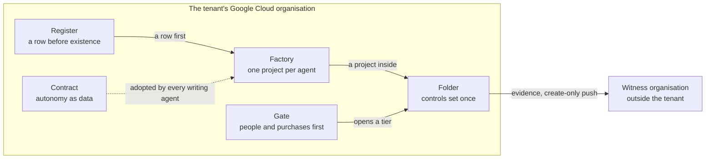

# Board and C-level presentation: the secure agentic platform

## Status
- Owner: the platform owner
- Last reviewed: 2026-09-18
- Who it is for: the board and the executive committee of the organisation, who fund, appoint and sign; expert in running the organisation, not in Google Cloud.
- What it asks of them: to appoint the people the platform cannot open without, to fund purchases whose quotes nobody has yet obtained, to accept eight residual risks in writing, the one signature that is the board's own ([the residual risks a sponsor accepts by signing](../brief/23-threat-model-and-residual-risk.md#the-residual-risks-a-sponsor-accepts-by-signing)), to make three other signatures possible by appointing their signatories, and to choose one of three ways to start. Nothing is built on 2026-09-18; no price is quoted; no regulator's or assessor's decision is promised.
- Format: seventeen slides and four backup slides, each with the notes the presenter says. The written version for the same audience is [the executive brief](executive-brief.md); the other documents of the set are listed in [the audiences README](README.md); the plain-language set is [../plain/README.md](../plain/README.md).

## Slide 1: What this asks of you

- Appoint the people; each tier of agents opens only when they exist
- Fund purchases nobody has quoted yet; start the long-lead ones now
- Make three signatures possible: the owner's two lists and purpose; a reviewer's deviation
- Accept eight residual risks in writing; row one is a tenant compromise
- Choose a start: three days, a proof of value, or the full build
- Nothing is built; no price is quoted; no regulator's decision is promised

> Notes: This deck asks five things; the last slide repeats them. First, people: a tier of agents cannot open until the humans it needs are named, so a signature without appointments buys a read-only platform. Second, money: no price exists anywhere in the design, because the pricing pages have not been read; what exists is a list of cost drivers, who pays each and who obtains the quote. Third, three signatures you make possible: the platform owner signs two lists and a declared purpose; a security reviewer signs the deviation record and the ISMS enters it, and those roles exist only once you appoint them. Fourth, the one signature that is the board's own: a written acceptance of eight residual risks, the first being that a stolen robot credential is a takeover of the organisation's Google Workspace. Fifth, a choice among three ways to start. Nothing has been built, and every date after 2026-09-24 is an assumption.

## Slide 2: Why now

- Objective of 2026-09-13: one secure environment; Wall-E does, Eve controls, Mo improves
- Wall-E holds Super Admin on a dedicated licensed user account (P33, decided)
- Hundreds of agents, future AGI-class agents, EU AI Act, TISAX
- Without a platform, each agent rebuilds its own security; nobody reviews it twice
- EU AI Act Articles 4, 5 and 50 bind already; penalties are real now
- The design declines "bulletproof" and AGI hosting in 2026; qualifies "any action"

> Notes: On 2026-09-13 the platform owner set the objective: a secure Gemini Enterprise environment, Google's enterprise assistant for which the organisation already holds licences, securing every agent, a program that uses a language model to decide what to do. On it, three agents: Wall-E, which does administrative work on a human's prompt through an account holding Super Admin, the Google Workspace role with every administrative power; Eve, which controls and reports Wall-E without that role; Mo, which improves both. It also asks for hundreds of agents, future agents of general capability, enterprise-class monitoring, the EU AI Act and TISAX, the automotive industry's information-security assessment. Two readings are declined: no design makes a regulator's decision "bulletproof"; agents of general capability get a closed tier. The urgency is legal as much as technical: three articles of the Act already apply to the organisation as deployer of the Gemini Enterprise assistant it already licenses, and to any agent from its first day.

## Slide 3: What is proposed, in one picture

> Notes: The platform is five things, not three agents. A folder in the organisation's Google Cloud hierarchy, where every control Google can enforce once is set where one person can own it. A factory, the pipeline that creates each agent's own project with identity, gateway, logging, budget and deny rules already in place. A register, one file in version control that every agent needs a row in before it may exist. A contract, the rules every writing agent adopts for autonomy, audit and measurement. And a gate, which lets a tier open only when the people and services it needs exist. Tiers are letters: C for assistants inside the Gemini Enterprise app, R for read-only agents, W for agents that write, P for agents holding a tenant-wide credential, with P-SA the single super-admin agent, and X, closed. Wall-E, Eve and Mo are the first tenants. The witness organisation is the one thing a super admin inside the tenant cannot reach.

## Slide 4: The central fact: nothing narrows a super admin

- Fact one: a service account cannot hold Super Admin; Wall-E is a user account
- Fact two: Super Admin cannot be limited to a unit or a privilege subset
- One enforcement point remains, the action service; Google's ceiling is the consented scopes
- A leaked token or interactive login is a tenant compromise reaching into Google Cloud
- Detection becomes the primary control; least privilege becomes a signed TISAX deviation
- The platform does not narrow a super admin; nothing in Workspace or Cloud can

> Notes: Two Google facts fix this slide, and neither is negotiable. A service account, the identity a program normally uses, can hold any Workspace administrative role except Super Admin, so Wall-E must be a licensed user account. And Super Admin cannot be limited to part of the organisation or a subset of its powers. The owner's decision removes Google's refusal as an enforcement point; what remains is the action service, the deterministic code that holds the credential and decides, and Google's ceiling is the permissions the credential was consented with. A leaked credential is therefore a whole-tenant compromise, with a route into the organisation's Google Cloud estate. Google's own guidance is that super admins are few, human and not for daily use; an assessor will cite it, and the design answers by confining the robot's daily use to the catalogue lane and the two-person lane. Decision P33 dates from 2026-09-13; the design builds around it, not against it.

## Slide 5: What makes the grant acceptable

- Thirteen compensations are preconditions of the grant, none deferred; four checklist rows more
- Three lanes: only the catalogue runs unattended; uncatalogued work needs two human super admins
- The model never holds a credential; two credentials in two services; no domain-wide delegation
- No super-admin-class operation is ever autonomous; a human approves each one
- The grant is a gate: it happens when the last checklist row is green
- Two rows red, or detection, hygiene or second-human row red: Super Admin removed

> Notes: The decision is acceptable to try because thirteen compensations are preconditions of the grant, each with an owner, a verification and a failure rule; none is deferred. Among them: three lanes decided by code, of which only the catalogue of typed operations can ever run without a human, while uncatalogued requests need two different human super admins and console-only work goes to a human; two signed lists of what is refused everywhere and what needs two people; two credentials in two services, so the broad one is never used unattended; Google's multi-party approval switched on; kill switches K0 to K7; and a second human outside Wall-E's administration line. The grant is a gate with a checklist, not a runbook step. Afterwards, three named rows turning red, or two rows at once, make the on-duty human super admin remove the role until green. Domain-wide delegation, a Workspace mechanism letting a program act as any user, is granted to nothing, ever.

## Slide 6: Eve, stated honestly

- Eve's control path holds no model, by construction; it halts over plain REST
- Eve holds a read-only role, never Super Admin; it watches every human super admin
- Inside the organisation a super admin can reach Eve: independence there is detective
- Outside, the witness organisation holds evidence, incident record and pager: that is structural
- The witness sees Eve's deletion within fifteen minutes, not a forged approval
- Eve's control path relocates to the witness later (P15); not a grant condition

> Notes: Eve has two paths. The control path, which approves, vetoes, halts and demotes, contains no language model by construction: the model service is denied at project level and the build refuses an image containing a model client. A separate reporting path may reason about findings, but writes only reports and pages, and nothing it writes is read by any gate. A Workspace super admin can grant itself the top role on the organisation's Google Cloud estate, so nothing inside that estate is structurally beyond its reach, Eve included. Inside, Eve's independence is detective: a super admin could redeploy Eve, and only detection would see it. What leaves is structural: Eve pushes its evidence, incident record and heartbeat to a witness organisation, a separate Google organisation run by two people from IT security outside the Wall-E line. Its absence alarm sees Eve's deletion within fifteen minutes. It does not see a forged approval; only the end state closes that.

## Slide 7: How it can stop

- End of Stage 1: a dated stop-or-continue review; a negative balance stops the programme
- L3, a human approving each action, is a legitimate permanent end state
- Kill switches K0 to K7: halt writes, remove Super Admin, stop the fleet
- Silence is a halt: a quiet log pipeline halts the super-admin lanes
- The proof of value ends at a dated stop-or-continue record; nothing torn down
- The three-day build unwinds the same day, signed

> Notes: Two exits are deliberate in the design. At the end of Stage 1, Wall-E's first writing stage, a dated review sets the toil saved plus the projected saving at Stage 3 against the operating cost including human hours, and stops the programme if the balance is negative. And L3, the autonomy level at which a human approves each action, is a legitimate permanent end state: Eve's approval layer is not to be funded until a promotion can state how much approval work it removes. A signature is not a commitment to full autonomy. Then the kill switches: K0 halts writes in under sixty seconds; K6, a human removing Super Admin from the robot within sixty minutes, is the one switch that survives a token already issued; K7 stops every agent at once and is drilled monthly. If the log pipeline goes silent, the super-admin lanes halt until a human clears it. Each smaller start path has its own exit.

## Slide 8: The money

| Cost | Driver | Paid by |
|---|---|---|
| Security Command Center Premium, from Tier C | organisation-wide findings service | IT security (`Assumption:` a platform line until then) |
| Central log ingestion and locked retention, from Tier R | Workspace audit volume, the largest line | the platform |
| Google SecOps with managed detection, from Tier P | events per day, retention, retainer | IT security |
| The witness organisation, from Tier P | one tenant, project, bucket, dataset, channels, two keys | IT security |
| Licences, hardware keys, Chrome Enterprise Premium (one licence per operator and approver) | one Workspace licence per Tier P agent; 22 or 26 keys | agent owner; the platform; procurement |
| Human hours, every tier | the roles on slide 9 | the binding cost |

> Notes: No price is quoted anywhere in the design, and none is quoted here: the pricing pages have not been read, every amount is still to be set, and the design names each cost's driver and payer instead. The largest Google line is central log ingestion, driven by the volume of Workspace audit logs; it cannot be cut by keeping less evidence, because reconciliation needs Google's record of all administrative activity, not only the robot's. Google SecOps, Google's security monitoring service, with a managed detection and response retainer, an outside service watching round the clock, arrives at Tier P and takes months to contract, an assumption. The cost that binds is human hours. The agents' own estimates are all assumptions, and Eve's predates the witness. No benefit figure exists either: the saving is unknown until four weeks of toil on the top three administrative tasks are measured before Wall-E's first phase, because no "before" can be measured afterwards.

## Slide 9: The people you must appoint

| Tier or gate | Distinct humans | Who is added |
|---|---|---|
| Tier C and Tier R | 1 | nobody new; self-review recorded as such |
| Tier W, the first write | 3 | second operator (about 2 h/week); security reviewer from IT security (about 2 h/month); blind grader (about 1 h/week per agent) |
| The super-admin grant | 5 named, or 4 with a dated ISMS exception | second human super admin outside the Wall-E line, as Eve's owner; incident commander; engaged DPO; AI compliance owner with a deputy |
| Stage 3, autonomous catalogue work | 4 plus a bought 24x7 desk | the detection desk that acknowledges within target |
| Steady-state super admins | exactly 3 | two human admin accounts and `walle@`; the robot never the recovery one |

> Notes: On 2026-09-13 the platform's organisation is one administrator: no security operations centre, no second super admin outside that administrator's line, no security reviewer, no Eve owner, no engaged data protection officer. Every role is one person, the finding most likely to stop a TISAX assessment. Tier W adds three part-time roles measured in hours. The grant adds a second human super admin from IT security outside Wall-E's administration line, who owns Eve, receives every page and alone receives reports about the administrator's own actions. The AI compliance owner is legal's designate, accountable for classifications and registrations. No hours figure exists for the grant roles; the full build's file table produces one. The setup procedures raise the grant to five named humans, or four with a dated exception from the information security management system. A person without a training record for the current stage is not counted. Fund the build but not the people, and you get a read-only platform.

## Slide 10: Employees, the DPO and the works council

- Eve monitors the human super admins from its first run: that is employee monitoring
- A DPO record and HR's works-council answer come before Eve's first stream
- Stage 0 reads every employee's directory data; the DPIA precedes it, the DPO deciding
- Suspension only after HR or a named operator decided; restoring stays human-approved
- Jurisdiction unknown (`Assumption:`); consultation or consent may be required, not information
- The works-council question is the longest lead item; it goes out on day one

> Notes: Employees are data subjects four times over: every account holder, read from Stage 0; suspension and licence targets; operators and approvers, whose prompts are logged; and the human super administrators Eve watches from its first run. That last is workplace monitoring under the GDPR, so the data protection officer's signed record and HR's written answer on the works council, the employees' elected representatives, come before Eve's first stream. The data protection impact assessment, the DPO's programme, precedes the processing it covers, as [the cross-check review of 2026-09-18](../14-crosscheck-review.md#5-the-path-to-the-regulation), section 5, asks; complete or only started at the grant, the DPO and the owner decide. The site's country is not fixed, so whether the council is informed, consulted or must consent is unknown; the pages default to information with a consultation record where law requires it; the review asks for consultation by default, and consent where co-determination applies. Wall-E suspends only after HR or a named operator decided; restoring is human-approved.

## Slide 11: The EU AI Act

- Classification follows the declared purpose, the catalogue, not the account's privilege
- Wall-E: adjacent to Annex III 4(b); narrow-task derogation claimed; registered before its first write
- Articles 4, 5 and 50 bind now; Annex III high-risk obligations from 2027-12-02
- Classification guidelines still draft on 2026-09-18; the assessment re-runs within 90 days of final
- Super Admin is the fact most likely held against the narrow reading
- Not promised: a regulator's reading; no harmonised standard, so no presumption of conformity

> Notes: The Act classifies a system by what its provider says it is for, not by what its account could do. Wall-E's declared purpose is its catalogue of administrative chores, executed only after a human or an HR event has decided. That sits next to, not inside, the high-risk category for systems taking decisions about workers, so the design claims the Act's exemption for narrow procedural tasks, writes the assessment down before the first write, registers it in the EU database and builds to the high-risk standard anyway. The dates re-verify on 2026-09-18: general application since 2026-08-02, high-risk obligations deferred to 2027-12-02 by the Digital Omnibus, the classification guidelines still a draft. What cannot be promised: the exemption is claimed against draft guidelines, no harmonised standard is cited, and an account that can do everything is the fact an authority is most likely to hold against the narrow reading. Eve's control path is not an AI system.

## Slide 12: TISAX

- Target Confidential at AL2, remote evidence review with interview (`Assumption:`); a site earns it
- The robot's Super Admin deviates from control 4.2.1; a signed record with three signatories
- ISA2027 governs assessments ordered from 2027-01-01; ISA 6 orders end 2026-12-31
- One person in every role is the finding most likely to stop an assessment
- Nothing built in 2026 reaches maturity 3; the ISMS decides the cut-off by 2026-12-01
- Not promised: an assessor may refuse maturity 3 on least privilege despite the compensations

> Notes: TISAX is the automotive industry's information-security assessment, governed by the ENX Association; a label is earned by a site, and this platform is made assessable inside that site at maturity 3, the "established" level, on every applicable control. The catalogue changes on 2027-01-01: assessments ordered from then use ISA2027, and the last day to order under the current catalogue is 2026-12-31. Nothing built in 2026 can reach maturity 3, so the information security management system should decide by 2026-12-01 whether any site assessment is ordered under the old catalogue and, if so, list the platform out of scope. A machine account holding Super Admin cannot be scoped, so the least-privilege control is deviated from in a signed record: the platform owner decides, a security reviewer who is not the owner signs, and the ISMS enters it in the risk register; it is reviewed quarterly and re-signed at each stage. An assessor may still refuse; that cannot be promised away.

## Slide 13: Three ways to start

| Path | People and time | What it proves |
|---|---|---|
| The three-day build | two people, three business days, buys nothing | Eve live before any doer; forced dry run; two kill levers timed |
| The proof of value | three hands-on people, one engineer; 6 to 9 weeks to POV-1 (`Assumption:`) | Eve on every human super admin; a doer holding no admin role |
| The full build | thirteen appointments; 85 to 90 person-days; Stage 0 not before 2027-03 | the platform; Eve with a witness; the gated grant; Stage 0 |

> Notes: Three ways to start, and they chain: three-day, proof of value, full build, nothing torn down between them, every artefact bearing the full build's names. The three-day build is two people for three business days, Eve live before the doer exists; it is a demonstration of machinery under control, not compliance evidence and not a production grant, said to the sponsor before the demonstration. The proof of value runs Tiers C, R and W on the production tenant with a doer that holds no administrative role at all; Super Admin goes to no agent, ever. POV-1 ends 6 to 9 weeks after day one; POV-2 ends week 16 to 20 with a dedicated engineer, every figure an assumption; a sponsor told "three weeks" has been misled about both stages. Only the full build owns the grant, the sandbox tenant, the witness and every gate of the grant. Each path's never-claims are on slide A4 and in the appendix.

## Slide 14: The timeline, by gate

| When (`Assumption:` after 2026-09-24) | Gate or milestone | What must exist |
|---|---|---|
| 2026-09-21, day one | the DPO letter, the works-council question, the toil baseline, every purchase started | the platform owner alone |
| 2026-09-29 to 2026-10-27 | decisions and people signed | the appointments of slide 9 |
| 2026-11-10 to 2027-01-19 | Tier R open, then Tier C | Security Command Center Premium; nobody new |
| 2026-12-22 to 2027-01-19 | Eve's observe-and-report layer live over the human super admins | the DPO record; the witness; Eve's code |
| not before 2027-03 | the super-admin grant, then Stage 0 one to two weeks later | the SIEM and MDR contract; the penetration test; five named humans; the checklist green |
| 2027-12-02 | Annex III obligations bind; Wall-E's later stages straddle it | Stage 5 at least 27 to 38 weeks after Stage 0 |

> Notes: The platform does not open on a date; it opens gate by gate, and each gate is green only when its decisions, people, purchases and tests exist. Every date on this slide after 2026-09-24 is an earliest date and an assumption, taken from the full build's own critical path. What sets the calendar is not build effort, which is 85 to 90 person-days hands-on, but lead times: the works-council answer, the longest item in the plan; the security monitoring contract with round-the-clock acknowledgement, months, an assumption; the penetration test; the witness organisation; and the four-week toil baseline, which cannot be recovered later. The grant is bounded by those and cannot come before 2027-03. After it, Wall-E's stages are floors, not plans: a stage ends only when its exit criteria are met, so full autonomy on catalogued work is at least 27 to 38 weeks after Stage 0 begins, and only if every criterion is met first time.

## Slide 15: The risks you accept by signing

- A stolen robot credential is a tenant takeover; detection meets it, nothing prevents it
- Inside the organisation the controller watches a super admin but cannot structurally stop one
- The safety of the design depends on people who do not exist yet
- The robot's gate is one process; its build pipeline could rewrite it
- Manipulated content will reach the model; screening only detects; ceilings in code enforce
- The regulator and the assessor decide outcomes; some Google facts are unverified

> Notes: Eight residual risks are accepted by signing, in order of consequence. One: a stolen robot credential is a takeover of the Workspace tenant and a route into the cloud organisation; key custody, detection within minutes and people pulling switches meet it, nothing prevents it, and a token can keep working for up to an hour after suspension, an assumption. Two: inside the organisation Eve sees a super admin but cannot structurally stop one until the end state is built. Three: the design's safety depends on people not yet appointed; tiers stay closed until they are. Four: a compromised build pipeline is a compromised gate. Five: manipulated content will reach the model; screening is detection-grade. Six: the regulator and the assessor decide. Seven: a few Google facts are unverified and kept out of every safety argument. Eight: one region, one model family, some stores on Google-managed keys. Risk one's signature is pending, because the security reviewer role is unfilled.

## Slide 16: What you sign first

- The gate-counting rule: how an open decision with a working fallback counts
- P29, the two lists: what is refused everywhere, what needs two humans (the owner)
- P28, Wall-E's declared intended purpose, signed with legal
- P33 and P136, the deviation record: security reviewer signs, the ISMS enters it
- P68, the super-admin roster of exactly three, with the second human named
- P34, Eve's reporting path may reason: the Eve owner and the security reviewer

> Notes: The register of decisions holds 204 rows, of which one is decided: P33, that Wall-E holds Super Admin. Everything else is proposed by a page, open, or awaiting a test. Six items come first. The gate-counting rule, because read literally the register keeps gates red for reasons nobody can act on. The two lists, which fix what the robot refuses in every lane and what it reaches only with two human super admins. The declared intended purpose, one paragraph identical in five places, on which the EU AI Act position rests, signed with legal. The deviation record, which cannot be signed by its beneficiary: a security reviewer who is not the platform owner signs it, and the ISMS enters it, and neither role exists today. The roster, which needs the second human's name. And Eve's reporting path. Three of the six wait on people you appoint on slide 9; the rest are the owner's, one with legal.

## Slide 17: The ask, restated

- Appoint: a second operator, a security reviewer, a blind grader, then the grant roles
- Fund: quotes for the monitoring service, the witness, the penetration test, the keys
- Enable: the owner signs lists and purpose; a reviewer and ISMS sign the deviation
- Accept: the eight residual risks, in writing, row one pending a security reviewer
- Choose: three days, the proof of value, or the full build, this month
- Send on day one: the DPO letter and the works-council question

> Notes: The ask, in the order the platform can open. Appoint the three part-time Tier W roles now, and name the grant roles, above all the second human super admin outside the Wall-E line, because three of the six first signatures wait on them. Fund the quotes: nobody has priced the monitoring service, the witness organisation, the penetration test or the hardware keys, and each has a named role to obtain the figure. The platform owner signs the two lists and the purpose; the deviation record needs a security reviewer and an ISMS entry you make possible. Accept the eight risks in writing. Choose a start path this month, because the three-day build is planned for 2026-09-22 and the proof of value's day one for 2026-09-21, both assumptions. And send the data protection letter and the works-council question on day one: they are the longest item in the plan, and nothing that watches or touches an employee starts before the answers.

## Appendix

## Slide A1: The thirteen compensations, and the four rows the checklist adds

| Rows | Precondition of the grant, none deferred |
|---|---|
| 1 and 2 | three bands in code; the two lists signed (P29), hash recorded in the deviation file |
| 3 and 4 | two credentials in two services, `cloud-platform` never consented; the band-B requester rule |
| 5 | detection as the primary control: Eve live and drilled, the witness receiving, a SIEM with 24x7 acknowledgement |
| 6 and 7 | account hygiene with Workspace multi-party approval on; kill switches drilled, K6 rehearsed on the sandbox twin |
| 8, 9 and 10 | the perimeter with PAM on the deploy grant; a permanent ceiling; the lost role scoping replaced in code |
| 11, 12 and 13 | a second human outside the Wall-E line; the signed record P33; the EU AI Act position P28 |

> Notes: Each row is a condition the grant runbook reads, with a definition of green, a verifier and an owner. The checklist adds four rows beyond the thirteen: a penetration test with no open critical or high finding, the data protection impact assessment and the works-council information, a tabletop of the crisis scenario, and witnessed custody of the hardware keys. Every control is graded as either enforcement, meaning Google or the platform refuses the action, or detection, meaning the action happens and something independent sees it within a stated latency; nothing detection-grade stands alone in a safety argument. After the grant, any row turning red is a severity-2 finding with thirty days to restore it; two rows red at once, or row 5, 6 or 11 red at all, is severity 1 and the on-duty human super admin removes Super Admin from the robot until the row is green. The role exists only while its compensations do.

## Slide A2: The kill switches

| Switch | What it does | Who pulls it, and how fast |
|---|---|---|
| K0 | halts writes | any operator, Eve or a breaker; containment under 60 seconds |
| K1 and K2 | demotes one cell; stops new runs | K1 any operator, Eve or a breaker, as K0; K2 an operator with the cloud rights |
| K3 and K4 | cuts the agent off; revokes the credential at Google | K3 a project administrator; K4 any operator, one call to each service; a token already issued may work up to 60 minutes (`Assumption:`) |
| K5 | suspends the robot account or revokes the grant | a human super admin on the two-person rota, within 30 minutes of acknowledgement |
| K6 | removes Super Admin from the robot | a human only, within 60 minutes; the switch that survives a minted token |
| K7 | stops every agent at once | a human with the entitlement or a deterministic job on a severity-1 rule; never a model; drilled monthly |

> Notes: The switches are ordered from surgical to total. K0 halts writes at the endpoint in under five seconds and is the lever any operator or Eve can pull without approval. K4 makes the action service revoke its own refresh token at Google, but an access token already issued can stay valid for up to sixty minutes, an assumption. K6 is the one that survives that: a human super admin removes the role, and no token the robot holds outlives it. K7 is the fleet kill, living outside every agent project, applied by a human or by a deterministic job on a severity-1 rule, never by a model, with targets under sixty seconds for the first lever and under five minutes end to end; lifting it takes two humans. A machine-invocable lock-out of the robot account is deliberately not built, because a compromised monitor could pull it. Silence in the log pipeline is itself a halt.

## Slide A3: The register of decisions in one screen

| Rows | Count | State on 2026-09-18 |
|---|---|---|
| P1 to P34, the high-level design's own | 34 | 3 decided or closed (P33 decided); 9 proposed; 18 open; 4 spikes |
| P35 to P143, the detailed pages' | 109 | 107 proposed, 2 spikes; 11 carry an open dependency or an assumption |
| P144 to P191, the setup procedures' | 48 | all proposed, pending the owner's signature |
| P192 to P204, the proof of value's | 13 | all proposed; 6 POV-only, 6 binding on the full build, P204 mixed |
| Total | 204 | one row decided by the owner |
| Keeping the grant red | — | open P7, P10, P14, P29; P33's deviation signatures |

> Notes: Every platform decision sits in one register in one sequence, and a decision has five states: decided, closed, proposed, open or spike. A proposed row stands until the owner overturns it in writing, so silence counts as consent; an open row keeps its gate red; a spike is answered by a test on a throwaway resource. The register is grouped by the gate each row blocks: before the platform folder exists, before any writing agent writes, before the super-admin grant, before Wall-E's first write, and later. The grant is kept red today by four open rows and by the deviation's missing signatures: the Admin console access level, the monitoring service and its partner, the witness organisation, and the two lists. Who must answer each is a role, not a person. No program answers a row; raising a level, widening a scope and answering a decision are human acts, recorded by hand.

## Slide A4: The three build paths, compared

| | The three-day build | The proof of value | The full build |
|---|---|---|---|
| People | two, both super admins, plus a sponsor | three hands-on, one engineer, named approvers | thirteen appointments |
| Time, effort, purchases | three business days, six person-days; buys nothing | 60 to 90 person- and engineer-days; POV-1 ends 6 to 9 weeks after day one, POV-2 ends week 16 to 20 with a dedicated engineer; nothing bought on the critical path | 85 to 90 person-days; 6 to 7 months to Stage 0; thirteen purchase rows |
| The doer's privilege | one scoped privilege over four synthetic accounts | none; no admin role at all | Super Admin, under the gate |
| Eve | live before the doer; inside the administrators' reach | reports on every human super admin; no witness | with the witness; independent proof by the second human |
| Exit | same-day unwind, signed | dated stop-or-continue record | Stage 1 stop-or-continue review; L3 as an end state |
| Can never claim | super-admin safety; Eve's independence; Model Armor evidence; minutes saved | the same, plus that the doer does admin work; a tamper-proof audit | a regulator's or assessor's outcome |

> Notes: The three paths are one chain, not three options that exclude each other; each hands over to the next with nothing torn down, and a path that had to be torn down has failed. The three-day build buys nothing, signs no contract and leaves a run log, an audit table and Eve polling, or stopped and recorded. The proof of value is Track A only: Tiers C, R and W on the production tenant, Super Admin to no agent, and a doer whose model holds no credential and whose every action is written ahead to an audit dataset where alteration is detected by fingerprint. The full build is human-executed and alone owns the grant. In every path the standing constraints hold: no domain-wide delegation; the model holds no credential and cannot approve; a dry run never mutates; humans raise autonomy and machines lower it; Mo reaches production only through a merged pull request.

## The sentences never to be used

From the proof of value, verbatim, with its reasons: "1. 'Wall-E is safe as a super admin.' Nothing in Track A touches super-admin containment (G10, G11, G14, G20, Eve G-7 need Track B, §3). Nor may any report say or imply that the doer 'does admin work': it holds no Workspace admin role. 2. 'Eve is independent.' Independence in the design is structural (a witness organisation, a second tenant). The POV has neither (PV-D-03), and its Eve lives inside the reach of the administrators it watches. 3. 'Model Armor blocked the injection.' A probabilistic content screen is never a trust boundary, whatever its grade ([../01-hld.md](../01-hld.md) §0.2). It produced evidence." ([pov/README.md §1.2](../pov/README.md#12-never-to-be-used-in-any-report-slide-or-message-about-the-pov))

From the three-day build, verbatim, with its reasons: "1. 'Wall-E is safe as a super admin.' Nothing here touches super-admin containment. No agent holds Super Admin at any moment of the three days. 2. 'Eve is independent.' Independence in the design is structural: a witness organisation, a second tenant. This set has neither (C-01), and its Eve lives inside the reach of the administrators it watches. 3. 'Model Armor blocked the injection.' A probabilistic content screen is never a trust boundary. And nothing here exercises it: no step sends anything through the floor, so these three days produce **no Model Armor evidence at all**, only the floor settings themselves (C-22). 4. 'We saved `<n>` minutes of admin work.' The doer acted only on synthetic accounts. No human minute was saved, and Mo's scorecard says so in bold (C-07)." ([3-day/README.md §1.1](../3-day/README.md#11-never-to-be-used-in-any-report-slide-or-message))

For the full build and this deck, the phrase used in place of "bulletproof": the platform promises the mechanisms and the evidence, and lists what the regulator or the guidelines still decide ([10-eu-ai-act.md §6](../10-eu-ai-act.md#6-what-bulletproof-can-and-cannot-mean)).

## Where this is defined

- The objective and its sixteen requirements: [00-objective-review.md](../00-objective-review.md#1-the-objective); which are met, declined or qualified: [01-hld.md §0.6](../01-hld.md#06-traceability-the-objectives-sixteen-requirements-and-the-register-ids-not-cited-elsewhere).
- The platform as five things, and the tiers: [01-hld.md §0.1](../01-hld.md#01-thesis); [01-hld.md §11.1](../01-hld.md#111-tiers-and-mandatory-controls); [the tier gate](../01-hld.md#04-the-tier-gate-what-must-exist-before-a-tier-opens).
- The central fact, what it costs and what compensates: [01-hld.md "What this reverses and what it costs"](../01-hld.md#what-this-reverses-and-what-it-costs); [01-hld.md §13.1](../01-hld.md#131-wall-e--the-super-admin-singleton-in-tier-p-sa); [the checklist the gate reads](../11-tisax.md#63-compensations-as-preconditions--the-checklist-the-gate-reads); [what the platform does not do](../01-hld.md#16-what-the-platform-does-not-do).
- The decision P33 and its record: [decisions/2026-09-13-wall-e-holds-super-admin.md](../../../decisions/2026-09-13-wall-e-holds-super-admin.md); [12-open-decisions.md §4](../12-open-decisions.md#4-before-the-super-admin-grant).
- Eve's two paths and its independence: [01-hld.md §13.2](../01-hld.md#132-eve--independent-controller-two-paths-a-witness-outside-the-tenant-a-second-human); [eve/01-hld.md §1](../../eve/01-hld.md#1-eves-independence-detective-inside-the-organisation-structural-through-the-witness).
- Mo: [mo/01-hld.md](../../mo/01-hld.md#thesis); [01-hld.md §13.3](../01-hld.md#133-mo--improving-both-one-mo-per-platform-without-touching-eves-independence).
- The exits and the benefit that has no figure: [brief/02 "Why build it, and how the programme can stop"](../brief/02-executive-summary.md#why-build-it-and-how-the-programme-can-stop); the kill switches: [wall-e/ARCHITECTURE.md §4.6](../../wall-e/ARCHITECTURE.md#46-kill-switches); K7: [01-hld.md §11.4](../01-hld.md#114-the-fleet-kill-switch-k7-and-the-containment-primitives-for-the-top-tier).
- Money: [01-hld.md §0.5](../01-hld.md#05-cost-classes); [brief/29 "Cost"](../brief/29-roadmap-and-cost.md#cost-classes); [what is not yet priced](../brief/29-roadmap-and-cost.md#what-is-not-yet-priced); [setup/04 the purchase table](../setup/04-purchases-and-lead-times.md#1-the-purchase-table-longest-lead-time-first); [hardware keys](../setup/04-purchases-and-lead-times.md#4-hardware-keys-the-count-stated-once-and-the-inventory).
- People: [01-hld.md §0.3](../01-hld.md#03-who-exists-on-2026-09-13-and-the-roles-the-platform-needs); [11-tisax.md §7.1](../11-tisax.md#71-the-roles); [11-tisax.md §7.2](../11-tisax.md#72-the-minimum-per-stage); [setup/README §8](../setup/README.md#8-blocked-index); [P68, the roster](../12-open-decisions.md#4-before-the-super-admin-grant).
- Employees, the DPO and the works council: [brief/26](../brief/26-personal-data-and-employees.md#222-what-the-platform-owes-the-dpo-and-where-each-input-stands); [10-eu-ai-act.md §4.10](../10-eu-ai-act.md#410-art-267-2611-art-86--workers-and-the-explanation-path-p129); [the DPO record on monitoring administrators, P154 and P199](../12-open-decisions.md#6a-proposed-by-the-setup-procedures-p144p191); [11-tisax.md §11, the jurisdiction](../11-tisax.md#11-the-legal-and-contractual-register-p141).
- The EU AI Act: [10-eu-ai-act.md §0](../10-eu-ai-act.md#0-the-position-in-one-paragraph); [§1, the regulatory state](../10-eu-ai-act.md#1-the-regulatory-state-on-2026-09-13); [Wall-E's classification](../10-eu-ai-act.md#31-wall-e-wall-e); [what "bulletproof" can and cannot mean](../10-eu-ai-act.md#6-what-bulletproof-can-and-cannot-mean).
- TISAX: [11-tisax.md §0](../11-tisax.md#0-what-this-page-decides-in-one-paragraph); [§1, verified](../11-tisax.md#1-tisax-on-2026-09-13-verified); [§2, the target](../11-tisax.md#2-the-target--label-level-scope-catalogue-p133); [§6.2, the record](../11-tisax.md#62-the-record--decisions2026-09-13-wall-e-holds-super-adminmd); [§10, the risk register](../11-tisax.md#10-the-risk-register-p140).
- The three ways to start: [3-day/README.md](../3-day/README.md#status), [what three days cannot buy](../3-day/README.md#7-what-three-days-cannot-buy), [the unwind](../3-day/README.md#10-the-unwind-before-anything-real-is-touched); [pov/README.md](../pov/README.md#status), [the two stages and their dates](../pov/README.md#4-pov_stage_dates-the-two-stages), [the claim statement](../pov/README.md#11-pov_claim_statement); [setup/README.md](../setup/README.md#status), [the critical path](../setup/README.md#34-parallel-sittings-and-the-critical-path).
- The timeline by gate: [brief/29 "The register's gate groups are the roadmap"](../brief/29-roadmap-and-cost.md#the-registers-gate-groups-are-the-roadmap); [stage floors](../brief/29-roadmap-and-cost.md#stage-floors-across-the-three-agents); [day-one lead-time items](../brief/29-roadmap-and-cost.md#day-one-lead-time-items); [wall-e/05-autonomy-ladder.md, the grant](../../wall-e/05-autonomy-ladder.md#the-super-admin-grant--a-gate-not-a-stage).
- The risks accepted by signing: [brief/23](../brief/23-threat-model-and-residual-risk.md#the-residual-risks-a-sponsor-accepts-by-signing); [11-tisax.md §10](../11-tisax.md#10-the-risk-register-p140).
- What to sign first: [brief/30 "First actions"](../brief/30-decisions-awaiting-owner.md#first-actions); [the register in one screen](../12-open-decisions.md#0-the-register-in-one-screen); [how the register works](../12-open-decisions.md#1-how-this-register-works).
- The standing constraints: [01-hld.md, Status](../01-hld.md#status).
- The cross-check review of 2026-09-18, whose security verdict and regulatory path win over older statements: [section 4, Security](../14-crosscheck-review.md#4-security); [section 5, the path to the regulation](../14-crosscheck-review.md#5-the-path-to-the-regulation).
- The next documents for this audience: [the executive brief](executive-brief.md); [the security team's document](security-team.md); [compliance and regulation](compliance-and-regulation.md); [HR and the works council](hr-and-works-council.md); [enterprise architecture](enterprise-architecture.md); [the sales presentation](../pitch/sales-presentation.md); the plain-language set: [../plain/README.md](../plain/README.md).
