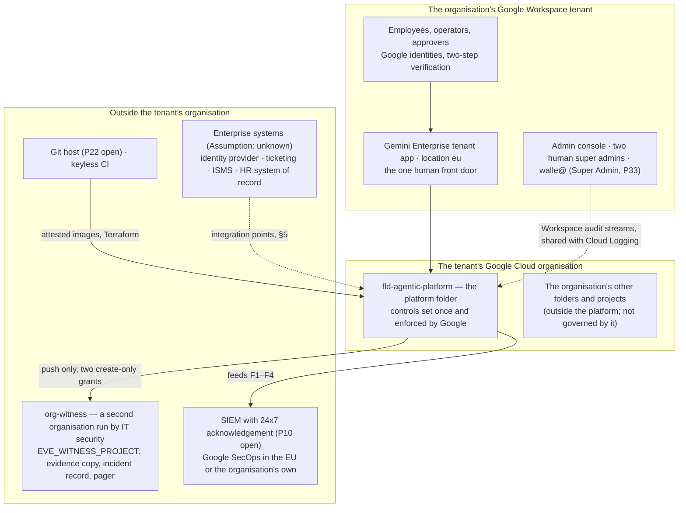
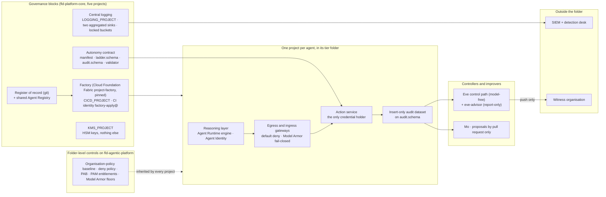

# The secure agentic platform, for enterprise architects

## Status

- Owner: the platform owner
- Last reviewed: 2026-09-18
- Who it is for: enterprise architects who own the organisation's application landscape, integration standards and technology roadmap, and who need to place this platform among the systems they already govern. The reader is expert in enterprise architecture, not in Google Cloud; every Google-specific term is defined the first time it appears.
- What it asks of them: to review the building blocks and the standards each sets, to confirm or correct the integration points marked `Assumption:` (identity provider, SIEM, ticketing, ISMS, works-council process), to record the organisation's positions on the open architectural decisions of §11, and to place the tier gates of §10 on the enterprise roadmap.
- Maturity: **nothing is built**. Every diagram, block, number and date below describes a design of something that does not exist on 2026-09-18 ([../README.md#status](../README.md#status)). No price is quoted anywhere in the design; where a figure does not exist, this document says so and names what would produce it.

## 1. Context: where the platform sits

The platform is a **folder** in the Google Cloud resource hierarchy of the organisation's Workspace tenant. Three terms first. A *Google Workspace tenant* is the organisation's Google account domain: its users, groups, mail and the Admin console that governs them. A *Google Cloud organisation* is the root of the cloud resource hierarchy that Google creates for that same tenant; it holds *folders*, and folders hold *projects*, the unit in which cloud services, identities and data live. *Gemini Enterprise* is Google's assistant application for employees; on this platform its one tenant app is the only human front door to every agent a human talks to ([../README.md#what-the-platform-is](../README.md#what-the-platform-is)).

Four facts fix the diagram. The platform governs only what sits under `fld-agentic-platform`; the organisation's other cloud workloads are outside its scope ([../02-landing-zone-and-tiers.md#22-every-folder-its-purpose-its-policy-additions-who-may-create-below-it](../02-landing-zone-and-tiers.md#22-every-folder-its-purpose-its-policy-additions-who-may-create-below-it)). The Workspace tenant is not a cloud project at all; the robot account `walle@` is a Workspace user, not a project resource ([../../project-topology.md#2-the-four-projects](../../project-topology.md#2-the-four-projects)). A Workspace super admin can grant itself the highest role on the cloud organisation, so nothing inside that organisation is structurally out of a super admin's reach; that is why the witness organisation exists outside it ([../../eve/01-hld.md#1-eves-independence-detective-inside-the-organisation-structural-through-the-witness](../../eve/01-hld.md#1-eves-independence-detective-inside-the-organisation-structural-through-the-witness)). And the region is fixed: `europe-west1` for services, `EU` for BigQuery, `eu` for the tenant app ([../../project-topology.md#2-the-four-projects](../../project-topology.md#2-the-four-projects)).

What the platform asks at the organisation node, outside its folder, because those are the changes that touch every other workload: Security Command Center Premium (Google's organisation-wide security findings service) enabled at organisation level ([../01-hld.md#05-cost-classes](../01-hld.md#05-cost-classes)); one aggregated Cloud Logging sink `S-org` at the organisation for the Workspace audit streams ([../08-data-logging-retention-sovereignty.md#31-what-one-sink-can-and-cannot-do-and-the-topology-that-follows](../08-data-logging-retention-sovereignty.md#31-what-one-sink-can-and-cannot-do-and-the-topology-that-follows)); the Workspace audit streams shared with Cloud Logging from the Admin console ([../07-monitoring-detection-incident-response.md#11-the-four-organisation-owned-feeds-and-where-each-lands](../07-monitoring-detection-incident-response.md#11-the-four-organisation-owned-feeds-and-where-each-lands)); organisation-level role grants and policy exceptions, approved by the organisation administrator and listed among the day-one lead-time items ([../brief/29-roadmap-and-cost.md#day-one-lead-time-items](../brief/29-roadmap-and-cost.md#day-one-lead-time-items)); and Access Transparency, verified enabled for the organisation at Stage 0, with Access Approval on the sensitive folders and the evidence projects (P111, [../12-open-decisions.md#3-before-any-tier-w-agent-writes](../12-open-decisions.md#3-before-any-tier-w-agent-writes)). Everything else, the exclusion of the registry API from every tier folder's allow-list included (§3.4), is set at the platform folder or below.

## 2. The platform in five things, and its building blocks

The design defines the platform as five things, of which the three agents are the first tenants, not the definition: **a folder** where every control Google can enforce once is set where one person can own it; **a factory** (a pipeline) that creates each agent's project with identity, gateway, logging, budget and deny rules in place; **a register** (one file in version control every agent needs a row in before it may exist); **a contract** (the rules every writing agent adopts for autonomy, audit and measurement); and **a gate** (a tier opens only when the people and services it needs exist) ([../01-hld.md#01-thesis](../01-hld.md#01-thesis)). "A read-only assistant costs a register row and a factory run. A super-admin robot costs a witness organisation, a second super admin, a bought detection desk and a signed deviation." (same section).

## 3. The building blocks and the standard each sets

Each block below is a standard every agent inherits, not a component built once for Wall-E. Every control in the design names its owner (a role), the resource it sits on, how it is verified and what happens when it fails; a control that cannot fill those four cells is not on the page ([../README.md#status](../README.md#status)).

### 3.1 Landing zone and folder tree

The platform folder holds eight child folders and no project directly; a project parented there is a finding. The core folder `fld-platform-core` holds the five core projects (`CORE_PROJECT`, `LOGGING_PROJECT`, `CICD_PROJECT`, `VALIDATOR_PROJECT`, `KMS_PROJECT`) and never an agent principal; `fld-gemini-enterprise` holds the tenant app's project, imported in place; the tier folders `fld-agents-r`, `-w`, `-p` (with `-p-sa` as a child) each have `-prod` and `-nonprod` children; `fld-agents-x` exists, empty and closed; `fld-controllers` and `fld-improvers` hold Eve's and Mo's shapes ([../02-landing-zone-and-tiers.md#21-the-tree](../02-landing-zone-and-tiers.md#21-the-tree)). The full design implies 22 folders ([../12-open-decisions.md#6b-proposed-by-the-proof-of-value-set-p192p204](../12-open-decisions.md#6b-proposed-by-the-proof-of-value-set-p192p204), P193). Depth is at most four folders below the organisation against Google's limit of ten levels and 300 child folders per parent. The witness organisation is never a child of the tenant's organisation.

The standard: the organisation-policy baseline is set once at the platform folder, in Terraform, drift-checked — residency in EU locations, keyless service accounts, no foreign principals beyond an enumerated list, no external IP addresses, no legacy TLS, Binary Authorization on the folders that hold credential holders, and a per-folder allow-list of usable services that is also the first fleet-kill lever ([../01-hld.md#33-organisation-policy-baseline-at-fld-agentic-platform](../01-hld.md#33-organisation-policy-baseline-at-fld-agentic-platform)). *Organisation policy* is Google's mechanism for constraints that apply to every resource under a folder regardless of what a project grants.

### 3.2 The factory and project-per-agent

One project per agent is forced by Google, not chosen: all Agent Runtime agents in one project and region must bind to the same gateway instances, and the documented cross-project role for the tenant app is project-wide ([../../project-topology.md#1-why-four-projects](../../project-topology.md#1-why-four-projects)). *Agent Runtime* is Google's managed service that hosts an agent's reasoning layer. The factory is one Terraform pipeline in `CICD_PROJECT`, run by the CI identity `factory-apply@` through Workload Identity Federation (no key) in a routine and a privileged phase; its only inputs are the agent's register row and manifest; it applies Cloud Foundation Fabric's `project-factory` module, pinned at v58.0.0 and re-pinned only by pull request, wrapped by three thin platform modules (`agent-project`, `verifier-project`, `improver-project`) plus `tenant-app` (the import) and `revoke` (retirement) ([../02-landing-zone-and-tiers.md#32-tooling-decision-p35-closing-hld-p2](../02-landing-zone-and-tiers.md#32-tooling-decision-p35-closing-hld-p2); [../01-hld.md#32-the-factory](../01-hld.md#32-the-factory)). Every run ends with a drift job reporting zero diff; standing `roles/owner` is removed after the run and humans get repair rights back only through Privileged Access Manager.

The standard: nothing below the platform folder is made by hand after Stage 0; a tier change is a new register row, a new project in the new tier's folder and a `revoke` of the old one — projects are never moved between tier folders, and only a human writes a tier ([../02-landing-zone-and-tiers.md#15-changing-tier-and-why-a-project-is-never-moved](../02-landing-zone-and-tiers.md#15-changing-tier-and-why-a-project-is-never-moved)). Nonprod is optional at Tier R and mandatory from Tier W; Tier P nonprod is a sandbox Workspace tenant, because Super Admin cannot be scoped to an organisational unit ([../02-landing-zone-and-tiers.md#35-the-non-production-split-p40](../02-landing-zone-and-tiers.md#35-the-non-production-split-p40)).

### 3.3 Naming and labels

Project ids follow `agp-<tiercode>-<agent>-<env>`, enforced by a custom organisation-policy constraint on the project-id prefix (Preview, not yet covered by Google's service terms); service accounts are `<agent>-<duty>@`; groups `<agent>-owners@`, `-operators@`, `-readers@`, `-users@`; gateways `<agent>-egress`, `<agent>-ingress`; datasets `<agent>_audit`, `<agent>_workspace_logs`, `<agent>_content`; secrets `<agent>-<purpose>` in `europe-west1` ([../02-landing-zone-and-tiers.md#36-naming-and-the-label-taxonomy-p37-p38](../02-landing-zone-and-tiers.md#36-naming-and-the-label-taxonomy-p37-p38)). Labels are required on every project and validated by the factory before creation: `agent`, `owner`, `tier`, `env`, `risk_class`, `data_class`, `ai_act_class`, `autonomy_ceiling`, `model_pin`, `verifier`, `recovery_class`, `cost_centre`, `created_by`, `factory_run`. Google's labels apply to projects only, so folder-level classification is a tag (`agp-tier`, `agp-env`, `agp-tisax-scope`), and a naming rule can be Google-enforced while a label rule cannot (same section). The existing handles `WALLE_PROJECT`, `EVE_PROJECT`, `MO_PROJECT`, `GEMINI_PROJECT`, `FOLDER_ID` stay as variables; every concrete project id is *tbd*.

### 3.4 The register of record and the Agent Registry

Four things are not each other: the **register** (one YAML file per agent in version control, merged under a two-reviewer rule, the inventory of record); the **registry** (Google's Agent Registry, a catalogue product written by CI from the register and never by an agent owner); **independent observation** (Cloud Asset Inventory, Security Command Center's AI asset inventory, the tenant app's agent list); and the **manifest** (`agent-manifest.yaml`, what the agent is allowed to be) ([../05-registry-and-autonomy-contract.md#1-vocabulary-four-things-that-are-not-each-other](../05-registry-and-autonomy-contract.md#1-vocabulary-four-things-that-are-not-each-other)). The rule under all of it: **registration never authorises**; a card lets a peer find an agent, reaching it still needs the resource-level grant, the gateway entry and the access-policy binding. The registry is one shared instance in `CORE_PROJECT`, `europe-west1`, with the registry API excluded from every tier folder so no local registry can exist; its default quota is 100 entries per type per project, with an increase requested at 60 % occupancy and per-tier sharding as the recorded fallback ([../05-registry-and-autonomy-contract.md#22-options-and-the-decision-p71](../05-registry-and-autonomy-contract.md#22-options-and-the-decision-p71)). Agents reach tools over MCP (Model Context Protocol, the protocol by which an agent calls tools) and peer agents over A2A (Agent2Agent, the protocol by which agents call each other), only through the project's gateways; a card in the registry lets a peer find an agent, and reaching it still needs the resource-level grant, the gateway entry and the access-policy binding ([../01-hld.md#111-tiers-and-mandatory-controls](../01-hld.md#111-tiers-and-mandatory-controls); [../05-registry-and-autonomy-contract.md#1-vocabulary-four-things-that-are-not-each-other](../05-registry-and-autonomy-contract.md#1-vocabulary-four-things-that-are-not-each-other)).

The standard: "registered ⇒ feeding the SIEM" is a continuous invariant with a silence budget per tier — 24 hours at C and R, 4 hours at W, 15 minutes at P ([../05-registry-and-autonomy-contract.md#5-the-invariant-registered--feeding-the-siem](../05-registry-and-autonomy-contract.md#5-the-invariant-registered--feeding-the-siem); [../12-open-decisions.md#3-before-any-tier-w-agent-writes](../12-open-decisions.md#3-before-any-tier-w-agent-writes), P74). The admission gate refuses `status: prod` without an EU AI Act class, role and signed purpose and, per class, the Art. 6(4) assessment and the Art. 49 registration id ([../05-registry-and-autonomy-contract.md#82-eu-ai-act-registration-art-64-art-49-art-71--p75](../05-registry-and-autonomy-contract.md#82-eu-ai-act-registration-art-64-art-49-art-71--p75)).

### 3.5 The autonomy contract and its schemas

Four artefacts carry one semantic `contract_version`: `agent-manifest.yaml` (families, ceilings, egress, peers, stores), `ladder.yaml` on `ladder.schema` (the per-operation autonomy level, six levels L0–L5), `<agent_id>_audit` on `audit.schema` (a write-ahead, insert-only BigQuery dataset in the agent's project), and the platform validator in `VALIDATOR_PROJECT` that recomputes every promotion's evidence ([../05-registry-and-autonomy-contract.md#91-four-artefacts-one-version-p76](../05-registry-and-autonomy-contract.md#91-four-artefacts-one-version-p76)). The validator accepts major versions N and N−1 for 90 days; the audit schema takes additive changes only.

The standard: autonomy is data; **humans raise autonomy and machines lower it**; a promotion is a pull request with evidence a validator recomputes; platform defaults may only be tightened by an agent ([../01-hld.md#12-the-autonomy-contract](../01-hld.md#12-the-autonomy-contract)). A *dry run* never mutates, even when handed a valid approval.

### 3.6 Agent identity and privileged access

Every reasoning layer runs under *Agent Identity*, a keyless Google-issued identity with 24-hour certificates; the engine's service-account field is unset and CI refuses an engine without it ([../04-identity-and-privileged-access.md#21-agent-identity-for-every-reasoning-layer-promotes-wall-e12-1](../04-identity-and-privileged-access.md#21-agent-identity-for-every-reasoning-layer-promotes-wall-e12-1)). Three ceilings sit outside any agent's process: a folder *deny policy* (`deny-agents-platform`, permission names verified, the agent principal-set spelling still a spike), a *Principal Access Boundary* (`pab-agents`, which fences the resource families it is verified to fence and is not counted for Cloud Run invocation), and *Privileged Access Manager* (PAM), Google's time-boxed elevation service: no human holds a standing owner role anywhere; the catalogue's entitlements run from 30 minutes to 2 hours against Google's floor of 30 minutes and ceiling of 7 days, and Google enforces that a requester cannot approve their own request ([../04-identity-and-privileged-access.md#3-the-folder-deny-policy-deny-agents-platform-with-verified-permission-names](../04-identity-and-privileged-access.md#3-the-folder-deny-policy-deny-agents-platform-with-verified-permission-names); [../04-identity-and-privileged-access.md#52-the-catalogue](../04-identity-and-privileged-access.md#52-the-catalogue)).

The standing constraints, restated exactly: **no domain-wide delegation, ever; no model holds a credential or produces an approval, a signature, a halt, a veto or a refusal; the action service is the only credential holder; a dry run never mutates; humans raise autonomy and machines lower it; Mo reaches production only through a merged pull request** ([../01-hld.md#status](../01-hld.md#status)). Wall-E's Super Admin is the owner's decision of 2026-09-13 (P33), designed around and not re-argued here; its consequence for architecture is that the Workspace-side gate is lost, the consented OAuth scope set is the only Google-enforced ceiling left, and detection is the primary control for the super-admin tier ([../01-hld.md#what-this-reverses-and-what-it-costs](../01-hld.md#what-this-reverses-and-what-it-costs)).

### 3.7 Gateways and Model Armor

Every engine above Tier C is bound to its project's *egress gateway* (Google's Agent Gateway, a managed proxy allowing only listed destinations), whose access policy is default-deny and generated from the manifest; every machine-called engine sits behind an *ingress gateway* whose *Model Armor* extension (Google's prompt and response screen) is fail-closed. Model Armor is governed as a floor hierarchy (organisation, platform folder, tier folder, project) and as a template standard per tier ([../06-gateways-model-armor-perimeter.md#0-the-three-rules-in-one-paragraph](../06-gateways-model-armor-perimeter.md#0-the-three-rules-in-one-paragraph)). The standard's honesty line: a probabilistic content screen is never a trust boundary, whatever its grade; it produces evidence ([../01-hld.md#02-the-six-containment-primitives-and-how-each-is-graded](../01-hld.md#02-the-six-containment-primitives-and-how-each-is-graded)). The perimeter is two decisions in order: "credential holders are never internet-reachable" as a folder policy applied when the engine-reach spike passes, and VPC Service Controls (a network perimeter around Google APIs) per tier folder as the backstop after a second spike; gateways at Tier W and above are created perimeter-ready from the first production deploy ([../06-gateways-model-armor-perimeter.md#42-the-decision-restated-with-what-this-page-adds](../06-gateways-model-armor-perimeter.md#42-the-decision-restated-with-what-this-page-adds)).

### 3.8 Central logging and retention

Two aggregated Cloud Logging sinks — `S-org` at the organisation for the Workspace audit streams and `S-folder` over the platform folder with children — land in `LOGGING_PROJECT`, then fan out to a locked `europe-west1` evidence bucket, an identity bucket and a BigQuery dataset; per-agent access is a log view, never a per-agent organisation sink ([../08-data-logging-retention-sovereignty.md#31-what-one-sink-can-and-cannot-do-and-the-topology-that-follows](../08-data-logging-retention-sovereignty.md#31-what-one-sink-can-and-cannot-do-and-the-topology-that-follows)). Six data classes, each implying one retention line, one reader pattern and one integrity mechanism (the page's heading says five): `evidence`, `content`, `control`, `record`, `secret`, `ops` ([../08-data-logging-retention-sovereignty.md#21-the-five-data-classes](../08-data-logging-retention-sovereignty.md#21-the-five-data-classes)). Locked stores are created unlocked at the floor and locked on the day the DPO's ceiling is recorded, never before, because a lock cannot be shortened ([../08-data-logging-retention-sovereignty.md#51-floor-ceiling-and-the-lock-trigger](../08-data-logging-retention-sovereignty.md#51-floor-ceiling-and-the-lock-trigger)).

### 3.9 SIEM and detections

Four organisation-owned feeds reach the SIEM without domain-wide delegation or a service-account key: Workspace's native export, the aggregated sinks, Security Command Center findings, and agent-layer metadata over Pub/Sub (Google's messaging service) — ids, reason codes and hashes, never prompt or payload ([../07-monitoring-detection-incident-response.md#11-the-four-organisation-owned-feeds-and-where-each-lands](../07-monitoring-detection-incident-response.md#11-the-four-organisation-owned-feeds-and-where-each-lands)). Any SIEM must meet a nine-clause contract S1–S9 (EU residency, retention at or above 400 days, the four feeds, detection-as-code, cases, a 24x7 desk, an outbound REST call to the fleet-kill job, four entity types, reader access the platform does not administer); the default the factory provisions if IT security has not chosen is an own Google SecOps instance in the Europe multi-region ([../07-monitoring-detection-incident-response.md#21-why-the-decision-is-a-contract-first](../07-monitoring-detection-incident-response.md#21-why-the-decision-is-a-contract-first)). The detection catalogue is code with a fixture per rule as a merge condition; silence is a halt (`log_pipeline_silent`), cleared by one human call ([../07-monitoring-detection-incident-response.md#7-pipeline-heartbeats-and-the-log_pipeline_silent-halt](../07-monitoring-detection-incident-response.md#7-pipeline-heartbeats-and-the-log_pipeline_silent-halt)). The platform does not run a SOC; it buys acknowledgement for Tier P and runs Google's detections for the rest ([../01-hld.md#16-what-the-platform-does-not-do](../01-hld.md#16-what-the-platform-does-not-do)).

### 3.10 Supply chain and keys

Nothing runs that the platform did not build, scan and attest: Cloud Build in `CICD_PROJECT` with SLSA Build Level 3 provenance (SLSA, a provenance standard proving what built an image), a shared Artifact Registry whose upstreams are remote repositories, a vulnerability gate, *Binary Authorization* (Google's admission control that refuses an unattested container) on every Cloud Run service from Tier W up, and — because Binary Authorization has no admission hook on Agent Runtime — engines deployed from the same attested digest with the drift job comparing running and attested digests ([../09-supply-chain-secrets-recovery.md#11-the-path-from-commit-to-running-digest](../09-supply-chain-secrets-recovery.md#11-the-path-from-commit-to-running-digest)). Keys are HSM everywhere by folder constraint, in a dedicated key project holding keys and nothing else; approval keys are disabled, never destroyed, inside the evidence horizon ([../09-supply-chain-secrets-recovery.md#23-keys-hsm-everywhere-by-policy-and-the-three-kms-constraints](../09-supply-chain-secrets-recovery.md#23-keys-hsm-everywhere-by-policy-and-the-three-kms-constraints)). The standard: **Mo reaches production only through a merged pull request**; the agent never writes to a repository, a registry, a deploy identity, its own ladder or its own ceilings.

### 3.11 The witness organisation

Eve's evidence, incident record and pager leave the tenant's organisation to `org-witness`, a second organisation on a separate, minimal Cloud Identity tenant (P14, open; `Assumption:` Cloud Identity Free on a distinct domain) whose two super admins are IT security people outside the Wall-E line. The witness receives a push, never a pull, through exactly two create-only grants; no witness principal holds any grant in the tenant's organisation ([../../eve/01-hld.md#1-eves-independence-detective-inside-the-organisation-structural-through-the-witness](../../eve/01-hld.md#1-eves-independence-detective-inside-the-organisation-structural-through-the-witness)). Honestly stated: inside the organisation Eve's independence is **detective, not structural**; only what leaves is structural; the witness sees the deletion of `EVE_PROJECT` within fifteen minutes and the absence of evidence, and does not see the forgery of an approval. The end state that closes that gap — relocating Eve's control path to the witness — is P15, dated now and built later, gating Tier X and not the grant ([../12-open-decisions.md#6-later](../12-open-decisions.md#6-later)).

## 4. The tier model as an architecture principle

The tier is the unit of everything: folder, factory module, monitoring baseline, metric pack, staffing and compliance gate; a future AGI agent is a tier, not a new design ([../01-hld.md#11-the-tier-model](../01-hld.md#11-the-tier-model)). Tiers are letters, never numbers, so they never collide with the ladder's trigger classes T0–T3 ([../02-landing-zone-and-tiers.md#11-letters-not-numbers-and-how-the-briefs-t0tx-map](../02-landing-zone-and-tiers.md#11-letters-not-numbers-and-how-the-briefs-t0tx-map)).

| Tier | What it is | Own project | Verifier | Opens when | Added people |
|---|---|---|---|---|---|
| **C** classical | Gemini Enterprise no-code and data-store agents, retrieval only, the user's own permissions | none | none | the register and the tenant-app baseline (runbook step GE-14) | nobody new |
| **R** read tools | an Agent Runtime agent with read-only tools through the gateway | yes | none | factory, folder baseline, central logging, shared registry | nobody new |
| **W** write agents | writes to a system of record through an action service | yes | platform verifier | the contract, the verifier, a validator custodian, the nonprod folder, one restore drill; works-council information before Stage 1 for agents acting on employee accounts | second operator, part-time security reviewer, blind grader |
| **P** privileged / **P-SA** singleton | the action service holds a tenant-level credential (P-SA: Super Admin) | yes | a dedicated Eve | everything in W plus every precondition of the super-admin grant | second human super admin outside the Wall-E line, DPO engagement, incident commander |
| **X** AGI-class | capabilities beyond the designers' foresight; code execution | folder exists, empty | model-free monitor plus a second model family | **not open** until the conditions of HLD §11.5 hold | an AI-safety reviewer who does not exist |

([../01-hld.md#04-the-tier-gate-what-must-exist-before-a-tier-opens](../01-hld.md#04-the-tier-gate-what-must-exist-before-a-tier-opens); [../01-hld.md#111-tiers-and-mandatory-controls](../01-hld.md#111-tiers-and-mandatory-controls))

Two principles follow. Every control is graded **enforcement** (Google or the platform refuses the action) or **detection** (the action happens and something independent sees it within a stated latency), and nothing detection-grade may stand alone in a safety argument; the six containment primitives CP1–CP6 are the template every agent inherits, five enforcement-grade and one (evidence) detection with an absence alarm ([../01-hld.md#02-the-six-containment-primitives-and-how-each-is-graded](../01-hld.md#02-the-six-containment-primitives-and-how-each-is-graded)). And every agent inherits seven trust boundaries B1–B7, each with a platform mechanism, an agent-code addition, a grade and the tier from which it is mandatory ([../01-hld.md#15-trust-boundaries--the-template-every-agent-inherits](../01-hld.md#15-trust-boundaries--the-template-every-agent-inherits)). Exactly one agent may hold `privilege: super_admin`; a second such register row fails CI until the first is retired ([../01-hld.md#113-p-sa-the-super-admin-singleton](../01-hld.md#113-p-sa-the-super-admin-singleton)).

## 5. Integration points with what the enterprise already has

The organisation's systems are unknown to the design; each row below is marked accordingly. What exists on 2026-09-13 is one administrator, no SOC, no second super admin outside the administrator's line, no security reviewer, no Eve owner, no DPO engaged and no ISMS names supplied ([../01-hld.md#03-who-exists-on-2026-09-13-and-the-roles-the-platform-needs](../01-hld.md#03-who-exists-on-2026-09-13-and-the-roles-the-platform-needs)).

| Enterprise system | The design's position | What it asks of the architect |
|---|---|---|
| Identity provider | Google Identity for the tenant app's `eu` location (P51); if the tenant federates Workspace to a SAML identity provider, that is upstream and changes nothing on the platform; a workforce pool is "no" for the app and open only for an operator population without Google accounts (P24) ([../03-gemini-enterprise-environment.md#6-identity-provider-and-sso-p51](../03-gemini-enterprise-environment.md#6-identity-provider-and-sso-p51)) | `Assumption:` the identity provider is unknown. Confirm whether Workspace is federated and whether any operator lacks a Google account |
| SIEM and detection desk | the organisation's SIEM or an own SecOps instance, chosen by IT security against contract S1–S9 (P10, open); an MDR retainer with 24x7 acknowledgement for the super-admin detection set; if the organisation has a SOC, the platform feeds it ([../07-monitoring-detection-incident-response.md#22-the-default-an-own-google-secops-instance](../07-monitoring-detection-incident-response.md#22-the-default-an-own-google-secops-instance)) | `Assumption:` no SOC exists on 2026-09-13; confirm the SIEM's residency, retention and outbound-call capability against S1–S9 |
| Ticketing and on-call | the organisation's incident and on-call tool if IT security operates one with 24x7 paging, otherwise PagerDuty (P99); every PAM justification carries a ticket or incident id ([../07-monitoring-detection-incident-response.md#92-the-on-call-tool-escalation-and-acknowledgement-targets](../07-monitoring-detection-incident-response.md#92-the-on-call-tool-escalation-and-acknowledgement-targets)) | `Assumption:` the ticketing and paging tools are unknown; name them or accept the default |
| ISMS | names the role holders, enters the super-admin deviation in the site's risk register, owns the classification scheme (*tbd*) and orders the TISAX assessment ([../11-tisax.md#2-the-target--label-level-scope-catalogue-p133](../11-tisax.md#2-the-target--label-level-scope-catalogue-p133)) | `Assumption:` whether an ISMS exists and which site's it is are unknown |
| Works-council process | HR carries the question; information (or consultation, where national law requires) before Stage 1 of any Tier W agent acting on employee accounts, and a precondition of the grant (P129) ([../10-eu-ai-act.md#410-art-267-2611-art-86--workers-and-the-explanation-path-p129](../10-eu-ai-act.md#410-art-267-2611-art-86--workers-and-the-explanation-path-p129)); because Eve's monitoring of administrators and the identity log store are workplace monitoring from their first stream, this set treats the trigger as before Eve's first stream ([../12-open-decisions.md#6a-proposed-by-the-setup-procedures-p144p191](../12-open-decisions.md#6a-proposed-by-the-setup-procedures-p144p191), P154; [the cross-check review of 2026-09-18](../14-crosscheck-review.md#5-the-path-to-the-regulation), section 5) | `Assumption:` the jurisdiction and the council's legal basis are unknown; no document may name a country |
| HR system of record | the only source of the event that may trigger an autonomous suspension (F5 at L4 on the T2 event, vetoable hold, never expiring outside business hours) ([../10-eu-ai-act.md#312-annex-iii-4b-family-by-family](../10-eu-ai-act.md#312-annex-iii-4b-family-by-family)) | `Assumption:` the HR system and its event interface are unknown |
| Git host | *tbd* (P22, open); Workload Identity Federation supports GitHub Actions, GitLab SaaS, Azure DevOps and HCP Terraform; branch protection with code owners is the enforcement behind "Mo reaches production only through a merged pull request" ([../02-landing-zone-and-tiers.md#34-the-ci-identity-and-the-two-phase-apply-p36](../02-landing-zone-and-tiers.md#34-the-ci-identity-and-the-two-phase-apply-p36)) | choose the host; confirm admin-bypass audit |
| Billing and procurement | a dedicated platform billing account in EUR and a project-quota request for about 20 projects; thirteen purchase rows with owners, none priced ([../setup/04-purchases-and-lead-times.md#1-the-purchase-table-longest-lead-time-first](../setup/04-purchases-and-lead-times.md#1-the-purchase-table-longest-lead-time-first)) | route the purchase rows; the pricing pages have not been read |
| Workspace tenant | the edition is *tbd* and conditions which audit streams Google shares with Cloud Logging; Workspace multi-party approval must be on before the grant ([../07-monitoring-detection-incident-response.md#11-the-four-organisation-owned-feeds-and-where-each-lands](../07-monitoring-detection-incident-response.md#11-the-four-organisation-owned-feeds-and-where-each-lands)) | confirm the edition |

## 6. What is Google-specific and what is portable

The design is built on named Google products, and it says so; the reader placing it against a multi-cloud standard should separate the mechanisms from the rules.

| Google-specific mechanism | The portable rule it implements |
|---|---|
| Resource Manager folders, organisation policy, deny policies, Principal Access Boundaries | CP1: a trust boundary the agent cannot redraw, set at a level above the agent's owner |
| Agent Identity, keyless service accounts, Workload Identity Federation | no long-lived credential anywhere in the fleet; the model holds no credential |
| Agent Gateway with a generated default-deny egress list; Model Armor fail-closed | default-deny egress from the manifest; a probabilistic screen produces evidence, never a boundary |
| Agent Registry in one core project | the inventory of record is a file in version control; a catalogue is a governed view that never authorises |
| Privileged Access Manager | no standing owner role; time-boxed, justified, logged elevation with approver ≠ requester |
| Cloud Logging aggregated sinks, Bucket Lock (a retention lock that cannot be shortened), `_Required` retention (the bucket Google keeps for admin activity) | evidence the judged thing cannot forge or silence, with an absence alarm |
| Binary Authorization, SLSA provenance, Artifact Registry remote repositories | what runs is what was signed; the agent never writes to its own supply chain |
| Google SecOps (or any SIEM meeting S1–S9) | detection-as-code with a fixture per rule; silence is a halt; a bought 24x7 desk for the privileged tier |
| Cloud KMS HSM, Autokey (Google's automatic key provisioning), a key project | approval keys outside any agent's teardown reach; disable-never-destroy inside the evidence horizon |
| Workspace Super Admin, OAuth scope consent, multi-party approval | the two non-negotiable Google facts — a service account cannot hold Super Admin, and Super Admin cannot be scoped — shape P33's consequences and are not portable |

The rules in the right-hand column are stated on the design pages as platform rules ([../01-hld.md#1-the-platform-charter](../01-hld.md#1-the-platform-charter)); the design's own statement of what it deliberately does not do — narrow a super-admin account, run a SOC, claim AGI containment, promise regulatory outcomes — applies whatever the vendor ([../01-hld.md#16-what-the-platform-does-not-do](../01-hld.md#16-what-the-platform-does-not-do)). Two positions are vendor-bound and recorded as such: Assured Workloads EU Data Boundary is not adopted because Agent Gateway, Agent Registry and Agent Identity are outside the package (P110, revisit trigger P12), and the model-pin rule allows only models whose EU residency Google's locations page lists on the pin date ([../08-data-logging-retention-sovereignty.md#71-assured-workloads-eu-data-boundary-for-the-agents-folder-no-not-now-p110](../08-data-logging-retention-sovereignty.md#71-assured-workloads-eu-data-boundary-for-the-agents-folder-no-not-now-p110); [../08-data-logging-retention-sovereignty.md#72-the-compensating-set](../08-data-logging-retention-sovereignty.md#72-the-compensating-set)).

## 7. Non-functional requirements the design states

| Quality | Value stated | Status | Where |
|---|---|---|---|
| Latency: sinks to the central project | seconds | design | [../07 §1.1](../07-monitoring-detection-incident-response.md#11-the-four-organisation-owned-feeds-and-where-each-lands) |
| Latency: central project to SIEM; Workspace native export | `Assumption:` 5 min; `Assumption:` 15 min steady state | to verify at build | same |
| Latency: Workspace admin audit log | "near real time (couple of minutes)"; role assignment "typically within a few minutes", "up to 24 hours" | as recorded, to be re-verified | [../3-day/README.md §9](../3-day/README.md#9-the-two-decisions-already-made-and-what-they-mean) |
| Silence budgets ("registered ⇒ feeding the SIEM") | 24 h at C/R; 4 h at W; 15 min at P | proposed (P74, P95) | [../12 §3](../12-open-decisions.md#3-before-any-tier-w-agent-writes) |
| Acknowledgement targets | severity 1: 15 min in business hours, 60 min outside (`Assumption:` until the MDR contract fixes them); severity 2: 4 business hours (`Assumption:`); Tiers C–W: next business morning | proposed (P99) | [../07 §9.2](../07-monitoring-detection-incident-response.md#92-the-on-call-tool-escalation-and-acknowledgement-targets) |
| Containment targets | K0 under 60 s (under 5 s at the endpoint); K5 within 30 min of a severity-1 acknowledgement; K6 within 60 min; K7 lever KF-1 under 60 s, under 5 min end to end; an access token already issued stays valid up to 60 min (`Assumption:`) | proposed; drilled monthly | [../../wall-e/ARCHITECTURE.md §4.6](../../wall-e/ARCHITECTURE.md#46-kill-switches); [../01 §11.4](../01-hld.md#114-the-fleet-kill-switch-k7-and-the-containment-primitives-for-the-top-tier) |
| Witness absence windows | about 90 min on the hourly heartbeat; at most 23.5 h on the export (`Assumption:` every 6 hours) | proposed (P150) | [../12 §6a](../12-open-decisions.md#6a-proposed-by-the-setup-procedures-p144p191) |
| Retention | `evidence` 400 days floor; `record` 10 years; `content` 30 days ceiling; `ops` 30 days; conversation history 30 days interim; the DPO's ceiling per class before Stage 1 of any Tier W agent | proposed (P106); P13 open | [../08 §5.2](../08-data-logging-retention-sovereignty.md#52-the-schedule) |
| Recovery classes | R-A evidence: RPO 24 h, RTO 72 h; R-B control plane: RPO 1 h, 4 h to `halt_all` posture, 1 business day to service; R-C compute: RPO 0 (git), 1 business day; R-D shared services: 24 h, 1 business day; R-K keys never destroyed inside the horizon; R-W: the platform never backs up Workspace | proposed | [../09 §3.1](../09-supply-chain-secrets-recovery.md#31-classes-per-tier) |
| Restore behaviour | a restore boots halted by construction (posture `RESTORED_UNCLEARED`); only a human clears it | proposed (P120) | [../12 §3](../12-open-decisions.md#3-before-any-tier-w-agent-writes) |
| Availability domain | the gateway plus Model Armor is one shared fail-closed dependency; SLO `Assumption:` 99.5 % monthly per region (P83); a synthetic probe every 5 minutes; an outage fails every fail-closed agent closed and is never answered by a `failOpen` flip; the kill switches never depend on the gateway | proposed | [../06 §2.5](../06-gateways-model-armor-perimeter.md#25-the-gateway-plus-model-armor-as-an-availability-domain) |
| Quotas | Model Armor 1,200 sanitize QPM and 600 ExternalProcessor QPM per project, alert at 70 %; Agent Registry 100 per type per project, increase at 60 %; Agent Gateway 5,000 resources; Agent Runtime engines per project-region *tbd* | quota register P31 open | [../01 §3.4](../01-hld.md#34-labels-budgets-contacts-quotas) |
| Residency | `europe-west1`; BigQuery `EU`; app `eu`; SIEM Europe multi-region; one region accepted as a residual (R-12) | proposed | [../08 §7.2](../08-data-logging-retention-sovereignty.md#72-the-compensating-set) |

No figure exists for the platform's own throughput, its cost, or the benefit it returns: the saving is *tbd* until four weeks of toil on the top three administrative tasks are measured before Wall-E's first phase, and the pricing pages have not been read ([../brief/02-executive-summary.md#why-build-it-and-how-the-programme-can-stop](../brief/02-executive-summary.md#why-build-it-and-how-the-programme-can-stop); [../01-hld.md#05-cost-classes](../01-hld.md#05-cost-classes)).

## 8. The scale model

"Hundreds of agents" is a requirement the design meets in the folder, the factory and the registry, and caps somewhere else. Projects are not the limit: Google's limits of ten folder levels, 300 child folders per parent and an adjustable project quota make hundreds of projects routine, and the project-creation rate limit is irrelevant at the factory's pace ([../../project-topology.md#1-why-four-projects](../../project-topology.md#1-why-four-projects)). Per-project costs — budgets, IAM policies, API lists, owner groups — are made by the factory and checked by the drift job, so a hundredth agent costs a register row and a factory run ([../brief/02-executive-summary.md#why-build-it-and-how-the-programme-can-stop](../brief/02-executive-summary.md#why-build-it-and-how-the-programme-can-stop)).

**People, not projects, are the limit.** What limits the number of writing agents is named blind-grading capacity: a Tier W row without a named grader with capacity does not pass admission, and the cap as a number of agents per grader is *tbd*, measured after the first Tier W agent's first quarter (P25, open) ([../01-hld.md#111-tiers-and-mandatory-controls](../01-hld.md#111-tiers-and-mandatory-controls); [../12-open-decisions.md#3-before-any-tier-w-agent-writes](../12-open-decisions.md#3-before-any-tier-w-agent-writes)). Separation of duties is a counted minimum per stage — 1 distinct human at Tier R, 3 at Tier W's Stage 1, 4 at the super-admin grant, 4 plus a bought 24x7 desk at Stage 3; five is the clean state ([../11-tisax.md#72-the-minimum-per-stage](../11-tisax.md#72-the-minimum-per-stage)). Tier P stays rare by policy, with a Workspace licence and admin role per Tier P agent, and P-SA is a singleton ([../01-hld.md#05-cost-classes](../01-hld.md#05-cost-classes)). The scale of the shared services is set by quota rows the register tracks (§7), the largest cost line being central log ingestion, which cannot be cut by cutting evidence because reconciliation needs Google's record of organisation-wide admin activity ([../brief/29-roadmap-and-cost.md#cost-classes](../brief/29-roadmap-and-cost.md#cost-classes)).

## 9. Key architectural decisions

The register of record holds every platform decision in one sequence P1–P204; five states exist (`decided`, `closed`, `proposed`, `open`, `spike`), a proposed row stands until the owner overturns it in writing, and no program answers a row ([../12-open-decisions.md#1-how-this-register-works](../12-open-decisions.md#1-how-this-register-works)). The architectural subset:

| Decision | Status on 2026-09-18 | Id | Consequence for the architecture |
|---|---|---|---|
| Wall-E holds Super Admin on a dedicated licensed user account | decided by the owner 2026-09-13; deviation signatures pending | P33 / P136 | the account is a Workspace user, not a project resource; detection is the primary control at P-SA; TISAX 4.2.1 is a signed deviation |
| Factory tooling: Cloud Foundation Fabric `project-factory` pinned at v58.0.0, three thin wrappers, Cloud Build in `CICD_PROJECT`; FAST stages, Config Controller and Infrastructure Manager not adopted | proposed | P35 | one factory for hundreds of projects; a fork is never made |
| CI identity two-phase apply; per-agent deployers; no standing role for `factory-apply@` on the P-SA and controller folders | proposed | P36 / P142 | the factory cannot reach a credential path without a human's PAM grant |
| Naming pattern and label taxonomy; tags for folder-level classification | proposed | P37 / P38 | a naming rule is Google-enforced, a label rule is factory-validated |
| Nonprod split: optional at R, mandatory from W; Tier P nonprod is a sandbox tenant | proposed | P40 | a second Workspace tenant is a purchase, not a configuration |
| A project is never moved between tier folders | proposed | P43 | a tier change is a new row, a new project and a `revoke` |
| What is shared in `platform-core` and what stays per agent; the approval surface is never shared | proposed | P45 / P46 | one shared approval page behind IAP (Identity-Aware Proxy, the sign-in gate in front of an approval page) would be a cross-project write path into every credential holder |
| One shared Agent Registry in `CORE_PROJECT`; no local registries | proposed, with a nonprod spike | P71 | `agentregistry` excluded from every tier folder's allow-list |
| Autonomy contract versioning, tighten-only defaults, the fleet peer rule | proposed | P76–P79 | one validator, N and N−1 accepted for 90 days |
| Gateways born perimeter-ready; "credential holders are never internet-reachable" as a folder rule | proposed; wait on P3's spike 1 | P89 / P90 | a gateway without a connectivity template cannot join a perimeter later |
| The SIEM contract S1–S9 and the SecOps default in the Europe multi-region | proposed; P10 open | P92 / P93 | the grant cannot wait for a procurement thread |
| Two aggregated sinks into `LOGGING_PROJECT`; no per-agent organisation sinks | proposed | P104 | per-agent access is a log view |
| The lock trigger: locked on the DPO's ceiling, never before | proposed; P13 open | P106 | a lock cannot be shortened, so the ceiling precedes it |
| Assured Workloads EU Data Boundary: no, not now | proposed; revisit P12 | P110 | compensating set DL-7.1 to DL-7.6; the gap raised with Google (P32) |
| Binary Authorization on W, P, controllers and core | proposed | P115 | Agent Runtime has no admission hook: drift detection compensates |
| HSM everywhere and a dedicated key project | proposed | P118 | the fifth core project holds keys and nothing else |
| A restore boots at `halt_all` | proposed | P120 | no restore ever un-halts |
| No code execution below Tier X; GKE Agent Sandbox as the Tier X sandbox | proposed; Tier X closed | P121 / P122 | Tier X stays a closed folder on HLD §11.5's other conditions |
| Eve's reporting path may reason, report-only by construction | proposed; accepted once the Eve owner and security reviewer sign | P34 | `aiplatform` denied on `EVE_PROJECT` at project level; the advisor in its own project |
| Eve's control path relocates to the witness as the end state | proposed, dated now, built later | P15 | gates Tier X, not the grant |
| Google Identity for the tenant app | proposed | P51 | a workforce pool only for operators without Google accounts (P24) |

([../12-open-decisions.md#0-the-register-in-one-screen](../12-open-decisions.md#0-the-register-in-one-screen))

## 10. The roadmap by tier gate

A gate is green when every row in its group is decided, closed, proposed or a passed spike; one open row keeps it red ([../12-open-decisions.md#1-how-this-register-works](../12-open-decisions.md#1-how-this-register-works)). On 2026-09-13, Tier C and Tier R can open with the people who exist; Tier W, Tier P and the super-admin grant wait on people, bought services and the register's §4 group; Tier X is closed ([../README.md#maturity-what-exists-on-2026-09-13](../README.md#maturity-what-exists-on-2026-09-13)). The cost of the gate is speed: "a sponsor who funds the build but not the people gets a read-only platform" ([../brief/29-roadmap-and-cost.md#the-tier-gate](../brief/29-roadmap-and-cost.md#the-tier-gate)).

| Gate | What turns on | Rows keeping it red (2026-09-14) | Earliest dates (`Assumption:` every one) |
|---|---|---|---|
| Before the folder exists | the platform folder, the factory's first run, Tier C, Tier R | open P5, P11, P21, P31; spikes P4, P8 via P61 | decisions and people signed 2026-09-29 to 2026-10-27; Tier R open 2026-11-10 to 2026-12-08; Tier C open 2026-12-08 to 2027-01-19 |
| Before any Tier W agent writes | Tier W and the first write of the first writing agent | open P13, P22, P25, P24 for operators; spikes P3, P57 | Eve's observe-and-report layer live 2026-12-22 to 2027-01-19 (*tbd* on Eve code) |
| Before the super-admin grant | Tier P and the credential on `walle@`; "the four owner groups are one person" expires | open P7, P10, P14, P29; P33's deviation signatures | pre-grant Wall-E built 2027-02-02 to 2027-03-16; the grant not before 2027-03, bounded by the SIEM and MDR contract, the penetration test, drill freshness and five named humans |
| Before Wall-E's Stage 1 | Wall-E's first super-admin write; `eve-advisor` | open P17, P18, P19; P28's signature | Stage 0 one to two weeks after the grant; Stage 1 after S0's floor of 3 to 4 weeks |
| Later | the TISAX assessment order, the perimeter backstop, Tier X | open P12, P23, P26, P32; spike P6 via P57 | Tier X: none of its conditions beyond the sandbox stage is in reach in 2026 |

([../brief/29-roadmap-and-cost.md#the-registers-gate-groups-are-the-roadmap](../brief/29-roadmap-and-cost.md#the-registers-gate-groups-are-the-roadmap); [../setup/README.md#34-parallel-sittings-and-the-critical-path](../setup/README.md#34-parallel-sittings-and-the-critical-path))

The builder's order is driven by what cannot be changed after creation: the key project and HSM constraints first; the logging project and its buckets right at Stage 0 (per-bucket encryption is set only at creation and a retention lock cannot be shortened); the deny policy, the Principal Access Boundary and the PAM catalogue with the folder; the first factory run; the tenant app to baseline; then the first nonprod project to run the spikes ([../brief/29-roadmap-and-cost.md#the-builders-order](../brief/29-roadmap-and-cost.md#the-builders-order)). The setup procedures re-order Tier C after Tier R because the tenant-app import needs the factory module (SD-13, P156) ([../12-open-decisions.md#6a-proposed-by-the-setup-procedures-p144p191](../12-open-decisions.md#6a-proposed-by-the-setup-procedures-p144p191)). Apart from P3's first spike, which the grant needs, a failed spike lowers a control's grade from enforcement to detection rather than stopping the programme ([../brief/29-roadmap-and-cost.md#the-first-spikes-what-the-design-holds-until-each-passes](../brief/29-roadmap-and-cost.md#the-first-spikes-what-the-design-holds-until-each-passes)).

Three build paths exist and hand over in order, `3-day/ → pov/ → setup/`: two people, three days; three hands-on people and one engineer, 6 to 9 weeks to POV-1 and week 16 to 20 to POV-2; the full build, 6 to 7 months to Stage 0; every artefact uses the full build's names and schemas so nothing is torn down to move on ([../3-day/README.md#12-how-it-grows](../3-day/README.md#12-how-it-grows); [../pov/README.md#4-pov_stage_dates-the-two-stages](../pov/README.md#4-pov_stage_dates-the-two-stages)). The full build takes 6 to 7 months to Stage 0, not before 2027-03, and 85 to 90 person-days hands-on ([../pov/README.md#4-pov_stage_dates-the-two-stages](../pov/README.md#4-pov_stage_dates-the-two-stages)). The two smaller paths give the doer no Super Admin, have no witness, and each forbids four sentences in any report about it; the architect who cites them repeats the prohibitions verbatim:

> The proof of value: "1. 'Wall-E is safe as a super admin.' Nothing in Track A touches super-admin containment (G10, G11, G14, G20, Eve G-7 need Track B, §3). Nor may any report say or imply that the doer 'does admin work': it holds no Workspace admin role. 2. 'Eve is independent.' Independence in the design is structural (a witness organisation, a second tenant). The POV has neither (PV-D-03), and its Eve lives inside the reach of the administrators it watches. 3. 'Model Armor blocked the injection.' A probabilistic content screen is never a trust boundary, whatever its grade ([../01-hld.md](../01-hld.md) §0.2). It produced evidence." (The link text is the quote's own, written relative to `pov/`; the target here is corrected.) ([../pov/README.md#12-never-to-be-used-in-any-report-slide-or-message-about-the-pov](../pov/README.md#12-never-to-be-used-in-any-report-slide-or-message-about-the-pov))

> The three-day build: "1. 'Wall-E is safe as a super admin.' Nothing here touches super-admin containment. No agent holds Super Admin at any moment of the three days. 2. 'Eve is independent.' Independence in the design is structural: a witness organisation, a second tenant. This set has neither (C-01), and its Eve lives inside the reach of the administrators it watches. 3. 'Model Armor blocked the injection.' A probabilistic content screen is never a trust boundary. And nothing here exercises it: no step sends anything through the floor, so these three days produce **no Model Armor evidence at all**, only the floor settings themselves (C-22). 4. 'We saved `<n>` minutes of admin work.' The doer acted only on synthetic accounts. No human minute was saved, and Mo's scorecard says so in bold (C-07)." ([../3-day/README.md#11-never-to-be-used-in-any-report-slide-or-message](../3-day/README.md#11-never-to-be-used-in-any-report-slide-or-message))

## 11. The open architectural decisions

| Question | Id and state | Who acts | Why the architect cares |
|---|---|---|---|
| The perimeter: can a gateway-bound engine reach an internal-ingress action service, and can VPC Service Controls back it up | P3, spike (two spikes on a throwaway engine) | platform owner, security reviewer | decides whether "credential holders are never internet-reachable" is enforcement or IAM-only; spike 1 blocks the grant; page 06 §4.3 and setup/33 disagree on the pre-spike ingress state ([../06-gateways-model-armor-perimeter.md#43-credential-holders-are-never-internet-reachable-as-a-folder-rule](../06-gateways-model-armor-perimeter.md#43-credential-holders-are-never-internet-reachable-as-a-folder-rule); [../setup/33-wall-e-action-services-and-approval-surfaces.md](../setup/33-wall-e-action-services-and-approval-surfaces.md); [the cross-check review of 2026-09-18](../14-crosscheck-review.md#4-security), section 4) |
| Which custom constraints the resource types support; the agent principal-set spelling in a deny policy | P4 / P42, spike; P8 via P61, spike | platform owner | each proven constraint moves a control from detection to enforcement; until then KF-2 counts only as a copy of KF-1 |
| Agent Identity on Cloud Run in production | P5, open (Preview on 2026-09-10) | Google | Tier R production reasoning services carry dated exceptions until GA (generally available) |
| Context-Aware Access on the robot account | P7, open | Google | never counted in the safety case until answered |
| The SIEM and the MDR partner | P10, open | IT security | Tier P's desk is bought; the factory provisions the default otherwise |
| The witness organisation: domain, edition, billing | P14, open | IT security | every "outside the reach of the super admins" claim rests on it |
| The git host and admin-bypass audit | P22, open | platform owner | branch protection is the enforcement behind D11 |
| A workforce pool for operators without Google accounts | P24, open for operators | platform owner | changes the IAP audience of every control surface |
| The Tier W cap by grading capacity | P25, open | Mo owner, ISMS | the actual limit on "hundreds of agents" |
| Quota register and per-tier budget numbers | P31, open (`Assumption:` values stand) | platform owner | the factory writes budgets and alerts on numbers nobody owns |
| The DPO's retention ceiling per class | P13, open | DPO | the lock trigger and the first Tier W write |
| The Assured Workloads revisit date | P12, open | platform owner | the "no" of P110 must be re-asked on a date |
| Where the pre-folder spikes run | no register row | platform owner | P8's spelling must be proven before the folder deny policy is applied, but the pages do not say where a throwaway engine lives before the folder exists ([../brief/29-roadmap-and-cost.md#the-builders-order](../brief/29-roadmap-and-cost.md#the-builders-order)) |
| The gate-counting rule for open rows with a working fallback | no register row | the owner | read literally, the rule keeps the first, second and grant gates red for reasons nobody can act on ([../brief/30-decisions-awaiting-owner.md#first-actions](../brief/30-decisions-awaiting-owner.md#first-actions)) |
| The Tier X condition count | unresolved (four unmet in HLD §0.4, more in §11.5) | nobody yet | recorded by the brief; canonical count: none ([../brief/30-decisions-awaiting-owner.md#every-unresolved-point-the-brief-raises](../brief/30-decisions-awaiting-owner.md#every-unresolved-point-the-brief-raises)) |

Every row is answered by a human and recorded by hand; raising a level, widening a scope and answering a decision are never done by a program ([../12-open-decisions.md#1-how-this-register-works](../12-open-decisions.md#1-how-this-register-works)).

## 12. Reading order into the design set

1. [../01-hld.md](../01-hld.md) — Status, "What this reverses and what it costs", §0.1 to §0.4, §11, §15, §16. One sitting; it is the parent of every other page.
2. [../02-landing-zone-and-tiers.md](../02-landing-zone-and-tiers.md) end to end, and [../../project-topology.md](../../project-topology.md) §1 and §2 — the folder tree, the factory, naming, labels, what is shared, and what a compromise of each project reaches.
3. [../05-registry-and-autonomy-contract.md](../05-registry-and-autonomy-contract.md) §1, §2 and §9 — the register, the registry and the contract.
4. [../06-gateways-model-armor-perimeter.md](../06-gateways-model-armor-perimeter.md) §0 and §4; [../07-monitoring-detection-incident-response.md](../07-monitoring-detection-incident-response.md) §1 and §2; [../08-data-logging-retention-sovereignty.md](../08-data-logging-retention-sovereignty.md) §2, §3, §5 and §7; [../09-supply-chain-secrets-recovery.md](../09-supply-chain-secrets-recovery.md) §1 to §3 — the integration and data standards.
5. [../12-open-decisions.md](../12-open-decisions.md) §0 — the register in one screen, then the gate group of the tier you are placing on the roadmap.
6. For the intent rather than the specification: [../brief/README.md](../brief/README.md), especially chapters 7 (architecture overview), 9 (landing zone) and 29 (roadmap); the glossary is [../brief/31-glossary.md](../brief/31-glossary.md).
7. To build rather than read: [../setup/README.md](../setup/README.md); the proof of value [../pov/README.md](../pov/README.md); the three-day build [../3-day/README.md](../3-day/README.md).

The next documents of this set: [security-team.md](security-team.md) for what is enforced, what is detected and who can change it; [compliance-and-regulation.md](compliance-and-regulation.md) for the EU AI Act and TISAX mechanisms and what neither can promise; [hr-and-works-council.md](hr-and-works-council.md) for the employee-data position; [executive-brief.md](executive-brief.md) and [c-level-presentation.md](c-level-presentation.md) for the sponsor; [README.md](README.md) for the map of this set; and [../plain/README.md](../plain/README.md) for the plain-language set.

## Where this is defined

- The thesis, the six primitives, the tier gate, the cost classes and the traceability: [../01-hld.md#0-thesis-primitives-operating-model-and-the-tier-gate](../01-hld.md#0-thesis-primitives-operating-model-and-the-tier-gate)
- The standing constraints and what Super Admin costs: [../01-hld.md#status](../01-hld.md#status); [../01-hld.md#what-this-reverses-and-what-it-costs](../01-hld.md#what-this-reverses-and-what-it-costs)
- The landing zone, the factory and the baseline: [../01-hld.md#3-the-landing-zone](../01-hld.md#3-the-landing-zone); [../02-landing-zone-and-tiers.md](../02-landing-zone-and-tiers.md)
- The tier model and the fleet kill switch: [../01-hld.md#11-the-tier-model](../01-hld.md#11-the-tier-model); [../04-identity-and-privileged-access.md#9-the-fleet-kill-switch-k7](../04-identity-and-privileged-access.md#9-the-fleet-kill-switch-k7)
- Trust boundaries and what the platform does not do: [../01-hld.md#15-trust-boundaries--the-template-every-agent-inherits](../01-hld.md#15-trust-boundaries--the-template-every-agent-inherits); [../01-hld.md#16-what-the-platform-does-not-do](../01-hld.md#16-what-the-platform-does-not-do)
- The projects, the cross-project grants and the compromise-reach table: [../../project-topology.md](../../project-topology.md)
- The front door: [../03-gemini-enterprise-environment.md](../03-gemini-enterprise-environment.md)
- Identity, deny policy, PAB and PAM: [../04-identity-and-privileged-access.md](../04-identity-and-privileged-access.md)
- The register, the registry and the contract: [../05-registry-and-autonomy-contract.md](../05-registry-and-autonomy-contract.md)
- Gateways, Model Armor and the perimeter: [../06-gateways-model-armor-perimeter.md](../06-gateways-model-armor-perimeter.md)
- Feeds, the SIEM contract, detections and targets: [../07-monitoring-detection-incident-response.md](../07-monitoring-detection-incident-response.md)
- Data classes, sinks, retention and sovereignty: [../08-data-logging-retention-sovereignty.md](../08-data-logging-retention-sovereignty.md)
- Supply chain, keys, recovery and Tier X: [../09-supply-chain-secrets-recovery.md](../09-supply-chain-secrets-recovery.md)
- Eve's independence and the witness: [../../eve/01-hld.md#1-eves-independence-detective-inside-the-organisation-structural-through-the-witness](../../eve/01-hld.md#1-eves-independence-detective-inside-the-organisation-structural-through-the-witness); [../01-hld.md#132-eve--independent-controller-two-paths-a-witness-outside-the-tenant-a-second-human](../01-hld.md#132-eve--independent-controller-two-paths-a-witness-outside-the-tenant-a-second-human)
- The register of record and its gate groups: [../12-open-decisions.md#0-the-register-in-one-screen](../12-open-decisions.md#0-the-register-in-one-screen)
- The roadmap, the builder's order and the spikes: [../brief/29-roadmap-and-cost.md](../brief/29-roadmap-and-cost.md); [../setup/README.md#34-parallel-sittings-and-the-critical-path](../setup/README.md#34-parallel-sittings-and-the-critical-path)
- Purchases and lead times, unpriced: [../setup/04-purchases-and-lead-times.md](../setup/04-purchases-and-lead-times.md)
- The sentences never to be used: [../pov/README.md#12-never-to-be-used-in-any-report-slide-or-message-about-the-pov](../pov/README.md#12-never-to-be-used-in-any-report-slide-or-message-about-the-pov); [../3-day/README.md#11-never-to-be-used-in-any-report-slide-or-message](../3-day/README.md#11-never-to-be-used-in-any-report-slide-or-message)
- The cross-check review of 2026-09-18, security and the path to the regulation: [../14-crosscheck-review.md#4-security](../14-crosscheck-review.md#4-security); [../14-crosscheck-review.md#5-the-path-to-the-regulation](../14-crosscheck-review.md#5-the-path-to-the-regulation)
