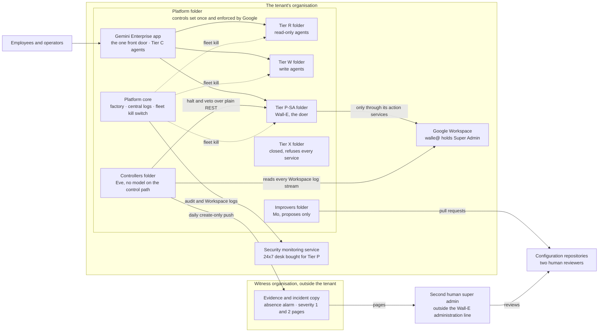

# 1. Executive summary

## Status
- Owner: the platform owner
- Last reviewed: 2026-09-18
- 2026-09-18: reviewed against the design; "Where things stand" moved to 2026-09-17 and now names the three build sets (setup, proof of value, three-day) with their people, durations and limits; Eve's section carries the 2026-09-15 first-run scope over the human super admins; the register is cited as P1–P204; the three build READMEs are added to "Read next"; two gendered pronouns replaced with they/them under the house rule.

## What you will understand by the end

This chapter is written to be read alone. By the end of it you will know what is proposed and why, what the organisation is meant to gain and how the programme can stop if the gain does not appear, what state it is in, what giving a robot the highest administrative role in the organisation's Google Workspace costs in safety and what makes that acceptable to try, which risks you would be accepting by signing, what the platform will not do, and what it needs from you in people, bought services and signatures, in the order the platform can open. Each paragraph ends with the chapter that explains its subject in full.

## Where things stand on 2026-09-17

The platform is a design and nothing is built. The Google Cloud project behind the organisation's Gemini Enterprise app (Google's enterprise assistant, for which the tenant holds licences) exists and is to be imported (Assumption); the platform folder, factory, registry entries, security monitoring service, witness organisation and the robot's Super Admin grant are still to be made. (Chapter 24, Roadmap and cost; [maturity on 2026-09-13](../README.md#maturity-what-exists-on-2026-09-13).)

Three human-executed build sets now exist, none executed, each growing into the next. The full build ([setup](../setup/README.md), written 2026-09-15, revised 2026-09-16) is 42 procedure files in the order platform, then Mo and Eve, then Wall-E, needing every role the third group of asks below names; it takes six to seven months to Stage 0, the super-admin grant not before 2027-03, and it alone owns that grant, the sandbox twin, the witness organisation and every Tier P-SA gate. The proof of value ([pov](../pov/README.md), written 2026-09-16) runs on the production tenant at Tiers C, R and W for the owner, an operator, the second person and one engineer, 20 to 26 person-days of procedure over 6 to 20 weeks (Assumption); its doer holds no Workspace admin role, no agent holds Super Admin, Eve reports on every human super admin, and nothing it produces is evidence for the grant; it hands over to the full build with nothing torn down. The three-day build ([3-day](../3-day/README.md), written 2026-09-17) is two people and six person-days: a doer holding one organisational-unit-scoped admin privilege over four synthetic accounts, Eve polling the admin audit log through the Admin SDK Reports API before any doer exists, and Mo's scorecard; it is a demonstration of machinery under control, claims no saved minutes and is not compliance evidence, and hands over to the proof of value once unwound. The register of record runs to P204: P144–P191 are the full build's 48 decisions and P192–P204 the proof of value's thirteen, all proposed and pending the owner's signature. (Chapter 24, Roadmap and cost; [the register in one screen](../12-open-decisions.md#0-the-register-in-one-screen).)

## What was asked, and the readings the design declines or qualifies

On 2026-09-13 the owner asked for a secure Gemini Enterprise environment through which every agent — a program that uses a language model to decide what to do — is secured, naming agent identity, an agent registry and Model Armor (Google's screen for prompts and responses), and inviting any other control an autonomous agent needs. On that environment they asked for three agents: Wall-E, the doer, acting on a human's prompt through a dedicated, licensed user account holding Super Admin, the Workspace role with every administrative power; Eve, who controls Wall-E, reports misbehaviour to a human, holds no super-admin access and works independently; and Mo, who improves both. The whole must sustain hundreds of classical and autonomous agents, host future AGI-class agents, meaning agents of general capability beyond what their designers foresaw, deliver enterprise-class security and monitoring, and be "EU AI Act bulletproof" and TISAX compatible (TISAX being the automotive industry's information-security assessment). (Chapter 2, The objective and what it demands; [the objective](../00-objective-review.md#1-the-objective).)

Two readings are declined — "bulletproof" (R14) and hosting AGI-class agents in 2026 (R12) — and "any super-admin action" (R4) is qualified; other requirements are qualified for stated reasons. No design can guarantee a regulator's decision, so the design lists what it cannot promise; agents of general capability get a closed tier. "Any super-admin action" keeps its breadth but not its letter: console-only work becomes instructions to a human, and a hard-denied list — changes to the tenant's security posture among them — is refused whatever the lane. One reading awaits the owner: catalogued work may run on scheduled, event and inbox triggers once earned, so Wall-E will act without a fresh prompt, and the design records no qualification of R3 for this; the brief reads the prompt as the origin of Wall-E's mandate, not its only trigger (Chapter 25, Decisions awaiting the owner). (Chapter 2, The objective and what it demands; [traceability](../01-hld.md#06-traceability-the-objectives-sixteen-requirements-and-the-register-ids-not-cited-elsewhere).)

## What is proposed: a platform, of which the three agents are the first tenants

The platform is five things. A folder in the organisation's Google Cloud hierarchy, where every control Google can enforce once is set where one person can own it. A factory, a pipeline that creates each agent's own project with identity, gateway, logging, budget and deny rules already in place. A register, one file in version control that every agent needs a row in before it may exist. A contract, the rules every writing agent adopts for autonomy, audit and measurement. And a gate, which lets a tier of agents open only when the people and services that tier needs exist. Tiers run from C (no-code assistants inside the Gemini Enterprise app) through R (agents with read-only tools), W (agents that write to a system of record) and P (agents holding a tenant-wide administrative credential, with P-SA the single super-admin agent), to X, reserved for agents of general capability and closed. Wall-E, Eve and Mo are the first tenants, proof the rules can be met, not the platform's definition. (Chapter 5, Architecture overview; [thesis](../01-hld.md#01-thesis).)

## Why build it, and how the programme can stop

The gain is routine administration done faster and on the record, and further agents added without rebuilding their security. From its read-only stage Wall-E produces weekly digests the design assumes are made by hand today or not at all (Assumption): last week's administrative changes, accounts unused for 90 days, suspended accounts still licensed, groups with external members or no owner, administrators checked against a signed list. At its first writing stage it carries out leaver and joiner actions from chat and reclaims licences from suspended accounts, the first measurable saving; at S3, batch approval, one operator approves a whole planned run, where the toil goes away ([Wall-E stages](../../wall-e/05-autonomy-ladder.md#s0--eyes)). For the platform, a hundredth agent costs a register row and a factory run and inherits controls reviewed once.

No benefit figure exists: the saving is *tbd* until four weeks of toil on the top three administrative tasks are measured before Wall-E's first phase, since no "before" can be measured afterwards. Two exits are deliberate. At the end of S1 a dated stop-or-continue review sets toil saved, plus the projected S3 saving, against operating cost including human hours, and stops the programme if the balance is negative (Wall-E decision 38; [Mo staging, S1](../../mo/05-staging.md#s1--the-first-decision-mos-numbers-carry-and-it-is-about-money)). And L3, a human approving each action, is a legitimate permanent end state: Eve's gate layer is not to be funded until a promotion can state how much approval work it removes ([Eve staging](../../eve/05-stages.md#what-the-staging-does-not-promise)). A signature is not a commitment to full autonomy. (Chapter 17, Mo, continuous improvement, and Chapter 24, Roadmap and cost.)

## The central fact: nothing narrows a super admin

Two Google facts fix everything that follows: a service account, the identity programs normally use, cannot hold Super Admin, so Wall-E needs a user account; and Super Admin cannot be limited to part of the organisation or a subset of its powers. The earlier design had two enforcement points — Wall-E's action service, the code that holds the credential and decides, and Google refusing any call outside a narrow custom role. The objective removes the second, leaving as Google's only ceiling the permissions the robot's credentials were consented with. A leaked credential or an interactive login becomes a compromise of the whole tenant, with a path into the organisation's Google Cloud estate, because a super admin can grant itself the top role there. Detection becomes the primary control rather than a check on a role that already refused, and least privilege becomes a signed deviation from TISAX control 4.2.1. (Chapter 3, The problem and its risks; [what this reverses and what it costs](../01-hld.md#what-this-reverses-and-what-it-costs).)

## What makes it acceptable to try

The Super Admin choice is the owner's decision of 2026-09-13 (P33); the platform designs around it rather than re-arguing it. It is defensible because thirteen compensations are preconditions of the grant, none deferred. Among them: three lanes decided by code, of which only the catalogue of typed operations can ever run without a human, while uncatalogued super-admin requests need two different human super admins and console-only work is done by a human; the two signed lists; two credentials in two services, so the broad one is never used unattended; hardened account hygiene with Google's multi-party approval on; kill switches K0 to K7, of which K6, a human super admin removing the role, is the one that survives a token already issued; no super-admin-class operation ever autonomous; and a second human outside Wall-E's administration line. The grant is a gate with a checklist, not a runbook step: it happens the day the last row is green; a row turning red afterwards is a finding, and any of three named rows red, or two rows at once, makes the on-duty human super admin pull K6 until they are green again. (Chapter 15, Wall-E, the doer, and Chapter 21, TISAX; [Wall-E on the platform](../01-hld.md#131-wall-e--the-super-admin-singleton-in-tier-p-sa), [the checklist the gate reads](../11-tisax.md#63-compensations-as-preconditions--the-checklist-the-gate-reads).)

## Eve's independence, stated honestly

Eve has two paths. The control path, which approves, vetoes, halts and demotes, contains no language model by construction; a separate reporting path may reason about findings but writes only reports and pages, and nothing it writes is read by any gate. Because a super admin can reach anything inside the tenant's organisation, Eve's independence there is detective, not structural: a super admin could redeploy Eve, and only detection would see it. What leaves is structural: Eve pushes its evidence, incident record and heartbeat daily to a witness organisation outside the tenant, run by two people from IT security outside the Wall-E line, which holds the paging channels; an absence alarm on Eve's heartbeat and Google's own feed raises within fifteen minutes, so it sees Eve's deletion that fast; it does not see a forged approval. Moving Eve's control path into the witness is recorded as the end state (P15, proposed), not a condition of the first grant. (Chapter 16, Eve, the independent controller; [Eve's independence](../../eve/01-hld.md#1-eves-independence-detective-inside-the-organisation-structural-through-the-witness).)

Since 2026-09-15, at the owner's request, Eve's first half — the observe-and-report layer — watches every human super admin from its first run, before Wall-E exists: the committed roster and every live admin-role holder are the actors its detection catalogue watches, findings go to the second human outside the administration line with a copy in the witness, and Eve is not declared live over the human super admins until the second human has independently proved it on a seeded super-admin action, reading Google's own admin log without any Eve component or platform-owner help. The full build makes this in its files 23 to 28 (P153–P155, proposed). ([Scope from the first run](../01-hld.md#132-eve--independent-controller-two-paths-a-witness-outside-the-tenant-a-second-human), [Eve's LLD §14.1](../../eve/03-lld.md#141-scope-from-the-first-run-the-human-super-admins-2026-09-15).)

## Mo in one line

Every number Mo publishes is re-derived by a validator Mo cannot reach, which refuses anything it cannot recompute, and Mo reaches production only through a pull request, a proposed change to configuration, that two humans review. (Chapter 17, Mo, continuous improvement; [Mo's thesis](../../mo/01-hld.md#thesis).)

## The residual risks a signature would accept

A leaked robot credential is still a compromise of the tenant: custody, split credentials, detection within minutes and the kill switches meet it, but nothing prevents it; the risk register holds it as row one, accepted with compensation. Eve inside the organisation sees a super admin's actions but cannot structurally stop one, so a super admin who reaches the Google Cloud organisation could forge an approval or undo a kill until the end state is built. The robot's gate is one process its build pipeline can rewrite, so a compromised pipeline is a tenant compromise with only Google's audit log and detection beneath it. Manipulated content will reach the model and can put a false proposal before an operator or a reviewer; screening only detects; the ceilings in code stop it becoming an action. Several Google facts are unverified — whether an access boundary blocks invoking a service, whether the Admin console's access level applies to super admins, how the deny policy spells agent identities — and each is kept out of every safety argument until a test answers it. (Chapter 19, Threat model and residual risk; [the honest risk statement](../../wall-e/06-security-guardrails.md#the-honest-risk-statement), [the risk register](../11-tisax.md#10-the-risk-register-p140).)

## Hundreds of agents, and a closed tier for agents of general capability

The factory makes projects repeatable, so people, not projects, limit scale: an autonomous agent's promotion rests on humans grading a blind sample of its work, so the number of writing agents is capped by named grading capacity, about an hour a week per Tier W agent, and the cap itself (P25) is still open. Tier X is a folder that refuses every Google service, with written opening conditions — a sandbox available in the EU, a provider's capability evaluation per model version, an AI-safety reviewer, six months of drills of the fleet kill switch that stops every agent at once, an advisory monitor on a different model family and every buildable containment control live. Only the first is met; the rest are out of reach in 2026. (Chapter 14, Scale and AGI readiness; [the honest line](../01-hld.md#115-the-honest-line), [before any Tier W agent writes](../12-open-decisions.md#3-before-any-tier-w-agent-writes).)

## Compliance: mechanisms and evidence, never outcomes

The platform lists what the regulator, the guidelines or the assessor still decide. Under the EU AI Act, classification follows the purpose the provider declares, not the privilege an account holds: Wall-E's declared purpose is its catalogue, close to the high-risk category for systems taking decisions that affect workers, with a documented claim that it falls outside it; the Super Admin grant is the fact most likely to be held against that claim, and high-risk obligations apply from 2027-12-02. For TISAX the target is the Confidential label (Assumption) at assessment level AL2; separation of duties becomes a staffing minimum the gate enforces, and an assessor may still refuse the expected maturity on least privilege however good the compensation. (Chapter 20, EU AI Act, and Chapter 21, TISAX; [what bulletproof can and cannot mean](../10-eu-ai-act.md#6-what-bulletproof-can-and-cannot-mean), [the TISAX position](../11-tisax.md#0-what-this-page-decides-in-one-paragraph).)

## What the platform will not do

The platform will not pretend to narrow a super-admin account; its perimeter is credential custody, split credentials, a split control plane, detection latency and the witness. It will not let any model produce an approval, a signature, a halt, a veto or a refusal. It will not automate the Admin console under the robot's session. It will not run a security operations centre: it buys round-the-clock acknowledgement for Tier P and feeds the organisation's own centre if one exists. And it will not host a second super-admin agent, a third-party agent without a supplier record, or any agent without a register row. It also grants domain-wide delegation to nothing and claims no containment of agents of general capability. (Chapter 4, The principles; [what the platform does not do](../01-hld.md#16-what-the-platform-does-not-do).)

## The organisation that exists, and what the platform costs

On 2026-09-13 the organisation behind the platform is one administrator: no security operations centre, no second super admin outside their own line, no security reviewer, no Eve owner, no engaged data protection officer (DPO). Every role the platform needs is held by one person, the finding most likely to stop a TISAX assessment. The design opens tiers in order: Tier C and Tier R open with the people who exist, self-review recorded as such; Tier W, Tier P and the super-admin grant wait for people and bought services. The proposed minimum is one human at Tier R, three when the first agent writes, and four at the grant. The bought round-the-clock detection desk (P10, open) is contracted before the grant. A later staffing row, for Wall-E's first catalogued work without a human approving each action, adds only a quarter of evidence that the desk acknowledges in time; the TISAX page places it at "Stage 3 at L4" ([11 §7.2](../11-tisax.md#72-the-minimum-per-stage)), while Wall-E's ladder brings L4 with Eve at S4 ([stage overview](../../wall-e/05-autonomy-ladder.md#stage-overview)). (Chapter 23, Operating model, and Chapter 24, Roadmap and cost; [the tier gate](../01-hld.md#04-the-tier-gate-what-must-exist-before-a-tier-opens).)

No price is quoted: pricing pages were not read and every amount is still to be set, so the design names each cost's driver and payer. Security Command Center Premium, Google's organisation-wide security findings service, is paid by IT security (Assumption: a platform budget line until then). Central log ingestion, driven by the volume of Workspace audit logs, is the largest line and falls to the platform budget. Model Armor is paid per request from each agent's budget, device-posture licences for operators arrive at Tier W, and Tier P adds a Workspace licence per privileged agent plus the monitoring service and the witness organisation, both paid by IT security. The agents' own estimates are all Assumption: Wall-E's first-stage infrastructure in the low tens of euros a month; Eve seven to nine engineer-weeks and under €50 a month plus one licence, a figure that predates the witness and Eve's reporting path; Mo 24 to 37 person-days and €25–60 a month. The cost that binds is human hours. (Chapter 24, Roadmap and cost; [cost classes](../01-hld.md#05-cost-classes).)

## What the sponsor is asked for, in order

Each group opens one gate; a group left unprovided keeps that gate and every later one closed. Third-group items take longest to obtain and are best started now, though their gate opens last. The deciders behind each item are Chapter 25, Decisions awaiting the owner; what each gate contains is Chapter 24, Roadmap and cost.

1. **To open Tier C and Tier R — the assistant baseline and read-only agents.**
   - Nobody new: the owner builds and operates both tiers.
   - Security Command Center Premium activated at organisation level, with its funding and ownership decided by IT security (P11, open).
   - If not provided: no platform folder, no factory run and no agent beyond what the Gemini Enterprise app offers today.
   - Alongside, the information security management system's written acceptance of self-review at Tier R; without it that risk stays unaccepted and a TISAX assessment cannot be ordered.
2. **To open Tier W — the first agent that writes to a system of record.**
   - A second named operator who is not the agent's owner, about two hours a week.
   - A part-time security reviewer from IT security, about two hours a month, who reviews autonomy raises, policy changes and privileged access.
   - A blind grader who does not write the agent's playbooks, its scripted routines, about an hour a week per Tier W agent.
   - Information to the works council, the employees' elected representatives, before any agent acting on employee accounts takes its first write (P129, proposed), with the DPO's retention decision (P13, open) before the same step.
   - If not provided: the platform stays read-only, and no autonomy contract is exercised.
3. **To open Tier P and the super-admin grant — Wall-E with Super Admin.**
   - A second human super admin outside the Wall-E administration line, from IT security, as Eve's owner and the sole recipient of reports about the administrator.
   - An incident commander from IT security.
   - An engaged DPO and an AI compliance owner, legal's designate, accountable for classifications and regulatory reports (P131, proposed).
   - Google SecOps, Google's security monitoring service, in the EU or the organisation's existing equivalent (P10, open), with a managed detection and response retainer, an outside service contracted to watch the super-admin detections and respond round the clock, and a paging service.
   - Hardware security keys for the robot and the human super admins, with witnessed custody.
   - The witness organisation, set up and administered by IT security (P14, open).
   - A penetration test with no open critical or high finding.
   - The data protection impact assessment (DPIA), which the tier gate lists as a condition and the grant checklist records as started.
   - Signatures: the two lists by the owner (P29, open); Wall-E's declared intended purpose by the owner with legal (P28, content proposed, signature open — the register files it before Wall-E's first write, while the grant checklist asks for it before the grant); and the deviation record, decided by the owner, signed by the security reviewer and entered by the information security management system (P136, proposed).
   - If not provided: the robot account may exist, licensed and hardened, but holds no administrative role and reads nothing, and Tier P stays closed.

([Who exists on 2026-09-13](../01-hld.md#03-who-exists-on-2026-09-13-and-the-roles-the-platform-needs), [the tier gate](../01-hld.md#04-the-tier-gate-what-must-exist-before-a-tier-opens), [before the super-admin grant](../12-open-decisions.md#4-before-the-super-admin-grant).)

## Key decisions

- P33 — Wall-E holds Super Admin: decided by the owner on 2026-09-13; the deviation signatures are pending and the grant is blocked until every precondition is green ([decision record](../../../decisions/2026-09-13-wall-e-holds-super-admin.md)).
- P1 — the tier model and the tier gate: proposed.
- P29 — the two lists: open, awaiting the owner's signature. P28 — Wall-E's intended purpose: content proposed, signature open.
- P10 (the monitoring service and its managed detection partner), P11 (Security Command Center Premium funding) and P14 (the witness organisation): open, with IT security.
- P25 — the Tier W cap by grading capacity: open.
- P34 — Eve's reporting path may reason: proposed. P15 — Eve's control path moved to the witness as the end state: proposed.
- P129 (works-council information before the first write), P131 (the AI compliance owner), P136 (the deviation record) and P137 (separation of duties as a counted minimum): proposed.

## Read next

- In this brief: Chapter 2, The objective and what it demands; Chapter 3, The problem and its risks; Chapter 17, Mo, continuous improvement, for the value review; Chapter 19, Threat model and residual risk; Chapter 24, Roadmap and cost; Chapter 25, Decisions awaiting the owner.
- In the design: [the platform set's README](../README.md#maturity-what-exists-on-2026-09-13); [the platform HLD, what this reverses and what it costs](../01-hld.md#what-this-reverses-and-what-it-costs); [the register in one screen](../12-open-decisions.md#0-the-register-in-one-screen) (P1–P204) and [its gate before the super-admin grant](../12-open-decisions.md#4-before-the-super-admin-grant).
- The three build sets, smallest first: [the three-day build](../3-day/README.md), [the proof of value](../pov/README.md) and [the full build](../setup/README.md).
