# 3. The problem and its risks

## Status
- Owner: the platform owner
- Last reviewed: 2026-09-14

## What this chapter explains

By the end of this chapter the reader knows what the design looked like on 2026-09-12, before the objective of 2026-09-13, and which parts of it survive into the platform. They know the three Google facts that make a super-admin robot a different kind of problem from a narrowly scoped one, which safety properties the Super Admin choice removes, and the other reversals the objective forces on Eve, Mo and the project layout. They can name the five hardest problems in order of weight, including the two that are not technical: one person holds every role, and the robot's declared purpose decides its legal classification. The chapter closes with seven risk themes; every chapter in Parts II and III opens by naming the themes it answers, and Chapter 19, Threat model and residual risk, tests every answer and records what remains.

The objective and the readings the design declines are Chapter 2, The objective and what it demands; the principles derived from this problem are Chapter 4, The principles.

## The design before the objective

### What it was on 2026-09-12

On 2026-09-12 the design described one privileged Workspace agent and two companions bolted to it, not a platform.

Wall-E was a narrow operator. Its robot account held a customer-scoped read role and a custom write role scoped to a pilot organisational unit, which the design called "a second enforcement point outside our own code": if every control in Wall-E's action service failed, Workspace would still refuse any call outside the role or the pilot unit. The role grew with the autonomy ladder, and Wall-E could run a fixed catalogue of about twenty typed operations and nothing else. "Never Super Admin" was design intent on nineteen pages, enforced by the setup script. Changes to security posture and permanent data loss were excluded twice over: in neither the catalogue nor the role. The threat model bounded a leaked credential "by the role's privileges at the current stage". Decision 26 sought a keyless service account for the administrative half; decision 27 recorded that Wall-E was not a stand-in for a super admin.

Eve was a deterministic verifier of catalogued plans: its verdict a pure function of six plan inputs, and "no model anywhere in Eve v1 or v2" a settled row. Eve gated nothing in the pilot, received its own Workspace account at Stage 3 and began signing approvals at Stage 4.

Mo measured Wall-E and nothing else: every number re-derivable from Wall-E's audit table, its grants and validator reaching Wall-E's data only.

Above the three agents there was nothing: no landing zone, factory, tier model, SIEM, incident-response roles, retention schedule, supply-chain control, privileged access mechanism, register of agents or compliance classification. Compliance meant data protection: a DPIA and employee representatives "before Stage 3". The words "hundreds", "AGI", "TISAX" and "AI Act" appeared nowhere. Every control was configured by Wall-E's runbook, in Wall-E's project, and the runbooks still placed Eve's and Mo's identities, and Eve's signing key, inside that project ([project-topology §1.1](../../project-topology.md#11-what-one-project-lets-happen-today)). A fourth agent would have re-implemented the security chapters by hand ([objective review §2](../00-objective-review.md#2-verdict)).

### What of it stands

Much of the earlier design's shape generalises. Seven elements are lifted into the platform unchanged, and Chapter 4, The principles, states them as platform rules.

- **The credential split.** The model never holds a credential; one action service does, and it is the only place authorisation is decided.
- **A deterministic gate before every write.** Code the model cannot talk its way past stands between generated text and any Admin SDK call.
- **Autonomy as data with permanent ceilings.** Each (operation family, trigger class) pair carries a level in versioned configuration; humans raise it, machines lower it, and some ceilings are code that no promotion can move.
- **A model-free authority path for Eve.** Whatever approves, halts, demotes or vetoes contains no model — deterministic by absence, not by discipline.
- **Re-derivable numbers for Mo.** Every figure Mo publishes can be recomputed by a validator Mo cannot reach.
- **Resource-level cross-project grants.** A principal in one project reaches a resource in another only through a grant on that resource, never through a project-level role.
- **The three separation rules.** No agent both decides and acts; no agent grades its own work; only humans loosen anything ([wall-e 08](../../wall-e/08-team-eve-mo.md#the-separation-that-makes-a-team-worth-having)).

The pages on prompt security and Model Armor, agent identity, agent interconnection and project topology were already platform-grade in substance and are promoted rather than rewritten. Eve's own credential, project, key, halt authority and "not a super admin, ever" are exactly what the objective asks of Eve. The standing constraints hold unchanged (Chapter 4). The pages that need no change are listed in [objective review §7](../00-objective-review.md#7-what-does-not-change).

## The Google facts that fix the problem

Three facts about Google's products, verified on 2026-09-13, turn the owner's choice into a structural problem rather than a configuration choice ([wall-e HLD, the Google facts behind Super Admin](../../wall-e/01-hld.md#the-google-facts-behind-super-admin-verified-2026-09-13)).

**A service account cannot hold Super Admin**, though it can hold any other Workspace administrator role. The robot must be a user account — licensed, with a password, able in principle to sign in interactively — and decision 26's keyless service account closes for Wall-E by fact, not preference.

**Super Admin cannot be limited to an organisational unit or to a subset of privileges.** There is no scoped Super Admin and no way to grow it with the autonomy ladder. Once granted, Workspace enforces nothing on the account except the OAuth scopes consented for the client holding its token. One consequence is severe: the call that makes a user an administrator sits under the ordinary directory-user scope the narrow client already needs, so only Wall-E's own hard-denied list stops the robot minting further super admins.

**A super admin can grant itself Organization Administrator on the GCP organisation**, so every project in it — Eve's and Mo's included — is within a super admin's reach. The console mechanism and the standing recovery right are carried as Assumptions to be verified before the grant, and neither Google nor the design calls the reach irrevocable; why it justifies the witness organisation is Chapter 16, Eve, the independent controller ([eve HLD, choice 1](../../eve/01-hld.md#1-eves-independence-detective-inside-the-organisation-structural-through-the-witness)).

The objective is not re-argued: Super Admin for Wall-E is the owner's decision of 2026-09-13, register row P33, and the platform is designed around it ([decision record](../../../decisions/2026-09-13-wall-e-holds-super-admin.md)).

## What the Super Admin choice costs

The platform HLD states the loss "without softening" in seven rows ([HLD, what this reverses and what it costs](../01-hld.md#what-this-reverses-and-what-it-costs)); the rest of the brief responds to them.

```mermaid
flowchart TB
  subgraph before["Before 2026-09-13 - custom role scoped to a pilot unit"]
    b1["Operator prompt"] --> b2["Agent names a catalogued operation"]
    b2 --> b3["Action service policy engine - enforcement point one"]
    b3 -->|"permitted"| b4["Workspace checks role and organisational unit - enforcement point two"]
    b3 -->|"denied"| b8["Refused in code"]
    b4 -->|"inside the role"| b5["Change applied"]
    b4 -->|"outside the role"| b6["Refused at Google's end"]
    b5 --> b7["Detection confirms what the role already bounded"]
  end
  subgraph after["After 2026-09-13 - Super Admin on a licensed user account"]
    a1["Operator prompt"] --> a2["Agent names an operation or composes a generic request"]
    a2 --> a3["Action service - bands, two lists, two-person rule - the only enforcement point"]
    a3 -->|"denied"| a8["Refused in code"]
    a3 -->|"permitted"| a4["Workspace enforces consented OAuth scopes and nothing else"]
    a4 --> a5["Change applied"]
    a5 --> a6["Detection - Eve reconciliation, SIEM super-admin set, witness - the primary control"]
    a6 -->|"misbehaviour seen"| a7["A human halts, demotes or pulls a kill switch"]
  end
```

### The Workspace-side gate

Before, there were two enforcement points: the action service, and Google refusing any call outside the role or the pilot unit, so even a total failure of the action service would leave Workspace refusing the call. After, there is one. The pilot-unit allow-list, the never-list rows on posture and permanent loss, the role that grew with the ladder, the bound on a leaked credential and the split between safe and sensitive user fields are all enforced by code inside the component under audit. The only Google-enforced ceiling left is each OAuth client's consented scope set, which is why the design splits the robot's credential into a narrow client for everything unattended and a broad client for human-approved work. The sentence promising refusal at Google's end is deleted from the setup pages; keeping it would be a false statement in the safety case.

### The blast radius

Before, a leaked token was bounded by the role's privileges at the current ladder stage. After, a leaked refresh token or an interactive login on the robot account is a compromise of the tenant and — through Organization Administrator, or a token carrying the cloud-platform scope — a path into the GCP organisation, including Eve's, Mo's and the platform's core projects. The perimeter becomes token custody, key custody, the scope split and detection latency. Only what has already left the organisation — evidence in the witness organisation, its alarms, its paging channels — is out of reach. How a leaked token travels is Chapter 19.

### Eve's structural independence

Before, Eve's project, credential, key and halt authority were out of Wall-E's reach by construction. After, the robot's credential can suspend Eve's account, revoke its token, remove its role, switch off Workspace data sharing with Google Cloud and re-filter the log sinks. Inside the tenant's organisation Eve's independence is detective, not structural; what leaves the organisation can still be structurally independent, the reason for the witness organisation (Chapter 16, Eve, the independent controller).

### The catalogue as a ceiling

Before, nothing executed that was not in the catalogue. After, "any super-admin action on a human's prompt" cannot be delivered by twenty operations, so the catalogue becomes the declared purpose: the only band that can ever become autonomous, beside a two-person generic lane and a console handoff to a human ([wall-e HLD, the three action bands](../../wall-e/01-hld.md#the-three-action-bands)). The ceiling is now a rule in code rather than a limit of what exists. Decision 27 moves from "whether" to "which lane". The qualification of R4 is Chapter 2; the bands are Chapter 15, Wall-E, the doer.

### Least privilege as a property

Before, TISAX control 4.2.1 could be shown by an enumerated role. After, least privilege becomes a signed deviation — row one of the platform risk register, carried entirely by the bands, the two lists, the ladder, Eve and a split control plane. An assessor may still refuse maturity 3 on it. The deviation record and its signatures are Chapter 21, TISAX.

### The narrow-task argument under the EU AI Act

Before, the argument that Wall-E performs narrow procedural tasks rested on the role and the catalogue. After, it rests on the declared intended purpose, on the hard-denied list enforced in code with its CI ownership outside the agent's repository, and on audit logs showing no out-of-catalogue operation outside band B under approval. The account's privilege is the fact most likely to be held against the argument. The classification is Chapter 20, EU AI Act.

### Detection moves from a check to the primary control

Before, alerts confirmed what the role had already refused. After, for the super-admin tier, detection is the primary control, and the design says so. Since nothing detection-grade may stand alone in a safety argument (Chapter 4, The principles), detection must be paired with enforcement the design still owns — the action service, the scope split, the kill switches — and made fast, independent and staffed. Monitoring is Chapter 11; the thirteen compensations that must be green before the grant, as a design argument, are Chapter 15.

## The other reversals the objective forces

Super Admin is the loudest reversal but not the only one. Eight more follow from the same objective, each changing a sentence the earlier design held as settled ([objective review §3.2](../00-objective-review.md#32-other-reversals-the-lenses-found)).

**The catalogue is purpose, not ceiling**, as described above.

**Eve gains a reporting path that may reason.** "Report anything wrong" cannot be enumerated, so the "no model anywhere in Eve" row is reopened, but only for a separate, report-only path; approval, halt, demotion and veto stay model-free (Chapter 2; the path is Chapter 16). The platform HLD records this reversal as decided on its own page, while the register carries P34 as proposed; this brief carries it as proposed ([HLD](../01-hld.md#what-this-reverses-and-what-it-costs), [register](../12-open-decisions.md)).

**Eve detects misbehaviour instead of verifying plans.** A verifier sees only the plans it is shown, so Eve's core becomes a versioned, deterministic detection catalogue over every ingested stream — privilege changes, out-of-family writes, deviations from baselines, divergence between what was prompted and what was done.

**Mo improves both agents.** Mo reads Eve's quality data through dataset-level grants made by Eve's own runbook and proposes changes to Eve's configuration through a closed set of change types. Eve reads nothing Mo writes, and Mo is never Eve's grader, so improvement cannot weaken the controller.

**Four projects become a factory pattern.** The earlier topology counted four projects for four things; for hundreds of agents, one project per agent is a pattern produced by a factory under tier folders.

**Decision 26 closes by fact.** The keyless service account for Wall-E's administrative half is impossible under Super Admin; the idea survives only as Eve's E-16, where a service account could still remove Eve's password, key and consent.

**Compliance becomes two regimes.** The EU AI Act and TISAX are named, classified and mapped beside data protection, and worker consultation moves from before Stage 3 to before Stage 1 under both the GDPR and the Act.

**Eve arrives before the grant.** Eve's observe-and-report layer must be live and drilled before the robot holds Super Admin, so the grant becomes a gate with its own checklist. Eve's gating and signing layers keep their later stages.

## Why agents are a distinct risk

A conventional administration script does what its author wrote; an agent does what a model infers. Tool arguments are generated text: the process that summarises an email can compose a call that suspends a user, and under Super Admin that call could name an administrator-role assignment and Google would execute it. The steering content arrives not only from the operator but through the mailbox the agent reads, the results its tools return and the peer agents it talks to — any of which an attacker can write to. So no prompt instruction is a boundary (Chapter 19, Threat model and residual risk), and the action service stays a separate process with the only credential and the hard-denied list in the gate ([wall-e HLD](../../wall-e/01-hld.md#why-the-action-service-stays-separate-from-the-agent)). The injection surface and its screens are Chapter 10, Agent Gateway, Model Armor and the perimeter.

## The five hardest problems

The distance between the earlier design and the objective reduces to five problems, in order of weight ([objective review §2](../00-objective-review.md#2-verdict)).

### 1. Super Admin cannot be scoped, so Workspace stops enforcing anything

This is the loss described above. Three controls the earlier design had deferred to "before Stage 1" — a network perimeter around the credential holder, the control-plane split into two services, and privileged access on the deploy grant — become preconditions of the grant. The only gate left is code the platform itself writes and deploys, so the deploy path, the code's owners and the speed of detection all become part of the security boundary.

### 2. Eve's independence is no longer structural

Beyond that loss, Eve read only one of the many streams a super admin acts in, and reported through a page budget whose conditions were empty, addressed to the person who administers Wall-E. The design had to decide where Eve's trust root sits and what "report to the human" means before the grant. It answers with a witness organisation outside the tenant and a second human outside the Wall-E administration line; relocating Eve's control path to the witness, the only mechanism that would stop a super admin forging an approval, is the end state, proposed and not built (P15). Chapter 16 explains both.

### 3. There was no platform — the scale problem

One project per agent is forced by Google, for reasons Chapter 7, Landing zone and the tier model, sets out ([project-topology §1](../../project-topology.md#1-why-four-projects)), so hundreds of agents means hundreds of projects. Google's resource limits make that routine; the earlier design did not. It offered a hand-run runbook, 26 hand-made cross-project grants, log sinks built per agent and alert channels reading "paste yours", and no fleet kill switch outside any agent's own project, which matters most for the most capable agents. The tier model, landing zone, factory, shared services, SIEM, Security Command Center and monitoring baseline had to be designed from nothing; they are Part II, and the scaling argument is Chapter 14, Scale and AGI readiness.

### 4. "Any super-admin action" collides with the must-never list and with the Act — the regulatory problem

Read literally, "any super-admin action" includes what the never-list existed to exclude, and silencing Eve, which contradicts the objective's own Eve requirement (Chapter 2). The same words decide Wall-E's legal class: under the EU AI Act, classification follows the intended purpose the provider declares, not an account's privileges. If "any admin action on a prompt" is the declared purpose, the Art. 6(3) derogation for narrow procedural tasks collapses and Wall-E becomes high-risk under Annex III 4(b), with the full Chapter III programme — risk management, technical documentation, conformity assessment, registration, post-market monitoring — due by 2027-12-02 and no harmonised standard to lean on ([EU AI Act page §3.1](../10-eu-ai-act.md#31-wall-e-wall-e)). The design recommends declaring the catalogue as the purpose, with band B as execution of requests two human super admins have specified and approved, and band C as instructions to a human. That line is the owner's to draw and sign: the purpose text is proposed (P28, content via P125, signature open) and the two lists are open (P29). Chapter 20 carries the classification.

### 5. One person holds every role — the organisational problem

On 2026-09-13 every role, from platform owner and approver to Eve's owner and the recipient of Eve's pages, is held by one person, who will also prompt a super-admin robot (Chapter 1, Executive summary; [HLD §0.3](../01-hld.md#03-who-exists-on-2026-09-13-and-the-roles-the-platform-needs)). Three consequences follow. TISAX control 1.2.2 on separation of duties will not be rated at maturity 3, the item most likely to stop an assessment. Eve's reports about the administrator have nowhere independent to go. And every two-person rule is notional: a second approval by the same human is not a second approval. No amount of code answers an organisational problem. The design's response is the tier gate — Tier W, Tier P and the super-admin grant do not open until the people and bought services they need exist ([HLD §0.4](../01-hld.md#04-the-tier-gate-what-must-exist-before-a-tier-opens)) — and the recorded state "the four owner groups are one person" expires on the grant date. The roles, distinct humans per stage and hours are Chapter 23, Operating model.

## The risk themes the rest of the brief answers

The problems condense into seven risk themes, stated at the level of intent, each naming the chapters that answer it.

| Risk theme | What could go wrong | Answered in |
|---|---|---|
| Tenant compromise through the robot credential | A leaked refresh token, an interactive login or a compromised super-admin lane gives an attacker the tenant and a path into the GCP organisation, with nothing in Google to narrow it | Chapter 8, Identity, privileged access and the fleet kill switch; Chapter 11, Monitoring, detection and incident response; Chapter 15, Wall-E, the doer |
| Manufactured silence | The actor being watched switches off data sharing, re-filters sinks, deletes evidence or suspends the watcher, so that absence of alerts looks like calm | Chapter 11, Monitoring, detection and incident response; Chapter 12, Data, logging, retention and sovereignty |
| Autonomy outrunning evidence | A level is raised, or a fleet grows, faster than graded and independently re-derivable evidence supports | Chapter 9, Registry, governance and the autonomy contract; Chapter 17, Mo, continuous improvement |
| A controller reachable by what it controls | Eve's account, key, project, rules or pages are within reach of the super-admin credential or of the administrator Eve reports on | Chapter 16, Eve, the independent controller |
| Shadow and third-party agents | Agents reach the tenant or the Gemini Enterprise app without a register row, a gateway, a screen or a classification, including agents built or hosted by suppliers | Chapter 9, Registry, governance and the autonomy contract; Chapter 14, Scale and AGI readiness |
| Classification collapse | What an agent does, or how it is positioned, contradicts its declared purpose, and a system claimed as narrow is treated as high-risk — or an agent enters service with no classification at all | Chapter 20, EU AI Act |
| Staffing that makes two-person rules notional | Approvals, reviews, grading and pages that need a second person are given by the same person, so the control exists on paper only | Chapter 23, Operating model |

Chapter 19, Threat model and residual risk, takes each theme, names the enforcement-grade control that stops it and the detection that sees it, and records whether the residual is accepted in writing, mitigated or blocks a gate. Some themes the design does not close: a leaked robot credential remains a tenant compromise met by detection and kill switches rather than prevented, and Eve inside the tenant's organisation sees a super admin but cannot structurally stop one.

These risks are accepted only for a gain not yet measured. Chapter 1, Executive summary, states the work Wall-E is meant to remove, why no benefit figure exists until four weeks of toil are measured before Wall-E's first phase, and the two exits: the stop-or-continue review at the end of S1, which ends the programme if the saving does not cover the cost including human hours, and human approval of each action (L3) as a legitimate permanent end state.

## Key decisions and what to read next

### Key decisions

- **P33 — decided** by the owner on 2026-09-13: Wall-E holds Super Admin on a dedicated licensed user account; deviation signatures pending ([decision record](../../../decisions/2026-09-13-wall-e-holds-super-admin.md)).
- **Decision 26 — closed for Wall-E by fact**: a service account cannot hold Super Admin; the idea survives as Eve's E-16.
- **P28 — proposed content (via P125), signature open**: Wall-E's declared intended purpose, the catalogue plus bands B and C, against "any admin action" with the full Chapter III programme.
- **P29 — open**, owner signs: the two lists, decision 4 re-ratified (Chapter 2 notes how the register and the HLD describe them).
- **P34 — proposed**: Eve's reporting path may reason, report-only ([decision record](../../../decisions/2026-09-13-eve-reporting-path-may-reason.md)).
- **P15 — proposed**: relocation of Eve's control path to the witness organisation as the end state.
- **P25 — open**: the Tier W cap expressed as grading capacity rather than project count.
- **P10 — open**, IT security: the SIEM and managed detection partner that the super-admin tier's primary control depends on.

States are the register's on 2026-09-14; who decides each is Chapter 25, Decisions awaiting the owner.

### Canonical pages to read next

- [Objective review §2, verdict](../00-objective-review.md#2-verdict), [§3.1, Wall-E holds Super Admin](../00-objective-review.md#31-wall-e-holds-super-admin), [§3.2, other reversals](../00-objective-review.md#32-other-reversals-the-lenses-found) and [§7, what does not change](../00-objective-review.md#7-what-does-not-change)
- [Platform HLD, what this reverses and what it costs](../01-hld.md#what-this-reverses-and-what-it-costs) and [§13.1, the super-admin singleton](../01-hld.md#131-wall-e--the-super-admin-singleton-in-tier-p-sa)
- [Wall-E HLD, the Google facts behind Super Admin](../../wall-e/01-hld.md#the-google-facts-behind-super-admin-verified-2026-09-13) and [why the action service stays separate](../../wall-e/01-hld.md#why-the-action-service-stays-separate-from-the-agent)
- [Eve HLD, choice 1: detective inside the organisation, structural through the witness](../../eve/01-hld.md#1-eves-independence-detective-inside-the-organisation-structural-through-the-witness)
- [Project topology §1, why one project per agent](../../project-topology.md#1-why-four-projects)
- [EU AI Act page §3.1, Wall-E](../10-eu-ai-act.md#31-wall-e-wall-e) and [TISAX page §10, the risk register](../11-tisax.md#10-the-risk-register-p140)
- Next in the brief: Chapter 4, The principles.
