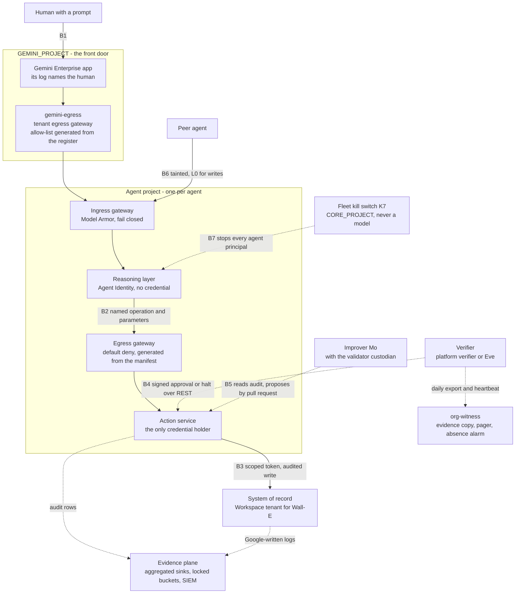
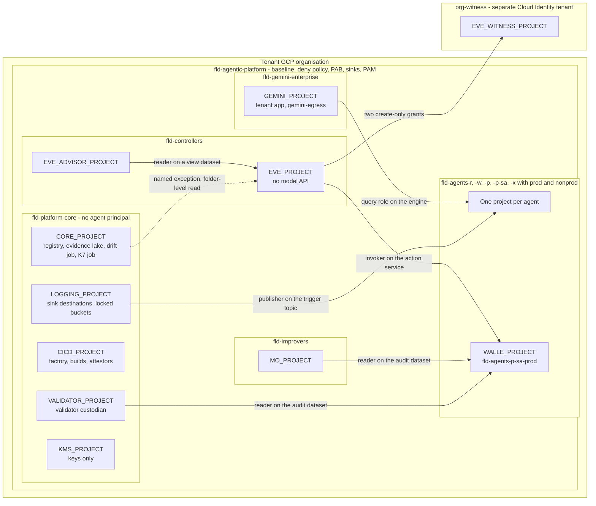

# 5. Architecture overview

## Status
- Owner: the platform owner
- Last reviewed: 2026-09-14

## What this chapter explains

By the end of this chapter the reader can draw the platform from a human's prompt to a change in a system of record, say where each part lives and why a second organisation sits outside the tenant's, name the seven trust boundaries every agent inherits with their grades, and state the one rule for crossing a project boundary with its named exceptions.

It answers three risk themes of Chapter 3, The problem and its risks, structurally: tenant compromise through the robot credential, a controller reachable by what it controls, and manufactured silence. Traceability to the objective is Chapter 2, The objective and what it demands; the grades are Chapter 4, The principles.

## 5.1 The platform in layers

The platform is a request path of six layers with five parts beside it. The tier decides which layers an agent has: a Tier C agent lives inside the tenant app with no project, a Tier R agent has no action service, and from Tier W every layer is present (Chapter 7, Landing zone and the tier model).

### From the prompt to the system of record

**The front door.** One Gemini Enterprise app per tenant, in `GEMINI_PROJECT`, fronts every human-facing agent. It signs the human in, and its Data Access log is the one record that names the human; downstream the human travels as a surrogate in the correlation keys. Agents no human talks to, such as Eve's control path and Mo's jobs, are not published in it (Chapter 6, The Gemini Enterprise environment).

**The tenant egress gateway.** The app reaches agents through `gemini-egress`, whose access policy is generated from the register, so an unregistered engine is unreachable from the front door by network rather than convention. Agent Gateway supports the app only in egress mode; the fence refuses nothing until the last of its three stages (P57, a spike; staging in Chapter 6).

**The agent's ingress gateway.** Every engine a machine calls, the tenant app included, sits behind its own project's ingress gateway with a Model Armor extension that fails closed. The owner cannot remove the screen, and its failure stops the call. Gateway and Model Armor share an `Assumption:` 99.5 % monthly objective; an outage stops every fail-closed agent, by design (Chapter 10, Agent Gateway, Model Armor and the perimeter).

**The reasoning layer.** The engine runs under Agent Identity, a keyless Google-issued principal with a daily certificate. It holds no credential, the folder deny policy refuses it every secret, and its egress gateway's default-deny allow-list names its action service and no Workspace or Admin SDK host. Whatever an injected document persuades the model to request, it can only request from deterministic code. Cloud Run reasoning services carry a dated service-account exception until Agent Identity for Cloud Run leaves Preview (P5, open; Chapter 8, Identity, privileged access and the fleet kill switch).

**The action service.** From Tier W, a Cloud Run service in the agent's project is the only holder of the credential to the system of record. It takes a named operation with parameters, checks the catalogue, policy chain and autonomy ladder, writes a write-ahead audit row, calls the API and verifies by re-reading. Wall-E has two such services so its broad scopes never share a process with the catalogue (Chapter 15, Wall-E, the doer).

**The system of record.** A business system for a Tier W agent; the Workspace tenant for a Tier P agent. For the Super Admin robot Google refuses nothing beyond the consented scopes, so the action service is the only gate and detection the primary control ([P33](../../../decisions/2026-09-13-wall-e-holds-super-admin.md)).

### Beside the path

Five parts sit beside the path, each in a project the agent cannot administer.

- **The verifier** approves, vetoes, halts and demotes over plain authenticated REST with a key the agent cannot reach and no model on that path: the platform verifier for Tier W, a dedicated Eve in `EVE_PROJECT` for Tier P, with Eve's report-only reporting path in `EVE_ADVISOR_PROJECT` (Chapter 9, Registry, governance and the autonomy contract; Chapter 16, Eve, the independent controller).
- **The improver**, one Mo per platform in `MO_PROJECT`, reads audit data and reaches production only through a pull request humans merge; the validator custodian in `VALIDATOR_PROJECT` re-derives every number it cites (Chapter 17, Mo, continuous improvement).
- **The evidence plane**, two aggregated sinks into `LOGGING_PROJECT` with locked buckets, the evidence lake in `CORE_PROJECT`, Eve's own Workspace sink and the SIEM feeds, holds Google-written records the agent and its owner cannot delete (Chapter 11, Monitoring, detection and incident response; Chapter 12, Data, logging, retention and sovereignty).
- **The witness**, `org-witness`, receives Eve's daily export and heartbeat and owns the severity 1 and 2 channels and the absence alarm (section 5.3; Chapter 16).
- **The fleet kill switch K7** is pulled from `CORE_PROJECT` by a human through PAM or by a deterministic job on a severity-1 SIEM rule, never a model. It stops every agent principal in the tier folders and spares controllers, core and tenant app so Eve keeps paging (P70, proposed; Chapter 8).

### What is enforced and what is only detected

Every layer mixes both grades, and the design names which is which ([HLD §0.2](../01-hld.md#02-the-six-containment-primitives-and-how-each-is-graded)). At the **front door**, sign-in and control-surface access levels are enforcement; nightly matching of console-made Tier C agents to the register is detection. At the **gateways**, the egress allow-list and fail-closed ingress extension are enforcement; the Model Armor project floor on the model's own calls fails open and is detection. The constraint binding each engine to its gateways is enforcement only once a throwaway engine has been refused in nonprod; until then a CI check stands in. In the **reasoning layer** the deny policy and the Principal Access Boundary (PAB) are enforcement, but the deny policy's principal-set spelling is an `Assumption:` (P8, a spike) and the constraint forcing Agent Identity is a spike (P4), so that half is a CI check. In the **action service**, catalogue, policy chain, ladder and hard-denied list are enforcement because they sit outside the agent's process and fail closed, yet they are code in the component under audit; invocation is IAM-only until the perimeter spike passes (P3). At the **system of record** under Super Admin, the scopes and Workspace multi-party approval over role assignments (P66, proposed) are Google's only refusals; the SIEM's super-admin set and Eve's reconciliation are detection. **Beside the path**, the verifier is enforcement by the absence of a model, the evidence plane is detection with an absence alarm, and K7 is enforcement, its first lever's effect on running Cloud Run instances an `Assumption:` measured in the monthly drill.

## 5.2 Trust boundaries B1–B7

The seven boundaries are Wall-E's five generalised plus two fleet boundaries. Every agent's design page lists all seven with platform mechanism, agent code and grade, so no owner can quietly drop one and agents compare on the same seven lines ([HLD §15](../01-hld.md#15-trust-boundaries--the-template-every-agent-inherits)).

**B1, human and reasoning layer.** The model sees the request, never the credential. Platform: Gemini Enterprise sign-in and request log, `gemini-egress`, Model Armor on the tenant, Identity-Aware Proxy with Context-Aware Access on control surfaces. Agent: its prompt-security design. Enforcement, from Tier C. The identity the app passes is asserted, not bound, so an action service re-checks group membership on every write.

**B2, reasoning layer and action service.** The model names an operation; deterministic code decides. Platform: Agent Identity, an egress allow-list reaching only the action service, the deny policy on secrets, the PAB. Agent: catalogue, policy chain, ladder. Enforcement, from Tier W.

**B3, action service and system of record.** The only credential holder; scopes as the Google-enforced ceiling; every write pre-stated, verified and audited. Platform: keyless service account, regional secret, IAM-only invocation and then internal-only ingress once P3 passes, the perimeter. Agent: operation implementations and inverses. Grade: enforcement by scope, plus minute-latency detection for a super admin, where Google enforces nothing but the scope split. From Tier W.

**B4, agent and verifier.** Approvals signed by a key the agent cannot reach, halts over plain REST, no model on the authority path. Platform: separate project, HSM key, deny policy, a project-level service restriction keeping the model API out of `EVE_PROJECT`. Agent: predicates from the manifest. Enforcement by absence, from Tier W with the platform verifier and Tier P with Eve.

**B5, agent and improver.** Every number re-derivable by a custodian the proposer cannot reach; changes reach production only by a human-merged pull request. Platform: validator project, branch protection, agent-authored label. Agent: metric pack. Enforcement, from Tier W.

**B6, agent and peer agents.** A peer is a principal of type agent, L0 for every write, tainted on receipt, with egressor bindings limited to the manifest. Platform: ingress gateway with Model Armor, registry-based egressor list. Agent: taint handling. Enforcement, from Tier R.

**B7, agent and platform.** The agent cannot reach outside its folder, deploy itself or silence its logs. Platform: PAB, deny policy, aggregated sinks, K7. Agent: nothing, by design. Enforcement for the deny policy, sinks and K7, and for the PAB on the families it blocks: engine queries, secrets, keys, storage, BigQuery, Pub/Sub. The PAB does not block Cloud Run invocation, so an agent calling a foreign action service is stopped only by resource-level invoker grants and the deny policy (P60, proposed, closing P9; [page 04 §4.3](../04-identity-and-privileged-access.md#43-the-policy-and-its-grade--p9-answered)). From Tier R.

A Tier R agent inherits B1, B6 and B7 almost entirely from the platform; a Tier W agent adds B2 to B5, where its own code carries weight.

## 5.3 Placement

Arrows run from the principal's project to the resource carrying the grant; the dotted arrow is a named exception (section 5.4). On 2026-09-14 every project is planned except `GEMINI_PROJECT`, which exists (`Assumption:`) and is to be imported (Chapter 6).

### One folder, folder classes, one project per agent

Every platform project sits under `fld-agentic-platform` in the tenant's GCP organisation, in `europe-west1` with BigQuery in `EU`, made by the factory and never by hand after Stage 0. The folder carries what Google enforces once: organisation-policy baseline, deny policy, PAB bindings, Model Armor floor, aggregated sink, Data Access audit configuration and PAM entitlements. Folders by class let one class be stricter without per-project exceptions, such as no model API on the controller's authority path. The tree, and why Google forces one project per agent, are Chapter 7, Landing zone and the tier model.

What each project hosts and must never host is canonical in [project-topology §2](../../project-topology.md#2-the-four-projects); in short:

| Project | Hosts | Must never host |
|---|---|---|
| `GEMINI_PROJECT` | tenant app, its service agent, `gemini-egress` | any agent's identity, secret or data; any engine; any Workspace credential |
| Agent project (`WALLE_PROJECT`) | engine, gateways, action services and secrets, control plane, audit dataset | a verifier's key or evidence; improver resources; a local Agent Registry |
| `EVE_PROJECT` | control path, HSM approval key, Eve's credential and datasets, locked evidence bucket | the model API, ever; Wall-E principals beyond three carve-outs; Mo resources |
| `EVE_ADVISOR_PROJECT` | the report-only reasoning path | any signer, invoker, secret, or reader on Eve's source data |
| `MO_PROJECT` | Mo's identities, metric datasets, proposal drop box | any credential, secret or key; the audit dataset or a copy |
| Core projects | registry, evidence lake, jobs, K7; logs; supply chain; validator; keys | any agent principal; any secret beyond one paging secret |
| `EVE_WITNESS_PROJECT` | evidence mirror, incident copy, custody records, paging channels, absence alarm | anything that approves, halts or executes; a tenant super admin as administrator |

`EVE_ADVISOR_PROJECT` is not built until P34 (proposed) is signed and P19 (open, legal) answered.

### The witness sits in a second organisation

`EVE_WITNESS_PROJECT` is the only project outside the tenant's GCP organisation: it sits in `org-witness`, a separate Cloud Identity tenant, and receives exactly two create-only grants from `EVE_PROJECT`, as the diagram shows. Why a super-admin robot makes that second organisation necessary, what it costs and what it still leaves open (P14, P15) are Chapter 16, Eve, the independent controller ([Eve HLD §1](../../eve/01-hld.md#1-eves-independence-detective-inside-the-organisation-structural-through-the-witness)).

## 5.4 The one rule for crossing a project boundary

### The rule and its reason

A principal in one project reaches a resource in another only through a grant on that resource (a service, job, dataset, topic, key, bucket or engine), never through a project-level role in the other project. A project-level role is lateral reach by definition; with resource grants in separate projects the credential holder has no principal where Eve's key lives. Where Google offers no resource-level form, the grant is dropped or becomes a named exception; absences that matter are anti-grants asserted by the drift job. BigQuery shows the pattern: a dataset-level reader in the data project plus a query-job role at home. The rule is charter demand D7 of Chapter 4 ([project-topology §3.1](../../project-topology.md#31-notes-the-table-cannot-hold)).

### The named exceptions

A few platform principals serve the whole fleet. Each is in Eve's drift job's expected set, so any further foreign principal in `EVE_PROJECT` still fails:

- the drift job's read-only security-reviewer role at the platform folder, inherited by every project below it, `EVE_PROJECT` included, with its reconciliation roles (P73, proposed; two role names unverified);
- the factory identity on controller and singleton projects, present only during an approved one-hour PAM grant (P142, proposed);
- the folder deny policy and the PAB bindings, administered from the organisation because Google allows nothing lower;
- the K7 entitlements for the executor job and for humans;
- the CI identity's standing Discovery Engine editor role on `GEMINI_PROJECT` (P49, proposed);
- the Sensitive Data Protection discovery agent scanning at the folder;
- and the project-level Discovery Engine role on an agent project, only if the spike of topology decision 42 fails.

Each belongs to the platform, holds a read-only role or none standing, and sits on Eve's anti-grant list.

### The grant table is a factory input

[Project-topology §3](../../project-topology.md#3-cross-project-grants) is the complete table: 46 rows with principal, resource, level, maker and source, rows 45–46 proposed with an `Assumption:` until Eve's E-21 is signed. The factory takes each row as module input; credential-path bindings are applied in its privileged phase by a human through PAM, and after Stage 0 no grant is hand-made. Some rows await verification, notably whether an engine-scoped query role suffices for the tenant app across projects (row 1).

### What the rule does not bound

Every row bounds a service account or group; none bounds `walle@`, which can reach Organization Administrator. A compromised credential is answered by detection and the witness (Chapter 19, Threat model and residual risk).

## 5.5 What is shared in platform-core and what stays per agent

Share what must be single to be true: inventory, evidence copy, custodian, supply chain, kill switch. Keep per agent whatever is a trust boundary or would turn one compromise into all (P45, proposed; [page 02 §5](../02-landing-zone-and-tiers.md#5-platform-core-what-is-shared-what-stays-per-agent-p45-p46)).

Shared: the register and shared Agent Registry, evidence lake, drift, reconciliation and K7 jobs in `CORE_PROJECT`; sink destinations and locked buckets in `LOGGING_PROJECT`; the supply chain in `CICD_PROJECT`; the validator in `VALIDATOR_PROJECT`. The Model Armor template standard, monitoring baseline, schemas and egress hostname set are shared as modules instantiated per project; hostname matching is exact, so one versioned list lets one change fix the fleet.

Per agent: engine and gateways; action services, OAuth clients and secrets, since a shared secret project shares a credential; control plane and `ladder.yaml`; audit dataset; Model Armor templates and floor, as quota is per project; verifier keys, since a shared key is one key to steal.

### The shared approval surface, refused (P46)

One shared approval page is refused (P46, proposed): it must verify the exact request hash against the executing action service, so a shared page would be a write path into every credential holder. Only routing is shared, as one audience-group pattern and one token-verification library; the cost is one surface per Tier W or higher agent. Page 04's PAB rules list the approval surface among the core resources an agent may reach ([page 04 §4.3](../04-identity-and-privileged-access.md#43-the-policy-and-its-grade--p9-answered)), which reads against its per-agent placement in [page 02 §5](../02-landing-zone-and-tiers.md#5-platform-core-what-is-shared-what-stays-per-agent-p45-p46).

## Key decisions and what to read next

States on 2026-09-14 ([register](../12-open-decisions.md#0-the-register-in-one-screen); Chapter 25, Decisions awaiting the owner):

- P33 decided, deviation signatures pending: why B3 carries detection.
- P34 proposed, P19 open: Eve's reporting path and its project.
- P45, P46, P60 (closing P9), P70, P73, P142, P49 proposed: the split, the approval surface, the PAB grade, K7's scope, the named exceptions.
- P3, P4, P8 (narrowed by P61), P57 and topology decision 42 spikes; P5 and P14 open; P15 proposed.

Chapter 19, Threat model and residual risk, carries what remains: a super-admin credential ignores folder and grant table alike; Eve's control path is only detectively independent inside the organisation until P15; the PAB for Cloud Run invocation, the Admin console access level (P7) and the deny-policy spelling (P8) stay out of every safety case; the front-door fence is not in force until `gemini-egress` enforces.

Canonical pages: [HLD §0.1](../01-hld.md#01-thesis), [§1](../01-hld.md#1-the-platform-charter), [§13](../01-hld.md#13-the-three-agents-on-the-platform), [§15](../01-hld.md#15-trust-boundaries--the-template-every-agent-inherits), [§16](../01-hld.md#16-what-the-platform-does-not-do); [page 06 §1](../06-gateways-model-armor-perimeter.md#1-the-shape); [page 02 §2.1](../02-landing-zone-and-tiers.md#21-the-tree) and [§5](../02-landing-zone-and-tiers.md#5-platform-core-what-is-shared-what-stays-per-agent-p45-p46); [project-topology §2](../../project-topology.md#2-the-four-projects), [§3](../../project-topology.md#3-cross-project-grants) and [§3.1](../../project-topology.md#31-notes-the-table-cannot-hold).
