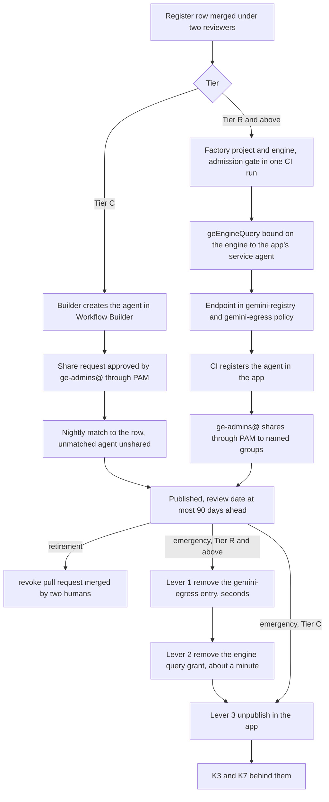

# 6. The Gemini Enterprise environment

## Status
- Owner: the platform owner
- Last reviewed: 2026-09-14

## What you will understand by the end

The objective's first sentence asks for "a secure Gemini Enterprise environment" through which every agent is secured. By the end of this chapter the reader knows why the platform keeps exactly one tenant app as the human front door, how that app reaches a secure baseline, how an agent is admitted, shared, reviewed and removed at each tier, what the front door enforces and what it only detects, and which parts are still a spike.

Of the risk themes in Chapter 3, The problem and its risks, this chapter contributes to three: shadow and third-party agents (an agent or connector nobody approved), manufactured silence (an administrator change nobody sees) and tenant compromise through the robot credential (a super-admin account reaching the assistant). Nothing here is built; on 2026-09-14 the app's project, `GEMINI_PROJECT`, exists (Assumption) and is to be imported.

## Why one app is the only front door

One Gemini Enterprise app per tenant is the front door for every human-facing agent, from a no-code agent made in an afternoon to Wall-E ([HLD §2.1](../01-hld.md#21-the-tenant-app-and-its-project)). Agents no human talks to, such as Eve's control path and Mo's jobs, are not published in it. There is no second production app; a spike gets a throwaway app deleted at the end (P59).

One app means one log naming the human behind each request, one set of toggles to drift-check, one population to gate and one gateway to bind; a second app would be a second front door with the same audience and none of the controls. The app project hosts nothing of any agent's — no engine, identity, secret, key or dataset — so a compromise of it reaches the front door and the query grants, never a credential or an audit table ([03 §2](../03-gemini-enterprise-environment.md#2-the-shape)).

Three Google facts fix the shape. The app project's Discovery Engine service agent calls every engine, so every agent project must grant it something. Agent Gateway supports Gemini Enterprise only in egress mode, so the front door gets an egress fence and no ingress screen. And a live app cannot be re-created without losing chat history and data stores, so the existing app is brought under management rather than replaced.

## Bringing the app to a secure baseline

### Placement

The factory's `tenant-app` module imports `GEMINI_PROJECT` in place and moves it under `fld-gemini-enterprise` in a dated change window with the Gemini Enterprise administrators' agreement; the window closes on the drift job's zero difference ([03 §3](../03-gemini-enterprise-environment.md#3-project-and-folder-placement)). If the administrators do not agree, the project stays in place as the one project outside the folder, and the module re-applies the floor, deny policy, `discoveryengine` Data Access configuration and sink at project level, with a review date (P48).

This departs from topology decision 52, which would have left the project outside the floor. Once `gemini-egress` enforces the register, the app project is a publication enforcement point, and an enforcement point outside the folder misses the controls that make it auditable. Organisation policy has a limit here: no documented `Engine` field covers the gateway binding or the console Model Armor setting, so both are detection-grade at the policy layer, watched by the drift job and a Security Health Analytics module whose support for the resource type is *tbd*.

### Location and encryption (P50)

The app lives in `eu`, with at-rest and processing residency in the EU multi-region ([03 §5.1](../03-gemini-enterprise-environment.md#51-location)). The features `eu` lacks, such as Grounding with Google Search, are not needed; `global` is allowed only for a feature the tenant needs that `eu` lacks, as a dated exception, never by moving the app. If GE-0 finds the app outside `eu`, the runbook stops: a new app is a decision record.

Encryption is where the import costs something ([03 §5.2](../03-gemini-enterprise-environment.md#52-encryption-p50)). Customer-managed keys protect only apps and data stores created after the key is registered, and the existing app is assumed to predate registration (Assumption, checked at GE-0). The position is Google-managed encryption for the imported app and the `europe` key `gemini-cmek` for everything created after GE-4, recorded once with the TISAX label decision (P20). Re-creating the app for a key was rejected because it loses history and data stores.

### Identity provider (P51)

Google allows one identity provider type per location and recommends Google Identity ([03 §6](../03-gemini-enterprise-environment.md#6-identity-provider-and-sso-p51)). The platform chooses it because the human in the request log is then a Workspace identity that joins the Workspace audit stream and every agent's audit row, because an action service can re-check live that the human is still in a Google Group, and because K5 needs a Google-identity super admin anyway. A workforce pool (P24) is "no" for the tenant app and open only for operators without a Google account.

The choice precedes the first user because changing the provider deletes users' conversation history and forces ingestion data stores to be re-created. A later change is therefore a decision record stating that loss, never a console act.

### Administration and feature management (P49, P54)

Changes to the front door are privileged and brief; reads are standing ([03 §4](../03-gemini-enterprise-environment.md#4-administration-who-holds-what-standing-or-elevated)). `ge-admins@` holds the Gemini Enterprise Admin role only through a one-hour Privileged Access Manager entitlement; `ge-readers@` holds the viewer role standing for the drift job; the CI identity holds `roles/discoveryengine.editor` as the one foreign principal. No human group holds the user role at project level, because that binding reaches every app in the project regardless of app-level policy.

A permission fact verified on 2026-09-13 shapes the lifecycle: `editor` can register an agent but not share it. Sharing stays a human act through PAM; a custom role letting CI share was not adopted, because the pipeline could then publish to every user without a human act. PAM turns every toggle, share, Model Armor flip or gateway unbind into a justified, windowed, logged act. Google refuses self-approval, so with one person at Tier C the entitlement activates without approval on a mandatory justification and the record says so; the value is the ticket and the window. The entitlement catalogue is Chapter 8, Identity, privileged access and the fleet kill switch.

Feature Management's 23 toggles are kept as a committed file, so any mismatch is a drift finding, on the principle that every toggle is a data path ([03 §8](../03-gemini-enterprise-environment.md#8-feature-management-baseline-p54)). Chat agents and workflows are on for `ge-builders@` and off for the population (whether they can be scoped to a group is unverified; if not, sharing approval alone governs builders). The model selector, memory, session sharing, skills and media generation are off. Sharing without administrator approval is off, because that approval is how a Tier C agent is admitted: a no-code agent is still a Tier C agent with a register row.

### The user population: three gates (P55)

A person reaches the assistant through three gates in series ([03 §7](../03-gemini-enterprise-environment.md#7-the-user-population-three-gates-p55)). The Workspace service toggle is on for the organisational units of `ge-users@`'s members and off for the robot accounts' unit, where turning it on is severity 1: a front-door session under a super-admin identity would be a second path into the tenant. App-level IAM grants the user role to `ge-users@` and `ge-builders@` only. Licences are assigned automatically at first sign-in, safe because a licence can land only on someone the first two gates admitted, and reviewed quarterly against membership.

On the assistant, Grounding with Google Search is off because Google's compliance controls do not apply while it is on; enterprise web search is off until a row needs it; uploads stay on because Model Armor screens them; and the banned-phrases list carries the super-admin tier's hard-denied vocabulary as a cheap detection-grade screen ([03 §5.3](../03-gemini-enterprise-environment.md#53-web-grounding-uploads-banned-phrases)).

Three neighbours live elsewhere: the console Model Armor setting (on, Block on failure, Tier C only) is Chapter 10, Agent Gateway, Model Armor and the perimeter; conversation retention (30 days as an Assumption until the DPO decides under P13) is Chapter 12, Data, logging, retention and sovereignty; the app's detections are Chapter 11, Monitoring, detection and incident response.

## An agent's life in the tenant app

Every tier starts with a register row merged under two reviewers, carrying `publish_to_gemini`, the audience groups, the EU AI Act class and the supplier rows ([03 §10.1](../03-gemini-enterprise-environment.md#101-the-lifecycle-per-tier), [HLD §2.2](../01-hld.md#22-how-agents-are-admitted-shared-and-revoked)).

### Tier C

A Tier C agent has no engine. The builder creates it after the row merges, an administrator approves the share, and the nightly reconciliation compares the app's agent list with the register: an agent without a row is a shadow agent, severity 2, unshared within one business day. A Marketplace agent enters through the Agent Gallery's request flow, approved only against a merged row with a supplier row. Reconciliation itself is Chapter 9, Registry, governance and the autonomy contract.

### Tier R and above

The agent first passes the factory and the admission gate (Chapter 9). CI then binds a custom role `geEngineQuery`, holding only the query permission, on the engine to the app's service agent; imports the endpoint into `gemini-registry` and the `gemini-egress` policy; and registers the agent in the app with a description stating that the responder is an AI system. `ge-admins@` shares it through PAM to named groups and CI verifies the result. The owner records that the identity on the agent's details page equals the engine's, and the drift job re-checks daily.

The grant is engine-scoped for a reason (P56). Google documents only a project-level role for cross-project agents, and it also carries create, update and delete on engines: the difference between "the front door can ask" and "the front door can replace". The factory tries the engine-scoped role first; if it fails, the project-level role is applied for that project only, as a dated exception re-tested at every redeploy, with a severity-1 detection for an engine mutated by the service agent. Two canonical pages disagree on who registers: [03 §10.1](../03-gemini-enterprise-environment.md#101-the-lifecycle-per-tier) has CI register, while step 13 of [05 §7.1](../05-registry-and-autonomy-contract.md#71-admission-end-to-end) has `ge-admins@` register through PAM.

### Review, retirement and emergency unpublish

Every row's review date is at most 90 days ahead or the share is removed; privileged rows are reviewed quarterly by the security reviewer. A Tier C agent retires by unsharing. Above Tier C, retirement is the factory operation `revoke`, a pull request merged by two humans: the gateway and registry entries go, the query grant goes, the agent is deleted from the app, a writing agent is halted, and project deletion is scheduled once the evidence export confirms. A Tier P revoke is also K3.

An emergency cannot wait for a pull request. For Tier C, the on-duty administrator unshares at any hour through PAM, with a justification if the approver is unreachable. Above Tier C, three levers are pulled in order of speed — the `gemini-egress` entry in seconds, the query grant in about a minute through the agent project's CI, then unpublishing — with K3 and the fleet kill switch K7 behind them (both Chapter 8). Who removes the gateway entry is unverified: the HLD names `ge-admins@` through PAM, while [03 §4](../03-gemini-enterprise-environment.md#4-administration-who-holds-what-standing-or-elevated) gives the policy write to the CI identity. And while the gateway is in dry run it only audits, so the first lever cuts reach only once the gateway's third stage enforces.

### What an app administrator can and cannot do

The administrator can register, unregister, share and unshare any agent, turn Model Armor off, change retention, flip toggles, unbind the gateway and see the human behind every request ([03 §10.2](../03-gemini-enterprise-environment.md#102-what-an-administrator-of-the-app-can-and-cannot-do-to-an-agent)). The administrator cannot change an engine, its code, identity, gateway or templates, which live in the agent project; cannot read an agent's audit tables or secrets; and cannot do anything silently, since each act is an Admin Activity entry under a PAM grant. Registering an unknown engine does not make it reachable: that needs the agent project's grant and a register-generated gateway entry.

## The tenant egress gateway `gemini-egress` (P57, P6)

### What it is for

Without a fence the app could reach an engine nobody registered, and "secure every agent through the environment" would be untrue. `gemini-egress` is an Agent Gateway in `europe-west1`, the region Google requires for an `eu` app, in egress mode with default deny ([03 §11](../03-gemini-enterprise-environment.md#11-the-tenant-egress-gateway-gemini-egress-p57-detailing-hld-p6)). Its access policy is generated from the register, so an unregistered engine is unreachable by network. Google states that binding routes all the app's traffic through the gateway, LLM calls included. Because a foreign-project engine must be registered in the gateway's project, `GEMINI_PROJECT` holds `gemini-registry`, written only by CI as a working set derived from the register, not a second inventory. Which principal the app presents to the policy is an Assumption until the dry-run log shows it.

### Three stages

P6, whether the app can be bound, is a spike carried by P57's protocol and stays in the register's [later group](../12-open-decisions.md#6-later) until enforcement ([03 §11.2](../03-gemini-enterprise-environment.md#112-the-decision-and-the-shape)). Stage 1 binds a throwaway app in dry run and answers whether dry run applies to an app binding, which principal and LLM hostnames appear, whether engine requests are routed at all, and the added latency. Stage 2 binds the tenant app in dry run for 30 days, producing the first honest inventory of what the front door reaches. Stage 3 enforces; "registered means reachable" and "unregistered means unreachable" become network facts. P57 requires enforcement before the first Tier W publication.

The price is availability: the assistant's model calls now traverse the gateway, so the front door joins the gateway and Model Armor availability domain (SLO Assumption: 99.5 %), probed every five minutes, and the platform never unbinds to recover. Rollback is an unbind by the same API call (Assumption), losing the fence and nothing else. If Stage 1 fails, the connector allow-list and per-engine grant stand as a recorded compensating control, re-tested at each Agent Gateway release.

### What it does not give

No ingress screen, which Google does not support for the app; no per-operation gating on plain REST; no screening of payloads to custom agents, which Chapter 10 places at each agent's own gateway ([03 §11.3](../03-gemini-enterprise-environment.md#113-what-it-does-not-give)). It gives one thing: the engines the front door can reach are exactly those the register names, enforced by a Google-managed proxy an administrator can bypass only with an audited `UpdateEngine`.

## Connectors and data sources (P58)

A connector is a credentialed data path into the tenant, so its allow-list is organisation policy at `fld-gemini-enterprise`, not a console list ([03 §12](../03-gemini-enterprise-environment.md#12-connectors-and-data-sources-p58)). Google's managed constraints restrict data sources and egress hostnames, but bind only perimeter projects or projects listed by number; the app project has no perimeter on day one, so it is listed. The initial list is first-party Workspace sources only (source ids *tbd*); each addition is a pull request with a supplier row and data-class declaration. The block on custom MCP data stores stays enforced: an MCP server reaches the front door only as a gateway-governed endpoint of a Tier R or higher agent.

No connector carries a Workspace write credential; connectors read with the user's permissions or a declared read-only identity, because Wall-E is the one write path. A write scope found in the quarterly OAuth review is revoked as an incident. Data stores are EU only. The cost is that every new source waits for review.

## Audit logging of the app

Gemini Enterprise is administered in the Google Cloud console and logs to Cloud Audit Logs under `discoveryengine.googleapis.com`, not to the Workspace admin stream; a detection written against the Workspace stream would stay silent ([03 §13](../03-gemini-enterprise-environment.md#13-audit-logging-of-the-app-itself)). Admin Activity entries, always on, record engine and assistant changes (toggles, gateway binding, Model Armor, retention), key and access configuration, and agent registration and sharing. Data Access entries, off by default, record the requests and the drift job's reads; they are switched on at the platform folder with no exemptions.

The `StreamAssist` Data Access entry is the only log that names the human behind a request; without it no agent's audit row ties to a person. It is routed to the locked bucket in `LOGGING_PROJECT` and the SIEM, kept 400 days (Assumption), and given a log view for the correlation query. It is also personal data, treated in Chapter 22, Personal data, employees and the works council. Only the per-unit service toggle is a Workspace admin-audit event.

## The runbook to baseline

Fifteen steps, GE-0 to GE-14, run in order, each with a verification ([03 §16](../03-gemini-enterprise-environment.md#16-runbook-bringing-the-environment-to-baseline)). They record the tenant facts, bring the project under management (import, move, folder constraints, audit configuration, key, groups, PAM), set the app (toggles, Assistant settings, Model Armor, a quota measurement), stage the fence (spike, 30-day dry run, enforcement), publish each Tier R or higher row, load the detections, and extend reconciliation and drift to the app. GE-14 includes a penetration test of the front door and its sharing, and closes the Tier C gate ([HLD §0.4](../01-hld.md#04-the-tier-gate-what-must-exist-before-a-tier-opens)).

The runbook does not wait for the factory to be ready for agent projects, which is Tier R's condition, but needs Stage 0's folder and `CORE_PROJECT`. The pages word this differently: the [design README](../README.md#maturity-what-exists-on-2026-09-13) says it needs no factory, while GE-2 uses the factory's `tenant-app` import module. Because steps run in order, the 30-day dry run falls before GE-14, so Tier C opens no sooner than about a month after the gateway is first bound.

## What is still unverified

None of these counts in a safety case until closed ([03 §18](../03-gemini-enterprise-environment.md#18-unverified-and-what-closes-each)).

| Unverified | Closed by |
|---|---|
| Dry run on an app binding; unbinding by an empty value; the principal the app presents; whether engine requests traverse the gateway | GE-9 spike |
| Whether the app calls engines with `streamQuery` | request logs at GE-12 |
| Whether the app predates CMEK; the edition that gates assistant settings | GE-0 |
| Context-Aware Access on the web app | GE-1 |
| The data-store ACL field for Workspace sources; data-source ids | GE-4 |
| Group-scoped builder toggles; the user and service-agent permission lists | GE-6; GE-5 |
| Security Health Analytics support for `Engine`; Autokey coverage | building the module; explicit key regardless |
| Google's TISAX coverage of Gemini Enterprise | P32, open |
| Who removes the `gemini-egress` entry in an emergency | *tbd* |

## Key decisions and what to read next

On 2026-09-14 the register holds as proposed: P48 placement (superseding topology decision 52), P49 administration, P50 location and encryption, P51 Google Identity (P24 "no" for the tenant app, open for operators), P52 retention at an interim 30 days under P13, itself open with the DPO, P53 the console Model Armor setting, P54 Feature Management, P55 the three gates, P56 the engine-scoped grant, P58 connectors and P59 one production app. P57 is a staged spike carrying P6.

Chapter 19, Threat model and residual risk, carries from here: the gateway binding and the Model Armor setting are detection-grade at the policy layer, so an administrator's change is seen, not prevented; until the gateway's third stage enforces, publication control rests on nightly reconciliation; custom agents have no ingress screen at the front door; the imported app stays on Google-managed encryption; Google's TISAX coverage is unconfirmed.

Read next: [03-gemini-enterprise-environment.md](../03-gemini-enterprise-environment.md), especially [§15, every control](../03-gemini-enterprise-environment.md#15-every-control-on-this-page); [05 §7.2](../05-registry-and-autonomy-contract.md#72-revocation-and-suspension) for revocation and suspension; [06 §3.5](../06-gateways-model-armor-perimeter.md#35-the-console-setting-tenant-wide-by-rule-per-app-by-mechanism); [07 §6.4](../07-monitoring-detection-incident-response.md#64-the-platform-set-and-the-agent-set) for the app's detections; [08 §5.2](../08-data-logging-retention-sovereignty.md#52-the-schedule) for retention; and the register's [group before the folder exists](../12-open-decisions.md#2-before-the-folder-exists).
