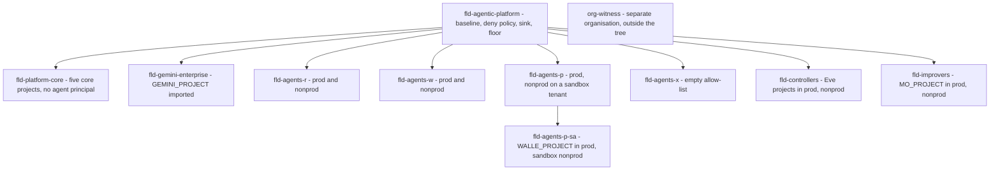
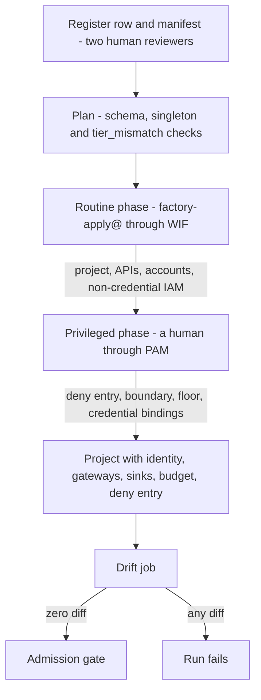

# 7. Landing zone and the tier model

## Status
- Owner: the platform owner
- Last reviewed: 2026-09-14

## What you will understand by the end

Why the platform is a folder tree, a factory and a tier model; what tiers C, R, W, P (with the super-admin singleton P-SA) and X are, how an agent is placed in one and what each mandates; how a project is made, named, labelled, budgeted and constrained without hand work; and which folder constraints Google enforces today and which are still spikes.

The chapter answers four risk themes of Chapter 3, The problem and its risks. Shadow agents: a hand-made or misnamed project is refused or found. A controller reachable by what it controls: Eve and Mo sit in folders where the identity that builds agent projects holds nothing. Tenant compromise through the robot credential: the super-admin agent is a singleton in the strictest folder. Staffing that makes two-person rules notional: from Tier W, making a credential holder takes two people. Because a tier is a folder, classification cannot drift from placement either.

## Why a folder, a factory and a tier model

Hundreds of agents, run at first by one administrator, force two things. Controls Google can enforce once — locations, enabled services, grantable principals — must sit above the agents, where one person owns them and no agent owner can undo them. Controls needing a second person, a bought desk or a sandbox tenant must attach only to the agents that need them, so harmless tiers open with the people who exist and dangerous ones wait (Chapter 4, The principles; [HLD §11](../01-hld.md#11-the-tier-model)).

The folder carries the once-set controls. The tier is the unit everything keys on: folder, factory module, monitoring baseline, metric pack, staffing, compliance gate. The factory makes one project per agent affordable, because a hand-followed runbook per agent is drift waiting to happen. None of it is built on 2026-09-14.

## The tiers

### Letters, not numbers

The tiers are lettered because the autonomy ladder already uses T0–T3 for trigger classes (chat, scheduled, event, inbox), and two vocabularies sharing four symbols would eventually put the wrong ceiling in code ([§1.1](../02-landing-zone-and-tiers.md#11-letters-not-numbers-and-how-the-briefs-t0tx-map)). "T1" is always a trigger class; a tier is always its letter. Controllers (Eve's shape) and improvers (Mo's) are folder classes, not tiers, and inherit the W-grade baseline.

### The admission test

The platform owner sets the tier once, in the register row; only a new row changes it. The test is mechanical so nobody can argue an agent down ([§1.2](../02-landing-zone-and-tiers.md#12-the-admission-test-which-tier-an-agent-is)). An agent that runs only inside the Gemini Enterprise console is Tier C. Otherwise: one that executes code it wrote, sets its own goals or has capabilities its designers cannot enumerate is Tier X, and its row is refused with `tier_x_closed`; one with no component holding a credential that can change a system of record is Tier R; one whose credential is not a tenant-level administrative right is Tier W; otherwise Tier P, or P-SA if the role is Super Admin.

Three rules close the loopholes. The credential decides, not the intent: a "read-only" agent whose token carries any write scope is Tier W, because Google enforces the scope and not the prompt. The highest component decides: an admin-role action service makes the whole agent Tier P. X is asked first, because no such agent is admitted in 2026.

### What each tier mandates

Each tier inherits the one below and adds controls; the design gives every control its resource, owner, verification and failure ([§1.3](../02-landing-zone-and-tiers.md#13-mandatory-controls-per-tier--what-the-platform-enforces-and-what-the-agents-code-must-carry), [HLD §11.1](../01-hld.md#111-tiers-and-mandatory-controls)). In outline:

| Tier | The platform enforces or requires, beyond the tier below | The agent's code must carry |
|---|---|---|
| C | Register row first, console Model Armor, feature toggles, EU data stores, connector allow-list, named-group sharing | Nothing the platform trusts |
| R | Factory-made project, Agent Identity, default-deny egress gateway bound at creation, fail-closed ingress gateway if machine-called, no Secret Manager, monitoring baseline, registry card, kill-switch reach, budget and labels | Read-only manifest families, declared hostnames, taint handling, the injection regression suite |
| W | Action service as sole credential holder, keyless per-duty accounts, platform verifier, Binary Authorization, private egress, recoverable Firestore, nonprod, named blind grader, second operator | Catalogue, policy chain, playbooks, `ladder.yaml`, hard-denied list, REST interlocks |
| P | Tier P gate line green before any credential, robot user account, dedicated Eve, SIEM and witness, internal-ingress perimeter, HSM approval keys, quarterly privilege review | As W, against a dedicated verifier |
| X | Empty service allow-list | Nothing is trusted |

The split tells a builder that identity, gateway binding, deny policy, boundary, baseline and admission gate exist before the repository does and cannot be changed by the agent's owner; it tells an assessor whether a control's evidence is folder policy Google enforces or code CI checks. The Tier W cap by grading capacity (P25, open) is Chapter 14, Scale and AGI readiness; the tier gate is Chapter 24, Roadmap and cost; the per-agent admission gate is Chapter 9, Registry, governance and the autonomy contract.

### P-SA: the super-admin singleton

Exactly one agent may hold `privilege: super_admin` — Wall-E. CI fails a second such register row until the first is `retired`, and the factory will not run for the P-SA folder until that check passes ([HLD §11.3](../01-hld.md#113-p-sa-the-super-admin-singleton), [§1.3 Tier P](../02-landing-zone-and-tiers.md#tier-p--privileged-own-project-under-fld-agents-p--and-p-sa)).

This is a policy, not a Google limit. Nothing narrows a super admin (Chapter 3), so the remaining compensation is to watch one actor closely; the super-admin detection set is written for one robot. The P-SA folder is stricter than Tier P, never looser: a service allow-list generated from Wall-E's register row, its own Model Armor floor with the hard-denied detectors, its own kill-switch binding drilled separately. It has no deferred control — the grant waits for the perimeter spike rather than running on IAM-only invoke as Tier W may. The robot account and the thirteen compensations are Chapter 15, Wall-E, the doer.

### Changing tier

A tier change is a new register row, a new project in the new folder and a `revoke` of the old; a project is never moved ([§1.5](../02-landing-zone-and-tiers.md#15-changing-tier-and-why-a-project-is-never-moved); P43, proposed). A move changes every inherited policy at once — constraints, deny entries, boundary binding, floor, sink scope — with no dry-run, and a "promoted" project would keep an engine created under a looser service list. Machines may only demote: Eve or the verifier can set a row `halted`, never write `tier`. The project-mover role is a PAM entitlement approved by the security reviewer, and a move raises a SIEM rule. The one exception is the import of `GEMINI_PROJECT` (Chapter 6, The Gemini Enterprise environment).

## The folder tree

Everything sits under `fld-agentic-platform`, which carries the baseline, the deny policy, the boundary template, the Model Armor folder floor, the aggregated sink, Data Access audit configuration and PAM entitlements; no project sits directly under it ([§2.1](../02-landing-zone-and-tiers.md#21-the-tree)).

What each folder is for ([§2.2](../02-landing-zone-and-tiers.md#22-every-folder-its-purpose-its-policy-additions-who-may-create-below-it)):

- **Core** holds `CORE_PROJECT`, `LOGGING_PROJECT`, `CICD_PROJECT`, `VALIDATOR_PROJECT` and `KMS_PROJECT` (keys only), five core projects in all ([register §7 row 6](../12-open-decisions.md#7-values-that-differ-between-pages)). What is shared there is Chapter 5, Architecture overview.
- **Tier folders R, W, P** hold one project per agent; service lists widen by tier. R lacks Secret Manager and signing keys, so it has no write path to enable; W adds credential and control-plane services, Binary Authorization and private egress; P adds Access Approval, HSM-only key rings and a second approver on deploy grants.
- **P-SA** sits under P, inheriting all of it and tightening it.
- **X** cannot hold anything until a dated decision records each opening condition (Chapter 14).
- **Controllers** allow Vertex AI at the folder but deny it on `EVE_PROJECT` at project level, because a folder denial would strip the reporting path of its model; Eve's "deterministic by absence" rests on that drift-checked project constraint.
- **Improvers** hold Mo, with no Secret Manager, no keys and no invoker on any credential holder.

The controller and improver nonprod folders exist because Eve must be drilled against the sandbox tenant before the super-admin grant, not against production with a robot already holding Super Admin (P40).

## Why project-per-agent is forced

Google leaves no safe alternative ([topology §1](../../project-topology.md#1-why-four-projects), [§3.1](../02-landing-zone-and-tiers.md#31-why-project-per-agent-is-forced)). All Agent Runtime agents in one project and region bind to the same gateways, so two agents would share one egress allow-list. The tenant app's documented cross-project grant, the Discovery Engine service agent role, is project-wide over every engine with create, update and delete; the platform uses an engine-scoped role instead, but a fallback must touch one agent only. Model Armor quotas are per project, ExternalProcessor counted where the gateway lives. And deleting a project should remove one agent and nothing else. The cost — hundreds of projects, each with IAM, services, budget and owners — is a register row per agent because the factory makes it and the drift job checks it.

## The factory

### What it is built on

Cloud Foundation Fabric's `project-factory`, `folder`, `organization`, `billing-account` and `agent-gateway` modules, pinned at v58.0.0 and re-pinned only by pull request, wrapped by thin platform modules and run by Cloud Build in `CICD_PROJECT` ([HLD §3.2](../01-hld.md#32-the-factory), [§3.2](../02-landing-zone-and-tiers.md#32-tooling-decision-p35-closing-hld-p2); P35, proposed, closing P2). Fabric already manages projects, services, IAM, policies, labels, contacts, sinks and budgets from YAML; a one-person team should not maintain a second factory. Where Fabric cannot express an input, it becomes a wrapper resource, never a fork. FAST stages were rejected because they assume ownership of the organisation's IAM, sinks and billing, and the platform is a folder; Config Controller because it is a permanently running control plane with a powerful reconciling identity; Infrastructure Manager until the team is larger than one.

### Inputs and modules

The register row and `agent-manifest.yaml` are the only inputs; nothing is typed at a command line. Cross-project grants — who may invoke control endpoints, read the audit dataset, subscribe to a topic — are list fields in those inputs, so a grant exists only because a reviewed row asks for it (the grant table is Chapter 5's). Five modules exist ([§3.3](../02-landing-zone-and-tiers.md#33-the-three-modules-and-the-topology-rows-they-consume)): the three project wrappers `agent-project`, `verifier-project` and `improver-project`, plus `tenant-app` for the one-off import and `revoke` for retirement.

In under an hour an agent gets a project with APIs, identities, gateways, datasets, log view, budget, labels, contacts, registry card and deny-policy entry. Secrets are created empty and filled by the agent's runbook. First revisions deploy as the project's own `<agent>-deployer@`. Every run ends with the drift job reporting zero diff for project and folder; any diff fails the run and the admission gate. Standing `roles/owner` is removed after the run, and later repair is a PAM grant (Chapter 8, Identity, privileged access and the fleet kill switch).

### The CI identity and the two-phase apply

The identity that can create any project is the platform's most attractive target, and the folder controls "set once and enforced by Google" must not be changeable by the identity that runs forty times a month. Each run therefore has two phases held by different identities ([§3.4](../02-landing-zone-and-tiers.md#34-the-ci-identity-and-the-two-phase-apply-p36); P36, proposed, narrowed by P142, proposed 2026-09-13).

**Routine phase.** `factory-apply@CICD_PROJECT` is impersonated through Workload Identity Federation pinned to the git host's numeric owner and repository ids and `main`; there is no key. Impersonation beats direct federated access because every grant names one auditable principal that a boundary (`pab-core-ci`, confining it to the platform folder) and the deny policy can name, and it survives a change of git host (P22, open). It may create projects, services, accounts and custom roles on the R, W, P and improver folders, and is the sole standing registry writer. It binds roles inside projects only through conditional bindings listing non-credential roles — never secret access, key use, invocation, impersonation or IAM administration — and deny rule R6 fences the same permissions from the other side. It holds nothing on the P-SA and controller folders.

**Privileged phase.** A human with a time-boxed PAM grant, justified by the pull request, applies what could redraw boundaries or reach a credential: the deny entry, boundary binding, policy exceptions, project floor and credential-path bindings. At Tier R the platform owner runs both phases; from Tier W the security reviewer approves. P-SA and controller projects are applied end to end under `ent-factory-singleton`, requested by the factory and approved by two named approvers for P-SA, or the Eve owner or security reviewer for controllers, never the Wall-E owner.

**Grade.** The fence is detection until a negative test in nonprod — the factory trying to bind Secret Manager access and read a canary secret — is refused on both counts; it reruns at every factory release, and a success is severity 1 that disables the factory trigger. `Assumption:` the platform may link projects to the billing account; if not, billing links and budgets move to the privileged phase.

## The organisation-policy baseline

### The families and why

The baseline is Terraform at the platform folder, applied in the privileged phase and drift-checked within minutes; every new constraint spends at least 14 days in dry-run first ([HLD §3.3](../01-hld.md#33-organisation-policy-baseline-at-fld-agentic-platform), [§4.1](../02-landing-zone-and-tiers.md#41-the-baseline-every-constraint-by-exact-name); additions P41, proposed). Each family removes a class of misconfiguration the drift job would otherwise chase:

- **EU residency** without per-project checklists; `global` only if the first factory run proves the folder floor-setting write needs it, then as a dated exception for that resource type.
- **Keyless service accounts**: no key creation or upload, no automatic grants to default accounts.
- **Allowed member domains**: the tenant plus an enumerated list, never the witness; the nonprod P folders add the sandbox tenant.
- **Bindings, not attachments**: no cross-project service-account use.
- **Storage**: uniform bucket-level access, public-access prevention, detailed audit logging for the evidence buckets.
- **TLS and network**: no TLS 1.0 or 1.1, no external IPs, no default network, no public Cloud SQL.
- **Contacts and federation**: Essential Contacts in the tenant domain; only the git host may federate in core.
- **Keys**: HSM-only with a 30-day destruction delay; CMEK constraints held (Chapter 13, Supply chain, keys and recovery).
- **Cloud Run**: Binary Authorization on four folders — W, P (so P-SA), controllers and core, because the kill and authority paths are Cloud Run; private egress on W, P and controllers. Internal-only ingress is written but held until P3's spike; until then IAM-only invoke is the enforced boundary and a Security Health Analytics module flags open ingress (Chapter 10, Agent Gateway, Model Armor and the perimeter).

Two open edges: the access-policy-binding constraint is spelled singular in Google's constraints reference and plural on its Agent Gateway set-up page and in the Wall-E set, confirmed at the first factory run ([§7 row 10](../12-open-decisions.md#7-values-that-differ-between-pages)); and no policy can require a registry entry, which stays reconciliation (Chapter 9).

### Service allow-lists

`gcp.restrictServiceUsage` runs in allow-list mode on every folder ([§4.2](../02-landing-zone-and-tiers.md#42-gcprestrictserviceusage-per-folder--the-allow-lists); P44, proposed). It carries several claims at once: Tier R cannot enable Secret Manager; X is empty; no tier folder allows the Agent Registry API, so the shared registry stays the only one; the Gemini folder never allows Vertex AI. It is also the fleet kill switch's first lever: allow and deny modes exclude each other, so the lever replaces a tier folder's policy with a pre-written one lacking Vertex AI and Cloud Run (Chapter 8). The exact lists are an `Assumption:` until the first nonprod factory run, where a missing service fails closed and the fix is a pull request, never a console edit.

### Custom constraints and their spikes

Custom constraints turn detection into enforcement only where Google supports the resource type and a test has proved the refusal ([§4.3](../02-landing-zone-and-tiers.md#43-custom-constraints-what-is-verifiable-today-and-the-spike-list-p42-p4-partly-closed); P42, proposed with three spikes; P4, spike, half closed).

Verifiable today: Google's two gateway constraints binding an engine to its allow-listed gateways; a Cloud Run constraint requiring the Binary Authorization annotation, closing P4's Cloud Run half; project-id and folder-name constraints and an auth-provider constraint, all Preview; a data-store ACL constraint in dry-run (Chapter 6). Internal ingress is verifiable but held with P3. The gateway constraints target `ReasoningEngine`, absent from Google's supported custom-constraint types on 2026-09-13 though Google publishes them, so they count as enforcement only after a throwaway engine is refused in nonprod.

Spikes: an allow-policy constraint against basic roles and foreign members (does it fire on PAM's own grants; does the organisation principal set cover agent identities); `identityType` on `ReasoningEngine`, P4's other half; and, low priority, a log-sink constraint against actor exclusions. Requiring labels is impossible, since a project exposes only parent and id. For `identityType` the register records the resolution ([§7 row 8](../12-open-decisions.md#7-values-that-differ-between-pages)): the spike reruns at each factory release, and until it passes the engine half of D2 is a CI check graded detection.

## Non-production and the sandbox tenant

Nonprod is optional at Tier R, mandatory from Tier W and for controllers and improvers ([§3.5](../02-landing-zone-and-tiers.md#35-the-non-production-split-p40); P40, proposed): a gate change must not first execute as the production credential holder, and Tier R has no credential to protect. Nonprod uses the same manifest and ceilings, holds no production credential and is never reachable from the tenant app. Promotion is an attestation on the same digest, or the same recorded bundle hash for Agent Runtime, detection-grade there. Agent Platform Threat Detection is learned in nonprod on one unbound agent at a time.

Tier P and P-SA nonprod is a separate sandbox Workspace tenant, never an organisational unit: Super Admin cannot be limited to an organisational unit, so a sandbox OU contains nothing once its robot is a super admin. The member-domain constraint admits the sandbox only in the nonprod P folders. The sandbox must exist before Wall-E's Stage 1 — another tenant for one administrator to run.

## Naming, labels, budgets, contacts and quotas

### Naming and labels

Reconciliation and SIEM rules attribute by name ([§3.6](../02-landing-zone-and-tiers.md#36-naming-and-the-label-taxonomy-p37-p38); P37, P38, proposed). Folders are `fld-<purpose>[-<tier>][-<env>]`; project ids `agp-<tiercode>-<agent>-<env>`, such as `agp-psa-walle-prod`; handles like `WALLE_PROJECT` remain variables the register maps.

Google decides the carriers. Names can be refused at the API by the Preview constraints; labels cannot, and exist only on projects. So labels go on every project, validated before creation and reconciled daily, for billing export and log views; tags bound at folders and inherited serve policy conditions — hence `tier` and `env` twice, and TISAX scope as a tag. The register holds exact values; the label is an index. A label disagreeing with its row is severity 3; a `tier` label disagreeing with its folder tag is severity 2, a hand edit to change a default. The registry entry has no labels either; its metadata is a fixed first description line carrying the row's hash (Chapter 9; [registry page §3.1](../05-registry-and-autonomy-contract.md#31-where-the-metadata-lives-p72)).

### Budgets, contacts and billing export

Each project gets a budget at its tier default, alerting at 50, 90 and 100 % of actual and 100 % of forecast, with an aggregate per tier by label; events publish to `budget-events` in `LOGGING_PROJECT` ([§3.7](../02-landing-zone-and-tiers.md#37-budgets-per-tier-p39-the-amounts-stay-p31); P39, proposed). Nothing disables billing automatically: that would stop the evidence pipeline first, and the stop levers are the drilled kill switches. The defaults — `Assumption:` 100 EUR a month at R, 300 at W and core, 500 at P and P-SA, 200 for controllers and improvers, nonprod half — are P31, open. Essential Contacts go to the platform security and owner groups at the folder and each project's owner group. A label-keyed billing export feeds cost metrics, marked unavailable when stale, never estimated.

### The quota register

A Model Armor quota error behind a fail-closed gateway stops the agent, so quotas are tracked ([HLD §3.4](../01-hld.md#34-labels-budgets-contacts-quotas)). First row: the tenant app's 1,200 QPM sanitize quota, which serves all assistant traffic and scales with headcount. Then Model Armor 1,200 QPM sanitize and 600 QPM ExternalProcessor per agent project; Agent Gateway 5,000 resources; Agent Registry 100 entries per project and 1,200 requests per minute per region, increase requested at 60 % occupancy; Agent Runtime *tbd*. The platform owner reviews it quarterly; values sit under P31.

## How the landing zone is verified as a whole

Continuously, not once ([§6](../02-landing-zone-and-tiers.md#6-verification-of-the-landing-zone-as-a-whole)). An asset feed and a nightly Terraform plan catch any difference as severity 2, naming its maker; Terraform wins within one business day. Nightly checks confirm constraints are enforced rather than lingering in dry-run, allow-lists match, the factory identity's bindings and conditions match (a forbidden role is severity 1), and no project breaks the pattern. The kill switch is drilled monthly per tier folder, P-SA separately; the Tier P gate checklist is checked on every pull request; the witness's separation is attested quarterly.

## What remains open

The shape costs attention more than money: a security reviewer, who does not exist on 2026-09-14, for every Tier W factory run; a second Workspace tenant; 14 days per new constraint. Unsolved: the `identityType`, allow-policy and log-sink spikes; gateway constraints awaiting a refused test engine; the factory fence awaiting its negative test; internal ingress awaiting P3; allow-lists, the `global` exception and a constraint spelling awaiting the first factory run; labels detection-only; budget and quota numbers; the git host. Chapter 19, Threat model and residual risk, keeps the engine identity constraint out of every safety case until its spike passes.

## Key decisions and where to read next

| Decision | State on 2026-09-14 |
|---|---|
| P35 factory tooling (closes P2) | proposed |
| P36 CI identity and two-phase apply, narrowed by P142 | proposed |
| P37 naming, P38 labels, P39 budgets, P40 nonprod, P41 baseline additions, P43 tier as folder, P44 allow-lists | proposed |
| P42 custom constraints | proposed, three spikes |
| P4 engine identity constraint; P3 perimeter | spike |
| P31 budget and quota amounts; P25 Tier W cap; P22 git host | open |

- [Landing zone and the tier model](../02-landing-zone-and-tiers.md) — every control, folder, module, constraint and allow-list by name
- [HLD §3](../01-hld.md#3-the-landing-zone) and [§11](../01-hld.md#11-the-tier-model)
- [Project topology §1](../../project-topology.md#1-why-four-projects)
- [Register §2, before the folder exists](../12-open-decisions.md#2-before-the-folder-exists)
- Chapter 8 for the deny policy, boundary and kill levers; Chapter 9 for the register row and admission gate; Chapter 24 for the tier gate and build order
