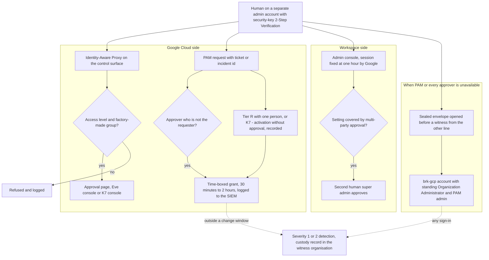
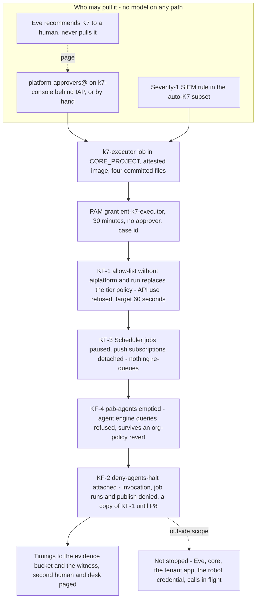

# 8. Identity, privileged access and the fleet kill switch

## Status
- Owner: the platform owner
- Last reviewed: 2026-09-14

## What you will understand by the end

This chapter answers the first risk theme of Chapter 3, tenant compromise through the robot credential, from the identity side; Chapter 11 answers it with detection and Chapter 15 with Wall-E's code. It also carries part of two other themes. The first is staffing that makes two-person rules notional: the chapter says which two-person rules Google enforces and which rest on people. The second is a controller reachable by what it controls: Eve stays outside the fleet kill switch.

By the end you will know:

- who and what may act on the platform, how each principal authenticates and what it may never hold;
- the two fences around every agent principal and what each cannot stop;
- how a human reaches a dangerous permission briefly, with a justification and visibly;
- how the super-admin roster stays at three with the robot never the recovery account;
- how K7 stops every agent in a tier from outside its own project.

The design of record is [page 04](../04-identity-and-privileged-access.md). Nothing here is built.

## The principles, stated once

1. **Identity is issued by Google or does not exist on the platform.** No keys, no passwords in code, no shared accounts. `walle@` and `eve@` are the only user accounts a machine drives.
2. **Dangerous rights are never standing.** Anything that can redraw a trust boundary is a time-boxed grant with a justification. From Tier W, the approver is not the requester.
3. **Two fences that fail differently.** The deny policy is exact but covers only the permissions it names. The Principal Access Boundary is broad but only as strong as its enforcement version. Neither alone is the safety case.
4. **One door for humans.** Every control surface is reached through Identity-Aware Proxy, with an access level, by a factory-made group.
5. **A kill switch no agent project can undo.** It is pre-written and drilled monthly.
6. **Workspace's two-person mechanisms are turned against the robot**, because the robot is a super admin.
7. **No domain-wide delegation, for any agent, at any stage.** Chapter 4 states this as a constraint; the mechanism behind it is this. Delegation is a tenant-wide capability limited only by OAuth scopes, so a compromised delegate can act as anyone, a super admin included. A delegated verifier could also impersonate the robot it verifies. So each robot holds its own consented refresh token and is never impersonated, and no other agent holds a Workspace credential. Granting delegation is a super-admin task under multi-party approval, and it is on the hard-denied list ([page 04 §1](../04-identity-and-privileged-access.md#1-principles-inherited-stated-once)).

## Agent Identity for every reasoning layer

Every layer that reasons runs under a Google-issued agent identity rather than a service account someone could impersonate. The principal belongs to the engine and uses 24-hour certificates and bound tokens.

For Agent Runtime, the agent identity type is GA. The factory sets it, and CI refuses an engine config without it. The organisation-policy constraint that would make Google enforce it is spike P4 (Chapter 7, Landing zone and the tier model). Until P4 passes, the engine half is a CI check graded as detection.

Agent Identity for Cloud Run is Preview on 2026-09-13. It runs in nonprod now and goes to production when GA (P5, open). Meanwhile a production Cloud Run reasoning service on an attached service account is a dated Tier R exception, refused from Tier W. Gemini Enterprise no-code agents carry the product's own identity.

The trust domain is organisation-wide: `agents.global.org-ORG_ID.system.id.goog`. One environment line removes the protection against reusing an agent's token on Google Cloud services: `GOOGLE_API_PREVENT_AGENT_TOKEN_SHARING_FOR_GCP_SERVICES=False`. CI refuses it fleet-wide. A daily Security Health Analytics module also looks for it; a hit is severity 1, with K3 on the agent.

Google's two automatic agent roles have unverified permission lists, so they are diffed at every release and a forbidden permission blocks it. The Vertex AI Express User role is never granted: bound at project level, it would let an agent query its own engine as any operator ([page 04 §2.1](../04-identity-and-privileged-access.md#21-agent-identity-for-every-reasoning-layer-promotes-wall-e12-1); [HLD §4.1](../01-hld.md#41-agent-identity-for-every-reasoning-layer)).

## The three principal populations

**Agents**, meaning their reasoning layers, hold:

- invoker on their own action service, granted on the resource;
- the automatic roles;
- basic usage, browser and log-writer roles in their project.

They never hold a secret read, an IAM-policy write, a deploy permission, a key, a token-creator role or anything outside `fld-agentic-platform`.

**Machines that are not agents** are keyless service accounts, one per duty: action services, dispatchers, deployers, Eve's limbs, Mo's readers, and `platform-drift@`, `k7-executor@` and `factory-groups@` in core. Each holds exactly the rows the factory generates from the register.

**Humans** use the tenant's Google identities, on admin accounts separate from their daily ones above Tier R. They hold group memberships, PAM eligibility and IAP access. They never hold a standing owner or editor role, a catalogue role, or impersonation on a credential holder ([page 04 §2.2](../04-identity-and-privileged-access.md#22-the-three-populations-with-what-each-may-hold); [HLD §4.2](../01-hld.md#42-the-three-principal-populations)).

Naming "all agents in a project" is not settled, and Google's pages disagree.

- The allow-policy pages write `attribute.platformContainer/aiplatform/projects/N`.
- The boundary page writes `attribute.container/projects/N`, with no `principalSet://` prefix.
- Google's deny example uses a third form.

The factory emits the first spelling for allow and deny, and the second for boundary bindings. Whether a deny policy accepts an agent principal set is `Assumption:` until a throwaway engine proves the spelling (P8, narrowed by P61). The template is corrected from that evidence, never from a page. Register row 11 stays open: Wall-E's identity page carries only the allow spelling ([register §7](../12-open-decisions.md#7-values-that-differ-between-pages)).

## Service-account policy

Seven rules are set once at the folder, applied by the factory and asserted by the drift job, because hundreds of projects cannot be kept right by review ([page 04 §2.3](../04-identity-and-privileged-access.md#23-service-account-policy)).

- **SA-1, no keys.** Also denied in the deny policy. An existing key is severity 1.
- **SA-2, no cross-project attachment.** Every crossing is a binding on a resource.
- **SA-3, one account per duty.** An account that reads a credential never holds a deploy permission, and the reverse, so a compromised deploy path cannot read the secret beside it.
- **SA-4, no standing owner or editor after the factory runs.** The factory's CI identity holds project IAM administration only as bindings conditioned to non-credential roles, and nothing on the P-SA and controller folders (P142, Chapter 7).
- **SA-5, impersonation is enumerated.** Only an agent's operator-caller account and its deployer can be impersonated. No human ever impersonates an action service or `eve-controller@`.
- **SA-6, every account's reach is a generated row.** Anti-grants are asserted daily: the agent reads no secret, Mo invokes no credential holder, and no agent appears in another agent's project.
- **SA-7, default service accounts get nothing.**

## Groups and workforce identity

A human is never bound directly to a resource; a group is. Group names follow a pattern the factory enforces, and every platform group carries the irreversible security-group label, which admits only domain members.

`factory-groups@` creates agent groups from each agent's two-reviewer `operators.yaml`. It holds the Workspace Groups Admin role (`Assumption:` assignable to a service account through the Admin console), and drift in agent groups is corrected on its next run.

The **control groups** are handled differently: the platform owners, security, approvers, app admins, Eve's owners, Wall-E's operators and protected set, and Eve's console audience. They are on a hand-managed, two-human-merged list that the job refuses in code. A live membership change without a merge is a severity-1 page and is never auto-corrected. A robot that could edit `eve-owners@` would be a path around Eve's independence (P65, proposed).

No workforce pool exists until operators without Google identities exist (P24, open for operators). If one is needed, P64 fixes its shape: one organisation-level pool, one-hour sessions, programmatic sign-in disabled and services limited to the control surfaces.

That shape has consequences. Such an operator has no `gcloud`, so can pull K0, K1 and K4 from a page, but never K2, K3 or K5. Google offers workforce users no device-based access level, so they get only an IP-and-time level and never reach a Tier P surface. Whether Google identities and a pool can share one IAP surface is unverified, so a workforce population gets its own ([page 04 §2.4](../04-identity-and-privileged-access.md#24-groups-made-by-the-factory-named-by-convention-reconciled-daily), [§2.5](../04-identity-and-privileged-access.md#25-workforce-identity-for-non-google-operators-only-if-p24-says-yes)).

## The identity drift job

`platform-drift@CORE_PROJECT` holds the security reviewer role at `fld-agentic-platform` and receives the folder's Cloud Asset feed, which surfaces IAM and organisation-policy changes within minutes. It asserts the service-account rules, groups, identity types, every deny rule and boundary binding against the committed copy, no standing catalogue role, every surface's access condition, the break-glass role set, K7's levers absent in normal state, and per-agent checks such as one engine per project. A missing report for 26 hours is itself an alarm.

The folder-level role breaks the one rule that cross-project reach is a grant on the resource. Because it is inherited into `EVE_PROJECT`, it also breaks decision 48. It is therefore a named exception dated 2026-09-13, accepted because one reader is the only way to see drift across hundreds of projects ([page 04 §2.6](../04-identity-and-privileged-access.md#26-the-identity-drift-job-promotes-wall-e12-10-and-hld-47); [topology §3.1](../../project-topology.md#31-notes-the-table-cannot-hold)).

## The folder deny policy

`deny-agents-platform` is attached at `fld-agentic-platform` and evaluated before any allow grant. It names each agent project's agent set and service-account set, plus `MO_PROJECT`'s accounts, so Mo is fenced by enforcement rather than by a missing grant.

No core, controller or Gemini Enterprise principal is denied under R1–R5, because the drift job, the K7 executor and Eve must keep working under every lever. The rules:

- **R1, secrets.** Exempt: each action service's own account and `eve-controller@`, whose scope is then the grant on their one secret.
- **R2, signing and key IAM.** Exempt: `eve-controller@` alone, so no agent, Mo identity or deployer can sign an approval.
- **R3, impersonation and keys.** A separate rule, R3b, lets the per-project deployer act as its attached accounts without lifting the rest of R3.
- **R4, self-modification of services, jobs, engines, artefacts and builds.** Exempt: the deployer.
- **R5, governance and evidence.** No exceptions. It covers organisation policy, sinks, log buckets, dataset, bucket, project and folder IAM, boundaries, custom roles, Model Armor floors, registry entries, auth providers and PAM.
- **R6, the routine factory identity.** It is denied every credential permission, and a canary secret read at every release proves it.

Every permission name was checked on 2026-09-13 against Google's list of permissions deny policies support. The check matters because an unlisted name raises no error: the rule silently never matches, and the policy looks complete while denying less. The check changed three things:

- the streaming-query name is absent, so the rules use the engines wildcard;
- Scheduler is not deniable, one reason K7 has a lever of its own for it;
- deny policies themselves are not deniable, so deny administration is PAM-only and every deny-policy write is severity 1.

Changes usually apply within two minutes but can take seven or more. The grade is enforcement, with the principal spelling still a spike (P61). Two landing-zone fences sit beside it: `pab-core-ci`, which confines the factory and drift identities to the platform folder (Chapter 7), and `deny-core-agents`, which denies every agent principal everything on the core folder once P8 proves the principal forms, with the drift job asserting absence until then ([page 04 §3](../04-identity-and-privileged-access.md#3-the-folder-deny-policy-deny-agents-platform-with-verified-permission-names); [page 02 §4.4](../02-landing-zone-and-tiers.md#44-deny-policy-and-pab-at-the-folder--what-this-page-adds)).

## The Principal Access Boundary

`pab-agents` is an organisation-level policy, bound by the factory to each agent project's set. Its resources are the platform folder plus the named core resources agents need, never a whole core project. The singleton binds a stricter twin whose only resources are `WALLE_PROJECT` and the approval surface. The enforcement version is pinned to 4, so a bump is a reviewed change.

Google states that a boundary has no effect on permissions outside its enforcement version, so the design read the blocked list. Version 4 blocks:

- all Vertex AI permissions, engine queries included;
- secrets, keys and impersonation;
- storage, BigQuery and Pub/Sub;
- organisation policy, Artifact Registry and Cloud Build;
- Cloud Run deploy and job runs.

It does not block Cloud Run route invocation. The boundary is therefore enforcement-grade for engine queries and the blocked families, and **no fence for Cloud Run invocation**. "An agent cannot invoke a foreign action service" rests on resource-level invoker grants plus the deny policy.

This is P60, which closes P9 and sets trust boundary B7's grade in Chapter 5, Architecture overview ([page 04 §4](../04-identity-and-privileged-access.md#4-the-principal-access-boundary-pab-agents-and-what-it-can-and-cannot-fence), [§4.3](../04-identity-and-privileged-access.md#43-the-policy-and-its-grade--p9-answered)).

## Privileged Access Manager

No standing owner exists anywhere. Humans reach dangerous roles through entitlements that require a ticket or incident id, notify `platform-security@` and are reviewed quarterly as TISAX access-review evidence. Facts verified on 2026-09-13 shape the catalogue:

- **No self-approval, enforced by Google.** One-person operation at Tier R is an entitlement that activates without approval, with a mandatory justification. It is recorded as such and switched to an approver the day a security reviewer exists.
- **Durations.** An entitlement lasts at most seven days, and no grant is shorter than 30 minutes.
- **Approval levels.** Two-level approval is Preview, so for now two named approvers share one level.
- **No legacy basic roles.** PAM does not support them, so the per-project repair entitlement bundles predefined roles instead of `roles/owner`.
- **Organisation-only roles.** Organisation-policy and deny administration can be granted only at the organisation. Their entitlement, with boundary administration, sits there. It is the highest on the platform and needs two approvers.
- **PAM cannot bootstrap itself.** So the PAM administrator role is the one standing administrative role, held by `platform-owners@`. Its use outside a change window is severity 2.

The catalogue ([page 04 §5.2](../04-identity-and-privileged-access.md#52-the-catalogue)) covers:

- project repair, up to two hours;
- deploying a credential holder outside CI, approved by the second reviewer and never by the agent's owner;
- reading one secret, 30 minutes;
- folder administration and platform policy;
- tenant app administration;
- the one-time `GEMINI_PROJECT` move;
- the factory's singleton applies;
- witness export repair;
- two K7 entitlements.

The K7 entitlements deliberately need no approver, because a fleet stop must not wait at 03:00. Their second person is the page every activation sends, and the two-human recovery. A standing catalogue role is severity 1 and is removed by the pipeline. A grant outside a change window without an incident id is severity 2 (P62, proposed; [page 04 §5.1](../04-identity-and-privileged-access.md#51-facts-verified-on-2026-09-13)).

## Human access to control surfaces

Every control surface is a Cloud Run service with IAP directly on it. The surfaces are the approval pages, Eve's console, the ladder-state page, the registry viewer and `k7-console`. Each admits one group under an access-level condition. If IAP, the condition or the group is missing, the pipeline removes the proxy's invoker binding, so the surface goes dark rather than open.

- **`al-platform-operator`** requires a managed, encrypted, screen-locked device on an approved operating system and the corporate network. Device attributes need a Chrome Enterprise Premium licence, which is *tbd*.
- **`al-platform-operator-lite`**, IP ranges plus business hours, serves Tier R, and every surface until the licence exists, as a dated exception. The super-admin approval page never accepts lite.

An access level cannot express "signed in with a security key". That comes from two Workspace settings on the admin and operator units: key-only 2-Step Verification, and Google Cloud re-authentication with a key every hour (P63, proposed).

Some things no human does:

- hold invoker on an action service;
- impersonate a credential holder;
- sign in to `walle@` or `eve@` after bootstrap;
- drive the Admin console under the robot's session.

([page 04 §6.3](../04-identity-and-privileged-access.md#63-the-access-levels), [§6.4](../04-identity-and-privileged-access.md#64-the-surfaces), [§6.5](../04-identity-and-privileged-access.md#65-what-a-human-never-does))

## Break-glass

Break-glass covers the two failures PAM cannot: PAM itself broken, or every approver unreachable. On Google Cloud it is two Cloud Identity accounts, `brk-gcp-1@` and `brk-gcp-2@`, in their own unit, with key-only 2-Step Verification and no recovery options. They hold standing Organization Administrator and PAM administrator at the organisation, because break-glass is for when PAM cannot be used.

- **Custody.** Each hardware key is sealed in the safe and each password is in the vault under a separate custodian. Key 1 is the platform owner's, key 2 the second human's in IT security.
- **Opening.** Opening an envelope needs a witness from the other line and a custody record in the witness organisation's bucket, which survives a tenant compromise.
- **Detection.** Any sign-in is severity 1, and so is any change to the two roles.
- **Drill.** Every quarter, alternating accounts: open, sign in, activate nothing, re-seal, rotate the password, all within 30 minutes.

Workspace has no PAM, so there the two human super admins are the break-glass. Each has a separate admin account, two keys with the spare in the other's custody, sealed backup codes, and self-recovery Off, so recovery runs through the other super admin or Google Support (P69, proposed; [page 04 §7](../04-identity-and-privileged-access.md#7-break-glass-accounts-and-their-custody)).

## The robot accounts' shared rules

`walle@` and `eve@` share one set of rules. Each account's full hygiene set belongs to Chapter 15, Wall-E, the doer, and Chapter 16, Eve, the independent controller.

- **Placement and sign-in.** Both sit in `/Automation/Service Identities`, with the tenant's own hardware-key-only 2-Step Verification, which matters because Google's admin enforcement is a gradual rollout limited by edition. Two keys per account are in the safe.
- **No recovery.** There are no recovery channels, since an unmonitored recovery channel is a takeover channel, and self-recovery is Off at the top unit.
- **Sessions.** Google fixes the Admin console session at one hour, and Google Cloud session control applies.
- **No interactive login, ever.** One is severity 1.

The robot unit also carries an Admin console Context-Aware Access level that no device satisfies. It is adopted but graded **detection-plus-friction**, `Assumption:`, until Google confirms whether it binds super admins (P7, open). Google's pages are silent on that point, and no Admin SDK API access level exists. What survives Super Admin is the rule that an interactive login is an incident ([HLD §4.6](../01-hld.md#46-the-robot-user-accounts-and-context-aware-access); [page 04 §8.2](../04-identity-and-privileged-access.md#82-session-controls-on-the-privileged-tier)).

## The super-admin roster and key custodians

The steady-state roster is exactly three (P68, proposed):

- `sa-1-admin@`, the platform owner;
- `sa-2-admin@`, the second human, in IT security, outside the Wall-E administration line and the sole recipient of reports about the administrator;
- `walle@`.

Each human recovers the other. The robot is **never the only super admin and never a recovery super admin**; its own recovery is a human re-running its consent with a key from the safe. Self-recovery is Off at the top unit and drift-checked on every child unit, because Google's default is On for most editions. `eve@` is on the roster file as a non-admin.

Eve's daily roster check and the SIEM page the second human and the desk in both directions: a role added, a role missing, a fourth super admin, or an admin's security settings changed. A third human is allowed only as a dated hand-over exception.

Custody means no one person holds both keys of any robot or break-glass account. Robot keys have cross-line custodians, swapped between `walle@` and `eve@`. Each human's spare key is in the other's custody. That makes eight keys in the safe and ten in all, with every opening witnessed and recorded in the witness bucket ([page 04 §8.1](../04-identity-and-privileged-access.md#81-the-roster), [§8.3](../04-identity-and-privileged-access.md#83-key-custodians)).

## Multi-party approval and the two-person rule

With multi-party approval on, a second administrator must approve changes to sensitive Workspace settings. These include role assignment and custom-role changes (console and API), domain-wide delegation, 2-Step Verification, session control, login challenges, recovery, SSO and Context-Aware Access. P66 (proposed) turns it on for every covered setting before the super-admin grant. It is **the only two-person rule Google enforces over the robot's credential**: that credential alone cannot complete a role assignment, even though Wall-E's code already refuses one.

It has limits:

- **Edition and roster.** It needs named editions and two or more super admins, and the tenant's edition is *tbd*.
- **What it does not cover.** User deletion, unit moves, log-sharing settings and activity rules stay code-refused and detected. Coverage of making a user an admin is `Assumption:` until tested in the sandbox tenant.
- **The robot is never an approver.** An approval by `walle@` is severity 1.
- **Turning it off.** Switching approval off is `Assumption:` not itself protected. So "approval switched off" is on the [hard-denied list](../../wall-e/03-lld.md#the-hard-denied-list), and finding it off is severity 1 with K0 `no_writes` on the super-admin action service ([page 04 §8.4](../04-identity-and-privileged-access.md#84-workspace-multi-party-approval-the-two-person-rule-google-enforces)).

Across the privileged tier, the second person is carried by mechanisms of different strength ([page 04 §8.5](../04-identity-and-privileged-access.md#85-the-two-person-rule-for-the-privileged-tier-in-one-table)):

- **Google enforces it** for Workspace role, delegation and security settings (multi-party approval), and for organisation policy, boundaries, deny, floors, sinks and folder IAM (PAM).
- **Wall-E's code enforces it** for a band B super-admin request, approved by a different human super admin.
- **Branch protection enforces it** for a deploy outside CI, register rows, raises above L3, revocations, K7 reverts and Eve's configuration.
- **Organisation plus detection** carries K5, K6 and break-glass envelopes.
- **Detection alone** carries control-group membership.

## The fleet kill switch K7

K7 stops every agent in the selected tier folders, or the whole fleet, at Google's API layer from outside every agent project: for an unknown compromised agent, a suspect platform, or 03:00 with nobody answering.

Its scope is `fld-agents-r`, `-w`, `-p` and `-p-sa`, with their production and nonproduction children. It never touches:

- `fld-controllers`, so Eve keeps paging;
- `fld-platform-core`, where the drift job, the evidence and K7 itself live;
- `fld-gemini-enterprise`, so Tier C keeps serving (P70, proposed).

K7 is **not** a credential revocation. It does not invalidate the robot's refresh token or remove Super Admin. A Workspace call in flight completes, and an access token already minted lives up to 60 minutes.

K7 is pulled by a human in `platform-approvers@`, from `k7-console` or by hand, or by the deterministic job `k7-executor` on a severity-1 SIEM rule over plain authenticated REST. It is **never pulled by a model**.

The job's image is attested and reads four committed lever files. It activates its own 30-minute entitlement with the case id; a service account is a documented requester. The rules that may call it belong to Chapter 11, Monitoring, detection and incident response, and that path stays dry-run until the SIEM's outbound identity exists (P10). Eve only recommends K7 to a human. If the first drill shows the job cannot activate its grant, the contingency is a workload-federation principal, and failing that a narrow standing custom role accepted as a dated residual.

The levers are applied in a fixed order, each counted only for what it verifiably stops ([page 04 §9.3](../04-identity-and-privileged-access.md#93-the-four-levers-verified)):

1. **KF-1 comes first because it ignores who the caller is and is fastest.** The service-usage constraint already runs in allow-list mode, so the lever replaces the tier's allow-list with one lacking Vertex AI and Cloud Run. IAM, logging and monitoring are outside the constraint, so evidence keeps flowing. It is enforcement-grade. `Assumption:` a running Cloud Run instance finishes the request it is serving rather than being killed, and takes no new ones; every drill measures it.
2. **KF-3 is second.** A paused Scheduler cannot re-queue work when KF-1 lifts.
3. **KF-4 is third.** An emptied boundary survives an organisation-policy revert. It is counted for engine queries, never for Cloud Run invocation.
4. **KF-2 is last.** It propagates slowest and its principal spelling is still a spike. It exists so that a mistaken KF-1 revert does not silently restart the fleet ([page 04 §9.4](../04-identity-and-privileged-access.md#94-the-executor-job)).

Lifting K7 is a change, never a button.

- **The change.** A pull request reverting the four files is reviewed by the security reviewer, and by the second human when P-SA is in scope. CI applies it through the two-approver platform-policy entitlement.
- **The exit.** The exit is the drift job's zero diff.
- **How agents return.** Tier P agents come back at K0 `no_writes`, and every Tier W cell is demoted one level.

A fleet stop is when the platform is least sure of itself, and machines lower while humans raise ([page 04 §9.5](../04-identity-and-privileged-access.md#95-recovery)).

The drill calendar is P67, proposed ([page 04 §9.6](../04-identity-and-privileged-access.md#96-drills)):

- **Monthly in nonprod.** Pass: KF-1 under 60 seconds and all four levers under 5 minutes.
- **Quarterly, manual and SIEM paths.** Pass: under 15 and under 10 minutes respectively.
- **In production.** KF-3 quarterly and KF-1 twice a year, both on `fld-agents-r/prod` only.
- **P-SA.** Never drilled in production; its K7 is proven in the sandbox tenant.

A missed drill freezes raises. A drill older than 30 days blocks any P-SA promotion.

## K7 beside each agent's K0 to K6

K0 to K6 are per-agent switches, owned by Chapter 15: halt writes, demote, stop runs, cut off, kill the credential, suspend the robot, and remove Super Admin. K7 replaces none of them; KF-3 is K2 for a whole folder, and KF-2 and KF-4 are K3 for every agent at once.

Order matters because KF-1 also makes each agent's control endpoints unreachable. K0 is therefore pulled first, and K4 before K7 whenever the credential is suspect. The Tier P-SA crisis order is:

1. K0 `halt_all`;
2. K4;
3. K7 on the P-SA folder;
4. K5;
5. K6 if the account itself is suspect.

Evidence preservation and the incident commander follow. With an unknown Tier R or W agent, K7 on its tier folder comes first. The containment targets are held once in Chapter 11 ([page 04 §9.7](../04-identity-and-privileged-access.md#97-how-k7-sits-with-each-agents-k0k6); [page 07 §9.2](../07-monitoring-detection-incident-response.md#92-the-on-call-tool-escalation-and-acknowledgement-targets)).

## What is unverified, and what closes each

What closes each gap ([page 04 §14](../04-identity-and-privileged-access.md#14-unverified-on-2026-09-13-and-what-closes-each)):

- **The deny principal spelling:** the P8 spike, before the folder baseline.
- **Multi-party approval's coverage of making an admin, protection of its own off switch, and whether the robot counts towards two super admins:** a sandbox tenant test before the grant.
- **The tenant's Workspace edition:** the platform owner reads it in the Admin console.
- **Context-Aware Access on super admins:** Google's answer (P7).
- **Whether a condition in a PAM entitlement scopes impersonation to one account:** the first nonprod activation.
- **Groups Admin on a service account:** the first factory run.
- **Whether running instances finish under KF-1:** the first drill.
- **Mixed identity sources on one IAP surface:** a test.
- **The GA track of the PAM command:** at build.
- **The Chrome Enterprise Premium licence:** procurement.

One tension is unresolved. The monthly drill wants all four levers within 5 minutes, but Google says deny changes can take 7 minutes or more to propagate, and page 04 does not say whether KF-2's time is measured at application or at propagation.

## Key decisions and what to read next

States on 2026-09-14:

- **Decided:** P33, Wall-E holds Super Admin, the premise.
- **Closed:** P9, by P60.
- **Proposed:** P60, the boundary grade; P62, PAM; P63, IAP and access levels; P64, conditional on P24; P65, groups; P66, multi-party approval; P67, K7 drills; P68, the roster; P69, break-glass; P70, K7 scope and recovery; P142, factory identities; P16, no machine-invocable account stop for now.
- **Open:** P5, P7, P10, and P24 for operators.
- **Spikes:** P4, and P8 through P61.

P61, P62, P65, P67 and P70 gate the folder; P63 and P64 gate Tier W; P7, P60, P66, P68 and P69 gate the super-admin grant ([register §2](../12-open-decisions.md#2-before-the-folder-exists), [§3](../12-open-decisions.md#3-before-any-tier-w-agent-writes), [§4](../12-open-decisions.md#4-before-the-super-admin-grant)).

Chapter 19, Threat model and residual risk, carries what remains. A leaked robot credential is still a tenant compromise, met by detection and kill switches rather than prevented. Four facts stay out of every safety case until answered: the boundary for Cloud Run invocation, the Admin console access level (P7), the deny spelling (P8) and the engine identity constraint (P4).

Read next:

- [page 04](../04-identity-and-privileged-access.md);
- [HLD §4](../01-hld.md#4-identity) and [§11.4](../01-hld.md#114-the-fleet-kill-switch-k7-and-the-containment-primitives-for-the-top-tier);
- [page 07 §6.5](../07-monitoring-detection-incident-response.md#65-which-rules-may-pull-k7-automatically);
- [Wall-E's account hygiene set](../../wall-e/02-identity-and-auth.md#the-account-hygiene-set) and [Eve's Workspace robot](../../eve/02-identity-and-auth.md#eves-workspace-robot);
- [the Super Admin decision record](../../../decisions/2026-09-13-wall-e-holds-super-admin.md).
