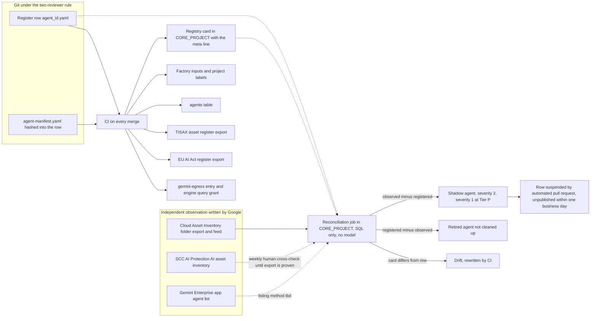
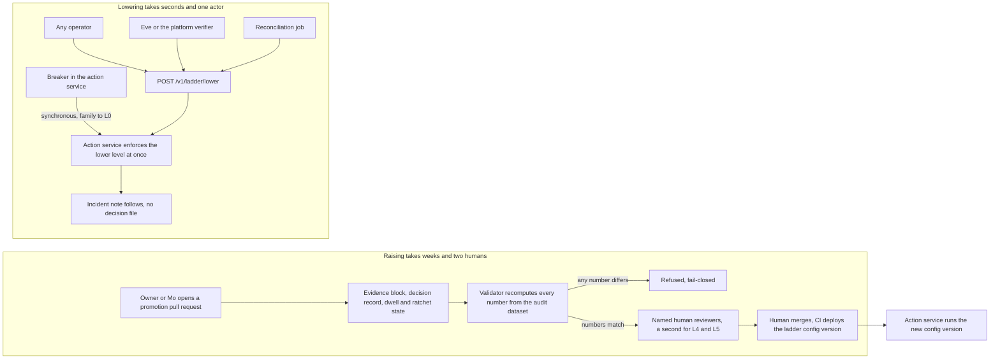

# 9. Registry, governance and the autonomy contract

## Status
- Owner: the platform owner
- Last reviewed: 2026-09-14

## What this chapter explains

By the end of this chapter the reader knows why the platform's inventory of agents is a YAML file in git rather than a Google product, how an agent that bypassed that file is found, and what an agent must pass before it reaches production. They know how autonomy becomes versioned data that only humans raise, on evidence a machine recomputes, and anyone with standing lowers in seconds, and what that costs in independence at Tier W.

The chapter answers two risk themes of Chapter 3, The problem and its risks: **shadow and third-party agents**, and **autonomy outrunning evidence**. Tiers and the factory are Chapter 7, Landing zone and the tier model; principals, the drift job and kill switches are Chapter 8, Identity, privileged access and the fleet kill switch; the heartbeat proving an agent feeds the SIEM is Chapter 11, Monitoring, detection and incident response.

## Four things that are not each other

Four artefacts have confusable names ([registry page §1](../05-registry-and-autonomy-contract.md#1-vocabulary-four-things-that-are-not-each-other)).

- **The register**: one YAML file per agent under `platform/agentic-platform/register/`, the inventory of record. The owner proposes; the platform owner approves, joined by the security reviewer from Tier W and the DPO at Tier P. CI refuses to build anything without a row.
- **The registry**: Google's Agent Registry, one `Service` resource per agent, MCP server or endpoint. It is the governed view and the discovery surface, written only by CI from the register.
- **Independent observation**: what Google's services say exists (Cloud Asset Inventory, Security Command Center's AI asset inventory, the Gemini Enterprise app's agent list), written by no agent owner.
- **The manifest**: `agent-manifest.yaml` in the agent's repository, stating what the agent is allowed to be, hashed into the register row.

A row without a manifest is a Tier C or Tier R agent with nothing to ceiling; a manifest without a row fails CI; an entry or engine with neither is a shadow agent.

## Why the inventory of record is a git file

### The Google facts behind the choice

Four facts, re-verified on 2026-09-13, stop Agent Registry from being the record ([registry page §2.1](../05-registry-and-autonomy-contract.md#21-the-google-facts-the-topology-rests-on-re-verified-2026-09-13-11); [platform HLD §5.1](../01-hld.md#51-the-inventory-of-record-is-a-git-file-not-a-product)). Its IAM is **project-level only**, so an editor can alter every entry, including the `readOnlyHint` and `destructiveHint` annotations Google itself warns about. **Automatic registration lands only in the runtime's own project**, so a central inventory needs manual cross-project registration. **No organisation policy can require registration.** And the SCC AI asset inventory **holds no owner and no classification**, the first things a TISAX assessor or the EU AI Act asks for.

Two more facts shape the details: the `Service` resource has no labels field, and the agent framework treats a card fetched from the registry as trusted configuration, so a registry write carries the weight of a deploy. A good view, then, and a poor record.

### One shared registry, written only by CI (P71)

**P71, proposed**, chooses one shared registry, over per-agent or per-tier ones, in `CORE_PROJECT`, `europe-west1`, since manual registration is refused in the `eu` and `us` multi-regions ([registry page §2.2](../05-registry-and-autonomy-contract.md#22-options-and-the-decision-p71)). `CORE_PROJECT` holds no agent principal, the only place a project-level registry role is safe.

Agent projects never enable `agentregistry.googleapis.com`: it is absent from every tier folder's service allow-list, so automatic registration has nowhere to land. That rests on an `Assumption:` Google does not state, that automatic registration needs the API in the runtime's project. A nonprod spike at the first factory run tests it, and that an engine and its gateway still work with the API disabled; if either fails, a CI-generated working-set registry per agent project is added by a dated register row. The one other registry by design is `gemini-registry` in `GEMINI_PROJECT`, the tenant gateway's working set, never an inventory. The default quota is 100 entries per type per project; an increase, requested at 60 % occupancy, is not guaranteed, and per-tier-folder registries are the fallback. No agent principal reads the registry.

The rule under all of it: **registration never authorises**. A card lets a peer find an agent; reaching it needs a resource-level grant, a gateway entry and an access-policy binding, each generated separately.

## The register

### One row, many outputs

Nothing about an agent is typed twice. On every merge CI generates the registry card, factory inputs and labels, the [agents table](../../agents.md), the TISAX asset row, the EU AI Act register row and the `gemini-egress` entry; every day the row is compared with what Google observes.

### Mandatory fields, status and review

A CI schema check fails the merge on a missing mandatory field ([registry page §3.2](../05-registry-and-autonomy-contract.md#32-mandatory-fields-per-tier)). The groups matter more than the list: an immutable `agent_id`; a declared intended purpose signed in the merge commit, the EU AI Act anchor; owner and cost centre; tier and classes (TISAX class confidential by `Assumption:` until the organisation's scheme exists); model pin, gateway and principal; from Tier W a named grader with declared hours, a `verifier_owner` outside the administration line of the agents verified, the manifest hash and contract version. `privilege` is `none` below Tier P, and CI fails a second `super_admin` row while one is not retired. Tier X rows exist only to be refused: ceiling pinned at L0, never published.

The lifecycle is `idea`, `poc`, `pilot`, `prod`, `retired`, plus **`suspended`** (P74, proposed): set on a `pilot` or `prod` row by the reconciliation job or an incident, left only by a human pull request to `prod` or by retirement. Every `review_date` is at most 90 days ahead and an expired row loses its share until reviewed; every row with `privilege` other than `none` is reviewed quarterly by the security reviewer against the signed super-admin roster ([platform HLD §5.3](../01-hld.md#53-governance-policies-and-the-admission-gate)).

### The card metadata line (P72)

With no labels on the entry, **P72, proposed**, writes a fixed first description line, `meta:` with the row's key fields and `register_sha`, the hash of the merged row ([registry page §3.1](../05-registry-and-autonomy-contract.md#31-where-the-metadata-lives-p72)). "Card differs from row" becomes one string comparison: the row wins and CI rewrites; a rewrite by anyone but CI is a severity-2 write alert first.

## Finding shadow agents

### The sources

The job compares register and registry with three observed sources ([registry page §6.1](../05-registry-and-autonomy-contract.md#61-the-sources-and-what-each-is-verified-to-provide)). Cloud Asset Inventory lists engines and Cloud Run services, exported daily and followed by a feed; the registry is read directly. Whether the SCC AI asset inventory can be exported or read by API is unverified, so a human reads it weekly until proven. The Gemini Enterprise listing method is *tbd*; meanwhile the app administrator files a nightly console export and the gap is recorded.

The job is a second schedule of the drift job under `platform-drift@CORE_PROJECT` (P73, proposed): daily in full, within 15 minutes of a feed event incrementally, SQL only. Reusing that principal avoids a second folder-level exception; two added role names are unverified until the factory run.

### What each difference means

An engine, agent-shaped service or app agent with no row is a **shadow agent**: severity 2 at Tiers C to W, severity 1 at Tier P, unpublished within one business day ([registry page §6.2](../05-registry-and-autonomy-contract.md#62-the-set-differences-severities-and-the-action-per-difference)). If its project has no `agent` label the factory was bypassed, and the job cuts the project's invoke or query grant; otherwise an automated pull request creates the row as `suspended`. A registry entry with no row is a shadow card, which CI deletes. A console agent with no row is a shadow Tier C agent; a builder's second occurrence removes them from the builders group. An asset SCC sees outside the folder gets no automatic action, since agents living under the folder is policy, not constraint. The same run finds empty `prod` rows, overdue reviews, silent agents, binding drift and Tier W verifiers without a recent seeded-fault record. Results are insert-only for 400 days and go to the SIEM; while a Tier P row exists, the job's heartbeat also reaches the witness organisation.

### Why detection-grade is acceptable

No organisation policy can require registration, so the control is **detection-grade, stated as such**. It suffices because what an unregistered engine needs to be useful, a `gemini-egress` entry and a query grant, is generated from the register. A shadow agent can exist; it cannot be published or called through the platform.

## Governance policies

The registry policies make "only CI writes" a mechanism ([registry page §4](../05-registry-and-autonomy-contract.md#4-governance-policies)). The routine factory identity alone holds the registry admin role; editor and user roles go to nobody; repair is a one-hour PAM entitlement the security reviewer approves. Every write not made by CI alerts, drilled monthly by a nonprod console edit that must page within five minutes. Reads are logged under P80, proposed, unverified until the canary's first run because Google's pages disagree (Chapter 12, Data, logging, retention and sovereignty). Cards are refused if a skill names a write, approval or control operation, and the action service has no registry client, so nothing in the registry changes what an agent may do.

**Semantic Governance never sits on an authority path.** It is Preview and Google warns its verdicts may be inaccurate. A gateway may use it as an extra refusal, which costs nothing when wrong; it never approves and its verdict is never evidence. Wiring it into approval is refused at admission, or severity 2 and reverted if found later.

## Admission and revocation

### The admission gate

Admission is one CI run in `CICD_PROJECT` whose code owners are the platform owner and IT security ([registry page §7.1](../05-registry-and-autonomy-contract.md#71-admission-end-to-end)). After the row and manifest are reviewed and merged, the pipeline continues only if the baseline is applied, the row validates, the image is attested or the bundle hash recorded, the card registers, the compliance entry exists, the first heartbeat reaches the tier's desk within 30 minutes (Chapter 11), the gateway is bound, the floor conformant and bindings match `peers[]`. From Tier W it also needs a restore drill, a validator-signed manifest and a seeded-fault record younger than 30 days ([platform HLD §5.3](../01-hld.md#53-governance-policies-and-the-admission-gate); [registry page §7.1](../05-registry-and-autonomy-contract.md#71-admission-end-to-end)). Only then does CI grant the query right, add the `gemini-egress` entry and set `pilot`; sharing is a human act through PAM, and who registers the agent in the app is disputed between two canonical pages (Chapter 6, The Gemini Enterprise environment). A failed step stops everything after it. `pilot` to `prod` is a human pull request whose scorecard the validator recomputes.

### Revocation and suspension

Retirement is the factory's `revoke` (Chapter 6), ending with project deletion scheduled at 30 days and the **TISAX 5.3.3 return-and-removal row** written ([registry page §7.2](../05-registry-and-autonomy-contract.md#72-revocation-and-suspension)). The row stays in git as `retired`, the platform's history of agents. Suspension, which any operator may trigger, removes reach, halts Tier W and above and deletes nothing. A revocation or suspension not confirmed within 15 minutes is severity 1, then a manual project cut-off, then the fleet kill switch on the tier folder (Chapter 8).

## The compliance registers are exports

The TISAX agent register and the EU AI Act register are CI exports of the register, regenerated on every merge and never hand-edited, so neither can drift from what runs ([registry page §8.1](../05-registry-and-autonomy-contract.md#81-the-tisax-agent-register-isa-131-132-533)). The TISAX export serves ISA 1.3.1, 1.3.2 and 5.3.3, with protection need derived by the ISMS's mapping as an `Assumption:`, and attaches the reconciliation job's zero-difference report.

**P75, proposed**, makes registration a production gate ([registry page §8.2](../05-registry-and-autonomy-contract.md#82-eu-ai-act-registration-art-64-art-49-art-71--p75)): a row claiming the Art. 6(3) derogation or classed high-risk cannot carry `status: prod` without an Art. 49 registration id, and a derogation row also needs a dated Art. 6(4) assessment. On 2026-09-13 Wall-E's row claims the derogation with registration `pending`, so Wall-E cannot reach production, and cannot write, until it is registered. A reclassified `prod` row is suspended until the new class is met. Whether an id still resolves is a quarterly review item, as no EU database API is known (unverified). Classification is Chapter 20, EU AI Act.

## Autonomy as data: the ladder's fleet rules

### The eight rules

Wall-E's ladder is adopted unchanged as the platform's ([Wall-E ladder §1](../../wall-e/05-autonomy-ladder.md#1-the-eight-rules)). Autonomy belongs to a family and trigger pair, never to an agent. Humans raise, machines lower. One notch, one family, on evidence. Reversibility outranks risk tier. Every level is enforced in the action service, which never tells the agent why. Every write is verified by re-reading. No level is silent. Time alone promotes nothing.

### Six levels, four trigger classes and the agent column

**L0** is off; **L1** shadow evaluates everything and never executes; **L2** proposes, with no execution path; **L3** executes on a named human's approval within four business hours or skips; **L4** executes after a verifier signs with its own key and a veto hold window passes; **L5** executes and is verified independently within 60 minutes ([Wall-E ladder §2](../../wall-e/05-autonomy-ladder.md#2-the-six-levels)). There is no L6: "execute and tell nobody" is a defect.

Triggers are **T0 chat** (an authenticated human), **T1 scheduled**, **T2 event** (Google's payload, possibly an attacker's cause) and **T3 inbox** (attacker-controlled text, proposals only, permanently); each climbs independently ([Wall-E ladder §3](../../wall-e/05-autonomy-ladder.md#3-trigger-classes)). A separate **agent** column governs callers that are other agents, by the peer rule below.

### The raise-lower asymmetry

Raising needs a pull request, a dated decision record and a new config version, one notch at a time, with a second named human for any L4 or L5 promotion ([Wall-E ladder §6](../../wall-e/05-autonomy-ladder.md#6-who-may-raise-who-may-lower)). Lowering is one call to `POST /v1/ladder/lower` by any operator alone, the verifier, a breaker or the reconciliation job, with paperwork after. There is no raise API, and no agent touches its own ladder. The per-actor matrix is Chapter 18, How the three work together.

### Dwell, the ratchet and one notch

**Dwell** before raising is two weeks to L2 and to L3, four to L4, six to L5; a demotion on any trigger restarts it for the family on every trigger, because the defect lives in shared code. **The ratchet**, after any automatic demotion, requires five business days at the lower level, a written root cause the validator checks exists, and a fresh decision record, with no false-positive exception. **One notch** forbids skipping above L3 and permits a skip below only on evidence cited by fingerprint and sample size; a new operation enters at L0. Mo computes all three from `ladder_events`, which reads `not_computable` until that table exists (Chapter 17, Mo, continuous improvement). Where the incident note lives is open ([open decisions §7, row 12](../12-open-decisions.md#7-values-that-differ-between-pages); the one incident record is Chapter 11).

### Ladder severity and automatic demotion

**Severity 1** — an effect on a protected principal or out-of-scope target, an interactive robot login, a forged or agent-posted approval, an operation outside its frozen plan — halts writes, stops every autonomous trigger, sets every write family to L0 and freezes promotions for 30 days ([Wall-E ladder §9](../../wall-e/05-autonomy-ladder.md#9-severity-and-automatic-response)). **Severity 2** — verification drift, a budget cap hit, an overturned verifier approval, a run outside its window — sets the family to L0, pauses the trigger class and freezes promotions for 14 days. **Severity 3** — a policy rejection, an unexplained failure, an audit gap — lowers the family one level. The error budget for a wrong autonomous write is zero. The pages disagree on drift: the severity table sends it to L0, the metric breach response one level down with an incident ([Wall-E ladder §9](../../wall-e/05-autonomy-ladder.md#9-severity-and-automatic-response); [Mo metrics contract §7.2](../../mo/03-metrics-contract.md#72-wall-es-pack--the-ten-metrics-audit-completeness-first)). Platform detection severities and paging are Chapter 11.

## The autonomy contract

### Four artefacts, one version (P76)

Any Tier W or higher agent inherits the ladder by conforming to four artefacts ([registry page §9.1](../05-registry-and-autonomy-contract.md#91-four-artefacts-one-version-p76)): the **manifest** ([§9.2](../05-registry-and-autonomy-contract.md#92-agent-manifestyaml--the-schema-as-an-example-that-validates)); **`ladder.schema`**, typing the ladder config; **`audit.schema`**, the write-ahead, insert-only dataset carrying the correlation keys, the caller's verified principal type and the denial vocabulary `p:<reason>`, which agents extend but never redefine ([§9.4](../05-registry-and-autonomy-contract.md#94-auditschema-keyed-on-agent_id)); and the **validator**. The P76 register row lists `ladder.yaml` as the fourth where the section lists the validator.

**P76, proposed**, stamps a semantic `contract_version` on all of them; the current and previous major are accepted for 90 days, after which older rows are suspended, and audit columns are only ever added. The validator signs each manifest's hash with a key in `VALIDATOR_PROJECT`, and the action service's ceiling module, compiled from that signed artefact, refuses to start on a mismatch: the gate cannot be part of what it gates.

### Defaults an agent may only tighten (P77)

**P77, proposed**, makes Wall-E's numbers (ceilings, dwell, ratchet, interval gate, blind sample, severity table, approval TTL, two-human rule, fingerprint reset above L3) fleet defaults an agent may only tighten, checked as a monotone comparison ([registry page §9.5](../05-registry-and-autonomy-contract.md#95-platform-defaults-an-agent-may-only-tighten-p77)). The L4 hold window is *tbd*. Some rows are code: `WRITE_HIGH` never reaches L5; any `SUPER` operation is permanently L3 on chat under a two-person rule, L0 elsewhere and never in a playbook; inbox never writes. **Loosening a default is a platform decision the security reviewer signs**, never a manifest or page edit ([open decisions §1](../12-open-decisions.md#1-how-this-register-works)). The gate statistics are Chapter 17's; Wall-E's ceilings are Chapter 15, Wall-E, the doer.

### The validator custodian

One validator sits in `VALIDATOR_PROJECT`, owned by the security reviewer as custodian, run as a required CI check, deployed by digest ([registry page §9.6](../05-registry-and-autonomy-contract.md#96-the-one-platform-validator)). It reads every agent's audit dataset, and Eve's quality dataset if P30 (proposed) holds. For a promotion it re-executes the evidence against the agent's own audit data, never Mo's output, re-draws the blind sample and checks dwell, ratchet, decision record, two reviewers and, above L3, a recent restore drill. It is **fail-closed for raises and irrelevant for lowering**; golden fixtures and a monthly poisoned-bundle drill catch it drifting towards agreement.

### The Tier W platform verifier (P79)

Eve is a hand-written second implementation of Wall-E's predicates at six engineer-days, which does not scale to hundreds of agents. **P79, proposed**, gives Tier W a platform verifier of Eve's deterministic shape with predicates compiled from the manifest ([registry page §9.8](../05-registry-and-autonomy-contract.md#98-how-eve-and-mo-generalise-to-the-contract--and-what-the-second-implementation-property-loses-p79)). It still catches code bugs, tampering, forged approvals and widened ceilings. It **cannot catch a wrong specification**, such as a mis-tiered family, because it believes the manifest the owner wrote. Four compensations follow: a security-reviewer signature on family changes, the blind human sample, a monthly seeded-fault suite, and a differential test that catches compiler bugs and says it catches nothing else. A Tier W cell may sit at L4 only while a seeded-fault record younger than 30 days exists. Tier P keeps a hand-written Eve; Tier X has no verifier and every cell at L0.

### The fleet-wide peer rule (P78)

A caller over an agent protocol is principal type `agent`, identified from the gateway's authenticated context ([registry page §9.7](../05-registry-and-autonomy-contract.md#97-the-fleet-wide-peer-rule-p78)). **P78, proposed** (bindings at Tier R, writes at Tier W), fixes it in the schema: **L5 for reads, L0 for every write, tainted on receipt**. A peer's write is refused before the ladder is read; a peer's reply is data, never evidence. Egressor bindings come only from `peers[]` and run 30 days in dry-run before enforcement. Since every agent applies the rule, no chain of agents turns a reader into a writer.

## What remains

Chapter 19, Threat model and residual risk, tests these answers against what the design leaves open: shadow-agent detection stays detection-grade with two sources unproven; P71 waits on its spike and quota increases are not guaranteed; at Tier W a wrong manifest is caught only by human review and blind grading, capacity for which caps the tier (P25, Chapter 14); the EU database cannot be checked automatically; and the drift-severity and incident-note inconsistencies await the propagation stage.

## Key decisions and what to read next

### Key decisions

- **P71 — proposed**: one shared registry in `CORE_PROJECT`; no local registries; spike pending.
- **P72 — proposed**: card metadata in the description's first line.
- **P73 — proposed**: reconciliation under the drift job's principal.
- **P74 — proposed**: `suspended` and "registered implies feeding" as a continuous invariant.
- **P75 — proposed**: compliance registers as exports; no `prod` for a derogation or high-risk row without its Art. 49 id.
- **P76 — proposed**: contract versioning, 90-day N and N−1 window.
- **P77 — proposed**: tighten-only fleet defaults.
- **P78 — proposed** (bindings at R, writes at W): the peer rule.
- **P79 — proposed**: the Tier W verifier, its compensations and the L4 cap.
- **P80 — proposed**: registry read logging.
- **P25 — open**: the Tier W cap by grading capacity. **P30 — proposed**: validator read on Eve's quality dataset.

### Canonical pages to read next

- [Registry and autonomy contract](../05-registry-and-autonomy-contract.md#1-vocabulary-four-things-that-are-not-each-other): [§6.2](../05-registry-and-autonomy-contract.md#62-the-set-differences-severities-and-the-action-per-difference), [§7.1](../05-registry-and-autonomy-contract.md#71-admission-end-to-end), [§9.8](../05-registry-and-autonomy-contract.md#98-how-eve-and-mo-generalise-to-the-contract--and-what-the-second-implementation-property-loses-p79)
- [Platform HLD §5.2](../01-hld.md#52-shared-registry-independent-observation-daily-reconciliation), [§12.1](../01-hld.md#121-the-ladder--unchanged-rules-platform-defaults), [§12.4](../01-hld.md#124-the-validator-and-the-platform-verifier)
- [Wall-E autonomy ladder §6](../../wall-e/05-autonomy-ladder.md#6-who-may-raise-who-may-lower)
- [Monitoring page §4](../07-monitoring-detection-incident-response.md#4-registered--feeding-the-siem-the-monitoring-baseline-module-and-admission)
- Next in the brief: Chapter 10, Agent Gateway, Model Armor and the perimeter.
