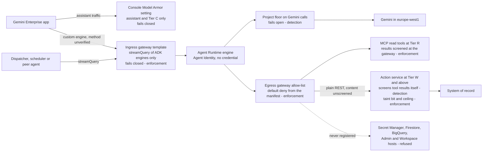
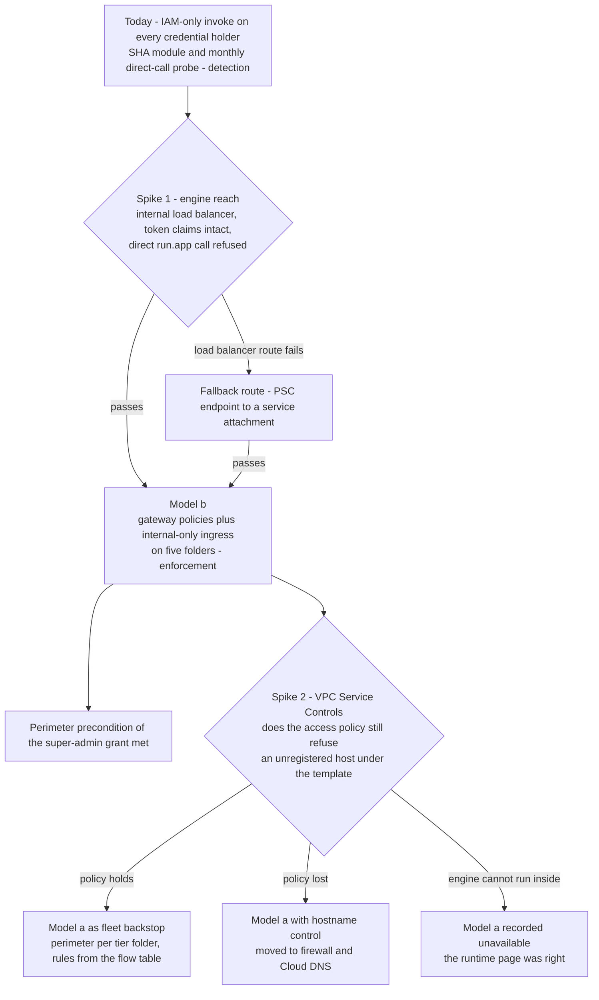

# 10. Agent Gateway, Model Armor and the perimeter

## Status
- Owner: the platform owner
- Last reviewed: 2026-09-14

## What you will understand by the end

Which traffic is screened where; which screens enforce and which only produce evidence; why an outage of Agent Gateway or Model Armor stops agents on purpose; what the gateway does not see; how Model Armor is governed so no agent owner can weaken it unseen; and why the perimeter around credential holders is a spike to pass before it is a claim to make. Grades are those of Chapter 4, The principles: placement and failure mode, not accuracy.

Of the risk themes in Chapter 3, The problem and its risks, this chapter answers part of three: tenant compromise through the robot credential (injected content steering the agent beside the credential; an internet-reachable credential holder), shadow and third-party agents (an unbound engine, an undeclared tool host) and manufactured silence (a floor lowered unnoticed). Nothing is built on 2026-09-14; Google facts were read on 2026-09-13 and are sourced on the canonical page ([06 §8](../06-gateways-model-armor-perimeter.md#8-sources-read-2026-09-13-and-what-could-not-be-verified)).

## Why screening exists: the injection surface

Hostile instructions arrive with what a run reads, not with how it started. Wall-E's design inventories every channel through which attacker-writable text reaches a model ([wall-e 11 §1](../../wall-e/11-prompt-security.md#1-the-injection-surface)), and the platform makes it the template every Tier W and higher threat model fills in: the operator's chat prompt, trusted by attribution rather than content; documents and uploads; tool results, where anyone who can set a display name, group description or calendar entry writes to the model; the robot's mailbox, open to any sender; peer agents' output; and the session history, which replays all of these.

No prompt can be a boundary, because instruction and attack share the channel; Chapter 19, Threat model and residual risk, says what prompt-based defence cannot do. The answer is structural: the model holds no credential, and a run that reads attacker-writable content is tainted and capped (Chapter 15, Wall-E, the doer). Screening adds four things on top: a block in front of the model on the one channel screenable before it runs, evidence joined to the audit row, a flag for the approver, and sensitive-data catches in both directions. It never carries a safety case, because a classifier Google calls possibly inaccurate cannot guard a credential that can suspend an employee.

## The screens on one request

The only fail-closed screen in front of the model is the ingress gateway, and it sees only `streamQuery`; the screen on the model call fails open.

## The gateway rule

### Egress: bound at creation, denied by default, generated

Every Agent Runtime engine above Tier C is created bound to its project's egress gateway ([06 §2.1](../06-gateways-model-armor-perimeter.md#21-the-rule-as-the-factory-and-the-folder-enforce-it)). The factory makes the gateway and passes its name to the engine, two folder custom constraints refuse an engine bound elsewhere, and daily reconciliation treats an unbound engine as a severity-2 finding, unpublished within one business day. Google allows one gateway of each kind per project-region, shared by every engine there, which is one of the facts forcing one project per agent (Chapter 7, Landing zone and the tier model). Bound engines must postdate 2026-04-29 and cannot have revisions, so promotion is an attestation.

The binding is not yet enforcement-grade: `ReasoningEngine` is missing from Google's custom-constraint supported-services reference, so the constraints start in dry run and the CI check is the control, graded detection, until a throwaway engine is refused in nonprod (spike P4).

The allow-list is generated from the register row and manifest, never hand-written ([06 §2.2](../06-gateways-model-armor-perimeter.md#22-the-egress-allow-list-is-generated-never-hand-written)): the agent's own action service from Tier W, the essential Google endpoints without which invocation fails with `498`, and the exact hostnames of declared MCP servers and read APIs, each with a supplier row. Wildcards are unsupported, so the essential set is one versioned value in `CORE_PROJECT` spliced into every policy. What matters most is what is absent: Secret Manager, Firestore, BigQuery, the Admin API, every Workspace host and every other agent's action service, giving "the agent can read no secret" a second enforcement point. Nonprod gateways start in dry run to inventory what an agent really calls; prod enforces from the first deploy, and a destination seen only in nonprod is a finding against the manifest, never a reason to widen prod. A per-agent prod dry run was rejected as an unscreened window per agent; `gemini-egress` is the one exception (Chapter 6, The Gemini Enterprise environment). Kill switches, halt reads, reconcilers, sinks and task deliveries never pass a gateway, so an outage never disables stopping an agent.

### Ingress: machine-called engines, fail-closed, `streamQuery` only

An engine is machine-called when anything other than a human in the tenant app may invoke it, as the register row's invoker list says: a dispatcher, scheduler, peer or Eve's verification caller ([06 §2.3](../06-gateways-model-armor-perimeter.md#23-the-ingress-gateway-who-is-machine-called-and-the-streamquery-rule)). Tier R agents published only in the app are egress-bound only; Tier W and above always have both gateways. The ingress gateway's Model Armor runs with `failOpen` false and a one-second timeout, raised only with a recorded reason after the p99 is measured. It screens only `streamQuery` of ADK engines, so every machine caller must use `streamQuery`: CI checks callers, the dispatcher library offers nothing else, a monthly log query looks for exceptions, and a `query` call is severity 3 because it silently removes the only enforcement-grade prompt screen.

Two limits. IAP is unsupported at ingress, so the gateway screens content while IAM decides who calls, through a query-only role bound on the engine to named callers. And whether Gemini Enterprise itself uses `streamQuery` is unverified; the first machine-called nonprod engine reads it from the request log, and a `query` answer becomes a dated residual raised with Google.

### What binding costs: Agent Platform Threat Detection

A gateway-bound engine forgoes Security Command Center's Agent Platform Threat Detection, a Preview, Premium-tier runtime detector ([06 §2.4](../06-gateways-model-armor-perimeter.md#24-gateway-versus-agent-platform-threat-detection-per-tier)). The platform chose the gateway in every prod tier: at Tier R default-deny egress enforces and there is no credential to escalate; from Tier W the model-free verifier, behavioural baselines and, at Tier P, the super-admin detections cover the loss. The detector runs on at most one unbound nonprod engine per tier folder for at most 30 days, in a sandbox with no production credential, with a page to the platform owner if two are counted. It is a learning window, revisited when the products become compatible or the detector reaches general availability (P82).

### An outage stops agents, by design

Hundreds of fail-closed agents share one Google dependency, so gateway plus Model Armor is run as one availability domain ([06 §2.5](../06-gateways-model-armor-perimeter.md#25-the-gateway-plus-model-armor-as-an-availability-domain)). The SLO is Assumption: 99.5 % monthly successful screened invocations per region, measured by a nonprod probe engine per region called every five minutes with a benign prompt expecting `200` and a hostile one expecting `MATCH_FOUND`; two failures in a row page the platform owner at severity 3 (P83). Both Model Armor quotas, sanitise and `ExternalProcessor`, the second counted in the gateway's project, alert at 70 %, because a quota error stops an agent like an outage. The platform never flips `failOpen` to recover: a stopped agent leaves an audit row, an unscreened one leaves nothing trustworthy. The runbook confirms with the probe, opens a Google case, tells owners their agents are stopped on purpose and records the window as evidence. The price is that the first fail-closed write agent is the first an outage stops.

## What the gateway does not screen

The egress gateway's Model Armor sanitises MCP `tools/call` and `prompts/get`, A2A messages and agent cards, and model calls in the common chat-completions format; Google says anything unlisted passes unsanitised ([06 §2.6](../06-gateways-model-armor-perimeter.md#26-what-the-gateway-does-not-screen-and-the-platform-pattern-per-tier)). Plain REST is not screened, so a hostile display name returned by a REST tool reaches the model past every gateway screen ([wall-e 11 §3](../../wall-e/11-prompt-security.md#3-tool-results-are-not-screened-by-the-gateway)).

The pattern is per tier (P88). Tier R read tools go over MCP through the gateway, so results are screened outside the agent's process, fail-closed, with policy on tool names and read-only hints; a REST read API needs a supplier row and a reason. From Tier W, tools are REST calls to the agent's own action service, which screens every attacker-writable field before returning it: inspect-only, so a hostile profile cannot deny a legitimate read, fenced, URLs removed, and a match sets the taint bit. The screen is detection by placement; the taint bit, turned into a cap by the ceiling module, is the enforcement. Exposing an action service as an MCP server is a per-agent Stage 3 choice once two open questions close, never a platform default.

## Model Armor

### Layers and grades

Model Armor sits at several points, and treating them as one control is the error the design most wants to prevent ([06 §3.1](../06-gateways-model-armor-perimeter.md#31-the-layers-and-their-grades-made-platform-wide)). The ingress gateway template is the enforcement-grade path for prompts, if callers use `streamQuery`. The egress template enforces on what it sees: all of Tier R's tool surface, none of a REST action service's. The project floor applied inline to Gemini calls is fail-open, since Google skips sanitisation and continues when Model Armor is unavailable, so it is detection-grade in every mode, `INSPECT_AND_BLOCK` included; its value is the sanitise log, and whether it inspects function responses is unverified. The floor's conformance check enforces one governance property, refusing weaker templates, and does not check Sensitive Data Protection. In-code configuration and ADK's in-process plugin are never counted; Semantic Governance, in Preview, is never on an authority path. And a classifier is never a trust boundary, whatever its grade.

### The floor hierarchy

Google defines template conformance at organisation and folder level and inline enforcement only at project level, and a lower floor overrides a higher one, including a project floor set to disable ([06 §3.2](../06-gateways-model-armor-perimeter.md#32-the-floor-hierarchy)). "Never looser" is therefore a property of who can write a project floor and how fast a write is seen, not of the hierarchy.

The organisation floor requires prompt-injection and jailbreak at `HIGH` or stricter, malicious URL, logging and multi-language detection; it names no single level because `MEDIUM_AND_ABOVE` would forbid a later measured `HIGH`. The platform folder adds Responsible AI at `MEDIUM_AND_ABOVE`; the W, P, P-SA and controller folders tighten prompt injection to the level measured on each tier's benign corpus, the security reviewer signing P-SA. All three govern template conformance only. The pages differ on ownership: the HLD gives all three to IT security, held by the platform owner meanwhile ([HLD §6.2](../01-hld.md#62-model-armor-floor-tier-floors-templates)), page 06 only the organisation floor, with folder floors to the platform owner ([06 §3.2](../06-gateways-model-armor-perimeter.md#32-the-floor-hierarchy)); the handover date is *tbd*.

Inline enforcement is a custom project floor the factory's privileged phase writes into every agent project, never inherited or disabled: `INSPECT_ONLY` at Tier R and before measurement, `INSPECT_AND_BLOCK` at W, P and controllers after it, always at P-SA (P84). Inspection comes first because blocking on a fail-open path buys no safety case and costs benign refusals. Integrity is the enforcement: the folder deny policy (Chapter 8, Identity, privileged access and the fleet kill switch) refuses floor updates to agent principals, the project role is granted only through Privileged Access Manager, and a daily drift compare makes any difference or unauthorised write severity-1 drift, with P-SA writes held at L0 until re-applied.

### The template standard and the silent skip

Templates are regional in `europe-west1`, a prompt and a response template per engine, generated from one module and diffed by CI; owners may only tighten ([06 §3.3](../06-gateways-model-armor-perimeter.md#33-the-template-standard-per-tier)). They carry what floors cannot check. Every tier screens prompt injection, malicious URLs and Responsible AI categories; Tier R adds basic Sensitive Data Protection, W and P a de-identify template so the sanitise-log copy is masked, and P-SA custom detectors for the hard-denied vocabulary on the response template, a detection-grade screen behind the action service's list, which enforces. Basic and advanced modes are exclusive, so an advanced template must re-list credential detectors or lose them silently; a regression case checks. Page 06 does not yet name the de-identify templates the data page defines, an open difference (register row 13; [06 §3.3](../06-gateways-model-armor-perimeter.md#33-the-template-standard-per-tier), [08 §6.3](../08-data-logging-retention-sovereignty.md#63-the-de-identify-standard-for-logs-and-the-content-bucket-readers)) owned by Chapter 12, Data, logging, retention and sovereignty. Templates flip from `INSPECT_ONLY` to `INSPECT_AND_BLOCK` in prod by pull request once the tier's false-block rate on its benign corpus is below a threshold (Assumption: below 1 %) (P85).

Each filter has a token limit, 65,536 for prompt injection, Responsible AI and CSAM and 130,000 for Sensitive Data Protection ([HLD §3.4](../01-hld.md#34-labels-budgets-contacts-quotas)). Above it the filter returns `EXECUTION_SKIPPED` with no error, so a long history passes unscreened while dashboards stay green; an alert on that verdict makes the skip visible.

### Seeing writes, and where findings go

A floor write is a change window or an incident ([06 §3.4](../06-gateways-model-armor-perimeter.md#34-alerting-on-floor-and-template-writes)). Admin Activity entries raise a log-based alert, and a SIEM rule from Tier P: severity 2 outside a ticketed Privileged Access Manager grant, severity 1 at Tier P for any writer but the platform's Terraform identity. The method name is an Assumption until seen at the first factory run, and Security Command Center's coverage of floor writes is unverified, so the log alert is the control (P86). Verdicts feed the monitoring baseline of Chapter 11, Monitoring, detection and incident response, and never demote an agent automatically. Findings reach Security Command Center as metadata; payloads stay in sanitise logs in each project's restricted content bucket, which the factory creates before the template ([06 §3.6](../06-gateways-model-armor-perimeter.md#36-security-command-center-and-the-evidence-path)).

### The console setting (P53)

Tier C agents have no gateway; for them, the assistant and uploads, the only prompt screen is Model Armor on the Gemini Enterprise app, configured per app ([06 §3.5](../06-gateways-model-armor-perimeter.md#35-the-console-setting-tenant-wide-by-rule-per-app-by-mechanism)). The platform sets template `ge-console-standard` in `GEMINI_PROJECT`, region `eu`, from the Tier C standard, failure mode Block, applied through Privileged Access Manager; a switch to Allow needs an incident reference and is detected. A daily drift check asserts the setting on every app, and an app without it is severity 2, unpublished for external sharing. Google does not screen custom ADK, A2A or Dialogflow agents, so the setting covers Tier C only and the admission gate refuses a higher-tier safety case that cites it. P53 and its refinement P87 are proposed.

## The perimeter

### Why the deferral ended, and what Google says

A perimeter could wait for an agent that made no writes and held a narrow role; Wall-E's action service holds a Super Admin credential, so the perimeter is P3, a precondition of the super-admin grant ([HLD §8.1](../01-hld.md#81-network-model)).

Google's pages disagreed on 2026-09-13 ([06 §4.1](../06-gateways-model-armor-perimeter.md#41-the-facts-on-2026-09-13-and-the-contradiction-stated-exactly)). The runtime deploy page (2026-09-08) says VPC Service Controls are not supported with Agent Gateway; the set-up page (2026-09-10) says they are, only for gateways created after 2026-09-08 with an agent connectivity template, which must use `ALL_TRAFFIC` and cannot be added to an existing gateway without recreating it. A sentence denying VPC Service Controls support for Unified Access Policies could not be re-read. The design's reading, that a template-less gateway egresses from Google's tenant project while an `ALL_TRAFFIC` one egresses through the customer network where a perimeter applies, is a hypothesis.

### The decision, in order

Today IAM-only invoke by named principals is the enforced boundary. The action service cannot simply be made internal, because Agent Runtime egresses from a Google-managed tenant project that Cloud Run treats as external.

Model (b), gateway access policies plus internal-only ingress for every credential holder behind an internal load balancer, is adopted the day P3's first spike passes ([06 §4.2](../06-gateways-model-armor-perimeter.md#42-the-decision-restated-with-what-this-page-adds)). The spike passes if a bound engine reaches a stand-in action service through the load balancer with ID-token claims intact, a direct `run.app` call is refused, and the gateway log shows only the registered destination; a Private Service Connect endpoint to the load balancer, the route the HLD names, is the fallback. "Perimeter decision taken" in the tier gate means (b) applied, not (a) live.

Model (a), VPC Service Controls per tier folder, is the fleet backstop after spike 2, which passes if the gateway's access policy still refuses an unregistered host inside an enforced perimeter while out-of-perimeter egress raises a violation; its decision record will name which Google page was right. So that (a) stays reachable, Tier W and higher prod gateways are born with an `ALL_TRAFFIC` template if spike 1 passes on it, at one VPC, subnet, Cloud NAT and DNS zone per project (P89).

### Credential holders are never internet-reachable (P90)

No credential-holding Cloud Run service (action services, Eve's gate and reconciler, the approval surface) accepts internet ingress ([06 §4.3](../06-gateways-model-armor-perimeter.md#43-credential-holders-are-never-internet-reachable-as-a-folder-rule)). The mechanism, `run.allowedIngress` set to `internal-and-cloud-load-balancing` on the W, P, P-SA, controller and platform-core folders, is held in Terraform and applied the day spike 1 passes, signed at Tier P by the security reviewer. Until then it is detection: a Security Health Analytics custom module flags ingress `all`, a monthly probe calls each `run.app` address expecting refusal, and a violation is severity 2 rolled back by CI. Cloud Run jobs have no ingress and sit outside the rule.

### Under model (a): the flow table and the position per tier

One perimeter over the whole folder would put verifier and verified inside one boundary, so (a) is a perimeter per tier folder, prod and nonprod apart ([06 §4.4](../06-gateways-model-armor-perimeter.md#44-under-a-what-a-tier-perimeter-holds-and-the-flows-it-must-admit)). The crossings are finite and listed once: the tenant app querying engines, peers calling engines, Eve's reads and control calls, Mo's views, the aggregated sink, Eve's export to the witness, CI and humans on IAP; Workspace calls stay outside the perimeter by design. That table generates every rule, anything else is refused, and enforcement follows 30 days of dry-run logs (P91). On 2026-09-13 ([06 §4.5](../06-gateways-model-armor-perimeter.md#45-per-tier-on-2026-09-13)) Tier C relies on the app, console setting and `gemini-egress`, Tier R on default-deny egress, and Tier W and above on IAM-only invoke pending both spikes.

## What this layer does not do

It does not make the floor path enforcement-grade or count gateway Model Armor as a screen on REST tool traffic; it applies no ingress policy before spike 1 and no perimeter before spike 2; it lets no owner loosen a floor, template, egress list or `failOpen`; and it puts no Preview detector, plugin or Semantic Governance in a safety case ([06 §6](../06-gateways-model-armor-perimeter.md#6-what-this-page-does-not-do)).

## Key decisions and what to read next

### Key decisions

Register states on 2026-09-14. Spikes: P3 (spike 1 gates the super-admin grant, spike 2 the Tier W perimeter), P4 (binding constraint grade), P57 (carrying P6, `gemini-egress`). Proposed: P53 and P87 (console setting), P81 (binding standard), P82 (gateway over threat detection, adopted now), P83 (availability domain, Assumption value), P84 (floors), P85 (templates and flip rule), P86 (write alerting), P88 (tool-result screening), P89 (perimeter-ready gateways), P90 (never internet-reachable, applied when spike 1 passes), P91 (flow table). Register row 13 is open.

Chapter 19, Threat model and residual risk, carries from here: tool results from Tier W screened only at detection grade behind the taint bit; a fail-open screen on the model call; the front door's method unmeasured; the binding constraint detection-grade until P4; IAM alone guarding credential holders until spike 1; model (a) possibly unavailable; and an SLO no outage has yet tested.

### Canonical pages to read next

- [06, Agent Gateway, Model Armor and the perimeter](../06-gateways-model-armor-perimeter.md#0-the-three-rules-in-one-paragraph), especially [§4](../06-gateways-model-armor-perimeter.md#4-the-perimeter)
- [HLD §6.1](../01-hld.md#61-the-gateway-rule) and [§8.1](../01-hld.md#81-network-model)
- [Wall-E 11 §2, the layers](../../wall-e/11-prompt-security.md#2-the-layers-and-exactly-what-each-one-screens)
- [The register, before the super-admin grant](../12-open-decisions.md#4-before-the-super-admin-grant)
- Next: Chapter 11, Monitoring, detection and incident response.
