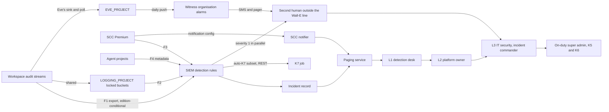
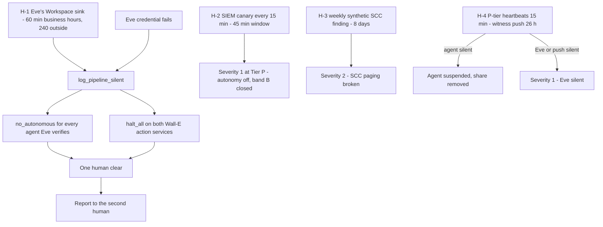

# 11. Monitoring, detection and incident response

## Status
- Owner: the platform owner
- Last reviewed: 2026-09-14

## What you will understand by the end

This chapter answers two risk themes from Chapter 3, The problem and its risks:

- **Tenant compromise through the robot credential.** Chapter 8, Identity, privileged access and the fleet kill switch, meets this from the identity side; this chapter meets it with detection.
- **Manufactured silence.** The watched actor switches off what watches it.

It also carries part of a third theme, staffing that makes two-person rules notional, because it decides who is paged about whom.

By the end you will know why detection is the primary control for the super-admin tier, which feeds the platform reads and why the SIEM is a contract before a product, which rules exist and which may stop the fleet, how silence becomes a halt, who is told how fast at each tier, and how an incident runs from the first page to a regulator.

The design of record is [page 07](../07-monitoring-detection-incident-response.md). Nothing here is built.

## The rule: detection is the primary control for the super-admin tier

Below Tier P, detection proves that a refusal by Google or the platform happened. In Tier P-SA nothing at Google's end refuses `walle@`, the robot account that holds Super Admin, beyond the consented OAuth scope set (Chapter 3, The problem and its risks); every other ceiling is code. For that tier detection is the primary control ([page 07 §0](../07-monitoring-detection-incident-response.md#0-the-rule-this-page-rests-on-and-what-it-is-for)).

Three properties hold throughout this chapter:

- **The store is independent of the actor.** Every severity-1 rule about `walle@` lives in the SIEM and in Eve's projects, never in `WALLE_PROJECT`.
- **Absence is a signal.** Every feed has a heartbeat, and each heartbeat's alarm sits outside that feed's failure domain.
- **Nothing detection-grade stands alone.** Each rule names the enforcement it backs, or says it is the last line. For the super-admin set it is the last line, and the residual risk sits in the deviation signed under P33.

The cost is real: a detection starts a response but does not prevent the first action.

## What the platform watches

### Four feeds owned by the organisation

Four feeds reach the SIEM. None uses domain-wide delegation or a service-account key ([page 07 §1.1](../07-monitoring-detection-incident-response.md#11-the-four-organisation-owned-feeds-and-where-each-lands)).

- **F1, the Workspace export.** The Admin console's Google Security Operations export sends every supported Workspace event type, including the streams Cloud Logging never receives. It exists only on certain Workspace editions, and the tenant's edition is *tbd*; it delivers only events after connection, the first data can take up to 24 hours, and a human administrator configures it, never `walle@`. A delegated admin with the Reports privilege can change it.
- **F2, Cloud Audit Logs and the Workspace streams shared with Cloud Logging.** These land in `LOGGING_PROJECT` through the sinks of Chapter 12, Data, logging, retention and sovereignty. Whether the SIEM ingests them directly or through Pub/Sub is unverified. Sensitive Actions cannot read logs under CMEK or outside `global`, so the platform copies Google's `_Required` bucket and never redirects it.
- **F3, Security Command Center findings.** The SIEM ingests these by default.
- **F4, agent-layer metadata.** Each action service publishes its halts, denials, verifications and heartbeat to its project's Pub/Sub topic. Messages carry ids, reason codes and hashes, never a prompt or a payload.

Eve's own copies are not a SIEM feed but the verifier's evidence, exported daily to the witness organisation (Chapter 16, Eve, the independent controller).

Two switches can darken most of this with one click: **sharing options** stops F2's Workspace half, Eve's sink and the Workspace threat findings together; **the export setting** stops F1. The answer is topology. The SIEM and the witness are fed by different paths, so no single switch darkens both.

### Security Command Center Premium and Audit Manager

Security Command Center (SCC) is activated at **Premium, at organisation level**. Enterprise is not chosen: it was deprecated on 2026-05-21 and shuts down on 2027-05-21 ([page 07 §3](../07-monitoring-detection-incident-response.md#3-security-command-center-premium-at-organisation-level)).

- **What Premium brings:** Event Threat Detection with the Workspace findings, which need organisation-level activation and so make it a Tier C precondition; Security Health Analytics custom modules; AI Protection; Sensitive Actions; and Agent Platform Threat Detection, Preview and nonprod only (Chapter 10, Agent Gateway, Model Armor and the perimeter).
- **Funding** is P11, open.
- **Residency** is recommended as `eu` under P94, proposed, once the platform confirms which Cloud Run Threat Detection detectors residency disables, because the location is chosen at activation.

**SCC does not page on its own.** One notification configuration sends active CRITICAL and HIGH findings to a notifier in `CORE_PROJECT`, and a weekly synthetic finding proves the path.

**Audit Manager** runs three frameworks monthly into the evidence bucket: ISO 27001:2022, NIST AI 600-1 Privacy Controls, and Google Recommended AI Essentials. Organisation-level and scheduled assessments are still in Preview, so until GA the run targets the platform folder. A missing report is a drift finding.

### The SIEM: a contract before a product

The SIEM choice is **P10, open with IT security**: the organisation's existing SIEM, or an own Google SecOps instance with a managed detection partner. So that the super-admin grant does not wait on procurement, page 07 writes the contract any SIEM must meet to open Tier P (P92, proposed while P10 is open), plus a default the factory provisions if P10 is still unanswered when the rest of the Tier P checklist is green ([page 07 §2.1](../07-monitoring-detection-incident-response.md#21-why-the-decision-is-a-contract-first)).

The nine clauses, S1–S9, require EU residency, retention to the schedule, ingestion of F1–F4 without delegation or keys, rules in git with replay tests, cases carrying the correlation keys, a 24x7 desk, an outbound REST call to the K7 job, search by principal, and readers administered by IT security with no agent among them. If the organisation's SIEM wins, the rules are rewritten in its language; the ids, tests and runbooks stay the same.

The default is P93, proposed: an own SecOps instance in the **Europe multi-region**, which keeps data in EU member states ([page 07 §2.2](../07-monitoring-detection-incident-response.md#22-the-default-an-own-google-secops-instance)).

- **Location.** SecOps has no `europe-west1` location; `europe-west3` is the fallback if the ISMS needs a nameable site.
- **Retention** is ordered at the smallest term of at least 400 days, an Assumption until the DPO decides P13. The SecOps default of 12 months and maximum of 60 are unverified on Google's primary page.
- **Cost.** F1 carries edition-wide Workspace activity, so it is the largest cost line (Assumption), and IT security pays from Tier P.
- **Playbooks** enrich and page. They never act, except for the one K7 call. The outbound identity for that call is *tbd*.

### Below Tier P: the honest desk

Tiers C, R and W have no 24x7 desk. Their desk is SCC findings and absence alerts paging the platform owner. The target is **"next business morning"**, written down as the honest number ([HLD §7.1](../01-hld.md#71-feeds-siem-and-security-command-center)). The desk by tier as a staffing question is Chapter 23, Operating model.

## Registered implies feeding the SIEM

Every agent project receives the **monitoring baseline module** in one of four variants ([page 07 §4.1](../07-monitoring-detection-incident-response.md#41-module-contents-by-baseline-variant)).

| Variant | Tier | Heartbeat | Heartbeat absence alarm | Audit-row absence alarm |
|---|---|---|---|---|
| `classical` | C | none (no project; the evidence is the tenant app's Data Access log) | — | — |
| `read` | R | daily | — | — |
| `write` | W | hourly | 2 h | 4 h |
| `credentialed` | P | every 5 minutes | 15 min | 60 min |

The module also brings the Data Access configuration and SIEM feed, span content switched off, SIEM entity registration from the register row, and drift detection.

One step of the admission gate (Chapter 9, Registry, governance and the autonomy contract) is "the first heartbeat landed" ([page 07 §4.2](../07-monitoring-detection-incident-response.md#42-admission-what-the-first-heartbeat-landed-means)): a heartbeat visible under the agent's `agent_id` within the lag budget, a populated entity list and a nonprod forced absence that paged the desk.

The failure that matters comes after admission: an agent that keeps acting while its evidence has stopped. The rule is therefore also a **continuous invariant** (P74 and P95, proposed). Behind the project's absence policies, the reconciliation job checks every production row against a silence budget: 24 hours at C and R, 4 hours at W, 15 minutes at P (an Assumption equal to Eve's own window).

A breach suspends the row by automated pull request and CI removes the agent's egress entry; at W the job also calls `halt_all`, and at P the finding is severity 1. Leaving suspension is a human pull request: machines lower, humans raise. Register row 9 resolves the budgets, once stated on two pages, to one set on page 07 ([register §7](../12-open-decisions.md#7-values-that-differ-between-pages)).

## The correlation contract

An investigation crosses a tenant and an organisation, so every audit row carries the same join keys ([page 07 §5](../07-monitoring-detection-incident-response.md#5-the-correlation-contract)):

- `agent_id`;
- `invocation_id`;
- `run_id`, which ties the plan, the approvals and Eve's verdict together;
- `trace_id`;
- the human `sub`, a surrogate taken from the Gemini Enterprise `StreamAssist` log;
- the Workspace `insertId` of the resulting admin event.

Four committed queries use these keys, starting from a complaint, a Workspace event, an SCC finding or a page, and are timed in every tabletop.

The schema validator refuses a deploy whose audit writer omits a key. A row missing `invocation_id` or `run_id` is a severity-3 `audit_gap`. A robot event with no row at all is Eve's `reconciliation_gap`, and it halts.

## The detection catalogue

### Detection as code

IT security code-owns the rule files. The security reviewer owns their content, with the managed detection partner joining from Tier P. No agent owner can change a platform or super-admin rule.

A rule without a replayable fixture cannot merge; reviews are quarterly and a rule silent for 180 days is flagged as dead; coverage is scored against a public agent-threat taxonomy that P21, still open, will pick; and tampering with any evidence store, sink, audit configuration, floor, deny policy or the K7 plane is severity 1 ([page 07 §6.1](../07-monitoring-detection-incident-response.md#61-ownership-and-lifecycle)). This is P96, proposed.

### The super-admin set

These rules exist because nothing else refuses the robot. They are hosted in the SIEM, never in `WALLE_PROJECT`, owned by IT security and severity 1, and each page reaches the desk and, in parallel, the second human outside the Wall-E line.

**SA-01..SA-09, the Workspace side** ([page 07 §6.2](../07-monitoring-detection-incident-response.md#62-the-super-admin-set-workspace-side--siem-hosted-severity-1-owned-by-it-security)), cover out-of-catalogue admin methods, admin-role grants, any posture change (the two switches included), interactive logins on `walle@` or `eve@`, foreign-client tokens, roster diffs, robot events with no audit row, unneeded applications and control-group changes. The switches' event names are unverified until observed on a sandbox tenant; until then the heartbeats detect those changes.

**SG-01..SG-07, the organisation side** ([page 07 §6.3](../07-monitoring-detection-incident-response.md#63-the-super-admin-set-gcp-organisation-side--the-reach-into-the-organisation)), watch the robot's reach through Organization Administrator (Chapter 16, Eve, the independent controller): IAM on the organisation, folders and core projects; sinks and audit configurations; policy, boundary and floor edits outside a privileged grant; core-project deletion; grants outside a change window; deploys outside CI. Access Approval requests (SG-06) alone are severity 2.

Eve's reconciler mirrors the Workspace rules, which gives two independent evaluators whose agreement is measured. Register row 11 records that Eve's pages do not yet carry six of the HLD's severity-1 rows.

### The platform and agent sets

PL-01..PL-15 apply to every tier and gate Tier W ([page 07 §6.4](../07-monitoring-detection-incident-response.md#64-the-platform-set-and-the-agent-set)). They cover heartbeat absence, cross-project principals, secret access by agents, Model Armor and gateway changes outside CI, evidence-store and key state, the Data Access canary, and code execution outside the closed tier.

PL-10 holds the tenant-app detections:

- **severity 1:** a fence removed from the Gemini Enterprise app, a robot using `StreamAssist`, or an engine mutated by the Discovery Engine service agent;
- **severity 2:** an unapproved share;
- **severity 3:** four business hours with no `StreamAssist`.

Each agent's own rules (AG-*) stay in its project as the builder's liveness layer. They are listed in the catalogue, and the severity-1 ones are duplicated into the SIEM.

### Which rules may pull K7 automatically

A severity-1 SIEM rule may invoke the fleet kill switch K7 (Chapter 8, Identity, privileged access and the fleet kill switch) over plain REST, never through a model, but not every one should: an interactive login on the robot is a Wall-E incident, not a platform one.

The **auto-K7 subset** covers the rules whose firing means the control plane itself is being altered: SG-01 by the robot or an agent principal, SG-02, SG-03, SG-04 and PL-02. A tampered control plane may be lying about everything else, and stopping the fleet costs only availability. These rules apply KF-1 and then KF-3.

The SA-* rules never kill the fleet. They trigger a K0 halt on the named agent and page a human.

Until the SIEM's outbound identity holds invoker on the K7 job, the subset runs as a dry run that writes a case. A machine may apply KF-1, but only a human may remove it ([page 07 §6.5](../07-monitoring-detection-incident-response.md#65-which-rules-may-pull-k7-automatically)).

## Silence becomes a halt

The robot can stop, in one console visit, the stream that every rule reads. The only defence that does not depend on that stream is a heartbeat whose absence alarm sits on a channel the stream's owner does not control. P97, proposed, sets four heartbeats and one credential check ([page 07 §7](../07-monitoring-detection-incident-response.md#7-pipeline-heartbeats-and-the-log_pipeline_silent-halt)).

When H-1 fires, or Eve's credential fails, Eve's reconciler sets **`log_pipeline_silent`**. Every agent Eve verifies loses autonomous work, and both Wall-E lanes take `halt_all`. Silence is what a super admin can manufacture, so the default state of silence is a halt, not an alert.

- **What may continue.** Band-A chat work at L3 may continue with a live operator re-check (Assumption; the Eve owner may choose `halt_all` instead).
- **Clearing the halt** takes one authenticated human call, reported to the second human as sole recipient.
- **Where the alarm lives.** H-1's alarm lives in the witness organisation as well as in `EVE_PROJECT`, for the reason Chapter 16, Eve, the independent controller, gives.

H-2 proves that the SIEM can see: a synthetic pair every 15 minutes (its form an Assumption), with receipts watched from outside the SIEM. H-2 missing while H-1 is healthy is severity 1 at Tier P, because the primary control is blind. The Eve owner holds H-1 and H-4, and the platform owner holds H-2 and H-3.

## The platform reporting path

A verifier that reports only to the person it verifies is not a control. P98, proposed, makes Eve's contract the rule for every verifier ([page 07 §8](../07-monitoring-detection-incident-response.md#8-the-platform-reporting-path-every-verifier-reports-to-a-human-outside-the-owners-line)):

- the verifier's owner sits outside the administration line of every agent it verifies, and admission refuses a Tier W+ agent otherwise;
- severity-1 and severity-2 pages go to that owner in parallel with the desk;
- reports about a human with authority over the agent (level raises, halt clears, privileged grants) go from the witness to that owner alone;
- unacknowledged pages re-page the secondary, then the incident commander;
- three pages a week on one reason code trigger a review, never silencing.

Page 07 leaves one tension open. At Tier W the verifier owner is the platform owner until a second person exists, which sits uneasily with the admission rule. The second human's work is Chapter 16, Eve, the independent controller.

## Incident response

### Roles, escalation and targets

The roles include the incident commander from IT security, the on-duty human super admin (the only role that can pull K5 or K6), the second human, the platform and agent owners, the desk, the security reviewer, the DPO, communications, HR and legal. Separation holds in every incident ([page 07 §9.1](../07-monitoring-detection-incident-response.md#91-roles-and-raci)):

- whoever prompted the robot never commands the incident about that prompt;
- the agent owner never pulls K5 or K6 when the owner is the actor;
- a page about the administrator is acknowledged by the second human.

P99, proposed, sets one organisation-owned paging service, `agentic-platform`: IT security's on-call tool if it runs 24x7, otherwise a commercial one, with severity 1 also sent by SMS from the witness. Escalation runs L1 desk, L2 platform owner, L3 IT security; severity 1 pages the second human in parallel and reaches L3 automatically at twice the target. Below Tier P, L1 and L2 are the same person ([page 07 §9.2](../07-monitoring-detection-incident-response.md#92-the-on-call-tool-escalation-and-acknowledgement-targets)).

| Target | Tiers C–W | Tiers P and P-SA |
|---|---|---|
| Severity-1 acknowledgement | next business morning | 15 min in business hours, 60 outside (Assumption) |
| Severity-2 acknowledgement | next business morning | 4 business hours (Assumption) |
| K0 halt | under 60 s | under 60 s |
| K5 suspend the robot | — | within 30 min of acknowledgement (Assumption) |
| K6 remove Super Admin | — | within 60 min |
| K7 | KF-1 under 60 s, 5 min end to end | the same |

After K4 or K5, a token that has already been issued lives for up to 60 minutes, and every runbook says so. The rota is Eve's `oncall.yaml`. An uncovered rota period halts autonomous writes for the agents the absent person verifies.

### One incident record

P100, proposed, keeps every incident in the SIEM's case system. The organisation's ITSM is used only if its cases cannot carry the mandatory fields ([page 07 §10](../07-monitoring-detection-incident-response.md#10-one-incident-record)): the correlation keys, levers pulled with times, whether Eve saw it first, the regulatory flags and the decision record to resume.

Eve's incident row and the case are reconciled nightly, because two disagreeing records are what a regulator finds. On severity 1, evidence is snapshotted into the locked bucket before any remediation, and a copy reaches the witness within 24 hours. One inconsistency is still open: Wall-E's ladder page and Mo's artefacts page name an incident-note path that does not exist (register row 12).

### Runbooks

Every runbook follows the same sequence: trigger, first 15 minutes, contain, investigate, recover, notify, exit ([page 07 §11](../07-monitoring-detection-incident-response.md#11-runbooks-per-scenario)). The two crisis scenarios drive the design.

- **RB-01, leaked robot token.** The desk pulls K0 and establishes whether the events came through the committed clients (service compromise) or a third client (exfiltration); then K4 and K5, watching the hour a live token survives with K6 pre-staged, and K7 if an organisation rule fired. Recovery rotates both clients, rebuilds the robot, reverses the effects and freezes promotions for 30 days.
- **RB-02, interactive login.** No triage: K0, a human ends the sessions, then K5.

RB-03 to RB-09 cover Eve silent, self-silencing (any silent window longer than H-1's is severity 1), a SIEM outage, an out-of-catalogue action or human anomaly, a compromised CI or forged approval, a provider incident (the fail-closed state is the safe state) and injection reaching a write. Chapter 19, Threat model and residual risk, maps adversaries to runbooks; RB-10 and RB-11 are the regulatory clocks below.

## The regulatory clocks

Every severity-1 case closes with two recorded assessments, each with the assessor's name and the time. P101, proposed, defines both ([page 07 §12](../07-monitoring-detection-incident-response.md#12-the-regulatory-clocks)).

**EU AI Act, Art. 73.** A provider of a high-risk system reports a serious incident within these limits:

- 15 days of establishing a causal link;
- 10 days for a death;
- 2 days for a widespread infringement or an irreversible disruption of critical infrastructure.

The provider must not alter the system before informing the authority, which the evidence snapshot secures. No register row is high-risk today: Wall-E claims the Art. 6(3) derogation, and Annex III applies from 2027-12-02. The taxonomy therefore runs **voluntarily** until any row becomes high-risk.

The classes are:

- mass wrongful suspension, deletion or licence reclaim, which falls under fundamental rights with a 15-day clock (thresholds are an Assumption for legal to set);
- an effect on health, with 10 days for a death and 15 otherwise;
- a band-B error affecting at least three Member States, with a 2-day clock;
- a negative determination on critical infrastructure (Assumption).

The incident commander and legal assess within 24 hours, and the AI compliance owner reports. The entity (P23) and the authority are open. The Act overall is Chapter 20, EU AI Act.

**GDPR, 72 hours.** The desk flags any severity-1 case touching a personal-data store when the case opens, and awareness counts from acknowledgement. The DPO then works to these times:

- assessment within 4 business hours (Assumption);
- decision within 48 hours;
- filing within 72 hours.

Data subjects are informed where the risk is high.

**TISAX 1.6 and the works council.** This process meets event reporting, incident handling and crisis management; a human report opens a case exactly as a rule does. Employee representatives are informed before Stage 1 and, where national law requires it (Assumption), take part in the tabletops and receive the review of incidents that affected employees. Chapter 22, Personal data, employees and the works council, has the rest.

## Tabletops and SOC metrics

Tabletops are P102, proposed ([page 07 §13](../07-monitoring-detection-incident-response.md#13-tabletop-exercises)).

- **Cadence.** Quarterly until four clean Tier P quarters, then semi-annual. There is one before Stage 1 of the first Tier W agent and one before the super-admin grant.
- **Who runs them.** IT security runs them, never the platform owner. Both K5/K6 rota humans, the desk, the DPO, legal and HR take part.
- **The crisis scenario** is the abused robot credential, RB-01 and RB-02 combined. It runs at least yearly and as the pre-grant exercise.

SOC metrics are P103, proposed, produced **monthly** ([page 07 §14](../07-monitoring-detection-incident-response.md#14-soc-metrics)). They cover response times, rule precision and coverage, pipeline availability, audit completeness, agreement between the SIEM's and Eve's evaluators, and regulatory-clock compliance.

The desk produces the platform-wide metrics from the SIEM and the cases, **never from `MO_PROJECT`**, so the management review sees numbers the improver did not compute about itself. Mo produces the Wall-E and Eve packs (Chapter 17, Mo, continuous improvement). Targets stay *tbd* until three months of data exist.

## Key decisions and what to read next

The state of each decision on 2026-09-14:

- **Decided:** P33, which is this chapter's premise.
- **Proposed:** P74, P92 (with P10 open), P93, P94, P95, P96, P97, P98, P99, P100, P101, P102, P103.
- **Open:** P10 (SIEM), P11 (SCC funding), P13 (retention), P21 (taxonomy), P23 (legal entity).

By gate: P11, P21, P94 and P95 before the folder exists ([register §2](../12-open-decisions.md#2-before-the-folder-exists)); P13, P74, P96 for PL-*, P98, P99, P100 and P103 before Tier W ([§3](../12-open-decisions.md#3-before-any-tier-w-agent-writes)); P10, P92, P93, P97, P101 and P102 before the super-admin grant ([§4](../12-open-decisions.md#4-before-the-super-admin-grant)).

Still unverified: F2's ingestion path, the SecOps retention figures, the UDM field paths, the switches' event names and the tenant edition. Carried to Chapter 19, Threat model and residual risk: a leaked credential acts until detection and K5 meet it, a token survives up to an hour, and for the super-admin tier detection is the last line.

Read next:

- [page 07](../07-monitoring-detection-incident-response.md), in full;
- [HLD §7](../01-hld.md#7-monitoring-and-detection);
- [page 08 §4.3](../08-data-logging-retention-sovereignty.md#43-the-canary) on the Data Access canary;
- [page 04 §9.1](../04-identity-and-privileged-access.md#91-what-k7-is-and-what-it-is-not) on K7;
- [Eve's reporting contract](../../eve/03-lld.md#15-the-reporting-contract) and [page budget](../../eve/06-failure-modes.md#the-page-budget-and-the-paging-conditions);
- [Wall-E's severity table](../../wall-e/05-autonomy-ladder.md#9-severity-and-automatic-response).
