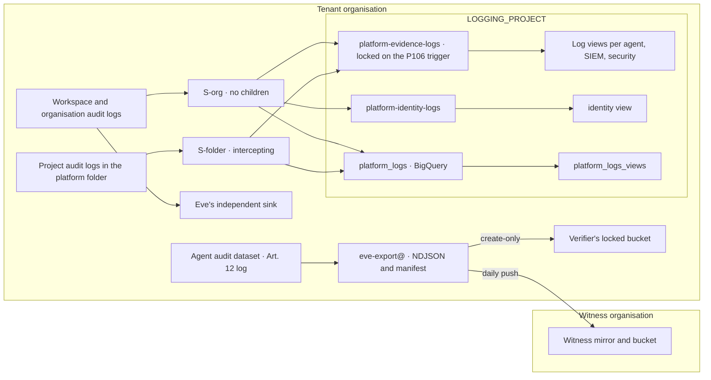

# 12. Data, logging, retention and sovereignty

## Status
- Owner: the platform owner
- Last reviewed: 2026-09-14

## What you will understand by the end

This chapter answers the risk theme Chapter 3 calls manufactured silence, where the watched actor re-filters sinks or deletes evidence so that no alert looks like calm. Chapter 11, Monitoring, detection and incident response, turns silence into a halt; this chapter decides where evidence lives, who can shorten it and for how long. It also carries the evidence half of two other themes: tenant compromise through the robot credential, and autonomy outrunning evidence.

By the end you will know where every store is and what class of data it holds, who can silence or shorten the evidence, how long each class is kept and why the locks wait for the data protection officer (DPO), and why the platform does not use Assured Workloads today and what compensates.

The design of record is [page 08](../08-data-logging-retention-sovereignty.md). Nothing here is built.

## 12.1 The rule: evidence leaves the reach of the judged thing before it is needed

Chapter 4, The principles, states the primitive: evidence the judged thing cannot forge or silence. Page 08 makes it three working rules ([08 §1](../08-data-logging-retention-sovereignty.md#1-the-rule-this-page-rests-on)).

**Every store comes from the factory.** The factory creates each store from its data class, owner, retention and readers. A store the schedule does not know is a drift finding, and an owner who wants a different number changes the register row by pull request, never the bucket.

**Evidence exists three times, and each copy fails differently.** The agent's own store fails when its project is torn down or its owner rewrites it. The central copy fails when an organisation administrator re-filters a sink. The verifier's locked bucket and the witness organisation fail only if Google's retention lock fails. Only the third copy is preventive. The first two are detective, backed by absence alarms, and the design does not call them immutable.

**Retention is decided once per class.** The platform sets a floor and the DPO a ceiling. A locked period can be lengthened but never shortened, so nothing is locked until the ceiling is recorded.

## 12.2 Every store has a class (P109)

Retention, encryption, readers and the TISAX label all key on a single per-store value ([08 §2.1](../08-data-logging-retention-sovereignty.md#21-the-five-data-classes)). The organisation's own scheme is *tbd* with the ISMS, so the platform uses its own vocabulary, and the mapping to the organisation's scheme is an `Assumption:`. Page 08 and register row P109 call the vocabulary "five classes" but both list six; this chapter follows the list.

| Class | Holds | Default retention |
|---|---|---|
| `evidence` | audit rows and streams, verifier findings, alert and incident history | 400 days, locked where possible |
| `content` | prompts, responses, tool arguments, sanitize payloads | 30 days ceiling, never locked |
| `control` | plans, approvals, halts, counters | life of the agent |
| `record` | decision records, compliance snapshots, drill records | 10 years, locked |
| `secret` | credentials, keys, the surrogate mapping | rotation, never destroyed inside the evidence horizon (Chapter 13) |
| `ops` | project logs, traces, metrics, billing | 30 days |

The factory refuses a manifest without a `data_class`. That value picks the retention row, the reader pattern and whether discovery profiles the store.

The inventory classifies 27 stores ([08 §2.2](../08-data-logging-retention-sovereignty.md#22-the-store-inventory)). Three placements need explaining:

- **Mo's surrogate mapping is `secret`.** It makes every surrogate in Mo's views reversible, so no scan, export or view touches it.
- **`platform-identity-logs` is named the densest personal-data store.** It holds every employee's sign-ins.
- **Conversation history is `content`, not evidence.** The audit of what an operator asked lives in the agent's audit rows and the tenant app's Data Access entries.

Memory Bank, Workspace data and the model's prompt retention are deliberately not stores.

## 12.3 The central logging project (P104)

### Why one sink cannot do both jobs

The HLD's single organisation-level aggregated sink (a log-routing rule that collects from many projects at once) becomes two sinks on page 08, and the register settles that difference in page 08's favour ([register §7 row 4](../12-open-decisions.md#7-values-that-differ-between-pages)). Three verified facts force the split ([08 §3.1](../08-data-logging-retention-sovereignty.md#31-what-one-sink-can-and-cannot-do-and-the-topology-that-follows)):

- **A sink has one destination.** It routes into a central project whose own sinks fan out, one hop only.
- **Workspace audit logs are organisation-level entries.** A folder sink never sees them.
- **An intercepting folder sink stops entries reaching child projects' sinks.** Only each project's `_Required` sink still receives them. Data Access logs are then stored once, not once per agent project where each owner could shorten them. This makes "the agent cannot silence its logs" a property of the folder.

### Two sinks and the fan-out

The two aggregated sinks ([08 §3.2](../08-data-logging-retention-sovereignty.md#32-the-sinks)):

- **`S-org`** sits at the organisation without children. It carries the six Workspace streams and the organisation's own audit logs, and sweeps in no other folder.
- **`S-folder`** sits at `fld-agentic-platform` with children and intercepts. It carries only the five Cloud Audit Logs families, so content and operational logs stay in the agent projects.

Both deliver to `LOGGING_PROJECT`, whose own sinks fan out to four places:

- the central bucket `platform-evidence-logs`, locked on the P106 trigger;
- `platform-identity-logs`, which holds sign-in, token and SAML entries;
- the BigQuery dataset `platform_logs`, which holds no copy of employee sign-ins;
- per-agent trigger topics.

Only the trigger sinks exclude the agent's robot as actor, because otherwise each write would start another run. The evidence copies carry no principal filter, because they exist to reconcile what the robot did against what the agent claims. Wall-E's two organisation sinks are re-homed here. Eve's sink stays independent: its absence alarm notices if `S-org` is re-filtered.

### Log views and who reads what (P114)

Cloud Logging has no bucket-level permissions: access is granted per log view, a filtered window onto a bucket. A project-level logging reader, however, sees every view. `LOGGING_PROJECT` therefore has no standing project-level reader, and the drift job expects only the sink writer identities and the CI identity ([08 §3.3](../08-data-logging-retention-sovereignty.md#33-log-views-and-who-reads-what)).

Who reads which view:

- **Each agent** gets an owner-and-operator view.
- **Its verifier** gets a view that adds Workspace entries naming the robot.
- **The SIEM and `platform-security@`** see everything.
- **The Gemini Enterprise admin** reads human requests to the tenant app.
- **The identity view** is read by the security reviewer, Eve's verifier and the SIEM, and never by an agent owner.

Google allows 30 views per bucket, so P114 opens one evidence bucket per tier folder past about 25 agents, through a factory variable that must exist before the lock ([register §5](../12-open-decisions.md#5-before-wall-es-stage-1-and-its-later-stages)). Page 08 does not reconcile that threshold with two views per agent plus the shared views, which would fill a bucket at about 13 agents.

### Cost and who pays

Central log ingestion and locked retention are the design's largest cost line. The platform pays it from Tier R ([08 §3.4](../08-data-logging-retention-sovereignty.md#34-cost-and-its-owner)). No price is quoted, because Google's pricing page rendered truncated on 2026-09-13.

- **Workspace audit volume** cannot be cut, because it is the evidence.
- **Data Access volume** follows the service list in section 12.4. `Assumption:` it is billed to the project that stores the entries, which the first invoice will verify.

## 12.4 Data Access audit logging at the folder (P105)

One audit configuration sits on the folder's IAM policy ([08 §4.1](../08-data-logging-retention-sovereignty.md#41-the-configuration)). Google takes the union of levels, and a child cannot disable what a parent enables. Silencing these logs therefore needs a folder-level policy write. That write is itself logged, a severity-1 SIEM rule watches for it, and only an administrator working through Privileged Access Manager can make it. No member is exempt: no agent principal, no robot, no deployer.

Each service answers a forensic question:

- **Secret Manager:** who read a secret.
- **Cloud KMS:** who produced an Eve approval signature.
- **IAP and Firestore:** who reached control surfaces and plans.
- **Vertex AI:** who invoked an engine.
- **Discovery Engine:** what the human actually asked, which is off unless enabled.
- **Cloud Logging:** who read the evidence.
- **Agent Identity:** credential issuance.
- **IAM and organisation-policy reads:** reconnaissance.

Storage Data Access logging runs only on the four evidence-holding projects. Left out:

- **All services**, which is cost with no consumer.
- **Cloud Run and Pub/Sub**, which is volume no detection uses.
- **Agent Gateway and Agent Runtime**, which are absent from Google's audit-log services list.

### The canary, and registry reads not yet proven (P80)

The configuration does not prove entries arrive. A daily job reads a canary secret under each tier folder, the folder policy, a canary Firestore document and the Agent Registry. It then finds its marked entries through the `security` view ([08 §4.3](../08-data-logging-retention-sovereignty.md#43-the-canary)). A missing entry other than the registry's is severity 1 and, for Tier P, the silent-pipeline halt of Chapter 11.

Registry reads (P80, proposed) are the exception: on 2026-09-14 Google's product page documented these entries while its general services list omitted the service. The design follows the product page and counts registry read logging as unverified until the canary's first registry row. Until then a missing row is severity 3, and the gap is recorded as "registry reads unlogged".

## 12.5 Retention (P106, P13)

### Floor, ceiling and why the lock waits

The floor is the greater of the EU AI Act's six months and the organisation's standard, which is *tbd* ([HLD §7.5](../01-hld.md#75-retention); [08 §5.1](../08-data-logging-retention-sovereignty.md#51-floor-ceiling-and-the-lock-trigger)). For evidence the floor is 400 days, an `Assumption:` until the DPO decides. That exceeds the "at least six months" of Art. 26(6) and Art. 19, which bind Annex III systems from 2027-12-02 and which the platform adopts voluntarily now. It also matches Google's fixed `_Required` retention. Records are kept 10 years under Art. 18. Content logs and sanitize payloads are kept at most 30 days, a minimisation ceiling that may fall but not rise without a DPIA line.

The ceiling belongs to the DPO: one number per class, due before Stage 1 of any Tier W agent (P13, open). P106 sets the lock trigger. Locked stores are created unlocked at the floor and locked on the day the ceiling is recorded, at the larger of floor and ceiling. Until then, bucket changes need Privileged Access Manager and a severity-1 SIEM rule watches all three evidence projects. Before the DPO decides, central evidence is protected by detection, not a lock.

A lock does not make retention lawful: locked stores hold only the identifiers Art. 12 needs, and a data-subject request against one is answered by disclosure, not deletion (Chapter 22).

### The schedule in outline

The schedule of record has 16 rows ([08 §5.2](../08-data-logging-retention-sovereignty.md#52-the-schedule)):

- **400 days:** evidence stores. BigQuery cannot lock the agent audit dataset, so its daily export is locked instead.
- **400 days, `Assumption:`:** the identity bucket, where the DPO's number most plausibly differs.
- **Ten years:** records, Art. 73 reports and post-incident reviews.
- **30 days:** content and its de-identified twin. The twin may go to 90 days if the DPO approves; that request is recorded, not assumed.
- **30 days:** traces and operational logs.
- **Life of the agent:** Firestore.
- **At least 400 days:** the SIEM, whose SecOps default page 08 gives as 365, so the order must raise it; page 07 records that default as unverified on Google's primary page (Chapter 11).

Agent Runtime Sessions are not yet a row; `Assumption:` they take the content ceiling.

### Conversation retention

Gemini Enterprise offers 1, 30, 60, 90, 120 or 180 days of chat history, defaults to 60, and needs the Plus edition to change it. The tenant's edition is *tbd*. The interim value is 30 days, marked `Assumption:`, and runbook step GE-6 sets it ([03 §5.4](../03-gemini-enterprise-environment.md#54-conversation-retention-p52-under-p13); [register §7 row 1](../12-open-decisions.md#7-values-that-differ-between-pages)). The chat is tenant content about named employees and not the Art. 12 log, so the six-month floor does not bind it. The DPO settles the number under P13, and a quarterly manual check confirms the setting.

### The three identity streams

Sign-in, OAuth-token and SAML entries expire after 30 days in the organisation's `_Default` bucket unless routed ([08 §5.3](../08-data-logging-retention-sovereignty.md#53-the-three-identity-streams)). A robot's interactive login is severity 1, so these entries are routed. They go to their own bucket for two reasons: the DPO can set a different ceiling on employees' sign-in history without touching the audit lock, and the bucket's readers can differ from the agent views'. Eve's sink keeps a second copy. Some of these streams reach Google Cloud only on certain Workspace editions, so the edition is a Stage 0 precondition.

## 12.6 The daily export and the witness push (P107)

The agent's audit dataset, together with the frozen plan, is designated the Art. 12 log. It must therefore outlive the agent's project and its owner's rights over it ([08 §5.4](../08-data-logging-retention-sovereignty.md#54-the-daily-export-to-the-evidence-bucket-closes-decision-31)).

Each day, `eve-export@` exports yesterday's audit tables and Eve's findings, verdicts, incidents and pages as newline-delimited JSON (one record per line). Each export carries a manifest of row counts and SHA-256 hashes, so a reviewer can check the export against BigQuery without trusting the exporter. The export lands in the verifier's locked bucket, never the agent's project. Then the same job pushes it into the witness organisation. The exporter can only create objects.

Eve's verifier, which cannot write the bucket, recomputes the counts:

- **A missing day** raises the witness alarm, at severity 1 for Tier P.
- **A mismatch** holds any promotion that cites that day.

The register rejected the verifier as exporter: one identity, one duty. That leaves three copies with three jobs. The mirror is queryable, the export is immutable, and the witness sits outside the organisation (Chapter 16, Eve, the independent controller). `Assumption:` Google allows the cross-location extract.

Monthly exports send incident cases and alert history to the evidence bucket for 400 days, and Art. 73 reports to the records bucket for ten years ([08 §5.5](../08-data-logging-retention-sovereignty.md#55-alert-incident-and-evidence-register-exports)).

## 12.7 Sensitive Data Protection (P108)

A declared class nobody checks is a claim. P108 runs discovery across the folder's BigQuery and Cloud Storage, excluding `secret` stores by their register label ([08 §6.1](../08-data-logging-retention-sovereignty.md#61-discovery-at-the-folder)). Discovery does not profile log buckets or Firestore. A daily job compares what discovery finds with what each store declares:

- **An `ops` store holding names** is a finding against the register.
- **An empty content profile** means the de-identify job is broken.

One template, `platform-log-deid-v1`, applies to every agent ([08 §6.3](../08-data-logging-retention-sovereignty.md#63-the-de-identify-standard-for-logs-and-the-content-bucket-readers)). It turns identifiers into deterministic tokens and redacts credentials. The same person always becomes the same token, so graders can count distinct people without seeing one, while free text stays readable.

A daily job writes the de-identified twin, because Cloud Logging cannot transform on ingestion. The tier Model Armor templates reference the same template. Graders and Mo read only the twin. Content buckets carry restricted fields and never a linked BigQuery dataset, because BigQuery ignores field-level access.

This is still open on the agent pages. Page 06, Wall-E's prompt-security page and Mo's access page do not yet name the standard ([register §7 row 13](../12-open-decisions.md#7-values-that-differ-between-pages)).

## 12.8 Sovereignty

### Why not Assured Workloads today (P110, P12)

P110, proposed, keeps the agents folder out of the EU Data Boundary package of Assured Workloads ([08 §7.1](../08-data-logging-retention-sovereignty.md#71-assured-workloads-eu-data-boundary-for-the-agents-folder-no-not-now-p110)). On 2026-09-13 the package listed Gemini Enterprise, Vertex AI, Cloud Logging and Model Armor, but not Agent Gateway or Agent Registry. Page 08 and the register add Agent Identity, while the HLD names only the first two ([HLD §8.2](../01-hld.md#82-sovereignty)).

The package restricts its folder to supported products. A product outside it is therefore refused, or reported as a standing violation, not a configurable exception. The platform would have to drop its gateway and registry, or accept a paper control. Cost is not the reason; the package is free.

Saying no costs the platform four things:

- **Key Access Justifications**, which are unavailable without the package.
- **Google-run violation monitoring**, replaced by the platform's own drift detection.
- **The package's policy set**, replaced by the platform baseline (Chapter 7).
- **Per-product boundary statements**, replaced by a coverage request to Google (P32).

Adopting it later means a new folder and project moves. The revisit trigger, P12, is open: it fires when the products join the package, the TISAX label becomes Strictly confidential, or the organisation adopts the package elsewhere.

### What compensates (P111, P113)

The compensating set ([08 §7.2](../08-data-logging-retention-sovereignty.md#72-the-compensating-set)) has six parts:

1. **EU locations enforced at the folder.** For Agent Runtime this is an `Assumption:` and detection-grade until verified.
2. **Residency exceptions kept as dated rows.** These include Workspace audit logs, which Google stores without a selectable region, so the central `europe-west1` copy is the resident one.
3. **Access Transparency**, confirmed at Stage 0 and routed to the evidence bucket and the SIEM.
4. **Access Approval** on the Tier P and Tier W folders, the controllers, the witness, `LOGGING_PROJECT` and `CORE_PROJECT`. It adds approval delay to Google support, a cost the design accepts. The HLD omits the Tier W folder. Neither Access Transparency nor Access Approval covers the gateway or the registry.
5. **The witness under the same EU policy.**
6. **The EU model-pin rule (P113).** An `eu` app keeps data and processing in the EU only for models that support it. On 2026-09-13 several Gemini Flash models were `global`-only. A model may be pinned only if Google lists EU residency and processing for it on the pin date, checked in CI against an allow-list. A model that leaves the list gets a 30-day re-pin window (`Assumption:`).

Keys for these stores are Chapter 13.

## 12.9 Asset owners per project

TISAX wants an owner per asset ([08 §8](../08-data-logging-retention-sovereignty.md#8-asset-owners-per-project-g56)). Each project names four roles: an asset owner, a data owner, a custodian and a classification reviewer, who signs each store's class at every stage transition. The ISMS supplies names.

- **The platform owner** holds the five core projects.
- **The DPO** owns the data in the identity bucket and conversation history.
- **The security reviewer** owns the validator project and reviews the other projects.
- **IT security** is custodian of the witness and owns the organisation-level stores.

On 2026-09-13 most roles are one person; the tier gate of Chapter 24 changes that.

## 12.10 What could not be verified

No exception is open yet ([08 §11](../08-data-logging-retention-sovereignty.md#11-exceptions-and-what-could-not-be-verified)). The following are unverified:

- log prices and billing;
- Terraform support for intercepting sinks;
- the cross-location export;
- the scan location;
- APIs for the retention and Access Transparency settings;
- engine residency;
- Agent Identity operation typing;
- registry reads;
- the tenant's Workspace edition;
- the organisation's retention standard;
- Google's per-service TISAX coverage.

## Key decisions and what to read next

Register states on 2026-09-14:

- **Proposed, before the folder exists:** P104 sinks; P105 Data Access and canary; P108 discovery and de-identification; P109 classes and owners; P111 Access Transparency and Access Approval; P112 central keys; P80 registry reads, unverified.
- **Proposed, before Tier W writes:** P106 schedule and lock; P110 no Assured Workloads; P113 conversation retention and model pins; P52 aligned with P113. P106, P113 and P52 depend on P13.
- **Proposed, before Wall-E's Stage 1:** P107 export; P114 bucket per tier.
- **Open:** P13 the DPO's ceiling; P12 the revisit trigger; P32 Google's coverage; register row 13.

Carried to Chapter 19, Threat model and residual risk:

- Two of the three evidence copies are detection-grade.
- Nothing central is locked before the DPO decides.
- A re-filtered `S-org` is seen, not prevented.
- The gateway and registry sit outside Access Approval.
- Engine residency and registry read logging are unverified.

Read next: [page 08](../08-data-logging-retention-sovereignty.md), [HLD §7.5](../01-hld.md#75-retention) and [§8.2](../01-hld.md#82-sovereignty), [register §7](../12-open-decisions.md#7-values-that-differ-between-pages), the [project topology](../../project-topology.md), and Chapter 13, Supply chain, keys and recovery.
