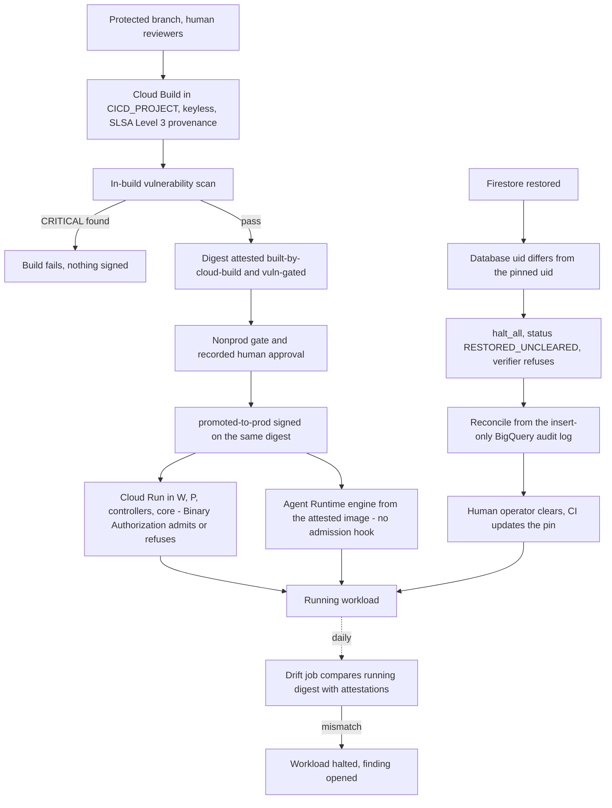

# 13. Supply chain, keys and recovery

## Status
- Owner: the platform owner
- Last reviewed: 2026-09-14

## What you will understand by the end

Why what runs in a credential holder is what was reviewed, scanned and signed, and where that is only detected; who holds which key, which stores are recorded exceptions, and why no approval or evidence key is destroyed inside the evidence horizon; how each asset class is recovered, why Workspace is never backed up, and why a restore cannot quietly undo a halt.

The chapter answers four risk themes of Chapter 3, The problem and its risks. Tenant compromise through the robot credential: whoever changes the action service's image or reads its secret holds the credential, so both paths are closed or watched. Manufactured silence: a destroyed key or a restored database could erase a halt or make evidence unreadable without an alert. A controller reachable by what it controls: Eve's keys stay outside the platform's key project. Shadow agents: only an attested image from the shared registry may deploy. A halt, an approval and an evidence row are worth something only if no later deploy, key operation or restore can cancel them. Nothing here is built on 2026-09-14.

## The supply chain

The charter's rule: no agent writes to a repository, a registry, a deploy identity, its own ladder or its own ceilings. What writes is a keyless pipeline whose every output is signed, scanned and admitted by a policy the agent's owner cannot edit ([page 09 §1](../09-supply-chain-secrets-recovery.md#1-supply-chain)).

### From commit to running digest

Cloud Build runs in `CICD_PROJECT`, triggered only from protected branches, as a per-agent build account reached through workload identity federation, so there is no key to steal. CI lints every build file for the three conditions under which its provenance meets SLSA Build Level 3. Every deploy names a digest, never a tag ([§1.1](../09-supply-chain-secrets-recovery.md#11-the-path-from-commit-to-running-digest), [§1.2](../09-supply-chain-secrets-recovery.md#12-build-and-provenance)).

Two points enforce, the build gate and admission on Cloud Run; one detects, the drift job.

### The shared registry and the vulnerability gate

One Artifact Registry per format in `CICD_PROJECT` holds a repository per agent. Public package indexes are reached only through remote repositories behind a virtual repository, the only endpoint a build may pull from, so no build reaches the public internet. That the build pool's egress setting enforces this is an `Assumption:` until the monthly drill tests it. Tags are immutable, lockfiles hash-pinned, and no human holds registry write ([§1.3](../09-supply-chain-secrets-recovery.md#13-the-shared-registry)).

The vulnerability gate (P117) is a build step, not a report, and the platform's own because Google's Kritis Signer guide returned 404 on 2026-09-13. An on-demand scan before the push fails the build on any CRITICAL finding or malicious package, and only a pass lets the pipeline sign `vuln-gated` with its HSM key. After the push, the drift job reads rescan findings for every running digest daily; a new CRITICAL carries a 24-hour rebuild target, and an untriaged HIGH blocks a Tier W promotion. The thresholds (no CRITICAL, HIGH triaged within seven business days) and patch cadences are `Assumption:` values the ISMS confirms. The attestation is not revoked automatically on a new CVE, because that would also block the rollback digest ([§1.4](../09-supply-chain-secrets-recovery.md#14-the-vulnerability-gate)).

### Admission, and where it becomes detection

Binary Authorization on Cloud Run evaluates the policy of the service's own project, so the factory generates one per agent project (P115): both attestations required, `promoted-to-prod` added in production, images only from the agent's repository, and no policy-editor role for the agent owner. The constraint forcing it sits on the W, P (inherited by P-SA), controller and platform-core folders, the last two because Eve's gate and reconciler, the K7 job and the drift job are Cloud Run on the authority and kill paths ([§1.5](../09-supply-chain-secrets-recovery.md#15-admission-on-cloud-run), [register §7 row 5](../12-open-decisions.md#7-values-that-differ-between-pages)). Tier R, with no credential holder, is exempt. Each folder runs 30 days in dry-run first. A blocked deploy is not an outage — the previous revision keeps serving — and the one bypass, `--breakglass`, is always logged and opens a severity-1 case.

Admission ends at deploy. Continuous validation exists only for GKE, in Preview, so on Cloud Run the drift job and a Security Health Analytics custom module compare running digests with the attested set daily: detection-grade, and stated as such. Agent Runtime has no admission hook at all. Engines can deploy from a container image (confirmed 2026-09-13), so from Tier W up, and for controllers, every engine deploys from an attested digest, and the drift job halts one that does not match (P116). Only Tier R may still deploy a source bundle, recording its SHA-256; the HLD and page 02 still describe that substitute for engines generally, where page 09 limits it to Tier R ([HLD §9](../01-hld.md#9-supply-chain), [§1.6](../09-supply-chain-secrets-recovery.md#16-agent-runtime-deploy-from-the-attested-image-and-the-bundle-hash-fallback)). Enforcement for engines comes from the folder deny policy, which refuses deploy, upload and build to every agent principal (Chapter 8, Identity, privileged access and the fleet kill switch).

### Who may write

The drift job asserts daily that the registry's only writer is the factory identity and each project's only deployer is its own per-agent deployer (P142), so one compromised release cannot deploy another agent; that is why the single shared deployer was retired (Chapter 7, Landing zone and the tier model) ([§1.7](../09-supply-chain-secrets-recovery.md#17-dependencies-repositories-deploy-identity-agent-authored-changes)).

The git host is open (P22). Whatever it is must give protected branches, two required reviewers on credential-holder repositories, code owners for Eve's configuration and the ceilings, and admin bypass disabled with its audit log exported, because an unaudited bypass is a write path around every reviewer. Pull requests an agent opens cannot be merged by the agent, need two human reviewers with one outside the owner's line, and may never touch contracts, ceilings, Eve's predicates or CI configuration. Chapter 17, Mo, continuous improvement, and Chapter 18, How the three work together, cover what is proposed and who merges.

### Environments, promotion and emergency change

Pre-production grows with the tier ([§1.8](../09-supply-chain-secrets-recovery.md#18-environments-promotion-and-emergency-change-decision-29-generalised)). Tier R needs a nonprod project; Tier W adds a nonprod system of record, the denial tests, a golden-plan replay through the verifier, the kill-switch drill and the restore drill; Tiers P and P-SA add the sandbox Workspace tenant (Chapter 7), because Super Admin cannot be scoped to an organisational unit; controllers and core add the K7 drill.

Promotion is an attestation, not a copy: after a recorded human approval the pipeline signs `promoted-to-prod` on the digest that passed nonprod, with no rebuild in which something untested could enter. Rollback redeploys a previous attested digest. An emergency change uses breakglass with a ticket, and a second reviewer within one business day either signs the promotion retroactively or forces a rollback. Engines have no emergency path: redeployed from an attested digest, or halted.

## Secrets

The conventions make a secret's reach readable from its metadata and checkable by a machine ([§2.1](../09-supply-chain-secrets-recovery.md#21-secret-conventions)).

- **Regional.** Every secret is regional in `europe-west1`; a global one is flagged as a residency incident. Refusal at creation waits on the P4 spike; regional secrets being GA is an `Assumption:`.
- **One reader.** Exactly one service account reads each secret, named in its `reader` label; a human reads one only through a 30-minute PAM entitlement (Chapter 8).
- **Pinned versions.** An action service reads a pinned version, so a new value takes effect only through a deploy, which passes every gate above ([Wall-E, where each secret lives](../../wall-e/02-identity-and-auth.md#where-each-secret-lives)).
- **An access alert.** With Data Access logs on at the folder (Chapter 12, Data, logging, retention and sovereignty), any access by someone other than the labelled reader pages: severity 1 for a credential holder's secret.
- **Rotation as a runbook.** Secret Manager announces rotation but does not rotate; the subscriber opens a ticket and never mints a Workspace credential, because minting is a witnessed human act. An unrotated Workspace credential blocks that agent's next raise.
- **Outside Secret Manager.** Robot passwords are in the corporate vault and each robot account's two hardware keys are with custodians named in a witnessed custody record (Chapter 8); a missing record blocks the super-admin grant.

## Keys

### The HSM floor and the key project

Every key is HSM-backed by organisation policy at the platform folder, approval-authority keys included (P118), so no key class needs its own argument. The cost, a charge per key version, is accepted and unpriced. Two more constraints force a key version to be disabled before destruction and set a destruction window of at least 30 days ([§2.3](../09-supply-chain-secrets-recovery.md#23-keys-hsm-everywhere-by-policy-and-the-three-kms-constraints)).

Cloud KMS Autokey, set at the folder, creates keys for the supported services in `KMS_PROJECT`, a fifth core project that holds keys only and never binds an agent principal ([register §7 row 6](../12-open-decisions.md#7-values-that-differ-between-pages)). The reason is placement: no approval or evidence key may sit where an agent's teardown or owner reaches. Engines, which Autokey does not cover, get a single-region key per agent there. Eve's approval and evidence keys stay in `EVE_PROJECT`, so a `KMS_PROJECT` administrator cannot brick Eve's copy (Chapter 16, Eve, the independent controller), and the witness never uses a key from the tenant's organisation.

### The recorded exceptions

The stance is recorded once so an assessor meets a dated exception with a reopening condition ([§2.2](../09-supply-chain-secrets-recovery.md#22-the-cmek-and-autokey-stance-recorded-once)). Firestore stays Google-managed (P119, exception 1): its CMEK is chosen only at creation and on 2026-09-13 sat behind an access-request form. The organisation `_Default` and `_Required` log buckets and Tier R content buckets also stay Google-managed (exception 2), since a 30-day content store's threat is its readers, not key custody.

The central evidence and identity buckets instead take an explicit HSM key at creation, and Tier W and above content buckets a key per agent (P112). They are outside exception 2 because CMEK can never be added to a bucket later ([register §7 row 2](../12-open-decisions.md#7-values-that-differ-between-pages)). The accepted cost: a disabled key makes the evidence unreadable at once and, after Logging's three-hour buffer, unwritable. Disable-never-destroy, a severity-1 rule on any key state change, no KMS administrator outside PAM and evidence copies on other keys contain it.

Both exceptions reopen if the TISAX label becomes Strictly confidential (P20). Key Access Justifications exist only with Assured Workloads, not adopted today (Chapter 12).

### One table, rotation and custody

Every key and secret is in one [cryptography table](../09-supply-chain-secrets-recovery.md#24-the-cryptography-table--every-key-and-secret-on-the-platform), by class, recording where each lives and who holds each side, never a value. Rotation follows the class ([§2.5](../09-supply-chain-secrets-recovery.md#25-rotation-and-custody-per-class)): approval keys manually on a dated schedule with 30 days' overlap, because Cloud KMS does not rotate asymmetric keys; attestor keys annually; Autokey keys yearly by Autokey's verified default, explicit keys every 90 days, pending an organisation cryptography standard that is *tbd*; Workspace credentials on revocation, custody change or suspected leak, by two witnessed custodians.

Old approval and attestor key versions are disabled and never destroyed for 400 days, the evidence horizon and itself an `Assumption:` floor. An approval is evidence only while its signature verifies; destroying a version would turn a year of approvals into unverifiable claims, silence achieved through key custody.

## Recovery

### Six classes

Every project and register row carries a recovery class derived from its tier ([§3.1](../09-supply-chain-secrets-recovery.md#31-classes-per-tier)).

| Class | Protects | RPO | RTO |
|---|---|---|---|
| R-A evidence | audit, drill and decision records, Workspace logs | 24 h | 72 h |
| R-B control plane | Firestore: ladder, plans, approvals, halts | 1 h | 4 h to `halt_all`; 1 business day to service |
| R-C agent compute | engines, action services, gateways | 0, from git | 1 business day |
| R-D shared services | registry, logging configuration, CI, state | 24 h | 1 business day |
| R-K keys and secrets | approval, attestor, robot credentials | — | keys never destroyed; tokens re-bootstrapped |
| R-W Workspace state | what agents changed | inverse operation per family | — |

Compute is rebuilt through the factory from an attested digest. Workspace credentials are never backed up, because a backed-up refresh token is a second tenant credential; recovery is a two-custodian bootstrap, with the Admin console meanwhile ([§3.5](../09-supply-chain-secrets-recovery.md#35-r-k-keys-and-secrets)).

### Why a restore boots at halt_all

The factory turns on point-in-time recovery, backups and delete protection for every Tier W and above database, beyond any agent owner's reach. The danger is what a restore brings back: Wall-E's decision 30 named halts, overrides, nonces and counters written after the restore point as silently lost, so a halted agent could wake unhalted. P120 makes "start halted" true by construction rather than a runbook step ([§3.2](../09-supply-chain-secrets-recovery.md#32-r-b-in-detail-firestore-and-why-a-restore-boots-at-halt_all)).

- The action service pins the database's system-generated `uid`. A restored database has a new one, so start-up forces `halt_all` with status `RESTORED_UNCLEARED`, even after a restore nobody announced.
- It reconciles from the insert-only BigQuery audit log, marking approved or executing plans stale and replaying later halts and overrides: a replay of a record, not a guess.
- The verifier reads that status itself and refuses every plan, sharing no state with what it halts (Chapter 4, The principles).
- Only a human operator clears it, recording the new `uid`; CI then updates the pin, and the restore becomes an incident record.

A service that executes after a restore without clearance is a severity-1 defect. The cost is a human in the loop and service back within a business day, not minutes. One fact is an `Assumption:`: that `uid` changes on in-place restore; the first drill proves it, or the pin moves to creation time.

### Evidence has already left, and the shared services

Evidence recovery mostly means it was never at risk: the daily export to the verifier's locked bucket (Chapter 12), weekly table snapshots kept 400 days, and at Tier P Eve's mirror and the witness put it out of the agent's reach, so a project may be deleted once its export is confirmed ([§3.3](../09-supply-chain-secrets-recovery.md#33-r-a-evidence-has-already-left)). A quarterly drill re-imports one day and diffs it; any difference is an incident.

The factory stops if Terraform state or the register of record is lost ([§3.4](../09-supply-chain-secrets-recovery.md#34-r-d-the-shared-services)). State has versioning, soft delete and a copy to a second EU region, `europe-west4` as an `Assumption:`, because Backup and DR Service does not protect buckets; the register is git with a nightly bundle to the evidence bucket. Everything else is reproducible from state, proven monthly against a clean copy in nonprod.

### What is not recovered

The platform never backs up Workspace: the tenant's state is Google's, what an agent changed is undone by the inverse operation per family, and beyond that by Google's own recovery. Single region `europe-west1` is accepted for every tier because agents are not critical IT services; each Tier W and P manifest names its manual continuity, for Wall-E the Admin console operated by a human super admin, including that losing `WALLE_PROJECT` costs the tenant only the robot's convenience. The platform promises nothing above Google's SLAs. The one-page continuity statement feeds the TISAX impact analysis ([HLD §10](../01-hld.md#10-recovery), [§3.7](../09-supply-chain-secrets-recovery.md#37-continuity-statement-one-page-referenced-from-the-supplier-file)); Chapter 21, TISAX, shows what a stale statement blocks.

### The restore drill as a promotion criterion

An unrehearsed restore is a hope, so from Tier W the drill is in the promotion gate ([§3.6](../09-supply-chain-secrets-recovery.md#36-drills-and-the-restore-drill-in-the-promotion-gate)). In nonprod the agent owner deletes the database, restores, observes `RESTORED_UNCLEARED`, reconciles and clears while a second operator witnesses; the record holds the recovery point, minutes to halted and to service, and discrepancies. One is required before Stage 1, then in every promotion gate above L3, and quarterly; the validator refuses a raise if the latest is older than a quarter or leaves a discrepancy open. Page 02's Tier W row asks instead for a record younger than 30 days at the first promotion above L3, a difference the register does not yet carry ([page 02 §1.3](../02-landing-zone-and-tiers.md#13-mandatory-controls-per-tier--what-the-platform-enforces-and-what-the-agents-code-must-carry)).

## What remains unverified

Unverified on 2026-09-13, with what closes each ([§7](../09-supply-chain-secrets-recovery.md#7-unverified-on-2026-09-13-and-what-closes-each)): the engine service agent's cross-project registry read (a throwaway engine in the P3 spike week); `uid` on in-place restore (the first drill); build-pool egress (the monthly drill); the logged secret-access method (the first log at build); whose key signs `built-by-cloud-build`; the Autokey key-project rules (the first nonprod configuration); whether the Gemini Enterprise key covers conversation history (after GE-4); thresholds, rotation periods and the second region (the ISMS); deny permission names (P8).

Chapter 19, Threat model and residual risk, carries what remains: post-deploy drift on Cloud Run and all admission on Agent Runtime are detected, not prevented; build isolation is detection until proven; a key state change on the central evidence buckets is an availability risk; the restore mechanism rests on one `Assumption:`; single-region operation is accepted, not engineered away.

## Key decisions and where to read next

| Decision | State on 2026-09-14 |
|---|---|
| P115 admission, four folders, promotion by attestation; P116 engines from the attested image | proposed |
| P117 vulnerability gate | proposed, `Assumption:` thresholds |
| P118 HSM floor and `KMS_PROJECT`; P112 central log bucket keys; P119 CMEK exceptions, narrowed | proposed |
| P120 restore boots at `halt_all`; P142 factory and per-agent deployers | proposed |
| P22 git host and admin-bypass audit | open, deployer half closed by P142 |
| P4 custom constraints; P8 deny permission names | spike |
| P20 TISAX label via P133; P12 Assured Workloads revisit | proposed, ISMS confirms; open |

- [Page 09 §1, supply chain](../09-supply-chain-secrets-recovery.md#1-supply-chain) and its [control table](../09-supply-chain-secrets-recovery.md#19-supply-chain-controls--owner-resource-verification-failure)
- [Page 09 §2.2, the CMEK stance](../09-supply-chain-secrets-recovery.md#22-the-cmek-and-autokey-stance-recorded-once) and [§2.4, the cryptography table](../09-supply-chain-secrets-recovery.md#24-the-cryptography-table--every-key-and-secret-on-the-platform)
- [Page 09 §3.1, recovery classes](../09-supply-chain-secrets-recovery.md#31-classes-per-tier) and [§3.2, the restore sequence](../09-supply-chain-secrets-recovery.md#32-r-b-in-detail-firestore-and-why-a-restore-boots-at-halt_all)
- [HLD §8.3, key management](../01-hld.md#83-key-management)
- [Register §7, values that differ between pages](../12-open-decisions.md#7-values-that-differ-between-pages)
- Next in the brief: Chapter 14, Scale and AGI readiness
