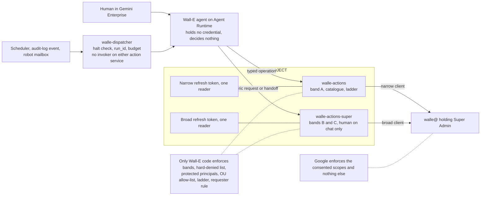
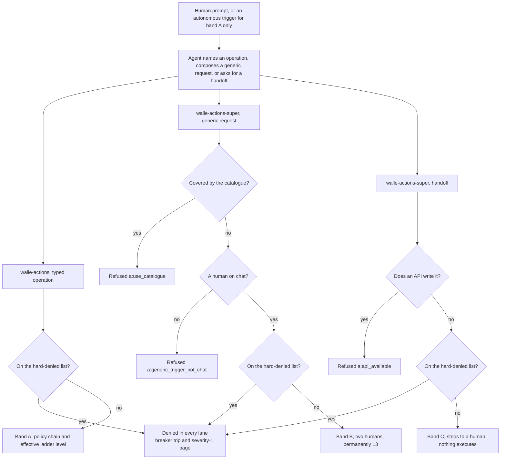
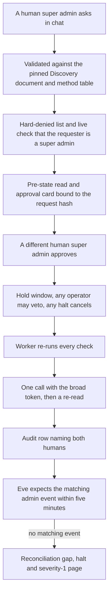

# 15. Wall-E, the doer

## Status
- Owner: the platform owner
- Last reviewed: 2026-09-14

## What you will understand by the end

Wall-E acts in the Workspace tenant when a human asks, and later on its own; it is the only tenant of Tier P-SA, the super-admin singleton. This chapter answers the Chapter 3 risk theme of tenant compromise through the robot credential from the side of Wall-E's own code (Chapter 8 answers it from identity, Chapter 11 from detection), and carries part of three more: autonomy outrunning evidence, classification collapse and staffing that makes two-person rules notional.

By the end you will know:

- why the doer holds Super Admin, on what kind of account, and what remains unsigned;
- how a prompt becomes an action only through code that holds the credential;
- how "any super-admin action" becomes three lanes that code chooses;
- what replaced the Workspace role as a gate, and how strong each replacement is;
- how autonomy is enabled cell by cell, how Wall-E is stopped, and what can still go wrong.

Nothing here is built. The design of record is the [Wall-E set](../../wall-e/01-hld.md).

## Why the doer holds Super Admin

The objective of 2026-09-13 gives Wall-E "a dedicated user account, with a google license and super admin roles" and any super-admin-level action on a human's prompt. The earlier design was built for the opposite: a narrow custom role that grew with the ladder. The owner decided the question that day as P33 ([decision record](../../../decisions/2026-09-13-wall-e-holds-super-admin.md)), choosing among three options.

**Keep the narrow role.** Its virtue was two enforcement points, the action service and Google both refusing outside the role or the pilot unit, but it cannot deliver "any super-admin action", and the owner overruled it. **Super Admin on a keyless service account** would leave nothing to steal, but Google forbids it: a service account can hold any Workspace admin role except Super Admin. **Super Admin on a dedicated, licensed user account, contained by the platform** was chosen as the only option both possible and faithful to the objective. It keeps the typed catalogue as the declared intended purpose and moves every control that read "not in the role" into code that CI owns outside the agent repository. Its costs are the ones Chapter 3 lists: one enforcement point left on the Workspace side, a leaked token or interactive login as a tenant compromise with a path into the GCP organisation, least privilege as a signed deviation, and detection as the primary control. A second Google fact then shaped everything: Super Admin cannot be limited to an organisational unit or a subset of privileges.

P33 is decided and not re-argued. Not settled: the TISAX deviation (P136, proposed) is unsigned by the security reviewer and not yet entered by the ISMS as risk row R-01 (P140); the two lists are unsigned (P29, open); the intended-purpose statement awaits legal (P28 via P125). The grant is blocked until every row of the [gate checklist](../11-tisax.md#63-compensations-as-preconditions--the-checklist-the-gate-reads) is green ([register §4](../12-open-decisions.md#4-before-the-super-admin-grant)); on 2026-09-13 none is. The deviation record and its red-row rule are Chapter 21's; the argument for the compensations is below.

## Where Wall-E sits and what it is meant to be

Wall-E lives in `WALLE_PROJECT` under `fld-agents-p-sa-prod`, in `europe-west1`, and the register's CI refuses a second super-admin row while one is not retired ([placement](../../wall-e/01-hld.md#where-wall-e-sits-on-the-platform)). The division of labour follows one rule. The platform enforces what an agent must not be trusted to enforce on itself: identity, gateway binding, the deny policy, admission, the fleet stop, deploy grants and the super-admin detection set. Wall-E's code carries what only Wall-E can know: its catalogue, policy chain, ladder, playbooks and prompt, and verification by re-read.

Six intentions define it ([design intent](../../wall-e/01-hld.md#design-intent)). One identity, the dedicated licensed user `walle@` (name *tbd*), holds Super Admin, and no human signs into it after bootstrap. Nothing happens except through the action services, the only place a Workspace credential exists and authorisation is decided. The reasoning layer holds no credential and never decides. Autonomy is data, raised by pull request and lowered by an API call in seconds, except the band B rows, which are code. There is no domain-wide delegation (Chapter 8), and because a super admin could grant it in the console, granting it is hard-denied. And super-admin-class work never climbs above human approval.

## Principals, credentials and the account

### Who acts

The robot account holds two refresh tokens, and Google bounds each only by the scopes its client was consented ([principals](../../wall-e/02-identity-and-auth.md#principals-and-what-each-may-do)). The identity design gives every secret exactly one reader: the catalogue service reads the narrow token, the generic service the broad one, and nothing else reads either. The agent's own identity reads no secret, the dispatcher can invoke the agent but neither action service, and no human holds invoker on an action service; an operator who must pull a brake does so through a dedicated caller identity that exists for nothing else.

The largest single control is the deploy grant. A new revision inherits the service account and the pinned secret, so whoever can deploy can do anything a super-admin credential can, bypassing every check in the code at once. Deploys therefore come only from CI, no human holds deploy rights in steady state, and break-glass is a one-hour Privileged Access Manager entitlement approved by a second reviewer who is not the agent's owner.

The Workspace privilege facts that shaped the old role, such as indivisible licence management and privilege groups that cannot be unit-scoped, are moot for a super admin but still define Eve's read-only role and explain why group classification is a control of its own ([privilege facts](../../wall-e/02-identity-and-auth.md#workspace-privilege-facts)).

### Two services, two clients

The consented scope set is the only ceiling Google still enforces, so the design uses it twice ([client configuration](../../wall-e/02-identity-and-auth.md#oauth-client-configuration)). The **narrow client**, read only by `walle-actions`, serves the catalogue and everything unattended; its scopes are the only Google-enforced ceiling on anything Wall-E does without a human. The **broad client**, read only by `walle-actions-super`, serves bands B and C, which accept only a human on chat, so no autonomous run ever holds it. One process reading both would make the narrow ceiling decorative, which is why Wall-E decision 18, the control-plane split, lands now. Both clients are internal and trusted, with any trust change hard-denied, and `cloud-platform` is consented in neither, because with Super Admin behind it that token would open the GCP organisation.

**The scopes** ([scopes](../../wall-e/02-identity-and-auth.md#scopes)). The narrow list, still the proposal for Wall-E decision 3, keeps only scopes a catalogue operation uses; the broad list, *tbd* until that decision is signed, is what band B's method table needs, with no messaging, Vault or Drive. One entry must be said plainly: the user-administration scope carries `users.makeAdmin`, so even the narrow token can mint super admins, and only the hard-denied list, multi-party approval and a SIEM rule stop it. Scopes freeze at consent, so widening either needs a new witnessed sitting.

### The consent sitting and a token that dies

User credentials need the user's consent, so one interactive sign-in is unavoidable ([getting a credential](../../wall-e/02-identity-and-auth.md#how-the-robot-account-gets-a-credential)). A human super admin takes a hardware key from the safe under a custody record, signs in as the robot in a clean profile, consents both clients, stores each token in its own secret and arms the login alert before leaving. The custody record is what makes that sign-in expected rather than a severity-1 page.

Each way a token can die becomes a rule, from one token per client to a monthly refresh of the rarely used broad lane and a re-bootstrap with every password rotation; whether a password reset also kills the broad token is unverified until the sandbox test ([token failure](../../wall-e/02-identity-and-auth.md#what-makes-the-refresh-token-stop-working)). `invalid_grant` is never retried: the lane is dead until a human re-runs the sitting, because a retry loop would hide an incident behind an outage.

### The account hygiene set

Every item is a precondition of the grant ([hygiene set](../../wall-e/02-identity-and-auth.md#the-account-hygiene-set)); Chapter 8 states the rules both robot accounts share. The role cannot be unit-scoped but settings can, so the robot gets its own organisational unit (`Assumption:` creatable) with the strictest settings Google offers: security-key-only 2-step verification with keys held by different custodians, a vaulted password whose custodian holds no key, and no recovery phone or email, because an unwatched channel is a takeover channel. Multi-party approval covers every setting it can, with the robot never an approver (P66, proposed). Whether an Admin console access level no device satisfies binds a super admin is unanswered (P7, open), so it counts as detection plus friction, never prevention. Three alerts close the set: any interactive login, the one control that survives Super Admin unchanged; any action by the robot on another admin, which is hard-denied and so means the credential acted outside the service; and role-assignment drift in either direction.

## From prompt to action

**Why a dispatcher.** An on-request agent needs none; Wall-E's exists for three reasons ([dispatcher](../../wall-e/01-hld.md#why-a-dispatcher-in-front-of-the-agent)). A halt must bite before the model spends tokens producing a plan. Run identity, budget and configuration version must exist before the agent speaks, not be invented by it. And a trigger must be acknowledged in about a second while an agent turn takes minutes; a synchronous call would exceed the trigger's deadline, be retried and run twice. The dispatcher serves band A only.

**Why the action service stays separate.** Under Super Admin the service is the only gate in front of the credential ([separation](../../wall-e/01-hld.md#why-the-action-service-stays-separate-from-the-agent)). In the model's process the token would be one read away from exfiltration. Tool arguments are generated text that can name `users.makeAdmin`, and Google would execute it, so the hard-denied list must live in the gate, not the prompt. And Eve's reconciliation relies on a write-ahead audit row before every call, which a tool calling Google directly would skip. The price is one hop of roughly 50–150 ms, twice for band B.

**The caller allowlist and the engine lock.** Cloud Run grants invoke rights per service, not per path, so IAM alone would let the agent, Eve and Mo reach every endpoint, approve and demote included ([inventory](../../wall-e/03-lld.md#gcp-resource-inventory)). A per-endpoint allowlist generated from the manifest does that platform work in application code, each row with a negative test: the agent may plan and execute but never approve, operators and Eve may halt and demote, and Mo may use two read endpoints. Operators are checked against a committed list, so a halt still works when the Workspace credential is what failed. Because the user's email reaches the agent asserted rather than proven, the right to query the agent engine is locked to two principals, the Gemini Enterprise service agent and the dispatcher ([engine lock](../../wall-e/12-agent-identity.md#7-locking-aiplatformreasoningenginesquery)); whether that grant holds across projects is Wall-E decision 42's spike.

**What the approval surface asserts.** Every L3 statement rests on the approval carrying a per-human assertion the service verifies itself ([assertions](../../wall-e/12-agent-identity.md#53-what-the-approval-surface-asserts-in-each-case)). The chosen surface is an IAP-fronted page that forwards the identity token verbatim for the service to verify against the committed operator list. A text reply in Chat is refused, because a parsed message authenticates nobody, and without an acceptable surface no family goes above L2. Operators from an external identity provider wait for a captured sign-in, because their token format is undocumented.

## Three bands decided by code

"Any super-admin action on a human's prompt" is delivered by three lanes, not a wider catalogue, and the lane is decided by code from the operation requested, never by the model ([the three bands](../../wall-e/03-lld.md#the-three-bands)).

**Band A** is the typed catalogue on the ladder, served by `walle-actions` on the narrow client: the declared intended purpose and the only band that can climb, because only a typed operation carries the pre-state, inverse, taint declaration and re-read verification that autonomy needs. **Band B** is uncatalogued super-admin work, a generic Admin SDK request on `walle-actions-super`: permanently L3, chat only, two humans at tier `SUPER`. **Band C** is console-only work, defined by fact rather than choice: the Cloud Identity Policy API writes almost nothing and delegation is console-only, so settings such as 2-step verification enforcement, session policy, API controls, data regions and billing can be read but not written ([band C](../../wall-e/03-lld.md#band-c--the-handoff-lane)). Nothing executes there: the service returns steps to the requesting human super admin, watches the Reports API for the matching event and closes the row as seen or not seen. The robot's session never touches the console, because automating it would make "an interactive login is an incident" routine.

Two routing rules stop the lanes being used to escape each other: a band B request the catalogue covers is refused `a:use_catalogue`, and a handoff for something an API writes is refused `a:api_available`. CI fails any playbook naming a band B row.

### Band B end to end

A generic proxy loses the inverse, pre-state predicate and taint declaration; band B can do without them only because it never runs above L3, unattended or on one person's word ([band B](../../wall-e/03-lld.md#band-b--the-generic-lane-discovery-pinned); [request path](../../wall-e/01-hld.md#the-request-path-end-to-end)).

The request is validated only against Discovery documents committed to the repository, never fetched at runtime, and against a committed method table, so a method Google adds is unreachable until someone reviews it. The table tiers each method `READ`, `WRITE` or `SUPER`, with anything touching roles, security, domains, billing or API controls at `SUPER`, and its code owner is the security reviewer.

At tier `WRITE` one live-checked operator requests and one approver releases. At tier `SUPER` a live, fail-closed check confirms the requester is a human super admin, and a **different** human super admin, checked the same way, approves with a ticket reference, the approval bound to the hash of the request. The robot as either party is refused as escalation. This rule is what stops membership of the operators' group becoming a super admin's reach by proxy.

Band B writes have no inverse and are recorded irreversible. A hold window follows in which any operator may veto and any halt cancels. At release the worker re-runs every check, executes once with the broad token, re-reads the resource and writes an audit row naming both humans. Eve then expects the matching admin event within five minutes, and its absence halts the lane. The lane's rate limit and budget are *tbd*.

## The two lists and what stays out of the catalogue

Wall-E decision 4, the must-never list, is re-ratified as two lists the owner must sign before the grant (P29, open). They bound every other control, and Chapter 20's Art. 6(3) position rests on them.

**The hard-denied list** is refused in every lane, handoff included, before the ladder is consulted, whoever asks and however many approve; a hit trips the lane's breaker and pages at severity 1 ([hard-denied list](../../wall-e/03-lld.md#the-hard-denied-list)). Its five closed reasons name the harms it exists to prevent: the robot modifying itself, its controller, the control groups or its own OAuth clients; escalation, from `users.makeAdmin` to any Super Admin or role-management assignment and the robot approving anything; posture changes, from other admins' security settings and self-recovery to delegation, multi-party approval, audit-log sharing, sinks and the rules watching the robot; irreversible loss, meaning deletion of an admin or the tenant; and spend outside the second list. Targets resolve by immutable id, so aliases and nested groups do not evade it. Two entries wait on the P29 signature: `walle-owners@`, protected by the manifest though the platform HLD does not name it, and `walle-super-approvers@`, awaiting the owner's confirmation.

**The tier-`SUPER` two-person list** is the rest of what the old must-never list excluded, now reachable only through band B at `SUPER` ([two-person list](../../wall-e/03-lld.md#the-tier-super-two-person-list)): organisational-unit structure, deletion of non-admin users and of groups outside the security class, admin roles below Super Admin, domain adds, data transfer, and licence purchases where an API exists (`Assumption:` none does).

**Never in the catalogue** no longer means never executed ([never in the catalogue](../../wall-e/06-security-guardrails.md#never-in-the-catalogue)). Each excluded category now splits by harm: what escalates, touches other admins' credentials, modifies the robot or destroys an admin is hard-denied; lesser privilege, structure, non-admin deletion and API-purchasable spend go to band B; console-only settings and billing go to band C. No lane reaches GCP IAM or other people's Drive, and for the robot credential that rests only on the list, the scopes and detection, since a super admin can grant itself Organization Administrator.

**Protected principals** ([protected principals](../../wall-e/03-lld.md#protected-principals)) are super admins, delegated admins, the robot, its unit and any group granting an admin role or controlling the three agents. An admin target is denied in band A, reaches band B only at `SUPER`, and comes back as steps in band C. Two mechanisms make silent failure loud. The **floor assertion** requires the computed protected set to contain a committed floor of the human super admins, the robot, Eve's account and the control groups, or every directory write is denied. **Group classification** is computed from transitive ancestors and admin roles, never declared, because a small list nested inside the operators' group looks harmless in the console; unclassified counts as security and is never writable.

## What replaces the Workspace role

The role was the second gate, and each control it provided now has a named replacement with an honest grade ([what Super Admin removes](../../wall-e/02-identity-and-auth.md#admin-rights-super-admin-and-what-that-removes); [replacements](../../wall-e/01-hld.md#the-controls-that-replace-role-scoping)). What Google once refused outside the role or unit, code now refuses: the bands, the two lists, a unit allow-list and the protected-self rule. Operator reach becomes requester and approver entitlement, partly organisational. Google still enforces two subsets only, the narrow scopes on everything unattended and multi-party approval on role assignment and delegation. Detection, which once confirmed a refusal, now does the work itself, with absence alarms so that silence is not calm. And a leaked token, once bounded by the role, is bounded by custody, the scope split and detection latency alone; the residual is a tenant compromise (Eve's detection in Chapter 16, the SIEM set in Chapter 11).

## The thirteen compensations as an argument

The platform makes thirteen compensations preconditions of the grant, not S1 items ([platform HLD §13.1](../01-hld.md#131-wall-e--the-super-admin-singleton-in-tier-p-sa)), because the exposure starts with the grant, not the first write: from that minute a leaked token is a tenant compromise whatever the ladder says. They form four layers, each covering what the one before cannot.

**Narrow what can execute**, in code: the three bands (1), the two lists (2), the permanent ceiling that no super-admin-class operation is ever autonomous (9), and the role-scoping replacements as hard invariants proven by the denial suite (10). Strong against the model, weak against whoever deploys or compromises the service.

**Narrow what a token can do**, at Google: two credentials in two services with `cloud-platform` in neither (3); account hygiene with multi-party approval (6); and the perimeter (8), meaning ingress closed once spike P3 passes and P90 applies, Access Approval on the project, and a second reviewer on the deploy grant. This closes the deploy hole, not a leaked token.

**See and stop**: detection as the primary control, with absence alarms so silence is not calm (5), and kill switches, K6 above all (7).

**People and paper**: the band B requester rule (4), a second human outside the Wall-E administration line (11), the signed record (12) and the EU AI Act position (13), which make the residual an owned risk. On 2026-09-13 every row is not built, not signed or not named.

## Five trust boundaries

Each boundary can still fail, and the design says how ([five boundaries](../../wall-e/01-hld.md#the-five-trust-boundaries)). Between human and Gemini Enterprise the email is asserted, hence the engine lock. Between agent and action service IAM is per service, hence the allowlist. Between model and credential, tokens live only in the two services, and anything in the model's process is defence in depth, never the boundary. Between permitted and autonomously executed, the ladder, holds and breakers apply, but the taint bit fails silently on an undeclared field. Boundary 4, between the action requested and the action executed, is the one Super Admin damaged: it is now the policy engine alone, and what it lost is replaced not by another boundary but by detection.

## A control plane that fails closed

An outage must not disable a control ([fails closed](../../wall-e/03-lld.md#the-control-plane-fails-closed-including-the-parts-that-used-to-fail-open)). Any control-store error denies; a missing override reads as L0, not L5, so an outage cannot lift a demotion; halt and override reads are never cached; and after 30 seconds without the store the process halts its own writes. The audit is write-ahead and insert-only for both service accounts, so if the sink is down, writes stop. A band B request is stored whole, secrets hashed, as the record of what two humans approved.

Denial reasons are a closed vocabulary that metrics, breakers and CI key on ([denial reasons](../../wall-e/03-lld.md#denial-reasons)). A protected-principal denial on a human's chat request is an ordinary refusal; a hard-denied one trips a breaker and pages, because under Super Admin the prompting human is the escalation path. Aligning the platform's hard-denied code with the five reasons in the audit schema is *tbd*.

## Autonomy, step by step

Chapter 9 owns the fleet rules of the ladder; this is Wall-E's instance. The values, family by family and stage by stage, are on [the ladder page](../../wall-e/05-autonomy-ladder.md#stage-overview); what follows is the reasoning behind them.

**Why reversibility sets the ceilings.** A level attaches to a family and trigger pair, and families are cut by how cheaply a mistake can be undone ([families](../../wall-e/05-autonomy-ladder.md#5-operation-families)). Reads can reach L5; reversible writes such as templated notices, profile edits and suspension can reach L4; writes that grant access or move people between units stop at L3. Restore and rollback stay at L3 permanently, so that a loop cannot suspend and restore unseen, and free-text outbound is never autonomous. Above configuration sit ceilings in code, raisable only by a code change with security sign-off ([ceilings](../../wall-e/05-autonomy-ladder.md#4-ceilings-that-are-code-not-config)): `WRITE_HIGH` never reaches L5, and the inbox never writes.

**Why band B never climbs.** The `SUPER` and generic-write rows are L3 on chat and L0 on every other trigger, fixed as code rows the platform validator refuses to see changed, and never allowed in a playbook. The reason is the one band B was built on: a generic request has no inverse, no typed pre-state predicate and no taint declaration, so no run of good history can show it safe without a human, and super-admin-class work is where one unattended error costs the tenant.

**The taint bit and the effective level.** Injection arrives with what a run reads, not how it started ([taint bit](../../wall-e/03-lld.md#the-taint-bit-and-why-trigger-class-is-not-enough)). Each operation declares its attacker-writable fields, from display names to upstream error strings; once one reaches the model, the run takes the inbox ceiling for life, while a tainted human chat request keeps L3. The level applied is the minimum of the code ceiling, the configured level, the playbook's cap and the demote-only override, logged on every row ([autonomy config](../../wall-e/03-lld.md#the-autonomy-config)).

**Stages.** The grant is a gate before S0, not a stage: Eve's observe-and-report layer is live and drilled first, and until the grant the robot is licensed and hardened and reads nothing ([the grant](../../wall-e/05-autonomy-ladder.md#the-super-admin-grant--a-gate-not-a-stage)). The stages then widen what Wall-E may do one trigger class at a time. S0 reads and runs every write in shadow, and any real execution aborts it, because in S0 an execution means the gate has already failed; so does an objection from the data protection officer or employee representatives. S1 allows chat writes at L3 in the pilot unit. S2 makes a templated notification the first autonomous write. S3 lets one human approve a frozen batch while Eve's gate observes; its exit includes Eve's acceptance test, on whose figures Wall-E's and Eve's pages still differ (Chapter 16). S4 lets Eve's signature replace the per-item human for families that earned it, an unreachable Eve meaning waiting, never executing. S5 is steady state. Exit and abort criteria are on the ladder page; minimum durations and the cross-agent sequence are Chapter 24's.

Still open: the platform's EU AI Act caps on suspension and licences are not yet on Wall-E's ladder page (register row 14, [values that differ](../12-open-decisions.md#7-values-that-differ-between-pages)); the caps are Chapter 20's.

## Stopping Wall-E

Seven switches, K0 to K6, run from surgical to total, because each stops something the one before cannot; who pulls each and what each does not stop is in the [architecture table](../../wall-e/ARCHITECTURE.md#46-kill-switches), and K7 with the crisis order, K4 before K7, is Chapter 8's. The first switches halt writes, demote a cell, stop new runs or cut the agent off, and any operator, Eve or a breaker may pull the lightest, because making less happen should need no ceremony. None of these touches the credential, so the last three act at Google: revoke each service's token, revoke both grants or suspend the robot, and remove Super Admin.

Three choices carry the argument. K4 revokes at Google rather than disabling the secret, because a disabled secret stops only future refreshes; its endpoint is not yet in the LLD's table (*tbd*). A revoked grant still leaves an issued access token alive for up to an hour, which is why K6 matters most: it survives an already-minted token, because the token outlives the privilege it was minted under (`Assumption:` calls are authorised against current privileges, verified in the first drill). And K5 and K6 stay with a human super admin on a two-person rota, never the owner when the owner is the actor, with no machine stop for now (P16, proposed), because an automatic stop on a super admin is a lock-out path a compromised monitor could pull.

A switch nobody has pulled recently is a belief, not a control, so the drill runs before S0 and CI refuses a promotion citing one older than 30 days ([drill](../../wall-e/SETUP.md#5-the-kill-switch-drill)). The switches that leave the credential intact are drilled monthly in production; K4 and K5 consume it, so they run in production only at commissioning and after a real incident, and K5 and K6 quarterly on the sandbox tenant's robot twin. Whether that quarterly drill satisfies the gate's 30-day row is unverified. The denial suite proves the gate refuses what it should ([denial suite](../../wall-e/SETUP.md#4-the-denial-test-suite)): organised by boundary, from foreign callers to `makeAdmin` in every lane and a band B approver who is also the requester, it runs before every promotion, builds its own fixtures, and counts a pass for the wrong reason as a failure.

## What Wall-E does not do

Three kinds of no ([non-goals](../../wall-e/01-hld.md#non-goals)). **Permanently human**: band C steps, approving band B, raising a level, merging Mo's proposals, pulling K5 or K6. **Never autonomous**: super-admin-class work, `WRITE_HIGH` at L5, and anything irreversible in band A. **Not done at all**: the hard-denied list; acting as anyone but the robot; automating the console; bulk or emergency work, since band B is one request, one approval, one execution; administering its own platform, true by construction on GCP and only by list, scopes and detection on Workspace.

## Known structural weaknesses

Fourteen survive, listed in full on the [architecture page](../../wall-e/ARCHITECTURE.md#11-known-structural-weaknesses), and those that describe the service as the gate grow worse under Super Admin. One deploy grant defeats everything, so a compromised pipeline is now a tenant compromise; the gate is one process per service, reachable per service by IAM, trusting an asserted user identity. An injection can still reach the queue as a proposal, and the taint bit is only as good as its field inventory. Recovery is slower than failure. A one-person rota, now a grant condition, is the weakness likeliest to stop the programme, and the credential holder is internet-reachable until P3 passes. Weakness 14 is P33's residual: a leaked token or login is a tenant compromise and a path into the GCP organisation.

## Key decisions and what to read next

States on 2026-09-14:

- **Decided:** P33, Wall-E holds Super Admin on `walle@`, deviation signatures pending.
- **Open:** P29, the two lists; P7, the Admin console access level; P14, the witness organisation.
- **Proposed:** P16, P66, P68, P90, P136, P140, P125 with P28's content (its signature with legal open), and P143, owners and gates for the propagation stage that carries register rows 10–14 into the agent pages.
- **Spike:** P3. **Wall-E decisions:** 3 reopened as two lists, 18 landing now, 42 a spike.

Every row that gates the super-admin grant is in [register §4](../12-open-decisions.md#4-before-the-super-admin-grant); the order in which the grant and Wall-E's stages open is Chapter 24, Roadmap and cost.

Chapter 19, Threat model and residual risk, carries what remains: a leaked token or login is still a tenant compromise, met by custody, scope split, detection latency and K6 rather than prevented; a compromised pipeline is a compromised action service; P7 stays out of every safety case.

Read next: the [Wall-E HLD](../../wall-e/01-hld.md), [identity and authorisation](../../wall-e/02-identity-and-auth.md), [the LLD's bands](../../wall-e/03-lld.md#the-three-bands), [the ladder](../../wall-e/05-autonomy-ladder.md#4-ceilings-that-are-code-not-config), [the P33 record](../../../decisions/2026-09-13-wall-e-holds-super-admin.md) and [the gate checklist](../11-tisax.md#63-compensations-as-preconditions--the-checklist-the-gate-reads).
