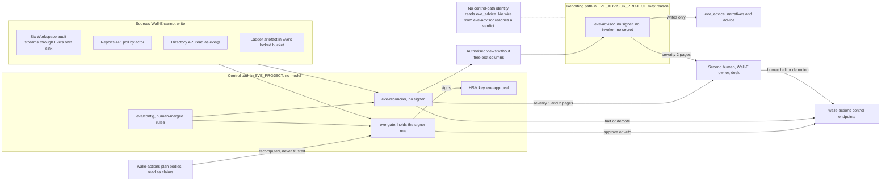
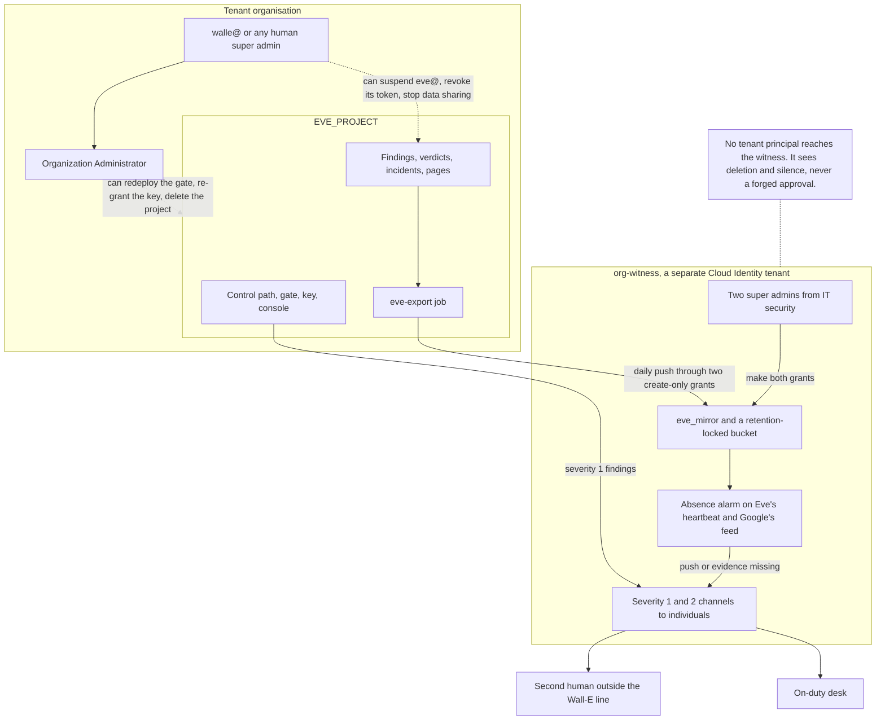
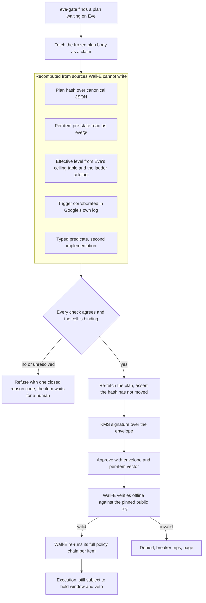

# 16. Eve, the independent controller

## Status
- Owner: the platform owner
- Last reviewed: 2026-09-18
- 2026-09-18: added "Eve's first job: the human super admins (2026-09-15)", carrying HLD §13.2's scope from the first run and the order of setup 23 to 28.

## What you will understand by the end

This chapter alone answers the Chapter 3 risk theme of a controller reachable by what it controls. It carries part of two more: manufactured silence, answered for the platform in Chapter 11 and for the robot here, and staffing that makes two-person rules notional, answered with roles in Chapter 23 and here with the work one of those roles does.

By the end you will know:

- how a program with read-only Workspace access and one signing key checks a super-admin robot;
- which part of Eve's independence is structural, which is only detective, and what the witness organisation adds;
- why no model sits on the path that approves, halts, demotes or vetoes, while a separate reporting path may reason;
- when halting and signing each arrive;
- what Eve cannot see, stated in every attestation.

Nothing here is built. The design of record starts at [Eve's HLD](../../eve/01-hld.md#thesis).

## The thesis

Eve is a body of SQL, two deterministic Cloud Run jobs, a console and a key, in its own GCP project. Its only privileged act is a Cloud KMS signature over a hash it computed itself. Everything else Eve does is reading, comparing, recording, halting, demoting, vetoing and reporting.

One premise shapes every mechanism. Everything `walle-actions`, Wall-E's action service, says is a **claim**. Eve recomputes what matters from sources Wall-E cannot write: Google's own audit streams, the Directory API read with Eve's own credential, a ladder artefact in Eve's locked bucket and Eve's own ceiling table. A lie has to be consistent across all of them to survive to a signature.

A controller whose approval can be talked into existence is not a control, and one that is a service can be down unnoticed. So Eve is small, deterministic and a client everywhere. The price is that it finds only what a rule names, which is why a reporting path exists.

## What Eve is not

These negatives do more work than the positives ([Eve HLD, what Eve is not](../../eve/01-hld.md#what-eve-is-not)). Eve is **not an agent**: it has no agent card, A2A surface or HTTP endpoint, and talks to Wall-E over plain authenticated REST in one direction (Chapter 18, How the three work together). It is **not a component of Wall-E**: its key, secrets, datasets, identities and configuration sit outside Wall-E's project. It is **not a model on its authority path**. It is **not sufficient**, because Wall-E verifies Eve's signature and then re-runs its own full policy chain on every item. It is **not its own grader**: humans grade Eve's verdicts, never Eve and never Mo, or the controller would both decide and grade. And it is **not a Workspace writer or a super admin**, at any stage.

## Two paths

### The control path has no inbound surface

The control path is `eve-gate`, `eve-reconciler` and `eve-console` in `EVE_PROJECT`, plus the key. Nothing calls it. Eve polls for work, reads Google directly, and calls Wall-E's REST endpoints to approve, veto, halt and demote ([choice 2](../../eve/01-hld.md#2-no-inbound-surface)). Nothing can be sent to Eve, and "Eve is down" can show only as an **absence**, the only alert that also catches a wedged process. A heartbeat endpoint was rejected because it could keep autonomy alive while Eve did nothing, and a subscription to Wall-E's event topic because it would be a channel Wall-E controls. Eve runs as scheduled jobs, which have no ingress and cost almost nothing while there is nothing to gate.

### Deterministic by absence

"Eve contains no model" is worth nothing as a sentence and something as a build that fails when the sentence stops being true. Seven enforcements guard the control path ([the deterministic boundary](../../eve/01-hld.md#the-deterministic-boundary)), and two of them bind: no model dependency in the image, checked by a lockfile scan, and no model permission on either runtime identity. A process that cannot reach a model, under an identity that cannot authenticate to one, cannot get a model to produce a signature. The other five guard against regression, from a project-level denylist on the model API to offline replay of archived verdicts that must match bit for bit. The invariant has a compliance reading: a model-free control path is recorded as outside the AI Act's definition of an AI system and as a human-oversight measure, and a model on that path voids the determination (Chapter 20, EU AI Act).

### The reporting path may reason

"Report anything wrong" cannot be written as a closed vocabulary; enumeration stops at the deterministic catalogue. So `eve-advisor`, a Cloud Run job in its own project `EVE_ADVISOR_PROJECT`, may use a model. It narrates what the control path found and names what no rule covers ([the reporting path](../../eve/01-hld.md#3-deterministic-by-absence-not-by-discipline)). It is report-only by IAM rather than discipline: it reads through authorised views without free-text columns, writes only narratives and advice into one dataset, and holds no signer, no invoker on any action service, no secret and no write to Eve's configuration. Nothing it writes is read by the gate, the reconciler or either Wall-E action service; no wire lets it even turn an accept into a refusal, because that would put model output on the authority path. It pages at severity 2 only, inside the page budget, citing the deterministic finding behind each page, and a human who agrees acts through the existing human path.

Until legal settles its AI Act class (P19, open), it makes no finding about a named human unless a deterministic rule triggered it. Every model-pin change resets its paging thresholds and re-runs the seeded-fault set before it may page again (P123, proposed).

The path is P34, proposed, reopening "no model anywhere in Eve" for reporting only ([decision record](../../../decisions/2026-09-13-eve-reporting-path-may-reason.md), [register §5](../12-open-decisions.md#5-before-wall-es-stage-1-and-its-later-stages)). It awaits the Eve owner, a role the platform owner holds until the second human is named, and the security reviewer; until then Eve reports only what its rules name.

## Eve's own project and its three carve-outs

Why every agent has its own project is Chapter 7's (Landing zone and the tier model). Eve's particular reason: in Wall-E's project a project owner could grant themselves the signer role and mint an approval that only a daily drift row would notice. In `EVE_PROJECT` Wall-E's service identities and deployers have no principal, nor any role on the parent folder ([why Eve gets its own project](../../eve/02-identity-and-auth.md#why-eve-gets-its-own-gcp-project)).

Exactly three Wall-E grants exist there, all at resource level (topology decision 48, [topology §8](../../project-topology.md#8-open-decisions-this-topology-adds)): Wall-E's deployer may create, never overwrite, ladder artefacts; the action service may read the signing key's public half; and from S4 entry it may read an existence-only view of verdict receipts, in a dataset not yet named. Eve's daily drift job fails on a fourth. The boundary is only as real as the organisation chart: with one administrator it is notional, and the design says so.

## Independence in two parts

A Workspace super admin can grant itself Organization Administrator on the tenant's GCP organisation (`Assumption:` the standing recovery right behind this, verified or refuted before the grant), and Wall-E's credential can suspend `eve@`, revoke Eve's token, switch off data sharing with Google Cloud and re-filter sinks. `EVE_PROJECT` sits inside that organisation. Eve's independence therefore has two parts ([choice 1](../../eve/01-hld.md#1-eves-independence-detective-inside-the-organisation-structural-through-the-witness)). Against Wall-E's project owners, deployers and service identities it is **enforcement**: the project boundary. Against the super-admin credential and any human super admin it is **detection only**: once Organization Administrator is reached, the gate can be redeployed, the key re-granted or the project deleted, and the SIEM's super-admin rules (Chapter 11), Eve's tenant-integrity rules and the absence alarms see it while nothing prevents it.

Every attestation carries the same sentence: Eve's control path stays inside the tenant's organisation, and its independence there is detective, not structural.

### The witness organisation

The structural part is what leaves the organisation. `org-witness` is a second organisation on a separate, minimal Cloud Identity tenant, holding one project, with two super admins from IT security, outside the Wall-E administration line. Its edition and funding are open (P14, owned by IT security, blocking the grant; [register §4](../12-open-decisions.md#4-before-the-super-admin-grant)); `Assumption:` Cloud Identity Free on a distinct domain.

Evidence travels by push, because a pull would need a witness principal inside the tenant. Once a day `eve-export@`, an identity that neither reconciles nor signs, pushes the previous day's evidence and a heartbeat row through exactly two create-only grants the witness administrators made, on one dataset and one retention-locked bucket; a compromised exporter can add rows but not rewrite them. The witness also holds the severity 1 and 2 channels, the kill-switch rota records and the absence alarm. The export's contents are in Chapter 12.

The witness sees `EVE_PROJECT` deleted within fifteen minutes, and it sees silence. It never sees a forged approval: a super admin who redeploys the gate and signs produces rows that look like Eve's own. It is deliberately small, one more tenant, two more hardware keys and a second supplier line, so that cost is never a reason to defer it.

### The end state, dated now

Only one mechanism stops a super admin who reaches Organization Administrator from forging an approval or undoing a kill: moving Eve's gate, key and console into the witness. P15, proposed, records this as the end state, built when IT security operates the witness and gated at Tier X, not at the grant ([register §6](../12-open-decisions.md#6-later)). Its costs are stated: security services and policy sets in both organisations, cross-boundary exceptions and invoker grants, and a spike on whether perimeter rules can name identities in another organisation. No standing cross-organisation policy administration comes with it, and the fleet kill plane stays where Chapter 8 puts it.

### The second human in Eve's design

The witness and the reporting rules need someone who is not the administrator Eve reports on ([platform HLD §13.2](../01-hld.md#132-eve--independent-controller-two-paths-a-witness-outside-the-tenant-a-second-human)). That person owns `eve-owners@`, administers the witness, reviews every change to Eve's configuration, receives every severity 1 and 2 page in parallel with the desk, and alone receives reports about the administrator. Eve's build does not wait for this person, but the grant does: E-2 was reopened as blocking. The role and today's one-administrator starting point are in Chapter 23, Operating model.

## Two authorities on opposite schedules

Eve's two authorities point in opposite directions, so they arrive at different times ([choice 4](../../eve/01-hld.md#4-two-authorities-on-opposite-schedules)).

**Halting and demoting** can only make less happen, so Eve gets them at S3 entry, or earlier for three triggers when the grant comes first; rate-based triggers only observe until their thresholds are calibrated on measured data. **Signing** can make more happen, so the key arrives only at S4 entry, after twelve seeded faults are caught at 100 %. A buggy Eve can halt the programme during the stage it is trying to prove itself in, which is accepted because one human can undo a halt in seconds.

"Halt when uncertain" would turn a degraded Eve into the outage. So at the approval point every unresolved comparison resolves to **refuse**, which costs an operator an approval; halting is reserved for a closed list of invariant triggers.

One field per ladder cell, `eve_authority`, switches signing on: `advisory` or `binding`, with an absent value read as advisory. It is at once the observe-or-enforce switch, the fail-closed default and the demotion target when an Eve approval is overturned; two flags were rejected because fields that must agree drift apart. Setting a cell to binding needs two approving reviewers, neither the author, and Wall-E refuses a signature for an advisory cell.

## The pre-approval pass

### The five recomputations

Every two minutes `eve-gate` fetches each frozen plan waiting on it and recomputes five things rather than trusting them ([the five recomputations](../../eve/03-lld.md#3-the-five-recomputations)). It takes the plan hash itself, so the service's hash is compared, never signed. It re-reads each item's pre-state with its own token. It derives the effective level from its own ceiling table and a ladder artefact Wall-E's deployers cannot rewrite, which catches a lying policy chain as well as a lying plan. It corroborates the trigger in Google's own log, so it never co-signs a laundered suspension. And it evaluates the typed predicate through a second implementation. Eve's HLD counts trigger corroboration among the five while the LLD counts the ceiling-hash comparison instead; the checks and reason codes are the same either way ([Eve HLD](../../eve/01-hld.md#thesis), [Eve LLD §3](../../eve/03-lld.md#3-the-five-recomputations)). Just before signing, Eve asserts that the plan's hash has not moved.

### The approval envelope

The envelope is the only privileged artefact Eve produces ([§5](../../eve/03-lld.md#5-the-approval-envelope)). It binds the plan, Eve's hash of it, a hash of the per-item accept-or-reject vector, configuration versions, an expiry, a single-use nonce and the key version. The vector hash makes batch approval safe: without it, one item's accept could be flipped outside the signature. And because a two-hour-old pre-state read proves nothing, a long hold window splits approval in two: an envelope at freeze opens the hold, and a short-lived release envelope, checked against fresh pre-state, authorises execution. A plan whose hold elapsed during an Eve outage has expired; it is not resumed.

### The signing key and the PEM archive

The signature is asymmetric, so the verifier holds nothing that can sign. The key is HSM-protected, only the gate's identity holds the signer role, and every signature is logged ([the signing key](../../eve/02-identity-and-auth.md#the-signing-key)). Before a key version is first used, its public key is archived in Eve's locked evidence bucket and in Wall-E's repository under the ladder's code owners, and Wall-E verifies offline against the pinned copy ([the PEM archive](../../eve/02-identity-and-auth.md#the-pem-archive-in-two-places-before-first-use)). No grant in Wall-E's project can then substitute a key, and a KMS outage stops signing but not verification. The stored signature and its archived public key are the only proof that Wall-E did not mint the approval itself, so manual rotation disables old versions and never destroys them inside the 400-day evidence horizon.

### The line not to cut

Eve's second implementation of the typed predicate, differentially tested against Wall-E's, is at six engineer-days the largest single build item and the one not to cut ([choice 5](../../eve/01-hld.md#5-the-second-predicate-implementation)): without it, the verification metric that unlocks autonomy would measure itself. Tier W agents accept a weaker verifier compiled from their manifest (P79, Chapter 9); Eve does not.

## Verdicts after the fact

Eve verifies reversible autonomous writes after they execute, and each verdict takes one of seven closed states, from verified to drift, reconciliation gap and unverifiable ([§10](../../eve/03-lld.md#10-verdict-states)). Behind the states is a split of evidence ([the primary-evidence split](../../eve/04-flows.md#the-primary-evidence-split)). **Current state**, read immediately, proves the write happened, and the 60-minute target is measured on this read. **The admin event** proves the robot rather than a human made the change, and arrives on the audit log's slower clock. State confirmed with no event yet is a wait, and becomes a reconciliation gap only if nothing arrives within six hours. Calendar writes no audit stream at all, and Eve cannot read licence state; both are declared limits.

## Watching a super admin

### The evidence perimeter

A super-admin Wall-E can act outside any plan, so Eve watches every event attributed to the robot through two routes that fail differently ([§13](../../eve/03-lld.md#13-the-evidence-perimeter-for-a-super-admin-wall-e)). Its own organisation-level sink carries all six Workspace streams with no actor excluded, though some streams depend on the tenant's edition, which is *tbd*. A Reports API poll by actor covers the robot, Eve's own account and every rostered super admin, and keeps working if a super admin switches data sharing off. A third route, a Workspace BigQuery export into the witness, is open (P17). A declared "records nothing" list names acts that leave no event Eve can read, such as Admin console views of user data (`Assumption:` per capability, verified before the grant). Any robot event in any stream without a matching audit row is a reconciliation gap, and it halts.

### What "misbehaviour" means in practice

Three things run in the reconciler, never in the gate ([§14](../../eve/03-lld.md#14-the-detection-catalogue-the-roster-check-and-the-evidence-heartbeat)).

The detection catalogue is merged by humans and has five classes. Tenant-integrity rules mirror the SIEM's super-admin set, so two independent evaluators can be compared. Other classes catch uncatalogued writes, posture changes and interactive robot logins, and deviations from baselines calibrated at S2. The fifth, prompt-to-action divergence, compares what executed with the signed human request, so Eve reports on human prompts as well as robot actions. A daily roster check pages on any addition to or removal from the admin roster. And an evidence heartbeat treats silence as a halt: if the sink goes quiet for an hour in business hours, or Eve's token is revoked, autonomous work stops until a human clears it (the platform's heartbeats are in Chapter 11).

"Any misbehaviour" ends where enumeration ends: what no rule names and no human reads is not caught (Chapter 2 declines the literal reading of the objective). The platform identity page adds six severity-1 rows that Eve's pages do not yet carry, among them break-glass sign-in and a fourth super admin ([register §7, row 11](../12-open-decisions.md#7-values-that-differ-between-pages)).

## Reporting

The reporting contract maps severity to channel and people ([§15](../../eve/03-lld.md#15-the-reporting-contract)). Severity 1, from tenant integrity to missing evidence, goes through the witness channels to the second human and the desk in parallel, with the halt already applied and the Wall-E owner copied unless the owner is the actor. Severity 2, including the reporting path's findings, goes to the Wall-E owner and the second human; severity 3 stays on the console. Acknowledgement targets are `Assumption:` values, and an unacknowledged page escalates to a rota secondary outside the Wall-E line, then to the incident commander.

Reports about the administrator, such as level raises, halt clears, threshold edits and promotions of `eve_authority`, go only to the second human, out of band, so that a report never reaches only the person it is about.

Noise is a defect. Pages run inside a budget sized at S2 calibration, from which the evidence halt, tenant integrity, reconciliation gaps and roster changes are exempt; a reason code that pages too often opens a "threshold suspect" ticket; and a refusal is never a page ([the page budget](../../eve/06-failure-modes.md#the-page-budget-and-the-paging-conditions)).

For the works council: Eve reads activity metadata, never content, and its prompt-to-action rule concerns what an administrator asked the robot to do. What may follow for operators is in Chapter 22, Personal data, employees and the works council.

## When Eve is absent: Wall-E's sweepers

Eve cannot be relied on to notice its own absence, so `walle-actions` does ([Wall-E's side](../../eve/08-contract-changes.md#3-wall-es-side-of-this-design)). A plan waiting on Eve for four business hours stops autonomous work. An autonomous write with no verdict receipt freezes promotions after an hour and drops its cell to L4 after four; the receipt view shows only that evidence arrived, never what it says. A last-seen stamp on any Eve call feeds an absence alert. Nothing raises when Eve returns: only an operator restarts autonomous work.

## Eve's Workspace robot

`eve@` exists so that Eve never verifies Wall-E's work through Wall-E's credential ([Eve's Workspace robot](../../eve/02-identity-and-auth.md#eves-workspace-robot)). It holds a custom role with read privileges only, which never grows with the ladder, and it is never Super Admin. It follows the robot accounts' shared rules (Chapter 8) and sits among the protected principals. Its Workspace licence is Eve's largest recurring cost.

Scopes freeze at consent, so the set was widened before the one-sitting consent, which now happens before the grant (E-16): ten read-only scopes and no content scope ([the scopes](../../eve/02-identity-and-auth.md#the-scopes-and-the-one-that-was-dropped)). Only super admins can use the Policy API, so Eve sees security settings change but never reads their state. The licensing scope was dropped because the only privilege that reads licence assignments also assigns them, so licence verification is event-only, backed by a heavier blind sample, and the family stays at L3 if that privilege cannot be scoped. E-16 also asks whether a keyless service account could hold this role, which would remove the robot account altogether. A refresh token dies after six months unused, so a monthly exchange resets the clock, and a revoked token is a paging incident only a human re-bootstrap repairs ([the six-month clock](../../eve/02-identity-and-auth.md#the-six-month-clock-and-when-consent-happens)).

## When each part arrives

Eve is staged in two layers ([the stage table](../../eve/05-stages.md#the-stage-table)).

Through S2, Eve v0 is twelve scheduled queries, the ten ladder metrics plus reconciliation and drift, run under their own service account and read weekly by a human; no robot account, token or key exists before the grant. The six-stream sink arrives at S2, so that the first enforcing window has history behind it.

**The observe-and-report layer** is not a stage but a gate before Super Admin is granted, at whatever stage the ladder is ([the grant checklist](../../eve/05-stages.md#the-super-admin-grant--the-observe-and-report-layer-and-its-checklist)). Its seven rows, G-1 to G-7, require among others the second human named, the witness running with its absence alarm drilled, each detection mechanism proved by a seeded event, and the whole layer drilled end to end on the sandbox tenant. This layer halts but never makes more happen; the key still waits.

At S3 entry, halting and demoting go live. **S3 exit requires every one of twelve seeded invariant-class faults caught, with two negative controls silent**, after at least 30 days ([the exit gate](../../eve/05-stages.md#the-s3-exit-gate-twelve-seeded-faults-and-two-negative-controls)). The negative controls stop an always-refusing Eve passing. Agreement with human verdicts is reported for information only; a disagreement is the finding. Wall-E's ladder page still reads 95 % on seeded faults and agreement ([Wall-E's S3](../../wall-e/05-autonomy-ladder.md#s3--batch-approval)); Eve's contract change CC-7 replaces that line before S3 exit, since 95 % over twelve invariant classes lets one class go entirely undetected ([CC-7](../../eve/08-contract-changes.md#1-the-contract-change-table)). A second grader who is not the ladder owner must exist by S3 exit (E-13). S4 entry adds the key, the gate and the first binding cells.

None of the gate layer should be built until an L3 to L4 promotion can state in numbers how much approval work it removes. **L3 with human approval is a legitimate permanent end state.** Durations and sequence are in Chapter 24, Roadmap and cost.

### Eve's first job: the human super admins (2026-09-15)

The staging above describes Eve as Wall-E's controller; Eve's first job comes earlier. On 2026-09-15 the owner asked that the observe-and-report layer watch every human super admin from Eve's first run, before Wall-E exists ([platform HLD §13.2](../01-hld.md#132-eve--independent-controller-two-paths-a-witness-outside-the-tenant-a-second-human), [Eve LLD §14.1](../../eve/03-lld.md#141-scope-from-the-first-run-the-human-super-admins-2026-09-15), P153 to P155). Nothing in the detection catalogue, the roster check or the reporting contract changes shape; the actor set does. From the first run the Reports API poll retrieves every application for every user, the catalogue's actor set is the committed roster, delegated administrators, break-glass accounts and every live admin-role holder, and `walle@` joins the robot set only when it exists. Before `walle-actions` exists there is nothing to halt, so a halting rule pages severity 1 and records a pending halt target; the halt call joins when Wall-E does. Findings go to the second human outside the administration line, with a copy in the witness, and a report whose subject holds authority over the platform, the platform owner included, goes to the second human only.

The full build ([setup 23 to 28](../setup/README.md#3-the-order)) builds it in this order, in parallel with Mo and never waiting on it: the project, datasets and the retention-locked evidence bucket (23); `eve@`, the one-sitting consent and the six-stream sink (24); the detections over the human super admins, with their schedules created, proven and left paused (25); the reporting contract and the witness export, which resumes the schedules after the route test (26); the witness administrators' create-only grants and the absence alarms (27); and the second human's independent proof on a seeded super-admin action, followed by the sandbox drills (28). The block ends with `EVE_H_LIVE_RECORD`, which the second human signs knowing what Eve does not see, and on which Wall-E's first file and every later one depend.

## When Eve is wrong, compromised or alone

The fail-closed decision tree has four outcomes: refuse, halt, do not sign, and sign. No edge leads to a raise, and Eve holds no path to raise anything in code, IAM or its contract ([the decision tree](../../eve/06-failure-modes.md#the-fail-closed-decision-tree)).

**A compromised Eve** can halt and demote freely, a denial of service a human clears in seconds. It can sign only for cells already marked binding, and the hold window, the veto, the budgets and Wall-E's per-item re-run still apply; it cannot raise a level, change a ceiling, flip `eve_authority` or touch Workspace ([when Eve is compromised](../../eve/06-failure-modes.md#when-eve-is-compromised)). Containment is two steps: revoke Eve's invoker grants in Wall-E's project and disable the key version. The residual is false verdict receipts that suppress the evidence sweeper, bounded only by the blind human sample, which is why the sample starts at S1; E-17 re-argues the receipt read at S4 entry.

**Disagreement** is asymmetric ([the threshold](../../eve/06-failure-modes.md#the-disagreement-threshold)). False refusals cost approvals, so a cell drops to advisory only when their rate is established statistically. A single wrong accept sends the family to L0 and demotes both agents.

**The no-operator window** covers holidays ([the window](../../eve/06-failure-modes.md#the-no-operator-window)). Eve warns 48 hours ahead and stops autonomous work when the uncovered period starts; chat work continues, and one returning human clears the stop. Eve halts rather than demotes because undoing a demotion above L3 needs two humans.

## What Eve's independence does not cover

Five named limits go into every attestation for an affected cell ([five limits](../../eve/06-failure-modes.md#five-named-limits-on-eves-independence)):

1. Eve reads the plan from the service it checks. A service that shows plan A and executes plan B is caught afterwards, within half an hour, at a cost of one batch of reversible operations.
2. Google's log proves the robot acted, never who asked.
3. Licence verification is event-only.
4. The predicate has a second implementation, not a second author.
5. Independence from the ladder owner is not structural. It rests on a second reviewer and a second grader.

Beside them stand the [declared limits of watching a super admin](../../eve/06-failure-modes.md#the-declared-limits-of-watching-a-super-admin) set out above. Limits 4 and 5 a well-built Eve cannot fix: they are organisational, and open.

## Key decisions and what to read next

States on 2026-09-14:

| State | Decisions |
|---|---|
| Decided | P33, Wall-E holds Super Admin |
| Proposed | P34, the reporting path, awaiting the Eve owner and the security reviewer; P123, re-qualification on a model-pin change; P15, the end state; P97, the heartbeats; P68, the roster; P107, the daily export and witness push |
| Open | P14, the witness (IT security, blocks the grant); P19, the reporting path's AI Act class (legal); P17, Workspace BigQuery export into the witness (Eve owner, gate Eve S2) |
| Eve's register | E-1 answered yes; E-2 reopened, blocking the grant; E-16 before the consent; E-18 at S2; E-13 before S3 exit; E-17 at S4 entry |
| Pages still differing | Register §7 row 11 |

Chapter 19, Threat model and residual risk, carries what remains: inside the tenant Eve sees a super admin but cannot structurally stop one; a forged approval stays invisible to the witness until P15 is built; a plan substituted by the service is caught only after the fact; and limits 4 and 5 depend on people not yet named.

Read next: [Eve HLD choice 1](../../eve/01-hld.md#1-eves-independence-detective-inside-the-organisation-structural-through-the-witness) and [the deterministic boundary](../../eve/01-hld.md#the-deterministic-boundary); [Eve LLD §3](../../eve/03-lld.md#3-the-five-recomputations) and [§13](../../eve/03-lld.md#13-the-evidence-perimeter-for-a-super-admin-wall-e); [the grant checklist](../../eve/05-stages.md#the-super-admin-grant--the-observe-and-report-layer-and-its-checklist) and [Eve's failure modes](../../eve/06-failure-modes.md#the-fail-closed-decision-tree); [the reporting-path decision record](../../../decisions/2026-09-13-eve-reporting-path-may-reason.md); then Chapter 17, Mo, continuous improvement.
