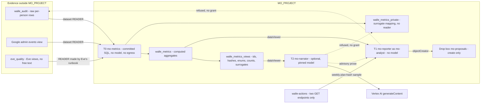
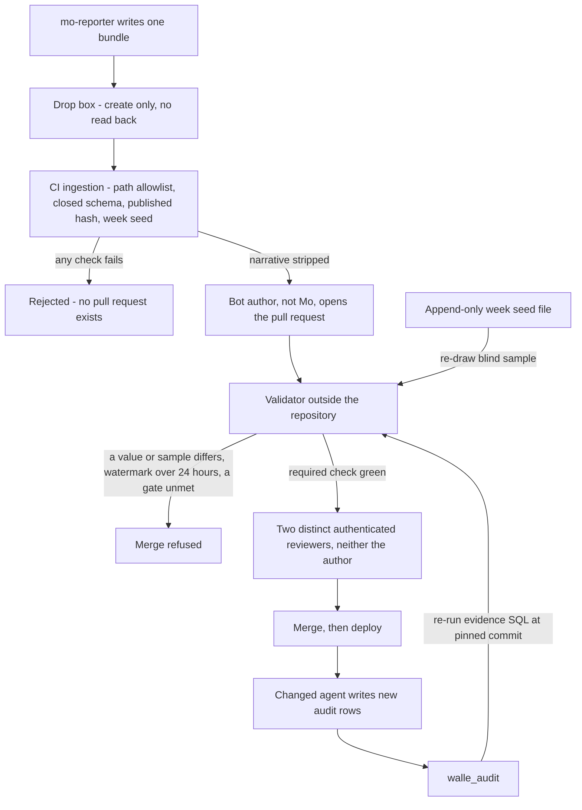

# 17. Mo, continuous improvement

## Status
- Owner: the platform owner
- Last reviewed: 2026-09-14

## What you will understand by the end

This chapter explains how the component that improves Wall-E and Eve is kept from ever deciding, why a language model may sit inside it at all, what it measures and how its numbers are checked, and why the human grading it depends on decides how far the platform scales. It also carries the Art. 72 post-market monitoring plan.

Of the risk themes in Chapter 3, The problem and its risks, it answers autonomy outrunning evidence directly, and part of two more: a controller reachable by what it controls, because improving Eve must not weaken Eve; and staffing that makes two-person rules notional, because every gate here ends in human grades and reviewers. Nothing of Mo is built on 2026-09-14; the design of record is the [Mo set](../../mo/01-hld.md).

## The thesis: numbers that have to be true

Mo is a body of committed SQL, one deterministic Cloud Run job, a bucket and, optionally and late, one model. Its organising property is one sentence: every number and every selection Mo publishes is re-derivable from the measured agent's audit dataset, `walle_audit` for Wall-E, and the gate re-derives it rather than believing it ([Mo HLD, thesis](../../mo/01-hld.md#thesis)).

A promotion pull request carries an evidence block: metric, value, the exact SQL at a pinned commit, window, fingerprint, sample size and seed. An external validator Mo cannot reach runs that SQL itself, refuses the merge if one value differs, and re-draws the blind grading sample; it and its custodian are the platform's (Chapter 9, Registry, governance and the autonomy contract).

That decision licenses a model in Mo: a compromised or hallucinating Mo can write a persuasive paragraph, but cannot produce a false number that survives CI. And an artefact that would change no human decision gets no pipeline.

## What Mo is not

Four negatives carry more of the design than the positives ([Mo HLD, what Mo is not](../../mo/01-hld.md#what-mo-is-not)).

- **Not callable.** No REST API, Pub/Sub event, agent card, A2A endpoint or MCP server, so nothing can steer a decision.
- **Not a decider.** Nothing Mo emits is an approval, a signature, a level, a halt, a sample or a gate input.
- **Not a credential holder.** No Workspace credential, secret, key or git credential; its three service accounts hold dataset-level reads and, for one, object-create on one bucket.
- **Not mostly a model.** A model appears in one place, from S4, writing prose about numbers it did not compute. It is legitimate never to build it.

## Three tiers and the seam between them

Mo runs as three identities in `MO_PROJECT`, each weaker than the last, and the boundary between code and model is IAM, not convention ([Mo HLD, the three tiers](../../mo/01-hld.md#the-three-tiers-and-the-seam-between-them)).

**T0, the metric queries**, runs as `mo-metrics@`: about twelve pinned BigQuery scheduled queries, and the only identity that reads raw per-person rows, under dataset-level grants on `walle_audit`, Google's admin events and `eve_quality`. A scheduled query has no inbound surface and no egress, so the identity that sees raw evidence cannot be prompted. It computes every number and selection, the verdict included.

**T1, `mo-reporter`**, runs as `mo-analyst@`. It reads computed aggregates only, renders the artefacts, calls two read endpoints on Wall-E's action service to check weekly that audit rows match frozen plans, and writes bundles to the drop box.

**T2, `mo-narrator`**, optional from S4, reads only authorised views of ids, hashes, closed enums, counts and surrogate keys; the surrogate-to-person mapping sits in a dataset with no reader. An injected display name in an audit row cannot reach the model, because there is no free string to canonicalise ([Mo identity §3](../../mo/02-identity-and-access.md#3-the-authorised-view-layer)).

## The deterministic boundary

Every number and selection that can move a level is computed by committed SQL; a model may only write prose about them. Six mechanisms hold the rule, in descending order of trust ([Mo HLD, the deterministic boundary](../../mo/01-hld.md#the-deterministic-boundary-and-how-it-is-enforced)): the model cannot see the data; it cannot see a free string; the gate recomputes; evidence is hash-bound to a published scorecard; prose is stripped before validation and labelled advisory; and CI bans model libraries from T0 and T1. The reason array is a set union, so a model can add a `not_ready` reason and never remove one. The one imperfect place is named: T1 reduces the plan read's per-item pre-state to counts in its own code, a process boundary rather than an IAM one.

## From proposal to production

A git credential in Mo would make it the one component whose compromise produces a plausible promotion pull request. So `mo-analyst@` holds only object-create on the bucket `mo-proposals`, which cannot read back, overwrite or delete ([Mo HLD, the drop box](../../mo/01-hld.md#the-drop-box-and-why-mo-holds-no-credential)). CI ingests each bundle from outside `MO_PROJECT`, checks it, strips the narrative and opens the pull request under a bot account that is not Mo; the validator recomputes; two distinct authenticated humans, neither the author, review ([Mo artefacts §3](../../mo/04-artefacts-and-proposals.md#3-from-bundle-to-merge)).

A compromised Mo is therefore bounded by path before CI runs, and a forged promotion has to be true to pass. Mo's absence is more restrictive than its presence: no bundle is assembled, and the validator refuses every promotion whose metrics watermark is older than 24 hours (failure below).

What a bundle may declare is closed: eight types for Wall-E, with no ladder types through S2 and no template that emits a ceiling change ([Mo artefacts §3.5](../../mo/04-artefacts-and-proposals.md#35-the-closed-proposal-type-set)). Mo may never propose a change to its own gating layer, from the metric SQL and fixtures to ceilings and the validator; such a bundle is refused at ingestion, and one pull request may touch at most one of them even when a human writes it. When Mo's evidence says its own arithmetic should change, it raises an `incident_note` and a human authors the diff ([Mo artefacts §7](../../mo/04-artefacts-and-proposals.md#7-mo-may-not-propose-changes-to-its-own-gating-layer)).

## One Mo per platform, and a remit that includes Eve

There is one `MO_PROJECT` for the whole platform, and every table, cell and artefact is keyed on `agent_id`; a new agent gets the metric pack its register tier names, not a Mo of its own ([platform HLD §13.3](../01-hld.md#133-mo--improving-both-one-mo-per-platform-without-touching-eves-independence)). The remit includes Eve's detection quality and time-to-report, under four rules. Eve can lower a level; Mo can only propose. Eve reads nothing Mo writes, and a threshold change reaches Eve only as a Mo bundle a human merges. Mo is never Eve's grader. And numbers about Eve obey the source rule.

**The source rule.** A number about Eve never comes from Eve's verdicts alone, because a compromised Eve writes false receipts (Chapter 16). Independent sources are human grades of Eve, seeded-fault runs, golden-replay results and Wall-E's passive record of seeing Eve; a run fails if an evidence-eligible figure has none ([Mo metrics §7.3](../../mo/03-metrics-contract.md#73-the-eve-quality-pack)). Eve's Mo-readable tables sit in `eve_quality`, granted by Eve's runbook. Human grades of Eve go into a dataset in `VALIDATOR_PROJECT`, proposed as E-21, a row the platform pages do not yet count ([register §8](../12-open-decisions.md#8-index-agent-set-decisions-and-the-platform-rows-that-touch-them), [Eve open decisions](../../eve/09-open-decisions.md)). Until the validator custodian holds a reader on `eve_quality` (P30, proposed), every Eve bundle is an advisory `eve_incident_note`.

Eve proposals are a closed set of four types on a narrower path, and the asymmetry is deliberate ([Mo artefacts §3.6](../../mo/04-artefacts-and-proposals.md#36-the-eve-proposal-path-reviewer-rules-and-the-30-day-cross-rule)). A tightening may only produce more refusals, more pages or shorter lag budgets; a loosening needs the full evidence block, the security reviewer among two reviewers, a decision record and five business days' cooling; a seeded-fault proposal only adds. The 30-day cross rule refuses a loosening within 30 days of a Wall-E promotion on the same cell, in either order, because a level rising while its verifier relaxes is a combination neither repository sees alone. Eve's second reviewer is neither the ladder owner nor whoever runs Mo's CI, and Eve's predicates, ceilings, reason codes and `eve_authority` are never reachable. One seam is unreconciled: tighten asks for one reviewer while `eve/config` requires two; the stricter two apply meanwhile.

## What Mo produces

Wall-E's five artefacts are the scorecard, the ladder-state page, the weekly digest, the regression explanation and the monthly cost report. The cost report comes first, at S1, because it feeds the stop-or-continue review; the others concern levels and arrive at S2 ([Mo artefacts §1](../../mo/04-artefacts-and-proposals.md#1-the-five-artefacts)). For Eve, the misbehaviour coverage map lists every class a super-admin robot could commit and the detector that would see it, marked covered, never exercised or uncovered; it is Eve's improvement backlog, first edition before Wall-E's S1 (P143, proposed). The Eve scorecard labels every self-reported figure.

**The Art. 72 post-market monitoring plan.** For each system the register marks high-risk, Mo's artefacts are the plan, and the plan's text is one paragraph per system naming the artefacts, their cadence and reader, and two outside feeds: every Art. 73 assessment outcome and every Art. 86 explanation request ([Mo artefacts §1.8](../../mo/04-artefacts-and-proposals.md#18-the-art-72-post-market-monitoring-plan-per-high-risk-system)). The Mo owner owns it and the AI compliance owner reads it; for Wall-E it exists from S2. Its loop runs from the audit log through metrics and blind grading to a human merge as a pre-determined change, and back to the log; its liveness control is the freshness alert, a silent Mo being a severity-2 finding. The artefact paths are an Assumption, and the re-cut into the Commission's Art. 72(3) template waits on an adoption date not verified. Art. 72 among the Act's other obligations is Chapter 20, EU AI Act.

## What Mo measures

A metric pack is chosen by the register's tier, never by Mo ([Mo metrics §7.1](../../mo/03-metrics-contract.md#71-the-metric-pack-per-tier)). Tier C gets cost and reliability with no grading; Tier R adds the Model Armor match rate, drift and freshness; Tier W adds the full ladder pack with blind grading and the interval gates; Tier P adds the Eve quality pack for its verifier; Tier X's evaluation gates are undefined. The human hours each pack costs are staffing numbers, in Chapter 23.

Wall-E's pack has ten metrics, audit completeness first ([Mo metrics §7.2](../../mo/03-metrics-contract.md#72-wall-es-pack--the-ten-metrics-audit-completeness-first)). With Super Admin the tenant no longer refuses an out-of-role call, so the one number that sees an action outside the catalogue is the join of Google's admin log to Wall-E's own rows: target 100 %, below which writes halt until reconciled. A companion metric counts robot admin events matching no catalogue or band B operation, each one severity 1, halted and paged by Eve and the SIEM, never by Mo. The rest cover denials, precision, verification, breakers, reliability, latency and drill freshness.

## How the numbers are checked

Plan precision is gated by intervals, not point thresholds, because a point threshold on twenty or thirty items promotes a playbook that is truly 90 % right about one window in five ([Mo metrics §4](../../mo/03-metrics-contract.md#4-the-gates)). Promotion needs the lower bound of the interval to clear the target; demotion needs the upper bound to fall below it over a closed block of decided items. The sample floor is the smallest flawless sample whose lower bound can clear the promotion target, so floor and gate are one decision, kept in `gates.yaml` and never changed in the same pull request as a level. `unsure` grades leave the ratio up to a cap (an Assumption), and promotion must also clear a bound that counts them as wrong. Demotion blocks are disjoint and retired once they fire, so one cluster of errors cannot demote twice; that rule must still land in Wall-E's ladder page, since the components that demote never read Mo. A regression across a fingerprint change is described, never gated.

The validator re-runs the same SQL, so it inherits any arithmetic defect. A second implementation was refused, because false blocks pressure the validator to agree with Mo; four controls stand in ([Mo failure modes §3.1](../../mo/06-failure-modes.md#31-wrong-arithmetic--the-failure-the-gate-cannot-catch)). Golden fixtures hand-computed from the published constants are the test oracle, kept apart from the code they test, and some values are still to be computed ([Mo metrics §5](../../mo/03-metrics-contract.md#5-golden-fixtures--the-design-document-is-the-test-oracle)). Assertion queries fail the run on impossible states, the metric SQL sits under the ladder's reviewers, and an S2 back-test compares verdicts with decisions humans already took. No interval covers grader error.

## Grading, the seed and attribution

The blind sample is the larger of 10 % and five items a week per family-and-trigger cell, and from S4 it is the only admissible input to L4 and L5 precision ([Mo metrics §13](../../mo/03-metrics-contract.md#13-the-blind-sample-and-the-seed-protocol)). Membership is a published hash over a week seed that CI commits to an append-only file after the week closes, so nobody, Mo included, chooses the draw. The grading rules keep the measured away from the measurer ([Mo metrics §10](../../mo/03-metrics-contract.md#10-grading-rules)): grades count only from listed humans who did not author the playbook version under test, a `WRITE_HIGH` cell also needs second grades by someone other than the owner, and an unadjudicated disagreement blocks the cell. Eve's flow 7 disagrees, drawing daily and counting `unsure` as wrong where Mo's contract draws weekly from a CI seed and excludes `unsure` ([Eve flow 7](../../eve/04-flows.md#flow-7--the-blind-sample), [Mo metrics §13.2](../../mo/03-metrics-contract.md#132-the-seed-protocol)); the conflict awaits a dated decision.

Attribution uses a ten-field fingerprint, from playbook, prompt and model to the Model Armor filter version and configuration; four fields are not yet on the audit row, so attribution is labelled partial ([Mo metrics §11](../../mo/03-metrics-contract.md#11-attribution-the-fingerprint-and-the-scoping-rule)). The promotion sample resets on any fingerprint change; the demotion evidence does not, or a prompt edit would escape a demotion. At a realistic change cadence L4 may therefore be unreachable, which the design treats as a decision, not a bug (M-2, open): Mo publishes both the strict count and a count under a material subset from S2, and the choice is made on data ([Mo failure modes §3.3](../../mo/06-failure-modes.md#33-fingerprint-churn-may-make-l4-unreachable-and-that-is-a-decision-not-a-bug)).

## Staging, the acceptance test and the baseline

Mo's pieces arrive inside Wall-E's stages ([Mo staging](../../mo/05-staging.md#the-stage-table)). The one part that must exist before Wall-E does is the toil baseline, four weeks of measured toil for the top three admin tasks plus monthly operating hours: a "before" cannot be measured once Wall-E runs, and without it the stop-or-continue review has no denominator ([Mo staging, before Phase 1](../../mo/05-staging.md#before-phase-1--the-baseline-nobody-can-reconstruct-later)). At S0 the definitions are fixed before the first grade and every cell reads `insufficient_data`; nothing at S0 or S1 depends on a Mo verdict, and S1's one decision is about value. The drop box and validator arrive at S2 exit.

Before a promotion may cite Mo, Mo passes a six-part acceptance test at S3, from its arithmetic against the fixtures to four consecutive weeks of agreement with the validator and its refusal to call adversarially framed not-ready cases ready ([Mo staging, acceptance test](../../mo/05-staging.md#mos-acceptance-test-at-s3)). Failure costs automation, not safety: promotions are argued from hand-run queries. Trust does not grow with age; S5 trusts Mo with exactly what S4 did ([Mo staging, trust](../../mo/05-staging.md#trust-does-not-grow-with-age)). Stage durations are Chapter 24, Roadmap and cost.

## The human grading cost

This number decides whether the programme survives ([Mo staging, run human](../../mo/05-staging.md#run-human--the-real-number-and-the-one-that-decides-whether-the-programme-survives)). The floor is per cell. At a S4 volume of about 200 executing items a week over about eight live cells, each cell carries about 25, so the floor of five binds everywhere: at least 40 graded items a week, about eight double-graded, plus adjudication. That is at least two hours a week, indefinitely, from a named human who is not the playbook owner, plus a second grader who does not yet exist, plus about 30 minutes a week on the digest and two hours a quarter of review. It cannot be automated, thinned or given to a model without destroying what it measures. At five a week a cell needs about seven weeks to reach the sample floor, longer than its four-week dwell, so the sample is the binding clock; grading everything in promotion mode is not adopted.

Mo does not create this cost but is useless without it, so it sits on Mo's line in the cost report: if nobody grades, the programme visibly stalls on attention rather than safety. Because grading scales with live cells, not volume, it caps the number of Tier W agents; the cap as named grading capacity (P25, open) is argued in Chapter 14, Scale and AGI readiness, and staffed in Chapter 23, Operating model. Mo's own estimates, all Assumptions, are 24–37 person-days to build, the Eve remit unpriced, and €25–60 a month to run.

## What Mo needs from Wall-E

Mo computes almost nothing until Wall-E's set lands two schema changes and one grant ([Mo open decisions](../../mo/08-open-decisions.md#what-this-design-forces-on-wall-es-set), [Mo failure modes §3.2](../../mo/06-failure-modes.md#32-the-two-blocking-prerequisites)): tables for grades, proposal verdicts and drills; a table of ladder events; and cross-project readers on the audit data. Mo does not route around the gap by reading the control plane's store; it reports `not computable`, so the gap shows in every digest rather than as a quietly wrong number. The full list of changes Mo forces and the rule for scheduling them with Wall-E are Chapter 18, How the three work together.

## Failure, threats and residuals

Mo fails closed in both directions ([Mo failure modes §1](../../mo/06-failure-modes.md#1-the-fail-closed-argument-in-both-directions)). When Mo stops, nothing rises: no bundle, a 24-hour watermark refusal, and an absence alert, because a threshold alert is silent exactly when data stops. Nothing else degrades: breakers, Eve's halts, CI's merge gates and the deploy tool never read Mo, which is tested. An outage costs promotion and visibility, never a brake.

The threat model assumes full control of each principal ([Mo failure modes §4](../../mo/06-failure-modes.md#4-threat-model)). The real blast radius is `mo-metrics@`: read disclosure of the whole audit history, per-person and tenant-wide now Wall-E holds Super Admin, which makes `MO_PROJECT`'s IAM part of the confidentiality boundary. A compromised reporter adds noise that must survive recompute and two reviewers; a steered narrator writes a labelled falsehood that changes no number; a compromised CI bot has no floor if the git host allows administrator bypass (P22, open). Mo as a processor of personal data is Chapter 22, Personal data, employees and the works council.

Six residuals are accepted, not mitigated ([Mo failure modes §5](../../mo/06-failure-modes.md#5-residuals-unsoftened)). R1: the validator proves numbers match the committed SQL, not that the SQL is right. R2: a truthful, tendentious pull request two tired humans merge. R3: a wrong mental model shared by author and graders, invisible to blind sampling, because every grading statistic measures consistency, not correctness. R4: T0 reads per-person rows. R5: whoever runs CI can re-roll a candidate seed before committing it. R6: on a one-person pilot, Mo authoring Eve diffs adds a hand to one person's list, and until the second human exists Eve's thresholds do not improve through Mo at all.

Fifteen denial tests authored from Mo's side make these claims falsifiable and run before every promotion ([Mo runbook, Mo-12](../../mo/07-build-runbook.md#phase-mo-12--the-denial-tests-authored-from-mos-side)); each can fail both ways.

## Key decisions and what to read next

### Key decisions

- **P30 — proposed**: the validator custodian's reader on `eve_quality`; until it exists every Eve bundle is advisory.
- **E-21 — proposed** in Eve's register: human grades of Eve in a dataset in `VALIDATOR_PROJECT`.
- **P25 — open**: the Tier W cap as named grading capacity, measured after the first Tier W agent's first quarter.
- **P143 — proposed**: owners and gates for the Mo-set edits, gated on Wall-E's S1, including the coverage map's first edition.
- **P22 — open**: the git host and audited administrator bypass, superseding M-7.
- **M-2 — open**: strict or material fingerprint scoping, before the first L4 promotion is argued.
- **M-4 — open**: the second grader, named before S2 entry.
- **M-8 — open**: whether the narrator is built, decided at S4 entry.
- **Eve v0 and Mo's T0**: the platform's objective review of 2026-09-13 keeps both as a differential check; [Mo's reopen table](../../mo/08-open-decisions.md#reopen-when) still asks for a dated decision record on it and on the blind-sample draw, and none exists yet.

What Chapter 19, Threat model and residual risk, carries from this chapter: residuals R1 to R6 as stated above, the tenant-wide disclosure blast radius of `mo-metrics@`, and the dependence of every merge gate on branch protection binding.

### Canonical pages to read next

- [Mo HLD](../../mo/01-hld.md#thesis), in full, and [identities and access §3](../../mo/02-identity-and-access.md#3-the-authorised-view-layer)
- [Mo metrics contract](../../mo/03-metrics-contract.md#4-the-gates), especially §4, §7 and §13
- [Mo artefacts and proposals §1.8 and §3](../../mo/04-artefacts-and-proposals.md#18-the-art-72-post-market-monitoring-plan-per-high-risk-system)
- [Mo failure modes §5](../../mo/06-failure-modes.md#5-residuals-unsoftened) and [Mo open decisions](../../mo/08-open-decisions.md#the-eleven-open-decisions)
- Next in the brief: Chapter 18, How the three work together.
