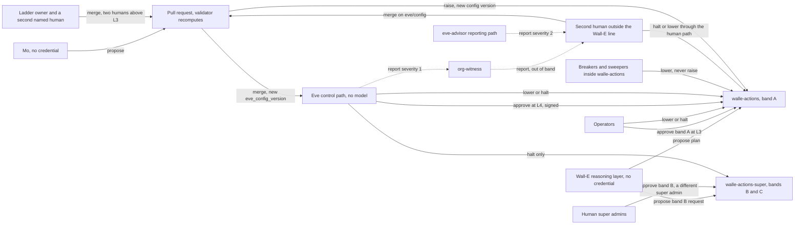
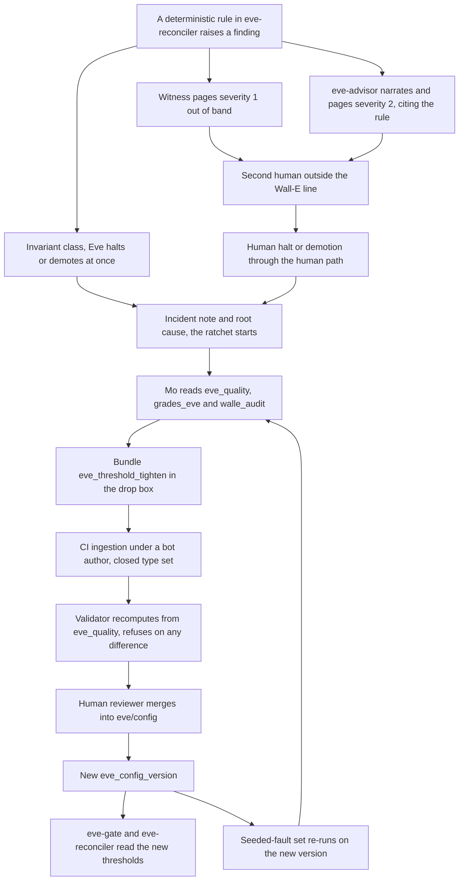

# 18. How the three work together

## Status
- Owner: the platform owner
- Last reviewed: 2026-09-14

## What you will understand by the end

Why three agents are safer than one only while they cannot collapse into one; which half of the outcome each owns; what each may do to the others and what only a human may do; the interfaces and data they share, and the connections deliberately missing; the changes each design forces on the others; and how a request, an attack, a halt and a detection travel through the team.

The chapter answers three risk themes of Chapter 3, The problem and its risks: **a controller reachable by what it controls**, because the team's separation is what keeps Eve and Mo out of Wall-E's reach; **autonomy outrunning evidence**, because no agent can raise anything; and, in part, **staffing that makes two-person rules notional**, because every loosening lands on named humans. Nothing described here is built on 2026-09-14, and no grant between the three exists yet.

## Three rules that stop the team collapsing into one

The rules are written once, in [the team contract](../../wall-e/08-team-eve-mo.md#the-separation-that-makes-a-team-worth-having), and every change the three designs force on each other traces back to one of them.

**No agent both decides and acts.** Wall-E acts and never approves; Eve approves and never acts on Workspace; Mo proposes and does neither. An approval posted by Wall-E's reasoning layer is therefore denied as `approver_is_agent`, a hard invariant.

**No agent grades its own work.** Wall-E's re-read after a write is a sanity check, not evidence. Eve verifies with its own read-only credential against audit logs Google writes. Mo's numbers are reproduced by a validator from sources Mo cannot write, and humans, never Mo, grade Eve's verdicts. No verifier reaches its subject through the subject, which is why no Eve identity may query Wall-E's engine.

**Only humans loosen anything.** Eve can lower a level and halt; Mo can only propose; neither can raise. A raise is a pull request, CI validation and a dated decision record with a named human, two above L3, so no improvement loop promotes itself.

The contract's test: a change that would let one agent do two of decide, act and grade is wrong however convenient it is.

## Who owns which half

All three share one outcome, Workspace administration done correctly and safely, and own different halves of it ([responsibilities](../../wall-e/08-team-eve-mo.md#responsibilities)). Wall-E owns doing the work, and nothing else executes. Eve owns nothing bad getting through and stopping it fast when it does: independent verification, drift detection, halting and demoting, and reporting misbehaviour of Wall-E, or of a human prompting it, to a human outside the Wall-E line. Mo owns the system getting better rather than merely older, for Wall-E **and** Eve: it explains regressions, measures Eve independently of Eve's verdicts, and proposes changes.

Humans keep deciding a raise, merging any change, grading and receiving reports, those about the administrator going only to the second human (Chapter 16, Eve, the independent controller).

## Who may do what to whom

The matrix combines [Wall-E's ladder §6](../../wall-e/05-autonomy-ladder.md#6-who-may-raise-who-may-lower), the action-service callers and the proposal rules. Changing a ceiling is outside every row: it takes code review by two humans and security sign-off.

| Actor | Raise | Lower | Halt | Veto | Approve | Propose | Merge |
|---|---|---|---|---|---|---|---|
| Any operator | No | Yes, alone, instantly | Yes; clearing a halt is human-only | Yes, during a hold window, on either lane | Band A at L3, on the out-of-band surface | — | — |
| Ladder owner, with a second named human for L4 and L5 | One notch, decision record | Yes | Yes | — | — | Promotion pull requests | Yes |
| Human super admins | No | — | K5 and K6 | As operators | Band B at tier `SUPER`: a different super admin from the requester | — | — |
| Second human outside the Wall-E line | No | Through the human path | Through the human path | — | — | — | Required reviewer on `eve/config` |
| Wall-E | Never | Only by refusing its own run | No | No | Never | Plans and band B requests | No |
| Eve control path | Never; it attests | Any level, one call per cell | Both action services | `walle-actions` only | L4, signed, on binding cells | A rollback, which a human executes | Never edits its own rules |
| `eve-advisor` | No | No | No | No | No | Narratives and severity 2 pages | No |
| Mo | No | No; a `demote_proposal` only | No | No | No | Closed type sets, as pull requests | No |
| Breakers and sweepers | No | Family to L0; `no_autonomous` on Eve's silence | Self-halt when Firestore is unreachable | — | — | — | — |

The asymmetry is the design: everything that makes less happen is available to many actors in seconds, and everything that makes more happen needs humans, time and recomputed evidence. The fleet stop K7, pulled by a human or a severity-1 SIEM rule and never by a model, sits above all rows (Chapter 8, Identity, privileged access and the fleet kill switch).

Solid arrows carry authority; the three dotted arrows carry reports, which confer none. No arrow points at Mo, and none leaves `eve-advisor` towards anything that decides.

## The interfaces between them

Eve reaches Wall-E through eight plain authenticated REST endpoints on `walle-actions`: read a plan or a run, approve, veto, halt, demote, read the ladder and a health check ([LLD, action service interface](../../wall-e/03-lld.md#action-service--interface); [ARCHITECTURE §7.4](../../wall-e/ARCHITECTURE.md#74-the-interfaces-eve-consumes-and-why-they-are-plain-rest)). Why a safety interlock is plain REST and never an agent protocol is principle D12 (Chapter 4, The principles).

Four details carry the weight. The per-endpoint caller allowlist (Chapter 15, Wall-E, the doer) keeps the agent off every control endpoint and Mo on the two read endpoints only. Demote refuses any value above the configured level, and **there is no raise endpoint at all**. The health check reports the last successful audit write, so Eve can halt when evidence stops. On `walle-actions-super` Eve holds halt and nothing else, since the lane is permanently L3 under two human super admins; a halt during the hold cancels every pending execution.

A CI stub caller exercises the endpoints from the first commit. Neither Eve nor Mo exposes an inbound surface, so neither can be told what to do.

## One set of facts, three readings

Everything Eve and Mo need already exists in Wall-E's design, and neither asks Wall-E about itself ([shared data plane](../../wall-e/08-team-eve-mo.md#the-shared-data-plane)). The meeting place is `walle_audit` in `WALLE_PROJECT`, read through dataset-level grants with queries billed in the reader's project, plus Google's Workspace audit logs and `ladder.yaml` in git, joined on `run_id`. A second meeting place, `eve_quality` in `EVE_PROJECT`, holds views without free text that Eve owns and Mo reads.

An absent edge is a decision with a reason ([absent edges](../../mo/01-hld.md#the-edges-that-are-deliberately-absent)). Nobody subscribes to the `walle-events` topic: a five-minute poll of the audit table meets Eve's tightest duty twelvefold, and a topic Wall-E publishes is a channel Wall-E controls; the topic stays, owner and schema *tbd*. Mo reads no Firestore and holds no credential. Eve reads nothing Mo writes, nothing `eve-advisor` writes reaches a verdict, and no enforcement identity can read Mo's metrics.

Every crossing is a row of [the topology's grant table](../../project-topology.md#3-cross-project-grants), always made in the resource's project; the rows between the three are:

| Crossing | Rows | Level, and who makes it |
|---|---|---|
| Eve's identities invoke `walle-actions` | 3 | Service level; Wall-E's runbook, narrowed by the in-app allowlists |
| Eve's halt identities invoke `walle-actions-super` | 27 | Service level, halt only; Wall-E's runbook through PAM |
| Eve and `eve-export@` read `walle_audit` | 4, 34 | Dataset level; Wall-E's runbook |
| Wall-E verifies Eve's signature | 14 | No grant by default: a pinned PEM in Wall-E's repository |
| Wall-E's sweeper reads Eve's receipts; Wall-E's CI publishes the ladder artefact | 15, 16 | An existence-only view from S4; a create-only prefix; both made by Eve's owner |
| Mo reads `walle_audit` and invokes the two read endpoints | 6, 8 | Dataset and service level; Wall-E's runbook |
| Mo and the validator read `eve_quality` | 28, 29 | Dataset level; Eve's runbook, the validator's row under P30 |
| Anything else into another agent's project | 24, 25, 26 | Anti-grants, asserted by drift jobs and denial tests |

## What each design forces on the others

Eve's design lists thirty-seven contract changes on Wall-E's set, CC-1 to CC-37 ([contract-change table](../../eve/08-contract-changes.md#1-the-contract-change-table)). They cover the bytes Eve signs and how Wall-E verifies them, the per-cell `eve_authority` switch, moving Eve's identities, key and secrets into `EVE_PROJECT` (CC-24 to CC-31), the stricter S3 exit gate (CC-7), the absence sweepers, and letting Eve halt band B and reconcile its rows (CC-34 to CC-37), each with a gate ([when each lands](../../eve/08-contract-changes.md#6-when-each-edit-must-land)).

Mo's design forces twenty changes, nineteen on Wall-E's set and one on Eve's ([Mo's list](../../mo/08-open-decisions.md#what-this-design-forces-on-wall-es-set)); the three that block Mo entirely are in Chapter 17, Mo, continuous improvement. Change 15, a denial test proving no enforcement identity holds a binding in Mo's project, is the one a security reviewer should refuse to sign without, because without it "nothing Mo writes is read by anything that enforces" is a convention rather than a test.

The scheduling rule matters more than the count: a change lands on the schedule of the repository it edits, not of the agent that asks. Eve's side of Wall-E is about five engineer-days inside `walle-actions`; if Wall-E's plan omits these changes, Eve and Mo are unbuildable. One tension is recorded: Eve's page says it adds no endpoint, yet CC-33 proposes a pending-plan list endpoint, conditional on topology decision 44, still open.

## Four journeys through the team

**An Eve-gated execution** ([Flow D](../../wall-e/04-flows.md#flow-d--eve-gated-execution-with-a-hold-window)). From S4, for families that earned L4, a frozen plan waits at `pending_eve`. Eve recomputes and signs it through the pre-approval pass of Chapter 16. A 30-minute hold window opens in business hours and any operator's veto wins. If Eve is unreachable, items wait. A window that would end outside business hours is refused at plan time, or an attacker choosing the trigger time could aim every batch at an unwatched morning. If a human later reverts what Eve approved, the family drops to L0 and Eve's authority for it to advisory: both agents are demoted.

**Autonomous execution** ([Flow E](../../wall-e/04-flows.md#flow-e--autonomous-execution-and-post-hoc-verification)). At L5, reversible operations only and never `WRITE_HIGH`, Wall-E executes and re-reads, and Eve verifies independently within 60 minutes. When Eve disagrees it demotes the family within seconds, opens a rollback proposal only a human executes, and promotions freeze until a fresh decision record. Flow E demotes to L3 where the ladder's severity table sends verification drift to L0 ([ladder §9](../../wall-e/05-autonomy-ladder.md#9-severity-and-automatic-response)); the pages disagree.

**An injection in the robot's mailbox** ([Flow F](../../wall-e/04-flows.md#flow-f--the-attack-injection-arriving-in-the-robots-mailbox)). Suppose the prompt defence fails (Chapter 19, Threat model and residual risk) and the model proposes suspending a department and adding an outsider to the operators group. The action service refuses on independent grounds: no bulk target, an operation outside the playbook, L0 for that trigger, a hard-denied control group, an outside-domain member; band B is unreachable from a mailbox run. Google would refuse none of it; Eve's reconciliation would see a write that got past the code.

**Halting** ([Flow G](../../wall-e/04-flows.md#flow-g--halting)). An operator, Eve and a breaker can each stop Wall-E without asking the others, the endpoints targeted under five seconds; switches K0 to K6 are Chapter 15's and K7 Chapter 8's. Only a human clears a halt.

## A detection becomes an improvement

The loop that turns a finding into a better Eve crosses every separation rule once, and each crossing is a human act.

Eve's control path reads only its control tables and `eve/config`, so a change reaches it as merged configuration, never as advice ([Eve HLD §3](../../eve/01-hld.md#3-deterministic-by-absence-not-by-discipline)). Every verdict carries the `eve_config_version` it used, and seeded faults re-run on every version, so Mo sees whether the change worked. The loop is drawn with a tightening, which needs neither a decision record nor a cooling period; the rules for loosening are Chapter 17's.

The loop is not yet available end to end. Until the validator holds a reader on `eve_quality` (P30, proposed), Mo may send only an advisory `eve_incident_note`; the tightening step waits.

## When the team itself fails

The team's own failure modes are few, and each resolves towards less happening ([team failure modes](../../wall-e/08-team-eve-mo.md#failure-modes-of-the-team-itself)).

- **Eve down.** L4 waits and Wall-E's sweepers stop autonomous work (Chapter 16). Nothing falls through to execute.
- **Eve compromised.** Bounded as Chapter 16 sets out: it can approve within the current level's blast radius until the next sampled review, and cannot raise.
- **Persistent disagreement.** Neither agent wins; above threshold the family is demoted and the disagreement becomes the finding.
- **Mo proposes harm.** It still needs CI, a decision record and a human merge, two humans above L3.
- **All three unavailable.** Nothing happens, which is correct.
- **A human bypasses all three in the Admin console.** Legitimate; Eve sees a human event and no robot gap, and Wall-E's pre-state re-read stops the two colliding.

The failure no agent rule contains is human: one person writing a promotion, the Eve loosening beside it and running Mo's CI. Reviewer separation forbids it; whether enough people exist is Chapter 23, Operating model.

## What a fourth agent inherits

A fourth agent does not get its own Eve or Mo. It inherits from the platform: at Tier W, a verifier of Eve's deterministic shape compiled from its manifest, which catches code bugs and tampering but not a wrong specification (P79, proposed); the one validator; a Mo metric pack chosen by tier; and the audit and ladder schemas ([registry page §9.8](../05-registry-and-autonomy-contract.md#98-how-eve-and-mo-generalise-to-the-contract--and-what-the-second-implementation-property-loses-p79); Chapter 9, Registry, governance and the autonomy contract). The separation rules transfer unchanged; the hand-written second implementation stays Tier P's.

## What remains open

Eve's set and Mo's set both claim Eve v0's scheduled queries and the blind-sample draw, and where grades of Eve are kept (E-21, proposed) is unsettled; both are in Chapter 17. `eve-gate`'s discovery of pending plans has no grant until topology decision 44 is answered. Wall-E reading Eve's receipts, the one dependency pointing the avoided way, is re-argued at S4 under E-17. P14, the witness, and P19, `eve-advisor`'s AI Act class, are open.

Chapter 19, Threat model and residual risk, carries what the team leaves: a compromised Eve approving within one level's blast radius until sampled review, Eve reading the plan from the service it checks, and a staffing base that can make the separation of reviewers notional.

## Key decisions and what to read next

### Key decisions

| Decision | State on 2026-09-14 |
|---|---|
| P33 Wall-E holds Super Admin on a dedicated licensed user account | decided; deviation signatures pending |
| P34 Eve's reporting path may reason, report-only | proposed |
| P30 validator custodian's reader on `eve_quality` | proposed |
| P79 Tier W platform verifier and its compensations | proposed |
| P14 witness organisation | open |
| P19 `eve-advisor`'s AI Act class | open |
| Topology decision 44 Eve's discovery of pending plans | open, before S3 entry |
| E-17 Wall-E's read of Eve's receipts | re-argued at S4 entry |
| E-21 grades of Eve in `VALIDATOR_PROJECT` | proposed |

Chapter 25, Decisions awaiting the owner, lists who decides each open row.

### Canonical pages to read next

- [The team contract](../../wall-e/08-team-eve-mo.md#the-separation-that-makes-a-team-worth-having), with its [identities](../../wall-e/08-team-eve-mo.md#identities) and [shared data plane](../../wall-e/08-team-eve-mo.md#the-shared-data-plane)
- [Platform HLD §13, the three agents on the platform](../01-hld.md#13-the-three-agents-on-the-platform)
- [Wall-E's flows D to G](../../wall-e/04-flows.md#flow-d--eve-gated-execution-with-a-hold-window) and [ladder §6](../../wall-e/05-autonomy-ladder.md#6-who-may-raise-who-may-lower)
- [Project topology §3, cross-project grants](../../project-topology.md#3-cross-project-grants)
- [Eve's contract changes](../../eve/08-contract-changes.md#1-the-contract-change-table) and [what Mo forces on Wall-E's set](../../mo/08-open-decisions.md#what-this-design-forces-on-wall-es-set)
- Next in the brief: Part IV, Proof: threats, compliance and people.
