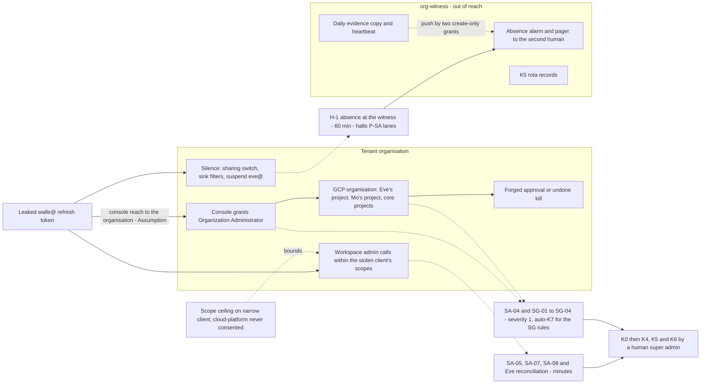
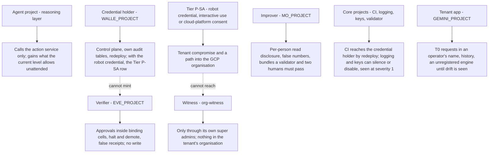

# 19. Threat model and residual risk

## Status
- Owner: the platform owner
- Last reviewed: 2026-09-14

## What you will understand by the end

This chapter tests the brief's case. Chapters 5 to 18 each answered risk themes of Chapter 3, The problem and its risks; here every answer meets the adversaries it must survive, and what remains is written down with its owner and disposition.

By the end you will know what the platform must never allow and the risk the owner took on; why no prompt is a control; for each adversary, the control that stops it, the detection that sees it, how fast, who is paged and which runbook starts; what a compromise of each class of project reaches; which facts are kept out of every safety argument; how each of Chapter 3's risk themes ends; and which residual risks are accepted in writing, by whom, and when they are reopened.

Detection rules, runbooks and response targets are explained in Chapter 11, Monitoring, detection and incident response, and cited here by id. The grading vocabulary is Chapter 4, The principles: an enforcement-grade control refuses the action from outside the agent's process; a detection-grade control only sees it and never stands alone ([HLD §0.2](../01-hld.md#02-the-six-containment-primitives-and-how-each-is-graded)).

## The honest risk statement and the ceiling

### What the owner took on

The organisation is giving a language model a path to administrative operations on its Workspace tenant, then removing the human from that path one step at a time. It is legitimate to build and the highest-blast-radius system in the estate. Every control exists so that when the model is wrong, manipulated or mistimed, the outcome is an audit row and a refused approval rather than an incident ([honest risk statement](../../wall-e/06-security-guardrails.md#the-honest-risk-statement)).

Since 2026-09-13 that path ends at a super-admin account (P33, decided). Three statements hold, unsoftened: the action service is the only gate; the consented OAuth scope set is the only ceiling Google enforces; detection is the primary control ([HLD, what this reverses and what it costs](../01-hld.md#what-this-reverses-and-what-it-costs)). Three properties carry most of the remaining weight: the model never holds the credential, cannot authorise itself and cannot change its own leash.

### The blast-radius ceiling

The ceiling is nine statements of what must never happen, N1 to N9, ordered worst first ([blast-radius ceiling](../../wall-e/06-security-guardrails.md#the-blast-radius-ceiling-what-must-never-happen)). In substance: Wall-E never changes the tenant's security posture; never causes permanent data loss; never escalates privilege through a group; never performs a mass action across an organisational unit; never acts on instructions found in content; never chooses outbound communication unattended; never touches a protected principal; never takes an action nobody can see; never acts as a person.

On 2026-09-13 the first, second and seventh moved off a Workspace role that refused and onto the action service's policy chain, the hard-denied list refused in every lane and, for the settings it covers, Workspace multi-party approval, a two-person rule Google enforces. The rows are not ratified: the owner's signature on the two lists (P29) is open, and the ceiling is only as firm as it and the denial test suite.

### Who and what the platform defends against

The threat model assumes four kinds of adversary: an outsider who writes content the agent reads; an outsider holding a stolen credential or a compromised workload; an insider with legitimate access, the administrator included; and a supplier, from the model provider to a third-party agent. Non-malicious failure counts too: an invented call, a trigger storm, a poisoned upstream record, stale state between plan and execution, an outage of the controller ([threat model](../../wall-e/06-security-guardrails.md#threat-model)).

One row dominates. A leaked robot credential is a **tenant compromise** with a path into the GCP organisation, Eve's and Mo's projects included (the Organization Administrator reach, Chapter 16, Eve, the independent controller). It is bounded only by custody, the scope split and detection latency, and accepted as deviation R-01.

## What prompt-based defence cannot do

Every agent's system instruction says retrieved content is data, never instruction. The design keeps that instruction and assumes it will sometimes fail, because instruction and attack arrive on the same channel and the model cannot reliably tell them apart ([what prompt-based defence cannot do](../../wall-e/06-security-guardrails.md#what-prompt-based-defence-cannot-do)). Four rules follow for every agent:

- No operation is promoted because "the prompt handles it".
- No autonomous run chooses a message recipient; templated notification to fixed recipients is its own family.
- No content decides a ceiling. The taint bit — any attacker-writable field reaching the model forces the inbox ceiling for that run — is the mechanism; the system instruction is a courtesy.
- Every ceiling is read as compensating for a prompt that has already failed. A control that works only when the prompt works is not a control.

Content screening, a probabilistic classifier, is likewise never a trust boundary (Chapter 10, Agent Gateway, Model Armor and the perimeter). What stops an injection is structural: no credential in the model's process, a tainted run capped, explicit targets, and approvals minted where the model cannot reach.

## The adversaries, the controls that stop them and the detections that see them

Each entry cites its runbook ([runbooks](../07-monitoring-detection-incident-response.md#11-runbooks-per-scenario)). Every super-admin rule is SIEM-hosted, severity 1, and pages the detection desk and the second human in parallel (Chapter 11; [super-admin set](../07-monitoring-detection-incident-response.md#62-the-super-admin-set-workspace-side--siem-hosted-severity-1-owned-by-it-security)). Tier P acknowledgement targets are 15 minutes in business hours and 60 outside, and K5 within 30 minutes of acknowledgement, all Assumption until the managed detection contract and the tabletop fix them ([targets](../07-monitoring-detection-incident-response.md#92-the-on-call-tool-escalation-and-acknowledgement-targets)). Below Tier P the honest number is "next business morning".

### A leaked robot token — RB-01

Nothing stops a stolen refresh token from working. Before the leak there is custody (Chapter 8, Identity, privileged access and the fleet kill switch); after it, a narrowed reach and a race. The narrow client keeps a Google-enforced scope ceiling on everything unattended; the broad client does not; `cloud-platform` is consented on neither, checked in CI.

Detection is SA-05, SA-07, SA-08 and SG-01 (foreign client, robot event without an audit row, unneeded application, organisation IAM change), with Eve's minute-latency reconciliation as a second, independent evaluator. Containment is K0 on both action services in under a minute, then K4 and K5 — revoke the grants, suspend the account — by the on-duty human super admin. An issued access token lives up to 60 minutes after suspension, so the desk watches that hour and pre-stages K6, a human removing Super Admin from the robot. There is no machine-invocable account stop (P16, proposed none now): an automatic lock-out is also a path a compromised monitor could pull.

On that path an approval can be forged or a kill undone; what has left for the witness cannot (Chapter 16, Eve, the independent controller). The end state that removes the forgery path is P15, proposed.

### An interactive login on the robot — RB-02

After bootstrap nobody signs in to `walle@` or `eve@`, so SA-04 is severity 1 with no triage question. Nothing enforcement-grade refuses the sign-in: the Admin console access level is friction, not counted (P7, below). Key custody is the prevention; response is K0, ending sessions, K5, and a physical accounting of both keys. A session is worse than a token: it opens the console and the path into the GCP organisation.

### Self-silencing of monitoring — RB-04, with RB-05 for an innocent outage

A super admin can stop the stream every rule reads in one console visit, so silence is never calm. The Workspace stream's absence alarm (H-1, 60 minutes in business hours, 240 outside) lives in Eve's project and in the witness, and sets `log_pipeline_silent`: no autonomous work for every agent Eve verifies and `halt_all` on both Wall-E lanes, cleared only by a human call that is itself a report about the administrator ([heartbeats](../07-monitoring-detection-incident-response.md#7-pipeline-heartbeats-and-the-log_pipeline_silent-halt)). SA-03 catches the posture change by any actor; SG-02 to SG-04 catch sink, audit-configuration, policy and project changes and may pull K7 automatically, dry-run until the SIEM's identity holds the invoker grant. The halt is the enforcement; everything else sees. The event names for the sharing and export switches are unverified, so until observed the absence alarms are the detector.

### An out-of-catalogue super-admin action, or a human authority anomaly — RB-06

The stop for the robot is the hard-denied list, refused in every lane with a breaker trip and a severity-1 page, and band B's rule that uncatalogued super-admin work needs a requester and a different approving human super admin. The stop for human super admins is narrower: Workspace multi-party approval on the settings it covers. Detection is SA-01 (a robot method outside the allow-list with no band B audit row), SA-02, SA-06, SA-09 and SG-05, covering role grants, the roster, control groups and privileged access outside a change window. When the actor is the administrator, the second human alone receives the report and a different super admin suspends the actor's role pending review. Two colluding human super admins remain a residual: they could do the same work without the robot.

### A compromised CI pipeline or deployer, a forged approval, image drift — RB-07

Anyone who can ship a revision of the credential holder bypasses every control in its code at once ([known structural weaknesses](../../wall-e/ARCHITECTURE.md#11-known-structural-weaknesses), weakness 12). The stops are a never-standing deploy grant, Binary Authorization admitting only attested images, and Eve's approval key beyond any Wall-E principal. Detection is SG-07, PL-06 and Eve's `bad_approval` finding. Post-deploy drift on Cloud Run is detection-grade, because continuous validation exists only for GKE (Chapter 13, Supply chain, keys and recovery). The residual: under Super Admin, a compromised pipeline is a tenant compromise.

### A model-provider incident — RB-08

Model Armor and the gateway fail closed, so an outage is a severity-2 availability incident and the stopped state is the safe state; nobody fails a screen open to restore service, and PL-04 and PL-05 fire if anyone tries. A model behaviour change is met by re-qualification on every pin change, which resets every cell above L3. Access by Google personnel is seen through Access Approval (SG-06, severity 2). What is not contained is monoculture: every agent except Eve runs the same model family (R-10).

### Injected content reaching a write — RB-09

The taint bit and the ceilings are the enforcement; the protected-principal check, explicit targets and the playbook's operation allowlist narrow what a steered model can name. Detection is a Model Armor match or content flag joined to an executed write in the same invocation, or Eve's prompt-to-action divergence finding. Response is K1 to L0 for the affected cell and `no_autonomous` for the agent. The accepted residual is a proposal an injection places in an operator's queue: visible, attributed, unable to execute. The gateway does not screen tool results.

### A compromised Eve

In short, from Chapter 16, Eve, the independent controller ([when Eve is compromised](../../eve/06-failure-modes.md#when-eve-is-compromised)): the attacker gains halt and demote — a denial of service a human clears in seconds — and signing only for cells already marked binding, within the envelope's lifetime, still subject to hold windows, vetoes, budgets and Wall-E's per-item policy re-run; never a level raise, a Workspace write or its own thresholds. Detection is more than three Eve demotions in an hour, the blind human sample and the SIEM's independent evaluation; a human revokes Eve's grants and disables, never destroys, the key version, and a forged approval with a valid signature runs under RB-07. The named residual is false verdict receipts, bounded only by the blind sample.

### A compromised Mo, or a narrator that misleads

Mo's threat model holds each identity fully compromised ([Mo threat model](../../mo/06-failure-modes.md#4-threat-model); Chapter 17, Mo, continuous improvement). The worst case is confidentiality: the query identity reads the whole per-person audit history, tenant-wide since Wall-E holds Super Admin. Falsified numbers must survive the validator's recompute, the drop box's path allowlist and two human reviewers; the narrator can only write a persuasive falsehood under a labelled advisory heading, and `eve-advisor` can only write narratives and page at severity 2, read by no gate (P34, proposed). If the git host allows administrator bypass of branch protection, the two-reviewer rule has no floor. The runbook catalogue has no scenario for this adversary; Mo's own detection list is the response today.

### Shadow and third-party agents

No organisation policy can require registration, so the shadow-agent control is detection-grade. Daily reconciliation against independent inventories finds an agent with no register row; a factory-bypass project loses its invoker grant and cannot be published or called through the platform ([reconciliation](../05-registry-and-autonomy-contract.md#6-reconciliation-against-independent-inventories); Chapter 9, Registry, governance and the autonomy contract). A silent registered agent at Tier P is severity 1 within an assumed 15 minutes. Third-party agents, MCP servers, apps and models enter only through the supplier procedure, L0 for writes and tainted (P138, proposed; Chapter 14, Scale and AGI readiness). Only a card written outside CI has a runbook, RB-06.

## What a compromise of each project reaches

"Compromise" means project-owner rights or any identity in the project. The topology page states each concrete project's reach ([compromise reach](../../project-topology.md#12-what-a-compromise-of-each-project-reaches-afterwards)); the classes are drawn here.

First, a compromised Wall-E project cannot mint an approval because it has no principal in Eve's project, though only against that project's IAM (Chapter 7, Landing zone and the tier model). Second, the Tier P-SA row reaches the tenant and the GCP organisation but not the witness; the console mechanism behind the Organization Administrator reach is an Assumption to verify before the grant ([trust boundaries](../01-hld.md#15-trust-boundaries--the-template-every-agent-inherits)). That row counts the Admin console access level as a prevention; the HLD's non-goals and P7 do not, and this brief follows them. Third, the core projects' reach is not yet tabled as HLD §15 requires; the brief states only what their detections treat as severity 1.

## Facts kept out of the safety case

Four facts are not counted in any safety case until answered ([what the platform does not do](../01-hld.md#16-what-the-platform-does-not-do)):

| Fact | What is assumed meanwhile | State on 2026-09-14 |
|---|---|---|
| The Principal Access Boundary for Cloud Run invocation | The boundary counts for the permission families it blocks and for engine queries; invocation rests on resource-level invoker grants and the deny policy | P60 proposed: Google's list shows no effect on invocation |
| The Admin console access level on a super admin and on API tokens | Detection plus friction, never a boundary | P7 open, to verify with Google before the grant |
| The deny policy's spelling of the agent principal set | The deny lever of K7 counts only as a second copy of the service-denial lever | P8 spike, narrowed by P61; proven on a throwaway engine |
| The custom constraint on an engine's identity type | The engine half of "Agent Identity, bound to a gateway" is a CI check, detection-grade | P4 spike; the engine was not a supported resource type, re-run at each factory release ([register §7 row 8](../12-open-decisions.md#7-values-that-differ-between-pages)) |

Other Google facts unverified on 2026-09-13 are carried where they bite ([HLD sources](../01-hld.md#19-sources)): the witness's Cloud Identity edition (P14, open, a grant gate); whether a delegated admin can suspend a super admin (P16); the tenant's Workspace edition, which decides one feed; Google's per-service TISAX coverage (P32, open; R-05); registry Data Access logging, where Google's pages disagree and the canary decides (P80); and which super-admin views leave no event, Assumption per capability until verified before the grant. One operational value stays Assumption until drilled: that running Cloud Run instances refuse new requests under the service-denial lever.

## How each risk theme of Chapter 3 ends

| Theme | Answered in | Residual that remains | Disposition |
|---|---|---|---|
| Tenant compromise through the robot credential | Chapters 8, 11, 15 | A leaked token or interactive login remains a tenant compromise reaching the GCP organisation; a token survives up to 60 minutes after suspension; the single process and the pipeline stay single points | **Accepted** with compensation as R-01 (signatures pending); the thirteen compensations hold the grant shut until green |
| Manufactured silence | Chapters 11, 12 | Silence becomes a halt, but a re-filtered organisation sink is seen, not prevented; two of three evidence copies are detection-grade; nothing central is locked before the DPO's ceiling (P13, open) | **Mitigated**; the witness (P14, R-13) **blocks the grant** |
| Autonomy outrunning evidence | Chapters 9, 17 | Grading statistics measure consistency, not correctness; a truthful, tendentious change can be merged; a wrong manifest at Tier W is caught only by humans | **Mitigated**; grading capacity **caps Tier W** (P25, open) |
| A controller reachable by what it controls | Chapter 16 | Inside the organisation Eve is detective; the witness sees deletion and absence, never forgery; Eve's independence from the ladder owner is organisational | **Accepted** until the end state (P15, proposed); witness and second human **block the grant** |
| Shadow and third-party agents | Chapters 9, 14 | Registration cannot be required by policy; two reconciliation sources are unproven; supplier assurance rests on evidence and contract | **Mitigated**; the supplier procedure (P138) is a grant-gate row |
| Classification collapse | Chapter 20 | Legal may read band B as widening the purpose; the account's privilege is the fact most likely held against the derogation; eve-advisor's class is undecided (P19, open) | **Blocks a gate**: the Art. 6(4) assessment and Art. 49(2) registration before Wall-E's first write (P125 proposed, P28's signature open); high-risk fallback held ready |
| Staffing that makes two-person rules notional | Chapter 23 | One person holds every load-bearing role today (R-02); a seed can be re-rolled before commit | **Mitigated by gate**: no tier above R opens without its humans; Tier R self-review accepted by the ISMS in writing |

Three inputs are owned elsewhere: Eve's five named limits and the declared limits of watching a super admin (Chapter 16), Mo's residuals R1 to R6 (Chapter 17), and Wall-E's known structural weaknesses (Chapter 15).

## The platform risk register (P140)

Residual tables inside design pages are not a register, and TISAX control 1.4.1 wants one with owners and acceptance. The security reviewer keeps it, the ISMS mirrors it under its own ids, and it is refreshed at every stage decision and management review ([risk register](../11-tisax.md#10-the-risk-register-p140)). Likelihood and impact are scored one to three, an Assumption until the ISMS maps its own scale. Every row names a treatment, an owner and, for accepted rows, who signs and where.

Row one is the super-admin deviation, R-01: likelihood 1, impact 3, accepted with compensation, to be signed by the security reviewer and entered by the ISMS in the P33 record ([decision record](../../../decisions/2026-09-13-wall-e-holds-super-admin.md)); the signature is pending on 2026-09-14. The sources disagree on its owner (Chapter 21, TISAX). Of rows R-02 to R-17, four — the one-person organisation, the unbuilt witness, the missing restore, penetration-test and audit records, and the unstarted data-protection artefacts — score likelihood 3 "today", mitigated by gate: each closes when what it describes exists.

An accepted row without its signed acceptance file at the TISAX assessment order stops the order. P140 is proposed.

## Residual risks knowingly accepted in Wall-E's design

Wall-E's design records accepted residuals apart from defects ([accepted residuals](../../wall-e/14-hld-challenge.md#residual-risks-knowingly-accepted)): two volume questions open until the pilot's account count is recorded; the action service as a single process, narrowed by the asymmetric Eve key and a create-only plan store; resource-level grants that whoever edits Wall-E's project IAM can rewrite, bounded by drift checks; a compromised action service laundering a forged trigger, narrowed by corroboration against Google's log; a chat requester's attribution resting on a record the action service writes; a catalogue that never covers an administrator's long tail, now carried by bands B and C; and irreversibility as a matter of degree, since a sent mail cannot be unsent.

Each is reopened when its premise moves ([reopen when](../../wall-e/14-hld-challenge.md#reopen-when)): the account count is recorded; a second or non-super-admin operator (fired on 2026-09-13, answered for band B); Eve's design set against these residuals (outstanding since 2026-09-12); an F3 or F3b cell proposed to leave L1; the agent shared beyond operators; Google shipping an acting console assistant or a no-code admin flow under a non-user principal; a deprovisioning connector appearing; a change of model pin, framework or Model Armor filter version; Agent Gateway's `europe-west1` availability settled; cost exceeding its estimate by a factor, or the Stage 1 review falling due; or a severity-1 event or false automatic demotion.

## The residual risks a sponsor accepts by signing

In order of consequence, for Chapter 1 to summarise:

1. **A stolen robot credential is a takeover of the Workspace tenant and a route into the cloud organisation.** Key custody, detection within minutes and people pulling switches meet it, nothing prevents it, and a token can work for up to an hour after suspension. The security reviewer signs it as R-01; pending, and the role is unfilled on 2026-09-14.
2. **Inside the organisation, the controller watches a super admin but cannot structurally stop one.** Only what the witness organisation holds is beyond a super admin's reach, and the end state that closes the gap is proposed, not built.
3. **The safety of the design depends on people who do not exist yet.** One administrator holds every role on 2026-09-14 (Chapter 23, Operating model); tiers that need a second person stay closed until that person exists, a delay, not a control failure.
4. **The robot's gate is one process, and its build pipeline can rewrite it.** A compromised pipeline is a compromised gate; only Google's own audit log and detection remain beneath it.
5. **Manipulated content will reach the model.** It can put a proposal in front of an operator and a persuasive false narrative in front of a reviewer; screening is detection-grade and the ceilings are the enforcement.
6. **The regulator and the assessor decide outcomes.** The EU AI Act derogation may be read narrowly, and an assessor may refuse maturity 3 on least privilege despite the signed deviation.
7. **Some Google facts are unverified.** Four are excluded from the safety case; if the answers are unfavourable, the affected controls count for less than designed.
8. **Accepted operational limits.** One region, Google-side tenancy segregation the platform cannot see, some stores on Google-managed keys, and one model family across the fleet.

## Key decisions and what to read next

### Key decisions

States as held on 2026-09-14:

- **Decided:** P33, Wall-E holds Super Admin; the deviation signatures are pending.
- **Proposed:** P140, the risk register; P136, the deviation record; P60, the access boundary's reach; P15, relocation of Eve's control path to the witness; P16, no machine-invocable account stop; P34, Eve's reporting path may reason; P97, the heartbeats and the silence halt; P99, targets and escalation; P138, supplier onboarding.
- **Open:** P7, the Admin console access level; P14, the witness organisation; P29, the two lists; P10, the SIEM; P13, the retention ceiling; P19, eve-advisor's class; P25, the Tier W cap; P32, Google's TISAX coverage.
- **Spike:** P4, the engine identity constraint; P8, the deny spelling, via P61.

### Canonical pages to read next

- [Wall-E security and guardrails: risk statement, ceiling, threat model](../../wall-e/06-security-guardrails.md#threat-model)
- [Monitoring page: runbooks](../07-monitoring-detection-incident-response.md#11-runbooks-per-scenario) and [organisation-side super-admin rules](../07-monitoring-detection-incident-response.md#63-the-super-admin-set-gcp-organisation-side--the-reach-into-the-organisation)
- [Project topology: what a compromise reaches](../../project-topology.md#12-what-a-compromise-of-each-project-reaches-afterwards)
- [Eve's five named limits](../../eve/06-failure-modes.md#five-named-limits-on-eves-independence) and [Mo's residuals](../../mo/06-failure-modes.md#5-residuals-unsoftened)
- [TISAX: the risk register](../11-tisax.md#10-the-risk-register-p140) and [the deviation record](../11-tisax.md#6-the-super-admin-deviation-record-p136)
- [Register: before the super-admin grant](../12-open-decisions.md#4-before-the-super-admin-grant)
- Next in the brief: Chapter 20, EU AI Act.
