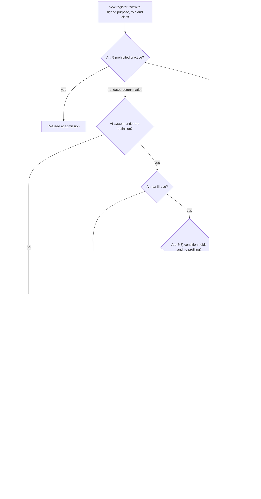

# 20. EU AI Act

## Status
- Owner: the platform owner
- Last reviewed: 2026-09-14

## What this chapter explains

By the end of this chapter the reader knows the state of the EU AI Act the design rests on, which system on the platform is what under the Act and why, which obligations bite today and which from 2027-12-02, who owns each and what evidence will show it is met, and precisely what the objective's word "bulletproof" can and cannot mean.

The chapter answers the Chapter 3 risk theme **classification collapse**: a system claimed as narrow is treated as high-risk because its behaviour or positioning contradicts its declared purpose, or an agent enters service unclassified. Everything here is the design's position for legal and the data protection officer to sign or strike, not legal advice; on 2026-09-14 nothing is built, registered or signed. Operation families and bands are Chapter 15, Wall-E, the doer; the admission pipeline is Chapter 9, Registry, governance and the autonomy contract; the profiling boundary and the workers' side are Chapter 22, Personal data, employees and the works council.

## The position in one paragraph

Classification follows the intended purpose the provider declares, not the privileges an account holds ([EU AI Act page §0](../10-eu-ai-act.md#0-the-position-in-one-paragraph)). The organisation is provider and deployer of Wall-E and Mo; Google provides the Gemini models and the Gemini Enterprise application, which the organisation deploys; Eve's control path is not an AI system. Wall-E's declared purpose is its catalogue, which places it next to, not inside, the Annex III 4(b) employment category. The provider claims the Art. 6(3) derogation, documents it under Art. 6(4), registers under Art. 49(2) before the first write, and adopts Art. 9 to 15 voluntarily as the engineering baseline. Today Art. 4, Art. 5 and Art. 50 bite; Annex III obligations bite on 2027-12-02. "Bulletproof" is declined as a promise and replaced by mechanisms and evidence.

## The regulatory state on 2026-09-13

Dates re-verified on 2026-09-13 ([§1](../10-eu-ai-act.md#1-the-regulatory-state-on-2026-09-13)). Regulation (EU) 2024/1689, "the Act", entered into force on 2024-08-01 and applies generally from 2026-08-02; Art. 4 literacy and the Art. 5 prohibitions since 2025-02-02, the general-purpose AI chapter and penalties since 2025-08-02.

Regulation (EU) 2026/1744, the Digital Omnibus on AI, entered into force on 2026-07-27. It moved **Annex III high-risk obligations to 2027-12-02** as a fixed date that does not wait for standards, rewrote Art. 4 as a duty to support literacy rather than guarantee it, added a prohibition on generating intimate-image abuse and child sexual abuse material from 2026-12-02, and slimmed the Annex VIII registration content. **Art. 50 has applied since 2026-08-02**; the Commission published final Art. 50 guidelines on 2026-07-20.

Two instruments the classification depends on are not final. The Art. 6 classification guidelines exist only as a **draft** of 2026-05-19, final text expected by the end of 2026; its paragraph 12 matters most: excluding high-risk uses in terms of service is insufficient when the positioning says otherwise, and the purpose must be described coherently across all materials. **No harmonised standard** is cited in the Official Journal, so no presumption of conformity exists; EN 18286 on quality management is the first candidate. Penalties under Art. 99 already reach up to 7 % of worldwide turnover for Art. 5 and 3 % for Art. 50.

The classification therefore cannot wait for 2027-12-02: the Art. 6(4) assessment and the registration are due before putting into service, which for Wall-E is its first write at Stage 1 ([register §5](../12-open-decisions.md#5-before-wall-es-stage-1-and-its-later-stages)). The ladder reaches Stage 5 inside that horizon (durations in Chapter 24, Roadmap and cost), so the voluntary baseline is the only way to be ready if a classification flips.

| Obligation | Applies | Position on 2026-09-13 |
|---|---|---|
| Art. 4 literacy, Art. 5 prohibitions | now | briefing designed; Wall-E's negative determination dated, not re-signed |
| Art. 50 transparency | now | mechanism designed (P128), not built |
| Art. 6(4) assessment, Art. 49(2) registration | before the first write | not signed, not registered |
| Art. 9 to 15, 17, 72, 73 | 2027-12-02, for a high-risk row | adopted voluntarily |

## Who is provider and who is deployer (P23)

The provider builds a system and puts it into service under its own name; the deployer uses it under its authority ([§2](../10-eu-ai-act.md#2-roles--which-legal-entity-is-provider-and-which-is-deployer)). For Wall-E, Mo and a future `eve-advisor` the organisation is both, which concentrates every obligation on one entity. Google provides the models, as general-purpose AI model provider, and the tenant app, as a general-purpose AI system. Every future agent declares its role in its register row.

**Which legal entity holds the roles is open** (P23, legal). `Assumption:` the employing entity, or a group-level entity if the platform serves several subsidiaries. The entity that signs the Art. 6(4) assessment registers, and every deployer obligation and the competent authority follow it.

A role trap is recorded: publishing an agent through Gemini Enterprise does not make the organisation provider of Gemini Enterprise, but giving the app a new high-risk purpose would, under Art. 25(1)(c). The register's purpose field is therefore per agent and never for the app.

## Classification, system by system

The register uses five classes: not an AI system, minimal, limited (Art. 50), Annex III-adjacent and high-risk ([§3](../10-eu-ai-act.md#3-classification-per-system)).

### Wall-E: the catalogue is the purpose (P125, P28)

Wall-E is an AI system: a model infers a plan from a prompt. Its action services are rule-only, but they serve that model's purpose, so the system is classified whole ([§3.1](../10-eu-ai-act.md#31-wall-e-wall-e)). An Art. 5 negative determination dated 2026-09-13, to be re-signed by legal, records no manipulation, social scoring, workplace emotion recognition or biometric categorisation, and no image, video or audio generation; it is re-run whenever a family is added.

**The declared purpose** describes an administration assistant that, on a named operator's request or a catalogued trigger, executes explicitly targeted operations on groups, profile fields, organisational units, licences and notifications, and suspends or restores an account **only when the HR process or a named operator has already decided it** ([§3.1.1](../10-eu-ai-act.md#311-the-declared-intended-purpose-the-sentence-the-assessment-rests-on)). Uncatalogued requests run only when one human super administrator has specified them and a second has approved them. It never decides who leaves, is promoted or monitored, never selects people by behaviour, never changes security posture, deletes data, assigns administrator roles or spends money.

That paragraph exists as **one paragraph with one hash**, identical in the register row, the manifest, the agent card, the Gemini Enterprise description and the instructions for use, and CI compares the five, because of the draft guidelines' paragraph 12.

**Super Admin is a credential fact, never a purpose.** The account holds it by the owner's decision P33 ([decision record](../../../decisions/2026-09-13-wall-e-holds-super-admin.md)); it appears in the technical documentation and as risk-register row one, nowhere in the purpose. It does not change the classification but raises the evidence burden, because an account able to do everything is a positioning fact. The answer is the hard-denied list in code with CI ownership outside the agent's repository, the band structure, and the yearly reconciled count of robot admin events matching no catalogue or band B operation, target zero, attached to the Art. 6(4) file.

**The rejected alternative.** "Any super-admin action on a prompt" as the purpose would include user deletion and role assignment, collapse the narrow-task reading and make Wall-E high-risk under Annex III 4(b), needing the full programme and an EU declaration of conformity by 2027-12-02 with no standard to lean on. The objective's sentence describes the credential, not the use.

**Family by family** ([§3.1.2](../10-eu-ai-act.md#312-annex-iii-4b-family-by-family); families in [Wall-E ladder §5](../../wall-e/05-autonomy-ladder.md#5-operation-families)). Notifications, group membership on request, profile fields and organisational-unit moves are administrative attributes; their derogation rests on condition (a), a narrow procedural task. Suspension (F5) touches 4(b), since it executes the consequence of a termination or leave decision; its derogation rests on condition (b), improving the result of a completed human activity, and the plan carries the decision's reference. Licence reclaim by inactivity could touch it; the F7 split and the rule that no AI output selects a person by behaviour (P126, proposed) are Chapter 22's. Band B can reach 4(b) territory, so it stays at L3 permanently with two humans, and a write on a natural person's account must cite a decision record or the lane refuses. Band C only instructs a human.

The result is `annex_iii_adjacent`, role both, registration `pending`, and the registry refuses production status while it is pending: that is "registration before the first write" in practice.

**The assessment and the registration.** The Wall-E section of the EU AI Act page, frozen as a dated file, is the Art. 6(4) assessment ([§3.1.3](../10-eu-ai-act.md#313-art-64-assessment--the-document-its-content-its-owner)). Legal writes and signs it, the DPO signs the profiling part, the AI compliance owner keeps it current; it is due before Stage 1 and re-run within 90 days of the final guidelines. The P23 entity then registers in the EU database, which the platform cannot read, so a registration id that stops resolving is a quarterly review item.

**The high-risk fallback is held ready.** If legal reads band B as widening the purpose, Wall-E becomes high-risk with Annex VI internal control by 2027-12-02, costed as documents rather than a programme.

**State:** P125, the content, is **proposed**; P28, the owner's and legal's signature, is **open** and blocks the first write; P125 depends on P29, the two lists, also open.

### Reclassification triggers (P132)

A classification signed once goes stale as the guidelines and the deferral move. Under P132, proposed and continuous, a fired trigger sets the register row `suspended` until the classification is re-signed ([§3.1.6](../10-eu-ai-act.md#316-reclassification-triggers-p132)); it relies on the `suspended` state of P74 and is first armed at Wall-E's Stage 1.

CI enforces the triggers with a machine signal — a manifest change to a family, ceiling, trigger class or target rule, a purpose-paragraph hash change, a model client entering Eve's control path or `eve-advisor` gaining an input to the gate, an incident flagged as assessed under Art. 73. The AI compliance owner keeps the calendar items: P18 answered "profiling", the final Art. 6 guidelines, a cited standard, 2027-12-02, an unforeseen substantial modification. Training or modifying a model is a policy line, because the answer is "never".

### Eve's control path: not an AI system, as an invariant

Eve's gate, reconciler and console are deterministic SQL and predicates with no model client (Chapter 16, Eve, the independent controller; [Eve HLD §3](../../eve/01-hld.md#3-deterministic-by-absence-not-by-discipline)). The Commission's definition guidelines of 2025-02-06 exclude systems running on rules defined solely by people, so the control path needs no classification or registration and counts as a provider-built oversight measure under Art. 14(3)(a) ([§3.2](../10-eu-ai-act.md#32-eve-control-path--not-an-ai-system-as-an-invariant-eve)). It is held as an invariant: CI forbids a model client in Eve's image, a service-usage denylist blocks the Vertex AI API, and reconciliation checks it stays disabled. A model client would void the determination, suspend the row and stop Eve's approvals counting as human-designed oversight. Eve's build runbook does not yet name the check as this invariant ([register §7 row 14](../12-open-decisions.md#7-values-that-differ-between-pages)).

### eve-advisor: class to be decided (P19)

`eve-advisor`, the report-only reasoning path P34 allows, is not built ([§3.3](../10-eu-ai-act.md#33-eve-advisor--class-tbd-p19-interim-rules-eve-advisor)). It would narrate anomalies about the robot and human administrators; whether that monitors persons in a work relationship is legal's question, **open** as P19. Until answered: nothing is registered, it pages at severity 2 only, names no human without the deterministic rule behind the finding, writes nothing the gate reads, and a build without a class is refused. The design expects Annex III-adjacent under Art. 6(3)(c), but that is legal's call.

### Mo: minimal risk

Mo measures outcomes and proposes changes as pull requests a human merges; it grades plans, not people, and meets no natural person but its reviewers ([§3.4](../10-eu-ai-act.md#34-mo--minimal-risk-mo)). It is minimal risk, role both. Where a model drafts Mo's prose, an "agent-authored" label and file header disclose it.

### The Gemini Enterprise app and the Gemini models

For both the organisation carries deployer duties only; they are supplier rows, not agent rows ([§3.5](../10-eu-ai-act.md#35-gemini-enterprise-app-and-the-gemini-models--deployer-duties-and-the-gpai-one-liner-gemini)). The conversation store is not the platform's Art. 12 log, and its retention is the DPO's (P13, open; interim 30 days, Chapter 12, Data, logging, retention and sovereignty).

The **GPAI position** is one line: *the platform hosts third-party models and never trains, fine-tunes or substantially modifies them; any change reopens the general-purpose AI chapter and Art. 25.* The platform holds Google's Annex XII documentation per model pin.

**The Art. 25(4) written position with Google is still to obtain** (P32, **open**): what information, access and assistance the model provider gives so the organisation can meet its obligations. It is requested, gates Stage 1, and the supplier row says *tbd* until on file ([register §6](../12-open-decisions.md#6-later)).

## The classification gate for every future agent

The platform is infrastructure, not an AI system; every agent on it is its own classification question, which for hundreds of agents must be a gate, not a page ([§3.6](../10-eu-ai-act.md#36-the-platform-and-every-future-agent--the-gate-not-a-page-platform)). The admission step is P75, proposed, in Chapter 9 ([registry §8.2](../05-registry-and-autonomy-contract.md#82-eu-ai-act-registration-art-64-art-49-art-71--p75)); this chapter owns what the gate asks ([§3.7](../10-eu-ai-act.md#37-the-classification-gate-as-a-shape)).

Each agent's entry follows one template, from roles, purpose hash and Art. 5 determination through the Annex III analysis per family to registration id and signatures. The AI compliance owner reviews it before legal signs.

The cost is lead time: no agent claiming the derogation reaches production faster than legal can sign and the entity can register.

## The AI compliance owner (P131)

The platform's responsibility matrix had no row for whoever signs classifications, files registrations, answers an authority and owns the Art. 73 clock. P131, **proposed**, creates the role: legal's designate, or the DPO where legal delegates, accountable for roles, classifications, assessments, registrations, Art. 73 reports, the literacy content and the evidence register ([§4.1](../10-eu-ai-act.md#41-the-ai-compliance-owner-p131)).

It is deliberately **not** the platform owner or an agent owner: a classification signed by the builder is self-assessment an auditor rejects. The minimum is "consulted" at Tier W and "engaged, with a named deputy" at Tier P; the ISMS supplies names, and the role must exist before the super-admin grant ([register §4](../12-open-decisions.md#4-before-the-super-admin-grant)). No owner means no signature and no Annex III-adjacent row in production. Staffing is Chapter 23, Operating model.

## The obligations, theme by theme

Art. 4, 5 and 50 are mandatory now; Art. 9 to 15 are **adopted voluntarily now** for Annex III-adjacent rows and **mandatory from 2027-12-02** for any high-risk row ([HLD §14.1](../01-hld.md#141-eu-ai-act); [§4](../10-eu-ai-act.md#4-obligation-crosswalk--every-obligation-its-owner-its-evidence-its-mechanism)). Each obligation has a mechanism, an owner, an evidence id and a failure consequence; most failures stop a stage rather than raise a finding.

### Risk management: Art. 9

Art. 9 adds risk to persons to the existing security risk work ([§4.2](../10-eu-ai-act.md#42-art-9--the-fundamental-rights-column-and-the-residual-risk-statement)). The adversarial review gains a **fundamental-rights column**, and the risk register gains rows with stated residuals: wrongful suspension, up to the hold window plus the restore's approval time; loss of tools through licence reclaim; the discriminatory effect of inactivity reports on part-time, absent, sick and disabled staff, even when no action follows; the chilling effect of `eve-advisor`; phishing-grade mail from a trusted account; automation bias in approvers, measured rather than eliminated. A promotion record without a residual-risk statement is refused. The agent owner writes, the security reviewer signs, the DPO reviews rows touching employees.

### Technical documentation: Art. 11 and the freeze (P130)

Art. 11 needs the documentation of the version put into service, not a live wiki. Under P130, **proposed**, CI tags the wiki per agent and stage before the stage opens and copies the tree to locked ten-year records; no tag, no stage ([§4.3](../10-eu-ai-act.md#43-art-11--the-annex-iv-crosswalk-and-the-documentation-freeze-p130)). P130 also declares the ladder the record of pre-determined changes, so a promotion within manifest ceilings is not a substantial modification.

The agent sets still carry unapplied propagation edits, so **Art. 11 is not met until the pages are reconciled** (P47), a precondition of the Stage 1 tag.

### Instructions for use: Art. 13

One operator-facing page per agent gives capabilities and limits, the declared accuracy floor of at least 95 % graded correct with current scorecard numbers, the ladder's pre-determined changes, oversight tools and how to read denial reasons ([§4.5](../10-eu-ai-act.md#45-art-13--instructions-for-use-per-agent)). It is part of the stage snapshot and doubles as the briefing text; its filename is *tbd*. Stage 1 does not open without it.

### Human oversight: Art. 14 (P127)

The ladder is the oversight design: limits, the pre-state shown before approval, the veto window and the kill switches K0 to K7 ([§4.6](../10-eu-ai-act.md#46-art-14-and-art-262--oversight-designed-in-overseers-named-caps-per-family-p127)). Eve is not a natural person: at L4 human oversight is the veto window, at L5 it comes after the fact. Art. 14 requires that people can intervene, not that they approve everything; for Annex III-relevant families a human still stays before the effect.

P127, **proposed**, sets **caps**: suspension reaches L4 only on the HR system-of-record event, with holds that never expire outside business hours, and stays at L3 on chat or schedule, because a scheduled suspension has no human decision fresh enough for L4; reclaim of suspended accounts follows suspension; reclaim of inactive accounts, restore and band B stay at L3. CI validates the ladder against the caps, and P127 gates Wall-E's Stage 4. Wall-E's ladder page still reads suspension as "L4, and not before Stage 5" with no HR-event limit or F7 split; the EU AI Act page stands (register row 14).

**Overseers are named roles** with authority, training record and duty window. Against **automation bias**, which no product controls, each operator blindly grades a monthly sample of their own approvals, drawn by the approval surface, never by Mo; low agreement (threshold *tbd*) is a review item, never an automatic consequence for the person. Mo's scorecard does not yet carry the metric. The K0 drill record proves people can stop the system. What the caps mean for employees is Chapter 22.

### Transparency: Art. 50 (P128)

Art. 50(1) requires telling people they deal with an AI system; Art. 50(2) requires machine-readable marking where feasible ([§4.7](../10-eu-ai-act.md#47-art-50--disclosure-on-outbound-messages-on-the-surface-and-the-marking-position-p128)). Secondary sources read the final guidelines as requiring agents to disclose both their nature and whom they act for.

P128 is **proposed and already due**: **disclosure is injected by the action service, never written by the model**, which could be manipulated not to disclose. On every free-text mail, chat post or calendar item the service prepends a fixed line naming Wall-E as an AI system, the entity and whom it acts for, and sets a fixed mail header (name *tbd*); a body it cannot wrap is refused with `disclosure_missing`. Templates, the Gemini Enterprise description, agent card and first session reply carry a fixed AI statement; a CI test asserts line and header. Machine-readable marking of model text is provider-side and unverified: a Google staff forum answer of 2026-08-19 says API text is SynthID-watermarked, the documentation is silent. Signing the Transparency Code as a deployer is legal's *tbd*.

**Still open on Wall-E's pages** ([register §7 row 14](../12-open-decisions.md#7-values-that-differ-between-pages)): the low-level design has no disclosure wrapper and no `disclosure_missing` refusal, and the Gemini Enterprise environment page lacks the description's first line.

### Literacy: Art. 4

A one-page briefing per role covers what the agent can and cannot do, automation bias, the kill switches and how to report misbehaviour ([§4.8](../10-eu-ai-act.md#48-art-4--the-literacy-measure)). It precedes joining an operator group and is refreshed at every stage; a drift job removes untrained members. The AI compliance owner owns content, the ISMS records. For employees, the measure is Chapter 22's worker information.

### Quality management: Art. 17 held ready

Art. 17 is mandatory only for a high-risk row and proportionate to size ([§4.9](../10-eu-ai-act.md#49-art-17--the-quality-management-system-held-ready)). Instead of a second management system, the design maps Art. 17(1)(a) to (m) onto what the ISMS and platform already run. It is built only if a row turns high-risk, and such a row is suspended until the mapping is signed.

### Obligations explained elsewhere

Art. 12 logging is Chapter 12; Art. 26(7), 26(11) and Art. 86, worker information and the explanation path (P129), are Chapter 22; Art. 72 post-market monitoring is Mo's artefacts in Chapter 17, Mo, continuous improvement ([Mo §1.8](../../mo/04-artefacts-and-proposals.md#18-the-art-72-post-market-monitoring-plan-per-high-risk-system)); Art. 73 serious-incident clocks, run voluntarily, are Chapter 11, Monitoring, detection and incident response; Art. 15 robustness is Chapters 10 and 13. The Art. 27 impact assessment does not apply, on the `Assumption:` of a private organisation providing no public service.

## The evidence register

The register lists fifteen artefacts, E-01 to E-15, that an authority, an assessor or the works council would be shown, with location, producer, cadence and retention ([§5](../10-eu-ai-act.md#5-evidence-register)). Records are kept ten years; logs and metrics 400 days, an `Assumption:` until the DPO decides. The AI compliance owner walks it quarterly. Six are gating — assessment, registration, stage snapshot, instructions, worker information and literacy records — and a missing one blocks its stage. On 2026-09-14 none exists in its final, signed or frozen form.

## What "bulletproof" can and cannot mean

**What can be said** ([§6](../10-eu-ai-act.md#6-what-bulletproof-can-and-cannot-mean)): the design holds most of the engineering an Art. 9 to 15 programme needs, often beyond what the Act asks of a system claimed not high-risk — an audit copy outside the tenant, a model-free verifier with halt authority, a ladder of pre-determined changes, a measurement loop that is a monitoring plan by construction, and classification as a precondition of existence. Once the documentation is frozen (P130) and P23, P28, P18 and P19 are signed, it will exceed the Act's engineering expectations for the pilot and meet its legal ones as they stood on 2026-09-13.

**What cannot be promised.** The page's summary counts seven items; its residual list holds eleven, some closed by the organisation itself, and this chapter follows the list.

1. The Art. 6(3) claim rests on **draft guidelines**; closed by re-signing within 90 days of the final text.
2. **No presumption of conformity**; narrowed by an internal assessment against the articles until a standard is cited.
3. How an authority reads **licence reclaim by inactivity**; narrowed by P18 answered in writing.
4. The **Super Admin grant** weighs against the narrow-task reading; narrowed by one purpose hash, the hard-denied list and the zero out-of-catalogue count.
5. Oversight above L3 rests on **Eve, not a person**; narrowed by drills, veto statistics and caps.
6. **Documentation does not match** the system; closed by the Stage 1 tag.
7. **Hundreds of agents** multiply every row; narrowed by the generated export and shadow-agent reconciliation.
8. The **Art. 25(4) position** is not on file; closed by P32.
9. **Marking of model text** is unverified; closed by Google's written statement per model pin.
10. **`eve-advisor`'s class**; closed by legal before any build.
11. **Penalty exposure** is real now, and the first Art. 50 evidence does not exist until Stage 1.

Instead of "bulletproof", the platform promises the mechanisms and the evidence, and lists what the regulator or the guidelines still decide.

## What is unverified, and what closes each item

From the dated list ([§9](../10-eu-ai-act.md#9-unverified-on-2026-09-13-and-what-closes-each-item)): the final Art. 50 guidelines' wording on agents (legal); SynthID on Gemini text per model pin and Google's compliance documentation (Google's written statement, the Annex XII files); whether the Omnibus changed registration timing (legal); the Art. 72(3) template and the final Art. 6 guidelines' date (calendar items); the draft's treatment of systems executing a decision already taken (legal confirms suspension under condition (b)); the competent authority (after P23); national consultation rules (`Assumption:` information before putting into service; HR and legal before Stage 1); SME status (not assessed); the mail header's survival in recipients' systems (the CI test); and accessibility of the operator surface (not assessed).

## What remains

Chapter 19, Threat model and residual risk, records classification collapse as a residual that blocks a gate rather than one accepted: a classification resting on draft guidelines and on the Super Admin grant not being read against the purpose; four unsigned legal answers (P23, P28, P18, P19); no Art. 25(4) position (P32); Art. 11 unmet until reconciliation (P47). Chapter 21, TISAX, tests the same design under certification; Chapter 25, Decisions awaiting the owner, lists who must sign what.

## Key decisions and what to read next

### Key decisions

- **P23 — open** (legal): the legal entity. **P19 — open** (legal): `eve-advisor`'s class. **P32 — open**: the Art. 25(4) position.
- **P28 — content proposed via P125, signature open**: Wall-E's purpose; blocks the first write.
- **P125 — proposed**: Wall-E's Art. 6 path and high-risk fallback.
- **P126 — proposed**, with **P18 open**: the profiling boundary (Chapter 22).
- **P127 — proposed**: Art. 14 caps and overseers. **P128 — proposed, already due**: Art. 50 injection.
- **P129 — proposed**: worker information before Stage 1 (Chapter 22). **P130 — proposed**: the documentation freeze.
- **P131 — proposed**: the AI compliance owner. **P132 — proposed, continuous**: reclassification triggers.
- **P75 — proposed**: no production without registration (Chapter 9). Register row 14 open.

### Canonical pages to read next

- [EU AI Act page](../10-eu-ai-act.md#0-the-position-in-one-paragraph): [§3.1](../10-eu-ai-act.md#31-wall-e-wall-e), [§4](../10-eu-ai-act.md#4-obligation-crosswalk--every-obligation-its-owner-its-evidence-its-mechanism), [§5](../10-eu-ai-act.md#5-evidence-register), [§6](../10-eu-ai-act.md#6-what-bulletproof-can-and-cannot-mean)
- [Platform HLD §14.1](../01-hld.md#141-eu-ai-act); [open decisions §5](../12-open-decisions.md#5-before-wall-es-stage-1-and-its-later-stages)
- [Decision record: Wall-E holds Super Admin](../../../decisions/2026-09-13-wall-e-holds-super-admin.md)
- Next in the brief: Chapter 21, TISAX.
