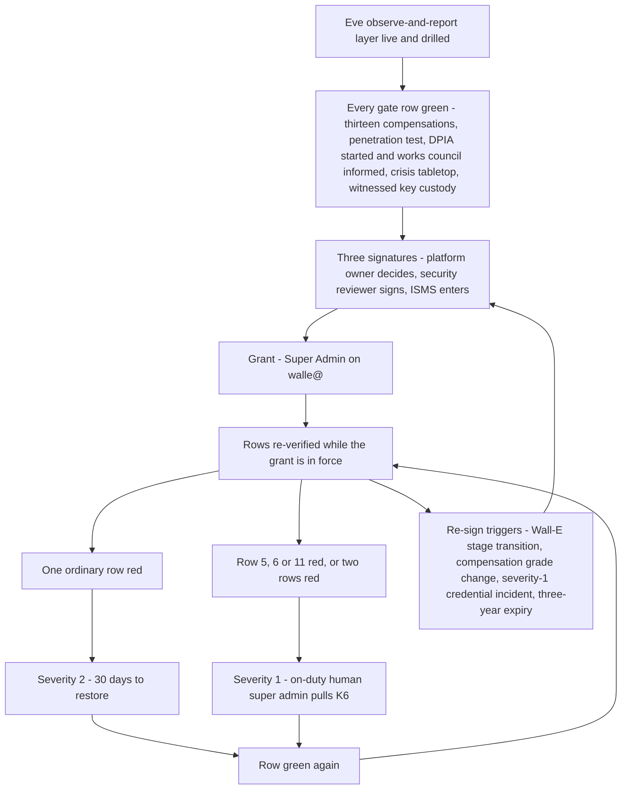

# 21. TISAX

## Status
- Owner: the platform owner
- Last reviewed: 2026-09-14

## What you will understand by the end

The objective asks for a platform that is "TISAX compatible". A platform cannot hold a TISAX label. A site earns one by assessment, and a cloud platform is an asset inside that site's information-security management system (the ISMS). This chapter turns "compatible" into things an assessor can check, and says which of them do not exist yet.

By the end you will know the target label, level and scope; what Google carries and what the platform must show; where the design is strong and where it is unfinished; why separation of duties is the item most likely to stop an assessment; and how the super-admin deviation is signed, policed and re-signed. The design of record is [page 11](../11-tisax.md). Nothing here is built.

## TISAX on 2026-09-13

TISAX is run by the ENX Association for the VDA; its questionnaire is the VDA ISA ([page 11 §1](../11-tisax.md#1-tisax-on-2026-09-13-verified)). Four verified facts shape the rest.

**The catalogue is changing.** ISA 6.0.3 (published 2024-04-25) is in force. ISA2027 (published 2026-07-01) is the basis of assessments ordered from 2027; the last day to order on ISA 6 is 2026-12-31. ISA2027 requires organisations with high protection needs to verify suppliers "through TISAX labels or equivalent assessments", and wants a rationale for every "aspects considered" item. Nothing is built in 2026, so any assessment will be ordered on ISA2027.

**Labels set levels.** Of the twelve assessment objectives, Confidential leads to AL2, a plausibility check of the self-assessment with evidence review and a web-conference interview; Strictly confidential leads to AL3, with on-site observation and unplanned interviews. Maturity runs from 0 to 5, and most controls target 3, "established". A result is valid for three years.

**Scope is a site.** Anything processed outside the assessed site's scope is an external IT service, governed by 1.2.4, 1.3.3, 5.3.3 and 5.3.4.

**Google's label is per region.** Google LLC is a participant under scope SYN0NK (assessments ATTRRN-1 and ATTRRN-2). Its Google Cloud regions, `europe-west1` among them, and Workspace data regions carry Strictly Confidential and Very High Availability labels "for data classified as secret". The public page names no individual service, and the result is retrievable only over the ENX portal.

## The target: label, level, scope and catalogue (P133)

P133 is proposed and supplies the value of the HLD's P20; the ISMS confirms it before any order ([page 11 §2](../11-tisax.md#2-the-target--label-level-scope-catalogue-p133)).

**Label Confidential.** Assumption: the ISMS adopts it. The platform's evidence, content and control data map to Confidential; only the secret class (credentials, the surrogate-key mapping) maps higher, and a secret store alone does not set a site's objective, which follows the protection need of information handled for partners. If the ISMS's scheme classed Wall-E's audit table, the content logs, the identity logs or Gemini Enterprise conversation history as secret, the label would become Strictly confidential. That would raise the level to AL3, make the witness organisation and the key safe on-site observation items, and reopen the Google-managed-key exceptions (P119), Assured Workloads (P110) and its revisit trigger (P12). Without a signed classification mapping the order is not placed.

**No availability label.** Wall-E, Eve and Mo are not critical IT services; the manual Admin console is Wall-E's continuity plan. An availability label would bring Google's regional service levels into the organisation's own assessment for no partner's benefit.

**AL2**, with AL2.5 (full remote) accepted if the audit provider proposes it, because it keeps the AL3 path open at no design cost.

**Scope location tbd.** Assumption: the site where the platform owner and IT security sit. Google Cloud and every third party are external IT services of that scope. The witness organisation, a separate Google organisation operated by IT security, is an asset of the same site, not a second location.

**ISA2027 with the 6.0.3 cross-reference**, mandatory column for high protection need, maturity 3 on every applicable control. Assumption: ISA2027 keeps the 6.0.3 numbering; a reading of the redline found the same 46 controls, 44 edited. NIS2 goes to the legal register below. P133 rejects Strictly confidential at AL3 now: no partner requirement asks for it, and it would tie the platform to an on-site assessment of a site nobody has named.

## Module scope (P134)

**Information Security applies in full**, chapters 1 to 7 ([page 11 §3](../11-tisax.md#3-module-scope--data-protection-and-prototype-protection-p134)).

**Data Protection is not an assessment objective now.** Its labels are written for an Art. 28 GDPR processor. The platform administers the organisation's own tenant and employees' accounts, so the organisation is controller and 7.1.2 with its GDPR programme is the frame; the module's 9.x questions serve as the DPO's checklist of what the platform owes, almost none of it started (Chapter 22, Personal data, employees and the works council). The answer changes for any hosted agent that processes a customer's or an OEM's data on that customer's behalf: for that agent's scope the module becomes an objective. Hundreds of agents make that likely, so a register field enforces it rather than memory. A row whose purpose names third-party-controller data sets `tisax_dp_scope` and cannot reach production without a dated DPO entry ([page 05 §3.2](../05-registry-and-autonomy-contract.md#32-mandatory-fields-per-tier)). Page 11 added the field before page 05's schema carried it; register row 7 resolved that by adding it to page 05, optional until the first processor-role agent ([register §7](../12-open-decisions.md#7-values-that-differ-between-pages)). The gate check itself is still a build item.

**Prototype Protection does not apply**: no agent touches prototype parts, vehicles or events, recorded as a negative determination dated 2026-09-13. The admission gate's text check is detection-grade; the real control is the DPO and ISMS review of every new row.

## Shared responsibility with Google (P135, P32)

### The split

Google is one external IT service with two contractual halves, Google Cloud and Google Workspace, and one TISAX result ([page 11 §4.1](../11-tisax.md#41-the-shape)). The split is kept per control group in three columns ([§4.2](../11-tisax.md#42-the-responsibility-split-per-control-group)): Google holds physical security, the underlying network, default encryption and its personnel controls, evidenced by its result and reports; the platform configures and evidences every binding, key, sink, allow-list and drill; the ISMS owns policies, contracts and names. Most rows are shared, and the split records whom the assessor asks first. Control 1.2.4 wants the division "verifiably documented", so it stays dated: when a Preview product the platform uses reaches general availability under new terms, its row is re-dated within 30 days of the notice.

### The supplier file and per-service coverage

Page 11 §4.3 is the supplier file for Google ([§4.3](../11-tisax.md#43-the-supplier-file--google)). Two fields decide whether an assessor accepts it. The **result share**: the public compliance page is not evidence; the ISMS's ENX account must request the SYN0NK result and file it, a control that does not exist until someone does. And **per-service coverage**, where the design refuses to assume. Because the result names no service, every service the platform relies on carries coverage tbd: Agent Runtime and its Google-managed tenant project, Gemini Enterprise (whose own compliance listing names ISO, SOC and BSI C5 reports, not TISAX), Model Armor floor settings, Agent Gateway, Agent Registry, BigQuery `EU`, the organisation-level logging buckets, Google SecOps in the EU and the Gemini models. Each closes only from the result share or Compliance Reports Manager, through P32, which is open. The model is its own supplier line, with no-training and retention terms confirmed per model pin and the Art. 25 position of Chapter 20, EU AI Act. The contracting entity, data-processing terms and service-level references wait for contract review. Treating Google's public page as proof is the mistake an assessor catches first.

### The segregation note (5.3.4)

Control 5.3.4 asks how a shared service keeps tenants apart, and the platform can only answer candidly ([§4.4](../11-tisax.md#44-the-segregation-note-534-what-it-will-say)). Agent Runtime engines run in a Google tenant project the organisation cannot inspect; Gemini Enterprise is multi-tenant; BigQuery `EU` and Model Armor floor settings are shared infrastructure with per-project isolation. The organisation sees its own audit logs, Access Transparency and Access Approval entries, and its IAM and policy state; it cannot see other tenants or Google's internal segregation controls. A tenancy failure at Google would be invisible until Google disclosed it. No platform control changes that, so the ISMS accepts the residual or does not; it is a row of the risk register in Chapter 19, Threat model and residual risk.

## The control mapping, as themes

Page 11 maps every applicable control and gives each one status: **doc** (documentation finishable now), **built-by-design** (evidence exists once built), **missing control** (no mechanism, and no document can supply one) or **ISMS** (outside the platform's authority) ([§5](../11-tisax.md#5-control-by-control-mapping)).

**Strong once built**, at maturity 3 or better ([objective review §6.2](../00-objective-review.md#62-tisax)):

- administrator-activity logging (5.2.4): every robot action on its own audit row, with Google's admin stream copied beyond the reach of the robot and the tenant's super admins;
- keyless identity and enumerated resource-level grants (4.1, 4.2), with privileged access management as review evidence;
- change control separated from what it gates (5.2.1, 5.3.1): autonomy as versioned data, CI-only deploys, a validator owned outside the agent repository;
- cryptographic proof of approval (5.1), on an HSM signing key;
- technical self-audit (5.2.6): denial suite, drift job, monthly kill-switch drills, injection suite.

Arguing each rejected alternative in place already meets ISA2027's rationale rule.

**Unfinished**, at the layer an assessor reads first: policies by reference, separation of duties, the Google split as practice rather than text, the asset register and classification mapping, the risk register, the incident process with a staffed recipient for Eve's reports, pre-production, vulnerability management, backup proved by a restore, the legal register and the DPIA. Nothing is architecturally wrong; it is unfinished.

## Separation of duties: the item most likely to stop an assessment

On 2026-09-13 one person is platform owner, deployer, operator, approver, grader, security reviewer, Eve's owner, Mo's owner and the recipient of Eve's pages. At high protection need, 1.2.2 asks explicitly for separation of duties, and a design reviewed only by the person it constrains fails that question however good it is ([HLD §14.2](../01-hld.md#142-tisax)).

The design answers with a precondition, not a promise to hire ([page 11 §7](../11-tisax.md#7-separation-of-duties-and-the-staffing-minimum-per-stage-p137); P137, proposed). An incompatibility matrix names roles one person may never combine, each stage has a minimum number of distinct humans, a CI check tests the matrix against group memberships daily and on every merge, and the tier gate refuses a tier while a pair collides or a role has no name. Tier R may run on one person with self-review recorded as such and accepted by the ISMS in writing; nothing above it may. The counts, the one dated exception the ISMS may grant and the training that makes a role holder count are Chapter 23, Operating model; the tier gate is Chapter 24, Roadmap and cost. Until the ISMS supplies names, 1.2.2 is a missing control, and no document closes it.

## The super-admin deviation (P136)

### What is deviated

The owner decided on 2026-09-13 that Wall-E holds Super Admin (P33), and nothing here re-argues it. In ISA terms it deviates from one control, 4.2.1 least privilege ([page 11 §6.1](../11-tisax.md#61-what-the-deviation-is-in-isa-terms)): a machine account holds a role that cannot be scoped to an organisational unit or a privilege subset, and the Workspace-side refusal that bounded the earlier custom role is gone. Privileged authentication (4.1.2) and privileged-activity logging (5.2.4) are met, not deviated. An assessor will also cite Google's guidance that super admins be few, human and not used daily; the answer is that daily use is bounded to the catalogue and the two-person generic lane, every action traceable to a human prompt or catalogued trigger, none autonomous at super-admin class. The thirteen compensations as a design argument are Chapter 15, Wall-E, the doer.

### The record and its three signatures

The deviation is one file, the P33 [decision record](../../../decisions/2026-09-13-wall-e-holds-super-admin.md), and the assessor is handed it and the evidence it points to, nothing else ([§6.2](../11-tisax.md#62-the-record--decisions2026-09-13-wall-e-holds-super-adminmd)). Its sections run in order: decision; deviation statement against 4.2.1 with the loss table unsoftened; residual risk (a leaked token or interactive login is a tenant compromise with a path into the GCP organisation); compensating controls with their status on the day of signing; the precondition rule; review terms; signatures.

Three signatures, each doing a different job: the **platform owner decides**; the **security reviewer**, who is not the platform owner, **signs** the deviation and accepts risk row R-01; the **ISMS enters** it in the site's risk register. 1.2.2 forbids self-signature, so a record signed only by its beneficiary is not a control. On 2026-09-14 only the decision is signed; the reviewer's signature waits for a second person in that role. Page 11 names the platform owner as R-01's owner while the decision record names the security reviewer ([page 11 §10](../11-tisax.md#10-the-risk-register-p140)).

### Compensations as gate conditions

Every compensation is a gate condition ([§6.3](../11-tisax.md#63-compensations-as-preconditions--the-checklist-the-gate-reads)). The thirteen HLD items become rows of Wall-E's gate checklist, each with a stated meaning of green, a verification, a date and a signer, joined by a penetration test with no open critical or high finding, a dated tabletop of the abused-credential crisis scenario and a witnessed hardware-key custody record. Page 11's checklist carries a fourth added row that P136's wording omits: a started DPIA with dated works-council information (Chapter 22, Personal data, employees and the works council). The grant runbook refuses to proceed while any row is not green, and the order is fixed: Eve's observe-and-report layer live and drilled, then the grant, then Wall-E's Stage 0 with every write family at L1. On 2026-09-13 no row is green, and several wait on register decisions ([register §4](../12-open-decisions.md#4-before-the-super-admin-grant)): the two lists (P29, open), the witness organisation (P14, open), the SIEM choice (P10, open), the perimeter spike (P3), multi-party approval and the roster (P66, P68, proposed).

### After the grant: the red-row rule

Any one row red is a severity-2 finding with 30 days to restore it. Two rows red at once, or row 5 (detection as the primary control), row 6 (account hygiene) or row 11 (the second human outside the Wall-E line) red at all, is severity 1: the on-duty human super admin pulls K6, removing Super Admin from the robot, until the row is green again. K6 is Chapter 15's and severities are Chapter 11's. The design does not argue the three rows individually; they are the rows the rest depend on, the tier's primary control, the credential's custody and the only recipient of reports about the administrator. Neither page 11 nor the decision record says what happens to an ordinary row still red on day 30; only for an open critical penetration-test finding does page 11 continue to K6.

### Keeping the record honest over time

A deviation with no expiry becomes the norm. The record is reviewed quarterly with the super-admin roster review, re-signed at every Wall-E stage transition and whenever a compensation's grade changes, and expires with the assessment result after three years or earlier on any severity-1 incident involving the credential. Register row P136 words the quarterly event as a re-signature, where page 11 and the decision record call it a review ([§6.2](../11-tisax.md#62-the-record--decisions2026-09-13-wall-e-holds-super-adminmd)). And the limit stays in the record: however strong the compensations, an assessor may still refuse maturity 3 on 4.2.1 for a super-admin robot. Only the assessment settles that.

## Assurance: penetration test, internal audit, management review (P139)

The platform checks itself continuously; 1.5.2 also wants independence, so P139, proposed, adds three activities nobody on the platform performs for themselves ([page 11 §9](../11-tisax.md#9-penetration-test-internal-audit-management-review-p139)).

**Penetration test**: bought, grey-box, owned by IT security, never run by the platform or agent owner. Its scope is every surface where a request becomes an action or an approval: Wall-E's two action services, the approval surface, the Gemini Enterprise share and gateway, Eve's control surfaces, the kill-switch endpoints and the witness push path; Google's infrastructure is out of scope. It is due before Stage 1 of any Tier P agent, for Wall-E before the grant; a scoped test of the approval surface and action service comes before Stage 1 of the first Tier W agent, because the first write is the first exposure; then annually and on any new lane or front door.

**Internal audit** by the ISMS's auditor, never the platform owner nor the deviation's signatory, sampling the mapping against live evidence, annually, first before the assessment order and after any severity-1 incident. An open finding on 1.2.2 or 4.2.1 holds the order.

**Management review** quarterly, covering the ladder state, risk register, deviation, security-operations metrics, supplier tbd items and training, and annually into the ISMS's review, minutes kept ten years. Two quarters without one and the ladder does not raise.

## The legal and contractual register (P141)

Control 7.1.1 asks which instruments apply. P141, proposed, keeps one register owned by the ISMS with legal ([page 11 §11](../11-tisax.md#11-the-legal-and-contractual-register-p141)): the GDPR; the EU AI Act as amended by the Digital Omnibus (Chapter 20); national labour and works-council law, country tbd; NIS2, applicability tbd, with ENX's crosswalk of 2025-06-29 if it applies; the Google Cloud and Workspace agreements and data-processing terms, titles tbd; the TISAX participation terms of 2023-07-16, held by the ISMS (Assumption); customer and OEM security clauses, which set both the label and the supplier-verification bar; and internal policy ids. One row is an admission: several products the design relies on, Cloud Run Agent Identity and PAM two-level approval among them, are Preview products whose support and service-level terms differ from general availability, listed in full at build. An applicable instrument missing from the register is a finding on 7.1.1.

## Documentation versus controls that do not exist

Page 11 splits "compatible" into two columns, each with the gate it blocks ([§12](../11-tisax.md#12-documentation-task-versus-control-that-does-not-exist)). Writing finishes the first: the target and module statements, the mapping, the Google split, supplier file and segregation note, the deviation text, the separation matrix, the training outline, the supplier procedures as text, the risk and legal registers, the cryptography table, the continuity statement, the incident page, the first decision files and the policy-id table.

Only building, hiring or buying finishes the second. It holds the second, third and fourth humans; the compensations built; the result share and coverage answers; a CI-enforced register; Data Access logs with decided retention and a SIEM feed; pre-production, a sandbox tenant, a scanning gate and pinned dependencies; one recorded restore; a staffed recipient of Eve's reports; the data-protection artefacts; the penetration test and first audit and review; the first run of the supplier procedures; the witness organisation; and the separation and `tisax_dp_scope` gate checks. Roughly half of "compatible" is writing; the other half is not.

The **evidence pack** is assembled per control group from the evidence bucket and git by one export job the platform owner runs before the assessment and after every internal audit, kept ten years ([§13](../11-tisax.md#13-the-evidence-pack-per-control-group)). For 4.1 and 4.2 it holds IAM exports, privileged-access grant logs, the committed roster with Eve's daily diff, the quarterly review record and the deviation record; for 3.1 the result share and custody record; for 5.2 pull requests, attestation logs, scan triage, bucket lock states, the restore record and the penetration-test report.

## What is unverified, and what closes it

([§15](../11-tisax.md#15-unverified-and-what-closes-each-item))

| Unverified | Closes when |
|---|---|
| ISA2027 keeps 6.0.3 numbering; exact titles of 5.3.3 and 5.3.4; Data Protection module numbering | the ISMS reads the ISA2027 workbook and the redline of 2026-08-07 |
| Google's per-service coverage | the ENX result share, Compliance Reports Manager, P32 |
| Contract titles, versions and contracting entities | contract review by the ISMS and procurement |
| The operating site and its current label; classification scheme, policy ids, risk scale, cryptography standard | the ISMS |
| NIS2 applicability | legal |
| Maturity 3 on 4.2.1 with the deviation | the assessment itself |

## Key decisions and what to read next

States on 2026-09-14:

- **Decided:** P33, Wall-E holds Super Admin; the security reviewer's and ISMS's deviation signatures pending.
- **Proposed:** P133 the target (P20's value; Confidential an Assumption the ISMS confirms); P134 module scope and the register field; P135 the mapping page, supplier file and segregation note; P136 the deviation record; P137 separation of duties as a counted minimum; P139 the assurance cadence; P140 the risk register; P141 the legal register.
- **Open:** P32 per-service coverage with the Art. 25 position; P29 the two lists; P14 the witness; P10 the SIEM; P13 retention behind the 400-day Assumption.
- **Spike:** P3, the perimeter behind gate row 8.

P136 and P139 gate the super-admin grant, P137 Tier W and the grant, and P133 to P135, P140 and P141 the assessment order ([register §6](../12-open-decisions.md#6-later)). Pointers only: the risk register is Chapter 19, supplier onboarding Chapter 14, Scale and AGI readiness, training Chapter 23.

Read next: [page 11](../11-tisax.md) in full; [the deviation record](../../../decisions/2026-09-13-wall-e-holds-super-admin.md) and [the gate checklist](../11-tisax.md#63-compensations-as-preconditions--the-checklist-the-gate-reads); [the responsibility split](../11-tisax.md#42-the-responsibility-split-per-control-group); [HLD §14.2](../01-hld.md#142-tisax) and [the tier gate](../01-hld.md#04-the-tier-gate-what-must-exist-before-a-tier-opens).
