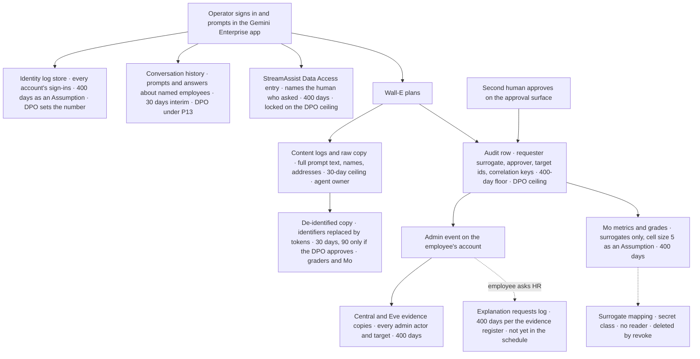

# 22. Personal data, employees and the works council

## Status
- Owner: the platform owner
- Last reviewed: 2026-09-14

## What you will understand by the end

The platform acts on employees' accounts and records the people who operate it. This chapter is for the data protection officer (DPO), the works council, HR and legal.

By the end the DPO will know the organisation's position as controller, what the platform owes the DPIA and the records of processing and how far each input has got, and where personal data sits and for how long. The works council will know which of Wall-E's actions affect employees and how they are bounded, what is recorded about operators and what may never follow from it, when workers are informed and consulted, and how an employee obtains an explanation. Both will know which decisions are still open. Nothing here is built.

## 22.1 The position: controller, and internal processing

The platform administers the organisation's own tenant and employees' accounts, so the organisation is the **controller** and the platform its internal processing. The frame is therefore the organisation's existing GDPR programme and the data-protection control inside its ISMS, not a separate regime for AI ([11 §3](../11-tisax.md#3-module-scope--data-protection-and-prototype-protection-p134)).

It holds only while every agent processes data for the organisation itself: an agent processing a customer's data on its behalf is a processor, and a register field with a dated DPO entry stops it reaching production as internal processing (P134, proposed; Chapter 21, TISAX).

## 22.2 What the platform owes the DPO, and where each input stands

The DPIA and the records of processing are the DPO's; the platform supplies the facts they rest on, and on 2026-09-13 most exist only as design ([11 §3](../11-tisax.md#3-module-scope--data-protection-and-prototype-protection-p134), [HLD §14.2](../01-hld.md#142-tisax)).

| Input | Status on 2026-09-13 | What is missing |
|---|---|---|
| Records of processing, one entry per agent | not started | entries for reads at Stage 0, writes from Stage 1, band B, Mo's metrics, the content logs and the identity log store |
| DPIA | not started | the DPIA itself; the platform supplies the residency table, the store inventory, the autonomy ladder and the worker-consultation record |
| Transfers | inputs exist | the DPO's assessment of the residency exceptions, the model's processing location and Google's sub-processors |
| Data-subject requests | store list exists | the written procedure and the query per store |
| Breach process | designed | operation; the path is Chapter 11, Monitoring, detection and incident response |
| Deletion capability | to build | the `revoke` operation and its return-and-removal record |

**The DPIA is the longest lead item.** The read-only stage already processes personal data on every employee. Wall-E's page calls that processing aggregated per organisational unit ([Wall-E weakness 11](../../wall-e/ARCHITECTURE.md#11-known-structural-weaknesses)), while Mo's design records per-person reads ([Mo open decisions](../../mo/08-open-decisions.md)). Autonomous action is a second processing activity; both need assessing, the reads before the first report. Three Gemini Enterprise project stores are covered once, by the first Tier W agent's DPIA, and later agents inherit it ([03 §14](../03-gemini-enterprise-environment.md#14-retention-and-personal-data-of-the-front-door)).

**Transfers.** The TISAX checklist refers to "the two residency exceptions" ([11 §3](../11-tisax.md#3-module-scope--data-protection-and-prototype-protection-p134)), while page 08 keeps six dated exception rows ([08 §7.2](../08-data-logging-retention-sovereignty.md#72-the-compensating-set)); the DPO should work from the six. Sovereignty is Chapter 12, Data, logging, retention and sovereignty.

**Data-subject requests.** The store inventory is the map a request is answered from ([08 §2.2](../08-data-logging-retention-sovereignty.md#22-the-store-inventory)). A locked evidence store cannot delete early, so a request against one is answered by disclosure, not deletion, which the DPO's ceiling decision should state in writing ([08 §5.1](../08-data-logging-retention-sovereignty.md#51-floor-ceiling-and-the-lock-trigger)). Minimisation keeps this lawful: locked stores hold only who requested, who approved, what changed and on whom; content that would amount to a profile sits in a never-locked 30-day store.

## 22.3 Where a person is identifiable along one request

The diagram follows one request from an operator's prompt to a change on an employee's account; each store has its own retention and decision owner.

The `StreamAssist` Data Access entry is the only log that names the human behind a request ([03 §13](../03-gemini-enterprise-environment.md#13-audit-logging-of-the-app-itself)); the correlation keys carry that human, as a surrogate, into every audit row beside the approver and the target's id ([07 §5](../07-monitoring-detection-incident-response.md#5-the-correlation-contract)). An investigator can go from an employee's complaint to the prompt, the approval and the Google event, so a breach filing can count data subjects, and the audit trail is personal data about operators as much as targets.

Graders read content only after de-identification: one template replaces recognised identifiers with deterministic tokens and redacts credentials ([08 §6.3](../08-data-logging-retention-sovereignty.md#63-the-de-identify-standard-for-logs-and-the-content-bucket-readers)). Free text outside the recognised patterns stays, because a grader has to read the prompt. De-identification reduces identifiability without removing it.

The identity log store, every tenant account's sign-ins, is the densest personal-data store on the platform, kept apart so the DPO can set its ceiling without touching the audit lock; its legal basis, legitimate-interest balancing, is an `Assumption:` the DPO must confirm.

## 22.4 The actions that affect employees, and how they are bounded

Most of Wall-E's catalogue changes administrative attributes: group membership, profile fields, organisational units. Two families change whether a person can work. **F5 suspends an account; F7 removes or assigns a licence** ([Wall-E ladder §5](../../wall-e/05-autonomy-ladder.md#5-operation-families)). Restore (F6) is permanently human-approved, so a loop cannot suspend and restore unnoticed.

Wall-E suspends only when HR or a named operator has already decided (Chapter 20, EU AI Act; [10 §3.1](../10-eu-ai-act.md#31-wall-e-wall-e)). A band B write on a natural person's account must also cite the decision record, or the lane refuses it (P125, proposed), leaving an audit row that shows the decision was a human's.

**The caps in practice.** Under Chapter 20's caps (P127, proposed), an autonomous suspension is possible only on the HR system of record's event, and even then waits in a vetoable hold that never expires outside business hours. A suspension asked for in chat or on a schedule, and licence removal from a suspended account, needs a human approval first. The residual, stated plainly: a wrongful suspension can last the hold window plus the restore's human approval, up to four business hours ([10 §4.2](../10-eu-ai-act.md#42-art-9--the-fundamental-rights-column-and-the-residual-risk-statement)). Wall-E's ladder page does not yet carry these caps (register row 14, open).

## 22.5 The profiling boundary (P18, P126)

Selecting accounts for licence reclaim by last sign-in and usage would evaluate people's behaviour at work; that may be profiling, and profiling makes an Annex III-adjacent system high-risk whatever else holds. P18 asks legal and the DPO whether it is, and on 2026-09-14 it is open ([12 §5](../12-open-decisions.md#5-before-wall-es-stage-1-and-its-later-stages)).

The design does not wait for the answer, nor rely on the untested argument that a single timestamp threshold is not profiling. Inactivity heuristics foreseeably discriminate against part-time staff and people on leave, off sick or disabled, a fundamental-rights risk whether or not it is profiling ([10 §3.1.4](../10-eu-ai-act.md#314-the-profiling-question-answered-by-design-p126)). P126 (proposed) builds the boundary instead.

- **No AI output selects a person by behaviour.** F7 is split. `F7-suspended` removes licences from accounts someone else has already suspended, so Wall-E chooses nobody. `F7-inactive` removes licences from active accounts, and only from ids a human has listed explicitly.
- **The inactivity report is a read artefact for a human**, whose selector is briefed on its discriminatory risk; the DPO reviews the selection rule in the DPIA.
- **Two enforcement points.** CI refuses any playbook that binds a usage or sign-in report as a write target source; the action service refuses an `F7-inactive` plan whose targets a human did not enumerate, and pages at severity 2.
- **Held at L3 until answered.** `F7-inactive` needs a human approval until legal and the DPO answer P18 in writing. If the answer is "profiling", the design recommends removing `F7-inactive` rather than reclassifying Wall-E as high-risk; the owner chooses.

The cost is operational: reclaiming idle licences stays a human task. Two residuals remain. The bias sits in the report even when no action follows, and an inactive but employed person loses access until they ask for it back.

## 22.6 Operators as data subjects: the limits on monitoring

Operators and approvers are employees too. Their prompts sit in the conversation history and content logs, their identities in every audit row, and their competence and training records qualify them as named overseers ([10 §4.6](../10-eu-ai-act.md#46-art-14-and-art-262--oversight-designed-in-overseers-named-caps-per-family-p127)). An overseer without a training record leaves the operator group at the next stage transition: a consequence of a missing qualification, never of how the person has performed.

**The self-grading sample.** The automation-bias control of Chapter 20 is the platform's one deliberate measurement of individual judgement. Its limit: a fall below the threshold (*tbd*, Mo owner) opens a severity-3 review item, **never an automatic consequence for a person**.

The design has not resolved one tension. Mo publishes aggregates only, with a minimum cell size of 5 as an `Assumption:`, and by Mo's own rule an aggregate over a single surrogate is a person ([Mo §4](../../mo/02-identity-and-access.md#4-surrogate-keys)); a per-operator agreement metric is exactly that. Who may read it, and whether the works council sees it, belongs in the reader-set decision Mo's page holds open (M-3).

**Reports that name people.** Until legal classifies `eve-advisor` (P19, open), it names no human without the deterministic rule behind the finding ([10 §3.3](../10-eu-ai-act.md#33-eve-advisor--class-tbd-p19-interim-rules-eve-advisor)). A report about the administrator goes only to the second human, never to the person it concerns ([Eve LLD §15](../../eve/03-lld.md#15-the-reporting-contract)). The chilling effect of monitoring administrators is named as a fundamental-rights risk, with no residual stated until P19 is answered.

## 22.7 Workers: information, consultation and the explanation path (P129)

### When workers are told

P129 (proposed) moves worker information and consultation from Stage 3 to **before Stage 1 of any Tier W agent that acts on employee accounts**, and keeps it as a precondition of the super-admin grant ([10 §4.10](../10-eu-ai-act.md#410-art-267-2611-art-86--workers-and-the-explanation-path-p129); [HLD §0.4](../01-hld.md#04-the-tier-gate-what-must-exist-before-a-tier-opens)). The AI Act's workplace information duty binds high-risk systems only from 2027-12-02 but is adopted now; GDPR Art. 88 and national monitoring rules apply regardless; and a council told at Stage 3 would have been bypassed for two stages. Wall-E's decision register carries the new timing, but its prerequisites page still says the question blocks Stage 3 ([Wall-E decision 8](../../wall-e/09-open-decisions.md#needed-before-stage-1-the-first-real-write); [prerequisite D7](../../wall-e/PREREQUISITES.md#1-decisions-to-close-first)).

Which national labour and works-council law applies is *tbd*, because the operating site's country is not fixed ([11 §11](../11-tisax.md#11-the-legal-and-contractual-register-p141)). Where that law requires consultation rather than information, the design keeps a consultation record, marked `Assumption:`.

The information pack, owned by HR and communications with the DPO and legal, explains the purpose, the caps, what Wall-E never does, what is logged and the explanation path. A separate employee notice, owned by the DPO, names Wall-E as an AI system acting on accounts, what it never decides, and a contact. Stage 1 does not open without the date of both and an existing explanation log.

### What the works council is shown, and when it is told of incidents

The evidence register (Chapter 20) lists what an authority, an assessor or the works council is shown ([10 §5](../10-eu-ai-act.md#5-evidence-register)); closest to employees are the worker pack, notice and explanation log, the fundamental-rights risk rows and the oversight roster. It does not say which rows the council receives, a choice to make with the council rather than for it.

When an incident touches employee data, communications and HR inform employees and the works council ([07 §9.1](../07-monitoring-detection-incident-response.md#91-roles-and-raci)). Where national law requires it (`Assumption:`), employee representatives take part in the monitoring aspects of the tabletop exercises and receive the post-incident review ([07 §12.3](../07-monitoring-detection-incident-response.md#123-tisax-16-and-the-works-council)). The clocks, including the GDPR 72-hour path with the DPO accountable, are Chapter 11's.

### How an employee obtains an explanation

No decision on the platform is solely automated: suspension follows a human decision, and licence reclaim from active accounts a human target list. The Art. 86 path exists all the same. The employee asks HR, which obtains from the operator surface the frozen plan's rationale, pre-state, trigger and decision reference, redacted of other persons and the raw prompt, and answers within a number of business days still *tbd*. Every request is logged and counted in Mo's post-market monitoring loop; one unanswered past the deadline is a severity-3 finding.

## 22.8 The DPO's decisions and engagement points

The platform RACI shows the DPO as consulted for Tiers C to W and engaged before Stage 1 at Tier P ([HLD §0.3](../01-hld.md#03-who-exists-on-2026-09-13-and-the-roles-the-platform-needs)). That understates the load: several DPO decisions gate the first Tier W write, not only the super-admin grant.

- **The retention ceiling (P13, open).** One number per data class, due before Stage 1 of any Tier W agent, and the trigger that locks the evidence stores ([08 §5.1](../08-data-logging-retention-sovereignty.md#51-floor-ceiling-and-the-lock-trigger)). It also settles conversation retention, 30 days as the interim `Assumption:`; the schedule is Chapter 12's.
- **P18, with legal.** The profiling answer of section 22.5.
- **The de-identified copy.** Whether graders may keep it for 90 days rather than 30, a request recorded but not assumed (Chapter 12).
- **The GDPR breach path (P101, proposed).** The DPO is accountable for the notification decision from Stage 1 of any Tier W agent (Chapter 11).
- **The DPIA, the records of processing** (section 22.2), the risk-register rows that touch employees, and the admission entry for processor-role agents (section 22.1).

## 22.9 Still open

- The explanation-request store has no row in the retention schedule. The evidence register keeps the log 400 days, but page 08 does not list it (register row 14, [12 §7](../12-open-decisions.md#7-values-that-differ-between-pages)). Until it does, the store has no factory-set retention and no drift check.
- The explanation deadline and the country whose labour law applies are *tbd* (P141); the legal entity the employee notice must name is open (P23).
- The reader set for Mo's metrics, and so for the per-operator self-grading metric, is open (M-3).
- The HLD tier gate lists "the DPIA" among the super-admin preconditions, while Wall-E's setup gate asks only that it has started ([HLD §0.4](../01-hld.md#04-the-tier-gate-what-must-exist-before-a-tier-opens); [Wall-E setup](../../wall-e/SETUP.md)). The DPO and the owner need to agree which it is.

## Key decisions and what to read next

Register states on 2026-09-14:

- **Open:** P13 the DPO's retention ceiling; P18 whether F7 inactivity reclaim is profiling (DPO and legal); P19 the reporting path's class (legal); P23 the legal entity.
- **Proposed:** P134 the controller position and the processor-role register field; P126 the profiling boundary; P127 the oversight caps and the review-only self-grading; P125 the decision reference on band B writes; P129 worker information before Stage 1 and the explanation path; P101 the GDPR path; P106 the lock trigger; P52 and P113 conversation retention, both dependent on P13; P141 the legal register.
- **Open on the agent pages:** register row 14, including the missing explanation-request store; M-3 on Mo's page.

Read next: [11 §3](../11-tisax.md#3-module-scope--data-protection-and-prototype-protection-p134), [10 §3.1.4](../10-eu-ai-act.md#314-the-profiling-question-answered-by-design-p126) and [§4.10](../10-eu-ai-act.md#410-art-267-2611-art-86--workers-and-the-explanation-path-p129), [08 §5.2](../08-data-logging-retention-sovereignty.md#52-the-schedule) and [07 §12](../07-monitoring-detection-incident-response.md#12-the-regulatory-clocks); then Chapter 11, Monitoring, detection and incident response, for the breach clock; Chapter 12, Data, logging, retention and sovereignty, for store classes and sovereignty; and Chapter 21, TISAX, for the Data Protection module.
