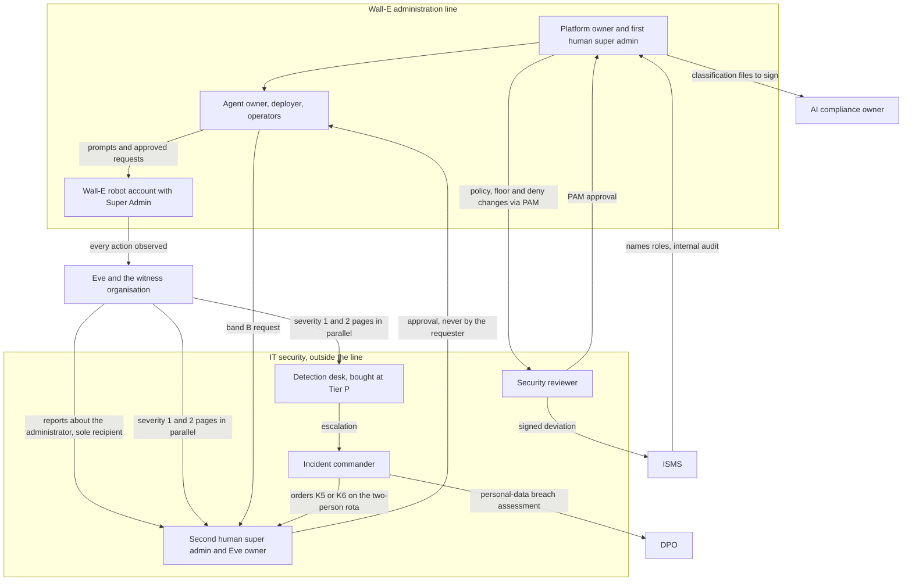

# 23. Operating model

## Status
- Owner: the platform owner
- Last reviewed: 2026-09-14

## What you will understand by the end

This chapter answers the last risk theme of Chapter 3, The problem and its risks: staffing that makes two-person rules notional, where the second approval, the review or the page reaches the person who made the change.

By the end you will know the roles, which duties one person may never combine, how many distinct humans each stage needs and how that is checked, who runs each control per tier, what people must hold before the build, the hours, the detection desk, the training and the recurring calendar. Nothing here is staffed. The design of record is [HLD §0.3](../01-hld.md#03-who-exists-on-2026-09-13-and-the-roles-the-platform-needs) and [TISAX page §7](../11-tisax.md#71-the-roles).

## Who exists on 2026-09-13

One administrator: no security operations centre, no second super admin outside his own line, no security reviewer, no Eve owner, no engaged data protection officer (DPO), and no names supplied by the ISMS ([README, maturity](../README.md#maturity-what-exists-on-2026-09-13)). Platform owner, agent owner, deployer, operator, approver, grader, security reviewer, Eve's owner, Mo's owner and the recipient of Eve's pages are one person. Every "second person" in a control is today the first person again, and TISAX control 1.2.2 on separation of duties is the finding most likely to stop an assessment.

Under the operability principle (Chapter 4, The principles), a tier whose control needs a person who does not exist waits, so the gap shows as a closed tier, not a control nobody runs. Only Tiers C and R open with the people who exist; each gate's full contents are Chapter 24, Roadmap and cost.

## The roles

The roles are defined in [HLD §0.3](../01-hld.md#03-who-exists-on-2026-09-13-and-the-roles-the-platform-needs), with the Wall-E set's people list in [prerequisites §2](../../wall-e/PREREQUISITES.md#2-people). The ISMS records the names in the site's role register.

**Inside the administration line.** The *platform owner* (the platform owner) owns the folder, factory, register, floors and baseline modules. One *agent owner* per agent owns its manifest, playbooks, register row and budget. The *deployer* runs the factory and the release pipeline. The *operator and approver* approves level-3 (L3) requests, pulls the halt and demote switches K0 and K1, and grades; from Tier W a *second operator* who is not the agent owner is required. The *Mo owner* runs Mo's CI and seeds the blind sample; from Tier W the *blind grader* never owns the playbooks graded.

**Outside it.** The *security reviewer* (Wall-E decision 37) reviews ladder raises, deny-policy and floor changes and Privileged Access Manager (PAM) approvals; at Tier P the reviewer signs the super-admin deviation and owns SIEM detection content with the managed detection partner. The *validator custodian* runs the recompute Mo cannot reach (Chapter 17, Mo, continuous improvement), from Tier W in the security reviewer's project. The *incident commander* leads severity 1 and talks to the DPO and the works council. The *detection desk* acknowledges pages and runs the detection catalogue.

The *second human super admin outside the Wall-E administration line* is an IT-security person who, at the grant, is also the *Eve owner*: owner of Eve's owner group and the witness organisation, required reviewer of Eve's configuration, member of no Wall-E group, parallel recipient of every severity 1 and 2 page, sole recipient of reports about the administrator's own actions, and second name on the rota for K5 and K6, the levers that suspend the robot and remove its Super Admin role. What this person does inside Eve's design is Chapter 16, Eve, the independent controller.

**Consulted, then engaged.** The *AI compliance owner* (P131, proposed), legal's designate and never the platform or an agent owner, signs classifications, files registrations and owns the serious-incident clock ([EU AI Act page §4.1](../10-eu-ai-act.md#41-the-ai-compliance-owner-p131)). The *DPO contact* owns the DPIA, records of processing and the retention ceiling. Both are consulted up to Tier W and engaged at Tier P: the AI compliance owner with a named deputy, the DPO before Stage 1.

### What each tier adds

| Tier | People added | What changes |
|---|---|---|
| C and R | nobody; at least one human super admin | the platform owner holds every role; security review is self-review, recorded as such |
| W | second operator; security reviewer from IT security; blind grader | a second reviewer on every credential-holder deploy; IT security commands incidents |
| P and P-SA | second human super admin outside the line as Eve owner; engaged DPO and AI compliance owner; bought desk | at least two human super admins, the robot never the recovery one; band B approved by a super admin other than the requester; an on-duty super admin to pull K5 and K6 |
| X | AI-safety reviewer; independent review of the monitor | not open |

## Lines of authority and report

The people who build and run Wall-E form one line of authority with the robot beneath it; every check on that line is performed and received outside it.

Pages go in parallel to the desk and to a person outside the line, so owning a channel does not silence them ([monitoring page §8](../07-monitoring-detection-incident-response.md#8-the-platform-reporting-path-every-verifier-reports-to-a-human-outside-the-owners-line)). At Tier W the verifier owner is the platform owner until a second person exists, recorded as such.

## Duties one person may never combine

The TISAX page's incompatibility matrix makes the roles countable ([§7.1](../11-tisax.md#71-the-roles); P137, proposed): nobody approves, grades or reviews their own work, and nobody in the administration line controls the controller.

- The platform owner is never the IT security lead, security reviewer, AI compliance owner or second human, and at Tier P never the Eve owner or incident commander.
- An agent owner never approves its agent's requests, grades its playbooks or second-reviews its deploy; an operator never approves their own request.
- The Eve owner is never in the Wall-E line nor Mo's blind grader for Wall-E; the Mo owner is never Eve's second reviewer; neither the security reviewer nor the validator custodian runs Mo's CI.
- Both human super admins hold the role only on separate admin accounts with short sessions, and neither holds both keys of a robot.

Whoever prompted the robot never commands the incident about that prompt, and the agent owner never pulls K5 or K6 when the owner is the actor ([monitoring page §9.1](../07-monitoring-detection-incident-response.md#91-roles-and-raci)).

## The minimum number of distinct humans

The matrix yields the fewest people per stage who fill the roles without a forbidden pair ([§7.2](../11-tisax.md#72-the-minimum-per-stage); gate groups in [register §3](../12-open-decisions.md#3-before-any-tier-w-agent-writes) and [§4](../12-open-decisions.md#4-before-the-super-admin-grant)).

| Stage or gate | Distinct humans | What the count makes true |
|---|---|---|
| Stage 0, Tier R | 1, ISMS consulted | self-review recorded as such; PAM activation without approval, justification mandatory, recorded as the one-person mode |
| Stage 1, Tier W | 3 | a second operator who also grades; an IT-security reviewer who also second-reviews deploys and holds the validator |
| Super-admin grant, Tier P-SA | 4 plus a 24x7 desk | the second human as Eve owner; incident commander from IT security; DPO engaged; a SIEM with round-the-clock acknowledgement contracted and its first heartbeat acknowledged, a grant precondition ([HLD §0.4](../01-hld.md#04-the-tier-gate-what-must-exist-before-a-tier-opens)) |
| Stage 3, autonomous band A at level 4 | 4 and the desk already in place | a quarter of acknowledgement-time evidence from the desk |
| Second Tier W agent | 3 plus grading capacity | P25's agents-per-grader number, open |
| Tier X | not open | an AI-safety reviewer |

The grant precedes Wall-E's own Stage 0 ([TISAX page §6.3](../11-tisax.md#63-compensations-as-preconditions--the-checklist-the-gate-reads); [ladder](../../wall-e/05-autonomy-ladder.md#the-super-admin-grant--a-gate-not-a-stage)), so the one- and three-person rows describe Tier R and Tier W agents and Wall-E never runs on fewer than four. `Assumption:` the security reviewer and the Eve owner may be one IT-security person at the first grant only as a dated ISMS exception, because the deviation's signer would then operate a control the deviation relies on; P137 calls five humans the clean state and four with that exception the floor, yet its worked assignment reaches four with the two roles apart, and no page says who the fifth is.

### How the count is checked, and what failure does

A CI job checks every pair against group memberships and the roster on every merge and daily; a collision makes the admission gate refuse promotions above the stage where that pair is legal, and is a severity 2 finding to the ISMS. A role without a name recorded by the ISMS keeps its tier closed. An approval whose requester and approver are the same principal is void and severity 1 ([§7.3](../11-tisax.md#73-verification-and-failure)).

After the grant, the second human is row 11 of the grant checklist: if the person leaves or joins a Wall-E group, that is severity 1 and the on-duty human super admin pulls K6 until the row is green (Chapter 21, TISAX). An uncovered rota period halts autonomous writes for every agent at Tier W or above whose verifier the absent person owns ([monitoring page §9.2](../07-monitoring-detection-incident-response.md#92-the-on-call-tool-escalation-and-acknowledgement-targets)).

## Who runs which control at each tier

The staffing view of the landing zone assigns each control per tier ([landing zone §1.4](../02-landing-zone-and-tiers.md#14-who-runs-which-control--the-staffing-view)):

- **Register row and publication gate:** the agent owner writes, the platform owner approves; the security reviewer joins at Tier W, the DPO at Tier P.
- **Factory run:** the platform owner runs both phases at Tier R; from Tier W the privileged phase needs the security reviewer's PAM approval, so making a credential holder's project is a two-person act from the first day.
- **Ladder raises and approvals:** from Tier W, the agent owner's pull request plus the second operator, the security reviewer above L3, and L3 approvals by the second operator; at Tier P, band B is never raised and a human super admin other than the requester approves.
- **Detection acknowledgement:** the owner at Tiers C and R, plus the security reviewer at Tier W, a bought 24x7 desk at Tier P.

The privileged tier's two-person rules, and which of them Google enforces, are Chapter 8, Identity, privileged access and the fleet kill switch.

## The hours

These are the staffing numbers; Chapter 17 derives the grading figure ([HLD §0.3](../01-hld.md#03-who-exists-on-2026-09-13-and-the-roles-the-platform-needs); [tier profile](../02-landing-zone-and-tiers.md#the-tier-profile-across-all-controls)).

| Role or tier | Hours | From |
|---|---|---|
| Tier R steady state | about 0.5 hour a month | R |
| Second operator | about 2 hours a week | W |
| Security reviewer | about 2 hours a month | W |
| Blind grader, per Tier W agent | about 1 hour a week, not the playbook owner | W |
| Blind grader for Wall-E at S4 volume | at least 2 hours a week, indefinitely, plus a second grader who does not yet exist | Wall-E S4 |
| Tier P steady state | about 3 hours a week, plus the bought desk and a second super admin on the rota | P |

One Tier W agent needs roughly three and a half hours a week from people other than its owner. Grading grows with the fleet: at S4 the floor of five graded items a week binds in each of about eight live cells, and a missed week leaves cells not ready for promotion rather than thinning the sample ([Mo metrics §13.3](../../mo/03-metrics-contract.md#133-coverage-is-itself-a-metric)). The resulting Tier W cap (P25, open) is argued in Chapter 14, Scale and AGI readiness.

## The detection desk by tier

A fifteen-minute target nobody meets is worse than an honest slow one ([HLD §0.3](../01-hld.md#03-who-exists-on-2026-09-13-and-the-roles-the-platform-needs); mechanisms in Chapter 11, Monitoring, detection and incident response):

- **Tiers C and R:** Google-run. Security Command Center findings page the platform owner; the target is "next business morning".
- **Tier W:** central logging and absence alerts are added to what is watched (central logging exists before Tier R opens, [tier gate](../01-hld.md#04-the-tier-gate-what-must-exist-before-a-tier-opens)); the owner and the security reviewer acknowledge, still next business morning.
- **Tier P:** bought. Google SecOps with a managed detection and response retainer, or the organisation's SOC (P10, open with IT security), and a paging service; escalation desk, then platform owner, then IT security. `Assumption:` severity 1 acknowledged within 15 minutes in business hours and 60 outside, severity 2 within 4 business hours, until the contract fixes them.
- **Tier X:** adds independent review of the monitor.

## What people must hold before the build

From the Wall-E prerequisites ([§3.1](../../wall-e/PREREQUISITES.md#31-roles-accounts-licences-and-physical-artefacts), [§4.1](../../wall-e/PREREQUISITES.md#41-roles-you-must-hold-above-project-level)), by who supplies them:

- **The platform owner** holds Workspace Super Admin on a separate admin account and Gemini Enterprise Admin on the tenant app, plus organisation, folder and billing roles, several now only for manual fallbacks.
- **IT security** supplies, by the grant, the second human super admin, who approves the assignment under multi-party approval and holds robot key B; by Wall-E's setup Phase 10, a security reviewer, a validator custodian and a re-bootstrap witness; and a second approver for Stage 4.
- **A second operator** is asked for at Phase 1; an empty value is recorded as a known risk.
- **The tenant** supplies Gmail-bearing licences for both robots and at least three sandbox accounts (five or six seats; the human admin accounts' and sandbox tenant's seats are *tbd*) and a Gemini Enterprise licence per operator. From Tier W each operator and approver needs a Chrome Enterprise Premium licence (P63, proposed; procurement *tbd*), with an IP-and-time access level until then.
- **Keys:** ten in total (four robot, two break-glass, two per human admin account), eight of them in the corporate safe ([identity page §8.3](../04-identity-and-privileged-access.md#83-key-custodians)). Custodians cross lines: robot key A with the platform owner, key B with the second human, swapped for Eve's robot. `Assumption:` a corporate password vault exists.

The data-protection question, works-council information and other lead-time items are Chapter 24.

## Training

Each role has a one-page outline, delivered with the EU AI Act Art. 4 literacy measure so one record serves TISAX 2.1.3 and the Act, recorded in the evidence bucket and refreshed at every stage transition ([TISAX page §7.4](../11-tisax.md#74-training-213-the-outline)). Operators learn approval cards, severity 1, K0 and K1; the two human super admins K5, K6 and band B approvals; the incident commander runbooks RB-01 to RB-11 and the regulatory clocks.

A role holder without a completion record for the current stage does not count towards the minimum. The pages differ on who writes the content: the TISAX page names the platform owner, the [EU AI Act page §4.8](../10-eu-ai-act.md#48-art-4--the-literacy-measure) the AI compliance owner; both give the record to the ISMS.

## The recurring calendar

Each item is owned elsewhere and gathered here for staffing ([drills](../04-identity-and-privileged-access.md#96-drills); [tabletops](../07-monitoring-detection-incident-response.md#13-tabletop-exercises); [assurance](../11-tisax.md#9-penetration-test-internal-audit-management-review-p139); [reviews](../01-hld.md#53-governance-policies-and-the-admission-gate); [restore drills](../09-supply-chain-secrets-recovery.md#36-drills-and-the-restore-drill-in-the-promotion-gate)).

| Cadence | Item | Run by |
|---|---|---|
| Monthly | K7 fleet kill drill, job path, in nonprod; K0 drill, with K1 from Tier W | platform owner; security reviewer witnesses and signs |
| Monthly | security operations metrics; seeded-fault suite; each operator's blind self-grading | security reviewer, desk-produced from Tier P; Mo owner; each operator |
| Quarterly | break-glass drill, alternating accounts; K7 by hand and through the SIEM; restore drill | platform owner; key custodians |
| Quarterly | tabletop until four clean Tier P quarters, then semi-annual; one before the first Tier W Stage 1 and one before the grant; the abused-robot-credential scenario at least yearly | IT security, never the platform owner |
| Quarterly | privilege review of privileged register rows against the signed roster; roster review of super admins; every register row within 90 days | security reviewer; platform owner |
| Quarterly | management review; deviation re-signed, also at each Wall-E stage transition | platform owner presents to IT security and the ISMS chair; security reviewer re-signs |
| Semi-annual | the service-denial kill lever in production at Tier R | platform owner |
| Annual | penetration test, plus gate tests before the first Tier W Stage 1 and the grant; internal audit; management review with the DPO; supplier review and exit rehearsal | IT security; the ISMS's auditor; ISMS |
| Each stage transition | training refresh | ISMS |

A missed K7 drill is a severity 2 finding that freezes every raise; two quarters without a management review stop the ladder raising. One cadence differs between pages: the staffing view drills K5 and K6 quarterly at Tier P ([landing zone §1.4](../02-landing-zone-and-tiers.md#14-who-runs-which-control--the-staffing-view)), while grant checklist row 7 requires a K6 drill record younger than 30 days ([TISAX page §6.3](../11-tisax.md#63-compensations-as-preconditions--the-checklist-the-gate-reads)).

## When "the four owner groups are one person" expires

Project-per-agent (Chapter 7, Landing zone and the tier model) gives the Gemini, Wall-E, Eve and Mo projects four owner groups, notional while one person is in all of them ([topology §1.4](../../project-topology.md#14-the-cost)). The design records that as a state that expires on the super-admin grant date ([tier gate](../01-hld.md#04-the-tier-gate-what-must-exist-before-a-tier-opens)).

On that day the gate checks that Eve's owner is in no Wall-E group, that the super-admin roster holds exactly the two human admin accounts and `walle@`, and that the K5/K6 rota in the witness names two people. It does not require four people for four groups; it requires the group owning the controller to sit outside the line it controls, kept so by the daily separation check.

## Key decisions and what to read next

States on 2026-09-14. Unsolved: no role but the platform owner's has a name, the fifth human is unnamed, and the Tier X reviewer exists nowhere.

- **Decided:** P33, Wall-E holds Super Admin, which makes the second human a precondition; deviation signatures pending.
- **Proposed:** P137 separation of duties as a counted minimum; P131 the AI compliance owner; P68 the roster; P69 break-glass and custody; P98 the reporting path; P99 on-call and targets; P102 tabletops; P139 assurance cadence; P63 access levels and licences; P127 overseers and self-grading.
- **Open:** P10 the SIEM and desk; P14 the witness organisation the second human administers; P25 the grading cap; P24 for operators; P13 the retention ceiling the DPO owns.

Read next: [HLD §0.3](../01-hld.md#03-who-exists-on-2026-09-13-and-the-roles-the-platform-needs) and [§0.4](../01-hld.md#04-the-tier-gate-what-must-exist-before-a-tier-opens); [TISAX page §7](../11-tisax.md#72-the-minimum-per-stage); [landing zone §1.4](../02-landing-zone-and-tiers.md#14-who-runs-which-control--the-staffing-view); [monitoring page §9](../07-monitoring-detection-incident-response.md#91-roles-and-raci); [Wall-E prerequisites §2](../../wall-e/PREREQUISITES.md#2-people). Then Chapter 24, Roadmap and cost, for when these people are needed, and Chapter 25, Decisions awaiting the owner, for whom to ask.
