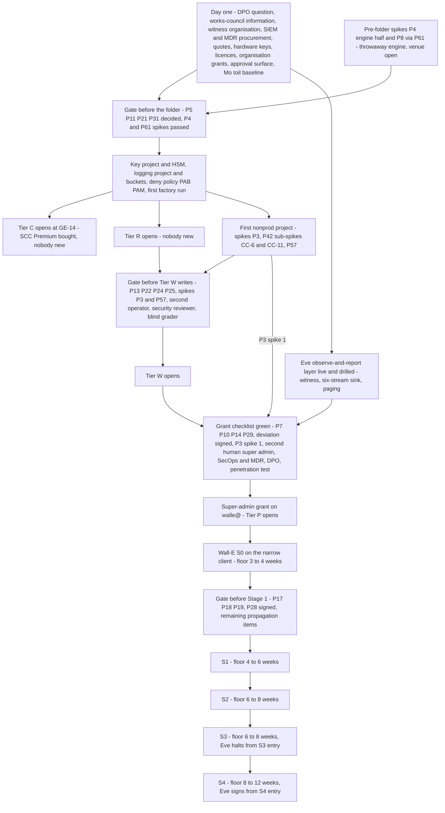

# 24. Roadmap and cost

## Status
- Owner: the platform owner
- Last reviewed: 2026-09-14

## What you will understand by the end

The platform does not open on a date. It opens gate by gate, each green only when its decisions, people, bought services and spikes exist. By the end you will know:

- what must exist, be bought and be hired before each tier opens, and why the super-admin grant is a gate with its own checklist;
- how the register's five gate groups form the roadmap, and which are red on 2026-09-14;
- what can start with the one administrator who exists, and what must start on day one;
- the builder's order, the first spikes, and what a failed spike changes;
- the minimum durations of the three agents' stages, and the edits their designs still owe the platform;
- what the work costs by driver and payer, and what nobody has priced yet.

Chapter 23, Operating model, says who the people are; Chapter 25, Decisions awaiting the owner, says who decides each open row. This chapter says in what order it all happens.

## Where the programme starts

On 2026-09-13 nothing is built: no platform folder, factory run, gateway, security monitoring service, witness organisation or robot with Super Admin, and no spike has run. The Google Cloud project behind the Gemini Enterprise app exists and is to be imported. The organisation is one administrator, with no security operations centre and no second super admin outside his own line ([maturity](../README.md#maturity-what-exists-on-2026-09-13)). Hence the rule applied throughout: if a control needs a person who does not exist, the tier that needs it waits.

## The tier gate

Each tier is a lettered folder with its own mandatory controls (Chapter 7, Landing zone and the tier model). The tier gate adds what the organisation must supply before a tier opens: decisions, purchases and people ([tier gate](../01-hld.md#04-the-tier-gate-what-must-exist-before-a-tier-opens)).

**Tier C, classical agents in the Gemini Enterprise app.** It opens when the register exists and the tenant app reaches its baseline, closing at the last step of the app's runbook, GE-14. The licences already exist. The one purchase is Security Command Center Premium at organisation level, whose funding and ownership IT security has not decided (P11, open; `Assumption:` a platform budget line until then). Nobody new is needed.

**Tier R, read-tool agents in their own projects.** It opens when the factory, the folder baseline, central logging and the shared registry exist. It buys nothing beyond Tier C and needs nobody new. At Tiers C and R the owner reviews his own work, and the record says so.

**Tier W, agents that write to a system of record.** It needs the autonomy contract, the platform verifier, a validator custodian, the nonprod folder and one restore drill. If the agent acts on employee accounts, the works council must be informed before its Stage 1 (P129, proposed). The Binary Authorization pipeline costs build time, not licences. Three roles are added: a second operator who is not the agent owner, a part-time security reviewer from IT security, and a blind grader who does not write the playbooks. Device-posture licences for operators arrive here too (P63; see the cost section).

**Tier P and the super-admin singleton P-SA.** Everything in Tier W, plus every precondition of the super-admin grant. The purchases are Google SecOps in the EU or the organisation's own SIEM, a managed detection and response retainer covering the super-admin detection set, a paging service and hardware keys. The people are a second human super admin outside the Wall-E administration line, who is also Eve's owner, an engaged DPO and an incident commander from IT security.

**Tier X, AGI-class agents.** Not open. Of the six conditions Chapter 14, Scale and AGI readiness, lists, one is met on 2026-09-13 (the sandbox stage) and five are not; HLD §0.4 counts four unmet and §11.5 five, a difference Chapter 14 records. Opening it would mean buying the GKE Agent Sandbox tier and a second model family for advisory monitors, and creating an AI-safety reviewer role that does not exist.

The gate is strict because hundreds of agents could be admitted on paper long before anyone can operate their controls; tying each tier to named people and services shows the gap as a closed tier, not as a control nobody runs. The cost is speed: a sponsor who funds the build but not the people gets a read-only platform.

### The super-admin grant is a gate, not a phase

The day `walle@` receives Super Admin (P33, decided) has its own checklist: thirteen compensations, a penetration test, the DPIA started, works-council information given, a crisis tabletop and witnessed custody of the hardware keys ([checklist](../11-tisax.md#63-compensations-as-preconditions--the-checklist-the-gate-reads)). The grant happens on the day the last row turns green. The recorded state "the four owner groups are one person" expires that same day. The runbook step that makes the grant refuses to proceed while any row is red. What a row turning red after the grant triggers is Chapter 21, TISAX.

## The register's gate groups are the roadmap

The register holds 143 decisions, grouped by the gate each one blocks, in the order the gates come ([register in one screen](../12-open-decisions.md#0-the-register-in-one-screen)). A gate is green when every row in its group is decided, closed, proposed or a passed spike. One open row keeps it red ([how the register works](../12-open-decisions.md#1-how-this-register-works)). That makes the register the roadmap: each group lists what must be settled before the next thing can exist.

| Gate group | What turns on when it is green | Rows keeping it red on 2026-09-14 |
|---|---|---|
| Before the folder exists | the platform folder, the factory's first run, Tier C, Tier R | open P5, P11, P21, P31; spikes P4, P8 via P61, whose venue before the folder exists is unsettled |
| Before any Tier W agent writes | Tier W and the first write of the first writing agent | open P13, P22, P25, P24 for operators; spikes P3, P57 |
| Before the super-admin grant | Tier P and the credential on `walle@` | open P7, P10, P14, P29; P33's deviation signatures |
| Before Wall-E's Stage 1 and later stages | Wall-E's first super-admin write; F5 and F7 above L3; `eve-advisor` | open P17, P18, P19; P28's signature |
| Later | the TISAX assessment order, the perimeter backstop, Tier X | open P12, P23, P26, P32; spike P6 via P57 |

A decision that blocks two gates sits in the earliest. Its later effect is noted where it bites: P3's first spike also blocks the grant, and P32's Article 25 position blocks Stage 1. The states belong to Chapter 25. What matters here is what they mean for the schedule. Even the first gate is red, on four decisions held by four different parties. P5, the Cloud Run Agent Identity launch stage, waits on Google taking it to general availability; the platform owner only re-reads it at each factory release. P11, SCC Premium funding, is IT security's. P21, the threat taxonomy for detection coverage, belongs to the security reviewer, a role nobody holds, so until one is named the platform owner holds it and records the choice as self-review. P31, the per-tier budget amounts, is the owner's alone. Several of these rows already carry a working fallback, and whether such a row counts against its gate is the first thing the owner must record (Chapter 25).

## What can start with the people who exist

Tiers C and R are the only tiers the existing organisation can staff. The tenant app baseline is the first delivery: fifteen runbook steps, GE-0 to GE-14, that import the app's project, apply folder policies, put administration behind Privileged Access Manager, switch Model Armor on with Block on failure and stage the tenant egress gateway ([runbook](../03-gemini-enterprise-environment.md#16-runbook-bringing-the-environment-to-baseline)). The set's README says this baseline needs no factory ([builder's order](../README.md#reading-order-for-a-builder)); the runbook imports the project through the factory's `tenant-app` module and runs nothing before the folder and `CORE_PROJECT` exist, so it needs the folder, though no agent project. Tier R follows on the same people once the factory has run.

## Day-one lead-time items

Some items gate only later tiers but take longest to obtain, so they start now ([lead-time items](../../wall-e/PREREQUISITES.md#9-security-artefacts-and-lead-time-items)):

- **The data-protection question and works-council information**, the longest item in the plan. The DPO's retention ceiling (P13, open) blocks the first Tier W write, and the evidence buckets cannot be locked until it is recorded. The prerequisites page still dates the question to Stage 3; Wall-E's decision 8 carries the platform's change (worker information before Stage 1, DPO engagement before the grant, P129), and no register row names the stale line.
- **The witness organisation**, a separate Cloud Identity tenant with project, locked bucket, dataset, channels and two hardware keys, run by IT security (P14, open; `Assumption:` Cloud Identity Free).
- **SIEM and managed detection procurement**, the organisation's instance or Google SecOps and a partner with 24x7 acknowledgement (P10, open).
- **Hardware keys and custodians**: four robot keys with two custodians, spares for the human admin accounts.
- **Licences**: five or six Gmail-bearing seats, a purchase if none are free.
- **Organisation-level role grants and policy exceptions**, which need the organisation administrator's approval.
- **The approval surface**, the IAP-fronted page `walle-approvals` that [Wall-E's identity page §5.3](../../wall-e/12-agent-identity.md#53-what-the-approval-surface-asserts-in-each-case) takes as its position (Chapter 15): real engineering, blocking any family above L2 and Stage 1. That page also accepts a Chat app with app authentication, and the prerequisites page still lists both.
- **Quotes for the unpriced services**: SCC Premium and SecOps with the managed detection retainer from IT security, the penetration test from IT security, which buys the engagement, and Chrome Enterprise Premium licences through procurement (P63). Without them the sponsor funds lines that carry no figure (see "What is not yet priced").

Mo adds one that cannot be recovered later: four weeks of measured toil for the top three admin tasks before Wall-E's first phase, without which the Stage 1 stop-or-continue review has no denominator ([Mo stage table](../../mo/05-staging.md#the-stage-table)).

## The builder's order

The builder's reading order is a build order, driven by what cannot be changed after creation ([builder's order](../README.md#reading-order-for-a-builder)):

1. **The key project and the HSM constraints first.** Every key is HSM by folder policy; a key made earlier would need its own argument (Chapter 13, Supply chain, keys and recovery).
2. **The logging project and its buckets, built right at Stage 0.** Per-bucket CMEK is set only at creation and a retention lock cannot be shortened, so a mistake means new buckets and a broken evidence chain. The lock itself waits for the DPO's ceiling (Chapter 12, Data, logging, retention and sovereignty).
3. **The deny policy, the Principal Access Boundary and the PAM catalogue, with the folder.** Folder-level, so present before the first project inherits (Chapter 8, Identity, privileged access and the fleet kill switch).
4. **The first factory run.** Core projects, names, labels, budgets and the policy baseline.
5. **The tenant app to baseline**, closing Tier C.
6. **The first nonprod project, to run the spikes.** P3's two spikes on a throwaway Tier W nonprod project made by the factory, P42's CC-6 and CC-11 sub-spikes and P57's throwaway-app spike, all before any Tier W project.

The agents' runbooks come after, because the platform now does part of their work.

Two spikes do not fit this order. P4's engine half (custom constraint CC-8) and P8's principal-set spelling (via P61) sit in the first gate group, and P8's row wants the spelling proven on a throwaway engine before the folder deny policy is applied, so they cannot wait for step 6. The canonical pages define a spike as a test on a throwaway resource in nonprod but do not say where that engine lives before the folder and the factory exist ([P8 and P61](../12-open-decisions.md#2-before-the-folder-exists); [custom constraints](../02-landing-zone-and-tiers.md#43-custom-constraints-what-is-verifiable-today-and-the-spike-list-p42-p4-partly-closed)). Two readings are possible: a throwaway project outside `fld-agentic-platform`, or the folder created at step 3 with the deny policy held back and CC-8 in dry run until both pass. Until the platform owner records one, this is an open sequencing question (Chapter 25), and the diagram below shows the two spikes on their own path before the folder gate.

## The first spikes: what the design holds until each passes

A spike is a decision taken by a test on a throwaway resource; for each, the design records what holds meanwhile and what a failure changes.

| Spike | Position held until it passes | If it fails |
|---|---|---|
| P3 spike 1, engine reach to an internal-ingress action service through an internal load balancer | IAM-only invoke is the enforced boundary, open ingress is detected, the folder rule P90 is written but not applied, and perimeter model (b) waits | Retry through a Private Service Connect endpoint; if only the private-ranges gateway configuration works, the factory uses it and the perimeter backstop is unreachable for that tier. The grant checklist requires spike 1 passed |
| P3 spike 2, VPC Service Controls over a gateway-bound engine | No perimeter backstop, model (a) | If the access policy fails under the connectivity template, hostname control moves to VPC firewall and Cloud DNS. If the engine cannot work inside a perimeter, (a) is recorded as unavailable |
| P4, the `identityType` custom constraint on engines | Cloud Run half answered (custom constraint CC-3); the engine half of D2 stays a CI check graded detection, re-run at each factory release | Detection stays the grade |
| P42 sub-spikes | Custom constraint CC-6, allow-policy rules: the drift job detects standing owners and foreign members. Custom constraint CC-8 is P4's engine half. Custom constraint CC-11, sinks excluding the robot: Eve's completeness metric detects it | CC-6 dropped if it fires on PAM's own grant, detection kept; if agent identities fall outside the organisation principal set, the rule names the trust domain, syntax *tbd* |
| P57, `gemini-egress` bound to the tenant app | Throwaway-app spike, then 30 days in dry run, enforced before the first Tier W publication | The connector allow-list plus the per-engine query grant stand as a dated compensating control, re-tested at each Agent Gateway release |
| P61 with P8, the agent principal-set spelling in a deny policy | Names verified; the spelling stays an `Assumption:`, the factory emits one spelling for allow and deny and another for PAB, and kill lever KF-2 counts only as a copy of KF-1 | The factory template is corrected from the spike's evidence, never from a page |

Sources for the table: [perimeter decision](../06-gateways-model-armor-perimeter.md#42-the-decision-restated-with-what-this-page-adds), [the folder rule and spike protocols](../06-gateways-model-armor-perimeter.md#43-credential-holders-are-never-internet-reachable-as-a-folder-rule), [custom constraints](../02-landing-zone-and-tiers.md#43-custom-constraints-what-is-verifiable-today-and-the-spike-list-p42-p4-partly-closed), [tenant egress gateway](../03-gemini-enterprise-environment.md#11-the-tenant-egress-gateway-gemini-egress-p57-detailing-hld-p6), [principal populations](../01-hld.md#42-the-three-principal-populations). The perimeter models themselves are Chapter 10, Agent Gateway, Model Armor and the perimeter.

The pattern is deliberate: apart from P3's first spike, which the grant needs, a failed spike lowers a control's grade from enforcement to detection rather than stopping the programme, and the page's grade moves with it.

## The opening sequence

The diagram shows two things prose hides. The day-one items feed the grant as well as the first gate, which is why they start first even though the grant comes last. And Eve's observe-and-report layer runs in parallel with the Tier W work, so the grant waits for whichever of the two finishes later.

## The super-admin grant sequence

The order is fixed ([the grant](../../wall-e/05-autonomy-ladder.md#the-super-admin-grant--a-gate-not-a-stage)): Eve's observe-and-report layer live and drilled, then the grant, then Wall-E's Stage 0 on the narrow OAuth client with every write family at L1, then Stage 1.

Before the grant the robot account exists, is licensed and hardened, holds no admin role and reads nothing: Stage 0's reads need an admin privilege, and no interim read role exists.

The Eve layer needed first is the one that **reports** misbehaviour, with seven checklist rows that end in an end-to-end drill on the sandbox tenant ([Eve's rows](../../eve/05-stages.md#the-super-admin-grant--the-observe-and-report-layer-and-its-checklist); Chapter 16). Eve's gate layer, which approves plans, comes much later: detection is what the grant needs, while approval has to be earned on evidence.

## Stage floors across the three agents

Stage durations are floors, not plans. A stage lasts at least this long and ends only when its exit criteria are met ([stage overview](../../wall-e/05-autonomy-ladder.md#stage-overview)). What each stage permits is Chapters 15, 16 and 17.

**Wall-E.** S0 3–4 weeks, S1 4–6, S2 6–8, S3 6–8, S4 8–12, S5 ongoing. Added up, the floors put S5 at least 27 to 38 weeks after S0 begins, and only if every exit criterion is met first time. The grant gate itself comes before S0, and the setup runbook puts it at weeks to months.

**Eve.** Eve has no stages of its own; it declares what exists inside Wall-E's ([Eve stage table](../../eve/05-stages.md#the-stage-table)). The observe-and-report layer precedes the grant; halting and demoting go live at S3 entry, which runs at least 30 days and exits only on catching all twelve seeded faults; signing arrives at S4 entry.

**Mo.** Mo's measurement arrives before its judgement ([Mo stage table](../../mo/05-staging.md#the-stage-table)): S1 ends in a stop-or-continue review on value, and at S4 the blind sample becomes the only input to L4 and L5 precision. Mo's Eve reads arrive with Eve's observe-and-report layer. Mo's staging page places that arrival between Mo's S1 and S2 on the calendar as an `Assumption:`, while [the grant order](../../wall-e/05-autonomy-ladder.md#the-super-admin-grant--a-gate-not-a-stage) puts Eve's layer before Wall-E's Stage 0, and Mo's stages are keyed to Wall-E's; the calendar position is unresolved. Mo's trust never rises with age.

The floors, not build estimates, set the calendar; engineers cannot compress them, because they wait for evidence.

## The propagation stage

The Wall-E, Eve and Mo designs were written for a robot that never holds Super Admin. The platform design lists 26 edits they must carry ([HLD §18](../01-hld.md#18-what-this-hld-requires-of-the-wall-e-eve-and-mo-sets)). P143 (proposed) gives each an owner and a gate ([before the grant](../12-open-decisions.md#4-before-the-super-admin-grant)):

- **Wall-E items 1–10**, owned by Wall-E's agent owner, with the security reviewer signing items 1–4. Items 1–5 gate the grant: identity, the three bands and the hard-denied list, the ladder's super-admin rows, the guardrails, and every "never Super Admin" line. Items 6–10 gate Stage 1.
- **Eve items 11–18**, owned by the Eve owner. Items 11–16 gate the grant, since they are the observe-and-report layer and the witness. Items 17–18 gate Stage 1.
- **Mo items 19–24**, owned by the Mo owner, gate Stage 1.
- **Shared pages, items 25–26**, owned by the platform owner, gate the factory's first run unless an item says otherwise.

An item closes with a dated pointer line citing the platform row; the reconciliation job reports any item still open when its gate is evaluated. The README records the stage as not yet run, although some pages already carry their item. The stage also closes register rows 10–14 ([values that differ](../12-open-decisions.md#7-values-that-differ-between-pages); Chapter 25). For the schedule the point is simpler: the edits are small, but they gate the grant and Stage 1, and today every one of their owners is the same person.

## Which runbook creates what, and the effort shape

A grant on a resource is made from that resource's project, by that project's runbook ([which runbook](../../project-topology.md#7-which-runbook-creates-what)). Since 2026-09-13 creating a project is a factory call, credential-path bindings go through the factory's privileged phase under PAM (P142), and Wall-E's setup script keeps only Workspace-side phases. Eve's runbook gains a pre-grant phase for the observe-and-report layer; IT security's witness administrators build the witness.

The effort is lopsided ([phase durations](../../wall-e/SETUP.md#04-how-long-each-phase-takes)). Wall-E's infrastructure is about three working days hands-on, closer to a working week with the denial suite and the kill-switch drill; the three code artefacts it deploys are weeks of engineering. None of this is the critical path: closing the blocking decisions takes days to weeks of other people's time, and the grant gate weeks to months, so programme effort goes first into decisions, purchases and people.

## Cost

### Cost classes

No price is quoted: pricing pages were not read, and every amount is *tbd*. The design names each driver and payer instead ([cost classes](../01-hld.md#05-cost-classes)):

| Cost | Driver | Paid by | From tier |
|---|---|---|---|
| SCC Premium | organisation-wide, all projects | IT security (`Assumption:` platform line until then) | C |
| Central log ingestion and locked retention | Workspace audit volume plus Data Access logs, the largest line | platform | R |
| Model Armor | requests screened per project | agent budget | R |
| Chrome Enterprise Premium licences (P63) | one per operator and approver, for device-posture access levels; an IP-and-time level until bought | platform | W |
| Google SecOps with managed detection | events per day, retention months, retainer | IT security | P |
| Workspace licence per Tier P agent | one licensed user each, rare by policy | agent owner's cost centre | P |
| Witness organisation | one tenant, project, bucket, dataset, channels, two hardware keys | IT security | P |
| Human hours | the roles of Chapter 23 | — | every tier |

Log ingestion cannot be reduced by cutting evidence: reconciliation needs Google's record of organisation-wide admin activity, not only the robot's. The binding cost is human hours; a programme that funds services but not graders stalls, visibly.

### The agents' own estimates

All of these are `Assumption:` and to be confirmed against the first billing cycle.

- **Wall-E at Stage 0:** infrastructure in the low tens of euros a month, with model spend below that. Keeping a runtime instance warm around the clock is the easiest way to waste money ([Wall-E cost](../../wall-e/SETUP.md#03-what-it-costs)).
- **Eve:** 36–45 engineer-days, seven to nine engineer-weeks, or eight to ten with Wall-E's side of the contract. Under €50 a month on Google Cloud plus one Workspace licence. Under half an hour a week of human time in steady state ([Eve cost](../../eve/01-hld.md#cost)).
- **Mo:** 24–37 person-days, €25–60 a month billed to Mo's own project because BigQuery bills the querying project, and at least two hours a week of blind grading at Stage 4 volume from a named human who is not the playbook owner ([Mo cost](../../mo/05-staging.md#cost-and-effort)).

Eve's own conclusion applies to the whole ladder. L3 with human approval is a legitimate permanent end state, and the gate layer should not be funded until a promotion can state in numbers how much approval work it removes.

### What is not yet priced

| Line | What pricing it needs | Priced before |
|---|---|---|
| Eve's observe-and-report layer | build days and run cost of the all-stream layer | the super-admin grant |
| The Reports API poll and the wider sink | ingestion volume over six streams | the super-admin grant |
| The witness organisation | edition, billing linkage (P14) | the super-admin grant |
| `eve-advisor` and its model | a model pin and a class (P19) | its build |
| Mo's Eve remit | days for the Eve quality pack, scorecard and coverage map, outside the 24–37 | Wall-E's Stage 1 |
| Every per-tier budget amount (P31) | an owner for the numbers; the budget mechanism already exists | Tier R, in the first gate group |

Nor is any line of the cost-class table priced. The largest lines have no figure at all, and each needs a named person to obtain one:

| Line | Who obtains the price | Priced before |
|---|---|---|
| SCC Premium at organisation level | IT security (P11) | Tier C |
| Central log ingestion and locked retention | platform owner, since the platform pays | Tier R |
| Chrome Enterprise Premium licences (P63) | procurement | Tier W |
| The penetration test, scoped then full | IT security, which buys the engagement | the first Tier W Stage 1 (scoped); the grant (full) |
| Google SecOps with the managed detection retainer, or the organisation's SIEM (P10) | IT security | the super-admin grant |
| The paging service (P99) | the incident commander role in IT security, with the platform owner | Tier W for the channel; the grant for the 24x7 line |
| Hardware keys, ten in total | procurement | Wall-E's Phase 3, before the grant |
| The sandbox tenant's licences | platform owner; the seat count is *tbd* | Tier W on the TISAX page; before the grant on Wall-E's prerequisites page |

Sources: [Eve's unpriced lines](../../eve/01-hld.md#cost), [budgets per tier](../02-landing-zone-and-tiers.md#37-budgets-per-tier-p39-the-amounts-stay-p31), [before the folder exists](../12-open-decisions.md#2-before-the-folder-exists), [what does not yet exist](../11-tisax.md#12-documentation-task-versus-control-that-does-not-exist), [on-call tool](../07-monitoring-detection-incident-response.md#92-the-on-call-tool-escalation-and-acknowledgement-targets), [lead-time items](../../wall-e/PREREQUISITES.md#9-security-artefacts-and-lead-time-items). P31 is the sharpest: the factory writes a budget per project and quota alerts fire on numbers that remain guesses.

### The recurring cost of project-per-agent

Every agent carries its own budget, IAM policy, API list and owner group, and every crossing between projects is an explicit grant and a drift-job row ([topology cost](../../project-topology.md#14-the-cost)). The factory makes this a register row per agent rather than a runbook, but the volume remains and is checked daily. BigQuery bills the querying project, so each agent's analysis cost lands on its own line.

## Key decisions and what to read next

States on 2026-09-14:

- **Decided:** P33, Wall-E holds Super Admin, deviation signatures pending.
- **Proposed:** P1, the tier model and the tier gate; P39, the budget mechanism; P63, device-posture access levels; P90, the ingress folder rule, applied the day P3's first spike passes; P129, works-council information before Stage 1; P137, the staffing count; P143, the propagation stage.
- **Open:** P5, P11, P21 and P31 hold the first gate red; P13, P22, P24 for operators and P25 the second; P7, P10, P14 and P29 the grant.
- **Spike:** P3, P4, P6 via P57 and P8 via P61; P42 carries three sub-spikes.
- **Page disagreements and open sequencing:** register rows 10–14 are open until the propagation stage runs. The Tier C baseline's dependence on the factory is stated differently in the set's README and the app's runbook; Mo's calendar position for its Eve reads differs from the grant order; where the P4 and P61 spikes run before the folder exists is unsettled. All three are in Chapter 25's list of unresolved points.

Read next: [the tier gate](../01-hld.md#04-the-tier-gate-what-must-exist-before-a-tier-opens), [the register's gate groups](../12-open-decisions.md#0-the-register-in-one-screen), [the grant checklist](../11-tisax.md#63-compensations-as-preconditions--the-checklist-the-gate-reads), [Wall-E's stages](../../wall-e/05-autonomy-ladder.md#7-the-six-stages), [the propagation stage](../01-hld.md#18-what-this-hld-requires-of-the-wall-e-eve-and-mo-sets) and [lead-time items](../../wall-e/PREREQUISITES.md#9-security-artefacts-and-lead-time-items). Chapter 25, Decisions awaiting the owner, names who must answer each open row.
