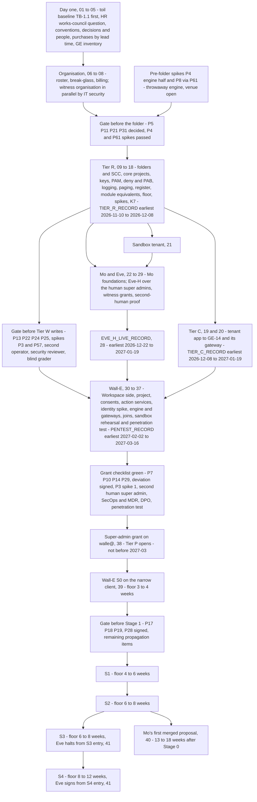

# 24. Roadmap and cost

## Status
- Owner: the platform owner
- Last reviewed: 2026-09-18
- 2026-09-18: the start of the build, the builder's order and the opening-sequence diagram now follow the setup set's block order and dated milestones (Tier R before Tier C, SD-13); the proof-of-value and three-day alternatives are named with their durations; the effort figures come from setup/README §3.2 and pov/README §4 instead of the superseded SETUP.md §0.4; the setup script is a helper only (SD-37); the lead-time list points at setup/04.

## What you will understand by the end

The platform does not open on a date. It opens gate by gate, each green only when its decisions, people, bought services and spikes exist. By the end you will know:

- what must exist, be bought and be hired before each tier opens, and why the super-admin grant is a gate with its own checklist;
- how the register's five gate groups form the roadmap, and which are red on 2026-09-14;
- what can start with the one administrator who exists, and what must start on day one;
- the builder's order, the first spikes, and what a failed spike changes;
- the minimum durations of the three agents' stages, and the edits their designs still owe the platform;
- what the work costs by driver and payer, and what nobody has priced yet.

Chapter 23, Operating model, says who the people are; Chapter 25, Decisions awaiting the owner, says who decides each open row.

## Where the programme starts

On 2026-09-13 nothing is built: no platform folder, factory run, gateway, security monitoring service, witness organisation or robot with Super Admin, and no spike has run. The Google Cloud project behind the Gemini Enterprise app exists and is to be imported. The organisation is the one administrator described in Chapter 23, Operating model ([maturity](../README.md#maturity-what-exists-on-2026-09-13)).

## The tier gate

Each tier is a lettered folder with its own mandatory controls (Chapter 7, Landing zone and the tier model). The tier gate adds the decisions, purchases and people the organisation must supply before a tier opens ([tier gate](../01-hld.md#04-the-tier-gate-what-must-exist-before-a-tier-opens)).

**Tier C, classical agents in the Gemini Enterprise app.** It opens when the register exists and the tenant app reaches its baseline at GE-14, the last step of the app's runbook. The licences exist. The one purchase is Security Command Center Premium at organisation level, whose funding and ownership IT security has not decided (P11, open; `Assumption:` a platform budget line until then). Nobody new is needed.

**Tier R, read-tool agents in their own projects.** It opens when the factory, the folder baseline, central logging and the shared registry exist, buying nothing more and needing nobody new.

**Tier W, agents that write to a system of record.** It needs the autonomy contract, the platform verifier, a validator custodian, the nonprod folder and one restore drill. If the agent acts on employee accounts, the works council is informed before its Stage 1 (P129, proposed). The Binary Authorization pipeline costs build time, not licences. It adds a second operator, a part-time security reviewer and a blind grader (Chapter 23), and device-posture licences for operators (P63).

**Tier P and the super-admin singleton P-SA.** Everything in Tier W, plus every precondition of the super-admin grant. The purchases are Google SecOps in the EU or the organisation's own SIEM, a managed detection and response retainer covering the super-admin detection set, a paging service and hardware keys. The people are the second human super admin as Eve's owner, an engaged DPO and an incident commander from IT security.

**Tier X, AGI-class agents.** Not open. Of the six conditions in Chapter 14, Scale and AGI readiness, one is met on 2026-09-13 (the sandbox stage) and five are not; HLD §0.4 counts four unmet and §11.5 five, a difference Chapter 14 records. Opening it means buying the GKE Agent Sandbox tier and a second model family for advisory monitors, and creating an AI-safety reviewer role.

The cost of the gate is speed: a sponsor who funds the build but not the people gets a read-only platform.

### The super-admin grant is a gate, not a phase

The day `walle@` receives Super Admin (P33, decided) has its own checklist: thirteen compensations, a penetration test, the DPIA started, works-council information given, a crisis tabletop and witnessed custody of the hardware keys ([checklist](../11-tisax.md#63-compensations-as-preconditions--the-checklist-the-gate-reads)). The grant happens on the day the last row turns green, and the runbook step that makes it refuses while any row is red; the state "the four owner groups are one person" expires that day. A row turning red after the grant is Chapter 21, TISAX.

## The register's gate groups are the roadmap

The register holds 143 decisions, grouped by the gate each blocks, in gate order ([register in one screen](../12-open-decisions.md#0-the-register-in-one-screen)). A gate is green when every row in its group is decided, closed, proposed or a passed spike; one open row keeps it red ([how the register works](../12-open-decisions.md#1-how-this-register-works)).

| Gate group | What turns on when it is green | Rows keeping it red on 2026-09-14 |
|---|---|---|
| Before the folder exists | the platform folder, the factory's first run, Tier C, Tier R | open P5, P11, P21, P31; spikes P4, P8 via P61, whose venue before the folder exists is unsettled |
| Before any Tier W agent writes | Tier W and the first write of the first writing agent | open P13, P22, P25, P24 for operators; spikes P3, P57 |
| Before the super-admin grant | Tier P and the credential on `walle@` | open P7, P10, P14, P29; P33's deviation signatures |
| Before Wall-E's Stage 1 and later stages | Wall-E's first super-admin write; F5 and F7 above L3; `eve-advisor` | open P17, P18, P19; P28's signature |
| Later | the TISAX assessment order, the perimeter backstop, Tier X | open P12, P23, P26, P32; spike P6 via P57 |

A decision that blocks two gates sits in the earliest, its later effect noted where it bites: P3's first spike also blocks the grant, and P32's Article 25 position blocks Stage 1. Even the first gate is red on four decisions held by four parties: P5 (Agent Identity on Cloud Run at general availability) waits on Google, P11 on IT security, P21 (the threat taxonomy for detection coverage) on a security reviewer nobody is (so the platform owner holds it as self-review), and P31 on the owner alone. Several of these rows already carry a working fallback, and whether such a row counts against its gate is the owner's first decision (Chapter 25, Decisions awaiting the owner).

## What can start with the people who exist

Tiers C and R are the only tiers the existing organisation can staff, and the build of record opens them in that order: Tier R first, Tier C after it (SD-13) ([blocks](../setup/README.md#31-blocks)). The first act of the programme is not a platform step but the toil baseline, `TB-1.1`, which cannot be taken later; day one is files 01 to 05 (conventions, the toil baseline, decisions and people, purchases by lead time, the read-only Gemini Enterprise inventory). Then the organisation (06 to 08, the witness organisation in parallel under IT security), Tier R (09 to 18: folders and SCC, core projects, keys, PAM, policies, logging, paging, the register, the module equivalents and the Tier R record, then the floor, spikes and K7), and Tier C (19 and 20): the tenant app baseline, GE-0 to GE-14, from importing the app's project to staging the tenant egress gateway ([runbook](../03-gemini-enterprise-environment.md#16-runbook-bringing-the-environment-to-baseline)), which needs the folder, the core projects and the module equivalents of 17, though no agent project. The set's README and the app's runbook still state the baseline's dependence on the factory differently (Chapter 25).

The earliest dates, assuming one platform owner and people available when named, are the setup set's ([critical path](../setup/README.md#34-parallel-sittings-and-the-critical-path)); every date is an earliest date, not a commitment:

| Milestone | Record | Earliest |
|---|---|---|
| Decisions and people signed | 03 | 2026-09-29 to 2026-10-27 |
| Toil baseline complete | `TOIL_BASELINE_FILE` (02) | four ISO weeks after the first Monday after the HR works-council answer, whose date is *tbd* |
| Tier R open | `TIER_R_RECORD` (17) | 2026-11-10 to 2026-12-08 |
| Tier C open | `TIER_C_RECORD` (20) | 2026-12-08 to 2027-01-19 |
| Eve-H live | `EVE_H_LIVE_RECORD` (28) | 2026-12-22 to 2027-01-19, *tbd* on Eve code |
| Pre-grant Wall-E built | `PENTEST_RECORD` (37) | 2027-02-02 to 2027-03-16, *tbd* on Wall-E code |
| The grant | `GRANT_RECORD` (38) | *tbd*; not before 2027-03 |
| Stage 0 | `STAGE0_RECORD` (39) | one to two weeks after the grant |
| Mo's first merge | `FIRST_MERGE_RECORD` (40) | 13 to 18 weeks after Stage 0 |

That is six to seven months to Stage 0. Two shorter sets exist beside the full build and hand over to it with nothing torn down. The proof of value ([pov](../pov/README.md)) runs Tiers C, R and W on the production tenant with a doer that holds no Workspace admin role and no super admin to any agent, Eve over the human super admins: 20 to 26 person-days of procedure and 40 to 64 engineer-days of code, 16 to 20 weeks elapsed with a dedicated engineer, 26 to 34 weeks if one person does both. The three-day build ([3-day](../3-day/README.md)) is two people and six person-days on three consecutive days, four projects, Eve polling the admin audit log through the Reports API before any doer exists, a doer holding one organisational-unit-scoped privilege over four synthetic accounts, and Mo's scorecard: a demonstration, not compliance evidence, which hands over to the proof of value.

## Day-one lead-time items

Some items gate only later tiers but take longest to obtain, so they start now, in the setup set's purchase order, longest lead time first ([purchases and lead times](../setup/04-purchases-and-lead-times.md#1-the-purchase-table-longest-lead-time-first)):

- **The data-protection question and works-council information**, the longest item in the plan. The DPO's retention ceiling (P13, open) blocks the first Tier W write and the evidence lock. The prerequisites page still dates the question to Stage 3; Wall-E's decision 8 carries the platform's change (worker information before Stage 1, DPO engagement before the grant, P129), and no register row names the stale line.
- **The witness organisation**, run by IT security (P14, open; `Assumption:` Cloud Identity Free; Chapter 16, Eve, the independent controller).
- **SIEM and managed detection procurement** with 24x7 acknowledgement (P10, open).
- **Hardware keys and custodians**, and **five or six Gmail-bearing seats**, a purchase if none are free.
- **Organisation-level role grants and policy exceptions**, approved by the organisation administrator.
- **The approval surface**, the IAP-fronted page that [Wall-E's identity page §5.3](../../wall-e/12-agent-identity.md#53-what-the-approval-surface-asserts-in-each-case) takes as its position (Chapter 15): real engineering, blocking any family above L2 and Stage 1. That page also accepts a Chat app, and the prerequisites page still lists both.
- **Quotes for the unpriced services**: SCC Premium, SecOps with the retainer and the penetration test from IT security, and Chrome Enterprise Premium licences through procurement (P63).

Mo adds one that cannot be recovered later: four weeks of measured toil for the top three admin tasks before Wall-E's first phase, without which the Stage 1 stop-or-continue review has no denominator ([Mo stage table](../../mo/05-staging.md#the-stage-table)).

## The builder's order

The build order is the setup set's block order, platform, then Mo and Eve, then Wall-E, driven by what cannot be changed after creation ([blocks](../setup/README.md#31-blocks)):

1. **Day one (01 to 05).** The toil baseline first, `TB-1.1` before any other step, because its recording weeks cannot be recovered; then conventions, decisions, people and the platform repository, purchases by lead time, the read-only Gemini Enterprise inventory.
2. **The organisation (06 to 08).** Roster, break-glass and the removal of the organisation-creation defaults, then billing; the witness organisation in parallel, performed by IT security.
3. **Tier R (09 to 18).** Folders and SCC, the core projects, the keys (every key is HSM by folder policy, Chapter 13, Supply chain, keys and recovery), PAM, which withdraws the bootstrap exception, the deny policy and the Principal Access Boundary before the first project inherits (Chapter 8, Identity, privileged access and the fleet kill switch), central logging and its buckets, whose per-bucket CMEK is set only at creation and whose retention lock cannot be shortened and waits for the DPO's ceiling (Chapter 12, Data, logging, retention and sovereignty), paging, the register, the module equivalents and the Tier R record, then the floor, the spikes and K7.
4. **Tier C (19 and 20)**, after Tier R (SD-13): the tenant app to baseline and its gateway, in parallel with 21 to 29, closed before 35.
5. **The sandbox tenant (21)**, before Eve, because nonprod Eve and the Wall-E twin need a tenant.
6. **Mo and Eve (22 to 29)**, one block run in parallel; Eve's first half never waits on Mo and ends with `EVE_H_LIVE_RECORD`.
7. **Wall-E (30 to 39)**, starting only on `EVE_H_LIVE_RECORD`: Workspace side, project and data plane, consents, action services and approval surfaces, the identity spike and Model Armor, engine and gateways, the joins to Eve and Mo, the sandbox rehearsal and penetration test, the two-person gate and grant, Stage 0.
8. **After Stage 0 (40 and 41)**: Mo's first merged proposal, Eve S3 and S4; and the standing gate, drill and evidence file (42), whose evidence half runs as soon as central logging exists.

Two spikes do not fit this order. P4's engine half (custom constraint CC-8) and P8's principal-set spelling (via P61) sit in the first gate group, and P8's spelling must be proven on a throwaway engine before the folder deny policy is applied, so they cannot wait for the spikes of 18. The pages define a spike as a test on a throwaway resource in nonprod but not where that engine lives before the folder and factory exist ([P8 and P61](../12-open-decisions.md#2-before-the-folder-exists); [custom constraints](../02-landing-zone-and-tiers.md#43-custom-constraints-what-is-verifiable-today-and-the-spike-list-p42-p4-partly-closed)): a throwaway project outside the platform folder, or the folder created at step 3 with the deny policy held back and CC-8 in dry run until both pass. Until the platform owner records one, this is an open sequencing question (Chapter 25), and the diagram shows the two spikes on their own path.

## The first spikes: what the design holds until each passes

| Spike | Position held until it passes | If it fails |
|---|---|---|
| P3 spike 1, engine reach to an internal-ingress action service through an internal load balancer | IAM-only invoke is the enforced boundary, open ingress is detected, the folder rule P90 is written but not applied, and perimeter model (b) waits | Retry through a Private Service Connect endpoint; if only the private-ranges gateway configuration works, the factory uses it and the perimeter backstop is unreachable for that tier. The grant checklist requires spike 1 passed |
| P3 spike 2, VPC Service Controls over a gateway-bound engine | No perimeter backstop, model (a) | If the access policy fails under the connectivity template, hostname control moves to VPC firewall and Cloud DNS. If the engine cannot work inside a perimeter, (a) is recorded as unavailable |
| P4, the `identityType` custom constraint on engines | Cloud Run half answered (custom constraint CC-3); the engine half of D2 stays a CI check graded detection, re-run at each factory release | Detection stays the grade |
| P42 sub-spikes | CC-6, allow-policy rules: the drift job detects standing owners and foreign members. CC-8 is P4's engine half. CC-11, sinks excluding the robot: Eve's completeness metric detects it | CC-6 dropped if it fires on PAM's own grant, detection kept; if agent identities fall outside the organisation principal set, the rule names the trust domain, syntax *tbd* |
| P57, `gemini-egress` bound to the tenant app | Throwaway-app spike, then 30 days in dry run, enforced before the first Tier W publication | The connector allow-list plus the per-engine query grant stand as a dated compensating control, re-tested at each Agent Gateway release |
| P61 with P8, the agent principal-set spelling in a deny policy | Names verified; the spelling stays an `Assumption:`, the factory emits one spelling for allow and deny and another for PAB, and kill lever KF-2 counts only as a copy of KF-1 | The factory template is corrected from the spike's evidence, never from a page |

Sources for the table: [perimeter decision](../06-gateways-model-armor-perimeter.md#42-the-decision-restated-with-what-this-page-adds), [the folder rule and spike protocols](../06-gateways-model-armor-perimeter.md#43-credential-holders-are-never-internet-reachable-as-a-folder-rule), [custom constraints](../02-landing-zone-and-tiers.md#43-custom-constraints-what-is-verifiable-today-and-the-spike-list-p42-p4-partly-closed), [tenant egress gateway](../03-gemini-enterprise-environment.md#11-the-tenant-egress-gateway-gemini-egress-p57-detailing-hld-p6), [principal populations](../01-hld.md#42-the-three-principal-populations). The perimeter models themselves are Chapter 10, Agent Gateway, Model Armor and the perimeter.

The pattern is deliberate: apart from P3's first spike, which the grant needs, a failed spike lowers a control's grade from enforcement to detection rather than stopping the programme.

## The opening sequence

Tier C and the Mo and Eve block run in parallel after Tier R; Wall-E starts only on `EVE_H_LIVE_RECORD`, and Tier C closes before Wall-E's engine registration (35) and before the grant (38), so the grant waits for whichever finishes later.

## The super-admin grant sequence

The order is fixed ([the grant](../../wall-e/05-autonomy-ladder.md#the-super-admin-grant--a-gate-not-a-stage)): Eve's observe-and-report layer live and drilled, then the grant, then Wall-E's Stage 0 on the narrow OAuth client with every write family at L1, then Stage 1. Before the grant the robot account exists, licensed and hardened, but holds no admin role and reads nothing, since no interim read role exists.

The Eve layer needed first is the one that **reports** misbehaviour, with seven checklist rows ending in an end-to-end drill on the sandbox tenant ([Eve's rows](../../eve/05-stages.md#the-super-admin-grant--the-observe-and-report-layer-and-its-checklist); Chapter 16). Eve's gate layer, which approves plans, comes much later: the grant needs detection, while approval is earned on evidence.

## Stage floors across the three agents

Stage durations are floors, not plans: a stage lasts at least this long and ends only when its exit criteria are met ([stage overview](../../wall-e/05-autonomy-ladder.md#stage-overview)). The floors, not build estimates, set the calendar, because they wait for evidence. What each stage permits is Chapters 15, 16 and 17.

**Wall-E.** S0 3–4 weeks, S1 4–6, S2 6–8, S3 6–8, S4 8–12, S5 ongoing: S5 at least 27 to 38 weeks after S0 begins, and only if every exit criterion is met first time. The grant gate comes before S0, and the setup runbook puts it at weeks to months.

**Eve.** Eve declares what exists inside Wall-E's stages ([Eve stage table](../../eve/05-stages.md#the-stage-table)). The observe-and-report layer precedes the grant; halting and demoting go live at S3 entry, which runs at least 30 days and exits only on catching all twelve seeded faults; signing arrives at S4 entry.

**Mo.** Measurement arrives before judgement ([Mo stage table](../../mo/05-staging.md#the-stage-table)): S1 ends in a stop-or-continue review on value, and at S4 the blind sample becomes the only input to L4 and L5 precision. Mo's staging page places its Eve reads between Mo's S1 and S2 as an `Assumption:`, while [the grant order](../../wall-e/05-autonomy-ladder.md#the-super-admin-grant--a-gate-not-a-stage) puts Eve's layer before Wall-E's Stage 0, to which Mo's stages are keyed; the calendar position is unresolved. Mo's trust never rises with age.

## The propagation stage

The Wall-E, Eve and Mo designs were written for a robot that never holds Super Admin. The platform design lists 26 edits they must carry ([HLD §18](../01-hld.md#18-what-this-hld-requires-of-the-wall-e-eve-and-mo-sets)). P143 (proposed) gives each an owner and a gate ([before the grant](../12-open-decisions.md#4-before-the-super-admin-grant)):

- **Wall-E items 1–10**, owned by Wall-E's agent owner, with the security reviewer signing items 1–4. Items 1–5 (identity, bands, ladder rows, guardrails) gate the grant; items 6–10 gate Stage 1.
- **Eve items 11–18**, owned by the Eve owner. Items 11–16 gate the grant, since they are the observe-and-report layer and the witness. Items 17–18 gate Stage 1.
- **Mo items 19–24**, owned by the Mo owner, gate Stage 1.
- **Shared pages, items 25–26**, owned by the platform owner, gate the factory's first run unless an item says otherwise.

An item closes with a dated pointer line citing the platform row; the reconciliation job reports any item still open when its gate is evaluated. The README records the stage as not yet run, although some pages already carry their item. The stage also closes register rows 10–14 ([values that differ](../12-open-decisions.md#7-values-that-differ-between-pages); Chapter 25). The edits are small, but they gate the grant and Stage 1, and today every owner is the same person.

## Which runbook creates what, and the effort shape

A grant on a resource is made by that resource's project runbook ([which runbook](../../project-topology.md#7-which-runbook-creates-what)). Since 2026-09-13 creating a project is a factory call, credential-path bindings go through the factory's privileged phase under PAM (P142), and Wall-E's setup script is a helper only, under decision SD-37: the manual steps in setup files 30 to 39 are canonical, a subcommand may replace a manual step only after its listed defects are fixed and its self-test has a live read-only mode, and until then every step that cites the script is BLOCKED for the script and gives the manual commands ([what the set replaces](../setup/README.md#1-what-the-set-builds-and-what-it-replaces)). Eve's build gains a pre-grant block for the observe-and-report layer (setup 23 to 28); IT security builds the witness (08).

The effort is lopsided ([file table](../setup/README.md#32-the-file-table)). The setup set takes its hands-on and elapsed figures from each file's own estimate where the file carries one, because the plan's figures had under-booked six of them, all in the direction of other people's diaries; the superseded SETUP.md §0.4 figures are kept only where a file quotes them, each recording what that phase did not include (the Workspace side was costed at 2 h and included neither the repository, nor the roster entry, nor the witnessed custody; it is about 3 h hands-on and a day elapsed). `Assumption:` summing §3.2's rows, Wall-E's files 30 to 39 are about sixteen hands-on days, of which the sandbox rehearsal and penetration test (37) are about 31 hours over nine sittings and Stage 0 (39) about 25 hours over eight, with about four weeks elapsed on the rehearsal and weeks to months on the gate; the code Wall-E deploys is weeks of engineering on top. The whole build is 85 to 90 person-days hands-on, thirteen appointments and thirteen purchase rows, six to seven months to Stage 0 and nine to twelve months to Mo's first merged proposal ([against the full build](../pov/README.md#4-pov_stage_dates-the-two-stages)). None of this is the critical path: the blocking decisions take days to weeks of other people's time and the grant gate weeks to months, so programme effort goes first into decisions, purchases and people.

## Cost

### Cost classes

No price is quoted: pricing pages were not read, and every amount is *tbd*. The design names driver and payer ([cost classes](../01-hld.md#05-cost-classes)):

| Cost | Driver | Paid by | From tier |
|---|---|---|---|
| SCC Premium | organisation-wide, all projects | IT security (`Assumption:` platform line until then) | C |
| Central log ingestion and locked retention | Workspace audit volume plus Data Access logs, the largest line | platform | R |
| Model Armor | requests screened per project | agent budget | R |
| Chrome Enterprise Premium licences (P63) | one per operator and approver, for device-posture access levels; an IP-and-time level until bought | platform | W |
| Google SecOps with managed detection | events per day, retention months, retainer | IT security | P |
| Workspace licence per Tier P agent | one licensed user each, rare by policy | agent owner's cost centre | P |
| Witness organisation | one tenant, project, bucket, dataset, channels, two hardware keys | IT security | P |
| Human hours | the roles of Chapter 23 | — | every tier |

Log ingestion cannot be cut by cutting evidence: reconciliation needs Google's record of organisation-wide admin activity, not only the robot's. The binding cost is human hours.

### The agents' own estimates

All are `Assumption:`, to be confirmed against the first billing cycle.

- **Wall-E at Stage 0:** infrastructure in the low tens of euros a month, model spend below that; a runtime instance kept warm around the clock is the easiest waste ([Wall-E cost](../../wall-e/SETUP.md#03-what-it-costs)).
- **Eve:** 36–45 engineer-days, eight to ten weeks with Wall-E's side of the contract; under €50 a month on Google Cloud plus one Workspace licence; under half an hour a week of human time in steady state ([Eve cost](../../eve/01-hld.md#cost)).
- **Mo:** 24–37 person-days; €25–60 a month billed to Mo's own project; at least two hours a week of blind grading at Stage 4 volume from a named human who is not the playbook owner ([Mo cost](../../mo/05-staging.md#cost-and-effort)).

Eve's own conclusion applies to the whole ladder: L3 with human approval is a legitimate permanent end state, and the gate layer should not be funded until a promotion can state in numbers how much approval work it removes.

### What is not yet priced

| Line | What pricing it needs | Priced before |
|---|---|---|
| Eve's observe-and-report layer | build days and run cost of the all-stream layer | the super-admin grant |
| The Reports API poll and the wider sink | ingestion volume over six streams | the super-admin grant |
| The witness organisation | edition, billing linkage (P14) | the super-admin grant |
| `eve-advisor` and its model | a model pin and a class (P19) | its build |
| Mo's Eve remit | days for the Eve quality pack, scorecard and coverage map, outside the 24–37 | Wall-E's Stage 1 |
| Every per-tier budget amount (P31) | an owner for the numbers; the budget mechanism already exists | Tier R, in the first gate group |

Nor is any cost-class line priced, and each needs a named person to obtain a figure:

| Line | Who obtains the price | Priced before |
|---|---|---|
| SCC Premium at organisation level | IT security (P11) | Tier C |
| Central log ingestion and locked retention | platform owner, since the platform pays | Tier R |
| Chrome Enterprise Premium licences (P63) | procurement | Tier W |
| The penetration test, scoped then full | IT security, which buys the engagement | the first Tier W Stage 1 (scoped); the grant (full) |
| Google SecOps with the managed detection retainer, or the organisation's SIEM (P10) | IT security | the super-admin grant |
| The paging service (P99) | the incident commander role in IT security, with the platform owner | Tier W for the channel; the grant for the 24x7 line |
| Hardware keys, ten in total | procurement | Wall-E's Phase 3, before the grant |
| The sandbox tenant's licences | platform owner; the seat count is *tbd* | Tier W on the TISAX page; before the grant on Wall-E's prerequisites page |

Sources: [Eve's unpriced lines](../../eve/01-hld.md#cost), [budgets per tier](../02-landing-zone-and-tiers.md#37-budgets-per-tier-p39-the-amounts-stay-p31), [before the folder exists](../12-open-decisions.md#2-before-the-folder-exists), [what does not yet exist](../11-tisax.md#12-documentation-task-versus-control-that-does-not-exist), [on-call tool](../07-monitoring-detection-incident-response.md#92-the-on-call-tool-escalation-and-acknowledgement-targets), [purchases and lead times](../setup/04-purchases-and-lead-times.md#1-the-purchase-table-longest-lead-time-first). P31 is the sharpest: the factory writes a budget per project and quota alerts fire on numbers that remain guesses.

### The recurring cost of project-per-agent

Why each agent has its own project is Chapter 7. Each carries its own budget, IAM policy, API list and owner group, and every crossing between projects is an explicit grant and a drift-job row ([topology cost](../../project-topology.md#14-the-cost)). The factory makes this a register row per agent rather than a runbook, but the volume remains, checked daily. BigQuery bills the querying project, so each agent's analysis cost lands on its own line.

## Key decisions and what to read next

States on 2026-09-14:

- **Decided:** P33, Wall-E holds Super Admin, deviation signatures pending.
- **Proposed:** P1, the tier model and the tier gate; P39, the budget mechanism; P63, device-posture access levels; P90, the ingress folder rule, applied the day P3's first spike passes; P129, works-council information before Stage 1; P137, the staffing count; P143, the propagation stage.
- **Open:** P5, P11, P21 and P31 hold the first gate red; P13, P22, P24 for operators and P25 the second; P7, P10, P14 and P29 the grant.
- **Spike:** P3, P4, P6 via P57 and P8 via P61; P42 carries three sub-spikes.
- **Page disagreements and open sequencing:** register rows 10–14 are open until the propagation stage runs. The Tier C baseline's dependence on the factory is stated differently in the set's README and the app's runbook; Mo's calendar position for its Eve reads differs from the grant order; where the P4 and P61 spikes run before the folder exists is unsettled. All three are in Chapter 25's list of unresolved points.

Read next: [the tier gate](../01-hld.md#04-the-tier-gate-what-must-exist-before-a-tier-opens), [the register's gate groups](../12-open-decisions.md#0-the-register-in-one-screen), [the grant checklist](../11-tisax.md#63-compensations-as-preconditions--the-checklist-the-gate-reads), [Wall-E's stages](../../wall-e/05-autonomy-ladder.md#7-the-six-stages), [the propagation stage](../01-hld.md#18-what-this-hld-requires-of-the-wall-e-eve-and-mo-sets), [the setup set's order](../setup/README.md#3-the-order) and [purchases and lead times](../setup/04-purchases-and-lead-times.md#1-the-purchase-table-longest-lead-time-first). Chapter 25, Decisions awaiting the owner, names who must answer each open row.
