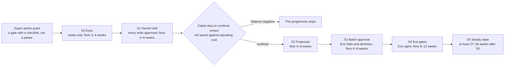
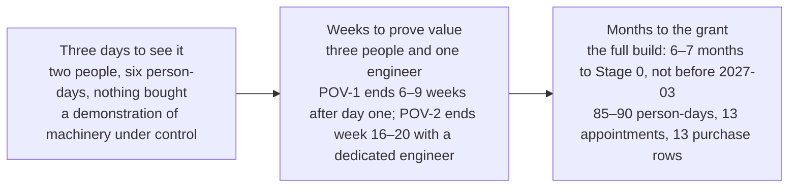

# Sales presentation — the secure agentic platform

## Status
- Owner: the platform owner
- Last reviewed: 2026-09-18
- Who it is for: an audience outside the programme — a sponsor, a peer organisation, a partner — to whom the approach is presented; expert in their own field, not in Google Cloud. Every technical term is defined the first time a slide uses it.
- What it asks of them: hear the approach with its honesty rules intact; take the approach, not a product, because none is offered; count their own roster, decide Super Admin for their own doer, obtain their own prices and start their own toil baseline, in the order slide 17 gives. It does not ask for a price to be approved, because no price is quoted anywhere in the design, and it does not ask for a commitment to full autonomy.
- State on 2026-09-18: nothing is built — no folder, no factory run, no robot account, no witness organisation ([maturity](../README.md#maturity-what-exists-on-2026-09-13)). Every number on a slide links, in its notes or in the closing section, to the page that defines it; the security verdict and the regulatory state re-verified on 2026-09-18 are in [the cross-check review](../14-crosscheck-review.md). `Assumption:` marks an inferred fact. The organisation the design was written for is called "the designing organisation" on these slides; its roster, its decision and its jurisdiction are its own.
- Format: seventeen slides, each with at most six bullets, one table or one diagram, then the notes the presenter says. Appendix slides A1–A4 are backup; A1 says what changes for another organisation. The sentences no slide, note or report may ever use close the deck, with the reason for each.
- Companions: the prose companion is [pitch.md](pitch.md); the internal deck is [../audiences/c-level-presentation.md](../audiences/c-level-presentation.md); the plain-language set is [../plain/README.md](../plain/README.md).

## Slide 1: The proposal in one sentence

- A platform on Google Cloud and Google Workspace for hundreds of agents.
- Three first tenants: Wall-E does, Eve controls, Mo improves.
- Offered: a design, three build procedures, a decision register; no product, no service.
- No price is quoted anywhere; the drivers and the payers are named.
- Giving the doer Super Admin is the designing organisation's decision, designed around.
- The ask is on slide 17: take the approach, count, decide, measure, price.

> Notes: An agent is a program that uses a language model to decide what to do, and may be given tools to act. Google Workspace is an organisation's mail, directory and collaboration tenant. Gemini Enterprise is Google's enterprise assistant; it is the one front door every agent sits behind. Super Admin is the Workspace role with every administrative power, which Google cannot limit to part of the organisation or to a subset of its powers. The designing organisation's platform owner decided on 2026-09-13 that the doer holds it; this deck designs around that decision and never re-argues it. What exists is fourteen design pages, a brief of about 200 pages, three human-executed build procedures and a register of 204 decisions; nothing is sold and nothing runs. On 2026-09-18 nothing on these slides exists ([documents](../README.md#documents); [thesis](../01-hld.md#01-thesis); [the decision](../../../decisions/2026-09-13-wall-e-holds-super-admin.md)).

## Slide 2: The problem: toil, agents arriving anyway, doing nothing

- Where the design was written: one administrator holds every role the platform needs.
- `Assumption:` weekly digests are made by hand today, or not at all.
- The licences already exist; no-code agents can be built inside Gemini Enterprise.
- No policy forces registration; unregistered agents are detected, and unreachable through the front door.
- Without a platform, the second agent re-implements the first agent's controls.
- Three EU AI Act articles already bind; penalty exposure is real now.

> Notes: The designing organisation on 2026-09-13: one administrator, no security operations centre, no second super admin outside the administrator's own line, no security reviewer, no data protection officer engaged. Every role was one person, the finding most likely to stop an automotive security assessment; count your own roster the same way. That the digests on slide 3 are made by hand today, or not at all, is the presenter's `Assumption:`, not the design's. Agents arrive whether or not a platform exists: Gemini Enterprise licences are held, the lowest tier of agent is a no-code assistant inside that app, and no Google policy can force an agent to register. An unregistered agent is found by detection, and because the front door's access list is generated from the register, it cannot be published or called through the platform. Doing nothing has no cost figure, because no benefit figure exists yet ([who exists](../01-hld.md#03-who-exists-on-2026-09-13-and-the-roles-the-platform-needs); [why build it](../brief/02-executive-summary.md#why-build-it-and-how-the-programme-can-stop); [shadow agents](../05-registry-and-autonomy-contract.md#62-the-set-differences-severities-and-the-action-per-difference); [the position](../10-eu-ai-act.md#0-the-position-in-one-paragraph)).

## Slide 3: The promise, as the design states it

- Routine administration done faster and on the record.
- From the read-only stage: weekly digests of changes, unused accounts, unowned groups.
- From the first writing stage: leaver and joiner actions from chat; licence reclaim.
- At batch approval: one operator approves a whole planned run.
- A hundredth agent costs a register row and a factory run.
- No benefit figure exists yet; four weeks of measured toil produce it.

> Notes: The gain, without a number, because none exists. From its read-only stage the doer produces weekly digests: last week's administrative changes, accounts unused for ninety days, suspended accounts still licensed, groups with external members or no owner, administrators checked against a signed list. At its first writing stage it carries out leaver and joiner actions from chat and reclaims licences from suspended accounts; at batch approval one operator approves a whole planned run, where the toil goes. The register is one file in version control every agent needs a row in before it may exist; the factory is the pipeline that builds each agent's own cloud project with its controls already in place, so a hundredth agent inherits controls reviewed once. The saving is *tbd* until four weeks of toil on the top three administrative tasks are measured before the doer's first phase; no "before" can be measured afterwards ([why build it](../brief/02-executive-summary.md#why-build-it-and-how-the-programme-can-stop); [the first act of the build](../setup/README.md#31-blocks)).

## Slide 4: The three agents, and what each never does

| Agent | What it does | What it never does |
|---|---|---|
| Wall-E, the doer | Catalogued Workspace administration a named operator asked for, through an account holding Super Admin | Decides who leaves or is promoted; selects a person by behaviour |
| Eve, the controller | Approves, halts and demotes over plain REST with no model on that path | Holds Super Admin; raises a level; writes to Workspace |
| Mo, the improver | Measures every agent from audit data and proposes changes by pull request | Holds a credential; reaches production except through a merged pull request |

> Notes: An action service is the deterministic code that holds the credential, decides, audits and executes; the model never touches it. REST is a plain web interface any program can call; nothing on Eve's approval path is a model. A pull request is a proposed change named humans review before merging. The rest of each list: Wall-E never decides who is monitored or how anyone performs, never changes the security posture, deletes data, assigns admin roles or spends money, and suspends only once HR or a named operator decided; Eve reads no Wall-E secret; Mo never grades Eve, decides or acts. The standing constraints, restated exactly: no domain-wide delegation, ever; no model holds a credential or produces an approval, a signature, a halt, a veto or a refusal; the action service is the only credential holder; a dry run never mutates; humans raise autonomy and machines lower it; Mo reaches production only through a merged pull request ([Wall-E](../01-hld.md#131-wall-e--the-super-admin-singleton-in-tier-p-sa); [Eve](../01-hld.md#132-eve--independent-controller-two-paths-a-witness-outside-the-tenant-a-second-human); [Mo](../01-hld.md#133-mo--improving-both-one-mo-per-platform-without-touching-eves-independence)).

## Slide 5: Why this design: enforced versus detected

- Every control is enforcement-grade (Google or code refuses) or detection-grade (something sees it).
- Nothing detection-grade stands alone in a safety argument.
- A probabilistic content screen is evidence, never a trust boundary.
- Nothing in Workspace or Google Cloud narrows a super-admin account.
- So for the super-admin tier, detection is the primary control, and stated.
- A leaked robot token is a tenant compromise; custody and detection bound it.

> Notes: This is the honesty the design rests on, and the reason it is not a cheaper one. Two Google facts, as recorded on 2026-09-13 and to be re-verified, fix everything: a service account, the identity a program normally uses, can hold any Workspace admin role except Super Admin, so the doer needs a user account; and Super Admin cannot be limited to an organisational unit or a subset of its powers. The design therefore writes its losses first: the Workspace-side gate is gone, one enforcement point remains (the action service), a leaked token, the credential the action service holds, is a compromise of the whole tenant with a path into the cloud estate, and least privilege becomes a signed deviation. Model Armor, Google's screen for prompts and responses, is probabilistic, so it produces evidence and is never a boundary ([the six primitives](../01-hld.md#02-the-six-containment-primitives-and-how-each-is-graded); [what this reverses](../01-hld.md#what-this-reverses-and-what-it-costs)).

## Slide 6: Why this design: a tier opens only when its people exist

| Tier | What its agents may do | Adds |
|---|---|---|
| C, classical | No-code assistants in Gemini Enterprise; retrieval only; user's own permissions | Nobody new; Security Command Center Premium, organisation-wide |
| R, read tools | Read-only tools in the agent's own project | Nobody new; nothing more bought |
| W, write agents | Writes to a system of record through an action service | Second operator, part-time security reviewer, blind grader |
| P, privileged; P-SA, the singleton | A tenant-level admin credential; for P-SA, Super Admin | Second human super admin, incident commander, DPO; SIEM, witness, keys |
| X, AGI-class | Capabilities beyond the designers' foresight; not open | An AI-safety reviewer who does not exist |

> Notes: The gate is the design's answer to "hundreds of agents" from an organisation of one administrator; what each tier waits on is on backup slide A4. A read-only assistant costs a register row and a factory run; a super-admin robot costs a witness organisation, a second super admin, a bought detection desk and a signed deviation. Security Command Center Premium is Google's organisation-wide security findings service. A SIEM is the security monitoring service that collects logs, runs detections and has a desk that acknowledges pages; the design buys round-the-clock acknowledgement for Tier P rather than running a security operations centre. On 2026-09-13 Tiers C and R could open with the people who existed; W, P and the grant wait for people and purchases; X is closed. The cost of the gate is speed: a sponsor who funds the build but not the people gets a read-only platform ([the tier gate](../01-hld.md#04-the-tier-gate-what-must-exist-before-a-tier-opens); [the roadmap](../brief/29-roadmap-and-cost.md#the-tier-gate)).

## Slide 7: Why this design: the witness, and the second human

- A Workspace super admin can reach everything inside the organisation, Eve included.
- Inside the organisation Eve's independence is therefore detective, not structural.
- Evidence, incident record and pager go to a witness organisation outside the tenant.
- The witness sees Eve's deletion within fifteen minutes; it cannot see a forged approval.
- A second human outside the Wall-E line owns Eve and receives every page.
- Eve watches every human super admin from its first run, before Wall-E exists.

> Notes: Say this plainly, because the objective asked for an independent controller. A Workspace super admin can grant itself the top role on the tenant's Google Cloud organisation, so nothing inside it, Eve's project included, is structurally out of reach; Eve's control path stays inside, and its independence there is detective, not structural. What leaves is structural: Eve pushes its evidence, incident record and heartbeat to a witness organisation, a second, minimal Google organisation on a separate identity tenant run by two people from IT security outside the Wall-E line (P14, open; `Assumption:` a free identity tenant on a distinct domain). The witness holds the absence alarm and sees Eve's deletion within fifteen minutes; it does not see a forged approval. Moving Eve's control path into the witness is the recorded end state (P15), not a condition of the first grant. Eve over the administrators is employee monitoring: a DPO record precedes any Eve job ([Eve's independence](../../eve/01-hld.md#1-eves-independence-detective-inside-the-organisation-structural-through-the-witness); [later decisions](../12-open-decisions.md#6-later)).

## Slide 8: Why this design: humans raise autonomy, machines lower it

> Notes: Autonomy is data, not a mood. Each of the doer's operation families sits at one of six levels, from L0 off to L5 autonomous with independent verification, and climbs on evidence a validator recomputes, never on the calendar. Humans raise a level; machines only lower one. The stages run in the order shown; the weeks are floors, not plans, and the durations only hold if every exit criterion is met first time, so steady state is at least twenty-seven to thirty-eight weeks after Stage 0 begins. Eve's halting and demoting go live at Stage 3 entry, which runs at least thirty days and exits only on catching all twelve seeded faults; Eve's signing arrives at Stage 4. L3, a human approving every action, is a legitimate permanent end state; the gate layer is not funded until a promotion can state how much approval work it removes ([stage overview](../../wall-e/05-autonomy-ladder.md#stage-overview); [stage floors](../brief/29-roadmap-and-cost.md#stage-floors-across-the-three-agents)).

## Slide 9: Proof on a path: three days, then weeks, then months

> Notes: Three build paths, one chain: every artefact carries the full build's names and schemas, so a three-day build or a proof of value that has to be torn down has failed. The three days (`Assumption:` 2026-09-22 to 2026-09-24) need two people, both super admins, and sign no new contract. The proof of value needs three hands-on people, one engineer for forty to sixty-four engineer-days, and sixty to ninety person-days in all; POV-1 ends six to nine weeks after day one and POV-2 ends week sixteen to twenty with a dedicated engineer; with one person writing the code and running the procedures it stretches to twenty-six to thirty-four weeks (`Assumption:` every figure). A sponsor told "three weeks" has been misled about both stages. Only the full build owns the super-admin grant, the sandbox tenant and the witness; its first act is the toil baseline, on day one, on paper if need be ([how it grows](../3-day/README.md#12-how-it-grows); [the two stages](../pov/README.md#4-pov_stage_dates-the-two-stages); [the critical path](../setup/README.md#34-parallel-sittings-and-the-critical-path)).

## Slide 10: What the small paths cannot show

- Three days: no super admin for any agent, no witness, no SIEM.
- Three days produce no Model Armor evidence and save no human minute.
- The proof of value's doer holds no Workspace admin role at all.
- Neither path claims any line of the super-admin gate; only the full build does.
- A clause whose record is missing is struck from the claim, not softened.
- Four sentences are banned from every report and slide; they close this deck.

> Notes: Before the demonstration, not after, tell the sponsor: it is a demonstration of machinery under control, not compliance evidence and not a production grant. In the three days no agent holds Super Admin at any moment; the doer holds one privilege on one organisational unit over four synthetic accounts, and the floor that screens prompts is set but never exercised. In the proof of value the doer holds no admin role, Super Admin goes to no agent ever, and the audit is append-only by convention with alteration detected, not prevented. In both, Eve lives inside the reach of the administrators it watches. One condition before the three days start: Eve polls the production tenant's administrator log, which is monitoring of real employees, so either the DPO record and HR's answer exist or the poll is limited to the two participants with their written consent ([what three days cannot buy](../3-day/README.md#7-what-three-days-cannot-buy); [the POV's claim](../pov/README.md#11-pov_claim_statement); [the cross-check review of 2026-09-18, §5.4](../14-crosscheck-review.md#54-employee-data-and-the-works-council)).

## Slide 11: What it costs: drivers and payers, no price yet

| Cost line | Driver | Paid by | From tier |
|---|---|---|---|
| Security Command Center Premium | Organisation-wide, every project | IT security (`Assumption:` a platform budget line until then) | C |
| Central log ingestion and locked retention, the largest line | Workspace audit volume plus Data Access logs | Platform | R |
| Google SecOps with a managed detection and response retainer | Events per day, retention months, the retainer | IT security | P |
| The witness organisation | One tenant, project, bucket, dataset, channels, two hardware keys | IT security | P |
| Licences and screening: one Workspace licence per Tier P agent; Chrome Enterprise Premium per operator; Model Armor per request | Seats, operators, requests | Agent owner; platform; agent budget | P; W; R |
| Human hours, the binding cost | The roles of slide 12 | Every tier | Every tier |

> Notes: No price is quoted anywhere in the design: pricing pages were not read, every amount is *tbd*, and each line names its driver and its payer instead. Thirteen purchase rows sit on no Google Cloud budget and need their own purchase record, and each has a role that obtains the figure: IT security for the findings service, the monitoring service and the penetration test; the platform owner for log ingestion; procurement for licences and the twenty-two hardware keys, or twenty-six with the twin robots. Managed detection and response is an outside service contracted to watch the super-admin detections and respond round the clock. Log ingestion cannot be cut by cutting evidence, because reconciliation needs Google's record of organisation-wide administrator activity, not only the robot's. Build effort, all `Assumption:`, is on the roadmap page ([cost classes](../01-hld.md#05-cost-classes); [what is not yet priced](../brief/29-roadmap-and-cost.md#what-is-not-yet-priced); [the purchase table](../setup/04-purchases-and-lead-times.md#1-the-purchase-table-longest-lead-time-first)).

## Slide 12: The people it needs, and who existed where it was designed

- Where it was designed, on 2026-09-13: one administrator; every role was one person.
- That is the finding most likely to stop a TISAX assessment.
- Distinct humans: one at Tier R, three at Tier W, four at the grant.
- At the grant, five named humans; four only with a dated ISMS exception.
- Tier W adds a second operator, a security reviewer and a blind grader, part-time.
- Tier P adds a second super admin, an incident commander, a DPO, a desk.

> Notes: The binding cost is people; the numbers are hours, not heads, and a listener maps them onto their own roster. Tier W: a second named operator at about two hours a week, a security reviewer from IT security at about two hours a month, and a blind grader, who grades a weekly sample of work they did not write, at about an hour a week per writing agent. Tier P: a second human super admin outside the Wall-E line as Eve's owner, an incident commander, an engaged DPO, the data protection officer who holds the record permitting the monitoring of administrators, and a bought 24x7 desk. Eve costs under half an hour a week of human time. The ISMS is the organisation's information security management function. The platform owner is never the security reviewer, Eve's owner, the second human or the incident commander; a daily check refuses promotions when roles collide ([roles](../01-hld.md#03-who-exists-on-2026-09-13-and-the-roles-the-platform-needs); [the minimum per stage](../11-tisax.md#72-the-minimum-per-stage); [blocked rows](../setup/README.md#8-blocked-index)).

## Slide 13: How it can stop

- A dated stop-or-continue review at the end of Stage 1, against operating cost.
- A human approving every action (L3) is a legitimate permanent end state.
- The proof of value ends in a dated review: continue, hold, or stop dormant.
- The three-day build unwinds the same day; nothing real is touched.
- Eight kill switches, from halting writes in under a minute to a fleet kill.
- After the grant, named compensation rows turning red pull K6 until green.

> Notes: A signature is not a commitment to full autonomy. At the end of Stage 1 a dated review sets toil saved plus the projected batch-approval saving against operating cost including human hours, and stops the programme if the balance is negative. The proof of value ends in a dated record with three options; in every option nothing is deleted and Eve keeps watching the human super admins. A kill switch is a pre-built way to stop an agent: K0 halts writes with a containment target under sixty seconds; K4 revokes the credential, though a token already issued may stay valid up to sixty minutes (`Assumption:`); K5 suspends the robot account within thirty minutes; K6 removes Super Admin within sixty minutes, the switch that survives a token already minted; K7 stops the whole fleet, drilled monthly. Budgets exist per project with no automatic billing disable; the levers are the switches ([why build it](../brief/02-executive-summary.md#why-build-it-and-how-the-programme-can-stop); [kill switches](../../wall-e/ARCHITECTURE.md#46-kill-switches); [the checklist](../11-tisax.md#63-compensations-as-preconditions--the-checklist-the-gate-reads)).

## Slide 14: The EU AI Act

- Classification follows the declared purpose, the catalogue, not the account's privilege.
- Wall-E: adjacent to Annex III 4(b); the narrow-task derogation claimed and documented.
- Registered in the EU database before the first write; no registration, no production.
- Art. 4, 5 and 50 bind now; Annex III obligations from 2027-12-02.
- Not promised: draft guidelines; no harmonised standard; Super Admin held against it.
- Every date re-verified 2026-09-18; the registration duty survived the Omnibus.

> Notes: "Bulletproof" is declined as a promise; the platform promises mechanisms and evidence, and lists what the regulator or the guidelines still decide. The EU AI Act is Regulation (EU) 2024/1689, amended by Regulation (EU) 2026/1744, the Omnibus. Classification follows the declared purpose, not the account's privilege. Annex III is the Act's high-risk list; point 4(b) covers decisions and monitoring at work, which the doer's declared purpose sits next to, not inside, so the Art. 6(3) derogation for narrow procedural tasks is claimed and signed by legal before the first write, and the register refuses production until the EU-database registration exists. Art. 4 literacy, Art. 5 prohibitions and Art. 50 transparency bind now; Annex III obligations from 2027-12-02. Not promised: the claim rests on draft guidelines, no harmonised standard exists, and Super Admin is the fact most likely held against the narrow-task reading. Every date re-verified 2026-09-18 ([the position](../10-eu-ai-act.md#0-the-position-in-one-paragraph); [what bulletproof can mean](../10-eu-ai-act.md#6-what-bulletproof-can-and-cannot-mean); [the cross-check review of 2026-09-18, §5.1](../14-crosscheck-review.md#51-the-regulatory-state-on-2026-09-18-with-corrections)).

## Slide 15: TISAX

- A label is earned by a site, never a platform; target Confidential, AL2 (`Assumption:`).
- A machine account holding Super Admin deviates from control 4.2.1, least privilege.
- A signed deviation: the owner decides, a reviewer signs, the ISMS enters it.
- Separation of duties: a counted minimum the gate enforces; one person today.
- ISA2027 governs orders from 2027-01-01; the last ISA 6 order date is 2026-12-31.
- Not promised: an assessor may refuse maturity 3 on 4.2.1 however good the compensation.

> Notes: TISAX is the automotive industry's information-security assessment; its questionnaire is the VDA ISA. A label is earned by a site, never a platform; the design makes the platform assessable inside that site, at label Confidential (`Assumption:`) and level AL2, a plausibility check with evidence and interview. A machine account holding Super Admin, which cannot be scoped, deviates from control 4.2.1, least privilege; the design carries a signed deviation with thirteen compensations, all grant preconditions: the owner decides, a reviewer who is not the owner signs, the ISMS enters it in the risk register. Separation of duties is a counted minimum: one human at Tier R, three at Tier W, four at the grant; where the design was written, every role was one person. Any assessment of the platform is ordered in 2027 or later, against ISA2027 (re-verified 2026-09-18); an assessor may still refuse maturity 3 on 4.2.1 ([the TISAX decision](../11-tisax.md#0-what-this-page-decides-in-one-paragraph); [the minimum per stage](../11-tisax.md#72-the-minimum-per-stage); [the cross-check review of 2026-09-18, §5.1](../14-crosscheck-review.md#51-the-regulatory-state-on-2026-09-18-with-corrections)).

## Slide 16: The residual risks a signature accepts

- A stolen robot credential is a tenant takeover; nothing prevents it, detection bounds it.
- Inside the organisation the controller watches a super admin but cannot stop one.
- The safety of the design depends on people who do not exist yet.
- The robot's gate is one process its build pipeline can rewrite.
- Manipulated content will reach the model; ceilings in code stop the action.
- The regulator and the assessor decide outcomes; some Google facts stay unverified.

> Notes: Eight residual risks, in order of consequence, and a sponsor accepts them by signing. The first six are on the slide. The seventh: several Google facts are unverified, whether an access boundary blocks invoking a service, whether the console's access level applies to super admins, how the deny policy spells agent identities, and each is kept out of every safety argument until a test answers it. The eighth: accepted operational limits, one region, tenancy segregation the organisation cannot see, some stores on Google-managed keys, one model family across the fleet. The platform risk register holds seventeen rows; row one, the super-admin robot, is accepted with compensation and signed by the security reviewer, a role that does not exist yet, which is one reason the deviation record cannot be signed today, alongside the missing SIEM, witness and second human ([the risks a sponsor accepts](../brief/23-threat-model-and-residual-risk.md#the-residual-risks-a-sponsor-accepts-by-signing); [the risk register](../11-tisax.md#10-the-risk-register-p140); [the cross-check review of 2026-09-18, §4](../14-crosscheck-review.md#4-security)).

## Slide 17: The ask

- Take the approach, not a product: five things, one gate, two grades, banned sentences.
- Count your own roster first; one person in every role keeps the grant closed.
- Decide Super Admin for your doer yourselves; slide 5 follows only if you do.
- Start the toil baseline before any doer's first phase; no "before" exists afterwards.
- Obtain your own prices; none exist anywhere in this design.
- Send your works-council and DPO questions on day one.

> Notes: Nothing here is for sale. Five things: a folder where every control is set once, a factory that builds each agent's project with its controls in place, a register every agent needs a row in before it exists, a contract every writing agent adopts, and a gate that opens a tier only when its people and purchases exist; two grades for every control; four sentences nobody may use. Count your roster first, because the gate counts distinct humans and one person in every role keeps the super-admin grant closed. Super Admin for a doer is a decision, not a design property; without it that doer needs no deviation, witness or desk. Measure four weeks of toil before any doer's first phase; no "before" exists afterwards. Obtain your own prices: none exists. Send the works-council and data-protection questions on day one, the longest item in the plan ([thesis](../01-hld.md#01-thesis); [the minimum per stage](../11-tisax.md#72-the-minimum-per-stage); [day-one items](../brief/29-roadmap-and-cost.md#day-one-lead-time-items); [what is not yet priced](../brief/29-roadmap-and-cost.md#what-is-not-yet-priced)).

## Appendix

## Slide A1: What changes for another organisation

- The Super Admin decision (P33) is the designing organisation's; another decides its own.
- The starting roster (one administrator, no SOC) is the designing organisation's; re-count yours.
- Jurisdiction, works-council law, SOC and ISMS are unknown here; establish yours as facts.
- Existing licences, the Gemini Enterprise project and the Workspace edition change Tier C.
- Google's mechanisms; the nine promises and twelve demands port; two super-admin facts do not.
- What does not change: the constraints, the grades, the gate, the banned sentences.

> Notes: The facts that change are the ones this deck marks as the designing organisation's or as `Assumption:`. Super Admin for a doer is a decision; slide 5 follows only if it is taken. The roster sets which gates open on day one, so count your administrators, your security operations centre if one exists and your ISMS names. Jurisdiction fixes whether the works council is informed or consulted. Under the EU AI Act you are provider and deployer of what you build; the legal entity is yours to name. The charter's promises and demands (a register row before existence, never a credential in the reasoning layer, never both decide and act, removable by deleting the project) hold whatever the vendor; the two facts that shape P33 — a service account cannot hold Super Admin, and Super Admin cannot be scoped — are Google's and do not transfer. Nothing is built; no price exists ([the charter](../01-hld.md#1-the-platform-charter); [what this reverses](../01-hld.md#what-this-reverses-and-what-it-costs); [non-goals](../01-hld.md#16-what-the-platform-does-not-do)).

## Slide A2: The numbers behind the deck

| Number | Value | Defined at |
|---|---|---|
| Decisions in the register | 204 (P1–P204); one decided, P33; the rest proposed, open or spikes | [the register in one screen](../12-open-decisions.md#0-the-register-in-one-screen) |
| Distinct humans per stage | 1 at Tier R, 3 at Tier W, 4 at the grant, 4 plus a bought desk at Stage 3; five is the clean state | [the minimum per stage](../11-tisax.md#72-the-minimum-per-stage) |
| Compensations at the grant | 13, plus 4 checklist rows: penetration test, DPIA, tabletop, witnessed key custody | [the checklist](../11-tisax.md#63-compensations-as-preconditions--the-checklist-the-gate-reads) |
| Kill switches | 8, K0 to K7; K7 has four levers | [kill switches](../../wall-e/ARCHITECTURE.md#46-kill-switches) |
| Stage floors | S0 3–4 weeks, S1 4–6, S2 6–8, S3 6–8, S4 8–12; S5 at least 27–38 weeks after S0 | [stage overview](../../wall-e/05-autonomy-ladder.md#stage-overview) |
| Hardware keys | 22, or 26 with the twin robots; 18 firm | [the key count](../setup/04-purchases-and-lead-times.md#4-hardware-keys-the-count-stated-once-and-the-inventory) |

> Notes: Backup for the questions a finance or security lead asks after slide 11 or slide 12. The register of record holds every platform decision in one numbered sequence, and a gate is green only when every row in its group is decided, closed, proposed or a passed test; on 2026-09-14 rows keep every gate red, several for reasons nobody can act on until the owner fixes the counting rule. A DPIA is the data protection impact assessment the DPO owns, the longest lead item in the plan; the tabletop is the crisis rehearsal with the DPO, legal and HR or employee representatives. Hardware keys are the physical second factor every super admin account, human or robot, must present; two per account, with spares, witnessed into custody. Super admins in steady state are exactly three: two humans, one outside the Wall-E line, and the robot, which is never the only nor the recovery super admin ([the roster](../12-open-decisions.md#4-before-the-super-admin-grant)).

## Slide A3: What the platform will not do

- It does not narrow a super-admin account; nothing in Google can.
- No model produces an approval, a signature, a halt, a veto or a refusal.
- It does not automate the Admin console under any robot session.
- It does not run a SOC; it buys acknowledgement and feeds an existing one.
- It grants domain-wide delegation to nothing, ever; it trains no model.
- It does not promise EU AI Act or TISAX outcomes; mechanisms and evidence only.

> Notes: The non-goals, for the moment a listener asks for more than the design offers. Domain-wide delegation is a Workspace mechanism that lets a program act as any user in the tenant; the platform grants it to nothing. Console-only work is not automated by any robot session, by browser or by computer use; it becomes written steps to a human and a watch for the matching event. The platform does not back up Workspace, does not evaluate model capabilities, does not detect deception and does not claim containment of agents of general capability: the tier for those, Tier X, refuses every Google service until written conditions hold, of which one is met in 2026. It hosts no second super-admin agent, no third-party agent without a supplier record and no agent without a register row ([what the platform does not do](../01-hld.md#16-what-the-platform-does-not-do); [the honest line](../01-hld.md#115-the-honest-line)).

## Slide A4: What each tier waits on

| Tier | Opens when |
|---|---|
| C, classical | The register and the Gemini Enterprise baseline exist |
| R, read tools | The factory, the folder baseline, central logging and the shared registry exist |
| W, write agents | The autonomy contract, a platform verifier, a validator custodian, a nonprod folder, one restore drill; works-council information for any agent acting on employee accounts |
| P, privileged; P-SA, the singleton | Everything in W plus every precondition of the super-admin grant |
| X, AGI-class | Not open in 2026; a sandbox tier in the EU, a capability-evaluation report per model pin, an AI-safety reviewer, six months of fleet-kill drills, an independent-model monitor |

> Notes: Backup for slide 6. Each row names what must exist before the tier opens; the people are on slides 6 and 12. The autonomy contract is the set of rules every writing agent adopts for autonomy, audit and measurement; the platform verifier is the model-free service that approves, halts and demotes for the writing tiers, where Tier P has a dedicated Eve; the validator custodian holds the identity that recomputes every promotion's evidence; the restore drill proves a backup boots halted and only a human clears it. For Tier P, every precondition of the super-admin grant means the thirteen compensations and the four checklist rows on slide A2. Tier X lists more unmet conditions than any page counts the same way; the brief records the difference and no page resolves it. The setup procedures re-order Tier C after Tier R for the build, because the tenant-app import needs the factory ([the tier gate](../01-hld.md#04-the-tier-gate-what-must-exist-before-a-tier-opens); [the honest line](../01-hld.md#115-the-honest-line); [the setup decisions](../12-open-decisions.md#6a-proposed-by-the-setup-procedures-p144p191)).

## The sentences never to be used

Copied from the two build paths that forbid them. They are listed here so that no slide, note, script or report about this platform uses them, and each carries the reason.

From the proof of value ([never to be used](../pov/README.md#12-never-to-be-used-in-any-report-slide-or-message-about-the-pov)):

1. "Wall-E is safe as a super admin." Nothing in Track A touches super-admin containment (G10, G11, G14, G20, Eve G-7 need Track B, §3). Nor may any report say or imply that the doer "does admin work": it holds no Workspace admin role.
2. "Eve is independent." Independence in the design is structural (a witness organisation, a second tenant). The POV has neither (PV-D-03), and its Eve lives inside the reach of the administrators it watches.
3. "Model Armor blocked the injection." A probabilistic content screen is never a trust boundary, whatever its grade ([01-hld.md](../01-hld.md) §0.2). It produced evidence.

From the three-day build ([never to be used](../3-day/README.md#11-never-to-be-used-in-any-report-slide-or-message)), the same three and one more:

1. "Wall-E is safe as a super admin." Nothing here touches super-admin containment. No agent holds Super Admin at any moment of the three days.
2. "Eve is independent." Independence in the design is structural: a witness organisation, a second tenant. This set has neither (C-01), and its Eve lives inside the reach of the administrators it watches.
3. "Model Armor blocked the injection." A probabilistic content screen is never a trust boundary. And nothing here exercises it: no step sends anything through the floor, so these three days produce **no Model Armor evidence at all**, only the floor settings themselves (C-22).
4. "We saved `<n>` minutes of admin work." The doer acted only on synthetic accounts. No human minute was saved, and Mo's scorecard says so in bold (C-07).

Why the deck keeps to them: the design's own honesty is that a super-admin robot moves the platform from "Google refuses" to "code refuses and detection watches", that Eve's independence inside the organisation is detective and only the witness makes it structural, that a probabilistic screen produces evidence and never a boundary, and that no benefit figure exists until four weeks of toil are measured. A sentence that contradicts any of those would sell something the design does not contain.

## Where this is defined

- The objective and its qualified readings: [00-objective-review.md §1](../00-objective-review.md#1-the-objective); [traceability](../01-hld.md#06-traceability-the-objectives-sixteen-requirements-and-the-register-ids-not-cited-elsewhere).
- State on 2026-09-18, nothing built, and what exists instead: [README, maturity](../README.md#maturity-what-exists-on-2026-09-13); [README, status](../README.md#status); [README, documents](../README.md#documents).
- The thesis, the six primitives and their grades, the tier gate, cost classes, the roles, the charter: [01-hld.md §0.1](../01-hld.md#01-thesis), [§0.2](../01-hld.md#02-the-six-containment-primitives-and-how-each-is-graded), [§0.3](../01-hld.md#03-who-exists-on-2026-09-13-and-the-roles-the-platform-needs), [§0.4](../01-hld.md#04-the-tier-gate-what-must-exist-before-a-tier-opens), [§0.5](../01-hld.md#05-cost-classes), [§1 the charter](../01-hld.md#1-the-platform-charter).
- What Super Admin reverses and costs, and the standing constraints: [what this reverses](../01-hld.md#what-this-reverses-and-what-it-costs); [HLD status](../01-hld.md#status); [the decision of 2026-09-13](../../../decisions/2026-09-13-wall-e-holds-super-admin.md).
- The three agents: [Wall-E](../01-hld.md#131-wall-e--the-super-admin-singleton-in-tier-p-sa); [Eve](../01-hld.md#132-eve--independent-controller-two-paths-a-witness-outside-the-tenant-a-second-human); [Mo](../01-hld.md#133-mo--improving-both-one-mo-per-platform-without-touching-eves-independence); [Wall-E's declared purpose](../10-eu-ai-act.md#311-the-declared-intended-purpose-the-sentence-the-assessment-rests-on); [Mo's thesis](../../mo/01-hld.md#thesis).
- Unregistered agents: [the register's reconciliation](../05-registry-and-autonomy-contract.md#62-the-set-differences-severities-and-the-action-per-difference).
- Eve's independence and the witness: [Eve's HLD §1](../../eve/01-hld.md#1-eves-independence-detective-inside-the-organisation-structural-through-the-witness); [the end state P15](../12-open-decisions.md#6-later); [Eve's cost](../../eve/01-hld.md#cost).
- The ladder, the stages and the kill switches: [stage overview](../../wall-e/05-autonomy-ladder.md#stage-overview); [the grant as a gate](../../wall-e/05-autonomy-ladder.md#the-super-admin-grant--a-gate-not-a-stage); [kill switches](../../wall-e/ARCHITECTURE.md#46-kill-switches); [stage floors](../brief/29-roadmap-and-cost.md#stage-floors-across-the-three-agents).
- The promise, the exits and the sponsor's list: [why build it](../brief/02-executive-summary.md#why-build-it-and-how-the-programme-can-stop); [what the sponsor is asked for](../brief/02-executive-summary.md#what-the-sponsor-is-asked-for-in-order); [the tier gate on the roadmap](../brief/29-roadmap-and-cost.md#the-tier-gate); [day-one items](../brief/29-roadmap-and-cost.md#day-one-lead-time-items).
- Money: [cost classes](../brief/29-roadmap-and-cost.md#cost-classes); [the agents' own estimates](../brief/29-roadmap-and-cost.md#the-agents-own-estimates); [what is not yet priced](../brief/29-roadmap-and-cost.md#what-is-not-yet-priced); [the purchase table](../setup/04-purchases-and-lead-times.md#1-the-purchase-table-longest-lead-time-first); [costs on no Google Cloud budget](../setup/04-purchases-and-lead-times.md#5-costs-that-sit-on-no-google-cloud-budget); [the key count](../setup/04-purchases-and-lead-times.md#4-hardware-keys-the-count-stated-once-and-the-inventory).
- The three build paths: [the three-day build](../3-day/README.md#status), [its team](../3-day/README.md#3-the-team-and-what-they-hold), [what it cannot buy](../3-day/README.md#7-what-three-days-cannot-buy), [its unwind](../3-day/README.md#10-the-unwind-before-anything-real-is-touched), [how it grows](../3-day/README.md#12-how-it-grows); [the proof of value](../pov/README.md#status), [its claim](../pov/README.md#11-pov_claim_statement), [its two stages](../pov/README.md#4-pov_stage_dates-the-two-stages), [its exit P204](../12-open-decisions.md#6b-proposed-by-the-proof-of-value-set-p192p204); [the full build](../setup/README.md#1-what-the-set-builds-and-what-it-replaces), [its first block](../setup/README.md#31-blocks), [its critical path](../setup/README.md#34-parallel-sittings-and-the-critical-path), [its blocked rows](../setup/README.md#8-blocked-index).
- The law and the standard: [EU AI Act, the position](../10-eu-ai-act.md#0-the-position-in-one-paragraph), [the regulatory state](../10-eu-ai-act.md#1-the-regulatory-state-on-2026-09-13), [what bulletproof can and cannot mean](../10-eu-ai-act.md#6-what-bulletproof-can-and-cannot-mean), [workers and the works council](../10-eu-ai-act.md#410-art-267-2611-art-86--workers-and-the-explanation-path-p129); [TISAX, the decision](../11-tisax.md#0-what-this-page-decides-in-one-paragraph), [TISAX on the verified date](../11-tisax.md#1-tisax-on-2026-09-13-verified), [the target](../11-tisax.md#2-the-target--label-level-scope-catalogue-p133), [the deviation](../11-tisax.md#61-what-the-deviation-is-in-isa-terms), [the record](../11-tisax.md#62-the-record--decisions2026-09-13-wall-e-holds-super-adminmd), [the checklist](../11-tisax.md#63-compensations-as-preconditions--the-checklist-the-gate-reads), [the minimum per stage](../11-tisax.md#72-the-minimum-per-stage), [module scope](../11-tisax.md#3-module-scope--data-protection-and-prototype-protection-p134).
- Risks: [the residual risks a sponsor accepts](../brief/23-threat-model-and-residual-risk.md#the-residual-risks-a-sponsor-accepts-by-signing); [the risk register](../11-tisax.md#10-the-risk-register-p140); [employees and personal data](../brief/26-personal-data-and-employees.md#227-workers-information-consultation-and-the-explanation-path-p129).
- The cross-check review of 2026-09-18: [the verdict](../14-crosscheck-review.md#0-the-verdict); [security](../14-crosscheck-review.md#4-security); [the path to the regulation](../14-crosscheck-review.md#5-the-path-to-the-regulation), with [the regulatory state re-verified on 2026-09-18](../14-crosscheck-review.md#51-the-regulatory-state-on-2026-09-18-with-corrections).
- Decisions: [the register in one screen](../12-open-decisions.md#0-the-register-in-one-screen); [before the super-admin grant](../12-open-decisions.md#4-before-the-super-admin-grant); [the owner's first actions](../brief/30-decisions-awaiting-owner.md#first-actions).
- Non-goals: [what the platform does not do](../01-hld.md#16-what-the-platform-does-not-do); [the honest line](../01-hld.md#115-the-honest-line).
- Vocabulary: [the glossary](../brief/31-glossary.md).
- The other documents of this set: [pitch.md](pitch.md); [../audiences/README.md](../audiences/README.md); [executive brief](../audiences/executive-brief.md); [C-level presentation](../audiences/c-level-presentation.md); [security team](../audiences/security-team.md); [compliance and regulation](../audiences/compliance-and-regulation.md); [HR and works council](../audiences/hr-and-works-council.md); [enterprise architecture](../audiences/enterprise-architecture.md); the plain-language set at [../plain/README.md](../plain/README.md).
