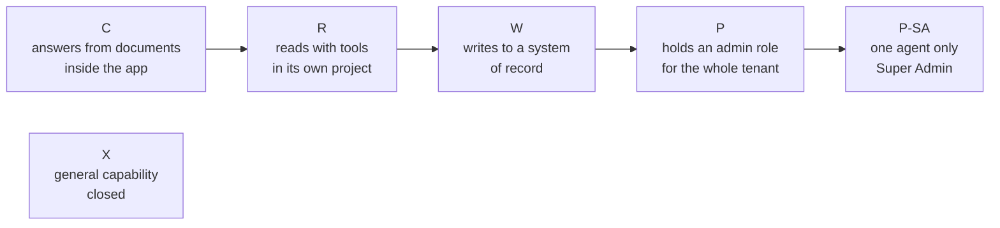

# What we are building

## Status

- Owner: the platform owner
- Last reviewed: 2026-09-18
- What this page is: the platform in plain words — its one front door, the five things it is made of, the six tiers of trust, why the hundredth agent is cheap, and the tier that stays closed.

## In one sentence

We are designing a fenced, watched place inside the organisation's Google Cloud where software helpers can be added one by one, each allowed to do only as much as the people and services watching it can support.

## First, the honest frame

Nothing is built. Every sentence on this page describes a design, a procedure or a decision about something that does not exist on 2026-09-18. There is no shared place in Google Cloud for agents, no automatically built project, no list of agents, no robot account and no outside copy of the evidence. Each of these is explained below. The design was written so that whoever builds it starts from the plan and not from scratch ([README.md#status](../README.md#status)).

This page explains the platform. The three agents that would live on it first (Wall-E, Eve and Mo) have their own page: [02-the-three-agents.md](02-the-three-agents.md). They are the platform's first tenants, not its definition ([01-hld.md §0.1](../01-hld.md#01-thesis)).

## A few words before we start

An **agent** is a program that uses a language model to decide what to do, and may be given tools to act. A **language model** is the kind of software behind a chatbot: it reads text and produces text, and it can be wrong. **Google Workspace** is the organisation's email, calendar, documents and user directory, run by Google. **Google Cloud** is the Google service where an organisation rents computers, storage and other building blocks. The organisation's whole Workspace, with all its accounts, is called its **tenant**.

## The front door: the Gemini Enterprise app

**Gemini Enterprise** is Google's application in which an employee talks to AI helpers. The platform makes one such app, for the whole tenant, the only front door for every agent a human talks to. Agents that no human talks to, such as Eve's control machinery and Mo's jobs, are not published in it ([01-hld.md §2.1](../01-hld.md#21-the-tenant-app-and-its-project)).

Think of the front door as a reception desk with a list. An agent gets through only if it is on the list. The list is generated from the register (explained below), so an agent that has no register row cannot even be reached from the app by the network.

Four things are set at the front door and stay set:

| At the front door | What it means for a reader |
|---|---|
| Location `eu` | The app is created in Google's EU location, so the app and its stored data stay in the European Union; an app created in Google's worldwide location instead cannot be used and stops the build ([12-open-decisions.md, P164](../12-open-decisions.md#6a-proposed-by-the-setup-procedures-p144p191)) |
| Connectors on an allow-list | A **connector** is a link from the app to a data source; only listed ones are permitted, and none of them may write to Workspace |
| Model Armor on | **Model Armor** is Google's screen for what goes into and comes out of an agent; it produces evidence and is never treated as a fence, because it works by probability and can miss |
| Conversation history kept 30 days | `Assumption:` an interim value until the data protection officer sets the real one ([12-open-decisions.md, P13](../12-open-decisions.md#3-before-any-tier-w-agent-writes)) |

A simple agent built inside the app without code is still an agent. It is created only after its register row exists, and every night the app's agents are compared with the register. An agent with no row is a finding and is taken down ([01-hld.md §2.2](../01-hld.md#22-how-agents-are-admitted-shared-and-revoked)).

One sentence must never appear in any report, slide or message about the two smaller ways of starting (a three-day demonstration and a trial of several weeks called the proof of value, both on [06-three-ways-to-start.md](06-three-ways-to-start.md)): "Model Armor blocked the injection." An injection is text planted in a document to trick the model. A screen that guesses is never a fence; it produced evidence, nothing more ([pov/README.md §12](../pov/README.md#12-never-to-be-used-in-any-report-slide-or-message-about-the-pov); [3-day/README.md §11](../3-day/README.md#11-never-to-be-used-in-any-report-slide-or-message)).

## The five things

The platform is five things. None of them is an agent ([01-hld.md §0.1](../01-hld.md#01-thesis); [brief/02](../brief/02-executive-summary.md#what-is-proposed-a-platform-of-which-the-three-agents-are-the-first-tenants)).

### 1. A folder: the house rules, set once

In Google Cloud, resources are arranged in a tree, like folders on a computer. A rule set on a folder applies to everything inside it, and nobody inside can remove it. The platform is one such folder tree, and every rule that Google can enforce is set there once, where one person can own it ([01-hld.md §3.1](../01-hld.md#31-folder-tree)).

The everyday comparison is a building whose house rules are fixed at the entrance. A tenant on the third floor cannot repaint the fire exits. The rules that live at the folder include **organisation policy** (settings that say which Google services may be used at all), **deny rules** (lists of actions that agent identities are refused whatever a project grants), and the fleet kill switch, one action that stops every agent at once ([01-hld.md §0.2](../01-hld.md#02-the-six-containment-primitives-and-how-each-is-graded)).

Everything runs in one European location, `europe-west1`, and the large data store lives in an EU-wide location ([project-topology.md §2](../../project-topology.md#2-the-four-projects)). The full design implies 22 folders ([12-open-decisions.md, P193](../12-open-decisions.md#6b-proposed-by-the-proof-of-value-set-p192p204)).

### 2. A factory: identical projects, stamped out

A **project** is the box in Google Cloud in which one piece of software lives, with its own identity, its own bills and its own permissions. Every agent gets a project of its own. That is forced by Google, not chosen: agents that share a project must share the same single door to the outside (the gateway, explained below), and the permission the front-door app needs applies to a whole project, not to one agent inside it ([project-topology.md §1](../../project-topology.md#1-why-four-projects)).

The **factory** is a pipeline, a script run by a machine identity and not by a person, that creates each agent's project with everything already in place: an identity, a **gateway** (the one door through which the agent may talk to the outside), logging, a budget and the deny rules ([01-hld.md §3.2](../01-hld.md#32-the-factory)). It takes two inputs only: the agent's register row and its manifest, a short file describing the agent. It finishes in under an hour. After the run, nobody keeps standing owner rights on the project; a human gets them back only for a limited, justified, logged period.

The comparison is a factory that stamps out identical parts. The tenth project is the same shape as the first, so the controls reviewed once hold for all of them.

### 3. A register: you must be in it before you exist

The **register** is one file per agent in **version control**, a system that keeps every version of a file and records who changed what and who approved it. Google offers a product called Agent Registry, but it cannot be made mandatory and holds no owner or classification, so the file is the inventory of record and Google's registry is only a copy written from it ([01-hld.md §5.1](../01-hld.md#51-the-inventory-of-record-is-a-git-file-not-a-product)).

The comparison is a civil register. A person who is not in it does not exist for the state. An agent whose row has not been merged by two reviewers cannot be built, cannot be published and cannot be reached.

Each row must name the agent's purpose, its owner and cost centre, its tier, its risk class, how far it may act on its own (its autonomy, explained next), what kinds of data it touches, its class under the EU AI Act (the European Union's law on artificial intelligence), the exact model version it uses, who verifies it, what privilege it holds, and its status. An automatic check refuses the merge if any mandatory field is missing. The same check refuses a second row holding Super Admin while one exists ([01-hld.md §11.3](../01-hld.md#113-p-sa-the-super-admin-singleton)).

### 4. A contract: the rules every writing agent adopts

The **autonomy contract** is the set of rules that any agent able to change things must follow: how much it may do on its own, how it records what it did, and how it is measured ([01-hld.md §12](../01-hld.md#12-the-autonomy-contract)). **Autonomy** here means how far the agent may go before a human must say yes.

Its core rule is short: humans raise autonomy, machines lower it. An agent climbs a ladder of levels on evidence, never on the calendar, and the climb is a change request a human approves after an independent check recomputes the evidence. Even at the top of the ladder, the actions with the largest consequences, such as suspending an account, never reach the last level, where the agent acts fully on its own. And any operation that needs the full administrator power (explained under Tier P-SA below) stays for ever at the level where a human approves each action ([01-hld.md §12.1](../01-hld.md#121-the-ladder--unchanged-rules-platform-defaults)). The ladder itself is explained in [03-how-it-is-kept-safe.md](03-how-it-is-kept-safe.md).

The comparison is a driving licence with stages. A learner drives with an instructor beside them; the instructor decides when that changes, and a bad drive sends the learner back a stage.

### 5. A gate: a tier opens when the people are there

The **gate** is the rule that a tier of agents opens only when the people and the bought services that tier needs exist ([01-hld.md §0.4](../01-hld.md#04-the-tier-gate-what-must-exist-before-a-tier-opens)). On 2026-09-13 the organisation had one administrator holding every role. A gate is what stops the design from assuming a second person who is not there.

The comparison is a lift that moves only when the required number of people are inside. Nobody can argue with it, and it is not rude; it is waiting for the second person.

## The ladder of trust: six tiers

A **tier** is a letter that says what an agent may do, and therefore which controls, people and purchases must exist before it runs. The letters are C, R, W, P, P-SA and X. They are letters, not numbers, so that nobody confuses a tier with the numbered trigger classes used elsewhere in the design ([02 §1.1](../02-landing-zone-and-tiers.md#11-letters-not-numbers-and-how-the-briefs-t0tx-map)).

### What each tier may do

| Tier | What the agent may do | Where it lives | Who checks its work |
|---|---|---|---|
| **C**, classical | Answer questions from documents, using only the permissions of the person asking; no code of its own | Inside the front-door app, no project of its own | Nobody dedicated |
| **R**, read tools | Read from other systems through tools, always via its gateway | Its own project in the R folder | Nobody dedicated |
| **W**, write agents | Change records in a **system of record** (the place a fact officially lives, such as the user directory), through an **action service**, a separate piece of ordinary code that holds the credential and does the writing | Its own project in the W folder | The platform verifier, a checker with no language model in it |
| **P**, privileged | Its action service holds a **credential** (a key or token that proves who is acting) carrying a Workspace administrator role over the whole tenant | Its own project in the P folder | A dedicated Eve |
| **P-SA**, the super-admin singleton | As P, but the role is **Super Admin**, the Workspace role with every administrative power, which Google cannot limit to part of the organisation or a subset of its powers | Its own project in the P-SA folder | A dedicated Eve |
| **X**, general capability | Would run code it wrote, pursue goals it set, or use abilities its designers cannot list | A folder that exists, is empty and refuses every service | Closed; see below |

Sources: [01-hld.md §11.1](../01-hld.md#111-tiers-and-mandatory-controls); Super Admin per [01-hld.md, what this reverses](../01-hld.md#what-this-reverses-and-what-it-costs).

Three rules decide an agent's tier once, at its register row, so nobody argues an agent down a tier ([02 §1.2](../02-landing-zone-and-tiers.md#12-the-admission-test-which-tier-an-agent-is)):

- The credential decides, not the intent. A "read-only" agent whose action service holds a key that can change things is Tier W.
- The highest component decides. An agent whose chat part is harmless but whose action service holds an administrator role is Tier P as a whole.
- X is answered first, and an agent that fits X is refused outright.

Exactly one agent on the platform may hold Super Admin. That agent is Wall-E, by a decision the platform owner took on 2026-09-13 (P33). The design does not re-argue that decision; it works around it, and the working-around is the subject of [03-how-it-is-kept-safe.md](03-how-it-is-kept-safe.md) ([01-hld.md §11.3](../01-hld.md#113-p-sa-the-super-admin-singleton); [decisions/2026-09-13](../../../decisions/2026-09-13-wall-e-holds-super-admin.md)).

### What must exist before each tier opens

| Tier | Opens when | Bought | People added |
|---|---|---|---|
| **C** | The register and the front-door baseline exist | Gemini Enterprise licences (they exist); **Security Command Center Premium**, Google's organisation-wide service that reports security findings | Nobody new |
| **R** | The factory, the folder rules, central logging and the shared registry exist | Nothing more | Nobody new |
| **W** | The autonomy contract, the platform verifier, a custodian for the independent recompute, a non-production folder (a copy for practice, never the real thing) and one rehearsed restore from backup exist; for any agent acting on employee accounts, the works council has been informed before its first writing stage (P129) | A build-time check that only reviewed software can run (no licence cost) | A second operator (about 2 hours a week); a part-time security reviewer from IT security (about 2 hours a month); a **blind grader**, a person who did not write the agent's routines and grades a weekly sample of its work (about 1 hour a week per agent) |
| **P** and **P-SA** | Everything in W, plus every precondition of the super-admin grant: Eve watching, the witness organisation, a round-the-clock security desk, two human super admins, a paid attempt to break in, the data-protection assessment, works-council information, the signed exception (a written admission that one security rule is broken on purpose, and why), the two signed lists (what the robot may never do, and what it may do only with two people), and a decision on the network boundary | A SIEM in the EU, or the organisation's own; a managed detection and response retainer; a paging service; hardware keys; the witness organisation (each explained below) | A second human super admin outside the Wall-E administration line, as Eve's owner; an engaged data protection officer; an incident commander from IT security |
| **X** | Not open; conditions below | Would need a sandbox tier in `europe-west1` and a second model family | Would need an AI-safety reviewer, a role that does not exist |

The purchases in the P row, in plain words:

- A **SIEM** (security information and event management) is the service that collects the logs from every system, runs the detections on them and has a desk that answers when one fires.
- **Managed detection and response** is an outside team paid to watch those detections and respond around the clock.
- A **paging service** is what wakes the right person when a serious alarm fires.
- **Hardware keys** are small physical devices that must be plugged in to sign in, so a stolen password alone is not enough.
- The **witness organisation** is a separate Google organisation run by IT security that keeps a copy of the evidence outside the tenant's reach; the comparison is a witness who keeps a copy outside the building.
- A **penetration test** is the paid attempt to break in named in the row.

Source: [01-hld.md §0.4](../01-hld.md#04-the-tier-gate-what-must-exist-before-a-tier-opens); staffing hours [01-hld.md §0.3](../01-hld.md#03-who-exists-on-2026-09-13-and-the-roles-the-platform-needs).

The super-admin grant, the day the robot account receives Super Admin, is a gate with its own checklist, not a phase of the build. It happens on the day the last row of the P line is green, and on that day the state in which one person holds every owner role expires ([01-hld.md §0.4](../01-hld.md#04-the-tier-gate-what-must-exist-before-a-tier-opens)). Below Tier P, an alarm is looked at the next business morning, and the design says so ([01-hld.md §0.6](../01-hld.md#06-traceability-the-objectives-sixteen-requirements-and-the-register-ids-not-cited-elsewhere)).

Where the gates stood on 2026-09-13: Tiers C and R can open with the people who exist. Tier W, Tier P and the super-admin grant wait on people, bought services and the decisions listed in the register's grant group. Tier X is closed ([README.md, maturity](../README.md#maturity-what-exists-on-2026-09-13)).

One correction from the build procedures: the design page opens Tier C before Tier R, but the build does it the other way round, because importing the front-door app needs a factory module that only exists once Tier R's groundwork is done (P156, pending the owner's signature; [12-open-decisions.md §6a](../12-open-decisions.md#6a-proposed-by-the-setup-procedures-p144p191)).

Tier P is meant to stay rare by policy: each Tier P agent needs a licensed Workspace user of its own and an administrator role, paid by the agent owner's cost centre ([01-hld.md §0.5](../01-hld.md#05-cost-classes)).

## Why the hundredth agent is cheap

The thesis is one sentence from the design: "A read-only assistant costs a register row and a factory run. A super-admin robot costs a witness organisation, a second super admin, a bought detection desk and a signed deviation." ([01-hld.md §0.1](../01-hld.md#01-thesis)). The signed deviation is the signed exception described in the gate table above.

The reason is where the controls sit. Every rule Google can enforce is set once at the folder. Every project comes out of the factory the same shape. So a new Tier C or Tier R agent inherits controls that were reviewed once, and the person adding it does not rebuild security ([brief/02, hundreds of agents](../brief/02-executive-summary.md#hundreds-of-agents-and-a-closed-tier-for-agents-of-general-capability)).

What does limit the count is people, not projects. An agent that writes climbs its ladder only on the evidence of humans grading a blind sample of its work, about an hour a week per Tier W agent. The number of writing agents is therefore capped by named grading hours, and that cap (P25) is still open, to be measured after the first Tier W agent's first quarter ([01-hld.md §11.1](../01-hld.md#111-tiers-and-mandatory-controls); [12-open-decisions.md, P25](../12-open-decisions.md#3-before-any-tier-w-agent-writes)).

The gate has a price, and it is speed. In the design's words, "a sponsor who funds the build but not the people gets a read-only platform" ([brief/29, the tier gate](../brief/29-roadmap-and-cost.md#the-tier-gate)). What the platform costs in money and what it returns is [07-what-it-costs-and-what-you-get.md](07-what-it-costs-and-what-you-get.md); no price is quoted anywhere in the set.

## The closed tier: agents of general capability

The objective asks for a platform that can host future agents of general capability, sometimes called AGI, artificial general intelligence. The design declines this for 2026. Tier X is a folder that exists, is empty and refuses every Google service, and it stays that way until written conditions hold ([01-hld.md §0.6](../01-hld.md#06-traceability-the-objectives-sixteen-requirements-and-the-register-ids-not-cited-elsewhere); [01-hld.md §11.5](../01-hld.md#115-the-honest-line)).

The platform does not evaluate what a model can do, does not detect deception and does not claim to contain an AGI. Running code that an agent wrote is switched off for the whole fleet below Tier X ([01-hld.md §16](../01-hld.md#16-what-the-platform-does-not-do)).

The opening conditions, and where each stood on 2026-09-13 ([09 §5.4](../09-supply-chain-secrets-recovery.md#54-the-honest-line-restated-with-what-changed-on-2026-09-13)):

| Condition | Plain meaning | Standing on 2026-09-13 |
|---|---|---|
| A **sandbox** tier exists in the EU at general availability | A sealed box in which untrusted code can run without reaching anything else; Google's product for this is GKE Agent Sandbox | Met |
| A provider capability-evaluation report exists per **model pin** | For each exact model version used, the model's maker has published a report on what the model can do; a field for it exists, nothing fills it | Not met |
| An AI-safety reviewer role exists | A named person qualified to review such agents; the role does not exist | Not met |
| The fleet kill switch has been drilled for six months | The one action that stops every agent has been rehearsed monthly for six months; it is not built | Not met |
| An independent-model advisory monitor is running | A watcher built on a different **model family** (a different maker's models), so that it does not share the watched model's blind spots (P26) | Not met |
| Every buildable containment row is live | Every containment control the design can build is in place and drilled | Not met |

A missing drill month resets the six-month clock, and a register row merged without that history is refused. None of this beyond the first condition is in reach in 2026.

One count on this subject is unresolved. The design's gate table says "one is met and four are not"; its honest-line section lists more unmet conditions than four; no page reconciles the two and no register row records the difference ([01-hld.md §0.4](../01-hld.md#04-the-tier-gate-what-must-exist-before-a-tier-opens); [brief/30](../brief/30-decisions-awaiting-owner.md#every-unresolved-point-the-brief-raises)). This page lists the conditions rather than counting them.

Tier X also waits on one more thing that is not on the list above: moving Eve's control machinery into the witness organisation, so that a super admin inside the tenant could not forge an approval or undo a kill. That relocation (P15) is a dated decision now and a build later, and it gates Tier X, not the super-admin grant ([12-open-decisions.md §6](../12-open-decisions.md#6-later)).

## What this means for you

**If you are an employee.** You would meet the platform through one app. Any agent you can reach there is on a register that names its owner, its purpose and what it may do. Agents that answer questions use only the permissions you already have. An agent that can change your account belongs to a tier that opens only after the works council has been informed ([05-the-law-and-the-standards.md](05-the-law-and-the-standards.md)).

**If you are a manager.** Adding an agent that only reads needs nobody new. Adding one that writes needs three more named people. Adding one with administrator power needs bought services, a second super admin outside the robot's line and a signed exception. A sponsor who funds the build but not the people gets a read-only platform ([01-hld.md §0.3](../01-hld.md#03-who-exists-on-2026-09-13-and-the-roles-the-platform-needs); [brief/29, the tier gate](../brief/29-roadmap-and-cost.md#the-tier-gate)). The decisions still open are [04-people-and-decisions.md](04-people-and-decisions.md).

**If you are a works-council member.** An agent may change employee accounts only in a tier that opens after you have been informed, or consulted where the law requires it ([10-eu-ai-act.md §4.10](../10-eu-ai-act.md#410-art-267-2611-art-86--workers-and-the-explanation-path-p129)). Eve watches the human administrators from its first run, which is earlier, and the same duty applies before that: a data-protection record, with works-council information where required, comes before any Eve job runs ([12-open-decisions.md, P154](../12-open-decisions.md#6a-proposed-by-the-setup-procedures-p144p191)). Which national law applies is not yet fixed, so whether you are informed or consulted is not yet known. `Assumption:` where that law gives you a right of co-determination, your agreement comes first, not only your information ([05-the-law-and-the-standards.md](05-the-law-and-the-standards.md)).

**If you are a new engineer.** Start from the register and the factory, not from a blank project. Your agent's tier is decided by the credential its action service holds, not by what its prompt says. A project is never moved between tiers, and a project id is never reused ([12-open-decisions.md, P193](../12-open-decisions.md#6b-proposed-by-the-proof-of-value-set-p192p204)). The full design begins at [01-hld.md](../01-hld.md); the terms are in [08-glossary.md](08-glossary.md).

## What is still undecided

Only the decisions that touch this page. The full register is [12-open-decisions.md](../12-open-decisions.md).

| Id | What is undecided | Who acts |
|---|---|---|
| P25 | How many writing agents one blind grader can carry; the real cap on "hundreds of agents" | Platform owner with the Mo owner and the ISMS, after the first Tier W agent's first quarter |
| P31 | The budget amounts the factory sets per tier | Platform owner |
| P156 | Building Tier R before Tier C, reversing the design page's order | Platform owner signs |
| P14 | The witness organisation: domain, edition, billing; without it Tier P cannot open | IT security |
| P13 | The retention ceiling, which fixes the conversation history's 30-day interim value | Data protection officer |
| P26 | Which second model family the Tier X advisory monitor would use | Platform owner |
| P15 | Relocating Eve's control machinery to the witness, a condition of Tier X | Platform owner, IT security |
| no row | Whether Tier X has four or five unmet conditions; recorded as unresolved by the brief and by no design page | Platform owner |

## Where this is defined

- The thesis and the five things: [01-hld.md §0.1](../01-hld.md#01-thesis); [brief/02](../brief/02-executive-summary.md#what-is-proposed-a-platform-of-which-the-three-agents-are-the-first-tenants)
- The front door: [01-hld.md §2.1](../01-hld.md#21-the-tenant-app-and-its-project) and [§2.2](../01-hld.md#22-how-agents-are-admitted-shared-and-revoked); the detailed page [03-gemini-enterprise-environment.md](../03-gemini-enterprise-environment.md)
- The folder tree, the factory and the register: [01-hld.md §3.1](../01-hld.md#31-folder-tree), [§3.2](../01-hld.md#32-the-factory), [§5.1](../01-hld.md#51-the-inventory-of-record-is-a-git-file-not-a-product); [02-landing-zone-and-tiers.md](../02-landing-zone-and-tiers.md); [05-registry-and-autonomy-contract.md](../05-registry-and-autonomy-contract.md)
- Why one project per agent: [project-topology.md §1](../../project-topology.md#1-why-four-projects)
- The contract: [01-hld.md §12](../01-hld.md#12-the-autonomy-contract)
- The tiers, the gate and the super-admin singleton: [01-hld.md §0.4](../01-hld.md#04-the-tier-gate-what-must-exist-before-a-tier-opens), [§11.1](../01-hld.md#111-tiers-and-mandatory-controls), [§11.3](../01-hld.md#113-p-sa-the-super-admin-singleton); the admission test [02 §1.2](../02-landing-zone-and-tiers.md#12-the-admission-test-which-tier-an-agent-is)
- The closed tier: [01-hld.md §11.5](../01-hld.md#115-the-honest-line); [09 §5.4](../09-supply-chain-secrets-recovery.md#54-the-honest-line-restated-with-what-changed-on-2026-09-13)
- What the platform does not do: [01-hld.md §16](../01-hld.md#16-what-the-platform-does-not-do)
- The decisions: [12-open-decisions.md](../12-open-decisions.md)
- Next page: [02-the-three-agents.md](02-the-three-agents.md)
