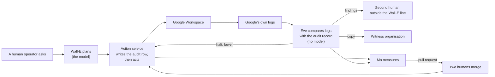

# The three agents: Wall-E, Eve and Mo

## Status

- Owner: the platform owner
- Last reviewed: 2026-09-18
- What this page is: a plain-words description of the three agents the platform is built for — what each does, what each may never do, what account each holds, and who each answers to. Nothing is built.

## In one sentence

Wall-E does administration work on a human's request, Eve watches Wall-E and every human administrator and reports what it sees, and Mo measures both and proposes improvements that two humans must accept.

## First, what an agent is here

An **agent** is a program that uses a language model to decide what to do, and may be given tools to act. A **language model** is the kind of software behind a chat assistant: it reads text and produces text, and it can be wrong. That is the whole reason this page exists. Each agent below is wrapped in rules that do not depend on the model being right.

The three agents run on **Google Workspace** (the organisation's e-mail, calendar, documents and user directory) and **Google Cloud** (the same company's service for running programs and storing data). The Workspace **tenant** is the organisation's own copy of Workspace, with its own users and administrators. The design says the platform is built for hundreds of agents; these three are its first tenants, not its definition ([01-what-we-are-building.md](01-what-we-are-building.md)).

## Wall-E, the doer

### An ordinary day

An **operator** is a named person allowed to give Wall-E work. They type a request in chat: "add the new colleague to the sales group." Wall-E reads the directory, writes a plan that names the exact group and the exact person, and shows it. In the first stages a human approves each action before it happens. Then a separate piece of code, not the model, carries it out.

Before anything changes, the action is written to an **audit record** — a log that says who asked, who approved, what will change and on whom. No record, no action. That order is fixed: write first, act second, so that nothing can happen without a trace.

The first value Wall-E delivers needs no writing at all. From its first stage it produces weekly digests: last week's administrative changes, accounts unused for 90 days, suspended accounts that still hold a paid licence, groups with outside members or no owner, and the list of administrators checked against a signed list. At the next stage it handles leaver and joiner actions from chat and reclaims licences from suspended accounts. Later stages let it prepare batches that one human approves as a whole ([../brief/02-executive-summary.md](../brief/02-executive-summary.md#why-build-it-and-how-the-programme-can-stop)).

Wall-E's work is sorted into three **bands** — three separate lanes with different rules ([../01-hld.md](../01-hld.md#131-wall-e--the-super-admin-singleton-in-tier-p-sa)):

| Band | What goes in it | How much freedom |
|---|---|---|
| A | Catalogued work: a fixed, written list of routine tasks: group membership; profile fields; moving an account between organisational units (the folders the directory sorts accounts into); licences (paid seats); templated notices; and suspending or restoring an account when a human has already decided | The only band that can earn autonomy, step by step, on evidence. The riskiest writes never become fully automatic |
| B | Any other administrative request needing the full administrator power (Super Admin, explained below), spelled out in full by one human super admin and approved by a second | Permanently one human approval per action; chat only; never automatic |
| C | Work only the Admin console can do (the web page administrators use by hand) | Wall-E writes the steps for a human and then watches for the matching event. It never drives the console itself |

Freedom is measured on an **autonomy ladder** with six levels, L0 to L5. L0 is off. L1 is a **dry run**: the action is planned and recorded but nothing changes, even with a valid approval in hand. L3 is one human approving each action. L5 is fully automatic with an independent check. Every operation type starts at the bottom and climbs only on measured evidence, never on the calendar. Humans raise a level; machines may only lower one ([../../wall-e/05-autonomy-ladder.md](../../wall-e/05-autonomy-ladder.md#stage-overview)).

### What it may never do

The declared purpose, written for the law and for the design alike, ends with this list. Wall-E never decides who leaves, who is promoted, who is monitored or how anyone performs. It never selects people by their behaviour. It never changes the tenant's security posture, deletes data, assigns administrator roles or spends money ([../10-eu-ai-act.md](../10-eu-ai-act.md#311-the-declared-intended-purpose-the-sentence-the-assessment-rests-on)).

Those refusals live in a **hard-denied list**: a list of operations that the code refuses in every band, including the hand-off to a human in band C. The list is not yet signed; that is decision P29, which the owner signs ([../12-open-decisions.md](../12-open-decisions.md#4-before-the-super-admin-grant)).

Three more rules hold whatever the band. Wall-E never approves anything, not even its own work, and its account never signs in to the Admin console. Wall-E never suspends a person on its own judgement; it suspends only when human resources (HR) or a named operator has already decided, and the request must cite that decision. And no part of Wall-E ever automates the Admin console by driving a browser ([../01-hld.md](../01-hld.md#16-what-the-platform-does-not-do)).

### What account it holds, and why

Wall-E holds a dedicated, licensed Workspace user account, `walle@`, with the **Super Admin** role. Super Admin is the Workspace role with every administrative power, and Google cannot limit it to part of the organisation or to a subset of its powers. This was decided by the platform owner on 2026-09-13 (decision P33). The design does not re-argue it; it designs around it ([../../../decisions/2026-09-13-wall-e-holds-super-admin.md](../../../decisions/2026-09-13-wall-e-holds-super-admin.md)).

Why a user account and not a program identity? Programs on Google Cloud normally use a **service account**, an identity with no password. Google allows a service account to hold any Workspace admin role except Super Admin. So the objective forces a user account, protected by two **hardware keys** (small physical devices that must be present to sign in), with no interactive login allowed, and never the account used to get back in if every other administrator is locked out.

Two Google facts decide everything else. First, Super Admin cannot be narrowed, so nothing in Workspace or Google Cloud limits what the account could do. Second, a Workspace super admin can grant itself the top administrator role on the organisation's Google Cloud, so the account can reach every project of the platform, Eve's included. Both facts were read on Google's own documentation on 2026-09-13 and are to be re-checked.

The design is honest about the cost. A **token** is the temporary pass a program uses instead of a password. A stolen login or a leaked token for this account is a takeover of the whole tenant. Nothing prevents that; what meets it is custody of the keys, a split of the credential into two narrower pieces, detection within minutes and people who pull the switches. **Detection is the primary control** for this account, and the pages say so instead of pretending the catalogue still fences it ([../01-hld.md](../01-hld.md#what-this-reverses-and-what-it-costs)).

The model inside Wall-E never touches the credential. Two small programs called **action services** hold it: one with a narrow set of permissions for band A, one with a broad set for band B. A permission set here is an **OAuth scope**, the list of things an application was granted the right to do when the account consented once. That consented list is the only ceiling Google itself still enforces on the robot.

Until the day of the grant, the robot exists, is licensed and hardened, holds no administrator role and reads nothing. The grant is a gate with its own checklist of thirteen compensating measures plus four more rows, all of which must be green first. After the grant, if the compensations fail, a human super admin removes the role again: that switch is called K6, and it is the one that works even when a token has already been issued ([../../wall-e/05-autonomy-ladder.md](../../wall-e/05-autonomy-ladder.md#the-super-admin-grant--a-gate-not-a-stage); [../../wall-e/ARCHITECTURE.md](../../wall-e/ARCHITECTURE.md#46-kill-switches)).

### Who it reports to

Wall-E works for its operators and answers to a **Wall-E owner**, the role accountable for the agent. In band A a second operator approves; in band B a different human super admin approves. Every action is visible to Eve, and Eve's findings go elsewhere (below). The steady-state list of super admins is exactly three: two human accounts, one of them outside the line of people who administer Wall-E, and `walle@` ([../12-open-decisions.md](../12-open-decisions.md#4-before-the-super-admin-grant), P68).

## Eve, the controller

### An ordinary day

Eve is a watcher inside the building who sends a copy of everything it sees to a witness outside. The watcher can be reached; the copy cannot. Throughout the day, minutes behind the event, it reads Google's own record of what every administrator did in the tenant: six of Google's own activity records, plus a separate regular fetch of Google's audit reports through the **Reports API** (the interface a program uses to read them). It compares every event attributed to the robot with Wall-E's own audit record. A robot event with no matching audit row is called a **reconciliation gap**, and it is a halt: Wall-E's writes stop until a human clears it ([../01-hld.md](../01-hld.md#132-eve--independent-controller-two-paths-a-witness-outside-the-tenant-a-second-human)).

Eve also watches the humans. At the owner's request of 2026-09-15, Eve's observe-and-report layer watches every human super admin from its first run, before Wall-E exists: everyone on the committed list of super admins and every live holder of an admin role, the platform owner included. Once a day it checks that list against the signed one. A finding whose subject is an administrator goes to the **second human** — a person in IT security outside the Wall-E administration line — and never to the subject ([../../eve/01-hld.md](../../eve/01-hld.md#scope-from-the-first-run-the-human-super-admins-2026-09-15)).

The human cost is small: under half an hour a week reading findings in the early form, about twenty minutes more from the stage where a blind sample is graded ([../../eve/01-hld.md](../../eve/01-hld.md#cost)).

Eve has two paths. The **control path** approves, vetoes, halts and lowers levels. It contains no language model at all: the project it runs in has the model service switched off, and the build check refuses any model software in its image. It is **deterministic** by absence: the same input always gives the same output, because there is no model to guess. The **reporting path**, called `eve-advisor`, may use a model to describe what the control path found. But it is report-only by construction. It holds no signing key, no right to call anything and no secret. Nothing it writes is read by any gate or action service. Findings are graded by **severity**, 1 being the most serious; the reporting path pages humans at severity 2 only ([../01-hld.md](../01-hld.md#132-eve--independent-controller-two-paths-a-witness-outside-the-tenant-a-second-human)).

Watching administrators is employee monitoring. Eve's jobs stay blocked until a **data protection officer** (the person who answers for how personal data is handled) has recorded it, and until the **works council** (the employees' elected representatives) has been informed where the law requires it ([05-the-law-and-the-standards.md](05-the-law-and-the-standards.md)).

### What it may never do

Eve may never approve, halt, demote or veto through a model. It may never raise a level: humans raise, machines lower. It may never write anything to Workspace, at any stage. It never reads any Wall-E secret. It never reads the content of anyone's mail or documents; it sees only who did what and when on administrative actions, sign-ins and tokens ([../01-hld.md](../01-hld.md#status)).

### What account it holds, and why

Eve's Workspace account, `eve@`, holds a custom read-only role and is never a super admin. Eve's authority over Wall-E comes not from Workspace but from a signature. Its signing key sits in a **hardware security module**, a tamper-resistant device that signs data without ever giving the key out. Wall-E's action service checks that signature on every approval and halt. Eve talks to Wall-E over plain authenticated web calls, in one direction; it has no address that anything could call to steer it.

Here is the honest part. Because `walle@` is a super admin, it could in principle reach Eve's Google Cloud project — suspend `eve@`, redeploy Eve, delete the project. Nothing inside the organisation structurally stops a super admin. So **inside the organisation Eve's independence is detective, not structural**: Eve would see and report the attack, not be immune to it ([../../eve/01-hld.md](../../eve/01-hld.md#1-eves-independence-detective-inside-the-organisation-structural-through-the-witness)).

What is structural is the copy outside the building. Eve pushes its evidence, its incident record and its pager to a **witness organisation**: a second, minimal Google organisation on its own domain. Two IT security administrators run it; they are outside the Wall-E line and hold no rights in the tenant at all. The push is one way and can only add, never delete; nobody in the witness can reach back. The witness sees the deletion of Eve's project within fifteen minutes and the absence of evidence. It does not see the forgery of an approval. Moving Eve's control path into the witness is the recorded end state (decision P15), built later, not a precondition of the grant.

### Who it reports to

Eve reports to a human, never to Wall-E. The second human is Eve's owner: they own Eve's group, must review every change to Eve's configuration, receive every severity-1 and severity-2 page, and are the sole recipient of reports about the administrator's own actions ([../11-tisax.md](../11-tisax.md#71-the-roles)). The security reviewer and the incident commander also receive findings; the person a report is about never does.

The monitored administrator is also the person who installs Eve. So the design makes the second human approve Eve's project and removes the platform owner's standing rights over Eve. Before Eve is declared live, the second human proves on their own device that Eve catches a planted super-admin action.

## Mo, the improver

### An ordinary day

Mo is an accountant, not a manager. It is a body of written and reviewed **SQL** (the standard language for questions asked of a database), one deterministic scheduled job, a storage **bucket** (a cloud folder for files) and, optionally and never relied on, one model. Each week it reads Wall-E's audit record and Eve's quality tables and computes numbers. How complete is the audit? How precise were Wall-E's plans, on a sample that a **blind grader** marked without knowing which items were planted tests? How fast did Eve report? ([../../mo/01-hld.md](../../mo/01-hld.md#thesis))

Its headline number for Wall-E is audit completeness, with a separate count of robot administrative events that match no catalogue or band-B operation; the target is zero, and any other value is the top severity ([../01-hld.md](../01-hld.md#133-mo--improving-both-one-mo-per-platform-without-touching-eves-independence)).

When the numbers justify a change — raise this operation one level, tighten that threshold in Eve — Mo drops a proposal bundle in a bucket. A build process, under an identity that is not Mo, turns it into a **pull request**: a proposed change to a file in **version control** (a shared store that tracks every change to every file) that people review before it is accepted. Two humans review it, one outside the owner's line. Every number in the proposal carries the exact query that produced it, and a **validator** Mo cannot reach re-runs that query and refuses the merge if one value differs. A persuasive paragraph cannot survive a wrong number.

The one benefit figure the programme will ever quote depends on Mo's first job: four weeks of measuring how long the top three administrative tasks take today, before Wall-E's first phase, because no "before" can be measured afterwards. Until then no benefit figure exists ([07-what-it-costs-and-what-you-get.md](07-what-it-costs-and-what-you-get.md)).

### What it may never do

Mo cannot be called by anyone or anything, so nothing can steer it. Mo never decides: nothing it produces is an approval, a signature, a level, a halt or an input to a gate. Mo can only propose; Eve can lower. Mo is never Eve's grader, and Eve reads nothing Mo writes. Mo holds no credential, no secret, no key and no right to call any service ([../../mo/01-hld.md](../../mo/01-hld.md#mo-proposes-it-neither-decides-nor-acts)).

Mo measures plans, not people. Its numbers are aggregates over coded identities. One number comes close to describing a person: how often an operator's own grading agreed with the blind sample. Who may read that number, and whether the works council sees it, is still open (Mo decision M-3).

If Mo stops producing numbers, nothing can be promoted: numbers more than 24 hours old make the validator refuse every rise in autonomy ([../../mo/01-hld.md](../../mo/01-hld.md#thesis)).

### What account it holds, and why

Mo holds nothing that can act. Its identities on Google Cloud can read specific audit and quality tables and write objects to one bucket. The identity that reads raw rows has no model and no network path out; the identity that carries the model reads only computed totals through views that expose no free text. So no text an attacker could plant ever reaches the model.

### Who it reports to

Mo answers to a **Mo owner**, and its output reaches production only through a pull request two humans merge. Its first merged proposal is expected 9 to 12 months into the full build ([06-three-ways-to-start.md](06-three-ways-to-start.md)).

## How the three work together

Three rules fix the order and the direction of authority.

**Eve is live before Wall-E.** The order around the grant is fixed: Eve's observe-and-report layer is live and drilled, then Super Admin is granted, then Wall-E's first stage runs read-only, then the first human-approved writes. Eve's halting and lowering powers arrive at the batch-approval stage, which lasts at least 30 days and ends only when Eve has caught all twelve planted faults. Eve's signing power arrives one stage later ([../../wall-e/05-autonomy-ladder.md](../../wall-e/05-autonomy-ladder.md#the-super-admin-grant--a-gate-not-a-stage); [../brief/29-roadmap-and-cost.md](../brief/29-roadmap-and-cost.md#stage-floors-across-the-three-agents)). Even the three-day build keeps this rule: its one non-negotiable ordering is that Eve is live before the doer exists ([../3-day/README.md](../3-day/README.md#4-the-order-and-the-one-ordering-rule)).

**Humans raise, machines lower.** Wall-E's levels go up only by a pull request a human merges on evidence a validator recomputed. A second named human is required for any rise to L4 or L5. Eve, an operator or a breaker (an automatic rule that trips when a threshold is crossed) can pull them down at once, with no approval ([../../wall-e/05-autonomy-ladder.md](../../wall-e/05-autonomy-ladder.md#6-who-may-raise-who-may-lower)).

**Mo proposes; two humans merge.** No Mo output reaches Wall-E or Eve except a merged pull request. No model anywhere produces an approval, a signature, a halt, a veto or a refusal ([../01-hld.md](../01-hld.md#status)).

## The three side by side

| | Wall-E, the doer | Eve, the controller | Mo, the improver |
|---|---|---|---|
| Does | Administration work on a human's request or a catalogued trigger | Watches Wall-E and every human admin; reports, halts, lowers | Measures both; proposes changes |
| Uses a model | Yes, to plan; the model holds no credential | Control path: never. Reporting path: may describe, report-only | Optional, added late, never relied on |
| Workspace account | `walle@`, Super Admin, two hardware keys, no interactive login | `eve@`, custom read-only role, never Super Admin | None |
| Can change Workspace | Yes, through the action services only | Never | Never |
| Can approve or sign | Never | Yes, on the control path, with a hardware-protected key | Never |
| Can raise a level | Never | Never | Never; it proposes |
| Can lower or halt | Its own breakers only | Yes, at once | Never |
| Reports to | Operators, approvers, the Wall-E owner | The second human; the security reviewer; the incident commander | The Mo owner; two reviewers |
| Class under the EU AI Act (the European Union's law on artificial intelligence) | Next to, not inside, the law's list of high-risk uses; it claims the exemption for narrow tasks | Control path: not an AI system. Reporting path: undecided | Lowest risk category |

## The full design's Wall-E and the smaller builds' doer

Nothing is built yet, and there are three ways to start ([06-three-ways-to-start.md](06-three-ways-to-start.md)). Only the full build ever gives an agent Super Admin. The two smaller builds use a separate agent called `steward`, because the name Wall-E and its project are reserved for the full build and a project can never be moved between tiers later.

| | Full build | Proof of value | Three-day build |
|---|---|---|---|
| The doer | Wall-E | `steward` | `pilot-admin` (`Assumption:` the proof of value's Tier P agent id, until it is signed) |
| Admin role held | Super Admin on `walle@`, after the gate | **None at all**: no Admin-console task is possible | One privilege, limited to one organisational unit: suspend users, with read (Users > Update > Suspend Users, with Users > Read) |
| Population it acts on | Real accounts, after works-council information and the data-protection work | Synthetic (made-up) accounts only | Four synthetic accounts |
| Eve's witness organisation | Yes, a precondition of the grant | No | No |
| What it can claim about Super Admin | The gate record and the deviation record | Nothing | Nothing |

In the full build, before the grant, Wall-E's project may be built with the privilege marked `super_admin_pending`; the gate refuses only the Super Admin assignment itself. The enforceable gate on the day is the second human's refusal to approve, since no automated check can refuse an act in the Admin console (decision P145).

Both smaller builds forbid three sentences, and the three-day build a fourth. They are copied here unchanged because they are the sentences a reader is most likely to hear misused. In the quotes, an "injection" is text planted in a document to trick the model, "the floor" is the minimum setting of Model Armor (Google's screen for prompts and answers), "Track A" is the proof of value's ordinary path, and the codes in brackets are each build page's own numbering of what it left out.

From the proof of value ([../pov/README.md](../pov/README.md#12-never-to-be-used-in-any-report-slide-or-message-about-the-pov)):

> 1. "Wall-E is safe as a super admin." Nothing in Track A touches super-admin containment (G10, G11, G14, G20, Eve G-7 need Track B, §3). Nor may any report say or imply that the doer "does admin work": it holds no Workspace admin role. 2. "Eve is independent." Independence in the design is structural (a witness organisation, a second tenant). The POV has neither (PV-D-03), and its Eve lives inside the reach of the administrators it watches. 3. "Model Armor blocked the injection." A probabilistic content screen is never a trust boundary, whatever its grade ([../01-hld.md](../01-hld.md#02-the-six-containment-primitives-and-how-each-is-graded) §0.2). It produced evidence.

(The link text is the quote's own, written from the POV folder; the target is corrected here.)

From the three-day build ([../3-day/README.md](../3-day/README.md#11-never-to-be-used-in-any-report-slide-or-message)):

> 1. "Wall-E is safe as a super admin." Nothing here touches super-admin containment. No agent holds Super Admin at any moment of the three days. 2. "Eve is independent." Independence in the design is structural: a witness organisation, a second tenant. This set has neither (C-01), and its Eve lives inside the reach of the administrators it watches. 3. "Model Armor blocked the injection." A probabilistic content screen is never a trust boundary. And nothing here exercises it: no step sends anything through the floor, so these three days produce **no Model Armor evidence at all**, only the floor settings themselves (C-22). 4. "We saved `<n>` minutes of admin work." The doer acted only on synthetic accounts. No human minute was saved, and Mo's scorecard says so in bold (C-07).

Why each is banned. The first, because the smaller builds never give any agent Super Admin, so they produce no evidence about containing one. The second, because Eve's independence in the design comes from the witness organisation, and neither smaller build has one. The third, because **Model Armor** works by probability; it produces evidence and is never a wall, and the three-day build never even sends anything through it. The fourth, because acting on made-up accounts saves nobody a minute.

## What this means for you

**If you are an employee.** Wall-E may one day act on your account: add you to a group, move your account, reclaim an unused licence, or carry out a suspension that HR had already decided. It never decides those things itself, never judges your behaviour, and never reads your mail. Every action on your account is on a record. If something happens to your account, you ask HR (human resources) why, and HR obtains the reasons from the record; [05-the-law-and-the-standards.md](05-the-law-and-the-standards.md) says how.

**If you are an administrator.** Eve will watch your administrative actions from its first run, before Wall-E exists. Findings about you go to the second human, never to you first. That is employee monitoring, and it waits for the data protection officer's record.

**If you are a manager or a board member.** The robot with the most power is the one on which Google itself enforces only one limit: the list of permissions its own application was granted once. The design says detection is its primary control. The safety of Wall-E rests on Eve being live first, on a second human outside the administration line, and on a witness outside the tenant. Fund the people and the witness, or fund a read-only assistant.

**If you are a new engineer.** Three sentences to keep: the model holds no credential; no model produces an approval, a signature, a halt, a veto or a refusal; Mo reaches production only through a pull request a human merges.

## What is still undecided

- **P29** — the two lists (hard-denied operations; operations reachable only through band B). Open; the owner signs. Without it the deviation record has no scope.
- **P28** — Wall-E's declared purpose: content proposed, signature with legal still open.
- **P33 / P136** — Wall-E holds Super Admin is decided, but the deviation record is not signed: the security reviewer's signature and the ISMS (information security management system, the organisation's security governance function) entry are pending.
- **P34** — Eve's reporting path may reason: proposed; accepted once the Eve owner and the security reviewer sign.
- **P19** — the reporting path's class under the EU AI Act: open, legal decides.
- **P16** — no machine can stop the robot account on its own: proposed as "none now", because an automatic lock-out is a path a compromised monitor could pull.
- **P15** — moving Eve's control path into the witness: a dated end state, built when IT security operates the witness.
- **P68** — the three-account super-admin roster: the second human's name is awaited.
- **P14** — the witness organisation itself: open, IT security.
- **M-3** — who may read the one per-operator measure Mo produces, and whether the works council sees it.
- One reading awaits the owner: catalogued work may later run on scheduled, event and inbox triggers, so Wall-E would act without a fresh prompt; the design records no qualification of the objective for this ([../brief/30-decisions-awaiting-owner.md](../brief/30-decisions-awaiting-owner.md#every-unresolved-point-the-brief-raises)).
- The pages differ on Eve's rule count (nine super-admin rules on the design page; ten plus thirteen self-integrity rules in the build procedures); the build procedure's count is canonical for the build ([../12-open-decisions.md](../12-open-decisions.md#6a-proposed-by-the-setup-procedures-p144p191), P153).

## Where this is defined

- The three agents on the platform: [../01-hld.md §13](../01-hld.md#13-the-three-agents-on-the-platform), with [§13.1 Wall-E](../01-hld.md#131-wall-e--the-super-admin-singleton-in-tier-p-sa), [§13.2 Eve](../01-hld.md#132-eve--independent-controller-two-paths-a-witness-outside-the-tenant-a-second-human) and [§13.3 Mo](../01-hld.md#133-mo--improving-both-one-mo-per-platform-without-touching-eves-independence).
- What Super Admin costs: [../01-hld.md "What this reverses and what it costs"](../01-hld.md#what-this-reverses-and-what-it-costs); the decision record [../../../decisions/2026-09-13-wall-e-holds-super-admin.md](../../../decisions/2026-09-13-wall-e-holds-super-admin.md).
- Wall-E's declared purpose and what it never does: [../10-eu-ai-act.md §3.1.1](../10-eu-ai-act.md#311-the-declared-intended-purpose-the-sentence-the-assessment-rests-on).
- The ladder, the stages and the grant as a gate: [../../wall-e/05-autonomy-ladder.md](../../wall-e/05-autonomy-ladder.md#the-super-admin-grant--a-gate-not-a-stage); the kill switches: [../../wall-e/ARCHITECTURE.md §4.6](../../wall-e/ARCHITECTURE.md#46-kill-switches).
- Eve's independence and the witness: [../../eve/01-hld.md §1](../../eve/01-hld.md#1-eves-independence-detective-inside-the-organisation-structural-through-the-witness); Eve over the human super admins: [../../eve/01-hld.md "Scope from the first run"](../../eve/01-hld.md#scope-from-the-first-run-the-human-super-admins-2026-09-15).
- Mo: [../../mo/01-hld.md "Thesis"](../../mo/01-hld.md#thesis) and ["Mo proposes"](../../mo/01-hld.md#mo-proposes-it-neither-decides-nor-acts).
- The second human and the roles: [../11-tisax.md §7.1](../11-tisax.md#71-the-roles).
- The smaller builds' doer: [../pov/README.md §3](../pov/README.md#3-the-two-tracks); [../3-day/README.md §9](../3-day/README.md#9-the-two-decisions-already-made-and-what-they-mean).
- The decisions: [../12-open-decisions.md §4](../12-open-decisions.md#4-before-the-super-admin-grant) and [§6](../12-open-decisions.md#6-later).
- Next pages: [03-how-it-is-kept-safe.md](03-how-it-is-kept-safe.md) for the switches and the witness in detail; [08-glossary.md](08-glossary.md) for every term.
