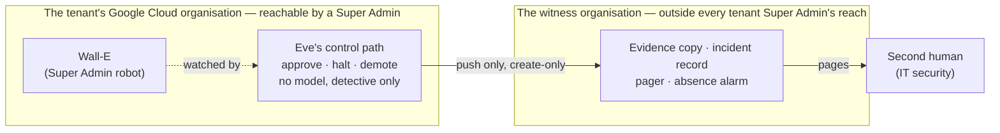

# How it is kept safe

## Status

- Owner: the platform owner
- Last reviewed: 2026-09-18
- What this page is: a plain-words account of how an agent on the platform is contained, how it is stopped, and what a signature accepts because it cannot be stopped. Nothing described here is built.

## In one sentence

Every agent is boxed in by six controls set outside its reach, can be stopped by eight switches from "pause its writes" to "kill the whole fleet", and the one agent that holds Super Admin is watched rather than fenced, because nothing in Google's products can fence a Super Admin.

## Two words that matter: enforced and detected

An **agent** is a program that uses a language model (software that reads and writes text) to decide what to do, and may be given tools to act. Every safety control on this platform is graded with one of two words.

A control is **enforced** when the action simply cannot happen. Someone outside the agent, either Google or code the agent cannot change, refuses it. If the control breaks, the action stops.

A control is **detected** when the action does happen and something independent sees it afterwards, within a stated time. A detected control produces evidence. It never stops anything on its own.

The rule the whole design follows: nothing that is only detected may stand alone in a safety argument. A detected control must always sit behind an enforced one. And a screen that guesses, such as Google's **Model Armor** (a filter that scores prompts and replies for danger), is never treated as a fence whatever its grade, because a guess can be wrong.

| | Enforced | Detected |
|---|---|---|
| Everyday comparison | A locked door: you cannot walk through it | A security camera: you can walk through, and someone sees you did |
| Who says no | Google, or code outside the agent's own process | Nobody at the time; a watcher, later |
| If the control fails | The action stops | The action goes ahead unseen |
| What it is good for | Carrying a safety argument | Proving what happened, and paging a human |
| Examples on this platform | The list of permissions the robot's credential was granted; no model ever holds a credential; every write recorded before it is made; the list of forbidden operations, written as code | Any use of the robot's credential outside its two services; any act by a Super Admin against Eve's evidence inside the tenant's organisation; a leaked credential |

Why the difference matters: for most agents, the enforced controls carry the safety case and detection is a check on them. For the one Super Admin agent, the design says openly that **detection is the primary control**, because the fence Google would provide for a narrower role is not available for Super Admin. That reversal is the subject of the section on Super Admin below. The full grading rule is [../01-hld.md#02-the-six-containment-primitives-and-how-each-is-graded](../01-hld.md#02-the-six-containment-primitives-and-how-each-is-graded).

## The six ways an agent is contained

Every agent on the platform, from a read-only assistant to a Super Admin robot, inherits six containment controls. They are numbered CP1 to CP6 so they are never confused with the platform's decisions, which are numbered P1 to P204. A **project** is Google Cloud's container for one program's resources; a **folder** groups projects so that rules set on the folder bind every project in it.

| # | In plain words | What it stops | Grade |
|---|---|---|---|
| CP1 | A boundary the agent cannot redraw. The agent's project, identity and rules are created by a **factory** (an automated pipeline that stamps out identical projects) and governed at the folder, where the agent's owner cannot loosen them. | An agent, or its owner, widening its own permissions | Enforced |
| CP2 | Autonomy is data, not code. How much an agent may do on its own is a number in a file, climbed on evidence a **validator** (a separate program the agent cannot reach) recomputes. Humans raise the number; machines only lower it. | An agent promoting itself, or drifting into more autonomy than was signed for | Enforced, in the action service |
| CP3 | A ceiling outside the agent's process. The language model holds no **credential** (a secret that proves identity to Google, like a key). Only the **action service**, deterministic code that checks, records and executes, holds one. | The model acting directly on anything; a manipulated model exceeding what the code allows | Enforced |
| CP4 | A fleet kill switch outside every agent project. One **organisation policy** (a rule Google enforces on a whole folder) and one **deny rule** (a list of forbidden actions for named identities) stop every agent at once. Drilled monthly. | Every agent, together, in minutes, whatever any single agent is doing | Enforced |
| CP5 | A model-free monitor with the power to halt. The path that approves, halts, demotes or vetoes an agent contains no language model, by construction: the model's software is forbidden in that project. A separate reporting path may reason, but it only writes reports and pages. | A clever attacker talking the monitor into approving something | Enforced, by absence |
| CP6 | Evidence the judged thing cannot forge or silence. Google's own audit logs are copied to a locked store, and for the Super Admin case to a **witness organisation** (a separate Google tenant run by IT security). An **absence alarm** pages a human when the evidence stops arriving. | Silent misbehaviour; deleted evidence; a monitor that is quietly switched off | Detected, with an absence alarm |

Three questions nobody has answered by test are kept out of every safety argument until answered: whether one Google fence stops a program from being called directly (tested: it does not, so it is counted only for the database searches it was designed for), whether the Admin console's access rules apply to Super Admins (P7, open), and the exact spelling of one deny rule (P8, a test on a throwaway resource). The list is in [../01-hld.md#16-what-the-platform-does-not-do](../01-hld.md#16-what-the-platform-does-not-do).

## The kill switches, K0 to K7, and who pulls them

A **kill switch** is a pre-built way to stop an agent. There are eight, ordered from surgical to total. Think of a factory floor: K0 and K1 are the cord any worker may pull to stop the line, no permission needed, no incident opened. K3 and above open an incident. Nothing has been drilled, because nothing is built.

| Switch | In plain words | Who may pull it | Target time | What it does not stop |
|---|---|---|---|---|
| K0 halt writes | Tell the action service to stop changing anything. Reads continue. | Any **operator** (a named person allowed to ask the agent for work), Eve, or a **breaker** (an automatic rule that trips on a threshold). No approval. | Under 5 seconds at the endpoint; containment target under 60 seconds | A change already inside a Google call finishes |
| K1 demote one cell | Lower the autonomy of one kind of operation on one kind of trigger. | The same as K0 | Under 5 seconds | Every other operation keeps its level |
| K2 stop new runs | Pause the timers and message queues that start runs. | An operator with the Google Cloud rights | Seconds | Runs already open |
| K3 cut the agent off | Remove the agent's permission to call its own action service. | A project administrator | About a minute | Whatever the action service is already executing |
| K4 kill the credential | The action service revokes its own **refresh token** (the long-lived secret it uses to obtain short-lived access) at Google, on both of its services. | Any operator, one call to each service; no console, no second person | Seconds | An **access token** (the short-lived key) already issued stays valid for up to 60 minutes (`Assumption:`) |
| K5 revoke the grant or suspend the robot | A human suspends the robot's Google account, or revokes its application grants. The backstop when the action service itself does not answer. | A **human** Super Admin other than the robot, on the two-person rota, alerted by the witness organisation | Within 30 minutes of a **severity-1** (highest urgency) alarm being acknowledged | The same 60-minute token residue |
| K6 remove Super Admin | A human strips the Super Admin role from the robot's account. The one switch that survives a token already minted, because the token outlives the privilege. | Human only, same rota; never by a machine (P16). `Assumption:` Google's setting that requires a second administrator for covered changes (multi-party approval, below) also covers this removal; verified at build. | Within 60 minutes | Anything already executed; the robot's own mail and calendar |
| K7 fleet kill | Four pre-written levers applied to the tier folders from the core project: deny every service, pause every timer, clear every access boundary, apply the deny rule. | A named approvers group, or a severity-1 alarm from the **SIEM** (the security log service) running a deterministic job; a human given temporary rights for a limited period only if the job is suspect; never a model | First lever under 60 seconds; under 5 minutes end to end | Eve's folder, which keeps watching and paging. Lifting K7 takes two humans |

Two sentences from the design worth keeping. "K0 is what stops work now, and K4 is what stops the credential." And in a crisis on the Super Admin agent the order is fixed: K0, then K4 on both services, then K7 on the robot's folder, then K5, then K6 if the account itself is suspect, then preserve the evidence and call the incident commander. K4 comes before K7 because K7's first lever also refuses the K4 call.

One switch is deliberately missing. No machine can lock the robot's account (P16, proposed as "none now"): an automatic lock-out is a path a compromised monitor could pull. The full table is [../../wall-e/ARCHITECTURE.md#46-kill-switches](../../wall-e/ARCHITECTURE.md#46-kill-switches).

Silence is itself a halt. If the log pipeline goes quiet, the platform treats it as an emergency: no agent may act on its own, and the robot's writing paths stop entirely, until one human clears it and that clearing is itself reported (P97). A restored system boots halted and stays halted until a human clears it (P120).

## The Super Admin problem, stated honestly

**Super Admin** is the Google Workspace role with every administrative power over the organisation's accounts, mail, files and settings. Google Workspace is the company's e-mail, calendar, documents and user directory. A **tenant** is one company's instance of it.

On 2026-09-13 the platform owner decided that Wall-E, the doer agent, holds Super Admin through a dedicated user account (P33). The design does not re-argue that decision. It designs around it. What follows is what that costs, said the way the design says it.

### What nothing can narrow

Two Google facts fix everything, as recorded on 2026-09-13 and to be re-verified. First, a **service account** (the identity a program normally uses) can hold any Workspace admin role except Super Admin, so the robot must be a user account. Second, Super Admin cannot be limited to part of the organisation or to a subset of its powers.

So the platform does not narrow the robot's account, because nothing in Google Workspace or Google Cloud can. What it has instead is keys kept under custody, the credential split into two narrower pieces, the controls kept in a separate project from the robot, a stated promise of how fast misuse is spotted, and the witness. The design says this in [../01-hld.md#16-what-the-platform-does-not-do](../01-hld.md#16-what-the-platform-does-not-do).

With a narrower role, Google itself would refuse any operation outside it. With Super Admin there is one enforcement point left: the action service. The only Google-enforced ceiling is the **OAuth scope set**, the list of permissions the robot's account granted its own application in a one-time sitting.

### What a leaked credential means

A leaked token, or anyone signing in as the robot, is a **tenant compromise**: whoever holds it can do anything a Super Admin can. It is also a path into the Google Cloud **organisation** (the top of the company's cloud hierarchy), including Eve's and Mo's projects, because a Super Admin can grant themselves **Organization Administrator** there.

Nothing prevents this. Custody, detection within minutes and people pulling switches meet it. A stolen access token can keep working for up to an hour after the account is suspended. This is risk row R-01 of the risk register, accepted with compensation, and its acceptance signature is pending because the security reviewer role is unfilled.

### The thirteen compensations, in plain words

Thirteen compensations are preconditions of the grant. None is deferred. They are the rows of the checklist the gate reads, [../11-tisax.md#63-compensations-as-preconditions--the-checklist-the-gate-reads](../11-tisax.md#63-compensations-as-preconditions--the-checklist-the-gate-reads).

| # | Compensation | In plain words |
|---|---|---|
| 1 | Three bands, not breadth | Wall-E's work runs in three lanes. Band A: a fixed catalogue of routine tasks, the only lane that may ever act on its own. Band B: any other administrative request, fully written out by one human Super Admin and approved by a second, always. Band C: tasks only the **Admin console** (Google's web page for administrators) can do; the robot writes the steps for a human and watches for the result. The robot never drives the console. |
| 2 | The two lists, signed | A list of operations refused in every lane, including the human handoff, and a list reachable only through band B with two people. The owner signs them (P29, open). |
| 3 | Two credentials in two services | The narrow catalogue and the broad band B use different credentials in different services. The scope that would grant the whole of Google Cloud is never consented. |
| 4 | The band-B requester rule | The person who asks for a band-B operation can never be the person who approves it. |
| 5 | Detection as the primary control | Every Google audit stream about administrators is watched, and any robot event with no matching audit row of its own is a **reconciliation gap** and a halt. |
| 6 | Account hygiene | Two **hardware keys** (physical devices that must be present to sign in), no interactive login ever, never the recovery administrator, and Google's **multi-party approval** switched on (P66), so that covered settings need a second administrator. Switching it off is on the forbidden list. |
| 7 | Kill switches K0 to K7 | The table above, with K6 the one that survives a token already issued. |
| 8 | The perimeter | A second reviewer on every deployment and **PAM** (Privileged Access Manager: time-boxed, justified, logged elevation with no self-approval) on the right to deploy. |
| 9 | A permanent ceiling | No Super Admin-class operation is ever autonomous. Band B stays at "a human approves each action" forever. |
| 10 | The controls that replace role scoping | The checks Google would have made, rewritten as code in the action service and verified by test. |
| 11 | A second human outside the Wall-E line | A Super Admin in IT security who owns Eve, receives every page, and is the only recipient of reports about the platform owner's own actions. |
| 12 | The signed record | The decision file for P33, which is also a signed **deviation record**: an admission that a machine holding Super Admin breaks the least-privilege control of **TISAX** (the automotive industry's information-security assessment). The security reviewer signs it, not the owner; the signature is pending. |
| 13 | The EU AI Act position | The declared purpose of Wall-E, signed with legal (P28, open). Page 05-the-law-and-the-standards.md explains it. |

The gate adds four rows: a **penetration test** (a paid attack on the system by professionals) with no open critical or high finding; the **DPIA** (the data-protection impact assessment) started and the works council informed; a crisis-scenario tabletop run; and hardware-key custody witnessed.

After the grant the rows stay live. Any row turning red is a **severity-2** (second urgency level) finding with 30 days to fix. Two rows red at once, or row 5, 6 or 11 red at all, is severity 1, and the on-duty human Super Admin pulls K6 until the row is green again. The deviation's own text says the role exists only while its compensations do.

In steady state the tenant has exactly three Super Admins: two humans, one of them outside the Wall-E line, and the robot (P68). The robot is never the only one and never the recovery one. Any test that changes things as a Super Admin runs only on a separate practice copy of Workspace, because a test area inside the real one is no protection when the role cannot be limited to it (P178).

## Eve's independence, honestly

Eve is the controller agent. The objective asked for Eve to be independent. Here is what that word can and cannot mean.

Inside the tenant's Google Cloud organisation, Eve's independence is **detective, not structural**. A Super Admin can grant themselves Organization Administrator, and Eve's control project is inside that organisation. The robot's credential could suspend Eve's account, revoke its token, and re-route the audit feeds. Only code and detection stand in the way. Eve would see it, and page a human, but could not physically prevent it.

What leaves the organisation is structural. Eve's evidence, its incident record and its pager go to the **witness organisation**: a second Google tenant on its own domain, whose two administrators are from IT security and outside the Wall-E line. No identity from the witness holds any permission in the tenant, and the tenant only pushes to it, through two create-only grants. Nothing can be deleted or rewritten there once written.

The witness sees the deletion of Eve's project within fifteen minutes, and the absence of evidence. It does not see the forgery of an approval. The only mechanism that stops a Super Admin from forging an approval or undoing a kill is moving Eve's control path itself into the witness. That is recorded as the end state (P15): proposed already, built only when IT security operates the witness. It gates the closed tier for agents of general capability (AGI, artificial general intelligence: agents whose abilities their designers cannot list), not the grant.

One accepted limit is signed rather than solved. Eve's evidence tables cannot be set so that rows can only be added and never changed, because no such permission exists. Tampering is therefore made detectable, not impossible: any edit raises the highest alarm, and row counts travel to the witness in its regular check-in signal (P186).

Because the person being watched is the person who installs Eve, the setup procedures move Eve's ownership to the second human, build Eve's project under a temporary right the second human approves, and have the second human prove that Eve catches a deliberately planted Super Admin action (P155). Eve watches every human Super Admin from its first run, before Wall-E exists. This is employee monitoring and needs a data-protection record first (P154).

The proof of value and the three-day build have no witness. Both forbid the sentence "Eve is independent". The next section carries the exact words.

## Three sentences never to be used

The proof of value and the three-day build each list sentences that must never appear in any report, slide or message. They are copied here because this page discusses all three subjects. In the quotes, an "injection" is text planted to trick the model, "the floor" is the minimum Model Armor setting, "Track A" is the proof of value's ordinary path, and the bracketed codes are each build page's own numbering. From [../pov/README.md#12-never-to-be-used-in-any-report-slide-or-message-about-the-pov](../pov/README.md#12-never-to-be-used-in-any-report-slide-or-message-about-the-pov):

> "1. 'Wall-E is safe as a super admin.' Nothing in Track A touches super-admin containment (G10, G11, G14, G20, Eve G-7 need Track B, §3). Nor may any report say or imply that the doer 'does admin work': it holds no Workspace admin role. 2. 'Eve is independent.' Independence in the design is structural (a witness organisation, a second tenant). The POV has neither (PV-D-03), and its Eve lives inside the reach of the administrators it watches. 3. 'Model Armor blocked the injection.' A probabilistic content screen is never a trust boundary, whatever its grade ([../01-hld.md](../01-hld.md#02-the-six-containment-primitives-and-how-each-is-graded) §0.2). It produced evidence."

(The link text is the quote's own, written from the POV folder; the target is corrected here.)

The three-day build adds a fourth, from [../3-day/README.md#11-never-to-be-used-in-any-report-slide-or-message](../3-day/README.md#11-never-to-be-used-in-any-report-slide-or-message): "4. 'We saved `<n>` minutes of admin work.' The doer acted only on synthetic accounts. No human minute was saved, and Mo's scorecard says so in bold (C-07)." It also notes that three days produce **no Model Armor evidence at all**, only the floor settings.

Why they are never used: the first would claim a fence that does not exist and that no short build exercises. The second would claim a structure only the witness provides, and the witness is a purchase for the full build. The third would turn a guessing screen into a guarantee, which the design forbids on every page. The fourth would report a benefit nobody measured. Each is the sentence a sponsor most wants to hear, which is exactly why it is banned.

## The residual risks a signature accepts

When the sponsor signs, these eight risks are accepted, in order of consequence. In the reader's words:

1. **If the robot's key is stolen, the thief owns the company's Google Workspace and can reach into its cloud.** Custody, detection within minutes and people pulling switches limit the damage. Nothing prevents it. A stolen token can keep working for up to an hour after the account is suspended. The security reviewer signs this as R-01; the signature is pending and the role is unfilled.
2. **Inside the company's own cloud, the watchdog can see a Super Admin misbehave but cannot physically stop one.** Only what sits in the witness is beyond reach, and moving the rest there is proposed, not built.
3. **The safety of the design depends on people who do not exist yet.** On 2026-09-13 one administrator held every role. Tiers that need a second person stay closed until that person exists: a delay, not a failure.
4. **The robot's gate is one piece of code, and the pipeline that builds it could rewrite it.** A compromised pipeline is a compromised gate. Only Google's own audit log and detection remain beneath it.
5. **Manipulated content will reach the model.** A poisoned document or message can put a bad proposal in front of an operator, or a persuasive false story in front of a reviewer. Screening only detects; the ceilings in code are what enforce.
6. **The regulator and the assessor decide the outcome.** The EU AI Act exemption may be read narrowly, and a TISAX assessor may refuse the top mark on least privilege despite the signed deviation.
7. **Some Google facts are unverified.** They are excluded from the safety case. If the answers turn out badly, the affected controls count for less than designed.
8. **Accepted operational limits.** One cloud region, tenancy separation on Google's side the platform cannot see, some stores on Google-managed keys, and one model family across the whole fleet.

The full list, with the register rows behind it, is [../brief/23-threat-model-and-residual-risk.md#the-residual-risks-a-sponsor-accepts-by-signing](../brief/23-threat-model-and-residual-risk.md#the-residual-risks-a-sponsor-accepts-by-signing). Who owns R-01 differs between two pages (the platform owner or the security reviewer); either way the acceptance is the security reviewer's signature and an entry in the site's risk register.

## What the platform will not do

The design lists what it deliberately does not do, so that nobody reads a promise into a silence. In plain words:

- It does not make Eve unreachable by a Super Admin inside the tenant's organisation. It moves the evidence, the incident record and the pager outside, calls the rest detective, and records the relocation as the end state (P15).
- It does not narrow a Super Admin account. Nothing in Google Workspace or Google Cloud can.
- It does not let a robot drive the Admin console, by browser or by any automation. Band C is written instructions and a check that a human did them.
- It does not let any model approve, sign, halt, veto or refuse anything. A model may narrate and may page a human at the second urgency level, and nothing it writes is read by the gate (P34).
- It does not evaluate model capabilities, detect deception, or claim to contain an agent of general capability (AGI). That tier stays closed.
- It does not count three untested Google facts in any safety case.
- It does not run a security operations centre. It buys round-the-clock acknowledgement for the privileged tier and runs Google's detections for the rest.
- It does not host a second Super Admin agent, any outside agent without a supplier record, or any agent without a register row.
- It does not train or modify models.
- It does not grant **domain-wide delegation** (a Workspace mechanism that lets a program act as any user) to anything, ever.
- It does not back up Workspace; undoing a change is per operation family and Google's own recovery.
- It does not run code execution below the closed AGI-class tier.
- It does not promise EU AI Act or TISAX outcomes. It promises the mechanisms and the evidence, and lists what the regulator or assessor still decides.

The canonical list is [../01-hld.md#16-what-the-platform-does-not-do](../01-hld.md#16-what-the-platform-does-not-do); the short form is [../README.md#what-it-deliberately-is-not](../README.md#what-it-deliberately-is-not).

## What this means for you

**If you are an employee.** No agent can act on your account without a record made before the act, and the two actions that affect whether you can work, suspension and licence removal, are only ever carried out after a human in HR (human resources) or a named operator has decided. The design gives any operator a switch that halts a robot's writes, with a target of under a minute. Page 04-people-and-decisions.md says who those people are.

**If you are a manager or a board member.** You are being asked to sign for a machine with unlimited administrative power, watched rather than fenced. The design says so in every place it could have softened it. The price of that honesty is a list of people and purchases that must exist before the grant, described in page 06-three-ways-to-start.md and page 07-what-it-costs-and-what-you-get.md, and eight risks you accept in writing.

**If you are a works-council member.** Eve monitors the human administrators, including the platform owner, from its first run, before any robot exists. That is employee monitoring, and it needs a data-protection record and works-council information before it starts. Page 05-the-law-and-the-standards.md sets out what you are shown and when.

**If you are a new engineer.** Learn the two words first. Every control table you will read carries a grade, an owner, a verification and a failure mode; a control that cannot fill those four cells is not on the page. Never write "Model Armor blocked it". Write "Model Armor produced evidence".

## What is still undecided

Only the decisions that touch this page. Their register is [../12-open-decisions.md#4-before-the-super-admin-grant](../12-open-decisions.md#4-before-the-super-admin-grant) and neighbouring sections.

| Id | What is undecided | Who acts |
|---|---|---|
| P7 | Whether the Admin console's access rules apply to Super Admins; kept out of the safety case until known | Google |
| P8 | The exact spelling of the deny rule's agent identity set; answered by a test on a throwaway resource | Platform owner |
| P10 | Which SIEM and which managed detection partner, with round-the-clock acknowledgement | IT security |
| P14 | The witness organisation: its edition, domain and who pays | IT security |
| P15 | The end state: moving Eve's control path into the witness; proposed, built later | IT security and the platform owner |
| P16 | No machine may lock the robot's account; proposed as "none now" | Platform owner |
| P29 | The two lists: forbidden everywhere, and band B only; the owner signs | Platform owner |
| P33 / P136 | The Super Admin decision is made; its deviation record awaits the security reviewer's signature and an entry by the ISMS (the organisation's information-security governance function) | Security reviewer, ISMS |
| P34 | Eve's reporting path may reason; accepted once the Eve owner and the security reviewer sign | Eve owner, security reviewer |
| P66 | Multi-party approval on for every covered setting before the grant | Platform owner |
| P68 | The Super Admin roster of exactly three; the second human's name awaited | Platform owner with the second human |
| P97, P99 | Silence-as-halt and the acknowledgement and containment targets; several are `Assumption:` values | Platform owner, incident commander |
| P154, P155 | The data-protection record for monitoring administrators; Eve installed under the second human's approval | The DPO (data protection officer), second human |
| P186 | The accepted limit that Eve's tables are tamper-evident, not tamper-proof; the security reviewer ratifies | Security reviewer |

Also unresolved, without a register row: who owns risk R-01 (the platform owner or the security reviewer), recorded as a page-to-page difference.

## Where this is defined

- The grading rule and the six containment primitives: [../01-hld.md#02-the-six-containment-primitives-and-how-each-is-graded](../01-hld.md#02-the-six-containment-primitives-and-how-each-is-graded)
- What Super Admin costs, without softening: [../01-hld.md#what-this-reverses-and-what-it-costs](../01-hld.md#what-this-reverses-and-what-it-costs)
- The thirteen compensations and the three bands: [../01-hld.md#131-wall-e--the-super-admin-singleton-in-tier-p-sa](../01-hld.md#131-wall-e--the-super-admin-singleton-in-tier-p-sa)
- The gate checklist the grant reads, and the red-row rule: [../11-tisax.md#63-compensations-as-preconditions--the-checklist-the-gate-reads](../11-tisax.md#63-compensations-as-preconditions--the-checklist-the-gate-reads)
- The kill switches K0 to K7: [../../wall-e/ARCHITECTURE.md#46-kill-switches](../../wall-e/ARCHITECTURE.md#46-kill-switches); K7's levers: [../01-hld.md#114-the-fleet-kill-switch-k7-and-the-containment-primitives-for-the-top-tier](../01-hld.md#114-the-fleet-kill-switch-k7-and-the-containment-primitives-for-the-top-tier)
- Eve's independence and the witness: [../../eve/01-hld.md#1-eves-independence-detective-inside-the-organisation-structural-through-the-witness](../../eve/01-hld.md#1-eves-independence-detective-inside-the-organisation-structural-through-the-witness); the two paths: [../01-hld.md#132-eve--independent-controller-two-paths-a-witness-outside-the-tenant-a-second-human](../01-hld.md#132-eve--independent-controller-two-paths-a-witness-outside-the-tenant-a-second-human)
- The decision and deviation record: [../../../decisions/2026-09-13-wall-e-holds-super-admin.md](../../../decisions/2026-09-13-wall-e-holds-super-admin.md); its structure and signatories: [../11-tisax.md#62-the-record--decisions2026-09-13-wall-e-holds-super-adminmd](../11-tisax.md#62-the-record--decisions2026-09-13-wall-e-holds-super-adminmd)
- The residual risks and the risk register: [../brief/23-threat-model-and-residual-risk.md#the-residual-risks-a-sponsor-accepts-by-signing](../brief/23-threat-model-and-residual-risk.md#the-residual-risks-a-sponsor-accepts-by-signing); [../11-tisax.md#10-the-risk-register-p140](../11-tisax.md#10-the-risk-register-p140)
- What the platform does not do: [../01-hld.md#16-what-the-platform-does-not-do](../01-hld.md#16-what-the-platform-does-not-do)
- The sentences never to be used: [../pov/README.md#12-never-to-be-used-in-any-report-slide-or-message-about-the-pov](../pov/README.md#12-never-to-be-used-in-any-report-slide-or-message-about-the-pov); [../3-day/README.md#11-never-to-be-used-in-any-report-slide-or-message](../3-day/README.md#11-never-to-be-used-in-any-report-slide-or-message)
- The setup decisions cited (P154, P155, P178, P186): [../12-open-decisions.md#6a-proposed-by-the-setup-procedures-p144p191](../12-open-decisions.md#6a-proposed-by-the-setup-procedures-p144p191)
