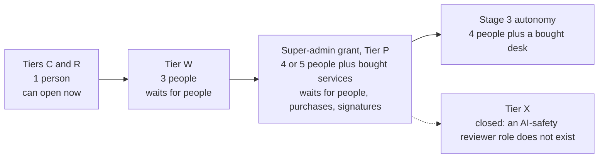

# 04. People and decisions

## Status
- Owner: the platform owner
- Last reviewed: 2026-09-18
- What this page is: a plain-words account of who has to exist before each part of the platform may open, what each of them must never also do, what the sponsor is asked for in order, and how the platform's decisions are written down, counted and signed. Nothing described here is built.

## In one sentence

On 2026-09-13 one person holds every role the platform needs; the platform opens in steps, each step waits until the right people exist and the right decisions are signed, and 204 numbered decisions record exactly what is decided, what is proposed and what is still open.

## Why people come before machines

The platform is a set of computer programs. But the design refuses to switch any of them on until certain humans exist. That is deliberate. The most dangerous thing on the platform is a robot with the highest administrative power over the organisation's Google Workspace, the shared tools for mail, files and accounts. A robot like that is safe only if separate people watch it, sign for it and can switch it off. So the design counts people before it counts servers ([who exists](../01-hld.md#03-who-exists-on-2026-09-13-and-the-roles-the-platform-needs)).

On 2026-09-13 the organisation behind the platform is one administrator. There is no security operations centre (a team that watches alarms round the clock). There is no second super admin outside that administrator's own reporting line. There is no security reviewer, no Eve owner, no engaged data protection officer, and no names supplied by the security governance function (the ISMS, explained below). Every role is one person ([maturity](../README.md#maturity-what-exists-on-2026-09-13)).

One person holding every role is also the single finding most likely to stop a TISAX assessment. TISAX is the automotive industry's information-security audit, and its control 1.2.2 asks that duties be separated between people ([the roles](../11-tisax.md#71-the-roles)). The gap is not a criticism of anyone. It is the reason the design has a gate: a tier opens only when the people and services it needs exist ([the tier gate](../01-hld.md#04-the-tier-gate-what-must-exist-before-a-tier-opens)).

The platform sorts its agents into tiers. An agent is a program that uses a language model to decide what to do, and may be given tools to act. A tier is a letter that says what an agent may do, and therefore which people, controls and purchases must exist before it runs. The letters are C, R, W, P, P-SA and X, explained on [01-what-we-are-building.md](01-what-we-are-building.md). The three agents themselves are on [02-the-three-agents.md](02-the-three-agents.md).

## The roles, in plain words

Each role below is a job, not a person. One person may hold several of them at the lowest tier. The hours are the design's own estimates and exist only where the source gives one ([who exists](../01-hld.md#03-who-exists-on-2026-09-13-and-the-roles-the-platform-needs); [minimum staffing](../11-tisax.md#72-the-minimum-per-stage)).

| Role | What they do, in everyday words | Hours, where a figure exists |
|---|---|---|
| Platform owner | Builds and runs the shared parts: the folder, the factory that stamps out each agent's project, the register, the floors every agent inherits. | no figure exists yet |
| Agent owner | One per agent. Writes its instructions and playbooks (its scripted routines), keeps its register row and its budget. | no figure exists yet |
| Operator / approver | Asks the agent to do things, approves the actions that need a human's yes, and can pull the first stop levers. | second operator: about 2 hours a week |
| Security reviewer | Reviews every rise in an agent's freedom, every change to the deny rules, and signs deviations. From IT security. | about 2 hours a month |
| Blind grader | Grades a weekly sample of the agent's work without knowing which items were planted as tests. Never wrote the playbooks being graded. | about 1 hour a week per writing agent; at least 2 hours a week at Stage 4 volume, Mo's own estimate (`Assumption:`, [estimates](../brief/29-roadmap-and-cost.md#the-agents-own-estimates)) |
| Deployer | Runs the factory and the release pipeline, the automated steps that turn reviewed code into a running service. A second reviewer checks every release that holds a credential. | no figure exists yet |
| Eve owner | Owns the controller agent Eve: its owner group, its configuration reviews and its copy of evidence outside the organisation. | Eve's human cost is under half an hour a week: about 30 minutes reading findings, later about 20 minutes of blind sampling ([Eve's cost](../../eve/01-hld.md#cost)) |
| Mo owner | Runs the improver agent Mo's pipeline and seeds the samples the blind grader sees. | no figure exists yet |
| Detection desk | Acknowledges alarms within a target time and runs the detection rules. Bought as a service at Tier P. | round the clock, bought |
| Incident commander | Leads a severity-1 incident, the most serious class of alarm, and talks to the data protection officer and the works council. From IT security. | no figure exists yet |
| Human super admins | Hold Super Admin on separate admin accounts with hardware keys. At least two at Tier P; the robot is never the only one and never the recovery one. | no figure exists yet |
| DPO contact | The data protection officer: owns the data protection impact assessment, the records of processing and the retention ceilings. | no figure exists yet |
| AI compliance owner | Legal's designate. Signs the classifications under the EU AI Act (the European Union's law on artificial intelligence), files registrations and answers an authority (P131). | no figure exists yet |
| Validator custodian | Runs the independent recalculation that Mo cannot reach, so Mo's numbers are re-derived rather than believed. | no figure exists yet |

Super Admin is the Workspace role with every administrative power. Google cannot limit it to part of the organisation or to a subset of its powers ([what this reverses](../01-hld.md#what-this-reverses-and-what-it-costs)). That is why the human super admins are counted so carefully.

Two further roles appear only in the build procedures. Two witness administrators, from IT security, run the witness organisation: a separate Google organisation, outside the reach of the super admins of the organisation's own Workspace (its tenant), that keeps a copy of Eve's evidence like a witness who keeps a copy outside the building. Two sandbox super admins run a separate practice copy of the organisation's Workspace (a sandbox tenant), where anything that changes super-admin settings is tested first ([who must be present](../setup/README.md#6-who-must-be-present-s069)).

## What each role must never also do

Separation of duties means the person who asks is never the person who approves, and the person who is watched is never the person who reads the report. The design writes this as a table of forbidden pairs, then counts the smallest number of distinct humans that satisfies it ([the roles](../11-tisax.md#71-the-roles)).

| Role | Must never also be |
|---|---|
| Platform owner | the IT security lead; the security reviewer; the AI compliance owner; the Eve owner at Tier P; the second human; the incident commander at Tier P |
| Agent owner | the approver of its own requests; the grader of its own playbooks; the second reviewer of its own agent's releases |
| Operator | the approver of what they themselves requested, always |
| Eve owner | anyone in the Wall-E administration line; Mo's blind grader for Wall-E |
| Mo owner | Eve's second reviewer |
| Blind grader | the owner of the playbooks being graded |
| Security reviewer | the platform owner |

The count is the gate. It is the minimum number of different people at each step, not a promise ([the minimum per stage](../11-tisax.md#72-the-minimum-per-stage); P137):

| Step | Distinct humans, minimum | Who is added |
|---|---|---|
| Stage 0, read-only, Tier R | **1**, with self-review recorded as such | nobody |
| Stage 1, first write, Tier W | **3** | a second operator who is also the blind grader; an IT security person as security reviewer |
| The super-admin grant, Tier P-SA | **4** on the design page; **5** in the build procedures, or 4 with a dated exception | the second human outside the Wall-E line as Eve owner; the two witness administrators |
| Stage 3, when catalogued work runs without a human approving each action | **4 plus a bought round-the-clock desk** | the detection desk |

Five humans is the clean state. Four is the floor, and only if the security governance function (the ISMS, the information security management system) records in writing that the security reviewer and the Eve owner are the same IT security person for the first grant, with an end date. The build procedures raise the count to five because the two witness administrators must be neither tenant super admins nor the platform owner, second human or second operator ([SD-04, P147](../12-open-decisions.md#6a-proposed-by-the-setup-procedures-p144p191); [blocked row B-21](../setup/README.md#8-blocked-index)).

Two things make the count real rather than written. First, an automatic check runs daily and on every code merge. It compares the forbidden pairs against who is actually in which group, and refuses any rise in an agent's freedom above the step where a collision is legal ([verification](../11-tisax.md#7-separation-of-duties-and-the-staffing-minimum-per-stage-p137)). Second, a role holder without a training record for the current stage is not counted at all ([training](../11-tisax.md#7-separation-of-duties-and-the-staffing-minimum-per-stage-p137)).

## The second human

One role deserves its own paragraph, because the whole design leans on it. The second human is a super admin in IT security, outside the reporting line of whoever administers Wall-E. They own Eve's group, review every change to Eve's rules, hold the second human admin account, sit in no Wall-E group, receive every severity-1 and severity-2 alarm in parallel, and are the only person who receives reports about the administrator's own actions ([the roles](../11-tisax.md#71-the-roles)).

Because the monitored administrator is the one who installs Eve, the build procedures add safeguards. The second human owns Eve's group from the start of the build. They approve the temporary right under which Eve's project is built. And they prove, on their own, that Eve detects a planted super-admin action ([SD-12, P155](../12-open-decisions.md#6a-proposed-by-the-setup-procedures-p144p191)).

The honest limit is on [03-how-it-is-kept-safe.md](03-how-it-is-kept-safe.md): inside the organisation Eve can see a super admin but cannot structurally stop one. Its independence there is detective, not structural. The second human and the witness organisation are what make the watching real.

## Who has to exist for each tier to open

| Tier | Opens when | Who must be added | What is bought |
|---|---|---|---|
| C, classical assistants | the register and the Gemini Enterprise baseline exist. Gemini Enterprise is Google's assistant product, the one front door for people. | nobody new | Gemini Enterprise licences (they exist); Security Command Center Premium, Google's organisation-wide security-findings service |
| R, read-only agents with tools | the factory, the folder, central logging and the shared registry exist | nobody new | nothing more |
| W, agents that write | the autonomy contract (the rules every writing agent adopts for how its freedom rises and how its work is audited), a model-free checker for writing agents, a person who keeps the separate program that re-does Mo's sums, a practice folder and one rehearsed recovery from backup exist; the works council informed before any agent touching employee accounts first writes | a second operator; a part-time security reviewer; a blind grader | a build-time signing pipeline, no licence |
| P and P-SA, privileged and the one super-admin robot | everything in W plus every precondition of the grant | a second human super admin outside the Wall-E line as Eve owner; an engaged DPO; an incident commander; an AI compliance owner with a deputy; a bought desk | a SIEM (a service that collects logs and runs detections) in the EU; a managed detection and response retainer, an outside team that responds round the clock; a paging service; hardware keys; the witness organisation |
| X, agents of general capability | **not open** | an AI-safety reviewer who does not exist | a sandbox tier and a second model family |

On 2026-09-13 Tiers C and R can open with the people who exist. Tier W, Tier P and the grant wait on people, purchases and signatures. Tier X is closed ([maturity](../README.md#maturity-what-exists-on-2026-09-13)). The cost of the gate is speed: a sponsor who funds the build but not the people gets a read-only platform ([the tier gate](../brief/29-roadmap-and-cost.md#the-tier-gate)).

The three build paths need different crews. The full build needs thirteen appointments and thirteen purchase rows, 85 to 90 person-days of hands-on work, and 6 to 7 months to Wall-E's first read-only stage, not before 2027-03. The proof of value, a limited trial on the real tenant with no agent holding any admin role, needs three hands-on people and one engineer. The three-day build, a demonstration on made-up accounts, needs two people for three days plus a sponsor named in writing who does no work. All three are on [06-three-ways-to-start.md](06-three-ways-to-start.md) ([the two stages](../pov/README.md#4-pov_stage_dates-the-two-stages); [the team](../3-day/README.md#3-the-team-and-what-they-hold)).

## What the sponsor is asked for, in order

The sponsor is the person who funds the programme and signs for its risks. Each group below opens one gate. A group left unprovided keeps that gate and every later one closed. The third group takes longest to obtain, so it is best started now even though its gate opens last ([what the sponsor is asked for](../brief/02-executive-summary.md#what-the-sponsor-is-asked-for-in-order)).

**Group 1, to open Tiers C and R.** Nobody new. Security Command Center Premium activated at organisation level, with its funding and owner decided by IT security (P11, open). Alongside, the ISMS's written acceptance that one person reviews their own work at Tier R. If not provided: no platform folder, no factory run, and no agent beyond what the Gemini Enterprise app offers today.

**Group 2, to open Tier W.** A second named operator, about two hours a week. A part-time security reviewer from IT security, about two hours a month. A blind grader, about an hour a week per writing agent. Information to the works council, the employees' elected representatives, before any agent acting on employee accounts first writes (P129), and the DPO's retention decision (P13, open) before the same step. If not provided: the platform stays read-only.

On 2026-09-18 the law was re-checked, and the answer asks for the works-council step earlier still: before Eve begins watching human administrators. It also asks for consultation rather than information, and for the council's consent where national law gives it a say over new monitoring tools. The rule this moves is P129 ([workers and the explanation path](../10-eu-ai-act.md#410-art-267-2611-art-86--workers-and-the-explanation-path-p129)). The country is not fixed, so which law applies is *tbd*. Details are on [05-the-law-and-the-standards.md](05-the-law-and-the-standards.md).

**Group 3, to open Tier P and grant Super Admin to Wall-E.** This group has three parts: people, purchases and tests, and signatures. If any part is not provided, the robot account may exist, licensed and hardened, but holds no administrative role and reads nothing.

*People.* A second human super admin outside the Wall-E line, from IT security. An incident commander from IT security. An engaged DPO and an AI compliance owner (P131).

*Purchases and tests.* The SIEM in the EU with a managed detection and response retainer and a paging service, together a bought desk that answers alarms round the clock (P10, open). Hardware security keys, small physical devices without which an account cannot sign in, with witnessed custody. The witness organisation, run by IT security (P14, open). A penetration test, a paid attack on the system by professionals, with no serious finding left open. The data protection impact assessment (DPIA), the formal study of what the processing does to people; one page lists it as complete and another as started.

*Signatures.* The two lists of what Wall-E may never do and may do only with two humans (P29, open). Wall-E's declared purpose, signed with legal (P28, signature open). The deviation record, the signed file admitting that the robot's Super Admin breaks TISAX's least-privilege rule and listing the compensations (P136). The owner decides that record, the security reviewer signs it and the ISMS enters it, so the owner cannot sign it alone.

A one-line summary the design uses: "A read-only assistant costs a register row and a factory run. A super-admin robot costs a witness organisation, a second super admin, a bought detection desk and a signed deviation." ([thesis](../01-hld.md#01-thesis))

## The decisions: what a register row is

Every choice the platform must make once is written as a numbered row in one file, the register, kept in version control (a system that records every change and who made it). A row names the decision, why it matters, the value a page proposed, the owner as a role, the gate it blocks and where the reasoning lives. A row is admitted only if it names one thing that cannot be built, verified or defended while it is open. Anything else is a preference and stays out ([how the register works](../12-open-decisions.md#1-how-this-register-works)).

A row is in one of five states:

| State | Meaning in plain words |
|---|---|
| decided | the named owner decided, on a stated date |
| closed | a later row or a verified fact answered it; the row stays so the reference is not lost |
| proposed | a page proposed a value; it stands until the owner overturns it in writing. Silence counts as consent |
| open | nobody has decided; the gate it blocks stays red |
| spike | a test on a throwaway resource answers it |

The price of "proposed" is that an owner who never reads a row has accepted it. That is why the brief names who owns what ([how a decision is made](../brief/30-decisions-awaiting-owner.md#how-a-decision-is-made-and-recorded)). No program ever answers a row: raising an agent's freedom, widening a scope and answering a decision are human acts, recorded by hand.

Rows are grouped by the gate they block, in gate order: before the folder exists; before any writing agent writes; before the super-admin grant; before Wall-E's first write and later stages; later. A gate is green when every row in its group is decided, closed, proposed or a passed spike. One open row keeps it red ([the register in one screen](../12-open-decisions.md#0-the-register-in-one-screen)).

## How many, and where they stand

| Set | Ids | Count | State on 2026-09-18 |
|---|---|---|---|
| The high-level design's own | P1–P34 | 34 | 3 decided or closed (P33 decided; P2 and P9 closed); 9 proposed; 18 open; 4 spikes |
| The ten detailed pages' | P35–P143 | 109 | 107 proposed, 2 spikes; 11 of the proposed rows carry an open dependency or an `Assumption:` value |
| The build procedures' | P144–P191, also SD-01 to SD-48 | 48 | all proposed, pending the owner's signature; the procedures refuse the gated step until the record is signed |
| The proof of value's | P192–P204, also PV-01 to PV-13 | 13 | all proposed, pending the owner's signature; 6 apply only to the proof of value, 6 bind the full build, P204 is mixed |
| **Platform total** | P1–P204 | **204** | new ids append at P205; ids are never reused |
| Wall-E's own | 1–52 | 52 | the objective of 2026-09-13 changed the answer to twenty-two of them; decision 26 is settled by P33 |
| Eve's own | E-1 to E-21 | 21 (cited as 20 on the platform pages) | E-2 and E-16 block the grant |
| Mo's own | M-1 to M-11 | 11 | P22 supersedes M-7; P25 depends on M-4 |

Sources: [the register in one screen](../12-open-decisions.md#0-the-register-in-one-screen); [the agent-set registers](../brief/30-decisions-awaiting-owner.md#the-agent-set-registers).

Exactly one row is `decided`: P33, "Wall-E holds Super Admin", decided by the platform owner on 2026-09-13. Everything else is proposed, open or a test. The decisions directory, the append-only folder of dated answer files, holds two records: P33, accepted with its deviation signatures still pending, and P34, Eve's reporting path may reason, proposed until the Eve owner and the security reviewer sign ([decision log](../../../decisions/README.md)). No Wall-E, Eve or Mo row has its own file yet.

What keeps the gates red today, by gate ([the gate groups](../brief/29-roadmap-and-cost.md#the-registers-gate-groups-are-the-roadmap)):

| Gate | Open rows and unrun tests |
|---|---|
| Before the folder exists | open: P5 (whether Google's keyless agent identity is ready for production), P11 (who funds the security-findings service), P21 (which public list of agent threats to score against), P31 (the budget numbers per tier); tests: P4 (which restrictions Google lets the platform set on its resources) and P8 via P61 (the exact spelling of the deny rules) |
| Before any writing agent writes | open: P13 (how long data is kept), P22 (which code host), P25 (how many writing agents one grader can carry), P24 for operators (whether operators need a separate identity pool); tests: P3 (the network boundary) and P57 (the front door's gateway) |
| Before the super-admin grant | open: P7 (whether Google's sign-in conditions apply to super admins), P10 (which detection service and desk), P14 (the witness organisation), P29 (the two lists); P33's deviation signatures |
| Before Wall-E's first write | open: P17 (a copy of the raw Workspace logs in the witness), P18 (whether reclaiming licences from inactive accounts counts as profiling), P19 (the legal class of Eve's reporting path); P28's signature (Wall-E's declared purpose) |
| Later | open: P12 (when to re-ask about Google's EU data-boundary package), P23 (which legal entity is responsible), P26 (a second model family), P32 (the written position with Google); test: P6 via P57 (the front door bound to its gateway) |

## The handful to sign first

The brief singles out a few answers that hold everything else ([first actions](../brief/30-decisions-awaiting-owner.md#first-actions); [every open row](../brief/30-decisions-awaiting-owner.md#every-open-row-and-unsigned-signature)):

| What | Who acts | Why it comes first |
|---|---|---|
| The gate-counting rule (no row yet) | the platform owner | six open rows already have a working fallback, or cannot be closed at the moment their gate is judged (P31, P5, P24, P25, P7, P10). Read literally, the rule would keep three gates shut because of rows nobody can close yet. The owner must say how such rows count |
| P29, the two lists | the platform owner | the list of what Wall-E may never do, and the list it may do only with two humans; unsigned, the deviation record has no scope |
| P28, Wall-E's declared purpose | the platform owner with legal | the sentence the whole EU AI Act position rests on; filed before Wall-E's first write |
| P33 / P136, the deviation record | the security reviewer signs; the ISMS enters it | TISAX forbids self-signature, so the owner cannot supply this alone |
| P68, the super-admin roster | the owner with the second human | exactly three super admins in steady state: two humans, one outside the Wall-E line, and the robot; it waits for a name |
| P34, Eve's reporting path | the Eve owner and the security reviewer | needed before the reporting half of Eve is built |

By who must act: IT security answers P10, P11 and P14; the DPO answers P13 and, with legal, P18; legal answers P19 and P23; the ISMS supplies the names under P131 and P137 and confirms P20 and P133; Google answers P7, P5 and P32; the platform owner answers P12, P22, P24, P25, P26 and P31, and P21 until a security reviewer exists; the Eve owner answers P17 ([who must answer what](../brief/30-decisions-awaiting-owner.md#who-must-answer-what)).

One caution. On 2026-09-18 a security reviewer asked to sign the deviation record would refuse, because three rows of the gate's checklist are not green: the round-the-clock desk and the witness, a test of the network boundary, and a second human outside the administration line ([the checklist](../11-tisax.md#63-compensations-as-preconditions--the-checklist-the-gate-reads)). Several other rows cannot be proven while the service code does not exist. This is not a flaw in the design; it is the gate working as intended.

## The exits

A signature is not a commitment to full autonomy. The design builds in places where the programme stops on purpose ([why build it, and how the programme can stop](../brief/02-executive-summary.md#why-build-it-and-how-the-programme-can-stop)).

**The stop-or-continue review.** At the end of Wall-E's first writing stage, S1, a dated review sets the administrative toil actually saved, plus the projected saving of the batch-approval stage, against the operating cost including human hours. If the balance is negative, the programme stops (Wall-E decision 38). No benefit figure exists today. The saving is *tbd* until four weeks of toil on the top three administrative tasks are measured before Wall-E's first phase, because no "before" can be measured afterwards. Costs are on [07-what-it-costs-and-what-you-get.md](07-what-it-costs-and-what-you-get.md).

**A human approving each action is a legitimate end state.** The autonomy ladder is the scale of six levels, L0 to L5, on which an agent's freedom rises only on evidence. Level L3 means a human approves every action before it runs. The design says plainly that staying there for ever is acceptable. Eve's approval layer is not funded until a proposed rise can state how much approval work it removes.

**The smaller paths have their own exits.** The proof of value ends at a dated stop-or-continue review with three options: continue to the full build, hold at proof-of-value scope, or stop as dormant. In every option nothing is deleted, and on stop Eve keeps watching the human super admins (P204; the end date `Assumption:` no earlier than twelve weeks after day one). The three-day build's exit is its same-day unwind: every standing grant removed and signed off before anything real is touched ([P204](../12-open-decisions.md#6b-proposed-by-the-proof-of-value-set-p192p204); [the unwind](../3-day/README.md#10-the-unwind-before-anything-real-is-touched)).

Because those two paths run without a witness organisation and without super admin for any agent, their pages forbid certain sentences in any report, slide or message. The proof of value (the POV) never claims, verbatim from [never to be used](../pov/README.md#12-never-to-be-used-in-any-report-slide-or-message-about-the-pov):

> 1. "Wall-E is safe as a super admin." Nothing in Track A touches super-admin containment (G10, G11, G14, G20, Eve G-7 need Track B, §3). Nor may any report say or imply that the doer "does admin work": it holds no Workspace admin role.
> 2. "Eve is independent." Independence in the design is structural (a witness organisation, a second tenant). The POV has neither (PV-D-03), and its Eve lives inside the reach of the administrators it watches.
> 3. "Model Armor blocked the injection." A probabilistic content screen is never a trust boundary, whatever its grade ([../01-hld.md](../01-hld.md#02-the-six-containment-primitives-and-how-each-is-graded) §0.2). It produced evidence.

(The link text is the quote's own, written from the proof-of-value folder; the target is corrected here. Track A is the only part of the proof of value that runs; Track B, the super-admin work, is never run there.)

The three-day build bans four sentences, verbatim from [never to be used](../3-day/README.md#11-never-to-be-used-in-any-report-slide-or-message):

> 1. "Wall-E is safe as a super admin." Nothing here touches super-admin containment. No agent holds Super Admin at any moment of the three days.
> 2. "Eve is independent." Independence in the design is structural: a witness organisation, a second tenant. This set has neither (C-01), and its Eve lives inside the reach of the administrators it watches.
> 3. "Model Armor blocked the injection." A probabilistic content screen is never a trust boundary. And nothing here exercises it: no step sends anything through the floor, so these three days produce **no Model Armor evidence at all**, only the floor settings themselves (C-22).
> 4. "We saved `<n>` minutes of admin work." The doer acted only on synthetic accounts. No human minute was saved, and Mo's scorecard says so in bold (C-07).

They are forbidden because each would claim evidence the run cannot produce. Model Armor is Google's screen for prompts and answers; it works on probabilities, and a probability is never a wall. A sponsor who believed one of these sentences would sign for something never tested.

## What this means for you

**If you are a board member or the sponsor.** You are asked for people before money. The first two tiers cost nobody new. The first writing agent needs three people. The super-admin robot needs four or five, a bought round-the-clock desk, a witness organisation and three signatures, two of which the platform owner cannot supply alone. Your signature accepts a decision already made, P33, and you can stop the programme at the end of S1 with a number in hand.

**If you are a works-council member.** The design counts you as a gate, not an afterthought: your information, or consultation where the law requires it, comes before any agent first writes to an employee account. On 2026-09-18 the law was re-checked, and the answer asks for it earlier: before Eve starts watching administrators. Separation of duties means the person watched never reads the report about themselves. Which national law applies is not yet fixed.

**If you are a new engineer or an IT security person.** You will be asked to hold a role, and the table of forbidden pairs decides which ones you cannot combine. A daily check enforces it against group membership, and an untrained holder does not count. Every decision you rely on has an id; if it is `proposed`, someone can still overturn it, and if it is `open`, the gate is red until they answer.

## What is still undecided

- The gate-counting rule: how an open row with a working fallback counts towards its gate. No row yet; the owner's first action.
- P29 the two lists (open, owner); P28 the purpose signature (open, owner with legal); P33/P136 the deviation signatures (security reviewer, ISMS); P68 the roster (a name awaited); P34 Eve's reporting path (Eve owner, security reviewer).
- P10, P11, P14: the desk, the findings service funding and the witness, all with IT security.
- P131 and P137: the names behind the AI compliance owner and the separation count, with the ISMS; who the fifth human is in the clean state.
- P25: how many writing agents one blind grader can carry; it blocks the second writing agent.
- Whether the DPIA must be complete or only started at the grant: the design page and the checklist disagree; the DPO and the owner decide. The re-check of the law on 2026-09-18 says the part covering Eve's watching of administrators must be complete before Eve's first stream, because the law requires the assessment before the processing ([the checklist](../11-tisax.md#63-compensations-as-preconditions--the-checklist-the-gate-reads)).
- Who owns risk row R-01, the stolen-credential risk: the TISAX page says the platform owner, the decision record says the security reviewer; the signature is the security reviewer's either way.
- P204: the proof of value's end date and its stop-or-continue record.

## Where this is defined

- Who exists and the roles: [01-hld.md §0.3](../01-hld.md#03-who-exists-on-2026-09-13-and-the-roles-the-platform-needs); the tier gate: [01-hld.md §0.4](../01-hld.md#04-the-tier-gate-what-must-exist-before-a-tier-opens)
- Forbidden pairs, the count per stage, the daily check and training: [11-tisax.md §7](../11-tisax.md#7-separation-of-duties-and-the-staffing-minimum-per-stage-p137)
- The second human and the five-human count for the build: [12-open-decisions.md §6a](../12-open-decisions.md#6a-proposed-by-the-setup-procedures-p144p191); [setup/README.md §6](../setup/README.md#6-who-must-be-present-s069); [§8](../setup/README.md#8-blocked-index)
- What the sponsor is asked for: [brief/02](../brief/02-executive-summary.md#what-the-sponsor-is-asked-for-in-order); the exits: [brief/02](../brief/02-executive-summary.md#why-build-it-and-how-the-programme-can-stop)
- The register, its states and counts: [12-open-decisions.md §0](../12-open-decisions.md#0-the-register-in-one-screen) and [§1](../12-open-decisions.md#1-how-this-register-works)
- First actions and every open row: [brief/30](../brief/30-decisions-awaiting-owner.md#first-actions); [every open row](../brief/30-decisions-awaiting-owner.md#every-open-row-and-unsigned-signature); the gate groups: [brief/29](../brief/29-roadmap-and-cost.md#the-registers-gate-groups-are-the-roadmap)
- The two signed records: [decisions/](../../../decisions/README.md); [Wall-E holds Super Admin](../../../decisions/2026-09-13-wall-e-holds-super-admin.md)
- The crews of the three build paths: [setup/README.md](../setup/README.md#6-who-must-be-present-s069); [pov/README.md](../pov/README.md#52a-every-distinct-human-role-and-the-first-file-that-needs-it); [3-day/README.md](../3-day/README.md#3-the-team-and-what-they-hold)
- Glossary of every term on this page: [08-glossary.md](08-glossary.md)
