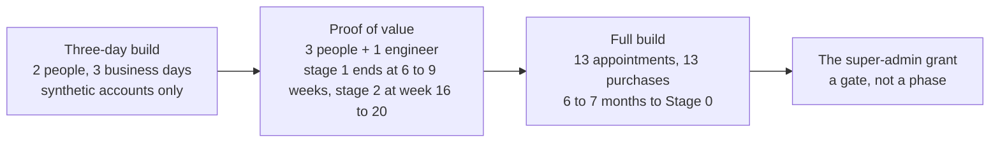

# 06. Three ways to start

## Status

- Owner: the platform owner
- Last reviewed: 2026-09-18
- What this is: the three build paths in plain words, side by side: the three-day build, the proof of value and the full build; what each needs, builds, proves, can never say, leaves standing, and how each grows into the next. Nothing is built on 2026-09-18.

## In one sentence

There are three ways to start: three days with two people, weeks with three, or six to seven months with thirteen appointments. Only the last ever gives a robot Super Admin, the Workspace role with every administrative power. The two smaller paths demonstrate the machinery and say so plainly.

## Why there are three paths

The platform has one rule that shapes everything: a tier opens only when the people and services it needs exist. A tier is a letter (C, R, W, P, P-SA, X) that says what an agent may do. An agent is a program that uses a language model to decide what to do and may be given tools to act. The higher the letter, the more people and purchases must be in place first. See [the tier gate](../01-hld.md#04-the-tier-gate-what-must-exist-before-a-tier-opens).

The design puts it in one sentence: "A read-only assistant costs a register row and a factory run. A super-admin robot costs a witness organisation, a second super admin, a bought detection desk and a signed deviation." ([thesis](../01-hld.md#01-thesis)). The three paths are three points on that scale.

- The **three-day build** is the smallest thing in the documentation: two people, four cloud projects, four made-up accounts, a demonstration.
- The **proof of value** (POV) is the middle path: three hands-on people and one engineer, weeks not days, on the real tenant, with no agent holding any Workspace administrator role.
- The **full build** is the only path that reaches the super-admin grant, and it needs thirteen appointments and thirteen purchases first.

Each path uses the next path's names, file layouts and folders, so nothing built is thrown away to move on. The chain is `3-day/ → pov/ → setup/` ([how it grows](../3-day/README.md#12-how-it-grows)).

Four words are used throughout. A **person-day** is one person working for one day; an engineer-day is the same, for the person writing code. The **tenant** is the organisation's own Google Workspace, with all its accounts and settings. An **organisational unit** is a folder of accounts inside that tenant, to which a permission can be limited. **Stage 0** is Wall-E's first stage after the grant: it reads and reports, and writes nothing.

## The three side by side

| | Three-day build | Proof of value | Full build |
|---|---|---|---|
| People | two, both Workspace super admins, plus a sponsor who does no work | three hands-on, one engineer, and about a dozen more roles for a signature or an hour | thirteen appointments; five named humans at the grant, or four with a dated exception |
| Effort | six person-days: 38 person-hours of allocated work and 7 in reserve, for the two people | 20 to 26 person-days of procedure plus 40 to 64 engineer-days of code (`Assumption:`) | 85 to 90 person-days hands-on ([stated by the proof-of-value page](../pov/README.md#4-pov_stage_dates-the-two-stages)) |
| Elapsed | three business days (`Assumption:` 2026-09-22 to 2026-09-24) | POV-1 ends 6 to 9 weeks after day one; POV-2 ends week 16 to 20 with a dedicated engineer, or week 26 to 34 if one person does both (`Assumption:`) | 6 to 7 months to Stage 0, not before 2027-03; 9 to 12 months to Mo's first merged proposal |
| Where | the production tenant, four cloud projects, one pilot organisational unit | the production tenant, Tiers C, R and W; 22 folders | the production tenant, plus a second, separate practice copy of Workspace (the sandbox tenant) and a witness organisation (a separate Google organisation, outside the reach of the tenant's administrators, holding a copy of the evidence) |
| The doer's privilege | one admin privilege scoped to one organisational unit, over four synthetic accounts | none at all (`privilege: none`); one optional Tier P row on a synthetic unit | Super Admin on `walle@`, granted at the end, under a gate |
| Buys | nothing; signs no contract | nothing with a lead time longer than weeks (`Assumption:`) | thirteen purchase rows; no price is quoted anywhere |
| Its exit | the same-day unwind | a dated stop-or-continue review (P204) | the grant, then Wall-E's stages |
| Never says | four sentences (below) | three sentences (below) | it promises mechanisms and evidence, never a regulator's or an assessor's outcome |

The numbers come from [the three-day README](../3-day/README.md#status), [the POV's two stages](../pov/README.md#4-pov_stage_dates-the-two-stages) and [the full build's critical path](../setup/README.md#34-parallel-sittings-and-the-critical-path). Every date is an earliest date and `Assumption:`; so is every effort figure of the proof of value. The three-day sizing is restated from its three day tables: each day runs 08:30 to 17:30 with a 90-minute break; days 1 and 2 allocate 375 minutes of work per person with 75 in reserve, and day 3 allocates 390 with 60.

## The three-day build

**What it needs.** Two people, free for three business days, both Workspace super admins and both owners of the four Google Cloud projects they create. A project is the container Google Cloud uses to hold a piece of work and its permissions. Person A builds; person B approves, witnesses and receives Eve's reports. A sponsor is named in writing on day 1. They do no work except watching the demonstration and receiving one report whose subject is person B. Before day 1, a short list must be true ([what must be true before day 1](../3-day/README.md#6-what-must-be-true-before-day-1-starts)):

- a billing account both people can use, and permission to create projects;
- the tools installed, and hardware security keys (small physical keys that must be plugged in to sign in), with spares for the robot;
- a mailbox only person B reads;
- four made-up account names, and an empty pilot organisational unit;
- the day files and the code at the revision corrected on 2026-09-18: twenty-eight corrections, all made that day ([the corrections](../3-day/README.md#61-corrections-made-on-2026-09-18)).

**What it builds.** Four projects with budgets and deletion locks. Eve, the controller, reading the Workspace admin audit log (Google's own record of every administrator action) and paging a human, live before any doer exists. A doer called `steward`, holding only the right to suspend, restore and read users (Google's names for it: Users > Update > Suspend Users, with Users > Read) over four synthetic accounts in one organisational unit. A synthetic account is a made-up account that belongs to nobody. The doer's first level is a forced dry run: it records what it would have done and refuses to act, even when handed a valid approval. An execution needs a second human. Two kill levers, K0 (halt writes) and K4 (revoke the credential), are pulled and timed during live work. Mo, the improver, counts the doer's own rows against a volume baseline read from Google's admin history. See [the order](../3-day/README.md#4-the-order-and-the-one-ordering-rule).

**The one ordering rule.** Eve is live before the doer exists. Day 2 confirms that Eve paged the very moment the doer's role was assigned. If Eve did not see it, day 2 becomes a repair day ([the rule](../3-day/README.md#4-the-order-and-the-one-ordering-rule)).

**What it proves.** That the containment machinery can be built and run under control: write-ahead audit (the record is written before the action, and no action runs if the record cannot be written), a forced dry run, a two-person approval, kill levers that work, and a controller that saw the doer being born. Six detections plus one freshness rule, where the full design has twenty-three ([the cut list](../3-day/README.md#8-the-cut-list-c-01-to-c-27)).

**What it can never say.** These four sentences are banned from any report, slide or message, verbatim from [the three-day README](../3-day/README.md#11-never-to-be-used-in-any-report-slide-or-message):

> 1. "Wall-E is safe as a super admin." Nothing here touches super-admin containment. No agent holds Super Admin at any moment of the three days.
> 2. "Eve is independent." Independence in the design is structural: a witness organisation, a second tenant. This set has neither (C-01), and its Eve lives inside the reach of the administrators it watches.
> 3. "Model Armor blocked the injection." A probabilistic content screen is never a trust boundary. And nothing here exercises it: no step sends anything through the floor, so these three days produce **no Model Armor evidence at all**, only the floor settings themselves (C-22).
> 4. "We saved `<n>` minutes of admin work." The doer acted only on synthetic accounts. No human minute was saved, and Mo's scorecard says so in bold (C-07).

Why each is banned: the first because the doer never holds Super Admin, so nothing was tested about it. The second because a witness organisation (a separate Google organisation outside the reach of the tenant's administrators, holding a copy of the evidence) does not exist here, and the administrators being watched could switch Eve off. The third because Model Armor, Google's screen for prompts and answers, is a filter that guesses, and an "injection" (text planted to trick the model) can slip past a guess; here the screen is switched on and never even tested. The fourth because no real work was done.

**Eleven things three days cannot buy** ([the eleven](../3-day/README.md#7-what-three-days-cannot-buy)):

- no super admin for any agent, and no evidence about super-admin containment;
- no witness organisation;
- no security monitoring service and no round-the-clock desk;
- no penetration test (a paid attempt to break in);
- no factory (the pipeline that stamps out identical projects) and no register checks;
- no time-limited permissions: every grant is standing and removed by hand on day 3;
- no autonomy beyond a forced dry run and a two-person execution;
- no four-week baseline of real work, so no minutes-saved claim;
- no data protection impact assessment and no works-council information;
- no Gemini Enterprise, no gateway, no registry row;
- and the eleventh, said to the sponsor before the demonstration: "It is a demonstration of machinery under control. It is not compliance evidence and it is not a production grant."

**What stands after it.** The same-day unwind removes every standing grant, unassigns and deletes the custom role, and revokes the robot's credential. It removes the doer's app from the tenant's list of allowed apps, deletes that app's registration and destroys its credentials. It leaves the synthetic accounts suspended and the halt switch on. Kept as the record: the audit table, the evidence dataset, the deletion locks and the run log. Left running on purpose, and named as such: Eve's read-only account and its polling ([the unwind](../3-day/README.md#10-the-unwind-before-anything-real-is-touched)). The most likely failure is the two people being pulled into their day jobs. Under a three-hour overrun, Mo's scorecard, the baseline and the improvement pull request (a proposed change to code that a human reviews before it is merged) are cut together. Never cut: the ordering rule, the dry run, the two-person approval, the audit, the kill drills and the unwind ([the eight risks](../3-day/README.md#11-the-eight-risks-and-what-to-do)).

**Corrected on 2026-09-18.** On 2026-09-17 its page listed six corrections and twenty-two smaller ones that the day files did not yet carry. All twenty-eight were made on 2026-09-18, in the day files and the code, and its unwind now removes the two allowed apps it once left standing ([the corrections](../3-day/README.md#61-corrections-made-on-2026-09-18); [the unwind](../3-day/README.md#10-the-unwind-before-anything-real-is-touched)). Three more things were found and corrected the same day by [the cross-check review](../14-crosscheck-review.md#6-findings-register). Its four project names carried a `-d3` ending that the naming rule allows only when a name collides with one already taken; the ending is dropped ([the three-day names](../3-day/README.md#5-the-four-projects-and-why-the-doers-project-is-not-called-walle); [the naming rule](../02-landing-zone-and-tiers.md#36-naming-and-the-label-taxonomy-p37-p38)). Its doer was called `steward`, the name the proof of value gives its own doer, which holds no administrator privilege and sits at Tier W; a delegated administrator role makes an agent Tier P, and a project never moves between tiers, so the three-day doer now takes the identity the proof of value reserves for its Tier P agent, `pilot-admin` until that name is signed ([the two tracks](../pov/README.md#3-the-two-tracks); [why a project never moves](../02-landing-zone-and-tiers.md#15-changing-tier-and-why-a-project-is-never-moved)). And its Eve watches every real human administrator's actions from day one, which is monitoring of employees: a data protection record and the answer of HR (human resources) on the works council are now required before day one, failing which the watch is limited to the two participants, with their written consent ([what must be true before day 1](../3-day/README.md#6-what-must-be-true-before-day-1-starts)). None of the three changes what the three days are.

**How it grows.** Each piece names the POV file that takes it further: the four projects become folders and an organisation-level log; Eve gains a fingerprint on its evidence and an unannounced proof; the doer gains three pairs of actions, each of which undoes the other, and the autonomy ladder; Mo gains blind grading and a four-week window ([how it grows](../3-day/README.md#12-how-it-grows)).

## The proof of value

**What it needs.** Three hands-on people: person 1 is the platform owner and operator; person 2 is the second person, holding the second human super-admin account; person 3 is the second operator, security reviewer and blind grader (a person who did not write the agent's routines and grades a sample of its work without knowing which items were planted), appointed in week 1. One engineer writes 40 to 64 engineer-days of code. The engineer may be person 1, never person 2 or 3. Many more people are needed for a signature or an hour each ([every role](../pov/README.md#52a-every-distinct-human-role-and-the-first-file-that-needs-it)):

- the incident commander, an envelope witness (a person from another administration line who watches the emergency sign-in credentials being sealed in a tamper-evident envelope), finance, and the organisation's logging owner;
- the data protection officer (DPO), and HR (human resources) with the works council through HR;
- the security management function (ISMS), and the AI compliance owner or legal's designate;
- the IT security lead, procurement, a non-admin colleague, two volunteer builders and calibration volunteers.

**What it builds.** Tiers C, R and W on the production tenant. The folder tree (22 folders). The register: the one file every agent needs a row in before it may exist. A governed Gemini Enterprise (the one front door where employees meet agents), with a Model Armor floor. Eve, watching every human super admin and reporting to someone who is not the subject. A doer with no Workspace admin role at all, whose model holds no credential. Mo, measuring the doer against a baseline. The doer is a separate agent (`steward`), because the names `walle`, `WALLE_PROJECT` and `walle_audit` are reserved for the full build. A project's name can never be reused, and a project never moves between tier folders (P193). At most one optional Tier P row gives two delegated roles to a separate agent on a synthetic organisational unit ([the two tracks](../pov/README.md#3-the-two-tracks)).

**Two stages.** POV-1 ends 6 to 9 weeks after day one: a governed Gemini Enterprise, kill levers pulled, Eve live. POV-2 ends at week 16 to 20 with a dedicated engineer (plan on week 18 or later). It takes the doer to L1, then L2, then L3 if the evidence allows. These are levels of the autonomy ladder, which runs from L0 (off) to L5 (autonomous); L3 means a human approves each action, and humans raise a level while machines lower it. POV-2 also delivers Mo's value report, a first proposal merged or refused, the demonstration and the hand-over. If day one were Monday 2026-09-21, POV-1 would end between 2026-11-06 and 2026-11-27, and POV-2 between 2027-01-15 and 2027-02-12. Every date is an earliest date and `Assumption:`. The POV's own warning: "A sponsor told 'three weeks' has been misled about both stages." ([the two stages](../pov/README.md#4-pov_stage_dates-the-two-stages)).

**On its critical path and not avoided:** HR's answer on the works council and the DPO's record on monitoring administrators. The question goes out on day one. If HR requires consultation, POV-1 moves by the length of that consultation.

**What it proves.** The claim has seven clauses ([the claim](../pov/README.md#11-pov_claim_statement)):

- a governed Gemini Enterprise, where admission is a register row;
- a Model Armor floor;
- Google's catalogue of agents (the agent registry), where an alarm on any unexpected change was rehearsed;
- kill levers pulled during live work;
- a controller that reported on every human super admin to someone who is not the subject;
- a doer that holds no Workspace admin role, whose every action is written ahead to an audit dataset, where alteration is detected by fingerprint (a computed check value that changes if any row is altered), not prevented;
- an improver that measured the doer against a baseline of volumes from Google's admin history and minutes from a timed sample.

A clause whose record is missing is struck, not softened.

**What it can never say.** Verbatim from [the POV README](../pov/README.md#12-never-to-be-used-in-any-report-slide-or-message-about-the-pov):

> 1. "Wall-E is safe as a super admin." Nothing in Track A touches super-admin containment (G10, G11, G14, G20, Eve G-7 need Track B, §3). Nor may any report say or imply that the doer "does admin work": it holds no Workspace admin role.
> 2. "Eve is independent." Independence in the design is structural (a witness organisation, a second tenant). The POV has neither (PV-D-03), and its Eve lives inside the reach of the administrators it watches.
> 3. "Model Armor blocked the injection." A probabilistic content screen is never a trust boundary, whatever its grade ([../01-hld.md](../01-hld.md#02-the-six-containment-primitives-and-how-each-is-graded) §0.2). It produced evidence.

Why: the doer never holds any admin role, so super-admin behaviour is untested and no Admin-console task was done. The witness organisation does not exist, so Eve's independence is not structural. Model Armor produces evidence, never a boundary. The POV also does not claim any real minute saved, a tamper-proof audit (append-only by convention, alteration detected), Mo measuring Eve, or the two no-code Tier C agents in the registry.

**A POV record never satisfies a full-build gate.** Every weaker record carries a `POV_` or `DOER_` prefix, and the full build's gate reads only the bare names. So a POV result cannot be mistaken for the evidence the super-admin grant needs; the POV claims no line of that gate ([the binding rule](../pov/README.md#73-a-pov-record-never-satisfies-a-full-set-gate); [what it can close](../pov/README.md#11-gates-what-the-pov-can-close-partly-close-and-cannot)).

**What stands after it.** The POV ends at a dated stop-or-continue review with three options: continue to the full build, hold at POV scope, or stop as dormant. In every option nothing is deleted, and on stop Eve keeps watching the human super admins (P204). "A POV that has to be torn down has failed." ([what this part builds](../pov/README.md#what-this-part-builds)).

**How it grows.** Its file 09 names, for each of its sixteen deviations, the full-build file that unwinds it. The full build continues from the POV's names, folders and build log ([status](../pov/README.md#status)).

## The full build

**What it needs.** A README plus 42 human-executed files, in the order platform → Mo and Eve → Wall-E → after Stage 0 ([what the set builds](../setup/README.md#1-what-the-set-builds-and-what-it-replaces)). Thirteen appointments ([who must be present](../setup/README.md#6-who-must-be-present-s069)), among them:

- the second human: a super admin in IT security, outside the Wall-E administration line, who owns Eve;
- the security reviewer, the incident commander and the second operator;
- the validator custodian (who runs the independent recalculation of Mo's numbers that Mo itself cannot reach) and the blind grader;
- two witness administrators and two sandbox super admins;
- the DPO, the ISMS, and the Wall-E and Mo owners.

Thirteen purchase rows, longest lead time first ([the purchase table](../setup/04-purchases-and-lead-times.md#1-the-purchase-table-longest-lead-time-first)):

- a security monitoring service (SIEM, the system that collects logs and runs detections) in the EU, with a managed detection and response retainer (an outside desk that answers round the clock): months (`Assumption:`);
- a penetration test, and Security Command Center Premium (Google's organisation-wide security findings service);
- the witness organisation's domain and billing, and a sandbox twin tenant (a separate copy of Workspace for rehearsals);
- a paging service, and browser-security licences for operators;
- hardware security keys: 22, or 26 with the twin robots;
- a dedicated billing account, licences and seats, a git-host plan, and custody materials.

No price is quoted anywhere; every amount is *tbd*.

**What it builds.** The whole platform: the folder, the factory, the register, the contract and the gate. Eve in two halves: Eve-H, watching every human super admin before Wall-E exists, reporting to the second human with a copy in the witness, proven by that second human on a seeded action; then Eve-W, the Wall-E side. Mo's foundations beside it. Wall-E, from its Workspace side to the grant and Stage 0. Then Mo's first merged proposal, Eve's halting and signing stages, and the standing drill and evidence records.

**Its first act** is the toil baseline: four consecutive weeks in which staff record their own time on the top three administrative tasks. It starts the first Monday after HR's works-council answer, and it cannot be recovered later, because no "before" can be measured once Wall-E runs. That is why no benefit figure exists yet ([the critical path](../setup/README.md#34-parallel-sittings-and-the-critical-path); [why build it](../brief/02-executive-summary.md#why-build-it-and-how-the-programme-can-stop)).

**The calendar.** Every date is an earliest date and `Assumption:`.

| Milestone | Earliest |
|---|---|
| Decisions and people signed | 2026-09-29 to 2026-10-27 |
| Tier R open | 2026-11-10 to 2026-12-08 |
| Tier C open | 2026-12-08 to 2027-01-19 |
| Eve-H live | 2026-12-22 to 2027-01-19, *tbd* on Eve's code |
| Pre-grant Wall-E built | 2027-02-02 to 2027-03-16, *tbd* on Wall-E's code |
| The grant | *tbd*; not before 2027-03 |
| Stage 0 | one to two weeks after the grant |
| Mo's first merge | 13 to 18 weeks after Stage 0 |

**What blocks it today.** Twenty-two BLOCKED rows: code that does not exist yet for the factory, Eve, Mo and Wall-E; one contract (the SIEM); and people (a DPO record, a security reviewer, a validator custodian, five named humans). Without Wall-E's service code, Stage 0 is not reached ([the BLOCKED index](../setup/README.md#8-blocked-index)). Forty-eight setup decisions are proposed and pending the owner's signature.

**The super-admin grant at the end.** The grant is a gate with its own checklist, not a phase. What must be green: the thirteen compensations (the controls that make up for the least privilege a super-admin robot cannot have) and four more rows. The four are a penetration test with no open critical or high finding, the data protection assessment started and the works council informed, a crisis tabletop, and witnessed key custody. Gate lines G1 to G21, plus Eve's G-1 to G-7, each need a date, a signer and a fresh record. See [the gate map](../setup/README.md#7-gates-milestones-and-the-g-line-map) and [the checklist](../11-tisax.md#63-compensations-as-preconditions--the-checklist-the-gate-reads).

Who refuses: the second human. Their refusal is the enforceable gate, since no program can refuse an act in the Admin console (the web page where Workspace administrators make changes). Five named humans are needed on the day, or four with a dated ISMS exception.

The order is fixed. Before the grant, Wall-E exists, is licensed and hardened, holds no admin role and reads nothing. Then Eve's observe-and-report layer is live and drilled, then the grant, then Stage 0 with every write family at L1, the forced dry run.

Giving a robot Super Admin is a decision the owner made on 2026-09-13 (P33). The design works around it and never re-argues it. On 2026-09-18 a security reviewer would refuse to sign the deviation record (the signed file that admits the robot's Super Admin breaks the least-privilege rule and lists the compensations under which the exception is accepted): the rows for the SIEM and the witness, the perimeter (whose network fence still waits on a test, P3), and the second human are not green, and the service code does not exist.

**What it proves.** The platform; Eve over the human super admins with a witness and an independent proof; the grant under the gate; Stage 0; Mo's first merge; Eve's enforcing stages. It alone owns the grant, the sandbox twin, the witness and every P-SA gate; nothing the POV produces is evidence for them ([status](../setup/README.md#status)).

**What even the full build cannot say.** That a regulator will accept the EU AI Act classification, or that an assessor will give the top maturity on least privilege for a super-admin robot. The platform "promises the mechanisms and the evidence, and lists what the regulator or the guidelines still decide." See [05-the-law-and-the-standards.md](05-the-law-and-the-standards.md).

**What stands after it.** Wall-E at Stage 0, then a ladder of stages with floors of weeks each; the steady state is at least 27 to 38 weeks after Stage 0 begins. At the end of Stage 1 a dated review stops the programme if the balance is negative. A human approving each action is a legitimate permanent end state: "A signature is not a commitment to full autonomy." See [07-what-it-costs-and-what-you-get.md](07-what-it-costs-and-what-you-get.md).

## Which to choose for which question

| The question being asked | The path that answers it | What it cannot answer |
|---|---|---|
| "Can two of us show the machinery working next week?" | the three-day build | anything about real work, real accounts, Super Admin, or compliance |
| "Does the platform and its three agents work on our real tenant, without giving a robot any admin role?" | the proof of value | whether Wall-E is safe as a super admin; whether Eve is independent; how many minutes are saved |
| "Can we run Wall-E with Super Admin, under a gate a regulator and an assessor can inspect?" | the full build | what the regulator or the assessor will decide |
| "What will it cost?" | none yet: no price is quoted; the full build names each cost's driver and payer | a figure |
| "What will it save?" | none yet: no figure exists until four weeks of toil are measured before Wall-E's first phase | a figure |
| "Can we skip to the grant?" | no path; the gate refuses while any row is red | — |

The cost of the gate is speed: "a sponsor who funds the build but not the people gets a read-only platform." ([the tier gate](../brief/29-roadmap-and-cost.md#the-tier-gate)).

## What this means for you

**If you are a sponsor or a board member.** Three days buys a demonstration and nothing else; say so before the demonstration, not after. Weeks buys a working platform at the lower tiers on the real tenant, with no robot holding admin rights. Months, thirteen appointments and thirteen purchases buy the super-admin grant under a gate. There is no shortcut between them, and no figure yet for either the cost or the saving.

**If you are a works-council member or in HR.** Every path stops at your answer. The three-day build runs on made-up accounts only, but its Eve watches real administrators, so a data protection record is needed before it starts. The POV sends its works-council question on day one and cannot start Eve before the answer. The full build's very first act, the toil baseline, waits for the first Monday after HR's answer. See [04-people-and-decisions.md](04-people-and-decisions.md).

**If you are an engineer joining the programme.** Start by reading the "never to be used" sentences of the path you are on; they are the honest boundary of what you can claim. Use the full build's names from the first day, because a project's name can never be reused and a project never moves between tier folders. Read [02-the-three-agents.md](02-the-three-agents.md) for what each agent is, and [03-how-it-is-kept-safe.md](03-how-it-is-kept-safe.md) for the rules every path keeps.

## What is still undecided

Decision ids refer to [the register](../12-open-decisions.md).

- **P33** Wall-E holds Super Admin: decided by the owner on 2026-09-13; the deviation record's signatures by the security reviewer and the ISMS are pending ([before the grant](../12-open-decisions.md#4-before-the-super-admin-grant)).
- **P10** the SIEM and MDR partner, and **P14** the witness organisation: open, IT security; both bound the grant date.
- **P29** the two lists of what Wall-E may never do and may do only at the two-person tier: open, the owner signs.
- **P145** (SD-02) the split gate: everything before the grant may be built with `super_admin_pending`; the gate refuses only the Super Admin assignment itself. Proposed.
- **P147** (SD-04) five named humans at the grant, or four with a dated ISMS exception. Proposed.
- **P154** (SD-11) and **P199** (PV-08) the DPO record that permits monitoring named administrators, needed before any Eve job runs in either path. Proposed; pending the DPO's signature.
- **P188** (SD-45) the full build's order: platform, then Mo and Eve, then Wall-E. Proposed.
- **P192**, **P193**, **P196**, **P197**, **P200**, **P204** the POV's shape: a delegated admin role is always Tier P; the doer is a separate agent with Wall-E's names reserved; the baseline is retrospective and quotes no minutes; the pilot population is synthetic (5 to 10 accounts, `Assumption:`); the not-provable list; the stop-or-continue review with nothing torn down. All proposed, pending the owner's signature ([the POV rows](../12-open-decisions.md#6b-proposed-by-the-proof-of-value-set-p192p204)).
- The three-day build has no register rows of its own; its two owed corrections above are page changes, not decisions.

## Where this is defined

- [The three-day build](../3-day/README.md): the claim, the nine absolutes, the team, the order, the eleven things three days cannot buy, the cut list, the unwind, the risks.
- [The proof of value](../pov/README.md): the claim, the absolutes, the two tracks, the two stages, every role, the binding rule on gates, the sign-off tracker.
- [The full build](../setup/README.md): the order, the critical path, who must be present, the gate map, the BLOCKED index; [purchases and lead times](../setup/04-purchases-and-lead-times.md#1-the-purchase-table-longest-lead-time-first).
- [The tier gate](../01-hld.md#04-the-tier-gate-what-must-exist-before-a-tier-opens) and [the thesis](../01-hld.md#01-thesis) in the high-level design; [the roadmap chapter](../brief/29-roadmap-and-cost.md#the-tier-gate) of the brief.
- [The naming rule](../02-landing-zone-and-tiers.md#36-naming-and-the-label-taxonomy-p37-p38) and [why a project never moves between tiers](../02-landing-zone-and-tiers.md#15-changing-tier-and-why-a-project-is-never-moved).
- [The grant checklist](../11-tisax.md#63-compensations-as-preconditions--the-checklist-the-gate-reads) and [the minimum humans per stage](../11-tisax.md#72-the-minimum-per-stage).
- [The register of decisions](../12-open-decisions.md), sections 4, 6a and 6b.
