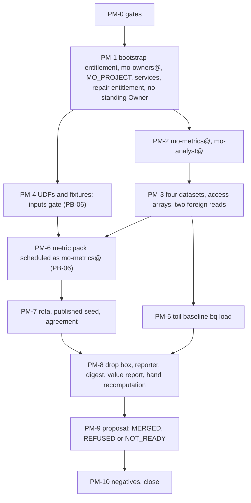

# POV 08. Mo: the metric pack keyed on `agent_id`, the value report, and a proposal the two-person rule may refuse

## Status

- Owner: the platform owner
- Last reviewed: 2026-09-17
- Last executed: never
- Stage: POV-2, the weeks before file 09 ([README](README.md) §4). Runs after file 07 has produced
  `DOER_AUDIT_DS` and at least four ISO weeks of L1 to L3 rows, and after file 06 has produced
  `EVE_QUALITY_DS`.
  Parts 1 to 5 (project, identities, datasets, fixtures, baseline) need neither and may run from
  week 4.
- Step prefix: `PM` (no collision with [../setup/README.md](../setup/README.md) §5.1). Steps: 38 (PM-1.1a, PM-1.3a, PM-1.5 and PM-2.1a are the run spec, the module shape and the zero-diff checker of [../setup/17](../setup/17-factory-module-equivalents-and-tier-r-gate.md), as file 06 does for Eve).
  **BLOCKED on PB-06:** PM-4.3, PM-4.5, PM-6.1, PM-6.2, PM-7.3, PM-8.2, PM-8.3, PM-8.4, PM-8.5,
  PM-9.1, PM-9.2, PM-9.3. PM-7.3 is also BLOCKED on PB-04 (the grading surface writes `grades`);
  PM-8.4 is also BLOCKED on file 02 PD-4.3 (the doer's operation catalogue).
  **PENDING** rather than BLOCKED: PM-3.4 while file 06 or 07 has not created its dataset; section 4
  of PM-8.4 ("Eve on the doer"), **by design**: Mo does not read Eve in the POV (README §1.1),
  `EVE_QUALITY_DS` holds no view (file 06 PE-3.1 creates the dataset "Views only" and no POV step
  creates a view in it), and the full build's setup/29 owns that section.
- Full-set counterparts: [../setup/22-mo-foundations.md](../setup/22-mo-foundations.md) (project,
  identity, datasets, UDFs, fixtures, baseline, secrets),
  [../setup/29-mo-eve-quality-pack.md](../setup/29-mo-eve-quality-pack.md) (the `eve_quality` read)
  and [../setup/40-mo-after-stage-0.md](../setup/40-mo-after-stage-0.md) (drop box, reporter,
  graders, first merge). Design: [../../mo/](../../mo/).
- Applies decisions: PV-01, PV-03, PV-05, PV-09, PV-10, PV-11, and inherited NAMES, SD-01, SD-33,
  SD-36, SD-45 ([02](02-decisions-people-and-the-retrospective-baseline.md)).
- Deviations used: PV-D-01, PV-D-05, PV-D-12, PV-D-13, PV-D-14, PV-D-16 (all in
  [09](09-the-demonstration-deviations-and-the-hand-over.md)). Build-time rows: `BD-P08-<n>`, in the
  one POV grammar `BD-P<file>-<n>` of [01](01-conventions-and-variables.md) PP-3.1.
- Consumes: `MO_REGISTER_ROW`, `MO_DDL_COMMIT`, `REGISTER_PATH` (04); `FLD_IMPROVERS_PROD`,
  `BILLING_ACCOUNT_ID`, `CICD_PROJECT`, `AR_PLATFORM`, `ORG_ID`, `DOMAIN`, `SA_1_ADMIN`,
  `GRP_PLATFORM_OWNERS`, `PAM_ENTITLEMENTS` (03); `TOIL_BASELINE_FILE`, `TOIL_TASKS`, `TOIL_RETRO_RECORD`, `TOIL_RETRO_WINDOW`,
  `SECOND_HUMAN_EMAIL`, `SECURITY_REVIEWER_EMAIL`, `BLIND_GRADER_EMAIL`, `AGENT_ID_DOER`,
  `AGENT_ID_MO`, `NAMES_RECORD`, PV-05, PV-09, and PV-01's record value `DOER_OPERATION_CATALOGUE`
  (PD-4.3) (02); `DOER_PROJECT`, `DOER_AUDIT_DS`, `LADDER_FILE`,
  `DOER_CODE_COMMIT` (07); `EVE_PROJECT`, `EVE_QUALITY_DS` (06); `PLATFORM_REPO_DIR`,
  `PLATFORM_REPO_REMOTE`, `BUILD_LOG_DIR`, `EVIDENCE_REGISTER`, `DEVIATION_REGISTER`, `REGION`,
  `BQ_LOCATION` (01).
- Produces: `ENT_BOOTSTRAP_MODULE_IMPROVERS_PROD`, `GRP_MO_OWNERS`, `MO_PROJECT`,
  `MO_PROJECT_NUMBER`, `ENT_PROJECT_REPAIR_MO`,
  `SA_MO_METRICS`, `SA_MO_ANALYST`, `MO_METRICS_DS`, `MO_ARCHIVE_DS`, `MO_PRIVATE_DS`,
  `MO_VIEWS_DS`, `MO_REPO_REMOTE`, `MO_INPUTS_COMMIT`, `MO_CODE_COMMIT`, `MO_WATERMARK`,
  `TOIL_BASELINE_LOADED`, `GRADING_ROTA`, `BLIND_SAMPLE_SEED`, `GRADER_AGREEMENT_RECORD`,
  `MO_PROPOSALS`, `MO_DIGEST_RECORD`, `POV_VALUE_REPORT`, `MO_PROPOSAL_1`,
  `MO_PROPOSAL_1_OUTCOME`, `POV_FIRST_MERGE_RECORD`. `POV_FIRST_MERGE_RECORD` is a POV grade and
  never satisfies setup/40 MA-8.7's `FIRST_MERGE_RECORD` (README §7.3): the full build re-derives
  the bare name, it is never promoted by renaming.
- Commands checked against Google's documentation on 2026-09-16 (§Checked). What could not be
  settled is in §Could not verify.

## What this part builds

Mo is the platform's measurement component: **one per platform, keyed on `agent_id`**, reading
what the doer and Eve write and never writing anything that enforces
([../../mo/01-hld.md](../../mo/01-hld.md), M-1). In the POV it proves that the **measurement
machinery** works and scales: every rate the doer produces is computed from its audit rows, keyed on
`agent_id`, published with its sample size and a conservative bound, and recomputed by a second human.
It does **not** prove realised value. The doer holds no Workspace admin role and acts only on the
synthetic accounts and owned resources of PV-06 and PV-01's catalogue, while the toil baseline counts
real Admin console work, so **no real human minute is saved in the POV**. The most the value report
can show is a **projection**: what the doer's executed volume would have cost a human, for the
baseline tasks that match one of its catalogued operations, and nothing at all where none match
(PM-8.4). Saying the doer "saved time" is a use of [README](README.md) §1.2 sentence 1's ban on
implying the doer does admin work.

1. `mo-owners@` and `MO_PROJECT` in `fld-improvers-prod`, by hand under SD-01 (PV-D-01), with the
   full build's name, labels and folder, **no Secret Manager, no Cloud KMS, and no Mo identity
   holding `run.invoker` on any credential holder**.
2. `mo-metrics@` (the only identity that reads raw rows) and `mo-analyst@` (the only one that
   leaves BigQuery), keyless, with the grants of [../../mo/02-identity-and-access.md](../../mo/02-identity-and-access.md)
   §2.1 and §2.2 **minus** the `run.invoker` on the action service (§3.1 below).
3. The four agent-neutral datasets `platform_metrics`, `platform_metrics_archive`,
   `platform_metrics_private`, `platform_metrics_views` in `EU` (SD-33), and `mo-metrics@`'s two
   foreign reads: `DOER_AUDIT_DS` and `EVE_QUALITY_DS`, **and nothing else**.
4. The Wilson UDFs and golden fixtures, byte for byte the full set's text.
5. The retrospective toil baseline (PV-05, PV-D-05) loaded with `bq load`, no expiry, a
   commit-named archive copy, keyed on `AGENT_ID_DOER`.
6. A reduced metric pack (PB-06): 6 schemas and 8 SQL files, scheduled as `mo-metrics@`.
7. Blind grading from a seed published after the week closes, a grading rota, and an agreement record.
8. The drop box, the reporter, the weekly digest and **`POV_VALUE_REPORT`**, whose minutes section is
   a projection over the tasks that match the doer's catalogue, or no figure when none match.
9. One Mo proposal, merged only by two humans who are neither its author nor a Mo identity, or
   recorded `REFUSED` (or `NOT_READY`) and filed as evidence. **L4 and L5 are refused.**

What this file does **not** build, against the full set: the CI ingestion identity and workflow
(40 §6, §7), the deployed validator (40 MA-7.6), the freshness alert policy (40 §2, a manual weekly
watermark read stands in), Mo-10 and Mo-11 (40 §9, §10), the Wall-E pack's seventeen aggregates
(36), the Eve pack's ten tables (29 §3). Each is PV-D-13 or out of POV scope.



## Preconditions

- [ ] [04](04-the-contract-register-agent-ids-and-schemas.md): `MO_REGISTER_ROW` merged (tier `IMP`,
      `privilege: none`, `verifier: none`, `model_pin: none`), `MO_DDL_COMMIT` on `main`,
      `MANUAL_PARSE_RECORD` signed by two people for the row; 04 PC-2.5 merged, which committed
      `mo/datasets.json` and the two toil-baseline schemas of setup/22 MO-8.1 (PM-5.1 verifies them
      and does not create them again).
- [ ] [03](03-foundation-folders-logging-and-floors.md): `FLD_IMPROVERS_PROD`, `BILLING_ACCOUNT_ID`,
      `AR_PLATFORM`, `CICD_PROJECT`, `DOMAIN` (03 PF-1.1), `GRP_PLATFORM_OWNERS` (03 PF-1.7);
      `PAM_ENTITLEMENTS` from 03 PF-5.1. PF-5.1 leaves `ent-bootstrap-module-improvers-*` to this
      file, so **PM-1.0 creates `ent-bootstrap-module-improvers-prod`**; no file creates a repair
      template, so PM-1.4 writes `ent-project-repair-mo` in full. Both creates need 03 PF-2.1's dated
      PAM Admin exception still in force, that is, no `PF-10.3 DONE` line in `checkpoints.tsv`
      (PM-1.0 checks it).
- [ ] [02](02-decisions-people-and-the-retrospective-baseline.md): PV-05 and PV-09 signed;
      `TOIL_BASELINE_FILE` merged on `main` in the nine-column format of
      [../setup/02](../setup/02-toil-baseline.md) line 76; `TOIL_RETRO_RECORD` names the window,
      the Admin log retention read on its day and the calibration sample.
- [ ] [07](07-the-doer-tier-w-and-the-optional-tier-p.md) for parts 3.4, 6 to 9: `DOER_AUDIT_DS`
      with the nine B-22-shape tables (PB-01), `LADDER_FILE`, and at least four ISO weeks of rows.
- [ ] [02](02-decisions-people-and-the-retrospective-baseline.md) PD-4.3 for PM-8.4: the PV-01
      supersession `pov-doer-catalogue-scopes-and-k4` signed, carrying the record value
      `DOER_OPERATION_CATALOGUE` (read with `decision-value.sh PV-01 DOER_OPERATION_CATALOGUE`,
      never copied into the variables file). Without it PM-8.4 stays BLOCKED: the overlap between
      `TOIL_TASKS` and the doer's operations cannot be decided.
- [ ] [06](06-eve-over-the-human-super-admins.md) for part 3.4: `EVE_QUALITY_DS` exists (06 PE-3.1).
- [ ] [06](06-eve-over-the-human-super-admins.md) for PM-8.4 section 4, which is **PENDING by
      design** in the POV: section 4 needs at least one authorised view over `eve.findings` in
      `EVE_QUALITY_DS`, and file 06 creates the dataset (PE-3.1) and no view in it, because Mo does
      not read Eve in the POV (README §1.1); the full build's setup/29 owns the views, and until then
      `eve_on_doer.sql` has nothing to read. Check: `bq --project_id="$EVE_PROJECT" ls --format=json "${EVE_PROJECT}:${EVE_QUALITY_DS}" | jq '[.[] | select(.type=="VIEW")] | length'` prints `0` in the POV, and section 4 reads its PENDING sentence.
- [ ] Person 3 appointed (PV-09). **Not** a precondition to start: without person 3 part 9 records
      `REFUSED`, which is a valid outcome (§9).
- [ ] Workstation of [01](01-conventions-and-variables.md): `gcloud` with `alpha`, `bq`, `jq`,
      `python3.12`, `git`, the git host's CLI; `penv_guard` silent.

## People

| Role | Does | Present at |
|---|---|---|
| Person 1, platform owner, **Mo owner** and author of every Mo input and of the proposal pull request | every shell step; requests every grant | all |
| Person 2, second person (`SECOND_HUMAN_EMAIL`) | approves every PAM grant and the reporter deploy (PV-D-12); publishes the weekly seed; second grader on the 20 % double-graded subset; first merge reviewer | PM-1.0, PM-1.2, PM-1.4, PM-3.4, PM-7.2, PM-7.3, PM-8.2, PM-9.2 |
| Person 3, second operator, blind grader, security reviewer (`SECURITY_REVIEWER_EMAIL`, `BLIND_GRADER_EMAIL`) | reviews every Mo input commit; grades blind; **recomputes the value report by hand**; second merge reviewer (PV-D-14, PV-D-16); approves the NAMES amendment of the drop box | PM-4.1, PM-5.1, PM-7.3, PM-8.1, PM-8.5, PM-9.2 |
| DPO | informed of the baseline retention row (PM-5.3) and of Mo as a processor | PM-5.3 |

Hands-on: about 2 days, as [README](README.md) §5.2. Elapsed: 1 week once PB-06 is merged.

Every shell block starts with:

```bash
source ~/.platform-env
penv_guard
R="$BUILD_LOG_DIR/records/$(date -u +%F)-PM"
need DOMAIN   # set by 03 PF-1.1; never derived locally
```

Every step writes `checkpoint <id> START` before ACTION and `DONE`, `BLOCKED` or `PENDING` after
VERIFY, and registers its record with `evidence_add` ([01](01-conventions-and-variables.md)).

## 0. The sitting

### PM-0.1 Check the gates

- **WHO:** person 1.
- **WHERE:** shell, `~/.platform-env` sourced.
- **ACTION:**

```bash
need FLD_IMPROVERS_PROD BILLING_ACCOUNT_ID CICD_PROJECT ORG_ID DOMAIN SA_1_ADMIN GRP_PLATFORM_OWNERS REGION BQ_LOCATION PLATFORM_REPO_DIR BUILD_LOG_DIR EVIDENCE_REGISTER DEVIATION_REGISTER MO_REGISTER_ROW MO_DDL_COMMIT TOIL_BASELINE_FILE TOIL_TASKS TOIL_RETRO_RECORD AGENT_ID_DOER AGENT_ID_MO SECOND_HUMAN_EMAIL
"$PLATFORM_REPO_DIR/tools/decision-need.sh" PV-01 PV-03 PV-05 PV-09 PV-10 PV-11 NAMES SD-33
for v in MO_PROJECT MO_METRICS_DS MO_ARCHIVE_DS MO_PRIVATE_DS MO_VIEWS_DS; do printf '%s=%s\n' "$v" "$("$PLATFORM_REPO_DIR/tools/decision-value.sh" NAMES "$v")"; done
test "$BQ_LOCATION" = EU && echo "BQ_LOCATION EU"
# names-check: off PV-02
grep -rnE 'walle_metrics|WALLE_PROJECT|walle_audit' "$PLATFORM_REPO_DIR/mo" "$PLATFORM_REPO_DIR/register/${AGENT_ID_MO}.yaml" 2>/dev/null && echo "STOP: retired or reserved name" || echo "no retired or reserved name"
# names-check: on
test -z "$(gcloud config get project 2>/dev/null)" && echo "no default project"
```

- **VERIFY:** `SIGNED` for each id; the four dataset names print `platform_metrics`,
  `platform_metrics_archive`, `platform_metrics_private`, `platform_metrics_views` exactly;
  `BQ_LOCATION EU`; `no retired or reserved name`; `no default project`. Anything else: stop.
- **ROLLBACK:** read only.
- **EVIDENCE:** output as `${R}-0.1-gates-v1.txt`; E-05; TISAX 1.4.1.

## 1. The owner group and the project

### PM-1.0 Create `ent-bootstrap-module-improvers-prod`, the only way to create `MO_PROJECT`

- **WHO:** person 1 as `sa-1-admin@` writes and creates; **person 2 reviews the pull request and is
  the entitlement's only approver**.
- **WHERE:** `PLATFORM_REPO_DIR/pam/entitlements/`; then the shell.
- **ACTION:** file 03 PF-5.1 creates seven entitlements and leaves `ent-bootstrap-module-improvers-*`
  to this file; file 03 PF-10.3 later withdraws Project Creator, after which a PAM grant of this
  entitlement is the only lawful way to create `MO_PROJECT` (SD-46). The document is setup/12
  PA-2.1's `ent-bootstrap-module-improvers-prod` row, written out: folder `fld-improvers-prod`, the
  `SINGLETON` roles, 1 hour, requester `platform-owners@`, approver person 2. Commit it by pull
  request, merged by person 2, then create it with the form of setup/12 PA-4.8.

```bash
need FLD_IMPROVERS_PROD GRP_PLATFORM_OWNERS SECOND_HUMAN_EMAIL CICD_PROJECT PLATFORM_REPO_DIR BUILD_LOG_DIR
grep -qE 'PF-10\.3[[:space:]]+DONE' "$BUILD_LOG_DIR/checkpoints.tsv" && { echo "STOP: 03 PF-10.3 withdrew PAM Admin; BLOCKED against file 03"; false; } || echo "03 PF-2.1 exception in force"
checkpoint PM-1.0 START "$SECOND_HUMAN_EMAIL" - "create ent-bootstrap-module-improvers-prod"
E="$PLATFORM_REPO_DIR/pam/entitlements/ent-bootstrap-module-improvers-prod.yaml"
cat > "$E" <<EOF
eligibleUsers:
- principals: ["group:${GRP_PLATFORM_OWNERS}"]
privilegedAccess:
  gcpIamAccess:
    resourceType: cloudresourcemanager.googleapis.com/Folder
    resource: //cloudresourcemanager.googleapis.com/folders/${FLD_IMPROVERS_PROD}
    roleBindings:
    - role: roles/resourcemanager.projectCreator
    - role: roles/serviceusage.serviceUsageAdmin
    - role: roles/iam.serviceAccountCreator
    - role: roles/resourcemanager.projectIamAdmin
maxRequestDuration: 3600s
requesterJustificationConfig:
  unstructured: {}
approvalWorkflow:
  manualApprovals:
    requireApproverJustification: true
    steps:
    - approvalsNeeded: 1
      approverEmailRecipients: ["${SECOND_HUMAN_EMAIL}"]
      approvers:
      - principals: ["user:${SECOND_HUMAN_EMAIL}"]
EOF
# commit on branch mo-1-bootstrap-entitlement; person 2 reviews and merges; then, from origin/main:
gcloud pam entitlements create ent-bootstrap-module-improvers-prod --folder="$FLD_IMPROVERS_PROD" --location=global --entitlement-file="$E" --billing-project="$CICD_PROJECT"
penv_set ENT_BOOTSTRAP_MODULE_IMPROVERS_PROD "$(gcloud pam entitlements describe ent-bootstrap-module-improvers-prod --folder="$FLD_IMPROVERS_PROD" --location=global --billing-project="$CICD_PROJECT" --format='value(name)')"
checkpoint PM-1.0 DONE "$SECOND_HUMAN_EMAIL" "build-log:records/$(basename "${R}-1.0-bootstrap-entitlement-v1.txt")"
```

- **VERIFY:** `gcloud pam entitlements describe ent-bootstrap-module-improvers-prod --folder="$FLD_IMPROVERS_PROD" --location=global --billing-project="$CICD_PROJECT" --format="value(state)"`
  prints `AVAILABLE`; the describe shows requester `group:platform-owners@…` only and approver
  `user:` person 2 only; the merge commit's author is not its merger. Newly created entitlements can
  take a few minutes to propagate, so PM-1.2 starts at least five minutes later.
- **ROLLBACK:** `gcloud pam entitlements delete ent-bootstrap-module-improvers-prod --folder="$FLD_IMPROVERS_PROD" --location=global --billing-project="$CICD_PROJECT"` while no grant is active.
- **EVIDENCE:** the merge commit and describe output as `${R}-1.0-bootstrap-entitlement-v1.txt`;
  `evidence_add PM-1.0 ent-bootstrap-module-improvers-prod E-08 4.1.3 "build-log:records/$(basename "${R}-1.0-bootstrap-entitlement-v1.txt")"`.
  The full build's setup/12 PA-4.8 regenerates this row from `catalogue.py` and PA-6.1's live-compare
  must print no difference. E-08; TISAX 4.1.3.

### PM-1.1 Create `mo-owners@` as a security group

- **WHO:** person 1 as `sa-1-admin@`.
- **WHERE:** Admin console, Directory > Groups > Create group (the path [../setup/22](../setup/22-mo-foundations.md) MO-1.2 uses).
- **ACTION:** email `mo-owners@<DOMAIN>`; description "Mo owners: register owner_group of Mo; requester group for ent-project-repair-mo"; tick **Security**; invitation only, no external members; member person 1 only. Then `penv_set GRP_MO_OWNERS "mo-owners@${DOMAIN}"`.
- **VERIFY:**

```bash
gcloud identity groups describe "$GRP_MO_OWNERS" --format="json(labels)"
gcloud identity groups memberships list --group-email="$GRP_MO_OWNERS" --format="value(preferredMemberKey.id)"
```

  labels include `cloudidentity.googleapis.com/groups.security`; one member.
- **ROLLBACK:** **IRREVERSIBLE** (a security label cannot be removed). Confirm first: the address
  equals `owner_group` in `MO_REGISTER_ROW`. Gate: PV-03.
- **EVIDENCE:** screenshot and output as `${R}-1.1-mo-owners-v1`; `BD-P08-1` "group by hand, not the
  group factory" in `DEVIATION_REGISTER`; E-08; TISAX 4.1.1.

### PM-1.1a Write and merge the run spec for `MO_PROJECT`, before the project exists

- **WHO:** person 1 writes; **two human reviewers who are not person 1 approve the merge, person 2 one of them**.
- **WHERE:** shell, branch `fm-spec-mo-prod`, then the git host.
- **ACTION:** [../setup/17](../setup/17-factory-module-equivalents-and-tier-r-gate.md) FM-2.1 with the `improver-project` values of [../setup/22](../setup/22-mo-foundations.md) MO-2.2, filled from the template (04 PC-4.2a), the merged row (`MO_REGISTER_ROW`) and NAMES, as file 06 PE-1.1a does for Eve. **Where this file builds something, the spec states exactly what this file builds**: PM-1.2's labels, PM-1.3's services, PM-1.3a's routing, trace bucket, budget and contacts, PM-1.4's repair entitlement and the two identities of PM-2.1. Where the POV deliberately does less than the full module, the spec records the POV's real state, never the full build's:

  | Key | Value in the POV | Why |
  |---|---|---|
  | `service_accounts`, `project_bindings` | `mo-metrics`, `mo-analyst`, each `roles/bigquery.jobUser` | PM-2.1 creates them after the first checker run; two `pending` lines, re-run in PM-2.1a |
  | `notification_channels` | none | setup/17 FM-2.13's baseline channels are `made_elsewhere` (setup/22 MO-2.2; PV-D-10) |
  | `project_floor` | `applies: false`, with its reason and a `made_elsewhere` line | `aiplatform.googleapis.com` is forbidden here (PM-1.3) and `modelarmor.googleapis.com` is not enabled, so Mo calls no model and no project floor can be written or read; the platform floor of 03 PF-8.2 is inherited |
  | `entitlements` | `ent-project-repair-mo` | Mo holds no credential ([../../mo/02-identity-and-access.md](../../mo/02-identity-and-access.md) §1.1), so no deploy entitlement exists |
  | `deny_entries`, `pab_bindings`, `project_org_policies`, `project_deny_policies` | none | no Mo identity is an agent principal, and nothing is attached at project level in the POV |

  Labels are PM-1.2's set plus `cost_centre` `tbd` (a label cannot hold `*tbd*`) and `factory_run`, which equals `run_id`: `dev-p08-improver-mo-prod`. The effective tags are read from the parent folder and must be `imp`.

```bash
source ~/.platform-env
penv_guard
R="$BUILD_LOG_DIR/records/$(date -u +%F)-PM"
need PLATFORM_REPO_DIR PLATFORM_REPO_SLUG MO_REGISTER_ROW GRP_MO_OWNERS GRP_PLATFORM_SECURITY FLD_IMPROVERS_PROD SECOND_HUMAN_EMAIL NAMES_RECORD
grep -qE 'PC-4\.2d[[:space:]]+DONE' "$BUILD_LOG_DIR/checkpoints.tsv" || { echo "STOP: POV 04 PC-4.2d is not DONE; the checker is not proven"; false; }
MP_ID="$("$PLATFORM_REPO_DIR/tools/decision-value.sh" NAMES MO_PROJECT)"; need MP_ID
gcloud projects describe "$MP_ID" --format='value(projectId)' 2>/dev/null && { echo "STOP: $MP_ID exists; the spec comes first (resume rule)"; false; }
checkpoint PM-1.1a START "$SECOND_HUMAN_EMAIL" - "run spec for MO_PROJECT before the project exists"
RC="${MO_REGISTER_ROW#*@}"; RC="${RC%%:*}"; need RC
TAGS="$(gcloud resource-manager tags bindings list --parent="//cloudresourcemanager.googleapis.com/folders/${FLD_IMPROVERS_PROD}" --effective --format=json | jq -c '[.[] | .namespacedTagValue | split("/") | {(.[-2]): .[-1]}] | add // {}')"
echo "$TAGS" | tee "${R}-1.1a-folder-tags-v1.json"
git -C "$PLATFORM_REPO_DIR" switch main && git -C "$PLATFORM_REPO_DIR" pull --ff-only
git -C "$PLATFORM_REPO_DIR" switch -c fm-spec-mo-prod
SPEC="$PLATFORM_REPO_DIR/factory/runs/mo-prod.json"
jq --arg id "$MP_ID" --arg rc "$RC" --arg own "$GRP_MO_OWNERS" --arg sec "$GRP_PLATFORM_SECURITY" --argjson tags "$TAGS" '
  .module="improver-project" | .run_id="dev-p08-improver-mo-prod" | .calling_file_step="POV 08 PM-1.2"
  | .register_row="register/mo.yaml" | .register_commit=$rc | .manifest="mo/agent-manifest.yaml"
  | .agent_id="mo" | .env="prod" | .register_tier="IMP"
  | .project_variable="MO_PROJECT" | .project_id=$id | .create=true | .parent_folder_variable="FLD_IMPROVERS_PROD"
  | .labels={"agent":"mo","owner":"mo-owners","tier":"imp","env":"prod","data_class":"evidence","ai_act_class":"minimal","recovery_class":"r-a","cost_centre":"tbd","created_by":"bootstrap-hand","factory_run":"dev-p08-improver-mo-prod"}
  | .tags_effective=$tags
  | .services=["bigquery.googleapis.com","bigquerydatatransfer.googleapis.com","storage.googleapis.com","run.googleapis.com","artifactregistry.googleapis.com","logging.googleapis.com","monitoring.googleapis.com","observability.googleapis.com"]
  | .service_dependencies=[]
  | .log_routing={"default_bucket":"default-europe-west1","location":"europe-west1","retention_days":30,"trace_bucket":true}
  | .budget={"display_name":($id + "-budget"),"amount":200,"reason_if_not_tier_default":null}
  | .essential_contacts=[{"email":$own,"categories":["SECURITY","SUSPENSION","TECHNICAL","TECHNICAL_INCIDENTS"]},{"email":$sec,"categories":["SECURITY"]}]
  | .service_accounts=["mo-metrics","mo-analyst"]
  | .project_bindings=[{"role":"roles/bigquery.jobUser","member":("serviceAccount:mo-metrics@" + $id + ".iam.gserviceaccount.com")},{"role":"roles/bigquery.jobUser","member":("serviceAccount:mo-analyst@" + $id + ".iam.gserviceaccount.com")}]
  | .allowed_human_members=[] | .notification_channels=[] | .trigger_sink=null
  | .project_floor={"applies":false,"tier":"improvers","pi_confidence":"HIGH","rai_min":"MEDIUM_AND_ABOVE","vertex_ai":false,"vertex_enforcement":null,"floors_file":"model-armor/floors.json","reason":"aiplatform.googleapis.com is forbidden in MO_PROJECT (POV 08 PM-1.3) and modelarmor.googleapis.com is not enabled, so Mo calls no model and no project floor can be written or read; the platform floor of POV 03 PF-8.2 is inherited"}
  | .deny_entries=[] | .pab_bindings=[] | .project_org_policies=[] | .project_deny_policies=[]
  | .entitlements=["ent-project-repair-mo"] | .lien=true
  | .made_elsewhere=[{"item":"datasets platform_metrics, platform_metrics_archive, platform_metrics_private, platform_metrics_views and their access arrays","file":"POV 08","step":"part 3"},
                     {"item":"the mo-proposals drop box and the mo-reporter job","file":"POV 08","step":"parts 8 and 9"},
                     {"item":"the baseline owners email and paging channels of FM-2.13","file":"setup/22","step":"MO-2.2 (setup/17 FM-2.13; PV-D-10)"},
                     {"item":"Model Armor project floor, needed only if a Mo narrator ever calls a model","file":"setup/22","step":"MO-2.2 (setup/17 FM-2.12a)","owner":"Mo owner"}]
  | .pending=[{"check":"service_accounts.exact","reason":"mo-metrics@ and mo-analyst@ are created at PM-2.1, after the first checker run","owner":"platform owner","rerun_in":"POV 08 PM-2.1a"},
              {"check":"iam.spec_bindings_present","reason":"the two roles/bigquery.jobUser bindings are made at PM-2.1","owner":"platform owner","rerun_in":"POV 08 PM-2.1a"}]' \
  "$PLATFORM_REPO_DIR/factory/runs/_template.json" > "$SPEC"
python3.12 -m json.tool "$SPEC" >/dev/null && echo JSON-OK
diff <(jq -r 'keys[]' "$PLATFORM_REPO_DIR/factory/runs/_template.json") <(jq -r 'keys[]' "$SPEC") && echo "KEY-SET EQUALS TEMPLATE"
jq -r '.tags_effective | to_entries[] | "\(.key)=\(.value)"' "$SPEC"
if python3.12 "$PLATFORM_REPO_DIR/tools/fm-zero-diff.py" inputs "$SPEC" --report "${R}-1.1a-inputs-v1.json"; then echo "exit=0"; else echo "exit=$?"; fi
jq -r '.results[] | select(.status != "PASS") | "\(.status) \(.check) \(.actual)"' "${R}-1.1a-inputs-v1.json"
git -C "$PLATFORM_REPO_DIR" add factory/runs/mo-prod.json
git -C "$PLATFORM_REPO_DIR" commit -m "factory: run spec dev-p08-improver-mo-prod before MO_PROJECT exists (setup 17 FM-2.1; POV 08 PM-1.1a)"
git -C "$PLATFORM_REPO_DIR" push -u origin fm-spec-mo-prod
gh pr create --repo "$PLATFORM_REPO_SLUG" --head fm-spec-mo-prod --title "PM-1.1a run spec mo-prod" --body "setup/17 FM-2.1 with setup/22 MO-2.2 values; the POV's real state in made_elsewhere and pending. Approvers: person 2 and one other reviewer, neither the author."
```

  After the merge: `git -C "$PLATFORM_REPO_DIR" switch main && git -C "$PLATFORM_REPO_DIR" pull --ff-only && checkpoint PM-1.1a DONE "$SECOND_HUMAN_EMAIL" "repo:factory/runs/mo-prod.json@$(git -C "$PLATFORM_REPO_DIR" log -1 --format=%h -- factory/runs/mo-prod.json)" "spec merged before the project"`.
- **VERIFY:** `JSON-OK`; `KEY-SET EQUALS TEMPLATE`; the tag lines read `agp-tier=imp` and `agp-tisax-scope=in`, and `agp-env=prod` where 03 created that key. `inputs` prints `exit=1` with exactly one non-`PASS` line, `FAIL services.subset_of_folder_allowlist ["observability.googleapis.com"]`: a service Google's constraint does not govern, which the unchanged checker's allow-list rule cannot pass (04 PC-4.2d's `PENDING` line). Every other check reads `PASS`, in particular `row.*`, `manifest.sha`, `names.project_id`, `project_id.form` (`agp-imp-mo-prod`, 02 PD-3.2), `parent.folders_yaml`, `budget.tier_default` (200 for `imp` prod), every label's alphabet, `labels.factory_run`, `floor.declared` and `floor.not_applicable_is_owned`. Any other non-`PASS` line stops the step. The pull request is merged with two human approvals, person 2's among them, neither person 1's, before PM-1.2 runs.
- **ROLLBACK:** Close the pull request; nothing exists in Google Cloud yet.
- **EVIDENCE:** The inputs report, the folder tag read and the merge commit as `${R}-1.1a-run-spec-v1`; `evidence_add PM-1.1a run-spec E-05 1.3.1 build-log:records/ "${R}-1.1a-inputs-v1.json"`. E-05. TISAX 1.3.1, 5.2.1.

### PM-1.2 Create `MO_PROJECT` in `fld-improvers-prod`

- **WHO:** person 1 under the improvers bootstrap entitlement; **approver person 2**.
- **WHERE:** shell.
- **ACTION:** the full set creates this project with FM-IMPROVER
  ([../setup/22](../setup/22-mo-foundations.md) MO-2.2). The POV creates it by hand with the same
  id, folder and labels (PV-D-01), the labels read from PM-1.1a's merged run spec, so a later
  `terraform import` plans no change and PM-1.5's checker can prove it.

```bash
P_ID="$("$PLATFORM_REPO_DIR/tools/decision-value.sh" NAMES MO_PROJECT)"; need P_ID
gcloud projects describe "$P_ID" >/dev/null 2>&1 && echo "STOP: $P_ID exists; resume rule" || echo "free $P_ID"
gcloud pam grants create --entitlement="ent-bootstrap-module-improvers-prod" --requested-duration=3600s --justification="POV 08 PM-1.2: create MO_PROJECT" --location=global --folder="$FLD_IMPROVERS_PROD" --billing-project="$CICD_PROJECT"
SPEC="$PLATFORM_REPO_DIR/factory/runs/mo-prod.json"
git -C "$PLATFORM_REPO_DIR" log --oneline -1 origin/main -- factory/runs/mo-prod.json | grep -q . && echo "run spec merged" || { echo "STOP: PM-1.1a's run spec is not merged"; false; }
gcloud projects create "$P_ID" --folder="$FLD_IMPROVERS_PROD" --no-enable-cloud-apis --labels="$(jq -r '.labels | to_entries | map("\(.key)=\(.value)") | join(",")' "$SPEC")"
gcloud billing projects link "$P_ID" --billing-account="$BILLING_ACCOUNT_ID"
gcloud alpha resource-manager liens create --project="$P_ID" --restrictions=resourcemanager.projects.delete --reason="POV 08: Mo project; the full build continues in it"
penv_set MO_PROJECT "$P_ID"
penv_set MO_PROJECT_NUMBER "$(gcloud projects describe "$P_ID" --format='value(projectNumber)')"
```

  No `--set-as-default`, ever. The account that runs `gcloud projects create` is automatically
  granted the Owner role on the project ([access control for projects](https://docs.cloud.google.com/resource-manager/docs/access-control-proj),
  updated 2026-09-16). That standing binding is not the PAM grant and does not end with it: PM-1.4
  part c removes it.
- **VERIFY:** `gcloud projects describe "$MO_PROJECT" --format="value(parent.type,parent.id,lifecycleState)"`
  prints `folder <FLD_IMPROVERS_PROD> ACTIVE`; `gcloud billing projects describe "$MO_PROJECT"`
  shows `billingEnabled: true`; `gcloud alpha resource-manager liens list --project="$MO_PROJECT"`
  shows one lien.
- **ROLLBACK:** **IRREVERSIBLE as a name**: a project id is never reusable, even after deletion.
  Confirm first: `P_ID` equals `NAMES_RECORD`'s `MO_PROJECT`; the folder is `fld-improvers-prod`
  (projects never move between tier folders, [../02-landing-zone-and-tiers.md](../02-landing-zone-and-tiers.md)
  §1.5). Gate: PV-03, NAMES, `MO_REGISTER_ROW` merged. A wrong label is corrected with
  `gcloud projects update --update-labels`.
- **EVIDENCE:** output as `${R}-1.2-project-v1.txt`; `BD-P08-2` "project by hand, SD-01; unwind: B-01
  import with empty plan"; E-05; TISAX 1.3.1.

### PM-1.3 Services: the exact list, and the two that must never be on

- **WHO:** person 1, inside the PM-1.2 grant.
- **WHERE:** shell.
- **ACTION:** only what parts 3 to 8 use. Secret Manager and Cloud KMS stay off: Mo holds no secret
  and no key ([../../mo/02-identity-and-access.md](../../mo/02-identity-and-access.md) §1.1).

```bash
gcloud services enable bigquery.googleapis.com bigquerydatatransfer.googleapis.com storage.googleapis.com run.googleapis.com artifactregistry.googleapis.com logging.googleapis.com monitoring.googleapis.com observability.googleapis.com --project="$MO_PROJECT"
set -o pipefail
gcloud services list --enabled --project="$MO_PROJECT" --format="value(config.name)" | sort > "${R}-1.3-services-v1.txt"; echo "exit=$?"
comm -13 <(jq -r '.services[]' "$PLATFORM_REPO_DIR/factory/runs/mo-prod.json" | sort) "${R}-1.3-services-v1.txt" > "${R}-1.3-extra-v1.txt"; echo "dependencies beyond the spec: $(wc -l < "${R}-1.3-extra-v1.txt")"
grep -xE 'secretmanager\.googleapis\.com|cloudkms\.googleapis\.com|aiplatform\.googleapis\.com|firestore\.googleapis\.com|admin\.googleapis\.com' "${R}-1.3-services-v1.txt" && echo "STOP: forbidden service" || echo "no forbidden service"
gcloud org-policies describe gcp.restrictServiceUsage --project="$MO_PROJECT" --effective --format=json > "${R}-1.3-allowlist-v1.json" 2>&1; echo "exit=$?"
```

- **VERIFY:** `exit=0`; `no forbidden service`. The allow-list read: if file 03 set
  `gcp.restrictServiceUsage` on `fld-improvers-*`, `secretmanager.googleapis.com` and
  `cloudkms.googleapis.com` are absent from its allowed values; if file 03 did not, record
  `PENDING` against file 03 with an owner (the service list above is then the only control, stated).
- **ROLLBACK:** `gcloud services disable <service> --project="$MO_PROJECT"` for a wrongly enabled one.
- **EVIDENCE:** both files; E-08; TISAX 4.2.1, 5.2.1.

### PM-1.3a The module shape the spec states: `_Default`, `_Trace`, budget, contacts

- **WHO:** person 1, still holding the creator's Owner (removed in PM-1.4 part c). The budget: person 1 while today is before `BOOTSTRAP_BILLING_EXPIRY`, otherwise the billing administrator. Two reviewers, person 2 one of them, merge the dependency revision.
- **WHERE:** shell; the git host for the revision.
- **ACTION:** file 06 PE-1.4a's block **unchanged** with `MO_PROJECT` in place of `EVE_PROJECT`, `factory/runs/mo-prod.json` in place of `eve-prod.json`, checkpoint id `PM-1.3a`, branch `fm-spec-mo-prod-dependencies` and PM-1.3's `extra` record (`*-PM-1.3-extra-v1.txt`). It runs setup/17 FM-2.8 (`_Default` to `default-europe-west1`; `_Required` stays global), FM-2.9 (`_Trace` in `REGION` by setup/10 CP-1.8's REST call, the token on standard input, never printed or stored), FM-2.10 (the budget of 200 with four thresholds) and FM-2.11 (the two Essential Contacts), each value read from the spec, then writes any service dependency PM-1.3 recorded into the spec by a reviewed revision. File 06 PE-1.4a cites the Google references for every flag and call.
- **VERIFY:** as file 06 PE-1.4a, for `MO_PROJECT`: `_Default` ends `/locations/europe-west1/buckets/default-europe-west1` and `_Required` ends `/locations/global/buckets/_Required`; setup/10 CP-1.7's routing test reads the entry back; the REST call prints an operation name and `_Trace` is listed; one budget of 200 naming only `MO_PROJECT` with four rules; exactly the spec's two contacts; the dependency revision merged with two approvals, person 2's among them, or `extra` was empty.
- **ROLLBACK:** as file 06 PE-1.4a. **`_Trace` is IRREVERSIBLE**: no delete is documented and its location cannot be changed. Confirm first: `REGION` is `europe-west1` and the URL names `MO_PROJECT`.
- **EVIDENCE:** `${R}-1.3a-module-shape-v1.txt`; `evidence_add PM-1.3a module-shape E-05 5.2.4 build-log:records/ "${R}-1.3a-module-shape-v1.txt"`. E-05, E-06. TISAX 5.2.4, 7.1, 1.3.3, 1.6.1. Then `checkpoint PM-1.3a DONE "$SECOND_HUMAN_EMAIL" "build-log:records/$(basename "${R}-1.3a-module-shape-v1.txt")"`.

### PM-1.4 The repair entitlement, then no standing human access in `MO_PROJECT`

- **WHO:** person 1 writes, creates and requests; **person 2 reviews the file and is the only
  approver**, from their own session.
- **WHERE:** shell; `PLATFORM_REPO_DIR/pam/`.
- **ACTION:** in three parts, as file 06 PE-1.5 does for `EVE_PROJECT`. No file creates a repair
  template, so the entitlement is written in full here, in the shape of setup/12 PA-2.1's
  `ent-project-repair` template, narrowed to what parts 2 to 10 use (no Secret Manager, no KMS, no
  Vertex AI, no Firestore). `roles/iam.serviceAccountAdmin` and
  `roles/resourcemanager.projectIamAdmin` are there because PM-2.1 creates the two identities and
  binds `bigquery.jobUser` after the creator's Owner is gone.

  **Part a, the entitlement.** Merge `pam/ent-project-repair-mo.yaml` by pull request reviewed by
  person 2, then:

```bash
need MO_PROJECT GRP_MO_OWNERS SECOND_HUMAN_EMAIL SA_1_ADMIN CICD_PROJECT
checkpoint PM-1.4a START "$SECOND_HUMAN_EMAIL" - "create ent-project-repair-mo"
cat > "$PLATFORM_REPO_DIR/pam/ent-project-repair-mo.yaml" <<EOF
eligibleUsers:
- principals: ["group:${GRP_MO_OWNERS}"]
privilegedAccess:
  gcpIamAccess:
    resourceType: cloudresourcemanager.googleapis.com/Project
    resource: //cloudresourcemanager.googleapis.com/projects/${MO_PROJECT}
    roleBindings:
    - role: roles/bigquery.admin
    - role: roles/run.developer
    - role: roles/storage.admin
    - role: roles/iam.serviceAccountUser
    - role: roles/iam.serviceAccountAdmin
    - role: roles/resourcemanager.projectIamAdmin
maxRequestDuration: 7200s
requesterJustificationConfig:
  unstructured: {}
approvalWorkflow:
  manualApprovals:
    requireApproverJustification: true
    steps:
    - approvalsNeeded: 1
      approverEmailRecipients: ["${SECOND_HUMAN_EMAIL}"]
      approvers:
      - principals: ["user:${SECOND_HUMAN_EMAIL}"]
EOF
gcloud pam entitlements create ent-project-repair-mo --project="$MO_PROJECT" --location=global --entitlement-file="$PLATFORM_REPO_DIR/pam/ent-project-repair-mo.yaml" --billing-project="$CICD_PROJECT"
penv_set ENT_PROJECT_REPAIR_MO "projects/${MO_PROJECT}/locations/global/entitlements/ent-project-repair-mo"
checkpoint PM-1.4a DONE "$SECOND_HUMAN_EMAIL" "build-log:records/$(basename "${R}-1.4-no-standing-access-v1.txt")"
```

  **Part b, one grant proven before the standing access goes.** Person 1 requests; person 2
  approves from their own session; person 1 confirms `ACTIVE`, reads the conditional bindings in the
  project policy, then revokes. If the file stops here, Owner is still present and part b is re-run.

```bash
checkpoint PM-1.4b START "$SECOND_HUMAN_EMAIL" - "prove ENT_PROJECT_REPAIR_MO before removing roles/owner"
gcloud pam grants create --entitlement=ent-project-repair-mo --requested-duration=900s --justification="POV 08 PM-1.4 one-grant proof" --location=global --project="$MO_PROJECT" --billing-project="$CICD_PROJECT"
GRANT="$(gcloud pam grants search --entitlement=ent-project-repair-mo --location=global --project="$MO_PROJECT" --billing-project="$CICD_PROJECT" --caller-relationship=had-created --filter='state=ACTIVE' --format='value(name)' | head -1)"
test -n "$GRANT" && echo "grant ACTIVE: $GRANT" || echo "STOP: no ACTIVE grant; roles/owner stays"
gcloud projects get-iam-policy "$MO_PROJECT" --format=json | jq -r '.bindings[] | select(.condition != null) | .role' | sort | tee "${R}-1.4-grant-bindings-v1.txt"
gcloud pam grants revoke "$GRANT" --reason="POV 08 PM-1.4 proof complete" --location=global --project="$MO_PROJECT" --billing-project="$CICD_PROJECT"
checkpoint PM-1.4b DONE "$SECOND_HUMAN_EMAIL" "build-log:records/$(basename "${R}-1.4-grant-bindings-v1.txt")"
```

  **Part c, only after part b is `DONE`.**

  > **IRREVERSIBLE as a standing path.** Afterwards only an approved `ENT_PROJECT_REPAIR_MO` grant,
  > or the organisation-level break-glass path of file 03, reaches this project. Confirm first:
  > `checkpoints.tsv` holds `PM-1.4b DONE`; `${R}-1.4-grant-bindings-v1.txt` lists the six roles;
  > the grant's approval names person 2.

```bash
grep -qE 'PM-1\.4b[[:space:]]+DONE' "$BUILD_LOG_DIR/checkpoints.tsv" && echo "part b done" || { echo "STOP: part b not DONE"; false; }
gcloud projects remove-iam-policy-binding "$MO_PROJECT" --member="user:${SA_1_ADMIN}" --role=roles/owner
```

- **VERIFY:** part a: `gcloud pam entitlements describe ent-project-repair-mo --project="$MO_PROJECT" --location=global --billing-project="$CICD_PROJECT" --format="value(state)"` prints `AVAILABLE`. Part b: `grant ACTIVE`; the bindings file lists exactly the six roles; the Cloud Audit Logs approval entry names person 2. Part c: `part b done`; once the PM-1.2 grant has ended, `gcloud projects get-iam-policy "$MO_PROJECT" --format=json | jq '[.bindings[].members[] | select(startswith("user:") or startswith("group:"))] | length'` prints `0`.
- **ROLLBACK:** parts a and b: `gcloud pam entitlements delete ent-project-repair-mo --project="$MO_PROJECT" --location=global --billing-project="$CICD_PROJECT"` while Owner is still present. Part c: **IRREVERSIBLE** as above; restoring standing access needs file 03's organisation-level path and a `BD-P08-<n>` row.
- **EVIDENCE:** the merge commit, the bindings read, the approval and revoke entries and the final IAM
  read as `${R}-1.4-no-standing-access-v1.txt`;
  `evidence_add PM-1.4 no-standing-access E-08 4.1.3 "build-log:records/$(basename "${R}-1.4-no-standing-access-v1.txt")"`.
  E-08; TISAX 4.1.3.

Every later step that writes in `MO_PROJECT` runs inside one grant:
`gcloud pam grants create --entitlement="$ENT_PROJECT_REPAIR_MO" --requested-duration=7200s --justification="POV 08 <step>" --location=global --project="$MO_PROJECT" --billing-project="$CICD_PROJECT"`,
approved by person 2 and revoked at the end of the sitting (PM-10.2).

### PM-1.5 Run the zero-diff checker against `MO_PROJECT`

- **WHO:** person 1 runs; **person 2 reads the report** and initials the build-log line; person 1 does not verify their own project.
- **WHERE:** shell. No `ENT_PROJECT_REPAIR_MO` grant may be active: an active grant is a conditional `user:` binding in the project policy, which the checker counts as a human member (setup/17 FM-2.19's note).
- **ACTION:** setup/17 FM-2.21 against the merged spec, first without and then with `--accept-pending`, then the deviation row of FM-2.22 in the POV's grammar. This is the first run after PM-1.4 part c removed the creator's Owner; `mo-metrics@` and `mo-analyst@` do not exist yet, so the spec's two `pending` lines are expected to print, and nothing else.

```bash
need MO_PROJECT PLATFORM_REPO_DIR BUILD_LOG_DIR SECOND_HUMAN_EMAIL SA_1_ADMIN CICD_PROJECT
checkpoint PM-1.5 START "$SECOND_HUMAN_EMAIL" - "setup/17 FM-2.21 on MO_PROJECT"
grep -qE 'PM-1\.4b[[:space:]]+DONE' "$BUILD_LOG_DIR/checkpoints.tsv" && echo "PM-1.4 part b done" || echo "STOP: PM-1.4 has not run"
gcloud projects get-iam-policy "$MO_PROJECT" --format=json | jq -e --arg m "user:${SA_1_ADMIN}" '[.bindings[] | select(.role=="roles/owner") | .members[] | select(.==$m)] | length == 0' >/dev/null && echo "creator Owner removed" || echo "STOP: PM-1.4 part c has not removed the creator's Owner"
gcloud pam grants search --entitlement=ent-project-repair-mo --location=global --project="$MO_PROJECT" --billing-project="$CICD_PROJECT" --caller-relationship=had-created --filter='state=ACTIVE' --format='value(name)' | grep -q . && echo "STOP: an ENT_PROJECT_REPAIR_MO grant is ACTIVE; revoke it first" || echo "no active repair grant"
git -C "$PLATFORM_REPO_DIR" switch main && git -C "$PLATFORM_REPO_DIR" pull --ff-only
SPEC="$PLATFORM_REPO_DIR/factory/runs/mo-prod.json"
if python3.12 "$PLATFORM_REPO_DIR/tools/fm-zero-diff.py" live "$SPEC" --report "${R}-1.5-live-v1.json"; then echo "exit=0"; else echo "exit=$?"; fi
if python3.12 "$PLATFORM_REPO_DIR/tools/fm-zero-diff.py" live "$SPEC" --accept-pending --report "${R}-1.5-live-accept-pending-v1.json"; then echo "exit=0"; else echo "exit=$?"; fi
jq -r '.results[] | select(.status != "PASS") | "\(.status) \(.check) \(.pending.owner // "") \(.pending.rerun_in // "")"' "${R}-1.5-live-accept-pending-v1.json"
printf '%s\tPM-1.5\tfm-zero-diff live on MO_PROJECT: service_accounts.exact and iam.spec_bindings_present PENDING until PM-2.1\tre-run as PM-2.1a without --accept-pending\tPENDING\tplatform owner\n' "$(date -u +%F)" >> "$BUILD_LOG_DIR/rerun-index.tsv"
```

  Then append `BD-P08-5` to `DEVIATION_REGISTER` in setup/17 FM-2.22's `MOD` form and 01 PP-3.1's columns: "improver-project for `MO_PROJECT` by hand to `factory/runs/mo-prod.json` (PV-D-01; completes `BD-P08-2`)", the folder and project, `register/mo.yaml` at the spec's `register_commit`, the spec's merge commit, the checker report `${R}-1.5-live-accept-pending-v1.json`, the date PM-1.4 part c removed the creator's Owner, the PAM grants approved by person 2, and the unwind "setup/17 FM-11: `terraform import` plans no change once the spec's `made_elsewhere` items are made by setup/22 and the spec is revised", status `open`.
- **VERIFY:** `PM-1.4 part b done`; `creator Owner removed`; `no active repair grant`. The first run prints `DIFF` and `exit=1`, and its only non-`PASS` lines are `PENDING service_accounts.exact` and `PENDING iam.spec_bindings_present`; the second prints `ZERO-DIFF` and `exit=0`, and the listing shows exactly those two lines with owner `platform owner` and re-run `POV 08 PM-2.1a`. In particular `project.labels`, `tags.none_direct`, `services.exact`, `logging.default_route`, `trace.bucket`, `budget`, `essential_contacts`, `iam.no_human_or_basic_role`, `lien`, `entitlements` and `floor.not_applicable` read `PASS`. A `FAIL` is repaired under an `ENT_PROJECT_REPAIR_MO` grant person 2 approves, and the checker re-run; it is never resolved by writing the live value into the spec without the step that made it, or by editing the checker. Person 2 initials the report; `BD-P08-5` is the last row of `DEVIATION_REGISTER`; then `checkpoint PM-1.5 DONE "$SECOND_HUMAN_EMAIL" "build-log:records/$(basename "${R}-1.5-live-accept-pending-v1.json")" "ZERO-DIFF with two PENDING lines for PM-2.1"`.
- **ROLLBACK:** Read only; the deviation register is append-only (a superseding row).
- **EVIDENCE:** Both reports as `${R}-1.5-live-v1`; `evidence_add PM-1.5 zero-diff E-05 5.2.4 build-log:records/ "${R}-1.5-live-accept-pending-v1.json"`. E-05. TISAX 5.2.4, 1.4.1.

## 2. The two identities

### PM-2.1 Create `mo-metrics@` and `mo-analyst@`, keyless

- **WHO:** person 1, inside a repair grant.
- **WHERE:** shell.
- **ACTION:**

```bash
gcloud iam service-accounts create mo-metrics --display-name="Mo metrics" --description="Reads the doer's audit and eve_quality; writes Mo's datasets; nothing that enforces reads its output (M-1)" --project="$MO_PROJECT"
gcloud iam service-accounts create mo-analyst --display-name="Mo analyst" --description="Runs mo-reporter; reads platform_metrics and the archive; objectCreator on the drop box; no run.invoker on any credential holder" --project="$MO_PROJECT"
penv_set SA_MO_METRICS "mo-metrics@${MO_PROJECT}.iam.gserviceaccount.com"
penv_set SA_MO_ANALYST "mo-analyst@${MO_PROJECT}.iam.gserviceaccount.com"
for SA in "$SA_MO_METRICS" "$SA_MO_ANALYST"; do gcloud projects add-iam-policy-binding "$MO_PROJECT" --member="serviceAccount:${SA}" --role=roles/bigquery.jobUser --condition=None; done
```

- **VERIFY:** for each account, `gcloud iam service-accounts keys list --iam-account=<SA> --managed-by=user --project="$MO_PROJECT"` prints nothing, and PM-10.1's organisation search lists `roles/bigquery.jobUser` on `MO_PROJECT` as its only project-level role.
- **ROLLBACK:** `gcloud iam service-accounts disable <SA> --project="$MO_PROJECT"` (never delete: a deleted account's email is not immediately reusable and the audit trail names it).
- **EVIDENCE:** output as `${R}-2.1-identities-v1.txt`; E-08; TISAX 4.1.1, 4.2.1.

**Stricter than the design, on purpose.** [../../mo/02-identity-and-access.md](../../mo/02-identity-and-access.md)
§2.2 gives `mo-analyst@` `roles/run.invoker` on Wall-E's action service so that a machine may call
`/v1/control/demote`. The POV gives no Mo identity `run.invoker` on the doer's action service or on
any credential holder: in the POV a demotion is K1, pulled by a person (file 07). This loosens
nothing, so it is not a PV-D; the full build decides at
[../setup/36](../setup/36-wall-e-joins-to-eve-and-mo.md) whether `mo-analyst@` holds the demote call.

### PM-2.1a Re-run the zero-diff checker once the two identities exist, without `--accept-pending`

- **WHO:** person 1 runs; **person 2 reads the report** and initials it.
- **WHERE:** shell, after PM-2.1's repair grant is revoked (an active grant reads as a human member).
- **ACTION:** PM-2.1 made what the spec's two `pending` lines wait for. Run setup/17 FM-2.21 again without `--accept-pending`, so a `PENDING` line prints `DIFF`. A later step of this file that changes anything the checker reads (a project role, a service, a project-level policy) revises the spec by a reviewed commit and re-runs this step.

```bash
need MO_PROJECT SA_MO_METRICS SA_MO_ANALYST PLATFORM_REPO_DIR BUILD_LOG_DIR SECOND_HUMAN_EMAIL CICD_PROJECT
checkpoint PM-2.1a START "$SECOND_HUMAN_EMAIL" - "setup/17 FM-2.21 on MO_PROJECT after PM-2.1"
gcloud pam grants search --entitlement=ent-project-repair-mo --location=global --project="$MO_PROJECT" --billing-project="$CICD_PROJECT" --caller-relationship=had-created --filter='state=ACTIVE' --format='value(name)' | grep -q . && echo "STOP: an ENT_PROJECT_REPAIR_MO grant is ACTIVE; revoke it first" || echo "no active repair grant"
git -C "$PLATFORM_REPO_DIR" switch main && git -C "$PLATFORM_REPO_DIR" pull --ff-only
if python3.12 "$PLATFORM_REPO_DIR/tools/fm-zero-diff.py" live "$PLATFORM_REPO_DIR/factory/runs/mo-prod.json" --report "${R}-2.1a-live-v1.json"; then echo "exit=0"; else echo "exit=$?"; fi
jq -r '.results[] | select(.status != "PASS") | "\(.status) \(.check)"' "${R}-2.1a-live-v1.json"
```

- **VERIFY:** `no active repair grant`; `ZERO-DIFF` and `exit=0` without `--accept-pending`; the non-`PASS` listing is empty, so `service_accounts.exact`, both `service_account.*.no_user_keys` and `iam.spec_bindings_present` read `PASS`. PM-1.5's line in `rerun-index.tsv` is closed with this step's id. A `FAIL` is repaired as PM-1.5 says. Then `checkpoint PM-2.1a DONE "$SECOND_HUMAN_EMAIL" "build-log:records/$(basename "${R}-2.1a-live-v1.json")" "MO_PROJECT ZERO-DIFF against its run spec"`.
- **ROLLBACK:** Read only.
- **EVIDENCE:** The report, initialled by person 2; `evidence_add PM-2.1a zero-diff E-05 5.2.4 build-log:records/ "${R}-2.1a-live-v1.json"`. E-05. TISAX 5.2.4.

## 3. The four datasets and the two foreign reads

### PM-3.1 Create the four datasets

- **WHO:** person 1, inside a repair grant.
- **WHERE:** shell.
- **ACTION:** descriptions from [../setup/22](../setup/22-mo-foundations.md) MO-6.3. No default
  table expiration on any dataset.

```bash
for DS in platform_metrics platform_metrics_archive platform_metrics_private platform_metrics_views; do bq --project_id="$MO_PROJECT" show "${MO_PROJECT}:${DS}" >/dev/null 2>&1 && echo "EXISTS $DS" || echo "free $DS"; done
bq --project_id="$MO_PROJECT" --location=EU mk --dataset --label=agent:mo --label=env:prod --label=data_class:record --description="Mo's computed metrics and scorecard, every table keyed on agent_id. Written only by mo-metrics@. Read by nothing on any enforcement path (M-1)." "${MO_PROJECT}:platform_metrics"
bq --project_id="$MO_PROJECT" --location=EU mk --dataset --label=agent:mo --label=env:prod --label=data_class:evidence --description="Dated scorecard snapshots and commit-named toil baseline copies. The citable object." "${MO_PROJECT}:platform_metrics_archive"
bq --project_id="$MO_PROJECT" --location=EU mk --dataset --label=agent:mo --label=env:prod --label=data_class:record --description="principal_surrogates alone. Written only by mo-metrics@. No reader, ever." "${MO_PROJECT}:platform_metrics_private"
bq --project_id="$MO_PROJECT" --location=EU mk --dataset --label=agent:mo --label=env:prod --label=data_class:record --description="Authorised views over platform_metrics. Views only." "${MO_PROJECT}:platform_metrics_views"
penv_set MO_METRICS_DS platform_metrics; penv_set MO_ARCHIVE_DS platform_metrics_archive
penv_set MO_PRIVATE_DS platform_metrics_private; penv_set MO_VIEWS_DS platform_metrics_views
```

- **VERIFY:**

```bash
for DS in "$MO_METRICS_DS" "$MO_ARCHIVE_DS" "$MO_PRIVATE_DS" "$MO_VIEWS_DS"; do bq --project_id="$MO_PROJECT" show --format=prettyjson "${MO_PROJECT}:${DS}" | jq -r '[.datasetReference.datasetId, .location, (.defaultTableExpirationMs // "no-default-expiry")] | @tsv'; done
```

  four lines, each `EU` and `no-default-expiry`.
- **ROLLBACK:** **IRREVERSIBLE as names and locations**: a dataset's name and location cannot be
  changed after creation. Confirm first: four `free` lines; each name equals `NAMES_RECORD`; no
  `walle_metrics` in the command. Gate: PV-03, SD-33. An empty dataset with a typing error is removed
  with `bq --project_id="$MO_PROJECT" rm -d "${MO_PROJECT}:<dataset>"` (no `-r`).
- **EVIDENCE:** output as `${R}-3.1-datasets-v1.txt`; E-07; TISAX 1.3.1, 7.1.2.

### PM-3.2 Set each access array exactly

- **WHO:** person 1, inside a repair grant.
- **WHERE:** shell.
- **ACTION:** apply [../setup/22](../setup/22-mo-foundations.md) MO-6.4's `mo_ds_access` function
  unchanged (fresh `mktemp -d`, etag compared before the write, read-back diff), with one addition
  for `mo-analyst@`. `bq update --source` overwrites the whole array, and a dataset must keep at
  least one `OWNER`, so `mo-owners@` stays `OWNER` on each.

| Dataset | Entries, exactly |
|---|---|
| `platform_metrics` | `mo-owners@` OWNER; `mo-metrics@` WRITER; `mo-analyst@` READER |
| `platform_metrics_archive` | `mo-owners@` OWNER; `mo-metrics@` WRITER; `mo-analyst@` READER |
| `platform_metrics_private` | `mo-owners@` OWNER; `mo-metrics@` WRITER. **Permanent: no reader, ever** |
| `platform_metrics_views` | `mo-owners@` OWNER; `mo-metrics@` WRITER |

  The full set adds `mo-analyst@` in [../setup/36](../setup/36-wall-e-joins-to-eve-and-mo.md); the
  POV adds it here because it has no file 36.
- **VERIFY:** four `ACCESS MATCHES` lines and the MO-6.4 VERIFY listing showing exactly the rows of
  the table: no `projectOwners`, `projectWriters`, `projectReaders`, and no personal account. Then
  commit and run MO-6.6's `views-only.sql` and `private-only.sql`: both print `[]`.
- **ROLLBACK:** the same function with the recorded `before.json` array.
- **EVIDENCE:** before and read-back files; E-08; TISAX 4.2.1.

### PM-3.3 The anti-grants, proved

- **WHO:** person 1.
- **WHERE:** shell.
- **ACTION:**

```bash
for SA in "$SA_MO_METRICS" "$SA_MO_ANALYST"; do
  gcloud asset search-all-iam-policies --scope="organizations/${ORG_ID}" --query="policy:${SA}" --format="value(resource,policy.bindings.role)" | tee -a "${R}-3.3-org-bindings-v1.txt"
done
grep -E 'run\.invoker|secretmanager|cloudkms|bigquery\.admin|dataOwner|owner|editor' "${R}-3.3-org-bindings-v1.txt" && echo "STOP: a Mo identity holds a forbidden role" || echo "no forbidden role"
```

- **VERIFY:** only `roles/bigquery.jobUser` on `//cloudresourcemanager.googleapis.com/projects/<MO_PROJECT>`
  appears for each identity (dataset access entries do not appear in this search: they are read in
  PM-3.2 and PM-3.4); `no forbidden role`. If the search is refused for lack of
  `cloudasset.assets.searchAllIamPolicies`, record the refusal and rely on PM-10.1.
- **ROLLBACK:** read only.
- **EVIDENCE:** the file; E-08; TISAX 4.2.1.

### PM-3.4 `READER` for `mo-metrics@` on `DOER_AUDIT_DS` and `EVE_QUALITY_DS`, and on nothing else

- **WHO:** person 1, **inside the owning project's repair grant** (file 07's for `DOER_PROJECT`,
  file 06's for `EVE_PROJECT`), **approver person 2**. The grant is made under the owner's
  entitlement, never from Mo's (S147 of the full set).
- **WHERE:** shell.
- **ACTION:** topology rows 6 and 28 ([../../project-topology.md](../../project-topology.md)), in the
  shape of [../setup/29](../setup/29-mo-eve-quality-pack.md) MQ-2.2's `eq_access`: define that
  function once with its project and dataset as the two first arguments, then:

```bash
need DOER_PROJECT DOER_AUDIT_DS EVE_PROJECT EVE_QUALITY_DS SA_MO_METRICS
eq_access "$DOER_PROJECT" "$DOER_AUDIT_DS" "$SA_MO_METRICS"
eq_access "$EVE_PROJECT" "$EVE_QUALITY_DS" "$SA_MO_METRICS"
```

  Where a dataset does not exist yet: `exists_or_pending --pending "serviceAccount:${SA_MO_METRICS}" PM-3.4 "READER on <dataset> once file 06 or 07 creates it"` and `checkpoint PM-3.4 PENDING`.
- **VERIFY:** `ACCESS MATCHES` twice. No `READER` for `mo-metrics@` on `eve`, `eve_workspace_logs`,
  `platform_logs`, `platform_logs_views` or on any Eve blind-grading table:

```bash
for T in "${EVE_PROJECT}:eve" "${EVE_PROJECT}:eve_workspace_logs"; do bq show --format=prettyjson "$T" | jq -r --arg m "$SA_MO_METRICS" '[.access[] | select(.userByEmail == $m)] | length'; done
```

  prints `0` twice. The `platform_logs_views` read of the full set (topology row 40) is **not made**:
  the POV's Mo reads only the doer's audit and `eve_quality`. The audit-completeness metric (the
  full pack's headline, [../../mo/03-metrics-contract.md](../../mo/03-metrics-contract.md) §7.2
  row 9) is therefore not in the POV pack; Eve reconciles the doer's rows to Google's log (file 06
  §11).
- **ROLLBACK:** the owning file's `before.json`; a removal can take up to 24 hours to take effect
  ([../setup/29](../setup/29-mo-eve-quality-pack.md) MQ-2.2).
- **EVIDENCE:** before and read-back files; E-09; TISAX 4.2.1.

## 4. Fixtures and the build-inputs gate

### PM-4.1 Commit the Wilson UDFs and the golden fixtures, in two pull requests

- **WHO:** person 1 writes; **person 3 reviews first and recomputes the nine constants**; person 2 is
  the second approver.
- **WHERE:** `PLATFORM_REPO_DIR`, branches `mo-4-udf` then `mo-4-fixtures`.
- **ACTION:** run [../setup/22](../setup/22-mo-foundations.md) MO-4.1 and MO-4.2 **as written**:
  the same paths (`mo/config/metrics/udf/wilson.sql`, `mo/config/metrics/fixtures/wilson.sql`), the
  same text, `z = 1.959964`, 35/38 = 0.7920, tolerance 0.00005. This code exists; it is not PB-06.
- **VERIFY:** MO-4.2's Python prints nine `PASS`, `FAIL as required`, `ALL-PASS`; each pull request
  touches only its one file; person 3's review comment lists nine recomputed values.
- **ROLLBACK:** a reverting pull request before PM-4.2.
- **EVIDENCE:** both merge commits and person 3's values as `${R}-4.1-udf-fixtures-v1`; E-04; TISAX 5.3.1.

### PM-4.2 Create the UDFs and run the fixtures

- **WHO:** person 1, inside a repair grant; person 3 reads the result.
- **WHERE:** shell.
- **ACTION:** [../setup/22](../setup/22-mo-foundations.md) MO-7.1, MO-7.2 and MO-7.4 unchanged:
  the routines are created in `MO_METRICS_DS` from the merged blob, their checksums recorded, then
  the fixtures run twice (the second with the old 0.7921 constant).
- **VERIFY:** two routines; `wilson_lower(0, 0) IS NULL` is `true`; nine `PASS`; the negative run
  prints exactly one `FAIL`, on `lower,35,38,0.7921`.
- **ROLLBACK:** `bq --project_id="$MO_PROJECT" rm -f --routine "${MO_PROJECT}:${MO_METRICS_DS}.wilson_lower"` and the same for `wilson_upper`.
- **EVIDENCE:** routines JSON and both CSVs; E-04; TISAX 5.2.6.

### PM-4.3 The POV inputs gate: `MO_INPUTS_COMMIT` or BLOCKED

- **WHO:** person 1 runs; person 3 reviews the inputs and the gate output.
- **WHERE:** `PLATFORM_REPO_DIR`.
- **ACTION:** commit `mo/INPUTS.tsv` listing the **POV pack only** and run
  [../setup/22](../setup/22-mo-foundations.md) MO-5.2's `tools/mo-inputs-check.py`, unchanged, at
  `origin/main`. The tool's `need_now` set is edited to `{"schemapov","sqlpov","gates","udf","fixtures"}`
  in the same pull request (the full build restores its list; the file names below are a subset of
  MO-5.1's, so nothing is renamed later).

| Group | Files | Reads |
|---|---|---|
| `schemapov` (6) | `mo/schemas/mo_scorecard.json`, `mo_agg_audit_counts.json`, `mo_agg_denials.json`, `mo_agg_precision_cell.json`, `mo_agg_approval_latency.json`, `mo_agg_value_toil.json` | every one has `agent_id` and `as_of` |
| `sqlpov` (8) | `mo/config/metrics/audit_counts.sql`, `denials.sql`, `precision_cell.sql`, `approval_latency.sql`, `value_toil.sql`, `eve_on_doer.sql`, `scorecard.sql`, `assert_level_ceiling.sql` | `DOER_AUDIT_DS`, `EVE_QUALITY_DS`, `platform_metrics` only |
| `gates` (1) | `mo/config/metrics/gates.yaml` with `z: 1.959964`, `promotion_floor_n: 35`, `blind_sample_rate: max(10%,5/week)`, `min_cell_size: 5`, `max_level: 3` | |
| `udf`, `fixtures` | PM-4.1's two files | |

```bash
C="$(git -C "$PLATFORM_REPO_DIR" rev-parse origin/main)"
( cd "$PLATFORM_REPO_DIR" && python3.12 tools/mo-inputs-check.py "$C" ) | tee "${R}-4.3-inputs-gate-v1.txt"; GATE="${PIPESTATUS[0]}"   # zsh: $pipestatus[1]
if [ "$GATE" = 0 ]; then penv_set MO_INPUTS_COMMIT "$C"; checkpoint PM-4.3 DONE; else penv_set MO_INPUTS_COMMIT '*tbd*'; checkpoint PM-4.3 BLOCKED - - "PB-06 at $C"; fi
```

  > **BLOCKED** until the files exist. Needs: PB-06's 6 schemas, 8 SQL files and `gates.yaml`.
  > Repository: `PLATFORM_REPO_REMOTE` under `mo/`. Gate waiting: PM-4.5, parts 6 to 9,
  > `POV_VALUE_REPORT`, `POV_FIRST_MERGE_RECORD`. Estimate, *Assumption:* the schemas and SQL are about
  > 3 to 5 of PB-06's 6 to 10 person-days ([README](README.md) §8).

  `scorecard.sql`'s verdict `CASE` never yields a level above 3, and `assert_level_ceiling.sql`
  fails the run if any row of `mo_scorecard` has `proposed_level > 3`: **L4 and L5 are refused in
  code, not in prose** (absolute 4).
- **VERIFY:** `INPUTS-COMPLETE`, `gate exit=0`, a 40-character `MO_INPUTS_COMMIT`; or
  `INPUTS-BLOCKED` with a `BLOCKED` checkpoint. A `FAIL` line (no `agent_id`, a retired name) is a
  review finding, never waived. Person 3's review record `mo/reviews/<date>-inputs-review.md` is
  merged by someone other than person 1.
- **ROLLBACK:** a later re-run supersedes.
- **EVIDENCE:** gate output and review record; E-04; TISAX 5.3.1, 1.3.4.

### PM-4.4 Commit Mo's code repository and branch protection

- **WHO:** person 1; person 2 confirms the protection settings.
- **WHERE:** the git host.
- **ACTION:** create the repository that holds the reporter and the watermark writer (the full set's
  `MO_REPO_REMOTE`, [../setup/40](../setup/40-mo-after-stage-0.md) MA-0.1a). Protection on `main`:
  two approving reviews, dismiss stale approvals, code owners `mo-owners@` plus person 3, no
  administrator bypass, no force push. `penv_set MO_REPO_REMOTE "<https URL>"`.
- **VERIFY:** the host's protection read (for GitHub, `gh api repos/<owner>/<repo>/branches/main/protection`)
  shows `required_approving_review_count: 2` and `enforce_admins.enabled: true`.
- **ROLLBACK:** protection is tightened, never removed; a wrongly named repository is archived.
- **EVIDENCE:** protection JSON; E-08; TISAX 5.3.1.

### PM-4.5 Create the POV tables from `MO_INPUTS_COMMIT`: BLOCKED with PM-4.3

- **WHO:** person 1, inside a repair grant.
- **WHERE:** shell.
- **ACTION:** **BLOCKED** until `MO_INPUTS_COMMIT` is set. Then create each `schemapov` table with
  `bq --project_id="$MO_PROJECT" mk --table --description="POV pack, agent_id keyed" --label=agent:mo "${MO_PROJECT}:${MO_METRICS_DS}.<table>" <schema file>`
  where the schema file is `git show "${MO_INPUTS_COMMIT}:mo/schemas/<table>.json"`, the six
  `schemapov` files of PM-4.3. Not from `MO_DDL_COMMIT`: file 04 PC-2.5 committed only
  `mo/datasets.json` and the two toil schemas, and says the metric-pack tables are PB-06, in this
  file. Partitioning and expiry follow the committed definition; `mo_scorecard` snapshots go to `MO_ARCHIVE_DS` with the 400-day
  record of 08 R13.
- **VERIFY:** `bq ls` lists exactly the six tables; each live schema, normalised as in
  [../setup/22](../setup/22-mo-foundations.md) MO-8.2, equals its committed file.
- **ROLLBACK:** `bq rm -t` on an empty table.
- **EVIDENCE:** listing and diffs; E-09; TISAX 5.3.1.

## 5. The toil baseline

### PM-5.1 Verify the baseline schemas file 04 merged

- **WHO:** person 1 runs; person 3 reads the output.
- **WHERE:** shell, `PLATFORM_REPO_DIR`.
- **ACTION:** read only. File 04 PC-2.5 already ran [../setup/22](../setup/22-mo-foundations.md)
  MO-8.1 as written and merged the nine-column `mo/schemas/toil_baseline_csv.json` and the
  twelve-column `mo/schemas/mo_toil_baseline.json` (`agent_id`, `source_commit`, `loaded_at` first)
  at `MO_DDL_COMMIT`. This step does not create them a second time. The CSV contract is setup/02's,
  unchanged (PV-05); only `recorder` carries `retro` on rows derived from Admin log history.

```bash
need MO_DDL_COMMIT PLATFORM_REPO_DIR
git -C "$PLATFORM_REPO_DIR" merge-base --is-ancestor "$MO_DDL_COMMIT" origin/main && echo "MO_DDL_COMMIT on main" || echo "STOP: MO_DDL_COMMIT not on main"
for f in toil_baseline_csv mo_toil_baseline; do printf '%s ' "$f"; git -C "$PLATFORM_REPO_DIR" show "${MO_DDL_COMMIT}:mo/schemas/${f}.json" | jq length; done | tee "${R}-5.1-toil-schemas-v1.txt"
git -C "$PLATFORM_REPO_DIR" diff --quiet "$MO_DDL_COMMIT" origin/main -- mo/schemas/toil_baseline_csv.json mo/schemas/mo_toil_baseline.json && echo "unchanged since MO_DDL_COMMIT" || echo "STOP: changed since MO_DDL_COMMIT"
```

- **VERIFY:** `MO_DDL_COMMIT on main`; `toil_baseline_csv 9` and `mo_toil_baseline 12`;
  `unchanged since MO_DDL_COMMIT`. Anything else: stop and record `BLOCKED` against 04 PC-2.5.
- **ROLLBACK:** read only.
- **EVIDENCE:** the output file; E-09; TISAX 5.3.1.

### PM-5.2 Load: a commit-named archive copy, then an append into the keyed table

- **WHO:** person 1, inside a repair grant.
- **WHERE:** shell.
- **ACTION:** the source is the blob at the merge commit, never the working tree. `toil_baseline`
  is shared by every agent and keyed on `agent_id`, so it is never rebuilt with `CREATE OR REPLACE
  TABLE`, which would drop every other agent's rows. [../setup/22](../setup/22-mo-foundations.md)
  MO-8.2 does the same: it creates the shared table once from the committed schema and replaces
  only Wall-E's rows in one transaction, so the full build's load leaves the doer's rows in place.
  The POV creates `toil_baseline` once and appends one commit's rows per load, keyed on
  `AGENT_ID_DOER`.

```bash
need TOIL_BASELINE_FILE AGENT_ID_DOER MO_PROJECT MO_METRICS_DS MO_ARCHIVE_DS MO_DDL_COMMIT
TOIL_COMMIT="$(git -C "$PLATFORM_REPO_DIR" log -1 --format=%H origin/main -- "$TOIL_BASELINE_FILE")"
printf '%s' "$TOIL_COMMIT" | grep -Eq '^[0-9a-f]{40}$' || { echo "STOP: baseline not merged"; unset TOIL_COMMIT; }; need TOIL_COMMIT
SHORT="$(printf '%s' "$TOIL_COMMIT" | cut -c1-12)"; T="$(mktemp -d)"
git -C "$PLATFORM_REPO_DIR" show "${TOIL_COMMIT}:${TOIL_BASELINE_FILE}" > "$T/toil.csv"
git -C "$PLATFORM_REPO_DIR" show "${MO_DDL_COMMIT}:mo/schemas/toil_baseline_csv.json" > "$T/csv.json"
git -C "$PLATFORM_REPO_DIR" show "${MO_DDL_COMMIT}:mo/schemas/mo_toil_baseline.json" > "$T/keyed.json"
bq --project_id="$MO_PROJECT" show "${MO_PROJECT}:${MO_ARCHIVE_DS}.toil_baseline_${SHORT}" >/dev/null 2>&1 && echo "STOP: ${SHORT} already loaded" || \
  bq --project_id="$MO_PROJECT" --location=EU load --source_format=CSV --skip_leading_rows=1 "${MO_PROJECT}:${MO_ARCHIVE_DS}.toil_baseline_${SHORT}" "$T/toil.csv" "$T/csv.json"
bq --project_id="$MO_PROJECT" show "${MO_PROJECT}:${MO_METRICS_DS}.toil_baseline" >/dev/null 2>&1 || \
  bq --project_id="$MO_PROJECT" mk --table --description="Toil baseline keyed on agent_id; one append per source commit; no expiry" --label=agent:mo "${MO_PROJECT}:${MO_METRICS_DS}.toil_baseline" "$T/keyed.json"
NOW="$(date -u +%Y-%m-%dT%H:%M:%SZ)"
python3.12 - "$T/toil.csv" "$T/keyed.csv" "$AGENT_ID_DOER" "$TOIL_COMMIT" "$NOW" <<'PY'
import csv, sys
src, dst, agent, commit, now = sys.argv[1:]
with open(src, newline="") as f, open(dst, "w", newline="") as g:
    r = csv.reader(f); w = csv.writer(g, lineterminator="\n"); next(r)
    for row in r: w.writerow([agent, commit, now] + row)
PY
bq --project_id="$MO_PROJECT" --location=EU query --use_legacy_sql=false --format=csv "SELECT COUNT(*) FROM \`${MO_PROJECT}.${MO_METRICS_DS}.toil_baseline\` WHERE source_commit='${TOIL_COMMIT}' AND agent_id='${AGENT_ID_DOER}'" | tail -n 1 | grep -qx 0 \
  && bq --project_id="$MO_PROJECT" --location=EU load --source_format=CSV "${MO_PROJECT}:${MO_METRICS_DS}.toil_baseline" "$T/keyed.csv" \
  || echo "STOP: rows for this commit and agent already present"
penv_set TOIL_BASELINE_LOADED "${MO_PROJECT}:${MO_ARCHIVE_DS}.toil_baseline_${SHORT}"
rm -rf "$T"
```

  `bq load` appends by default, which is what the keyed table wants; the archive name carries the
  commit so a copy is never appended to twice.
- **VERIFY:** both tables show `no-expiry` and `unpartitioned` (setup/22 MO-8.2's `show` line);
  the archive `numRows` equals the CSV's data lines; the keyed count for this commit equals it too;
  `agent_id,source_commit,loaded_at,record_type` are `REQUIRED` in the live schema. Then:

```bash
bq --project_id="$MO_PROJECT" --location=EU query --use_legacy_sql=false --format=csv "SELECT COUNT(DISTINCT IF(record_type='instance', task_id, NULL)) tasks, COUNTIF(record_type='task_median') medians, COUNTIF(record_type='operating_hours') hours_rows, COUNTIF(recorder='retro') retro_rows, MIN(date) first_day, MAX(date) last_day FROM \`${MO_PROJECT}.${MO_METRICS_DS}.toil_baseline\` WHERE agent_id='${AGENT_ID_DOER}'"
```

  `tasks` and `medians` both equal the number of ids in `TOIL_TASKS`; `hours_rows` at least 1;
  `retro_rows` above 0; `first_day` and `last_day` inside `TOIL_RETRO_WINDOW`. The full set's
  "at least four ISO weeks recorded forward" check is **not** applied: the POV baseline is
  retrospective (PV-D-05).
- **ROLLBACK:** archive copies are never deleted. Wrong rows in the keyed table are removed under a
  repair grant with `DELETE ... WHERE source_commit='<sha>'` and a build-log line naming the
  authoritative commit.
- **EVIDENCE:** show lines and the query as `${R}-5.2-toil-load-v1.txt`; E-09; TISAX 5.2.4, 1.3.1.

### PM-5.3 Record the baseline's retention and its limit

- **WHO:** person 1 writes; the DPO is informed.
- **WHERE:** `DEVIATION_REGISTER`.
- **ACTION:** append `BD-P08-3`: "`toil_baseline_<sha>` and `toil_baseline` carry no expiry; recorder
  codes only; the retrospective volume counts Admin console events, not human minutes; the
  prospective four-week baseline of setup/02 is still owed before any promotion above L3 claims time
  saved (PV-D-05); the POV's doer acts only on synthetic accounts (PV-06), so any minutes figure
  derived from this baseline is a projection and zero real minutes are saved; review at PV-13".
- **VERIFY:** `grep -c '^| BD-P08-3 ' "$DEVIATION_REGISTER"` prints `1`, committed.
- **ROLLBACK:** append-only; a superseding row.
- **EVIDENCE:** the commit; E-09; TISAX 7.1.2.

## 6. The metric pack

### PM-6.1 Schedule the eight queries as `mo-metrics@`: BLOCKED with PM-4.3

- **WHO:** person 1, inside a repair grant (which carries `roles/iam.serviceAccountUser` on
  `MO_PROJECT`, needed to pin a scheduled query to a service account).
- **WHERE:** shell.
- **ACTION:** **BLOCKED** on PB-06 until `MO_INPUTS_COMMIT` is set. Then, per SQL file, a DML or DDL
  scheduled query with no `--target_dataset` (setup/40 S207):

```bash
Q="$(git -C "$PLATFORM_REPO_DIR" show "${MO_INPUTS_COMMIT}:mo/config/metrics/audit_counts.sql" | sed -e "s/__MO_PROJECT__/${MO_PROJECT}/g" -e "s/__DOER_PROJECT__/${DOER_PROJECT}/g" -e "s/__DOER_AUDIT_DS__/${DOER_AUDIT_DS}/g" -e "s/__EVE_PROJECT__/${EVE_PROJECT}/g")"
bq --project_id="$MO_PROJECT" mk --transfer_config --data_source=scheduled_query --display_name="mo-pov-audit_counts" --schedule="every 24 hours" --location=EU --service_account_name="$SA_MO_METRICS" --params="$(jq -cn --arg q "$Q" '{query:$q}')"
```

  Repeat for the other seven files; `scorecard.sql` and `assert_level_ceiling.sql` run after the
  aggregates (a later schedule time).
- **VERIFY:** `bq --project_id="$MO_PROJECT" ls --transfer_config --transfer_location=EU` lists eight
  configs; `bq show --format=prettyjson --transfer_config <name>` for each shows `ownerInfo` or
  the service account as `mo-metrics@` ([../setup/29](../setup/29-mo-eve-quality-pack.md) MQ-3.4's
  check); after one run, each `agg_*` table holds rows, every row has a non-null `agent_id`, and no
  published group has a count from 1 to 4 (`min_cell_size`).
- **ROLLBACK:** `bq rm --transfer_config <name>`.
- **EVIDENCE:** configs and first-run counts; E-09; TISAX 5.2.4.

### PM-6.2 The watermark: BLOCKED

- **WHO:** person 1.
- **WHERE:** shell.
- **ACTION:** **BLOCKED** on PB-06's watermark writer (committed in `MO_REPO_REMOTE`). Its job is to
  write `max(as_of)` of `mo_scorecard` to `platform_metrics.watermark`. Until the full set's
  freshness policy exists ([../setup/40](../setup/40-mo-after-stage-0.md) §2), person 1 reads the
  watermark in every weekly digest and a value older than 24 hours refuses the week's proposal.
  `penv_set MO_WATERMARK "${MO_PROJECT}:${MO_METRICS_DS}.watermark"`.
- **VERIFY:** `SELECT TIMESTAMP_DIFF(CURRENT_TIMESTAMP(), MAX(as_of), HOUR) FROM <watermark>` is below 24.
- **ROLLBACK:** none needed.
- **EVIDENCE:** the read, in each digest; E-09; TISAX 5.2.4.

## 7. Blind grading

### PM-7.1 Commit the grader list and the rota

- **WHO:** person 1 writes; **person 2 and person 3 approve** (they are the graders).
- **WHERE:** `PLATFORM_REPO_DIR`, `mo/config/metrics/graders/<AGENT_ID_DOER>.yaml` and
  `mo/rota/grading-rota.md`.
- **ACTION:** the list of [../setup/40](../setup/40-mo-after-stage-0.md) MA-5.4, POV-sized: person 3
  `roles: [blind, security]`, person 2 `roles: [second]`; rules `exclude_playbook_author: true`
  (person 1 owns the doer's playbooks and never grades), `service_accounts_forbidden: true`. The rota
  names who grades each ISO week and the 20 % double-graded subset. Person 3 as blind grader is
  PV-D-16. *Path note:* the full set keeps `config/metrics/graders.yaml` in the agent's own
  repository; the hand-over copies this file there ([09](09-the-demonstration-deviations-and-the-hand-over.md) §6, row 40).
  `penv_set GRADING_ROTA mo/rota/grading-rota.md`.
- **VERIFY:** MA-5.4's Python check prints `2 graders`, no service account; person 1's address does not appear in the list.
- **ROLLBACK:** revert; grades keep the list version in force when taken.
- **EVIDENCE:** merge commit; E-04; TISAX 1.6.1.

### PM-7.2 Publish the week's seed after the week closes

- **WHO:** **person 2**, never person 1 or person 3, on the Monday after each ISO week closes.
- **WHERE:** `PLATFORM_REPO_DIR`, `mo/config/metrics/seeds/<AGENT_ID_DOER>.tsv`, append-only.
- **ACTION:** the design's seed protocol ([../../mo/03-metrics-contract.md](../../mo/03-metrics-contract.md)
  §13.2) has CI write the seed. The POV has no CI job, so a person who neither grades first nor
  authors Mo's code writes it, by pull request that adds exactly one line (PV-D-13):

```bash
WK="$(date -u -v-7d +%G-W%V 2>/dev/null || date -u -d '7 days ago' +%G-W%V)"
printf '%s\t%s\t%s\n' "$WK" "$(openssl rand -hex 16)" "$(date -u +%FT%TZ)" >> "$PLATFORM_REPO_DIR/mo/config/metrics/seeds/${AGENT_ID_DOER}.tsv"
```

  `penv_set BLIND_SAMPLE_SEED mo/config/metrics/seeds/${AGENT_ID_DOER}.tsv` on the first run.
  The draw is the published expression, unchanged: `ORDER BY FARM_FINGERPRINT(CONCAT(week_seed, cell, run_id, CAST(item_index AS STRING))) LIMIT GREATEST(CEIL(0.10 * n), 5)`.
- **VERIFY:** `git diff origin/main~1 origin/main -- <seed file>` adds one line and changes none;
  its week is closed (the timestamp is after the week's Sunday 23:59 UTC); the commit author is person 2.
- **ROLLBACK:** none; a rewritten line is itself the detectable event.
- **EVIDENCE:** the merge commit; E-04; TISAX 1.6.1. Residual, as the design says: the writer could
  pre-compute membership for candidate seeds.

### PM-7.3 Grade, double-grade and record agreement: BLOCKED

- **WHO:** person 3 grades blind; person 2 grades the 20 % subset blind; person 1 reads only the result.
- **WHERE:** the doer's grading surface (PB-04), writing to `DOER_AUDIT_DS.grades`.
- **ACTION:** **BLOCKED** on PB-04 (the surface) and PB-06 (`precision_cell.sql` computes the draw
  and agreement). Grades carry `grader_id`, `is_playbook_owner`, `blind`, `verdict`, `graded_at`,
  `second_grader` ([../../mo/04-artefacts-and-proposals.md](../../mo/04-artefacts-and-proposals.md)
  §2.5). After four weeks write `records/<date>-PM-7.3-grader-agreement-v1.md`: items graded, items
  double-graded, raw agreement, Gwet's AC1, Cohen's kappa reported and never gated on, exclusions
  counted with reasons. `penv_set GRADER_AGREEMENT_RECORD records/<file>`.
- **VERIFY:** every drawn item has a grade or is counted missing; no grade from person 1 or a service
  account is counted; the record's figures match `mo_agg_precision_cell`.
- **ROLLBACK:** none; a record is amended by a new version.
- **EVIDENCE:** the record; E-04, E-09; TISAX 1.6.1.

## 8. The reporter, the digest and the value report

### PM-8.1 Create the drop box

- **WHO:** person 1 writes the amendment and creates the bucket, inside a repair grant; **person 3,
  the security reviewer, approves the NAMES amendment**.
- **WHERE:** pull request on `PLATFORM_REPO_REMOTE`; then the shell.
- **ACTION:** the full set's name and shape ([../setup/40](../setup/40-mo-after-stage-0.md) MA-1.1 to
  MA-1.5): `gs://${MO_PROJECT}-mo-proposals` in `europe-west1`, uniform access, public access
  prevention, `mo-analyst@` holding `roles/storage.objectCreator` and nothing else (it can create,
  not view, delete or overwrite).

  **First, the NAMES amendment.** PV-03 signed the NAMES register unchanged, and that register spells
  the drop box `gs://mo-proposals`. A bucket name is global and permanent, so it is not spent against
  a signed record that says otherwise. Run setup/40 MA-1.1's amendment as a superseding PV-03/NAMES
  record: `MO_PROPOSALS` becomes `gs://<MO_PROJECT>-mo-proposals`, dated, with the reason (bucket names
  are global across every Google Cloud customer, so `gs://mo-proposals` may be taken) and setup/40's
  finding id `S210`; approved by the security reviewer; merged by someone other than person 1.
  Decision records are append-only: the amendment supersedes, it does not rewrite. If the amended name
  is also taken, stop and amend again under the same approval; no other spelling is improvised in the
  shell.

```bash
need MO_PROJECT PLATFORM_REPO_DIR SECURITY_REVIEWER_EMAIL
"$PLATFORM_REPO_DIR/tools/decision-need.sh" NAMES
test "$("$PLATFORM_REPO_DIR/tools/decision-value.sh" NAMES MO_PROPOSALS)" = "gs://${MO_PROJECT}-mo-proposals" && echo "NAMES amended" || { echo "STOP: NAMES still differs; amend first"; false; }
checkpoint PM-8.1 START "$SECURITY_REVIEWER_EMAIL" - "create the drop box under the amended NAMES"
gcloud storage buckets create "gs://${MO_PROJECT}-mo-proposals" --project="$MO_PROJECT" --location="$REGION" --uniform-bucket-level-access --public-access-prevention
gcloud storage buckets add-iam-policy-binding "gs://${MO_PROJECT}-mo-proposals" --member="serviceAccount:${SA_MO_ANALYST}" --role=roles/storage.objectCreator
penv_set MO_PROPOSALS "gs://${MO_PROJECT}-mo-proposals"
```

  Versioning and the 90-day lifecycle follow MA-1.3 as written.
- **VERIFY:** `NAMES amended`, and `decision-value.sh NAMES MO_PROPOSALS` equals `"$MO_PROPOSALS"`;
  the superseding record names the security reviewer as approver;
  `gcloud storage buckets describe "$MO_PROPOSALS" --format="value(location,uniform_bucket_level_access,public_access_prevention)"`
  prints `EUROPE-WEST1 True enforced`; `gcloud storage buckets get-iam-policy "$MO_PROPOSALS" --format=json | jq -r '.bindings[] | select(.members[] | contains("mo-analyst")) | .role'` prints only `roles/storage.objectCreator`.
- **ROLLBACK:** **IRREVERSIBLE as a name** once deleted (bucket names are global and may be taken).
  Confirm first: `REGION` is `europe-west1`; the name equals the full set's form and the amended
  NAMES record. Gate: PV-03 as amended (NAMES, `MO_PROPOSALS`). An
  empty bucket may be deleted and recreated only with the same name.
- **EVIDENCE:** the amendment's merge commit, describe and policy output; E-05, E-08; TISAX 1.4.1, 4.2.1.

### PM-8.2 Deploy `mo-reporter` by digest: BLOCKED

- **WHO:** person 1 deploys; **person 2 approves the deploy and compares the digest** (PV-D-12).
- **WHERE:** shell.
- **ACTION:** **BLOCKED** on PB-06's reporter (committed in `MO_REPO_REMOTE`, built into
  `AR_PLATFORM`). The reporter reads `platform_metrics` and the archive as `mo-analyst@`, writes
  `digest/<AGENT_ID_DOER>-<YYYY-Www>.md` and `bundles/mo-bundle-<agent_id>-<YYYY-Www>.json` to
  `MO_PROPOSALS`, and holds no git credential and no secret. A Cloud Run **job**, not a service.

```bash
need MO_REPO_REMOTE AR_PLATFORM REPORTER_DIGEST   # REPORTER_DIGEST: a shell value person 2 sets from the build log, never persisted
C="$(git ls-remote "$MO_REPO_REMOTE" refs/heads/main | cut -f1)"
printf '%s' "$C" | grep -Eq '^[0-9a-f]{40}$' && penv_set MO_CODE_COMMIT "$C"
IMG="${AR_PLATFORM}/mo-reporter@${REPORTER_DIGEST}"
gcloud run jobs deploy mo-reporter --image="$IMG" --service-account="$SA_MO_ANALYST" --region="$REGION" --project="$MO_PROJECT"
```

  *Assumption:* `AR_PLATFORM` holds the repository path in the form
  `<region>-docker.pkg.dev/<project>/<repository>` (file 03). Person 2 reads the digest of the image
  built from `MO_CODE_COMMIT` from the registry, writes it in the build log, and sets
  `REPORTER_DIGEST` in the sitting's shell before the deploy. **No `run.invoker` binding is made for any Mo identity.** Person 1 executes the job
  weekly inside a repair grant: `gcloud run jobs execute mo-reporter --region="$REGION" --project="$MO_PROJECT" --wait`.
- **VERIFY:** `gcloud run jobs describe mo-reporter --region="$REGION" --project="$MO_PROJECT" --format="value(template.template.serviceAccount,template.template.containers[0].image)"`
  prints `mo-analyst@` and the digest person 2 recorded; `gcloud run jobs get-iam-policy mo-reporter --region="$REGION" --project="$MO_PROJECT"` has no binding.
- **ROLLBACK:** redeploy the previous digest.
- **EVIDENCE:** both digests and person 2's line; E-12; TISAX 5.3.1. Estimate for reporter and
  watermark writer, *Assumption:* 3 to 5 of PB-06's person-days.

### PM-8.3 The weekly digest: BLOCKED with PM-8.2

- **WHO:** person 1 publishes; readers the doer operators group of file 07, person 2, person 3.
- **WHERE:** `MO_PROPOSALS`, read under a repair grant with `roles/storage.admin`; then the build log.
- **ACTION:** copy the week's digest to `records/<date>-PM-8.3-digest-<YYYY-Www>-v1.md`. Its
  contents follow [../../mo/04-artefacts-and-proposals.md](../../mo/04-artefacts-and-proposals.md)
  §1.3: levels and changes, denials by reason (with `audit_unavailable` shown even at zero), the
  grading worklist and last week's achieved coverage, the watermark age, and the standing footnote
  that Google's log proves the robot acted, never who asked. `penv_set MO_DIGEST_RECORD records/<first digest file>`.
- **VERIFY:** four consecutive weekly digests exist before PM-8.4; each names `agent_id`, the
  watermark age below 24 h, and no email-shaped string (`grep -cE '[^ ]+@[^ ]+\.' <file>` prints `0`).
- **ROLLBACK:** none; a wrong digest is superseded next week and the record says so.
- **EVIDENCE:** each digest; E-09; TISAX 5.2.4.

### PM-8.4 `POV_VALUE_REPORT`: BLOCKED with PM-6.1, PM-8.3 and 02 PD-4.3

- **WHO:** person 1 writes from the scorecard snapshot; nothing in it is typed from memory.
- **WHERE:** `BUILD_LOG_DIR/records/`.
- **ACTION:** **BLOCKED** until four weeks of pack rows exist and PD-4.3's catalogue is signed.

  **First, decide the overlap, before any number is drawn.** `TOIL_TASKS` are real Admin console
  tasks (file 02 PD-8.2 to PD-8.5); the doer's operations are the six of PV-01's catalogue on
  synthetic accounts and owned resources (file 07 PW-4.1, `Assumption:` three reversible pairs such
  as membership of groups the robot manages). They may share nothing. Person 1 proposes a
  task-to-operation mapping and **person 3**, not person 1, confirms each line: a task matches an
  operation only if a human doing that task on a real account performs the same Workspace API change
  the operation performs. `Assumption:` the catalogue value is a comma-separated list of operation
  names; if PD-4.3 wrote another shape, adjust the split and say so in the record.

```bash
need PLATFORM_REPO_DIR TOIL_TASKS AGENT_ID_DOER
CAT="$("$PLATFORM_REPO_DIR/tools/decision-value.sh" PV-01 DOER_OPERATION_CATALOGUE)"; need CAT
O="${R}-8.4-task-operation-overlap-v1.tsv"
printf 'task_id\toperation_or_none\tconfirmed_by\n' > "$O"
for t in $(printf '%s' "$TOIL_TASKS" | tr ',' ' '); do
  printf 'task %s; catalogue: %s\n' "$t" "$CAT"
  confirm_manual PM-8.4 "Person 3: type the one catalogue operation that performs task $t on a real account, or type none" || break
  op="$(tail -n 1 "$BUILD_LOG_DIR/confirmations.tsv" | cut -f5)"   # the identifier person 3 typed
  printf '%s\t%s\tperson 3\n' "$t" "$op" >> "$O"
done
MATCHED="$(awk -F'\t' 'NR>1 && $2!="none"' "$O" | wc -l | tr -d ' ')"
echo "matched tasks: $MATCHED"
evidence_add PM-8.4 task-operation-overlap E-09 5.2.4 "$O"
```

  **Stop rule.** If `MATCHED` is `0`, section 5 of the report reads exactly "No projection: none of
  the tasks in `TOIL_TASKS` is performed by an operation in the doer's catalogue", carries no
  figure, and the report proceeds with sections 1 to 4, 6 and 7. No task is re-mapped, and no
  catalogue operation is stretched to fit, to produce a number. File 09 must not show a minutes
  figure in that case, and its PX-1.1 applies the same stop.

  Then the report has exactly these sections, in this order, each number cited to a table, a
  snapshot name and `MO_INPUTS_COMMIT`:

| Section | Content | Source |
|---|---|---|
| 1. Baseline | per task in `TOIL_TASKS`: retrospective monthly volume of real Admin console work, calibration median minutes and its sample size, the window, the Admin log retention read on the day (`TOIL_RETRO_RECORD`) | `toil_baseline`, `TOIL_BASELINE_LOADED` |
| 2. What the doer did | counts by operation, level (L1 dry runs separately) and outcome; denials by reason; inverses applied; every target synthetic or robot-owned | `mo_agg_audit_counts`, `mo_agg_denials` |
| 3. Rates | every rate as `k / n`, point value, **Wilson 95 % lower bound** from `wilson_lower(k, n)`; any `n` below 35 flagged `below promotion floor` | `mo_agg_precision_cell`, UDF |
| 4. Eve on the doer | **PENDING by design in the POV.** Mo does not read Eve in the POV (README §1.1's named gap: Mo neither measured nor improved Eve); `EVE_QUALITY_DS` holds no view (file 06 PE-3.1 creates it "Views only" and no POV step creates a view); the full build's [../setup/29](../setup/29-mo-eve-quality-pack.md) owns the section (findings and pages about the agent's rows, time to verdict). The section reads exactly "PENDING: `eve_quality` holds no view over Eve's findings" and carries no figure | `eve_on_doer.sql` over `eve_quality` |
| 5. Projected human minutes, no real work performed | only for tasks matched in the overlap record: projected minutes = executed instances of the matched operation on synthetic targets × that task's median; shown beside the POV's own cost: approval minutes (`mo_agg_approval_latency`), grading minutes (rota) and operator minutes (build log). If `MATCHED` is `0`, the stop-rule sentence and no figure | `mo_agg_value_toil`, overlap record |
| 6. Ceiling | "L4 and L5: refused in the POV" and the `assert_level_ceiling` result | `mo_scorecard` |
| 7. What this does not show | first line, verbatim: "Zero real minutes saved: every target was synthetic." Then: no Admin console task was done by the doer; the projection assumes a real task costs the same API change as a synthetic one; the prospective baseline is not taken (PV-D-05); and the named gaps of [README](README.md) §1.1, verbatim | README §1.1, PV-06 |

  **Section 5 is the weakest part of the report and is labelled so, in bold, above the figure.**
  Why: no real work was performed, so the figure is a projection, never a saving; the volume is
  counted from console events, not from minutes; the medians come from a small timed calibration
  sample; approval time is a timestamp difference, not effort; and the prospective baseline that
  setup/02 requires is not yet taken (PV-D-05). The figure is given as a range from the calibration
  sample's lowest to highest instance, never as one number.
  `penv_set POV_VALUE_REPORT records/<date>-PM-8.4-value-report-v1.md`.
- **VERIFY:** the overlap record has one row per id in `TOIL_TASKS` (a `break` above leaves it
  short: re-run), every `operation_or_none` is `none` or appears in `CAT`, and each row has its
  `PM-8.4` line in `confirmations.tsv`; every rate has `n` and a
  lower bound; no section cites a table outside `MO_PROJECT`, `DOER_AUDIT_DS` or `EVE_QUALITY_DS`;
  the three sentences of [README](README.md) §1.2 do not appear; section 6 is present; and

```bash
f="$BUILD_LOG_DIR/$POV_VALUE_REPORT"
grep -c 'Projected human minutes, no real work performed' "$f"          # 1
grep -c 'Zero real minutes saved: every target was synthetic.' "$f"     # 1
grep -ciE 'minutes saved|time saved|saved [0-9]' "$f"                  # 1 (only the section 7 line)
[ "$MATCHED" = 0 ] && grep -c 'No projection: none of the tasks' "$f"  # 1 when nothing matched
```

- **ROLLBACK:** a new version; never an edit. A wrong overlap record is superseded by a `-v2` that
  person 3 confirms again, and every report version built on `-v1` is withdrawn.
- **EVIDENCE:** the overlap record and the report; E-09 (post-market monitoring), E-07; TISAX 5.2.4, 1.6.1.

### PM-8.5 Person 3 recomputes the value report by hand: BLOCKED with PM-8.4

- **WHO:** **person 3**, on their own workstation; person 1 is not present while it is done.
- **WHERE:** person 3's shell, under a read grant on `MO_ARCHIVE_DS` approved by person 2.
- **ACTION:** from the archived snapshot named in the report and the SQL at `MO_INPUTS_COMMIT`,
  person 3 re-runs sections 2, 3 and 5, and recomputes every Wilson lower bound in Python with the
  formula of [../setup/22](../setup/22-mo-foundations.md) MO-4.2, not with the UDF. This replaces
  the full set's validator recompute (PV-D-13).
- **VERIFY:** each recomputed value equals the report's within 0.00005 for rates and exactly for
  counts; person 3 signs `records/<date>-PM-8.5-recompute-v1.md` listing value, recomputed value and
  `match` or `differs` per line. Any `differs` withdraws the report version.
- **ROLLBACK:** none.
- **EVIDENCE:** the signed recompute; E-09, E-12; TISAX 1.6.1, 5.2.6.

## 9. The first Mo proposal

A proposal is allowed only in these types in the POV: a lowering, a `gates.yaml` tightening, or a
ladder raise whose target level is **at most L3**. Anything else is refused before review.

### PM-9.1 Choose the cell by the scorecard, and open the pull request: BLOCKED

- **WHO:** person 1 (Mo owner and therefore **the author**).
- **WHERE:** shell; the git host.
- **ACTION:** **BLOCKED** with PM-8.2. Read the ready cells; if none, record
  `MO_PROPOSAL_1_OUTCOME=NOT_READY` and stop, which is a legitimate outcome.

```bash
bq --project_id="$MO_PROJECT" --location=EU query --use_legacy_sql=false --format=prettyjson "SELECT agent_id, cell, verdict, proposed_level, n_decided, wilson_lower, grades_excluded, snapshot_name FROM \`${MO_PROJECT}.${MO_METRICS_DS}.mo_scorecard\` WHERE verdict='ready' AND agent_id='${AGENT_ID_DOER}'" | tee "${R}-9.1-ready-v1.json"
```

  Read the bundle object (never write one by hand), compute its SHA-256, and open **one** pull
  request against the repository that holds `LADDER_FILE` (or `gates.yaml`), from person 1's own
  account, whose body carries the object name, its generation, its SHA-256, the snapshot, the seed
  line and person 3's PM-8.5 record. No Mo identity has a git credential; the missing ingestion
  workflow is PV-D-13. `penv_set MO_PROPOSAL_1 "<repository>#<pull request number>"`.
- **VERIFY:** `proposed_level` is at most 3 (otherwise `REFUSED`, reason `level_ceiling`); the diff
  touches only the named cell; `sha256` of the committed bundle equals the object's.
- **ROLLBACK:** close the pull request; a closed proposal is a recorded outcome.
- **EVIDENCE:** the ready-cell JSON and the pull request URL; E-04, E-12; TISAX 1.6.1.

### PM-9.2 Two eligible human reviewers, or REFUSED: BLOCKED with PM-9.1

- **WHO:** two humans who are **neither the author (person 1), nor a Mo identity, nor the playbook
  owner**: in the POV, person 2 and person 3.
- **WHERE:** the git host.
- **ACTION:** each reviewer states in the review which cell moves from what to what, which evidence
  they read, and why the change is safe if the evidence is wrong. Then:

```bash
gh pr view "<number>" --repo "<owner/repo>" --json author,reviews --jq '{author: .author.login, approvals: [.reviews[] | select(.state=="APPROVED") | .author.login] | unique}'
```

  Eligibility rule, applied by person 2 and written in the record: approvals from distinct human
  accounts, excluding the author, any `*.iam.gserviceaccount.com` or bot login, and the playbook
  owner, must number **two**. If person 3 is not appointed, is absent, or either approval is
  ineligible, **do not merge and do not wait indefinitely**: close at the POV end date, set
  `MO_PROPOSAL_1_OUTCOME=REFUSED` with the reason, and file it (PV-09).
- **VERIFY:** two eligible `APPROVED` reviews after the last commit; or a closed pull request and a
  `REFUSED` reason naming who was missing.
- **ROLLBACK:** reviews are dismissed by branch protection, not by this file.
- **EVIDENCE:** the review JSON; E-12 (human oversight); TISAX 1.6.1, 4.1.1.

### PM-9.3 Merge or refuse, and write `POV_FIRST_MERGE_RECORD`: BLOCKED with PM-9.2

- **WHO:** one of the two reviewers merges (never person 1, no administrator bypass); person 1 writes
  the record; **person 2 and person 3 co-sign**.
- **WHERE:** the git host; `BUILD_LOG_DIR`.
- **ACTION:** on `MERGED`, the doer's ladder is republished only through file 07's two-person deploy.
  Write the record in both outcomes:

```bash
REC="records/$(date -u +%F)-PM-9.3-first-merge-v1.md"
{
  echo "# Mo proposal 1 (POV 08). POV grade: does not satisfy setup/40 MA-8.7 (README §7.3)."
  echo "- Outcome: ${MO_PROPOSAL_1_OUTCOME:?set MERGED, REFUSED or NOT_READY}. Pull request: ${MO_PROPOSAL_1:-none}."
  echo "- Cell, from and to level (max L3): <read from the pull request>."
  echo "- n_decided, Wilson lower bound, grades excluded: <from PM-9.1's JSON>."
  echo "- Seed line: <from BLIND_SAMPLE_SEED>. Recompute: <PM-8.5 record>. Agreement: ${GRADER_AGREEMENT_RECORD:-none}."
  echo "- Author: person 1. Reviewers: <two roles, or who was missing>. Merge commit: <sha or none>."
  echo "- Co-signatures: person 1, person 2, person 3 (or PENDING with a dated owner)."
} > "$BUILD_LOG_DIR/$REC"
penv_set MO_PROPOSAL_1_OUTCOME "$MO_PROPOSAL_1_OUTCOME"
penv_set POV_FIRST_MERGE_RECORD "$REC"
evidence_add PM-9.3 first-merge E-09 1.6.1 "build-log:$REC" "$BUILD_LOG_DIR/$REC"
```

- **VERIFY:** no `<...>` left; the outcome is one of the three; a `MERGED` record has a human merge
  author and two eligible reviewers; the published ladder has no level above 3.
- **ROLLBACK:** none: the record describes what happened. A merged raise is reversed by a lowering
  pull request, which still needs branch protection.
- **EVIDENCE:** the record, registered; E-09, E-12; TISAX 1.6.1.

## 10. Negatives and close

### PM-10.1 What no Mo identity can do

- **WHO:** person 1 runs; person 3 reads the output.
- **WHERE:** shell.
- **ACTION:**

```bash
for SA in "$SA_MO_METRICS" "$SA_MO_ANALYST"; do
  gcloud asset search-all-iam-policies --scope="organizations/${ORG_ID}" --query="policy:${SA}" --format="value(resource,policy.bindings.role)"
done | tee "${R}-10.1-mo-bindings-v1.txt"
grep -E 'run\.invoker|secretmanager|cloudkms|iam\.serviceAccountTokenCreator|workloadIdentityUser' "${R}-10.1-mo-bindings-v1.txt" && echo "STOP" || echo "no invoker, secret, key or impersonation role"
gcloud services list --enabled --project="$MO_PROJECT" --format="value(config.name)" | grep -xE 'secretmanager\.googleapis\.com|cloudkms\.googleapis\.com' && echo "STOP" || echo "no secretmanager, no cloudkms"
gcloud iam workload-identity-pools list --location=global --project="$MO_PROJECT" --format="value(name)" | grep . && echo "STOP: a pool in MO_PROJECT" || echo "no pool in MO_PROJECT"
grep -rE 'gserviceaccount|mo-(metrics|analyst)' "$PLATFORM_REPO_DIR/.github/CODEOWNERS" && echo "STOP: Mo identity is a code owner" || echo "no Mo identity in CODEOWNERS"
```

  Also: the git host's collaborator list for the platform repository, the doer's repository and
  `MO_REPO_REMOTE` contains no Mo identity.
- **VERIFY:** every line prints its clean form; any `STOP` is a severity-2 finding to person 2.
- **ROLLBACK:** read only.
- **EVIDENCE:** the output; E-08; TISAX 4.2.1, 5.2.6.

### PM-10.2 Close the sitting

- **WHO:** person 1; person 2 initials the build-log line.
- **WHERE:** shell.
- **ACTION:** revoke every active repair grant; append `BD-P08-4` "Mo data plane, drop box and
  reporter by hand (SD-01); unwind: B-01 import and B-15 ingestion and validator"; end the sitting
  with file 01's credential clean-up.

```bash
gcloud pam grants list --entitlement="$ENT_PROJECT_REPAIR_MO" --location=global --project="$MO_PROJECT" --billing-project="$CICD_PROJECT" --filter="state=ACTIVE" --format="value(name)" | while read -r G; do gcloud pam grants revoke "$G" --reason="POV 08 sitting complete" --location=global --project="$MO_PROJECT" --billing-project="$CICD_PROJECT"; done
```

- **VERIFY:** the same `list` prints nothing; `need` is silent for every Produces variable except
  those recorded `BLOCKED` or `PENDING` with a checkpoint line.
- **ROLLBACK:** none.
- **EVIDENCE:** build-log line; E-08; TISAX 4.1.3.

## Verification checklist for this part

- [ ] `ent-bootstrap-module-improvers-prod` exists with person 2 as its only approver (PM-1.0).
- [ ] `MO_PROJECT` is in `fld-improvers-prod`, has a lien, the full build's labels, no human at
      project level (the creator's Owner removed after one proven repair grant, PM-1.4), and
      neither `secretmanager` nor `cloudkms` enabled.
- [ ] The toil schemas were verified at `MO_DDL_COMMIT`, not created again (PM-5.1); the drop box
      name matches an amended NAMES record approved by the security reviewer (PM-8.1).
- [ ] `mo-metrics@` and `mo-analyst@` are keyless, hold `roles/bigquery.jobUser` in `MO_PROJECT`
      only, and no Mo identity holds `run.invoker` on anything.
- [ ] The four datasets are `EU`, named exactly `platform_metrics*`, with the access arrays of
      PM-3.2; `platform_metrics_private` has no reader.
- [ ] `mo-metrics@` reads `DOER_AUDIT_DS` and `EVE_QUALITY_DS` and no other foreign dataset.
- [ ] Fixtures: nine `PASS`, and the 0.7921 constant fails.
- [ ] `toil_baseline` is keyed on `AGENT_ID_DOER`, appended per commit, no expiry, with a
      commit-named archive copy; `BD-P08-3` names the prospective baseline still owed.
- [ ] Every PB-06 step is `DONE` or `BLOCKED` with a checkpoint line, never skipped.
- [ ] The seed file is append-only and written by person 2 after each week closed.
- [ ] The task-to-operation overlap record exists, confirmed by person 3; if nothing matched,
      section 5 carries the stop-rule sentence and no figure.
- [ ] `POV_VALUE_REPORT` has `n` and a Wilson lower bound on every rate, section 5 titled
      "Projected human minutes, no real work performed" and labelled the weakest part, section 7
      opening "Zero real minutes saved: every target was synthetic.", and the L4/L5 refusal;
      person 3's recompute matches.
- [ ] `POV_FIRST_MERGE_RECORD` exists with outcome `MERGED`, `REFUSED` or `NOT_READY`; a merge has two
      eligible humans, neither the author nor a Mo identity.
- [ ] PM-10.1 prints only clean lines.

## What the next file needs from this one

File 09 ([09-the-demonstration-deviations-and-the-hand-over.md](09-the-demonstration-deviations-and-the-hand-over.md))
reads: `MO_DIGEST_RECORD` (the digest shown in the demonstration), `POV_VALUE_REPORT` and PM-8.5's
recompute (the measurement claim; "an improver that measured the doer" is struck from the claim
sentence if either is BLOCKED, and "reported Eve's findings about the doer" while section 4 is
PENDING; the report proves measurement, never realised value, and any minutes
figure is shown only as a projection with "zero real minutes saved"), PM-8.4's task-to-operation
overlap record (`MATCHED`), `POV_FIRST_MERGE_RECORD` and `MO_PROPOSAL_1_OUTCOME`, `GRADER_AGREEMENT_RECORD`,
`TOIL_BASELINE_LOADED`, and the `BD-P08-1` to `BD-P08-4` rows. Its hand-over map (§6) copies the
grader list of PM-7.1 into the agent's own repository for setup/40 MA-5.4.

Continuation: setup/22 MO-2 to MO-11 become VERIFY steps of what exists; setup/29 and 36 add the Eve
and Wall-E packs to the same datasets, keyed on their own `agent_id`; setup/40 adds ingestion, the
validator and the freshness policy around the same drop box and reporter. Nothing is torn down.

## Checked against Google's documentation on 2026-09-16

- [gcloud projects create](https://docs.cloud.google.com/sdk/gcloud/reference/projects/create):
  `--folder`, `--labels`, and `--set-as-default` (never used).
- [Project liens](https://docs.cloud.google.com/resource-manager/docs/project-liens): `gcloud alpha
  resource-manager liens create --project --restrictions=resourcemanager.projects.delete --reason`.
- [gcloud iam service-accounts create](https://docs.cloud.google.com/sdk/gcloud/reference/iam/service-accounts/create).
- [gcloud pam grants create](https://docs.cloud.google.com/sdk/gcloud/reference/pam/grants/create):
  `--entitlement`, `--requested-duration`, `--justification`, `--location`.
- [gcloud pam entitlements create](https://docs.cloud.google.com/sdk/gcloud/reference/pam/entitlements/create):
  positional `ENTITLEMENT`, one of `--folder`, `--organization` or `--project`, `--location`,
  `--entitlement-file` ("YAML file containing the configuration of the entitlement"). Read 2026-09-16.
- [Create entitlements](https://docs.cloud.google.com/iam/docs/pam-create-entitlements) (updated
  2026-09-16): the YAML fields `eligibleUsers`, `privilegedAccess.gcpIamAccess` (`resourceType`
  `cloudresourcemanager.googleapis.com/Folder` for a folder), `roleBindings`, `maxRequestDuration`,
  `requesterJustificationConfig`, `approvalWorkflow.manualApprovals.steps` with `approvalsNeeded`,
  `approverEmailRecipients`, `approvers`.
- [gcloud pam grants search](https://docs.cloud.google.com/sdk/gcloud/reference/pam/grants/search):
  `--caller-relationship` takes `can-approve`, `had-approved` or `had-created`. [gcloud pam grants
  revoke](https://docs.cloud.google.com/sdk/gcloud/reference/pam/grants/revoke): positional `GRANT`
  (ID or fully qualified), `--location`, `--reason`. Read 2026-09-16.
- [gcloud projects remove-iam-policy-binding](https://docs.cloud.google.com/sdk/gcloud/reference/projects/remove-iam-policy-binding):
  `PROJECT_ID`, `--member`, `--role`. [Access control for projects](https://docs.cloud.google.com/resource-manager/docs/access-control-proj)
  (updated 2026-09-16): a user who creates a project is automatically granted the Owner role on it.
- [Creating datasets](https://docs.cloud.google.com/bigquery/docs/datasets): `bq --location mk
  --dataset --label --description`; name and location cannot be changed after creation.
- [Control access to resources with IAM](https://docs.cloud.google.com/bigquery/docs/control-access-to-resources-iam):
  `bq show --format=prettyjson` then `bq update --source`, which overwrites the existing access controls.
- [Basic roles](https://docs.cloud.google.com/bigquery/docs/access-control-basic-roles): READER,
  WRITER, OWNER map to Data Viewer, Data Editor, Data Owner; a dataset must have at least one OWNER.
- [Loading local data](https://docs.cloud.google.com/bigquery/docs/loading-data-local): `bq load
  --source_format=CSV --skip_leading_rows=1 table file schema`; appends unless `--replace`.
- [Creating tables](https://docs.cloud.google.com/bigquery/docs/tables): `bq mk --table
  --description --label dataset.table schema.json`.
- [Scheduling queries](https://docs.cloud.google.com/bigquery/docs/scheduling-queries): `bq mk
  --transfer_config --data_source=scheduled_query --service_account_name --location`;
  `--target_dataset` optional for DDL and DML; selecting a service account needs
  `iam.serviceAccountUser`.
- [Cloud Storage IAM roles](https://docs.cloud.google.com/storage/docs/access-control/iam-roles):
  `roles/storage.objectCreator` creates objects and cannot view, delete or overwrite them.
- [gcloud storage buckets create](https://docs.cloud.google.com/sdk/gcloud/reference/storage/buckets/create):
  `--location`, `--uniform-bucket-level-access`, `--public-access-prevention`.
- [gcloud run jobs deploy](https://docs.cloud.google.com/sdk/gcloud/reference/run/jobs/deploy) and
  [gcloud run jobs execute](https://docs.cloud.google.com/sdk/gcloud/reference/run/jobs/execute):
  `--image`, `--service-account`, `--region`; `execute --wait`.

## Could not verify

- The `DELETE ... WHERE` statement in PM-5.2's rollback and the `INSERT` form: the DML reference page
  did not render in the fetch on 2026-09-16; PM-5.2 therefore loads with `bq load` rather than DML.
- `gcloud pam entitlements describe` and `delete` forms, and `--billing-project` on the PAM
  commands, are taken from [../setup/12](../setup/12-privileged-access-catalogue.md) (checked there
  2026-09-16), not re-read here. The grant's conditional bindings read in PM-1.4 part b assumes, as
  file 06 PE-1.5 does, that a PAM grant appears as conditional bindings in the project policy.
- `gcloud org-policies describe --effective`, `gcloud asset search-all-iam-policies`,
  `gcloud iam workload-identity-pools list` and `bq show --transfer_config`'s `ownerInfo` are taken
  from setup/22, setup/29 and setup/40 (checked 2026-09-15), not re-read.
- Whether dataset access entries appear in `search-all-iam-policies`: not settled; PM-3.3 does not
  rely on it.
- The macOS `date -v-7d` and GNU `date -d` fallbacks in PM-7.2 are not Google's and were not run.
- The file names of PB-06's schemas and SQL, the doer's `grades` columns and the shape of file 02's
  retrospective CSV rows are **Assumptions** until PB-06, PB-04 and file 02 exist; every estimate in
  this file is an Assumption.
- Whether any task in `TOIL_TASKS` is performed by an operation in PV-01's catalogue: not knowable
  until PD-4.3 is signed; the shape of `DOER_OPERATION_CATALOGUE` (comma-separated names) is an
  **Assumption**. `confirm_manual` records the git identity of `BUILD_LOG_DIR`, not the typist, so
  person 3 typing each PM-8.4 answer is a witnessed practice, not a technical control.
- The Admin log retention figure is not restated here: it is file 02's reading on its own day
  (`TOIL_RETRO_RECORD`).

## Sources

- [../setup/22-mo-foundations.md](../setup/22-mo-foundations.md) MO-1.2, MO-2.2, MO-4.1, MO-4.2,
  MO-5.1, MO-5.2, MO-6.3, MO-6.4, MO-6.6, MO-7.1 to MO-7.4, MO-8.1, MO-8.2, MO-9.1.
- [../setup/29-mo-eve-quality-pack.md](../setup/29-mo-eve-quality-pack.md) MQ-2.2, MQ-3.4.
- [../setup/40-mo-after-stage-0.md](../setup/40-mo-after-stage-0.md) MA-1.1 to MA-1.5, MA-5.4,
  MA-8.1 to MA-8.7, MA-11.
- [../setup/02-toil-baseline.md](../setup/02-toil-baseline.md) line 76 (the CSV contract).
- [../../mo/02-identity-and-access.md](../../mo/02-identity-and-access.md) §1.1, §2.1, §2.2;
  [../../mo/03-metrics-contract.md](../../mo/03-metrics-contract.md) §3.1, §7.1, §7.2, §13, §14;
  [../../mo/04-artefacts-and-proposals.md](../../mo/04-artefacts-and-proposals.md) §1.3, §1.5, §2.
- [README](README.md) §2, §7.3, §8 (PB-06), §10.
- The Google pages above, read 2026-09-16.
