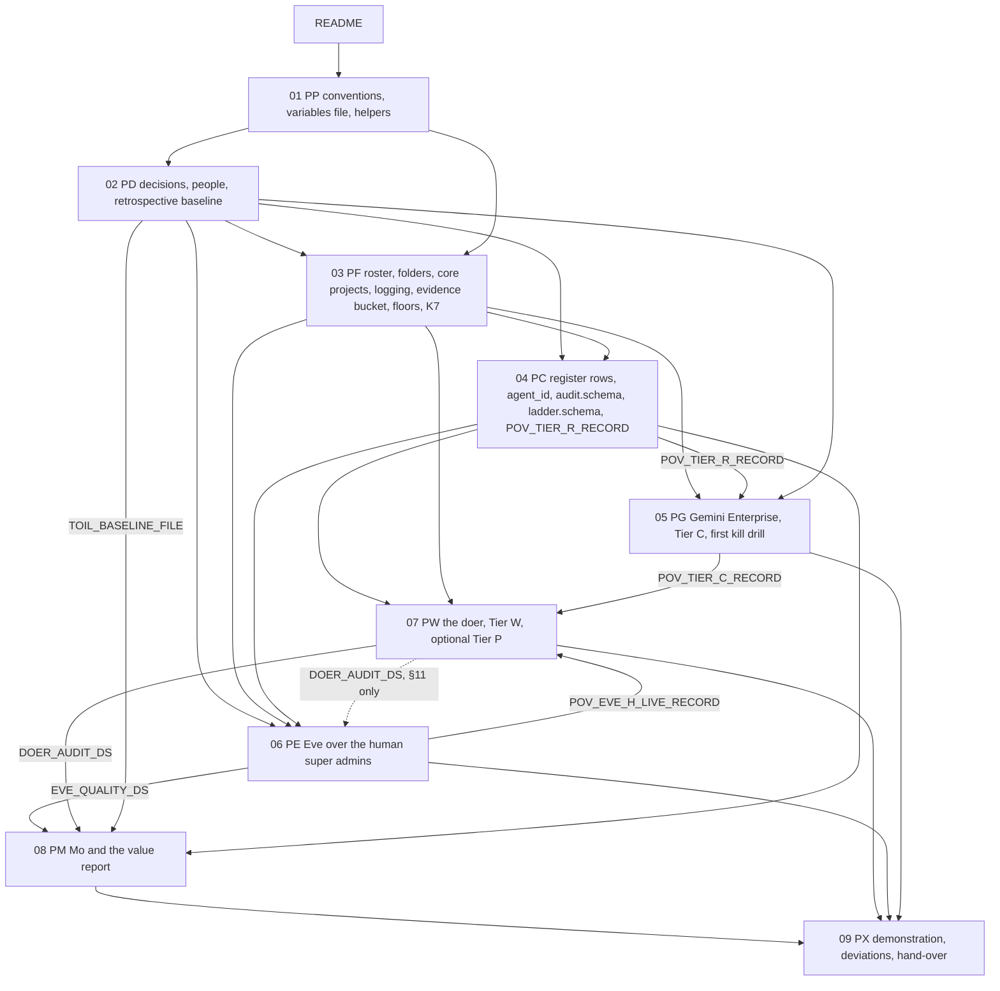

# POV. The proof of value of the agentic platform and its three agents

## Status

- Owner: the platform owner
- Last reviewed: 2026-09-17
- What this is: the one entry point to the proof-of-value (POV) procedures in this folder, files
  [01](01-conventions-and-variables.md) to [09](09-the-demonstration-deviations-and-the-hand-over.md).
  It holds the claim, the absolutes, the two stages, the order, the step-prefix index, the variable
  register, the BLOCKED index, the PV-01 to PV-13 sign-off tracker, the PV-D-01 to PV-D-16 index,
  the gate table and the resume rule. **No step is executed from this page**, so it carries no
  seven-field step; the format is restated in §6 for reference.
- Full-set counterpart: [../setup/README.md](../setup/README.md). That page stays the full build's
  entry point. This page replaces nothing.
- Maturity: never executed. Nothing in the POV is built. Where a file and this page disagree,
  **the file is right and this page is corrected** (§13), unless the file breaks a rule of this
  page, which is a defect in the file (§2).
- Produces: `POV_README_ORDER` (§5), `POV_CLAIM_STATEMENT` (§1), `POV_BLOCKED_INDEX` (§8),
  `POV_STAGE_DATES` (§4). These are named sections of this page, not variables in
  `~/.platform-env`. Consumes: nothing.
- Answers the owner's request of 2026-09-16: a simple set-up that proves the value of the platform
  and the three agents, and that scales to the full design without being torn down.
- **What the doer is, in plain words.** In Track A the doer holds **no Workspace admin role at
  all** (`privilege: none`); it cannot do any Admin-console task. Delegated admin roles appear only
  in the optional Tier P step, on a separate agent and a synthetic organisational unit. Super-admin
  behaviour is not tested at all. The distance to the owner's super-admin doer is therefore two
  steps (no role, then delegated roles, then Super Admin), not one (§3).
- **Cost, before commitment** (Assumption, §4 and §8): code 40 to 64 engineer-days; procedure 20 to
  26 person-days; POV-1 ends 6 to 9 weeks after day one; POV-2 ends week 16 to 20 with a dedicated
  engineer (plan on week 18 or later), 26 to 34 weeks if one person writes the code and runs the
  procedures.
- **Step prefixes:** file 02 is `PD` and file 04 is `PC`; the §6.2 check prints no `COLLISION`
  line and lists no file, and file 01 PP-1.5 refuses to write a checkpoint while it would (§6.2).

## What this part builds

Nothing. It fixes what the nine POV files build, in what order, under which rules, and what the
POV may and may not claim at the end. The whole design is
[../00-objective-review.md](../00-objective-review.md) to
[../13-setup-procedure-review.md](../13-setup-procedure-review.md), with
[../../wall-e/](../../wall-e/), [../../eve/](../../eve/), [../../mo/](../../mo/) and
[../../project-topology.md](../../project-topology.md).

The POV rests on one sentence of the HLD ([../01-hld.md](../01-hld.md) §0.1): a read-only assistant
costs a register row and a factory run; a super-admin robot costs a witness organisation, a second
super admin, a bought detection desk and a signed deviation. The tier gate
([../01-hld.md](../01-hld.md) §0.4) says Tiers C and R hire nobody new, and Tier W hires a second
operator, a part-time security reviewer and a blind grader. **The POV therefore lives at Tiers C,
R and W, with one optional Tier P row, and grants Super Admin to no agent on the production
tenant.** Everything that makes the full build take six to seven months to Stage 0
([../setup/README.md](../setup/README.md) §3.4) sits at Tier P-SA.

"Scales" means one thing here: every artefact the POV creates is the artefact the full build uses,
with the same name, schema, folder and convention, so the full build continues from the POV. A POV
that has to be torn down has failed.

## 1. The claim, and the three sentences never to use

### 1.1 `POV_CLAIM_STATEMENT`

The closing report (file 09) uses this sentence and no other, with the two dates filled in:

> Between <start date> and <end date>, on the production tenant, with three hands-on people, one
> engineer and the named approvers listed in the README's §5.2a, and no new contract for a product
> or service with a lead time longer than weeks, the platform's containment machinery was built
> and run: a governed Gemini Enterprise with admission as a register row, a Model Armor floor, an
> Agent Registry whose write alert was drilled and in which the doer's engine is registered, kill
> levers that were pulled during live work, a controller that reported on every human super admin
> to someone who is not the subject of the report, a doer that holds no Workspace admin role, whose
> model holds no credential and whose every action is written ahead to an audit dataset with one
> writer identity, where alteration is detected by fingerprint, not prevented, and an improver
> that measured the doer against a baseline of volumes from Google's own admin history and minutes
> from a timed sample. Every artefact created carries
> the full build's name, schema and folder.

A clause whose record is missing, BLOCKED or PENDING at the end is struck from the sentence, not
softened. If POV-2 does not finish, the claim ends at "every human super admin" and the last
sentence stays.

What the claim does **not** say, and file 09 §5 lists as named gaps (items 1, 14 and 16 to 19):
the doer did no Admin-console task; **no real minute of admin work was saved**, because the doer
acts only on synthetic accounts and holds no Workspace admin role, so the value report measures
the machinery and the baseline, not time saved; super-admin behaviour was not tested; the two
no-code Tier C agents are not in the Agent Registry, because Google documents no way to register a
no-code agent by hand and automatic registration stays inside the app's own project (05 PG-6.3a);
Mo neither measured nor improved Eve; the audit is append-only by convention, and a holder of the
writer's permission or of Eve's dataset owner role could alter rows (detected, not prevented). "No
new contract with a lead time longer than weeks" still rests on Assumptions: hardware keys
procured, the key wait, and a billing account in 2 to 5 days (file 02, file 03).

### 1.2 Never to be used, in any report, slide or message about the POV

1. "Wall-E is safe as a super admin." Nothing in Track A touches super-admin containment
   (G10, G11, G14, G20, Eve G-7 need Track B, §3). Nor may any report say or imply that the doer
   "does admin work": it holds no Workspace admin role.
2. "Eve is independent." Independence in the design is structural (a witness organisation, a
   second tenant). The POV has neither (PV-D-03), and its Eve lives inside the reach of the
   administrators it watches.
3. "Model Armor blocked the injection." A probabilistic content screen is never a trust boundary,
   whatever its grade ([../01-hld.md](../01-hld.md) §0.2). It produced evidence.

## 2. The absolutes, binding on every POV file

The full set's standing constraints, quoted from [../setup/README.md](../setup/README.md) lines
60 to 66, apply to the POV unchanged:

- no domain-wide delegation, ever (checked in 01, 06, 25, 32, 38);
- the model holds no credential and cannot approve, and no service identity is ever the second
  person (SD-48; tested in 33, 34, 35, 37, 38);
- humans raise autonomy, machines lower it (16, 39, 41);
- no model produces an Eve approval (41);
- Mo acts only through a merged pull request with two human reviewers (16, 40).

The POV brief of 2026-09-16 spells them out as nine. **A POV step that loosens any one of them is
a defect, not a deviation**, and no PV-D id may be raised against them.

1. **No domain-wide delegation for any agent at any stage.** Each robot holds its own consented
   refresh token and is never impersonated. Its absence is proved (file 07, `DWD_ABSENCE_PROOF`),
   not assumed.
2. **The model holds no credential and cannot approve.** The action service is the only credential
   holder. No service identity is ever the second person (SD-48).
3. **Dry run never mutates.** L1 forces `dry_run`, records the would-be verdict and refuses to
   execute even when handed a valid approval (file 07, tested as a named negative).
4. **Two-person rules.** The consent sitting is exactly two people with no screen share; any
   promotion to L4 or L5 (the POV stops at L3); a merged Mo proposal needs two human reviewers who
   are neither the author nor a Mo identity; a requester never approves their own request.
5. **Model Armor at the tier's floor**, failure mode Block on the console, `failOpen false` on any
   machine-called ingress. It produces evidence, never a boundary.
6. **The kill switch.** K0 halt writes and K1 demote are the andon cord: any operator may pull them
   with no approval. K4 kills the credential. The POV builds and drills K0, K1, K2, K3, K4 and K7.
   The design records that an access token already issued stays valid for up to 60 minutes
   ([../../wall-e/04-flows.md](../../wall-e/04-flows.md) line 243), so K0 stops work now and K4 stops
   the credential (see "Could not verify").
7. **Mutating super-admin tests only on a twin (SD-35).** A "sandbox organisational unit" inside the
   production tenant is not a sandbox. The POV creates no `SANDBOX_OU` (PV-D-04).
8. **Write-ahead, insert-only audit.** No evidence, no action: `audit_unavailable` is a denial reason.
   Honest strength in the POV: BigQuery has no insert-only permission (SD-43), so file 07 gives one
   writer identity a custom role with `bigquery.tables.updateData`, and Eve's writers hold
   `dataEditor`. Assumption, not settled by Google's DML pages read 2026-09-16: that permission
   also lets its holder run DML `UPDATE` and `DELETE`. Insert-only is therefore a convention of the
   writer's code, and tampering is **detected by fingerprint, not prevented** (07 PW-2.6, 06 PE-9.1,
   06 PE-12.4). Reports say "append-only by convention, alteration detected".
9. **Never `--yes`; never a default gcloud project** (every command passes `--project`, `--folder`
   or `--organization`, proved by `penv_guard`); no secret in the variables file, only secret names
   and version numbers; the operator never approves their own grant and never verifies their own
   evidence.

## 3. The two tracks

| | Track A (the POV) | Track B (not started) |
|---|---|---|
| Tenant | the production tenant | a sandbox Workspace tenant with its own Cloud organisation and billing account |
| Tiers | C, then R, then W with `privilege: none`; optionally one Tier P row (PV-07) | P-SA twin |
| Super Admin to an agent | **never** | the twin doer only, harmlessly |
| Closes | Tier R, most of Tier C, most of Tier W, Eve over the human super admins | G10, G11, G14, G20, Eve G-7 |
| Workspace admin role held by the doer | **none**: no Admin-console task is possible; the optional Tier P step gives two delegated roles to a **separate** agent on a synthetic OU | Super Admin, on the twin only |
| Super-admin behaviour tested | **not at all** | yes, on the twin |
| People | three hands-on (person 3 appointed before file 01 Part B), one engineer, and the named approvers of §5.2a | four distinct humans: persons 1 and 2 plus two sandbox super admins who are neither |
| Where it is written | files 01 to 09 | costed in file 09 only; procedures are [../setup/21](../setup/21-sandbox-tenant-and-nonprod-foundation.md), [37](../setup/37-wall-e-sandbox-rehearsal.md), [38](../setup/38-super-admin-gate-and-grant.md) |

**Nothing from Track B is smuggled into Track A**, and no Track A result is reported as evidence
about a super admin. Decision PV-04 records the forfeits.

**In Track A the doer holds no Workspace admin role; it cannot do any Admin-console task; delegated
roles appear only in the optional Tier P step on a separate agent and synthetic OU; super-admin
behaviour is not tested at all.** The brief's Track A gave the doer a delegated role; the POV does
not, because a delegated role is Tier P, not Tier W. Its six operations are, per file 07 PW-4.1
(Assumption, listed there as unverified), three reversible pairs on resources the robot itself owns
or manages, such as membership of pilot groups the robot manages. A sponsor must hear this before
the demonstration, not after.

Why the POV's doer is not called Wall-E: [../setup/31](../setup/31-wall-e-project-and-data-plane.md)
creates `WALLE_PROJECT` in `fld-agents-p-sa-prod` with `register_tier="P-SA"`; project ids are never
reusable and a project is never moved between tier folders
([../02-landing-zone-and-tiers.md](../02-landing-zone-and-tiers.md) §1.5). Spending the name at
Tier W would force the full build to rename Wall-E. So the doer is a separate agent
(`AGENT_ID_DOER`; recommended `steward`, Assumption, fixed by PV-02), and `walle`,
`WALLE_PROJECT`, `walle_audit` and `EVE_WITNESS_PROJECT` are reserved and never used by a POV step
(PV-D-08). The doer's code, schemas, ladder, consent procedure and kill switch carry over to Wall-E.

## 4. `POV_STAGE_DATES`: the two stages

Assumption: every figure in this section. Every date is an earliest date, assumes the named people
are available, and is re-written in file 02 once PV-01 fixes day one. The absolute dates in the
right-hand column assume **day one is Monday 2026-09-21** and are illustrative only.

Every figure in this section comes from the waits each file states for itself. Week n ends on the
Friday n weeks after day one's week. No allowance is made for public holidays or the year-end
break (Assumption).

| Stage | Weeks | Files | First demonstrable result | Paced by (each file's own figure) | Earliest end if day one is 2026-09-21 |
|---|---|---|---|---|---|
| **POV-1** | 0 to 6, up to 9 | 01 to 06 | a governed Gemini Enterprise with two admitted agents, a Model Armor floor producing findings, kill levers pulled and timed, and Eve reporting on every human super admin to someone who is not the subject | 02: 1 to 2 weeks of signatures, and the HR and DPO answers (below); 03: keys delivered, up to 7 days before a new key works, two sittings at least 8 days apart (about 1.5 weeks); 04: about 3 days; 05: 3 to 4 weeks, set by its 14-day dry run and a 5-business-day notice (runs beside 06); 06: about 2 weeks, **plus an unannounced proof inside the 30 days after its note** (PE-12.1), so `POV_EVE_PROOF_RECORD` may land after the rest of POV-1; Eve's SQL (PB-02, PB-03, 8 to 12 engineer-days, done by week 5) | 2026-11-06 (week 6) to 2026-11-27 (week 9); the unannounced proof up to about 30 days after 06's note |
| **POV-2** | 6 to 16, up to 20 | 07 to 09 | the doer at L1, then L2, then L3 if the evidence allows, with a live approval and K0 pulled during a live run; Mo's value report and a first proposal merged or signed-refused; the demonstration, the deviation register and the hand-over | **the code** (§8), written serially by one engineer: PB-01 to PB-03 weeks 0 to 3, PB-05 then PB-04 to about week 7 to 11; 07's Workspace side meanwhile; then **two weeks at L1 and two at L2** before L3 (07 PW-6.2), so L3 no earlier than week 13; 08 needs **four ISO weeks of L1 to L3 rows and four consecutive weekly digests** before the value report (PM-8.3); 09 one week | 2027-01-15 (week 16) to 2027-02-12 (week 20); plan on 2027-01-29 (week 18) or later |

- Elapsed: 16 to 20 weeks with a dedicated engineer working alongside the operator from day one;
  **26 to 34 weeks (to about 2027-03-26 to 2027-05-21 on the same assumption) if one person
  writes the code and runs the procedures**, because the code days are then serial with the
  procedure days and the ladder waits. The one-person figure approaches the full build's six to
  seven months to Stage 0; say so.
- **The promotion floor may keep the doer at L2.** `gates.yaml` sets `promotion_floor_n: 35`
  graded items (08 PM-4.3), and the pilot is 5 to 10 synthetic accounts (PV-06, Assumption). If a
  family has fewer than 35 graded items, it stays at L2 (07 PW-6.2 does not loosen the floor). Then
  09 PX-1.3 and PX-1.4 run their **L2 form**: person 3 writes the level read from the merged ladder
  into `level.txt` before PX-1.3, the kill levers are pulled during a live L2 run with its approval,
  recorded at the level reached, and the claim says "L2" (09 Preconditions, PX-1.3, PX-1.4, §5
  item 20).
- Hands-on procedure: 20 to 26 person-days. Code: 40 to 64 engineer-days (§8). Total 60 to 90.
  Assumption, every figure.
- Against the full build ([../setup/README.md](../setup/README.md) §3.4 and
  [../setup/04](../setup/04-purchases-and-lead-times.md)): 6 to 7 months to Stage 0 (not before
  2027-03), 9 to 12 months to Mo's first merged proposal, 85 to 90 person-days hands-on, thirteen
  appointments, thirteen purchase rows.
- **A sponsor told "three weeks" has been misled about both stages.** Say "six to nine weeks" and
  "about four to five months with a dedicated engineer" on the first slide.

**On the critical path, and not avoided: the HR and works-council answer and the DPO record.** The
POV avoids the four-week prospective toil recording (PV-05, PV-D-05), but not the people questions
behind it:

- PV-08 blocks Part 6 of file 03 and every step of file 06 (Eve), and file 02 PD-5.1 needs HR to
  sign its works-council half as well as the DPO's signature.
- PV-06 (the pilot population) is signed by HR too, and gates file 07.
- The calibration sample that feeds the value report waits for HR's written answer to point 7(a),
  and for consultation if HR requires it (file 02 PD-8.4).
- Person 3 is appointed in file 02 PD-6.1 **before file 01 Part B**, in week 1 (§5.1a), so
  the appointment is a day-one request, not a POV-2 one.

So the question goes to HR and the DPO **on day one** (§5.1), as a dated dependency with the
platform owner as owner and a chase date one week later. If HR requires consultation, the POV-1
end date moves by the consultation's length and file 06 does not start. The fallback, for PV-08 to
decide and the DPO and HR to sign, not assumed here: Eve's first run limited to persons 1 and 2,
each with written consent, with every other admin-role holder out of scope and the claim's "every
human super admin" clause struck until the answer arrives.

Not on the POV's critical path: the four-week prospective toil recording, the witness domain, the
sandbox tenant, the SIEM contract, the penetration test, SCC Premium and most of the thirteen
appointments.

## 5. `POV_README_ORDER`: the order

### 5.1 Day one, in this order

1. PV-02 and PV-03 drafted: the doer's `agent_id` and the names register, because every name
   after this is irreversible.
2. PV-08's DPO record requested: it blocks every step of file 06.
3. The works-council question to HR and the DPO information line (file 02), sent as a **dated
   dependency** owned by the platform owner, with a chase date one week later: HR's answer gates
   PV-08 (file 06), PV-06 (file 07) and the calibration sample behind the value report (§4).
3a. The engineer appointed in 02 PD-6.1 (`PPL-ENG`, POV-only), or the contractor row raised in 02 PD-2.3
   with its lead time. PB-01 to PB-03 start the day the engineer does, so this is on the critical path.
4. Hardware keys ordered if either admin account lacks two, allowing for the wait before a new key
   works at sign-in (file 02; the wait is read on the day from Google's page, not from here).
5. File 01 Part A (PP-1.1 to PP-4.1), which runs on day one before file 02.

### 5.1a The interleaved order of files 01 and 02

File 01 and file 02 are not run one after the other: each needs something from the other.
01 Part B (the git host) needs PV-03 and PV-09 signed and `SECOND_HUMAN_EMAIL` and
`SECOND_OPERATOR_EMAIL` set, all by 02; 02 needs 01 Part A's tools and variables file, and its
baseline merge (PD-8.6) needs `PLATFORM_REPO_REMOTE` and the branch protection that 01 Part B
applies. The order is:

1. 01 Part A: PP-1.1 to PP-4.1.
2. 02 from its first step up to and including PD-6.2 (PV-09 and SH-REPORTS).
3. 01 Part B: PP-5.1 to PP-6.1. Precondition, checked before PP-5.1:
   `"$PLATFORM_REPO_DIR/tools/decision-need.sh" PV-03 PV-09` prints two `SIGNED` and
   `need SECOND_HUMAN_EMAIL SECOND_OPERATOR_EMAIL` is silent.
4. The rest of 02: PD-7.1 onward, including the baseline query, PD-8.6 and PD-9.1. PD-8.2 and
   PD-8.6's volume recount run in the same ISO week, and only once the recount route exists (03
   PF-1.5 `DONE`, or 02 PD-8.7's role), so they may run after 03 has started.
   Precondition, checked before PD-7.1: `need PLATFORM_REPO_REMOTE PLATFORM_REPO_SLUG` is silent
   and `awk -F'\t' '$2=="PP-5.4" && $3=="DONE"' "$BUILD_LOG_DIR/checkpoints.tsv"` prints one line
   (the header 01 PP-1.5 writes is `utc_timestamp step_id status operator witness evidence note`).
5. Then 03.

**Person 3 is appointed before file 01 Part B.** 01 PP-5.1 runs `need`
on `SECOND_OPERATOR_EMAIL`, the protected repository needs two human reviewers who are not the
author, and 04's first step runs `need` on `SECURITY_REVIEWER_EMAIL` and `BLIND_GRADER_EMAIL`.
`need` refuses `*tbd*`, so 02 PD-6.1 appoints person 3 in week 1, before 01 Part B, and files 01,
02 and 04 each say so.

### 5.2 The file table

| # | File | Prefix | Full-set counterpart | Who must be present | Hands-on | Elapsed |
|---|---|---|---|---|---|---|
| 0 | README (this page) | none | [setup/README](../setup/README.md) | nobody; read by every role | none | none |
| 01 | [01-conventions-and-variables.md](01-conventions-and-variables.md) | `PP` | [setup/01](../setup/01-prerequisites-and-conventions.md) | person 1; **person 2 on screen for PP-5.3 and PP-5.4** (Part B) | 0.5 d | 1 d (Part A); Part B after 02 signs PV-03 and PV-09 |
| 02 | [02-decisions-people-and-the-retrospective-baseline.md](02-decisions-people-and-the-retrospective-baseline.md) | `PD` | [setup/02](../setup/02-toil-baseline.md), [03](../setup/03-decisions-and-people.md), [04](../setup/04-purchases-and-lead-times.md) | person 1 drafts; signatories per §9, including HR and the DPO; person 3 reviews the baseline | 1.5 d | 1 to 2 weeks (other people's signatures), longer if HR requires consultation |
| 03 | [03-foundation-folders-logging-and-floors.md](03-foundation-folders-logging-and-floors.md) | `PF` | [setup/06](../setup/06-organisation-bootstrap-and-roster.md), 07, 09 to 14, 17, 18 | person 1; **person 2** for keys, backup codes, break-glass, every approval and the evidence-bucket lock; an other-line witness per envelope; finance and the billing administrator; the organisation's Cloud Logging owner; **person 3** for the second pull-request approval (PF-1.3) | 3 d | 1.5 weeks after keys are delivered: two sittings at least 8 days apart (up to 7 days before a new key works), policy dry runs, 24 h for the first shared logs |
| 04 | [04-the-contract-register-agent-ids-and-schemas.md](04-the-contract-register-agent-ids-and-schemas.md) | `PC` | [setup/16](../setup/16-register-and-shared-registry.md); schema halves of 22 and 31 | person 1; **person 2 co-signs the manual parse** (PV-D-13); **person 3 approves `/contract/` and `/register/schema/`**, so the contract cannot merge without person 3 | 1.5 d | 3 d |
| 05 | [05-gemini-enterprise-and-tier-c.md](05-gemini-enterprise-and-tier-c.md) | `PG` | [setup/05](../setup/05-gemini-enterprise-inventory.md), 19, 20, Gemini half of 18 | person 1 via `ent-ge-admin`; person 2 approves; DPO signs the logging setting; a non-admin colleague for the negative tests; two volunteer builders; the IT security desk | 2 d | 3 to 4 weeks (the 14-day dry run, a 5-business-day notice, the DPO) |
| 06 | [06-eve-over-the-human-super-admins.md](06-eve-over-the-human-super-admins.md) | `PE` | [setup/23](../setup/23-eve-project-and-evidence-stores.md) to 26 | **DPO first**; person 1 builds and verifies nothing about themselves; **person 2** approves, is required reviewer on `eve/config`, recomputes the fingerprint alone, is physically present at the lock, confirms the unannounced proof; person 3 for reports about person 2 | 3.5 d | about 2 weeks (log waits), plus the unannounced proof inside 30 days of its note (PE-12.1) |
| 07 | [07-the-doer-tier-w-and-the-optional-tier-p.md](07-the-doer-tier-w-and-the-optional-tier-p.md) | `PW` | [setup/30](../setup/30-wall-e-workspace-side.md) to 35, Stage-0 shape of 39 | person 1; **exactly persons 1 and 2 at the consent sitting**; person 2 approves the deploy; person 3 as second approver and grader; the engineer writes PB-04 and PB-05; a non-admin colleague | 5 d | the code, then at least 4 weeks of ladder walk (two at L1, two at L2, PW-6.2) |
| 08 | [08-mo-and-the-value-report.md](08-mo-and-the-value-report.md) | `PM` | [setup/22](../setup/22-mo-foundations.md), 29, 40 | person 1 as Mo owner, and opens Mo's pull request by hand; person 2 approves; **person 3** recomputes, grades and is the second merge reviewer | 2 d | 1 week, after four ISO weeks of L1 to L3 rows and four consecutive weekly digests (PM-8.3) |
| 09 | [09-the-demonstration-deviations-and-the-hand-over.md](09-the-demonstration-deviations-and-the-hand-over.md) | `PX` | [setup/42](../setup/42-gates-drills-and-evidence.md), setup/README §7 to §10; Track B: 21, 37, 38 | all three; **person 3 pulls K0 live**; incident commander runs the tabletop; ISMS receives the pack | 2 d | 1 week |

Hands-on and elapsed figures are each file's own where the file states one (03, 04, 05, 06, 07,
08, read 2026-09-16) and this page's otherwise; all are Assumption. A file's changed figure replaces
the cell (§13).

### 5.2a Every distinct human role, and the first file that needs it

"Three people" means three **hands-on** people. The POV needs more distinct humans than that, most
of them for a signature or an hour. Each is a role, never a named person.

| Role | What they do in the POV | First file that needs them |
|---|---|---|
| Person 1, the platform owner and operator | builds; never approves their own grant or verifies their own evidence | 01 |
| Person 2, the second person (`sa-2-admin@`) | approvals, keys, locks, consent sitting, `eve-owners@` | 01 Part B (PP-5.3, PP-5.4 on screen) |
| Person 3, second operator, security reviewer and blind grader (PV-D-14, PV-D-16) | second pull-request approval; contract code owner; reports about person 2; grading; second merge reviewer; pulls K0 live | **appointed in 02 PD-6.1 before 01 Part B** (PP-5.1's `need`, the two-reviewer protection; §5.1a); then 03 (PF-1.3) and 04 (the contract merge) |
| The engineer (or a contractor) | writes PB-01 to PB-06 (§8), 40 to 64 engineer-days; may be person 1 (the one-person case), never person 2 or person 3 | **02 PD-6.1** (`PPL-ENG`, POV-only), or a contractor row in 02 PD-2.3; day one |
| The incident commander, IT security, not person 1 (Assumption: not person 2) | interim recipient of alerts about person 2; runs the tabletop | 02 (PPL-IC) and 03 (PF-1.1) |
| The envelope witness from another administration line, and the custodian | witness break-glass envelopes | 03 |
| Finance and the billing administrator | billing account and budgets | 02 (PPL-BA), 03 |
| The organisation's Cloud Logging owner | the organisation sink and log settings | 03 |
| The DPO | PV-08, PV-06, PV-10, PV-11, PV-12, logging record | 02 (day one) |
| HR, and the works council through HR | works-council half of PV-08; PV-06; PV-10; calibration answer | 02 (day one) |
| The ISMS owner | PV-01 to PV-04, PV-07, PV-09, PV-13; receives the pack | 02 |
| The AI compliance owner or legal's designate | PV-11 | 02 |
| The IT security lead | PV-04, PV-12, KEYS | 02 |
| Procurement | hardware keys (Assumption: bought, not in stock) | 02 |
| A non-admin colleague | negative tests, injection suite | 05 |
| Two volunteer builders | build the two Tier C agents | 05 |
| Calibration volunteers | the timed calibration sample | 02 (PD-8.4) |

### 5.3 Dependency graph

An arrow means "the later file consumes something the earlier file produces", derived from each
file's own `Consumes:` list. A dotted arrow is a partial wait.



Parallel lanes: file 05 and file 06 run side by side once 04 is `DONE`. The code runs in parallel
with files 01 to 06 but is serial for one engineer: PB-01 to PB-03 first (PB-02 and PB-03 must be
`DONE` before 06's schema and detection steps, about week 5), then PB-05, then PB-04 (§4). File
07's Workspace-side part runs while PB-04 is written, and its consent sitting does not open until
PB-05 is `DONE`. File 06 §11 (Eve v0 over the doer's audit) is a re-run
opened by file 07, never a wait on files 01 to 06 (SD-10: Eve-H never waits on the doer).

## 6. Step format and prefixes

### 6.1 The step format (reference; defined in [../setup/README.md](../setup/README.md) §5)

| Field | Content |
|---|---|
| Id | file prefix and number, for example `PE-3.2`; never changed once a checkpoint line cites it ([../setup/01](../setup/01-prerequisites-and-conventions.md) line 69) |
| WHO | the role that performs it, and any witness or approver who must be present |
| WHERE | the console path, or "shell, `~/.platform-env` sourced" |
| ACTION | bash fences, one command per line of effect, checked against Google's documentation on the day |
| VERIFY | a check whose output proves the step worked |
| ROLLBACK | the undo, or **IRREVERSIBLE** in bold with what to confirm first and the decision that gates it |
| EVIDENCE | what is recorded, where, its E-xx id ([../10-eu-ai-act.md](../10-eu-ai-act.md) §5) and its TISAX control id ([../11-tisax.md](../11-tisax.md) §13) |

A step whose code does not exist reads **BLOCKED**, names the code, the repository and the gate that
waits, gives a POV-sized estimate marked Assumption, and appears in §8. A step that deliberately
differs from the full set cites its PV-D id and links to file 09.

### 6.2 Step-prefix index, and the prefix-collision check

| Prefix | POV file | Prefix | POV file |
|---|---|---|---|
| `PP` | 01 conventions and variables | `PG` | 05 Gemini Enterprise and Tier C |
| `PD` | 02 decisions, people, retrospective baseline | `PE` | 06 Eve over the human super admins |
| `PF` | 03 foundation, folders, logging, floors | `PW` | 07 the doer, Tier W, optional Tier P |
| `PC` | 04 the contract, register, schemas | `PM` | 08 Mo and the value report |
| | | `PX` | 09 demonstration, deviations, hand-over |

**File 02 is `PD`, file 04 is `PC`.** The full set already uses `PR` and `PS`
([../setup/README.md](../setup/README.md) §5.1): `PR` is setup/01's prefix and `PS` is setup/15's
(pager, SIEM and detections). The POV writes to the same `checkpoints.tsv` the full build
continues, and the checkpoint log and re-run index use bare ids, so a POV `PS-4.1 DONE` would be
read under the resume rule (§12) as setup/15's step done and skipped. Ids cannot change once a
checkpoint cites them, so the POV's prefixes are fixed before the first POV checkpoint:

- File 02 carries `PD-` on every step id, checkpoint, `evidence_add` and record name; file 04
  carries `PC-`, and its irreversible merges (the contract, the register rows) have `checkpoint`
  resume points like every other step. A bare `PR-` or `PS-` left in a POV file cites setup/01 or
  setup/15, never a POV step.
- File 01 PP-1.5 runs the check below before its first checkpoint and writes no checkpoint line
  unless it prints `prefix refusal clean`.
- **Binding rule:** no POV checkpoint line is written while the check below prints anything.
  Run from the `pov/` folder of the wiki, read-only:

```bash
setup_prefixes=$(grep -oE '\| `[A-Z0-9]{2}` \| [0-9]{2} ' ../setup/README.md | grep -oE '`[A-Z0-9]{2}`' | tr -d '`' | sort -u)
for p in PP PD PF PC PG PE PW PM PX; do echo "$setup_prefixes" | grep -qx "$p" && echo "COLLISION $p"; done
grep -lE '(checkpoint|evidence_add) P[SR]-[0-9]' 0*.md
```

  VERIFY: no `COLLISION` line, and the `grep -l` lists no file. Run on 2026-09-16, it printed
  nothing. EVIDENCE: the empty output, dated, in the build log under
  PP-1.5's id.

## 7. The variable register (POV subset)

One file, `~/.platform-env`, created by file 01, never committed, one name per variable, no secret
values. Names follow [../setup/README.md](../setup/README.md) §5.2. Helpers reused unchanged:
`penv_set` (writes once), `need`, `exists_or_pending`, `penv_guard`, `checkpoint`, `evidence_add`,
`confirm_manual`, `twin_shell`. Retired names that must never appear: `walle_metrics*`,
`LOGS_DATASET`, `FOLDER_ID`, `PROJECT` outside `walle_shell`, `BILLING`, `SA_WALLE_CI`,
`CUSTOMER_ID=my_customer` in policies, `EVE_EVIDENCE_KEY` for datasets. Reserved by PV-02 and
refused in any POV step: `WALLE_PROJECT`, `WALLE_AUDIT_DS`, `agent_id: walle`,
`EVE_WITNESS_PROJECT`.

### 7.1 Names each file sets

Read from the `penv_set` lines of files 01 to 09
(`grep -oE 'penv_set +(--force +)?[A-Z][A-Z0-9_]+'` per file, plus the names written by each file's
`penv_set "$n"` loops). A name set by a full-set step that a POV file runs unchanged (for example
05 PG-1.1 running setup/05 GI-0.1 to GI-10.3) is the full set's own and is listed in
[../setup/README.md](../setup/README.md) §5.2, not here, except where shown.

| File | Names (set by `penv_set` in that file) |
|---|---|
| 01 | `PLATFORM_ENV_FILE`, `GCLOUD_CONFIG_NAME`, `PLATFORM_REPO_DIR`, `BUILD_LOG_DIR`, `WIKI_DIR`, `REGION`, `BQ_LOCATION`, `GE_LOCATION`, `MODEL_LOCATION`, `OWNER_DAILY_ACCOUNT`, `DEVIATION_REGISTER`, `EVIDENCE_REGISTER`, `DRILL_CALENDAR`, `POV_TRACK`, `POV_STAGE`, `EVIDENCE_INTERIM_LOCATION`, `RETIRED_NAMES_CHECK`, `GIT_ORG`, `PLATFORM_REPO_SLUG`, `BUILD_LOG_REPO_SLUG`, `PLATFORM_REPO_REMOTE`, `BUILD_LOG_REMOTE`, `BOT_APPROVAL_RULE_COMMIT` (once PP-5.5 unblocks). `CUSTOMER_ID` and `BILLING_ACCOUNT_ID` appear only inside the retired-names test fixtures, never as a real write |
| 02 | `DPO_CONTACT`, `ISMS_EMAIL`, `SECOND_HUMAN_EMAIL`, `SECOND_OPERATOR_EMAIL`, `SECURITY_REVIEWER_EMAIL`, `BLIND_GRADER_EMAIL`, `INCIDENT_COMMANDER_EMAIL`, `BILLING_ADMIN_EMAIL`, `ENGINEER_EMAIL`, `WORKS_COUNCIL_QUESTION_RECORD`, `AGENT_ID_DOER`, `AGENT_ID_EVE`, `AGENT_ID_MO`, `RESERVED_NAMES_RECORD`, `NAMES_RECORD`, `KEYS_RECORD`, `EVIDENCE_RETENTION_DAYS`, `IDENTITY_RETENTION_DAYS`, `RECORD_RETENTION_DAYS`, `MODEL_ID`, `PILOT_POPULATION_COUNT`, `POV_GATE_LIST`, `POV_END_DATE`, `TOIL_TASKS`, `TOIL_BASELINE_FILE`, `TOIL_RETRO_WINDOW`, `TICKET_SYSTEM`, `TICKET_CATEGORY_FIELD`, `TOIL_RETRO_RECORD` |
| 03 | `DOMAIN`, `DIRECTORY_CUSTOMER_ID`, `WORKSPACE_EDITION`, `OWNER_DAILY_ACCOUNT` (same value as 01, prints `unchanged`), `ORG_ID`, `ADMIN_OU`, `SA_1_ADMIN`, `SA_2_ADMIN`, `BREAK_GLASS_OU`, `BRK_GCP_1`, `BRK_GCP_2`, `ROSTER_FILE`, `CONTROL_GROUPS_FILE`, `GRP_GCP_ORG_ADMINS`, `GRP_PLATFORM_OWNERS`, `GRP_PLATFORM_SECURITY`, `GRP_PLATFORM_APPROVERS`, `BOOTSTRAP_EXCEPTION_EXPIRY`, `BILLING_ACCOUNT_ID`, `BILLING_CURRENCY`, `BOOTSTRAP_BILLING_EXPIRY`, the `FLD_*` folder ids of PF-3.1, `CICD_PROJECT`, `CORE_PROJECT`, `LOGGING_PROJECT`, `KMS_PROJECT`, `VALIDATOR_PROJECT` and each one's `_NUMBER` (PF-4.1), `TAG_KEY_TIER`, `TAG_KEY_TISAX`, `TAG_KEY_ENV`, `AR_PLATFORM`, `SA_FACTORY_APPLY`, `KR_LOGGING`, `KR_ENGINES`, `KR_GEMINI`, `KR_SUPPLY_CHAIN`, `KEY_PLATFORM_LOGS`, `ENT_PLATFORM_POLICY`, `ENT_ORG_SINK`, `ENT_K7_HUMAN`, `ENT_K7_HUMAN_SCHEDULER`, `ENT_PAM_CATALOGUE_ORG`, `ENT_FOLDER_ADMIN`, `ENT_PROJECT_REPAIR_CORE`, `PAM_ENTITLEMENTS`, `DENY_AGENTS_PLATFORM`, `PAB_AGENTS`, `WS_SHARING_RECORD`, `LOG_BUCKET_EVIDENCE`, `LOG_BUCKET_IDENTITY`, `PLATFORM_LOGS_DS`, `PLATFORM_LOGS_VIEWS_DS`, `SINK_S_ORG`, `SINK_S_FOLDER`, `PLATFORM_EVIDENCE_BUCKET`, `NOTIF_CH_EMAIL_CORE`, `NOTIF_CH_PAGER_CORE`, `SCC_TIER`, `FLOOR_RECORD`, `K7_POLICY_DIR`, `POV_K7_FIRST_DRILL_RECORD`, `GATES_DIR` |
| 04 | `REGISTER_SCHEMA_PATH`, `AUDIT_SCHEMA_COMMIT`, `LADDER_SCHEMA_COMMIT`, `AUDIT_DDL_COMMIT`, `MO_DDL_COMMIT`, `DOER_REGISTER_ROW`, `DOER_REGISTER_ROW_NONPROD`, `EVE_REGISTER_ROW`, `MO_REGISTER_ROW`, `MANUAL_PARSE_RECORD`, `AGENT_REGISTRY`, `POV_TIER_R_RECORD` |
| 05 | `GE_LOCATION` (a no-op when 01 set it), `GE_WITNESS`, `GRP_GE_ADMINS`, `GRP_GE_BUILDERS`, `ENT_GE_ADMIN`, `GE_SANITIZE_LOGGING`, `GE_ARMOR_TEMPLATE`, `TIER_C_AGENT_ROWS`, `INJECTION_SUITE_RECORD`, `KILL_DRILL_RECORD_C`, `POV_TIER_C_RECORD`; through setup/05 run unchanged (PG-1.1): `GEMINI_PROJECT`, `GEMINI_PROJECT_NUMBER`, `GE_CURRENT_PARENT`, `GEMINI_APP_ID`, `GEMINI_APP_LOCATION`, `GE_EDITION`, `GE_RETENTION_CURRENT_DAYS`, `GE_INVENTORY_DIR` |
| 06 | `EVE_DPO_RECORD`, `EVE_LOGIN_SCOPE`, `GRP_EVE_OWNERS`, `EVE_PROJECT`, `EVE_PROJECT_NUMBER`, `ENT_PROJECT_REPAIR_EVE`, `EVE_KEYRING`, `EVE_EVIDENCE_KEY`, `EVE_KEYRING_EU`, `EVE_EVIDENCE_KEY_EU`, `EVE_DS`, `EVE_WS_LOGS_DS`, `EVE_QUALITY_DS`, `EVE_SCHEMAS_COMMIT`, `EVE_EVIDENCE_BUCKET`, `EVE_EVIDENCE_LOCATION`, `EVE_EDITION_COVERAGE_RECORD`, `EVE_SINK`, `EVE_CONFIG_REPO`, `EVE_THRESHOLDS_COMMIT`, `EVE_CONFIG_COMMIT`, `EVE_ROSTER_FILE`, `SA_EVE_VERIFIER`, `SA_EVE_V0`, `POV_EVE_H_QUERY_SET`, `EVE_ABSENCE_ALARM`, `EVE_FINGERPRINT_BASELINE`, `NOTIF_CH_EVE_EMAIL_SECOND_HUMAN`, `NOTIF_CH_EVE_SMS_SECOND_HUMAN`, `NOTIF_CH_EVE_EMAIL_SECURITY_REVIEWER`, `POV_EVE_FIRST_RUN_RECORD`, `DOER_EVE_V0_CONFIGS`, `EVE_PROOF_OU`, `EVE_PROOF_ROLE`, `POV_EVE_PROOF_RECORD`, `POV_ANTI_SILENCING_RECORD`, `POV_EVE_H_LIVE_RECORD` |
| 07 | `DOER_REPO_REMOTE`, `POV_STAGE` (`--force` to `POV-2`), `GRP_DOER_OPERATORS`, `GRP_DOER_READERS`, `GRP_DOER_PROTECTED`, `GRP_DOER_OWNERS`, `SERVICE_IDENTITY_OU`, `PILOT_OU`, `NONPROD_OU`, `DOER_ROBOT`, `DWD_ABSENCE_PROOF`, `DOER_PROJECT`, `DOER_NONPROD_PROJECT`, `DOER_PROJECT_NUMBER`, `DOER_NONPROD_PROJECT_NUMBER`, `DOER_AUDIT_DS`, `DOER_SECRET_NAMES`, `DOER_REFRESH_TOKEN_SECRET_NAME`, `DOER_RESTORE_DRILL_RECORD`, `DOER_TOKEN_VERSION`, `DOER_CONSENT_SITTING_RECORD`, `DOER_CODE_COMMIT`, `DOER_ALLOWLIST_FILE`, `DOER_HARD_DENIED_SHA`, `LADDER_FILE`, `LADDER_SHA`, `DOER_ACTIONS_URL`, `DOER_APPROVAL_A_URL`, `DOER_DENIALS_RECORD`, `BAND_B_DENIAL_RECORD`, `DOER_AGENT_IDENTITY_MODE`, `MA_TEMPLATE_DOER`, `DOER_GATEWAY_ID`, `DOER_ENGINE`, `DOER_AGENT_PRINCIPAL`, `DOER_REGISTRY_ENTRY`, `KILL_DRILL_RECORD_W`, `POV_TIER_W_RECORD`; optional Tier P: `PILOT_ADMIN_AGENT_ID`, `PILOT_ADMIN_ROBOT`, `PILOT_ADMIN_PROJECT`, `PILOT_ADMIN_NONPROD_PROJECT`, `PILOT_ADMIN_REGISTER_ROW`, `PILOT_ADMIN_ROLE_READ`, `PILOT_ADMIN_ROLE_WRITER`, `PILOT_ADMIN_ROLE_ASSIGNMENTS`, `K6_ANALOGUE_RECORD`, `TIER_P_RECORD` |
| 08 | `ENT_BOOTSTRAP_MODULE_IMPROVERS_PROD`, `GRP_MO_OWNERS`, `MO_PROJECT`, `MO_PROJECT_NUMBER`, `ENT_PROJECT_REPAIR_MO`, `SA_MO_METRICS`, `SA_MO_ANALYST`, `MO_METRICS_DS`, `MO_ARCHIVE_DS`, `MO_PRIVATE_DS`, `MO_VIEWS_DS`, `MO_INPUTS_COMMIT`, `MO_REPO_REMOTE`, `TOIL_BASELINE_LOADED`, `MO_WATERMARK`, `GRADING_ROTA`, `BLIND_SAMPLE_SEED`, `GRADER_AGREEMENT_RECORD`, `MO_PROPOSALS`, `MO_CODE_COMMIT`, `MO_DIGEST_RECORD`, `POV_VALUE_REPORT`, `MO_PROPOSAL_1`, `MO_PROPOSAL_1_OUTCOME`, `POV_FIRST_MERGE_RECORD` |
| 09 | `POV_DEMO_DIR`, `K0_DRILL_RECORD`, `K1_DRILL_RECORD`, `DOER_TOKEN_VERSION` (`--force` after K4), `K4_DRILL_RECORD`, `K7_POV_DRILL_RECORD`, `POV_DEMO_RECORD`, `POV_TABLETOP_RECORD`, `EVIDENCE_PACK_DIR`, `PV_DEVIATION_REGISTER`, `POV_GAP_STATEMENT`, `HANDOVER_TABLE`, `FOURTH_AGENT_RECORD`, `TRACK_B_ESTIMATE`, `POV_STOP_OR_CONTINUE_RECORD`, `POV_CLOSING_REPORT` |

Where the POV sets a full-set name **earlier than the full set does** with the same meaning, the
full-set step becomes a VERIFY of the existing value: `PLATFORM_REPO_REMOTE` (setup 03 DC-9.5 → POV
01), `PLATFORM_EVIDENCE_BUCKET` and `RECORD_RETENTION_DAYS` (setup 42 GD-3.1 → POV 03 and 02),
`SA_EVE_V0` (setup 36 WJ-1.2 → POV 06), `SERVICE_IDENTITY_OU` (setup 24 EW-3.2 → POV 07),
`PILOT_OU` (setup 30 WW-7.3 → POV 07), `GRP_EVE_OWNERS` and `GRP_GE_ADMINS` (setup 06 OB-5.2 → POV
06 and 05), `EVIDENCE_PACK_DIR` (setup 42 GD-4.3 → POV 09), and the adopted names of §7.2. A
`POV_` or `DOER_` name is never in this list: the full-set file that owns the bare name re-derives
it, and never promotes the POV value by renaming it (§7.3; file 09's hand-over).

### 7.2 Names adopted from setup/README §5.2

`penv_set` writes once, so two names for one value would leave the full build a duplicate it cannot
detect. Files 01 to 09 use the full-set names below; no file sets or reads the old spelling.
`CUSTOMER_ID` survives only in deliberate mentions (01's retired-names fixture, 03's name table),
and 06 PE-0.1 greps the variables file for the retired `DPO_EMAIL` to prove it
absent.

| Old POV name | Adopted name | Full-set step |
|---|---|---|
| `CUSTOMER_ID` (retired) | `DIRECTORY_CUSTOMER_ID` | setup/01 PR-2.6 |
| `DPO_EMAIL` | `DPO_CONTACT` | setup/03 DC-3.1 |
| `GE_APP_ID` | `GEMINI_APP_ID` | setup/05 GI-2.1 |
| `GE_INVENTORY_RECORD` | `GE_INVENTORY_DIR` | setup/05 GI-0.2 |
| `KEYRING_LOGGING`, `KEYRING_GEMINI`, `KEYRING_ENGINES` | `KR_LOGGING`, `KR_GEMINI`, `KR_ENGINES` | setup/11 KV-2.1, KV-4.1, KV-3.1 |
| `KEYRING_SUPPLY_CHAIN` | `KR_SUPPLY_CHAIN` | none: setup/11 KV-5.1 creates ring `supply-chain` in `CICD_PROJECT` and sets no variable. **The full build's register (setup/README §5.2) has no row for `KR_SUPPLY_CHAIN` and must add one** |
| `TAG_AGP_TIER`, `TAG_AGP_TISAX_SCOPE` | `TAG_KEY_TIER`, `TAG_KEY_TISAX` | setup/09 FS-5.1 |
| `SCC_TIER_RECORD` | `SCC_TIER` (the value; the record goes through `evidence_add`) | setup/09 FS-7.5 |
| `MA_FLOOR_RECORD` | `FLOOR_RECORD` | setup/18 KS-2.10 |
| `K7_FILES` | `K7_POLICY_DIR` | setup/18 KS-4.1 |
| `MA_TEMPLATE_GE_PROMPT`, `MA_TEMPLATE_GE_RESPONSE` | `GE_ARMOR_TEMPLATE` | setup/19 GE-7.2 |
| `NOTIF_CH_EVE_EMAIL`, `NOTIF_CH_EVE_SMS` | `NOTIF_CH_EVE_EMAIL_SECOND_HUMAN`, `NOTIF_CH_EVE_SMS_SECOND_HUMAN` | setup/26 ER-3.2, ER-3.3 |

**Two names that are not adoptions, both under §7.3.** The POV's K7 drill record is not the
full-set `K7_FIRST_DRILL_RECORD`, because the POV drill is weaker; it is `POV_K7_FIRST_DRILL_RECORD`.
Eve-H's query set is not the full-set `EVE_V0_CONFIGS` (Wall-E's v0 queries, whose doer counterpart
is `DOER_EVE_V0_CONFIGS`) and has no full-set counterpart at all: the full set runs Eve-H's
detections as reconciler jobs (setup/25), not as scheduled queries (PV-D-06). Its name is
`POV_EVE_H_QUERY_SET`, so it can never be read as a full-set name, and file 09's hand-over row for
setup/25 names it. Neither `K7_DRILL_RECORD` nor `EVE_QUERY_SET` is used.

The `DOER_*` names are deliberately distinct from the `WALLE_*` names (PV-D-08) and are not in this
table.

### 7.3 A POV record never satisfies a full-set gate

**Binding rule of this page: a POV record never satisfies a full-set gate whose conditions it
lacks.** A POV value whose referent is the doer, or whose conditions are weaker than the full
set's, carries a `DOER_` or `POV_` prefix. A bare full-set name below may appear in a POV file only
in text saying it is unset or not satisfied, or citing what the full set produces; never as the
argument of `penv_set`, never as a name a POV step `need`s, and never read to pass a POV gate. The
full-set file that owns the bare name sets it fresh.

| Full-set name (never set by the POV) | POV name | Why the POV value is different |
|---|---|---|
| `ACTIONS_URL`, `APPROVAL_A_URL` | `DOER_ACTIONS_URL`, `DOER_APPROVAL_A_URL` | the doer's; Wall-E's are setup/33 |
| `AGENT_IDENTITY_MODE`, `AGENT_PRINCIPAL` | `DOER_AGENT_IDENTITY_MODE`, `DOER_AGENT_PRINCIPAL` | the doer's; Wall-E's are setup/34 (WI-3.2) |
| `HARD_DENIED_SHA` | `DOER_HARD_DENIED_SHA` | the doer's; Wall-E's is setup/37 |
| `CONSENT_SITTING_RECORD` | `DOER_CONSENT_SITTING_RECORD` | the doer's consent; Wall-E's is setup/32 WC-6.4 |
| `DENIALS_RECORD` | `DOER_DENIALS_RECORD` | production at Tier W; G10's is the twin suite (setup/37 WR-6.4) |
| `RESTORE_DRILL_RECORD` | `DOER_RESTORE_DRILL_RECORD` | the doer's Firestore restore; G19's is setup/37 WR-11.4 |
| `TIER_R_RECORD` | `POV_TIER_R_RECORD` | no factory and no register CI (PV-D-01, PV-D-13) |
| `TIER_C_RECORD` | `POV_TIER_C_RECORD` | SCC Premium row open (PV-D-02) |
| `TIER_W_RECORD` | `POV_TIER_W_RECORD` | no Binary Authorization, no deployed verifier (PV-D-12, PV-D-13); G19 is setup/42 GD-2.2 |
| `EVE_FIRST_RUN_RECORD` | `POV_EVE_FIRST_RUN_RECORD` | no witness (PV-D-03); full set setup/26 ER-7.3 |
| `EVE_H_LIVE_RECORD` | `POV_EVE_H_LIVE_RECORD` | no witness alarms; G1 and G-2 require them (setup/28 EV-8.2) |
| `EVE_PROOF_RECORD` | `POV_EVE_PROOF_RECORD` | no witness copy (setup/28 EV-2.10) |
| `ANTI_SILENCING_RECORD` | `POV_ANTI_SILENCING_RECORD` | no witness fingerprint (setup/28 EV-5.6) |
| `TABLETOP_RECORD` | `POV_TABLETOP_RECORD` | a two-hour POV tabletop, not G17's pre-grant tabletop (setup/38 GT-2.3) |
| `FIRST_MERGE_RECORD` | `POV_FIRST_MERGE_RECORD` | hand recomputation, before Stage 0; full set setup/40 MA-8.7 |
| `K7_FIRST_DRILL_RECORD` | `POV_K7_FIRST_DRILL_RECORD` | 03 PF-9.3 measures no refusal and skips KF-2 and KF-4; setup/18 KS-6.5 requires KF-1 under 60 s and a KF-2 hold probe, and setup/18 `need`s this name before its later steps |
| `EVE_V0_CONFIGS` | `DOER_EVE_V0_CONFIGS` | the doer's twelve v0 queries (06 PE-11.2). setup/36 WJ-4.4 creates Wall-E's twelve in the **same** `EVE_PROJECT`, selects them with `startswith("eve-v0-m")` and requires exactly `12`, so the doer's display names are `eve-v0-agent-<agent_id>-mNN` and never match that selector |

**Shared names.** Each §7.2 name the full set `need`s is shared only because the POV builds the
same thing. `FLOOR_RECORD` is shared because 03 PF-8.1 runs setup/18 KS-2.3's
generator unchanged and reads back the same five floors. `K7_POLICY_DIR` is shared because 03 PF-9.1
writes all four levers exactly as setup/18 KS-4.1 does; only the drill is weaker, and its record is
prefixed above. `SCC_TIER` is shared because it holds a value, and setup/13, 15 and 20 test that value
(`= PREMIUM/eu`), so the POV's `STANDARD/eu` fails closed; setup/09 FS-7.5 overwrites it with
`penv_set --force` when Premium is bought (09 §6).

## 8. `POV_BLOCKED_INDEX`

Assumption: every estimate. **The code, not the procedure, sets the POV's calendar.** Each row names
the BLOCKED steps from the files' own Status blocks, or the file part where a file names none.

| Id | Missing code | Full-set row it reduces | Steps BLOCKED | Repository | Gate that waits | POV estimate |
|---|---|---|---|---|---|---|
| PB-01 | The doer's nine audit table schemas on `audit.schema`, every `p_` column present from the first row | B-22, one agent | 04 (DDL committed), 07 PW-2.5 (applied); 09 PX-1.2 to PX-1.7 | `DOER_REPO_REMOTE` (07 PW-0.1; in the POV the platform repository's `<agent_id>/` tree) | `DOER_AUDIT_DS`; 06 §11; 08 | 2 to 3 engineer-days |
| PB-02 | Eve's `findings`, `incidents` and `pages` schemas | B-07 subset | 04; 06 (datasets); 09 PX-1.9 | Eve repository, `EVE_SCHEMAS_COMMIT` | `POV_EVE_FIRST_RUN_RECORD` | 1 to 2 engineer-days |
| PB-03 | Eve's POV SQL: about 12 detections over the human super admins, the roster diff, freshness and heartbeat checks, the fingerprint script, the 12 Eve v0 queries over the doer's audit | B-09 reduced; B-08 and B-10 **avoided** (PV-D-06, PV-D-07) | 06 detection, roster, absence-alarm, fingerprint and §11 steps; 09 PX-1.9 | `EVE_CONFIG_REPO` | `POV_EVE_FIRST_RUN_RECORD`, `POV_EVE_H_LIVE_RECORD`, end of POV-1 | 7 to 10 engineer-days (full Eve: 36 to 45) |
| PB-04 | The action service: ladder module from the validated manifest, write-ahead audit writer (append-only by convention, §2 item 8) with `audit_unavailable`, approval endpoint with live group check, nonce and TTL, the T0 chat trigger, six operations each with an exact inverse, the band-B lane that refuses; **also** the grading surface that writes `grades` (08 PM-7.3), the halt, demote and revoke controls on the approval page (Assumption, 09), and the negative-test suite run as a CI job or, while register CI (B-03) does not exist, as a hand-run test record signed by person 3 (07 PW-4.1 VERIFY) | B-16 reduced | 07 parts 4 to 6, PW-7.5; 08 PM-7.3; 02 PD-4.3; 09 PX-1.2 to PX-1.7 | `DOER_REPO_REMOTE`, `DOER_CODE_COMMIT` | `POV_TIER_W_RECORD`, `KILL_DRILL_RECORD_W`, 08, 09. **No manual path replaces it** | 22 to 35 engineer-days (18 to 28 for the service, plus 4 to 7 for the grading surface, page controls and test record) |
| PB-05 | The consent bootstrap with `--scopes-file` and the comparison of granted scopes | B-17 | 07 part 3, PW-6.5, PW-7.5; 02 PD-4.3; 09 PX-1.2 to PX-1.7; **the consent sitting does not open until it is `DONE`** | `DOER_REPO_REMOTE` | `DOER_CONSENT_SITTING_RECORD`, then PB-04's live tests | 2 to 4 engineer-days |
| PB-06 | Mo's POV pack: about 6 of 20 schemas, 8 of 19 SQL files, `gates.yaml`, golden fixtures, the watermark writer, a reporter that writes the proposal file; **no Mo identity has a git credential, so person 1 opens the pull request by hand** (08 PM-9.1) | B-14, B-15 reduced | 08 metric, digest and proposal steps; 09 PX-1.10 | `MO_REPO_REMOTE`, `MO_INPUTS_COMMIT`, `MO_CODE_COMMIT` | `POV_VALUE_REPORT`, `POV_FIRST_MERGE_RECORD` | 6 to 10 person-days (full Mo: 24 to 37) |

**Total 40 to 64 engineer-days** (Assumption; it includes PB-04's grading surface, approval-page
controls and negative-test record), 8 to 13 weeks for one developer, plus 20 to 26 person-days of
procedure. Full-set rows handled without POV code:

| Full-set row | POV handling | Deviation |
|---|---|---|
| B-01 Terraform factory modules | hand-built under SD-01's dated exception, same names and labels; the `tenant-app` import is BLOCKED at 05 PG-3.1 (below) | PV-D-01 |
| B-02 drift and reconciliation jobs | PENDING; a weekly check by hand stands in (03, 05); the app-only automatic half is BLOCKED at 05 PG-6.3 (below) | PV-D-01 |
| B-03 register CI, gate parser, ladder-raise rule | the signed two-person manual parse of SD-36 (04); PB-04's negative suite as a hand-run, signed test record; the bot-approval rule is BLOCKED at 01 PP-5.5 (below) | PV-D-13 |
| B-04 `k7-executor` image | K7 is pulled by a person through `ent-k7-human` only, which is what the drills record (03; 07 PW-6.4); the job itself is BLOCKED at 03 PF-9.4 (below) | none: the full set's own human path |
| B-11 DPO record for monitoring named administrators | a decision, closed by PV-08 before any step of file 06 | none |
| B-12 recipient of reports about person 2 | person 3, or the report recorded PENDING with a dated owner | PV-D-14 |
| B-05, B-06, B-13, B-18, B-19, B-20, B-21 | not reached by the POV | PV-D-10, PV-D-13 |

BLOCKED steps outside PB-01 to PB-06, each with its own file's estimate (Assumption) and **not in
the 40 to 64 total**, because the POV runs an interim or human path meanwhile:

| Step | Missing code | Full-set row | Repository | Gate that waits | Interim | Estimate |
|---|---|---|---|---|---|---|
| 01 PP-5.5 | the bot-approval CI rule of setup/03 DC-9.9 | B-03 | platform repository, `.github/workflows/bot-approval.yml` | the first Mo merge (08) | DC-9.8's weekly audit by person 2, drill `DR-P01-1` | 0.5 to 1 engineer-day |
| 03 PF-9.4 | the `k7-executor` job | B-04 | `PLATFORM_REPO_REMOTE`, `k7/executor/` | G20 (full set only) | K7 pulled through `ent-k7-human` | 3 to 5 engineer-days |
| 05 PG-3.1 | the factory `tenant-app` module (setup GE-2.6 import) | B-01 | `PLATFORM_REPO_REMOTE`, `factory/modules/tenant-app` | none in the POV | hand-built project with the manifest's names and labels | 2 to 3 engineer-days |
| 05 PG-6.3 | the app-only reconciliation in the drift job | B-02 | `PLATFORM_REPO_REMOTE`, drift job code | none at Tier C | weekly manual share read, drill `DR-P05-2` | 3 to 5 engineer-days |

Together 8.5 to 14 engineer-days (Assumption), owed to the full build, not to the POV's claim.

## 9. PV-01 to PV-13 sign-off tracker

Records are written in file 02 in the format of [../setup/03](../setup/03-decisions-and-people.md)
lines 54 to 271 (Context, Options considered, Decision, Values, Gates, Consequences, Signatures),
append-only, parsed by `decision-check.sh`; `decision-need.sh` exits 0 only when the id has a signed
record in `decisions/TRACKER.md`. On 2026-09-16 every row is **pending**.

| Id | Decision | Gates | First POV file refused until signed | Signatories | Signed |
|---|---|---|---|---|---|
| PV-01 | POV scope, the two stages, the tier each agent reaches; `privilege: none` at C, R and W | every POV file | 04 (PC-0.1) | platform owner; person 2; ISMS | pending |
| PV-02 | The doer is a separate agent; `walle`, `WALLE_PROJECT`, `walle_audit`, `fld-agents-p-sa-*` reserved and empty | every create step in 03, 04, 07 | 03 (PF-1.1) | platform owner drafts; person 2; ISMS signs the reservation | pending |
| PV-03 | NAMES and KEYS signed unchanged; the `<agent_id>_audit` spelling rule; retired names | every create step; 01 Part B's push | 01 Part B (PP-5.1) | platform owner; person 2; Mo owner; ISMS | pending |
| PV-04 | Track A only; Track B deferred, with its forfeits named | 07 part 7; 09 | 09 (Preconditions) | platform owner; IT security; ISMS | pending |
| PV-05 | The retrospective toil baseline | 02; 08's value report | 08 (PM-0.1) | platform owner; person 3 reviews; HR informed; the calibration sample waits for HR's written answer | pending |
| PV-06 | The pilot population: synthetic accounts, and the three conditions for a real one | 07 parts 1 and 7 | 07 (PW-0.1) | platform owner; DPO; **HR signs**; person 2 | pending |
| PV-07 | The optional Tier P step: two delegated role assignments, a new project, no Super Admin | 07 part 7 | 07 part 7 | platform owner; person 2; person 3; ISMS | pending |
| PV-08 | Eve's POV shape and the SD-11 DPO record, blocking | Part 6 of 03; every step of 06 | 03 (Part 6) | DPO signs; platform owner and person 2 co-sign; **HR signs the works-council half** (on the critical path, §4) | pending |
| PV-09 | People, separations, person 3 **appointed before file 01 Part B** (the protected repository's second reviewer), then second pull-request approval in 03 and contract code owner in 04, the fallback approver | 01 Part B; two-person steps; 06's routes; 08's merge | 01 Part B (PP-5.1) | ISMS names roles; platform owner and person 2 sign separations | pending |
| PV-10 | Retention floors, ceilings and lock values | the locks in 03 and 06 | 03 (PF-6.1, the log buckets) | DPO; platform owner; person 2 | pending |
| PV-11 | EU AI Act classification and intended purpose; Art. 4 briefing | register rows in 04, 05, 07 | 03 (PF-1.1) | AI compliance owner or legal's designate; DPO; platform owner | pending |
| PV-12 | The model pin on the eu endpoint, retirement date re-read on signing day | 04, 05, 07 | 04 (PC-0.1) | platform owner (inherits SD-09) | pending |
| PV-13 | The POV's end: a dated stop-or-continue review; nothing torn down | 09 | 09 | platform owner; ISMS; person 2 | pending |

"First POV file refused" is the first step outside file 02 whose `decision-need.sh` line names the
id, read from files 01 to 09 on 2026-09-16; file 02's own verification of its records is not
counted.

Full-set decisions inherited unchanged (signed in file 02 by reference): NAMES, KEYS, D1, SD-01,
SD-09, SD-11, SD-13, SD-14, SD-16, SD-19, SD-23, SD-33, SD-36, SD-38, SD-45, SD-47, SD-48, P13.
Not used because Track B is not started, and not loosened: SD-05, SD-06, SD-25, SD-26, SD-29, SD-35.

## 10. PV-D-01 to PV-D-16 index

Each is written in full in [file 09](09-the-demonstration-deviations-and-the-hand-over.md), with
owner, date, the full-set rule and line, why it is safe at this tier and not the next, the unwind
trigger and the `setup/` file that unwinds it. Deviation ids for build-time departures inside a file
stay `BD-P<file>-<n>` in `DEVIATION_REGISTER`, the one POV grammar of file 01 PP-3.1.

| Id | What the POV does | Full-set rule | Unwind trigger |
|---|---|---|---|
| PV-D-01 | Foundation built by hand, no Terraform factory | B-01; setup/17 | B-01 lands with an import that plans no changes |
| PV-D-02 | SCC Standard; the Tier C gate row stays open | HLD §0.4 Tier C; SD-15 | before a Tier P row touches a real account |
| PV-D-03 | No witness organisation | setup/08, 27, 28 | before any super-admin grant, or Eve evidence goes to a TISAX assessor |
| PV-D-04 | No sandbox tenant, no twin, no `SANDBOX_OU` | SD-29, SD-35; 02 §3.5 | G10, G11, G14, G20 or Eve G-7 requested, or Super Admin proposed |
| PV-D-05 | Toil baseline from past admin logs, not four prospective weeks | setup/02 | before a promotion above L3 claims time saved, and before the S1 review |
| PV-D-06 | Eve's detections as scheduled BigQuery queries, not reconciler jobs | setup/25; B-08 | S3 entry, or anything needing the power to halt |
| PV-D-07 | Eve holds no Workspace credential; coverage depends on the edition | setup/24, 25; B-10 | a needed stream is not shared: add the Reports API poll in the same project |
| PV-D-08 | The doer is a separate agent; Wall-E's names reserved | setup/31 | the P-SA gate opens; setup/30 to 39 run unchanged |
| PV-D-09 | Optional Tier P row, two delegated roles scoped to a synthetic OU, never P-SA | HLD §0.4 P line; P33 | a real account enters `PILOT_OU`, a customer-scoped write is added, or P-SA proposed |
| PV-D-10 | No SIEM, no 24x7 retainer; business-hours acknowledgement | G2; setup/15 part B | before Tier P on real accounts, or the first severity-1 alert missed overnight |
| PV-D-11 | No penetration test | G8; GE-14; setup/37 | any external share or any grant |
| PV-D-12 | No Binary Authorization; deploys need a second person's approval and an image digest comparison | Tier W control W5; G19 | the full build's Tier W gate, or a second builder |
| PV-D-13 | Platform verifier, register CI, ladder-raise rule and Mo's validator replaced by two-person signed recomputations | B-03; 05 lines 141 and 224 | B-03 lands, an L4 cell is proposed, or a fourth agent is added |
| PV-D-14 | Two hands-on people plus person 3, appointed before file 01 Part B and mandatory on the occasions PV-09 lists (from 01 Part B's protected repository, 03's second approval and 04's contract merge on) | SD-04, B-21 | Tier P on real accounts, a proposed grant, or a booked TISAX assessment |
| PV-D-15 | DPIA started with a dated completion commitment; works council informed | G8; P129 | a real account enters `PILOT_OU` |
| PV-D-16 | Person 3 is the blind grader; no Chrome Enterprise Premium device checks | W10, P25; P63 | a second Tier W agent, a promotion above L3, or an unmanaged operator device |

## 11. Gates: what the POV can close, partly close, and cannot

Full-set lines are those of [../setup/README.md](../setup/README.md) §7. "Best reachable" is a
ceiling, not a result; the POV has not run, so nothing is closed. "Closed" is used only for the
POV's own tier records (Tier R, and at best Tier C and Tier W). **The POV claims no G-line of the
super-admin gate** (file 02 PD-4.1 refuses a `POV_GATE_LIST` naming one), so a G-line reached here is at most "partly: POV-grade, re-verified at setup/38", under the binding rule of
§7.3 that a POV record never satisfies a full-set gate whose conditions it lacks.

| Gate or line | POV record | File | Best reachable | Why not further |
|---|---|---|---|---|
| Tier R open | `POV_TIER_R_RECORD` | 04 | closed, under PV-D-01 and PV-D-13 | factory and CI do not exist |
| Tier C, G21 | `POV_TIER_C_RECORD` | 05 | partly | SCC Premium row open (PV-D-02); drift job by hand (B-02) |
| Eve's first run | `POV_EVE_FIRST_RUN_RECORD` | 06 | partly | route about person 2 PENDING until person 3 acts |
| Eve-H live, G1 | `POV_EVE_H_LIVE_RECORD` | 06 | partly | no witness heartbeat (PV-D-03); never `EVE_H_LIVE_RECORD` (§7.3) |
| G3 two human super admins on admin accounts with keys | `ROSTER_FILE` | 03 | partly: POV-grade, re-verified at [setup/38](../setup/38-super-admin-gate-and-grant.md) | G3 requires exactly two human super admins; 03 PF-1.5 allows dated exceptions for others, which may still be outstanding |
| G6 hygiene on the robot's OU | doer robot steps | 07 | partly: POV-grade for the doer's robot, re-verified at setup/38 | Wall-E's robot (`walle@`) not created; the gate line is about the super-admin robot |
| G8 pentest, DPIA, works council | PV-D-11, PV-D-15 | 02, 09 | partly | no pentest; DPIA started, not complete |
| G12 bands in code; G15 ceiling in code | `BAND_B_DENIAL_RECORD`, ladder | 07 | partly | band B built at L0 and refusing, never run; no band C |
| G16 intended purpose signed | PV-11 | 02 | partly: POV-grade, re-verified at setup/38 | PV-11 signs purposes for the doer, Eve, Mo and the Tier C agents, not Wall-E's super-admin purpose |
| G17 tabletop | `POV_TABLETOP_RECORD` | 09 | partly | not the pre-grant tabletop (§7.3) |
| G19 Tier W rows | `POV_TIER_W_RECORD` | 07 | partly | PV-D-12, PV-D-13 |
| Tier P (optional) | `TIER_P_RECORD` | 07 | partly, synthetic accounts only | G2 and G8 open (PV-D-10, PV-D-11) |
| G-1 person 2 named, owner of `eve-owners@`, required reviewer | 02, 06 | 02, 06 | partly: POV-grade, re-verified at setup/38 | part of Eve's super-admin gate set; person 2 owns `eve-owners@` and can alter Eve's findings about themself (06 PE-12.4) |
| G-4 six-stream sink and Reports poll | `EVE_SINK`, `EVE_EDITION_COVERAGE_RECORD` | 06 | partly | no Reports poll (PV-D-07); streams depend on the edition |
| G-5 reconciliation, roster, heartbeat | roster diff, absence alarm | 06 | partly | queries, not a reconciler (PV-D-06) |
| G-6 reporting on both routes | routes | 06 | partly | route about person 2 needs person 3 |
| G2, G4, G5, G7, G9, G10, G11, G13, G14, G18, G20, G-2, G-3, G-7 | none | none | **not** | P-SA gate day, Track B, witness, SIEM or `eve@` (avoided by PV-D-07) |

## 12. Working in sittings, and resuming

The full set's rules apply unchanged ([../setup/README.md](../setup/README.md) §4):

- A sitting starts from a clean shell with `~/.platform-env` sourced, `penv_guard` silent and no
  default project; names every person present in the build log; ends with file 01's credential
  clean-up.
- Every step appends `checkpoint <id> START` and, when VERIFY passes, `checkpoint <id> DONE` to
  `$BUILD_LOG_DIR/checkpoints.tsv`; other states are `BLOCKED`, `PENDING`, `ROLLED-BACK`, `N/A`.
  Nothing is ticked on someone's word.
- **Resume rule.** Restart at the first step, in file order, with no `DONE` line. A step with `START`
  and no `DONE` is not re-run blindly: run its VERIFY; if it passes, write `DONE` with a note; if it
  fails, follow ROLLBACK and re-run. An **IRREVERSIBLE** step with `START` and no `DONE` is never
  re-run: read the resource's state, record it, and ask the step's named approver.
- **Standing fallback approver** for an interrupted IRREVERSIBLE step whose WHO names nobody: person 2;
  for key material, the security reviewer, or the incident commander until one is appointed. The
  fallback reads the state themselves and never stands in for a named approver: an absent named
  approver is a `BLOCKED` line.
- `BLOCKED` and `PENDING` never count as `DONE`. A later step consuming their output stays unrun.
- A changed variable is written only with `penv_set --force` and a build-log line.
- POV addition: a report about person 2 made while person 3 does not exist is a `PENDING` line with
  a dated owner, and a Mo proposal without two eligible reviewers is recorded `REFUSED` and filed as
  evidence. Neither is ever silently dropped.
- Evidence records are named `<date>-<step>-<slug>-v<n>` under `$BUILD_LOG_DIR/records/`, never
  overwritten, registered with `evidence_add`; scans go the same day to `EVIDENCE_INTERIM_LOCATION`,
  and both are copied to `PLATFORM_EVIDENCE_BUCKET` once file 03 has locked it.
- The POV and the full build share one build log. Nothing is torn down at the POV's end, in either
  outcome of PV-13.

## 13. Amending this page

| Question | Answer |
|---|---|
| Who amends | the platform owner, in the same pull request as the POV file change that needs it |
| Review | one reviewer who did not author it; person 2 for any change to who must be present, the order, a gate or a decision row |
| Evidence | the merge commit id in the build log under the amending step's id |
| Who wins on a disagreement | **the file**. This page is an index |
| Open items | none. The run specs of the four agent projects are written before each project exists and checked without `--accept-pending` (06 PE-1.1a and PE-9.1a, 07 PW-1.7a and PW-5.3a, 08 PM-1.1a and PM-2.1a); `BD-P03-5` stays a build-time row that closes itself inside the POV (09 §4); the claim no longer carries a clause about Mo reporting Eve's findings (§1.1) |

## Verification checklist for this part

- [ ] File 09 PX-9.2 quotes §1.1's claim sentence identically, and file 09 §5 lists the named gaps
      under it (items 1, 14 and 16 to 19).
- [ ] None of the three sentences of §1.2 appears in any POV file's report template.
- [ ] Every POV file restates or links §2, and none carries a PV-D id against an absolute.
- [ ] Every POV file's prefix matches §6.2 (02 `PD`, 04 `PC`), and the check in §6.2 prints nothing
      before the first POV checkpoint line.
- [ ] Every `penv_set` name in files 01 to 09 appears in §7.1 once, and none in §7.2 or §7.3 remains
      unresolved.
- [ ] No POV file uses `walle`, `WALLE_PROJECT`, `walle_audit`, `EVE_WITNESS_PROJECT`, `SANDBOX_OU`
      or a retired name (`RETIRED_NAMES_CHECK` from file 01 passes over the `pov/` folder).
- [ ] Every PB id in a file appears in §8 with the same estimate, and every BLOCKED step names its
      repository and gate.
- [ ] Every PV id read by `decision-need.sh` in a step exists in §9 and in file 02.
- [ ] Every PV-D id cited inline exists in §10 and in file 09.
- [ ] §5.3's edges match each file's own `Consumes:` line; a missing edge is added here, not in the
      file.
- [ ] §4's dates are re-written in absolute form once PV-01 fixes day one, and every §5.2 cell
      equals the file's own figure.
- [ ] Every role in §5.2a is appointed or has a dated request before the first file that needs it;
      the engineer is appointed or costed in file 02.
- [ ] No gate row in §11 other than a POV tier record reads "closed".

## What the next file needs from this one

File 01 (`PP`, [01-conventions-and-variables.md](01-conventions-and-variables.md)) consumes
`POV_README_ORDER`: the file order of §5, the prefix index of §6.2 (02 `PD`, 04 `PC`, and the refusal check of §6.2), the
variable register of §7 (to write `env/platform-env.template` and the retired and reserved names
into `RETIRED_NAMES_CHECK`), the absolutes of §2, and the resume rule of §12. File 09 consumes
`POV_CLAIM_STATEMENT` and `POV_STAGE_DATES`. Every file consumes `POV_BLOCKED_INDEX` for its
BLOCKED lines.

## Checked against Google's documentation on 2026-09-16

- [Data retention and lag times](https://knowledge.workspace.google.com/admin/reports/data-retention-and-lag-times),
  page last updated 2026-09-10, read 2026-09-16: Admin log events, OAuth Token log events and User
  log events are each retained **6 months**; Admin log events lag "near real time (couple of
  minutes)"; OAuth events lag up to a few hours; administrators cannot delete log event data or
  change how long it is available. The POV brief's "up to 180 days" is therefore read as 6 months;
  file 02 records the figure and date it reads on its own day.
- [Share data with Google Cloud services](https://knowledge.workspace.google.com/admin/getting-started/share-data-with-google-cloud-services),
  last updated 2026-09-10, read 2026-09-16: Groups Enterprise, Admin and User log events are shared
  on every edition; OAuth and SAML log events only on Enterprise Standard or Plus, Education
  Standard or Plus, Voice Premier or Cloud Identity Premium; Access Transparency only on Enterprise
  Plus and Education editions. This is why file 06 reads the edition before writing a detection.
- [Using OAuth 2.0 to access Google APIs](https://developers.google.com/identity/protocols/oauth2),
  read 2026-09-16: access tokens have limited lifetimes; a refresh token stops working when the user
  revokes access, after six months unused, and in the other listed cases.

## Could not verify

- **The 60-minute residue of an issued access token after K4.** The figure is the design's
  ([../../wall-e/04-flows.md](../../wall-e/04-flows.md) line 243;
  [../07-monitoring-detection-incident-response.md](../07-monitoring-detection-incident-response.md)).
  Google's [web server OAuth page](https://developers.google.com/identity/protocols/oauth2/web-server),
  read 2026-09-16, gives `expires_in` only as the remaining lifetime (its example is 3920 seconds)
  and does not say whether revoking a refresh token invalidates access tokens already issued from
  it. Files 07 and 09 measure the residue (07 PW-6.5, 09 PX-1.7, against PV-01's
  `K4_RESIDUE_MAX_SECONDS`), and every record, file 05's included, states what was measured, not
  the design's number.
- The wait before a newly registered security key works at sign-in: taken from
  [../setup/README.md](../setup/README.md) §3.2 row 06 ("up to 7 days"); not re-read here; file 02
  re-reads it.
- Every hands-on, elapsed and code estimate on this page is an Assumption, this page's or a POV
  file's own; none is measured.
- **Whether `bigquery.tables.updateData` also permits DML `UPDATE` and `DELETE`.** Google's
  [DML page](https://docs.cloud.google.com/bigquery/docs/data-manipulation-language) and
  [updating data page](https://docs.cloud.google.com/bigquery/docs/updating-data), both last updated
  2026-09-15 and read 2026-09-16, do not state the permissions for those statements. §2 item 8
  therefore assumes the worst case; file 07 settles it against
  [BigQuery access control](https://docs.cloud.google.com/bigquery/docs/access-control) with a
  `tables.testIamPermissions` probe and a refused `DELETE` attempt on a test table.
- Whether an engineer is available from day one: not known; §4's dates assume it.
- Whether the tenant's Workspace edition shares OAuth Token events: not known and not assumed; file
  06 reads it.

## Sources

- [../setup/README.md](../setup/README.md) §1 (lines 60 to 66), §3.2, §3.4, §4, §5, §5.1, §5.2, §7,
  §8, §9, §10: the full set's order, formats, variables, BLOCKED rows, gates and decisions.
- [../setup/01-prerequisites-and-conventions.md](../setup/01-prerequisites-and-conventions.md) line
  69 (ids never change) and the helper definitions.
- [../setup/03-decisions-and-people.md](../setup/03-decisions-and-people.md) DC-5.1: the NAMES
  register.
- [../setup/11-keys-and-validator-custodian.md](../setup/11-keys-and-validator-custodian.md) KV-5.1:
  ring `supply-chain` in `CICD_PROJECT`.
- [../setup/31-wall-e-project-and-data-plane.md](../setup/31-wall-e-project-and-data-plane.md):
  `WALLE_PROJECT` in `fld-agents-p-sa-prod`.
- [../01-hld.md](../01-hld.md) §0.1, §0.2, §0.4.
- [../02-landing-zone-and-tiers.md](../02-landing-zone-and-tiers.md) §1.5 (projects never move),
  §2.1 and §2.2 (the folder tree), §3.5 (Tier P and P-SA nonprod is a sandbox tenant).
- [../05-registry-and-autonomy-contract.md](../05-registry-and-autonomy-contract.md) §9.3, §9.4.
- [../10-eu-ai-act.md](../10-eu-ai-act.md) §5 and [../11-tisax.md](../11-tisax.md) §13.
- [../../wall-e/04-flows.md](../../wall-e/04-flows.md): K0 to K7.
- The owner's POV brief of 2026-09-16 (outside the wiki).
- The three Google pages listed above, read 2026-09-16.
