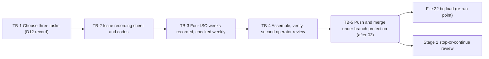

# 2. Toil baseline

## Status
- Owner: the platform owner
- Last reviewed: 2026-09-15
- Last executed: never
- Stage: review §2 stage 2. It starts on day one, before any other step of the set. It cannot be taken later: once Wall-E does the tasks, the "before" is gone.
- Step prefix: TB. Steps: 13. BLOCKED steps: none, because no code is needed.
- Replaces: Phase Mo-0 of `mo/07-build-runbook.md` and row D12 of `wall-e/PREREQUISITES.md`. This file is decision SD-39 of the setup plan.
- Closes: S084 (the baseline is started on day one), S064 for the baseline (the file is never under the wiki; Mo's later artefacts are file 40's half) and S150 for the baseline's form (no scheduled query reads the CSV, and the CSV contract is fixed here; the explicit `bq load` is file 22's half).

## What this part builds

Four consecutive ISO weeks of hand-recorded handling time for the three admin tasks with the most volume, plus the programme's monthly human operating hours. The result is one CSV, `metrics/toil_baseline.csv`, in the platform repository, merged after review by two people. It is the denominator of the stop-or-continue review in [Wall-E decision 38](../../wall-e/09-open-decisions.md): at the end of S1, toil saved plus the projected S3 saving is set against operating cost **including human hours** ([Mo staging](../../mo/05-staging.md)). The three tasks are also the playbooks Stage 0 shadows ([Wall-E decision 12](../../wall-e/09-open-decisions.md); [autonomy ladder](../../wall-e/05-autonomy-ladder.md), assumption row "The example playbooks reflect real toil").

What the old text got wrong, and must not come back:

| Old text | Why it fails | Here instead |
|---|---|---|
| "A loader scheduled query reads it into `walle_metrics`" (Mo-0, Mo-4 `toil-baseline-load`) | A scheduled query runs GoogleSQL over BigQuery tables and cannot open a file in git. A 400-day partition expiry would also drop rows (S150). | No loader is created. File 22 loads the merged CSV with an explicit `bq load`, sets no expiry and keeps a copy in `MO_ARCHIVE_DS`. That load is a named re-run point. |
| `config/metrics/toil_baseline.csv`, and Mo artefacts under `platform/*/mo/` in the wiki | The wiki is pushed to Google Drive by `_sync/wiki push`. Nothing can exclude a path, so a file stored there is edited and shared outside review (S064). | `TOIL_BASELINE_FILE=metrics/toil_baseline.csv` in `PLATFORM_REPO_DIR`. TB-4.2 checks that neither the repository nor the file is under `WIKI_DIR` or a Drive-synced folder. |
| PREREQUISITES ordered step 1 lists D1, D3, D5, D7 and D8, but not D12 | The four weeks slip past Wall-E Phase 1 (S084). | TB-1.1 is the first step of the whole set. |



## Preconditions

- [ ] The platform owner has read [the review §2 row 2](../13-setup-procedure-review.md) and this page. Nothing else is needed for TB-1 and TB-2: **do not wait for file 01 to start them.**
- [ ] From TB-3.2 onwards: file 01 has created `~/.platform-env` with `PLATFORM_REPO_DIR` (a local git repository), `WIKI_DIR`, `BUILD_LOG_DIR`, `EVIDENCE_INTERIM_LOCATION`, `EVIDENCE_REGISTER` and the helpers `penv_set` and `need`. The first weekly checkpoint falls seven days after `TOIL_START_DATE`, which leaves a week for this.
- [ ] Workstation: `python3` (3.12, file 01) and `git`. No gcloud, no bq, no cloud access and no admin role are used in this file.
- [ ] Day one, HR check: the platform owner asks HR whether the works council must be consulted before staff record their own task time. *Assumption:* pseudonymous, aggregated self-recording that is used only for a programme cost figure, never to assess an individual, needs no consultation. If HR says it does, TB-3.1 waits for that consultation. The question and its answer are recorded in TB-1.2's decision record. File 03's D7 letter to the DPO names this measurement.

## People

| Role | Does | Present when |
|---|---|---|
| Platform owner | Chooses the tasks, issues the sheet, runs the weekly check, assembles and commits | TB-1, TB-2, TB-3.2, TB-3.3, TB-4, TB-5 |
| Toil recorders (the admins who do the three tasks) | Record every instance, confirm each week | Four weeks, daily |
| Second operator (`SECOND_OPERATOR_EMAIL`, named in file 03) | Checks the CSV against the sheet on their own and signs the review record; first reviewer on the pull request | TB-4.3, TB-5.1 |
| A second reviewer who did not author the change (named by file 03's CODEOWNERS for `metrics/`; *Assumption:* the second human until then) | Second approval on the pull request | TB-5.1 |

If file 03 has not named the second operator by the end of week four, the recording is still complete and committed locally (TB-4.1). Only TB-4.3 and TB-5 wait, so no week is lost.

## The CSV contract

This is what file 22 loads and what the S1 cost report reads. The header row is exactly these nine columns, in this order, in UTF-8 with LF line endings. Empty cells are empty strings. The file holds no names and no email addresses: `recorder` is a code, and the key from code to person stays in the recording sheet's restricted folder (TB-2.2).

| Column | `instance` row | `task_median` row | `operating_hours` row | Type for file 22 |
|---|---|---|---|---|
| `record_type` | `instance` | `task_median` | `operating_hours` | STRING, required |
| `date` | YYYY-MM-DD the instance was handled | empty | empty | DATE |
| `iso_week` | YYYY-Www, derived from `date` | empty | empty | STRING |
| `task_id` | one of `TOIL_TASKS` | one of `TOIL_TASKS` | empty | STRING |
| `handling_minutes` | whole minutes of hands-on handling, above 0 | median of that task's instances | empty | FLOAT64 |
| `interrupted` | `yes` or `no` | empty | empty | STRING |
| `recorder` | recorder code, for example `r01` | empty | role code, for example `owner` | STRING |
| `month` | empty | empty | YYYY-MM | STRING |
| `hours` | empty | empty | human hours spent on the programme that month | FLOAT64 |

Definitions given to recorders:

- **Handling minutes** run from picking the instance up to closing it. Time spent waiting for someone else is left out. Round up to a whole minute.
- **Interrupted** is `yes` when other work split the handling.
- **Operating hours** are all human hours spent on the agentic platform programme in a calendar month: setup sittings, reviews, approvals, grading, meetings and the recording itself.

## Steps

### TB-1.1 Rank candidate tasks by volume

- **WHO:** Platform owner, working alone. The Audit & Investigation privilege is needed to read Admin log events.
- **WHERE:** Admin console, Menu > Reporting > Audit and investigation > Admin log events. Also the team's ticket queue (*tbd*: the system and its category field).
- **ACTION:**
  1. List the admin tasks the team does by hand. Start from decision 12's guesses: licence reclaim from suspended accounts, leaver group hygiene and stale-account reporting.
  2. For each task, count its instances over the last 90 days. Use the ticket-queue category count where the task has a ticket. Where the task leaves an admin event, filter Admin log events by Event and by Date (After, 90 days ago). Admin log events are kept 6 months. Export the results to Sheets or CSV and note the event name used.
  3. Remove any task that no catalogue family in the [autonomy ladder](../../wall-e/05-autonomy-ladder.md) could perform, and note why it was removed. A task Wall-E will never do saves no toil.
  4. Keep the three with the highest monthly volume. Give each a `task_id` that matches `^[a-z0-9-]{3,40}$`.
- **VERIFY:** A table of candidates with columns task, source (ticket category or admin event name), 90-day count, catalogue family, kept yes/no. Exactly three rows are kept.
- **ROLLBACK:** None needed. The step only reads.
- **EVIDENCE:** The ranking table and the exports, uploaded to `EVIDENCE_INTERIM_LOCATION` as `<date>-TB-1.1-toil-candidates-v1`. TISAX 1.1–1.2 (decision files). EU AI Act E-09 (post-market monitoring input; *Assumption:* the closest E-xx row).

### TB-1.2 Record Wall-E decision 12 as a dated decision record

- **WHO:** Platform owner decides and signs. No second signature is needed. File 03 lists the record in its tracker.
- **WHERE:** A text editor, then the shell with `~/.platform-env` sourced (or plain paper until file 01 exists).
- **ACTION:** Write `decisions/<YYYY-MM-DD>-wall-e-d12-toil-tasks.md` in `PLATFORM_REPO_DIR`. *Assumption:* file 03 keeps decision records in the platform repository; if it keeps them elsewhere, the same file is copied there, since three task names are safe to sync. The record has the decision-log sections: Context, Options considered (the TB-1.1 table), Decision (the three `task_id`s with a one-line definition each, the Monday `TOIL_START_DATE`, and the HR answer from the preconditions) and Consequences (these three become the Stage 0 shadow playbooks; changing one after recording starts restarts the four weeks). Then, once file 01's helpers exist:

```bash
need PLATFORM_REPO_DIR
penv_set TOIL_TASKS "<task-id-1>,<task-id-2>,<task-id-3>"
penv_set TOIL_START_DATE "<YYYY-MM-DD, a Monday>"
penv_set TOIL_BASELINE_FILE "metrics/toil_baseline.csv"
```

- **VERIFY:** The next command prints `3 ids, starts on a Monday`.

```bash
python3 -c 'import sys,re,datetime as d; t=sys.argv[1].split(","); ok=len(t)==3 and len(set(t))==3 and all(re.fullmatch(r"[a-z0-9-]{3,40}",x) for x in t) and d.date.fromisoformat(sys.argv[2]).isoweekday()==1; print("3 ids, starts on a Monday" if ok else "FAIL"); sys.exit(0 if ok else 1)' "$TOIL_TASKS" "$TOIL_START_DATE"
```

- **ROLLBACK:** Before `TOIL_START_DATE`, write a new dated record that supersedes this one and run `penv_set --force` with a line in the build log. After `TOIL_START_DATE`, a changed task restarts the four weeks.
- **EVIDENCE:** The signed record, scanned to `EVIDENCE_INTERIM_LOCATION` as `<date>-TB-1.2-wall-e-d12-v1`. A build-log line under TB-1.2 in `BUILD_LOG_DIR`. One line in `EVIDENCE_REGISTER`, in file 01's format. TISAX 1.1–1.2. EU AI Act E-09.

### TB-2.1 Create the recording sheet

- **WHO:** Platform owner.
- **WHERE:** Google Sheets, in a folder inside `EVIDENCE_INTERIM_LOCATION`. Never in the wiki's Drive folder.
- **ACTION:**
  1. Create a spreadsheet named `toil-recording` with three tabs.
  2. Tab `instances` has the columns `date`, `task_id`, `handling_minutes`, `interrupted`, `recorder`.
  3. Tab `operating_hours` has the columns `month`, `recorder`, `hours`.
  4. Tab `week_confirmations` has the columns `iso_week`, `recorder`, `all_instances_recorded` (yes/no), `note`.
  5. On `task_id` and `interrupted`, add dropdowns with Data > Data validation > Add rule > Dropdown, holding the three ids and `yes`,`no`. Keep the default that rejects values not on the list.
  6. Set the `date` column to plain text. Recorders type YYYY-MM-DD. The TB-3.2 assembly rejects any other form.
  7. Share the sheet as Editor with the recorders only. Do not share it by link.
- **VERIFY:** In Share, the only editors listed are the recorders and the platform owner, and general access is Restricted. Typing a fourth task id into `task_id` is rejected.
- **ROLLBACK:** Delete the spreadsheet, but only before `TOIL_START_DATE`. After that it holds weeks that cannot be recovered: **never delete it**.
- **EVIDENCE:** The sheet's URL, recorded in the build log under TB-2.1. The URL is not a secret. TISAX 5.2.

### TB-2.2 Issue recorder codes and brief the recorders

- **WHO:** Platform owner, with each recorder.
- **WHERE:** A short meeting before `TOIL_START_DATE`, and the sheet.
- **ACTION:**
  1. Give each recorder a code (`r01`, `r02` and so on).
  2. Keep the code-to-person key in a separate file in the same restricted folder. Only the platform owner can read it.
  3. Brief the recorders on the definitions in the CSV contract, the purpose (a programme cost figure, never an individual's assessment), the daily habit (record each instance the same day) and the Friday confirmation in `week_confirmations`.
  4. State that no script, agent or prototype takes over any of the three tasks during the four weeks. If a script already automates part of a task, say so in the decision record.
- **VERIFY:** Every recorder has entered one test row, and the platform owner has then deleted it. The key file lists every code, and no recorder can open it (check in Share).
- **ROLLBACK:** Reissue the codes before `TOIL_START_DATE`.
- **EVIDENCE:** The briefing date and attendee codes, in the build log under TB-2.2. TISAX 2.1 (awareness).

### TB-3.1 Record every instance for four consecutive ISO weeks

- **WHO:** The toil recorders. The platform owner records too when he does one of the tasks.
- **WHERE:** Tab `instances` of `toil-recording`, daily, from `TOIL_START_DATE`.
- **ACTION:** One row per instance, entered the same day. Every Friday, each recorder adds one `week_confirmations` row for the ISO week (`all_instances_recorded` yes or no, and a note for any gap or public holiday).
- **VERIFY:** TB-3.2 each week.
- **ROLLBACK:** **IRREVERSIBLE. No rollback can recover a week that was not recorded, and a re-measurement after Wall-E starts measures a different world.** Before starting, confirm: TB-1.2 is signed, TB-2.1 and TB-2.2 are done, and the HR answer allows recording.
- **EVIDENCE:** The sheet itself (its version history is the timeline). Snapshots are committed by TB-3.2.

### TB-3.2 Weekly completeness check and local checkpoint (repeat after weeks 1, 2, 3 and 4)

- **WHO:** Platform owner.
- **WHERE:** The sheet, then the shell with `~/.platform-env` sourced, in `PLATFORM_REPO_DIR`.
- **ACTION:**
  1. Check that `week_confirmations` holds a `yes` from every recorder for the week just ended.
  2. For each task with a trace (ticket category or admin event from TB-1.1), compare the week's trace count with its instance count. A gap over 20 % (*Assumption:* the threshold) goes back to the recorders.
  3. A week that is not repaired within two business days is marked incomplete in the build log. An incomplete week restarts the run of four: set `TOIL_START_DATE` to the next Monday with `penv_set --force`, add a build-log line and write a superseding line in the decision record. Rows already recorded are kept.
  4. Download each of `instances` and `operating_hours` with File > Download > Comma Separated Values (.csv). Each download exports the tab that is open. *Assumption:* files land in `~/Downloads` as `toil-recording - <tab>.csv`.
  5. Assemble the CSV and commit a checkpoint on the local branch `toil-baseline`. The `switch` line creates the branch in week one and reuses it afterwards:

```bash
need PLATFORM_REPO_DIR TOIL_TASKS TOIL_START_DATE TOIL_BASELINE_FILE
mkdir -p "$PLATFORM_REPO_DIR/metrics" "$PLATFORM_REPO_DIR/metrics/reviews"
git -C "$PLATFORM_REPO_DIR" switch toil-baseline 2>/dev/null || git -C "$PLATFORM_REPO_DIR" switch -c toil-baseline
python3 - "$HOME/Downloads/toil-recording - instances.csv" "$HOME/Downloads/toil-recording - operating_hours.csv" "$PLATFORM_REPO_DIR/$TOIL_BASELINE_FILE" <<'PY'
import csv, sys, statistics, datetime as dt, collections
src_i, src_h, out = sys.argv[1:4]
HEAD = ["record_type","date","iso_week","task_id","handling_minutes","interrupted","recorder","month","hours"]
rows, per = [], collections.defaultdict(list)
for r in csv.DictReader(open(src_i, newline="", encoding="utf-8")):
    d = dt.date.fromisoformat(r["date"].strip()); y, w, _ = d.isocalendar()
    m = int(r["handling_minutes"]); t = r["task_id"].strip()
    rows.append(["instance", d.isoformat(), f"{y}-W{w:02d}", t, str(m), r["interrupted"].strip().lower(), r["recorder"].strip(), "", ""])
    per[t].append(m)
rows.sort(key=lambda x: (x[1], x[3], x[6]))
rows += [["task_median", "", "", t, f"{statistics.median(v):g}", "", "", "", ""] for t, v in sorted(per.items())]
for r in csv.DictReader(open(src_h, newline="", encoding="utf-8")):
    rows.append(["operating_hours", "", "", "", "", "", r["recorder"].strip(), r["month"].strip(), f"{float(r['hours']):g}"])
with open(out, "w", newline="", encoding="utf-8") as f:
    wr = csv.writer(f, lineterminator="\n"); wr.writerow(HEAD); wr.writerows(rows)
for k, n in sorted(collections.Counter((x[2], x[3]) for x in rows if x[0] == "instance").items()):
    print(*k, n)
PY
git -C "$PLATFORM_REPO_DIR" add "$TOIL_BASELINE_FILE" decisions/
git -C "$PLATFORM_REPO_DIR" commit -m "toil baseline: checkpoint <YYYY-Www>"
```

- **VERIFY:** The script prints one line per ISO week and task, with a count that matches the sheet. `git -C "$PLATFORM_REPO_DIR" log --oneline toil-baseline -- "$TOIL_BASELINE_FILE"` shows one checkpoint per week so far. A date that is not ISO, or minutes that are not a number, stops the script with a traceback: fix the sheet and run it again.
- **ROLLBACK:** `git -C "$PLATFORM_REPO_DIR" reset --soft HEAD~1` undoes a checkpoint made in error, and only before anything is pushed. The downloads in `~/Downloads` can be deleted, because the sheet is the source.
- **EVIDENCE:** The week's result (complete or incomplete, trace comparison) in the build log under `TB-3.2-<YYYY-Www>`. The checkpoint commit id. TISAX 1.5 (compliance checks). EU AI Act E-09.

### TB-3.3 Record the monthly operating hours

- **WHO:** Platform owner collects the figures. Each programme participant reports their own hours by role code.
- **WHERE:** Tab `operating_hours`.
- **ACTION:** On the last business day of each calendar month that overlaps the four weeks, add one row per role code (`month`, `recorder`, `hours`). Carry on every month after the baseline too: the S1 cost report needs the series, and later rows reach the repository only by pull request.
- **VERIFY:** Every month from `TOIL_START_DATE` to the last day of week four has at least one row with `hours` above 0. TB-4.2 checks this.
- **ROLLBACK:** Correct the row in the sheet before the next checkpoint. Once a figure has been merged, correct it only with a new pull request.
- **EVIDENCE:** Rows committed by TB-3.2. EU AI Act E-09. TISAX 5.2.

### TB-4.1 Assemble the final candidate

- **WHO:** Platform owner.
- **WHERE:** The shell with `~/.platform-env` sourced.
- **ACTION:** After week four's TB-3.2 and the month's TB-3.3, run the TB-3.2 assembly block again and commit with the message `toil baseline: final candidate <TOIL_START_DATE>`. Then print the identifiers the review will sign:

```bash
git -C "$PLATFORM_REPO_DIR" rev-parse HEAD
git -C "$PLATFORM_REPO_DIR" rev-parse "HEAD:$TOIL_BASELINE_FILE"
shasum -a 256 "$PLATFORM_REPO_DIR/$TOIL_BASELINE_FILE"
```

- **VERIFY:** `git -C "$PLATFORM_REPO_DIR" status --porcelain -- "$TOIL_BASELINE_FILE"` prints nothing.
- **ROLLBACK:** `git reset --soft HEAD~1` before TB-4.3 is signed. After signing, only a new commit and a new review.
- **EVIDENCE:** The three identifiers in the build log under TB-4.1.

### TB-4.2 Verify the baseline

- **WHO:** Platform owner runs it with the second operator watching (they sign in TB-4.3).
- **WHERE:** The shell with `~/.platform-env` sourced.
- **ACTION:**

```bash
need PLATFORM_REPO_DIR WIKI_DIR TOIL_TASKS TOIL_START_DATE TOIL_BASELINE_FILE
python3 - "$PLATFORM_REPO_DIR" "$TOIL_BASELINE_FILE" "$TOIL_TASKS" "$TOIL_START_DATE" "$WIKI_DIR" <<'PY'
import csv, sys, os, statistics, datetime as dt
repo, rel, tasks, start, wiki = sys.argv[1], sys.argv[2], sys.argv[3].split(","), dt.date.fromisoformat(sys.argv[4]), sys.argv[5]
HEAD = ["record_type","date","iso_week","task_id","handling_minutes","interrupted","recorder","month","hours"]
bad = []
r_repo, r_wiki = os.path.realpath(repo), os.path.realpath(wiki)
if os.path.commonpath([r_repo, r_wiki]) == r_wiki: bad.append("repository is under the wiki")
if "/Library/CloudStorage/" in r_repo or "Google Drive" in r_repo: bad.append("repository is in a Drive-synced folder")
if rel != "metrics/toil_baseline.csv": bad.append("TOIL_BASELINE_FILE is not metrics/toil_baseline.csv")
path = os.path.join(repo, rel)
with open(path, newline="", encoding="utf-8") as f:
    if next(csv.reader(f)) != HEAD: bad.append("header differs from the contract")
rows = list(csv.DictReader(open(path, newline="", encoding="utf-8")))
kinds = {r["record_type"] for r in rows}
if kinds - {"instance", "task_median", "operating_hours"}: bad.append(f"unknown record_type {kinds}")
inst = [r for r in rows if r["record_type"] == "instance"]
weeks, per = set(), {t: [] for t in tasks}
for r in inst:
    d = dt.date.fromisoformat(r["date"]); y, w, _ = d.isocalendar()
    if r["iso_week"] != f"{y}-W{w:02d}": bad.append(f"iso_week wrong on {r['date']}")
    if r["task_id"] not in per: bad.append(f"unknown task {r['task_id']}")
    else: per[r["task_id"]].append(int(r["handling_minutes"]))
    if int(r["handling_minutes"]) <= 0 or r["interrupted"] not in ("yes", "no"): bad.append(f"bad values on {r['date']}")
    if not r["recorder"] or "@" in r["recorder"]: bad.append(f"recorder must be a code on {r['date']}")
    weeks.add(r["iso_week"])
need_weeks = {"%d-W%02d" % (start + dt.timedelta(days=7 * k)).isocalendar()[:2] for k in range(4)}
if not need_weeks <= weeks: bad.append(f"missing consecutive weeks {sorted(need_weeks - weeks)}")
med = {r["task_id"]: float(r["handling_minutes"]) for r in rows if r["record_type"] == "task_median"}
for t, v in per.items():
    if not v: bad.append(f"no instances for {t}")
    elif t not in med or abs(med[t] - statistics.median(v)) > 0.01: bad.append(f"median wrong or missing for {t}")
hrs = [r for r in rows if r["record_type"] == "operating_hours"]
months = {(start + dt.timedelta(days=k)).strftime("%Y-%m") for k in range(28)}
have = {r["month"] for r in hrs if float(r["hours"] or 0) > 0}
if not months <= have: bad.append(f"operating hours missing for {sorted(months - have)}")
print("FAIL:\n" + "\n".join(bad) if bad else f"OK weeks={len(weeks)} tasks={len(tasks)} medians={med} hours_rows={len(hrs)}")
sys.exit(1 if bad else 0)
PY
find "$WIKI_DIR" -iname 'toil_baseline*' -print
```

- **VERIFY:** The script prints `OK` with at least four weeks, three tasks, one median per task and at least one hours row, and exits 0. The `find` prints nothing. These are Mo-0's criteria: four distinct ISO weeks, three task ids, a median per task and an operating-hours row. They are tightened here: the weeks must be consecutive from `TOIL_START_DATE`, and every month those weeks touch needs an hours row.
- **ROLLBACK:** None needed; the step only reads. On `FAIL`, fix the sheet and repeat TB-4.1.
- **EVIDENCE:** The output, in the build log under TB-4.2. TISAX 1.5, 5.2. EU AI Act E-09.

### TB-4.3 Second operator's independent check and signed review record

- **WHO:** The second operator. The platform owner may be present but does not do the checks.
- **WHERE:** A private copy of the sheet (File > Make a copy, so the evidence sheet is not changed), then paper.
- **ACTION:**
  1. In the copy, compute each task's median with `=MEDIAN(FILTER(C:C, B:B="<task-id>"))` and count its rows. Compare both with the `task_median` rows and the per-task counts in the CSV.
  2. Pick at least 10 % of the `instance` rows at random and match each against the sheet.
  3. Check that `week_confirmations` is complete for all four weeks, and that TB-4.2 printed `OK`.
  4. Fill in `metrics/reviews/<date>-toil-baseline-review.md`. It holds the reviewer's name and role, the date, the commit id, the blob id and SHA-256 from TB-4.1, the four ISO weeks, the three medians as recomputed, the sample size, and the result (approved or refused, with reasons).
  5. Print it, sign it, and scan it the same day.
- **VERIFY:** The scan exists in `EVIDENCE_INTERIM_LOCATION`, and its blob id equals the output of `git -C "$PLATFORM_REPO_DIR" rev-parse "toil-baseline:$TOIL_BASELINE_FILE"`.
- **ROLLBACK:** If the review is refused, fix, repeat TB-4.1 and TB-4.2, and sign a new record (`-v2`). Never edit a signed record.
- **EVIDENCE:** `<date>-TB-4.3-toil-baseline-review-v1` in `EVIDENCE_INTERIM_LOCATION`. One line in `EVIDENCE_REGISTER`. TISAX 1.2.2 (separation of duties), 5.2. EU AI Act E-09.

### TB-4.4 Commit the review record locally

- **WHO:** Platform owner.
- **WHERE:** The shell with `~/.platform-env` sourced.
- **ACTION:**

```bash
git -C "$PLATFORM_REPO_DIR" add metrics/reviews/
git -C "$PLATFORM_REPO_DIR" commit -m "toil baseline: signed review record"
```

- **VERIFY:** `git -C "$PLATFORM_REPO_DIR" diff --quiet HEAD~1 HEAD -- "$TOIL_BASELINE_FILE" && echo "CSV unchanged since review"` prints the message.
- **ROLLBACK:** `git reset --soft HEAD~1` before the push.
- **EVIDENCE:** The commit id, in the build log under TB-4.4.

### TB-5.1 Push and merge under branch protection (re-run point: once file 03 sets `PLATFORM_REPO_REMOTE`)

- **WHO:** Platform owner opens the pull request. Two human reviewers approve, neither of them the author: the second operator and the second reviewer from People. Approvals from bots or service accounts do not count (file 03's branch protection).
- **WHERE:** The shell with `~/.platform-env` sourced, then the pull-request page on `GIT_HOST`.
- **ACTION:** If file 03 has already pushed the local history, only open the pull request. *Assumption:* the remote is called `origin` and its protected branch `main`; use the names file 03 records.

```bash
need PLATFORM_REPO_DIR PLATFORM_REPO_REMOTE TOIL_BASELINE_FILE
git -C "$PLATFORM_REPO_DIR" push origin toil-baseline
```

Open a pull request from `toil-baseline` to `main`, linking the scanned review record and the TB-4.2 output, and merge it once both approvals are in.

- **VERIFY:** The two blob ids are equal, which proves the merged CSV is exactly the reviewed one.

```bash
git -C "$PLATFORM_REPO_DIR" fetch origin
git -C "$PLATFORM_REPO_DIR" rev-parse "origin/main:$TOIL_BASELINE_FILE"
git -C "$PLATFORM_REPO_DIR" rev-parse "toil-baseline:$TOIL_BASELINE_FILE"
```

The pull request page shows two human approvals and no admin bypass.
- **ROLLBACK:** Revert the change with a new pull request under the same protection. Never force-push or rewrite `main`. **A revert does not bring back unrecorded weeks.**
- **EVIDENCE:** The merge commit id and the pull request URL, in the build log under TB-5.1 and in `EVIDENCE_REGISTER`. Add the "TB-5.1 merged" row to the README re-run index, which triggers file 22's load. TISAX 5.2. EU AI Act E-09.

### TB-5.2 Hand over

- **WHO:** Platform owner.
- **WHERE:** The build log.
- **ACTION:** Record under TB-5.2 the merge commit id, `TOIL_TASKS`, `TOIL_START_DATE` and `TOIL_BASELINE_FILE`, and state the three handoffs:
  1. File 22 runs the explicit `bq load` into `MO_METRICS_DS` from this commit: unpartitioned or without expiry, a copy in `MO_ARCHIVE_DS`, and no transfer config.
  2. File 30 (Wall-E Phase 1) checks that TB-5.1 is merged before it starts, which is D12's gate.
  3. The S1 stop-or-continue review reads the merged file.
- **VERIFY:** `git -C "$PLATFORM_REPO_DIR" log -1 --format=%H origin/main -- "$TOIL_BASELINE_FILE"` equals the recorded merge commit, or a later commit that only adds operating-hours rows.
- **ROLLBACK:** None needed; the step only records.
- **EVIDENCE:** Build-log entry TB-5.2. TISAX 1.1–1.2.

## Verification checklist for the whole part

- [ ] The D12 decision record is signed and dated, names three task ids, and is listed in file 03's tracker.
- [ ] `TOIL_TASKS`, `TOIL_START_DATE` (a Monday) and `TOIL_BASELINE_FILE=metrics/toil_baseline.csv` are set in `~/.platform-env`.
- [ ] Four consecutive ISO weeks recorded, each confirmed by every recorder, with one TB-3.2 checkpoint commit per week.
- [ ] TB-4.2 prints `OK`: at least four distinct ISO weeks, three task ids, a median per task, an operating-hours row for every month touched, no email in `recorder`, and the repository outside the wiki and outside any Drive-synced folder.
- [ ] The second operator's signed review record matches the committed blob id.
- [ ] Merged to `main` under branch protection with two human approvals, and the merged blob id equals the reviewed one.
- [ ] No scheduled query or transfer config reads the CSV. The only loader is file 22's explicit `bq load`.
- [ ] **The four weeks cannot be recovered.** If any box above is open when Wall-E work (file 30) is due, file 30 waits.

## What the next files need from this one

| Consumer | Needs | Form |
|---|---|---|
| File 03 | The D12 record, for its tracker; the push of the local `toil-baseline` branch when it creates `PLATFORM_REPO_REMOTE` | `decisions/<date>-wall-e-d12-toil-tasks.md` |
| File 22 | `TOIL_BASELINE_FILE` at a merged commit, the CSV contract above, and the re-run point "TB-5.1 merged" | CSV, nine columns, header row |
| File 30 | Proof that D12's gate is met | TB-5.1 build-log entry |
| File 39 (Stage 0) | The three tasks the shadow playbooks cover | `TOIL_TASKS` |
| File 40 and the S1 stop-or-continue review | The denominator and the operating-hours series | The merged CSV |
| File 42 | Evidence rows TB-1.1, TB-1.2, TB-3.2, TB-4.2, TB-4.3, TB-5.1 | `EVIDENCE_REGISTER` |

Consumes: `PLATFORM_REPO_DIR` and `WIKI_DIR` (file 01), plus the helpers and registers file 01 creates. `SECOND_OPERATOR_EMAIL` and `PLATFORM_REPO_REMOTE` (file 03) are needed only by TB-4.3 and TB-5.1, which wait for them without losing a week.

Sources checked on 2026-09-15: Google Workspace Admin Help, "Admin log events" (path, Audit & Investigation privilege, export to Sheets or CSV) and "Data retention and lag times" (Admin log events kept 6 months); Google Docs Editors Help, "Create an in-cell dropdown list" (Data > Data validation > Add rule); BigQuery, "Loading CSV data" (DATE as YYYY-MM-DD, `--skip_leading_rows`, local files).
