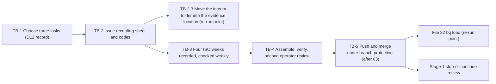

# 2. Toil baseline

## Status
- Owner: the platform owner
- Last reviewed: 2026-09-15
- Last executed: never
- Stage: review §2 stage 2. It starts on day one, before any other step of the set. It cannot be taken later: once Wall-E does the tasks, the "before" is gone.
- Step prefix: TB. Steps: 14. BLOCKED steps: none, because no code is needed.
- Replaces: Phase Mo-0 of `mo/07-build-runbook.md` and row D12 of `wall-e/PREREQUISITES.md`. This file is decision SD-39 of the setup plan.
- Closes: S084 (the baseline is started on day one), S064 for the baseline (the file is never under the wiki; Mo's later artefacts are file 40's half) and S150 for the baseline's form (no scheduled query reads the CSV, and the CSV contract is fixed here; the explicit `bq load` is file 22's half).

## What this part builds

Four consecutive ISO weeks of hand-recorded handling time for the three admin tasks with the most volume, plus the programme's monthly human operating hours. The result is one CSV, `metrics/toil_baseline.csv`, in the platform repository, merged after review by two people. It is the denominator of the stop-or-continue review in [Wall-E decision 38](../../wall-e/09-open-decisions.md): at the end of S1, toil saved plus the projected S3 saving is set against operating cost **including human hours** ([Mo staging](../../mo/05-staging.md)). The three tasks are also the playbooks Stage 0 shadows ([Wall-E decision 12](../../wall-e/09-open-decisions.md); [autonomy ladder](../../wall-e/05-autonomy-ladder.md), assumption row "The example playbooks reflect real toil").

What the old text got wrong, and must not come back:

| Old text | Why it fails | Here instead |
|---|---|---|
| "A loader scheduled query reads it into `walle_metrics`" (Mo-0, Mo-4 `toil-baseline-load`) | A scheduled query runs GoogleSQL over BigQuery tables and cannot open a file in git. A 400-day partition expiry would also drop rows (S150). | No loader is created. File 22 loads the merged CSV with an explicit `bq load`, sets no expiry and keeps a copy in `MO_ARCHIVE_DS`. That load is a named re-run point. |
| `config/metrics/toil_baseline.csv`, and Mo artefacts under `platform/*/mo/` in the wiki | The wiki is pushed to Google Drive by `_sync/wiki push`. Nothing can exclude a path, so a file stored there is edited and shared outside review (S064). | `TOIL_BASELINE_FILE=metrics/toil_baseline.csv` in `PLATFORM_REPO_DIR`. TB-4.2 checks that neither the repository nor the file is under `WIKI_DIR` or a Drive-synced folder. |
| PREREQUISITES ordered step 1 lists D1, D3, D5, D7 and D8, but not D12 | The four weeks slip past Wall-E Phase 1 (S084). | TB-1.1 is the first step of the whole set. |



## Preconditions

- [ ] The platform owner has read [the review §2 row 2](../13-setup-procedure-review.md) and this page. **TB-1.1 and TB-1.2 need nothing from file 01 and nothing from file 03: do not wait for either.** Paper and a text editor are enough ([README](README.md) §3.1: "Paper is acceptable"), and the commit, the variables and the evidence rows are caught up at TB-1.2's second block, TB-2.3 and TB-4.1.
- [ ] Exactly what each part of this file needs, and from where. Nothing in this table has a lead time longer than a day except the last row, and the last row gates no recording week.

  | Step | Needs | From | If it is not there yet |
  |---|---|---|---|
  | TB-1.1, TB-1.2 (first half) | nothing | — | run them on day one, on paper |
  | TB-1.2 (second block), TB-2.1, TB-2.2, TB-3.2 to TB-5.2 | `~/.platform-env` with `PLATFORM_REPO_DIR` (a local git repository on `main` with at least one commit), `WIKI_DIR`, `BUILD_LOG_DIR`, `EVIDENCE_REGISTER`, and the helpers `penv_set`, `need`, `checkpoint`, `evidence_add` | file 01 **PR-2.2 to PR-2.5** and **PR-4.2** (the evidence register) | file 01 runs the same day, between TB-1.2 and TB-2.1 (README §3.1). The first weekly checkpoint falls seven days after `TOIL_START_DATE`, so there is a week of slack |
  | TB-2.3 only | `EVIDENCE_INTERIM_LOCATION` | file 01 **PR-4.4**, performed by the second human, who is appointed in file 03 **DC-2.1** (decision `PPL-SH`); file 01 §3.1 row P-05 gives that appointment a lead time of "weeks", row P-14 gives the location itself 1 day once the person exists | **no step of this file waits for it.** TB-1.1's table and exports go to `$BUILD_LOG_DIR/records/`, exactly as file 01 PR-2.6 does; TB-2.1's sheet and TB-2.2's code key go to the interim restricted Drive folder named in TB-2.1. TB-2.3 moves them and re-registers them the day PR-4.4 is `DONE` |
  | TB-4.3, TB-5.1 | `SECOND_OPERATOR_EMAIL`, `PLATFORM_REPO_REMOTE`, `GIT_HOST`, branch protection | file 03 **DC-2.4** (decision `PPL-SO`) and **DC-9.2 to DC-9.6** | the recording is complete and committed locally (TB-4.1) regardless. Only TB-4.3 and TB-5 wait, and no week is lost |

- [ ] Precondition check, run before TB-2.1 and again before every TB-3.2:

```bash
source "$HOME/.platform-env"
need PLATFORM_REPO_DIR BUILD_LOG_DIR WIKI_DIR EVIDENCE_REGISTER && echo "01 values OK"
git -C "$PLATFORM_REPO_DIR" rev-parse --abbrev-ref HEAD
git -C "$PLATFORM_REPO_DIR" status --porcelain
test -f "$BUILD_LOG_DIR/checkpoints.tsv" && echo "checkpoint file OK"
```

  Expected: `01 values OK`, the branch name `main` (or `toil-baseline` only inside TB-3.2's own block), an empty `status --porcelain`, and `checkpoint file OK`. A branch that is neither, or a dirty tree, means another file's sitting was left open: finish or stash it before running anything here, because TB-3.2 commits into the same repository.
- [ ] Workstation: `python3` (3.12, file 01) and `git`. No gcloud, no bq, no cloud access and no admin role are used in this file, so `penv_guard`'s gcloud checks are not a gate here.
- [ ] Day one, HR check: the platform owner asks HR whether the works council must be consulted before staff record their own task time. *Assumption:* pseudonymous, aggregated self-recording that is used only for a programme cost figure, never to assess an individual, needs no consultation. If HR says it does, TB-3.1 waits for that consultation. The question and its answer are recorded in TB-1.2's decision record, and `TOIL_START_DATE` is **the first Monday after the answer** ([README](README.md) §3.4), not a fixed date. File 03's D7 letter to the DPO names this measurement.
- [ ] Day zero, the ticket queue: the platform owner writes down which ticket system the team uses and which field carries the task category, because TB-1.1's count for two of the three tasks reads it. There is no prerequisite row for this in file 01 §3.1; it is closed here, by the values `TICKET_SYSTEM` and `TICKET_CATEGORY_FIELD` written into the TB-1.2 decision record and set in TB-1.2's block. A team with no ticket queue writes `none` and TB-1.1 counts from Admin log events alone. *Assumption:* one row belongs in file 01 §3.1 as `P-31 ticket system and its category field recorded`, holder platform owner, lead time none, verified by those two values; until file 01 carries it, this precondition is the row.

## People

| Role | Does | Present when |
|---|---|---|
| Platform owner | Chooses the tasks, issues the sheet, runs the weekly check, assembles and commits | TB-1, TB-2, TB-3.2, TB-3.3, TB-4.1, TB-4.2, TB-4.4, TB-5 |
| Toil recorders (the admins who do the three tasks) | Record every instance, confirm each week | Four weeks, daily |
| Second human (`SECOND_HUMAN_EMAIL`, appointed in file 03 DC-2.1; Manager of the evidence shared drive created in file 01 PR-4.4) | Confirms in writing that the moved toil artefacts are in the evidence location | TB-2.3 |
| Second operator (`SECOND_OPERATOR_EMAIL`, appointed in file 03 DC-2.4) | Watches TB-4.2; checks the CSV against the sheet on their own and signs the review record; first reviewer on the pull request | TB-4.2 (witness), TB-4.3, TB-5.1 |
| A second reviewer who did not author the change (named by file 03's CODEOWNERS for `metrics/`; *Assumption:* the second human until then) | Second approval on the pull request | TB-5.1 |

If file 03 has not named the second operator by the end of week four, the recording is still complete and committed locally (TB-4.1). Only TB-4.2's witness role, TB-4.3 and TB-5 wait, so no week is lost. If the second human has not been named, only TB-2.3 waits, and the artefacts stay in their day-one homes with TB-5.2 naming that as an open row.

## The CSV contract

This is what file 22 loads and what the S1 cost report reads. The header row is exactly these nine columns, in this order, in UTF-8 with LF line endings. Empty cells are empty strings. The file holds no names and no email addresses: `recorder` is a code, and the key from code to person stays in the recording sheet's restricted folder (TB-2.2).

| Column | `instance` row | `task_median` row | `operating_hours` row | Type for file 22 |
|---|---|---|---|---|
| `record_type` | `instance` | `task_median` | `operating_hours` | STRING, required |
| `date` | YYYY-MM-DD the instance was handled | empty | empty | DATE |
| `iso_week` | YYYY-Www, derived from `date` | empty | empty | STRING |
| `task_id` | one of `TOIL_TASKS` | one of `TOIL_TASKS` | empty | STRING |
| `handling_minutes` | whole minutes of hands-on handling, above 0 | median of that task's instances | empty | FLOAT64 |
| `interrupted` | `yes` or `no` | empty | empty | STRING |
| `recorder` | recorder code, for example `r01` | empty | role code, for example `owner` | STRING |
| `month` | empty | empty | YYYY-MM | STRING |
| `hours` | empty | empty | human hours spent on the programme that month | FLOAT64 |

Definitions given to recorders:

- **Handling minutes** run from picking the instance up to closing it. Time spent waiting for someone else is left out. Round up to a whole minute.
- **Interrupted** is `yes` when other work split the handling.
- **Operating hours** are all human hours spent on the agentic platform programme in a calendar month: setup sittings, reviews, approvals, grading, meetings and the recording itself.

## Steps

### TB-1.1 Rank candidate tasks by volume

- **WHO:** Platform owner, working alone. No witness, no approver. The Audit & Investigation privilege is needed to read Admin log events; the platform owner holds it as super admin.
- **WHERE:** Admin console → Reporting → Audit and investigation → Admin log events, in the Chrome profile `daily` (file 01 §4 PR-1.3) once that profile exists; on day one the browser in hand is acceptable and is noted in the build log. Also the ticket queue named in the preconditions' day-zero row: the system `TICKET_SYSTEM` and the field `TICKET_CATEGORY_FIELD`, both written down before this step starts and carried into TB-1.2's record. If the team has no ticket queue, both are `none` and the counts come from Admin log events alone.
- **ACTION:** First `checkpoint TB-1.1 START - - "toil candidate ranking"` if file 01 already exists; otherwise open a paper page headed `TB-1.1 START <UTC timestamp>` and copy both lines into the build log at TB-1.2's second block.
  1. List the admin tasks the team does by hand. Start from decision 12's guesses: licence reclaim from suspended accounts, leaver group hygiene and stale-account reporting.
  2. For each task, count its instances over the last 90 days. Use the ticket-queue category count where the task has a ticket. Where the task leaves an admin event, filter Admin log events by Event and by Date (After, 90 days ago). Admin log events are kept 6 months. Export the results to Sheets or CSV and note the event name used.
  3. Remove any task that no catalogue family in the [autonomy ladder](../../wall-e/05-autonomy-ladder.md) could perform, and note why it was removed. A task Wall-E will never do saves no toil.
  4. Keep the three with the highest monthly volume. Give each a `task_id` that matches `^[a-z0-9-]{3,40}$`.
- **VERIFY:** A table of candidates with columns task, source (ticket category or admin event name), 90-day count, catalogue family, kept yes/no. Exactly three rows are kept, each with a non-zero 90-day count and a named catalogue family; every removed row carries its reason. Write the table as markdown with the last column holding exactly `yes` or `no`, and count the kept rows: `grep -c '| yes |$' "$BUILD_LOG_DIR/records/$(date -u +%Y-%m-%d)-TB-1.1-toil-candidates-v1.md"` prints `3` once the table is in the build log.
- **ROLLBACK:** None needed. The step only reads. A ranking redone before TB-1.2 is signed replaces the table as `-v2`; after TB-1.2 is signed, a changed ranking is a superseding decision record (TB-1.2 ROLLBACK).
- **EVIDENCE:** The ranking table and the exports as `<date>-TB-1.1-toil-candidates-v1`. **Day-one home:** `$BUILD_LOG_DIR/records/`, the same fallback file 01 PR-2.6 uses, because `EVIDENCE_INTERIM_LOCATION` does not exist on day one (preconditions). TB-2.3 moves it and re-registers it. Register it as soon as file 01 PR-4.2 exists:

```bash
checkpoint TB-1.1 DONE - "build-log:records/$(date -u +%Y-%m-%d)-TB-1.1-toil-candidates-v1.md" "three tasks ranked"
evidence_add TB-1.1 toil-candidates E-03 1.4.1 "build-log:records/$(date -u +%Y-%m-%d)-TB-1.1-toil-candidates-v1.md" "$BUILD_LOG_DIR/records/$(date -u +%Y-%m-%d)-TB-1.1-toil-candidates-v1.md"
```

  E-xx: E-03 (the options-considered half of the D12 decision record; file 01 §7.2 row "Decision records"). TISAX: 1.4.1, 5.2.1.

### TB-1.2 Record Wall-E decision 12 as a dated decision record

- **WHO:** Platform owner decides and signs. No second signature is needed, no witness. File 03 §11.2 lists the record in `decisions/TRACKER.md` under the id `D12`, whose row points here, and its Mo-decisions step verifies `tools/decision-need.sh M-1 SD-24 SD-39 D12`. This record must therefore parse under `tools/decision-check.sh` when file 03 reaches that step.
- **WHERE:** A text editor, then the shell with `~/.platform-env` sourced (or plain paper until file 01 exists).
- **ACTION:** Write `decisions/<YYYY-MM-DD>-wall-e-d12-toil-tasks.md` in `PLATFORM_REPO_DIR`. File 03 §0 keeps decision records in `PLATFORM_REPO_DIR/decisions/` and nowhere else, and its own preconditions allow for this file's first commit already being there. Use file 03 DC-1.1's seven sections — Context, Options considered (the TB-1.1 table), Decision, Values, Gates, Consequences, Signatures — so that `tools/decision-check.sh` parses it unchanged when file 03 DC-1.2 creates that script. That script requires: the file name `YYYY-MM-DD-<lower-case-hyphens>.md`; a first line `# <the same date> — <title>`; the lines `- **Status:** accepted` and `- **Decision ids:** D12`; a `## Gates` section; and a Signatures row carrying the body SHA-256. Write all of it by hand on day one, before the script exists.

  - **Decision:** the three `task_id`s with a one-line definition each, `TOIL_START_DATE`, and the HR answer from the preconditions with its date.
  - **Values:** `TOIL_TASKS`, `TOIL_START_DATE`, `TOIL_BASELINE_FILE`, `TICKET_SYSTEM`, `TICKET_CATEGORY_FIELD`.
  - **Gates:** file 39 (the Stage 0 shadow playbooks), file 22 §8, file 30.
  - **Consequences:** these three become the Stage 0 shadow playbooks; changing one after recording starts restarts the four weeks.

  **Choosing the Monday.** `TOIL_START_DATE` is the first Monday after the HR answer ([README](README.md) §3.4). Among the Mondays that qualify, **prefer one whose fourth week ends in the last week of a calendar month**, because TB-4.2 refuses to pass until every month the four weeks touch has an `operating_hours` row, and TB-3.3 collects those on the last business day of the month. A start Monday in the last week of a month is the worst case: week four then ends early in a new month and the baseline cannot be verified for up to about four more weeks. If that Monday is the only one available, say so in the record and use TB-3.3's partial-month option so TB-4.1 is not held.

  Then, once file 01's helpers exist:

```bash
need PLATFORM_REPO_DIR BUILD_LOG_DIR
checkpoint TB-1.2 START - - "wall-e D12 toil tasks"
penv_set TOIL_TASKS "<task-id-1>,<task-id-2>,<task-id-3>"
penv_set TOIL_START_DATE "<YYYY-MM-DD, a Monday>"
penv_set TOIL_BASELINE_FILE "metrics/toil_baseline.csv"
penv_set TICKET_SYSTEM "<ticket system name, or none>"
penv_set TICKET_CATEGORY_FIELD "<field name, or none>"
git -C "$PLATFORM_REPO_DIR" switch main
git -C "$PLATFORM_REPO_DIR" add decisions/
git -C "$PLATFORM_REPO_DIR" commit -m "TB-1.2 Wall-E D12: the three measured toil tasks"
```

  The record is committed here, on `main`, and **never** by TB-3.2: the toil branch carries `metrics/` only.

- **VERIFY:** The next command prints `3 ids, starts on a Monday`.

```bash
python3 -c 'import sys,re,datetime as d; t=sys.argv[1].split(","); ok=len(t)==3 and len(set(t))==3 and all(re.fullmatch(r"[a-z0-9-]{3,40}",x) for x in t) and d.date.fromisoformat(sys.argv[2]).isoweekday()==1; print("3 ids, starts on a Monday" if ok else "FAIL"); sys.exit(0 if ok else 1)' "$TOIL_TASKS" "$TOIL_START_DATE"
```

  The record itself is committed, and the commit is on `main`:

```bash
git -C "$PLATFORM_REPO_DIR" log --oneline -1 main -- decisions/
git -C "$PLATFORM_REPO_DIR" rev-parse --abbrev-ref HEAD
```

  prints the TB-1.2 commit and `main`.

- **ROLLBACK:** Before `TOIL_START_DATE`, write a new dated record that supersedes this one (`- **Supersedes:**` naming the old file name) and run `penv_set --force` with a line in the build log; the old record is never edited. After `TOIL_START_DATE`, a changed task restarts the four weeks and the restart is written as a superseding record plus a TB-3.2 step 3 line.
- **EVIDENCE:** The signed record, scanned as `<date>-TB-1.2-wall-e-d12-v1`. **Day-one home:** `$BUILD_LOG_DIR/records/` (file 01 PR-2.6's fallback); TB-2.3 moves it to `EVIDENCE_INTERIM_LOCATION`. A build-log line under TB-1.2.

```bash
checkpoint TB-1.2 DONE - "build-log:records/$(date -u +%Y-%m-%d)-TB-1.2-wall-e-d12-v1.pdf" "D12 signed; TOIL_START_DATE=$TOIL_START_DATE"
evidence_add TB-1.2 wall-e-d12 E-03 1.4.1 "build-log:records/$(date -u +%Y-%m-%d)-TB-1.2-wall-e-d12-v1.pdf" "$BUILD_LOG_DIR/records/$(date -u +%Y-%m-%d)-TB-1.2-wall-e-d12-v1.pdf"
```

  E-xx: E-03. TISAX: 1.4.1, 5.2.1.

### TB-2.1 Create the recording sheet

- **WHO:** Platform owner, working alone. No witness.
- **WHERE:** Google Sheets. **Day-one home:** a folder in the platform owner's own My Drive named `toil-recording-interim`, created at step 0 below, shared with nobody until step 7. `EVIDENCE_INTERIM_LOCATION` is a shared drive the second human creates in file 01 PR-4.4, and its lead time is weeks (preconditions); the sheet cannot wait for it, because the four weeks cannot be recovered. TB-2.3 moves this folder into `EVIDENCE_INTERIM_LOCATION` and records the new id. Never in the wiki's Drive folder, and never in any folder `_sync/wiki push` writes to.
- **ACTION:** `checkpoint TB-2.1 START - - "recording sheet"` first.
  0. Drive → My Drive → New → New folder → `toil-recording-interim`. Right-click it → Share → check that General access is **Restricted** and that the only person listed is the platform owner. This folder holds the sheet (this step) and the code key (TB-2.2) until TB-2.3.
  1. Create a spreadsheet named `toil-recording` **inside that folder** with three tabs.
  2. Tab `instances` has the columns `date`, `task_id`, `handling_minutes`, `interrupted`, `recorder`.
  3. Tab `operating_hours` has the columns `month`, `recorder`, `hours`.
  4. Tab `week_confirmations` has the columns `iso_week`, `recorder`, `all_instances_recorded` (yes/no), `note`.
  5. On `task_id` and `interrupted`, add dropdowns with Data → Data validation → Add rule → Dropdown, holding the three ids and `yes`,`no`. Keep the default that rejects values not on the list.
  6. Set the `date` column to plain text (Format → Number → Plain text). Recorders type YYYY-MM-DD. The TB-3.2 assembly rejects any other form.
  7. Share the sheet as Editor with the recorders only, by address. Do not share it by link, and do not share the folder.
- **VERIFY:** In Share, the only editors listed are the recorders and the platform owner, and general access is Restricted. Typing a fourth task id into `task_id` is rejected with Google's "Invalid" warning. The sheet's parent folder is `toil-recording-interim` (File → Move shows the path), not a Drive-synced wiki folder.
- **ROLLBACK:** Delete the spreadsheet, but only before `TOIL_START_DATE`. After that it holds weeks that cannot be recovered: **never delete it, and never remove the platform owner's ownership of it.**
- **EVIDENCE:** The sheet's URL and the interim folder's id, recorded in the build log under TB-2.1. Neither is a secret; the sheet holds no name and no address, only recorder codes.

```bash
checkpoint TB-2.1 DONE - "build-log:records/$(date -u +%Y-%m-%d)-TB-2.1-toil-recording-sheet-v1.md" "sheet in toil-recording-interim, restricted"
evidence_add TB-2.1 toil-recording-sheet E-09 1.5.1 "my-drive:toil-recording-interim/toil-recording"
```

  E-xx: E-09 (file 01 §7.2 row "Toil baseline and Mo artefacts"). TISAX: 1.5.1.

### TB-2.2 Issue recorder codes and brief the recorders

- **WHO:** Platform owner, with each recorder. No witness; the attendance list is the record.
- **WHERE:** A short meeting before `TOIL_START_DATE`, and the sheet.
- **ACTION:** `checkpoint TB-2.2 START - - "recorder codes and briefing"` first.
  1. Give each recorder a code (`r01`, `r02` and so on).
  2. Keep the code-to-person key in a separate Google Doc in the **same restricted folder** — `toil-recording-interim` in the platform owner's My Drive until TB-2.3 moves it, then the corresponding folder inside `EVIDENCE_INTERIM_LOCATION`. Only the platform owner can read it. The key never enters `PLATFORM_REPO_DIR`, `BUILD_LOG_DIR` or the wiki: it is the one artefact of this file that maps a code to a person, and both repositories are pushed to the git host by file 03.
  3. Brief the recorders on the definitions in the CSV contract, the purpose (a programme cost figure, never an individual's assessment), the daily habit (record each instance the same day) and the Friday confirmation in `week_confirmations`.
  4. State that no script, agent or prototype takes over any of the three tasks during the four weeks. If a script already automates part of a task, say so in the decision record.
- **VERIFY:** Every recorder has entered one test row, and the platform owner has then deleted it. The key file lists every code issued and no more; opening its Share panel shows the platform owner alone; a recorder asked to open the key's link gets "You need access".
- **ROLLBACK:** Reissue the codes before `TOIL_START_DATE` and update the key. After `TOIL_START_DATE` a code is never reused for a different person: a new recorder gets the next free code and a dated line in the key.
- **EVIDENCE:** The briefing date, the attendee codes (codes, never names) and the four points covered, in the build log under TB-2.2.

```bash
checkpoint TB-2.2 DONE - "build-log:records/$(date -u +%Y-%m-%d)-TB-2.2-recorder-briefing-v1.md" "codes issued; briefing held"
evidence_add TB-2.2 recorder-briefing E-13 2.1.3 "build-log:records/$(date -u +%Y-%m-%d)-TB-2.2-recorder-briefing-v1.md" "$BUILD_LOG_DIR/records/$(date -u +%Y-%m-%d)-TB-2.2-recorder-briefing-v1.md"
```

  E-xx: E-13 (briefing content and attendance; file 01 §7.2 row "Training and briefing"). TISAX: 2.1.3.

### TB-2.3 Move the interim folder into the evidence location (re-run point: once file 01 PR-4.4 sets `EVIDENCE_INTERIM_LOCATION`)

- **WHO:** Platform owner moves the files; the second human, who is the shared drive's Manager, confirms they are there. Not a witnessed step: a Contributor can add files but cannot delete them (file 01 PR-4.4), which is the point of the move.
- **WHERE:** Drive (drive.google.com) → Shared drives → `agentic-platform-evidence-interim`, in the Chrome profile `daily`.
- **ACTION:** This step is the one part of file 02 that waits on the second human. It runs the day file 01 PR-4.4 has a `DONE` checkpoint line, whenever that is — before, during or after the four weeks. **Nothing here changes any recorded value; it only changes where the artefacts live.** Precondition check first:

```bash
need BUILD_LOG_DIR EVIDENCE_REGISTER EVIDENCE_INTERIM_LOCATION || echo "STOP: 01 PR-4.4 has not run; stay in toil-recording-interim and re-run this step later"
awk -F'\t' '$2=="PR-4.4" && $3=="DONE"' "$BUILD_LOG_DIR/checkpoints.tsv" | wc -l
checkpoint TB-2.3 START - - "moving the interim toil folder"
```

  The `awk` line prints `1` or more; `0` means PR-4.4 is not done and this step stops there. Then, in Drive:

  1. Open the shared drive `agentic-platform-evidence-interim` and create a folder `toil-baseline` in it.
  2. In My Drive, open `toil-recording-interim`, select the `toil-recording` sheet and the code key, right-click → Organise → Move → the new `toil-baseline` folder. A move into a shared drive transfers ownership to the shared drive; confirm Google's warning that says so.
  3. Upload the day-one evidence files from `$BUILD_LOG_DIR/records/` into the same folder: `<date>-TB-1.1-toil-candidates-v1`, `<date>-TB-1.2-wall-e-d12-v1`, `<date>-TB-2.1-...`, `<date>-TB-2.2-...`. The copies in `$BUILD_LOG_DIR/records/` stay where they are; the build log is the second custody chain, not a draft.
  4. Delete the now-empty `toil-recording-interim` folder in My Drive.
  5. Record the new location and re-register each moved artefact:

```bash
penv_set TOIL_EVIDENCE_FOLDER "<folder id of toil-baseline inside the shared drive>"
for s in TB-1.1:toil-candidates:E-03:1.4.1 TB-1.2:wall-e-d12:E-03:1.4.1 TB-2.1:toil-recording-sheet:E-09:1.5.1 TB-2.2:recorder-briefing:E-13:2.1.3; do
  IFS=: read -r st sl ex tx <<<"$s"; evidence_add "$st" "$sl" "$ex" "$tx" "interim:$TOIL_EVIDENCE_FOLDER/$sl"
done
checkpoint TB-2.3 DONE "<second human's name>" "interim:$TOIL_EVIDENCE_FOLDER" "toil artefacts moved to the evidence location"
```

  The second `evidence_add` row per artefact is deliberate: the register then shows both homes with their dates, which is what an assessor needs to follow the custody chain. It is not a correction of the first row, and the first row is never edited.

- **VERIFY:** The second human, signed in as themselves, opens `agentic-platform-evidence-interim` → `toil-baseline` and lists the sheet, the key and the four evidence files, and replies with that list in writing. The platform owner confirms the sheet still opens at its original URL (a move does not change a file's id, so every link already written stays valid) and that `Share` on the code key still lists the platform owner alone plus the shared drive's members. `need TOIL_EVIDENCE_FOLDER && echo OK` prints `OK`, and `grep -c 'TB-2.3' "$BUILD_LOG_DIR/checkpoints.tsv"` prints `2`.
- **ROLLBACK:** Move the files back to My Drive with the same Organise → Move. A file moved out of a shared drive by a Manager keeps its id and its content. **The code key is never deleted**, in either direction. If the move is rolled back, write a `ROLLED-BACK` checkpoint line and leave the earlier `evidence_add` rows standing.
- **EVIDENCE:** The second human's written list, filed as `<date>-TB-2.3-evidence-move-v1` in the same folder; the two checkpoint lines; the four re-registered rows.

  E-xx: E-09. TISAX: 5.2.4 (custody of records), 1.5.1.

  **Index it.** This is a named re-run point and belongs in [README](README.md) §9 as a row: "When this appears: `EVIDENCE_INTERIM_LOCATION` (01 PR-4.4) — Re-run or make: move the toil folder and re-register four artefacts — In file: 02 **TB-2.3** — Verified by: TB-2.3 VERIFY". Until README carries it, this paragraph is the index entry and TB-5.2 repeats it in the handover.

### TB-3.1 Record every instance for four consecutive ISO weeks

- **WHO:** The toil recorders. The platform owner records too when he does one of the tasks.
- **WHERE:** Tab `instances` of `toil-recording`, daily, from `TOIL_START_DATE`.
- **ACTION:** On `TOIL_START_DATE`, before the first row is entered, the platform owner runs the gate check below and writes the START line. Then: one row per instance, entered the same day. Every Friday, each recorder adds one `week_confirmations` row for the ISO week (`all_instances_recorded` yes or no, and a note for any gap or public holiday).

```bash
need PLATFORM_REPO_DIR BUILD_LOG_DIR TOIL_TASKS TOIL_START_DATE TOIL_BASELINE_FILE
ls "$PLATFORM_REPO_DIR"/decisions/*-wall-e-d12-toil-tasks.md >/dev/null 2>&1 || echo "STOP: gate record missing (TB-1.2)"
awk -F'\t' '$2=="TB-2.1" && $3=="DONE"' "$BUILD_LOG_DIR/checkpoints.tsv" | wc -l
awk -F'\t' '$2=="TB-2.2" && $3=="DONE"' "$BUILD_LOG_DIR/checkpoints.tsv" | wc -l
grep -c 'works council' "$PLATFORM_REPO_DIR"/decisions/*-wall-e-d12-toil-tasks.md
checkpoint TB-3.1 START - - "recording opens; four weeks from $TOIL_START_DATE"
```

  Each of the three counts prints `1` or more. A `0` on any line stops the step; nothing is recorded until it is fixed, because a partial first week is a wasted week.

- **VERIFY:** TB-3.2 each week is the running verify. The closing verify, after week four's TB-3.2: `awk -F'\t' '$2 ~ /^TB-3\.2-/ && $3=="DONE"' "$BUILD_LOG_DIR/checkpoints.tsv" | wc -l` prints `4`, and `checkpoint TB-3.1 DONE - - "four weeks recorded"` is then written.
- **ROLLBACK:** **IRREVERSIBLE. No rollback can recover a week that was not recorded, and a re-measurement after Wall-E starts measures a different world.** Confirm before running: the signed gate record `decisions/<date>-wall-e-d12-toil-tasks.md` exists in `PLATFORM_REPO_DIR` and carries the HR answer with its date; TB-2.1 and TB-2.2 have `DONE` lines; `TOIL_START_DATE` is today and is a Monday; no script, agent or prototype will take over any of the three tasks during the four weeks (TB-2.2 step 4). The ACTION block above is that confirmation, and it runs first.
- **EVIDENCE:** The sheet itself (its version history is the timeline, and Sheets keeps it for the life of the file). Snapshots are committed by TB-3.2. The START and DONE checkpoint lines bound the measurement window.

  E-xx: E-09. TISAX: 1.5.1.

### TB-3.2 Weekly completeness check and local checkpoint (repeat after weeks 1, 2, 3 and 4)

- **WHO:** Platform owner.
- **WHERE:** The sheet, then the shell with `~/.platform-env` sourced, in `PLATFORM_REPO_DIR`.
- **ACTION:**
  1. Check that `week_confirmations` holds a `yes` from every recorder for the week just ended.
  2. For each task with a trace (ticket category or admin event from TB-1.1), compare the week's trace count with its instance count. A gap over 20 % (*Assumption:* the threshold) goes back to the recorders.
  3. A week that is not repaired within two business days is marked incomplete in the build log. An incomplete week restarts the run of four: set `TOIL_START_DATE` to the next Monday with `penv_set --force`, add a build-log line and write a superseding line in the decision record. Rows already recorded are kept.
  4. Download each of `instances` and `operating_hours` with File → Download → Comma Separated Values (.csv). Each download exports the tab that is open. *Assumption:* files land in `~/Downloads` as `toil-recording - <tab>.csv`.
  5. Assemble the CSV and commit a checkpoint on the local branch `toil-baseline`.

  **Branch discipline.** File 02 is a parallel lane: files 03 to 17 commit into the same `PLATFORM_REPO_DIR` in their own sittings ([README](README.md) §3.4). The block below therefore (a) refuses to run unless the working tree is clean and the current branch is `main`, so no other file's staged work is swept in, (b) adds `metrics/` only — never `decisions/`, which TB-1.2 commits on `main` — and (c) **switches back to `main` before it ends**, so the next sitting of any other file lands where it should. If the block stops half-way, run `git -C "$PLATFORM_REPO_DIR" switch main` by hand before doing anything else.

```bash
need PLATFORM_REPO_DIR BUILD_LOG_DIR TOIL_TASKS TOIL_START_DATE TOIL_BASELINE_FILE
week="$(date -u +%G-W%V)"   # the ISO week just ended; on a Monday check, use last week's value by hand
checkpoint "TB-3.2-$week" START - - "weekly toil checkpoint"
test -z "$(git -C "$PLATFORM_REPO_DIR" status --porcelain)" || { echo "STOP: working tree dirty; finish the other file's sitting first"; }
test "$(git -C "$PLATFORM_REPO_DIR" rev-parse --abbrev-ref HEAD)" = "main" || { echo "STOP: not on main; another sitting left the repository on another branch"; }
mkdir -p "$PLATFORM_REPO_DIR/metrics" "$PLATFORM_REPO_DIR/metrics/reviews"
git -C "$PLATFORM_REPO_DIR" switch toil-baseline 2>/dev/null || git -C "$PLATFORM_REPO_DIR" switch -c toil-baseline
python3 - "$HOME/Downloads/toil-recording - instances.csv" "$HOME/Downloads/toil-recording - operating_hours.csv" "$PLATFORM_REPO_DIR/$TOIL_BASELINE_FILE" <<'PY'
import csv, sys, statistics, datetime as dt, collections
src_i, src_h, out = sys.argv[1:4]
HEAD = ["record_type","date","iso_week","task_id","handling_minutes","interrupted","recorder","month","hours"]
rows, per = [], collections.defaultdict(list)
for r in csv.DictReader(open(src_i, newline="", encoding="utf-8")):
    d = dt.date.fromisoformat(r["date"].strip()); y, w, _ = d.isocalendar()
    m = int(r["handling_minutes"]); t = r["task_id"].strip()
    rows.append(["instance", d.isoformat(), f"{y}-W{w:02d}", t, str(m), r["interrupted"].strip().lower(), r["recorder"].strip(), "", ""])
    per[t].append(m)
rows.sort(key=lambda x: (x[1], x[3], x[6]))
rows += [["task_median", "", "", t, f"{statistics.median(v):g}", "", "", "", ""] for t, v in sorted(per.items())]
for r in csv.DictReader(open(src_h, newline="", encoding="utf-8")):
    rows.append(["operating_hours", "", "", "", "", "", r["recorder"].strip(), r["month"].strip(), f"{float(r['hours']):g}"])
with open(out, "w", newline="", encoding="utf-8") as f:
    wr = csv.writer(f, lineterminator="\n"); wr.writerow(HEAD); wr.writerows(rows)
for k, n in sorted(collections.Counter((x[2], x[3]) for x in rows if x[0] == "instance").items()):
    print(*k, n)
PY
git -C "$PLATFORM_REPO_DIR" add "$TOIL_BASELINE_FILE"
git -C "$PLATFORM_REPO_DIR" commit -m "toil baseline: checkpoint $week"
git -C "$PLATFORM_REPO_DIR" switch main
rm -f "$HOME/Downloads/toil-recording - instances.csv" "$HOME/Downloads/toil-recording - operating_hours.csv"
```

- **VERIFY:** All four of these, in order:

```bash
git -C "$PLATFORM_REPO_DIR" log --oneline toil-baseline -- "$TOIL_BASELINE_FILE"
git -C "$PLATFORM_REPO_DIR" rev-parse --abbrev-ref HEAD
git -C "$PLATFORM_REPO_DIR" log --oneline toil-baseline -- decisions/ | wc -l
checkpoint "TB-3.2-$week" DONE - - "week complete; $(git -C "$PLATFORM_REPO_DIR" rev-parse --short toil-baseline)"
```

  The script above prints one line per ISO week and task, with a count that matches the sheet. The `log` shows one checkpoint commit per week so far — one line after week one, four after week four. The `rev-parse` prints `main`: the repository is handed back. The `wc -l` prints `0`: the toil branch has touched no decision record. A date that is not ISO, or minutes that are not a number, stops the assembly script with a traceback; fix the sheet and run the block again from the top.

  The `checkpoint "TB-3.2-$week" DONE` line is what makes a four-week run resumable: a week with a `START` and no `DONE` is the week to redo, and README §4's resume rule reads exactly these lines.

- **ROLLBACK:** `git -C "$PLATFORM_REPO_DIR" switch toil-baseline && git -C "$PLATFORM_REPO_DIR" reset --soft HEAD~1 && git -C "$PLATFORM_REPO_DIR" switch main` undoes a checkpoint made in error, and only before anything is pushed (TB-5.1). Write a `ROLLED-BACK` checkpoint line for that week and re-run the step. The downloads in `~/Downloads` are deleted by the block, because the sheet is the source.
- **EVIDENCE:** The week's result (complete or incomplete, the trace comparison and its percentage) in the build log under `TB-3.2-<YYYY-Www>`, plus the checkpoint commit id.

```bash
evidence_add "TB-3.2" "toil-week-$(printf '%s' "$week" | tr 'A-Z' 'a-z')" E-09 1.5.1 "platform-repo:$TOIL_BASELINE_FILE@$(git -C "$PLATFORM_REPO_DIR" rev-parse toil-baseline)" "$PLATFORM_REPO_DIR/$TOIL_BASELINE_FILE"
```

  E-xx: E-09. TISAX: 1.5.1.

### TB-3.3 Record the monthly operating hours

- **WHO:** Platform owner collects the figures. Each programme participant reports their own hours by role code.
- **WHERE:** Tab `operating_hours`.
- **ACTION:** On the last business day of each calendar month that overlaps the four weeks, add one row per role code (`month`, `recorder`, `hours`). Carry on every month after the baseline too: the S1 cost report needs the series, and later rows reach the repository only by pull request.

  **The partial-month option.** TB-4.2 refuses to pass until every month the four weeks touch has an `operating_hours` row above 0, and week four can end days into a month whose last business day is weeks away (TB-1.2 tells the platform owner to avoid that Monday). When it cannot be avoided, record that month's **hours to date** on the day of TB-4.1, mark the row in the sheet's `note` column as `partial to <YYYY-MM-DD>`, and say so in the TB-4.3 review record. The final figure for that month arrives later as its own pull request against `main`, which is the same route every post-baseline month takes. This keeps TB-4.1, TB-4.3 and TB-5.1 — and therefore file 22 §8 and file 30 — off a wait of up to about four weeks.

- **VERIFY:** Every month from `TOIL_START_DATE` to the last day of week four has at least one row with `hours` above 0, and every partial row carries its `note`. TB-4.2's `operating hours missing for` check is the machine half:

```bash
python3 -c 'import sys,datetime as d; s=d.date.fromisoformat(sys.argv[1]); print(sorted({(s+d.timedelta(days=k)).strftime("%Y-%m") for k in range(28)}))' "$TOIL_START_DATE"
```

  prints the exact list of months that need a row. Read it at TB-1.2 time, not at TB-4.1 time.

- **ROLLBACK:** Correct the row in the sheet before the next TB-3.2 checkpoint. Once a figure has been merged, correct it only with a new pull request under file 03's branch protection; the merged row is never edited in place.
- **EVIDENCE:** Rows committed by TB-3.2, and the month list above in the build log under TB-3.3 so the TB-4.2 failure mode is predicted rather than discovered. `checkpoint TB-3.3 START - - "monthly operating hours"` on the first collection and `checkpoint TB-3.3 DONE - - "hours recorded for <the month list>"` when the last month the four weeks touch has its row (partial or final).

  E-xx: E-09. TISAX: 1.5.1.

### TB-4.1 Assemble the final candidate

- **WHO:** Platform owner, working alone. The second operator does not touch this step; they check it in TB-4.3.
- **WHERE:** The shell with `~/.platform-env` sourced.
- **ACTION:** After week four's TB-3.2 and that month's TB-3.3 (or its partial row), run the TB-3.2 assembly block again with the same branch discipline, committing with the message `toil baseline: final candidate <TOIL_START_DATE>`. Then print the three identifiers the review will sign. They are read off the branch, not off `HEAD`, so the commands work whichever branch the shell is on:

```bash
need PLATFORM_REPO_DIR BUILD_LOG_DIR TOIL_BASELINE_FILE
checkpoint TB-4.1 START - - "final candidate"
git -C "$PLATFORM_REPO_DIR" rev-parse toil-baseline
git -C "$PLATFORM_REPO_DIR" rev-parse "toil-baseline:$TOIL_BASELINE_FILE"
shasum -a 256 "$PLATFORM_REPO_DIR/$TOIL_BASELINE_FILE"
```

  Copy all three into the build log under TB-4.1. TB-4.3 writes them into the review record and TB-4.3's VERIFY reads them back.

- **VERIFY:** All four lines below. The first prints nothing (no uncommitted change to the CSV); the second prints `main` (the repository is handed back, TB-3.2's rule); the third prints `4` or more distinct weeks; the fourth prints `0`, meaning the working file on disk is byte-identical to the committed blob.

```bash
git -C "$PLATFORM_REPO_DIR" status --porcelain -- "$TOIL_BASELINE_FILE"
git -C "$PLATFORM_REPO_DIR" rev-parse --abbrev-ref HEAD
git -C "$PLATFORM_REPO_DIR" show "toil-baseline:$TOIL_BASELINE_FILE" | awk -F, 'NR>1 && $1=="instance" {print $3}' | sort -u | wc -l
git -C "$PLATFORM_REPO_DIR" show "toil-baseline:$TOIL_BASELINE_FILE" | diff -q - "$PLATFORM_REPO_DIR/$TOIL_BASELINE_FILE" >/dev/null; echo $?
```

- **ROLLBACK:** `git -C "$PLATFORM_REPO_DIR" switch toil-baseline && git -C "$PLATFORM_REPO_DIR" reset --soft HEAD~1 && git -C "$PLATFORM_REPO_DIR" switch main`, before TB-4.3 is signed. After signing, only a new commit and a new review record (`-v2`); a signed record is never re-used for a different blob.
- **EVIDENCE:** The three identifiers in the build log under TB-4.1.

```bash
checkpoint TB-4.1 DONE - - "commit $(git -C "$PLATFORM_REPO_DIR" rev-parse --short toil-baseline); blob $(git -C "$PLATFORM_REPO_DIR" rev-parse --short "toil-baseline:$TOIL_BASELINE_FILE")"
evidence_add TB-4.1 toil-baseline-candidate E-09 1.5.1 "platform-repo:$TOIL_BASELINE_FILE@$(git -C "$PLATFORM_REPO_DIR" rev-parse toil-baseline)" "$PLATFORM_REPO_DIR/$TOIL_BASELINE_FILE"
```

  E-xx: E-09. TISAX: 1.5.1.

### TB-4.2 Verify the baseline

- **WHO:** Platform owner runs it. Witness: the second operator watches the output on screen; they sign in TB-4.3. No approver.
- **WHERE:** The shell with `~/.platform-env` sourced.
- **ACTION:** `checkpoint TB-4.2 START "${SECOND_OPERATOR_EMAIL:--}" - "baseline verification"` first. If file 03 DC-2.4 has not run, the witness field is `-`, the step still runs, and TB-4.3 is the one that waits. Then:

```bash
need PLATFORM_REPO_DIR WIKI_DIR TOIL_TASKS TOIL_START_DATE TOIL_BASELINE_FILE
python3 - "$PLATFORM_REPO_DIR" "$TOIL_BASELINE_FILE" "$TOIL_TASKS" "$TOIL_START_DATE" "$WIKI_DIR" <<'PY'
import csv, sys, os, statistics, datetime as dt
repo, rel, tasks, start, wiki = sys.argv[1], sys.argv[2], sys.argv[3].split(","), dt.date.fromisoformat(sys.argv[4]), sys.argv[5]
HEAD = ["record_type","date","iso_week","task_id","handling_minutes","interrupted","recorder","month","hours"]
bad = []
r_repo, r_wiki = os.path.realpath(repo), os.path.realpath(wiki)
if os.path.commonpath([r_repo, r_wiki]) == r_wiki: bad.append("repository is under the wiki")
if "/Library/CloudStorage/" in r_repo or "Google Drive" in r_repo: bad.append("repository is in a Drive-synced folder")
if rel != "metrics/toil_baseline.csv": bad.append("TOIL_BASELINE_FILE is not metrics/toil_baseline.csv")
path = os.path.join(repo, rel)
with open(path, newline="", encoding="utf-8") as f:
    if next(csv.reader(f)) != HEAD: bad.append("header differs from the contract")
rows = list(csv.DictReader(open(path, newline="", encoding="utf-8")))
kinds = {r["record_type"] for r in rows}
if kinds - {"instance", "task_median", "operating_hours"}: bad.append(f"unknown record_type {kinds}")
inst = [r for r in rows if r["record_type"] == "instance"]
weeks, per = set(), {t: [] for t in tasks}
for r in inst:
    d = dt.date.fromisoformat(r["date"]); y, w, _ = d.isocalendar()
    if r["iso_week"] != f"{y}-W{w:02d}": bad.append(f"iso_week wrong on {r['date']}")
    if r["task_id"] not in per: bad.append(f"unknown task {r['task_id']}")
    else: per[r["task_id"]].append(int(r["handling_minutes"]))
    if int(r["handling_minutes"]) <= 0 or r["interrupted"] not in ("yes", "no"): bad.append(f"bad values on {r['date']}")
    if not r["recorder"] or "@" in r["recorder"]: bad.append(f"recorder must be a code on {r['date']}")
    weeks.add(r["iso_week"])
need_weeks = {"%d-W%02d" % (start + dt.timedelta(days=7 * k)).isocalendar()[:2] for k in range(4)}
if not need_weeks <= weeks: bad.append(f"missing consecutive weeks {sorted(need_weeks - weeks)}")
med = {r["task_id"]: float(r["handling_minutes"]) for r in rows if r["record_type"] == "task_median"}
for t, v in per.items():
    if not v: bad.append(f"no instances for {t}")
    elif t not in med or abs(med[t] - statistics.median(v)) > 0.01: bad.append(f"median wrong or missing for {t}")
hrs = [r for r in rows if r["record_type"] == "operating_hours"]
months = {(start + dt.timedelta(days=k)).strftime("%Y-%m") for k in range(28)}
have = {r["month"] for r in hrs if float(r["hours"] or 0) > 0}
if not months <= have: bad.append(f"operating hours missing for {sorted(months - have)}")
print("FAIL:\n" + "\n".join(bad) if bad else f"OK weeks={len(weeks)} tasks={len(tasks)} medians={med} hours_rows={len(hrs)}")
sys.exit(1 if bad else 0)
PY
find "$WIKI_DIR" -iname 'toil_baseline*' -print
```

- **VERIFY:** The script prints `OK` with at least four weeks, three tasks, one median per task and at least one hours row, and exits 0. The `find` prints nothing. These are Mo-0's criteria: four distinct ISO weeks, three task ids, a median per task and an operating-hours row. They are tightened here: the weeks must be consecutive from `TOIL_START_DATE`, and every month those weeks touch needs an hours row.
- **ROLLBACK:** None needed; the step only reads. On `FAIL`, fix the sheet and repeat TB-4.1. A `FAIL` line naming a missing month is the TB-3.3 partial-month case, not a recording gap.
- **EVIDENCE:** The output, saved and registered:

```bash
f="$BUILD_LOG_DIR/records/$(date -u +%Y-%m-%d)-TB-4.2-toil-baseline-verify-v1.txt"
checkpoint TB-4.2 DONE "${SECOND_OPERATOR_EMAIL:--}" "build-log:records/$(basename "$f")" "verification OK"
evidence_add TB-4.2 toil-baseline-verify E-09 1.5.1 "build-log:records/$(basename "$f")" "$f"
```

  Redirect the ACTION block's output into `$f` when running it, so the registered SHA-256 is the SHA-256 of the output the second operator watched.

  E-xx: E-09. TISAX: 1.5.1, 5.2.1.

### TB-4.3 Second operator's independent check and signed review record

- **WHO:** The second operator performs and signs. The platform owner may be present but does not do the checks and does not sign. Approver: none; this is the separation-of-duties control for the baseline, and the same person may not both assemble and approve it.
- **WHERE:** A private copy of the sheet (File → Make a copy, so the evidence sheet is not changed), then paper.
- **ACTION:**
  1. In the copy, compute each task's median with `=MEDIAN(FILTER(C:C, B:B="<task-id>"))` and count its rows. Compare both with the `task_median` rows and the per-task counts in the CSV.
  2. Pick at least 10 % of the `instance` rows at random and match each against the sheet.
  3. Check that `week_confirmations` is complete for all four weeks, and that TB-4.2 printed `OK`.
  4. Fill in `metrics/reviews/<date>-toil-baseline-review.md`. It holds the reviewer's name and role, the date, and — copied by hand from the build log under TB-4.1 — three labelled lines: `commit id: <40 hex>`, `blob id: <40 hex>`, `sha256: <64 hex>`. Then the four ISO weeks, the three medians as recomputed, the sample size, any partial operating-hours month (TB-3.3), and the result (approved or refused, with reasons).
  5. Print it, sign it, and scan it the same day.
- **VERIFY:** Three checks, all executable. The point of the step is that the identifiers *written inside the signed record* are the identifiers of the CSV that was reviewed; the scan is a PDF and has no blob id of its own.

  (a) The `blob id` field read from the signed scan equals the blob id of the reviewed CSV:

```bash
rec="$PLATFORM_REPO_DIR/metrics/reviews/<date>-toil-baseline-review.md"
grep -oE '^blob id: [0-9a-f]{40}$' "$rec" | awk '{print $3}'
git -C "$PLATFORM_REPO_DIR" rev-parse "toil-baseline:$TOIL_BASELINE_FILE"
```

  The two lines are identical. To compare them in one command:

```bash
test "$(awk '/^blob id: /{print $3}' "$rec")" = "$(git -C "$PLATFORM_REPO_DIR" rev-parse "toil-baseline:$TOIL_BASELINE_FILE")" && echo "blob id matches"
```

  prints `blob id matches`, and prints nothing at all when it does not.

  (b) The `sha256` field equals the file's SHA-256:

```bash
grep '^sha256:' "$rec" | grep -oE '[0-9a-f]{64}'
shasum -a 256 "$PLATFORM_REPO_DIR/$TOIL_BASELINE_FILE" | cut -d' ' -f1
```

  The two lines are identical. A mismatch means the CSV changed after TB-4.1: stop, and repeat TB-4.1 and TB-4.2 before anything is signed again.

  (c) The scan itself is registered with its own SHA-256, which is what makes the signed paper traceable later:

```bash
need BUILD_LOG_DIR EVIDENCE_REGISTER SECOND_OPERATOR_EMAIL
scan="$BUILD_LOG_DIR/records/$(date -u +%Y-%m-%d)-TB-4.3-toil-baseline-review-v1.pdf"
shasum -a 256 "$scan"
evidence_add TB-4.3 toil-baseline-review E-08 1.2.2 "build-log:records/$(basename "$scan")" "$scan"
checkpoint TB-4.3 DONE "$SECOND_OPERATOR_EMAIL" "build-log:records/$(basename "$scan")" "second operator approved the baseline"
```

  `evidence_add` prints `recorded <date>-TB-4.3-toil-baseline-review-v1`, and the row it appended carries that SHA-256. The scan's day-one home is `$BUILD_LOG_DIR/records/`; TB-2.3 moves it to `EVIDENCE_INTERIM_LOCATION` if that location exists by then, and registers the second home.

- **ROLLBACK:** If the review is refused, fix, repeat TB-4.1 and TB-4.2, and sign a new record (`-v2`) with the new identifiers. Never edit a signed record; the refused one stays in `metrics/reviews/` and in the register as the audit trail.
- **EVIDENCE:** `<date>-TB-4.3-toil-baseline-review-v1`, registered by check (c). One line in `EVIDENCE_REGISTER`.

  E-xx: E-08 (the two-person check; file 01 §7.2 row "People records, roles table, pair checks") and E-09 for the baseline it signs off. TISAX: 1.2.2 (separation of duties), 1.5.1.

### TB-4.4 Commit the review record locally

- **WHO:** Platform owner, working alone. The record being committed is the second operator's; the platform owner only files it.
- **WHERE:** The shell with `~/.platform-env` sourced.
- **ACTION:** The same branch discipline as TB-3.2: on `main` and clean before, on `toil-baseline` for the commit, back on `main` after.

```bash
need PLATFORM_REPO_DIR BUILD_LOG_DIR TOIL_BASELINE_FILE
checkpoint TB-4.4 START - - "commit the signed review record"
test -z "$(git -C "$PLATFORM_REPO_DIR" status --porcelain -- ':!metrics/reviews')" || { echo "STOP: unrelated changes staged"; }
git -C "$PLATFORM_REPO_DIR" switch toil-baseline
git -C "$PLATFORM_REPO_DIR" add metrics/reviews/
git -C "$PLATFORM_REPO_DIR" commit -m "toil baseline: signed review record"
git -C "$PLATFORM_REPO_DIR" switch main
```

- **VERIFY:** The first line prints the message, proving the commit added the record and changed no data; the second prints `main`.

```bash
git -C "$PLATFORM_REPO_DIR" diff --quiet toil-baseline~1 toil-baseline -- "$TOIL_BASELINE_FILE" && echo "CSV unchanged since review"
git -C "$PLATFORM_REPO_DIR" rev-parse --abbrev-ref HEAD
```

- **ROLLBACK:** `git -C "$PLATFORM_REPO_DIR" switch toil-baseline && git -C "$PLATFORM_REPO_DIR" reset --soft HEAD~1 && git -C "$PLATFORM_REPO_DIR" switch main`, before the push. After the push, a reverting pull request only.
- **EVIDENCE:** The commit id, in the build log under TB-4.4.

```bash
checkpoint TB-4.4 DONE - - "review record committed at $(git -C "$PLATFORM_REPO_DIR" rev-parse --short toil-baseline)"
```

  E-xx: E-08 (the same two-person record, now in version control). TISAX: 1.2.2, 5.3.1.

### TB-5.1 Push and merge under branch protection (re-run point: once file 03 sets `PLATFORM_REPO_REMOTE`)

- **WHO:** Platform owner opens the pull request. Two human reviewers approve, neither of them the author: the second operator and the second reviewer from People. Approvals from bots or service accounts do not count (file 03's branch protection).
- **WHERE:** The shell with `~/.platform-env` sourced, then the pull-request page on `GIT_HOST`.
- **ACTION:** Runs only after file 03 DC-9.5 has pushed `main` and DC-9.6 has applied branch protection.

  **First, the review records file 03 will not have written.** File 03 DC-9.1 proves that every commit already on the repository has a review record in `$BUILD_LOG_DIR/reviews/<sha>.md`, but it lists commits with `git rev-list --reverse HEAD`, which walks the checked-out branch — `main` — and therefore never sees this file's commits: the four TB-3.2 weekly checkpoints, TB-4.1 and TB-4.4, all of which live on `toil-baseline` and arrive here, after DC-9.1 has run. Write their records before pushing, or the repository gains six commits that the pre-push control never covered:

```bash
need PLATFORM_REPO_DIR BUILD_LOG_DIR PLATFORM_REPO_REMOTE GIT_HOST SECOND_OPERATOR_EMAIL TOIL_BASELINE_FILE
checkpoint TB-5.1 START - - "push and merge the toil baseline"
mkdir -p "$BUILD_LOG_DIR/reviews"
git -C "$PLATFORM_REPO_DIR" rev-list --reverse main..toil-baseline > "$BUILD_LOG_DIR/02-prepush-commits.txt"
while read -r c; do test -f "$BUILD_LOG_DIR/reviews/$c.md" || echo "NO REVIEW $c"; done < "$BUILD_LOG_DIR/02-prepush-commits.txt"
```

  The loop must print nothing before the push. A commit it names gets a record now: the second operator reads `git -C "$PLATFORM_REPO_DIR" show <sha>` and writes `$BUILD_LOG_DIR/reviews/<sha>.md` in the same form DC-9.1 expects. *Assumption:* file 03 DC-9.1 should read `git rev-list --reverse --all` rather than `HEAD`, so that branch commits are covered wherever they come from; until it does, this block is the compensating control and says so in its build-log line.

  **Then the push.** The remote name is checked against the recorded URL rather than assumed:

```bash
git -C "$PLATFORM_REPO_DIR" remote get-url origin | grep -Fqx "$PLATFORM_REPO_REMOTE" || echo "STOP: origin is not PLATFORM_REPO_REMOTE; use the remote name file 03 DC-9.5 recorded"
git -C "$PLATFORM_REPO_DIR" push origin toil-baseline
```

  **Then the pull request.** Open it from `toil-baseline` to `main`, linking the scanned review record (TB-4.3) and the TB-4.2 output. Two human approvals are required (file 03 DC-9.6: `required_approving_review_count: 2`, `enforce_admins: true`), neither of them the author, and approvals from bots or service accounts do not count.

  **Name the merge method.** File 03 DC-9.6 sets `required_linear_history: true` on `main`. GitHub's own wording is that with a linear history required, "any pull requests merged into the protected branch must use a squash merge or a rebase merge" — a merge commit is rejected. Merge with **squash**, or with **rebase** if the six commits are worth keeping apart:

```bash
repo=$(printf '%s' "$PLATFORM_REPO_REMOTE" | sed -E 's#^https://github.com/##; s#\.git$##')
gh pr merge toil-baseline --repo "$repo" --squash
```

  (`repo` is derived the same way file 03 §9 derives it, so a later shell needs nothing remembered.)

  Never `--admin`: that is the bypass file 03 DC-9.6 audits. Under **both** permitted methods the file's content is replayed unchanged onto `main`, and git names a blob by its content, so the blob id below is equal either way. That equality is what the VERIFY asserts, and it is asserted deliberately, not assumed.

- **VERIFY:** The two blob ids are equal, which proves the merged CSV is exactly the reviewed one, and the third command names the merge commit.

```bash
git -C "$PLATFORM_REPO_DIR" fetch origin
test "$(git -C "$PLATFORM_REPO_DIR" rev-parse "origin/main:$TOIL_BASELINE_FILE")" = "$(git -C "$PLATFORM_REPO_DIR" rev-parse "toil-baseline:$TOIL_BASELINE_FILE")" && echo "merged blob equals reviewed blob"
git -C "$PLATFORM_REPO_DIR" log -1 --format=%H origin/main -- "$TOIL_BASELINE_FILE"
```

  The first `test` prints `merged blob equals reviewed blob`. The pull request page shows two human approvals and no admin bypass; `gh pr view toil-baseline --repo "$repo" --json state,mergedBy --jq '.state'` prints `MERGED`.

- **ROLLBACK:** Revert the change with a new pull request under the same protection. Never force-push or rewrite `main` (`allow_force_pushes: false` refuses it anyway). **A revert does not bring back unrecorded weeks.**
- **EVIDENCE:** The merge commit id and the pull request URL, in the build log under TB-5.1 and in `EVIDENCE_REGISTER`.

```bash
checkpoint TB-5.1 DONE "$SECOND_OPERATOR_EMAIL" "git:$PLATFORM_REPO_REMOTE" "merged; blob $(git -C "$PLATFORM_REPO_DIR" rev-parse --short "origin/main:$TOIL_BASELINE_FILE")"
evidence_add TB-5.1 toil-baseline-merged E-09 5.2.1 "platform-repo:$TOIL_BASELINE_FILE@$(git -C "$PLATFORM_REPO_DIR" log -1 --format=%H origin/main -- "$TOIL_BASELINE_FILE")" "$PLATFORM_REPO_DIR/$TOIL_BASELINE_FILE"
printf 'TB-5.1\tmerged\t%s\t22 §8 bq load\n' "$(git -C "$PLATFORM_REPO_DIR" log -1 --format=%H origin/main -- "$TOIL_BASELINE_FILE")" >> "$BUILD_LOG_DIR/rerun-index.tsv"
```

  The last line opens the re-run row that file 22 §8 reads; [README](README.md) §9 carries the planned row, `rerun-index.tsv` the live one.

  E-xx: E-09. TISAX: 5.2.1 (change management), 5.3.1 (branch protection).

### TB-5.2 Hand over

- **WHO:** Platform owner, working alone.
- **WHERE:** The build log.
- **ACTION:** Record under TB-5.2 the merge commit id, `TOIL_TASKS`, `TOIL_START_DATE` and `TOIL_BASELINE_FILE`, and state the handoffs:
  1. File 22 §8 runs the explicit `bq load` into `MO_METRICS_DS` from this commit: unpartitioned or without expiry, a copy in `MO_ARCHIVE_DS`, and no transfer config. Its own preconditions name TB-5.1 as the gate.
  2. File 30 (Wall-E Phase 1) checks that TB-5.1 is merged before it starts, which is D12's gate.
  3. File 39 takes `TOIL_TASKS` as the three Stage 0 shadow playbooks.
  4. The S1 stop-or-continue review reads the merged file and the continuing operating-hours series.
  5. **Still open if `EVIDENCE_INTERIM_LOCATION` did not exist in time:** TB-2.3. Name it here as an open re-run row, with the artefacts still sitting in `toil-recording-interim` and `$BUILD_LOG_DIR/records/`, so the handover does not read as complete when the custody move is not.

```bash
checkpoint TB-5.2 DONE - - "handed over to 22 §8, 30, 39 and the S1 review"
awk -F'\t' '$2=="TB-2.3" && $3=="DONE"' "$BUILD_LOG_DIR/checkpoints.tsv" | wc -l
```

- **VERIFY:** `git -C "$PLATFORM_REPO_DIR" log -1 --format=%H origin/main -- "$TOIL_BASELINE_FILE"` equals the recorded merge commit, or a later commit that only adds operating-hours rows (check with `git -C "$PLATFORM_REPO_DIR" show --stat <later commit>`). The `awk` line prints `1`, or `0` with TB-2.3 named as an open row in the build-log entry.
- **ROLLBACK:** None needed; the step only records.
- **EVIDENCE:** Build-log entry TB-5.2 and its checkpoint line.

  E-xx: E-09. TISAX: 1.5.1.

## Verification checklist for the whole part

- [ ] The D12 decision record is signed and dated, names three task ids, is committed on `main`, and is listed in file 03's tracker as `D12`.
- [ ] `TOIL_TASKS`, `TOIL_START_DATE` (a Monday), `TOIL_BASELINE_FILE=metrics/toil_baseline.csv`, `TICKET_SYSTEM` and `TICKET_CATEGORY_FIELD` are set in `~/.platform-env`.
- [ ] Every step from TB-1.1 to TB-5.2 has a `START` and a `DONE` line in `$BUILD_LOG_DIR/checkpoints.tsv`, including one `TB-3.2-<YYYY-Www>` pair per week: `awk -F'\t' '$2 ~ /^TB-/ && $3=="DONE"' "$BUILD_LOG_DIR/checkpoints.tsv" | wc -l` prints `17` or more (thirteen steps with a plain id, plus the four `TB-3.2-<week>` ids).
- [ ] Every EVIDENCE line of this file has been executed: `grep -c '| [0-9-]*-TB-' "$EVIDENCE_REGISTER"` prints `12` or more (`16` once TB-2.3 has re-registered its four artefacts).
- [ ] TB-2.3 is `DONE`, or named as an open row in TB-5.2's build-log entry with the artefacts' current home.
- [ ] `PLATFORM_REPO_DIR` is on `main` with a clean working tree at the end of every sitting of this file.
- [ ] Four consecutive ISO weeks recorded, each confirmed by every recorder, with one TB-3.2 checkpoint commit per week, and no commit of this file touching `decisions/` on the `toil-baseline` branch.
- [ ] TB-4.2 prints `OK`: at least four distinct ISO weeks, three task ids, a median per task, an operating-hours row for every month touched, no email in `recorder`, and the repository outside the wiki and outside any Drive-synced folder.
- [ ] The second operator's signed review record matches the committed blob id.
- [ ] Merged to `main` under branch protection with two human approvals, and the merged blob id equals the reviewed one.
- [ ] No scheduled query or transfer config reads the CSV. The only loader is file 22's explicit `bq load`.
- [ ] **The four weeks cannot be recovered.** If any box above is open when Wall-E work (file 30) is due, file 30 waits.

## What the next files need from this one

| Consumer | Needs | Form |
|---|---|---|
| File 03 | The D12 record, for its tracker; the push of the local `toil-baseline` branch when it creates `PLATFORM_REPO_REMOTE` | `decisions/<date>-wall-e-d12-toil-tasks.md` |
| File 22 | `TOIL_BASELINE_FILE` at a merged commit, the CSV contract above, and the re-run point "TB-5.1 merged" | CSV, nine columns, header row |
| File 30 | Proof that D12's gate is met | TB-5.1 build-log entry |
| File 39 (Stage 0) | The three tasks the shadow playbooks cover | `TOIL_TASKS` |
| File 40 and the S1 stop-or-continue review | The denominator and the operating-hours series | The merged CSV |
| File 42 | Evidence rows TB-1.1, TB-1.2, TB-2.1, TB-2.2, TB-2.3, TB-3.2 (one per week), TB-4.1, TB-4.2, TB-4.3, TB-5.1 | `EVIDENCE_REGISTER` |

Consumes: `PLATFORM_REPO_DIR`, `BUILD_LOG_DIR`, `WIKI_DIR`, `EVIDENCE_REGISTER` and the helpers `need`, `penv_set`, `checkpoint` and `evidence_add` (file 01 PR-2.2 to PR-2.5, PR-4.2); `EVIDENCE_INTERIM_LOCATION` (file 01 PR-4.4) by TB-2.3 only. `SECOND_OPERATOR_EMAIL` (file 03 DC-2.4) and `PLATFORM_REPO_REMOTE`, `GIT_HOST` with branch protection (file 03 DC-9.2 to DC-9.6) are needed only by TB-4.3 and TB-5.1, which wait for them without losing a week. TB-1.1 and TB-1.2 consume nothing.

Produces: `TOIL_TASKS`, `TOIL_START_DATE`, `TOIL_BASELINE_FILE`, `TICKET_SYSTEM`, `TICKET_CATEGORY_FIELD`, `TOIL_EVIDENCE_FOLDER`.

Sources checked on 2026-09-15: Google Workspace Admin Help, "Admin log events" (path, Audit & Investigation privilege, export to Sheets or CSV) and "Data retention and lag times" (Admin log events kept 6 months); Google Docs Editors Help, "Create an in-cell dropdown list" (Data → Data validation → Add rule); Google Drive Help, "Move files to a shared drive" (a move transfers ownership to the shared drive and keeps the file id); BigQuery, "Loading CSV data" (DATE as YYYY-MM-DD, `--skip_leading_rows`, local files). Checked on 2026-09-16: GitHub Docs, "About protected branches" — with a required linear history, "any pull requests merged into the protected branch must use a squash merge or a rebase merge"; GitHub CLI manual, `gh pr merge` (`--squash`, `--rebase`, `--admin`, and the `[<number> | <url> | <branch>]` argument).
