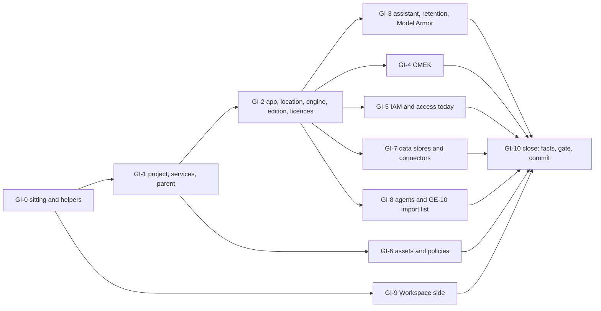

# 5. Gemini Enterprise inventory, read-only

## Status
- Owner: the platform owner
- Last reviewed: 2026-09-17
- Stage: review §2 stage 4 (GE-0 and GE-1 of [03 §16](../03-gemini-enterprise-environment.md#16-runbook-bringing-the-environment-to-baseline), extended). Runs any time from week one, in parallel with files 02, 03, 04 and 08.
- Step prefix: `GI`. 39 steps, none BLOCKED (no code is needed), none IRREVERSIBLE (nothing is written to the cloud or the tenant).
- Replaces: the GE-0 and GE-1 rows of 03 §16, step 1 of [topology §7.4](../../project-topology.md), and the D8 check of `wall-e/SETUP.md` §1.1. It keeps their intent (record the project, the number, the app and its location before anything regional) and drops 'Standard/Plus' (X-GE-18) and 'eu or global' (X-GE-13).
- Closes: S047 (the GE-0/GE-1 part), X-GE-01, X-GE-02, X-GE-03 and X-GE-10 (the inventory half; file 19 closes the write half), X-GE-13 (the stop at inventory), X-GE-18, X-GE-19 (one part deferred, §9).
- Every command, field, console path and role was read on Google's pages on 2026-09-15 (§10). Nothing here was run against the live tenant while writing.

---

## 1. What this part builds

Nothing in the cloud. It builds one directory of dated files, `GE_INVENTORY_DIR`, holding the
facts about the live Gemini Enterprise app that every later write depends on, and eight
variables in `~/.platform-env`. The review found that the baseline runbook could delete chat
history, cut today's users off, refuse services the app uses and bind a gateway blind, because
nobody had recorded what exists (X-GE-01 to X-GE-03, X-GE-10). This file records it first.

| Fact | Why a later file needs it | Step |
|---|---|---|
| The project, its number, its current parent and its organisation | the import, the move and every grant (19) | GI-1.2 to GI-1.5 |
| Every app in the project and the organisation, and the production app's location | stop unless `eu` (SD-21, D8); the gateway region (20, 35) | GI-2.1 |
| The engine's `features`, `modelConfigs`, `observabilityConfig`, `sessionConfig`, `cmekConfig`, `agentGatewaySetting` | the 'before' state for GE-6 and GE-10 | GI-2.2 |
| Edition (Standard, Plus, Pay-as-you-go, Frontline; stop on Business) | which Assistant settings exist at all (19) | GI-2.3 |
| Licences procured, distributed and assigned, and the 'Manage users' export | who has access today (19 GE-5) | GI-2.4, GI-2.5 |
| Identity provider | P51; a change loses chat history | GI-2.6 |
| Model Armor on the assistant, and the templates it names | the 'before' state for GE-7 | GI-3.1, GI-3.3 |
| Current chat-history retention | the floor GE-6 may never lower | GI-3.2 |
| `CmekConfig` state | the CMEK decision of 19 | GI-4.1 |
| Project IAM policy, the engine's IAM policy, inherited and deny policies, and a table of who reaches the app and how | the rollback files of GE-5; the roles lost on the move | GI-5.1 to GI-5.4 |
| Enabled services, Cloud Asset inventory, effective organisation policies | the `restrictServiceUsage` allow-list (19) | GI-1.3, GI-6.1 to GI-6.3 |
| Data stores and connectors, each with a decision against the future allow-list | the managed constraints act only at provisioning (19) | GI-7.1 to GI-7.3 |
| Every agent, endpoint, MCP server and existing gateway | the GE-10 import list (20) | GI-8.1 to GI-8.5 |
| Workspace service status and 'Allow Gemini Enterprise to access Google Workspace data', per OU and per group; Context-Aware Access visibility | the population gates; the robot OU (30) | GI-9.1 to GI-9.4 |



## 2. Preconditions

- [ ] `~/.platform-env` exists with its helpers `penv_set` and `need` (file `01-prerequisites-and-conventions.md`).
- [ ] `DOMAIN`, `ORG_ID`, `GE_LOCATION` (value `eu`), `BUILD_LOG_DIR`, `EVIDENCE_REGISTER`, `EVIDENCE_INTERIM_LOCATION`, `GCLOUD_CONFIG_NAME`, `WORKSPACE_EDITION` are set (01).
- [ ] The D8 row in the decision tracker of `03-decisions-and-people.md` reads 'eu only; a global or us app stops the build and opens a decision record' (SD-21). The stop rule below applies whether or not the row is signed yet.
- [ ] The operator's workstation has `gcloud`, `curl` (7.76 or later, for `--fail-with-body`), `jq`, `git` and `shasum`.
- [ ] gcloud is current and the `beta` component is installed (`gcloud components install beta`; `gcloud components list` shows it Installed). GI-8.3 uses the GA `gcloud agent-registry` group, which ships with gcloud itself, and GI-8.4 falls back to `beta`. An outdated gcloud errors with `Invalid choice`, which reads as an absent registry and silently shortens GI-8.5's import list.
- [ ] The operator's account holds, today, the Gemini Enterprise Admin role (`roles/discoveryengine.agentspaceAdmin`) on the app's project, and Workspace super admin or the Service Settings privilege. `roles/discoveryengine.viewer` alone is not enough: it lacks `discoveryengine.userStores.listUserLicenses` ([03 §4](../03-gemini-enterprise-environment.md#4-administration-who-holds-what-standing-or-elevated)).
- [ ] No change window is needed and no user is told: nothing here writes.

## 3. People and time

| Role | Who | Does | Present when |
|---|---|---|---|
| Platform owner, as today's Gemini Enterprise admin | The platform owner, signed in with the account that holds the role today (`OWNER_DAILY_ACCOUNT` until file 06 moves admin work to `sa-1-admin@`) | every step | throughout |
| Nobody else | — | — | — |

Hands-on about 3 hours in one sitting, plus 15 minutes on or after 2026-09-23 for GI-9.4.
Elapsed: one day, then the re-check.

## 4. Rules for this file

**Read-only.** The only verbs used are `describe`, `get-iam-policy`, `get-ancestors`,
`get-ancestors-iam-policy`, `list`, `search-all-*`, `org-policies describe` and HTTP `GET`.
In the Google Cloud console and the Admin console the operator opens pages and reads them;
never click **Save**, **Save and publish**, **Add key**, **Add identity provider**, **Override**
or **Enable**. If a read fails because an API is not enabled, record the failure; do not enable
the API (that is a write, and file 19 owns the project's services).

**One consequence to know.** Reads can leave `ADMIN_READ` Data Access audit entries where that
audit type is enabled. That is expected and harmless.

**Stop rules.** A stop does not end the sitting: finish the reads, because they inform the
decision. It blocks file 19, and GI-10.2 records it.

| Condition | Action | Recorded in |
|---|---|---|
| The project's organisation is not `ORG_ID` | STOP; open a decision record: the app sits in another organisation | GI-1.4 |
| No Gemini Enterprise app in `eu`, or the production app is in `global` or `us` | STOP; do not set `GEMINI_APP_ID` or `GEMINI_APP_LOCATION`; open `decisions/<date>-gemini-enterprise-app-location.md`: a new `eu` app is the only fix, and chat history and data stores do not move (SD-21) | GI-2.1 |
| More than one Gemini Enterprise app in the organisation | STOP; open a decision record naming the production app (P59: one production app) | GI-1.5, GI-2.1 |
| A Business or Business Starter subscription tier, or a tier outside the four editions | STOP; Google documents Business in a separate Help Center, and file 19's Cloud-console steps are not verified for it (X-GE-18) | GI-2.3 |
| The identity provider is not Google Identity | no stop; open a decision record (P51); never change it here, because a change loses chat history | GI-2.6 |

**Personal data.** The licence list and the 'Manage users' CSV name every user. They go under
`$GE_INVENTORY_DIR/restricted/`, which the build-log repository ignores, and a copy goes to
`EVIDENCE_INTERIM_LOCATION` by hand. Only their SHA-256 hashes and counts are committed. IAM
policies name administrators and groups; they are access records (TISAX 4.1-4.2) and are
committed.

**Secrets.** No step prints or stores a token. `gcloud auth print-access-token` is only used
inside a request header, which is Google's documented pattern on every page cited here.

**Hosts.** Google's locations page says to call `https://eu-discoveryengine.googleapis.com` for
`eu`, `https://us-discoveryengine.googleapis.com` for `us`, and
`https://global-discoveryengine.googleapis.com` (or `discoveryengine.googleapis.com`) for
`global`. The one exception Google's licences page shows is the billing-account call in GI-2.4,
which uses the global host.

**File names.** `<date>-<step-id>-<record>-v<n>.<ext>` under `GE_INVENTORY_DIR`. A re-run writes
the next `v<n>` and never overwrites.

---

## 5. The inventory files

The files file 19 and file 20 read. `D` stands for the date of the sitting.

| File (under `GE_INVENTORY_DIR`) | Step | Content | Read by |
|---|---|---|---|
| `D-GI-1.2-project-v1.json` | GI-1.2 | `gcloud projects describe` | 19 GE-2 |
| `D-GI-1.3-services-enabled-v1.json` | GI-1.3 | enabled services | 19 (allow-list union) |
| `D-GI-1.4-ancestors-v1.json` | GI-1.4 | parent chain | 19 GE-3 |
| `D-GI-1.5-org-engines-v1.json` | GI-1.5 | every Engine in the organisation | 19, 20 |
| `D-GI-2.1-engines-{eu,us,global}-v1.json` | GI-2.1 | apps per location | 19, 35 |
| `D-GI-2.2-engine-v1.json` | GI-2.2 | engine GET | 19 GE-6, 20 GE-10 (before state) |
| `D-GI-2.3-licence-configs-v1.json` | GI-2.3 | subscription tiers and counts | 19 GE-5, GE-6 |
| `restricted/D-GI-2.5-user-licences-v1.jsonl`, `restricted/D-GI-2.5-manage-users-export-v1.csv` | GI-2.5 | who holds a licence | 19 GE-5 (fill of `ge-users@`) |
| `D-GI-3.1-assistant-v1.json` | GI-3.1 | `customerPolicy`, grounding | 19 GE-6, GE-7 |
| `D-GI-3.2-retention-v1.md` | GI-3.2 | console retention value | 19 GE-6 |
| `D-GI-4.1-cmek-configs-v1.json` | GI-4.1 | `CmekConfig` list | 19 CMEK step |
| `D-GI-5.1-project-iam-v1.json` | GI-5.1 | project policy | 19 GE-5 rollback |
| `D-GI-5.2-engine-iam-v1.json` | GI-5.2 | app policy | 19 GE-5 rollback |
| `D-GI-5.3-ancestors-iam-v1.json` | GI-5.3 | inherited and deny policies | 19 GE-3 re-grants |
| `D-GI-5.4-access-today-v1.md` | GI-5.4 | who reaches the app and how | 19 GE-5 |
| `D-GI-6.2-assets-v1.json`, `D-GI-6.2-resource-iam-v1.json` | GI-6.2 | Cloud Asset search | 19 |
| `D-GI-6.3-org-policies-v1.json` | GI-6.3 | effective policies | 19 GE-4 |
| `D-GI-7.1-collections-{loc}-v1.json`, `D-GI-7.2-datastores-{loc}-v1.json`, `D-GI-7.3-datasource-decisions-v1.md` | GI-7 | data stores, connectors, decisions | 19 GE-4 |
| `D-GI-8.5-ge10-import-list-v1.csv` and its sources `D-GI-8.*` | GI-8 | agents, endpoints, MCP servers, gateways | 20 GE-9, GE-10 |
| `D-GI-9.1-service-status-v1.md`, `D-GI-9.2-workspace-data-access-v1.md`, `D-GI-9.3-caa-v1.md` | GI-9 | Workspace side | 19, 30 |
| `D-GI-10.2-facts-v1.md` | GI-10.2 | the fact sheet and the stop-gate record | 19 (entry check), README |
| `D-GI-10.1-manifest-v1.sha256` | GI-10.1 | hashes of every file, restricted included | 42 |

---

## 6. Steps

### GI-0 The sitting

#### GI-0.1 Open the shell and prove it has no default project

- **WHO:** platform owner. Solo.
- **WHERE:** the workstation shell.
- **ACTION:**
```bash
source ~/.platform-env
gcloud config configurations activate "$GCLOUD_CONFIG_NAME"
test -z "$(gcloud config get project 2>/dev/null)" || { echo "STOP: configuration has a default project"; false; }
need DOMAIN ORG_ID GE_LOCATION BUILD_LOG_DIR EVIDENCE_REGISTER EVIDENCE_INTERIM_LOCATION WORKSPACE_EDITION
test "$GE_LOCATION" = "eu" || { echo "STOP: GE_LOCATION must be eu (SD-21)"; false; }
gcloud auth login
gcloud auth list --filter=status:ACTIVE --format='value(account)'
```
- **VERIFY:** the guard prints nothing; `need` returns 0; the last command prints the one account that holds the Gemini Enterprise Admin role today.
- **ROLLBACK:** none needed; nothing is created. `gcloud auth revoke` closes the sitting (GI-10.3).
- **EVIDENCE:** none yet; the account name goes into the fact sheet in GI-10.2.

#### GI-0.2 Create the inventory directory and the sitting helpers

- **WHO:** platform owner. Solo.
- **WHERE:** shell with `~/.platform-env` sourced.
- **ACTION:**
```bash
penv_set GE_INVENTORY_DIR "$BUILD_LOG_DIR/ge-inventory"
mkdir -p "$GE_INVENTORY_DIR/restricted"
grep -qxF 'ge-inventory/restricted/' "$BUILD_LOG_DIR/.gitignore" 2>/dev/null || printf '%s\n' 'ge-inventory/restricted/' >> "$BUILD_LOG_DIR/.gitignore"
cat > "$GE_INVENTORY_DIR/gi-helpers.sh" <<'EOF'
GI_DATE="$(date -u +%F)"
gi_path() { local dir="$1" step="$2" rec="$3" ext="$4" n=1; while [ -e "$dir/${GI_DATE}-${step}-${rec}-v${n}.${ext}" ]; do n=$((n+1)); done; printf '%s\n' "$dir/${GI_DATE}-${step}-${rec}-v${n}.${ext}"; }
gi_file() { gi_path "$GE_INVENTORY_DIR" "$@"; }
gi_rfile() { gi_path "$GE_INVENTORY_DIR/restricted" "$@"; }
ge_host() { case "$1" in eu) echo https://eu-discoveryengine.googleapis.com;; us) echo https://us-discoveryengine.googleapis.com;; global) echo https://global-discoveryengine.googleapis.com;; esac; }
ge_get() { curl -sS --fail-with-body -H "Authorization: Bearer $(gcloud auth print-access-token)" -H "X-Goog-User-Project: ${GEMINI_PROJECT}" "$1"; }
gi_done() { printf '%s\t%s\t%s\n' "$(date -u +%FT%TZ)" "$1" "${2:-done}" >> "$BUILD_LOG_DIR/05-gemini-enterprise-inventory.log"; }
gi_evidence() { printf '%s\t%s\t%s\t%s\t%s\n' "$(date -u +%F)" "$1" "$2" "$3" "$4" >> "$EVIDENCE_REGISTER"; }
EOF
source "$GE_INVENTORY_DIR/gi-helpers.sh"
gi_done GI-0.2
```
- **VERIFY:** `type gi_file gi_rfile ge_host ge_get gi_done gi_evidence` names six functions; `git -C "$BUILD_LOG_DIR" check-ignore "$GE_INVENTORY_DIR/restricted/x"` prints the path.
- **ROLLBACK:** none needed. On resume, run only the `source` line.
- **EVIDENCE:** none. `Assumption:` the evidence register columns are date, step, record, E-id, TISAX id; if 01 defines another order, 01 wins and `gi_evidence` is edited to match.

### GI-1 The project

#### GI-1.1 Find the app's project in the console

- **WHO:** platform owner. Solo.
- **WHERE:** Google Cloud console → **Gemini Enterprise** page (search 'Gemini Enterprise'), then the project selector.
- **ACTION:** pick each project the selector offers until the Gemini Enterprise page lists the tenant's app. Note the project id and, for each app shown, its name and location. Do not open **Create app**.
```bash
GI_CANDIDATE_PROJECT="<project id read in the console>"
```
- **VERIFY:** the page lists at least one app in that project.
- **ROLLBACK:** none needed.
- **EVIDENCE:** a screenshot `screencapture -i "$(gi_file GI-1.1 console-apps png)"`.

#### GI-1.2 Describe the project and record its id and number

- **WHO:** platform owner. Solo.
- **WHERE:** shell.
- **ACTION:**
```bash
f="$(gi_file GI-1.2 project json)"
gcloud projects describe "$GI_CANDIDATE_PROJECT" --format=json > "$f"
penv_set GEMINI_PROJECT "$(jq -r .projectId "$f")"
penv_set GEMINI_PROJECT_NUMBER "$(jq -r .projectNumber "$f")"
jq -r '.lifecycleState, (.parent.type // "none"), (.parent.id // "none"), (.labels // {} | tostring)' "$f"
gi_done GI-1.2
```
- **VERIFY:** `lifecycleState` is `ACTIVE`; `GEMINI_PROJECT_NUMBER` is all digits (`[[ "$GEMINI_PROJECT_NUMBER" =~ ^[0-9]+$ ]]`).
- **ROLLBACK:** none needed. If the wrong project was chosen, `penv_set` refuses the correction without `--force`; use `--force` and write the reason in the build log.
- **EVIDENCE:** `gi_evidence GI-1.2 "$f" E-11 "TISAX 1.3"`.

#### GI-1.3 List the enabled services

- **WHO:** platform owner. Solo.
- **WHERE:** shell.
- **ACTION:**
```bash
f="$(gi_file GI-1.3 services-enabled json)"
gcloud services list --enabled --project="$GEMINI_PROJECT" --format=json > "$f"
jq -r '.[].config.name' "$f" | sort
jq -r '.[].config.name' "$f" | grep -qx cloudasset.googleapis.com && echo "cloudasset enabled" || echo "cloudasset NOT enabled"
gi_done GI-1.3
```
- **VERIFY:** the list contains `discoveryengine.googleapis.com`. The last line tells GI-1.5 and GI-6.2 whether they can run from this project.
- **ROLLBACK:** none needed.
- **EVIDENCE:** `gi_evidence GI-1.3 "$f" E-11 "TISAX 1.3"`. File 19 builds the `gcp.restrictServiceUsage` allow-list as the union of this list and the design list, keeping only services Google lists as governed by that constraint (X-GE-03).

#### GI-1.4 Record the current parent and the organisation

- **WHO:** platform owner. Solo.
- **WHERE:** shell.
- **ACTION:**
```bash
f="$(gi_file GI-1.4 ancestors json)"
gcloud projects get-ancestors "$GEMINI_PROJECT" --format=json > "$f"
jq -r '.[] | "\(.type)\t\(.id)"' "$f"
p="$(ls -t "$GE_INVENTORY_DIR"/*-GI-1.2-project-v*.json | head -1)"
ptype="$(jq -r '.parent.type // "none"' "$p")"
pid="$(jq -r '.parent.id // "none"' "$p")"
case "$ptype" in
  organization) penv_set GE_CURRENT_PARENT "organizations/$pid";;
  folder) penv_set GE_CURRENT_PARENT "folders/$pid";;
  *) echo "STOP: project has no organisation parent"; gi_done GI-1.4 "STOP: no organisation parent"; false;;
esac
if need GE_CURRENT_PARENT; then
  jq -r --arg o "$ORG_ID" '[.[] | select(.type=="organization")][0].id == $o' "$f"
  gi_done GI-1.4
fi
```
- **VERIFY:** `GE_CURRENT_PARENT` reads `organizations/<digits>` or `folders/<digits>`; the last `jq` prints `true`. `false` is a stop (§4): the app sits in another organisation. An **unset** `GE_CURRENT_PARENT` is itself the stop: the `case` default records `STOP: no organisation parent` in the build log, returns non-zero and skips the comparison, and GI-10.2 carries it into the fact sheet's `ORG:` gate line as `STOP: <decision record path>`. Never continue past this step with the variable empty; the `jq` comparison below it is meaningless without a parent.
- **ROLLBACK:** none needed.
- **EVIDENCE:** `gi_evidence GI-1.4 "$f" E-11 "TISAX 1.3"`. The move of file 19 loses every role granted on this parent chain ('Roles granted at the source organization or folder level are lost', project-migration page); GI-5.3 records those roles.

#### GI-1.5 Search the organisation for every Gemini Enterprise engine

- **WHO:** platform owner. Solo.
- **WHERE:** shell.
- **ACTION:** run only if GI-1.3 printed 'cloudasset enabled'; Cloud Asset Inventory commands need the API enabled in the project they run from.
```bash
f="$(gi_file GI-1.5 org-engines json)"
gcloud asset search-all-resources --scope="organizations/$ORG_ID" --asset-types="discoveryengine.googleapis.com/Engine" --billing-project="$GEMINI_PROJECT" --format=json > "$f"
jq -r '.[] | "\(.project)\t\(.location)\t\(.name)"' "$f"
gi_done GI-1.5
```
If 'cloudasset NOT enabled', or the call returns `PERMISSION_DENIED`, run nothing else and record the gap:
```bash
gi_done GI-1.5 "PENDING: org-wide Engine search not run (cloudasset not enabled in GEMINI_PROJECT or no org permission); re-run from CORE_PROJECT in file 19 before GE-2"
```
- **VERIFY:** every row belongs to `GEMINI_PROJECT`, or the other rows are search or other non-assistant engines that GI-2.1's `appType` check will classify. A second project holding an engine is written into the fact sheet.
- **ROLLBACK:** none needed.
- **EVIDENCE:** `gi_evidence GI-1.5 "$f" E-11 "TISAX 1.3"`.

### GI-2 The app, its location, edition and licences

#### GI-2.1 List the apps in every location and apply the location stop

- **WHO:** platform owner. Solo.
- **WHERE:** shell.
- **ACTION:**
```bash
for loc in eu us global; do f="$(gi_file GI-2.1 engines-$loc json)"; ge_get "$(ge_host $loc)/v1/projects/$GEMINI_PROJECT/locations/$loc/collections/default_collection/engines" > "$f" || echo "read failed for $loc (body kept in $f)"; done
for loc in eu us global; do echo "== $loc"; jq -r '.engines[]? | "\(.name)\t\(.displayName)\t\(.appType // "none")\t\(.solutionType // "none")"' "$(ls -t "$GE_INVENTORY_DIR"/*-GI-2.1-engines-$loc-v*.json | head -1)"; done
```
A Gemini Enterprise app is an engine whose `appType` is `APP_TYPE_INTRANET` (licences page). Count those per location. If exactly one is in `eu` and it is the app of GI-1.1:
```bash
APP_NAME="$(jq -r '[.engines[]? | select(.appType=="APP_TYPE_INTRANET")][0].name' "$(ls -t "$GE_INVENTORY_DIR"/*-GI-2.1-engines-eu-v*.json | head -1)")"
penv_set GEMINI_APP_ID "${APP_NAME##*/}"
penv_set GEMINI_APP_LOCATION eu
gi_done GI-2.1
```
Otherwise do not set either variable; write the stop:
```bash
gi_done GI-2.1 "STOP: production app not a single eu app; decision record opened"
```
- **VERIFY:** `test "$GEMINI_APP_LOCATION" = "$GE_LOCATION"`; `need GEMINI_APP_ID`. On a stop, the decision record `decisions/<date>-gemini-enterprise-app-location.md` exists and names the locations found, the fix (a new `eu` app) and what does not move (chat history, data stores).
- **ROLLBACK:** none needed.
- **EVIDENCE:** `gi_evidence GI-2.1 <each file> E-11 "TISAX 7.1"` (residency).

#### GI-2.2 Read the engine: features, models, logging, sessions, CMEK, gateway

- **WHO:** platform owner. Solo.
- **WHERE:** shell.
- **ACTION:**
```bash
need GEMINI_APP_ID
f="$(gi_file GI-2.2 engine json)"
ge_get "$(ge_host eu)/v1/projects/$GEMINI_PROJECT/locations/eu/collections/default_collection/engines/$GEMINI_APP_ID" > "$f"
jq '{name, displayName, appType, industryVertical, disableAnalytics, features, modelConfigs, observabilityConfig, sessionConfig, cmekConfig, agentGatewaySetting, marketplaceAgentVisibility}' "$f"
gi_done GI-2.2
```
- **VERIFY:** `.name` ends with `/engines/$GEMINI_APP_ID`. Record in the fact sheet: `agentGatewaySetting` present or absent; `observabilityConfig.sensitiveLoggingEnabled` (true means prompts and responses are logged, REST reference); `sessionConfig.sessionTtl.days` or unset (unset means 60 days, REST reference); whether `cmekConfig` is present.
- **ROLLBACK:** none needed.
- **EVIDENCE:** `gi_evidence GI-2.2 "$f" E-11 "TISAX 5.2"`. This file is the 'before' GET that GE-6 and GE-10 compare against.

#### GI-2.3 Read the subscriptions distributed to the project and set the edition

- **WHO:** platform owner. Solo.
- **WHERE:** shell.
- **ACTION:**
```bash
f="$(gi_file GI-2.3 licence-configs json)"
ge_get "$(ge_host eu)/v1/projects/$GEMINI_PROJECT/locations/eu/licenseConfigs" > "$f"
jq -r '.licenseConfigs[]? | "\(.name)\t\(.subscriptionTier)\t\(.licenseCount)\t\(.state)\t\(.startDate|tostring)\t\(.endDate|tostring)\t\(.freeTrial // false)"' "$f"
```
Map each `subscriptionTier` with Google's enum descriptions:

| `subscriptionTier` | Google's description | Edition | Action |
|---|---|---|---|
| `SUBSCRIPTION_TIER_ENTERPRISE`, `SUBSCRIPTION_TIER_ENTERPRISE_EMERGING` | Gemini Enterprise Standard tier | Standard | continue |
| `SUBSCRIPTION_TIER_SEARCH_AND_ASSISTANT` | Gemini Enterprise Plus tier | Plus | continue |
| `SUBSCRIPTION_TIER_CONSUMPTION_ONLY` | Consumption-only tier, billed on usage (PAYG) | Pay-as-you-go | continue |
| `SUBSCRIPTION_TIER_FRONTLINE_WORKER`, `SUBSCRIPTION_TIER_FRONTLINE_STARTER` | Gemini Frontline worker / starter tier | Frontline | continue (`Assumption:` Starter belongs to the Frontline edition) |
| `SUBSCRIPTION_TIER_AGENTSPACE_BUSINESS`, `SUBSCRIPTION_TIER_AGENTSPACE_STARTER` | Gemini Business tier / Business Starter tier | Business | **STOP** (§4) |
| any other (`SEARCH`, `NOTEBOOK_LM`, `EDU*`) | not one of the four editions this set covers | — | **STOP**; decision record |

With no stop, set the edition. Where tiers are mixed, record every tier and set the highest in the order Plus, Standard, Frontline, Pay-as-you-go (`Assumption:` Assistant-tab availability follows the app's highest tier; GI-3.2 reads the console to confirm):
```bash
penv_set GE_EDITION "<Standard|Plus|Pay-as-you-go|Frontline>"
gi_done GI-2.3
```
- **VERIFY:** `GE_EDITION` is one of the four values; the fact sheet lists every tier with its `licenseCount` and `state`.
- **ROLLBACK:** none needed.
- **EVIDENCE:** `gi_evidence GI-2.3 "$f" E-11 "TISAX 6.1"`.

#### GI-2.4 Record the licences procured on the billing account

- **WHO:** platform owner. Solo; if the account lacks access to the subscription's billing account, the billing administrator of that account reads the console page on a shared screen and the operator records.
- **WHERE:** Google Cloud console → **Gemini Enterprise** → **Manage subscriptions** → select the **Billing account** → the **Gemini Subscriptions** table → each subscription name.
- **ACTION:** for each subscription record: name, edition, number of licences, subscription period, auto-renew, and the distribution (project and location). Then, with the billing account id read from that page (a local variable, not a secret):
```bash
GI_GE_BILLING_ACCOUNT="<billing account id shown on Manage subscriptions>"
f="$(gi_file GI-2.4 billing-licence-configs json)"
curl -sS --fail-with-body -H "Authorization: Bearer $(gcloud auth print-access-token)" -H "Content-Type: application/json" -H "X-Goog-User-Project: $GEMINI_PROJECT_NUMBER" "https://discoveryengine.googleapis.com/v1alpha/billingAccounts/$GI_GE_BILLING_ACCOUNT/billingAccountLicenseConfigs" > "$f" || echo "read refused; console record stands"
gi_done GI-2.4
```
- **VERIFY:** the fact sheet has three distinct licence figures: seats procured (this step), licences distributed to `GEMINI_PROJECT`/`eu` (the subscription's distribution on this page, cross-checked with `licenseCount` from GI-2.3), and users assigned (GI-2.5).
- **ROLLBACK:** none needed.
- **EVIDENCE:** a screenshot of the subscriptions table `screencapture -i "$(gi_file GI-2.4 subscriptions png)"`; `gi_evidence GI-2.4 "$f" E-11 "TISAX 6.1"`.

#### GI-2.5 Export the licence list and count who is assigned

- **WHO:** platform owner. Solo.
- **WHERE:** shell, then Google Cloud console → **Gemini Enterprise** → **Manage users** → select the multi-region **eu** → **Export all users**.
- **ACTION:** the API list, all pages, into the restricted directory:
```bash
out="$(gi_rfile GI-2.5 user-licences jsonl)"; tok=""
while :; do q="pageSize=1000"; [ -n "$tok" ] && q="$q&pageToken=$(jq -rn --arg t "$tok" '$t|@uri')"; resp="$(ge_get "$(ge_host eu)/v1/projects/$GEMINI_PROJECT/locations/eu/userStores/default_user_store/userLicenses?$q")" || { echo "read failed"; break; }; printf '%s' "$resp" | jq -c '.userLicenses[]?' >> "$out"; tok="$(printf '%s' "$resp" | jq -r '.nextPageToken // empty')"; [ -z "$tok" ] && break; done
jq -r '.licenseAssignmentState' "$out" | sort | uniq -c
```
Then click **Export all users** (the button is hidden when nobody is assigned) and move the download:
```bash
csv="$(ls -t ~/Downloads/*.csv | head -1)"
head -1 "$csv"
mv "$csv" "$(gi_rfile GI-2.5 manage-users-export csv)"
awk -F, 'NR>1{print $NF}' "$(ls -t "$GE_INVENTORY_DIR"/restricted/*-GI-2.5-manage-users-export-v*.csv | head -1)" | sort | uniq -c
gi_done GI-2.5
```
- **VERIFY:** the CSV header contains `user_principal`, `license_config` and `license_assignment_state` (licences page). If `license_assignment_state` is not the last column, count it by its header position instead of `$NF`. The `ASSIGNED` count from the API equals the `ASSIGNED` count from the CSV; a difference is written in the fact sheet, not resolved here.
- **ROLLBACK:** none needed.
- **EVIDENCE:** only the counts and the SHA-256 of both files go in the fact sheet and the manifest (GI-10.1). Both files are uploaded by hand to `EVIDENCE_INTERIM_LOCATION`; `gi_evidence GI-2.5 "restricted (hash in manifest)" E-11 "TISAX 4.1-4.2"`. File 19 fills `ge-users@` from this list and checks the count before any removal (X-GE-02).

#### GI-2.6 Read the identity provider

- **WHO:** platform owner. Solo.
- **WHERE:** Google Cloud console → **Gemini Enterprise** → **Settings** → **Authentication**.
- **ACTION:** read the provider type shown for the `eu` location. Do not click **Add identity provider**.
- **VERIFY:** the fact sheet reads 'Google Identity' (P51) or names the other type, with a decision record opened (§4).
- **ROLLBACK:** none needed.
- **EVIDENCE:** `screencapture -i "$(gi_file GI-2.6 authentication png)"`; `gi_evidence GI-2.6 <png> E-11 "TISAX 4.1-4.2"`.

### GI-3 The assistant

#### GI-3.1 Read the assistant's customer policy and grounding

- **WHO:** platform owner. Solo.
- **WHERE:** shell.
- **ACTION:**
```bash
f="$(gi_file GI-3.1 assistant json)"
ge_get "$(ge_host eu)/v1/projects/$GEMINI_PROJECT/locations/eu/collections/default_collection/engines/$GEMINI_APP_ID/assistants/default_assistant" > "$f"
jq '{name, googleSearchGroundingEnabled, webGroundingType, defaultWebGroundingToggleOff, modelArmor: .customerPolicy.modelArmorConfig, bannedPhraseCount: (.customerPolicy.bannedPhrases // [] | length), dataProtectionPolicy: .customerPolicy.dataProtectionPolicy}' "$f"
gi_done GI-3.1
```
- **VERIFY:** the fact sheet records whether `modelArmorConfig` is set, the two template names, and `failureMode` (unspecified means FAIL_CLOSED, REST reference), plus the grounding values. Cross-check in the console: **Gemini Enterprise** → the app → **Configurations** → **Assistant**, the **Enable Model Armor** toggle, without saving.
- **ROLLBACK:** none needed.
- **EVIDENCE:** `gi_evidence GI-3.1 "$f" E-11 "TISAX 5.2"`. Any later API write to `customerPolicy` must write `bannedPhrases` and `modelArmorConfig` together (X-GE-17, file 19); this file is what it starts from.

#### GI-3.2 Read the current chat-history retention and set the floor

- **WHO:** platform owner. Solo.
- **WHERE:** Google Cloud console → **Gemini Enterprise** → the app → **Configurations** → **Assistant** tab → section **Chat history retention period**.
- **ACTION:** read the selected value (Google offers 1, 30, 60, 90, 120 or 180 days; default 60). Do not change it and do not click **Save and publish**: a lower value deletes every chat older than it, counted from creation, without warning, and Google documents no recovery (X-GE-01). Then:
```bash
api_days="$(jq -r '.sessionConfig.sessionTtl.days // "unset"' "$(ls -t "$GE_INVENTORY_DIR"/*-GI-2.2-engine-v*.json | head -1)")"
echo "API sessionTtl.days: $api_days"
CONSOLE_DAYS="<value read in the console, or hidden>"
```
Set the floor by this rule: if the section shows, take the console value; if the edition hides it, take `sessionTtl.days`, or 60 when unset (REST reference: 'If unset, the default value is 60 days'); if the console and the API disagree, take the larger. `Assumption:` `sessionConfig.sessionTtl` is the field behind the console setting; Google does not map the two.
```bash
penv_set GE_RETENTION_CURRENT_DAYS "<integer per the rule>"
f="$(gi_file GI-3.2 retention md)"
printf '# Retention read %s\n\n| Source | Value |\n|---|---|\n| Console, Chat history retention period | %s |\n| Engine sessionConfig.sessionTtl.days | %s |\n| GE_RETENTION_CURRENT_DAYS (floor) | %s |\n| Edition | %s |\n' "$GI_DATE" "$CONSOLE_DAYS" "$api_days" "$GE_RETENTION_CURRENT_DAYS" "$GE_EDITION" > "$f"
gi_done GI-3.2
```
- **VERIFY:** `[[ "$GE_RETENTION_CURRENT_DAYS" =~ ^[0-9]+$ ]]`; the value is one of 1, 30, 60, 90, 120, 180, or the API value if it differs, with the difference noted.
- **ROLLBACK:** none needed.
- **EVIDENCE:** `screencapture -i "$(gi_file GI-3.2 retention png)"`; `gi_evidence GI-3.2 "$f" E-11 "TISAX 7.1"`. File 19's GE-6 may keep or raise this value, never lower it; a reduction is its own later step after P13 with notice to users one retention period ahead (SD-20).

#### GI-3.3 Read the Model Armor templates the assistant names

- **WHO:** platform owner. Solo.
- **WHERE:** shell.
- **ACTION:** for each template name recorded in GI-3.1 (`projects/<p>/locations/<loc>/templates/<t>`), read it on the endpoint of its own location; then list the templates in `GEMINI_PROJECT` at `eu`:
```bash
for t in $(jq -r '.customerPolicy.modelArmorConfig | (.userPromptTemplate // empty), (.responseTemplate // empty)' "$(ls -t "$GE_INVENTORY_DIR"/*-GI-3.1-assistant-v*.json | head -1)"); do loc="$(printf '%s' "$t" | cut -d/ -f4)"; tp="$(printf '%s' "$t" | cut -d/ -f2)"; f="$(gi_file GI-3.3 template-${t##*/} json)"; curl -sS --fail-with-body -H "Authorization: Bearer $(gcloud auth print-access-token)" -H "X-Goog-User-Project: $tp" "https://modelarmor.$loc.rep.googleapis.com/v1/$t" > "$f" || echo "read failed: $t"; done
f="$(gi_file GI-3.3 templates-eu json)"
curl -sS --fail-with-body -H "Authorization: Bearer $(gcloud auth print-access-token)" -H "X-Goog-User-Project: $GEMINI_PROJECT" "https://modelarmor.eu.rep.googleapis.com/v1/projects/$GEMINI_PROJECT/locations/eu/templates" > "$f" || echo "list failed (Model Armor API may not be enabled)"
gi_done GI-3.3
```
- **VERIFY:** each named template reads back, and its location is `eu` (the template and app locations must match, Model Armor integration page). A template in another location, or none, is a fact-sheet line for GE-7.
- **ROLLBACK:** none needed.
- **EVIDENCE:** `gi_evidence GI-3.3 <files> E-11 "TISAX 5.2"`.

### GI-4 Encryption

#### GI-4.1 Read the CmekConfig state

- **WHO:** platform owner. Solo.
- **WHERE:** shell, then Google Cloud console → **Gemini Enterprise** → **Settings** → **CMEK** tab.
- **ACTION:**
```bash
f="$(gi_file GI-4.1 cmek-configs json)"
ge_get "$(ge_host eu)/v1/projects/$GEMINI_PROJECT/locations/eu/cmekConfigs" > "$f"
jq -r '.cmekConfigs[]? | "\(.name)\t\(.kmsKey)\t\(.state)\t\(.isDefault)\t\(.singleRegionKeys // [] | length)"' "$f"
jq '.cmekConfig // "absent"' "$(ls -t "$GE_INVENTORY_DIR"/*-GI-2.2-engine-v*.json | head -1)"
gi_done GI-4.1
```
Read the CMEK tab's configuration status for `eu`; do not click **Add key**.
- **VERIFY:** the fact sheet records one of: no `CmekConfig`; registered, not default; registered and default (`isDefault: true`), with the key name. The engine's own `cmekConfig` (output only) says whether the app itself is protected; 03 §5.2 assumes it is not.
- **ROLLBACK:** none needed.
- **EVIDENCE:** `gi_evidence GI-4.1 "$f" E-11 "TISAX 5.1"`. File 19 takes the CMEK decision with this state in hand (X-GE-05).

### GI-5 Access today

#### GI-5.1 Export the project IAM policy

- **WHO:** platform owner. Solo.
- **WHERE:** shell.
- **ACTION:**
```bash
f="$(gi_file GI-5.1 project-iam json)"
gcloud projects get-iam-policy "$GEMINI_PROJECT" --format=json > "$f"
jq -r '.bindings[] | select(.role|test("discoveryengine|^roles/(owner|editor|viewer)$")) | .role as $r | .members[] | "\($r)\t\(.)"' "$f"
jq -r --arg d "@$DOMAIN" '.bindings[].members[] | select((test($d+"$")|not) and (test("gserviceaccount.com$")|not))' "$f" | sort -u
gi_done GI-5.1
```
- **VERIFY:** the file has an `etag`. The second list (members outside `DOMAIN` that are not service accounts) is written in the fact sheet; each is explained or flagged.
- **ROLLBACK:** none needed.
- **EVIDENCE:** `gi_evidence GI-5.1 "$f" E-11 "TISAX 4.1-4.2"`. This is the project-level rollback file of GE-5.

#### GI-5.2 Export the app's IAM policy

- **WHO:** platform owner. Solo.
- **WHERE:** shell.
- **ACTION:**
```bash
f="$(gi_file GI-5.2 engine-iam json)"
ge_get "$(ge_host eu)/v1/projects/$GEMINI_PROJECT/locations/eu/collections/default_collection/engines/$GEMINI_APP_ID:getIamPolicy" > "$f"
jq -r '.bindings[]? | .role as $r | .members[] | "\($r)\t\(.)"' "$f"
gi_done GI-5.2
```
- **VERIFY:** the response has an `etag`; an empty `bindings` is a valid answer and is written as 'no app-level binding'.
- **ROLLBACK:** none needed.
- **EVIDENCE:** `gi_evidence GI-5.2 "$f" E-11 "TISAX 4.1-4.2"`. This is the app-level rollback file of GE-5.

#### GI-5.3 Export inherited and deny policies

- **WHO:** platform owner. Solo.
- **WHERE:** shell.
- **ACTION:**
```bash
f="$(gi_file GI-5.3 ancestors-iam json)"
gcloud projects get-ancestors-iam-policy "$GEMINI_PROJECT" --include-deny --format=json > "$f" || echo "PERMISSION_DENIED on an ancestor: record it"
jq -r '.[] | select(.type!="project") | .id as $id | .type as $t | (.policy.bindings // [])[] | .role as $r | .members[] | "\($t)/\($id)\t\($r)\t\(.)"' "$f"
gi_done GI-5.3
```
- **VERIFY:** the file lists the organisation and every folder of GI-1.4. If an ancestor's policy is refused, write `gi_done GI-5.3 "PENDING: ancestor IAM not readable; re-run in file 19 before GE-3 with the file 06 admin account"`.
- **ROLLBACK:** none needed.
- **EVIDENCE:** `gi_evidence GI-5.3 "$f" E-11 "TISAX 4.1-4.2"`. File 19 re-grants on the destination folder every inherited role the app still needs before the move (X-GE-03).

#### GI-5.4 Write who reaches the app today, and how

- **WHO:** platform owner. Solo.
- **WHERE:** shell.
- **ACTION:** for each group that holds a `discoveryengine` role in GI-5.1, GI-5.2 or GI-5.3, count its members (counts only):
```bash
for g in $(cat "$(ls -t "$GE_INVENTORY_DIR"/*-GI-5.1-project-iam-v*.json | head -1)" "$(ls -t "$GE_INVENTORY_DIR"/*-GI-5.2-engine-iam-v*.json | head -1)" | jq -r '.bindings[]? | select(.role|test("discoveryengine")) | .members[] | select(startswith("group:")) | sub("^group:";"")' | sort -u); do printf '%s\t%s\n' "$g" "$(gcloud identity groups memberships list --group-email="$g" --format='value(name)' | wc -l | tr -d ' ')"; done
f="$(gi_file GI-5.4 access-today md)"
```
Write `$f` as a table with one row per path to the app:

| Path | Principal | Role | Level | Member count | Licence holders among them |
|---|---|---|---|---|---|
| project binding | *from GI-5.1* | `agentspaceUser`, `agentspaceAdmin`, `editor`, `viewer` or basic | project | | |
| app binding | *from GI-5.2* | `agentspaceUser` | app | | |
| inherited | *from GI-5.3* | | organisation or folder | | |
| licence only | — | — | — | ASSIGNED count from GI-2.5 | |

- **VERIFY:** every `discoveryengine` or basic-role binding of GI-5.1 to GI-5.3 appears in one row; the sentence under the table says which path today's users rely on ('Project-level IAM permissions take precedence over app-level policies', iam-policy-for-apps page).
- **ROLLBACK:** none needed.
- **EVIDENCE:** `gi_evidence GI-5.4 "$f" E-11 "TISAX 4.1-4.2"`.

### GI-6 Assets and policies

#### GI-6.1 Confirm the services list is current

- **WHO:** platform owner. Solo.
- **WHERE:** shell.
- **ACTION:** if the newest GI-1.3 file was written on an earlier day, re-run GI-1.3's command now, so that the services list and the asset inventory share a date. The `case` decides; it does not ask the operator to remember. `GI_DATE` is set when `gi-helpers.sh` is sourced, so a resumed sitting re-sources it first (GI-0.2 ROLLBACK).
```bash
newest="$(ls -t "$GE_INVENTORY_DIR"/*-GI-1.3-services-enabled-v*.json | head -1)"
case "$(basename "$newest")" in
  "$GI_DATE"-*) echo "GI-1.3 already carries $GI_DATE; not re-run";;
  *) newest="$(gi_file GI-1.3 services-enabled json)"; gcloud services list --enabled --project="$GEMINI_PROJECT" --format=json > "$newest"; echo "GI-1.3 re-run into $newest";;
esac
jq -r '.[].config.name' "$newest" | sort
jq -r '.[].config.name' "$newest" | wc -l
jq -r '.[].config.name' "$newest" | grep -qx cloudasset.googleapis.com && echo "cloudasset enabled" || echo "cloudasset NOT enabled"
gi_done GI-6.1
```
- **VERIFY:** `basename "$(ls -t "$GE_INVENTORY_DIR"/*-GI-1.3-services-enabled-v*.json | head -1)"` starts with today's date. The count printed is the number of services file 19 unions with the design list; the `cloudasset` line is re-read here because GI-6.2 and GI-1.5 depend on it and the answer can have changed since GI-1.3.
- **ROLLBACK:** none needed.
- **EVIDENCE:** as GI-1.3. If the list was re-run, record the new file too: `gi_evidence GI-6.1 "$newest" E-11 "TISAX 1.3"`, and note in the fact sheet that file 19's allow-list union must read this file, not the earlier one — a stale list can refuse a service the app uses (X-GE-03).

#### GI-6.2 Take the Cloud Asset inventory of the project

- **WHO:** platform owner. Solo.
- **WHERE:** shell.
- **ACTION:** only if GI-1.3 printed 'cloudasset enabled'; otherwise record `gi_done GI-6.2 "PENDING: asset search not run; re-run from CORE_PROJECT in file 19 before GE-3"`.
```bash
f="$(gi_file GI-6.2 assets json)"
gcloud asset search-all-resources --scope="projects/$GEMINI_PROJECT" --billing-project="$GEMINI_PROJECT" --format=json > "$f"
jq -r '.[].assetType' "$f" | sort | uniq -c
g="$(gi_file GI-6.2 resource-iam json)"
gcloud asset search-all-iam-policies --scope="projects/$GEMINI_PROJECT" --billing-project="$GEMINI_PROJECT" --format=json > "$g"
jq -r '.[] | "\(.assetType)\t\(.resource)"' "$g" | sort -u
gi_done GI-6.2
```
- **VERIFY:** the asset types include `discoveryengine.googleapis.com/Engine`; each asset type's service is in GI-1.3's list. A service with assets that is not enabled, or enabled with no assets, is a fact-sheet line.
- **ROLLBACK:** none needed.
- **EVIDENCE:** `gi_evidence GI-6.2 "$f" E-11 "TISAX 1.3"`; `gi_evidence GI-6.2 "$g" E-11 "TISAX 4.1-4.2"`.

#### GI-6.3 Read the effective organisation policies that file 19 will change

- **WHO:** platform owner. Solo.
- **WHERE:** shell.
- **ACTION:**
```bash
f="$(gi_file GI-6.3 org-policies json)"
{ echo '{'; for c in gcp.restrictServiceUsage gcp.resourceLocations discoveryengine.managed.allowedDataSources discoveryengine.managed.allowedEgressFqdns; do printf '"%s": ' "$c"; gcloud org-policies describe "$c" --project="$GEMINI_PROJECT" --effective --format=json 2>&1 | jq -Rs 'try fromjson catch .'; printf ',\n'; done; printf '"set_on_project": '; gcloud org-policies list --project="$GEMINI_PROJECT" --format=json 2>&1 | jq -Rs 'try fromjson catch .'; echo '}'; } > "$f"
jq 'keys' "$f"
gi_done GI-6.3
```
- **VERIFY:** `jq . "$f"` parses; each constraint has either a policy or the error text Google returned (a refused constraint name is recorded, not guessed around).
- **ROLLBACK:** none needed.
- **EVIDENCE:** `gi_evidence GI-6.3 "$f" E-11 "TISAX 5.2"`.

### GI-7 Data stores and connectors

#### GI-7.1 List collections and their connectors

- **WHO:** platform owner. Solo.
- **WHERE:** shell.
- **ACTION:**
```bash
for loc in eu us global; do f="$(gi_file GI-7.1 collections-$loc json)"; ge_get "$(ge_host $loc)/v1alpha/projects/$GEMINI_PROJECT/locations/$loc/collections" > "$f" || echo "read failed for $loc"; jq -r --arg l "$loc" '.collections[]? | "\($l)\t\(.name)\t\(.displayName)\t\(.dataConnector.dataSource // "no connector")\t\(.dataConnector.state // "")"' "$f"; done
gi_done GI-7.1
```
- **VERIFY:** every collection has a row; `dataSource` is Google's identifier for the connector type.
- **ROLLBACK:** none needed.
- **EVIDENCE:** `gi_evidence GI-7.1 <files> E-11 "TISAX 6.1"`.

#### GI-7.2 List data stores per collection

- **WHO:** platform owner. Solo.
- **WHERE:** shell.
- **ACTION:**
```bash
for loc in eu us global; do f="$(gi_file GI-7.2 datastores-$loc json)"; echo '[' > "$f"; for c in $(jq -r '.collections[]?.name | split("/") | last' "$(ls -t "$GE_INVENTORY_DIR"/*-GI-7.1-collections-$loc-v*.json | head -1)"); do r="$(ge_get "$(ge_host $loc)/v1/projects/$GEMINI_PROJECT/locations/$loc/collections/$c/dataStores")" || r="$(jq -n --arg c "$c" --arg e "$r" '{collection:$c, readError:$e}')"; printf '%s,\n' "$r"; done >> "$f"; echo '{}]' >> "$f"; jq -r --arg l "$loc" '.[].dataStores[]? | "\($l)\t\(.name)\t\(.displayName)\t\(.industryVertical)\t\(.aclEnabled // false)\t\(.kmsKeyName // "google-managed")"' "$f"; done
gi_done GI-7.2
```
Cross-check in the console: **Gemini Enterprise** → **Data stores**; a data store the API did not list is added by hand to GI-7.3.
- **VERIFY:** `jq . <file>` parses for each location; any data store outside `eu` is a fact-sheet line (03 §12: data stores in `eu` only).
- **ROLLBACK:** none needed.
- **EVIDENCE:** `gi_evidence GI-7.2 <files> E-11 "TISAX 6.1"`.

#### GI-7.3 Decide, per data store, against the future allow-list

- **WHO:** platform owner, as the P58 owner. Solo; IT security reviews the list later in file 19.
- **WHERE:** an editor, writing `$(gi_file GI-7.3 datasource-decisions md)`.
- **ACTION:** the committed allow-list `register/gemini-connectors.yaml` does not exist yet. Compare each data store and connector with 03 §12's initial content: first-party Google Workspace sources only. Write one row each:

| Data store or connector | Location | `dataSource` | `aclEnabled` | In the future allow-list | Decision | Supplier row needed | Decided on |
|---|---|---|---|---|---|---|---|
| *name* | eu | *id* | true/false | yes / no | keep / keep and propose an allow-list addition with a supplier row / remove in file 19 after the app owners agree / *tbd* | yes / no | YYYY-MM-DD |

- **VERIFY:** the row count equals the data stores of GI-7.2 plus the connectors of GI-7.1 plus any console-only item; no row outside the allow-list has an empty decision (a *tbd* is allowed only with a named person and a date).
- **ROLLBACK:** none needed; nothing is removed here. The managed constraints act only at provisioning, so existing connectors keep running until file 19 acts on these decisions (X-GE-10).
- **EVIDENCE:** `gi_evidence GI-7.3 <file> E-11 "TISAX 6.1"`.

### GI-8 Agents, endpoints, MCP servers and gateways: the GE-10 import list

#### GI-8.1 Read the Agents page in the console

- **WHO:** platform owner. Solo.
- **WHERE:** Google Cloud console → **Gemini Enterprise** → the app → **Agents**.
- **ACTION:** for every agent listed, record display name, type (Agent Runtime, A2A, Dialogflow, no-code or other as shown), state, and who it is shared with where the page shows it. Do not click **Add agent** or **Edit**.
- **VERIFY:** the console count is written in the fact sheet.
- **ROLLBACK:** none needed.
- **EVIDENCE:** `screencapture -i "$(gi_file GI-8.1 console-agents png)"`.

#### GI-8.2 List agents through the API and extract what they reach

- **WHO:** platform owner. Solo.
- **WHERE:** shell.
- **ACTION:**
`agents.list` is a paged method: it returns `nextPageToken` when more agents exist. Page it the way GI-2.5 pages the licence list, or a tenant with more agents than one page silently loses the rest and GI-8.5's import list comes out short (X-GE-04).
```bash
f="$(gi_file GI-8.2 agents json)"; tok=""; tmp="$(mktemp)"
while :; do
  q="pageSize=100"; [ -n "$tok" ] && q="$q&pageToken=$(jq -rn --arg t "$tok" '$t|@uri')"
  resp="$(ge_get "$(ge_host eu)/v1alpha/projects/$GEMINI_PROJECT/locations/eu/collections/default_collection/engines/$GEMINI_APP_ID/assistants/default_assistant/agents?$q")" || { echo "read failed"; break; }
  printf '%s' "$resp" | jq -c '.agents[]?' >> "$tmp"
  tok="$(printf '%s' "$resp" | jq -r '.nextPageToken // empty')"
  [ -z "$tok" ] && break
done
jq -s '{agents: .}' "$tmp" > "$f"; rm -f "$tmp"
jq -r '.agents[]? | [.name, .displayName, .state, ([keys[] | select(endswith("Definition"))] | join(",")), ([.. | strings | select(test("reasoningEngines/|^https://|dialogflow"))] | unique | join(" "))] | @tsv' "$f"
echo "agents collected: $(jq -r '.agents | length' "$f"); nextPageToken left: ${tok:-none}"
[ -n "$tok" ] && gi_done GI-8.2 "PENDING: agents list truncated (nextPageToken still set after a failed page); re-run before GI-8.5"
gi_done GI-8.2
```
- **VERIFY:** the last line prints `nextPageToken left: none`. If it prints a token, the loop broke on a read failure, the list is truncated, the PENDING line is in the build log, and GI-8.5 is **not** written until a clean re-run — a truncated list and Google's documented under-reporting must never be confused. Google's `agents.list` returns only the agents 'created by the caller', so a complete API count can still be lower than GI-8.1's; that is expected and is not truncation. The console list is authoritative; every console agent missing from the API is written into GI-8.5 by hand with its type and target read from its console detail page.
- **ROLLBACK:** none needed.
- **EVIDENCE:** `gi_evidence GI-8.2 "$f" E-11 "TISAX 6.1"`.

#### GI-8.3 List what is already in an Agent Registry in the project

- **WHO:** platform owner. Solo.
- **WHERE:** shell.
- **PRECONDITION:** gcloud is current (§2). Agent Registry is on the **GA** track (`gcloud agent-registry ...`, reference updated 2026-06-23); an alpha variant also exists and is not used here, because Google says alpha commands may change without notice. On an outdated gcloud, `gcloud agent-registry` errors with `Invalid choice`, which must never be read as 'no registry'.
- **ACTION:** an `eu` app's gateway accepts registries in `global`, `eu` or `europe-west1` (agent-gateway-ge-deploy page). The four subgroups `agents`, `endpoints`, `mcp-servers` and `services` all exist under the GA `gcloud agent-registry` group.
```bash
gcloud components install beta --quiet
for loc in global eu europe-west1; do for kind in agents endpoints mcp-servers services; do f="$(gi_file GI-8.3 registry-$kind-$loc json)"; gcloud agent-registry $kind list --location="$loc" --project="$GEMINI_PROJECT" --format=json > "$f" 2>&1 || echo "failed: $kind $loc (see $f)"; done; done
grep -liE 'Invalid choice|unrecognized arguments|Invalid command|is not a valid' "$GE_INVENTORY_DIR"/*-GI-8.3-registry-*.json && { echo "STOP: command track wrong, re-run GI-8.3"; gi_done GI-8.3 "STOP: command track wrong; registry state unknown"; } || gi_done GI-8.3
```
- **VERIFY:** each file holds a JSON list or Google's error text, and the `grep` prints no file. Read the saved error text by case, never as one case:

  | Saved text | Reading | Action |
  |---|---|---|
  | a JSON list (possibly empty) | authoritative | record it |
  | `Invalid choice`, `unrecognized arguments`, `Invalid command`, `is not a valid` | **gcloud too old** | run `gcloud components update`, then re-run; never record 'no registry' |
  | `SERVICE_DISABLED`, `has not been used in project`, or `PERMISSION_DENIED` | the API is off, or this account cannot read it | record 'no registry readable in this project' with the error string, and a PENDING re-run in file 20 before GE-10 |

  Only the third row may be read as absence. A registry recorded as absent when it exists drops every registered agent, endpoint and MCP server from GI-8.5, which file 20 imports before binding the gateway (X-GE-04).
- **ROLLBACK:** none needed; `gcloud components install` changes only the workstation's SDK.
- **EVIDENCE:** `gi_evidence GI-8.3 <files> E-11 "TISAX 6.1"`; record in the fact sheet which of the three readings each location and kind produced.

#### GI-8.4 List existing agent gateways and the app's binding

- **WHO:** platform owner. Solo.
- **WHERE:** shell, then Google Cloud console → **Gemini Enterprise** → the app → **Security** → **Agent Gateway configuration** (read only).
- **ACTION:**
`agent-gateways list` is documented on the GA, beta and alpha tracks; the line below takes GA and falls back to beta, so an older gcloud cannot turn a listing failure into a false 'no gateway'.
```bash
for loc in europe-west1 us-central1; do f="$(gi_file GI-8.4 agent-gateways-$loc json)"; gcloud network-services agent-gateways list --location="$loc" --project="$GEMINI_PROJECT" --format=json > "$f" 2>&1 || gcloud beta network-services agent-gateways list --location="$loc" --project="$GEMINI_PROJECT" --format=json > "$f" 2>&1 || echo "failed: $loc (see $f)"; done
grep -liE 'Invalid choice|unrecognized arguments|Invalid command|is not a valid' "$GE_INVENTORY_DIR"/*-GI-8.4-agent-gateways-*.json && echo "STOP: command track wrong, re-run GI-8.4" || echo "track ok"
jq '{name, agentGatewaySetting}' "$(ls -t "$GE_INVENTORY_DIR"/*-GI-2.2-engine-v*.json | head -1)"
gi_done GI-8.4
```
- **VERIFY:** the `grep` prints no file; the same three-case reading as GI-8.3 applies to each saved error text, and only `SERVICE_DISABLED` or `PERMISSION_DENIED` may be read as 'no gateway in this location'. The fact sheet then says 'app not bound' or names the bound gateway; a bound app is a stop for file 20's GE-10 as written, and is taken there.
- **ROLLBACK:** none needed.
- **EVIDENCE:** `gi_evidence GI-8.4 <files> E-11 "TISAX 5.2"`.

#### GI-8.5 Write the GE-10 import list

- **WHO:** platform owner. Solo.
- **WHERE:** an editor, writing `$(gi_file GI-8.5 ge10-import-list csv)`.
- **ACTION:** one line per destination the live app reaches today, from GI-7, GI-8.1 to GI-8.4:
```text
kind,identifier,seen_in,used_by_agent,in_registry,register_row,note
agent-runtime,projects/N/locations/europe-west1/reasoningEngines/ID,GI-8.2,<display name>,no,*tbd*,
a2a-endpoint,https://...,GI-8.1,<display name>,no,*tbd*,
mcp-server,<registry name or URL>,GI-8.3,<display name>,yes,*tbd*,
connector,<dataSource id>,GI-7.1,<data store>,n/a,*tbd*,"allow-list decision GI-7.3"
```
- **VERIFY:** every console agent of GI-8.1 has at least one line, or a line reading `none` in `identifier` for an agent that reaches nothing outside the app (for example a no-code agent over a data store); `wc -l` minus one equals the lines written.
- **ROLLBACK:** none needed.
- **EVIDENCE:** `gi_evidence GI-8.5 <file> E-11 "TISAX 6.1"`. File 20 imports every line before the binding and proves a pre-existing agent keeps working (X-GE-04).

### GI-9 The Workspace side

#### GI-9.1 Read the Gemini Enterprise service status per OU and per group

- **WHO:** platform owner, with the Service Settings administrator privilege or super admin. Solo.
- **WHERE:** Google Admin console → **Menu** → **Generative AI** → **Gemini Enterprise** → **Service status**.
- **ACTION:** read the top-level value, then select each OU in the side panel and each configuration group, and note whether it inherits or overrides. Do not click **Save**. Write `$(gi_file GI-9.1 service-status md)`:

| OU path or configuration group | Value | Inherited or overridden |
|---|---|---|
| / (top level) | On for everyone / Off for everyone | — |
| *each OU* | On / Off | inherited / overridden |
| `/Automation/Service Identities` | *value, or 'OU does not exist on YYYY-MM-DD'* | |
| *each configuration group* | On / Off | overrides OUs |

- **VERIFY:** every OU that holds users and every configuration group with a setting has a row. Google: 'Group settings override organizational units'. If `/Automation/Service Identities` exists and is On, the fact sheet flags it for file 30 (severity 1 in 03 §7).
- **ROLLBACK:** none needed.
- **EVIDENCE:** screenshots per OU with overrides; `gi_evidence GI-9.1 <file> E-11 "TISAX 4.1-4.2"`.

#### GI-9.2 Read 'Allow Gemini Enterprise to access Google Workspace data' per OU and per group

- **WHO:** platform owner. Solo.
- **WHERE:** Google Admin console → **Menu** → **Generative AI** → **Gemini Enterprise** → **Standard, Plus, or Frontline** (and **Business Edition** if that section shows), checkbox **Allow Gemini Enterprise to access Google Workspace data**.
- **ACTION:** read the top-level value and every OU and configuration group override, as in GI-9.1. Do not click **Save**. Write `$(gi_file GI-9.2 workspace-data-access md)` with the same columns plus a column for the edition section.
- **VERIFY:** the table has the same OUs and groups as GI-9.1. Whether a **Business Edition** section is present and has users is written in the fact sheet (it corroborates GI-2.3).
- **ROLLBACK:** none needed.
- **EVIDENCE:** `gi_evidence GI-9.2 <file> E-11 "TISAX 4.1-4.2"`.

#### GI-9.3 Check whether Context-Aware Access for Gemini Enterprise is visible

- **WHO:** platform owner, with the Data security access level and rule management privileges (super admin covers them). Solo.
- **WHERE:** Google Admin console → **Menu** → **Security** → **Access and data control** → **Context-Aware Access** → **Assign access levels** → **Assign access levels to apps**.
- **ACTION:** look for Gemini Enterprise in the app list. Do not assign anything. Write `$(gi_file GI-9.3 caa md)` with: the date; visible yes or no; the Workspace edition (`WORKSPACE_EDITION`) against Google's eligible list (Enterprise Standard and Plus, Education Standard and Plus, Frontline Standard and Plus, Enterprise Essentials Plus, Cloud Identity Premium, with Gemini Enterprise purchased); any access level already assigned to it.
- **VERIFY:** the file never records 'not available'. Google announced the feature on 2026-09-08 with 'up to 15 days for feature visibility'; when not visible the file reads 'not visible on YYYY-MM-DD; re-check on 2026-09-23'.
- **ROLLBACK:** none needed.
- **EVIDENCE:** `screencapture -i "$(gi_file GI-9.3 caa png)"`; `gi_evidence GI-9.3 <file> E-11 "TISAX 4.1-4.2"`. A row 'access level assigned to Gemini Enterprise' is added to the decision tracker of file 03 as a pending decision (X-GE-19).

#### GI-9.4 Re-check Context-Aware Access on or after 2026-09-23

- **WHO:** platform owner. Solo.
- **WHERE:** the same Admin console path as GI-9.3; shell for the log line.
- **ACTION:** only if GI-9.3 recorded 'not visible'. On or after 2026-09-23, read the page again and write a new version of the GI-9.3 file. If it is still not visible, open a Google Workspace support case asking why the feature announced on 2026-09-08 is not visible, and record the case number (not a secret).
```bash
gi_done GI-9.4 "CAA re-check: visible=<yes|no>; support case <number or none>"
```
- **VERIFY:** the newest `*-GI-9.3-caa-v*.md` is dated 2026-09-23 or later, or GI-9.3 was already 'visible'.
- **ROLLBACK:** none needed.
- **EVIDENCE:** as GI-9.3.

### GI-10 Close the inventory

#### GI-10.1 Hash every file and commit the non-restricted ones

- **WHO:** platform owner. Solo.
- **WHERE:** shell.
- **ACTION:**
```bash
m="$(gi_file GI-10.1 manifest sha256)"
( cd "$GE_INVENTORY_DIR" && find . -type f ! -name '*-GI-10.1-manifest-*' ! -name 'gi-helpers.sh' -print0 | sort -z | xargs -0 shasum -a 256 ) > "$m"
git -C "$BUILD_LOG_DIR" add .gitignore ge-inventory 05-gemini-enterprise-inventory.log
git -C "$BUILD_LOG_DIR" status --short | grep restricted && echo "STOP: restricted file staged" || true
git -C "$BUILD_LOG_DIR" commit -m "05 Gemini Enterprise inventory $GI_DATE"
gi_done GI-10.1
```
Upload every file under `restricted/` to `EVIDENCE_INTERIM_LOCATION` by hand in the browser, then compare the hash shown after download of one file, or re-hash the local copy, against the manifest line.
- **VERIFY:** `git -C "$BUILD_LOG_DIR" ls-files ge-inventory | grep -c restricted` prints `0`; `shasum -a 256 -c "$m"` run from `GE_INVENTORY_DIR` reports every line OK.
- **ROLLBACK:** `git -C "$BUILD_LOG_DIR" reset --soft HEAD~1` before any push, if a restricted file was committed by mistake; then unstage it.
- **EVIDENCE:** `gi_evidence GI-10.1 "$m" E-05 "TISAX 1.5"`.

#### GI-10.2 Write the fact sheet and the stop-gate record

- **WHO:** platform owner. Solo.
- **WHERE:** an editor, writing `$(gi_file GI-10.2 facts md)`; shell for the check.
- **ACTION:** write this table with every value filled or *tbd* with a reason:

| Fact | Value | Source file |
|---|---|---|
| Account used | | GI-0.1 |
| `GEMINI_PROJECT` / `GEMINI_PROJECT_NUMBER` | | GI-1.2 |
| `GE_CURRENT_PARENT`; organisation equals `ORG_ID` | | GI-1.4 |
| Engines in the organisation outside `GEMINI_PROJECT` | | GI-1.5 |
| `GEMINI_APP_ID` / `GEMINI_APP_LOCATION`; apps in `us` or `global` | | GI-2.1 |
| Sensitive logging; gateway bound; `sessionTtl.days` | | GI-2.2 |
| `GE_EDITION`; every tier with count | | GI-2.3 |
| Seats procured / distributed to `eu` / assigned | | GI-2.4, GI-2.5 |
| Identity provider | | GI-2.6 |
| Model Armor on; templates; failure mode; grounding | | GI-3.1, GI-3.3 |
| `GE_RETENTION_CURRENT_DAYS` and how it was derived | | GI-3.2 |
| `CmekConfig` state | | GI-4.1 |
| Paths by which users reach the app today | | GI-5.4 |
| Enabled services count; asset types; restrictServiceUsage state | | GI-1.3, GI-6.2, GI-6.3 |
| Data stores and connectors; how many outside the allow-list | | GI-7.3 |
| Agents (console / API); import-list lines | | GI-8.1, GI-8.5 |
| Service status and Workspace data access for `/Automation/Service Identities` | | GI-9.1, GI-9.2 |
| Context-Aware Access visible; re-check result | | GI-9.3, GI-9.4 |
| PENDING re-runs (GI-1.5, GI-5.3, GI-6.2) | | build log |

Then the gate, one line per stop rule of §4, at the start of a line, each reading `clear` or `STOP: <decision record path>` (`IDP:` reads `clear` or `DECISION: <path>`, because it does not stop file 19):
```text
ORG: clear
LOCATION: clear
SECOND-APP: clear
EDITION: clear
IDP: clear
```
Check it:
```bash
f="$(ls -t "$GE_INVENTORY_DIR"/*-GI-10.2-facts-v*.md | head -1)"
grep -E '^(ORG|LOCATION|SECOND-APP|EDITION|IDP): ' "$f"
grep -qE '^(ORG|LOCATION|SECOND-APP|EDITION): STOP' "$f" && echo "file 19 is BLOCKED by this inventory" || echo "file 19 may start (inventory gate clear)"
gi_done GI-10.2
```
- **VERIFY:** five gate lines (`ORG:`, `LOCATION:`, `SECOND-APP:`, `EDITION:`, `IDP:`) exist; no fact row is empty; `need GEMINI_PROJECT GEMINI_PROJECT_NUMBER GE_CURRENT_PARENT GE_INVENTORY_DIR GE_RETENTION_CURRENT_DAYS` passes, and `need GEMINI_APP_ID GEMINI_APP_LOCATION GE_EDITION` passes unless a stop line explains why not.
- **ROLLBACK:** none needed; a corrected sheet is a new version.
- **EVIDENCE:** `gi_evidence GI-10.2 "$f" E-05 "TISAX 1.3"`. Commit it as in GI-10.1.

#### GI-10.3 End the sitting

- **WHO:** platform owner. Solo.
- **WHERE:** shell.
- **ACTION:**
```bash
git -C "$BUILD_LOG_DIR" add ge-inventory 05-gemini-enterprise-inventory.log
git -C "$BUILD_LOG_DIR" commit -m "05 fact sheet $GI_DATE"
gi_done GI-10.3
gcloud auth revoke
```
- **VERIFY:** `gcloud auth list --filter=status:ACTIVE --format='value(account)'` prints nothing; `ls ~/Downloads/*.csv` no longer shows the export.
- **ROLLBACK:** none needed.
- **EVIDENCE:** the checkpoint line.

---

## 7. Verification checklist for the whole part

- [ ] `need GEMINI_PROJECT GEMINI_PROJECT_NUMBER GE_CURRENT_PARENT GE_INVENTORY_DIR GE_RETENTION_CURRENT_DAYS` passes.
- [ ] `GEMINI_APP_LOCATION` equals `GE_LOCATION` (`eu`), and `GEMINI_APP_ID` and `GE_EDITION` are set; or the fact sheet's gate names the decision record that stops file 19.
- [ ] `GE_EDITION` is Standard, Plus, Pay-as-you-go or Frontline; no Business tier was found, or the gate says STOP.
- [ ] Three licence figures are recorded (procured, distributed, assigned), and the API and CSV `ASSIGNED` counts agree or the difference is written.
- [ ] `GE_RETENTION_CURRENT_DAYS` is recorded with its derivation, and the console setting was not touched.
- [ ] The project IAM policy, the app IAM policy and the ancestors' policies (with deny) are saved with their `etag`s.
- [ ] 'Who reaches the app today' names the path current users rely on.
- [ ] Enabled services, the asset inventory and the effective policies are saved, or their PENDING re-run is in the build log.
- [ ] Every data store and connector has a decision row.
- [ ] The GE-10 import list covers every console agent, and the API agent list ran to a clean end of pages (no `nextPageToken` left, no PENDING line for GI-8.2).
- [ ] No GI-8.3 or GI-8.4 file holds a command-track error; every 'no registry' or 'no gateway' reading rests on `SERVICE_DISABLED` or `PERMISSION_DENIED` in the saved text, not on `Invalid choice`.
- [ ] The newest GI-1.3 services file carries the date of the sitting (GI-6.1 re-ran it if it did not).
- [ ] Service status and Workspace data access are recorded per OU and per group.
- [ ] Context-Aware Access is recorded as visible, or re-checked on or after 2026-09-23.
- [ ] No restricted file is in git; the manifest verifies; the restricted files are in `EVIDENCE_INTERIM_LOCATION`.
- [ ] Every checkpoint GI-0.2 to GI-10.3 is in `$BUILD_LOG_DIR/05-gemini-enterprise-inventory.log`.
- [ ] `git -C "$BUILD_LOG_DIR" log --stat` shows no write to any cloud resource was needed: the part's only changes are files.

## 8. What the next files need from this part

| Consumer | Needs | Rule |
|---|---|---|
| `19-gemini-enterprise-import-and-baseline.md` | all eight variables; the fact sheet's gate reading clear; GI-1.3 and GI-6.2 for the allow-list union; GI-1.4 and GI-5.3 for re-grants before the move; GI-5.1, GI-5.2, GI-5.4 and GI-2.5 as the GE-5 rollback and fill source; GI-2.2 and GI-3.1 as the 'before' GETs; GI-3.2's floor; GI-4.1 for the CMEK decision; GI-6.3 and GI-7.3 for the constraints | starts only if the gate is clear; re-runs GI-1.5, GI-5.3 or GI-6.2 first if they are PENDING; GE-6 never sets retention below `GE_RETENTION_CURRENT_DAYS`; if the newest inventory is older than 30 days, GI-2.2, GI-3.1, GI-3.2, GI-5.1 and GI-5.2 are re-run the day before the change window |
| `20-gemini-enterprise-gateway-and-tier-c-gate.md` | GI-8.5's import list, GI-8.4's binding state, GI-2.2's `agentGatewaySetting` | every line imported before GE-10 |
| `12-privileged-access-catalogue.md` | `GEMINI_PROJECT` | the scope of `ent-ge-admin` |
| `30-wall-e-workspace-side.md` | GI-9.1 and GI-9.2 values for `/Automation/Service Identities` | both Off before `walle@` exists |
| `35-wall-e-engine-registration-and-gateways.md` | `GEMINI_PROJECT_NUMBER`, `GEMINI_APP_ID`, `GEMINI_APP_LOCATION` | registration refuses any location but `eu` |
| `03-decisions-and-people.md` | any decision record opened by a stop; the pending CAA access-level decision | tracked to signature |
| `42-gates-drills-and-evidence.md` | the evidence rows and the manifest | consolidated |

## 9. Findings closed and deferred

| Finding | What the review found | Closed here by | Remaining, owner |
|---|---|---|---|
| S047 | 03 §16 needs the factory from GE-2 on; GE-0 and GE-1 give no path, command or place to record | GE-0 and GE-1 split out, needing no factory, as 39 steps with console paths, commands, a file per fact and evidence ids | GE-2 onwards: file 19 |
| X-GE-01 | GE-6 lowers retention with no record of the current value | GI-3.2 records the current value as `GE_RETENTION_CURRENT_DAYS` with a derivation rule that never understates it; GI-2.3 records the edition | the keep-or-raise rule is enforced in file 19 |
| X-GE-02 | GE-5 removes access before anyone is in `ge-users@`; no IAM or licence export | GI-5.1, GI-5.2 (etags), GI-2.5 (API list and 'Manage users' CSV), GI-5.4 (who reaches the app today) | fill, test and one-at-a-time removal: file 19 |
| X-GE-03 | the allow-list refuses services the app uses; the move loses inherited roles | GI-1.3, GI-6.2, GI-6.3, GI-1.4, GI-5.3 | union allow-list, dry run and re-grants: file 19; the correction of 02 §4.2's 're-checked at the import' is a design-page edit owned by the platform owner, carried by file 19 |
| X-GE-10 | existing connectors outside the allow-list keep running; no list | GI-7.1 to GI-7.3, with a decision per item | `enforcedProjects` forms and refused provisions: file 19 |
| X-GE-13 | Wall-E accepted a `global` app | §4 stop rule and GI-2.1: `eu` only, variables not set otherwise, decision record opened | registration refusal: file 35; gate line G21: file 38; the superseded SETUP and PREREQUISITES pages are marked by the README |
| X-GE-18 | 'Standard/Plus' and an ambiguous licence count | GI-2.3's five-edition mapping with a Business stop; GI-2.4 and GI-2.5's three figures | the non-Plus branch of GE-6: file 19 |
| X-GE-19 | Workspace data access not read; CAA may be read before it is visible | GI-9.1, GI-9.2 per OU and group; GI-9.3 and GI-9.4 with the 2026-09-23 re-check; the CAA access-level decision added to 03's tracker | **Deferred:** adding the Workspace data-access setting as a population gate in 03 §7 and to the weekly posture read. Reason: a design-page change and a drift job, neither of which a read-only procedure can make; the drift job's code does not exist yet (plan §8). Owner: platform owner, through file 16's drift job and file 42's standing checks |

## 10. Sources

Read on 2026-09-15; the date after each page is Google's 'last updated'.

- https://docs.cloud.google.com/gemini/enterprise/docs/reference/rest/v1/projects.locations.collections.engines — methods including `getIamPolicy`; Engine fields `features`, `modelConfigs`, `observabilityConfig.sensitiveLoggingEnabled`, `sessionConfig.sessionTtl.days` ('If unset, the default value is 60 days'), `cmekConfig`, `agentGatewaySetting`; 2026-09-08
- https://docs.cloud.google.com/gemini/enterprise/docs/reference/rest/v1/projects.locations.collections.engines.assistants — `customerPolicy.bannedPhrases`, `modelArmorConfig` (`userPromptTemplate`, `responseTemplate`, `failureMode`, unspecified = FAIL_CLOSED); 2026-09-08
- https://docs.cloud.google.com/gemini/enterprise/docs/reference/rest/v1alpha/projects.locations.collections.engines.assistants.agents/list — 'Lists all Agents under an Assistant which were created by the caller'; `discoveryengine.agents.list`; 2026-04-21
- https://docs.cloud.google.com/gemini/enterprise/docs/reference/rest/v1/projects.locations.licenseConfigs and .../v1/SubscriptionTier — `licenseConfigs.list`, `subscriptionTier` values and descriptions; 2026-07-10
- https://docs.cloud.google.com/gemini/enterprise/docs/reference/rest/v1/projects.locations.userStores.userLicenses/list — filter fields `licenseAssignmentState`, `userPrincipal`; permission `discoveryengine.userStores.listUserLicenses`; 2026-07-10
- https://docs.cloud.google.com/gemini/enterprise/docs/reference/rest/v1/projects.locations.cmekConfigs — `isDefault`, `state`, `kmsKey`; 2025-10-08
- https://docs.cloud.google.com/gemini/enterprise/docs/reference/rest/v1alpha/projects.locations.collections and .../v1/projects.locations.collections.dataStores/list — collections list with `dataConnector.dataSource`; data stores per collection, `aclEnabled`, `kmsKeyName`; 2026-09-03 and 2026-04-21
- https://docs.cloud.google.com/gemini/enterprise/docs/locations — `eu-discoveryengine` host rule; 2026-09-03
- https://docs.cloud.google.com/gemini/enterprise/docs/licenses — edition note (Standard, Plus, Pay-as-you-go, Frontline; Business separate); procure, distribute, assign; Manage subscriptions; Manage users export columns; `userStores/default_user_store/userLicenses`; `billingAccountLicenseConfigs`; `APP_TYPE_INTRANET`; 2026-09-10
- https://docs.cloud.google.com/gemini/enterprise/docs/editions — same edition note; 2026-09-14
- https://docs.cloud.google.com/gemini/enterprise/docs/configure-assistant — Configurations → Assistant; retention values and deletion by creation date; Plus edition; 2026-09-03
- https://docs.cloud.google.com/gemini/enterprise/docs/enable-model-armor — Configurations → Assistant → Enable Model Armor; 2026-09-14
- https://docs.cloud.google.com/gemini/enterprise/docs/configure-identity-provider — Settings → Authentication; 2026-09-03
- https://docs.cloud.google.com/gemini/enterprise/docs/cmek — Settings → CMEK tab; `isDefault`; 2026-09-03
- https://docs.cloud.google.com/gemini/enterprise/docs/iam-policy-for-apps — `engines/APP_ID:getIamPolicy` by GET; project-level precedence; 2026-09-03
- https://docs.cloud.google.com/gemini/enterprise/docs/register-and-manage-an-adk-agent — the app → Agents page; 2026-09-03
- https://docs.cloud.google.com/gemini/enterprise/docs/connectors/configure-allowed-data-sources — constraint `discoveryengine.managed.allowedDataSources`; 2026-09-03
- https://docs.cloud.google.com/gemini-enterprise-agent-platform/govern/gateways/agent-gateway-ge-deploy — `eu` app → `europe-west1` gateway; registries `global`, `eu`, `europe-west1`; GET of `agentGatewaySetting`; 2026-09-08
- https://docs.cloud.google.com/iam/docs/roles-permissions/discoveryengine — read permissions by role (`engines.get`, `engines.list`, `assistants.get`, `agents.list` held by `viewer` and `agentspaceAdmin`); 2026-09-14
- https://docs.cloud.google.com/model-armor/reference/rest/v1/projects.locations.templates/get; https://docs.cloud.google.com/model-armor/data-residency — `modelarmor.LOCATION.rep.googleapis.com`; 2026-08-19, 2026-09-10
- gcloud reference: `projects describe`, `projects get-iam-policy`, `projects get-ancestors`, `projects get-ancestors-iam-policy --include-deny`, `services list --enabled`, `asset search-all-resources`, `asset search-all-iam-policies`, `org-policies describe --effective`, `org-policies list`, `identity groups memberships list`, `components install`, `config get`, wide flag `--billing-project`; https://docs.cloud.google.com/sdk/gcloud/reference; 2026-05-27 to 2026-09-09
- https://docs.cloud.google.com/sdk/gcloud/reference/agent-registry — the group is **GA**, updated 2026-06-23, read 2026-09-16, with command groups `agents`, `bindings`, `endpoints`, `mcp-servers`, `operations`, `services`; the page notes an alpha variant (`gcloud alpha agent-registry`, which adds `publishers` and `skills`). `list` takes `--location`, which is required.
- https://docs.cloud.google.com/sdk/gcloud/reference/network-services/agent-gateways/list and https://docs.cloud.google.com/sdk/gcloud/reference/beta/network-services/agent-gateways/list — `agent-gateways list --location=LOCATION` documented on GA, beta and alpha; GI-8.4 takes GA and falls back to beta; 2026-09-15
- https://docs.cloud.google.com/asset-inventory/docs/searching-resources — the API must be enabled in the project the command runs from; 2026-09-03
- https://docs.cloud.google.com/asset-inventory/docs/supported-asset-types — `discoveryengine.googleapis.com/Engine`, `DataStore`, `Collection`, `Assistant`; 2026-09-03
- https://docs.cloud.google.com/resource-manager/docs/project-migration — roles at the source parent are lost on a move; 2026-09-09
- https://knowledge.workspace.google.com/admin/gemini/turn-gemini-enterprise-on-or-off-for-users — Menu → Generative AI → Gemini Enterprise → Service status; 'Allow Gemini Enterprise to access Google Workspace data'; group settings override OUs; 2026-09-10
- https://knowledge.workspace.google.com/admin/security/assign-context-aware-access-levels-to-apps — Menu → Security → Access and data control → Context-Aware Access → Assign access levels to apps; 2026-09-10
- https://workspaceupdates.googleblog.com/2026/09/context-aware-access-controls-are-available-for-Gemini-Enterprise-in-the-Admin-console.html — announced 2026-09-08, 'up to 15 days for feature visibility', eligible editions

Not verified, and how each is handled:
- That `sessionConfig.sessionTtl` is the field behind the console retention setting: GI-3.2 reads both and takes the larger.
- That `licenseCount` on a project's `licenseConfig` is the distributed figure (Google's field text says 'Number of licenses purchased'): GI-2.4 records the console distribution as well.
- The exact JSON keys of each agent definition type: GI-8.2 selects keys ending in `Definition` rather than naming them.
- Whether `gcloud agent-registry $kind list` returns the same object shape on a live project as its GA reference documents; GI-8.3 saves Google's own error text and classifies it in three cases rather than assuming absence, and GI-8.5 is filled by eye from the saved files, so no field is parsed.
- Whether `gcloud org-policies describe` accepts the managed constraint names as written: GI-6.3 records Google's error text if not.
- Whether `--billing-project` satisfies the Cloud Asset 'enabled in the project you run from' rule: GI-1.5 and GI-6.2 record a PENDING re-run on refusal.
- The Frontline Starter tier's edition, and Assistant-tab availability for mixed tiers: `Assumption:` rows in GI-2.3.

## Related

- [../03-gemini-enterprise-environment.md](../03-gemini-enterprise-environment.md) — §3, §4, §5, §7, §12, §16 (GE-0, GE-1 replaced by this file)
- [../13-setup-procedure-review.md](../13-setup-procedure-review.md) — stage 4 and findings S047, X-GE-01 to X-GE-03, X-GE-10, X-GE-13, X-GE-18, X-GE-19
- [../12-open-decisions.md](../12-open-decisions.md) — P48 to P59
- [../08-data-logging-retention-sovereignty.md](../08-data-logging-retention-sovereignty.md) — R8, the retention fallback
- [../10-eu-ai-act.md](../10-eu-ai-act.md) — §5 E-05, E-11
- [../11-tisax.md](../11-tisax.md) — §13 evidence groups
- [../../project-topology.md](../../project-topology.md) — §7.4 step 1, superseded here
- [../../gemini-enterprise.md](../../gemini-enterprise.md) — the tenant facts page; filled from GI-10.2 by a wiki edit, not by this procedure
