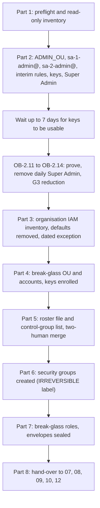

# 6. Organisation bootstrap, break-glass and the super-admin roster

## Status
- Owner: the platform owner
- Last reviewed: 2026-09-15
- Last executed: never
- Stage: review §2 stage 6 (organisation bootstrap) and the roster hygiene that gate line G3 reads. It runs after files 01 to 04 and before file 07, because 07 grants billing roles to `sa-1-admin@`, which this file creates.
- Step prefix: OB. Steps: 47. BLOCKED steps: none. Every step is Admin console, Cloud console, gcloud or git work; no platform code is needed.
- Replaces: the privileged-roster half that `wall-e/SETUP.md` Phase 1 step 4, Phase 2 step 1 and Phase 3 never performed, and the first privileged acts that `wall-e/PREREQUISITES.md` §4.1 left as standing roles. Decisions applied: SD-01 (dated organisation exception), SD-12 (1) (`eve-owners@` owned by the second human), SD-18 (`ge-admins@` made by hand), SD-27 (paper custody records until W-2), SD-30 (tenant-wide self-recovery and multi-party approval **not** set here).
- Closes: S079, S012 (for this file: nothing tenant-wide is switched, and the "roster ready" state that file 38 checks is built here), S049 (the `ge-admins@` half; `factory-groups@` is file 10's half), S002 (the organisation, break-glass and control-group half; PAM administration and entitlements are file 12's half), S059 (the standing organisation roles exist only as a dated, conditioned exception that file 12 withdraws), X-ORG-11 (the interim custody rule for every envelope made here; the upload at W-2 is file 08's half).
- Elapsed time: two sittings of about one day each, at least eight calendar days apart, because Google says a newly added security key may take up to 7 days to become available at sign-in (OB-2.11, OB-4.4).

## What this part builds

The first privileged principals of the platform, and the committed roster that Eve checks from its first run.

1. **The human super-admin roster.** An inventory of every current super admin and admin-role holder; an admin organisational unit (`ADMIN_OU`) with 2-Step Verification in "Only security key" mode and an enrolment period; `sa-1-admin@` (platform owner) and `sa-2-admin@` (second human) as separate admin accounts, two keys each, admin-generated backup codes sealed with the spare key, the spare in the custody of the other human; Super Admin on both; Super Admin removed from the daily accounts once the admin accounts are proven; the G3 reduction of every other super admin, executed under file 03's signed decision.
2. **The organisation exception.** Organization Administrator, Folder Creator, Project Creator and Privileged Access Manager Admin granted at the organisation to `sa-1-admin@` only, each binding carrying an IAM condition that expires on `BOOTSTRAP_EXCEPTION_EXPIRY` (SD-01), recorded in the deviation register and withdrawn explicitly at the end of file 12. Before that: an inventory of the organisation's IAM policy, the removal of the organisation-creation defaults (Project Creator and Billing Account Creator granted to the whole domain) after a dependency check, and a record of every domain-wide delegation client.
3. **Cloud break-glass.** `/Automation/Break-Glass`, `brk-gcp-1@` and `brk-gcp-2@` without Workspace licences or recovery options, one sealed key each with cross-line custodians, and `gcp-organization-admins@` holding standing Organization Administrator and Privileged Access Manager Admin. Custody records on paper with a same-day scan (SD-27).
4. **The control groups.** `gcp-organization-admins@`, `platform-owners@`, `platform-security@`, `platform-approvers@`, `platform-readers@`, `ge-admins@`, `eve-owners@` (owned by the second human) and `ge-users@` (with its membership source), created as security groups only after the control-group list is merged with the second human as required reviewer. The label is permanent, so that creation is the one **IRREVERSIBLE** step of this file.
5. **The interim detector.** Admin console activity rules that mail the second human on any sign-in by `sa-1-admin@`, `brk-gcp-1@` or `brk-gcp-2@` and on any admin-role change, and mail the incident commander (or the security reviewer) on any sign-in by `sa-2-admin@`. They stay until the second human retires them, never before `EVE_H_LIVE_RECORD` (file 28).

What the old text got wrong, and must not come back:

| Old text | Why it fails | Here instead |
|---|---|---|
| `wall-e/SETUP.md` Phase 3 sets super-admin self-recovery Off at the top OU and multi-party approval On, alongside the robot's OU (S012) | Both are tenant-wide. With one admin account, a lost key is recoverable only through Google Support, and every covered change waits for an approver | OB-1.2 reads both settings and changes neither. File 38 sets them on gate day after its roster-ready check (SD-30) |
| Phase 3 row "Less secure app access, Off" (S180) | Google retired the setting and switched off less secure app access for all accounts on 2025-05-01; the row cannot be performed | Row deleted (settings table below) |
| Phase 3 paths "Account → Account settings → super administrator account recovery", "Security → Google session control", "Security → multi-party approval settings" (S180) | The paths do not exist | Security > Authentication > Account recovery > Super admin account recovery; Security > Access and data control > Google session control; Security > Authentication > Multi-party approval settings |
| SETUP Phase 2 step 1 "Commit the roster … File name tbd" (S079) | Eve's roster check and SA-06 diff against a file nobody made | `ROSTER_FILE=identity/super-admin-roster.json`, merged in OB-5.4 |
| PREREQUISITES §4.1 standing `orgpolicy.policyAdmin`, `iam.denyAdmin`, organisation `logging.configWriter` for the builder (S059) | Standing levers of K7 and evidence silencing, no approval, no expiry | None of these roles is granted. The four roles the bootstrap cannot avoid expire by condition and are withdrawn in file 12 |
| 03 §16 GE-5 "`ge-admins@` created by the factory" (S049) | `factory-groups@` refuses control groups in code | `ge-admins@` made by hand in OB-6.2 |
| "Custody record copied to the witness bucket same day" (04 §8.3) for keys enrolled before the witness exists (X-ORG-11) | The witness does not exist yet and no tenant identity may write to it | Paper record in the safe, scan the same day to `EVIDENCE_INTERIM_LOCATION`, uploaded by the witness administrators at W-2 (file 08) |



## Preconditions

- [ ] File 01 is complete: `~/.platform-env` exists with `DOMAIN`, `DIRECTORY_CUSTOMER_ID`, `ORG_ID`, `WORKSPACE_EDITION`, `OWNER_DAILY_ACCOUNT`, `PLATFORM_REPO_DIR`, `BUILD_LOG_DIR`, `EVIDENCE_INTERIM_LOCATION`, `EVIDENCE_REGISTER`, `DEVIATION_REGISTER`, `GCLOUD_CONFIG_NAME` and the helpers `penv_set` and `need`. The gcloud configuration named `GCLOUD_CONFIG_NAME` has no default project.
- [ ] File 03 has recorded signed decision files for SD-01 (with the exception's expiry date), SD-12, SD-18, SD-27 and SD-30, and the **G3 reduction decision** (every current super admin other than the two admin accounts, each with the delegated role they move to, signed by IT security). `SECOND_HUMAN_EMAIL` is set. `PLATFORM_REPO_REMOTE` exists with branch protection (two human approvals, approvals by service accounts or bot users not counted, admin bypass audited) and CODEOWNERS making the second human a required reviewer on `identity/`.
- [ ] File 03 has named `INCIDENT_COMMANDER_EMAIL` or `SECURITY_REVIEWER_EMAIL`. Without either, OB-2.6 rule B cannot be created and OB-2.8 waits (reports about the second human have no recipient).
- [ ] File 04 has delivered at least **six** hardware security keys for this file: two for `sa-1-admin@`, two for `sa-2-admin@`, one each for `brk-gcp-1@` and `brk-gcp-2@`. Their serials are in the key inventory of file 04, never in the variables file.
- [ ] Tamper-evident envelopes: one per human admin account (spare key and backup codes) and one per break-glass account, four in total, plus at least four spares for re-sealing (`v2` records). A corporate safe with a sign-out log. Paper custody forms (file 01 template).
- [ ] The corporate password vault is available to both humans, with an entry type that neither human can read for the other's break-glass password (vault administrator confirms).
- [ ] Two clean browser profiles on the platform owner's workstation (one per admin account he uses: `OWNER_DAILY_ACCOUNT` until OB-2.12, then `sa-1-admin@`; one for break-glass sign-ins) and one on the second human's workstation for `sa-2-admin@`, as file 01 prescribes.
- [ ] `OWNER_DAILY_ACCOUNT` is a super admin today. If it is not, the super admin who is performs OB-2.1 to OB-2.10 with the platform owner present, and that is recorded under OB-1.1.

## People

| Role | Does | Present when |
|---|---|---|
| Platform owner (daily account until OB-2.12, then `sa-1-admin@`) | Performs every console and shell step; custodian of `sa-2-admin@`'s spare key and of `brk-gcp-1@`'s key; password custodian of `brk-gcp-2@` | every step |
| Second human (IT security; `SECOND_HUMAN_EMAIL`, then `sa-2-admin@`) | Creates and keys `sa-2-admin@`; custodian of `sa-1-admin@`'s spare key and of `brk-gcp-2@`'s key; password custodian of `brk-gcp-1@`; required reviewer of the roster merge; owner of `eve-owners@`; recipient of the interim rules | OB-1.6, OB-2.5, OB-2.7 to OB-2.12, OB-4.3, OB-4.4, OB-5.4, OB-6.3, OB-7.2, OB-7.3, OB-8.4 |
| Other-line witness | Signs every envelope record. For an envelope whose custodian is the second human (IT security line): a Digital Workplace colleague who is not an admin and is not the account's holder. For an envelope whose custodian is the platform owner: an IT security colleague other than the second human (*Assumption:* the incident commander) | OB-2.9, OB-7.3 |
| Second approver on the pull request (second operator, security reviewer or incident commander, as file 03's CODEOWNERS allows) | Second human approval of the roster and control-group merge | OB-5.4 |
| Each super admin reduced under G3 | Confirms their new delegated role works before Super Admin is removed | OB-2.13 |
| Owners of existing organisation-level roles found in OB-3.4 (for example the organisation's Cloud Logging owner) | Confirm in writing that nothing depends on the domain-wide defaults | OB-3.5 |
| Vault administrator | Confirms the break-glass password entries' custodians | OB-4.3 |

Nobody performs a step alone if WHO names a second person. A missing person is a checkpoint line reading `WAITING <role>`; the platform owner never stands in.

## Settings applied to the human admin and break-glass OUs

Salvaged from `wall-e/SETUP.md` Phase 3 and [04 §8.2](../04-identity-and-privileged-access.md#82-session-controls-on-the-privileged-tier), with the retired row deleted and the paths corrected (S180). Paths verified on 2026-09-15 against the Workspace Help Center pages cited at each step.

| Control | `ADMIN_OU` | `BREAK_GLASS_OU` | Path | Step |
|---|---|---|---|---|
| 2-Step Verification enforced, method "Only security key", "Allow user to trust the device" off, security codes not allowed, new-user enrolment period | yes | yes | Menu > Security > Authentication > 2-step verification | OB-2.2, OB-4.2 |
| Backup verification codes | admin-generated, sealed with the spare key | none generated; a super admin generates them only for a recovery | Menu > Directory > Users > user > Security > 2-Step Verification | OB-2.9 |
| Google session control (web session) | the shortest duration offered | the shortest duration offered | Menu > Security > Access and data control > Google session control | OB-2.3, OB-4.2 |
| Google Cloud session control | Require reauthentication every 1 hour, method Security key, trusted apps not exempted | same | Menu > Security > Access and data control > Google Cloud session control | OB-2.3, OB-4.2 |
| Recovery email and phone | none | none | Menu > Directory > Users > user > Security > Recovery information | OB-2.4, OB-2.5, OB-4.3 |
| Password | long, random, in the corporate vault of the account holder | long, random, in the vault under the cross custodian | Menu > Directory > Users > Add new user | OB-2.4, OB-2.5, OB-4.3 |
| Automatic Workspace licensing | Off (Cloud Identity Free only) | Off | Menu > Billing > License settings | OB-2.1, OB-4.1 |
| Less secure app access | **row deleted**: retired by Google on 2025-05-01 | deleted | — | — |
| Super-admin self-recovery Off (top OU) | **not set here** (SD-30, file 38); read in OB-1.2 | not applicable (not super admins) | Menu > Security > Authentication > Account recovery > Super admin account recovery | OB-1.2 |
| Multi-party approval On | **not set here** (SD-30, file 38); read in OB-1.2 | — | Menu > Security > Authentication > Multi-party approval settings | OB-1.2 |
| Context-Aware Access on the Admin console | not applied: robot OU only (04 §6.3), file 30 | not applied | — | — |

## Steps

### Part 1 — Preflight and read-only inventory

### OB-1.1 Preflight: variables, decisions, people and the shell

- **WHO:** Platform owner, alone.
- **WHERE:** Shell, `~/.platform-env` sourced.
- **ACTION:**

```bash
source ~/.platform-env
need DOMAIN DIRECTORY_CUSTOMER_ID ORG_ID WORKSPACE_EDITION OWNER_DAILY_ACCOUNT SECOND_HUMAN_EMAIL PLATFORM_REPO_DIR PLATFORM_REPO_REMOTE BUILD_LOG_DIR EVIDENCE_INTERIM_LOCATION EVIDENCE_REGISTER DEVIATION_REGISTER GCLOUD_CONFIG_NAME
gcloud config configurations activate "$GCLOUD_CONFIG_NAME"
test -z "$(gcloud config get project 2>/dev/null)" && echo "OK no default project" || echo "FAIL default project set"
test -z "${CLOUDSDK_CORE_PROJECT:-}" && echo "OK CLOUDSDK_CORE_PROJECT unset" || echo "FAIL CLOUDSDK_CORE_PROJECT set"
mkdir -p "$BUILD_LOG_DIR/evidence/06"
ls "$PLATFORM_REPO_DIR"/decisions/ | grep -Ei 'sd-01|sd-12|sd-18|sd-27|sd-30|g3'
git -C "$PLATFORM_REPO_DIR" remote get-url origin
```

  Then open each decision file listed and read: SD-01's expiry date for the organisation exception; the G3 decision's table of accounts and target delegated roles; SD-27's custody rule. Confirm with the second human the two sitting dates, at least eight days apart.
- **VERIFY:** Both guard lines print `OK`. The `grep` lists six decision files, each carrying signatures (open them). `git remote get-url origin` prints `PLATFORM_REPO_REMOTE`. If a decision is missing or unsigned, stop: nothing below may run.
- **ROLLBACK:** None needed; the step only reads.
- **EVIDENCE:** A build-log line under OB-1.1 in `BUILD_LOG_DIR` naming the decision files, their commit ids and the two sitting dates. TISAX 1.1–1.2 (decision files). EU AI Act E-05.

### OB-1.2 Record the edition and the tenant-wide settings this file must not change

- **WHO:** Platform owner as super admin (`OWNER_DAILY_ACCOUNT`).
- **WHERE:** Admin console: Menu > Security > Authentication > Account recovery > Super admin account recovery; Menu > Security > Authentication > Multi-party approval settings; Menu > Billing > Subscriptions.
- **ACTION:**
  1. At the top organisational unit, read "Super admin account recovery" and write down its value. Do not change it. Google's default is On for most editions, including Enterprise Standard and Plus ([allow super administrators to recover their password](https://knowledge.workspace.google.com/admin/users/allow-super-administrators-to-recover-their-password), updated 2026-09-10).
  2. Read the Multi-party approval settings page and write down whether it is on and for which settings. Do not change it.
  3. In Subscriptions, confirm `WORKSPACE_EDITION` and note whether a Cloud Identity Free subscription exists.
  4. Take a screenshot of each page (no secrets are shown on these pages).
- **VERIFY:** A short record with three values: self-recovery at the top OU, multi-party approval state, subscriptions. If multi-party approval is already on, note it: every role assignment in Part 2 then needs a second super admin's approval, and the sitting must include a second existing super admin who can approve (SD-30 is about not turning it on, not about turning it off).
- **ROLLBACK:** None needed; the step only reads. **Never** switch either setting in this file.
- **EVIDENCE:** The record and screenshots to `EVIDENCE_INTERIM_LOCATION` as `<date>-OB-1.2-tenant-wide-settings-v1`. TISAX 4.1.2. EU AI Act E-05.

### OB-1.3 Inventory every super admin and every admin-role holder

- **WHO:** Platform owner as super admin.
- **WHERE:** The Admin SDK Directory API reference pages' APIs Explorer panel, in the clean browser profile signed in as `OWNER_DAILY_ACCOUNT`; then the shell, `~/.platform-env` sourced. The browser holds the token; nothing is cached on the workstation.
- **ACTION:**
  1. Open [users.list](https://developers.google.com/workspace/admin/directory/reference/rest/v1/users/list) and run it in the APIs Explorer with `customer` = the value of `DIRECTORY_CUSTOMER_ID`, `query` = `isAdmin=true`, `viewType` = `admin_view`, `projection` = `full`, `maxResults` = 500. `isAdmin=true` returns super administrators ([search for users](https://developers.google.com/workspace/admin/directory/v1/guides/search-users)). Copy the whole JSON response and save it:

```bash
pbpaste > "$BUILD_LOG_DIR/evidence/06/OB-1.3-users-isAdmin.json"
```

  2. Run it again with `query` = `isDelegatedAdmin=true` and save:

```bash
pbpaste > "$BUILD_LOG_DIR/evidence/06/OB-1.3-users-isDelegatedAdmin.json"
```

  3. Run [roles.list](https://developers.google.com/workspace/admin/directory/reference/rest/v1/roles/list) with `customer` = `DIRECTORY_CUSTOMER_ID`, and [roleAssignments.list](https://developers.google.com/workspace/admin/directory/reference/rest/v1/roleAssignments/list) with `customer` = `DIRECTORY_CUSTOMER_ID` and `includeIndirectRoleAssignments` = `true`. Save both. If any response carries `nextPageToken`, run the method again with `pageToken` and save the page as `-p2`, `-p3`.

```bash
pbpaste > "$BUILD_LOG_DIR/evidence/06/OB-1.3-roles.json"
pbpaste > "$BUILD_LOG_DIR/evidence/06/OB-1.3-roleassignments.json"
```

  4. Print the inventory table:

```bash
python3 - "$BUILD_LOG_DIR/evidence/06" <<'PY'
import json, glob, os, sys
d = sys.argv[1]
def load(pat):
    out = []
    for f in sorted(glob.glob(os.path.join(d, pat))):
        out.append(json.load(open(f)))
    return out
users = {}
for page in load("OB-1.3-users-is*.json"):
    for u in page.get("users", []):
        users[u["id"]] = u
roles = {}
for page in load("OB-1.3-roles*.json"):
    for r in page.get("items", []):
        roles[r["roleId"]] = r
held = {}
unmatched = []
for page in load("OB-1.3-roleassignments*.json"):
    for a in page.get("items", []):
        name = roles.get(a["roleId"], {}).get("roleName", a["roleId"])
        if a.get("assignedTo") in users:
            held.setdefault(a["assignedTo"], set()).add(name)
        else:
            unmatched.append((a.get("assigneeType", "?"), a.get("assignedTo"), name))
print("email | isAdmin | isDelegatedAdmin | roles | orgUnitPath | enrolled2SV | enforced2SV")
for uid, u in sorted(users.items(), key=lambda x: x[1]["primaryEmail"]):
    print(u["primaryEmail"], u.get("isAdmin"), u.get("isDelegatedAdmin"), ";".join(sorted(held.get(uid, []))), u.get("orgUnitPath"), u.get("isEnrolledIn2Sv"), u.get("isEnforcedIn2Sv"), sep=" | ")
print("assignments not matched to a listed user (groups, service accounts):")
for row in unmatched:
    print(*row, sep=" | ")
print("super admins:", sum(1 for u in users.values() if u.get("isAdmin")))
PY
```

  5. Resolve every unmatched assignment in the Admin console (Menu > Account > Admin roles > the role > Admins) and write its email next to its id in the record.
- **VERIFY:** The table lists every account of Menu > Account > Admin roles > Super Admin > Admins, checked by eye, and the super-admin count printed equals the count on that page. Every unmatched id has an email written against it. *Assumption:* the APIs Explorer panel is offered on the roles and roleAssignments pages as on users.list; if not, the same data is read from Menu > Account > Admin roles, one role at a time, and typed into the record.
- **ROLLBACK:** None needed; the step only reads. The saved JSON holds account metadata, no secrets; it stays in `BUILD_LOG_DIR`, never in the wiki.
- **EVIDENCE:** The four JSON files and the printed table, as `<date>-OB-1.3-admin-inventory-v1` in `EVIDENCE_INTERIM_LOCATION`. TISAX 4.2.1 (the first roster review). EU AI Act E-08 (oversight roster).

### OB-1.4 Record every domain-wide delegation client

- **WHO:** Platform owner as super admin (the page needs super administrator).
- **WHERE:** Admin console: Menu > Security > Access and data control > API controls > Domain wide delegation > Manage Domain Wide Delegation ([control API access with domain-wide delegation](https://support.google.com/a/answer/162106), checked 2026-09-15).
- **ACTION:**
  1. For every row, record the client name, client ID and the OAuth scopes. Client IDs and scopes are not secrets.
  2. For every client, name its owner if known (the service account's project, or the application) and write *tbd* where unknown.
  3. Compare the list against every identity the platform will use (the names in file 01's roles table and topology: `walle@`, `eve@`, `factory-*@`, `eve-*@`, `mo-*@`, `walle-*@`, `platform-*@`). Add, remove or edit nothing.
- **VERIFY:** The record's row count equals the page's row count. No row belongs to a platform identity. **If one does, stop the file** and open a severity 1 record to the second human: the platform's standing constraint is "no domain-wide delegation, ever" (README §2), and a client serving a platform identity must be removed by its owner through file 03's decision process before anything else here.
- **ROLLBACK:** None needed; the step only reads.
- **EVIDENCE:** The client list and a screenshot as `<date>-OB-1.4-dwd-clients-v1` in `EVIDENCE_INTERIM_LOCATION`; it is the baseline for Eve's "domain-wide delegation client added" rule (file 25). TISAX 4.2.1. EU AI Act E-05.

### OB-1.5 Check licensing for accounts without a Workspace licence

- **WHO:** Platform owner as super admin (License management privilege).
- **WHERE:** Admin console: Menu > Billing > Subscriptions; Menu > Billing > License settings ([set automatic licensing for organisational units](https://knowledge.workspace.google.com/admin/billing/set-automatic-licensing-for-organizational-units), updated 2026-09-10).
- **ACTION:**
  1. If OB-1.2 found no Cloud Identity Free subscription, add it from Menu > Billing > Buy or upgrade, following [add Cloud Identity licences to a Workspace account](https://support.google.com/cloudidentity/answer/7384506). With both Workspace and Cloud Identity Free, users without a Workspace licence get a free Cloud Identity licence ([how licensing works for Cloud Identity](https://docs.cloud.google.com/identity/docs/how-to/how-licensing-works-for-cloud-identity)).
  2. On License settings, at the top organisational unit, record whether automatic licensing is On for the Workspace subscription. The OUs created in OB-2.1 and OB-4.1 override it to Off.
- **VERIFY:** Subscriptions lists Cloud Identity Free. The record states the top-level automatic licensing value.
- **ROLLBACK:** A Cloud Identity Free subscription added here can be removed from Subscriptions once no user holds its licence. Nothing else changed.
- **EVIDENCE:** Build-log line under OB-1.5 with both values. TISAX 4.1.1.

### OB-1.6 Brief the people and notify the super admins that G3 reduces

- **WHO:** Platform owner, with the second human present. IT security signs the notification (it is IT security's G3 decision).
- **WHERE:** A meeting, then email from the second human's daily account.
- **ACTION:**
  1. Walk the second human through this file, the settings table and the sitting dates.
  2. From the OB-1.3 table and the G3 decision, list every super admin other than the two future admin accounts. The second human sends each one a notice: the date Super Admin will be removed, the delegated role they receive instead (from the decision), and the hand-over exception process if they cannot be ready.
  3. Tell the existing organisation-level role holders that OB-3.5 will ask them about the domain-wide defaults.
- **VERIFY:** Every account the G3 decision reduces has a sent notice; replies are filed.
- **ROLLBACK:** None needed.
- **EVIDENCE:** The notices and replies as `<date>-OB-1.6-g3-notices-v1` in `EVIDENCE_INTERIM_LOCATION`. TISAX 4.2.1, 2.1. EU AI Act E-08.

### Part 2 — The admin OU and the two human admin accounts

### OB-2.1 Create the admin organisational unit

- **WHO:** Platform owner as super admin.
- **WHERE:** Admin console: Menu > Directory > Organizational units ([add an organisational unit](https://knowledge.workspace.google.com/admin/users/advanced/add-an-organizational-unit)); Menu > Billing > License settings.
- **ACTION:**
  1. Point to the top organisational unit, click Create new organizational unit, name it `Admins`, description "Human super-admin accounts (P68, file 06)". The name may not contain `/`.
  2. In License settings, select `Admins`, point to the Workspace subscription, click Edit, select Off, click Override. Leave Cloud Identity Free as inherited.
  3. Record the value:

```bash
penv_set ADMIN_OU "/Admins"
```

- **VERIFY:** Directory > Organizational units shows `/Admins` with no users. License settings shows `Admins` overriding the Workspace subscription to Off.
- **ROLLBACK:** Delete the empty OU (Organizational units > `Admins` > Delete) and remove the override. `penv_set --force` with a build-log line.
- **EVIDENCE:** Screenshots as `<date>-OB-2.1-admin-ou-v1`. TISAX 4.1.2. EU AI Act E-05.

### OB-2.2 Enforce "Only security key" 2-Step Verification on ADMIN_OU, with an enrolment period

- **WHO:** Platform owner as super admin (2SV settings need super administrator).
- **WHERE:** Admin console: Menu > Security > Authentication > 2-step verification, organisational unit `Admins` selected on the left ([deploy 2-Step Verification](https://knowledge.workspace.google.com/admin/security/deploy-2-step-verification), updated 2026-09-10).
- **ACTION:**
  1. Check "Allow users to turn on 2-Step Verification" (*Assumption:* the checkbox label; Google's page describes the enforcement, methods, enrolment, frequency and security-code options quoted below).
  2. Enforcement: On.
  3. New user enrollment period: the shortest value offered that is **at least 8 days** (Google allows 1 day to 6 months; a new key may take up to 7 days to become usable at sign-in, see OB-2.11).
  4. Frequency: uncheck "Allow user to trust the device".
  5. Methods: Only security key.
  6. Security codes: Don't allow users to generate security codes.
  7. Click Override (or Save).
- **VERIFY:** Re-open the page on `Admins`: Enforcement On, Methods "Only security key", trust device unchecked, security codes not allowed, the enrolment period recorded. The top organisational unit's values are unchanged (screenshot both).
- **ROLLBACK:** Select `Admins` and click Inherit. No account is in the OU yet, so nobody is affected.
- **EVIDENCE:** Screenshots of `Admins` and the top OU as `<date>-OB-2.2-2sv-admin-ou-v1`. TISAX 4.1.2 (2SV policy export). EU AI Act E-05.

### OB-2.3 Session controls on ADMIN_OU

- **WHO:** Platform owner as super admin.
- **WHERE:** Admin console, `Admins` selected: Menu > Security > Access and data control > Google session control ([session length for Google services](https://knowledge.workspace.google.com/admin/security/set-session-length-for-google-services), updated 2026-09-10); Menu > Security > Access and data control > Google Cloud session control ([session length for Google Cloud services](https://knowledge.workspace.google.com/admin/security/set-session-length-for-google-cloud-services)).
- **ACTION:**
  1. Google session control: web session duration set to the shortest duration offered; Override. The Admin console session is one hour, fixed by Google, and is not a setting.
  2. Google Cloud session control: Reauthentication policy "Require reauthentication", frequency 1 hour, reauthentication method Security key, "Exempt trusted apps" unchecked; Override.
- **VERIFY:** Both pages, re-opened on `Admins`, show the values. Google says changes can take up to 24 hours to apply: the gcloud reauthentication is observed in OB-3.1.
- **ROLLBACK:** Inherit on each page.
- **EVIDENCE:** Screenshots as `<date>-OB-2.3-sessions-admin-ou-v1`. TISAX 4.1.2. EU AI Act E-05.

### OB-2.4 Create sa-1-admin@

- **WHO:** Platform owner as super admin.
- **WHERE:** Admin console: Menu > Directory > Users > Add new user ([add an account for a new user](https://knowledge.workspace.google.com/admin/users/add-an-account-for-a-new-user)); the clean `sa-1-admin@` browser profile.
- **ACTION:**
  1. First name `sa-1`, last name `admin`, primary email `sa-1-admin@` on `DOMAIN`. Leave secondary email and phone empty.
  2. Open "Manage user's password, organizational unit, and profile photo": organisational unit `/Admins`; password "Automatically generate password"; check "Ask for a password change at the next sign-in".
  3. Click Add New User. In the confirmation, do **not** send details to any email. Copy the initial password once, sign in as `sa-1-admin@` in the clean profile, paste it into the sign-in box only, and set the new password generated by the corporate vault's generator directly from the vault entry. The initial password is never typed into a file, a chat or a ticket.
  4. In Directory > Users > `sa-1-admin@` > Security > Recovery information, confirm that no recovery email or phone is present.
  5. In Directory > Users > `sa-1-admin@` > Licenses, confirm no Workspace licence is assigned.

```bash
penv_set SA_1_ADMIN "sa-1-admin@${DOMAIN}"
```

- **VERIFY:** The user page shows `/Admins`, no recovery information, only a Cloud Identity Free licence. The first sign-in reached the password change and then Google's enrolment prompt for 2-Step Verification.
- **ROLLBACK:** Delete the user (Directory > Users > `sa-1-admin@` > Delete user). Deletion is recoverable for a limited period by Google's user-restore feature; the account holds nothing.
- **EVIDENCE:** Build-log line under OB-2.4 with the creation time. The vault entry's name (not its content) in the record. TISAX 4.1.2 (privileged-account procedure). EU AI Act E-08.

### OB-2.5 Create sa-2-admin@

- **WHO:** Platform owner as super admin creates the account; the second human performs the first sign-in and sets the password alone.
- **WHERE:** Admin console as in OB-2.4; the second human's clean `sa-2-admin@` browser profile on the second human's workstation.
- **ACTION:**
  1. Repeat OB-2.4 steps 1 and 2 with first name `sa-2`, primary email `sa-2-admin@`, organisational unit `/Admins`.
  2. After Add New User, the platform owner hands the screen to the second human, who copies the initial password once into the sign-in box on their own workstation and sets a vault-generated password from their own vault entry. The platform owner does not look.
  3. Confirm no recovery information and no Workspace licence, as OB-2.4 steps 4 and 5.

```bash
penv_set SA_2_ADMIN "sa-2-admin@${DOMAIN}"
```

- **VERIFY:** As OB-2.4, on `sa-2-admin@`. The second human states in the record that the platform owner did not see the password.
- **ROLLBACK:** Delete the user.
- **EVIDENCE:** Build-log line under OB-2.5 with the second human's statement. TISAX 4.1.2. EU AI Act E-08.

### OB-2.6 Interim Admin console activity rules

- **WHO:** Platform owner as super admin creates; the second human watches the configuration being saved and receives the test mail.
- **WHERE:** Admin console: Home > Rules > Create rule > Activity ([create and manage reporting rules](https://knowledge.workspace.google.com/admin/reports/create-and-manage-reporting-rules), updated 2026-09-10). Google states that reporting rules are now activity rules, that all editions support activity rules that send notifications, and that email recipients must be internal domain users ([admin access to reporting and activity rules](https://knowledge.workspace.google.com/admin/security/admin-access-to-reporting-rules-and-activity-rules)).
- **ACTION:** Create three rules.
  1. **Rule A**, name `interim-roster-login-to-second-human`. Data source: User log events. Filter: Actor is `sa-1-admin@` (Part 4 adds `brk-gcp-1@` and `brk-gcp-2@`). Leave Event unfiltered, so successful and failed logins, 2SV and recovery events all match. Actions: Send to alert center, severity High; email notification to `SECOND_HUMAN_EMAIL` only (the sole-recipient rule of SD-10: reports about the platform owner go to the second human). Do not tick "All super administrators".
  2. **Rule B**, name `interim-sa-2-login-to-incident-commander`. Data source User log events, Actor is `sa-2-admin@`; severity High; email to `INCIDENT_COMMANDER_EMAIL`, or `SECURITY_REVIEWER_EMAIL` once appointed. If neither is set, do not create it: record `WAITING incident commander` and create it as soon as one is named (re-run point).
  3. **Rule C**, name `interim-admin-role-change`. Data source Admin log events. Filter: Event is each role-assignment event the condition builder lists (*Assumption:* labelled "Assign role" and "Unassign role"; confirm in the builder and record the exact labels). Actor unfiltered. Severity High; email to `SECOND_HUMAN_EMAIL` and to the rule B recipient.
  4. After saving, open Menu > Reporting > Audit and investigation > Admin log events and search for the rule-creation events just produced. Record the event label. If it exists, add **Rule D**, `interim-rule-changed`, on Admin log events for that event and its "modified" and "deleted" counterparts, email to `SECOND_HUMAN_EMAIL`.

```bash
need SECOND_HUMAN_EMAIL SA_1_ADMIN SA_2_ADMIN
printf '%s\n' "rule A actor=$SA_1_ADMIN to=$SECOND_HUMAN_EMAIL" "rule B actor=$SA_2_ADMIN to=${INCIDENT_COMMANDER_EMAIL:-${SECURITY_REVIEWER_EMAIL:-WAITING}}"
```

- **VERIFY:** `sa-1-admin@`'s first sign-in in OB-2.4 happened before rule A existed, so it proves nothing. Sign in once more as `sa-1-admin@` in the clean profile and sign out; the second human receives the mail. Do the same as `sa-2-admin@` for rule B; its recipient confirms receipt. *Assumption:* the lag is minutes; if nothing has arrived after 24 hours, the rule does not work, and the fallback below applies. Rule C is verified by OB-2.10. If User log events is not offered as a data source in this edition, record it, and the fallback is a daily read by the second human of Menu > Reporting > Audit and investigation > User log events filtered on the roster accounts, entered in `DRILL_CALENDAR`, as a dated deviation in `DEVIATION_REGISTER` until Eve-H is live.
- **ROLLBACK:** Delete the rules. **Only the second human may retire them, and never before `EVE_H_LIVE_RECORD` (file 28).** Removing them without that record is a finding against the platform owner.
- **EVIDENCE:** Screenshots of each rule, the rule D decision, and the received test mail (forwarded by the second human to the interim evidence folder) as `<date>-OB-2.6-interim-rules-v1`. TISAX 4.1.2 (activity-rule config), 4.1–4.2 evidence pack item "the robot-login activity rule". EU AI Act E-08.

### OB-2.7 Enrol two security keys on sa-1-admin@

- **WHO:** Platform owner; the second human present (they take the spare key into custody in OB-2.9).
- **WHERE:** The clean `sa-1-admin@` browser profile: Google Account > Security > 2-Step Verification, then "Passkeys and security keys" ([use a security key for 2-Step Verification](https://support.google.com/accounts/answer/6103523)).
- **ACTION:**
  1. Sign in as `sa-1-admin@` (still inside the enrolment period of OB-2.2).
  2. Turn on 2-Step Verification with the first key (label it `sa-1 primary`) following Google's prompts.
  3. Add the second key (label `sa-1 spare`).
  4. Write both key serials on the custody form, never in a file on the workstation.
  5. Sign out.
- **VERIFY:** In the platform owner's daily-account Admin console session: Directory > Users > `sa-1-admin@` > Security shows 2-Step Verification on and two security keys listed by name. The second human reads the two names off the screen and signs the form.
- **ROLLBACK:** In Directory > Users > `sa-1-admin@` > Security, remove a wrongly enrolled key and enrol again.
- **EVIDENCE:** The custody form (serials, labels, date, both signatures) stays with the spare key for OB-2.9. Build-log line under OB-2.7. TISAX 4.1.2, 3.1 (hardware-key custody record). EU AI Act E-08.

### OB-2.8 Enrol two security keys on sa-2-admin@

- **WHO:** Second human; the platform owner present.
- **WHERE:** The second human's clean `sa-2-admin@` browser profile.
- **ACTION:** As OB-2.7, on `sa-2-admin@`, labels `sa-2 primary` and `sa-2 spare`. Serials on the second human's custody form.
- **VERIFY:** Directory > Users > `sa-2-admin@` > Security shows 2-Step Verification on and two keys. The platform owner signs the form.
- **ROLLBACK:** As OB-2.7.
- **EVIDENCE:** As OB-2.7, for `sa-2-admin@`.

### OB-2.9 Admin-generated backup codes, sealed with each spare key

- **WHO:** Platform owner as super admin (`OWNER_DAILY_ACCOUNT`; Super Admin is not yet on the admin accounts) generates both sets. For `sa-1-admin@`: in front of the second human (custodian) and the other-line witness. For `sa-2-admin@`: in front of the second human (holder) and the other-line witness; the platform owner is its custodian.
- **WHERE:** Admin console: Menu > Directory > Users > the user > Security > 2-Step Verification > Get backup verification codes ([manage a user's security settings](https://knowledge.workspace.google.com/admin/security/manage-a-users-security-settings), updated 2026-09-10). In "Only security key" mode users cannot generate their own codes; an admin must provide them.
- **ACTION:** For each admin account:
  1. Generate the codes. Copy them **by hand** onto the inner sheet of the custody form. Never print them from the workstation, photograph, scan, type or paste them anywhere.
  2. Close the dialogue. Put the inner sheet and the spare key in a tamper-evident envelope. Seal it. Write on the envelope the account, the envelope serial number and the date.
  3. The custodian (second human for `sa-1-admin@`, platform owner for `sa-2-admin@`) and the other-line witness sign the outer custody record: account, key labels and serials, envelope serial, date and time, "backup codes generated by <admin>, handwritten, sealed", signatures.
  4. The envelope goes into the corporate safe; the safe log records it.
  5. The same day, scan **the outer custody record only** (never the envelope contents) to `EVIDENCE_INTERIM_LOCATION` as `<date>-custody-<account>-spare-v1` (SD-27). The paper record stays in the safe with the envelope.
- **VERIFY:** The safe log lists two envelopes with their serials. The scans are in `EVIDENCE_INTERIM_LOCATION` with the same date as the records. The primary key is on each holder's person.
- **ROLLBACK:** Generating new codes makes the previous set inactive. If an envelope is opened or mislabelled: generate new codes, reseal in a new envelope, record version `v2`, never overwrite `v1`.
- **EVIDENCE:** The two scans; the safe-log entries. They are uploaded to the witness by the witness administrators at W-2 (file 08's records step), which closes X-ORG-11 for these records. TISAX 3.1 (hardware-key custody record), 4.1.2. EU AI Act E-08.

### OB-2.10 Assign Super Admin to sa-1-admin@ and sa-2-admin@

- **WHO:** Platform owner as super admin (`OWNER_DAILY_ACCOUNT`); the second human present.
- **WHERE:** Admin console: Menu > Account > Admin roles > Super Admin > Assign admin > Assign members ([assign specific admin roles](https://knowledge.workspace.google.com/admin/users/assign-specific-admin-roles), updated 2026-09-10).
- **ACTION:**
  1. Assign Super Admin to `sa-1-admin@`.
  2. Assign Super Admin to `sa-2-admin@`.
  3. If OB-1.2 found multi-party approval already on, an existing super admin other than the platform owner approves each request; record who.
- **VERIFY:** Account > Admin roles > Super Admin > Admins lists both admin accounts. Rule C of OB-2.6 has mailed the second human for each assignment (record the delay). If rule C did not fire within 24 hours, correct its event filter and record the correction.
- **ROLLBACK:** Account > Admin roles > Super Admin > Assign admin > tick the account > Unassign role.
- **EVIDENCE:** Screenshot of the Super Admin admins list and the two rule-C mails as `<date>-OB-2.10-super-admin-assigned-v1`. TISAX 4.2.1. EU AI Act E-08.

### OB-2.11 Prove both admin accounts before any daily account loses Super Admin

- **WHO:** Platform owner for `sa-1-admin@`; the second human for `sa-2-admin@`; each watches the other.
- **WHERE:** The clean admin browser profiles; the APIs Explorer as in OB-1.3; the shell.
- **ACTION:** Run this at the second sitting, at least 7 days after OB-2.7 and OB-2.8 (Google: "You may need to wait 7 days before a newly added security key is available at sign-in") and before the enrolment period of OB-2.2 ends.
  1. Sign out of every Google session in the profile. Sign in as the admin account. Expect the security key prompt and no other second-step option. Touch the **primary** key.
  2. Open admin.google.com and Menu > Account > Admin roles: the page opens.
  3. Sign out, sign in again with the **spare key** taken from the envelope in front of the custodian and the other-line witness, then re-seal it in a new envelope (record `v2`, scan the same day). This proves the spare.
  4. In the APIs Explorer, run users.list with `query` = `orgUnitPath=/Admins`, `viewType` = `admin_view` and save:

```bash
pbpaste > "$BUILD_LOG_DIR/evidence/06/OB-2.11-admin-ou-users.json"
python3 - "$BUILD_LOG_DIR/evidence/06/OB-2.11-admin-ou-users.json" "$SA_1_ADMIN" "$SA_2_ADMIN" <<'PY'
import json, sys
users = {u["primaryEmail"]: u for u in json.load(open(sys.argv[1])).get("users", [])}
ok = True
for e in sys.argv[2:4]:
    u = users.get(e, {})
    good = u.get("isAdmin") is True and u.get("isEnrolledIn2Sv") is True and u.get("isEnforcedIn2Sv") is True and u.get("orgUnitPath") == "/Admins"
    ok &= good
    print(e, "isAdmin", u.get("isAdmin"), "enrolled", u.get("isEnrolledIn2Sv"), "enforced", u.get("isEnforcedIn2Sv"), u.get("orgUnitPath"), "OK" if good else "FAIL")
print("ADMIN ACCOUNTS PROVEN" if ok and set(users) == set(sys.argv[2:4]) else "FAIL")
PY
```

- **VERIFY:** The script prints `ADMIN ACCOUNTS PROVEN`: both accounts are super admins, enrolled and enforced, in `/Admins`, and nobody else is in `/Admins`. Each sign-in in actions 1 and 3 produced a rule-A or rule-B mail. If any key prompt offered a code or phone option, stop: OB-2.2 is wrong for this OU.
- **ROLLBACK:** None needed; the step only signs in and reads. A failure returns to OB-2.2, OB-2.7 or OB-2.8.
- **EVIDENCE:** The JSON, the script output, the rule mails, the `v2` envelope scans, as `<date>-OB-2.11-admin-accounts-proven-v1`. TISAX 4.1.2. EU AI Act E-08.

### OB-2.12 Remove Super Admin from the daily accounts

- **WHO:** Platform owner signed in as `sa-1-admin@`; the second human present and signed in as `sa-2-admin@` in their own profile.
- **WHERE:** Admin console: Menu > Account > Admin roles > Super Admin > Assign admin.
- **ACTION:**
  1. Gate: OB-2.11 printed `ADMIN ACCOUNTS PROVEN` today.
  2. Tick `OWNER_DAILY_ACCOUNT` > Unassign role.
  3. If `SECOND_HUMAN_EMAIL` holds Super Admin, the second human (as `sa-2-admin@`) unassigns it.
  4. Sign out of the daily account's Admin console session everywhere.
- **VERIFY:** Account > Admin roles > Super Admin > Admins no longer lists either daily account. Signed in as `OWNER_DAILY_ACCOUNT`, admin.google.com does not open the Admin console. Rule C mailed the second human for each removal.
- **ROLLBACK:** As `sa-1-admin@` or `sa-2-admin@`, re-assign Super Admin to the daily account (OB-2.10's path). Only if both admin accounts have failed; record why.
- **EVIDENCE:** Screenshot and rule-C mails as `<date>-OB-2.12-daily-super-admin-removed-v1`. TISAX 4.2.1. EU AI Act E-08.

### OB-2.13 Execute the G3 reduction of every other super admin

- **WHO:** Platform owner as `sa-1-admin@`; the second human as `sa-2-admin@` confirms each row; each reduced admin tests their new role.
- **WHERE:** Admin console: Menu > Account > Admin roles; the G3 decision record (file 03).
- **ACTION:** For each account on the G3 decision, in the decision's order:
  1. Assign the delegated role the decision names (Menu > Account > Admin roles > the role > Assign admin > Assign members).
  2. The admin signs in and performs one routine task of that role; they confirm in writing.
  3. Unassign Super Admin (Super Admin > Assign admin > tick > Unassign role).
  4. If the admin cannot be ready on the day, do not remove Super Admin. Record a **dated hand-over exception**: account, reason, expiry date no later than the decision allows, signed by the second human (04 §7.2). Eve's roster check fails while such an exception is past its date.
- **VERIFY:** For every decision row: either Super Admin is gone and the named delegated role is present, or a signed exception with an expiry exists. Rule C mailed the second human for each change.
- **ROLLBACK:** Re-assign Super Admin to a reduced account only under a new signed IT security decision (the G3 decision is append-only).
- **EVIDENCE:** One line per account (role before, role after, time, confirmation) and the exception records, as `<date>-OB-2.13-g3-reduction-v1`. TISAX 4.2.1 (roster review), 1.4 (exceptions). EU AI Act E-08.

### OB-2.14 Verify the super-admin roster state

- **WHO:** Platform owner as `sa-1-admin@`; the second human reads the result.
- **WHERE:** APIs Explorer (users.list and roleAssignments.list as in OB-1.3, now signed in as `sa-1-admin@`); the shell.
- **ACTION:**

```bash
pbpaste > "$BUILD_LOG_DIR/evidence/06/OB-2.14-users-isAdmin.json"
pbpaste > "$BUILD_LOG_DIR/evidence/06/OB-2.14-users-isDelegatedAdmin.json"
python3 - "$BUILD_LOG_DIR/evidence/06/OB-2.14-users-isAdmin.json" "$SA_1_ADMIN" "$SA_2_ADMIN" <<'PY'
import json, sys
supers = sorted(u["primaryEmail"] for u in json.load(open(sys.argv[1])).get("users", []) if u.get("isAdmin"))
expected = sorted(sys.argv[2:4])
extra = [e for e in supers if e not in expected]
print("super admins:", supers)
print("not on the two admin accounts:", extra)
print("G3 STATE OK" if not [e for e in expected if e not in supers] else "FAIL: an admin account lost Super Admin")
PY
```

- **VERIFY:** `G3 STATE OK`, and every address in "not on the two admin accounts" has a signed, unexpired hand-over exception from OB-2.13. Any other address is a stop.
- **ROLLBACK:** None needed; the step only reads.
- **EVIDENCE:** The JSON and output as `<date>-OB-2.14-roster-state-v1`. TISAX 4.2.1. EU AI Act E-08.

### Part 3 — Organisation IAM: inventory, defaults and the dated exception

### OB-3.1 Sign gcloud in as sa-1-admin@

- **WHO:** Platform owner.
- **WHERE:** Shell, `~/.platform-env` sourced.
- **ACTION:**

```bash
gcloud config configurations activate "$GCLOUD_CONFIG_NAME"
gcloud auth login "$SA_1_ADMIN"
gcloud config set account "$SA_1_ADMIN"
gcloud config get account
test -z "$(gcloud config get project 2>/dev/null)" && echo "OK no default project" || echo "FAIL default project set"
gcloud organizations list --format="table(displayName,name)"
```

- **VERIFY:** The browser sign-in demands the security key. `gcloud config get account` prints `SA_1_ADMIN`. The guard prints `OK`. `organizations list` shows `organizations/ORG_ID` for `DOMAIN` (it may be empty until OB-3.3 grants a role; if empty, re-run it after OB-3.3). *Assumption:* Google Cloud session control (OB-2.3) makes gcloud ask for reauthentication with the key after one hour; record when it first does.
- **ROLLBACK:** `gcloud auth revoke "$SA_1_ADMIN"`.
- **EVIDENCE:** Build-log line under OB-3.1. TISAX 4.1.2.

### OB-3.2 Fix the exception expiry and open the deviation entry

- **WHO:** Platform owner; the second human reads the entry.
- **WHERE:** Shell, `~/.platform-env` sourced; `PLATFORM_REPO_DIR`.
- **ACTION:**
  1. Take the expiry date from the signed SD-01 record (file 03). *Assumption:* SD-01 sets it about eight weeks after this sitting, the time files 07 to 12 need; if the record carries no date, stop.
  2. Record it and write the IAM condition file that every exception binding uses, so that a removal matches exactly:

```bash
penv_set BOOTSTRAP_EXCEPTION_EXPIRY "<YYYY-MM-DD from SD-01>"
need BOOTSTRAP_EXCEPTION_EXPIRY SA_1_ADMIN ORG_ID
mkdir -p "$PLATFORM_REPO_DIR/identity"
cat > "$PLATFORM_REPO_DIR/identity/bootstrap-exception-condition.yaml" <<EOF
expression: request.time < timestamp("${BOOTSTRAP_EXCEPTION_EXPIRY}T00:00:00Z")
title: bootstrap-exception-sd-01
description: SD-01 dated organisation exception for ${SA_1_ADMIN}; withdrawn in file 12
EOF
cat "$PLATFORM_REPO_DIR/identity/bootstrap-exception-condition.yaml"
```

  3. Append the entry to `DEVIATION_REGISTER` in file 01's format: id `DEV-06-01`, what (Organization Administrator, Folder Creator, Project Creator, Privileged Access Manager Admin at `organizations/ORG_ID` to `SA_1_ADMIN`, conditioned), why (PAM cannot bootstrap itself; folder-scoped entitlements need their folder; SD-01), expiry, withdrawal step (file 12, last steps), approver (the second human).
- **VERIFY:** The condition file prints a timestamp equal to `BOOTSTRAP_EXCEPTION_EXPIRY`. The register holds `DEV-06-01`.
- **ROLLBACK:** Before OB-3.3, `penv_set --force` a corrected date with a build-log line and a superseding register line.
- **EVIDENCE:** The register line and the condition file (committed in OB-5.4). TISAX 1.4 (deviation), 4.2.1. EU AI Act E-05.

### OB-3.3 Grant Organization Administrator to sa-1-admin@, conditioned on the expiry

- **WHO:** Platform owner as `sa-1-admin@` acting as super admin; the second human present.
- **WHERE:** Cloud console, signed in as `sa-1-admin@`: IAM & Admin > IAM, resource selector set to the organisation. Google documents this route: a super admin opens the organisation's IAM page and grants Resource Manager > Organization Administrator ([set up an organisation resource](https://docs.cloud.google.com/resource-manager/docs/creating-managing-organization), updated 2026-09-09; [access control for organisation resources](https://docs.cloud.google.com/resource-manager/docs/access-control-org)).
- **ACTION:**
  1. Grant access > New principals `sa-1-admin@` > Role Resource Manager > Organization Administrator.
  2. Add IAM condition: title `bootstrap-exception-sd-01`, description exactly as in the condition file, Condition editor expression exactly as in the condition file. Save.
- **VERIFY:**

```bash
gcloud organizations get-iam-policy "$ORG_ID" --format=json > "$BUILD_LOG_DIR/evidence/06/OB-3.3-org-policy.json"
python3 - "$BUILD_LOG_DIR/evidence/06/OB-3.3-org-policy.json" "user:$SA_1_ADMIN" <<'PY'
import json, sys
p = json.load(open(sys.argv[1]))
for b in p.get("bindings", []):
    if sys.argv[2] in b.get("members", []):
        print(b["role"], (b.get("condition") or {}).get("title"), (b.get("condition") or {}).get("expression"))
PY
```

  The output shows exactly `roles/resourcemanager.organizationAdmin bootstrap-exception-sd-01 request.time < timestamp(...)`, and no unconditional binding of the same role to `sa-1-admin@` (Google: conditional bindings do not override unconditional ones, [temporary access](https://docs.cloud.google.com/iam/docs/configuring-temporary-access), updated 2026-09-14). The policy `version` is 3.
- **ROLLBACK:**

```bash
gcloud organizations remove-iam-policy-binding "$ORG_ID" --member="user:$SA_1_ADMIN" --role="roles/resourcemanager.organizationAdmin" --condition-from-file="$PLATFORM_REPO_DIR/identity/bootstrap-exception-condition.yaml"
```

- **EVIDENCE:** The policy JSON and output as `<date>-OB-3.3-org-admin-exception-v1`. TISAX 4.2.1 (IAM export), 1.4. EU AI Act E-05.

### OB-3.4 Inventory the organisation's IAM policy and its projects

- **WHO:** Platform owner as `sa-1-admin@`.
- **WHERE:** Shell, `~/.platform-env` sourced.
- **ACTION:**

```bash
f="$BUILD_LOG_DIR/evidence/06/OB-3.4-org-policy-before.json"
gcloud organizations get-iam-policy "$ORG_ID" --format=json > "$f"
python3 - "$f" <<'PY'
import json, sys
p = json.load(open(sys.argv[1]))
print("etag", p.get("etag"), "version", p.get("version"))
for b in sorted(p.get("bindings", []), key=lambda b: b["role"]):
    c = (b.get("condition") or {}).get("title", "")
    for m in b["members"]:
        print(b["role"], m, c, sep=" | ")
PY
gcloud projects list --filter="parent.type=organization AND parent.id=$ORG_ID" --sort-by=~createTime --format="table(projectId,createTime,parent.type,parent.id)"
gcloud projects list --sort-by=~createTime --limit=50 --format="table(projectId,createTime,parent.type,parent.id)"
gcloud resource-manager folders list --organization="$ORG_ID" --format="table(displayName,name)"
```

  Then, in the record, mark every binding that is: `domain:` members; `roles/resourcemanager.organizationAdmin`; `roles/owner` or `roles/editor` at the organisation; `roles/privilegedaccessmanager.admin`; `roles/orgpolicy.policyAdmin`; `roles/iam.denyAdmin`; `roles/logging.configWriter`; `roles/billing.*`. Name the owner of each (the person or team).
- **VERIFY:** The record lists every binding printed, with an owner or *tbd*. The two project lists are saved. The organisation's existing `domain:` bindings are identified: typically `domain:DOMAIN` on `roles/resourcemanager.projectCreator` and `roles/billing.creator` ("When the organization resource is created, all users in your domain are automatically granted Project Creator … and Billing Account Creator … IAM roles", [set up an organisation resource](https://docs.cloud.google.com/resource-manager/docs/creating-managing-organization)). If they are already absent, record "already removed, date unknown" and skip OB-3.5 and OB-3.6.
- **ROLLBACK:** None needed; the step only reads.
- **EVIDENCE:** The policy JSON, the marked binding table and the project lists as `<date>-OB-3.4-org-iam-inventory-v1`. TISAX 4.2.1 (IAM exports). EU AI Act E-05.

### OB-3.5 Confirm that nothing depends on the domain-wide defaults

- **WHO:** Platform owner; the owners of existing organisation-level roles (OB-3.4) and IT security (the second human) confirm in writing.
- **WHERE:** Email and the record; the saved project lists.
- **ACTION:**
  1. From the project lists, list projects created in the last 180 days directly under the organisation (parent type `organization`). For each, find its owner (`gcloud projects get-iam-policy <project-id> --flatten="bindings[].members" --filter="bindings.role=roles/owner" --format="value(bindings.members)"`) and ask whether the project was created through the domain-wide Project Creator default and whether any team or process relies on self-service project or billing-account creation.
  2. Send the change notice to the organisation-level role owners: the date of removal, the two roles, and the replacement (project creation by named request to the organisation's existing Cloud administrators, outside the platform folder; billing accounts by finance).
  3. Write a dated change record `decisions/<date>-remove-organisation-creation-defaults.md` in `PLATFORM_REPO_DIR` (context, the dependency answers, decision, rollback), signed by the platform owner and the second human.
- **VERIFY:** Every recent project has an answer; every organisation-level role owner has replied "no dependency" or named one. A named dependency stops OB-3.6 until it has an explicit grant of its own (not a `domain:` grant), made by that owner.
- **ROLLBACK:** None needed; nothing changed yet.
- **EVIDENCE:** Replies and the change record as `<date>-OB-3.5-defaults-dependency-v1`. TISAX 4.2.1, 1.5. EU AI Act E-05.

### OB-3.6 Remove Project Creator and Billing Account Creator from the whole domain

- **WHO:** Platform owner as `sa-1-admin@`; the second human present.
- **WHERE:** Shell, `~/.platform-env` sourced.
- **ACTION:** Gate: OB-3.5's change record is signed and no dependency is open. Remove each `domain:` binding found in OB-3.4 (repeat for every domain listed there, including secondary domains):

```bash
gcloud organizations remove-iam-policy-binding "$ORG_ID" --member="domain:$DOMAIN" --role="roles/resourcemanager.projectCreator" --all
gcloud organizations remove-iam-policy-binding "$ORG_ID" --member="domain:$DOMAIN" --role="roles/billing.creator" --all
```

- **VERIFY:**

```bash
gcloud organizations get-iam-policy "$ORG_ID" --format=json > "$BUILD_LOG_DIR/evidence/06/OB-3.6-org-policy-after.json"
python3 - "$BUILD_LOG_DIR/evidence/06/OB-3.6-org-policy-after.json" <<'PY'
import json, sys
p = json.load(open(sys.argv[1]))
left = [(b["role"], m) for b in p.get("bindings", []) for m in b["members"] if m.startswith("domain:") and b["role"] in ("roles/resourcemanager.projectCreator", "roles/billing.creator")]
print("DEFAULTS REMOVED" if not left else f"FAIL {left}")
PY
```

  Prints `DEFAULTS REMOVED`. A diff of the before and after JSON shows only these bindings changed.
- **ROLLBACK:**

```bash
gcloud organizations add-iam-policy-binding "$ORG_ID" --member="domain:$DOMAIN" --role="roles/resourcemanager.projectCreator"
gcloud organizations add-iam-policy-binding "$ORG_ID" --member="domain:$DOMAIN" --role="roles/billing.creator"
```

  Only under a new signed change record.
- **EVIDENCE:** Before and after policy JSON, the diff, the command output, as `<date>-OB-3.6-defaults-removed-v1`. TISAX 4.2.1 (least privilege). EU AI Act E-05.

### OB-3.7 Grant Folder Creator, Project Creator and PAM Admin to sa-1-admin@ under the same condition

- **WHO:** Platform owner as `sa-1-admin@`; the second human present.
- **WHERE:** Shell, `~/.platform-env` sourced.
- **ACTION:** Organization Administrator "does not include the permission to perform other actions, such as creating folders or projects" ([set up an organisation resource](https://docs.cloud.google.com/resource-manager/docs/creating-managing-organization)), so the exception adds the three roles files 09 to 12 need. `gcloud organizations add-iam-policy-binding` accepts `--condition-from-file` ([reference](https://docs.cloud.google.com/sdk/gcloud/reference/organizations/add-iam-policy-binding)).

```bash
c="$PLATFORM_REPO_DIR/identity/bootstrap-exception-condition.yaml"
gcloud organizations add-iam-policy-binding "$ORG_ID" --member="user:$SA_1_ADMIN" --role="roles/resourcemanager.folderCreator" --condition-from-file="$c"
gcloud organizations add-iam-policy-binding "$ORG_ID" --member="user:$SA_1_ADMIN" --role="roles/resourcemanager.projectCreator" --condition-from-file="$c"
gcloud organizations add-iam-policy-binding "$ORG_ID" --member="user:$SA_1_ADMIN" --role="roles/privilegedaccessmanager.admin" --condition-from-file="$c"
```

  No other role is granted. In particular not `roles/orgpolicy.policyAdmin`, `roles/iam.denyAdmin`, `roles/iam.principalAccessBoundaryAdmin` or `roles/logging.configWriter`: those are PAM entitlements from file 12 (S059). *Assumption:* Organization Administrator's IAM permissions cover the PAM setup grant that Google's setup page attributes to Security Admin at the organisation; file 12 checks it at its first step.
- **VERIFY:**

```bash
gcloud organizations get-iam-policy "$ORG_ID" --format=json > "$BUILD_LOG_DIR/evidence/06/OB-3.7-org-policy.json"
python3 - "$BUILD_LOG_DIR/evidence/06/OB-3.7-org-policy.json" "user:$SA_1_ADMIN" "$BOOTSTRAP_EXCEPTION_EXPIRY" <<'PY'
import json, sys
p = json.load(open(sys.argv[1])); who = sys.argv[2]; exp = sys.argv[3]
want = {"roles/resourcemanager.organizationAdmin", "roles/resourcemanager.folderCreator", "roles/resourcemanager.projectCreator", "roles/privilegedaccessmanager.admin"}
got = {}
for b in p.get("bindings", []):
    if who in b["members"]:
        got.setdefault(b["role"], []).append((b.get("condition") or {}))
ok = set(got) == want and all(len(v) == 1 and v[0].get("title") == "bootstrap-exception-sd-01" and exp in v[0].get("expression", "") for v in got.values())
for r, v in sorted(got.items()):
    print(r, [c.get("title") for c in v])
print("EXCEPTION EXACT" if ok else "FAIL")
PY
```

  Prints `EXCEPTION EXACT`: four roles, each once, each conditioned, nothing else on `sa-1-admin@`.
- **ROLLBACK:**

```bash
c="$PLATFORM_REPO_DIR/identity/bootstrap-exception-condition.yaml"
gcloud organizations remove-iam-policy-binding "$ORG_ID" --member="user:$SA_1_ADMIN" --role="roles/resourcemanager.folderCreator" --condition-from-file="$c"
gcloud organizations remove-iam-policy-binding "$ORG_ID" --member="user:$SA_1_ADMIN" --role="roles/resourcemanager.projectCreator" --condition-from-file="$c"
gcloud organizations remove-iam-policy-binding "$ORG_ID" --member="user:$SA_1_ADMIN" --role="roles/privilegedaccessmanager.admin" --condition-from-file="$c"
```

  File 12 runs the same removals, plus Organization Administrator's, as its last steps. If files 07 to 12 run past `BOOTSTRAP_EXCEPTION_EXPIRY`, the bindings stop granting on that date: do not edit the condition by hand; write a signed SD-01 extension record, then remove and re-add the bindings with a new condition file version, and a `DEV-06-01` superseding line.
- **EVIDENCE:** Policy JSON and output as `<date>-OB-3.7-org-exception-v1`; the `DEV-06-01` line. TISAX 4.2.1, 1.4. EU AI Act E-05.

### Part 4 — Break-glass OU and accounts

### OB-4.1 Create /Automation/Break-Glass

- **WHO:** Platform owner as `sa-1-admin@`.
- **WHERE:** Admin console: Menu > Directory > Organizational units; Menu > Billing > License settings.
- **ACTION:**
  1. If `/Automation` does not exist, create it under the top OU (description "Non-human and break-glass accounts"). If it exists, record its current settings; do not change them.
  2. Under `/Automation`, create `Break-Glass` (description "Cloud break-glass accounts, 04 §7.1, P69").
  3. License settings: select `Break-Glass`, Workspace subscription Off, Override.

```bash
penv_set BREAK_GLASS_OU "/Automation/Break-Glass"
```

- **VERIFY:** Organizational units shows `/Automation/Break-Glass`, empty; License settings shows the override.
- **ROLLBACK:** Delete the empty OUs this step created and remove the override.
- **EVIDENCE:** Screenshots as `<date>-OB-4.1-break-glass-ou-v1`. TISAX 4.1.2. EU AI Act E-05.

### OB-4.2 2-Step Verification and session controls on BREAK_GLASS_OU

- **WHO:** Platform owner as `sa-1-admin@`.
- **WHERE:** Admin console, `Break-Glass` selected: Menu > Security > Authentication > 2-step verification; Menu > Security > Access and data control > Google session control; Menu > Security > Access and data control > Google Cloud session control.
- **ACTION:** Apply exactly the values of OB-2.2 and OB-2.3 to `Break-Glass`: 2SV enforcement On, Only security key, trust device off, security codes not allowed, enrolment period at least 8 days; web session the shortest offered; Google Cloud reauthentication every 1 hour with Security key.
- **VERIFY:** Screenshots of the three pages on `Break-Glass` match the settings table above.
- **ROLLBACK:** Inherit on each page; the OU is empty.
- **EVIDENCE:** Screenshots as `<date>-OB-4.2-break-glass-policies-v1`. TISAX 4.1.2. EU AI Act E-05.

### OB-4.3 Create brk-gcp-1@ and brk-gcp-2@

- **WHO:** Platform owner as `sa-1-admin@` creates both. Password custodians set the passwords: the **second human** for `brk-gcp-1@`, the **platform owner** for `brk-gcp-2@` (the key custodian of each account is the other person, OB-4.4). The vault administrator confirms each entry's access list.
- **WHERE:** Admin console: Menu > Directory > Users > Add new user; the break-glass browser profile.
- **ACTION:** For each account:
  1. Primary email `brk-gcp-1@` (then `brk-gcp-2@`) on `DOMAIN`; organisational unit `/Automation/Break-Glass`; no secondary email, no phone; "Automatically generate password"; "Ask for a password change at the next sign-in".
  2. Add New User; send details to nobody. The password custodian copies the initial password once into the sign-in box and sets a vault-generated password from a vault entry readable by that custodian only. The other person does not look.
  3. Directory > Users > the account > Security: no recovery information. Licenses: no Workspace licence. Admin roles and privileges: none.

```bash
penv_set BRK_GCP_1 "brk-gcp-1@${DOMAIN}"
penv_set BRK_GCP_2 "brk-gcp-2@${DOMAIN}"
```

- **VERIFY:** Both user pages: `/Automation/Break-Glass`, no recovery information, no admin role, only a Cloud Identity Free licence. The vault administrator confirms in writing that `brk-gcp-1@`'s entry is readable only by the second human and `brk-gcp-2@`'s only by the platform owner.
- **ROLLBACK:** Delete the users.
- **EVIDENCE:** Build-log line with the creation times and the vault administrator's confirmation (entry names, never contents), as `<date>-OB-4.3-break-glass-accounts-v1`. TISAX 4.1.2, 4.2.1. EU AI Act E-08.

### OB-4.4 Enrol one key on each break-glass account, prove it, and add them to rule A

- **WHO:** For `brk-gcp-1@`: the password custodian (second human) signs in and the key custodian (platform owner) enrols and holds the key. For `brk-gcp-2@`: the reverse. Both present for both.
- **WHERE:** Break-glass browser profile; Admin console as `sa-1-admin@`.
- **ACTION:**
  1. First sitting: sign in, enrol the key (label `brk-gcp-1`, `brk-gcp-2`), sign out. Serial on the custody form. The key stays with its custodian in a sealed temporary envelope in the safe until OB-7.3.
  2. Edit OB-2.6 rule A: add `brk-gcp-1@` and `brk-gcp-2@` to the Actor filter. Save.
  3. Second sitting (at least 7 days later, inside the enrolment period): sign in to each account with its key; expect the security key prompt and no other option. Open console.cloud.google.com, open nothing else, sign out.
- **VERIFY:** Directory > Users > each account > Security shows 2-Step Verification on with one key. The APIs Explorer users.list with `query` = `orgUnitPath=/Automation/Break-Glass` shows both with `isEnrolledIn2Sv` and `isEnforcedIn2Sv` true and `isAdmin` false (save as `OB-4.4-break-glass-users.json`). Rule A mailed the second human for each sign-in in action 3.
- **ROLLBACK:** Remove the key from the account's Security page and enrol again.
- **EVIDENCE:** JSON, rule-A mails, custody forms (to be sealed in OB-7.3), as `<date>-OB-4.4-break-glass-keys-v1`. TISAX 3.1, 4.1.2. EU AI Act E-08.

### Part 5 — The roster file and the control-group list

### OB-5.1 Write ROSTER_FILE

- **WHO:** Platform owner.
- **WHERE:** Shell, `~/.platform-env` sourced, in `PLATFORM_REPO_DIR`.
- **ACTION:** The roster Eve's daily check (file 25) and SIEM rule SA-06 (file 15) diff against, in JSON so that it parses with the Python standard library. It lists the super admins, every delegated admin-role holder kept by G3 (from OB-2.14), the break-glass accounts (polled by Eve by actor, SD-10), any dated hand-over exception, and the accounts later files add.

```bash
need DOMAIN DIRECTORY_CUSTOMER_ID ORG_ID SA_1_ADMIN SA_2_ADMIN BRK_GCP_1 BRK_GCP_2 ADMIN_OU BREAK_GLASS_OU BOOTSTRAP_EXCEPTION_EXPIRY
penv_set ROSTER_FILE "identity/super-admin-roster.json"
python3 - "$PLATFORM_REPO_DIR/identity/super-admin-roster.json" "$BUILD_LOG_DIR/evidence/06/OB-2.14-users-isDelegatedAdmin.json" <<'PY'
import json, os, sys, datetime
E = os.environ
delegated = [u["primaryEmail"] for u in json.load(open(sys.argv[2])).get("users", []) if u.get("isDelegatedAdmin") and not u.get("isAdmin")]
roster = {
  "schema": "super-admin-roster/v1",
  "as_of": datetime.date.today().isoformat(),
  "tenant": {"domain": E["DOMAIN"], "directory_customer_id": E["DIRECTORY_CUSTOMER_ID"], "org_id": E["ORG_ID"]},
  "rules": "04-identity-and-privileged-access.md section 8.1 (P68); exactly two human super admins; any other super admin or admin-role holder is role_assignment_added; a listed role missing is role_assignment_missing",
  "accounts": [
    {"email": E["SA_1_ADMIN"], "kind": "human_super_admin", "holder": "platform owner", "workspace_roles": ["Super Admin"], "org_unit": E["ADMIN_OU"], "two_sv": "only_security_key", "keys": 2, "spare_key_custodian": "second human", "gcp_org_roles": [{"role": r, "until": E["BOOTSTRAP_EXCEPTION_EXPIRY"], "decision": "SD-01", "withdrawn_in": "file 12"} for r in ["roles/resourcemanager.organizationAdmin", "roles/resourcemanager.folderCreator", "roles/resourcemanager.projectCreator", "roles/privilegedaccessmanager.admin"]], "eve_reports_poll": True},
    {"email": E["SA_2_ADMIN"], "kind": "human_super_admin", "holder": "second human", "workspace_roles": ["Super Admin"], "org_unit": E["ADMIN_OU"], "two_sv": "only_security_key", "keys": 2, "spare_key_custodian": "platform owner", "gcp_org_roles": [], "eve_reports_poll": True},
    {"email": E["BRK_GCP_1"], "kind": "break_glass_cloud", "workspace_roles": [], "org_unit": E["BREAK_GLASS_OU"], "two_sv": "only_security_key", "keys": 1, "key_custodian": "platform owner", "password_custodian": "second human", "gcp_org_roles_via_group": "gcp-organization-admins@" + E["DOMAIN"], "eve_reports_poll": True},
    {"email": E["BRK_GCP_2"], "kind": "break_glass_cloud", "workspace_roles": [], "org_unit": E["BREAK_GLASS_OU"], "two_sv": "only_security_key", "keys": 1, "key_custodian": "second human", "password_custodian": "platform owner", "gcp_org_roles_via_group": "gcp-organization-admins@" + E["DOMAIN"], "eve_reports_poll": True},
  ] + [{"email": e, "kind": "delegated_admin", "workspace_roles": ["<role name from OB-2.13>"], "decision": "G3 reduction record (file 03)", "eve_reports_poll": True} for e in sorted(delegated)],
  "exceptions": [],
  "expected_later": [
    {"email": "factory-groups@<CICD_PROJECT>.iam.gserviceaccount.com", "kind": "service_account_admin", "workspace_roles": ["Groups Admin"], "added_in": "file 10"},
    {"email": "eve@" + E["DOMAIN"], "kind": "robot_non_admin", "workspace_roles": ["Eve read-only custom role"], "added_in": "file 24"},
    {"email": "walle@" + E["DOMAIN"], "kind": "robot", "workspace_roles": [], "added_in": "file 30; Super Admin in file 38"}
  ],
  "signatures": {"required_reviewer": "second human (CODEOWNERS)", "security_reviewer": "tbd: signs when appointed (04 section 8.1)"}
}
json.dump(roster, open(sys.argv[1], "w"), indent=2); open(sys.argv[1], "a").write("\n")
print("wrote", sys.argv[1], len(roster["accounts"]), "accounts")
PY
```

  Then edit the file by hand: replace each `<role name from OB-2.13>` with the delegated role name(s) from the OB-1.3 table as changed by OB-2.13, and add one `exceptions` entry per signed hand-over exception (`email`, `role`, `until`, `decision`).
- **VERIFY:** `python3 -m json.tool "$PLATFORM_REPO_DIR/$ROSTER_FILE" > /dev/null && grep -c '<role name' "$PLATFORM_REPO_DIR/$ROSTER_FILE"` prints `0`.
- **ROLLBACK:** Delete or rewrite the uncommitted file.
- **EVIDENCE:** The file (committed in OB-5.4). TISAX 4.2.1 (the committed roster). EU AI Act E-08.

### OB-5.2 Write CONTROL_GROUPS_FILE

- **WHO:** Platform owner.
- **WHERE:** Shell, `~/.platform-env` sourced, in `PLATFORM_REPO_DIR`.
- **ACTION:** The hand-managed list that `factory-groups@` refuses in code and that Eve's tenant-integrity rules watch ([04 §2.4](../04-identity-and-privileged-access.md#24-groups-made-by-the-factory-named-by-convention-reconciled-daily)). Membership holds admin accounts where the member acts on GCP or the Admin console, and daily accounts where the member only receives mail.

```bash
need DOMAIN SA_1_ADMIN SA_2_ADMIN BRK_GCP_1 BRK_GCP_2 SECOND_HUMAN_EMAIL
penv_set CONTROL_GROUPS_FILE "identity/control-groups.json"
python3 - "$PLATFORM_REPO_DIR/identity/control-groups.json" <<'PY'
import json, os, sys, datetime
E = os.environ; D = E["DOMAIN"]
def g(name, cls, purpose, members, owners=(), used_by="", source=None):
    x = {"email": f"{name}@{D}", "class": cls, "security_label": True, "who_can_join": "Only invited users", "external_members": "none", "owners": list(owners), "members": list(members), "purpose": purpose, "used_by": used_by}
    if source: x["membership_source"] = source
    return x
doc = {
  "schema": "control-groups/v1", "as_of": datetime.date.today().isoformat(),
  "rules": "hand-managed; changed only by a merged pull request with the second human as required reviewer; any live membership change without a merge is severity 1 (04 section 2.4, section 8.5); factory-groups@ refuses every group listed here",
  "groups": [
    g("gcp-organization-admins", "control", "Cloud break-glass: standing Organization Administrator and PAM Admin (04 section 7.1)", [E["BRK_GCP_1"], E["BRK_GCP_2"]], used_by="organisation IAM, file 06 OB-7.1"),
    g("platform-owners", "control", "PAM requester for platform entitlements; standing PAM Admin from file 12", [E["SA_1_ADMIN"]], used_by="file 12"),
    g("platform-security", "control", "Notified on every PAM grant (04 section 5.2)", [E["SECOND_HUMAN_EMAIL"]] + ([E["INCIDENT_COMMANDER_EMAIL"]] if E.get("INCIDENT_COMMANDER_EMAIL") else []), used_by="file 12 notifications"),
    g("platform-approvers", "control", "ent-k7-human requesters (04 section 5.2)", [E["SA_1_ADMIN"], E["SA_2_ADMIN"]], used_by="file 12, file 18"),
    g("platform-readers", "control", "Read-only platform surfaces (04 section 6.4)", [E["SA_1_ADMIN"], E["SA_2_ADMIN"]], used_by="files 16, 18"),
    g("ge-admins", "control", "Requester group of ent-ge-admin (SD-18, SD-19)", [E["SA_1_ADMIN"]], used_by="files 12, 19, 20, 35"),
    g("eve-owners", "control", "Eve owners; owned by the second human (SD-12 item 1)", [E["SA_2_ADMIN"]], owners=[E["SA_2_ADMIN"]], used_by="files 12, 23 to 28"),
    g("ge-users", "hand_made_bulk", "Gemini Enterprise app users; filled and counted before any access removal (SD-20)", [], used_by="file 19", source="the licence-holder list recorded by file 05 in GE_INVENTORY_DIR, loaded in file 19; not a control group: no severity 1 on membership change; adopted by the group factory at Tier R (P65)"),
  ],
  "planned": [
    {"email": f"walle-operators@{D}", "class": "control", "made_in": "file 30"},
    {"email": f"walle-protected@{D}", "class": "control", "made_in": "file 30"},
    {"email": f"walle-super-approvers@{D}", "class": "control", "made_in": "file 33"},
    {"email": "the eve-console IAP audience group", "class": "control", "made_in": "file 26"}
  ],
  "owner_note": "04 section 2.4 names platform-owners@ as owner of platform and controller groups; this list sets no group owner except eve-owners@ (SD-12), so that membership changes need a super admin acting on a merged change; the second human confirms this choice at the merge"
}
json.dump(doc, open(sys.argv[1], "w"), indent=2); open(sys.argv[1], "a").write("\n")
print("wrote", sys.argv[1], len(doc["groups"]), "groups")
PY
penv_set GRP_GCP_ORG_ADMINS "gcp-organization-admins@${DOMAIN}"
penv_set GRP_PLATFORM_OWNERS "platform-owners@${DOMAIN}"
penv_set GRP_PLATFORM_SECURITY "platform-security@${DOMAIN}"
penv_set GRP_PLATFORM_APPROVERS "platform-approvers@${DOMAIN}"
penv_set GRP_PLATFORM_READERS "platform-readers@${DOMAIN}"
penv_set GRP_GE_ADMINS "ge-admins@${DOMAIN}"
penv_set GRP_GE_USERS "ge-users@${DOMAIN}"
penv_set GRP_EVE_OWNERS "eve-owners@${DOMAIN}"
```

  Google's security-group rule applies: a security group can hold users and service accounts and, as nested groups, only security groups of the same organisation ([creating security groups](https://docs.cloud.google.com/identity/docs/how-to/update-group-to-security-group), updated 2026-09-03). `ge-users@` therefore takes individual users or nested security groups only; file 19 fills it.
- **VERIFY:** `python3 -m json.tool "$PLATFORM_REPO_DIR/$CONTROL_GROUPS_FILE" > /dev/null && echo parses` prints `parses`. The eight group emails in the file equal the eight `GRP_*` variables.
- **ROLLBACK:** Rewrite the uncommitted file; `penv_set --force` for a corrected name, with a build-log line.
- **EVIDENCE:** The file (committed in OB-5.4). TISAX 4.2.1, 4.1.1. EU AI Act E-08.

### OB-5.3 Check the roster file against the live tenant

- **WHO:** Platform owner; the second human re-runs the check on their own workstation from the committed branch before approving (OB-5.4).
- **WHERE:** Shell, `~/.platform-env` sourced; the JSON saved in OB-2.14 and OB-4.4.
- **ACTION:**

```bash
python3 - "$PLATFORM_REPO_DIR/$ROSTER_FILE" "$BUILD_LOG_DIR/evidence/06/OB-2.14-users-isAdmin.json" "$BUILD_LOG_DIR/evidence/06/OB-2.14-users-isDelegatedAdmin.json" <<'PY'
import json, sys, datetime
r = json.load(open(sys.argv[1]))
supers = {u["primaryEmail"] for u in json.load(open(sys.argv[2])).get("users", []) if u.get("isAdmin")}
deleg = {u["primaryEmail"] for u in json.load(open(sys.argv[3])).get("users", []) if u.get("isDelegatedAdmin") and not u.get("isAdmin")}
today = datetime.date.today().isoformat()
listed_supers = {a["email"] for a in r["accounts"] if a["kind"] == "human_super_admin"}
excepted = {x["email"] for x in r["exceptions"] if x["until"] >= today}
listed_deleg = {a["email"] for a in r["accounts"] if a["kind"] == "delegated_admin"}
problems = []
if len(listed_supers) != 2: problems.append("roster must list exactly two human super admins")
if supers - listed_supers - excepted: problems.append(f"live super admins not on roster: {sorted(supers - listed_supers - excepted)}")
if listed_supers - supers: problems.append(f"roster super admins without the role: {sorted(listed_supers - supers)}")
if deleg ^ listed_deleg: problems.append(f"delegated admin mismatch: {sorted(deleg ^ listed_deleg)}")
print("\n".join(problems) or "ROSTER MATCHES LIVE TENANT")
PY
```

- **VERIFY:** Prints `ROSTER MATCHES LIVE TENANT`. If the OB-2.14 JSON is older than the sitting day, re-run OB-2.14 first.
- **ROLLBACK:** None needed; the step only reads.
- **EVIDENCE:** Output in the build log under OB-5.3. TISAX 4.2.1. EU AI Act E-08.

### OB-5.4 Commit, and merge with the second human as required reviewer

- **WHO:** Platform owner authors. The second human approves as CODEOWNER; a second approver (second operator, security reviewer or incident commander) approves. Neither approval may come from a service account or bot.
- **WHERE:** Shell in `PLATFORM_REPO_DIR`; the pull-request page on `GIT_HOST`.
- **ACTION:**

```bash
git -C "$PLATFORM_REPO_DIR" switch -c identity/roster-and-control-groups
git -C "$PLATFORM_REPO_DIR" add identity/super-admin-roster.json identity/control-groups.json identity/bootstrap-exception-condition.yaml decisions/
git -C "$PLATFORM_REPO_DIR" commit -m "identity: super-admin roster, control-group list, SD-01 exception condition (file 06)"
git -C "$PLATFORM_REPO_DIR" push -u origin identity/roster-and-control-groups
```

  Open a pull request to the default branch. In its description, paste the OB-5.3 output and the OB-2.14 script output (no secrets). The second human checks, on their own workstation: the roster against Admin console > Account > Admin roles > Super Admin; the break-glass custodians; the control-group owners and members; the `owner_note`. Merge after both approvals.
- **VERIFY:**

```bash
git -C "$PLATFORM_REPO_DIR" fetch origin
git -C "$PLATFORM_REPO_DIR" remote set-head origin --auto
git -C "$PLATFORM_REPO_DIR" log -1 --format='%H %s' origin/HEAD -- identity/control-groups.json identity/super-admin-roster.json
git -C "$PLATFORM_REPO_DIR" diff identity/roster-and-control-groups origin/HEAD -- identity/
```

  The log shows the merge on the default branch; the diff is empty. The pull-request page shows two human approvals, one of them the second human's, and CODEOWNERS review required. Record the merge commit id: it is the gate of OB-6.2.
- **ROLLBACK:** Before merge, close the pull request. After merge, a revert pull request under the same review rule.
- **EVIDENCE:** Merge commit id, pull-request URL and approvers in the build log under OB-5.4; a PDF print of the approvals page to `EVIDENCE_INTERIM_LOCATION` as `<date>-OB-5.4-roster-merge-v1`. TISAX 4.2.1 (two-human approval), 5.2 (pull requests with approvals). EU AI Act E-08.

### Part 6 — The control groups

### OB-6.1 Check that none of the group addresses is taken

- **WHO:** Platform owner as `sa-1-admin@`.
- **WHERE:** Shell, `~/.platform-env` sourced; Admin console Menu > Directory > Groups.
- **ACTION:**

```bash
for g in "$GRP_GCP_ORG_ADMINS" "$GRP_PLATFORM_OWNERS" "$GRP_PLATFORM_SECURITY" "$GRP_PLATFORM_APPROVERS" "$GRP_PLATFORM_READERS" "$GRP_GE_ADMINS" "$GRP_GE_USERS" "$GRP_EVE_OWNERS"; do
  gcloud identity groups describe "$g" --format="value(groupKey.id,labels)" >/dev/null 2>&1 && echo "EXISTS $g" || echo "free   $g"
done
```

  Also search each address in Directory > Groups and Directory > Users (an address can be a user or an alias).
- **VERIFY:** Every line reads `free`, and the console searches find nothing. An address that exists stops OB-6.2 for that group: record its owner, members and labels, and decide under a signed record whether to adopt it (then OB-6.2 adds the label to it) or to rename in the list (a new OB-5.4 merge). *Assumption:* `gcloud identity groups describe` works with the gcloud user credential without a quota project; if it errors on quota, use the console search only and record it.
- **ROLLBACK:** None needed; the step only reads.
- **EVIDENCE:** Output in the build log under OB-6.1. TISAX 4.1.1.

### OB-6.2 Create the groups as security groups

- **WHO:** Platform owner as `sa-1-admin@`; the second human watches each save.
- **WHERE:** Admin console: Menu > Directory > Groups > Create group ([create a group in your organisation](https://knowledge.workspace.google.com/admin/groups/create-a-group-in-your-organization), updated 2026-09-10).
- **ACTION:** For each of the eight groups, in the list's order:
  1. Group name as the address's local part; group email as in the list; description the list's `purpose`.
  2. Group owners: none, except `eve-owners@`, whose owner is `sa-2-admin@`.
  3. Labels: tick **Security** (Mailing stays ticked).
  4. Access settings: Who can join the group: Only invited users. External members: not allowed for users (and, where the page offers it, for admins). Who can post: the organisation's members only (*Assumption:* the option label). For `platform-security@`, whether Google's PAM notification mail is accepted under that setting is not known today; file 12's first test grant checks receipt, and any change to the setting is a merged list change. Who can view members: group managers (*Assumption:* the option label).
  5. Create group.
- **VERIFY:** Directory > Groups, filtered on the Security label, lists the eight groups. OB-6.4 checks labels and members.
- **ROLLBACK:** **IRREVERSIBLE.** "A security group cannot be changed back to a Google Group" ([creating security groups](https://docs.cloud.google.com/identity/docs/how-to/update-group-to-security-group)). A wrongly created group can be deleted and re-created, but its address carries the label history in the audit log, and an adopted existing group can never lose it. Before each save, confirm: (1) the OB-5.4 merge commit exists on the default branch and lists this group with `security_label: true`; (2) OB-6.1 shows the address free, or a signed adoption record exists; (3) the spelling on screen equals the list. Gate: the merged `CONTROL_GROUPS_FILE` (OB-5.4) and decision SD-18.
- **EVIDENCE:** Screenshot of each group's settings page as `<date>-OB-6.2-groups-created-v1`. TISAX 4.1.1, 4.2.1. EU AI Act E-08.

### OB-6.3 Add the members from the merged list

- **WHO:** Platform owner as `sa-1-admin@` adds members; for `eve-owners@`, the second human (as `sa-2-admin@`, its owner) confirms the membership on screen.
- **WHERE:** Admin console: Menu > Directory > Groups > the group > Members > Add members.
- **ACTION:** For each group, add exactly the `members` of the merged `CONTROL_GROUPS_FILE`, as Member (Owner for `sa-2-admin@` in `eve-owners@`). `ge-users@` stays empty (file 19). Add nobody else.
- **VERIFY:** OB-6.4.
- **ROLLBACK:** Remove a wrongly added member (Members > tick > Remove member). A removal is itself a control-group change: record it against this step.
- **EVIDENCE:** Build-log line per group under OB-6.3. TISAX 4.2.1. EU AI Act E-08.

### OB-6.4 Verify groups against the merged list

- **WHO:** Platform owner; the second human re-runs it on their own workstation.
- **WHERE:** Shell, `~/.platform-env` sourced.
- **ACTION:**

```bash
d="$BUILD_LOG_DIR/evidence/06/OB-6.4"; mkdir -p "$d"
for g in "$GRP_GCP_ORG_ADMINS" "$GRP_PLATFORM_OWNERS" "$GRP_PLATFORM_SECURITY" "$GRP_PLATFORM_APPROVERS" "$GRP_PLATFORM_READERS" "$GRP_GE_ADMINS" "$GRP_GE_USERS" "$GRP_EVE_OWNERS"; do
  gcloud identity groups describe "$g" --format=json > "$d/$g.describe.json"
  gcloud identity groups memberships list --group-email="$g" --format=json > "$d/$g.members.json"
done
python3 - "$PLATFORM_REPO_DIR/$CONTROL_GROUPS_FILE" "$d" <<'PY'
import json, os, sys
lst = json.load(open(sys.argv[1])); d = sys.argv[2]; bad = 0
for g in lst["groups"]:
    e = g["email"]
    desc = json.load(open(os.path.join(d, e + ".describe.json")))
    mem = json.load(open(os.path.join(d, e + ".members.json")))
    labels = desc.get("labels", {})
    sec = "cloudidentity.googleapis.com/groups.security" in labels
    live = {m["preferredMemberKey"]["id"]: sorted(r["name"] for r in m.get("roles", [])) for m in mem}
    want = set(g["members"]) | set(g["owners"])
    owners_live = {k for k, v in live.items() if "OWNER" in v}
    ok = sec and set(live) == want and owners_live == set(g["owners"])
    bad += not ok
    print("OK  " if ok else "FAIL", e, "security" if sec else "NO-SECURITY-LABEL", sorted(live), "owners", sorted(owners_live))
print("GROUPS MATCH LIST" if bad == 0 else f"{bad} GROUP(S) DIFFER")
PY
```

- **VERIFY:** Prints `GROUPS MATCH LIST`: eight groups, each with the security label, members and owners equal to the merged list.
- **ROLLBACK:** None needed; the step only reads. A difference returns to OB-6.3.
- **EVIDENCE:** The JSON directory and output as `<date>-OB-6.4-groups-verified-v1`. TISAX 4.1.1, 4.2.1. EU AI Act E-08.

### Part 7 — Break-glass roles and custody

### OB-7.1 Grant standing Organization Administrator and PAM Admin to gcp-organization-admins@

- **WHO:** Platform owner as `sa-1-admin@`; the second human present.
- **WHERE:** Shell, `~/.platform-env` sourced.
- **ACTION:** These two bindings are standing by design, without a condition: break-glass exists for when PAM cannot be used ([04 §7.1](../04-identity-and-privileged-access.md#71-google-cloud-break-glass); Google's guidance is a private Organization Administrator group separate from super-admin accounts, [super administrator best practices](https://docs.cloud.google.com/resource-manager/docs/super-admin-best-practices), updated 2026-09-09).

```bash
need ORG_ID GRP_GCP_ORG_ADMINS
gcloud organizations add-iam-policy-binding "$ORG_ID" --member="group:$GRP_GCP_ORG_ADMINS" --role="roles/resourcemanager.organizationAdmin"
gcloud organizations add-iam-policy-binding "$ORG_ID" --member="group:$GRP_GCP_ORG_ADMINS" --role="roles/privilegedaccessmanager.admin"
```

- **VERIFY:**

```bash
gcloud organizations get-iam-policy "$ORG_ID" --format=json > "$BUILD_LOG_DIR/evidence/06/OB-7.1-org-policy.json"
python3 - "$BUILD_LOG_DIR/evidence/06/OB-7.1-org-policy.json" "group:$GRP_GCP_ORG_ADMINS" <<'PY'
import json, sys
p = json.load(open(sys.argv[1]))
roles = sorted(b["role"] + ("?cond" if b.get("condition") else "") for b in p.get("bindings", []) if sys.argv[2] in b["members"])
print(roles)
print("BREAK-GLASS ROLES EXACT" if roles == ["roles/privilegedaccessmanager.admin", "roles/resourcemanager.organizationAdmin"] else "FAIL")
PY
```

  Prints `BREAK-GLASS ROLES EXACT`.
- **ROLLBACK:**

```bash
gcloud organizations remove-iam-policy-binding "$ORG_ID" --member="group:$GRP_GCP_ORG_ADMINS" --role="roles/resourcemanager.organizationAdmin" --all
gcloud organizations remove-iam-policy-binding "$ORG_ID" --member="group:$GRP_GCP_ORG_ADMINS" --role="roles/privilegedaccessmanager.admin" --all
```

- **EVIDENCE:** Policy JSON and output as `<date>-OB-7.1-break-glass-roles-v1`. TISAX 4.2.1. EU AI Act E-08.

### OB-7.2 Prove one break-glass account reaches the organisation, then rotate its password

- **WHO:** For `brk-gcp-1@`: the second human types the password from the vault, the platform owner touches the key. Both present. (The quarterly drill of 04 §7.1 alternates the accounts; `brk-gcp-2@` is proven first in the next quarter, recorded in `DRILL_CALENDAR`.)
- **WHERE:** Break-glass browser profile; Cloud console.
- **ACTION:**
  1. Sign in as `brk-gcp-1@` with its password and key.
  2. Open console.cloud.google.com, select the organisation, IAM & Admin > IAM. Change nothing, activate nothing.
  3. Sign out.
  4. The password custodian rotates the password: the platform owner, as `sa-1-admin@`, opens Directory > Users > `brk-gcp-1@` > Reset password with "Ask for a password change at the next sign-in" off and "Create password" chosen, and the second human enters a new vault-generated password directly from their vault entry while the platform owner looks away. (Password changes are rotated after every use, 04 §7.1.)
- **VERIFY:** The IAM page loaded for the organisation. Rule A mailed the second human for the sign-in. User log events show the password change for `brk-gcp-1@`. `DRILL_CALENDAR` holds the next quarterly drill with `brk-gcp-2@`.
- **ROLLBACK:** None needed; nothing was changed apart from the rotation.
- **EVIDENCE:** Build-log line (times, who), rule-A mail, as `<date>-OB-7.2-break-glass-proof-v1`. TISAX 4.1.2, 1.5 (drill record). EU AI Act E-08.

### OB-7.3 Seal the break-glass keys with cross-line custodians

- **WHO:** Key custodian of each account, its password custodian, and the other-line witness. `brk-gcp-1@`: key custodian platform owner, password custodian second human, witness from IT security other than the second human. `brk-gcp-2@`: key custodian second human, password custodian platform owner, witness a Digital Workplace colleague who is not an admin.
- **WHERE:** At the corporate safe.
- **ACTION:** For each account:
  1. Take the key from its temporary envelope (OB-4.4). Put it in a new tamper-evident envelope with a card naming the account and the key label only. Seal. Write the envelope serial and date.
  2. The custody record (paper): account, key serial, envelope serial, key custodian, password custodian and vault entry name, witness, date and time, "sealed after OB-7.2 proof", three signatures.
  3. Into the safe; safe log updated.
  4. Same day: scan the custody record to `EVIDENCE_INTERIM_LOCATION` as `<date>-custody-brk-gcp-<n>-v1` (SD-27). The paper record stays in the safe.
- **VERIFY:** The safe log lists both envelopes and both earlier spare-key envelopes (four in total, plus any `v2`). The scans exist with the same date. No single person is recorded as both key and password custodian of one account.
- **ROLLBACK:** A wrongly sealed envelope is opened in front of a witness, recorded, and re-sealed as `v2`; `v1` is never overwritten. An envelope found opened: re-enrol the key and rotate the password (04 §7.1).
- **EVIDENCE:** The two scans and safe-log entries; uploaded to the witness at W-2 by file 08. TISAX 3.1 (hardware-key custody record), 4.1.2. EU AI Act E-08.

### OB-7.4 Verify the break-glass state end to end

- **WHO:** Platform owner; the second human reads the result.
- **WHERE:** Shell, `~/.platform-env` sourced; APIs Explorer.
- **ACTION:**

```bash
gcloud identity groups memberships list --group-email="$GRP_GCP_ORG_ADMINS" --format="value(preferredMemberKey.id)" | sort
for a in "$BRK_GCP_1" "$BRK_GCP_2"; do
  echo "== $a"
  gcloud identity groups memberships search-transitive-groups --member-email="$a" --labels="cloudidentity.googleapis.com/groups.discussion_forum" --format="value(groupKey.id)"
  gcloud identity groups memberships search-transitive-groups --member-email="$a" --labels="cloudidentity.googleapis.com/groups.security" --format="value(groupKey.id)"
done
```

  In the APIs Explorer, run roleAssignments.list with `customer` = `DIRECTORY_CUSTOMER_ID` and `userKey` = each break-glass address and confirm an empty result. *Assumption:* the two label searches together return every group the account belongs to (Google's reference shows only the `discussion_forum` label as an example); check each account's Groups section on its Admin console user page by eye as well.
- **VERIFY:** The membership list prints exactly the two break-glass addresses. Each break-glass account belongs to `gcp-organization-admins@` only. Neither holds a Workspace admin role. OB-7.1's output was `BREAK-GLASS ROLES EXACT`. Both envelopes are sealed (OB-7.3).
- **ROLLBACK:** None needed; the step only reads.
- **EVIDENCE:** Output as `<date>-OB-7.4-break-glass-verified-v1`. TISAX 4.2.1. EU AI Act E-08.

### Part 8 — Close and hand over

### OB-8.1 Check the produced variables

- **WHO:** Platform owner.
- **WHERE:** Shell, `~/.platform-env` sourced.
- **ACTION:**

```bash
source ~/.platform-env
need SA_1_ADMIN SA_2_ADMIN ADMIN_OU BREAK_GLASS_OU BRK_GCP_1 BRK_GCP_2 GRP_GCP_ORG_ADMINS GRP_PLATFORM_OWNERS GRP_PLATFORM_SECURITY GRP_PLATFORM_APPROVERS GRP_PLATFORM_READERS GRP_GE_ADMINS GRP_GE_USERS GRP_EVE_OWNERS ROSTER_FILE CONTROL_GROUPS_FILE BOOTSTRAP_EXCEPTION_EXPIRY && echo "06 VARIABLES COMPLETE"
grep -Ei 'password|secret|backup|token' ~/.platform-env || echo "no secret-like names"
```

- **VERIFY:** `06 VARIABLES COMPLETE` and `no secret-like names`.
- **ROLLBACK:** None needed.
- **EVIDENCE:** Build-log line under OB-8.1.

### OB-8.2 Register evidence, the deviation and the re-run points

- **WHO:** Platform owner; the second human reads the entries.
- **WHERE:** Shell; `EVIDENCE_REGISTER`, `DEVIATION_REGISTER`, `DRILL_CALENDAR` (file 01's formats).
- **ACTION:**
  1. One `EVIDENCE_REGISTER` line per EVIDENCE record of this file, with its path, E-xx and TISAX id.
  2. Confirm `DEV-06-01` (OB-3.2) and, if OB-2.6's fallback was used, `DEV-06-02` (daily manual login review).
  3. `DRILL_CALENDAR`: quarterly break-glass drill starting with `brk-gcp-2@`; the weekly interim-rule check of OB-8.4.
  4. Confirm README's re-run index already holds: `ROSTER_FILE` updates in 10 (`factory-groups@`), 24 (`eve@`), 30 (`walle@`), 38 (`walle@` Super Admin); retirement of the interim rules only by the second human after 28; `BOOTSTRAP_EXCEPTION_EXPIRY` withdrawn in 12. Add a line if the rule-B recipient was `WAITING`.
- **VERIFY:** The register line count for OB-* equals the count of EVIDENCE records produced; the second human initials the build-log line.
- **ROLLBACK:** Correct a line with a superseding line; never delete one.
- **EVIDENCE:** The register lines themselves. TISAX 1.5. EU AI Act E-05.

### OB-8.3 End the sitting without leaving credentials behind

- **WHO:** Platform owner and second human, each on their own workstation.
- **WHERE:** Shell; browsers.
- **ACTION:**

```bash
gcloud auth revoke "$SA_1_ADMIN"
gcloud auth list
```

  Sign out of every admin and break-glass browser profile. Confirm every key is on its holder or in the safe.
- **VERIFY:** `gcloud auth list` shows no `sa-1-admin@` credential. The safe log balances.
- **ROLLBACK:** None needed.
- **EVIDENCE:** Build-log line under OB-8.3 with the safe-log balance.

### OB-8.4 Weekly check of the interim rules by the second human (standing until file 28)

- **WHO:** Second human, alone. The platform owner is not told the day.
- **WHERE:** Admin console as `sa-2-admin@`: Home > Rules; Menu > Reporting > Audit and investigation > User log events.
- **ACTION:** Once a week, on a day the second human chooses:
  1. Confirm rules A, B, C (and D if made) exist, are active, and have the recipients of OB-2.6.
  2. Compare the User log events for the four roster accounts over the week with the rule mails received. A login without a mail, a missing or edited rule, or a new super admin is reported the same day to the incident commander (or the security reviewer), not to the platform owner.
- **VERIFY:** One dated line per week in the second human's own record, until `EVE_H_LIVE_RECORD`.
- **ROLLBACK:** None needed. The check ends only when the second human records its retirement after file 28.
- **EVIDENCE:** The weekly lines, scanned monthly to `EVIDENCE_INTERIM_LOCATION` as `<date>-OB-8.4-interim-rule-check-v<n>`, then to the witness. TISAX 4.2.1, 1.5. EU AI Act E-08.

## The two committed files, as contracts

Later files change these files only by pull request with the second human as required reviewer; nobody edits the live tenant first and the file afterwards.

**`ROSTER_FILE` (`identity/super-admin-roster.json`)**

| Field | Meaning | Who reads it | Who changes it |
|---|---|---|---|
| `accounts[].email` | every account that holds, or is expected to hold, a Workspace admin role, plus the Cloud break-glass accounts | Eve's roster check (25), Eve's Reports poll by actor (25), SA-06 (15), file 38's G3 check | 06; 10 (`factory-groups@`), 24 (`eve@`), 30 and 38 (`walle@`) |
| `accounts[].kind` | `human_super_admin`, `break_glass_cloud`, `delegated_admin`, `service_account_admin`, `robot`, `robot_non_admin` | Eve maps kind to the expected role set: a `human_super_admin` without Super Admin is `role_assignment_missing`; any other account with Super Admin is `role_assignment_added` | as above |
| `accounts[].workspace_roles` | the exact admin roles expected, by role name | roster diff | as above |
| `accounts[].gcp_org_roles`, `gcp_org_roles_via_group` | organisation IAM roles expected, with `until` for the exception | the drift job (16) and file 12's withdrawal verify | 06; 12 removes the exception rows |
| `accounts[].eve_reports_poll` | the account is an actor in Eve's Reports API poll | 25 | as above |
| `exceptions[]` | dated hand-over exceptions (a third human super admin, or a G3 account not yet reduced) with `until` | roster diff fails after `until` | 06 under a signed IT security record |
| `expected_later[]` | accounts a later file will add; not yet diffed | README re-run index | the later file moves the row into `accounts` |
| `signatures` | the second human as required reviewer; the security reviewer's signature once appointed (04 §8.1) | 38 | 03 appoints; the reviewer signs by approving a pull request |

**`CONTROL_GROUPS_FILE` (`identity/control-groups.json`)**

| Field | Meaning | Who reads it | Who changes it |
|---|---|---|---|
| `groups[].class` | `control` (any live membership change without a merge is severity 1) or `hand_made_bulk` (`ge-users@`: hand-made now, adopted by the group factory at Tier R) | SA-09 (15), Eve's tenant-integrity rules (25), `factory-groups@`'s refusal list (10, 17) | 06; 30 and 33 add the Wall-E control groups; 26 the `eve-console` audience |
| `groups[].members`, `owners` | the exact membership | OB-6.4; the reconciliation job (16) | pull request, then a super admin applies it |
| `groups[].security_label` | always true | reconciliation reads the label daily (04 §2.4) | never false |
| `groups[].membership_source` | where a bulk group's members come from | file 19 | 19 |
| `planned[]` | control groups a later file creates | README | the later file |

## If something goes wrong in the middle

| Situation | What to do | Never |
|---|---|---|
| A key is lost or damaged before its envelope is sealed | Remove it from the account's Security page as a super admin; enrol a replacement key while the enrolment period runs, or after it ends through the backup-code path of the next row; record the lost serial in the key inventory | reuse the serial; seal an envelope without the witness |
| The enrolment period of `ADMIN_OU` or `BREAK_GLASS_OU` ends before a key is enrolled | The account cannot sign in. A super admin generates backup verification codes for it (OB-2.9's path), the holder signs in with one code in front of the witness and enrols the key, then new codes are generated and sealed | lower 2SV enforcement on the OU |
| A security key is not accepted at sign-in within 7 days of enrolment | Wait: Google says a new key may take up to 7 days to become available. Keep the daily account's Super Admin until OB-2.11 passes | run OB-2.12 before `ADMIN ACCOUNTS PROVEN` |
| Both admin accounts fail after OB-2.12 | A remaining super admin under a G3 hand-over exception restores the platform owner's access; if none remains, Google's support-assisted super-admin recovery through domain verification ([super administrator best practices](https://docs.cloud.google.com/resource-manager/docs/super-admin-best-practices)). This is why self-recovery is left as found (SD-30) | turn on super-admin self-recovery as a shortcut |
| A reduced admin under G3 cannot work with the delegated role | Re-assign nothing on the spot; IT security writes a superseding G3 record, then OB-2.13 is repeated for that account | leave Super Admin without a dated exception |
| `BOOTSTRAP_EXCEPTION_EXPIRY` is reached before file 12 finishes | The four bindings stop granting on that date. Stop; the platform owner writes an SD-01 extension signed by the second human; OB-3.2 writes a new condition file version; OB-3.7's rollback removes and re-adds the bindings; `DEV-06-01` gets a superseding line | edit the expression in the console; grant an unconditioned role |
| An activity rule does not fire | Correct its filter the same day and re-test; until it fires, the second human reads User log events daily (DEV-06-02) | continue to Part 3 without either the rule or the daily read |
| A group was created with the wrong address or without the Security label | Without the label: add it only once the address is right, as a new merged change. With a wrong address: delete the group and re-create it under OB-6.2's gate; record both | keep a mislabelled control group |
| A domain-wide delegation client serving a platform identity is found | Stop the file (OB-1.4). Severity 1 record to the second human; the client's owner removes it under a decision in file 03 | use the client |
| An envelope is found opened | Treat it as an incident to the second human; re-enrol the key, generate new backup codes or rotate the password, reseal as the next version | reseal without recording |

## Findings this file closes

| Finding | Severity | What this file does | Steps | The half closed elsewhere |
|---|---|---|---|---|
| S002 | blocking | Performs the first privileged acts that no procedure performed: Organization Administrator and Folder Creator (plus Project Creator and PAM Admin, SD-01) to `sa-1-admin@` under a dated, conditioned exception; break-glass accounts and `gcp-organization-admins@`; the control groups PAM entitlements name, as security groups | OB-3.2 to OB-3.7, Part 4, Parts 5 to 7 | PAM Admin to `platform-owners@`, the PAM service agent, the entitlements and the withdrawal of the exception: file 12 |
| S012 | major | Tenant-wide super-admin self-recovery and multi-party approval are read and deliberately not changed; the roster-ready state (two admin accounts, two keys each, sealed backup codes, the second human present) is built so that file 38 can set both on gate day | OB-1.2, Part 2 | the gate-day settings and the recovery rehearsal: file 38; Wall-E's robot OU without them: file 30 |
| S049 | major | `ge-admins@` is created by hand by a super admin as a security group on the two-human-merged control-group list, with `sa-1-admin@` as member, so `ent-ge-admin` has its requester | OB-5.2, OB-6.2 to OB-6.4 | `factory-groups@` with Groups Admin: file 10 |
| S059 | major | No standing organisation policy, deny, principal access boundary or sink role is granted to any human. The four roles the bootstrap cannot avoid carry an IAM condition that ends on `BOOTSTRAP_EXCEPTION_EXPIRY`, are in the deviation register and are verified exact | OB-3.2, OB-3.7 | the PAM entitlements that replace them and the verified removal: file 12 |
| S079 | major | Creates `sa-1-admin@` and `sa-2-admin@` in a hardened admin OU with two keys each, seals the spares, assigns Super Admin, removes it from the daily accounts and every other super admin (G3), names and commits the roster | Part 2, OB-5.1 to OB-5.4 | roster updates for later accounts: files 10, 24, 30, 38 |
| X-ORG-11 | major | Every custody record made here (spare keys and backup codes, break-glass keys, re-seals) stays on paper in the safe with a same-day scan to `EVIDENCE_INTERIM_LOCATION`, versioned and never overwritten (SD-27) | OB-2.9, OB-2.11, OB-7.3 | the upload of these records to the witness bucket and its alert: file 08 |
| S180 | minor (salvage) | Deletes the retired less-secure-apps row and uses the corrected console paths | settings table, OB-1.2, OB-2.3 | — |

## Verification checklist for the whole part

- [ ] OB-1.3 inventory, OB-1.4 domain-wide delegation list and OB-1.2 tenant-wide settings recorded; no delegation client serves a platform identity.
- [ ] Super-admin self-recovery and multi-party approval **unchanged** from OB-1.2's record (SD-30).
- [ ] `/Admins` has 2SV "Only security key", no trusted devices, no security codes, 1-hour Google Cloud reauthentication with a key, shortest web session.
- [ ] `sa-1-admin@` and `sa-2-admin@`: Super Admin, enrolled and enforced, two keys each proven (primary and spare), backup codes sealed with the spare, custodian the other human, custody records scanned the same day.
- [ ] Neither daily account holds Super Admin; every other super admin reduced under G3 or on a signed, unexpired hand-over exception (`G3 STATE OK`).
- [ ] `domain:` Project Creator and Billing Account Creator absent from the organisation policy (`DEFAULTS REMOVED`), under a signed change record.
- [ ] `sa-1-admin@` holds exactly Organization Administrator, Folder Creator, Project Creator and PAM Admin at the organisation, each conditioned to `BOOTSTRAP_EXCEPTION_EXPIRY` (`EXCEPTION EXACT`), recorded as `DEV-06-01`, to be withdrawn in file 12.
- [ ] `brk-gcp-1@` and `brk-gcp-2@` in `/Automation/Break-Glass`, no licence, no recovery options, no admin role, one sealed key each, key and password custodians crossed, `gcp-organization-admins@` their only group, holding exactly the two standing roles (`BREAK-GLASS ROLES EXACT`).
- [ ] `ROSTER_FILE` and `CONTROL_GROUPS_FILE` merged on the default branch with the second human's approval (`ROSTER MATCHES LIVE TENANT` at merge).
- [ ] Eight security groups match the merged list (`GROUPS MATCH LIST`); `eve-owners@` owned by `sa-2-admin@`; `ge-users@` empty with its membership source recorded.
- [ ] Interim rules A, C (and B once its recipient is named; D if available) fired on test events; the weekly second-human check is in `DRILL_CALENDAR`.
- [ ] Four envelopes in the safe with scans in `EVIDENCE_INTERIM_LOCATION`, listed for the W-2 upload (file 08).
- [ ] No secret in `~/.platform-env`, the build log, the repository or the evidence folder; `gcloud auth list` clean.

## What the next files need from this part

| File | Needs | Produced by |
|---|---|---|
| 07 billing account | `SA_1_ADMIN` as the grantee of Billing Account User and Costs Manager; the domain-wide Billing Account Creator default already removed | OB-2.4, OB-3.6 |
| 08 witness organisation | the list of custody scans made here (spare keys, break-glass keys), for the records step at W-2 | OB-2.9, OB-2.11, OB-7.3 |
| 09 folders and SCC | `SA_1_ADMIN` with Organization Administrator and Folder Creator; `BOOTSTRAP_EXCEPTION_EXPIRY` | OB-3.3, OB-3.7 |
| 10 core projects | Project Creator under the exception; `ROSTER_FILE` to update for `factory-groups@`'s Groups Admin | OB-3.7, OB-5.4 |
| 11 keys | the exception (through 10's kept Owner) | OB-3.7 |
| 12 PAM catalogue | `GRP_PLATFORM_OWNERS`, `GRP_PLATFORM_SECURITY`, `GRP_PLATFORM_APPROVERS`, `GRP_GE_ADMINS`, `GRP_EVE_OWNERS`; PAM Admin on `sa-1-admin@`; the condition file whose exact match removes the exception; `GRP_GCP_ORG_ADMINS` as the only standing exception its verify allows | OB-3.7, OB-5.2, OB-6.2 |
| 15 SIEM and SA rules | the committed roster SA-06 diffs against; the domain-wide delegation baseline | OB-1.4, OB-5.4 |
| 19 Gemini Enterprise baseline | `GRP_GE_ADMINS` (member `sa-1-admin@`), `GRP_GE_USERS` empty with its membership source | OB-6.2, OB-6.3 |
| 23 to 28 Eve-H | `ROSTER_FILE` (the actors of the Reports poll, the roster check), `GRP_EVE_OWNERS` owned by the second human, the interim rules to retire only after `EVE_H_LIVE_RECORD`, sealed break-glass envelopes (SD-12 item 7) | OB-2.6, OB-5.4, OB-6.2, OB-7.3 |
| 38 gate and grant | the roster-ready state (two admin accounts, two keys each, sealed backup codes) before self-recovery Off and multi-party approval On; G3's evidence | Part 2, OB-5.4 |

## Related

- [README.md](README.md): the order, who must be present, the re-run index (roster updates, interim rule retirement, exception expiry).
- [../13-setup-procedure-review.md](../13-setup-procedure-review.md): findings S002, S012, S049, S059, S079, S180, X-ORG-11.
- [../04-identity-and-privileged-access.md](../04-identity-and-privileged-access.md): §2.4 groups, §5.2 the entitlements that replace the exception, §7 break-glass, §8 roster, sessions and custody.
- [../07-monitoring-detection-incident-response.md](../07-monitoring-detection-incident-response.md): SA-03, SA-06 and SA-09, which the interim rules stand in for.
- [../../eve/03-lld.md](../../eve/03-lld.md): §14, the roster check that reads `ROSTER_FILE`.
- [../../project-topology.md](../../project-topology.md): the human grants table (break-glass as the only standing organisation-level human roles).
- [../11-tisax.md](../11-tisax.md) §5.4 and §13, and [../10-eu-ai-act.md](../10-eu-ai-act.md) §5: the control and evidence ids used above.

## Sources checked on 2026-09-15

- [Set up an organisation resource](https://docs.cloud.google.com/resource-manager/docs/creating-managing-organization) (updated 2026-09-09): domain-wide Project Creator and Billing Account Creator on creation; super admins assign Organization Administrator; Organization Administrator does not include creating folders or projects.
- [Super administrator account best practices](https://docs.cloud.google.com/resource-manager/docs/super-admin-best-practices) (updated 2026-09-09).
- [gcloud organizations add-iam-policy-binding](https://docs.cloud.google.com/sdk/gcloud/reference/organizations/add-iam-policy-binding), [remove-iam-policy-binding](https://docs.cloud.google.com/sdk/gcloud/reference/organizations/remove-iam-policy-binding), [get-iam-policy](https://docs.cloud.google.com/sdk/gcloud/reference/organizations/get-iam-policy): `--condition`, `--condition-from-file`, `--all`, exact-match removal.
- [Configure temporary access](https://docs.cloud.google.com/iam/docs/configuring-temporary-access) and [IAM Conditions overview](https://docs.cloud.google.com/iam/docs/conditions-overview) (updated 2026-09-14): `request.time < timestamp(...)`; expired bindings stay in the policy; conditional bindings do not override unconditional ones.
- [Deploy 2-Step Verification](https://knowledge.workspace.google.com/admin/security/deploy-2-step-verification), [manage a user's security settings](https://knowledge.workspace.google.com/admin/security/manage-a-users-security-settings), [use a security key](https://support.google.com/accounts/answer/6103523) (the 7-day availability note).
- [Google session control](https://knowledge.workspace.google.com/admin/security/set-session-length-for-google-services), [Google Cloud session control](https://knowledge.workspace.google.com/admin/security/set-session-length-for-google-cloud-services), [super admin account recovery](https://knowledge.workspace.google.com/admin/users/allow-super-administrators-to-recover-their-password).
- [Assign specific admin roles](https://knowledge.workspace.google.com/admin/users/assign-specific-admin-roles): Super Admin cannot be assigned to service accounts or groups.
- [Create and manage reporting rules](https://knowledge.workspace.google.com/admin/reports/create-and-manage-reporting-rules), [admin access to reporting and activity rules](https://knowledge.workspace.google.com/admin/security/admin-access-to-reporting-rules-and-activity-rules), [User log events](https://knowledge.workspace.google.com/admin/reports/user-log-events), [Rule log events](https://knowledge.workspace.google.com/admin/reports/rule-log-events) (records rule triggers, not rule edits).
- [Domain-wide delegation](https://support.google.com/a/answer/162106).
- [Create a group](https://knowledge.workspace.google.com/admin/groups/create-a-group-in-your-organization), [creating security groups](https://docs.cloud.google.com/identity/docs/how-to/update-group-to-security-group), [gcloud identity groups describe](https://docs.cloud.google.com/sdk/gcloud/reference/identity/groups/describe), [memberships list](https://docs.cloud.google.com/sdk/gcloud/reference/identity/groups/memberships/list).
- [users.list](https://developers.google.com/workspace/admin/directory/reference/rest/v1/users/list), [search for users](https://developers.google.com/workspace/admin/directory/v1/guides/search-users), [roles.list](https://developers.google.com/workspace/admin/directory/reference/rest/v1/roles/list), [roleAssignments.list](https://developers.google.com/workspace/admin/directory/reference/rest/v1/roleAssignments/list).
- [Set automatic licensing for organisational units](https://knowledge.workspace.google.com/admin/billing/set-automatic-licensing-for-organizational-units), [how licensing works for Cloud Identity](https://docs.cloud.google.com/identity/docs/how-to/how-licensing-works-for-cloud-identity).

## Unverified on 2026-09-15, and what closes each

| Item | Why it matters | Closes when |
|---|---|---|
| The exact event labels for role assignment and for rule creation, edit and deletion in Admin log events' condition builder | Rules C and D | OB-2.6 action 4 and OB-2.10's verify, on the day |
| Whether the tenant's edition offers User log events as an activity-rule data source | Rule A and B; the fallback is a daily manual review | OB-2.6 |
| The APIs Explorer panel on the roles and roleAssignments pages | OB-1.3, OB-2.14, OB-7.4 reads; the fallback is the Admin roles pages | OB-1.3 |
| That `gcloud identity groups` reads work with a user credential and no quota project; `search-transitive-groups` with the label filter | OB-6.1, OB-6.4, OB-7.4; fallback by eye in the console | OB-6.1 |
| That Organization Administrator covers the organisation-level IAM grant PAM setup needs (Google's page names Security Admin) | File 12's first step | file 12 |
| The exact label of "Who can post" and "Who can view members" in the group access settings | OB-6.2 | OB-6.2 on the day |
| The shortest web session duration offered by Google session control | OB-2.3, OB-4.2 | read on the page on the day |
