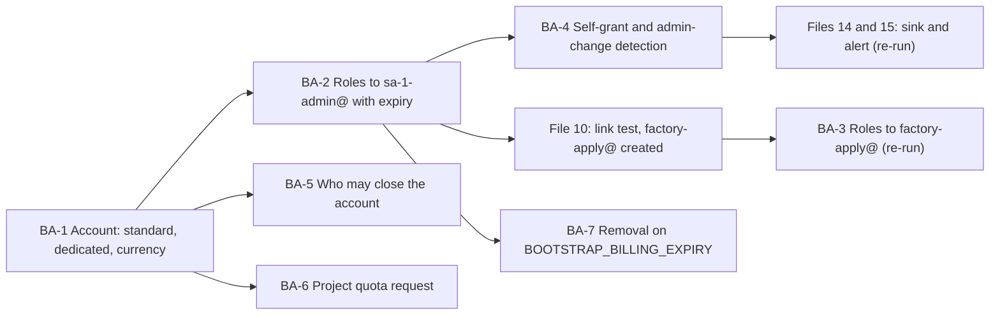

# 7. The platform billing account

## Status
- Owner: the platform owner
- Last reviewed: 2026-09-15
- Last executed: never
- Stage: review §2 stage 5, moved after file 06 (decision SD-45) so that the billing roles go to `sa-1-admin@`, never to a daily account.
- Step prefix: BA. Steps: 16. BLOCKED steps: none, because no code is needed. One step is PENDING by design: BA-3.1 waits for `factory-apply@` (file 10) and is a re-run point.
- Replaces: the billing rows of `wall-e/PREREQUISITES.md` §4.1 and the currency half of `wall-e/SETUP.md` Phase 6's budget command. This file applies decision SD-16 (P31's billing line).
- Closes: X-RQB-05 for its account, roles, currency, self-grant detection, closure record and quota halves; S023. The export half of X-RQB-05 is file 14's; the Terraform `billing_project` half is file 17's (see "Findings" at the end).

## What this part builds

One dedicated, standard Cloud Billing account that pays only for the platform's projects, whose identity, currency and closers are recorded; the two billing roles a hand-run factory module needs, granted on that account only, to `sa-1-admin@` with a recorded expiry and later to `factory-apply@`; a detection for the one way the platform owner could give himself more (an organisation-level billing role granted through Organization Administrator) and for any administrative change on the account; and a project-quota increase filed early enough that files 10 to 37 never stop on it. No project, budget or export is created here: the first project link is the linking test of file 10, the export is file 14, and every budget command follows the contract of §8.

What the old text got wrong, and must not come back:

| Old text | Why it fails | Here instead |
|---|---|---|
| `export BILLING="<billing-account>"` and "your organisation has an existing billing account ... Nothing here needs a purchase order" (SETUP §0.3, l.53) | Which account, and who administers it, was never named (X-RQB-05). On a shared account the export in `LOGGING_PROJECT` receives the organisation's whole Google Cloud spend, because the export covers every project the account pays for. | `BILLING_ACCOUNT_ID` names one dedicated account, checked for other linked projects in BA-1.2. `BILLING` is a retired name (plan §5). |
| "a dedicated EUR sub-account" (the finder's fix) | "Subaccounts are intended for resellers" and are paid by their parent (Cloud Billing concepts page, read 2026-09-15). | A standard account; BA-1.1 stops on a non-empty `masterBillingAccount`. |
| `--budget-amount=200EUR` with no currency check (SETUP l.687) | The amount's currency "must be the currency associated with the billing account" (gcloud `billing budgets create` reference, read 2026-09-15). A non-EUR account refuses it (S023). | BA-1.3 reads `currencyCode` and records `BILLING_CURRENCY`; §8 fixes the budget form. |
| "you (billing admin grants)" with no expiry, and the 403 quota-project claim of S023 | A bootstrap role with no end date stays. The 403 claim was refuted for a shell with a current project, but file 01 forbids a default project, so the current-project default is empty. | BA-2 records `BOOTSTRAP_BILLING_EXPIRY`; BA-7.1 removes the roles. §8 passes `--billing-project` on every budget call. |
| `./walle preflight` as the proof of the roles | The helper is used only under SD-37, and it tests two permissions and never the ones that must be absent. | BA-2.3 calls `testIamPermissions` for the two that must be present and the two that must be absent. |



## Preconditions

- [ ] File 06 is complete: `SA_1_ADMIN` is set, the account is in the admin OU with security-key 2SV, and the organisation-creation default Billing Account Creator for the whole domain has been removed (06).
- [ ] File 03 has signed SD-16 (P31's billing line): the account to use, `BILLING_ADMIN_EMAIL` (finance), and the expiry date of the bootstrap roles. `need` refuses to run BA-2 without it.
- [ ] File 03 has named `SECOND_HUMAN_EMAIL` (a recipient of the detection in BA-4) and created `PLATFORM_REPO_REMOTE` with branch protection (BA-4.1 commits to it).
- [ ] File 01's `~/.platform-env` holds `ORG_ID`, `BUILD_LOG_DIR`, `EVIDENCE_INTERIM_LOCATION`, `EVIDENCE_REGISTER`, `DEVIATION_REGISTER`, `OWNER_DAILY_ACCOUNT` and the helpers `penv_set`, `need` and `exists_or_pending`.
- [ ] File 04 has raised the billing-account purchase row, if the account did not already exist.
- [ ] The platform owner's shell uses file 01's gcloud configuration with no default project, signed in as `sa-1-admin@`.
- [ ] The billing administrator can sign in to the Google Cloud console with `BILLING_ADMIN_EMAIL` and holds Billing Account Administrator (`roles/billing.admin`) on the account.

## People

| Role | Does | Present at |
|---|---|---|
| Billing administrator (finance, `BILLING_ADMIN_EMAIL`) | Confirms the account, grants and removes the roles, runs the weekly interim check, signs the closers record | BA-1, BA-2.2, BA-3.1, BA-4.2, BA-4.3, BA-5.2, BA-7.1 |
| Platform owner (as `sa-1-admin@`) | Records the values, verifies each grant, reads the organisation side, files the quota request | every step |
| Second human | Receives the detection's output; reviews the detection pull request (CODEOWNERS of 03). Not a witness | BA-4.1, BA-4.3 |

No witness is needed: nothing here creates a credential or custody record. Separation rule checked in BA-2.1: the billing administrator is neither `SA_1_ADMIN`, `SA_2_ADMIN` nor `OWNER_DAILY_ACCOUNT`, and the platform owner never holds Billing Account Administrator.

Each step ends with a checkpoint line in the build log (file 01's resume rule): `<UTC timestamp> BA-x.y done <one-line result>`. A sitting that is cut resumes at the first step without one.

## 1. The account

### BA-1.1 Identify the account and confirm it is standard, open and owned by the organisation

- **WHO:** Billing administrator; the platform owner records.
- **WHERE:** Google Cloud console, **Billing > Manage billing accounts**, row of the account, **Show info panel**; then the platform owner's shell with `~/.platform-env` sourced. The billing administrator reads the id to the platform owner (an id is not a secret).
- **ACTION:** The billing administrator confirms the account named in SD-16 is listed under the organisation. The platform owner runs the read below. `sa-1-admin@` holds no billing role yet, so the billing administrator runs the `describe` from their own session if the platform owner's call returns permission denied, and sends the output.

```bash
need ORG_ID
BA_ID="<the account id from the SD-16 record, form XXXXXX-XXXXXX-XXXXXX>"
gcloud billing accounts describe "$BA_ID" --format="yaml(name,displayName,open,masterBillingAccount,parent,currencyCode)"
```

- **VERIFY:** All four hold, else stop:
  1. `open: true`.
  2. `masterBillingAccount` is absent or empty. A value means a reseller sub-account ("If this account is a subaccount, then this will be the resource name of the parent billing account", Cloud Billing API `BillingAccount` reference, read 2026-09-15).
  3. `parent: organizations/<ORG_ID>`. An account parented elsewhere does not inherit the organisation's IAM, so BA-5's closers record would be incomplete: stop and reopen SD-16.
  4. The display name matches SD-16's record.
  Then record the id:

```bash
penv_set BILLING_ACCOUNT_ID "$BA_ID"
```

- **ROLLBACK:** Nothing was changed. A wrong id is corrected with `penv_set --force BILLING_ACCOUNT_ID` and a build-log line, before BA-2.
- **EVIDENCE:** The YAML output as `<date>-BA-1.1-billing-account-describe-v1` in `EVIDENCE_INTERIM_LOCATION`; one line in `EVIDENCE_REGISTER`. TISAX 1.3.1 (asset inventory), 1.3.3 (approved external IT service). EU AI Act E-05 (infrastructure record in the Annex IV index).

### BA-1.2 Confirm the account is dedicated to the platform

- **WHO:** Billing administrator runs the list (Billing Account User alone lacks `billing.resourceAssociations.list`); the platform owner verifies.
- **WHERE:** Console **Billing > Account management > Account management** tab (linked projects), or the billing administrator's shell.
- **ACTION:**

```bash
gcloud billing projects list --billing-account="$BILLING_ACCOUNT_ID" --format="table(projectId,billingEnabled)"
```

- **VERIFY:** The list is empty (the platform's first link is file 10). If any project is listed, stop and choose one branch with a dated amendment to SD-16:
  - (a) finance provides a new dedicated account and BA-1.1 restarts; or
  - (b) a shared account is imposed: record it; file 14 then exposes the export only through an authorised view filtered on the platform's project labels, and Mo's cost pack never reads the raw export table (SD-16). `EVE_WITNESS_PROJECT` must never be on this account in either branch (SD-28; file 08).
- **ROLLBACK:** Nothing was changed.
- **EVIDENCE:** The list output as `<date>-BA-1.2-linked-projects-v1`; the amendment, if any, in `decisions/`. TISAX 1.3.1. EU AI Act E-05.

### BA-1.3 Read the currency and stop unless EUR

- **WHO:** Platform owner; the billing administrator confirms.
- **WHERE:** Shell with `~/.platform-env` sourced (or the billing administrator's session, as in BA-1.1).
- **ACTION:**

```bash
need BILLING_ACCOUNT_ID
BA_CUR="$(gcloud billing accounts describe "$BILLING_ACCOUNT_ID" --format='value(currencyCode)')"
printf '%s\n' "$BA_CUR"
```

- **VERIFY:** The printed value is a three-letter ISO 4217 code. If it is `EUR`, record it with `penv_set BILLING_CURRENCY EUR`. If it is empty, the field did not come back through gcloud: read it from the API with `curl -sS -H "Authorization: Bearer $(gcloud auth print-access-token)" "https://cloudbilling.googleapis.com/v1/billingAccounts/${BILLING_ACCOUNT_ID}"` and take `currencyCode`. If it is not `EUR`, **stop**: an account operates in one currency, and no self-serve option changes it after creation (Cloud Billing concepts and create-billing-account pages, read 2026-09-15). Then either finance provides an EUR account (BA-1.1 restarts), or SD-16 is amended and signed to accept the currency, and then:

```bash
penv_set BILLING_CURRENCY "$BA_CUR"
```

  The amendment converts every budget amount of 02 §2.2 (written in EUR) into that currency, with the rate and date recorded, because §8 never writes a currency suffix.
- **ROLLBACK:** `penv_set --force BILLING_CURRENCY` with a build-log line, only before the first budget exists (file 10).
- **EVIDENCE:** The value and, if needed, the signed amendment, as `<date>-BA-1.3-currency-v1`. TISAX 1.3.3. Closes S023's remaining half.

## 2. The bootstrap roles for `sa-1-admin@`

### BA-2.1 Record the expiry and check separation

- **WHO:** Platform owner.
- **WHERE:** Shell with `~/.platform-env` sourced; the signed SD-16 record.
- **ACTION:**

```bash
need SA_1_ADMIN SA_2_ADMIN OWNER_DAILY_ACCOUNT BILLING_ADMIN_EMAIL
penv_set BOOTSTRAP_BILLING_EXPIRY "<YYYY-MM-DD from the signed SD-16 record>"
```

- **VERIFY:** `BOOTSTRAP_BILLING_EXPIRY` is an absolute date after today and no later than the Tier W gate target in 03's tracker, since the factory supersedes hand runs by then (SD-01). `BILLING_ADMIN_EMAIL` differs from `SA_1_ADMIN`, `SA_2_ADMIN` and `OWNER_DAILY_ACCOUNT`. *Assumption:* SD-16 sets a date no more than 90 days out, re-signed by the billing administrator to extend; the procedure takes the signed value, whatever it is. Billing accounts take no dated IAM condition here (`gcloud billing accounts add-iam-policy-binding` documents no `--condition` flag, read 2026-09-15), so the expiry is enforced by BA-7.1 and not by Google.
- **ROLLBACK:** `penv_set --force` with a build-log line before BA-2.2.
- **EVIDENCE:** One line in `DEVIATION_REGISTER`: "billing roles to sa-1-admin@ on BILLING_ACCOUNT_ID, grantor billing administrator, expiry BOOTSTRAP_BILLING_EXPIRY, superseded by factory-apply@ (BA-3.1)". TISAX 4.1.3 (approval and revocation), 4.2.1.

### BA-2.2 Grant Billing Account User and Billing Account Costs Manager on the account only

- **WHO:** Billing administrator. The platform owner does not grant these to himself.
- **WHERE:** Console **Billing > Account management**, choose the account, **Permissions** panel in the Info panel, **Add principal**. Or the billing administrator's shell with `BILLING_ACCOUNT_ID` and `SA_1_ADMIN` exported by hand.
- **ACTION:** Console: principal `sa-1-admin@<DOMAIN>`; **Select a role** "Billing Account User"; **Add another role** "Billing Account Costs Manager"; **Save**. Shell equivalent:

```bash
gcloud billing accounts add-iam-policy-binding "$BILLING_ACCOUNT_ID" --member="user:${SA_1_ADMIN}" --role="roles/billing.user"
gcloud billing accounts add-iam-policy-binding "$BILLING_ACCOUNT_ID" --member="user:${SA_1_ADMIN}" --role="roles/billing.costsManager"
```

  Never at organisation level: a billing role there reaches every billing account the organisation owns, because billing accounts inherit the organisation's IAM (billing-access page, read 2026-09-15). Never Billing Account Administrator, and never Billing Account Viewer unless file 10's link test proves it is needed (see VERIFY).
- **VERIFY:** The billing administrator reads the policy back:

```bash
gcloud billing accounts get-iam-policy "$BILLING_ACCOUNT_ID" --flatten="bindings[].members" --format="table(bindings.role,bindings.members)"
```

  `user:sa-1-admin@...` appears exactly twice, under `roles/billing.user` and `roles/billing.costsManager`, and under no other role. The roles give `billing.resourceAssociations.create` (User) and `billing.budgets.create` plus `billing.accounts.get` (Costs Manager), per the IAM billing roles reference (read 2026-09-15). Google's linking page lists "Billing Account User + Billing Account Viewer". *Assumption:* Costs Manager's `billing.accounts.get` covers the Viewer half. File 10's link test settles it: if the link is refused on the billing side, the billing administrator adds `roles/billing.viewer` with a build-log line and an SD-16 note.
- **ROLLBACK:** `gcloud billing accounts remove-iam-policy-binding "$BILLING_ACCOUNT_ID" --member="user:${SA_1_ADMIN}" --role=<role>` for each role, or **Delete** on the principal in the Permissions panel.
- **EVIDENCE:** The policy table as `<date>-BA-2.2-billing-iam-after-grant-v1`. The grant itself is an Admin Activity entry in the account's audit log, which BA-4.2 uses as its seeded event. TISAX 4.1.3, 4.2.1.

### BA-2.3 Prove the permissions as `sa-1-admin@`, present and absent

- **WHO:** Platform owner.
- **WHERE:** Shell with `~/.platform-env` sourced, signed in as `sa-1-admin@`.
- **ACTION:**

```bash
need BILLING_ACCOUNT_ID
curl -sS -X POST -H "Authorization: Bearer $(gcloud auth print-access-token)" -H "Content-Type: application/json" -d '{"permissions":["billing.resourceAssociations.create","billing.budgets.create","billing.accounts.close","billing.accounts.setIamPolicy"]}' "https://cloudbilling.googleapis.com/v1/billingAccounts/${BILLING_ACCOUNT_ID}:testIamPermissions"
```

- **VERIFY:** The response lists exactly `billing.resourceAssociations.create` and `billing.budgets.create`. `billing.accounts.close` or `billing.accounts.setIamPolicy` in the response means the platform owner already holds more, directly or inherited: stop, run BA-5.1 to find the source, and have it removed before continuing. *Assumption:* the call needs no quota project. If it returns an error naming a quota or user project, repeat it in file 10 with `-H "x-goog-user-project: ${CICD_PROJECT}"` once that project exists, and record this step as re-run there.
- **ROLLBACK:** Read only.
- **EVIDENCE:** The response as `<date>-BA-2.3-testiampermissions-v1`. TISAX 4.2.1 (least privilege proven).

## 3. The factory identity (re-run point from file 10)

### BA-3.1 Grant the same two roles to `factory-apply@`

- **WHO:** Billing administrator grants; the platform owner checks existence first and verifies.
- **WHERE:** Platform owner's shell for the check; console **Billing > Account management > Permissions > Add principal** for the grant, as BA-2.2.
- **ACTION:** Run when file 10 has created `SA_FACTORY_APPLY` (file 10 lists this as its re-run of 07). Until then, `exists_or_pending` prints PENDING and appends the grant to the README re-run index.

```bash
need BILLING_ACCOUNT_ID
exists_or_pending "serviceAccount:${SA_FACTORY_APPLY}" "07/BA-3.1"
```

  If the principal exists, the billing administrator adds `serviceAccount:<SA_FACTORY_APPLY>` with the same two roles, or in their shell:

```bash
gcloud billing accounts add-iam-policy-binding "$BILLING_ACCOUNT_ID" --member="serviceAccount:${SA_FACTORY_APPLY}" --role="roles/billing.user"
gcloud billing accounts add-iam-policy-binding "$BILLING_ACCOUNT_ID" --member="serviceAccount:${SA_FACTORY_APPLY}" --role="roles/billing.costsManager"
```

- **VERIFY:** The `get-iam-policy` table of BA-2.2 shows `serviceAccount:factory-apply@<CICD_PROJECT>.iam.gserviceaccount.com` under exactly those two roles. This matches the routine identity's billing row of 02 §3.4; file 16's drift job asserts it from then on.
- **ROLLBACK:** `remove-iam-policy-binding` for each role, as BA-2.2.
- **EVIDENCE:** The table as `<date>-BA-3.1-billing-iam-factory-v1`; the PENDING line cleared from the re-run index. TISAX 4.2.1.

## 4. Detecting a self-grant and any administrative change on the account

The platform owner holds Organization Administrator under file 06's dated exception. That role has `resourcemanager.organizations.setIamPolicy` and no billing permission (IAM Resource Manager roles reference, read 2026-09-15), so he can grant himself Billing Account Administrator at organisation level, and the account inherits it. Security Admin (`roles/iam.securityAdmin`) also carries `billing.accounts.setIamPolicy`. Two sources record this:

| Source | What it records | Who can read it on the day | Where the alert is built |
|---|---|---|---|
| A. The organisation's Admin Activity log | `SetIamPolicy` on the organisation adding `roles/billing.*`, `roles/iam.securityAdmin`, or a custom role holding a billing permission (from BA-5.1) | Holders of Logs Viewer at organisation level, none in the platform yet | File 14's `S-org` carries it to `LOGGING_PROJECT`; file 15 part A builds the alert |
| B. The billing account's Admin Activity log `billingAccounts/<id>/logs/cloudaudit.googleapis.com%2Factivity` | Every `ADMIN_WRITE` method, including `SetIamPolicy`, `CloseBillingAccount` and the account updates (Cloud Billing audit-logging page, read 2026-09-15) | The billing administrator (Billing Account Administrator includes `logging.logEntries.list`) | An organisation sink does not include it, because `--include-children` covers only child projects and folders (gcloud `logging sinks create` reference). File 14 creates a billing-account sink; file 15 builds the alert |

No project exists before file 10, so no Cloud Monitoring alert can be created in this file. The detection is written and proven here. The weekly interim check covers the gap. Files 14 and 15 deploy it, with a back-dated search that starts at BA-2.2's date.

### BA-4.1 Commit the detection specification

- **WHO:** Platform owner writes; the second human reviews (CODEOWNERS, 03).
- **WHERE:** `PLATFORM_REPO_DIR`, branch `ba-billing-detection`, file `detections/billing-account-admin.yaml`.
- **ACTION:** Write the file with: rule id `SG-BILL-01` (to be merged into the SG family in 07-monitoring by file 15), severity 2 (1 if the actor is on `ROSTER_FILE`), recipients `BILLING_ADMIN_EMAIL` and `SECOND_HUMAN_EMAIL` (never the platform owner alone), and the two filters:

```text
# A: organisation-level grant of a billing-capable role
resource.type="organization"
protoPayload.methodName="SetIamPolicy"
protoPayload.serviceData.policyDelta.bindingDeltas.action="ADD"
(protoPayload.serviceData.policyDelta.bindingDeltas.role:"roles/billing." OR protoPayload.serviceData.policyDelta.bindingDeltas.role="roles/iam.securityAdmin")

# B: any administrative write on the platform billing account by anyone but the billing administrator
logName="billingAccounts/BILLING_ACCOUNT_ID/logs/cloudaudit.googleapis.com%2Factivity"
-protoPayload.authenticationInfo.principalEmail="BILLING_ADMIN_EMAIL"
```

```bash
git -C "$PLATFORM_REPO_DIR" switch -c ba-billing-detection
git -C "$PLATFORM_REPO_DIR" add detections/billing-account-admin.yaml
git -C "$PLATFORM_REPO_DIR" commit -m "detection: billing-role self-grant and billing-account admin writes (07 BA-4.1)"
git -C "$PLATFORM_REPO_DIR" push -u origin ba-billing-detection
```

  Open the pull request on the git host; merge after the two reviews.
- **VERIFY:** `git -C "$PLATFORM_REPO_DIR" log --oneline origin/main -- detections/billing-account-admin.yaml` shows the merge. The pull request records the second human's approval.
- **ROLLBACK:** A revert pull request under the same review.
- **EVIDENCE:** The merge commit id and pull request URL in the build log and `EVIDENCE_REGISTER`. TISAX 4.2.1, 5.2.1 (change management). Filter A's `policyDelta` fields follow the IAM audit-log structure. *Assumption:* the organisation resource carries them the same way. File 15 proves this on a seeded organisation-level grant of `roles/billing.viewer` to a test principal, removed at once.

### BA-4.2 Prove filter B on the grants just made

- **WHO:** Billing administrator; the platform owner verifies the output.
- **WHERE:** The billing administrator's shell, or console **Logging > Logs Explorer** with the billing account selected as scope.
- **ACTION:**

```bash
gcloud logging read "logName=\"billingAccounts/${BILLING_ACCOUNT_ID}/logs/cloudaudit.googleapis.com%2Factivity\" AND protoPayload.methodName=\"SetIamPolicy\"" --billing-account="$BILLING_ACCOUNT_ID" --freshness=7d --format="table(timestamp,protoPayload.authenticationInfo.principalEmail,protoPayload.methodName)"
```

- **VERIFY:** At least one `SetIamPolicy` row dated with BA-2.2, whose principal is `BILLING_ADMIN_EMAIL`. This proves the log exists and is readable. The same query with `-protoPayload.authenticationInfo.principalEmail="<BILLING_ADMIN_EMAIL>"` added returns no row. If the first query returns nothing, stop: without source B, BA-4.3 is blind.
- **ROLLBACK:** Read only.
- **EVIDENCE:** Both outputs as `<date>-BA-4.2-filter-b-proof-v1`. TISAX 5.2.4 (event logging), 4.2.1.

### BA-4.3 Run the interim check weekly until file 15's alert is live

- **WHO:** Billing administrator (source B); platform owner (source A, recorded as weak because he is its subject). The output goes to the second human.
- **WHERE:** As BA-4.2 for source B; the platform owner's shell for source A.
- **ACTION:** Each week from BA-2.2 until file 15 records the alert live:

```bash
gcloud logging read "logName=\"billingAccounts/${BILLING_ACCOUNT_ID}/logs/cloudaudit.googleapis.com%2Factivity\" AND -protoPayload.authenticationInfo.principalEmail=\"${BILLING_ADMIN_EMAIL}\"" --billing-account="$BILLING_ACCOUNT_ID" --freshness=8d --format="table(timestamp,protoPayload.authenticationInfo.principalEmail,protoPayload.methodName)"
```

```bash
gcloud organizations get-iam-policy "$ORG_ID" --flatten="bindings[].members" --filter="bindings.role:roles/billing. OR bindings.role=roles/iam.securityAdmin" --format="table(bindings.role,bindings.members)"
```

- **VERIFY:** Source B returns no row. Source A lists only the principals recorded in BA-5.1. Any difference is sent the same day to the billing administrator and the second human, who treat it as a report under SG-BILL-01. Accepted gap: a self-grant that is never used on the account shows only in source A, which the monitored person reads. It closes when file 15 runs filter A over the organisation log from BA-2.2's date. Owner of the gap: the second human. Due date: file 15 part A.
- **ROLLBACK:** Read only.
- **EVIDENCE:** One build-log line per week, `BA-4.3-<YYYY-Www>`, with both outputs attached, as `<date>-BA-4.3-weekly-v<n>`. Re-run index rows: "14: billing-account sink for source B" and "15 part A: SG-BILL-01 alert on A and B, back-dated from BA-2.2, recipients billing administrator and second human; then stop BA-4.3". TISAX 4.2.1 (review), 5.2.4.

## 5. Who may close the account

Only Billing Account Administrator holds `billing.accounts.close` among predefined roles (IAM billing roles reference, read 2026-09-15). Closing stops "all services ... in all projects that are paid for by that billing account" (close-or-reopen page, read 2026-09-15). That would silence the evidence pipeline before anything else, so the closers are a recorded list.

### BA-5.1 Inventory every direct, inherited and indirect closer

- **WHO:** Billing administrator (account side); platform owner (organisation side, which Organization Administrator can read).
- **WHERE:** Both shells.
- **ACTION:**

```bash
gcloud billing accounts get-iam-policy "$BILLING_ACCOUNT_ID" --flatten="bindings[].members" --filter="bindings.role=roles/billing.admin OR bindings.role:roles/billing.linkAdmin" --format="table(bindings.role,bindings.members)"
```

```bash
gcloud organizations get-iam-policy "$ORG_ID" --flatten="bindings[].members" --filter="bindings.role:roles/billing. OR bindings.role=roles/iam.securityAdmin OR bindings.role=roles/resourcemanager.organizationAdmin" --format="table(bindings.role,bindings.members)"
gcloud iam roles list --organization="$ORG_ID" --format="value(name)"
```

  For each custom role listed: `gcloud iam roles describe <ROLE_ID> --organization="$ORG_ID" --format="value(includedPermissions)"`. Note any role holding `billing.accounts.close`, `billing.accounts.setIamPolicy` or `billing.accounts.move`.
- **VERIFY:** A table with three columns: direct closers (Billing Account Administrator on the account, expected: finance only), inherited closers (`roles/billing.admin` at organisation level), and indirect paths (Organization Administrator, Security Admin, custom roles able to grant a closer role). No `domain:` or `allUsers` member holds any billing role, and `roles/billing.creator` has no `domain:` member (removed in 06). Neither `SA_1_ADMIN` nor `factory-apply@` is a direct or inherited closer.
- **ROLLBACK:** Read only. A finding (for example a daily account holding `roles/billing.admin`) is removed by its grantor under a dated change, not in this step.
- **EVIDENCE:** The table as `<date>-BA-5.1-closers-inventory-v1`. It is the baseline for BA-4.3's source A. TISAX 4.2.1, 5.3.3 (return and removal from external IT services).

### BA-5.2 Sign the closers record

- **WHO:** Billing administrator signs; the platform owner files it.
- **WHERE:** `decisions/<date>-platform-billing-account-closers.md` in the platform repository (append-only).
- **ACTION:** Record: who may close the account (named direct closers); who could become one (indirect paths from BA-5.1) and which detection covers each (SG-BILL-01; Sensitive Actions "Remove Billing Admin" at organisation level once file 09 has activated SCC); for an invoiced account, that closure goes through Google sales or billing support, and the named finance contacts who may ask (*tbd* until finance names them); the payments-profile administrators (*tbd*: *Assumption:* a payments-profile administrator can affect the account's standing, which finance confirms); and the rule that no platform principal ever holds Billing Account Administrator.
- **VERIFY:** The record merges with the billing administrator's and the second human's approvals, and every name in it matches BA-5.1's table.
- **ROLLBACK:** Supersede with a new dated record.
- **EVIDENCE:** The merge commit in `EVIDENCE_REGISTER`. TISAX 5.3.3, 4.2.1.

## 6. Project quota

Project quota is checked for the creating account and for the organisation. Soft-deleted projects count against it for 30 days. An increase for an organisation is requested on **IAM & Admin > Quotas & System Limits** against `cloudresourcemanager.googleapis.com/projects_count`. Google may ask for a payment and "typically" answers "within 2 business days" (Resource Manager "Create projects" page; project quota requests help page, both read 2026-09-15). Google documents no separate limit on the number of projects linked to one billing account (Cloud Billing quotas page, read 2026-09-15).

### BA-6.1 Count the projects the set creates in this organisation

- **WHO:** Platform owner.
- **WHERE:** Shell; the plan's variables table.
- **ACTION:** Fill the table below in the build log. The witness project (08) and the sandbox organisation's projects (21) are in other organisations and do not count here.

| Projects | Count | File |
|---|---|---|
| `CICD_PROJECT`, `CORE_PROJECT`, `LOGGING_PROJECT`, `KMS_PROJECT`, `VALIDATOR_PROJECT` | 5 | 10 |
| `CANARY_R_PROJECT` | 1 | 18 |
| `MO_PROJECT`, `MO_TWIN_PROJECT` (if P40 requires it) | 1-2 | 22 |
| `EVE_PROJECT`, `EVE_TWIN_PROJECT` | 2 | 23, 24 |
| `WALLE_PROJECT`, `WALLE_TWIN_PROJECT` | 2 | 31, 37 |
| Eve's advisor project and throwaway spike projects (18, 34) | *tbd* | 18, 34, 41 |
| Headroom for soft-deleted projects (30 days) and one rebuild | 5 | — |
| **Target** | **about 20** | |

- **VERIFY:** A total is written, and it is at least 18.
- **ROLLBACK:** None needed.
- **EVIDENCE:** The table in the build log under BA-6.1.

### BA-6.2 File the increase

- **WHO:** Platform owner. The request needs Quota Administrator (`roles/servicemanagement.quotaAdmin`, which carries `serviceusage.quotas.update` and `cloudquotas.quotas.update`; Cloud Quotas "View and manage quotas" page, read 2026-09-15). Organization Administrator does not include it. Preferred: the organisation's existing holder of that role files the request, named in the build log. Otherwise `SA_1_ADMIN` is granted it for this sitting only, as a dated addition to 06's exception in `DEVIATION_REGISTER`, and removed at the end of the step.
- **WHERE:** Console **IAM & Admin > Quotas & System Limits**, resource selector set to the organisation.
- **ACTION:** Filter **Metric** `cloudresourcemanager.googleapis.com/projects_count`; select **Cloud Resource Manager API**; **More actions > Edit quota**; in **Quota changes** enter the target from BA-6.1 above the current value and the description "Agentic platform: about 20 projects under fld-agentic-platform, paid by billing account BILLING_ACCOUNT_ID, 2026-09 to Tier W"; **Next**; contact details of the platform owner; **Submit request**. If the self-grant path was used:

```bash
gcloud organizations add-iam-policy-binding "$ORG_ID" --member="user:${SA_1_ADMIN}" --role="roles/servicemanagement.quotaAdmin" --condition=None
gcloud organizations remove-iam-policy-binding "$ORG_ID" --member="user:${SA_1_ADMIN}" --role="roles/servicemanagement.quotaAdmin" --condition=None
```

  (the first before the request, the second straight after it).
- **VERIFY:** Google's acknowledgement email arrives. The **Increase Requests** tab shows the request as pending. If the self-grant path was used, the organisation policy read of BA-4.3 no longer shows `roles/servicemanagement.quotaAdmin` for `SA_1_ADMIN`.
- **ROLLBACK:** **IRREVERSIBLE** as a submission. *Assumption:* the console offers no withdrawal. An unused increase costs nothing. Before submitting, confirm that the count in BA-6.1 is recorded. If Google asks for a payment, nothing is paid until finance approves it under file 04's purchase row, which gates this step.
- **EVIDENCE:** The acknowledgement email saved as `<date>-BA-6.2-quota-request-v1`; the deviation line if the self-grant path was used. TISAX 1.3.3.

### BA-6.3 Record the answer

- **WHO:** Platform owner.
- **WHERE:** Console **IAM & Admin > Quotas & System Limits > Increase Requests**; the approval email.
- **ACTION:** Wait for the decision (elapsed time, about two business days); record the approved value.
- **VERIFY:** The approved value is at least BA-6.1's total. File 10 does not wait for the answer: *Assumption:* its five core projects fit within the organisation's current quota, which the platform owner confirms on the **Quotas & System Limits** row before file 10 starts. If the answer is lower or a refusal, file 18 (the sixth project) waits for a new request with the refusal's reasons answered. Every file that creates a project records the remaining headroom in its build log, and a new request is filed before the headroom falls below 3.
- **ROLLBACK:** None.
- **EVIDENCE:** The decision email as `<date>-BA-6.3-quota-decision-v1`.

## 7. Removal at expiry

### BA-7.1 Remove the bootstrap roles

- **WHO:** Billing administrator; the platform owner verifies.
- **WHERE:** Console **Billing > Account management > Permissions**, **Filter** on `sa-1-admin@`, **Delete**; or the billing administrator's shell.
- **ACTION:** Run on `BOOTSTRAP_BILLING_EXPIRY`, or earlier when file 17 records that the factory's first empty plan supersedes the hand runs, whichever comes first. At BA-2.2 the billing administrator puts a calendar entry on that date (a reminder, not a control) and the platform owner adds it to the README re-run index.

```bash
gcloud billing accounts remove-iam-policy-binding "$BILLING_ACCOUNT_ID" --member="user:${SA_1_ADMIN}" --role="roles/billing.user"
gcloud billing accounts remove-iam-policy-binding "$BILLING_ACCOUNT_ID" --member="user:${SA_1_ADMIN}" --role="roles/billing.costsManager"
```

- **VERIFY:** BA-2.3's `testIamPermissions`, run as `sa-1-admin@`, returns `{}`. The `get-iam-policy` table no longer lists `sa-1-admin@`, and `factory-apply@` still holds both roles. A hand module run still pending at that date needs an extension first: SD-16 is amended, the new date is set with `penv_set --force BOOTSTRAP_BILLING_EXPIRY`, and a build-log line is written. The roles are never kept past a date nobody signed.
- **ROLLBACK:** Re-grant as BA-2.2, only under a signed extension.
- **EVIDENCE:** The table and response as `<date>-BA-7.1-bootstrap-billing-removed-v1`; `DEVIATION_REGISTER` line closed. TISAX 4.1.3 (revocation).

## 8. The contract every budget command follows (S023)

Budgets are created in file 10 (core projects) and by every module equivalent of file 17. No budget is created here. Each budget step in those files runs this check and this form. The API is `billingbudgets.googleapis.com`, enabled by file 10 in the project named as `--billing-project`. *Assumption:* that project is `CICD_PROJECT`; file 10 decides and records it.

```bash
need BILLING_ACCOUNT_ID BILLING_CURRENCY CICD_PROJECT
test "$(gcloud billing accounts describe "$BILLING_ACCOUNT_ID" --format='value(currencyCode)')" = "$BILLING_CURRENCY" || { echo "currency changed: stop"; false; }
gcloud billing budgets create --billing-account="$BILLING_ACCOUNT_ID" --display-name="<project-id>-budget" --budget-amount=<number, no currency suffix> --filter-projects="projects/<project-id>" --threshold-rule=percent=0.5 --threshold-rule=percent=0.9 --threshold-rule=percent=1.0 --threshold-rule=percent=1.0,basis=forecasted-spend --billing-project="$CICD_PROJECT"
```

Rules:
- The amount carries no currency. Without one, the budget uses the account's currency (gcloud reference, read 2026-09-15). The number is 02 §2.2's tier default, converted if BA-1.3 recorded a non-EUR currency.
- `--filter-projects` takes `projects/<project-id>`, never the number. A malformed filter scopes the budget to the whole account (salvaged from SETUP l.692).
- `--billing-project` is always passed. The S023 403 was refuted for a shell with a current project, because `billing/quota_project` "When unset, the default is [CURRENT_PROJECT]" (gcloud configurations topic, read 2026-09-15). File 01 forbids a current project, so the default is empty here.
- Terraform run with user credentials before WIF exists sets `billing_project` and `user_project_override` on the provider. That is file 17's step, for the same reason.

## Verification checklist for this part

- [ ] `BILLING_ACCOUNT_ID` set; `describe` shows `open: true`, no `masterBillingAccount`, `parent: organizations/<ORG_ID>` (BA-1.1).
- [ ] No project linked before file 10, or a signed shared-account amendment (BA-1.2).
- [ ] `BILLING_CURRENCY` set to `EUR`, or to another code under a signed SD-16 amendment with converted amounts (BA-1.3).
- [ ] `BOOTSTRAP_BILLING_EXPIRY` set from the signed record; deviation-register line written (BA-2.1).
- [ ] `sa-1-admin@` holds exactly Billing Account User and Billing Account Costs Manager on the account, nothing at organisation level, and `testIamPermissions` proves two present and two absent (BA-2.2, BA-2.3).
- [ ] BA-3.1 listed as PENDING in the README re-run index, or done after file 10.
- [ ] `detections/billing-account-admin.yaml` merged with the second human's review; filter B proven on BA-2.2's grant; weekly check scheduled; re-run rows for files 14 and 15 written (BA-4).
- [ ] Closers inventory and signed closers record merged (BA-5).
- [ ] Quota request filed with the count recorded; decision recorded, or pending with the expected date (BA-6).
- [ ] Removal date on the re-run index (BA-7.1).
- [ ] Every EVIDENCE record listed in `EVIDENCE_REGISTER`.

## What the next files need from this part

| File | Needs | Step |
|---|---|---|
| 09 | Nothing from here directly. SCC's organisation pay-as-you-go, if chosen under P11, bills the accounts of every project in the organisation, including this one | — |
| 10 | `BILLING_ACCOUNT_ID` for the linking test and every core-project link; `BILLING_CURRENCY` and §8 for budgets; BA-3.1 re-run once `SA_FACTORY_APPLY` exists; the BA-2.3 repeat with `x-goog-user-project` if needed; the quota headroom | BA-1.1, BA-1.3, BA-3.1, BA-6.3 |
| 14 | `BILLING_ACCOUNT_ID` and `BILLING_ADMIN_EMAIL` for the standard and detailed export to an EU dataset in `LOGGING_PROJECT` (made by the billing administrator); the billing-account sink for BA-4's source B; the label-filtered view if BA-1.2 took branch (b) | BA-1.2, BA-4.3 |
| 15 part A | `detections/billing-account-admin.yaml`; the back-dated search from BA-2.2's date; recipients billing administrator and second human; then stop BA-4.3 | BA-4.1, BA-4.3 |
| 16 | The billing bindings of `sa-1-admin@` (until expiry) and `factory-apply@`, for the drift job's expected set | BA-2.2, BA-3.1 |
| 17 | §8's budget contract; Terraform `billing_project` and `user_project_override`; the supersession date that triggers BA-7.1 | §8, BA-7.1 |
| 42 | The closers record, the weekly checks and the removal record, for the quarterly access review | BA-4.3, BA-5.2, BA-7.1 |

## Findings

| Id | Outcome here | Reason, and owner of the remainder |
|---|---|---|
| S023 | Closed | BA-1.3 reads and records the currency and stops unless EUR or a signed amendment; §8 drops the currency suffix and always passes `--billing-project`, because file 01 forbids a default project. |
| X-RQB-05 | Closed for this file's scope | A dedicated standard account, not a sub-account (BA-1.1, BA-1.2); roles on that account only, to `sa-1-admin@` with an expiry and to `factory-apply@` (BA-2, BA-3, BA-7); a detection of self-grants through Organization Administrator (BA-4); a quota request for about 20 projects filed early (BA-6); a record of who may close the account (BA-5). Remaining halves are assigned in plan §7: the named account and administrator are signed in file 03 (P31, SD-16); the standard and detailed export, the billing-account sink and the shared-account view belong to file 14 (owner: billing administrator for the export, platform owner for the rest); the alert policy is file 15 part A (owner: platform owner, with IT security); `billing_project` on Terraform is file 17 (owner: platform owner); the linking test is file 10. The per-billing-account quota claim was dropped as unsupported (review §5). |

## Sources

Read on 2026-09-15: [gcloud billing accounts describe](https://docs.cloud.google.com/sdk/gcloud/reference/billing/accounts/describe); [BillingAccount resource](https://docs.cloud.google.com/billing/docs/reference/rest/v1/billingAccounts); [gcloud billing accounts add-iam-policy-binding](https://docs.cloud.google.com/sdk/gcloud/reference/billing/accounts/add-iam-policy-binding); [get-iam-policy](https://docs.cloud.google.com/sdk/gcloud/reference/billing/accounts/get-iam-policy); [gcloud billing accounts list](https://docs.cloud.google.com/sdk/gcloud/reference/billing/accounts/list); [Cloud Billing access control](https://docs.cloud.google.com/billing/docs/how-to/billing-access); [IAM billing roles](https://docs.cloud.google.com/iam/docs/roles-permissions/billing); [IAM Resource Manager roles](https://docs.cloud.google.com/iam/docs/roles-permissions/resourcemanager); [Manage access to billing accounts](https://docs.cloud.google.com/billing/docs/how-to/grant-access-to-billing); [Close or reopen a billing account](https://docs.cloud.google.com/billing/docs/how-to/close-or-reopen-billing-account); [Cloud Billing concepts](https://docs.cloud.google.com/billing/docs/concepts); [Create a self-serve billing account](https://docs.cloud.google.com/billing/docs/how-to/create-billing-account); [Enable, disable or change billing for a project](https://docs.cloud.google.com/billing/docs/how-to/modify-project); [Cloud Billing audit logging](https://docs.cloud.google.com/billing/docs/audit-logging); [Cloud Billing quotas](https://docs.cloud.google.com/billing/quotas); [gcloud logging read](https://docs.cloud.google.com/sdk/gcloud/reference/logging/read); [gcloud logging sinks create](https://docs.cloud.google.com/sdk/gcloud/reference/logging/sinks/create); [Understanding audit logs](https://docs.cloud.google.com/logging/docs/audit/understanding-audit-logs); [Sensitive Actions overview](https://docs.cloud.google.com/security-command-center/docs/concepts-sensitive-actions-overview); [Create projects](https://docs.cloud.google.com/resource-manager/docs/creating-managing-projects); [Project quota requests](https://support.google.com/cloud/answer/6330231); [View and manage quotas](https://docs.cloud.google.com/docs/quotas/view-manage); [gcloud billing budgets create](https://docs.cloud.google.com/sdk/gcloud/reference/billing/budgets/create); [gcloud configurations](https://docs.cloud.google.com/sdk/gcloud/reference/topic/configurations).

## Related

- [README](README.md) (order, re-run index); [01 Prerequisites and conventions](01-prerequisites-and-conventions.md); [03 Decisions and people](03-decisions-and-people.md); [06 Organisation bootstrap](06-organisation-bootstrap-and-roster.md); [10 Core projects](10-core-projects-and-ci-identities.md); [14 Central logging and billing export](14-central-logging-and-billing-export.md); [15 Paging and detections](15-pager-siem-and-detections.md); [17 Factory module equivalents](17-factory-module-equivalents-and-tier-r-gate.md)
- Design: [02 Landing zone §3.4 and §3.7](../02-landing-zone-and-tiers.md); [07 Monitoring](../07-monitoring-detection-incident-response.md) (SG family); [11 TISAX](../11-tisax.md) §13; [10 EU AI Act](../10-eu-ai-act.md) §5; [12 Open decisions](../12-open-decisions.md) (P31, P39); [13 Setup procedure review](../13-setup-procedure-review.md) (X-RQB-05, S023)
- Superseded: [wall-e/PREREQUISITES.md](../../wall-e/PREREQUISITES.md) §4.1; [wall-e/SETUP.md](../../wall-e/SETUP.md) Phase 6 budget
